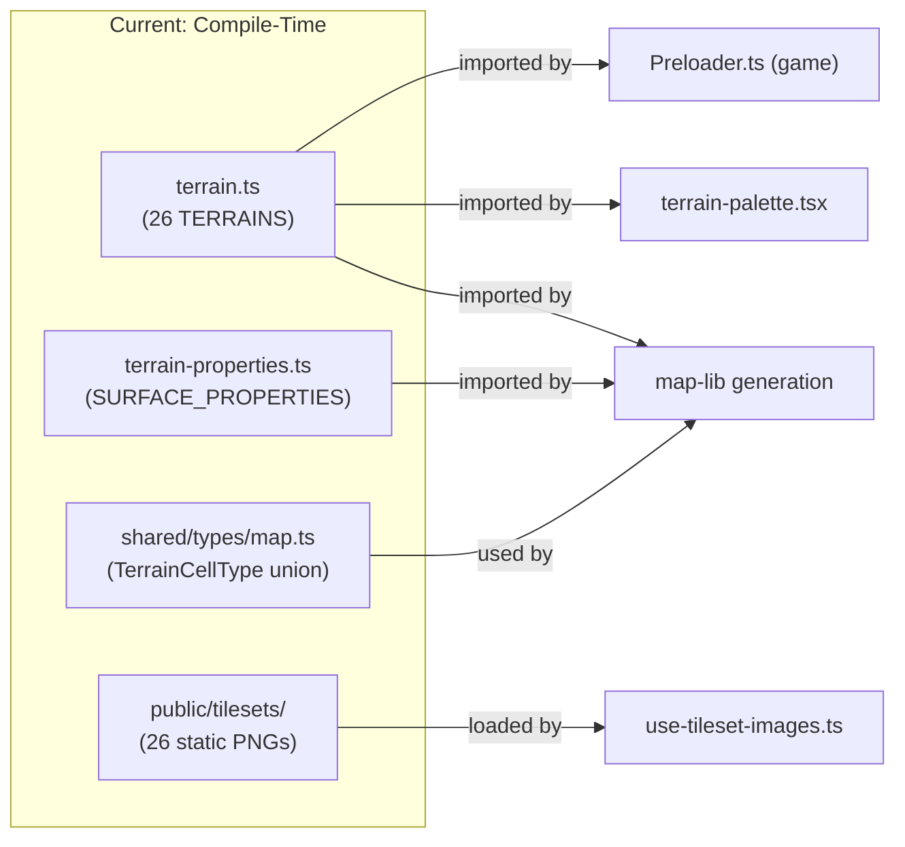
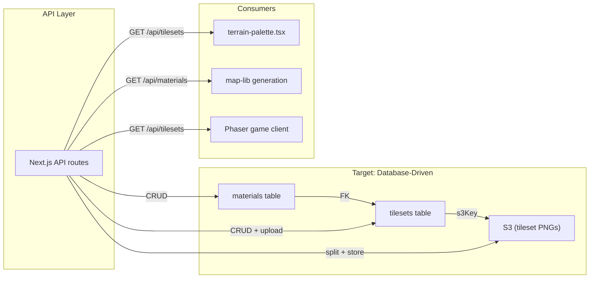

# ADR-0009: Tileset Management Architecture

## Status

Proposed

## Context

The Nookstead genmap map editor (`apps/genmap/`) uses a Blob-47 autotile engine that renders terrain transitions from 48-frame tileset spritesheets (12x4 grid of 16x16 tiles = 192x64 px per tileset). The system currently has three architectural limitations that block user-managed tileset workflows:

1. **Hardcoded terrain definitions**: All 26 terrain types are defined as compile-time constants in `packages/map-lib/src/core/terrain.ts`. The `TERRAINS` array, `TERRAIN_NAMES` list, `TILESETS` object, and `SURFACE_PROPERTIES` record in `terrain-properties.ts` are static TypeScript. Adding, removing, or reordering terrain types requires source code changes, a rebuild, and a redeployment. The `TerrainCellType` union in `packages/shared/src/types/map.ts` must also be manually updated.

2. **Implicit materials**: Material concepts (grass, water, sand, etc.) exist only as untyped strings in the `TilesetRelationship.from` and `.to` fields. There is no canonical list of materials, no surface properties (walkability, speed) associated with materials, and no referential integrity. A typo in a relationship string (e.g., `'gras'` instead of `'grass'`) silently creates an orphaned transition.

3. **No upload workflow for tileset images**: Tileset PNGs are committed to `apps/genmap/public/tilesets/` as static files. Artists produce multi-tileset images (multiple 192x64 tilesets stacked vertically) which must be manually split and renamed before committing. There is no server-side processing, no database record per tileset, and no connection between the tileset image and its material relationship metadata.

The genmap app already has S3 storage infrastructure (ADR-0007), PostgreSQL with Drizzle ORM (`packages/db/`), and an established pattern for asset management (sprites, atlas frames, game objects). The tileset system is the last major asset pipeline that remains file-based and hardcoded.

### Current Architecture



### Target Architecture



This ADR covers four interconnected decisions:

1. Full migration from hardcoded to database-driven tileset system
2. Materials as first-class database entities
3. Server-side splitting of multi-tileset upload images
4. Tileset-material relationship model

---

## Decision 1: Full Migration from Hardcoded to DB-Driven Tileset System

### Decision Details

| Item | Content |
|------|---------|
| **Decision** | Migrate all 26 terrain types from compile-time TypeScript constants to database rows. Remove `TERRAINS`, `TERRAIN_NAMES`, `TILESETS`, and `SURFACE_PROPERTIES` as static definitions. Create a seed migration that populates the database with equivalent records. |
| **Why now** | The tileset system is the last major hardcoded asset pipeline. Every other asset type (sprites, atlas frames, game objects, editor maps) is already database-driven. The upcoming user-managed tileset upload feature cannot function with compile-time definitions. |
| **Why this** | A single source of truth in the database eliminates the synchronization burden between TypeScript source, static files, shared type unions, and surface property records. It enables runtime CRUD without rebuilds, and aligns with the established pattern for all other genmap assets. |
| **Known unknowns** | Performance impact of database queries replacing in-memory constant lookups during map generation. At 26-100 tilesets, this is negligible (single query returns all rows), but must be verified under generation workloads. Whether existing saved maps that reference `terrain-XX` keys will need a migration or can use the same keys stored in the database. |
| **Kill criteria** | If database lookup latency measurably degrades map generation performance (>100ms for tileset resolution on a 64x64 map), introduce an application-level cache that loads all tilesets into memory at startup and invalidates on mutation. |

### Options Considered

1. **Keep hardcoded + DB additive hybrid**
   - Overview: Retain the 26 hardcoded terrains as immutable defaults. New user-uploaded tilesets go to the database. Map editor shows both sources merged.
   - Pros:
     - Zero migration risk for existing maps (hardcoded keys remain valid)
     - No seed migration needed
     - Compile-time type safety preserved for built-in terrains
   - Cons:
     - Two sources of truth: some tilesets in TypeScript, others in DB
     - Every query must merge static array with DB results
     - Cannot modify built-in tileset relationships or surface properties without code changes
     - `TerrainCellType` union remains a manually maintained string literal type
     - Palette UI must handle two data sources with different shapes
     - Inconsistent API: built-in tilesets have no ID, DB tilesets have UUIDs
   - Effort: 2 days

2. **Migrate with readonly fallback layer**
   - Overview: Move all tilesets to DB but keep a readonly TypeScript fallback that is used if the DB is empty or unreachable. Seed migration populates DB on first run.
   - Pros:
     - Graceful degradation if database is unavailable
     - Development workflow unchanged until DB is seeded
     - Safety net during migration period
   - Cons:
     - Two codepaths to maintain (DB path + fallback path)
     - Risk of fallback masking real DB issues (violates fail-fast principle per ai-development-guide)
     - Fallback data can drift from DB data over time
     - Developers may unknowingly use fallback without realizing DB is misconfigured
     - Testing burden doubles (must test both paths)
   - Effort: 3 days

3. **Full migration to database, no fallback (Selected)**
   - Overview: Move all tileset definitions to database. Create a seed migration that inserts all 26 tilesets with their material relationships. Remove hardcoded constants. `map-lib` exports functions that accept tileset data as parameters rather than importing static constants.
   - Pros:
     - Single source of truth -- database is the only authority
     - Clean fail-fast behavior: if DB is unavailable, the app fails explicitly
     - Consistent data model: all tilesets (built-in and user-created) have the same shape (UUID, FK to materials, S3 key)
     - `TerrainCellType` can be derived from DB material keys at build time or replaced with string
     - Enables full CRUD lifecycle for all tilesets without code changes
     - Seed migration provides reproducible initial state
   - Cons:
     - Breaking change: `TERRAINS`, `TILESETS`, `TERRAIN_NAMES` constants removed from `map-lib` exports
     - All consumers must be updated (terrain palette, Preloader, map generator, use-tileset-images)
     - Seed migration must be run before the app functions
     - Saved maps referencing `terrain-XX` keys must continue to resolve against DB records
   - Effort: 4 days

### Comparison

| Criterion | Hybrid (A) | Readonly Fallback (B) | Full Migration (C) |
|-----------|-----------|----------------------|-------------------|
| Sources of truth | Two (TS + DB) | One primary + fallback | One (DB only) |
| Migration risk | None | Low | Medium (breaking change) |
| Maintenance burden | High (merge logic) | Medium (two codepaths) | Low (single path) |
| CRUD for built-in tilesets | No | Yes | Yes |
| Fail-fast compliance | Partial | No (fallback masks errors) | Yes |
| Pattern consistency | Inconsistent | Mostly consistent | Fully consistent |
| User-managed tilesets | Partial (DB only) | Full | Full |
| Implementation effort | 2 days | 3 days | 4 days |

### Decision

**Full migration to database (Option C) selected.** The hybrid approach (A) creates a permanent architectural split between two tileset storage mechanisms, which increases complexity for every feature that touches tilesets. The readonly fallback (B) violates the fail-fast principle established in the ai-development-guide -- a silently degraded tileset system is worse than an explicit startup failure. Option C provides a clean, single-source-of-truth architecture that treats all tilesets uniformly.

The breaking change to `map-lib` exports is an intentional forcing function: it ensures all consumers are updated to use the database-driven API rather than leaving orphaned references to removed constants. Existing saved maps will continue to work because the seed migration preserves the same `terrain-XX` key format as the current hardcoded definitions.

**Migration Strategy:**

1. Create `materials` and `tilesets` tables (Decision 2)
2. Create a Drizzle seed migration that inserts all 26 tilesets with their material relationships, preserving the `terrain-XX` key format
3. Upload the 26 existing tileset PNGs to S3 via the seed script
4. Update `map-lib` to export functions that accept tileset data as parameters (dependency injection) rather than importing static constants
5. Update all consumers (terrain palette, Preloader, map generator, use-tileset-images) to fetch tileset data from the API
6. Remove `terrain.ts`, `terrain-properties.ts` static definitions after all consumers are migrated
7. Update `TerrainCellType` to be derived from material keys or replaced with a string type

---

## Decision 2: Materials as First-Class Database Entities

### Decision Details

| Item | Content |
|------|---------|
| **Decision** | Create a `materials` table with columns: `id` (UUID PK), `name` (unique, human-readable), `key` (unique slug), `color` (hex string for palette display), `walkable` (boolean), `speed_modifier` (float), `created_at`, `updated_at`. Surface properties currently in `SURFACE_PROPERTIES` migrate to material rows. |
| **Why now** | Materials are the semantic backbone of the tileset transition system. Every tileset represents a transition between two materials. Without a canonical materials table, material identity exists only as ad-hoc strings that cannot be validated, queried, or extended with properties. |
| **Why this** | A dedicated table provides referential integrity (tilesets FK to materials), enables a visual material palette in the editor (color + walkability preview), centralizes surface properties that are currently duplicated across `terrain-properties.ts` entries, and supports future gameplay features (material-based sound effects, particle systems). |
| **Known unknowns** | The exact number of unique materials. Current relationships use ~15 distinct strings (grass, water, deep_water, dirt, sand, light_sand, orange_sand, orange_grass, pale_sage, forest, lush_green, alpha, fenced, clay). Some may represent the same material at different granularities. The seed migration will establish the canonical set. |
| **Kill criteria** | If material granularity becomes contentious (e.g., is "orange_grass" a material or a tileset name?), revisit the material taxonomy. The key distinction: materials are what surfaces ARE (grass, water, stone), tilesets are what transitions LOOK LIKE (grass-to-water autotile sheet). |

### Options Considered

1. **Keep materials as implicit strings (status quo)**
   - Overview: Tilesets have `from_material` and `to_material` varchar columns with no FK constraint. No `materials` table.
   - Pros:
     - Zero migration effort for material data
     - Maximum flexibility (any string is valid)
     - No FK constraints to manage on tileset CRUD
   - Cons:
     - No referential integrity (typos create phantom materials)
     - Surface properties (walkable, speed) cannot be associated with materials in the database
     - No canonical material list for the palette UI
     - No color association for visual editor tooling
     - Deleting a "material" requires scanning all tileset relationships
   - Effort: 0 days

2. **Materials as enum type (pgEnum)**
   - Overview: Define a `materialEnum` PostgreSQL enum and use it for `from_material` and `to_material` on tilesets.
   - Pros:
     - Database-level validation of material values
     - Compact storage (enum integers)
     - Self-documenting schema
   - Cons:
     - Adding new materials requires a migration (`ALTER TYPE ... ADD VALUE`)
     - Cannot remove enum values without recreating the type (PostgreSQL limitation)
     - No existing pgEnum usage in the codebase (new pattern)
     - Cannot store per-material properties (color, walkable, speed) in an enum
     - Enum rigidity conflicts with user-managed materials
   - Effort: 1 day

3. **Materials as first-class table (Selected)**
   - Overview: Create a `materials` table with all surface properties. Tilesets reference materials via UUID foreign keys.
   - Pros:
     - Full referential integrity (tileset FK to material)
     - Per-material properties stored alongside identity (color, walkable, speed modifier)
     - Queryable: "show all walkable materials", "find materials with speed < 1.0"
     - Supports material palette UI with color swatches
     - Dependency checks on delete ("5 tilesets use this material")
     - Consistent with established relational patterns in `packages/db/`
   - Cons:
     - New table and migration
     - FK constraints require materials to exist before tilesets reference them
     - Seed migration order matters (materials first, then tilesets)
     - More complex tileset creation flow (must select or create material first)
   - Effort: 2 days

### Comparison

| Criterion | Implicit Strings (A) | pgEnum (B) | First-Class Table (C) |
|-----------|---------------------|-----------|----------------------|
| Referential integrity | None | Database-enforced values | Full FK enforcement |
| Per-material properties | Not possible in DB | Not possible in enum | Yes (columns on table) |
| Material palette UI | Requires hardcoded list | Requires enum introspection | Standard CRUD API |
| Adding new materials | Any string (no validation) | Migration required | INSERT (no migration) |
| Pattern consistency | Matches current (ad-hoc) | New pattern (no enums exist) | Matches existing tables |
| Deletion safety | Manual scan | Cannot remove enum values | FK constraint blocks unsafe delete |
| Surface properties storage | Separate config file | Separate config file | Same table as identity |
| Implementation effort | 0 days | 1 day | 2 days |

### Decision

**Materials as first-class table (Option C) selected.** Materials are a core domain concept in the tileset system -- they define what a surface IS (grass, water, stone) and carry gameplay-relevant properties (walkability, movement speed). Storing them as untyped strings (Option A) or database-constrained enums (Option B) fails to capture the full domain model. A dedicated table unifies material identity and surface properties in one location, replacing the current split between ad-hoc relationship strings in `terrain.ts` and the `SURFACE_PROPERTIES` record in `terrain-properties.ts`.

The key design principle: **materials are nouns (grass, water, stone), tilesets are verbs (the visual transition from grass to water)**. This separation enables material-level queries (all walkable surfaces), tileset-level queries (all transitions involving water), and a clean UI where the material palette shows colored swatches with walkability indicators.

**Schema:**

```
materials (
  id          UUID PK DEFAULT gen_random_uuid(),
  name        VARCHAR(100) NOT NULL UNIQUE,     -- "Grass", "Deep Water"
  key         VARCHAR(100) NOT NULL UNIQUE,     -- "grass", "deep_water"
  color       VARCHAR(7) NOT NULL,              -- "#4ade80" (hex for palette)
  walkable    BOOLEAN NOT NULL DEFAULT true,
  speed_modifier REAL NOT NULL DEFAULT 1.0,
  swim_required  BOOLEAN NOT NULL DEFAULT false,
  damaging       BOOLEAN NOT NULL DEFAULT false,
  created_at  TIMESTAMPTZ NOT NULL DEFAULT now(),
  updated_at  TIMESTAMPTZ NOT NULL DEFAULT now()
)
```

**Seed Materials (derived from current `SURFACE_PROPERTIES` unique entries):**

| Key | Name | Color | Walkable | Speed |
|-----|------|-------|----------|-------|
| grass | Grass | #4ade80 | true | 1.0 |
| water | Water | #3b82f6 | false | 0.5 |
| deep_water | Deep Water | #1e40af | false | 0.0 |
| dirt | Dirt | #a3825b | true | 0.9 |
| sand | Sand | #fbbf24 | true | 0.85 |
| light_sand | Light Sand | #fde68a | true | 0.9 |
| orange_sand | Orange Sand | #f59e0b | true | 0.85 |
| orange_grass | Orange Grass | #84cc16 | true | 0.9 |
| pale_sage | Pale Sage | #a7f3d0 | true | 0.9 |
| forest | Forest | #166534 | true | 0.8 |
| lush_green | Lush Green | #22c55e | true | 1.0 |
| clay | Clay | #c2956b | true | 0.85 |
| ice | Ice | #93c5fd | true | 0.6 |
| stone | Stone | #9ca3af | true | 1.0 |
| cobble | Cobble | #6b7280 | true | 1.0 |
| slate | Slate | #475569 | true | 1.0 |
| brick | Brick | #7c2d12 | true | 1.0 |
| steel | Steel | #d1d5db | true | 1.0 |
| asphalt | Asphalt | #374151 | true | 1.1 |
| alpha | Alpha | #00000000 | true | 1.0 |
| fenced | Fenced | #854d0e | false | 0.0 |

---

## Decision 3: Split Multi-Tileset Images on Upload

### Decision Details

| Item | Content |
|------|---------|
| **Decision** | When a user uploads a PNG containing multiple tilesets stacked vertically (height is a multiple of 64, width is 192), the server-side API route splits it into individual 192x64 images using `sharp`, uploads each as a separate S3 object, and creates a separate database record per tileset. |
| **Why now** | Artists produce tileset sheets with multiple transitions stacked vertically. The upload workflow must handle this format to avoid manual pre-processing. |
| **Why this** | Splitting on upload produces a 1:1 mapping between S3 objects and database records, which simplifies rendering (no offset math), enables individual tileset management (rename, reassign materials, delete), and maintains a consistent data model where every tileset row has exactly one S3 key pointing to exactly one 192x64 image. |
| **Known unknowns** | Whether `sharp` handles all edge cases in artist-produced PNGs (color profiles, transparency, bit depth). Sharp is already a dependency in the project (`package.json`) and handles PNG extraction reliably. |
| **Kill criteria** | If artists need to preserve the original multi-tileset image for reference (e.g., for re-editing in their art tool), add an option to store the original alongside the splits. This is a UX enhancement, not an architectural change. |

### Options Considered

1. **Store as single image with DB offsets**
   - Overview: Upload the entire multi-tileset image as one S3 object. Each tileset row in the database stores an `offsetY` value (0, 64, 128, ...) indicating where its 192x64 strip starts within the larger image.
   - Pros:
     - Fewer S3 objects (1 per upload instead of N)
     - Original image preserved as-is
     - No server-side image processing needed
     - Simple upload flow (one file, one S3 key)
   - Cons:
     - Every rendering operation requires offset math (`drawImage(img, 0, offsetY, 192, 64, ...)`)
     - Deleting one tileset from a multi-tileset image is impossible without re-splitting
     - S3 object is not self-contained (cannot be used without knowing the offset)
     - Client must load entire multi-tileset image even if only one tileset is needed
     - Moving a tileset to a different position in the stack invalidates all offsets
     - Data model couples multiple tilesets to a single S3 object lifecycle
   - Effort: 1 day

2. **Store both original + splits**
   - Overview: Upload the original multi-tileset image to S3 for archival. Also split into individual 192x64 images and upload each. Database records reference the individual splits.
   - Pros:
     - Original preserved for artist reference
     - Individual tilesets are self-contained S3 objects
     - Best of both worlds for management and archival
   - Cons:
     - Doubles S3 storage for every upload
     - Two S3 keys per tileset (original + split) adds complexity
     - Must track the relationship between original and splits
     - Original is not used by any runtime system (pure archival overhead)
     - Complicates deletion (must delete split AND update original reference)
   - Effort: 2 days

3. **Split on upload, discard original (Selected)**
   - Overview: Server receives the multi-tileset image, validates dimensions (192 wide, height multiple of 64), splits into N individual 192x64 PNGs using `sharp.extract()`, uploads each to S3 with a unique key, and creates N database records. The original multi-tileset image is not stored.
   - Pros:
     - Clean 1:1 mapping: one S3 object = one tileset = one database row
     - No offset math in any consumer (renderer, palette, Phaser)
     - Individual tileset lifecycle (rename, delete, reassign materials independently)
     - Consistent with existing sprite upload pattern (one S3 key per sprite row)
     - `sharp` is already a project dependency and handles PNG extraction efficiently
     - Minimal S3 storage (only the data that is actually used)
   - Cons:
     - Original multi-tileset image is discarded (not recoverable from S3)
     - Server must process image before storing (CPU cost during upload)
     - More S3 objects (N per upload instead of 1) -- negligible at expected scale
     - If the split produces an incorrect result (wrong dimensions), all N tilesets are wrong
   - Effort: 2 days

### Comparison

| Criterion | Single Image + Offsets (A) | Original + Splits (B) | Split Only (C) |
|-----------|--------------------------|----------------------|----------------|
| S3 objects per upload | 1 | N+1 | N |
| Rendering complexity | High (offset math) | Low (individual images) | Low (individual images) |
| Individual tileset management | Impossible | Full | Full |
| S3 storage efficiency | Best | Worst (2x) | Good |
| Server-side processing | None | Required (split) | Required (split) |
| Data model consistency | Coupled (multi:1 FK) | Complex (original + split refs) | Simple (1:1) |
| Original preservation | Yes (is the original) | Yes (archival copy) | No |
| Implementation effort | 1 day | 2 days | 2 days |

### Decision

**Split on upload, discard original (Option C) selected.** The 1:1 mapping between S3 objects and database records is the foundational simplification that makes all downstream operations clean. Rendering a tileset is a simple `drawImage(img, 0, 0, 192, 64)` with no offset calculation. Deleting a tileset removes one DB row and one S3 object. Reassigning a tileset's material relationship updates one row. This consistency is worth the trade-off of not preserving the original multi-tileset image, which is a source artifact that belongs in the artist's version control, not in the game's asset pipeline.

The server-side processing uses `sharp.extract({ left: 0, top: i * 64, width: 192, height: 64 })` for each strip, followed by `.png().toBuffer()` and upload to S3. At 192x64 pixels per strip, each extraction is sub-millisecond. An upload of 10 stacked tilesets (192x640) processes in under 100ms.

**Upload Flow:**

```
Client: POST /api/tilesets/upload
  Body: FormData { file: PNG, names: string[] (optional per-strip names) }

Server:
  1. Validate: width === 192, height % 64 === 0
  2. Count strips: N = height / 64
  3. For i in 0..N-1:
     a. sharp(buffer).extract({ left: 0, top: i * 64, width: 192, height: 64 }).png().toBuffer()
     b. Upload to S3: tilesets/{uuid}.png
     c. INSERT into tilesets table (name, s3Key, s3Url, fromMaterialId, toMaterialId)
  4. Return: array of created tileset records
```

---

## Decision 4: Tileset-Material Relationship Model

### Decision Details

| Item | Content |
|------|---------|
| **Decision** | The `tilesets` table has `from_material_id` and `to_material_id` UUID foreign key columns referencing `materials.id`, plus an optional `inverse_tileset_id` self-referencing UUID FK for bidirectional linking. Each tileset represents the visual transition from one material to another. |
| **Why now** | The transition relationship is the core semantic of the Blob-47 autotile system. Without it in the database, tileset-material associations exist only in code (`setRelationship()` calls in `terrain.ts`), and the map generator cannot resolve transitions dynamically. |
| **Why this** | Explicit FK columns enable a transition matrix view (which tileset handles grass-to-water?), material-based filtering (show all tilesets involving water), inverse tileset resolution (given grass-to-water, find water-to-grass), and integrity guarantees (cannot reference a non-existent material). |
| **Known unknowns** | Whether all tilesets have clear from/to material semantics. Some current tilesets (e.g., `clay_ground`, `ice_blue`) have no `relationship` set in the current code, meaning they function as standalone surface tilesets without transitions. These will have `from_material_id` set to their surface material and `to_material_id` set to NULL (self-tiles, no transition). |
| **Kill criteria** | If the from/to model proves insufficient for complex transitions (e.g., three-way blending), extend with a junction table. At current complexity (two-material transitions only), the FK pair is sufficient. |

### Options Considered

1. **Free-text material fields (no FK)**
   - Overview: `from_material` and `to_material` as varchar columns with no foreign key constraint. Material names are convention-based strings.
   - Pros:
     - Simple schema (no FK constraints)
     - Flexible (any string value accepted)
     - No dependency ordering (tilesets can be created before materials)
   - Cons:
     - No referential integrity (typos, orphaned references)
     - Cannot query "all tilesets for material X" reliably (string matching is fragile)
     - No connection between material properties and tileset relationships
     - Replicates the current problem (ad-hoc strings in `TilesetRelationship`)
   - Effort: 1 day

2. **Junction table (many-to-many materials-to-tilesets)**
   - Overview: A `tileset_materials` junction table with columns `tileset_id`, `material_id`, `role` ('from' | 'to'). Supports N materials per tileset.
   - Pros:
     - Supports future three-way or N-way transitions
     - Standard relational pattern for many-to-many
     - Role column makes relationship direction explicit
   - Cons:
     - Over-engineered for the current requirement (always exactly 2 materials per tileset)
     - Fetching a tileset with its materials requires a JOIN
     - Inserting a tileset requires 2-3 junction rows in a transaction
     - No existing junction table pattern in the asset pipeline
     - The autotile engine fundamentally works with binary transitions (from/to)
   - Effort: 3 days

3. **Direct FK columns with inverse self-reference (Selected)**
   - Overview: `from_material_id` (NOT NULL FK to materials), `to_material_id` (nullable FK to materials), and `inverse_tileset_id` (nullable self-referencing FK to tilesets). A tileset with `to_material_id = NULL` is a standalone surface (no transition).
   - Pros:
     - Direct mapping to the domain model (every tileset transitions FROM one material TO another)
     - No JOINs needed to resolve materials (single row contains both FK values)
     - Transition matrix query: `SELECT * FROM tilesets WHERE from_material_id = X AND to_material_id = Y`
     - Inverse lookup: `SELECT * FROM tilesets WHERE id = tileset.inverse_tileset_id`
     - NULL `to_material_id` cleanly handles standalone surface tilesets
     - Self-referencing FK for inverse pairs avoids a separate relationship table
   - Cons:
     - Limited to binary transitions (from/to) -- cannot model three-way blending
     - `inverse_tileset_id` creates a bidirectional relationship that must be maintained in sync (if A.inverse = B, then B.inverse must = A)
     - FK constraints require materials to be created before tilesets (ordering in seed migration)
   - Effort: 2 days

### Comparison

| Criterion | Free-Text (A) | Junction Table (B) | Direct FK + Inverse (C) |
|-----------|-------------|-------------------|------------------------|
| Referential integrity | None | Full (FK per junction row) | Full (FK per tileset row) |
| Query: tilesets for material X | String matching | JOIN on junction table | WHERE clause on FK column |
| Transition matrix | Not reliable | Possible with aggregation | Direct query |
| Inverse tileset resolution | Manual string lookup | Additional junction rows | Self-referencing FK |
| Read performance | Single row | Requires JOIN | Single row |
| N-way transitions | N/A (no structure) | Supported | Not supported (binary only) |
| Pattern consistency | Matches current (ad-hoc) | New pattern | Matches FK patterns (sprites, atlas_frames) |
| Implementation effort | 1 day | 3 days | 2 days |

### Decision

**Direct FK columns with inverse self-reference (Option C) selected.** The Blob-47 autotile engine is fundamentally a binary transition system: each tileset represents the visual boundary between exactly two materials. The from/to FK pair directly encodes this domain constraint. The junction table (Option B) would support N-way transitions that the autotile engine cannot render, adding complexity without value. Free-text strings (Option A) replicate the exact problem this ADR aims to solve.

The `inverse_tileset_id` self-reference enables efficient lookup of paired tilesets (e.g., given the grass-to-water tileset, find the water-to-grass tileset) without a separate relationship table. Bidirectional consistency (A.inverse = B implies B.inverse = A) is enforced at the application layer during create/update operations.

**Schema:**

```
tilesets (
  id                UUID PK DEFAULT gen_random_uuid(),
  name              VARCHAR(255) NOT NULL,
  key               VARCHAR(100) NOT NULL UNIQUE,      -- "terrain-01", or new user keys
  s3_key            TEXT NOT NULL UNIQUE,
  s3_url            TEXT NOT NULL,
  width             INTEGER NOT NULL DEFAULT 192,       -- always 192 for blob-47
  height            INTEGER NOT NULL DEFAULT 64,        -- always 64 for blob-47
  file_size         INTEGER NOT NULL,
  from_material_id  UUID NOT NULL REFERENCES materials(id),
  to_material_id    UUID REFERENCES materials(id),      -- NULL for standalone surfaces
  inverse_tileset_id UUID REFERENCES tilesets(id),      -- NULL if no inverse exists
  sort_order        INTEGER NOT NULL DEFAULT 0,         -- for palette display ordering
  created_at        TIMESTAMPTZ NOT NULL DEFAULT now(),
  updated_at        TIMESTAMPTZ NOT NULL DEFAULT now()
)
```

**Relationship Examples (from seed migration):**

| Key | Name | From Material | To Material | Inverse |
|-----|------|---------------|-------------|---------|
| terrain-01 | Dirt Light Grass | dirt | grass | NULL |
| terrain-03 | Water Grass | water | grass | terrain-15 |
| terrain-15 | Grass Water | grass | water | terrain-03 |
| terrain-18 | Ice Blue | ice | NULL | NULL |
| terrain-25 | Asphalt White Line | asphalt | NULL | NULL |

---

## Consequences

### Positive Consequences

- **Single source of truth**: All tileset and material data lives in the database. No more synchronization between TypeScript constants, static PNG files, shared type unions, and surface property records.
- **User-managed tilesets**: Artists can upload new tilesets, define materials, and configure transitions without developer intervention or code changes.
- **Clean data model**: 1:1 mapping between tilesets and S3 objects eliminates offset math and enables independent lifecycle management.
- **Transition matrix**: The `from_material_id` / `to_material_id` FK pair enables a grid view showing which transitions are covered and which are missing.
- **Material palette**: First-class materials with color and walkability enable a visual palette in the editor, replacing the current flat terrain list.
- **Referential integrity**: FK constraints prevent orphaned references between tilesets and materials.
- **Consistent asset pipeline**: Tilesets follow the same pattern as sprites, atlas frames, and game objects (UUID PK, S3 storage, Drizzle schema, CRUD service).

### Negative Consequences

- **Breaking change to map-lib**: Removing `TERRAINS`, `TERRAIN_NAMES`, `TILESETS`, and `SURFACE_PROPERTIES` constants breaks all current consumers. This is an intentional forcing function to ensure migration completeness, but requires coordinated updates across `apps/genmap/`, `apps/game/`, and `packages/map-lib/`.
- **Seed migration dependency**: The application will not function without a seeded database. Development setup gains a mandatory step (`drizzle-kit push` or `drizzle-kit migrate` + seed script).
- **Server-side image processing**: The upload flow requires `sharp` for image splitting, adding CPU load during upload. At expected upload frequency (a few times per session), this is negligible.
- **Bidirectional inverse maintenance**: The `inverse_tileset_id` self-reference must be kept in sync at the application layer. If A.inverse is set to B, B.inverse must be updated to A in the same transaction.
- **`TerrainCellType` migration**: The compile-time string union type must be replaced with a runtime-compatible approach (string type, or a generated union from DB values). This affects type safety in `packages/shared/`.

### Neutral Consequences

- **No new external dependencies**: `sharp` is already in the project. `@aws-sdk/client-s3` is already in the project. Drizzle ORM is already in the project.
- **Table isolation**: The `materials` and `tilesets` tables have no foreign keys to existing game tables (`users`, `maps`, `player_positions`). They only reference each other.
- **S3 bucket reuse**: Tileset images use the same S3 bucket as sprite images, with a `tilesets/` key prefix for namespace separation.

## Implementation Guidance

- Define `materials` and `tilesets` Drizzle ORM schema files in `packages/db/src/schema/` following the established pattern (one file per logical group, re-export from `schema/index.ts`)
- Use UUIDv4 auto-generated primary keys consistent with all existing tables
- Use timezone-aware timestamps with `defaultNow()` for all audit columns
- Create CRUD service functions in `packages/db/src/services/` following the `sprite.ts` pattern (dependency-injected `DrizzleClient` parameter)
- Implement material deletion with dependency checking: query `tilesets` for rows referencing the material before allowing delete
- Implement inverse tileset linking as a transactional operation: when setting A.inverse = B, also set B.inverse = A in the same transaction
- Use `sharp(buffer).extract({ left: 0, top: i * 64, width: 192, height: 64 }).png().toBuffer()` for multi-tileset splitting
- Upload split tileset images to S3 with key format `tilesets/{uuid}.png`
- Refactor `map-lib` exported functions to accept tileset/material data as parameters rather than importing static constants (dependency injection pattern)
- Preserve `terrain-XX` key format in the seed migration so existing saved maps continue to resolve
- Replace `SURFACE_PROPERTIES` lookups with material property queries (or cache all materials at application startup)
- The `TerrainCellType` union in `packages/shared/` should be widened to `string` for forward compatibility with user-created materials, or maintained as a generated type from seed data for compile-time safety during the transition period

## Related Information

- [ADR-0007: Sprite Management Storage and Schema](ADR-0007-sprite-management-storage-and-schema.md) -- Established the S3 storage pattern, presigned URL flow, JSONB schema conventions, and `getDb` adapter reuse that this ADR extends to tilesets
- [ADR-0008: Object Editor Collision Zones and Metadata](ADR-0008-object-editor-collision-zones-and-metadata.md) -- Most recent schema extension following the same Drizzle patterns
- Current terrain system: `packages/map-lib/src/core/terrain.ts` (26 hardcoded `TERRAINS`, `TILESETS` object, `TilesetRelationship` interface)
- Current surface properties: `packages/map-lib/src/core/terrain-properties.ts` (`SURFACE_PROPERTIES` record, `isWalkable()`, `getSurfaceProperties()`)
- Current tileset image loading: `apps/genmap/src/components/map-editor/use-tileset-images.ts` (hardcoded 26 static PNGs)
- Current terrain palette: `apps/genmap/src/components/map-editor/terrain-palette.tsx` (imports `TERRAINS`, `TILESETS` constants)
- Shared types: `packages/shared/src/types/map.ts` (`TerrainCellType` union, 26 string literals)
- DB schema directory: `packages/db/src/schema/` (all existing table definitions)
- DB service pattern: `packages/db/src/services/sprite.ts` (CRUD with `DrizzleClient` injection)
- S3 integration: `apps/genmap/src/lib/s3.ts` (existing upload, presign, delete functions)
- Autotile engine: `packages/map-lib/src/core/autotile.ts` (Blob-47 frame resolution, `FRAMES_PER_TERRAIN = 48`)

## References

- [Sharp Image Processing - extract() API](https://sharp.pixelplumbing.com/api-resize/) -- Official Sharp documentation for the `extract()` method used for image region cropping
- [How To Process Images in Node.js with Sharp (DigitalOcean)](https://www.digitalocean.com/community/tutorials/how-to-process-images-in-node-js-with-sharp) -- Tutorial covering Sharp's extraction and buffer processing patterns
- [Processing images with Sharp in Node.js (LogRocket)](https://blog.logrocket.com/processing-images-sharp-node-js/) -- Best practices for Sharp image processing in Node.js applications
- [PostgreSQL JSONB Documentation](https://www.postgresql.org/docs/current/datatype-json.html) -- Official JSONB type documentation
- [Drizzle ORM Documentation](https://orm.drizzle.team/docs/overview) -- ORM used for schema definitions and migrations
- [Tiled Map Editor](https://thorbjorn.itch.io/tiled) -- Industry-standard tile map editor, reference for tileset management patterns
- [Tiles and Tilemaps Overview (MDN)](https://developer.mozilla.org/en-US/docs/Games/Techniques/Tilemaps) -- MDN guide on tilemap concepts including autotile and terrain transitions

## Date

2026-02-20
