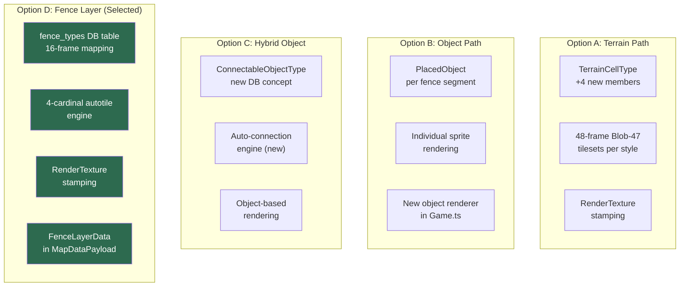

# ADR-0010: Fence System Architecture

## Status

Proposed

## Date

2026-02-21

## Context

The Nookstead map system needs fence support with auto-connecting segments, multiple visual styles, gate functionality, and rendering in both the GenMap editor (HTML Canvas) and the game client (Phaser.js 3). The decision concerns how fences should be implemented within the existing tile-based architecture.

### Requirements

- **4+ fence visual styles**: wooden, stone, iron, decorative, etc. -- each with distinct sprites
- **Auto-connection**: adjacent fence segments automatically select the correct sprite variant based on neighbors
- **Fence tool in GenMap editor**: rectangle perimeter drawing, single-segment placement, gate placement
- **Dual rendering**: must work in GenMap (HTML Canvas via `canvas-renderer.ts`) and game client (Phaser via `Game.ts`)
- **Collision**: fence segments are non-walkable barriers
- **Gates**: openable gaps in fence runs that can be toggled between walkable/non-walkable
- **Network sync**: fence data must be included in `MapDataPayload` for Colyseus multiplayer

### Constraints

- 16x16 tile grid on all maps
- Maps can be 60x60+ tiles (3600+ cells), meaning potentially hundreds of fence segments
- User has fence sprites uploaded as atlas frames in the `atlasFrames` DB table, **not** as pre-assembled 48-frame Blob-47 autotile tilesets
- ADR-0009 established the direction toward database-driven tileset management, deprecating hardcoded terrain constants
- The game client (`Game.ts`) currently renders **only** terrain layers via `RenderTexture` stamping -- it has no object rendering system

### Existing Systems

Three existing systems are candidates for fence implementation:

**1. Terrain autotile system** (`packages/map-lib/src/core/autotile.ts`, `terrain.ts`, `terrain-properties.ts`):
- Blob-47 autotile engine with 8-neighbor bitmask and diagonal gating
- Each terrain requires a 48-frame tileset (12x4 grid of 16x16 tiles, 192x64 PNG)
- `alpha_props_fence` (terrain-17) already exists as a single fence terrain type
- `TerrainCellType` union in `packages/shared/src/types/map.ts` currently has 29 members
- Surface properties (`SURFACE_PROPERTIES`) define walkability per terrain
- Rendering uses RenderTexture stamping in `Game.ts` -- highly performant
- `MapDataPayload` already transmits terrain `layers` array over WebSocket

**2. Game objects system** (`packages/db/src/schema/game-objects.ts`, `atlas-frames.ts`):
- `gameObjects` table has `layers` (GameObjectLayer[]), `collisionZones` (CollisionZone[]), `tags`, `metadata`
- `atlasFrames` table stores individual frame coordinates within sprite atlas images
- `PlacedObject` type and `ObjectLayer` exist in the GenMap editor type system
- `canvas-renderer.ts` already renders objects from `ObjectRenderEntry` data in the editor
- Game.ts does **not** render game objects -- only terrain layers
- `MapDataPayload` does **not** include object placement data
- No auto-connection logic exists for objects

**3. Database-driven tileset system** (ADR-0009, `packages/db/src/schema/tilesets.ts`):
- `tilesets` table with `from_material_id`/`to_material_id` FK relationships
- `materials` table with walkability, speed modifier, and other surface properties
- S3 storage for tileset PNGs with split-on-upload workflow
- This system manages terrain-to-terrain transitions (Blob-47), not connectable structures

### Key Technical Insight

Fences are fundamentally simpler than terrain autotiling. Terrain transitions use 8-neighbor Blob-47 (diagonal gating produces 47 valid configurations from 256 possible bitmasks, requiring 48-frame tilesets). Fences only connect along 4 cardinal directions (N/E/S/W), producing 2^4 = 16 possible configurations. Using the full Blob-47 system for fences wastes 32 frames per style and forces asset creation for diagonal configurations that fences do not use.

### Architecture Decision Diagram

---

## Decision

### Decision Details

| Item | Content |
|------|---------|
| **Decision** | Implement fences as a dedicated fence layer system with a 4-cardinal autotile engine, DB-driven fence type definitions, and RenderTexture-based rendering. |
| **Why now** | Fences are a core gameplay feature for the farming/homestead system. The existing `alpha_props_fence` terrain type demonstrates demand but is limited to a single style with no gate support. Building the right architecture now avoids costly migration from an ill-fitting approach later. |
| **Why this** | The 4-cardinal autotile approach is right-sized for fence connectivity (16 frames vs 47), uses the performant RenderTexture rendering path, aligns with ADR-0009's DB-driven direction, and naturally supports gates. The alternative approaches either overfit (Blob-47 for a 4-directional problem), underperform (individual object sprites for hundreds of segments), or mismatch the user's asset format (requiring pre-assembled 48-frame tilesets from atlas frames). |
| **Known unknowns** | Whether 4-cardinal connectivity (16 frames) is sufficient for all desired fence aesthetics, or whether some styles will need 8-neighbor awareness for diagonal corner pieces. The 4-cardinal engine can be extended to 8-neighbor (47 frames) per fence type if needed, without changing the architecture. |
| **Kill criteria** | If more than 50% of fence styles require diagonal-aware rendering (8-neighbor), the 4-cardinal engine provides insufficient visual quality and a migration to full Blob-47 per fence type should be considered. |

---

## Rationale

### Options Considered

#### Option A: Terrain-Based Fences (Blob-47 Autotiling)

Extend the existing terrain autotile system by adding new `TerrainCellType` members for each fence style and creating 48-frame Blob-47 tileset PNGs for each.

- **Pros:**
  - Zero new connection logic -- reuses proven `getFrame(neighbors)` engine from `autotile.ts`
  - RenderTexture stamping in `Game.ts` is highly performant (single draw call per layer)
  - `MapDataPayload` already transmits terrain layers, no protocol changes needed
  - GenMap editor already handles terrain layers with full brush/fill/rectangle tools
  - Collision via `SURFACE_PROPERTIES` (`walkable: false`) works immediately
  - Existing `alpha_props_fence` (terrain-17) proves the pattern works
- **Cons:**
  - **Asset mismatch**: user has atlas frames, not pre-assembled 48-frame tilesets. Each style requires manual assembly or a generation tool to produce 192x64 PNGs with correct frame ordering
  - **Blob-47 is overkill**: fences need 16 configurations (4-cardinal), not 47 (8-neighbor). 32 frames per style are wasted on diagonal configurations fences do not use
  - **TerrainCellType bloat**: adding 4+ styles grows the union from 29 to 33+ members, affecting `packages/shared/src/types/map.ts`, `terrain-properties.ts`, `terrain.ts`, seed data, and every consumer of these types across 3+ packages (6+ file locations per new style)
  - **Conflicts with ADR-0009**: ADR-0009 deprecated `TERRAIN_NAMES`, `TERRAINS`, and `SURFACE_PROPERTIES` as hardcoded constants, moving toward DB-driven tilesets. Adding more hardcoded terrain types moves in the opposite direction
  - **No gate support**: terrain is binary (present/absent in a cell). There is no mechanism for a "partially open" terrain cell. Gates would require a separate system layered on top
  - **Semantic mismatch**: fences are placed structures, not terrain surfaces. Encoding them as terrain conflates two distinct domain concepts
- **Effort:** 3 days (low new code, but significant asset preparation and cross-package type changes)

#### Option B: Game-Object-Based Fences (Composite Objects)

Use the existing `gameObjects` and `atlasFrames` tables to represent each fence segment as an individually placed game object, with a new auto-connection system built on top.

- **Pros:**
  - Uses existing DB infrastructure (`gameObjects`, `atlasFrames`, `PlacedObject`, `ObjectLayer`)
  - Atlas frames already in DB -- matches user's asset situation exactly
  - Semantic fit: fences ARE game objects (placed structures with collision zones)
  - `objectType`/`category`/`tags` columns on `gameObjects` support multiple fence styles as data entries
  - GenMap editor already has `object-place` tool and object layer rendering in `canvas-renderer.ts`
  - Collision zones (`CollisionZone[]`) already supported per game object
- **Cons:**
  - **Game.ts cannot render objects**: the game client renders only terrain layers via RenderTexture. Adding an object rendering system is a significant new feature (estimated 3 days standalone)
  - **MapDataPayload gap**: network protocol does not include object placement data. Must design and implement object serialization, transmission, and client-side deserialization
  - **No auto-connection logic**: connection detection and frame selection must be built from scratch
  - **Performance at scale**: a 60x60 map with a fence perimeter has ~236 fence segments. Each is an individual `PlacedObject` with separate sprite draws. Thousands of draw calls per frame degrade performance compared to RenderTexture stamping
  - **Data volume**: each `PlacedObject` carries `id`, `objectId`, `objectName`, `gridX`, `gridY`, `rotation`, `flipX`, `flipY` -- significant overhead for what is conceptually a grid cell flag
  - **Rectangle perimeter tool**: does not exist for objects, must be built
- **Effort:** 8 days (new rendering system, network extension, auto-connection engine, editor tools)

#### Option C: Hybrid Connectable Object System

Introduce a new "connectable object" concept -- game objects that automatically connect to adjacent same-type objects, with a custom connection engine.

- **Pros:**
  - Clean domain model: `ConnectableObjectType` is a first-class concept with explicit connection rules
  - Uses atlas frames (matches user's assets)
  - Connection engine can be designed for 4-cardinal from the start (16 configurations)
  - Natural gate support (gate = connectable object with `walkable: true`)
  - Data-driven: new fence styles are DB entries, not code changes
  - Future extensibility: walls, hedges, paths, pipes, and other connectable structures can reuse the same engine
- **Cons:**
  - **Most new code**: requires new connection engine, new DB table(s), new rendering path, new editor tools, new network protocol
  - **Performance question**: if rendering uses individual object sprites (same as Option B), large maps suffer the same draw-call overhead
  - **Complexity**: introduces a third entity type (alongside terrain and objects) that requires its own lifecycle, storage, rendering, and editing semantics
  - **Object-per-segment overhead**: same as Option B if fence segments are stored as individual placed objects
- **Effort:** 10 days (full new system from scratch)

#### Option D: Dedicated Fence Layer with 4-Cardinal Autotile (Selected)

Create a dedicated fence layer system that combines the layer-based RenderTexture rendering architecture from terrain (Option A), the DB-driven data model from objects (Option B), and the right-sized 4-cardinal connection engine from the hybrid concept (Option C).

- **Pros:**
  - **Right-sized autotile**: 4-cardinal bitmask engine (16 configurations) matches fence connectivity exactly. No wasted diagonal frames
  - **RenderTexture performance**: fence layers render via the same stamping approach as terrain layers, providing excellent performance on large maps (single draw call per layer, not per segment)
  - **DB-driven types**: fence type definitions stored in the database with atlas frame mappings, aligned with ADR-0009's direction toward DB-driven asset management
  - **Atlas frame compatible**: fence types map their 16 connection states directly to atlas frame IDs, matching the user's existing asset format
  - **Gate support**: gates are fence cells marked as walkable, with their own connection frames (e.g., open gate sprite). Gate types share visual style with their fence type but differ in walkability
  - **Compact network format**: `MapDataPayload` gains a `fenceLayers` field containing grid-based frame arrays (same shape as terrain `SerializedLayer`), not individual object positions
  - **Extensible**: the 4-cardinal engine and fence layer concept can be reused for walls, hedges, and other connectable structures without modifying terrain or object systems
  - **Clean domain separation**: fences are neither terrain (surfaces) nor objects (placed composites). They are connectable grid structures -- a distinct concept that deserves its own layer type
- **Cons:**
  - **New autotile engine**: a 4-cardinal connection engine must be built (but it is simpler than the existing Blob-47 engine -- 16 entries vs 47, no diagonal gating)
  - **New rendering path**: `Game.ts` needs fence layer rendering (but it uses the same RenderTexture stamping pattern as terrain, reducing implementation complexity)
  - **New editor tool**: GenMap needs a fence tool with rectangle-perimeter, single-segment, and gate modes (new UI/UX work)
  - **New layer concept**: fence layers are a third layer type alongside tile layers and object layers in the editor state model
  - **Virtual tileset generation**: 16-frame tilesets must be composed from atlas frames at load time (or pre-generated and cached)
- **Effort:** 6 days

### Comparison

| Criterion | A: Terrain (Blob-47) | B: Game Objects | C: Hybrid Connectable | D: Fence Layer (Selected) |
|-----------|---------------------|-----------------|----------------------|--------------------------|
| Asset compatibility | Low (needs 48-frame tilesets) | High (uses atlas frames) | High (uses atlas frames) | High (maps atlas frames to 16 states) |
| Rendering performance | Excellent (RenderTexture) | Poor (per-segment draws) | Poor-Medium (per-segment draws) | Excellent (RenderTexture) |
| ADR-0009 alignment | Conflicts (adds hardcoded terrain) | Aligned (DB-driven) | Aligned (DB-driven) | Strongly aligned (DB-driven) |
| Gate support | None (terrain is binary) | Possible (complex state) | Natural (walkable connectable) | Natural (walkable fence cell) |
| Connection complexity | 47 configs (overkill) | N/A (must build from scratch) | 16 configs (right-sized) | 16 configs (right-sized) |
| Network overhead | None (existing layers) | High (per-object positions) | High (per-object positions) | Low (grid-based frames) |
| New code required | Low | High | Very High | Medium |
| Semantic correctness | Poor (fences are not terrain) | Good (fences are objects) | Good (connectable objects) | Best (dedicated fence concept) |
| Future extensibility | Low (terrain-only) | Medium (object system) | High (generic connectable) | High (connectable grid layer) |
| TerrainCellType impact | +4 members, 6+ locations | None | None | None |
| Implementation effort | 3 days | 8 days | 10 days | 6 days |

---

## Consequences

### Positive Consequences

- **Performance parity with terrain**: fence layers use the same RenderTexture stamping approach as terrain layers, maintaining smooth rendering on large maps with hundreds of fence segments
- **Data-driven fence styles**: adding a new fence style requires a database entry (fence type with atlas frame mappings) and the corresponding sprite frames -- no code changes, no TerrainCellType expansion, no tileset assembly
- **Right-sized connection logic**: the 4-cardinal autotile engine (16 configurations) is simpler to implement, test, and debug than the existing Blob-47 engine (47 configurations), and it matches fence connectivity semantics exactly
- **Gate support built in**: gates are a natural concept in the fence layer system (walkable fence cells with their own connection frames), not a workaround layered on an incompatible system
- **Clean separation of concerns**: terrain defines surfaces, objects define placed composites, fence layers define connectable grid structures. Each concept has its own storage, rendering, and editing semantics
- **Network efficiency**: fence data transmits as compact grid-based frame arrays (same shape as terrain layers), not as arrays of individual object positions with per-object metadata
- **ADR-0009 alignment**: fence types are DB-driven and atlas-frame-based, continuing the migration away from hardcoded type constants

### Negative Consequences

- **New autotile variant**: a 4-cardinal connection engine must be built alongside the existing 8-neighbor Blob-47 engine. There is some conceptual overlap, but the implementations are distinct (no diagonal gating, 16 frames vs 47)
- **Third layer type in editor**: the GenMap editor state model (`MapEditorState`) gains a new layer concept alongside tile layers and object layers. The reducer, canvas renderer, and layer panel must handle this third type
- **Game.ts rendering extension**: the game client must be extended to render fence layers in addition to terrain layers. While the rendering approach is identical (RenderTexture stamping), the fence layer data must be parsed, textures loaded, and frames drawn
- **Virtual tileset generation**: fence type frame mappings reference individual atlas frames. At runtime, these must be composited into a tileset texture (4x4 grid of 16x16 frames = 64x64 PNG) for efficient RenderTexture stamping, adding a texture generation step to the loading pipeline
- **Migration of existing fences**: the current `alpha_props_fence` terrain type (terrain-17) must be either kept as a legacy terrain or migrated to the new fence layer system. Existing maps using this terrain need a migration path

### Neutral Consequences

- **No changes to terrain system**: the Blob-47 autotile engine, `TerrainCellType`, `SURFACE_PROPERTIES`, and terrain rendering remain untouched
- **No changes to game objects system**: the `gameObjects` table, `PlacedObject` type, and object rendering in the editor remain untouched
- **Phaser texture approach**: Phaser supports `textures.createCanvas()` and `textures.addCanvas()` for dynamic texture generation, which is the mechanism for building fence tilesets from atlas frames at runtime. This is an existing Phaser capability, not a custom extension

---

## Implementation Guidance

### Data Model Principles

- Define `fence_types` as a database table following the established schema pattern (`packages/db/src/schema/`), with UUID primary keys and timezone-aware timestamps
- Store the 16-state frame mapping as a JSONB column mapping bitmask values (0-15) to atlas frame identifiers
- Use foreign key references to the `atlasFrames` table for frame resolution
- Include `walkable` boolean and `category`/`style` fields on fence types for filtering and grouping

### Connection Engine Principles

- Build the 4-cardinal autotile engine as a pure function: `getFenceFrame(neighbors: number): number` where neighbors is a 4-bit cardinal bitmask (N=1, E=2, S=4, W=8)
- Use a static 16-entry lookup table (0-15 bitmask to frame index), analogous to the Blob-47 `FRAME_TABLE` but without diagonal gating
- Place the connection engine in `packages/map-lib/` alongside the existing autotile engine, allowing shared use by both GenMap editor and game client
- Gate connection logic: gates connect to adjacent fences of the same type but produce a different frame set (open gate sprites)

### Rendering Principles

- Fence layers render via RenderTexture stamping in the game client, using the same pattern as terrain layers in `Game.ts`
- Virtual tileset textures (64x80 PNG, 4x5 grid of 16x16 frames -- 16 connection states + 4 gate frames) are composed from atlas frames at load time using Phaser's dynamic texture API or HTML Canvas in the editor
- Fence layers are drawn above terrain layers but below player/NPC sprites in the rendering order

### Network Principles

- Extend `MapDataPayload` with an optional `fenceLayers` field containing serialized fence layer data
- Fence layer serialization follows the same `{ name, fenceTypeKey, frames }` pattern as `SerializedLayer` for terrain
- Backward compatible: clients that do not understand fence layers can safely ignore the field

### Editor Principles

- Add a `fence` tool type to the GenMap editor's `EditorTool` union
- Implement rectangle-perimeter mode (draw fences along the perimeter of a dragged rectangle) as the primary placement mode
- Support single-segment placement and eraser modes
- Gate placement as a modifier or sub-tool that marks individual fence cells as walkable

### Extensibility Principles

- Design the 4-cardinal engine and fence layer format to accommodate future connectable structure types (walls, hedges, paths) without architectural changes
- If a fence style requires 8-neighbor awareness (diagonal corners), the frame mapping JSONB can store up to 47 entries per type -- the architecture supports per-type connection complexity

---

## Related Information

- [ADR-0009: Tileset Management Architecture](ADR-0009-tileset-management-architecture.md) -- Established DB-driven tileset direction, deprecated hardcoded terrain constants. Fence types follow the same DB-driven pattern
- [ADR-0008: Object Editor Collision Zones and Metadata](ADR-0008-object-editor-collision-zones-and-metadata.md) -- Established game object schema patterns with collision zones and JSONB metadata
- [ADR-0007: Sprite Management Storage and Schema](ADR-0007-sprite-management-storage-and-schema.md) -- Established atlas frame storage and S3 patterns used by fence type assets
- Current autotile engine: `packages/map-lib/src/core/autotile.ts` (Blob-47, 48 frames per terrain)
- Current terrain types: `packages/shared/src/types/map.ts` (`TerrainCellType` union, 29 members including `alpha_props_fence`)
- Current terrain properties: `packages/map-lib/src/core/terrain-properties.ts` (`SURFACE_PROPERTIES`, walkability)
- Game scene renderer: `apps/game/src/game/scenes/Game.ts` (RenderTexture stamping for terrain layers)
- Editor canvas renderer: `apps/genmap/src/components/map-editor/canvas-renderer.ts` (terrain + object layer rendering)
- Editor types: `apps/genmap/src/hooks/map-editor-types.ts` (`EditorTool`, `TileLayer`, `ObjectLayer`, `MapEditorState`)
- Network payload: `packages/shared/src/types/map.ts` (`MapDataPayload`, terrain layers only)
- Game objects schema: `packages/db/src/schema/game-objects.ts` (composite objects with layers and collision)
- Atlas frames schema: `packages/db/src/schema/atlas-frames.ts` (individual frame metadata)

## References

- [Excalibur.js Autotiling Technique](https://excaliburjs.com/blog/Autotiling%20Technique/) -- Detailed walkthrough of bitmask-based autotiling for 2D tile games, covering both 16-tile and 47-tile approaches
- [Red Blob Games: Grid Edges](https://www.redblobgames.com/grids/edges/) -- Comprehensive analysis of edge-based vs tile-based connectivity for grid systems, relevant to fence/wall placement on tile boundaries
- [GameDev.net: Top-down 2D Tile Game Wall Generation](https://www.gamedev.net/forums/topic/658908-top-down-2d-tile-game-how-to-generate-wall-tiles/) -- Community discussion of wall/fence tile generation patterns including bitmask approaches and asset optimization
- [Gamasutra: Creating a Dynamic Tile System](https://www.gamedeveloper.com/programming/creating-a-dynamic-tile-system) -- Overview of dynamic tile connection systems including the 4-cardinal and 8-neighbor bitmask approaches
- [GameMaker Auto Tiles Manual](https://manual.yoyogames.com/The_Asset_Editors/Tile_Set_Editors/Auto_Tiles.htm) -- Reference implementation of 16-tile and 47-tile auto tile templates, demonstrating industry-standard frame configurations
- [phaser3-autotile (GitHub)](https://github.com/browndragon/phaser3-autotile) -- Phaser 3 autotiling library demonstrating terrain and connectable tile patterns within the Phaser ecosystem
- [Dynamic & Connectable Fence Pack (itch.io)](https://rjcustomapp.itch.io/dynamic-connectable-fence-pack-modular-fences-with-interactive-gate-system-for) -- Commercial fence asset pack demonstrating the connectable fence pattern with gate support, validating the 4-cardinal connection model
