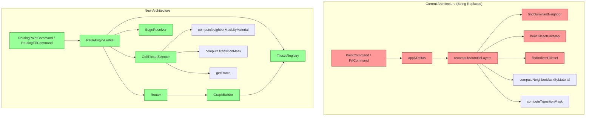
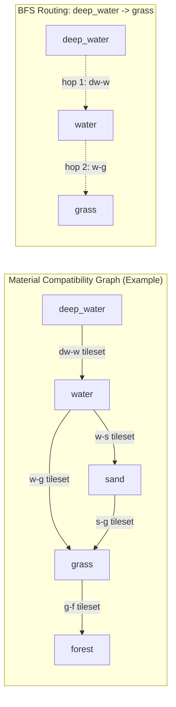

# ADR-0011: Autotile Routing Architecture -- Graph-Based BFS Replacement

## Status

Accepted

## Context

The map editor's autotile system determines which tileset spritesheet and which Blob-47 frame to render for every cell on the map, based on its material and its neighbors' materials. The current implementation (ADR-0010, `autotile-layers.ts`) uses a **dominant-neighbor** pipeline:

1. `computeNeighborMaskByMaterial` -- direct string comparison for the 8-bit mask.
2. `findDominantNeighbor` -- pick the most-common foreign material among neighbors.
3. Forward/reverse pair lookup in `buildTilesetPairMap` ("from:to" -> tilesetKey).
4. `findIndirectTileset` -- a single-hop intermediate search when no direct pair exists.
5. Fallback to `baseTilesetKey`.

This approach works for simple material graphs (grass-water, water-deep_water) but has structural limitations:

- **1-hop limit**: `findIndirectTileset` only searches one intermediate material. If three or more hops are needed (e.g., deep_water -> water -> sand -> desert), the system falls back to the base tileset, producing a visually incorrect hard cut.
- **Non-deterministic tie-breaking**: `findDominantNeighbor` breaks ties by iteration order, producing different results depending on material map arrangement.
- **No edge ownership model**: When two cells share a border, both independently resolve their tileset. There is no coordinated decision about which cell "owns" the transition, leading to visual seam inconsistencies when materials have asymmetric priority relationships (e.g., water should always be the "background" when adjacent to land).
- **One-transition-per-cell ceiling**: Each cell can only show a single transition (toward the dominant neighbor). Cells at three-way material junctions get simplified to a two-material transition, with the minority neighbor ignored.
- **Monolithic recompute**: `recomputeAutotileLayers` processes all layers for each recalc cell, mixing tileset resolution, mask computation, and frame lookup in a single 350-line function. The command system (`applyDeltas`, `PaintCommand`, `FillCommand`) is tightly coupled to this monolithic recompute.

The project needs an architecture that can route through an arbitrary material compatibility graph, coordinate edge ownership between cells, and handle conflict resolution when the one-layer constraint (one logical tileset selection per cell) is violated.

## Decision

### Decision 1: Replace Current Dominant-Neighbor Pipeline

| Item | Content |
|------|---------|
| **Decision** | Full replacement of the current dominant-neighbor pipeline (`recomputeAutotileLayers`, `findDominantNeighbor`, `findIndirectTileset`, `buildTilesetPairMap`) with a graph-based BFS routing system. |
| **Why now** | The current 1-hop indirect resolution cannot scale to material graphs with 3+ hops between distant materials. As more biome materials are added (deep_water, water, sand, grass, forest, mountain, etc.), the number of unreachable pairs grows combinatorially. |
| **Why this** | A graph-based BFS router naturally extends to N-hop paths without additional special-case code. The dominant-neighbor approach is fundamentally a greedy local heuristic; replacing it with shortest-path routing provides optimal transitions. |
| **Known unknowns** | Whether the BFS overhead for large maps (256x256) stays within the 16ms frame budget when many cells are dirty simultaneously (e.g., large flood fill). |
| **Kill criteria** | If BFS routing for a full-map repaint (65,536 cells) exceeds 100ms on a mid-range laptop, the approach needs caching or incremental optimization beyond dirty-cell sets. |

### Decision 2: Replace Command System with RetileEngine Integration

| Item | Content |
|------|---------|
| **Decision** | Replace `applyDeltas` / `PaintCommand` / `FillCommand` with a new command system integrated with an incremental `RetileEngine` that manages dirty-cell recomputation. |
| **Why now** | Current commands directly mutate grid copies and trigger the monolithic `recomputeAutotileLayers`. The new routing pipeline requires per-cell incremental recomputation with dirty propagation to neighbors. |
| **Why this** | A dedicated `RetileEngine` encapsulates the dirty-cell tracking, BFS routing, edge resolution, and tileset selection into a single cohesive module. Commands become thin wrappers that mark cells dirty and delegate recomputation to the engine. |
| **Known unknowns** | Whether fixed `Chebyshev R=2` local recompute remains within target latency under heavy batch paints and whether second-stage commit filtering requires per-pair overrides. |
| **Kill criteria** | If S1 conflict resolution requires more than 4 iterations per cell to converge, or if the single-pass dirty set (Chebyshev R=2) proves insufficient for visual correctness requiring additional propagation passes, the incremental approach should be reconsidered in favor of batch recompute. |

### Decision 3: Explicit fromMaterialKey / toMaterialKey on TilesetInfo

| Item | Content |
|------|---------|
| **Decision** | Require explicit `fromMaterialKey` AND `toMaterialKey` fields on `TilesetInfo` for any tileset that participates in the routing graph. No name-parsing fallback. |
| **Why now** | The routing graph is built from tileset edges. Ambiguous or missing edge data produces incorrect routes. |
| **Why this** | Explicit fields are unambiguous and already stored in the database (`tilesets` table with `from_material_id` and `to_material_id` foreign keys). Name parsing (e.g., extracting "water" and "grass" from "water_grass") is fragile for multi-word material names like "deep-water" or "dark-sand". |
| **Known unknowns** | Whether existing standalone tilesets (only `fromMaterialKey`, no `toMaterialKey`) need migration or can simply be excluded from routing. |
| **Kill criteria** | If more than 20% of existing tilesets lack the required fields after a data audit, the migration effort outweighs the benefit and a hybrid approach with fallback parsing should be reconsidered. |

### Decision 4: One-Layer Constraint (Single Tileset Per Cell)

| Item | Content |
|------|---------|
| **Decision** | Keep one-layer rendering: each cell resolves exactly one logical tileset (`selectedTilesetKey`) and one final render tileset (`renderTilesetKey`) per frame. Use frame-level fallback policy (default: solid-frame fallback to `materials[fg].baseTilesetKey`) instead of multi-layer blending. |
| **Why now** | The renderer and the existing Blob-47 frame system are designed around a single frame index per cell per layer, while current asset sets may not provide suitable solid frames in every logically selected transition tileset. |
| **Why this** | Frame-level fallback fixes missing/undesired solid-frame sources without changing routing, ownership, or renderer interfaces. It preserves the existing `EditorLayer.frames[y][x]` + `EditorLayer.tilesetKeys[y][x]` output shape. |
| **Known unknowns** | Whether fallback is needed only for `SOLID_FRAME` or also for additional frame classes in production content. |
| **Kill criteria** | If fallback beyond `SOLID_FRAME` is required for more than 15% of cells on representative maps, the policy should be generalized or multi-pass rendering revisited. |

### Decision 5: Per-Edge Ownership with Configurable Priority Presets

| Item | Content |
|------|---------|
| **Decision** | Introduce a per-edge ownership model with two configurable priority presets: Preset A (water-side-owns) and Preset B (land-side-owns). |
| **Why now** | Without coordinated edge ownership, two cells sharing a border independently pick their tileset, potentially selecting conflicting transition tilesets that create a visible seam. |
| **Why this** | Per-edge ownership makes the seam deterministic. Configurable presets allow the art team to experiment with which visual style (water bleeding into land vs. land bleeding into water) produces better results. |
| **Known unknowns** | Whether two presets are sufficient or whether per-material-pair ownership overrides will be needed. |
| **Kill criteria** | If neither preset produces acceptable results for more than 2 material pairs, per-pair overrides must be added to the ownership model. |

### Decision 6: Two-Strategy Conflict Resolution

| Item | Content |
|------|---------|
| **Decision** | When the one-layer constraint causes a conflict (cell borders multiple different materials and cannot satisfy all edges with a single tileset), apply Strategy S1 (owner reassign with max iterations) first, then fall back to Strategy S2 (BG priority-based tileset selection). |
| **Why now** | The one-layer constraint means a cell at a three-way junction must pick one tileset. Without explicit conflict resolution, the result depends on processing order. |
| **Why this** | S1 attempts to redistribute edge ownership to neighboring cells that can accommodate the transition. S2 provides a deterministic fallback when redistribution fails: the cell selects one BG by configured priority order (default: highest-priority BG wins, e.g., `water > grass > sand`). |
| **Known unknowns** | The optimal max iteration count for S1 and whether it always converges. |
| **Kill criteria** | If S1 fails to converge within 4 iterations for more than 5% of cells on a test map, S1 should be simplified or removed in favor of S2-only resolution. |

### Decision 7: Direct-First Reverse-Pair Fallback

| Item | Content |
|------|---------|
| **Decision** | For a required transition `(FG, BG)`, first use direct pair `FG_BG`; if missing, allow reverse pair `BG_FG` with reverse frame orientation; if both missing, mark edge unresolved. |
| **Why now** | Production content can intentionally provide only one direction for some pairs (for example, `deep_water -> water` without `water -> deep_water`). Requiring both directions causes empty keys or visual degradation despite available compatible art. |
| **Why this** | Preserves one-layer rendering and existing routing/ownership logic while eliminating false-invalid edges. Maintains deterministic behavior through strict direct-first precedence when both directions exist. |
| **Known unknowns** | Whether inverse-mask mapping after diagonal gating (`getFrame((~mask47Input) & 0xFF)`) is sufficient for all art sets or if per-tileset opposite-diagonal tables will be needed. |
| **Kill criteria** | If reverse orientation introduces incorrect corner topology for more than 5% of audited transitions, reverse fallback should be gated by per-tileset capability metadata. |

### Decision 8: Selected-Mode Mask Computation (Base vs Transition)

| Item | Content |
|------|---------|
| **Decision** | Compute frame mask per selected mode: if `bg === ''` start from FG-equality mask (`computeNeighborMaskByMaterial`) and in engine owner-context force foreign cardinal edges closed on non-owner side; if `bg !== ''` use edge-contract-aware transition mask (BG-targeted baseline plus canonical edge-contract gating: cardinal bit=0 only on owned edges typed as `bg`, otherwise bit=1 on foreign cardinal edges). |
| **Why now** | FG-only mask for transition cells produces false isolated frames in valid boundary cases (for example, `deep_water -> water -> grass`) even when correct transition tilesets are selected. |
| **Why this** | Keeps one-layer architecture and Blob-47 lookup unchanged while making transition openings deterministic by canonical edge contract (owner + type), including cases where edge type is routed (`nextHop`) and not equal to the physical neighbor material. This removes seam artifacts and false isolated transitions. |
| **Known unknowns** | Whether all existing tilesets assume the same transition-mask orientation, or if a subset needs per-tileset mask polarity metadata. |
| **Kill criteria** | If selected-mode mask causes regression in more than 5% of audited legacy maps, add per-tileset capability flags and compatibility fallback. |

### Decision 9: Post-Recompute Neighbor Repaint Policy (C1..C5)

| Item | Content |
|------|---------|
| **Decision** | Keep full local recompute (`Chebyshev R=2`) for all dirty cells, then apply a post-recompute commit policy: painted center always commits; cardinal neighbor commit is mandatory only for stable edge classes `C1/C2/C3`; for `C4/C5`, preserving previous neighbor visual output is allowed by default; diagonal neighbors commit only when both adjacent cardinal edges from the painted center are stable (`C1/C2/C3`); if a cell has no prior visual/cache state, its computed result is committed for initialization. |
| **Why now** | Mixed-valid transitions (reverse or different bridge behavior) can be computationally valid but visually unstable if neighbor updates are treated as mandatory in all cases. We need deterministic rules for when neighbor repaint is a required invariant versus an allowed no-op. |
| **Why this** | Separates computation from visual commit policy. Routing, ownership, and mask computation remain unchanged; only commit guarantees differ by edge stability class. This preserves correctness while preventing unstable or noisy neighbor redraw expectations. |
| **Known unknowns** | How often `C4` edges should still commit in production maps under different priority presets and art styles. |
| **Kill criteria** | If preserving neighbors for `C4/C5` causes unacceptable visual discontinuity in audited scenarios, introduce per-pair override flags for commit policy. |

#### Scope: Commit Policy vs. Dirty Set

This policy operates at a **different level** than the dirty set. It does **not** filter or modify the `Chebyshev R=2` dirty set -- all cells in the dirty set are always fully recomputed (tileset selection, mask, frame). The policy controls only **visual commit guarantees**: which recomputed results are committed as mandatory visual updates versus which may be held at their previous visual state. The two levels are:

1. **Computational phase** (engine-level): Full recompute of all dirty cells -- unchanged by this policy.
2. **Commit phase** (render-level policy): Center always commits; `C1/C2/C3` cardinal neighbors commit; `C4/C5` cardinal neighbors optionally preserve previous visual output; diagonal neighbors commit only for stable corners (`NW: N+W`, `NE: N+E`, `SE: S+E`, `SW: S+W` where both edges are `C1/C2/C3`); cells without prior visual/cache state commit to initialize output deterministically.

#### Edge Classification Input Data

For each cardinal edge between materials `A` and `B`, the following values are computed:

```
hopA  = nextHop(A, B)                          -- route from A toward B
hopB  = nextHop(B, A)                          -- route from B toward A
pairA = resolvePair(A, hopA) -> { tilesetKey, orientation } | null
pairB = resolvePair(B, hopB) -> { tilesetKey, orientation } | null
```

#### Five Edge Classes (C1..C5)

| Class | Condition | Visual Stability | Example |
|-------|-----------|-----------------|---------|
| **C1: Same material** | `A === B` | Always stable | `grass <-> grass` |
| **C2: Symmetric direct** | Both sides direct (`pairA.orientation === 'direct'` and `pairB.orientation === 'direct'`), `hopA === B`, `hopB === A` | High | `grass <-> water` (both direct tilesets `grass_water` and `water_grass` exist) |
| **C3: Stable bridge** | Both sides direct, `hopA === hopB`, `hopA !== A`, `hopA !== B` (same intermediate bridge material) | High | `deep_water <-> grass` through bridge `water` (both direct: `deep_water_water`, `grass_water`) |
| **C4: Mixed valid** | Both sides resolved (`pairA !== null` and `pairB !== null`), but does not satisfy C2 or C3 conditions (at least one side uses reverse orientation, or bridges differ) | Medium/low | `deep_water <-> water` (direct + reverse, since `water_deep_water` does not exist as a direct tileset) |
| **C5: Partial or invalid** | At least one side has `resolvePair === null` | Low | Hypothetical disconnected pair with no routing path |

#### Relationship to EdgeResolver Results

The edge classification is a **superset refinement** of EdgeResolver outcomes, not a replacement:

| EdgeResolver Result | Possible Edge Classes |
|--------------------|----------------------|
| both-valid | C2, C3, or C4 |
| one-valid | C5 |
| neither-valid | C5 |
| same material (no EdgeResolver call) | C1 |

#### Commit Rules by Class

- **C1/C2/C3 (cardinal)**: Cardinal neighbor commit is **required** -- the recomputed result is treated as the expected visual output.
- **C4/C5 (cardinal)**: Cardinal neighbor commit is **optional** -- the neighbor may retain its previous visual state. This does not affect correctness (the center is always committed), only the visual stability contract for the neighbor side of the edge.
- **Diagonal corners**: Diagonal neighbor commit is **required only** when both adjacent cardinal edges are stable (`C1/C2/C3`): `NW` requires stable `N` and `W`; `NE` requires stable `N` and `E`; `SE` requires stable `S` and `E`; `SW` requires stable `S` and `W`.

## Rationale

### Options Considered

#### Decision 1: Tileset Resolution Strategy

1. **Extend Current Dominant-Neighbor with Multi-Hop**
   - Overview: Keep the existing `findIndirectTileset` approach but extend it to search N hops deep by iterating through intermediate materials recursively.
   - Pros: Minimal code change, builds on existing tested code, no new data structures required.
   - Cons: Recursive search without a graph structure is exponential in hop count. No guarantee of finding the shortest path. Difficult to detect cycles (e.g., material A -> B -> C -> A). `findDominantNeighbor` tie-breaking issues remain unsolved.
   - Effort: 2 days

2. **Weighted Dijkstra on Material Graph**
   - Overview: Build a weighted graph where each edge is a tileset with a cost (e.g., visual quality score), and use Dijkstra's algorithm to find the minimum-cost path between any two materials.
   - Pros: Optimal path when costs vary, well-understood algorithm, handles weighted preferences (e.g., prefer "water_grass" over "mud_grass").
   - Cons: Costs are not naturally defined -- all tilesets are equally valid transitions. Overhead of priority queue is unnecessary for unweighted graphs. More complex implementation for no practical benefit given uniform edge weights.
   - Effort: 4 days

3. **BFS on Unweighted Material Compatibility Graph (Selected)**
   - Overview: Build an adjacency graph from `TilesetInfo` entries where each node is a material and each edge is a tileset with `fromMaterialKey` and `toMaterialKey`. Use BFS to find the shortest path between any two materials. Cache the full shortest-path table (Floyd-Warshall or all-pairs BFS) at graph construction time.
   - Pros: Shortest path guaranteed. O(V+E) per query (or O(1) with precomputed table). Cycle-proof by BFS nature. Simple implementation. Unweighted graph matches the domain -- all tilesets are equally valid.
   - Cons: Requires precomputed routing table (memory: O(V^2) where V = number of materials, typically < 20). Graph must be rebuilt when tilesets change (rare during editing sessions).
   - Effort: 3 days

#### Comparison: Tileset Resolution Strategy

| Criterion | Extend Dominant-Neighbor | Weighted Dijkstra | BFS Graph (Selected) |
|---|---|---|---|
| Multi-hop support | Fragile (recursive) | Yes (optimal weighted) | Yes (optimal unweighted) |
| Cycle safety | No (must add detection) | Yes (by algorithm) | Yes (by algorithm) |
| Path optimality | Not guaranteed | Optimal (weighted) | Optimal (shortest hop) |
| Implementation complexity | Low | High | Medium |
| Runtime per query | O(T^N) worst case | O((V+E) log V) | O(1) with precomputed table |
| Domain fit | Poor (heuristic) | Over-engineered | Natural fit |

#### Decision 2: Command System Integration

1. **Patch Existing Commands to Call New Router**
   - Overview: Keep `applyDeltas`, `PaintCommand`, `FillCommand` as-is but replace the `recomputeAutotileLayers` call with a new routing function.
   - Pros: Minimal changes to command interface, existing undo/redo preserved exactly.
   - Cons: `applyDeltas` still mixes grid mutation, frame application, and recompute triggering. Dirty-cell tracking must be bolted onto the existing function. Debug logging interleaved with business logic persists.
   - Effort: 2 days

2. **New Command Classes with Shared RetileEngine**
   - Overview: New `RoutingPaintCommand` and `RoutingFillCommand` classes that apply terrain deltas and delegate all recomputation to a `RetileEngine.retile(dirtyCells)` method. The engine handles dirty propagation, graph routing, edge resolution, and frame computation.
   - Pros: Single responsibility for each component. Engine is independently testable. Commands are thin and predictable. Debug logging moves to engine hooks.
   - Cons: Breaking change to command interface (existing `PaintCommand`/`FillCommand` removed). All consumers of `applyDeltas` must migrate.
   - Effort: 3 days

3. **Event-Driven Pipeline with Command Bus (Selected Against)**
   - Overview: Commands emit events ("cells-painted"), subscribers handle routing, edge resolution, frame computation independently.
   - Pros: Maximum decoupling, easy to add new pipeline stages.
   - Cons: Over-engineered for a single-consumer system. Event ordering becomes critical. Harder to reason about undo/redo correctness. Debugging requires tracing through event handlers.
   - Effort: 5 days

**Selected: Option 2 -- New Command Classes with Shared RetileEngine.** The engine pattern provides clean separation without the indirection cost of event-driven architecture. Commands remain synchronous and deterministic, which is critical for undo/redo correctness.

#### Decision 3: Tileset Registry Data Source

1. **Name Parsing Fallback**
   - Overview: If `fromMaterialKey` or `toMaterialKey` is missing, parse the tileset name (e.g., "water_grass") to extract material identifiers.
   - Pros: Backward compatible with older tileset data. No migration required.
   - Cons: Fragile for multi-word names ("deep-water_dark-sand" is ambiguous). Underscore could be part of the material name or the separator. Non-deterministic parsing.
   - Effort: 1 day

2. **Explicit Fields Required, Missing Tilesets Excluded from Graph (Selected)**
   - Overview: Only tilesets with both `fromMaterialKey` and `toMaterialKey` participate in the routing graph. Standalone tilesets (only `fromMaterialKey`) serve as base tilesets but are not graph edges.
   - Pros: Unambiguous graph construction. DB already stores these fields. Validation can flag missing fields at load time.
   - Cons: Requires all transition tilesets to have both fields populated. Data audit needed.
   - Effort: 1 day

3. **Configuration File Mapping**
   - Overview: Maintain a separate JSON/YAML configuration file that maps tileset keys to material pairs, independent of `TilesetInfo` fields.
   - Pros: Decoupled from DB schema. Easy to edit without DB migration.
   - Cons: Second source of truth for material relationships. Sync issues between config and DB. Additional file to maintain.
   - Effort: 2 days

#### Decision 4: Layer Model

1. **Multi-Layer Blending (One Tileset Per Layer, Stack Layers)**
   - Overview: Each transition gets its own render layer. A cell at a grass-water-sand junction would have three layers stacked with alpha blending.
   - Pros: Visually richer transitions. Each material pair rendered independently. No conflict resolution needed.
   - Cons: Layer count grows with material adjacency complexity (O(material pairs) layers in worst case). Renderer must composite multiple layers per cell. Breaks existing `EditorLayer` model. Major rendering pipeline rewrite.
   - Effort: 10+ days

2. **Single Tileset Per Cell, One Render Layer with Frame Fallback (Selected)**
   - Overview: Each cell picks one logical tileset for routing semantics; pair selection uses direct-first precedence with reverse-pair fallback when direct is missing; frame mask basis is selected per cell (`bg === ''` -> FG mask with foreign-cardinal non-owner closure in engine context, `bg !== ''` -> edge-contract-aware transition mask); the final render source for a frame can be remapped by policy (default: `SOLID_FRAME` uses `baseTilesetKey` when present). Conflicts at multi-material junctions are still resolved by priority.
   - Pros: Matches existing renderer. No layer explosion. Keeps routing deterministic while allowing both solid-frame borrowing and asymmetric pair sets (`A_B` without mandatory `B_A`) and preventing false-isolated transition cells.
   - Cons: Adds selected-vs-render key complexity in cache/indexing, orientation bookkeeping for reverse mode, and mask-mode bookkeeping (`base` vs `transition`) in frame computation.
   - Effort: 0 days (existing model)

3. **Deferred Multi-Pass Rendering**
   - Overview: Single layer in data, but render each cell in multiple passes with stencil/clip masking per transition direction.
   - Pros: Richer visuals without data model changes. Each direction rendered independently.
   - Cons: Requires WebGL or canvas stencil support. 2-4x render cost per cell. Blob-47 frame model no longer applies (each direction is a separate mask).
   - Effort: 8+ days

#### Decision 5: Edge Ownership Model

1. **No Edge Ownership (Current Approach)**
   - Overview: Each cell independently resolves its tileset based on its own material and neighbors. No coordination between adjacent cells.
   - Pros: Simple. No inter-cell communication during resolve.
   - Cons: Seam artifacts when two cells pick different tilesets for the same border. Non-deterministic visual output.
   - Effort: 0 days

2. **Global Priority-Based Ownership**
   - Overview: Every material has a global priority number. At any border, the lower-priority material always "owns" the edge (its cell uses the transition tileset).
   - Pros: Deterministic. Simple to implement. Single configuration value per material.
   - Cons: Inflexible -- the same priority ordering applies everywhere. Cannot have water own edges against sand but sand own edges against grass.
   - Effort: 1 day

3. **Per-Edge Ownership with Configurable Presets (Selected)**
   - Overview: Edge ownership is determined per-edge using a configurable strategy. Two presets ship initially: Preset A (lower-priority material owns = "water side owns") and Preset B (higher-priority material owns = "land side owns"). Per-material-pair overrides can be added later.
   - Pros: Flexible. Art team can experiment. Deterministic within a preset. Extensible to per-pair overrides without architecture change.
   - Cons: More complex than global priority. Presets must be tested with all material combinations.
   - Effort: 2 days

#### Decision 6: Conflict Resolution at Multi-Material Junctions

1. **Ignore Conflicts (Current Approach)**
   - Overview: Cell picks dominant neighbor, ignores minority neighbors. Visual artifacts accepted.
   - Pros: Simple. Fast.
   - Cons: Visible artifacts at three-way junctions. Non-deterministic when dominance is tied.
   - Effort: 0 days

2. **S1-Only: Edge Reassignment**
   - Overview: When a cell cannot satisfy all edges with one tileset, reassign conflicting edges to neighboring cells. Iterate until stable or max iterations reached.
   - Pros: Can resolve many conflicts. Produces locally optimal assignments.
   - Cons: May not converge. Cascading reassignments can ripple across the map. No fallback if convergence fails.
   - Effort: 3 days

3. **S2-Only: BG Priority Fallback**
   - Overview: At a conflict, the cell always selects the tileset for the highest-priority BG candidate under the configured order (default `water > grass > sand`).
   - Pros: Always deterministic. O(1) resolution. No iteration.
   - Cons: Produces suboptimal visual results when the background material is not the best visual choice. No attempt at finding a better assignment.
   - Effort: 1 day

4. **S1 then S2 Cascade (Selected)**
   - Overview: Try S1 (edge reassignment, max 4 iterations) first. If S1 does not resolve the conflict, fall back to S2 (BG priority). This gives the system an opportunity to find the best local assignment while guaranteeing termination.
   - Pros: Best visual results when S1 succeeds. Guaranteed termination via S2 fallback. Bounded iteration count.
   - Cons: Most complex option. S1 adds processing time. Must be profiled for large dirty sets.
   - Effort: 4 days

## Consequences

### Positive Consequences

- **N-hop routing**: Any two materials connected by a chain of transition tilesets will produce a correct visual transition, regardless of path length. The routing table precomputes all shortest paths.
- **Deterministic edge ownership**: The configurable preset system eliminates seam artifacts caused by independent per-cell resolution. The art team can choose the visual style that best fits the game's aesthetic.
- **Modular architecture**: Six focused modules (TilesetRegistry, GraphBuilder, Router, EdgeResolver, CellTilesetSelector, RetileEngine) replace one monolithic function. Each module is independently testable with well-defined inputs and outputs.
- **Incremental recomputation**: The RetileEngine's dirty-cell approach avoids full-map rescans. Only painted cells and their neighbors are reprocessed.
- **Extensible conflict resolution**: The S1/S2 cascade pattern can accommodate additional strategies without changing the overall pipeline.
- **Content robustness for solid tiles**: Frame-level fallback allows a material to reuse a stable solid provider (`baseTilesetKey`) without altering routing outcomes.
- **Asymmetric pair robustness**: Transition rendering no longer requires both `A_B` and `B_A` in content. If direct pair is missing, reverse-pair fallback keeps edges renderable without forcing duplicate assets.
- **Transition seam robustness**: Selected-mode mask computation prevents valid transition cells from collapsing to isolated frames when FG neighbors differ but BG boundary is present.
- **Deterministic repaint guarantees**: The five-class edge classification (`C1..C5`) provides deterministic, predictable visual output per edge class. Developers and testers can reason about which neighbors will visually update after a paint operation: `C1/C2/C3` edges guarantee cardinal neighbor commit, `C4/C5` edges explicitly allow cardinal neighbors to retain previous visual state, and diagonals commit only for stable corners (two adjacent stable cardinals). This predictability aids diagnostics and serves as the foundation for future dirty-set optimization.

### Negative Consequences

- **Breaking changes**: `recomputeAutotileLayers`, `findDominantNeighbor`, `findIndirectTileset`, `buildTilesetPairMap`, `applyDeltas`, `PaintCommand`, and `FillCommand` are all removed. All consumers must migrate to the new API.
- **Increased module count**: The `packages/map-lib/src/core/` directory grows from approximately 8 files to approximately 14. Each new module is small and focused, but the surface area of the package increases.
- **Precomputed routing table memory**: The all-pairs shortest-path table for V materials requires O(V^2) storage. With V < 20 (typical), this is under 400 entries -- negligible. At V = 100 it reaches 10,000 entries, still small.
- **Edge ownership complexity**: The per-edge ownership model adds a coordination step that the current system does not have. This adds latency to the per-cell resolve, though the dirty-cell approach bounds the total work.
- **Selected/render key bookkeeping**: Cache and indices must track both `selectedTilesetKey` and `renderTilesetKey`, increasing implementation complexity for T3a updates.
- **Orientation bookkeeping**: Reverse-pair fallback introduces `direct/reverse` orientation handling, which adds frame mapping complexity and additional tests for corner/topology correctness.
- **Mask-mode bookkeeping**: Frame computation now depends on selected BG presence (`base` vs `transition` mode), adding branching and regression-test surface in CellTilesetSelector.
- **Commit-policy bookkeeping**: Post-recompute stage must track center vs neighbor guarantees and evaluate edge classes (`C1..C5`) for cardinal center-neighbor pairs. This requires additional per-edge classification (`classifyEdge` calls for each cardinal edge of painted cells), commit/skip logic in the RetileEngine commit phase, and regression tests covering all five edge classes with representative material pairs.

### Neutral Consequences

- **Blob-47 frame system unchanged**: The 47-frame autotile engine (`autotile.ts`), `getFrame()`, `gateDiagonals()`, and the bit constants (N, NE, E, SE, S, SW, W, NW) are retained without modification. The routing architecture changes which tileset is selected and how the mask is computed, but the final frame lookup remains the same.
- **`computeNeighborMaskByMaterial` retained**: The direct material string comparison mask function is still needed for base/no-transition mask computation.
- **BG-targeted transition primitive retained**: `computeTransitionMask` (or equivalent logic) remains the baseline primitive for transition-mode masks, with canonical edge-contract gating applied on foreign cardinal edges.
- **Renderer unchanged**: `canvas-renderer.ts` continues to read `layer.frames[y][x]` and `layer.tilesetKeys[y][x]` and render accordingly. `tilesetKeys` now represent final render source (`renderTilesetKey`), while logical selection remains in RetileEngine cache.

## Implementation Guidance

### Module Responsibilities (Principled)

- **TilesetRegistry**: Single source of truth for tileset and material data. All routing modules read from the registry; none directly access raw `TilesetInfo[]` arrays.
- **GraphBuilder**: Constructs the material compatibility graph from the registry. Edges represent transition tilesets. Graph is rebuilt only when the tileset set changes (not on every paint stroke).
- **Router**: Precomputes shortest paths between all material pairs using BFS. Exposes `getPath(fromMaterial, toMaterial): TilesetInfo[]` for any pair. Returns `null` for disconnected pairs.
- **EdgeResolver**: Determines which cell owns each edge at a material boundary. Uses the configured priority preset. Operates per-edge, not per-cell.
- **CellTilesetSelector**: Given a cell's material, its neighbors, and the resolved edge ownership, selects the logical tileset with direct-first precedence and reverse-pair fallback, computes the Blob-47 frame with selected-mode mask basis (`bg === ''` -> FG mask with foreign-cardinal non-owner closure in engine context, `bg !== ''` -> edge-contract-aware transition mask) including reverse orientation mapping when needed, and resolves final render source via frame-fallback policy. Handles conflict resolution (S1 then S2).
- **RetileEngine**: Orchestrates the full pipeline in two distinct phases:
  1. **Computational phase**: Accepts dirty cells, expands to `Chebyshev R=2`, invokes EdgeResolver and CellTilesetSelector for **every** cell in the dirty set without exception. Each cell gets full recomputation (tileset selection, mask, frame). This phase is unchanged by the commit policy.
  2. **Commit phase**: Applies the post-recompute commit policy to the computed results. The painted center always commits. For each cardinal center-neighbor edge, `classifyEdge()` determines the edge class. `C1/C2/C3` cardinal neighbors commit their recomputed result (required). `C4/C5` cardinal neighbors may retain their previous visual state (optional). Diagonal neighbors commit only when both adjacent cardinal edges are stable (`C1/C2/C3`). Cells without prior visual/cache state commit for deterministic initialization. For non-paint triggers (T3/T4/full rebuild), all dirty cells commit. Updates `frames` and `tilesetKeys` arrays, maintains selected/render tileset indices. Returns new immutable layer state.

### Dependency Injection

- All new modules accept their dependencies as constructor/function parameters. No module imports from `@nookstead/db` or any React/UI package.
- The `RetileEngine` receives `TilesetRegistry`, `Router`, `EdgeResolver`, and `CellTilesetSelector` as injected dependencies. This allows unit testing each component independently with mock data.

### Immutability

- All state updates must return new arrays/objects. Input grid, layers, and material maps are never mutated. This preserves React state compatibility and undo/redo correctness.

### Backward Compatibility

- `computeNeighborMaskByMaterial` is retained in `neighbor-mask.ts` and continues to be exported from `map-lib/index.ts`.
- `computeTransitionMask` and `computeNeighborMask` are retained (no removal in this change). `computeTransitionMask` remains available for transition-mode mask computation and external consumers.
- The `EditorCommand` interface is preserved; new command classes implement the same `execute(state)` / `undo(state)` contract.

### Edge Classification (classifyEdge)

The `classifyEdge` utility determines the stability class of a cardinal edge between two materials. It is used by the RetileEngine commit phase to decide neighbor commit behavior. Classification is `O(1)` per edge (two `nextHop` lookups + two `resolvePair` lookups).

```typescript
function classifyEdge(
  a: string, b: string,
  router: RoutingTable,
  registry: TilesetRegistry,
): 'C1' | 'C2' | 'C3' | 'C4' | 'C5' {
  if (a === b) return 'C1';

  const hopA = router.nextHop(a, b);
  const hopB = router.nextHop(b, a);

  const pairA = hopA !== null ? registry.resolvePair(a, hopA) : null;
  const pairB = hopB !== null ? registry.resolvePair(b, hopB) : null;

  if (pairA === null || pairB === null || hopA === null || hopB === null) return 'C5';

  const bothDirect =
    pairA.orientation === 'direct' && pairB.orientation === 'direct';

  if (!bothDirect) return 'C4';

  // Both direct. Check bridge relationship.
  if (hopA === b && hopB === a) return 'C2'; // Direct neighbors, no bridge
  if (hopA === hopB && hopA !== a && hopA !== b) return 'C3'; // Same intermediate bridge material
  return 'C4';                                // Different bridges
}
```

The classification should be recomputed whenever the tileset set or routing table changes.

### Performance Boundaries

- Graph construction (BFS all-pairs) runs once per tileset set change. For V=20 materials and E=30 edges, BFS completes in microseconds.
- Per-paint-stroke retiling targets: under 5ms for brush (1-9 cells dirty), under 50ms for flood fill (up to 10,000 cells dirty).
- The skip optimization for same-material SOLID cells should be preserved in the RetileEngine to avoid unnecessary recomputation.

### Testing Strategy

- Each module (TilesetRegistry, GraphBuilder, Router, EdgeResolver, CellTilesetSelector) should have dedicated unit tests with small hand-crafted material graphs.
- RetileEngine integration tests should use a 5x5 grid with 3-4 materials and verify the full pipeline from dirty cells to final frames/tilesetKeys.
- Regression tests should verify that the new system produces equivalent output to the old system for simple 2-material cases (grass/water).
- Add asymmetric-pair regression tests (for example, `A_B` exists and `B_A` missing) to verify direct-first reverse fallback and non-empty key guarantees.
- Add selected-mode mask regression tests for `deep_water -> water -> grass` seams to ensure transition cells do not render as false isolated frames.

#### Edge Class Tests (C1..C5)

Test each edge class with representative material pairs to verify commit policy behavior:

- **C1 (same material)**: Paint `grass` into a `grass` field. Neighbors recompute identically. No visual change expected.
- **C2 (symmetric direct)**: Paint `grass` into a `water` field. Center commits as `grass_water` (`frame=47`), and the full first ring around center (cardinals + diagonals) commits as `frame=1` under isolated-center policy.
- **C3 (stable bridge)**: Paint `deep_sand` into a `deep_water` field. Both sides use direct tilesets through shared bridge `water`. Cardinal neighbors are mandatory commit candidates; specific frame ids may remain unchanged.
- **C4 (mixed valid)**: Paint `deep_water` into a `water` field. Center updates with `deep_water_water` (direct). Neighbor `water` is NOT required to visually change (one side uses reverse orientation).
- **C4 (different bridges)**: Paint `deep_sand` into a `water` field. Center updates. Neighbor `water` may retain previous visual state.
- **C5 (partial/invalid)**: Test with a disconnected material pair (no routing path). Center falls back to base tileset. Neighbor retains previous state.

#### Owner-Side Contract Validation

- For each cardinal edge where `A !== B`, verify that the transition opening (cardinal bit = 0) appears **only** on the owner-side cell. The non-owner side must have that cardinal bit closed (bit = 1). Commit policy must not create dual-open shared edges.

#### Reverse Orientation Frame Mapping

- When a direct pair is missing and a reverse pair exists, verify the frame is computed via `getFrame((~mask47Input) & 0xFF)` where `mask47Input = gateDiagonals(rawMask)`, not via direct lookup.
- Test corner topology correctness for reverse orientation (NE, SE, SW, NW corners must render correctly with inverted mask).

#### Determinism Regression

- Run the same paint operations twice on identical initial state. Assert that all output arrays (`frames`, `tilesetKeys`, `renderTilesetKeys`) are bitwise identical.
- Run the same operations in different processing orders (where applicable). Assert deterministic output via flat-index processing order invariant.

#### Batch Fill Tests

- Fill 100+ cells of `grass` into a `water` field. Verify all cells in the union of `R=2` dirty sets are recomputed.
- Fill operations that exceed the 50% threshold should trigger full-pass mode. Verify correctness in full-pass mode matches incremental mode.
- Multi-material batch: Fill a rectangle that creates edges of different classes (C2, C3, C4). Verify each edge's commit behavior matches its class.





## Files Affected

### Removed / Rewritten

| File | Current Function | Disposition |
|------|-----------------|-------------|
| `packages/map-lib/src/core/autotile-layers.ts` | `recomputeAutotileLayers`, `findDominantNeighbor`, `findIndirectTileset`, `buildTilesetPairMap` | Complete rewrite; new modules replace all functions |
| `packages/map-lib/src/core/commands.ts` | `applyDeltas`, `PaintCommand`, `FillCommand` | Replaced by new command classes integrated with RetileEngine |

### Retained

| File | Function | Notes |
|------|----------|-------|
| `packages/map-lib/src/core/autotile.ts` | `getFrame`, `gateDiagonals`, bit constants, `FRAME_TABLE` | Unchanged; used by CellTilesetSelector |
| `packages/map-lib/src/core/neighbor-mask.ts` | `computeNeighborMaskByMaterial`, `computeTransitionMask` | Retained; used by CellTilesetSelector for base-mode and transition-mode mask paths. |
| `packages/map-lib/src/types/editor-types.ts` | `EditorLayer`, `MapEditorState`, `CellDelta`, `EditorCommand` | Interface preserved; command implementations change |
| `packages/map-lib/src/types/material-types.ts` | `TilesetInfo`, `MaterialInfo` | Unchanged; `MaterialInfo.baseTilesetKey` is used by frame-fallback policy |
| `apps/genmap/src/components/map-editor/canvas-renderer.ts` | `renderMapCanvas` | Unchanged; reads `frames` and `tilesetKeys` as before |

### New Modules

| Module | Location | Responsibility |
|--------|----------|---------------|
| TilesetRegistry | `packages/map-lib/src/core/tileset-registry.ts` | Tileset/material data access, validation |
| GraphBuilder | `packages/map-lib/src/core/graph-builder.ts` | Material compatibility graph construction |
| Router | `packages/map-lib/src/core/router.ts` | All-pairs shortest-path BFS, path queries |
| EdgeResolver | `packages/map-lib/src/core/edge-resolver.ts` | Per-edge ownership determination |
| CellTilesetSelector | `packages/map-lib/src/core/cell-tileset-selector.ts` | Per-cell tileset + frame selection, conflict resolution |
| RetileEngine | `packages/map-lib/src/core/retile-engine.ts` | Dirty-cell orchestration, pipeline coordinator |
| Routing types | `packages/map-lib/src/types/routing-types.ts` | Shared types for routing modules |

## Related Information

- [ADR-0010 / ADR-0010-map-lib-algorithm-extraction.md](ADR-0010-map-lib-algorithm-extraction.md) -- Established the current autotile pipeline and material resolver architecture being superseded
- [ADR-0009 / ADR-0009-tileset-management-architecture.md](ADR-0009-tileset-management-architecture.md) -- Database-driven tilesets with `fromMaterialId` / `toMaterialId` foreign keys
- [ADR-0006 / adr-006-map-editor-architecture.md](adr-006-map-editor-architecture.md) -- Three-package architecture and zero-build pattern
- [docs/autotile-transition-mechanics.md](../autotile-transition-mechanics.md) -- Current dominant-neighbor algorithm documentation (superseded by this ADR)
- [docs/design/autotile-system-reference.md](../design/autotile-system-reference.md) -- Comprehensive reference of the current Blob-47 autotile system
- [docs/design/design-015-neighbor-repaint-policy-v2-ru.md](../design/design-015-neighbor-repaint-policy-v2-ru.md) -- Detailed post-recompute center/neighbor commit policy and edge stability classes

## References

- [Tile/Map-Based Game Techniques: Handling Terrain Transitions (GameDev.net)](https://www.gamedev.net/articles/programming/general-and-gameplay-programming/tilemap-based-game-techniques-handling-terrai-r934/) - Foundational article on terrain transition mechanics in tile-based games
- [Breadth First Search - Algorithms for Competitive Programming](https://cp-algorithms.com/graph/breadth-first-search.html) - BFS algorithm reference for shortest-path in unweighted graphs
- [Blob Tileset Article (cr31.co.uk)](https://web.archive.org/web/20230101000000*/cr31.co.uk/stagecast/wang/blob.html) - Blob-47 autotile algorithm reference
- [Autotiling Technique (Excalibur.js)](https://excaliburjs.com/blog/Autotiling%20Technique/) - Modern autotiling implementation patterns
- [How to Use Tile Bitmasking to Auto-Tile Your Level Layouts (Tuts+)](https://code.tutsplus.com/how-to-use-tile-bitmasking-to-auto-tile-your-level-layouts--cms-25673t) - Detailed 4-bit/8-bit mask flow, diagonal gating, and mask-to-frame LUT rationale
- [Autotiling by Code (GameMaker Forum)](https://forum.gamemaker.io/index.php?threads/autotiling-by-code.76441/) - Real-world discussion of single-layer vs layered transition rendering trade-offs
- [Connecting Multiple Autotiles (Godot Forum)](https://forum.godotengine.org/t/connecting-multiple-autotiles/129928) - Discussion of multi-material autotile transition challenges
- [Amit's Game Programming Information](http://www-cs-students.stanford.edu/~amitp/gameprog.html) - Comprehensive game programming algorithms reference including pathfinding and tile grids

## Date

2026-02-23
