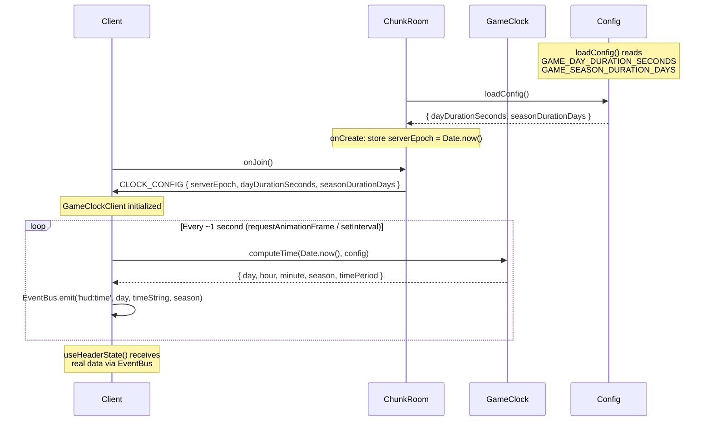
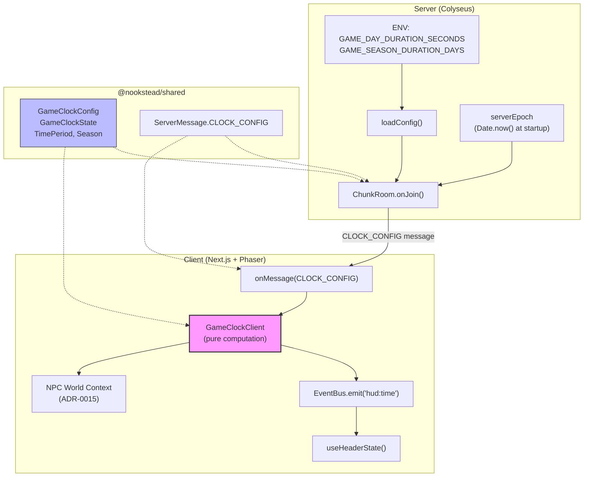

# ADR-0016: Архитектура игрового времени (Game Clock)

## Статус

Proposed

## Контекст

Nookstead -- MMO с реальным временем (GDD, раздел 6.5). По умолчанию игровое время равно UTC: если на сервере 14:00, в игре 14:00. Администратор может задать множитель скорости (2x = 2 игровых часа за 1 реальный час). Все игроки на сервере видят одно и то же время.

**Текущее состояние**: HUD-компонент (`useHeaderState.ts`) уже слушает `EventBus.on('hud:time', (day, time, season))` и отображает статические значения по умолчанию (day=1, time="08:00", season="spring"). Тип `Season` и интерфейс `HeaderState` определены в `apps/game/src/components/hud/types.ts`. Серверная комната `ChunkRoom` использует `setSimulationInterval()` с интервалом 100ms. Конфиг сервера загружается из env-переменных через `loadConfig()`. Enum `ServerMessage` в `@nookstead/shared` определяет все серверные сообщения.

**Проблема**: Нет реализации игровых часов. HUD показывает захардкоженные значения. NPC-система (ADR-0015) ожидает World Context (время суток, сезон) для промптов, но получает статические строки. Без рабочего clock невозможны: смена дня/ночи, сезонный контент, расписание NPC.

**GDD-требования** (раздел 6.5):
- Время по умолчанию 1:1 с реальным (UTC)
- Настраиваемый множитель скорости через серверную переменную
- Сезоны: 7 реальных дней по умолчанию (настраивается)
- Периоды суток: dawn (5:00-7:00), day (7:00-17:00), dusk (17:00-19:00), night (19:00-5:00)
- Визуальный тинтинг -- отдельная задача (не MVP)

**Ограничения**:
- Clock не должен потреблять bandwidth -- данные детерминистичны
- Серверный tick (100ms) уже занят синхронизацией позиций ботов и игроков
- Все игроки должны видеть одно и то же время (server-wide setting)

---

## Решение

### Детали решения

| Пункт | Содержание |
|-------|-----------|
| **Решение** | Client-computed time: сервер отправляет конфиг clock при подключении, клиент вычисляет время локально из UTC + конфига |
| **Почему сейчас** | NPC-промпты (ADR-0015) и HUD требуют реальных данных времени; без clock World Context остаётся статичным |
| **Почему это** | Детерминистичное время из UTC + конфига не требует непрерывной синхронизации; zero-bandwidth после initial handshake |
| **Известные неизвестные** | Точность клиентских часов: разброс Date.now() между браузерами может дать рассинхронизацию в несколько секунд (приемлемо для визуальной смены периодов, но может потребовать NTP-коррекцию в будущем) |
| **Kill criteria** | Если рассинхронизация между клиентами превысит 30 секунд при множителе 60x -- потребуется периодическая синхронизация |

---

## Обоснование

### Рассмотренные варианты

#### Вариант A: Colyseus Schema Fields (непрерывная синхронизация)

Добавить поля `gameDay`, `gameTimeMinutes`, `season` в `ChunkRoomState` (Colyseus schema). Сервер обновляет их каждый tick.

- **Плюсы**:
  - Гарантированная синхронизация через Colyseus auto-patch
  - Нет вычислений на клиенте -- data binding "из коробки"
  - Простая реализация: добавить 3 поля в schema
- **Минусы**:
  - Непрерывная нагрузка на bandwidth: 3 поля x каждый patch (100ms) x все клиенты, для данных, которые детерминистичны
  - Нарушает принцип: детерминистичные данные не должны синхронизироваться непрерывно
  - Colyseus delta-patch оптимизирует (отправляет только при изменении), но `gameTimeMinutes` меняется каждую игровую минуту -- при множителе 60x это каждую реальную секунду
  - Tick-зависимость: точность привязана к серверному tick rate, а не к системным часам

#### Вариант B (Выбран): Client-Computed Time from Server Config

Сервер отправляет конфигурацию clock один раз при подключении клиента (Colyseus message `CLOCK_CONFIG`). Клиент вычисляет время локально: `gameTimeMs = (Date.now() - serverEpoch) * speedMultiplier`.

- **Плюсы**:
  - Zero-bandwidth после начального handshake -- детерминистичные данные не синхронизируются
  - Точность: привязка к системным часам (UTC), а не к tick rate
  - Простота: чистые функции без side effects, легко тестировать
  - Расширяемость: добавление визуального тинтинга не требует серверных изменений
  - Согласованность: все клиенты вычисляют одинаковый результат из одного конфига
- **Минусы**:
  - Зависимость от точности клиентских часов (разброс 1-5 секунд между браузерами)
  - При изменении конфига (hot reload) нужен механизм повторной отправки `CLOCK_CONFIG`
  - Дополнительная логика на клиенте (но это чистые функции, без сложности)

#### Вариант C: Server-Pushed Periodic Sync

Сервер отправляет clock message каждые N секунд (например, каждые 10 секунд) с текущим серверным временем.

- **Плюсы**:
  - Периодическая коррекция дрифта клиентских часов
  - Меньше bandwidth, чем Вариант A (каждые 10 сек, а не каждый tick)
  - Гарантированная точность при высоких множителях скорости
- **Минусы**:
  - Complexity: нужен интервальный таймер на сервере + обработчик на клиенте
  - Всё ещё расходует bandwidth для детерминистичных данных
  - Оверинжиниринг для текущих требований (множители > 60x маловероятны)
  - Не решает проблему полностью: между sync-сообщениями клиент всё равно вычисляет локально

---

## Сравнительная матрица

| Критерий | A: Schema Fields | B: Client-Computed (Выбран) | C: Periodic Sync |
|----------|-----------------|---------------------------|-----------------|
| Bandwidth после handshake | Непрерывный (delta-patch) | Zero | Низкий (каждые ~10 сек) |
| Точность синхронизации | Tick-rate (100ms) | Системные часы (ms) | Гибрид (10 сек drift) |
| Серверная сложность | Минимальная (+3 schema fields) | Минимальная (+1 message) | Средняя (+timer +message) |
| Клиентская сложность | Минимальная (data binding) | Низкая (чистые функции) | Средняя (sync + interpolation) |
| Тестируемость | Требует Colyseus mock | Чистые функции, unit-тесты | Требует timer mock |
| Устойчивость к drift | Нет drift (авторитетный) | Drift = clock skew клиента | Коррекция каждые ~10 сек |
| Расширяемость | Schema evolution | Message evolution | Message evolution |

---

## Детали архитектуры

### Ключевые решения

#### Решение 1: Client-Computed Time from Server Config

Сервер отправляет `CLOCK_CONFIG` message при `onJoin`:

```typescript
interface GameClockConfig {
  serverEpoch: number;           // Date.now() на сервере при старте (ms)
  dayDurationSeconds: number;    // Длительность игрового дня в реальных секундах
  seasonDurationDays: number;    // Длительность сезона в игровых днях
}
```

Клиент вычисляет текущее игровое время:

```
elapsedMs = Date.now() - serverEpoch
dayProgressMs = elapsedMs % (dayDurationSeconds * 1000)
gameHour = Math.floor(dayProgressMs / (dayDurationSeconds * 1000) * 24)
gameMinute = Math.floor(dayProgressMs / (dayDurationSeconds * 1000) * 1440) % 60
dayNumber = Math.floor(elapsedMs / (dayDurationSeconds * 1000)) + 1
season = Math.floor((dayNumber - 1) / seasonDurationDays) % 4
```

**Вывод множителя скорости из dayDurationSeconds:**
- `dayDurationSeconds = 86400` -- реальное время (1x)
- `dayDurationSeconds = 1440` -- 60x ускорение (24 реальных минуты = 1 игровой день)
- `dayDurationSeconds = 43200` -- 2x ускорение

Это элегантнее отдельного "speedMultiplier", т.к. один параметр описывает всё поведение.

#### Решение 2: Day Duration через Environment Variable

```
GAME_DAY_DURATION_SECONDS=86400  # default: real-time
GAME_SEASON_DURATION_DAYS=7       # default: 7 game days per season
```

Переменные добавляются в `ServerConfig` и загружаются через `loadConfig()`. Значения по умолчанию соответствуют GDD (1:1 с реальным временем, 7 дней на сезон).

Одна server-wide настройка -- все игроки видят одно время.

#### Решение 3: Эфемерное время (без DB-персистенции)

Время вычисляется из `UTC + конфиг` -- нет необходимости хранить в БД.

- `serverEpoch` = `Date.now()` при старте сервера, используется как точка отсчёта для нумерации дней
- При рестарте сервера счётчик дней сбрасывается на 1
- Рост урожая использует реальное время (не зависит от game clock) -- перезапуск сервера не влияет на фермерство

**Обоснование**: Для MVP нет требований к сохранению игрового дня между рестартами. Если появятся (квесты привязанные к конкретному дню), можно добавить персистенцию `serverEpoch` в одну строку БД или env variable.

#### Решение 4: Season как модуло номера дня

```
seasonIndex = Math.floor((dayNumber - 1) / seasonDurationDays) % 4
// 0 = spring, 1 = summer, 2 = autumn, 3 = winter
```

Порядок сезонов: spring -> summer -> autumn -> winter -> spring (GDD раздел 6.5).

#### Решение 5: Периоды суток (Time Periods) без визуального тинтинга в MVP

Периоды суток вычисляются и доступны, но не рендерятся визуально:

| Период | Начало | Конец | GDD-источник |
|--------|--------|-------|-------------|
| dawn | 05:00 | 07:00 | Раздел 6.5 |
| day | 07:00 | 17:00 | Раздел 6.5 |
| dusk | 17:00 | 19:00 | Раздел 6.5 |
| night | 19:00 | 05:00 | Раздел 6.5 |

MVP: clock data + HUD display. Phaser camera tinting -- отдельная задача.

### Поток данных



### Изменения контрактов

**Новый Colyseus message**:

```
ServerMessage.CLOCK_CONFIG = 'clock_config'
```

Добавляется в `packages/shared/src/types/messages.ts`.

**Новые shared-типы** (`packages/shared/src/types/clock.ts`):

```typescript
type TimePeriod = 'dawn' | 'day' | 'dusk' | 'night';
type Season = 'spring' | 'summer' | 'autumn' | 'winter';

interface GameClockConfig {
  serverEpoch: number;
  dayDurationSeconds: number;
  seasonDurationDays: number;
}

interface GameClockState {
  day: number;
  hour: number;
  minute: number;
  season: Season;
  timePeriod: TimePeriod;
  timeString: string; // "HH:MM"
}
```

**Существующий тип `Season`**: Уже определён в `apps/game/src/components/hud/types.ts`. Вынести в `@nookstead/shared` для использования и на сервере (NPC World Context) и на клиенте.

| Существующий тип | Изменение | Обоснование |
|-----------------|-----------|-------------|
| `Season` в `hud/types.ts` | Перенос в `@nookstead/shared`, re-export в `hud/types.ts` | Тип нужен на сервере для NPC World Context |
| `HeaderState` в `hud/types.ts` | Без изменений | Уже использует `Season` и `time: string` |
| `ServerMessage` enum | Добавить `CLOCK_CONFIG` | Новый тип сообщения |
| `ServerConfig` | Добавить `dayDurationSeconds`, `seasonDurationDays` | Новые env vars |

### Диаграмма компонентов



### Граничные условия и Edge Cases

- **Клиент без CLOCK_CONFIG**: HUD показывает defaults (day=1, time="08:00", season="spring") -- текущее поведение. Лог warning.
- **serverEpoch в будущем** (невозможно при корректном serverEpoch = Date.now()): если `Date.now() < serverEpoch`, клиент трактует как day=1, time="00:00".
- **dayDurationSeconds = 0**: Валидация на сервере -- clamp к минимуму 60 секунд.
- **seasonDurationDays = 0**: Валидация на сервере -- clamp к минимуму 1.

---

## Последствия

### Положительные

- Zero-bandwidth для clock после initial handshake -- не увеличивает нагрузку на Colyseus patch system
- HUD (`useHeaderState`) начинает показывать реальные данные без изменения существующего EventBus-контракта
- NPC World Context (ADR-0015, секция 2) получает динамические time/season вместо статических строк
- Чистые функции легко тестировать: `computeTime(now, config) => GameClockState`
- Согласованность с GDD: 1:1 по умолчанию, настраиваемый множитель через `dayDurationSeconds`

### Отрицательные

- Зависимость от точности клиентских часов -- при drift > нескольких секунд игроки могут видеть разное время суток в пограничные моменты (5:00 dawn/night boundary)
- При рестарте сервера счётчик дней сбрасывается на 1 -- сезон тоже сбрасывается. Для MVP приемлемо, но квесты, привязанные к конкретному сезону/дню, потребуют персистенции `serverEpoch`
- Горячая смена `dayDurationSeconds` (без рестарта сервера) не поддерживается в MVP

### Нейтральные

- Существующий EventBus-контракт `hud:time(day, time, season)` не меняется -- `useHeaderState` работает без модификации
- Colyseus schema `ChunkRoomState` не расширяется -- clock данные передаются через message, а не через state
- Рост урожая (farming growth) не зависит от game clock -- использует реальное время

---

## Руководство по имплементации

- `GameClock` (серверная и shared-версия) -- чистые функции без side effects и без зависимости от Colyseus; принимают `(nowMs: number, config: GameClockConfig) => GameClockState`
- `GameClockClient` на клиенте -- тонкая обёртка, запускающая `setInterval` / `requestAnimationFrame` и эмитящая EventBus events; вся логика вычислений делегируется shared-функциям
- Конфиг clock (`dayDurationSeconds`, `seasonDurationDays`) загружать через `loadConfig()` с дефолтами, не через отдельный config-файл -- следовать существующему паттерну env vars в `apps/server/src/config.ts`
- `CLOCK_CONFIG` отправлять через `client.send(ServerMessage.CLOCK_CONFIG, config)` в `onJoin`, после `MAP_DATA` -- клиент может начать вычислять время сразу после получения
- `serverEpoch` хранить как instance-переменную `ChunkRoom` (устанавливается в `onCreate`) -- один epoch на все подключения к этой комнате
- `Season` вынести из `hud/types.ts` в `@nookstead/shared`, сохранив re-export для обратной совместимости импортов
- `TimePeriod` определять через пороги часов (5, 7, 17, 19), не через enum с магическими числами -- пороги вынести в именованные константы
- Валидация env vars: `dayDurationSeconds` clamp к `[60, 604800]` (от 1 минуты до 7 дней), `seasonDurationDays` clamp к `[1, 365]`
- Обновление HUD с частотой ~1 раз в секунду (через `setInterval(1000)` или привязку к Phaser `update` с throttle) -- не чаще, чтобы не перегружать React re-renders

---

## Связанные документы

- [ADR-0015: Архитектура промпт-системы NPC](ADR-0015-npc-prompt-architecture.md) -- World Context (секция 2) использует time/season из game clock
- [ADR-0006: Chunk-Based Room Architecture](ADR-0006-chunk-based-room-architecture.md) -- ChunkRoom, onJoin flow, ServerMessage enum
- [ADR-0013: Архитектура сущности NPC бот-компаньона](ADR-0013-npc-bot-entity-architecture.md) -- BotManager и simulation interval
- [GDD v3, раздел 6.5: Game Time and Weather](../nookstead-gdd-v3.md) -- Спецификация time system, speed multiplier, seasons, day/night cycle
- [UXRD-001: Game Header Navigation](../uxrd/uxrd-001-game-header-navigation.md) -- HUD clock display, EventBus `hud:time` contract

## Ссылки

- [Colyseus Documentation: Room Lifecycle](https://docs.colyseus.io/server/room/) -- onJoin, client.send patterns
- [MDN: Date.now()](https://developer.mozilla.org/en-US/docs/Web/JavaScript/Reference/Global_Objects/Date/now) -- Точность клиентских системных часов
- [GDD v3](../nookstead-gdd-v3.md) -- "Time System: Real-Time with Configurable Multiplier" (раздел 6.5)
