# ADR-0020: Vector Search Architecture for NPC Semantic Memory

## Status

Accepted

## Context

Nookstead's NPC memory system (Design-023, Phase 0) stores interaction summaries in PostgreSQL (`npc_memories` table) and retrieves them using a two-dimensional scoring formula:

```
totalScore = recencyWeight * recency + importanceWeight * importance
```

This works well for recent, high-impact memories but fails at contextual relevance. When a player mentions "the harvest festival" and there is a 3-week-old memory about the baker worrying about the harvest festival (importance=4), that memory scores low on recency and mediocre on importance -- it will not be retrieved. The NPC appears to have forgotten the conversation entirely.

Feature spec F-002 (NPC Memory & Relationship System) defines the full retrieval formula as a three-dimensional weighted combination:

> Recency (exponential decay) + Importance (linear weight) + **Semantic similarity (cosine similarity to current conversation context)**

Phase 0 deferred semantic similarity (`gamma = 0`) and explicitly listed "No pgvector / no semantic search / embeddings" as non-scope. This ADR addresses the architecture required to add the third dimension.

### Key Constraints

- **Solo developer project** -- operational complexity must remain minimal
- **Existing AI stack**: Vercel AI SDK v6 + `@ai-sdk/openai` (gpt-5-mini) for dialogue -- not changing
- **Embedding provider**: Google Gemini API (`gemini-embedding-001`, 3072 default dimensions, truncated to 768 via `outputDimensionality` parameter) -- user's explicit choice. The model outputs 3072 dimensions by default but supports dimension truncation; 768 is chosen to minimize storage cost and search latency for a solo dev project while retaining sufficient quality for NPC memory semantic search.
- **Vector store**: Qdrant (self-hosted via Docker) -- user's explicit choice
- **Source of truth**: PostgreSQL remains the authoritative store for memory content; vector store is a secondary index

### Sub-Decision: Embedding Dimension Choice

**Decision**: Use **768 truncated dimensions** (from the 3072 default) by setting `outputDimensionality: 768` on all embedding calls.

**Rationale**:
- **Storage**: 768 dims x 4 bytes = ~3KB per vector vs. ~12KB at full 3072 dimensions -- 4x reduction in Qdrant storage
- **Search speed**: HNSW search latency scales with dimensionality; 768 dims keeps per-query latency well under 10ms for small collections
- **Quality**: Matryoshka Representation Learning (MRL) allows truncation with minimal quality loss for retrieval tasks; 768 dimensions retains sufficient discriminative power for NPC memory semantic search (small corpus, <200 memories per bot-user pair)
- **Consistency**: This dimension count is configured once in the embedding service and must match the Qdrant collection's vector dimension

---

## Decision 1: Embedding Generation Pipeline

### Decision Details

| Item | Content |
|------|---------|
| **Decision** | Generate embeddings asynchronously after memory creation via a fire-and-forget pipeline, with a batch backfill command for existing memories |
| **Why now** | Phase 0 memory system is live; semantic similarity is the next retrieval dimension required by F-002 |
| **Why this** | Async embedding generation keeps the dialogue-end path latency unchanged; Gemini API calls (~200-400ms) must not block the critical path |
| **Known unknowns** | Gemini API latency under sustained load; embedding quality for Russian-language NPC memory summaries |
| **Kill criteria** | If Gemini embedding latency consistently exceeds 2s or the API has >5% error rate over a week, requiring a provider switch |

### Options Considered

#### Option A: Synchronous embedding on memory creation

- **Description**: Call Gemini `gemini-embedding-001` synchronously inside `MemoryStream.createDialogueMemory()` after storing the memory in PostgreSQL, then write the vector to Qdrant before returning.
- **Pros**:
  - Guaranteed consistency -- every memory has an embedding immediately
  - Simpler mental model: one function, one path
  - No eventual consistency window
- **Cons**:
  - Adds 200-600ms to dialogue-end path (Gemini API call + Qdrant write)
  - If Gemini API is unavailable, memory creation either fails or needs fallback logic in the hot path
  - Blocks the event loop during a latency-sensitive moment (player may start a new dialogue immediately)

#### Option B (Selected): Asynchronous fire-and-forget embedding after memory creation

- **Description**: After `createMemory()` writes to PostgreSQL, enqueue an async embedding task that: (1) calls Gemini `gemini-embedding-001` with the memory content, (2) upserts the vector + metadata into Qdrant. If the embedding call fails, log the error; a periodic backfill job picks up memories without embeddings. The memory ID in PostgreSQL serves as the Qdrant point ID (UUID).
- **Pros**:
  - Zero latency impact on dialogue-end path -- embedding generation is fully decoupled
  - Memory creation in PostgreSQL always succeeds independently of Gemini/Qdrant availability
  - Batch backfill handles: existing memories from Phase 0, transient Gemini failures, Qdrant downtime recovery
  - Matches existing fire-and-forget pattern (`createDialogueMemory` already returns void with no caller awaiting it)
- **Cons**:
  - Brief consistency window where a memory exists in PostgreSQL but not in Qdrant (typically <1s)
  - Requires a mechanism to identify memories without embeddings (solved by checking Qdrant presence or adding a boolean column)
  - Slightly more complex error handling (two failure modes: Gemini API failure, Qdrant write failure)

#### Option C: Queue-based pipeline (Redis/BullMQ)

- **Description**: Memory creation publishes a job to a Redis-backed queue (BullMQ). A worker process consumes jobs, generates embeddings, and writes to Qdrant. Includes retries, dead-letter queue, and backpressure.
- **Pros**:
  - Production-grade reliability with automatic retries and DLQ
  - Decoupled worker can be scaled independently
  - Backpressure handling for burst scenarios
- **Cons**:
  - Significant operational overhead: Redis queue infrastructure, separate worker process, monitoring, DLQ management
  - Overkill for a solo developer project with ~10-50 memories created per day
  - Redis is in docker-compose.yml but not actively used for queuing -- would need BullMQ setup
  - Adds complexity without proportional benefit at current scale

### Rationale

Option B provides the right balance of reliability and simplicity. The existing `createDialogueMemory` method already follows a fire-and-forget pattern (the caller in ChunkRoom does not await its completion for business flow). Adding an async embedding step after the PostgreSQL write maintains this pattern. The batch backfill command provides the safety net: any memories that failed embedding (Gemini outage, Qdrant downtime) are retried on demand or via a scheduled task.

At the current project scale (solo developer, <50 NPCs, <100 daily interactions), a queue system (Option C) adds infrastructure complexity without meaningful benefit. If the project scales to hundreds of concurrent players, migration to a queue-based approach is straightforward -- the embedding generation function is already decoupled from memory creation.

---

## Decision 2: Storage Strategy (Dual-Write PostgreSQL + Qdrant)

### Decision Details

| Item | Content |
|------|---------|
| **Decision** | PostgreSQL is source of truth for memory content; Qdrant stores vector embeddings keyed by PostgreSQL memory UUID; retrieval queries Qdrant for IDs then fetches full records from PostgreSQL |
| **Why now** | Vector similarity search requires a dedicated vector index; PostgreSQL pgvector would add complexity to the existing schema without matching Qdrant's ANN performance |
| **Why this** | Separation of concerns: PostgreSQL handles ACID writes, Qdrant handles ANN search. Memory IDs as Qdrant point IDs provide natural linkage without a mapping table |
| **Known unknowns** | Consistency recovery time after Qdrant restart; whether Qdrant cold-start time affects first-query latency |
| **Kill criteria** | If dual-store consistency issues cause >1% of retrievals to return stale/missing memories in production |

### Options Considered

#### Option A: pgvector extension in PostgreSQL

- **Description**: Add a `vector(768)` column to `npc_memories` table. Use PostgreSQL's `pgvector` extension for cosine similarity search via `<=>` operator. Single database, no additional infrastructure.
- **Pros**:
  - Single store -- no consistency issues, no dual-write
  - ACID guarantees on embedding + content together
  - Familiar SQL interface: `ORDER BY embedding <=> $query_vector LIMIT 10`
  - No additional Docker service
- **Cons**:
  - pgvector IVFFlat/HNSW index build times grow with data; not designed for real-time upserts at scale
  - 768-dimension vectors bloat the `npc_memories` table (~3KB per row of vector data)
  - Query planner may struggle to combine vector similarity with recency/importance filters efficiently
  - Drizzle ORM has limited pgvector support -- requires raw SQL for vector operations
  - Extension must be installed in managed PostgreSQL instances (not always available)

#### Option B (Selected): Qdrant as dedicated vector store alongside PostgreSQL

- **Description**: Qdrant runs as a Docker container. Each memory's embedding is stored as a Qdrant point with the PostgreSQL memory UUID as the point ID. Payload includes `botId`, `userId`, `importance`, and `createdAt` for pre-filtering. Retrieval flow: embed query with Gemini, search Qdrant with filters, fetch full memory records from PostgreSQL by returned IDs.
- **Pros**:
  - Purpose-built for ANN search: HNSW index, quantization, filtering -- optimized for the exact use case
  - PostgreSQL schema stays clean -- no vector columns, no extension dependency
  - Qdrant pre-filtering by `botId`+`userId` reduces search space before ANN (efficient for per-NPC queries)
  - Qdrant is recoverable from PostgreSQL -- if Qdrant data is lost, backfill from PG memories
  - Docker self-hosting keeps costs at zero (vs. managed vector DB services)
  - Qdrant REST/gRPC client is well-maintained with TypeScript SDK
- **Cons**:
  - Additional Docker service to manage (disk, backups, upgrades)
  - Dual-write consistency: a memory can exist in PG but not in Qdrant (mitigated by async backfill)
  - Extra network hop for retrieval (Qdrant query + PG query vs. single PG query)
  - Qdrant container uses ~200-500MB RAM for small datasets

#### Option C: Managed vector database (Pinecone, Weaviate Cloud)

- **Description**: Use a managed vector database service instead of self-hosted Qdrant.
- **Pros**:
  - Zero operational overhead (no Docker, no backups, no upgrades)
  - Built-in monitoring and scaling
  - High availability guarantees
- **Cons**:
  - Monthly cost ($25-70/month for starter tiers) for a project with minimal vector data
  - Vendor lock-in and data sovereignty concerns
  - Network latency to external service (vs. localhost Docker)
  - Contradicts user's explicit choice of self-hosted Qdrant

### Rationale

Option B provides the best separation of concerns for this architecture. PostgreSQL handles what it does best (ACID transactions, relational queries, source of truth), while Qdrant handles what it does best (ANN search with metadata filtering). The natural linkage via PostgreSQL UUID as Qdrant point ID eliminates the need for a mapping table. The consistency gap (memory exists in PG before Qdrant) is acceptable because: (1) the window is typically <1s, (2) retrieval degrades gracefully (memory is still found via recency+importance, just not via semantic similarity), and (3) the backfill mechanism provides eventual consistency.

pgvector (Option A) would be simpler architecturally but introduces concerns about Drizzle ORM compatibility, extension availability in managed PostgreSQL, and performance when combining vector similarity with non-vector filters. For a dedicated vector search use case, a purpose-built engine is the more appropriate tool.

---

## Decision 3: Retrieval Algorithm with Semantic Similarity

### Decision Details

| Item | Content |
|------|---------|
| **Decision** | Extend the existing retrieval formula to three dimensions: `score = alpha * recency + beta * importance + gamma * semanticSimilarity`, where semantic scores come from Qdrant cosine similarity |
| **Why now** | The two-dimensional formula is live (Phase 0); adding the third dimension completes the F-002 spec |
| **Why this** | Additive weighted combination is simple, tunable, and consistent with the existing formula -- no architectural rewrite needed |
| **Known unknowns** | Optimal weight for gamma relative to alpha and beta; whether linear combination is sufficient or rank fusion would be better |
| **Kill criteria** | If semantic similarity degrades retrieval quality (measured by NPC dialogue coherence) compared to recency+importance only |

### Options Considered

#### Option A: Sequential pipeline (Qdrant filter then PG score)

- **Description**: Query Qdrant for top-K semantically similar memories (filtered by botId+userId), then fetch those memories from PostgreSQL, then apply recency+importance scoring to re-rank, returning the final top-N.
- **Pros**:
  - Qdrant handles the expensive vector search; PG scoring is cheap
  - Clear separation: Qdrant = similarity, PG = business scoring
  - Simple to reason about: "find similar, then rank by freshness/importance"
- **Cons**:
  - Hard cutoff at Qdrant top-K may discard highly recent/important memories that are not semantically similar
  - A memory from yesterday about a completely different topic but high importance would be missed
  - Qdrant top-K size must be tuned carefully (too small = misses, too large = defeats purpose)

#### Option B (Selected): Merged three-dimensional scoring

- **Description**: Retrieve two candidate sets in parallel: (1) Qdrant returns top-M semantically similar memories with scores (filtered by botId+userId), (2) PostgreSQL returns all memories for the bot-user pair (existing path). Merge both sets by memory ID, compute the three-dimensional score for each memory, sort by total score, take top-K, and trim to token budget.
- **Pros**:
  - No hard cutoff on any single dimension -- a very recent memory or very important memory can still rank high even with low semantic similarity
  - Weights (alpha, beta, gamma) are tunable via `memory_stream_config` table -- same admin UI pattern as existing config
  - Backward compatible: setting gamma=0 reproduces current Phase 0 behavior exactly
  - Qdrant pre-filtering by botId+userId keeps the search space small (typically <200 memories per pair)
- **Cons**:
  - Two data source queries per retrieval (Qdrant + PG) -- slightly more latency than either alone
  - Memories not in Qdrant (failed embedding) get semanticSimilarity=0 -- they are not penalized but do not benefit from semantic boost
  - Weight tuning requires experimentation

#### Option C: Reciprocal Rank Fusion (RRF)

- **Description**: Get ranked lists from each dimension independently (recency rank, importance rank, similarity rank), then fuse them using RRF: `score = sum(1 / (k + rank_i))` across dimensions. Well-established technique in hybrid search.
- **Pros**:
  - No need to normalize scores across different scales
  - Robust to outliers in any single dimension
  - Well-studied in information retrieval literature
- **Cons**:
  - Requires separate ranked lists, meaning all memories must be scored on all three dimensions first
  - Less intuitive to tune than linear weights
  - Harder to explain behavior to admin ("why did this memory rank #1?")
  - Overkill for small candidate sets (<200 memories per bot-user pair)

### Rationale

Option B extends the existing formula naturally. The `memory_stream_config` table already has `recencyWeight` and `importanceWeight` columns; adding `semanticWeight` follows the established pattern. Setting `semanticWeight=0` in the default config means existing deployments are unaffected until explicitly enabled. The merged approach ensures no retrieval dimension can veto another -- a very important memory from yesterday is still retrieved even if it is not semantically similar to the current query.

The performance concern (two queries) is mitigated by: (1) Qdrant queries are fast (<10ms for <1000 points with HNSW), (2) the PG query is the same one that already runs in Phase 0, (3) both can execute in parallel.

---

## Decision 4: Infrastructure (Qdrant Docker Setup)

### Decision Details

| Item | Content |
|------|---------|
| **Decision** | Add Qdrant as a Docker service in `docker-compose.yml` (dev); in production, Qdrant is externally provisioned and connected via `QDRANT_URL` env var (matching the existing Redis production pattern). Health checks and persistent volumes apply in all environments |
| **Why now** | Qdrant is required for vector storage; Docker Compose is the existing infrastructure pattern |
| **Why this** | Consistent with existing services (Redis uses the same pattern); self-hosted keeps costs at zero |
| **Known unknowns** | Qdrant memory usage growth pattern with increasing embeddings; optimal snapshot/backup strategy |
| **Kill criteria** | If Qdrant container becomes unstable (OOM kills, data corruption) at >10,000 vectors |

### Options Considered

#### Option A: Qdrant Cloud (managed)

- **Description**: Use Qdrant's managed cloud service. Free tier available for small datasets.
- **Pros**:
  - Zero maintenance, automatic backups, monitoring dashboard
  - Free tier covers small datasets (1GB storage)
  - No Docker complexity
- **Cons**:
  - Free tier limitations (1 cluster, shared resources, potential cold starts)
  - Data leaves local infrastructure -- privacy concern for NPC memory content
  - Vendor dependency for a core game system
  - Network latency to external service
  - Contradicts user's explicit choice of self-hosted

#### Option B (Selected): Self-hosted Qdrant via Docker Compose

- **Description**: Add `qdrant/qdrant:v1.17` service to `docker-compose.yml` (dev). In production, Qdrant is externally provisioned -- `docker-compose.prod.yml` expects Qdrant to be provided externally, matching the existing Redis production pattern. Persistent volume for data directory. Health check via REST API `/healthz`. Connection URL configured via `QDRANT_URL` environment variable (default: `http://qdrant:6333` in Docker, `http://localhost:6333` for local dev).
- **Pros**:
  - Consistent with existing Docker Compose pattern (Redis follows same model)
  - Zero cost -- runs on same server
  - Data stays local
  - Full control over version, configuration, and resources
  - Qdrant is lightweight: ~100MB image, ~200MB RAM for small datasets
- **Cons**:
  - Operational responsibility: upgrades, backups, monitoring
  - Additional Docker container in development environment
  - Disk usage grows with embeddings (768 dims * 4 bytes = ~3KB per vector)

#### Option C: Embedded vector search (in-process)

- **Description**: Use an in-process vector library (e.g., `hnswlib-node` or `usearch`) embedded in the Colyseus server process.
- **Pros**:
  - No additional service to manage
  - Lowest possible latency (in-process)
  - Simplest deployment
- **Cons**:
  - In-process memory usage grows with embeddings -- competes with game server memory
  - No persistence across server restarts (must reload from PG on startup)
  - Not suitable for multi-instance deployment
  - Native bindings may have compatibility issues across platforms
  - No query filtering (must implement botId+userId filtering manually)

### Rationale

Option B follows the established infrastructure pattern. Redis is already deployed via Docker Compose with a persistent volume and health check -- Qdrant follows the identical model. In production, Qdrant is externally provisioned and connected via `QDRANT_URL`, matching how Redis is handled (externally provisioned, connected via `REDIS_URL`). The `QDRANT_URL` environment variable follows the `DATABASE_URL` / `REDIS_URL` / `OPENAI_API_KEY` pattern established in `config.ts`. Self-hosting keeps data local and costs at zero, which is appropriate for a solo developer project.

---

## Decision 5: Embedding Provider Integration

### Decision Details

| Item | Content |
|------|---------|
| **Decision** | Use Google Gemini API `gemini-embedding-001` (3072 default dimensions, truncated to 768 via `outputDimensionality`) via the Vercel AI SDK's `@ai-sdk/google` provider for embedding generation |
| **Why now** | Embeddings are required for vector search; the provider choice determines the SDK integration pattern |
| **Why this** | AI SDK's `embed()` / `embedMany()` functions provide a provider-agnostic interface consistent with the existing `streamText()` usage, enabling future provider switches without code changes |
| **Known unknowns** | Gemini embedding quality for mixed Russian/English NPC memory summaries; rate limits on the free tier |
| **Kill criteria** | If Gemini free-tier rate limits are too restrictive for batch backfill (>100 memories), or embedding quality is demonstrably poor for Russian text |

### Options Considered

#### Option A: Direct Google Generative AI SDK

- **Description**: Use `@google/generative-ai` package to call `models/gemini-embedding-001` directly.
- **Pros**:
  - Direct API access with full control over request parameters
  - Google's official SDK, well-documented
  - Supports task_type parameter for optimized embeddings
- **Cons**:
  - Separate SDK from the existing AI stack (Vercel AI SDK) -- two different paradigms
  - No provider-agnostic abstraction -- switching providers requires rewriting embedding calls
  - Manual batching and error handling

#### Option B (Selected): Vercel AI SDK with `@ai-sdk/google` provider

- **Description**: Install `@ai-sdk/google` package. Use AI SDK's `embed()` for single embeddings and `embedMany()` for batch operations. Model reference: `google.textEmbeddingModel('gemini-embedding-001')` with `{ outputDimensionality: 768 }` configuration. The AI SDK normalizes the embedding API across all providers.
- **Pros**:
  - Consistent with existing AI SDK usage (`streamText()` for dialogue, `generateText()` for summaries)
  - Provider-agnostic: switching to OpenAI embeddings requires only changing the model reference
  - Built-in batching via `embedMany()` with automatic chunking
  - Built-in error handling and retry logic
  - Single dependency pattern across the entire AI stack
- **Cons**:
  - Additional package (`@ai-sdk/google`)
  - AI SDK abstraction may not expose all Gemini-specific parameters (e.g., `task_type`)
  - Slightly higher overhead than direct API call (abstraction layer)

#### Option C: OpenAI embeddings (text-embedding-3-small)

- **Description**: Use the existing `@ai-sdk/openai` provider for embeddings: `openai.textEmbeddingModel('text-embedding-3-small')`. No new packages needed.
- **Pros**:
  - No new dependencies -- `@ai-sdk/openai` is already installed
  - OpenAI embeddings are well-documented and widely used
  - Single API key for both dialogue and embeddings
- **Cons**:
  - OpenAI embeddings cost $0.02/1M tokens (vs. Gemini free tier for low volume)
  - Contradicts user's explicit choice of Gemini
  - text-embedding-3-small is 1536 dimensions by default (~6KB per vector vs. ~3KB with Gemini at 768 truncated -- 2x higher storage cost in Qdrant)

### Rationale

Option B maintains the AI SDK as the unified abstraction layer for all AI operations in the project. ADR-0014 established the AI SDK pattern with the explicit benefit of "provider-agnostic API" -- using the same SDK for embeddings fulfills that architectural promise. The `@ai-sdk/google` provider integrates naturally with the existing `@ai-sdk/openai` provider. If Gemini embeddings prove inadequate for Russian text, switching to `openai.textEmbeddingModel('text-embedding-3-small')` requires changing one line.

---

## Decision 6: Fallback Strategy (Graceful Degradation)

### Decision Details

| Item | Content |
|------|---------|
| **Decision** | When Qdrant or Gemini is unavailable, retrieval falls back to the Phase 0 two-dimensional formula (recency + importance only); embedding generation failures are logged and retried via backfill |
| **Why now** | Fallback behavior must be defined before implementation to avoid ad-hoc error handling |
| **Why this** | NPC dialogue must never fail due to vector search infrastructure -- the game must function without semantic similarity, just with reduced memory relevance |
| **Known unknowns** | Frequency of Gemini API outages; Qdrant container restart behavior during active queries |
| **Kill criteria** | If fallback mode is triggered >10% of the time in production, the infrastructure reliability needs reassessment |

### Options Considered

#### Option A: Hard dependency -- fail if vector search unavailable

- **Description**: If Qdrant or Gemini is unavailable, throw an error that propagates to the dialogue handler.
- **Pros**:
  - Errors are immediately visible
  - Forces quick resolution of infrastructure issues
- **Cons**:
  - NPC dialogue fails completely when vector infrastructure is down
  - Single point of failure for a non-essential enhancement
  - Violates the game's core requirement: NPCs must always be able to converse

#### Option B (Selected): Graceful degradation to recency + importance

- **Description**: The retrieval function attempts Qdrant query with a timeout (500ms). If Qdrant is unavailable or times out, semantic scores are set to 0 for all memories, and the formula reduces to `alpha * recency + beta * importance` (identical to Phase 0). Embedding generation failures are logged with full context and the memory ID is marked for backfill retry. A health check endpoint reports Qdrant/Gemini status.
- **Pros**:
  - NPC dialogue never fails due to vector infrastructure
  - Degrades gracefully: retrieval quality decreases, but memories are still retrieved
  - Setting gamma=0 and the fallback to gamma=0 produce identical behavior -- easy to reason about
  - Backfill mechanism ensures eventual consistency when services recover
  - Health monitoring provides visibility into degraded state
- **Cons**:
  - Silent degradation could go unnoticed without proper monitoring
  - Slightly more complex retrieval logic (try/catch with fallback path)

#### Option C: Circuit breaker pattern

- **Description**: Implement a circuit breaker that tracks Qdrant/Gemini failures and "opens" after N consecutive failures, bypassing vector search entirely for a cooldown period before retrying.
- **Pros**:
  - Prevents thundering herd of retries when service is down
  - Automatic recovery when service returns
  - Well-established resilience pattern
- **Cons**:
  - Additional complexity (circuit breaker state management)
  - Overkill for a single-instance deployment with low query volume
  - The simple timeout in Option B achieves similar practical effect

### Rationale

Option B follows the fail-fast fallback design principle with explicit justification: NPC dialogue is a business-critical path that must remain functional. The fallback is documented, logged, and monitored -- not a silent error suppression. The Phase 0 retrieval formula is a known-good baseline that the system can always fall back to. Circuit breaker (Option C) would be appropriate at higher scale but is unnecessary complexity for the current deployment model.

---

## Comparison Matrix (All Decisions)

| Decision | Selected Option | Primary Benefit | Primary Trade-off |
|----------|----------------|-----------------|-------------------|
| #1 Embedding Pipeline | Async fire-and-forget + backfill | Zero latency impact on dialogue flow | Brief consistency window (~1s) |
| #2 Storage Strategy | Qdrant + PostgreSQL dual-store | Purpose-built ANN search with ACID source of truth | Additional Docker service to manage |
| #3 Retrieval Algorithm | Merged three-dimensional scoring | No hard cutoff on any dimension; backward compatible | Two data source queries per retrieval |
| #4 Infrastructure | Self-hosted Qdrant via Docker Compose | Zero cost, data stays local, consistent with existing pattern | Operational responsibility for upgrades/backups |
| #5 Embedding Provider | Gemini via AI SDK `@ai-sdk/google` | Unified AI SDK pattern; provider-agnostic embeddings | Additional npm package |
| #6 Fallback Strategy | Graceful degradation to recency+importance | NPC dialogue never fails due to vector infrastructure | Quality degradation if monitoring/alerting is not configured on the health endpoint |

```mermaid
graph TB
    subgraph "Memory Creation Path"
        A[Dialogue Ends] --> B[MemoryStream.createDialogueMemory]
        B --> C[Write to PostgreSQL]
        C --> D[Fire-and-forget: Generate Embedding]
        D --> E[Call Gemini gemini-embedding-001<br/>via AI SDK embed]
        E --> F[Upsert vector to Qdrant<br/>pointId = PG memory UUID]
        E -.->|Failure| G[Log error, mark for backfill]
    end

    subgraph "Memory Retrieval Path"
        H[Dialogue Starts] --> I[Embed query via Gemini]
        I --> J[Search Qdrant<br/>filter: botId + userId]
        H --> K[Fetch all memories<br/>from PostgreSQL]
        J --> L[Merge candidates by memory ID]
        K --> L
        L --> M[Score: alpha*recency +<br/>beta*importance +<br/>gamma*semantic]
        M --> N[Sort, top-K, trim to token budget]
        I -.->|Failure| O[Fallback: gamma=0<br/>recency + importance only]
        J -.->|Failure| O
        O --> K
    end

    subgraph "Backfill Path"
        P[CLI command or scheduled task] --> Q[Find PG memories<br/>without Qdrant vectors]
        Q --> R[Batch embed via<br/>AI SDK embedMany]
        R --> S[Batch upsert to Qdrant]
    end
```



## Implementation Guidance

- Use Vercel AI SDK's `embed()` and `embedMany()` functions for all embedding operations -- do not call the Google API directly
- Qdrant collection should use cosine distance metric with 768-dimension vectors matching `gemini-embedding-001` truncated output (3072 default, truncated to 768 via `outputDimensionality`)
- Store `botId`, `userId`, `importance`, and `createdAt` as Qdrant point payload for server-side pre-filtering
- Use Qdrant's filter conditions (`must` clause with `botId` + `userId` match) to scope searches to a single NPC-player pair
- The `semanticWeight` column should be added to `memory_stream_config` and `npc_memory_overrides` tables following the existing pattern
- Qdrant point ID must equal the PostgreSQL `npc_memories.id` UUID -- this provides natural linkage without a mapping table
- Embedding generation must be wrapped in try/catch with structured logging; failures must not propagate to callers
- Retrieval must impose a timeout on Qdrant queries (recommended: 500ms) to bound worst-case latency
- The backfill mechanism should be a standalone function callable from CLI, admin API, and potentially a cron-like trigger
- Connection to Qdrant must use the `QDRANT_URL` environment variable, following the pattern of `DATABASE_URL` and `OPENAI_API_KEY`
- Gemini API key should use the `GOOGLE_GENERATIVE_AI_API_KEY` environment variable, which is the standard expected by `@ai-sdk/google`
- When the embedding model or dimension count changes, the Qdrant collection must be recreated and all existing memories re-embedded via the batch backfill command. The backfill mechanism serves as the migration path for model changes.

## Consequences

### Positive Consequences

- NPCs can recall contextually relevant memories regardless of age or importance score
- The three-dimensional retrieval formula fulfills the F-002 specification
- Architecture is backward compatible: gamma=0 reproduces Phase 0 behavior
- AI SDK abstraction ensures embedding provider can be switched without code changes
- Qdrant is fully recoverable from PostgreSQL (rebuild from source of truth)

### Negative Consequences

- New Docker service (Qdrant) adds to the development environment setup
- New API dependency (Google Gemini) introduces an additional failure point
- Dual-store architecture requires awareness of eventual consistency
- Additional npm package (`@ai-sdk/google`) in server dependencies

### Neutral Consequences

- Environment variables grow by 2: `QDRANT_URL`, `GOOGLE_GENERATIVE_AI_API_KEY`
- `memory_stream_config` table gains one column: `semantic_weight`
- Docker Compose files each gain one service definition

## Related Information

- [Design-023: Memory Stream](../design/design-023-memory-stream.md) -- Phase 0 memory system (recency + importance only)
- [ADR-0014: AI Dialogue via OpenAI + Vercel AI SDK](ADR-0014-ai-dialogue-openai-sdk.md) -- Established AI SDK pattern and provider-agnostic architecture
- [ADR-0015: NPC Prompt Architecture](ADR-0015-npc-prompt-architecture.md) -- SystemPromptBuilder with memory section slots
- [F-002: NPC Memory & Relationship System](../strategy/features/feature-002-npc-memory-system.md) -- Feature spec defining RAG-based retrieval
- [Qdrant Documentation](https://qdrant.tech/documentation/) -- Vector database documentation
- [Vercel AI SDK: Embeddings](https://ai-sdk.dev/docs/ai-sdk-core/embeddings) -- embed() and embedMany() API reference
- [Google gemini-embedding-001](https://ai.google.dev/gemini-api/docs/embeddings) -- Embedding model documentation
