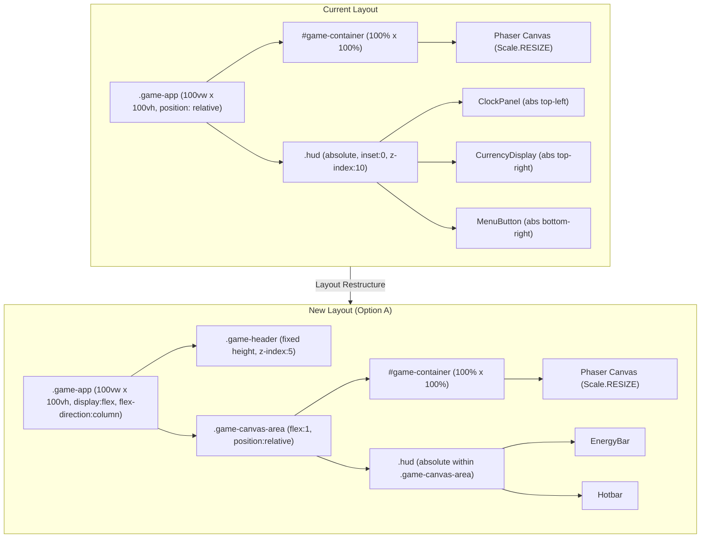

# ADR-003: Game Header Layout Architecture

## Status

Proposed

## Context

The Nookstead game client currently uses a full-viewport (100vw x 100vh) layout where:

- The Phaser game canvas occupies the entire browser viewport via `.game-app` (position: relative, width: 100vw, height: 100vh)
- The Phaser `game-container` div renders at 100% width and height of its parent, with `Phaser.Scale.RESIZE` mode auto-filling all available parent space
- HUD elements (ClockPanel, CurrencyDisplay, EnergyBar, Hotbar, MenuButton) are React components overlaid on top of the canvas via `.hud` at z-index 10, using `position: absolute; inset: 0; pointer-events: none`
- Interactive HUD children use `pointer-events: auto` to receive input
- The `--ui-scale` CSS custom property (`Math.floor(Math.min(vw/480, vh/270))`, clamped 2-6) drives responsive sizing for all HUD elements

A new persistent header bar is needed at the top of the game screen (see [PRD-002: Game Header and Navigation Bar](../prd/prd-002-game-header-navigation.md)). The header consolidates the existing ClockPanel (day, time, season) and CurrencyDisplay (gold) from their absolute-positioned corners, adds a Nookstead text logo, and introduces five icon-based navigation items (Inventory, Map, Quests, Social, Settings). This requires a decision on how the header integrates with the existing full-viewport canvas layout.

Key constraints:
1. Phaser.Scale.RESIZE fills its parent container -- the parent's CSS dimensions determine the canvas size
2. The Game scene already handles `scale.on('resize', ...)` to refit the camera, so Phaser tolerates dynamic resizing
3. The project uses global CSS with PostCSS (no CSS Modules, no Tailwind) -- all styles go in `global.css`
4. HUD elements (EnergyBar, Hotbar) must continue functioning relative to the game canvas, not the header
5. The header must be a React component with full accessibility (ARIA landmarks, keyboard focus, screen reader support)
6. Navigation icons need to emit EventBus events following the existing `hud:` naming convention

## Decision

We will use the **Layout Restructure** approach. The `.game-app` container changes from a single full-viewport block to a vertical flexbox: a fixed-height header at the top, with the game canvas container filling the remaining viewport height via `flex: 1`.

### Decision Details

| Item | Content |
|------|---------|
| **Decision** | Restructure the game layout to a vertical flexbox with a fixed-height header and a flex-grow canvas area |
| **Why now** | The header is a prerequisite for all navigation features (Inventory, Map, Quests, Social, Settings panels) and consolidates scattered HUD elements into a predictable location |
| **Why this** | Layout restructure gives Phaser accurate dimensions from the start -- no guessing, no hidden canvas area. The overlay approach (Option B) obscures game content, and the Phaser-rendered approach (Option C) sacrifices React integration and accessibility. |
| **Known unknowns** | (1) Exact header height behavior across all `--ui-scale` factors (2-6) needs testing to confirm the canvas area remains playable on small viewports. (2) Whether the Phaser Scale.RESIZE event fires reliably on initial mount when the flexbox layout is computed asynchronously. |
| **Kill criteria** | If Phaser canvas rendering exhibits persistent visual glitches (flickering, incorrect dimensions, camera misalignment) when the parent container height is determined by flexbox, revert to the overlay approach (Option B) as a fallback. |

## Rationale

The header must coexist with the Phaser game canvas without degrading the gameplay experience. The core technical question is: **should the header reduce the canvas area (layout restructure) or float above it (overlay)?**

Layout restructure is the correct choice because:

1. **Phaser gets truthful dimensions.** With `Scale.RESIZE`, Phaser reads the parent container's computed dimensions and sizes the canvas accordingly. A flexbox layout gives Phaser a parent container that accurately reflects the available game area. No content is hidden behind the header.

2. **HUD positioning stays correct.** The `.hud` overlay uses `position: absolute; inset: 0` relative to `.game-app`. After restructuring, the HUD overlay must be repositioned relative to the canvas container (not the full viewport). This is a one-time CSS change with clear semantics.

3. **Future-proof for additional UI chrome.** A flex layout naturally supports adding a footer bar, side panels, or other React UI without fighting absolute positioning or z-index stacking.

4. **Camera zoom calculations remain simple.** The Game scene calculates `cam.setZoom(Math.min(gameSize.width / mapPixelW, gameSize.height / mapPixelH))`. With layout restructure, `gameSize` accurately reflects the playable area. With an overlay, the camera would need to account for obscured regions.

### Options Considered

#### Option A: Layout Restructure (Selected)

Restructure `.game-app` from a single full-viewport container to a vertical flexbox layout. The header occupies a fixed pixel height at the top. The canvas container occupies the remaining height via `flex: 1`. Phaser initializes inside the reduced container and receives accurate dimensions through `Scale.RESIZE`.

- **Pros:**
  - Phaser canvas dimensions accurately reflect the visible game area
  - No game content is obscured by UI elements
  - Camera zoom and centering calculations in the Game scene work correctly without adjustment
  - Clean separation between React UI chrome (header) and game rendering surface (canvas container)
  - The existing `scale.on('resize', ...)` handler in the Game scene handles dimension changes automatically
  - CSS flexbox is well-understood, performant, and supported across all target browsers
  - Future UI additions (footer, side panels) integrate naturally into the flex layout

- **Cons:**
  - Requires changes to `.game-app` CSS layout (flexbox migration)
  - The `--ui-scale` calculation must be updated to use canvas container height instead of `window.innerHeight`
  - The HUD overlay container must be repositioned relative to the canvas area, not the full viewport
  - Minor risk of layout computation timing on initial mount -- Phaser may need to wait one frame for flexbox dimensions to resolve
  - On small mobile viewports, the header height reduces the already-limited game canvas area

- **Effort:** 2-3 days

#### Option B: Overlay Approach (Rejected)

Keep the Phaser canvas at full viewport dimensions. Render the header as a fixed-position React component at z-index 15 (above the canvas but below modal overlays) overlaying the top of the game area.

- **Pros:**
  - Simplest implementation -- no layout changes needed
  - Phaser canvas continues to render at full viewport size
  - No risk of flexbox timing issues on initial mount
  - `--ui-scale` calculation remains unchanged

- **Cons:**
  - **Header obscures the top portion of the game canvas** -- players lose visible game area without the camera knowing about it
  - Camera zoom/centering calculations become inaccurate: Phaser thinks it has full viewport height, but the top is hidden behind the header
  - Pointer events on the header area prevent canvas interaction in the obscured zone, creating a "dead zone" for game input
  - Future UI additions (footer, side panels) compound the obscured area problem
  - Difficult to maintain accurate HUD positioning -- EnergyBar, ClockPanel offsets must account for the header's visual intrusion
  - Contradicts the PRD requirement: "the Phaser canvas fills the remaining viewport height" (FR-6)

- **Effort:** 1-2 days

#### Option C: Phaser-Rendered Header (Rejected)

Render the header as Phaser game objects within a dedicated UI scene that runs in parallel with the main Game scene. Navigation icons, clock, currency, and logo would all be Phaser sprites/text objects.

- **Pros:**
  - Full pixel-perfect control over header rendering
  - No DOM/CSS layout concerns -- everything is within the Phaser canvas
  - Consistent rendering pipeline (no React-Phaser boundary for header elements)
  - Pointer events handled entirely within Phaser's input system

- **Cons:**
  - **No HTML semantics or accessibility** -- Phaser canvas content is opaque to screen readers; ARIA landmarks, focus management, and keyboard navigation would need to be manually reimplemented in JavaScript
  - Violates the PRD accessibility requirements (ARIA landmarks, `role="navigation"`, `aria-live`, focus indicators)
  - Duplicates React capabilities that already exist -- the HUD system is React-based, and the header shares data sources (EventBus events for clock and currency)
  - Harder to integrate with React state management -- navigation panel open/close state, active item tracking, and keyboard shortcuts would need a bridge layer
  - Text rendering in Phaser (bitmap fonts or web fonts) is less flexible than CSS for responsive text sizing, wrapping, and internationalization
  - Increases Phaser scene complexity and the game's rendering workload (header sprites rendered every frame even though they are mostly static)
  - Contradicts the existing architecture pattern where all UI overlays are React components

- **Effort:** 4-5 days

### Comparison

| Criterion | Layout Restructure (A) | Overlay (B) | Phaser-Rendered (C) |
|---|---|---|---|
| Canvas accuracy | Phaser gets exact available space | Canvas oversized; top area hidden | Canvas includes header; no separation |
| Game content visibility | No content obscured | Top portion hidden behind header | No content obscured |
| Accessibility (ARIA, focus, screen readers) | Full HTML/React support | Full HTML/React support | Manual reimplementation required |
| HUD element compatibility | One-time reposition to canvas container | Must account for header visually | All HUD becomes Phaser objects |
| `--ui-scale` impact | Must update to use container height | No change needed | Not applicable (Phaser sizing) |
| Camera zoom correctness | Automatic via Scale.RESIZE | Requires manual offset compensation | Requires header region exclusion |
| Future UI additions (footer, panels) | Flexbox extends naturally | Compounds obscured area problem | Each addition is a new Phaser scene |
| Implementation effort | 2-3 days | 1-2 days | 4-5 days |
| Consistency with existing patterns | Follows React HUD pattern | Follows React HUD pattern | Breaks React HUD pattern |
| PRD FR-6 compliance | Fully compliant | Non-compliant (canvas not "remaining height") | Partially compliant |

### Architecture Impact Diagram

## Consequences

### Positive

1. **Accurate canvas dimensions** -- Phaser receives the true available game area from its parent container, eliminating any mismatch between what the player sees and what the camera renders
2. **Clean z-index layering** -- Header at z-index 5, HUD at z-index 10, loading screen at z-index 20 -- no overlapping concerns
3. **Consolidated top-area HUD** -- ClockPanel and CurrencyDisplay move from scattered absolute positions into the header, reducing the number of floating overlay elements
4. **MenuButton removal** -- The bottom-right MenuButton is replaced by header navigation icons, simplifying the HUD component tree
5. **Future layout extensibility** -- The flex container pattern supports adding footer bars, side panels, or other React UI chrome without restructuring
6. **Accessibility-ready** -- The header is a standard HTML/React component with full ARIA landmark support, keyboard focus management, and screen reader compatibility
7. **Camera calculations remain unchanged** -- The existing `scale.on('resize', ...)` handler in the Game scene automatically receives the correct reduced dimensions

### Negative

1. **CSS layout migration** -- `.game-app` changes from a simple position/dimension block to a flexbox container; all child positioning must be verified
2. **`--ui-scale` recalculation required** -- Currently computed from `window.innerWidth` and `window.innerHeight`; must change to use the canvas container's dimensions (e.g., via `ResizeObserver` or a ref to the container element) to avoid the header height inflating the scale factor
3. **HUD overlay repositioning** -- The `.hud` container's `position: absolute; inset: 0` must be scoped to the canvas area container rather than `.game-app`, requiring a DOM restructure within `GameApp.tsx`
4. **Initial mount timing** -- Flexbox dimensions are computed asynchronously by the browser; Phaser may receive a zero-height container on the first frame before layout resolves. A `requestAnimationFrame` guard or `ResizeObserver` callback may be needed.
5. **Reduced game area on small viewports** -- On a 667px-tall mobile viewport, a 48px header (at 1x scale) reduces the canvas to ~619px. At higher `--ui-scale` values, the header height increases proportionally. Header height must be capped to preserve a minimum playable area.

### EventBus Contract Changes

| Event | Status | Direction |
|---|---|---|
| `hud:time` | **Unchanged** | Phaser -> Header (was: Phaser -> ClockPanel) |
| `hud:gold` | **Unchanged** | Phaser -> Header (was: Phaser -> CurrencyDisplay) |
| `hud:energy` | **Unchanged** | Phaser -> HUD (EnergyBar) |
| `hud:menu-toggle` | **Deprecated** | Was emitted by MenuButton; replaced by per-panel events |
| `hud:open-panel:inventory` | **New** | Header -> Game system |
| `hud:open-panel:map` | **New** | Header -> Game system |
| `hud:open-panel:quests` | **New** | Header -> Game system |
| `hud:open-panel:social` | **New** | Header -> Game system |
| `hud:open-panel:settings` | **New** | Header -> Game system |
| `hud:close-panel` | **New** | Header -> Game system (close active panel) |

### Z-Index Map

| Layer | Z-Index | Contents |
|---|---|---|
| Phaser Canvas | 0 (default) | Game rendering surface |
| Game Header | 5 | Logo, clock, currency, navigation icons |
| HUD Overlay | 10 | EnergyBar, Hotbar (remaining overlay elements) |
| Loading Screen | 20 | Full-screen loading overlay |
| Modal Overlays | 30+ | Future: game system panels (Inventory, Map, etc.) |

## Implementation Guidance

- The header component should be a React component rendered as a sibling to the canvas container, not nested inside the HUD overlay
- Use `ResizeObserver` on the canvas container element to compute `--ui-scale` from the actual available canvas dimensions rather than `window.innerWidth` / `window.innerHeight`
- The HUD overlay must be repositioned to be a child of the canvas area container (not `.game-app`) so that `position: absolute; inset: 0` scopes correctly to the game rendering area
- Navigation items should be defined as a data-driven array so future additions do not require structural component changes
- Header height should be expressed as a function of `--ui-scale` and the 16px sprite grid (e.g., `calc(48px * var(--ui-scale) / 3)`) to maintain pixel-perfect alignment
- Cap the header's maximum height to prevent it from consuming more than 10% of the viewport on mobile devices
- Keyboard shortcut handlers for navigation (I, M, J, O, Escape) must check that no text input element is focused before firing, to avoid conflicts with chat or dialogue input fields

## Related Information

- [PRD-002: Game Header and Navigation Bar](../prd/prd-002-game-header-navigation.md) -- Requirements document driving this decision
- [ADR-001: Procedural Island Map Generation Architecture](adr-001-map-generation-architecture.md) -- Establishes the Phaser tilemap and camera architecture that the layout restructure must preserve
- [ADR-002: Player Authentication with NextAuth.js v5](adr-002-nextauth-authentication.md) -- Authentication prerequisite; header renders only for authenticated players on `/game`

## References

- [Phaser 3 Scale Manager Documentation](https://docs.phaser.io/phaser/concepts/scale-manager) -- Scale.RESIZE mode behavior and parent container sizing
- [Phaser 3 Scale.RESIZE API](https://docs.phaser.io/api-documentation/class/scale-scalemanager) -- Scale Manager works in tandem with parent element CSS; padding is not accounted for
- [Phaser 3 Scale Mode Constants](https://docs.phaser.io/api-documentation/constant/scale) -- RESIZE mode: "Canvas is resized to fit all available parent space, regardless of aspect ratio"
- [MDN: CSS Flexbox Layout](https://developer.mozilla.org/en-US/docs/Web/CSS/CSS_flexible_box_layout) -- Flexbox specification used for the header + canvas layout
- [MDN: ResizeObserver](https://developer.mozilla.org/en-US/docs/Web/API/ResizeObserver) -- API for observing canvas container dimension changes for `--ui-scale` recalculation
- [WCAG 2.1 AA: Target Size](https://www.w3.org/WAI/WCAG21/Understanding/target-size.html) -- Minimum 44x44 CSS pixel touch targets for header interactive elements
- [LimeZu Modern UI Asset Pack](https://limezu.itch.io/) -- Sprite sheet for header navigation icons and NineSlicePanel background

## Date

2026-02-15
