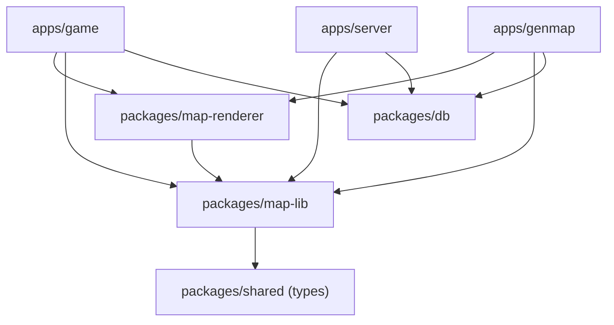
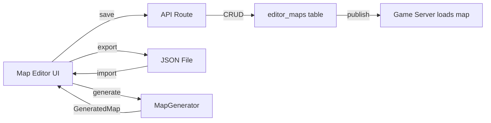

# ADR-0009: Map Editor Architecture -- Shared Packages and DB Schema

## Status

Proposed

## Context

The Nookstead project is building a map editor integrated into the genmap admin app (`apps/genmap/`). This effort surfaces four architectural concerns that require explicit decisions:

### 1. Code Duplication Between Apps

Map-related algorithms are duplicated across `apps/game/` and `apps/server/`:

| File (game) | File (server) | Content | Identical? |
|---|---|---|---|
| `src/game/autotile.ts` | `src/mapgen/autotile.ts` | Blob-47 autotile engine (184 lines) | Yes (byte-for-byte, except one JSDoc word: "drawFrame" vs "rendering") |
| `src/game/terrain.ts` | N/A | 26 terrain definitions, relationships, tileset collections | No server equivalent |
| N/A | `src/mapgen/terrain-properties.ts` | Surface walkability properties | No game equivalent |
| N/A | `src/mapgen/index.ts` + `passes/*.ts` | Full generation pipeline (MapGenerator, 4 passes) | Server-only |

The autotile duplication is a clear Rule of Three violation -- with the genmap app needing the same algorithm, this code would exist in three places without extraction. The terrain definitions and generation pipeline are server-only but will be needed by the map editor for preview rendering and generation features.

### 2. Package Architecture for Shared Code

The extracted code has two distinct dependency profiles:

- **Pure data/algorithms**: Types, autotile engine, terrain definitions, generation pipeline. Dependencies: `alea`, `simplex-noise` (pure JS). No browser or framework dependencies.
- **Rendering utilities**: Phaser.js tilemap rendering, autotile layer composition, terrain sprite loading. Dependency: `phaser` (browser-only, ~1MB).

Both `apps/game/` and `apps/genmap/` need rendering utilities, but `apps/server/` must never depend on Phaser.

### 3. DB Schema for Editor Maps

The genmap app needs tables for editor-created maps, reusable templates, and zone definitions. A previous attempt at tile map tables (`tile_maps`, `tile_map_groups`) was created in migration 0003 and dropped in migration 0004, replaced by the atlas frames system (ADR-0007, ADR-0008). The new schema must coexist with existing tables (`users`, `accounts`, `player_positions`, `maps`, `sprites`, `atlas_frames`, `game_objects`) and avoid repeating the mistakes of the previous design.

### 4. Phaser.js Integration in genmap

The genmap app (`apps/genmap/`) is a Next.js 16 app that currently has no Phaser.js dependency. The game app (`apps/game/`) already uses Phaser with a dynamic import pattern to avoid SSR issues. The map editor requires an interactive Phaser canvas for terrain painting, object placement, and live preview.

### 5. Map Data Workflow

The editor must support both an import/export workflow (generate maps, export JSON, import into game) and direct editing of live maps (modify persisted maps that the game server loads). This dual-mode capability affects how editor maps relate to the existing `maps` table.

This ADR covers five interconnected decisions:

1. Package extraction strategy (monolithic vs multi-package)
2. Library build strategy (zero-build vs build-step)
3. DB schema design for editor maps
4. Phaser.js integration pattern in genmap
5. Map data workflow (import/export vs direct editing)

---

## Decision 1: Three-Package Architecture

### Decision Details

| Item | Content |
|------|---------|
| **Decision** | Extract shared map code into two new packages (`packages/map-lib` for pure data/algorithms, `packages/map-renderer` for Phaser rendering) and extend `packages/db` with new editor map tables |
| **Why now** | The genmap map editor is the third consumer of autotile/terrain code (after game and server), triggering the Rule of Three for extraction. Without extraction, the same 184-line autotile engine would exist in three apps. |
| **Why this** | Separating pure algorithms from Phaser-dependent rendering code allows the server to depend on map-lib without pulling in Phaser (~1MB browser-only library). This matches the natural dependency boundary: server needs generation but not rendering. |
| **Known unknowns** | Whether the boundary between map-lib and map-renderer will remain clean as the editor evolves, or whether rendering-related types will leak into map-lib |
| **Kill criteria** | If map-renderer contains fewer than 3 modules after initial extraction (indicating the Phaser code is too thin to justify a separate package), merge it into map-lib with Phaser as an optional peer dependency |

### Options Considered

1. **No Extraction (keep code in apps)**
   - Overview: Each app maintains its own copy of shared code.
   - Pros: Zero upfront work, no cross-package dependency management, each app can diverge independently
   - Cons: Three copies of autotile engine (DRY violation), bug fixes must be applied to all copies manually, terrain definitions will diverge over time, generation pipeline cannot be shared with genmap without copy-pasting ~500 lines
   - Effort: 0 days (but ongoing maintenance cost)

2. **Single Package with Optional Phaser Dependency**
   - Overview: One `packages/map` package containing everything, with Phaser as an optional peer dependency.
   - Pros: Simpler package topology (one package instead of two), single import path for all map utilities, no need to decide the boundary between lib and renderer
   - Cons: Server app would depend on a package that lists Phaser as a peer dependency (confusing even if optional), bundler tree-shaking may not eliminate Phaser-related code from server builds, violates the principle that packages should declare their actual dependencies, optional peer dependencies are a source of subtle runtime errors
   - Effort: 3 days

3. **Three-Package Architecture (Selected)**
   - Overview: `packages/map-lib` (pure data: types, autotile, terrain, generation pipeline), `packages/map-renderer` (Phaser rendering: tilemap composition, terrain sprite loading), `packages/db` extension (new tables for editor maps).
   - Pros: Clean dependency boundary (map-lib has zero browser deps, map-renderer has explicit Phaser dep), server depends only on map-lib (no Phaser contamination), each package has a single responsibility, follows existing project pattern (packages/shared for types, packages/db for data access), map-lib re-exports types from @nookstead/shared to provide a single import source for map types
   - Cons: Two new packages to maintain, cross-package imports add indirection, must coordinate changes when interfaces span both packages
   - Effort: 4 days

4. **All-in-One Map Package Including Phaser**
   - Overview: One `packages/map` package with Phaser as a hard dependency.
   - Pros: Simplest import topology, no boundary decisions needed
   - Cons: Server would transitively depend on Phaser (unacceptable -- Phaser requires a browser DOM), cannot be used in Node.js environments, fundamentally incompatible with the server's runtime
   - Effort: 3 days (but blocks server usage entirely)

### Comparison

| Criterion | No Extraction | Single + Optional | Three-Package | All-in-One |
|---|---|---|---|---|
| DRY compliance | Violated (3 copies) | Compliant | Compliant | Compliant |
| Server compatibility | Works (isolated copies) | Confusing (optional Phaser) | Clean (no Phaser in map-lib) | Blocked (requires DOM) |
| Maintenance burden | High (sync 3 copies) | Low | Medium (2 packages) | Low |
| Dependency clarity | N/A | Ambiguous (optional) | Explicit | Over-coupled |
| Existing pattern alignment | Against (DRY violation) | Partial | Strong (matches shared/db split) | Against (server blocked) |
| Implementation effort | 0 days | 3 days | 4 days | 3 days |

### Decision

Three-package architecture selected. The autotile engine exists in two apps today and will be needed in a third (genmap), making this a textbook Rule of Three extraction. The pure-data vs rendering-dependency boundary is natural and well-defined: `map-lib` contains types, algorithms, and generation logic that run in any JavaScript environment; `map-renderer` contains Phaser.js-specific rendering code that requires a browser DOM. This matches the existing project pattern where `packages/shared` provides pure types and `packages/db` provides data access -- similarly, `packages/map-lib` provides pure map logic and `packages/map-renderer` provides rendering.

**Package Dependency Graph**:



**Package Contents**:

| Package | Contents | Dependencies |
|---|---|---|
| `packages/map-lib` | autotile engine, terrain definitions, terrain properties, generation pipeline (MapGenerator + 4 passes), re-exported types from @nookstead/shared | `@nookstead/shared`, `alea`, `simplex-noise` |
| `packages/map-renderer` | Phaser tilemap composition, terrain sprite loader, autotile layer renderer | `@nookstead/map-lib`, `phaser` (peer) |
| `packages/db` (extension) | `editor_maps`, `map_templates`, `map_zones` tables | existing Drizzle deps |

---

## Decision 2: Zero-Build Library Pattern for map-lib

### Decision Details

| Item | Content |
|------|---------|
| **Decision** | `packages/map-lib` uses direct TypeScript source exports (zero-build pattern) following the `@nookstead/db` precedent. `packages/map-renderer` also uses zero-build since it is consumed only by Next.js apps that compile TypeScript natively. |
| **Why now** | The build strategy must be decided before creating the packages. The project already has two patterns in use (zero-build for db, build-step for shared), and consistency within the new packages matters. |
| **Why this** | Zero-build eliminates an entire class of issues: stale dist/ artifacts, forgotten rebuilds, tsconfig.lib.json synchronization. The db package has proven this pattern works reliably in the project. All consumers (Next.js apps and the Colyseus server with tsx) can consume TypeScript source directly. |
| **Known unknowns** | Whether `simplex-noise` and `alea` (map-lib dependencies) have any issues when imported through a zero-build TypeScript package chain |
| **Kill criteria** | If any consumer cannot resolve TypeScript source imports from map-lib (e.g., a tool or bundler that requires compiled JS), add a build step for that specific consumer using tsconfig project references |

### Options Considered

1. **Build-Step Pattern (like @nookstead/shared)**
   - Overview: Compile TypeScript to `dist/` using `tsconfig.lib.json`, export compiled JS with declaration files.
   - Pros: Standard pattern, works with any consumer regardless of TypeScript support, clear separation of source and output, consumers get pre-compiled JS (faster cold starts)
   - Cons: Must rebuild after every source change (or use watch mode), stale `dist/` artifacts cause confusing bugs, additional tsconfig.lib.json to maintain, `@nookstead/shared` already demonstrates this pattern's friction (dist/ files are committed to git), adds a build target to the Nx task graph that all dependent targets must wait for
   - Effort: 2 days (including tsconfig setup)

2. **Zero-Build Pattern (like @nookstead/db) (Selected)**
   - Overview: Export TypeScript source files directly via package.json exports. No dist/ directory, no build step.
   - Pros: Zero build lag (changes are immediately available to consumers), no stale artifact bugs, simpler package.json (no build scripts), proven pattern in the project (db package works this way), eliminates `tsconfig.lib.json` and dist/ directory, no Nx build target needed (reduces task graph complexity), Next.js Turbopack and tsx (Colyseus runner) both consume TS source natively
   - Cons: Requires all consumers to support TypeScript source imports, slightly slower initial compilation (consumer must compile map-lib source), cannot publish to npm registry without adding a build step (not relevant for private monorepo packages)
   - Effort: 1 day

3. **Dual-Export Pattern (both built JS and source)**
   - Overview: Provide both compiled dist/ and source exports via package.json conditional exports.
   - Pros: Maximum compatibility (consumers can choose source or compiled), supports both TS-aware and JS-only consumers
   - Cons: Most complex to maintain (two export paths, two configs), dual paths are a source of subtle resolution bugs, unnecessary for a private monorepo where all consumers support TypeScript, no consumer in this project needs compiled JS
   - Effort: 3 days

### Comparison

| Criterion | Build-Step | Zero-Build | Dual-Export |
|---|---|---|---|
| Development friction | Medium (rebuild needed) | None (instant) | High (two paths) |
| Stale artifact risk | Present | None | Present |
| Consumer compatibility | Universal | TS-aware only | Universal |
| Project precedent | @nookstead/shared | @nookstead/db | None |
| Maintenance complexity | Medium | Low | High |
| Nx task graph impact | Adds build target | No impact | Adds build target |
| Implementation effort | 2 days | 1 day | 3 days |

### Decision

Zero-build pattern selected. The `@nookstead/db` package has proven that direct TypeScript source exports work reliably in this monorepo. All three consumers of map-lib (game via Next.js, genmap via Next.js, server via tsx) can consume TypeScript source directly. The build-step pattern used by `@nookstead/shared` has demonstrated its friction: stale dist/ files have been a source of confusion, and the additional tsconfig.lib.json adds maintenance burden. For private monorepo packages that will never be published to npm, zero-build is strictly simpler.

**package.json exports pattern** (following db package):

```json
{
  "name": "@nookstead/map-lib",
  "main": "./src/index.ts",
  "types": "./src/index.ts",
  "exports": {
    ".": {
      "types": "./src/index.ts",
      "import": "./src/index.ts",
      "default": "./src/index.ts"
    }
  }
}
```

---

## Decision 3: Hybrid DB Schema for Editor Maps

### Decision Details

| Item | Content |
|------|---------|
| **Decision** | Create three new tables (`editor_maps`, `map_templates`, `map_zones`) using a hybrid approach: relational columns for fixed, queryable attributes and JSONB for flexible map data (grid, layers, walkable arrays, zone geometry) |
| **Why now** | The map editor requires persistence for authored maps. The previous `tile_maps`/`tile_map_groups` attempt (migration 0003, dropped in 0004) was designed for tile selection, not full map editing. A purpose-built schema is needed. |
| **Why this** | Map data (grids, layers, walkable arrays) is large, opaque, and loaded as a unit -- ideal for JSONB. Metadata (name, dimensions, author, timestamps) is queried and filtered -- ideal for relational columns. This hybrid avoids both the rigidity of fully normalized per-cell tables and the queryability loss of full-document JSONB. |
| **Known unknowns** | Whether JSONB storage size becomes a concern for large maps (a 128x128 map grid is ~650KB as JSON). PostgreSQL JSONB has a 255MB limit per value, so this is unlikely to be an issue. |
| **Kill criteria** | If map listing queries become slow (>100ms) because JSONB columns are loaded unnecessarily, add a `map_data` table with a 1:1 relationship to separate metadata from payload |

### Options Considered

1. **Extend Existing maps Table**
   - Overview: Add editor-specific columns to the existing `maps` table (which stores per-user procedurally generated maps).
   - Pros: No new tables, reuses existing schema and queries, single source of truth for all map data
   - Cons: Existing `maps` table has `userId` as primary key (one map per user) -- fundamentally incompatible with editor maps that are user-independent and many-to-one, would require a breaking migration (change PK from userId to a generated UUID), conflates two distinct concepts (player-owned generated maps vs editor-authored template maps), tight coupling makes it impossible to evolve editor maps independently
   - Effort: 2 days (with migration risk)

2. **Fully Normalized Relational Schema (separate table per cell)**
   - Overview: `editor_maps` table with metadata, `editor_map_cells` table with one row per cell (x, y, terrain, elevation), `editor_map_layers` table with one row per layer per cell.
   - Pros: Maximum query flexibility (query individual cells, filter by terrain type), enforces data integrity at the DB level, standard relational modeling
   - Cons: Extreme row count (128x128 map = 16,384 cell rows + 16,384 * layers layer rows), loading a complete map requires joining and assembling potentially 100K+ rows, saving a map requires upserting 16K+ rows (slow), schema is tightly coupled to the cell/layer data model (any change requires migration), CRUD operations for the editor become complex multi-table transactions
   - Effort: 5 days

3. **Hybrid Schema: Relational Metadata + JSONB Payload (Selected)**
   - Overview: `editor_maps` table with relational columns for metadata (name, width, height, seed, status, timestamps) and JSONB columns for map data (grid, layers, walkable). `map_templates` for reusable generation presets. `map_zones` for named regions within a map.
   - Pros: Relational columns enable efficient filtering and sorting (list maps by name, filter by status), JSONB stores map payload as a single document (load/save is one read/write), matches the existing `maps` table pattern (which already uses JSONB for grid, layers, walkable), schema can evolve by adding JSONB fields without migrations, zone/template concepts have clear dedicated tables
   - Cons: Cannot query individual cells via SQL (must load full JSONB and parse in application), JSONB storage is slightly larger than normalized (repeated keys), no referential integrity within JSONB data, JSONB validation must be done in application code
   - Effort: 3 days

4. **Full JSONB (single document per map)**
   - Overview: One `editor_maps` table with `id` and a single `data` JSONB column containing everything.
   - Pros: Maximum flexibility, any schema changes are just application code, fastest to implement
   - Cons: Cannot filter or sort maps without extracting from JSONB (slow), no type safety at the DB level, no indexing on metadata fields, violates the established pattern of using relational columns for fixed attributes
   - Effort: 1 day

### Comparison

| Criterion | Extend Existing | Fully Normalized | Hybrid | Full JSONB |
|---|---|---|---|---|
| Query flexibility (metadata) | Good | Excellent | Good | Poor |
| Query flexibility (cells) | N/A | Excellent | None (app-side) | None (app-side) |
| Load/save performance | Good | Poor (100K+ rows) | Good (1 read/write) | Good |
| Schema evolution | Risky (breaking PK) | Rigid (migrations) | Flexible (JSONB + cols) | Maximum |
| Existing pattern alignment | Conflicts (PK model) | New pattern | Matches `maps` table | Partial |
| Data integrity | Medium | High | Medium | Low |
| Implementation effort | 2 days | 5 days | 3 days | 1 day |

### Decision

Hybrid schema selected. This follows the exact pattern established by the existing `maps` table, which uses relational columns for `userId` and `seed` alongside JSONB for `grid`, `layers`, and `walkable`. The hybrid approach provides the best balance: relational columns for metadata that needs to be queried (name, status, dimensions) and JSONB for map payload that is always loaded as a complete unit. The fully normalized approach is disqualified by performance: a 128x128 map would require 16,384+ cell rows, making load/save operations impractically slow for an interactive editor. The previous `tile_maps`/`tile_map_groups` schema (migration 0003) was dropped because it modeled tile selection, not full maps -- this schema models complete maps with proper lifecycle support (draft/published status).

**Schema Design**:

```sql
-- Editor-authored maps (distinct from player-generated maps in 'maps' table)
CREATE TABLE editor_maps (
  id          UUID PRIMARY KEY DEFAULT gen_random_uuid(),
  name        VARCHAR(255) NOT NULL,
  description TEXT,
  width       INTEGER NOT NULL,
  height      INTEGER NOT NULL,
  seed        INTEGER,
  status      VARCHAR(20) NOT NULL DEFAULT 'draft',  -- draft | published
  grid        JSONB NOT NULL,      -- Grid (Cell[][])
  layers      JSONB NOT NULL,      -- LayerData[]
  walkable    JSONB NOT NULL,      -- boolean[][]
  metadata    JSONB,               -- extensible properties
  created_at  TIMESTAMPTZ NOT NULL DEFAULT now(),
  updated_at  TIMESTAMPTZ NOT NULL DEFAULT now()
);

-- Reusable map generation templates (pass configurations)
CREATE TABLE map_templates (
  id          UUID PRIMARY KEY DEFAULT gen_random_uuid(),
  name        VARCHAR(255) NOT NULL,
  description TEXT,
  width       INTEGER NOT NULL,
  height      INTEGER NOT NULL,
  passes      JSONB NOT NULL,      -- GenerationPass configuration
  metadata    JSONB,
  created_at  TIMESTAMPTZ NOT NULL DEFAULT now(),
  updated_at  TIMESTAMPTZ NOT NULL DEFAULT now()
);

-- Named zones within an editor map (spawn points, biome regions, etc.)
CREATE TABLE map_zones (
  id          UUID PRIMARY KEY DEFAULT gen_random_uuid(),
  map_id      UUID NOT NULL REFERENCES editor_maps(id) ON DELETE CASCADE,
  name        VARCHAR(255) NOT NULL,
  zone_type   VARCHAR(100) NOT NULL,  -- spawn | biome | boundary | trigger
  geometry    JSONB NOT NULL,          -- { x, y, width, height } or polygon
  properties  JSONB,                   -- zone-specific config
  created_at  TIMESTAMPTZ NOT NULL DEFAULT now(),
  updated_at  TIMESTAMPTZ NOT NULL DEFAULT now()
);
```

**Relationship to Existing Tables**:

- `editor_maps` is intentionally separate from the existing `maps` table. The `maps` table stores per-user procedurally generated maps (PK = userId). `editor_maps` stores author-created map designs (PK = generated UUID, no user association).
- `map_zones` references `editor_maps` with CASCADE delete (zones belong to a map).
- `map_templates` is standalone (templates are reusable across maps).
- No foreign keys to `sprites`, `atlas_frames`, or `game_objects` -- game objects placed on maps are stored as JSONB within the map's grid/layers data.

---

## Decision 4: Dynamic Import with SSR-Safe Wrapper for Phaser in genmap

### Decision Details

| Item | Content |
|------|---------|
| **Decision** | Use Next.js `dynamic()` with `ssr: false` to load a Phaser wrapper component, following the official Phaser Next.js template pattern and the existing pattern in `apps/game/` |
| **Why now** | The map editor requires an interactive Phaser canvas for terrain painting and live preview. Phaser requires browser APIs (Canvas, WebGL, DOM) and cannot run during SSR. |
| **Why this** | This is the official Phaser-recommended pattern for Next.js integration, already proven in the game app. Using the same pattern across both apps reduces cognitive overhead and enables code sharing via map-renderer. |
| **Known unknowns** | Whether Phaser's memory usage in the editor (potentially multiple scenes: main editor, minimap preview, terrain palette) will be problematic in a long-running admin session |
| **Kill criteria** | If Phaser initialization in genmap takes >2 seconds or causes visible layout shift, consider pre-rendering a static canvas fallback while Phaser loads |

### Options Considered

1. **Server-Side Rendering Attempt (import Phaser normally)**
   - Overview: Import Phaser directly without SSR protection.
   - Pros: Simplest import statement, no wrapper needed
   - Cons: Crashes during SSR (Phaser accesses `window`, `document`, `navigator`), fundamentally incompatible with Next.js SSR/SSG, not a viable option
   - Effort: 0.5 days (then rewrite)

2. **Dynamic Import with SSR-Safe Wrapper (Selected)**
   - Overview: Wrap the Phaser game component in `next/dynamic` with `ssr: false`. The wrapper initializes Phaser only on the client side.
   - Pros: Official Phaser Next.js template pattern, already proven in apps/game/, clean separation (React handles UI, Phaser handles canvas), Turbopack-compatible, supports hot module reload during development
   - Cons: Phaser component is not available during SSR (shows loading placeholder), slight delay on initial load (Phaser bundle must be downloaded and initialized), cannot use Phaser data in getServerSideProps
   - Effort: 1 day

3. **iframe Isolation (embed Phaser in an iframe)**
   - Overview: Run Phaser in a separate HTML page loaded via iframe. Communicate via postMessage.
   - Pros: Complete isolation (Phaser crashes cannot affect the React app), can run a different bundler for the Phaser app, simple SSR story (iframe is just an HTML element)
   - Cons: Cross-frame communication is complex and slow (serialization overhead), cannot share React state with Phaser directly, poor developer experience (two build pipelines), breaks React DevTools integration, accessibility challenges, not how the game app works (inconsistent)
   - Effort: 5 days

### Comparison

| Criterion | Direct Import | Dynamic + SSR-Safe | iframe Isolation |
|---|---|---|---|
| SSR compatibility | Crashes | Works | Works |
| Communication overhead | None | None (same context) | High (postMessage) |
| Developer experience | Broken | Good (HMR works) | Poor (two builds) |
| Consistency with game app | N/A (broken) | Identical pattern | Different pattern |
| Implementation effort | 0.5 days (fails) | 1 day | 5 days |

### Decision

Dynamic import with SSR-safe wrapper selected. This is the same pattern used in `apps/game/` and recommended by the official Phaser Next.js template. The wrapper component uses `next/dynamic` with `ssr: false` to ensure Phaser is only loaded in the browser. An EventBus pattern (also from the official template) enables bidirectional communication between React UI components (tool panels, property editors) and the Phaser canvas (map rendering, terrain painting).

**Integration pattern**:

```typescript
// apps/genmap/src/components/map-editor-canvas.tsx
'use client';
import dynamic from 'next/dynamic';

const PhaserMapEditor = dynamic(
  () => import('./phaser-map-editor'),
  { ssr: false, loading: () => <div>Loading editor...</div> }
);
```

---

## Decision 5: Dual-Mode Map Workflow (Import/Export + Direct Editing)

### Decision Details

| Item | Content |
|------|---------|
| **Decision** | Support both import/export workflow (JSON file download/upload) and direct CRUD editing of `editor_maps` in the database. The editor saves to `editor_maps`; a publish action can export to the format expected by the game server's `maps` table. |
| **Why now** | The map editor's data flow must be designed before the UI is built. The choice between file-based and database-backed workflows affects the entire editor architecture. |
| **Why this** | Direct DB editing provides immediate persistence, undo history potential, and collaboration readiness. Import/export provides portability, version control integration (JSON files can be committed), and the ability to share maps without DB access. Both workflows share the same in-memory map representation (GeneratedMap type from @nookstead/shared). |
| **Known unknowns** | Whether the export format needs to differ from the DB storage format (currently both use the same GeneratedMap structure) |
| **Kill criteria** | If the export format and DB format diverge significantly, introduce a dedicated serialization layer rather than maintaining two parallel formats |

### Options Considered

1. **File-Only Workflow (no DB persistence for editor maps)**
   - Overview: Editor loads/saves JSON files. No new DB tables for editor maps.
   - Pros: Zero DB schema changes, maps are portable files, version-controllable (commit map JSONs to git), no server API needed (client-side only)
   - Cons: No persistence across browser sessions without manual save/load, no listing/searching maps (must browse files), no collaboration potential, cannot integrate with game server's map loading (server reads from DB, not files), undo/redo must be implemented entirely client-side
   - Effort: 2 days

2. **DB-Only Workflow (no import/export)**
   - Overview: Editor reads/writes directly to `editor_maps` table via API routes. No file import/export.
   - Pros: Automatic persistence, server-side listing and search, foundation for multi-user editing, integrates with game server's data access patterns
   - Cons: Cannot share maps without DB access, cannot version-control map designs, no offline editing, data locked in PostgreSQL
   - Effort: 3 days

3. **Dual-Mode Workflow (Selected)**
   - Overview: Primary workflow is DB-backed CRUD via API routes. Secondary workflow is JSON import/export for portability. Both use the same GeneratedMap in-memory representation.
   - Pros: Best of both worlds (persistence + portability), maps can be version-controlled as JSON exports, game server can load published maps from editor_maps or from the existing maps table, foundation for future features (versioning, collaboration, undo history)
   - Cons: Two code paths for load/save (API + file), must keep formats synchronized, slightly more complex editor state management
   - Effort: 4 days

### Comparison

| Criterion | File-Only | DB-Only | Dual-Mode |
|---|---|---|---|
| Persistence | Manual | Automatic | Automatic + exportable |
| Portability | High (files) | Low (DB-locked) | High (export) |
| Version control | Native (git) | None | Via export |
| Game server integration | None | Direct | Direct + export |
| Collaboration potential | None | Foundation | Foundation |
| Implementation effort | 2 days | 3 days | 4 days |

### Decision

Dual-mode workflow selected. The DB-backed primary workflow provides automatic persistence and integrates with the existing data access patterns (Drizzle ORM, API routes). The import/export secondary workflow provides portability and enables version control of map designs. Both modes operate on the same `GeneratedMap` type (defined in `@nookstead/shared`), ensuring format consistency. The `editor_maps` table stores the authoritative version; JSON exports are snapshots that can be re-imported.

**Data Flow**:



---

## Consequences

### Positive Consequences

- **DRY compliance**: Autotile engine, terrain definitions, and generation pipeline exist in exactly one location (`packages/map-lib`), eliminating three-way duplication
- **Clean dependency boundary**: The server depends only on map-lib (pure algorithms, no browser deps). Game and genmap apps depend on both map-lib and map-renderer. Phaser is confined to map-renderer.
- **Zero-build simplicity**: Both new packages follow the db package pattern with direct TS source exports, eliminating stale dist/ artifacts and build step coordination
- **Schema consistency**: Editor map tables follow the established hybrid pattern (relational metadata + JSONB payload) already proven by the `maps` table
- **Proven Phaser integration**: The genmap app uses the same dynamic import pattern as the game app, reducing maintenance burden and enabling code sharing through map-renderer
- **Dual-mode flexibility**: DB-backed editing provides persistence and server integration; JSON export provides portability and version control

### Negative Consequences

- **Two new packages**: Adding `packages/map-lib` and `packages/map-renderer` increases the monorepo's package count and the surface area for dependency management. Mitigated by the zero-build pattern (no build scripts or dist/ directories to maintain).
- **Migration effort**: Existing code in `apps/game/src/game/autotile.ts`, `apps/game/src/game/terrain.ts`, `apps/server/src/mapgen/` must be moved to packages and all import paths updated. This is a one-time cost.
- **JSONB queryability limitation**: Map cell data stored as JSONB cannot be queried at the cell level via SQL. This is acceptable because the editor always loads/saves complete maps; cell-level queries are not a use case.
- **Previous schema lesson**: The `tile_maps`/`tile_map_groups` tables (migration 0003) were a false start, created and dropped within two migrations. The new `editor_maps` schema must be more carefully designed to avoid a repeat. Mitigated by using the proven `maps` table pattern and separating metadata from payload.

### Technical Debt

- **@nookstead/shared build pattern**: The `shared` package still uses a build-step pattern with dist/. Migrating it to zero-build (like db and the new packages) would improve consistency. This is out of scope for this ADR but should be addressed in a future cleanup.
- **Terrain type extensibility**: The `TerrainCellType` union (`'deep_water' | 'water' | 'grass'`) in `@nookstead/shared` will need to be extended as the editor supports more terrain types. The type definition lives in shared but the terrain definitions live in map-lib -- this split may cause friction.
- **map-renderer scope**: The initial map-renderer package may be thin (only a few Phaser utility modules). If it remains thin after the editor is fully built, consider merging it back into the consuming apps.

## Implementation Guidance

- Follow the `@nookstead/db` package.json pattern for both new packages: direct TS source exports, `"type": "module"`, no build scripts
- Use Nx tags for dependency enforcement: `map-lib` should have `"tags": ["scope:shared", "type:lib"]`, `map-renderer` should have `"tags": ["scope:client", "type:lib"]`
- Extract autotile.ts by moving `apps/server/src/mapgen/autotile.ts` to `packages/map-lib/src/autotile.ts` and replacing both app copies with re-exports or direct imports
- The generation pipeline (MapGenerator, passes) should move to map-lib with the same public API -- no consumer-facing changes except import paths
- map-lib should re-export types from `@nookstead/shared` (TerrainCellType, Cell, Grid, etc.) so consumers can import all map-related types from a single package
- Use Drizzle ORM for new table definitions in `packages/db/src/schema/`, following the existing table definition patterns (uuid PK, timestamp columns, typed exports)
- Phaser wrapper in genmap should use the EventBus pattern for React-Phaser communication, consistent with the game app

## Related Information

- [ADR-0006: Chunk-Based Room Architecture](ADR-0006-chunk-based-room-architecture.md) -- Defines the chunk/room model that editor maps will feed into
- [ADR-0007: Sprite Management Storage and Schema](ADR-0007-sprite-management-storage-and-schema.md) -- Established the S3 storage, DB adapter, and schema patterns for genmap
- [ADR-0008: Object Editor Collision Zones and Metadata](ADR-0008-object-editor-collision-zones-and-metadata.md) -- Defines game object structure that maps reference
- [ADR-001: Map Generation Architecture](adr-001-map-generation-architecture.md) -- Original map generation design being extracted to map-lib
- Migration 0003/0004 -- Previous tile_maps schema attempt (created and dropped)

## References

- [Nx Blog: Managing TypeScript Packages in Monorepos](https://nx.dev/blog/managing-ts-packages-in-monorepos) - Zero-build TypeScript package patterns and workspace recommendations
- [Nx Blog: Setup a Monorepo with PNPM Workspaces](https://nx.dev/blog/setup-a-monorepo-with-pnpm-workspaces-and-speed-it-up-with-nx) - PNPM workspace integration with Nx task graph
- [Official Phaser 3 + Next.js Template](https://github.com/phaserjs/template-nextjs) - Dynamic import and EventBus patterns for Phaser in Next.js
- [Phaser.io: Merging Next.js app and Phaser game](https://phaser.io/news/2025/12/merging-nextjs-app-and-phaser-game) - Latest guidance on Next.js + Phaser integration
- [PostgreSQL JSONB: Powerful Storage for Semi-Structured Data](https://www.architecture-weekly.com/p/postgresql-jsonb-powerful-storage) - JSONB vs relational trade-offs for flexible data modeling
- [When To Avoid JSONB In A PostgreSQL Schema](https://www.heap.io/blog/when-to-avoid-jsonb-in-a-postgresql-schema) - Guidance on hybrid relational + JSONB schemas

## Date

2026-02-19
