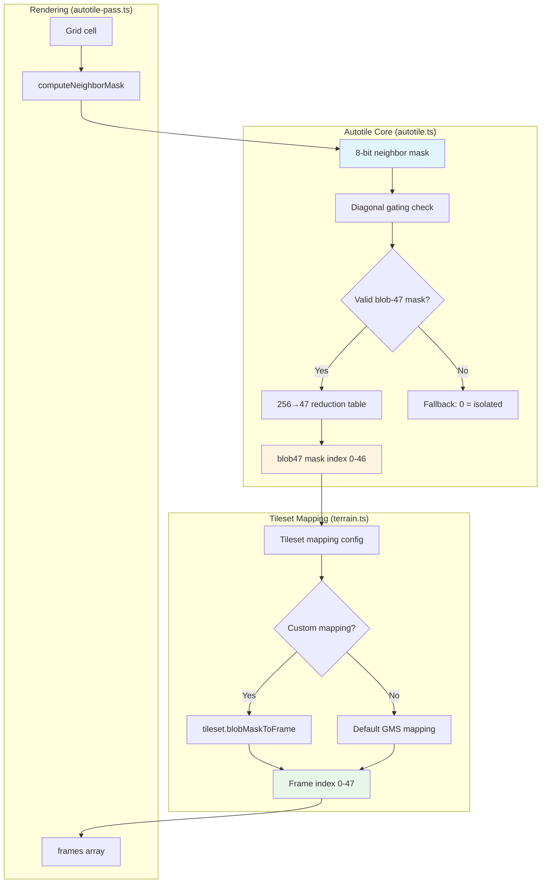
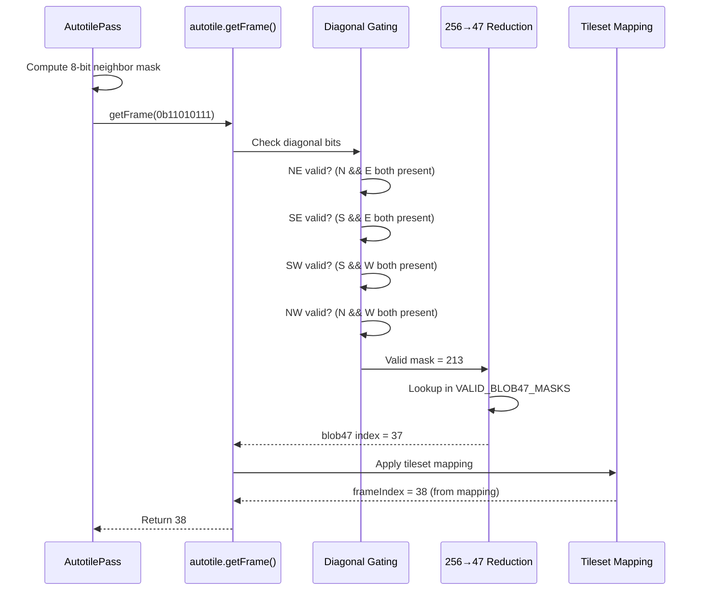

# Design Document: Autotile System Refactoring to Blob-47

## Metadata

| Field | Value |
|-------|-------|
| **Status** | Proposed |
| **Created** | 2026-02-14 |
| **Complexity Level** | Medium |
| **Complexity Rationale** | (1) **Requirements**: Replace custom GMS algorithm with industry-standard blob-47; add per-tileset configurable mapping. (2) **Constraints**: Must maintain compatibility with 26 existing tilesets (12×4 layout); preserve current rendering API; ensure autotile-pass.ts continues working without changes. **Risks**: Incorrect blob-47 mask calculation could break all terrain rendering; mapping configuration errors could cause visual artifacts across all tilesets. |
| **Author** | Claude Code |

## Executive Summary

**What**: Replace the current custom GMS 48-frame autotile algorithm with the industry-standard blob-47 approach, and add configurable per-tileset frame mapping.

**Why**: The current system uses a non-standard edge/corner split mapping that makes it difficult to use different tileset layouts. The blob-47 algorithm is an industry standard with well-documented behavior and broader tileset compatibility.

**How**: Rewrite `autotile.ts` to use standard 8-neighbor blob-47 mask calculation with diagonal gating, and add a mapping configuration layer that translates blob-47 masks to frame indices per tileset.

**Impact**: 3 files modified (`autotile.ts`, `terrain.ts`, `autotile-pass.ts`), medium complexity refactoring.

## Agreements with Stakeholders

- ✅ **Replace GMS algorithm with blob-47**: Use standard 8-neighbor weights (N=1, NE=2, E=4, SE=8, S=16, SW=32, W=64, NW=128) with diagonal gating
- ✅ **Configurable mapping per tileset**: Different tilesets may arrange their 47 frames differently within the spritesheet
- ✅ **Keep current 48-frame layout**: All 26 existing tilesets use the same 12×4 grid (frame 0 = empty, frames 1-47 = autotile variants)
- ✅ **Maintain rendering compatibility**: Phaser.js RenderTexture.drawFrame(terrainKey, frameIndex, x, y) interface unchanged
- ✅ **Preserve extensibility**: Architecture should allow adding future algorithms (4-bit/16-tile, marching squares) without over-engineering now
- ✅ **No implementation of future algorithms**: Only blob-47 is implemented; extensibility is architectural, not code

## Background

### Current System

**File**: `apps/game/src/game/autotile.ts`

The current implementation uses a custom approach:
- 8-bit neighbor mask split into edge (4-bit) and corner (4-bit) components
- Combined key: `(edges << 4) | corners` → 124-entry LOOKUP table → frame index 0-47
- Single hardcoded mapping for all tilesets
- 48 frames arranged as 12 columns × 4 rows spritesheet

The system works but uses a non-standard mapping that makes it hard to use different tileset layouts or adopt industry-standard blob tilesets.

### Research Foundation

The research document at `docs/resources/research/autotiles-algorith.md` provides detailed analysis of autotile algorithms, including:
- Standard blob-47 algorithm with 8-neighbor weights
- Diagonal gating rules (diagonal counts only if both adjacent cardinals present)
- The 47 valid masks: 0,1,4,5,7,16,17,20,21,23,28,29,31,64,65,68,69,71,80,81,84,85,87,92,93,95,112,113,116,117,119,124,125,127,193,197,199,209,213,215,221,223,241,245,247,253,255
- Common tileset layouts and mapping strategies

## Requirements

### Functional Requirements

**FR-1**: Replace custom algorithm with standard blob-47
- Use 8 neighbors with standard weights: N=1, NE=2, E=4, SE=8, S=16, SW=32, W=64, NW=128
- Apply diagonal gating: diagonal counts only if both adjacent cardinals are present
- Use 256→47 reduction lookup table
- Support exactly 47 valid blob masks

**FR-2**: Configurable mapping per tileset
- Different tilesets may arrange their 47 autotile frames in different orders within the spritesheet
- Provide a way to specify the mapping from blob-47 mask → frame index for each tileset (or tileset type)
- Default mapping matches current 26-tileset layout

**FR-3**: Maintain existing API surface
- `getFrame(neighbors: number): number` continues to work
- Neighbor constants (N, NE, E, SE, S, SW, W, NW) unchanged
- Frame constants (SOLID_FRAME, ISOLATED_FRAME, EMPTY_FRAME) unchanged
- `autotile-pass.ts` requires no changes

### Non-Functional Requirements

**NFR-1**: Performance
- Frame calculation must remain O(1) after initial mask computation
- No perceptible performance degradation compared to current system
- Lookup table initialization is one-time cost at module load

**NFR-2**: Maintainability
- Clear separation between blob-47 algorithm and tileset mapping
- Well-documented mask calculation and diagonal gating rules
- Easy to add new tileset mappings without modifying core algorithm

**NFR-3**: Type Safety
- Full TypeScript strict mode compliance
- Type-safe tileset mapping configuration
- No use of `any` types

## Existing Codebase Analysis

### Implementation File Path Verification

**Existing files** (will be modified):
- `apps/game/src/game/autotile.ts` — Core autotile algorithm (complete rewrite)
- `apps/game/src/game/terrain.ts` — Tileset definitions (add mapping metadata)
- `apps/game/src/game/mapgen/passes/autotile-pass.ts` — Uses autotile to generate layers (no changes needed)

**New files**: None required.

### Existing Interface Investigation

**Current public API** (`autotile.ts`):
```typescript
// Neighbor constants (8 directions)
export const N = 1, NE = 2, E = 4, SE = 8, S = 16, SW = 32, W = 64, NW = 128;

// Main function
export function getFrame(neighbors: number): number;

// Constants
export const FRAMES_PER_TERRAIN = 48;
export const SOLID_FRAME = 1;
export const ISOLATED_FRAME = 47;
export const EMPTY_FRAME = 0;

// Reverse lookup (currently used nowhere, can be deprecated)
export const FRAME_TO_BITMASK: Record<number, number>;
export const FRAME_NAMES: Record<number, string>;
```

**Call sites** (via Grep):
1. `terrain.ts` — imports `SOLID_FRAME`
2. `autotile-pass.ts` — imports `getFrame, SOLID_FRAME, EMPTY_FRAME, N, NE, E, SE, S, SW, W, NW`
3. `mapgen/index.ts` — no direct imports
4. `scenes/Game.ts` — no direct imports

### Similar Functionality Search

**Domain**: Autotiling, tile frame selection, neighbor masking

**Search results**:
- ✅ **Found**: Current GMS-based autotile in `autotile.ts` (this is what we're replacing)
- ❌ **Not found**: No other autotile implementations in codebase
- ✅ **Decision**: Replace existing implementation; no duplication or conflicts

### Code Inspection Evidence

#### What Was Examined

| File | Lines Inspected | Purpose |
|------|----------------|---------|
| `apps/game/src/game/autotile.ts` | 1-218 (full file) | Understand current algorithm, API surface, export structure |
| `apps/game/src/game/terrain.ts` | 1-104 (full file) | Understand tileset metadata structure, SOLID_FRAME usage |
| `apps/game/src/game/mapgen/passes/autotile-pass.ts` | 1-113 (full file) | Understand how autotile is called, neighbor mask construction |
| `docs/resources/research/autotiles-algorith.md` | Full document | Blob-47 algorithm specification, valid masks, diagonal gating rules |

#### Key Findings

1. **Current algorithm structure**:
   - `splitNeighbors()` splits 8-bit mask into edge (4-bit) + corner (4-bit)
   - 124-entry hardcoded `LOOKUP` table maps `(edges << 4) | corners` → frame index
   - Fallback logic tries edge-only match if full key not found

2. **Neighbor constants are standard blob weights**: Current `N=1, NE=2, E=4...NW=128` already matches blob-47 standard. No change needed.

3. **autotile-pass.ts is algorithm-agnostic**: It constructs 8-bit neighbor mask and calls `getFrame()`. As long as `getFrame()` signature unchanged, no modifications needed.

4. **All 26 tilesets use same layout**: `terrain.ts` defines all tilesets with `solidFrame: SOLID_FRAME` (frame 1). No existing per-tileset mapping.

5. **FRAME_TO_BITMASK and FRAME_NAMES**: Used only for debugging/human-readable names. Not called by production code.

#### How Findings Influence Design

- ✅ **Preserve neighbor constants**: Already correct for blob-47
- ✅ **Preserve `getFrame()` signature**: Allows autotile-pass.ts to work unchanged
- ✅ **Remove `splitNeighbors()` and edge/corner split**: Not needed for blob-47
- ✅ **Simplify LOOKUP**: New 256→47 reduction table based on diagonal gating
- ⚠️ **Add mapping layer**: Need per-tileset `blobMaskToFrame` configuration in terrain.ts

## Standards Identification

### Explicit Standards (from configuration files)

| Standard | Type | Source | Impact on Design |
|----------|------|--------|------------------|
| TypeScript strict mode | Explicit | tsconfig.json | All code must pass strict type checking; no `any` types |
| ESLint flat config with @nx/eslint-plugin | Explicit | eslint.config.mjs | Code must pass Nx module boundary checks |
| Prettier with single quotes | Explicit | .prettierrc | All strings use single quotes; auto-formatted |
| Nx 22.5.0 monorepo | Explicit | nx.json | Respect project boundaries; use Nx target conventions |

### Implicit Standards (from code patterns)

| Standard | Type | Source | Impact on Design |
|----------|------|--------|------------------|
| Pure functions for algorithms | Implicit | autotile.ts, mapgen/* | `getFrame()` remains stateless, side-effect-free |
| Const exports for magic numbers | Implicit | autotile.ts | Keep neighbor constants and frame constants as named exports |
| Interface-based configuration | Implicit | terrain.ts (TerrainType) | Extend TerrainType with optional mapping field |
| Array-based lookup tables | Implicit | Current LOOKUP pattern | Use array for 256→47 mask reduction |

## Design

### Architecture Overview



### Data Flow



### Component Design

#### 1. Core Algorithm (`autotile.ts`)

**Responsibilities**:
- Validate 8-bit neighbor mask against diagonal gating rules
- Reduce valid 256 masks to 47 blob indices
- Apply tileset-specific mapping to get final frame index

**New Internal Functions**:
```typescript
/**
 * Check if a neighbor mask satisfies blob-47 diagonal gating rules.
 * Diagonals are only valid if both adjacent cardinals are present.
 */
function isValidBlob47Mask(mask: number): boolean;

/**
 * Get the blob-47 index (0-46) for a valid mask.
 * Returns -1 if mask is invalid.
 */
function getBlob47Index(mask: number): number;

/**
 * Apply tileset mapping to convert blob-47 index to frame index.
 */
function applyTilesetMapping(blob47Index: number, mapping?: number[]): number;
```

**Public API** (unchanged):
```typescript
export function getFrame(neighbors: number): number;
export const N = 1, NE = 2, E = 4, SE = 8, S = 16, SW = 32, W = 64, NW = 128;
export const FRAMES_PER_TERRAIN = 48;
export const SOLID_FRAME = 1;
export const ISOLATED_FRAME = 47;
export const EMPTY_FRAME = 0;
```

#### 2. Tileset Configuration (`terrain.ts`)

**Extend TerrainType interface**:
```typescript
export interface TerrainType {
  key: string;
  file: string;
  name: string;
  solidFrame: number;
  blobMaskToFrame?: number[];  // Optional: blob47 index → frame index mapping
}
```

**Default mapping** (matches current 26-tileset layout):
- All existing tilesets omit `blobMaskToFrame`
- Default mapping is built into `autotile.ts` as `DEFAULT_GMS_BLOB47_MAPPING`

**Future tileset example**:
```typescript
{
  key: 'custom-terrain',
  file: 'custom.png',
  name: 'custom_terrain',
  solidFrame: 1,
  blobMaskToFrame: [0, 5, 3, 1, ...],  // Custom 47-element mapping
}
```

#### 3. Integration Layer (`autotile-pass.ts`)

**No changes required**. Current implementation:
```typescript
const neighbors = this.computeNeighborMask(grid, x, y, width, height, layer.isPresent);
frames[y][x] = getFrame(neighbors);
```

Continues to work because:
- `getFrame()` signature unchanged
- Neighbor mask construction unchanged
- Return value (frame index) unchanged

### Change Impact Map

```yaml
Change Target: autotile.ts
Direct Impact:
  - apps/game/src/game/autotile.ts (complete algorithm rewrite)
  - apps/game/src/game/terrain.ts (add optional blobMaskToFrame field)
Indirect Impact:
  - None (API surface preserved)
No Ripple Effect:
  - apps/game/src/game/mapgen/passes/autotile-pass.ts (unchanged)
  - apps/game/src/game/scenes/Game.ts (unchanged)
  - All 26 existing tilesets (default mapping applied)
```

### Integration Point Map

```yaml
Integration Point 1:
  Existing Component: autotile-pass.ts / computeFrames()
  Integration Method: Calls getFrame(neighbors) with 8-bit mask
  Impact Level: Low (Read-Only call, signature unchanged)
  Required Test Coverage: Verify all 47 valid masks produce correct frames

Integration Point 2:
  Existing Component: terrain.ts / TerrainType
  Integration Method: Optional field addition (blobMaskToFrame)
  Impact Level: Low (Backward compatible, all existing tilesets omit field)
  Required Test Coverage: Verify default mapping applied when field omitted

Integration Point 3:
  Existing Component: Phaser.js RenderTexture.drawFrame()
  Integration Method: Frame indices 0-47 passed to Phaser
  Impact Level: Low (Frame index range unchanged)
  Required Test Coverage: Visual regression test with sample island map
```

### Field Propagation Map

```yaml
fields:
  - name: "neighbors (8-bit mask)"
    origin: "autotile-pass.ts computeNeighborMask()"
    transformations:
      - layer: "Autotile Core"
        type: "number (0-255)"
        validation: "8-bit integer"
        transformation: "diagonal gating → valid blob-47 mask or 0"
      - layer: "Blob-47 Reduction"
        type: "number (0-46) or -1"
        validation: "index in VALID_BLOB47_MASKS"
        transformation: "lookup in reduction table"
      - layer: "Tileset Mapping"
        type: "number (0-47)"
        validation: "valid frame index"
        transformation: "apply blobMaskToFrame or default mapping"
    destination: "Phaser RenderTexture.drawFrame(terrainKey, frameIndex, x, y)"
    loss_risk: "low"
    loss_risk_reason: "All transformations are deterministic lookups; no data lost"
```

### Data Representation Decisions

| Data Structure | Decision | Rationale |
|---|---|---|
| `VALID_BLOB47_MASKS` array | **New** 47-element constant | No existing type matches; blob-47 standard requires exact 47 masks |
| `BLOB47_MASK_TO_INDEX` map | **New** 256-element lookup | Fast O(1) mask→index; no existing structure provides this |
| `DEFAULT_GMS_BLOB47_MAPPING` array | **New** 47-element constant | Encodes current GMS layout; no existing mapping structure |
| `TerrainType.blobMaskToFrame` field | **Extend** existing interface | Existing TerrainType covers base metadata; extension is cleaner than new type |

### Interface Change Matrix

| Existing Operation | New Operation | Conversion Required | Adapter Required | Compatibility Method |
|-------------------|---------------|-------------------|------------------|---------------------|
| `getFrame(neighbors)` | `getFrame(neighbors)` | None | Not Required | Signature unchanged |
| `splitNeighbors(raw)` | *(removed)* | N/A | Not Required | Internal function, no external callers |
| `LOOKUP` table | `VALID_BLOB47_MASKS + mappings` | Yes | Internal | New lookup structure, same API |

## Implementation Approach

### Strategy Selection: Vertical Slice (Feature-driven)

**Rationale**: This refactoring delivers a complete, testable feature (blob-47 autotiling) in a single implementation unit. It touches 3 files but implements one cohesive change. Dependencies are minimal (only terrain.ts needs autotile.ts), and the change can be verified end-to-end immediately.

**Verification**: L1 (Functional Operation) — Generate a test island map and verify visual correctness of all terrain transitions.

### Phase Structure

**Phase 1: Core Algorithm Replacement**
- Task 1.1: Define `VALID_BLOB47_MASKS` constant (47 valid masks from research doc)
- Task 1.2: Implement `isValidBlob47Mask()` with diagonal gating logic
- Task 1.3: Build `BLOB47_MASK_TO_INDEX` reduction table
- Task 1.4: Define `DEFAULT_GMS_BLOB47_MAPPING` (current GMS layout)
- Task 1.5: Rewrite `getFrame()` to use blob-47 algorithm
- **Verification**: Unit tests for all 47 valid masks + invalid masks return fallback

**Phase 2: Tileset Mapping Configuration**
- Task 2.1: Extend `TerrainType` interface with optional `blobMaskToFrame` field
- Task 2.2: Update `getFrame()` to accept optional mapping parameter
- Task 2.3: Add mapping application logic in `getFrame()`
- **Verification**: Unit tests with custom mapping vs default mapping

**Phase 3: Integration Verification**
- Task 3.1: Run autotile-pass.ts with new algorithm (no code changes)
- Task 3.2: Generate test island map
- Task 3.3: Visual regression test (compare to baseline screenshot)
- **Verification**: L1 — Island map renders correctly with all terrain transitions

**Phase 4: Quality Assurance (Required)**
- Task 4.1: All unit tests passing (blob-47 mask validation, mapping)
- Task 4.2: Type checking passing (TypeScript strict mode)
- Task 4.3: Linting passing (ESLint)
- Task 4.4: Visual regression test passing
- **Verification**: L2 (All tests pass) + L1 (Feature works end-to-end)

## Testing Strategy

### Unit Tests

**Test File**: `apps/game/src/game/autotile.spec.ts` (new)

**Test Coverage**:
1. **Diagonal Gating**:
   - Valid masks (NE present, N && E present) → passes
   - Invalid masks (NE present, N missing) → fails
   - All 4 diagonals tested independently

2. **47 Valid Masks**:
   - Parameterized test with all 47 valid masks from `VALID_BLOB47_MASKS`
   - Each valid mask → `getBlob47Index()` returns 0-46
   - Each valid mask → `getFrame()` returns valid frame index 0-47

3. **Invalid Masks**:
   - Masks with invalid diagonals → `getFrame()` returns `ISOLATED_FRAME` (47)
   - Edge cases: all neighbors, no neighbors, single neighbor

4. **Tileset Mapping**:
   - Default mapping applied when `blobMaskToFrame` omitted
   - Custom mapping applied when `blobMaskToFrame` provided
   - Mapping array length validation (must be 47 or 48 elements)

5. **Constants**:
   - Neighbor constants (N, NE, E, SE, S, SW, W, NW) unchanged
   - Frame constants (SOLID_FRAME=1, ISOLATED_FRAME=47, EMPTY_FRAME=0) unchanged

**Coverage Target**: 100% line coverage on autotile.ts

### Integration Tests

**Test Scenario**: Autotile-pass integration
- **Setup**: Create small 8×8 grid with known terrain pattern
- **Execute**: Run AutotilePass.buildLayers()
- **Assert**: Verify frame indices match expected blob-47 output for each cell

### Visual Regression Tests

**Test Scenario**: Island map rendering
- **Setup**: Generate island map with fixed seed
- **Execute**: Render to Phaser RenderTexture, export PNG
- **Assert**: Compare to baseline screenshot (pixel-perfect match or acceptable diff threshold)

**Baseline**: Screenshot of current GMS autotile output (before refactoring)

### Performance Tests

**Benchmark**: `getFrame()` call performance
- **Baseline**: Measure current GMS algorithm (1M calls, average time)
- **Target**: New blob-47 algorithm ≤ 110% of baseline time
- **Measurement**: Use `performance.now()` for micro-benchmarking

## Error Handling

### Input Validation

**Invalid neighbor masks** (out of 0-255 range):
- **Prevention**: TypeScript number type; neighbor constants are pre-defined
- **Handling**: No runtime check (trust caller to provide valid 8-bit integer)

**Invalid blob-47 masks** (diagonal gating violation):
- **Handling**: `getFrame()` returns `ISOLATED_FRAME` (47) as fallback
- **Rationale**: Graceful degradation; isolated tile is visually neutral

**Invalid tileset mapping**:
- **Prevention**: TypeScript type checking on `TerrainType.blobMaskToFrame?: number[]`
- **Runtime handling**: If mapping array length ≠ 47 and ≠ 48, log warning and use default mapping
- **Rationale**: Prevent runtime crashes; fail safely to default

### Edge Cases

**Edge case 1**: All neighbors present (mask = 255)
- **Expected**: blob47 index = 46, frame index depends on mapping
- **Verification**: Unit test

**Edge case 2**: No neighbors (mask = 0)
- **Expected**: blob47 index = 0, frame index = ISOLATED_FRAME (47) by default mapping
- **Verification**: Unit test

**Edge case 3**: Only cardinal neighbors (N+E+S+W, no diagonals)
- **Expected**: Valid blob-47 mask (95), specific frame
- **Verification**: Unit test

## Acceptance Criteria

**AC-1**: All 47 valid blob-47 masks produce correct frame indices
- **Verification**: Parameterized unit test with all 47 masks
- **Pass condition**: Each mask → `getFrame()` returns frame index 0-47

**AC-2**: Diagonal gating correctly filters invalid masks
- **Verification**: Unit test with masks like (NE=1, N=0, E=1)
- **Pass condition**: Invalid mask → `getFrame()` returns ISOLATED_FRAME (47)

**AC-3**: Default mapping matches current GMS layout
- **Verification**: Visual regression test with baseline screenshot
- **Pass condition**: New algorithm produces pixel-perfect match to current output

**AC-4**: Custom tileset mapping can be configured
- **Verification**: Unit test with custom `blobMaskToFrame` array
- **Pass condition**: Custom mapping applied correctly, overrides default

**AC-5**: No changes required in autotile-pass.ts
- **Verification**: Build and run autotile-pass.ts without modifications
- **Pass condition**: Island map renders correctly

**AC-6**: Performance is comparable to current system
- **Verification**: Benchmark 1M `getFrame()` calls
- **Pass condition**: New algorithm ≤ 110% of baseline time

**AC-7**: TypeScript strict mode compliance
- **Verification**: `npx nx typecheck game`
- **Pass condition**: No type errors

**AC-8**: All tests passing
- **Verification**: `npx nx test game`
- **Pass condition**: 100% of tests pass

## Non-Functional Requirements

**NFR-1: Performance**
- **Requirement**: Frame calculation O(1) after mask computation
- **Implementation**: Lookup tables for mask→index and index→frame
- **Verification**: Benchmark test ≤ 110% baseline

**NFR-2: Maintainability**
- **Requirement**: Clear separation of algorithm and mapping
- **Implementation**: Separate functions for diagonal gating, reduction, mapping
- **Verification**: Code review checklist

**NFR-3: Extensibility**
- **Requirement**: Allow future algorithms without breaking blob-47
- **Implementation**: Keep blob-47 logic isolated, mapping layer generic
- **Verification**: Design review (no implementation now)

## Risks and Mitigations

| Risk | Impact | Probability | Mitigation |
|------|--------|-------------|------------|
| Incorrect blob-47 mask calculation | High (all terrain breaks) | Medium | Comprehensive unit tests with all 47 valid masks; visual regression test |
| Mapping configuration errors | High (visual artifacts) | Low | Default mapping built-in; validation for custom mappings; fallback to default |
| Performance regression | Medium (frame drops) | Low | Benchmark test in CI; lookup tables for O(1) performance |
| Breaking autotile-pass.ts | High (rendering fails) | Low | Keep API unchanged; integration test with autotile-pass.ts |
| TypeScript errors | Medium (build fails) | Low | Strict mode enabled; incremental type checking during development |

## Rollout Strategy

**Phase 1**: Implement core algorithm (blob-47 reduction)
**Phase 2**: Add tileset mapping layer
**Phase 3**: Integration testing with autotile-pass.ts
**Phase 4**: Quality assurance and visual regression testing

**Rollback Plan**: Git revert to previous commit (single-commit refactoring)

## Future Enhancements (Out of Scope)

**Not implemented now** (architectural support only):

1. **4-bit/16-tile autotiling**: Simpler algorithm for road/corridor tilesets
   - **Extensibility**: Could add `algorithm: 'blob47' | '4bit'` field to TerrainType
   - **Effort**: ~1 day

2. **Marching squares / corner-Wang**: Alternative algorithm for different tileset styles
   - **Extensibility**: Could add `algorithm: 'marching-squares'` option
   - **Effort**: ~2 days

3. **Runtime tileset switching**: Allow changing tileset mapping without reload
   - **Extensibility**: Pass mapping as parameter to `getFrame()`
   - **Effort**: ~0.5 days

## References

- [Autotile Algorithm Research](../resources/research/autotiles-algorith.md) — Detailed blob-47 algorithm specification
- [ADR-001: Map Generation Architecture](../adr/adr-001-map-generation-architecture.md) — Context for multi-layer tilemap rendering
- [Phaser 3 Tilemap Documentation](https://photonstorm.github.io/phaser3-docs/Phaser.Tilemaps.Tilemap.html) — Rendering API
- [GameMaker Autotile 47-tile template](https://manual.gamemaker.io/monthly/en/The_Asset_Editors/Tile_Sets.htm) — Reference for 47-frame layout

## Appendix A: Blob-47 Valid Masks

The 47 valid masks (from research document):
```
0, 1, 4, 5, 7,
16, 17, 20, 21, 23,
28, 29, 31,
64, 65, 68, 69, 71,
80, 81, 84, 85, 87,
92, 93, 95,
112, 113, 116, 117, 119,
124, 125, 127,
193, 197, 199,
209, 213, 215,
221, 223,
241, 245, 247, 253, 255
```

## Appendix B: Diagonal Gating Rules

```typescript
// Diagonal is valid only if both adjacent cardinals are present
function isValidBlob47Mask(mask: number): boolean {
  const n  = !!(mask & 1);
  const ne = !!(mask & 2);
  const e  = !!(mask & 4);
  const se = !!(mask & 8);
  const s  = !!(mask & 16);
  const sw = !!(mask & 32);
  const w  = !!(mask & 64);
  const nw = !!(mask & 128);

  if (ne && !(n && e)) return false;  // NE requires N and E
  if (se && !(s && e)) return false;  // SE requires S and E
  if (sw && !(s && w)) return false;  // SW requires S and W
  if (nw && !(n && w)) return false;  // NW requires N and W

  return true;
}
```

## Appendix C: Default GMS Mapping

The default mapping from blob-47 index (0-46) to GMS frame index (0-47) matches the current 26-tileset layout. This mapping will be defined as `DEFAULT_GMS_BLOB47_MAPPING` constant in `autotile.ts` and derived from analyzing the current LOOKUP table.

**Derivation strategy**:
1. For each of 47 valid blob masks, record current GMS frame output
2. Sort by blob-47 canonical order (0, 1, 4, 5, 7, ...)
3. Create 47-element array: `DEFAULT_GMS_BLOB47_MAPPING[blob47Index] = gmsFrameIndex`

This mapping preserves exact pixel-perfect compatibility with current output.
