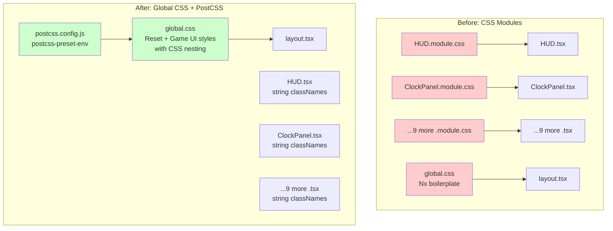
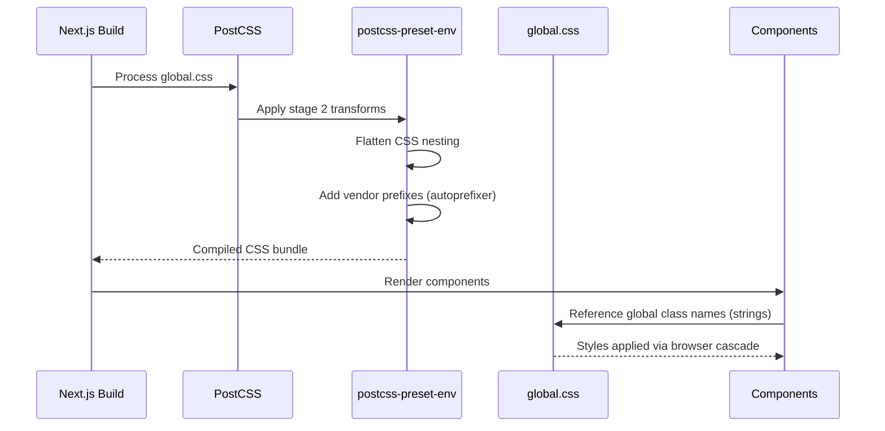

# Design Document: CSS Modules to Global CSS with PostCSS Migration

## Metadata

| Field | Value |
|-------|-------|
| **Status** | Proposed |
| **Created** | 2026-02-14 |
| **Complexity Level** | Medium |
| **Complexity Rationale** | (1) **Requirements**: Migrate 11 CSS module files into a single global stylesheet, set up PostCSS with postcss-preset-env, and update all 11 TSX component files to use string class names instead of module references. (2) **Constraints**: Must preserve identical visual rendering; must not break any existing component behavior or accessibility attributes; must maintain the NineSlicePanel `className` prop passthrough pattern. **Risks**: Global class name collisions if naming convention is not carefully applied; accidental style loss if any CSS module class is missed during migration. |
| **Author** | Claude Code |

## Executive Summary

**What**: Replace all 11 CSS Module files (`.module.css`) with a single global stylesheet (`global.css`), set up PostCSS with `postcss-preset-env`, and update all component TSX files to use string class names.

**Why**: The project is a pixel-art game with a small, stable set of UI components. CSS Modules add unnecessary indirection (hashed class names, import boilerplate) for a codebase where class name collisions are not a practical risk. A single global stylesheet with CSS nesting provides better developer experience -- all styles visible in one file, native nesting for component grouping, and future CSS features via postcss-preset-env.

**How**: Create a `postcss.config.js` with `postcss-preset-env` (stage 2), rewrite `global.css` from scratch (replacing Nx boilerplate), migrate all component styles using a BEM-lite naming convention with CSS nesting, and update TSX files to use string class names.

**Impact**: 1 new file (`postcss.config.js`), 1 modified file (`global.css`), 11 modified TSX files, 11 deleted `.module.css` files, 1 new devDependency (`postcss-preset-env`).

## Agreements with Stakeholders

- [x] **PostCSS plugins**: Use `postcss-preset-env` only (includes nesting + autoprefixer)
- [x] **Global CSS cleanup**: Remove all Nx boilerplate from `global.css`, start fresh with game UI styles only
- [x] **Commit strategy**: Manual -- user decides when to commit
- [x] **Naming convention**: BEM-lite with component prefix (e.g., `.clock-panel__wrapper`, `.clock-panel__content`)
- [x] **CSS organization**: Sectioned (reset, custom properties, game wrapper, HUD system, etc.)
- [x] **CSS nesting**: Use native CSS nesting syntax via postcss-preset-env
- [x] **Font handling**: Keep `--font-pixel` setup in HUD.tsx via Next.js font loader (unchanged)
- [x] **NineSlicePanel className prop**: Continues to work identically with global CSS
- [x] **Scope**: CSS styling only -- no changes to component logic, props, or behavior

### Non-Scope (Explicitly not changing)

- [x] Component logic, state management, event handling
- [x] Phaser.js game engine code
- [x] Next.js font loader configuration
- [x] Any file outside `apps/game/src/`
- [x] Layout.tsx (still imports `./global.css`)

### Constraints

- [x] Backward compatibility: Visual output must be pixel-identical
- [x] No parallel operation needed (one-shot migration)
- [x] Performance measurement: Not required (CSS-only change)

## Background

### Prerequisite ADRs

- No prerequisite ADRs. This is a straightforward CSS tooling change that does not affect architecture, data flow, or external dependencies.

### Current System

The Nookstead game client uses **CSS Modules** for component styling:

- **11 `.module.css` files** co-located with their components under `src/components/hud/`, `src/components/game/`, and `src/app/`
- Components import styles via `import styles from './ComponentName.module.css'` and reference classes as `styles.className`
- The `global.css` file contains ~502 lines of **Nx boilerplate** (CSS reset, welcome page styles, list-item-link styles, button-pill styles) -- most of which is unused starter template content
- No PostCSS configuration file exists -- Next.js uses its default PostCSS setup (autoprefixer + stage 3 preset-env with custom-properties disabled)

### Current Challenges

1. **Unnecessary indirection**: CSS Modules generate hashed class names, but this game UI has ~15 components with no name collision risk
2. **Scattered styles**: Styles are spread across 11 files, making it harder to see the full UI stylesheet at a glance
3. **Boilerplate imports**: Every component needs `import styles from './X.module.css'` and uses `styles.xxx` syntax
4. **Nx boilerplate**: `global.css` contains ~440 lines of unused starter template CSS
5. **No future CSS features**: Without explicit PostCSS config, nesting and other modern CSS features are not available

## Requirements

### Functional Requirements

**FR-1**: Migrate all CSS module styles to global.css
- All styles from 11 `.module.css` files must be present in `global.css`
- No visual change to any component

**FR-2**: Set up PostCSS with postcss-preset-env
- Create `postcss.config.js` in `apps/game/`
- Configure `postcss-preset-env` with stage 2 features
- Verify Next.js auto-detects the config

**FR-3**: Update all TSX components to use string class names
- Remove `import styles from ...` statements
- Replace `styles.xxx` with string class names matching new naming convention

**FR-4**: Remove all CSS module files
- Delete all 11 `.module.css` files

**FR-5**: Clean up global.css
- Remove Nx boilerplate
- Organize styles into clear sections

### Non-Functional Requirements

- **Maintainability**: All component styles organized in one file with clear section comments and CSS nesting for grouping
- **Developer experience**: Future CSS features available via postcss-preset-env (nesting, custom media queries, etc.)
- **Build compatibility**: Must pass `npx nx build game`, `npx nx lint game`, and `npx nx typecheck game`

## Acceptance Criteria (AC) - EARS Format

### FR-1: CSS Module Migration

- [ ] **When** the application renders the HUD, the system shall display all components (clock panel, currency display, energy bar, hotbar, menu button) with identical visual appearance to the CSS Modules version
- [ ] **When** `global.css` is loaded, the system shall contain all styles previously defined in the 11 `.module.css` files
- [ ] The system shall not contain any `.module.css` files in the `apps/game/src/` directory

### FR-2: PostCSS Configuration

- [ ] **When** `npx nx build game` is executed, the system shall process `global.css` through postcss-preset-env without errors
- [ ] **When** CSS nesting syntax is used in `global.css`, the system shall compile it to flat CSS for browser compatibility
- [ ] The file `apps/game/postcss.config.js` shall exist and export a valid PostCSS configuration

### FR-3: TSX Component Updates

- [ ] The system shall not contain any `import styles from` statements referencing `.module.css` files
- [ ] **When** a component is rendered, the system shall apply the correct global CSS class names
- [ ] **When** NineSlicePanel receives a `className` prop, the system shall apply it alongside the component's own classes

### FR-4: Build Verification

- [ ] **When** `npx nx build game` is executed, the system shall complete without errors
- [ ] **When** `npx nx typecheck game` is executed, the system shall complete without errors
- [ ] **When** `npx nx lint game` is executed, the system shall complete without errors

## Existing Codebase Analysis

### Implementation Path Mapping

| Type | Path | Description |
|------|------|-------------|
| Existing | `apps/game/src/app/global.css` | Global stylesheet (Nx boilerplate -- to be replaced) |
| Existing | `apps/game/src/app/layout.tsx` | Root layout, imports global.css (unchanged) |
| Existing | `apps/game/src/app/page.tsx` | Landing page, uses `page.module.css` |
| Existing | `apps/game/src/app/page.module.css` | Empty module (`.page {}`) |
| Existing | `apps/game/src/components/hud/HUD.tsx` | HUD container |
| Existing | `apps/game/src/components/hud/HUD.module.css` | HUD styles |
| Existing | `apps/game/src/components/hud/ClockPanel.tsx` | Clock display |
| Existing | `apps/game/src/components/hud/ClockPanel.module.css` | Clock styles |
| Existing | `apps/game/src/components/hud/CurrencyDisplay.tsx` | Gold counter |
| Existing | `apps/game/src/components/hud/CurrencyDisplay.module.css` | Currency styles |
| Existing | `apps/game/src/components/hud/MenuButton.tsx` | Menu button |
| Existing | `apps/game/src/components/hud/MenuButton.module.css` | Menu button styles |
| Existing | `apps/game/src/components/hud/EnergyBar.tsx` | Energy bar |
| Existing | `apps/game/src/components/hud/EnergyBar.module.css` | Energy bar styles |
| Existing | `apps/game/src/components/hud/NineSlicePanel.tsx` | 9-slice panel |
| Existing | `apps/game/src/components/hud/NineSlicePanel.module.css` | Panel styles |
| Existing | `apps/game/src/components/hud/HotbarSlot.tsx` | Hotbar slot |
| Existing | `apps/game/src/components/hud/HotbarSlot.module.css` | Slot styles |
| Existing | `apps/game/src/components/hud/Hotbar.tsx` | Hotbar container |
| Existing | `apps/game/src/components/hud/Hotbar.module.css` | Hotbar styles |
| Existing | `apps/game/src/components/game/LoadingScreen.tsx` | Loading overlay |
| Existing | `apps/game/src/components/game/LoadingScreen.module.css` | Loading styles |
| Existing | `apps/game/src/components/game/GameApp.tsx` | Game wrapper |
| Existing | `apps/game/src/components/game/GameApp.module.css` | Wrapper styles |
| New | `apps/game/postcss.config.js` | PostCSS configuration |

### Integration Points

- **Layout.tsx**: Imports `./global.css` -- this import stays unchanged
- **page.tsx**: Uses `styles.page` from `page.module.css` (empty class) -- the landing page currently also uses global CSS classes (`wrapper`, `container`, `rounded`, `shadow`, `list-item-link`, `button-pill`) from the Nx boilerplate in `global.css`

### Similar Functionality Search

**Domain**: CSS styling, PostCSS configuration, style architecture

**Search results**:
- No existing PostCSS config found in project
- No other global CSS approach exists
- No CSS-in-JS or styled-components usage
- **Decision**: New implementation (PostCSS config) + replacement of existing approach (CSS Modules to global CSS)

### Code Inspection Evidence

#### What Was Examined

| File | Lines Inspected | Purpose |
|------|----------------|---------|
| All 11 `.module.css` files | Full files | Catalog all CSS classes and properties for migration |
| All 11 TSX component files | Full files | Identify import patterns and className usage |
| `apps/game/src/app/global.css` | 1-502 (full) | Understand current boilerplate content |
| `apps/game/src/app/layout.tsx` | 1-19 (full) | Confirm global.css import location |
| `apps/game/src/app/page.tsx` | 1-469 (full) | Understand landing page CSS class usage |
| `apps/game/next.config.js` | 1-21 (full) | Check for PostCSS-related config |
| `apps/game/package.json` | 1-12 (full) | Check dependencies |
| Root `package.json` | 1-59 (full) | Check devDependencies for PostCSS |
| `apps/game/tsconfig.json` | 1-50 (full) | Confirm TypeScript config |
| `.prettierrc` | 1-3 (full) | Confirm formatting rules |
| `.editorconfig` | 1-10 (full) | Confirm indentation rules |
| `apps/game/eslint.config.mjs` | 1-13 (full) | Confirm ESLint config |

#### Key Findings

1. **CSS Module import pattern is uniform**: All 11 components use `import styles from './X.module.css'` and reference `styles.className`
2. **page.module.css is empty**: Contains only `.page {}` -- effectively unused
3. **page.tsx uses global CSS classes**: The landing page references `.wrapper`, `.container`, `.rounded`, `.shadow`, `.list-item-link`, `.button-pill` from `global.css` boilerplate
4. **NineSlicePanel accepts className prop**: Uses `className={`${styles.grid} ${className ?? ''}`}` -- this pattern must be preserved
5. **HUD.tsx combines module + external class**: Uses `className={`${styles.hud} ${pixelFont.variable}`}` -- external font variable class must be preserved
6. **ClockPanel.tsx combines two module classes**: Uses `className={`${styles.line} ${styles.time}`}` -- needs two global class names
7. **No PostCSS config exists**: Next.js uses default PostCSS behavior
8. **global.css is 502 lines of Nx boilerplate**: Only lines 1-66 (CSS reset) have potential value; the rest is welcome page styling

#### How Findings Influence Design

- Preserve NineSlicePanel `className` prop -- will work identically since global classes are just strings
- HUD.tsx font variable pattern: `${pixelFont.variable}` stays, module class becomes string `"hud"`
- Landing page (page.tsx): Needs decision on whether to keep Nx boilerplate styles or strip them (decision: strip them -- page.tsx is scaffold content to be replaced)
- PostCSS config goes in `apps/game/` directory (Next.js app root)

## Standards Identification

### Explicit Standards (from configuration files)

| Standard | Type | Source | Impact on Design |
|----------|------|--------|------------------|
| TypeScript strict mode | Explicit | `tsconfig.json` | TSX changes must pass strict type checking |
| ESLint flat config with @nx/eslint-plugin | Explicit | `eslint.config.mjs` | Component files must pass linting after changes |
| Prettier with single quotes, 2-space indent | Explicit | `.prettierrc`, `.editorconfig` | All new/modified files formatted consistently |
| Next.js App Router | Explicit | `next.config.js` | Global CSS imported only in layout.tsx or root |
| Nx module boundary enforcement | Explicit | `nx.json` | PostCSS config must be within `apps/game/` |

### Implicit Standards (from code patterns)

| Standard | Type | Source | Impact on Design |
|----------|------|--------|------------------|
| `'use client'` directive on interactive components | Implicit | All HUD components | No change needed (CSS-only migration) |
| Co-located component files (TSX + CSS + types) | Implicit | `src/components/hud/` | CSS files removed; TSX files stay in place |
| CSS custom property `--ui-scale` for responsive sizing | Implicit | `HUD.module.css`, all HUD children | Must preserve `var(--ui-scale)` pattern in global CSS |
| `image-rendering: pixelated` pattern | Implicit | `HUD.module.css` | Must preserve in global CSS for pixel art |
| `pointer-events: none` on HUD overlay + `auto` on interactive elements | Implicit | `HUD.module.css` | Must preserve interaction model |

## Design

### Change Impact Map

```yaml
Change Target: CSS styling system for game UI components
Direct Impact:
  - apps/game/src/app/global.css (complete rewrite)
  - apps/game/postcss.config.js (new file)
  - apps/game/src/app/page.tsx (remove module import, update className)
  - apps/game/src/components/hud/HUD.tsx (remove module import, update classNames)
  - apps/game/src/components/hud/ClockPanel.tsx (remove module import, update classNames)
  - apps/game/src/components/hud/CurrencyDisplay.tsx (remove module import, update classNames)
  - apps/game/src/components/hud/MenuButton.tsx (remove module import, update classNames)
  - apps/game/src/components/hud/EnergyBar.tsx (remove module import, update classNames)
  - apps/game/src/components/hud/NineSlicePanel.tsx (remove module import, update classNames)
  - apps/game/src/components/hud/HotbarSlot.tsx (remove module import, update classNames)
  - apps/game/src/components/hud/Hotbar.tsx (remove module import, update classNames)
  - apps/game/src/components/game/LoadingScreen.tsx (remove module import, update classNames)
  - apps/game/src/components/game/GameApp.tsx (remove module import, update classNames)
Indirect Impact:
  - None (CSS class names change but visual output is identical)
No Ripple Effect:
  - apps/game/src/app/layout.tsx (still imports global.css the same way)
  - apps/game/src/game/ (Phaser engine code, no CSS involvement)
  - apps/game/src/components/hud/types.ts (TypeScript types, no CSS)
  - apps/game/src/components/hud/sprite.ts (sprite utilities, no CSS)
  - apps/game/src/components/hud/sprites.ts (sprite definitions, no CSS)
  - apps/game/src/components/game/PhaserGame.tsx (no CSS module usage)
```

### Architecture Overview



### Data Flow



### Naming Convention Mapping

The following table maps every CSS Module class to its new global class name:

#### HUD.module.css

| Old (CSS Module) | New (Global) | Usage |
|-------------------|-------------|-------|
| `.hud` | `.hud` | HUD container |

#### ClockPanel.module.css

| Old (CSS Module) | New (Global) | Usage |
|-------------------|-------------|-------|
| `.wrapper` | `.clock-panel` | Outer wrapper |
| `.content` | `.clock-panel__content` | Inner flex container |
| `.seasonIcon` | `.clock-panel__season-icon` | Season sprite |
| `.text` | `.clock-panel__text` | Text column |
| `.line` | `.clock-panel__line` | Text line |
| `.time` | `.clock-panel__time` | Time text (modifier) |

#### CurrencyDisplay.module.css

| Old (CSS Module) | New (Global) | Usage |
|-------------------|-------------|-------|
| `.wrapper` | `.currency-display` | Outer wrapper |
| `.content` | `.currency-display__content` | Inner flex container |
| `.icon` | `.currency-display__icon` | Coin sprite |
| `.amount` | `.currency-display__amount` | Gold text |

#### MenuButton.module.css

| Old (CSS Module) | New (Global) | Usage |
|-------------------|-------------|-------|
| `.button` | `.menu-button` | Button element |
| `.spriteNormal` | `.menu-button__sprite-normal` | Default sprite |
| `.spriteHover` | `.menu-button__sprite-hover` | Hover sprite |

#### EnergyBar.module.css

| Old (CSS Module) | New (Global) | Usage |
|-------------------|-------------|-------|
| `.wrapper` | `.energy-bar` | Outer wrapper |
| `.frame` | `.energy-bar__frame` | Frame container |
| `.track` | `.energy-bar__track` | Track overlay |
| `.fill` | `.energy-bar__fill` | Fill bar |
| `.label` | `.energy-bar__label` | Number label |

#### NineSlicePanel.module.css

| Old (CSS Module) | New (Global) | Usage |
|-------------------|-------------|-------|
| `.grid` | `.nine-slice` | Grid container |
| `.cell` | `.nine-slice__cell` | Grid cell |
| `.edge` | `.nine-slice__edge` | Edge cell (stretches) |
| `.content` | `.nine-slice__content` | Content overlay |

#### HotbarSlot.module.css

| Old (CSS Module) | New (Global) | Usage |
|-------------------|-------------|-------|
| `.wrapper` | `.hotbar-slot` | Outer wrapper |
| `.keyHint` | `.hotbar-slot__key-hint` | Key label |
| `.slot` | `.hotbar-slot__button` | Button element |
| `.background` | `.hotbar-slot__background` | NineSlice background |
| `.content` | `.hotbar-slot__content` | Content container |
| `.itemIcon` | `.hotbar-slot__item-icon` | Item sprite |
| `.quantity` | `.hotbar-slot__quantity` | Quantity label |

#### Hotbar.module.css

| Old (CSS Module) | New (Global) | Usage |
|-------------------|-------------|-------|
| `.wrapper` | `.hotbar` | Outer wrapper |
| `.slots` | `.hotbar__slots` | Slots flex container |

#### LoadingScreen.module.css

| Old (CSS Module) | New (Global) | Usage |
|-------------------|-------------|-------|
| `.overlay` | `.loading-screen` | Full-screen overlay |
| `.container` | `.loading-screen__container` | Center container |
| `.title` | `.loading-screen__title` | Game title |
| `.barOuter` | `.loading-screen__bar-outer` | Progress bar frame |
| `.barInner` | `.loading-screen__bar-inner` | Progress bar fill |
| `.text` | `.loading-screen__text` | Loading text |

#### GameApp.module.css

| Old (CSS Module) | New (Global) | Usage |
|-------------------|-------------|-------|
| `.wrapper` | `.game-app` | Game wrapper |

#### page.module.css

| Old (CSS Module) | New (Global) | Usage |
|-------------------|-------------|-------|
| `.page` | *(removed)* | Empty class, unused |

### Integration Point Map

```yaml
Integration Point 1:
  Existing Component: layout.tsx / global.css import
  Integration Method: import './global.css' (unchanged)
  Impact Level: Low (Read-only, import path unchanged)
  Required Test Coverage: Verify global.css loads in dev and build

Integration Point 2:
  Existing Component: Next.js PostCSS pipeline
  Integration Method: Auto-detection of postcss.config.js in app root
  Impact Level: Medium (New PostCSS config overrides Next.js defaults)
  Required Test Coverage: Verify build succeeds with postcss-preset-env

Integration Point 3:
  Existing Component: NineSlicePanel className prop
  Integration Method: String concatenation with global class names
  Impact Level: Low (Behavior unchanged, string class names work identically)
  Required Test Coverage: Verify HotbarSlot passes className to NineSlicePanel correctly

Integration Point 4:
  Existing Component: HUD.tsx Next.js font variable
  Integration Method: Template literal combining .hud class + pixelFont.variable
  Impact Level: Low (Same pattern, just string instead of styles.hud)
  Required Test Coverage: Verify font variable class applied to HUD container
```

### Field Propagation Map

Not applicable -- this migration does not introduce new data fields or change data flow between layers. It is a purely presentational change (CSS class reference format).

### Data Representation Decisions

| Data Structure | Decision | Rationale |
|---|---|---|
| CSS class names in TSX | **Replace** module references with string literals | CSS Modules `styles.xxx` becomes `"component-name__xxx"` -- same concept, simpler representation |
| PostCSS config | **New** configuration file | No existing PostCSS config; required for postcss-preset-env |
| Global CSS sections | **Replace** Nx boilerplate with game-specific styles | Existing boilerplate is 95% unused; fresh start is cleaner than editing |

### Interface Change Matrix

| Existing Operation | New Operation | Conversion Required | Adapter Required | Compatibility Method |
|-------------------|---------------|-------------------|------------------|---------------------|
| `import styles from './X.module.css'` | *(removed)* | Yes | Not Required | Delete import statement |
| `styles.className` | `"component__class-name"` | Yes | Not Required | Direct string replacement |
| `${styles.a} ${styles.b}` | `"component__a component__b"` | Yes | Not Required | Concatenate string literals |
| `${styles.grid} ${className ?? ''}` | `${'nine-slice'} ${className ?? ''}` | Yes | Not Required | Replace module ref with string |
| `${styles.hud} ${pixelFont.variable}` | `${'hud'} ${pixelFont.variable}` | Yes | Not Required | Replace module ref with string |

### Integration Boundary Contracts

```yaml
Boundary Name: PostCSS Pipeline
  Input: global.css with CSS nesting syntax and modern CSS features
  Output: Compiled CSS bundle with flat selectors and vendor prefixes (sync, at build time)
  On Error: Build fails with PostCSS error message indicating the problematic CSS

Boundary Name: Next.js CSS Loading
  Input: import './global.css' in layout.tsx
  Output: CSS injected into page <head> (sync during SSR, async during client hydration)
  On Error: Styles not applied; visible as unstyled components

Boundary Name: Component className
  Input: String class name (e.g., "clock-panel__content")
  Output: CSS styles applied via browser cascade
  On Error: No styles applied to element; visible as missing layout/colors
```

## Technical Design

### 1. PostCSS Configuration

**File**: `apps/game/postcss.config.js`

```javascript
/** @type {import('postcss-load-config').Config} */
const config = {
  plugins: {
    'postcss-preset-env': {
      stage: 2,
      features: {
        'nesting-rules': true,
      },
    },
  },
};

module.exports = config;
```

**Notes**:
- Next.js auto-detects `postcss.config.js` in the app directory
- When a custom PostCSS config is provided, Next.js **disables its default** PostCSS behavior
- `postcss-preset-env` at stage 2 includes autoprefixer and CSS nesting
- The `nesting-rules` feature is explicitly enabled for clarity
- Uses plain object export (not a function) per Next.js requirement

### 2. Package Installation

Add `postcss-preset-env` to root `devDependencies`:

```bash
npm install -D postcss-preset-env
```

### 3. Complete Global CSS

**File**: `apps/game/src/app/global.css`

The complete replacement stylesheet, organized into clear sections:

```css
/* ==========================================================================
   Section 1: CSS Reset
   Minimal reset for game UI. Strips margins, enforces box-sizing.
   ========================================================================== */

*,
*::before,
*::after {
  box-sizing: border-box;
  margin: 0;
  padding: 0;
}

body {
  margin: 0;
  line-height: 1.5;
}

/* ==========================================================================
   Section 2: Game App Wrapper
   Full-viewport container for the Phaser canvas and React HUD overlay.
   ========================================================================== */

.game-app {
  position: relative;
  width: 100vw;
  height: 100vh;
  overflow: hidden;
  background: #1a1a2e;
}

/* ==========================================================================
   Section 3: Loading Screen
   Full-screen overlay shown while Phaser assets load.
   ========================================================================== */

.loading-screen {
  position: absolute;
  inset: 0;
  display: flex;
  align-items: center;
  justify-content: center;
  background: #1a1a2e;
  z-index: 20;
  transition: opacity 0.4s ease-out;

  & .loading-screen__container {
    text-align: center;
  }

  & .loading-screen__title {
    font-family: 'Arial Black', sans-serif;
    font-size: 3rem;
    color: #e8d5b7;
    margin: 0 0 2rem;
    text-shadow: 2px 2px 4px rgba(0, 0, 0, 0.5);
  }

  & .loading-screen__bar-outer {
    width: 300px;
    height: 8px;
    background: rgba(255, 255, 255, 0.15);
    border-radius: 4px;
    overflow: hidden;
    margin: 0 auto;
  }

  & .loading-screen__bar-inner {
    height: 100%;
    width: 40%;
    background: #e8d5b7;
    border-radius: 4px;
    animation: loading 1.5s ease-in-out infinite;
  }

  & .loading-screen__text {
    color: #a0a0b0;
    font-size: 0.875rem;
    margin-top: 1rem;
  }
}

@keyframes loading {
  0% { transform: translateX(-100%); }
  100% { transform: translateX(350%); }
}

/* ==========================================================================
   Section 4: HUD System
   Pixel-art heads-up display overlay. All HUD components use --ui-scale
   custom property for responsive sizing (set dynamically by HUD.tsx).
   ========================================================================== */

/* --- HUD Container --- */

.hud {
  --ui-scale: 3;
  position: absolute;
  inset: 0;
  pointer-events: none;
  z-index: 10;
  font-family: var(--font-pixel);
  color: #3b2819;
  image-rendering: -webkit-optimize-contrast;
  image-rendering: crisp-edges;
  image-rendering: pixelated;

  & button,
  & [data-interactive='true'] {
    pointer-events: auto;
    cursor: pointer;
  }

  & * {
    image-rendering: -webkit-optimize-contrast;
    image-rendering: crisp-edges;
    image-rendering: pixelated;
  }
}

/* --- Nine-Slice Panel --- */

.nine-slice {
  display: grid;
  grid-template-columns: 32px 1fr 32px;
  grid-template-rows: 32px 1fr 32px;
  position: relative;
  filter: drop-shadow(1px 1px 0 rgba(44, 26, 14, 0.5));

  & .nine-slice__cell {
    overflow: hidden;
  }

  & .nine-slice__edge {
    width: 100%;
    height: 100%;
    min-width: 0;
    min-height: 0;
  }

  & .nine-slice__content {
    grid-column: 2;
    grid-row: 2;
    position: relative;
    z-index: 1;
  }
}

/* --- Clock Panel --- */

.clock-panel {
  position: absolute;
  top: calc(4px * var(--ui-scale));
  left: calc(4px * var(--ui-scale));
  opacity: 0.9;

  & .clock-panel__content {
    display: flex;
    align-items: center;
    gap: calc(2px * var(--ui-scale));
    padding: calc(2px * var(--ui-scale));
    white-space: nowrap;
  }

  & .clock-panel__season-icon {
    flex-shrink: 0;
  }

  & .clock-panel__text {
    display: flex;
    flex-direction: column;
    gap: calc(1px * var(--ui-scale));
  }

  & .clock-panel__line {
    font-size: calc(5px * var(--ui-scale));
    line-height: 1;
    color: #3b2819;
  }

  & .clock-panel__time {
    color: #6b4226;
  }
}

/* --- Currency Display --- */

.currency-display {
  position: absolute;
  top: calc(4px * var(--ui-scale));
  right: calc(4px * var(--ui-scale));
  opacity: 0.9;

  & .currency-display__content {
    display: flex;
    align-items: center;
    gap: calc(2px * var(--ui-scale));
    padding: calc(2px * var(--ui-scale));
    white-space: nowrap;
  }

  & .currency-display__icon {
    flex-shrink: 0;
  }

  & .currency-display__amount {
    font-size: calc(5px * var(--ui-scale));
    line-height: 1;
    color: #daa520;
    font-family: var(--font-pixel);
  }
}

/* --- Menu Button --- */

.menu-button {
  position: absolute;
  bottom: calc(4px * var(--ui-scale));
  right: calc(4px * var(--ui-scale));
  border: none;
  padding: 0;
  background-color: transparent;
  min-width: 44px;
  min-height: 44px;
  display: flex;
  align-items: center;
  justify-content: center;
  outline: none;
  -webkit-tap-highlight-color: transparent;

  &:focus-visible {
    outline: calc(2px * var(--ui-scale)) solid #ffdd57;
    outline-offset: calc(1px * var(--ui-scale));
  }

  &:hover .menu-button__sprite-normal {
    display: none;
  }

  &:hover .menu-button__sprite-hover {
    display: block;
  }

  &:active .menu-button__sprite-normal,
  &:active .menu-button__sprite-hover {
    transform: translate(
      calc(1px * var(--ui-scale)),
      calc(1px * var(--ui-scale))
    );
  }
}

.menu-button__sprite-hover {
  display: none;
}

/* --- Energy Bar --- */

.energy-bar {
  position: absolute;
  right: calc(4px * var(--ui-scale));
  top: 50%;
  transform: translateY(-50%);
  display: flex;
  flex-direction: column;
  align-items: center;
  gap: calc(2px * var(--ui-scale));
  opacity: 0.9;

  & .energy-bar__frame {
    position: relative;
  }

  & .energy-bar__track {
    position: absolute;
    top: calc(1px * var(--ui-scale));
    left: calc(1px * var(--ui-scale));
    width: calc(3px * var(--ui-scale));
    height: calc(30px * var(--ui-scale));
    display: flex;
    flex-direction: column;
    justify-content: flex-end;
    overflow: hidden;
  }

  & .energy-bar__fill {
    width: 100%;
    transition: height 0.3s ease-out, background-color 0.3s ease-out;
  }

  & .energy-bar__label {
    font-family: var(--font-pixel);
    font-size: calc(3px * var(--ui-scale));
    color: #3b2819;
    text-align: center;
  }
}

@media (prefers-reduced-motion: reduce) {
  .energy-bar__fill {
    transition: none;
  }
}

/* --- Hotbar --- */

.hotbar {
  position: absolute;
  bottom: 8px;
  left: 50%;
  transform: translateX(-50%);

  & .hotbar__slots {
    display: flex;
    gap: 1px;
  }
}

/* --- Hotbar Slot --- */

.hotbar-slot {
  position: relative;
  display: flex;
  flex-direction: column;
  align-items: center;
  flex-shrink: 0;

  & .hotbar-slot__key-hint {
    font-family: var(--font-pixel);
    font-size: 7px;
    color: rgba(255, 255, 255, 0.5);
    pointer-events: none;
    margin-bottom: 2px;
  }

  & .hotbar-slot__button {
    position: relative;
    width: 32px;
    height: 32px;
    padding: 16px;
    box-sizing: content-box;
    flex-shrink: 0;
    border: none;
    background-color: transparent;
    outline: none;
    overflow: hidden;
    -webkit-tap-highlight-color: transparent;

    &:focus-visible {
      outline: 2px solid #ffdd57;
      outline-offset: 1px;
    }
  }

  & .hotbar-slot__background {
    position: absolute;
    top: 50%;
    left: 50%;
    transform: translate(-50%, -50%);
    width: 96px;
    height: 96px;
  }

  & .hotbar-slot__content {
    position: relative;
    width: 100%;
    height: 100%;
    display: flex;
    align-items: center;
    justify-content: center;
  }

  & .hotbar-slot__item-icon {
    position: absolute;
    top: 50%;
    left: 50%;
    transform: translate(-50%, -50%);
  }

  & .hotbar-slot__quantity {
    position: absolute;
    bottom: 2px;
    right: 2px;
    font-family: var(--font-pixel);
    font-size: 8px;
    color: #fff;
    text-shadow:
      1px 0 0 #000,
      -1px 0 0 #000,
      0 1px 0 #000,
      0 -1px 0 #000;
  }
}
```

### 4. TSX Component Changes

Each component requires two changes: (a) remove the CSS Module import, and (b) replace `styles.xxx` references with string class names.

#### HUD.tsx

```diff
- import styles from './HUD.module.css';
  ...
- className={`${styles.hud} ${pixelFont.variable}`}
+ className={`hud ${pixelFont.variable}`}
```

#### ClockPanel.tsx

```diff
- import styles from './ClockPanel.module.css';
  ...
- className={styles.wrapper}
+ className="clock-panel"
  ...
- className={styles.content}
+ className="clock-panel__content"
  ...
- className={styles.seasonIcon}
+ className="clock-panel__season-icon"
  ...
- className={styles.text}
+ className="clock-panel__text"
  ...
- className={styles.line}
+ className="clock-panel__line"
  ...
- className={`${styles.line} ${styles.time}`}
+ className="clock-panel__line clock-panel__time"
```

#### CurrencyDisplay.tsx

```diff
- import styles from './CurrencyDisplay.module.css';
  ...
- className={styles.wrapper}
+ className="currency-display"
  ...
- className={styles.content}
+ className="currency-display__content"
  ...
- className={styles.icon}
+ className="currency-display__icon"
  ...
- className={styles.amount}
+ className="currency-display__amount"
```

#### MenuButton.tsx

```diff
- import styles from './MenuButton.module.css';
  ...
- className={styles.button}
+ className="menu-button"
  ...
- className={styles.spriteNormal}
+ className="menu-button__sprite-normal"
  ...
- className={styles.spriteHover}
+ className="menu-button__sprite-hover"
```

#### EnergyBar.tsx

```diff
- import styles from './EnergyBar.module.css';
  ...
- className={styles.wrapper}
+ className="energy-bar"
  ...
- className={styles.frame}
+ className="energy-bar__frame"
  ...
- className={styles.track}
+ className="energy-bar__track"
  ...
- className={styles.fill}
+ className="energy-bar__fill"
  ...
- className={styles.label}
+ className="energy-bar__label"
```

#### NineSlicePanel.tsx

```diff
- import styles from './NineSlicePanel.module.css';
  ...
- className={`${styles.grid} ${className ?? ''}`}
+ className={`nine-slice ${className ?? ''}`}
  ...
- className={styles.cell}
+ className="nine-slice__cell"
  ...
- className={`${styles.cell} ${styles.edge}`}
+ className="nine-slice__cell nine-slice__edge"
  ...
- className={styles.content}
+ className="nine-slice__content"
```

#### HotbarSlot.tsx

```diff
- import styles from './HotbarSlot.module.css';
  ...
- className={styles.wrapper}
+ className="hotbar-slot"
  ...
- className={styles.keyHint}
+ className="hotbar-slot__key-hint"
  ...
- className={styles.slot}
+ className="hotbar-slot__button"
  ...
- className={styles.background}
+ className="hotbar-slot__background"
  ...
- className={styles.content}
+ className="hotbar-slot__content"
  ...
- className={styles.itemIcon}
+ className="hotbar-slot__item-icon"
  ...
- className={styles.quantity}
+ className="hotbar-slot__quantity"
```

#### Hotbar.tsx

```diff
- import styles from './Hotbar.module.css';
  ...
- className={styles.wrapper}
+ className="hotbar"
  ...
- className={styles.slots}
+ className="hotbar__slots"
```

#### LoadingScreen.tsx

```diff
- import styles from './LoadingScreen.module.css';
  ...
- className={styles.overlay}
+ className="loading-screen"
  ...
- className={styles.container}
+ className="loading-screen__container"
  ...
- className={styles.title}
+ className="loading-screen__title"
  ...
- className={styles.barOuter}
+ className="loading-screen__bar-outer"
  ...
- className={styles.barInner}
+ className="loading-screen__bar-inner"
  ...
- className={styles.text}
+ className="loading-screen__text"
```

#### GameApp.tsx

```diff
- import styles from './GameApp.module.css';
  ...
- className={styles.wrapper}
+ className="game-app"
```

#### page.tsx

```diff
- import styles from './page.module.css';
  ...
- className={styles.page}
+ {/* className removed -- .page was empty */}
```

Note: `page.tsx` also references global CSS classes from the Nx boilerplate (`wrapper`, `container`, `rounded`, `shadow`, `list-item-link`, `button-pill`). Since the boilerplate is being removed from `global.css`, the landing page will lose its styling. This is intentional -- the landing page is Nx scaffold content that will be replaced with the actual game entry point.

### Error Handling

**Build-time errors**:
- PostCSS syntax error in `global.css` -- build fails with clear error message indicating line/column
- Missing `postcss-preset-env` package -- build fails with "Cannot find module" error; fix: `npm install -D postcss-preset-env`

**Runtime errors**:
- Misspelled class name in TSX -- no error, but element has no styles; detectable via visual inspection or E2E screenshot tests
- Missing class in `global.css` -- same as above; no runtime error, just missing styles

**Mitigation**: The naming convention mapping table above serves as the authoritative reference. Each TSX change can be verified against this table.

## Implementation Plan

### Implementation Approach

**Selected Approach**: Vertical Slice (Feature-driven)

**Selection Reason**: This is a single cohesive migration with no independent feature slices. All changes (PostCSS config, global CSS, TSX updates, module file deletion) must happen together for the system to work. A horizontal approach (e.g., "set up PostCSS first, then migrate CSS, then update TSX") would leave the system in a broken intermediate state. The entire migration is one atomic vertical slice.

### Technical Dependencies and Implementation Order

#### Required Implementation Order

1. **Install postcss-preset-env**
   - Technical Reason: Must be available before PostCSS config references it
   - Dependent Elements: PostCSS config, Next.js build

2. **Create postcss.config.js**
   - Technical Reason: Must exist before Next.js processes any CSS with nesting
   - Dependent Elements: global.css compilation

3. **Rewrite global.css**
   - Technical Reason: Must contain all component styles before module files are deleted
   - Prerequisites: postcss.config.js must exist (for nesting syntax)
   - Dependent Elements: All TSX component updates

4. **Update all TSX components**
   - Technical Reason: Must reference new global class names
   - Prerequisites: global.css must contain the new class names

5. **Delete all .module.css files**
   - Technical Reason: Must happen last to avoid import errors during transition
   - Prerequisites: All TSX imports removed

### Integration Points

**Integration Point 1: PostCSS Pipeline**
- Components: `postcss.config.js` -> Next.js build -> `global.css`
- Verification: `npx nx build game` succeeds without PostCSS errors

**Integration Point 2: Global CSS Loading**
- Components: `layout.tsx` -> `global.css` -> browser
- Verification: Dev server renders components with correct styles

**Integration Point 3: Component Class Binding**
- Components: TSX components -> global CSS class names
- Verification: Each component renders identically to before migration

### Migration Strategy

This is a **one-shot migration** (not incremental):

1. All changes are made in a single pass
2. No parallel operation of CSS Modules and global CSS
3. Rollback plan: `git revert` to previous commit

**Rationale**: CSS Modules and global CSS with the same class names cannot coexist (global classes would be overridden by module-scoped classes). A gradual migration would require temporarily renaming all classes, which adds complexity without benefit for this small component set.

## Testing Strategy

### Basic Test Design Policy

Test cases are derived from acceptance criteria. Since this is a CSS-only migration with no logic changes, testing focuses on build verification and visual correctness.

### Unit Tests

Not applicable -- no business logic changes. Existing unit tests (if any) should continue to pass without modification since component props, state, and behavior are unchanged.

### Integration Tests

Not applicable -- no component interaction changes.

### E2E Tests

**Existing E2E tests** (`apps/game-e2e/`): Should continue to pass since visual output is identical.

**Manual verification checklist**:
- [ ] Loading screen displays correctly (title, progress bar, text)
- [ ] HUD renders with correct positioning (clock top-left, currency top-right, energy bar right-center, hotbar bottom-center, menu button bottom-right)
- [ ] Clock panel shows day, time, and season icon
- [ ] Currency display shows gold amount with coin icon
- [ ] Energy bar fills/drains with correct colors
- [ ] Hotbar slots display with key hints and selected state
- [ ] Menu button shows hover/active states
- [ ] Nine-slice panels render with correct corner/edge stretching
- [ ] Pixel font renders correctly via `--font-pixel` variable

### Build Verification Tests

These are the primary automated checks for this migration:

```bash
# Must all succeed:
npx nx build game       # Verify PostCSS compilation + no import errors
npx nx typecheck game   # Verify no TypeScript errors from removed imports
npx nx lint game        # Verify no ESLint issues
npx nx e2e game-e2e     # Verify E2E tests still pass
```

## File Changes Summary

### New Files (1)

| File | Description |
|------|-------------|
| `apps/game/postcss.config.js` | PostCSS configuration with postcss-preset-env |

### Modified Files (12)

| File | Change Description |
|------|-------------------|
| `apps/game/src/app/global.css` | Complete rewrite: Nx boilerplate replaced with reset + game UI styles |
| `apps/game/src/app/page.tsx` | Remove module import, remove `styles.page` className |
| `apps/game/src/components/hud/HUD.tsx` | Remove module import, use string `"hud"` |
| `apps/game/src/components/hud/ClockPanel.tsx` | Remove module import, use `"clock-panel__*"` classes |
| `apps/game/src/components/hud/CurrencyDisplay.tsx` | Remove module import, use `"currency-display__*"` classes |
| `apps/game/src/components/hud/MenuButton.tsx` | Remove module import, use `"menu-button__*"` classes |
| `apps/game/src/components/hud/EnergyBar.tsx` | Remove module import, use `"energy-bar__*"` classes |
| `apps/game/src/components/hud/NineSlicePanel.tsx` | Remove module import, use `"nine-slice__*"` classes |
| `apps/game/src/components/hud/HotbarSlot.tsx` | Remove module import, use `"hotbar-slot__*"` classes |
| `apps/game/src/components/hud/Hotbar.tsx` | Remove module import, use `"hotbar__*"` classes |
| `apps/game/src/components/game/LoadingScreen.tsx` | Remove module import, use `"loading-screen__*"` classes |
| `apps/game/src/components/game/GameApp.tsx` | Remove module import, use `"game-app"` class |

### Deleted Files (11)

| File | Reason |
|------|--------|
| `apps/game/src/app/page.module.css` | Empty module, styles removed |
| `apps/game/src/components/hud/HUD.module.css` | Migrated to global.css |
| `apps/game/src/components/hud/ClockPanel.module.css` | Migrated to global.css |
| `apps/game/src/components/hud/CurrencyDisplay.module.css` | Migrated to global.css |
| `apps/game/src/components/hud/MenuButton.module.css` | Migrated to global.css |
| `apps/game/src/components/hud/EnergyBar.module.css` | Migrated to global.css |
| `apps/game/src/components/hud/NineSlicePanel.module.css` | Migrated to global.css |
| `apps/game/src/components/hud/HotbarSlot.module.css` | Migrated to global.css |
| `apps/game/src/components/hud/Hotbar.module.css` | Migrated to global.css |
| `apps/game/src/components/game/LoadingScreen.module.css` | Migrated to global.css |
| `apps/game/src/components/game/GameApp.module.css` | Migrated to global.css |

### Package Changes (1)

| Package | Change | Location |
|---------|--------|----------|
| `postcss-preset-env` | Add to devDependencies | Root `package.json` |

## Alternative Solutions

### Alternative 1: Keep CSS Modules, Add PostCSS Only

- **Overview**: Keep all `.module.css` files, only add `postcss.config.js` for future CSS features
- **Advantages**: Minimal changes, keeps scoped styles
- **Disadvantages**: Does not address the scattered-styles problem, still requires module import boilerplate
- **Reason for Rejection**: The primary goal is consolidation into a single file, not just PostCSS setup

### Alternative 2: Tailwind CSS

- **Overview**: Replace CSS Modules with Tailwind utility classes
- **Advantages**: Rapid iteration, no custom CSS needed for common patterns
- **Disadvantages**: Utility classes in JSX reduce readability for pixel-art-specific styles (e.g., `calc(4px * var(--ui-scale))`); Tailwind's approach conflicts with the game's custom design token system
- **Reason for Rejection**: Game UI uses highly custom pixel-art styles that do not map well to Tailwind utilities; would create verbose, hard-to-read className strings

### Alternative 3: CSS-in-JS (styled-components / emotion)

- **Overview**: Use runtime CSS-in-JS for component styling
- **Advantages**: Scoped styles with full JS access
- **Disadvantages**: Runtime overhead, SSR complexity with Next.js App Router, adds dependency
- **Reason for Rejection**: Unnecessary runtime cost for static styles; adds complexity for no benefit in a game UI context

## Risks and Mitigations

| Risk | Impact | Probability | Mitigation |
|------|--------|-------------|------------|
| Class name typo in TSX breaks styling | Medium (visual bug) | Medium | Use naming convention mapping table as checklist; visual inspection |
| postcss-preset-env version incompatibility with Next.js 16 | High (build failure) | Low | Test build immediately after installation; pin compatible version |
| Global class name collision with future components | Low (styling conflict) | Low | BEM-lite naming convention with component prefix prevents collisions |
| Landing page (page.tsx) loses Nx boilerplate styling | Low (cosmetic) | High (intentional) | Landing page is scaffold content to be replaced; documented in design |
| CSS nesting compiled incorrectly | Medium (broken styles) | Low | postcss-preset-env nesting is well-tested; verify with build |

## Security Considerations

Not applicable -- this migration is purely presentational (CSS and className changes). No user input, authentication, or data handling is affected.

## Future Extensibility

- **New components**: Add styles to `global.css` in the appropriate section, following the `component-name__element` convention
- **CSS custom properties**: Can add a dedicated design tokens section as the UI grows
- **Dark mode / themes**: postcss-preset-env supports `@custom-media` and `prefers-color-scheme` nesting
- **Component library extraction**: If components are later extracted to a shared library, styles can be split per-component again (but as global CSS files, not modules)

## References

- [Next.js PostCSS Guide](https://nextjs.org/docs/pages/guides/post-css) -- Next.js PostCSS configuration documentation
- [postcss-preset-env](https://preset-env.cssdb.org/) -- CSS features and stage configuration
- [postcss-preset-env on npm](https://www.npmjs.com/package/postcss-preset-env) -- Package documentation and installation
- [postcss-preset-env GitHub](https://github.com/csstools/postcss-preset-env) -- Source and feature list
- [Next.js CSS Getting Started](https://nextjs.org/docs/app/getting-started/css) -- CSS styling options in Next.js App Router
- [PostCSS Configuration Is a Function](https://nextjs.org/docs/messages/postcss-function) -- Next.js requirement for plain object PostCSS config

## Update History

| Date | Version | Changes | Author |
|------|---------|---------|--------|
| 2026-02-14 | 1.0 | Initial version | Claude Code |
