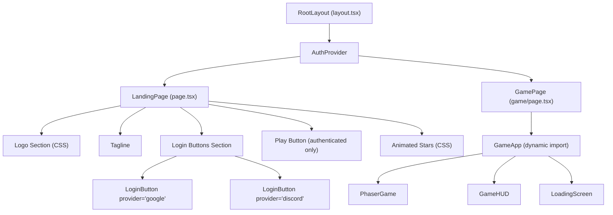
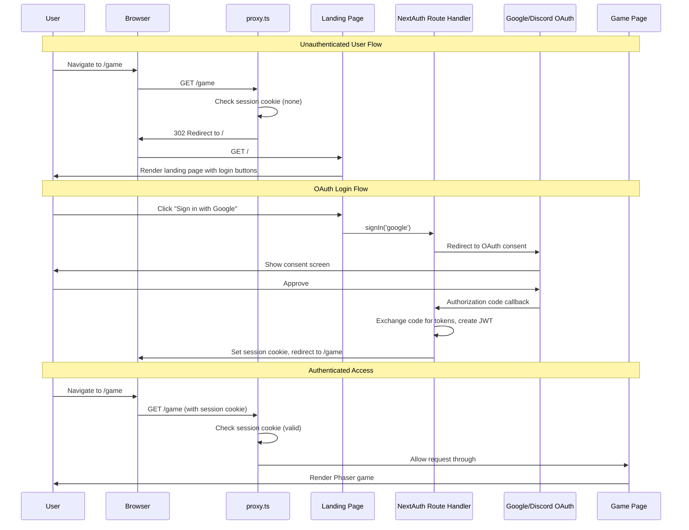

# Landing Page and Authentication Design Document

## Overview

This document defines the technical design for replacing the default Nx welcome page with a pixel art themed landing page and integrating NextAuth.js v5 social authentication (Google + Discord OAuth) into the Nookstead game client. The feature introduces route protection so that unauthenticated users are redirected from `/game` to `/`, while authenticated users can access the Phaser.js game client seamlessly.

## Design Summary (Meta)

```yaml
design_type: "new_feature"
risk_level: "medium"
complexity_level: "medium"
complexity_rationale: >
  (1) ACs require OAuth integration with two providers, JWT session management,
  route protection via proxy, and a pixel art themed landing page with responsive
  design and animations -- these span auth infrastructure, UI, and routing layers.
  (2) NextAuth.js v5 is a beta dependency with a peer dependency mismatch against
  Next.js 16, and Next.js 16 renames middleware.ts to proxy.ts which requires
  adaptation of all Auth.js documentation examples.
main_constraints:
  - "NextAuth v5 beta.30 with --legacy-peer-deps (peer dep mismatch with Next.js 16)"
  - "CSS Modules only (no Tailwind, no styled-components)"
  - "Must preserve existing Phaser.js dynamic import pattern at /game"
  - "Next.js 16 proxy.ts (not middleware.ts) for route protection"
biggest_risks:
  - "NextAuth v5 authorized callback may not export cleanly as proxy function in Next.js 16"
  - "Beta dependency may introduce breaking changes before stable release"
unknowns:
  - "Whether NextAuth v5 auth() export works as a named proxy export or requires wrapper"
  - "Exact CSS animation performance impact on low-end mobile devices"
```

## Background and Context

### Prerequisite ADRs

- **ADR-002: Player Authentication with NextAuth.js v5 (Auth.js)** -- Selects NextAuth.js v5 with JWT sessions, Google + Discord OAuth, and documents the peer dependency workaround and migration path to Better Auth.

### Agreement Checklist

#### Scope

- [x] Replace the Nx boilerplate landing page (`/`) with a pixel art themed page
- [x] Add NextAuth.js v5 authentication with Google and Discord OAuth providers
- [x] Add JWT-only session management (no database adapter)
- [x] Add route protection: unauthenticated users redirected from `/game` to `/`
- [x] Add AuthProvider client component wrapping SessionProvider
- [x] Add responsive design for mobile (360px+) and desktop viewports

#### Non-Scope (Explicitly not changing)

- [x] Phaser.js game engine code (`src/game/**/*`) -- no modifications
- [x] Game components (`src/components/game/**/*`) -- no modifications to GameApp, PhaserGame, GameHUD, LoadingScreen
- [x] Database adapter or persistent sessions -- JWT only
- [x] User profile page, account settings, email/password auth
- [x] Custom session fields beyond standard OAuth profile (name, email, image)

#### Constraints

- [x] Parallel operation: No (clean replacement of boilerplate)
- [x] Backward compatibility: Not required (replacing scaffolding)
- [x] Performance measurement: Required (Lighthouse 90+ on landing page)

#### Design Reflection of Agreements

- [x] All scope items map to specific components defined in "Main Components" section
- [x] Non-scope items are explicitly excluded from the Change Impact Map
- [x] Performance constraint is addressed in Non-Functional Requirements and AC-NFR-1

### Problem to Solve

The current landing page is the default Nx template with no brand identity, no authentication, and no access control. Before Nookstead can be tested with real users, it needs a branded entry point that communicates the game's pixel art MMO identity, and an authentication layer that gates access to the `/game` route via social login.

### Current Challenges

1. **No brand identity**: The landing page displays Nx branding and learning materials, conveying nothing about Nookstead.
2. **No authentication**: Anyone can access `/game` without identifying themselves, preventing per-player state management.
3. **No route protection**: The `/game` route is publicly accessible with no session check.
4. **Boilerplate CSS**: `global.css` contains Nx-specific styles that conflict with the game's dark pixel art aesthetic.

### Requirements

#### Functional Requirements

- FR-1: Pixel art landing page at `/` with CSS text logo, tagline, and login buttons
- FR-2: Google OAuth login via NextAuth.js v5
- FR-3: Discord OAuth login via NextAuth.js v5
- FR-4: JWT-only session management persisting across page reloads
- FR-5: Protected `/game` route redirecting unauthenticated users to `/`
- FR-6: Responsive design (360px minimum width)
- FR-7: Authenticated user redirect/navigation from `/` to `/game`

#### Non-Functional Requirements

- **Performance**: Landing page First Contentful Paint under 1.5s on 4G; Lighthouse 90+
- **Security**: HTTP-only, Secure, SameSite=Lax cookies; CSRF protection via NextAuth built-in; no secrets in client code
- **Reliability**: JWT tokens valid for 30 days; graceful error display if OAuth provider is unavailable
- **Maintainability**: All auth config centralized in `auth.ts`; CSS Modules for scoped styles

## Acceptance Criteria (AC) -- EARS Format

### AC-1: Landing Page Visual Identity

- [ ] The system shall display a pixel art text logo "NOOKSTEAD" using Press Start 2P font on a dark background (#0a0a1a) at the `/` route
- [ ] The system shall display a tagline below the logo conveying the game genre
- [ ] The system shall display a "Sign in with Google" and a "Sign in with Discord" button with pixel art styling
- [ ] **When** the page loads, the system shall apply a subtle glow or animation effect to the logo text
- [ ] **When** the page loads, the system shall display animated background elements (twinkling stars or floating pixels)

### AC-2: Google OAuth Login

- [ ] **When** an unauthenticated user clicks "Sign in with Google", the system shall redirect to Google's OAuth consent screen
- [ ] **When** the user completes Google authorization, the system shall create a JWT session and redirect to `/game`
- [ ] **If** the user denies Google authorization, **then** the system shall redirect back to `/` without creating a session

### AC-3: Discord OAuth Login

- [ ] **When** an unauthenticated user clicks "Sign in with Discord", the system shall redirect to Discord's OAuth authorization screen
- [ ] **When** the user completes Discord authorization, the system shall create a JWT session and redirect to `/game`
- [ ] **If** the user denies Discord authorization, **then** the system shall redirect back to `/` without creating a session

### AC-4: JWT Session Persistence

- [ ] **When** an authenticated user refreshes the page, the system shall maintain the session without re-authentication
- [ ] The system shall store the JWT session in an HTTP-only, Secure, SameSite=Lax cookie
- [ ] **While** a user has a valid session, the system shall make session data available via `useSession()` on client components

### AC-5: Route Protection

- [ ] **When** an unauthenticated user navigates to `/game`, the system shall redirect to `/`
- [ ] **When** an authenticated user navigates to `/game`, the system shall allow access and render the Phaser game
- [ ] The system shall not interfere with the dynamic import of the Phaser game component
- [ ] The system shall not apply proxy logic to `/api/auth/*` routes or static assets (`_next/static`, `_next/image`)

### AC-6: Responsive Design

- [ ] **When** the landing page loads on a 360px viewport, the system shall display all elements without horizontal scrolling
- [ ] The system shall render login buttons with a minimum 44px tap target on mobile viewports
- [ ] **When** the viewport exceeds 768px, the system shall center content with appropriate max-width constraints

### AC-7: Authenticated Landing Page

- [ ] **When** an authenticated user visits `/`, the system shall display a "Play" button (or equivalent navigation) to `/game`
- [ ] **If** the user is authenticated, **then** the login buttons shall be hidden and replaced by the session user's name and the "Play" action

### AC-NFR-1: Performance

- [ ] The landing page shall achieve a Lighthouse performance score of 90 or higher
- [ ] The `next-auth` dependency shall not increase the JavaScript bundle by more than 50KB gzipped

## Existing Codebase Analysis

### Implementation Path Mapping

| Type | Path | Description |
|------|------|-------------|
| Existing (modify) | `apps/game/src/app/layout.tsx` | Root layout -- add AuthProvider, pixel font import, metadata |
| Existing (replace) | `apps/game/src/app/page.tsx` | Landing page -- complete replacement with pixel art page |
| Existing (replace) | `apps/game/src/app/page.module.css` | Landing page styles -- pixel art theme |
| Existing (replace) | `apps/game/src/app/global.css` | Global styles -- dark theme base reset |
| Existing (modify) | `apps/game/package.json` | Add `next-auth` dependency |
| Existing (modify) | `apps/game/next.config.js` | No changes needed (NextAuth v5 uses route handlers) |
| Existing (preserve) | `apps/game/src/app/game/page.tsx` | Game page -- preserved as-is, protected by proxy |
| Existing (preserve) | `apps/game/src/components/game/*` | All game components -- no changes |
| New | `apps/game/src/auth.ts` | NextAuth v5 centralized configuration |
| New | `apps/game/src/app/api/auth/[...nextauth]/route.ts` | NextAuth route handler |
| New | `apps/game/src/proxy.ts` | Route protection (Next.js 16 proxy convention) |
| New | `apps/game/src/components/auth/AuthProvider.tsx` | Client SessionProvider wrapper |
| New | `apps/game/src/components/auth/LoginButton.tsx` | OAuth login button component |
| New | `.env.local` (not committed) | OAuth credentials and AUTH_SECRET |

### Similar Component Search Results

- **Auth-related components**: None found. No existing authentication, session, or login components in the codebase.
- **Landing page components**: The current `page.tsx` is Nx boilerplate with no reusable elements. Full replacement is appropriate.
- **Decision**: New implementation for all auth and landing page components. No duplication risk.

### Integration Points (Existing Code Connections)

1. **layout.tsx wrapping**: AuthProvider will wrap `{children}` in the root layout, affecting all pages including `/game`
2. **game/page.tsx**: Protected by proxy redirect but code is unchanged; the dynamic import pattern for Phaser is preserved
3. **global.css**: Full replacement affects all pages; the game page relies on its own CSS Modules so impact is minimal

## Design

### Change Impact Map

```yaml
Change Target: Landing page and authentication feature
Direct Impact:
  - apps/game/src/app/layout.tsx (adds AuthProvider wrapper, pixel font, metadata)
  - apps/game/src/app/page.tsx (complete replacement with landing page)
  - apps/game/src/app/page.module.css (complete replacement with pixel art styles)
  - apps/game/src/app/global.css (complete replacement with dark theme reset)
  - apps/game/package.json (adds next-auth dependency)
Indirect Impact:
  - apps/game/src/app/game/page.tsx (now wrapped in AuthProvider via layout; session available)
  - All pages (global.css changes affect base styles for all routes)
No Ripple Effect:
  - apps/game/src/components/game/* (GameApp, PhaserGame, GameHUD, LoadingScreen -- unchanged)
  - apps/game/src/game/* (Phaser scenes, map generation, terrain -- unchanged)
  - apps/game/next.config.js (no changes needed)
  - apps/game/tsconfig.json (no changes needed)
```

### Architecture Overview

```mermaid
graph TB
    subgraph browser["Browser"]
        LP["Landing Page (/)"]
        GP["Game Page (/game)"]
    end

    subgraph nextjs["Next.js 16 App Router"]
        PROXY["proxy.ts<br/>Route Protection"]
        LAYOUT["layout.tsx<br/>AuthProvider + Fonts"]
        PAGE["page.tsx<br/>Landing Page"]
        GAMEPAGE["game/page.tsx<br/>Phaser Dynamic Import"]
        ROUTE["api/auth/[...nextauth]/route.ts<br/>NextAuth Route Handler"]
    end

    subgraph auth["Auth Layer"]
        AUTHTS["auth.ts<br/>NextAuth Config"]
        AUTHPROV["AuthProvider.tsx<br/>SessionProvider Wrapper"]
        LOGINBTN["LoginButton.tsx<br/>OAuth Trigger"]
    end

    subgraph external["External"]
        GOOGLE["Google OAuth"]
        DISCORD["Discord OAuth"]
    end

    LP --> PROXY
    GP --> PROXY
    PROXY -->|unauthenticated /game| LP
    PROXY -->|authenticated or /| LAYOUT
    LAYOUT --> AUTHPROV
    AUTHPROV --> PAGE
    AUTHPROV --> GAMEPAGE
    PAGE --> LOGINBTN
    LOGINBTN -->|signIn('google')| ROUTE
    LOGINBTN -->|signIn('discord')| ROUTE
    ROUTE --> AUTHTS
    AUTHTS --> GOOGLE
    AUTHTS --> DISCORD
```

### Component Hierarchy



### Data Flow



### Integration Points List

| Integration Point | Location | Old Implementation | New Implementation | Switching Method |
|-------------------|----------|-------------------|-------------------|------------------|
| Root layout children wrapper | `layout.tsx` | `<body>{children}</body>` | `<body><AuthProvider>{children}</AuthProvider></body>` | Direct edit |
| Landing page content | `page.tsx` | Nx boilerplate JSX | Pixel art landing page with auth buttons | Full file replacement |
| Global styles | `global.css` | Nx boilerplate styles | Dark theme pixel art reset | Full file replacement |
| Landing page styles | `page.module.css` | Empty `.page {}` | Pixel art CSS Modules | Full file replacement |
| Route protection | None | No proxy/middleware | `proxy.ts` checking session for `/game` | New file |
| Auth API endpoints | None | No auth routes | `/api/auth/[...nextauth]` route handler | New file |
| Package dependency | `package.json` | No auth library | `next-auth@5.0.0-beta.30` | npm install |

### Main Components

#### 1. auth.ts -- NextAuth Configuration

- **Responsibility**: Centralized authentication configuration. Defines providers (Google, Discord), session strategy (JWT), callbacks, and exports `handlers`, `auth`, `signIn`, `signOut`.
- **Interface**: Exports `{ handlers, auth, signIn, signOut }` from `NextAuth()` call
- **Dependencies**: `next-auth`, `next-auth/providers/google`, `next-auth/providers/discord`

#### 2. api/auth/[...nextauth]/route.ts -- Route Handler

- **Responsibility**: Exposes NextAuth HTTP endpoints (GET and POST) for OAuth callbacks, CSRF, session endpoints
- **Interface**: `export const { GET, POST } = handlers`
- **Dependencies**: `auth.ts` (imports `handlers`)

#### 3. proxy.ts -- Route Protection

- **Responsibility**: Intercepts requests to protected routes (`/game`) and redirects unauthenticated users to `/`. Excludes API routes, static assets, and auth endpoints from protection.
- **Interface**: `export function proxy(request: NextRequest)` + `config.matcher`
- **Dependencies**: `next/server` (NextRequest, NextResponse), reads session cookie directly

#### 4. AuthProvider.tsx -- Client Session Wrapper

- **Responsibility**: Wraps the application in NextAuth's `SessionProvider` so client components can use `useSession()`. This is a `'use client'` component.
- **Interface**: `<AuthProvider>{children}</AuthProvider>`
- **Dependencies**: `next-auth/react` (SessionProvider)

#### 5. LoginButton.tsx -- OAuth Login Button

- **Responsibility**: Renders a styled pixel art button that triggers OAuth sign-in for a given provider. Handles loading state during redirect.
- **Interface**: `<LoginButton provider="google" />` or `<LoginButton provider="discord" />`
- **Dependencies**: `next-auth/react` (signIn), CSS Modules

#### 6. page.tsx -- Landing Page

- **Responsibility**: Server component rendering the landing page. Checks session server-side via `auth()` to conditionally show login buttons or "Play" navigation.
- **Interface**: Default page export for `/` route
- **Dependencies**: `auth.ts` (auth function), `LoginButton`, CSS Modules

### Contract Definitions

```typescript
// === auth.ts exports ===
import NextAuth from 'next-auth'
import Google from 'next-auth/providers/google'
import Discord from 'next-auth/providers/discord'

export const { handlers, auth, signIn, signOut } = NextAuth({
  providers: [Google, Discord],
  session: { strategy: 'jwt', maxAge: 30 * 24 * 60 * 60 },
  pages: { signIn: '/' },
  callbacks: {
    authorized({ auth, request: { nextUrl } }) {
      const isLoggedIn = !!auth?.user
      const isOnGame = nextUrl.pathname.startsWith('/game')
      if (isOnGame) return isLoggedIn // redirect to signIn page (/) if not logged in
      return true // allow all other routes
    },
  },
})

// === AuthProvider Props ===
type AuthProviderProps = {
  children: React.ReactNode
}

// === LoginButton Props ===
type LoginButtonProps = {
  provider: 'google' | 'discord'
}
```

### Data Contract

#### auth.ts

```yaml
Input:
  Type: NextAuth configuration object
  Preconditions: Environment variables AUTH_GOOGLE_ID, AUTH_GOOGLE_SECRET, AUTH_DISCORD_ID, AUTH_DISCORD_SECRET, AUTH_SECRET must be set
  Validation: NextAuth validates provider config at initialization

Output:
  Type: "{ handlers: { GET, POST }, auth: () => Promise<Session | null>, signIn: (provider?) => Promise<void>, signOut: () => Promise<void> }"
  Guarantees: auth() returns null for unauthenticated requests, Session object for authenticated
  On Error: Throws if AUTH_SECRET is missing; OAuth errors redirect to error page or /

Invariants:
  - JWT session cookie is HTTP-only, Secure, SameSite=Lax
  - Session contains at minimum { user: { name?, email?, image? } }
```

#### LoginButton

```yaml
Input:
  Type: "LoginButtonProps { provider: 'google' | 'discord' }"
  Preconditions: Component must be rendered inside AuthProvider (SessionProvider)
  Validation: TypeScript union type restricts provider values

Output:
  Type: JSX.Element (styled button)
  Guarantees: Click triggers signIn(provider) which redirects to OAuth provider
  On Error: If signIn fails, NextAuth handles error redirect to pages.error

Invariants:
  - Button displays provider-specific label and icon
  - Button is disabled while authentication is in progress
```

#### proxy.ts

```yaml
Input:
  Type: NextRequest (incoming HTTP request)
  Preconditions: Request matches config.matcher pattern
  Validation: Checks for presence and validity of session cookie

Output:
  Type: NextResponse (redirect to / or pass-through)
  Guarantees: Unauthenticated requests to /game are redirected to /
  On Error: If session check fails, treats as unauthenticated (fail-safe)

Invariants:
  - API routes, static assets, and auth endpoints are never intercepted
  - Authenticated users always pass through to the requested route
```

### State Transitions and Invariants

```yaml
State Definition:
  - Unauthenticated: No session cookie present
  - Authenticating: User is on OAuth provider's consent screen
  - Authenticated: Valid JWT session cookie present
  - Session Expired: JWT has exceeded maxAge (30 days)

State Transitions:
  Unauthenticated -> Click login button -> Authenticating
  Authenticating -> Complete OAuth consent -> Authenticated
  Authenticating -> Deny OAuth consent -> Unauthenticated
  Authenticated -> JWT expires -> Session Expired
  Session Expired -> Visit protected route -> Unauthenticated (redirect to /)
  Authenticated -> Click sign out -> Unauthenticated

System Invariants:
  - Only Authenticated state allows access to /game
  - The landing page (/) is always accessible regardless of state
  - Session cookie is never readable by client-side JavaScript (HTTP-only)
```

### Integration Boundary Contracts

```yaml
Boundary: React Client -> NextAuth SessionProvider
  Input (Props): "{ children: React.ReactNode }"
  Output (Events): useSession() hook returns { data: Session | null, status: 'loading' | 'authenticated' | 'unauthenticated' }
  On Error: SessionProvider handles network errors internally; status becomes 'unauthenticated'

Boundary: proxy.ts -> Next.js Router
  Input (Props): NextRequest with URL and cookies
  Output (Events): NextResponse (redirect or pass-through)
  On Error: Return NextResponse.next() to avoid blocking on proxy errors (fail-open for non-game routes)

Boundary: NextAuth Route Handler -> OAuth Providers
  Input (Props): Authorization code from OAuth callback
  Output (Events): JWT session cookie set on response
  On Error: Redirect to pages.error or / with error query parameter

Boundary: Landing Page -> auth() Server Function
  Input (Props): None (reads request context automatically)
  Output (Events): Session | null
  On Error: Returns null (treats as unauthenticated)
```

### Interface Change Impact Analysis

| Existing Interface | New Interface | Conversion Required | Wrapper Required | Compatibility Method |
|-------------------|---------------|-------------------|------------------|---------------------|
| `layout.tsx: <body>{children}</body>` | `<body><AuthProvider>{children}</AuthProvider></body>` | Yes | Yes (AuthProvider) | Wrap children in AuthProvider |
| `page.tsx: Nx boilerplate JSX` | Landing page with auth | No (full replacement) | No | Delete and replace |
| `global.css: Nx styles` | Dark theme reset | No (full replacement) | No | Delete and replace |
| `page.module.css: empty .page` | Pixel art styles | No (full replacement) | No | Delete and replace |
| `game/page.tsx: GameApp` | Unchanged | No | No | Preserved as-is |

### Error Handling

| Error Scenario | Handling Strategy | User Experience |
|---|---|---|
| OAuth provider unavailable | NextAuth error callback; redirect to `/` with error param | Landing page shows "Authentication temporarily unavailable" message |
| Invalid/expired JWT | proxy.ts treats as unauthenticated; redirect to `/` | User sees landing page with login buttons |
| Missing environment variables | NextAuth throws at startup; dev server fails to start | Developer sees clear error in terminal |
| OAuth consent denied | NextAuth redirects to `/` without session | User returns to landing page, no error displayed |
| Network error during OAuth callback | NextAuth error page or redirect to `/` | User sees error message and can retry |
| Google Fonts CDN unavailable | CSS fallback font stack (`monospace`) | Logo remains readable but in system font |

### Logging and Monitoring

- **Development**: NextAuth debug logging enabled via `debug: true` in auth.ts (disabled in production)
- **Production**: Standard Next.js server logs capture auth route handler requests
- **No sensitive data in logs**: OAuth tokens, secrets, and user credentials are never logged
- **Future**: When the Colyseus game server introduces structured logging, auth events can be forwarded to the game server's event system

## Implementation Plan

### Implementation Approach

**Selected Approach**: Vertical Slice (Feature-driven)

**Selection Reason**: This feature has low inter-feature dependencies -- the auth infrastructure and landing page UI can be delivered as a single cohesive unit that is immediately usable. Each vertical slice (auth config, route handler, proxy, landing page) depends on the previous but together they form a complete user story. The foundation (auth.ts) must come first, but from the user's perspective, the entire feature ships as one unit. A horizontal slice approach would deliver layers (e.g., all config first, then all UI) but would not be testable until the final layer, reducing feedback speed.

### Technical Dependencies and Implementation Order

#### 1. Package Installation (Foundation)

- **Technical Reason**: All subsequent code depends on `next-auth` being installed
- **Dependent Elements**: auth.ts, route handler, proxy, AuthProvider, LoginButton

#### 2. auth.ts -- NextAuth Configuration

- **Technical Reason**: Centralizes all auth config; every other auth file imports from this
- **Dependent Elements**: Route handler, proxy, landing page (auth function), AuthProvider (session)

#### 3. api/auth/[...nextauth]/route.ts -- Route Handler

- **Technical Reason**: OAuth callback URLs must be functional before login buttons can work
- **Prerequisites**: auth.ts

#### 4. proxy.ts -- Route Protection

- **Technical Reason**: Must be in place before the landing page goes live to prevent unauthenticated /game access
- **Prerequisites**: auth.ts (for session validation approach)

#### 5. global.css -- Dark Theme Reset

- **Technical Reason**: Must be replaced before landing page components are built to avoid style conflicts
- **Prerequisites**: None (independent of auth)

#### 6. AuthProvider.tsx -- Client Session Wrapper

- **Technical Reason**: Must exist before layout.tsx is modified and before LoginButton can use useSession
- **Prerequisites**: next-auth installed

#### 7. LoginButton.tsx -- OAuth Button Component

- **Technical Reason**: Required by the landing page; depends on AuthProvider being in the tree
- **Prerequisites**: AuthProvider, auth.ts

#### 8. layout.tsx -- Root Layout Modification

- **Technical Reason**: Wraps all pages in AuthProvider; must happen before landing page uses session
- **Prerequisites**: AuthProvider, global.css replacement

#### 9. page.tsx + page.module.css -- Landing Page

- **Technical Reason**: Final user-facing piece; depends on all above being in place
- **Prerequisites**: All above components

### Integration Points

Each integration point requires E2E verification:

**Integration Point 1: Auth Configuration to Route Handler**
- Components: `auth.ts` -> `api/auth/[...nextauth]/route.ts`
- Verification: Navigate to `/api/auth/providers` and confirm JSON response listing Google and Discord

**Integration Point 2: Proxy to Auth Session**
- Components: `proxy.ts` -> session cookie validation
- Verification: (L1) Visit `/game` without session cookie and confirm redirect to `/`; visit with valid session and confirm game page loads

**Integration Point 3: AuthProvider to Landing Page**
- Components: `layout.tsx` -> `AuthProvider` -> `page.tsx` -> `LoginButton`
- Verification: (L1) Click "Sign in with Google" and confirm redirect to Google OAuth consent; complete auth and confirm redirect to `/game`

**Integration Point 4: Landing Page Session Check**
- Components: `page.tsx` -> `auth()` server function
- Verification: (L1) Visit `/` while authenticated and confirm "Play" button appears instead of login buttons

### Migration Strategy

This is a clean replacement of scaffolding code, not a migration of production features. The strategy is:

1. **Delete-and-replace** for `page.tsx`, `page.module.css`, and `global.css` (Nx boilerplate has no value to preserve)
2. **Additive modification** for `layout.tsx` (add AuthProvider wrapper and font import around existing children pattern)
3. **New files** for all auth infrastructure (no existing code to migrate)

## Component Implementation Specifications

### auth.ts

```typescript
import NextAuth from 'next-auth'
import Google from 'next-auth/providers/google'
import Discord from 'next-auth/providers/discord'

export const { handlers, auth, signIn, signOut } = NextAuth({
  providers: [Google, Discord],
  session: {
    strategy: 'jwt',
    maxAge: 30 * 24 * 60 * 60, // 30 days
  },
  pages: {
    signIn: '/',
  },
  callbacks: {
    authorized({ auth, request: { nextUrl } }) {
      const isLoggedIn = !!auth?.user
      const isOnGame = nextUrl.pathname.startsWith('/game')
      if (isOnGame) {
        return isLoggedIn
      }
      return true
    },
  },
})
```

### api/auth/[...nextauth]/route.ts

```typescript
import { handlers } from '@/auth'

export const { GET, POST } = handlers
```

### proxy.ts

```typescript
// Next.js 16 uses proxy.ts instead of middleware.ts
// NextAuth v5 exports auth as a function that can be used for route protection
// Since NextAuth may not yet export a proxy-compatible function, we implement
// a manual session cookie check as a wrapper.

import { NextResponse } from 'next/server'
import type { NextRequest } from 'next/server'

export function proxy(request: NextRequest) {
  const { pathname } = request.nextUrl

  // Only protect /game routes
  if (pathname.startsWith('/game')) {
    // Check for NextAuth session cookie
    // NextAuth v5 uses 'authjs.session-token' (or '__Secure-authjs.session-token' in production)
    const sessionToken =
      request.cookies.get('authjs.session-token') ??
      request.cookies.get('__Secure-authjs.session-token')

    if (!sessionToken) {
      const url = request.nextUrl.clone()
      url.pathname = '/'
      return NextResponse.redirect(url)
    }
  }

  return NextResponse.next()
}

export const config = {
  matcher: [
    // Match all paths except API routes, static files, and image optimization
    '/((?!api|_next/static|_next/image|favicon.ico|sitemap.xml|robots.txt).*)',
  ],
}
```

**Note on proxy approach**: NextAuth v5 documentation shows `export { auth as middleware } from "@/auth"` for middleware. In Next.js 16, the function must be named `proxy`, not `middleware`. If NextAuth v5 adds a `proxy` export, this file can be simplified to `export { auth as proxy } from '@/auth'`. Until then, the manual cookie check provides equivalent protection. The `authorized` callback in `auth.ts` serves as a secondary defense layer when `auth()` is called in server components.

### AuthProvider.tsx

```typescript
'use client'

import { SessionProvider } from 'next-auth/react'

type AuthProviderProps = {
  children: React.ReactNode
}

export function AuthProvider({ children }: AuthProviderProps) {
  return <SessionProvider>{children}</SessionProvider>
}
```

### LoginButton.tsx

```typescript
'use client'

import { signIn } from 'next-auth/react'
import { useState } from 'react'
import styles from './LoginButton.module.css'

type LoginButtonProps = {
  provider: 'google' | 'discord'
}

const providerConfig = {
  google: {
    label: 'Sign in with Google',
    icon: 'G',
  },
  discord: {
    label: 'Sign in with Discord',
    icon: 'D',
  },
} as const

export function LoginButton({ provider }: LoginButtonProps) {
  const [loading, setLoading] = useState(false)
  const config = providerConfig[provider]

  function handleClick() {
    setLoading(true)
    signIn(provider, { callbackUrl: '/game' })
  }

  return (
    <button
      className={`${styles.loginButton} ${styles[provider]}`}
      onClick={handleClick}
      disabled={loading}
      type="button"
    >
      <span className={styles.icon}>{config.icon}</span>
      <span className={styles.label}>
        {loading ? 'Redirecting...' : config.label}
      </span>
    </button>
  )
}
```

### layout.tsx (Modified)

```typescript
import './global.css'
import { AuthProvider } from '@/components/auth/AuthProvider'

export const metadata = {
  title: 'Nookstead',
  description:
    'A 2D pixel art MMO life sim and farming RPG with AI-powered NPCs',
}

export default function RootLayout({
  children,
}: {
  children: React.ReactNode
}) {
  return (
    <html lang="en">
      <head>
        <link
          href="https://fonts.googleapis.com/css2?family=Press+Start+2P&display=swap"
          rel="stylesheet"
        />
      </head>
      <body>
        <AuthProvider>{children}</AuthProvider>
      </body>
    </html>
  )
}
```

### page.tsx (Landing Page -- Replacement)

```typescript
import { auth } from '@/auth'
import { LoginButton } from '@/components/auth/LoginButton'
import Link from 'next/link'
import styles from './page.module.css'

export default async function LandingPage() {
  const session = await auth()

  return (
    <main className={styles.container}>
      <div className={styles.stars} aria-hidden="true" />

      <div className={styles.content}>
        <h1 className={styles.logo}>NOOKSTEAD</h1>
        <p className={styles.tagline}>
          Build your homestead. Befriend the townsfolk. Shape the world.
        </p>

        <div className={styles.actions}>
          {session ? (
            <>
              <p className={styles.welcome}>
                Welcome back, {session.user?.name ?? 'Adventurer'}
              </p>
              <Link href="/game" className={styles.playButton}>
                Play
              </Link>
            </>
          ) : (
            <>
              <LoginButton provider="google" />
              <LoginButton provider="discord" />
            </>
          )}
        </div>
      </div>
    </main>
  )
}
```

### CSS Design Specifications

#### global.css (Replacement)

```css
*,
*::before,
*::after {
  box-sizing: border-box;
  margin: 0;
  padding: 0;
}

html {
  font-family: 'Press Start 2P', monospace;
  font-size: 16px;
  line-height: 1.6;
  color: #e0e0e0;
  background-color: #0a0a1a;
  -webkit-font-smoothing: none;
  -moz-osx-font-smoothing: unset;
  image-rendering: pixelated;
}

body {
  min-height: 100vh;
  overflow-x: hidden;
}

a {
  color: inherit;
  text-decoration: none;
}

button {
  font-family: inherit;
  cursor: pointer;
}
```

#### page.module.css -- Key Styles (Specification)

```css
.container {
  min-height: 100vh;
  display: flex;
  flex-direction: column;
  align-items: center;
  justify-content: center;
  position: relative;
  overflow: hidden;
  padding: 1rem;
}

.stars {
  /* Animated twinkling stars using CSS pseudo-elements and box-shadow */
  position: absolute;
  inset: 0;
  /* Multiple box-shadow values for star positions */
  /* Animation: opacity pulse at different speeds for twinkling effect */
}

.logo {
  font-size: clamp(1.5rem, 5vw, 3rem);
  color: hsla(162, 47%, 50%, 1); /* Teal accent matching game aesthetic */
  text-shadow:
    0 0 10px hsla(162, 47%, 50%, 0.5),
    0 0 20px hsla(162, 47%, 50%, 0.3),
    0 0 40px hsla(162, 47%, 50%, 0.1);
  letter-spacing: 0.15em;
  text-align: center;
  animation: glow 3s ease-in-out infinite alternate;
}

.tagline {
  font-size: clamp(0.5rem, 1.5vw, 0.75rem);
  color: #8a8a9a;
  text-align: center;
  margin-top: 1.5rem;
  max-width: 600px;
}

.actions {
  display: flex;
  flex-direction: column;
  gap: 1rem;
  margin-top: 3rem;
  width: 100%;
  max-width: 320px;
}

.playButton {
  display: block;
  padding: 1rem 2rem;
  background: hsla(162, 47%, 50%, 1);
  color: #0a0a1a;
  text-align: center;
  font-size: 0.875rem;
  border: 3px solid hsla(162, 47%, 60%, 1);
  /* Pixel art border effect using box-shadow */
  box-shadow:
    4px 4px 0 #000,
    inset -2px -2px 0 hsla(162, 47%, 40%, 1);
  transition: transform 0.1s, box-shadow 0.1s;
}

.playButton:hover {
  transform: translate(-2px, -2px);
  box-shadow:
    6px 6px 0 #000,
    inset -2px -2px 0 hsla(162, 47%, 40%, 1);
}

@keyframes glow {
  from { text-shadow: 0 0 10px hsla(162, 47%, 50%, 0.5), 0 0 20px hsla(162, 47%, 50%, 0.3); }
  to { text-shadow: 0 0 15px hsla(162, 47%, 50%, 0.7), 0 0 30px hsla(162, 47%, 50%, 0.4), 0 0 50px hsla(162, 47%, 50%, 0.2); }
}

/* Responsive */
@media (max-width: 480px) {
  .logo { letter-spacing: 0.05em; }
  .tagline { padding: 0 0.5rem; }
}
```

#### LoginButton.module.css -- Key Styles (Specification)

```css
.loginButton {
  display: flex;
  align-items: center;
  gap: 0.75rem;
  padding: 0.875rem 1.5rem;
  width: 100%;
  min-height: 44px; /* Touch target */
  font-size: 0.625rem;
  color: #e0e0e0;
  background: #1a1a2e;
  border: 2px solid #2a2a4a;
  box-shadow: 3px 3px 0 #000;
  transition: transform 0.1s, box-shadow 0.1s, border-color 0.2s;
}

.loginButton:hover:not(:disabled) {
  transform: translate(-1px, -1px);
  box-shadow: 4px 4px 0 #000;
}

.loginButton:active:not(:disabled) {
  transform: translate(1px, 1px);
  box-shadow: 1px 1px 0 #000;
}

.loginButton:disabled {
  opacity: 0.6;
  cursor: wait;
}

.google:hover:not(:disabled) { border-color: #4285f4; }
.discord:hover:not(:disabled) { border-color: #5865f2; }

.icon {
  font-size: 1rem;
  width: 1.5rem;
  text-align: center;
}

.label {
  flex: 1;
  text-align: left;
}
```

### Environment Variables

```bash
# .env.local (never committed to git)
AUTH_SECRET=             # openssl rand -base64 32
AUTH_GOOGLE_ID=          # Google Cloud Console OAuth client ID
AUTH_GOOGLE_SECRET=      # Google Cloud Console OAuth client secret
AUTH_DISCORD_ID=         # Discord Developer Portal application ID
AUTH_DISCORD_SECRET=     # Discord Developer Portal application secret
```

## Test Strategy

### Basic Test Design Policy

Test cases are derived directly from acceptance criteria. Each AC maps to at least one test case.

### Unit Tests

Using Jest (existing project test runner):

| Test | Derives From | Assertion |
|------|-------------|-----------|
| LoginButton renders Google variant | AC-2 | Renders button with "Sign in with Google" text |
| LoginButton renders Discord variant | AC-3 | Renders button with "Sign in with Discord" text |
| LoginButton calls signIn with provider | AC-2, AC-3 | `signIn('google')` / `signIn('discord')` called on click |
| LoginButton shows loading state | AC-2, AC-3 | Button text changes to "Redirecting..." and is disabled |
| AuthProvider renders children | AC-4 | Children are rendered inside SessionProvider |
| Landing page shows login buttons when unauthenticated | AC-1, AC-7 | Login buttons visible, Play button absent |
| Landing page shows Play button when authenticated | AC-7 | Play button visible, login buttons absent |

### Integration Tests

| Test | Derives From | Assertion |
|------|-------------|-----------|
| Auth route handler responds to GET /api/auth/providers | AC-2, AC-3 | JSON response includes google and discord providers |
| proxy redirects unauthenticated /game to / | AC-5 | Response is 302 redirect to / |
| proxy allows authenticated /game | AC-5 | Response is pass-through (no redirect) |
| proxy does not intercept /api/auth/* | AC-5 | Auth API routes are accessible |

### E2E Tests (Playwright)

| Test | Derives From | Assertion |
|------|-------------|-----------|
| Landing page renders with correct visual elements | AC-1 | Logo, tagline, buttons visible |
| Click Google login redirects to Google OAuth | AC-2 | Navigation to accounts.google.com |
| Click Discord login redirects to Discord OAuth | AC-3 | Navigation to discord.com/oauth2 |
| Unauthenticated /game redirects to / | AC-5 | URL changes to / |
| Responsive layout at 360px | AC-6 | No horizontal scrollbar, all elements visible |
| Responsive layout at 768px | AC-6 | Content centered with appropriate width |

### Performance Tests

| Test | Derives From | Assertion |
|------|-------------|-----------|
| Lighthouse audit on landing page | AC-NFR-1 | Score >= 90 |
| Bundle size check | AC-NFR-1 | next-auth adds < 50KB gzipped |

## Security Considerations

1. **OAuth credentials**: Stored in environment variables only; never exposed to client bundle. NextAuth v5 automatically uses `AUTH_GOOGLE_ID`, `AUTH_GOOGLE_SECRET`, etc.
2. **Session cookies**: HTTP-only, Secure (in production), SameSite=Lax -- prevents XSS and CSRF token theft
3. **CSRF protection**: NextAuth v5 includes built-in CSRF token on all auth endpoints
4. **AUTH_SECRET**: Required for JWT signing; must be a cryptographically random 32+ byte value
5. **No secrets in client code**: All OAuth logic runs server-side; client only calls `signIn()` which triggers a server redirect
6. **Session validation**: proxy.ts checks for cookie presence (fast); server components can call `auth()` for full JWT validation

## Future Extensibility

1. **Database adapter**: When PostgreSQL is introduced for the Colyseus game server, a database adapter can be added to `auth.ts` to persist sessions and enable server-side revocation
2. **Additional OAuth providers**: Adding GitHub, Twitch, or other providers requires only a single line in the `providers` array of `auth.ts`
3. **Custom session fields**: The `jwt` and `session` callbacks in `auth.ts` can be extended to include game-specific data (player ID, character data)
4. **Sign-out UI**: A sign-out button can be added to the GameHUD component using the exported `signOut` function
5. **Better Auth migration**: If kill criteria are triggered (see ADR-002), the auth layer is isolated in `auth.ts` and `proxy.ts`, making migration straightforward

## Alternative Solutions

### Alternative 1: Better Auth Instead of NextAuth v5

- **Overview**: Use Better Auth library which natively supports Next.js 16 and proxy.ts
- **Advantages**: No peer dependency workaround; native proxy.ts support; recommended by Auth.js team for new projects
- **Disadvantages**: Requires a database for session storage (no JWT-only mode); smaller community; less battle-tested
- **Reason for Rejection**: JWT-only sessions are a hard requirement to avoid database dependency in this phase (per ADR-002)

### Alternative 2: Custom OAuth Implementation

- **Overview**: Hand-roll OAuth 2.0 flows using fetch and jose (JWT library)
- **Advantages**: Full control; no beta dependencies; minimal bundle size
- **Disadvantages**: High implementation effort; security risk from hand-rolled crypto; ongoing maintenance
- **Reason for Rejection**: Disproportionate effort for early-stage project; security risk outweighs control benefits

### Alternative 3: Server Component Only (No SessionProvider)

- **Overview**: Skip AuthProvider/SessionProvider; only check auth server-side with `auth()` calls
- **Advantages**: Simpler component tree; no client-side session state
- **Disadvantages**: Cannot show loading/authenticated states in client components; LoginButton cannot use `signIn()` from `next-auth/react`; future game HUD auth features would require client session access
- **Reason for Rejection**: The game HUD will need client-side session awareness for player identity display and sign-out

## Risks and Mitigation

| Risk | Impact | Probability | Mitigation |
|------|--------|-------------|------------|
| NextAuth v5 `authorized` callback incompatible with proxy.ts | High | Medium | Manual cookie check in proxy.ts as primary defense; `authorized` callback as secondary |
| NextAuth v5 beta breaking changes | Medium | Medium | Pin exact version (5.0.0-beta.30); monitor release notes; migration path to Better Auth documented |
| Peer dependency install failure in CI | Medium | Low | Use `--legacy-peer-deps` flag in CI install scripts; document in CLAUDE.md |
| Press Start 2P font fails to load | Low | Low | CSS fallback to `monospace`; logo remains readable |
| OAuth provider rate limits during testing | Low | Low | Separate OAuth apps for dev and production environments |
| Global CSS replacement breaks game page styling | Medium | Low | Game page uses CSS Modules exclusively; verify game page renders correctly after global.css change |

## References

- [Auth.js Official Documentation](https://authjs.dev/) -- NextAuth.js v5 configuration, providers, and session management
- [Auth.js Route Protection Guide](https://authjs.dev/getting-started/session-management/protecting) -- Middleware/proxy patterns for protecting routes
- [Auth.js Migration to v5 Guide](https://authjs.dev/getting-started/migrating-to-v5) -- auth.ts configuration pattern and exports
- [Next.js 16 proxy.ts API Reference](https://nextjs.org/docs/app/api-reference/file-conventions/proxy) -- Official proxy file convention replacing middleware
- [Next.js 16 Middleware to Proxy Rename Discussion](https://github.com/vercel/next.js/discussions/84842) -- Community discussion on the rename
- [Auth0 Blog: Next.js 16 Authentication Changes](https://auth0.com/blog/whats-new-nextjs-16/) -- Analysis of Next.js 16 auth patterns
- [NextAuth + Next.js 16 Peer Dependency Issue #13302](https://github.com/nextauthjs/next-auth/issues/13302) -- Tracks the peer dependency incompatibility
- [Better Auth Migration Guide from Auth.js](https://www.better-auth.com/docs/guides/next-auth-migration-guide) -- Fallback migration path
- [Press Start 2P Font - Google Fonts](https://fonts.google.com/specimen/Press+Start+2P) -- Pixel font used for the logo
- [PRD: Landing Page and Social Authentication](../prd/prd-001-landing-page-auth.md) -- Product requirements
- [ADR-002: Player Authentication with NextAuth.js v5](../adr/adr-002-nextauth-authentication.md) -- Architecture decision record

## Update History

| Date | Version | Changes | Author |
|------|---------|---------|--------|
| 2026-02-14 | 1.0 | Initial version | AI Design Assistant |
