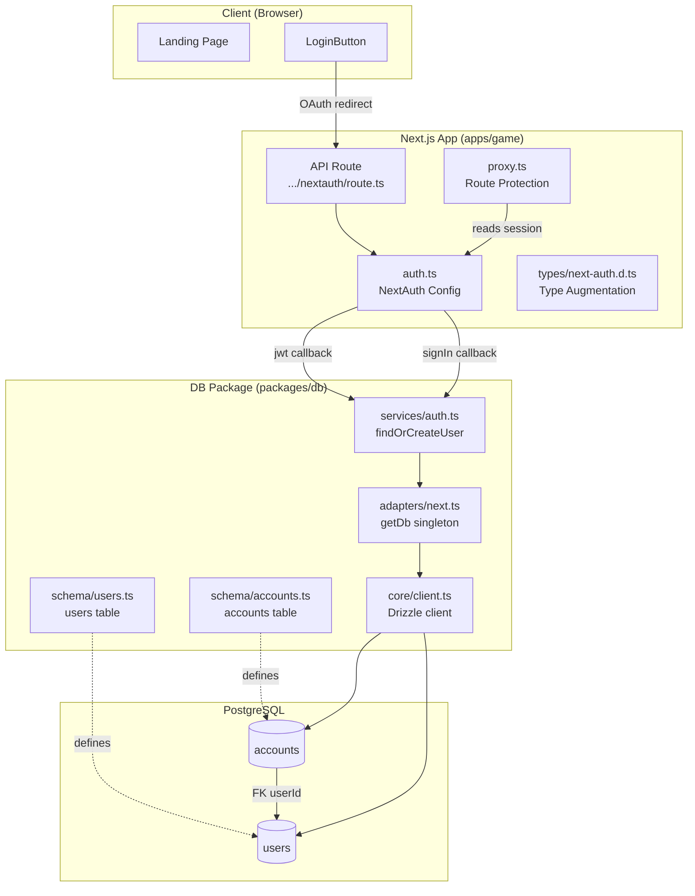
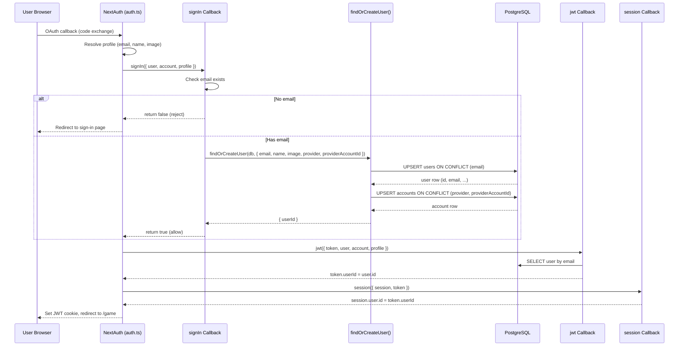

# User Persistence with Multi-Provider Account Linking Design Document

## Overview

This document defines the technical design for persisting user records in PostgreSQL after OAuth sign-in and supporting multi-provider account linking. When a user authenticates via Google or Discord, the system creates or updates a user record keyed by email and attaches provider-specific account rows. A single user can have multiple OAuth accounts (e.g., Google AND Discord) linked by email match. The JWT session is augmented with the database user ID.

## Design Summary (Meta)

```yaml
design_type: "extension"
risk_level: "low"
complexity_level: "medium"
complexity_rationale: >
  (1) ACs require a schema restructure (splitting users into users + accounts),
  a custom upsert service with transactional guarantees, JWT/session augmentation
  with DB queries, and monorepo wiring changes -- these span DB schema, service
  layer, auth callbacks, and build configuration.
  (2) The existing users table must be restructured (provider fields removed),
  which is a destructive schema change, and the signIn callback must coordinate
  two upserts atomically (user + account).
main_constraints:
  - "Clean slate database -- no existing data to migrate"
  - "Email is NOT NULL; reject sign-ins without email"
  - "JWT session strategy retained (no DB sessions)"
  - "Auto-link accounts by email match (no email verification gate)"
  - "NextAuth v5 beta.30 with --legacy-peer-deps"
biggest_risks:
  - "NextAuth signIn callback error handling: returning false vs throwing"
  - "Race condition if two providers sign in simultaneously with same email (mitigated by UNIQUE constraint)"
unknowns:
  - "Whether NextAuth v5 beta.30 signIn callback receives all needed profile fields for both Google and Discord"
```

## Background and Context

### Prerequisite ADRs

- **ADR-002: Player Authentication with NextAuth.js v5 (Auth.js)** -- Selects NextAuth.js v5 with JWT sessions, Google + Discord OAuth providers. This design extends the JWT-only setup with database persistence.

### Agreement Checklist

#### Scope

- [x] Restructure `packages/db/src/schema/users.ts` -- remove provider/providerAccountId fields, add NOT NULL to email
- [x] Create `packages/db/src/schema/accounts.ts` -- new accounts table with FK to users
- [x] Create `packages/db/src/services/auth.ts` -- `findOrCreateUser()` upsert service
- [x] Modify `apps/game/src/auth.ts` -- add signIn, jwt, session callbacks
- [x] Create `apps/game/src/types/next-auth.d.ts` -- TypeScript module augmentation
- [x] Wire `@nookstead/db` into game app (package.json + next.config.js)
- [x] Generate first Drizzle migration

#### Non-Scope (Explicitly not changing)

- [x] Landing page UI (`apps/game/src/app/page.tsx`) -- no modifications
- [x] LoginButton component -- no modifications
- [x] Game components and Phaser code -- no modifications
- [x] Session strategy -- remains JWT (no DB session table)
- [x] Email verification flow -- auto-link by email, no verification gate
- [x] User profile page or account management UI
- [x] AuthProvider component -- no modifications

#### Constraints

- [x] Parallel operation: No (clean slate DB, no existing data)
- [x] Backward compatibility: Not required (no production data)
- [x] Performance measurement: Not required (simple upsert operations)

### Problem to Solve

The current auth setup uses JWT-only sessions with no database persistence. User identity exists only in the JWT token and is lost when tokens expire. There is no way to:

1. Maintain a persistent user record across sessions
2. Link multiple OAuth providers to the same user
3. Reference a stable user ID for game-server operations (Colyseus will need user IDs)

### Current Challenges

1. **Flat schema**: The existing `users` table has `provider` and `providerAccountId` columns directly on it, which means one row per provider-user combination -- a user signing in with both Google and Discord creates two unrelated rows.
2. **No email constraint**: Email is nullable in the current schema, allowing records without a reliable identifier.
3. **No auth service layer**: The `packages/db` package has no services directory; all DB access is raw schema + adapter.
4. **No monorepo wiring**: The `@nookstead/game` app does not depend on `@nookstead/db`.

### Requirements

#### Functional Requirements

- Persist user records in PostgreSQL on OAuth sign-in
- Support multiple OAuth providers linked to the same user via email
- Reject sign-ins from providers that do not supply an email
- Augment JWT session with database user ID
- Provide a testable service function for user upsert logic

#### Non-Functional Requirements

- **Performance**: Upsert should complete within a single DB round-trip (< 50ms)
- **Reliability**: Use ON CONFLICT for idempotent upserts; no duplicate users on concurrent sign-ins
- **Maintainability**: Service layer separated from auth callbacks for unit testing
- **Data integrity**: CASCADE delete accounts when user is deleted

## Acceptance Criteria (AC) - EARS Format

### User Persistence on Sign-In

- [ ] **When** a user signs in via Google with a valid email, the system shall create a user record in the `users` table with that email, name, and image
- [ ] **When** a user signs in via Discord with a valid email, the system shall create a user record in the `users` table with that email, name, and image
- [ ] **When** a user signs in and a user record with that email already exists, the system shall update the name, image, and updatedAt fields
- [ ] **If** the OAuth profile does not include an email, **then** the system shall reject the sign-in (return false)

### Multi-Provider Account Linking

- [ ] **When** a user signs in with Google and later signs in with Discord using the same email, the system shall have one user record with two account records
- [ ] **When** a user signs in with a provider+providerAccountId that already exists, the system shall not create a duplicate account record
- [ ] The accounts table shall enforce a unique constraint on (provider, providerAccountId)

### JWT/Session Augmentation

- [ ] **When** a user signs in, the system shall add the database user UUID to the JWT token as `userId`
- [ ] **While** a session is active, `session.user.id` shall contain the database user UUID
- [ ] The system shall provide TypeScript type augmentations so `session.user.id` is typed as `string`

### Schema Integrity

- [ ] The users table shall have email as NOT NULL UNIQUE
- [ ] The accounts table shall have userId as NOT NULL with CASCADE delete referencing users.id
- [ ] The accounts table shall have a unique constraint on (provider, providerAccountId)

## Existing Codebase Analysis

### Implementation Path Mapping

| Type | Path | Description |
|------|------|-------------|
| Existing | `packages/db/src/schema/users.ts` | Current flat users table with provider fields |
| Existing | `packages/db/src/schema/index.ts` | Schema barrel export |
| Existing | `packages/db/src/core/client.ts` | Drizzle client factory with schema binding |
| Existing | `packages/db/src/adapters/next.ts` | getDb() singleton for Next.js |
| Existing | `packages/db/src/index.ts` | Package barrel export |
| Existing | `apps/game/src/auth.ts` | NextAuth config with JWT + authorized callback |
| Existing | `apps/game/package.json` | Game app dependencies (no @nookstead/db) |
| Existing | `apps/game/next.config.js` | Next.js config (no transpilePackages) |
| New | `packages/db/src/schema/accounts.ts` | Accounts table schema |
| New | `packages/db/src/services/auth.ts` | findOrCreateUser service function |
| New | `apps/game/src/types/next-auth.d.ts` | TypeScript module augmentation |
| New | `packages/db/src/migrations/` | First Drizzle migration |

### Code Inspection Evidence

| File Inspected | Key Finding | Design Impact |
|---------------|-------------|---------------|
| `packages/db/src/schema/users.ts` | Flat table with provider/providerAccountId directly on users; email is nullable (`.unique()` but not `.notNull()`) | Must restructure: remove provider fields, add `.notNull()` to email |
| `packages/db/src/schema/index.ts` | Single re-export of users | Must add accounts re-export |
| `packages/db/src/core/client.ts` | Client created with `import * as schema` -- auto-discovers all schema exports | New accounts table will be automatically included in schema binding after export |
| `packages/db/src/core/operators.ts` | Re-exports `eq`, `and`, `sql` etc. from drizzle-orm | Service can import operators from `@nookstead/db` directly |
| `packages/db/src/adapters/next.ts` | Singleton `getDb()` returns `DrizzleClient` | Service will accept `DrizzleClient` as parameter (dependency injection) |
| `packages/db/src/index.ts` | Exports core + schema + adapters | Must add services export |
| `packages/db/package.json` | Has `exports` map with subpath entries | May need to add services subpath, or export through barrel |
| `apps/game/src/auth.ts` | Only has `authorized` callback; no signIn/jwt/session callbacks | Must add three new callbacks |
| `apps/game/package.json` | No `@nookstead/db` dependency | Must add dependency |
| `apps/game/next.config.js` | Uses `composePlugins(withNx)` pattern, no `transpilePackages` | Must add `transpilePackages: ['@nookstead/db']` |
| `apps/game/tsconfig.json` | `include` covers `src/**/*.ts` | New `src/types/next-auth.d.ts` will be auto-included |
| `packages/db/drizzle.config.ts` | `out: './src/migrations'`, `schema: './src/schema/index.ts'` | Migration output dir confirmed; schema index must re-export accounts |

### Similar Functionality Search

- **User upsert logic**: No existing service layer in `packages/db/src/services/` (directory does not exist). No upsert patterns anywhere in the codebase. This is the first service function.
- **Account linking**: No existing account linking logic. The flat users table is the only user-related code.
- **Type augmentation**: No existing `next-auth.d.ts` or module augmentation files. The `apps/game/src/types/` directory does not exist.

Decision: **New implementation** -- no existing functionality to reuse or refactor.

## Applicable Standards

### Classification Table

| Standard | Type | Source | Impact on Design |
|----------|------|--------|-----------------|
| Prettier: single quotes, 2-space indent | Explicit | `.prettierrc`, `.editorconfig` | All new code must use single quotes and 2-space indent |
| ESLint: flat config with @nx/eslint-plugin | Explicit | `eslint.config.mjs` | New code must pass lint; no `@ts-ignore` |
| TypeScript: strict mode, ES2022, bundler resolution | Explicit | `tsconfig.base.json` | All new types must be strict-compatible; no `any` |
| ESM modules (`"type": "module"`) | Explicit | `packages/db/package.json` | Use ESM import/export syntax |
| Nx module boundary enforcement | Explicit | `eslint.config.mjs` (enforce-module-boundaries) | `@nookstead/db` must be properly declared as dependency |
| Singleton adapter pattern | Implicit | `packages/db/src/adapters/next.ts`, `colyseus.ts` | DB access via singleton `getDb()`, not direct client creation |
| Schema barrel exports | Implicit | `packages/db/src/schema/index.ts` | All schema tables must be re-exported from index |
| Drizzle schema conventions | Implicit | `packages/db/src/schema/users.ts` | Use `pgTable()`, camelCase fields, snake_case DB columns |
| Package exports map | Implicit | `packages/db/package.json` | Subpath exports use `types`/`import`/`default` pattern |
| Auth config centralization | Implicit | `apps/game/src/auth.ts` | All auth configuration in single `auth.ts` file |

## Design

### Change Impact Map

```yaml
Change Target: User persistence and multi-provider account linking
Direct Impact:
  - packages/db/src/schema/users.ts (remove provider/providerAccountId, email NOT NULL)
  - packages/db/src/schema/accounts.ts (new file)
  - packages/db/src/schema/index.ts (add accounts export)
  - packages/db/src/services/auth.ts (new file)
  - packages/db/src/index.ts (add services export)
  - apps/game/src/auth.ts (add signIn/jwt/session callbacks)
  - apps/game/src/types/next-auth.d.ts (new file)
  - apps/game/package.json (add @nookstead/db dep)
  - apps/game/next.config.js (add transpilePackages)
Indirect Impact:
  - packages/db/src/core/client.ts (schema binding picks up accounts automatically via import *)
  - packages/db/dist/ (rebuilt declarations will include accounts)
No Ripple Effect:
  - Landing page UI (apps/game/src/app/page.tsx)
  - LoginButton component (apps/game/src/components/auth/)
  - AuthProvider component
  - Game/Phaser code (apps/game/src/game/)
  - Colyseus adapter (packages/db/src/adapters/colyseus.ts)
  - E2E tests (apps/game-e2e/)
```

### Architecture Overview



### Data Flow



### Integration Points List

| Integration Point | Location | Old Implementation | New Implementation | Switching Method |
|-------------------|----------|-------------------|-------------------|------------------|
| Sign-in persistence | `apps/game/src/auth.ts` signIn callback | None (JWT only, no DB call) | Call `findOrCreateUser()` from `@nookstead/db` | Add callback to NextAuth config |
| JWT augmentation | `apps/game/src/auth.ts` jwt callback | None (default token) | Query user by email, set `token.userId` | Add callback to NextAuth config |
| Session augmentation | `apps/game/src/auth.ts` session callback | None (default session) | Copy `token.userId` to `session.user.id` | Add callback to NextAuth config |
| DB dependency | `apps/game/package.json` | No DB dependency | `@nookstead/db` workspace dependency | Add to dependencies |
| Transpilation | `apps/game/next.config.js` | No transpilePackages | `transpilePackages: ['@nookstead/db']` | Add to nextConfig |

### Integration Point Map

```yaml
Integration Point 1:
  Existing Component: apps/game/src/auth.ts (NextAuth config callbacks)
  Integration Method: Add signIn, jwt, session callbacks
  Impact Level: High (Process Flow Change)
  Required Test Coverage: Verify existing authorized callback still works; verify sign-in flow persists user

Integration Point 2:
  Existing Component: packages/db/src/schema/users.ts (users table definition)
  Integration Method: Schema restructure (remove provider fields, add NOT NULL email)
  Impact Level: High (Data Structure Change)
  Required Test Coverage: Verify migration generates correct DDL

Integration Point 3:
  Existing Component: packages/db/src/core/client.ts (schema auto-binding)
  Integration Method: No code change -- accounts schema auto-discovered via import *
  Impact Level: Low (Read-Only)
  Required Test Coverage: None (implicit via schema index export)

Integration Point 4:
  Existing Component: apps/game/next.config.js (build configuration)
  Integration Method: Add transpilePackages
  Impact Level: Medium (Build Configuration)
  Required Test Coverage: Verify build succeeds with @nookstead/db import
```

### Main Components

#### Component 1: Schema (users + accounts)

- **Responsibility**: Define PostgreSQL table structures and Drizzle relations for user identity
- **Interface**: Exported table definitions and inferred types (`User`, `NewUser`, `Account`, `NewAccount`)
- **Dependencies**: `drizzle-orm/pg-core` for column types

#### Component 2: Auth Service (`findOrCreateUser`)

- **Responsibility**: Encapsulate the upsert logic for user + account creation/linking
- **Interface**: `findOrCreateUser(db: DrizzleClient, params: FindOrCreateUserParams): Promise<{ userId: string }>`
- **Dependencies**: DrizzleClient (injected), schema definitions

#### Component 3: Auth Callbacks (signIn, jwt, session)

- **Responsibility**: Wire database persistence into NextAuth lifecycle
- **Interface**: NextAuth callback functions conforming to Auth.js callback signatures
- **Dependencies**: `findOrCreateUser` service, `getDb()` adapter

### Contract Definitions

```typescript
// packages/db/src/services/auth.ts

interface FindOrCreateUserParams {
  email: string;
  name: string | null;
  image: string | null;
  provider: string;
  providerAccountId: string;
}

interface FindOrCreateUserResult {
  userId: string;
}

function findOrCreateUser(
  db: DrizzleClient,
  params: FindOrCreateUserParams
): Promise<FindOrCreateUserResult>;
```

```typescript
// apps/game/src/types/next-auth.d.ts

declare module 'next-auth' {
  interface Session {
    user: {
      id: string;
    } & DefaultSession['user'];
  }
}

declare module 'next-auth/jwt' {
  interface JWT {
    userId?: string;
  }
}
```

### Data Contract

#### findOrCreateUser Service

```yaml
Input:
  Type: FindOrCreateUserParams
  Preconditions:
    - email is a non-empty string
    - provider is a non-empty string
    - providerAccountId is a non-empty string
  Validation: Caller (signIn callback) validates email presence before calling

Output:
  Type: FindOrCreateUserResult
  Guarantees:
    - userId is a valid UUID string from the users table
    - A user row with the given email exists in DB
    - An account row with the given provider + providerAccountId exists in DB
  On Error: Throws (error propagates to signIn callback, which returns false)

Invariants:
  - One user per unique email
  - One account per unique (provider, providerAccountId)
  - Account always references a valid user via FK
```

### Data Representation Decisions

| Data Structure | Decision | Rationale |
|---|---|---|
| `users` table | **Restructure** existing table | Same domain concept; remove provider-specific fields to support one-to-many relationship with accounts |
| `accounts` table | **New** dedicated table | No existing table for provider-account data; represents a distinct entity (OAuth credential) with its own lifecycle |
| `FindOrCreateUserParams` | **New** interface | No existing service interfaces; this is the first service function in the DB package |
| `User` / `NewUser` types | **Restructure** existing inferred types | Types are auto-inferred from Drizzle schema; changing the table changes the types |
| `Account` / `NewAccount` types | **New** inferred types | New table produces new inferred types automatically |
| Session/JWT type augmentation | **New** declaration | No existing type augmentation files |

### Integration Boundary Contracts

```yaml
Boundary 1: signIn callback -> findOrCreateUser
  Input: FindOrCreateUserParams extracted from OAuth profile + account
  Output: Promise<FindOrCreateUserResult> (sync/await)
  On Error: Service throws -> callback catches -> returns false (reject sign-in)

Boundary 2: jwt callback -> DB query
  Input: token.email (string from OAuth profile)
  Output: User record with id field (sync/await via Drizzle query)
  On Error: Query returns null -> do not set userId (session has no DB user ID)

Boundary 3: session callback -> token
  Input: token.userId (string | undefined)
  Output: session.user.id set to token.userId
  On Error: N/A (pure data copy, no failure mode)

Boundary 4: Game app -> @nookstead/db package
  Input: Import of findOrCreateUser, getDb, schema types
  Output: TypeScript types + runtime functions
  On Error: Build failure if transpilePackages not configured
```

### Field Propagation Map

```yaml
fields:
  - name: "email"
    origin: "OAuth Provider Profile"
    transformations:
      - layer: "NextAuth signIn callback"
        type: "string (from profile.email)"
        validation: "presence check (reject if null/undefined)"
      - layer: "findOrCreateUser service"
        type: "FindOrCreateUserParams.email"
        transformation: "passed as-is"
      - layer: "Drizzle UPSERT"
        type: "users.email (varchar 255, NOT NULL UNIQUE)"
        transformation: "none"
    destination: "users.email column"
    loss_risk: "none"

  - name: "userId"
    origin: "PostgreSQL (users.id, uuid defaultRandom)"
    transformations:
      - layer: "findOrCreateUser service"
        type: "FindOrCreateUserResult.userId"
        transformation: "returned from UPSERT RETURNING clause"
      - layer: "jwt callback"
        type: "token.userId (string)"
        transformation: "queried by email, set on token"
      - layer: "session callback"
        type: "session.user.id (string)"
        transformation: "copied from token.userId"
    destination: "Client session (useSession().data.user.id)"
    loss_risk: "low"
    loss_risk_reason: "If jwt callback DB query fails, userId will not be set on token; session.user.id would be undefined"

  - name: "provider + providerAccountId"
    origin: "OAuth account object"
    transformations:
      - layer: "NextAuth signIn callback"
        type: "string (from account.provider, account.providerAccountId)"
        validation: "implicit -- always present in OAuth flow"
      - layer: "findOrCreateUser service"
        type: "FindOrCreateUserParams.provider, .providerAccountId"
        transformation: "passed as-is"
      - layer: "Drizzle UPSERT"
        type: "accounts.provider (varchar 32), accounts.providerAccountId (varchar 255)"
        transformation: "none"
    destination: "accounts table row"
    loss_risk: "none"
```

### Interface Change Impact Analysis

| Existing Operation | New Operation | Conversion Required | Adapter Required | Compatibility Method |
|-------------------|---------------|-------------------|------------------|---------------------|
| `authorized()` callback | `authorized()` callback (unchanged) | None | Not Required | - |
| (none) | `signIn()` callback | N/A (new) | Not Required | - |
| (none) | `jwt()` callback | N/A (new) | Not Required | - |
| (none) | `session()` callback | N/A (new) | Not Required | - |
| `users` schema (flat) | `users` schema (without provider fields) | Yes (migration) | Not Required | Drizzle migration (destructive, clean slate) |
| (none) | `accounts` schema | N/A (new) | Not Required | - |
| `User` type (with provider) | `User` type (without provider) | Yes (type change) | Not Required | Inferred from new schema automatically |

### Error Handling

| Error Scenario | Handling Strategy | User Impact |
|---|---|---|
| OAuth profile has no email | signIn callback returns `false` | Redirected to sign-in page; cannot log in |
| Database connection failure | findOrCreateUser throws; signIn callback catches and returns `false` | Redirected to sign-in page with generic error |
| UNIQUE constraint violation (race) | ON CONFLICT handles it -- no error | None (idempotent upsert) |
| jwt callback DB query fails | Log error; do not set userId on token | Session works but has no DB user ID |
| Type mismatch in session | Caught at build time via TypeScript strict mode + augmentation | None (compile-time) |

### Logging and Monitoring

- **signIn callback**: Log on email-missing rejection (warn level) with provider name
- **findOrCreateUser**: Log on successful creation vs. update (info level) with user email
- **jwt callback**: Log on DB query failure (error level) with email
- No sensitive data (tokens, secrets) in logs

## Implementation Plan

### Implementation Approach

**Selected Approach**: Vertical Slice (Feature-driven)

**Selection Reason**: This feature is a single cohesive unit (persist user on sign-in) that cuts across schema, service, and auth layers. Each layer depends on the one below it, making a bottom-up vertical slice the natural approach: schema first, then service, then auth callbacks, then wiring. The feature is not usable until all layers are connected.

### Technical Dependencies and Implementation Order

#### Required Implementation Order

1. **Schema (users restructure + accounts table)**
   - Technical Reason: All other layers depend on the table definitions and inferred types
   - Dependent Elements: Service layer, auth callbacks, migration

2. **Service layer (findOrCreateUser)**
   - Technical Reason: Auth callbacks call this function; it depends on schema types
   - Prerequisites: Schema definitions must exist

3. **Package exports and monorepo wiring**
   - Technical Reason: Game app must be able to import from `@nookstead/db`
   - Prerequisites: Service and schema must be exportable

4. **Auth callbacks (signIn, jwt, session) + type augmentation**
   - Technical Reason: These consume the service and require the DB dependency
   - Prerequisites: Service exists, monorepo wiring complete

5. **Migration generation**
   - Technical Reason: Generates SQL from the final schema state
   - Prerequisites: Schema is finalized

### Integration Points

**Integration Point 1: Schema -> Client binding**
- Components: `schema/accounts.ts` -> `schema/index.ts` -> `core/client.ts`
- Verification: `drizzle-kit check` succeeds; TypeScript compilation succeeds

**Integration Point 2: Service -> Schema**
- Components: `services/auth.ts` -> `schema/users.ts` + `schema/accounts.ts`
- Verification: Unit test `findOrCreateUser()` with mock DB

**Integration Point 3: Auth callbacks -> Service + DB**
- Components: `auth.ts` callbacks -> `findOrCreateUser()` -> PostgreSQL
- Verification: Sign in with Google/Discord; verify user + account rows in DB; verify `session.user.id` is a UUID

**Integration Point 4: Game app -> DB package**
- Components: `apps/game` -> `@nookstead/db`
- Verification: `npx nx build game` succeeds; `npx nx typecheck game` succeeds

### Migration Strategy

This is the first migration for the project. There is no existing data to preserve.

1. Run `npx nx run db:db:generate` (or `cd packages/db && npx drizzle-kit generate`) to generate the initial migration
2. The migration creates the `users` table (restructured) and `accounts` table from scratch
3. Run `npx nx run db:db:migrate` to apply against development PostgreSQL

Since this is a clean slate, the migration is purely additive (CREATE TABLE statements). The old schema was never migrated to a real database.

## Implementation Samples

### Schema: users.ts (restructured)

```typescript
import {
  pgTable,
  text,
  timestamp,
  uuid,
  varchar,
} from 'drizzle-orm/pg-core';
import { relations } from 'drizzle-orm';
import { accounts } from './accounts';

export const users = pgTable('users', {
  id: uuid('id').defaultRandom().primaryKey(),
  email: varchar('email', { length: 255 }).notNull().unique(),
  name: varchar('name', { length: 255 }),
  image: text('image'),
  createdAt: timestamp('created_at', { withTimezone: true })
    .defaultNow()
    .notNull(),
  updatedAt: timestamp('updated_at', { withTimezone: true })
    .defaultNow()
    .notNull(),
});

export const usersRelations = relations(users, ({ many }) => ({
  accounts: many(accounts),
}));

export type User = typeof users.$inferSelect;
export type NewUser = typeof users.$inferInsert;
```

### Schema: accounts.ts (new)

```typescript
import {
  pgTable,
  timestamp,
  uniqueIndex,
  uuid,
  varchar,
} from 'drizzle-orm/pg-core';
import { relations } from 'drizzle-orm';
import { users } from './users';

export const accounts = pgTable(
  'accounts',
  {
    id: uuid('id').defaultRandom().primaryKey(),
    userId: uuid('user_id')
      .notNull()
      .references(() => users.id, { onDelete: 'cascade' }),
    provider: varchar('provider', { length: 32 }).notNull(),
    providerAccountId: varchar('provider_account_id', {
      length: 255,
    }).notNull(),
    createdAt: timestamp('created_at', { withTimezone: true })
      .defaultNow()
      .notNull(),
  },
  (table) => [
    uniqueIndex('accounts_provider_provider_account_id_idx').on(
      table.provider,
      table.providerAccountId
    ),
  ]
);

export const accountsRelations = relations(accounts, ({ one }) => ({
  user: one(users, {
    fields: [accounts.userId],
    references: [users.id],
  }),
}));

export type Account = typeof accounts.$inferSelect;
export type NewAccount = typeof accounts.$inferInsert;
```

### Service: auth.ts (new)

```typescript
import { eq } from 'drizzle-orm';
import type { DrizzleClient } from '../core/client';
import { users } from '../schema/users';
import { accounts } from '../schema/accounts';

export interface FindOrCreateUserParams {
  email: string;
  name: string | null;
  image: string | null;
  provider: string;
  providerAccountId: string;
}

export interface FindOrCreateUserResult {
  userId: string;
}

export async function findOrCreateUser(
  db: DrizzleClient,
  params: FindOrCreateUserParams
): Promise<FindOrCreateUserResult> {
  const { email, name, image, provider, providerAccountId } = params;

  // Upsert user by email
  const [user] = await db
    .insert(users)
    .values({ email, name, image })
    .onConflictDoUpdate({
      target: users.email,
      set: {
        name,
        image,
        updatedAt: new Date(),
      },
    })
    .returning({ id: users.id });

  // Upsert account by (provider, providerAccountId)
  await db
    .insert(accounts)
    .values({
      userId: user.id,
      provider,
      providerAccountId,
    })
    .onConflictDoUpdate({
      target: [accounts.provider, accounts.providerAccountId],
      set: { userId: user.id },
    });

  return { userId: user.id };
}
```

### Auth callbacks: auth.ts (modified)

```typescript
import NextAuth from 'next-auth';
import Google from 'next-auth/providers/google';
import Discord from 'next-auth/providers/discord';
import { getDb } from '@nookstead/db';
import { findOrCreateUser } from '@nookstead/db';
import { users, eq } from '@nookstead/db';

export const { handlers, auth, signIn, signOut } = NextAuth({
  providers: [Google, Discord],
  session: {
    strategy: 'jwt',
    maxAge: 30 * 24 * 60 * 60,
  },
  pages: {
    signIn: '/',
  },
  callbacks: {
    async signIn({ user, account }) {
      if (!user.email) {
        return false;
      }

      if (!account) {
        return false;
      }

      try {
        const db = getDb();
        await findOrCreateUser(db, {
          email: user.email,
          name: user.name ?? null,
          image: user.image ?? null,
          provider: account.provider,
          providerAccountId: account.providerAccountId,
        });
        return true;
      } catch (error) {
        console.error('Failed to persist user on sign-in:', error);
        return false;
      }
    },

    async jwt({ token }) {
      if (token.email) {
        try {
          const db = getDb();
          const [dbUser] = await db
            .select({ id: users.id })
            .from(users)
            .where(eq(users.email, token.email))
            .limit(1);

          if (dbUser) {
            token.userId = dbUser.id;
          }
        } catch (error) {
          console.error('Failed to fetch user in jwt callback:', error);
        }
      }
      return token;
    },

    session({ session, token }) {
      if (token.userId) {
        session.user.id = token.userId as string;
      }
      return session;
    },

    authorized({ auth: session, request }) {
      const isGameRoute = request.nextUrl.pathname.startsWith('/game');
      const isLoggedIn = !!session?.user;

      if (isGameRoute && !isLoggedIn) {
        return false;
      }

      return true;
    },
  },
});
```

### Type augmentation: next-auth.d.ts (new)

```typescript
import type { DefaultSession } from 'next-auth';

declare module 'next-auth' {
  interface Session {
    user: {
      id: string;
    } & DefaultSession['user'];
  }
}

declare module 'next-auth/jwt' {
  interface JWT {
    userId?: string;
  }
}
```

## Test Strategy

### Basic Test Design Policy

Test cases are derived directly from acceptance criteria. Each AC maps to at least one test case. The primary testing surface is the `findOrCreateUser` service function, which encapsulates all database logic.

### Unit Tests

**Target**: `packages/db/src/services/auth.ts`

Tests for `findOrCreateUser()` (requires test database or mock):

| AC | Test Case | Assertion |
|---|---|---|
| User creation | Call with new email | User row created with correct email, name, image |
| User update | Call with existing email, different name | User row updated, same ID returned |
| Account creation | Call with new provider+providerAccountId | Account row created, linked to user |
| Account linking | Call with same email, different provider | One user row, two account rows |
| Account idempotency | Call with same provider+providerAccountId twice | One account row, no error |
| Account reassignment | Call with existing provider+providerAccountId, different email | Account userId updated to new user |

### Integration Tests

**Target**: `apps/game/src/auth.ts` callbacks

| AC | Test Case | Assertion |
|---|---|---|
| Email rejection | signIn callback with user.email = null | Returns false |
| Successful sign-in | signIn callback with valid user + account | Returns true; user + account in DB |
| JWT augmentation | jwt callback after sign-in | token.userId is a UUID string |
| Session augmentation | session callback with token.userId | session.user.id equals token.userId |
| Authorized preserved | authorized callback with game route, no session | Returns false |

### E2E Tests

E2E verification of the full sign-in flow is outside scope for this design (requires OAuth provider mocking). The existing E2E test infrastructure (Playwright in `apps/game-e2e`) can be extended later to test the authenticated game access flow.

### Performance Tests

Not required. The upsert operations are single-row PostgreSQL INSERTs with ON CONFLICT, which are inherently fast (< 5ms under normal conditions).

## Security Considerations

1. **Auto-linking by email**: This design auto-links accounts by email without verification. This is acceptable because:
   - Both Google and Discord verify email ownership as part of their OAuth flows
   - The risk of email spoofing between trusted OAuth providers is negligible
   - This is explicitly an accepted decision (per requirements)

2. **SQL injection**: Drizzle ORM uses parameterized queries; no raw SQL string concatenation.

3. **Session data exposure**: Only `user.id` (UUID) is added to the session. No sensitive data (provider tokens, account IDs) is exposed to the client.

4. **CASCADE delete**: Deleting a user cascades to all linked accounts, preventing orphaned records.

## Future Extensibility

1. **Additional providers**: Adding a new OAuth provider (e.g., GitHub, Twitch) requires zero schema changes -- just add the provider in `auth.ts` and the accounts table will store the new provider rows automatically.

2. **User profile enrichment**: The users table can be extended with game-specific fields (e.g., `displayName`, `avatarUrl`, `level`) without affecting the auth flow.

3. **Colyseus integration**: The game server can query users by `id` using the `getGameDb()` adapter -- the schema is already shared.

4. **Session revocation**: If needed in the future, a `sessions` table and database session strategy can replace JWT without changing the user/account schema.

## Alternative Solutions

### Alternative 1: Use NextAuth.js Database Adapter (Drizzle Adapter)

- **Overview**: Use the official `@auth/drizzle-adapter` package, which auto-manages users, accounts, sessions, and verification tokens tables.
- **Advantages**: Zero custom code for user/account persistence; follows Auth.js conventions; supports database sessions.
- **Disadvantages**: Opinionated schema (includes sessions + verification_tokens tables we do not need); requires `@auth/drizzle-adapter` dependency; less control over upsert behavior and account linking logic; adapter expects specific column names.
- **Reason for Rejection**: We want precise control over the upsert logic (auto-link by email) and minimal schema (no sessions table since we use JWT). The custom approach is simpler for our specific requirements.

### Alternative 2: Keep Flat Users Table (One Row Per Provider)

- **Overview**: Keep the current schema where each provider creates a separate user row. Link them at the application level by email.
- **Advantages**: No schema change needed; simpler implementation.
- **Disadvantages**: Duplicated user data across rows; no single user ID for game-server operations; queries become complex ("find all rows for this email"); violates normalization.
- **Reason for Rejection**: A normalized users + accounts structure is cleaner, supports a single stable user ID for Colyseus, and scales to additional providers without data duplication.

## Risks and Mitigation

| Risk | Impact | Probability | Mitigation |
|------|--------|-------------|------------|
| NextAuth beta.30 callback signature changes | High | Low | Pin to exact version; test callbacks on upgrade |
| OAuth provider does not return email | Medium | Low | signIn callback rejects; document in error handling |
| Race condition: simultaneous sign-ins with same email | Low | Very Low | UNIQUE constraint + ON CONFLICT handles atomically |
| Drizzle `onConflictDoUpdate` behavior change | Medium | Low | Pin drizzle-orm version; integration test covers upsert |
| `transpilePackages` insufficient for ESM package | Medium | Low | Nx withNx plugin handles most cases; fallback to `@nx/next` externals config |

## References

- [NextAuth.js v5 Documentation - Extending the Session](https://github.com/nextauthjs/next-auth/blob/main/docs/pages/guides/extending-the-session.mdx) - JWT callback pattern for adding user ID to session
- [NextAuth.js v5 TypeScript Module Augmentation](https://github.com/nextauthjs/next-auth/blob/main/docs/pages/getting-started/typescript.mdx) - Declaring custom Session and JWT types
- [Auth.js Callbacks Reference](https://authjs.dev/reference/nextjs) - signIn, jwt, session callback signatures
- [Drizzle ORM Upsert Guide](https://orm.drizzle.team/docs/guides/upsert) - `onConflictDoUpdate` patterns with PostgreSQL
- [Drizzle ORM Insert Documentation](https://orm.drizzle.team/docs/insert) - `onConflictDoUpdate` with composite targets
- [NextAuth.js Multi-Provider Account Linking Discussion](https://github.com/nextauthjs/next-auth/discussions/1702) - Community patterns for linking multiple providers
- [NextAuth.js Account Linking Example](https://github.com/rexfordessilfie/next-auth-account-linking) - Reference implementation
- [ADR-002: Player Authentication with NextAuth.js v5](../adr/adr-002-nextauth-authentication.md) - Prerequisite ADR

## Update History

| Date | Version | Changes | Author |
|------|---------|---------|--------|
| 2026-02-14 | 1.0 | Initial version | AI |
