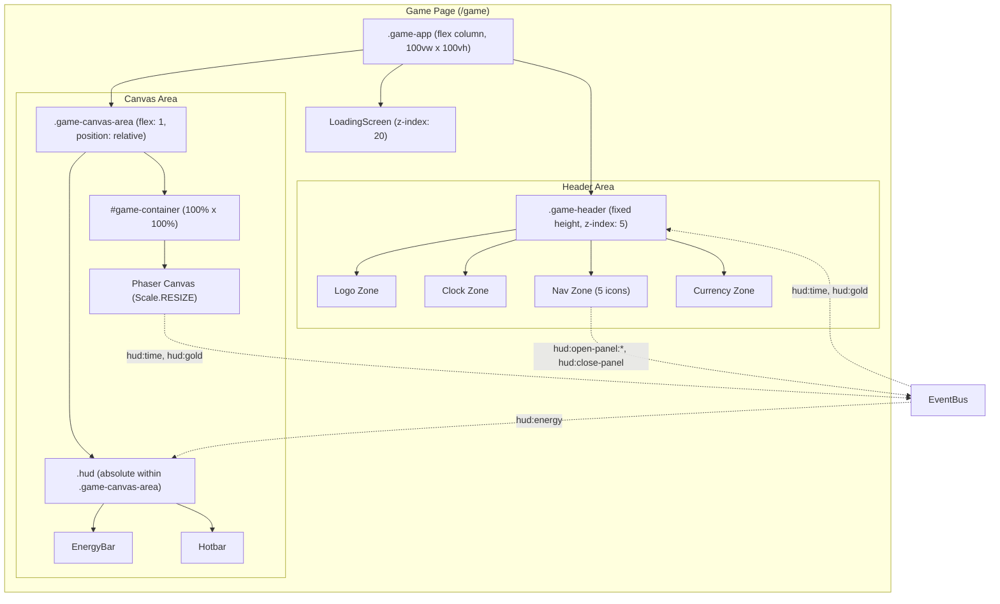
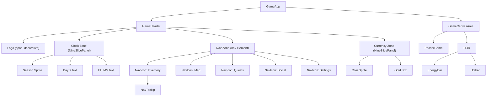
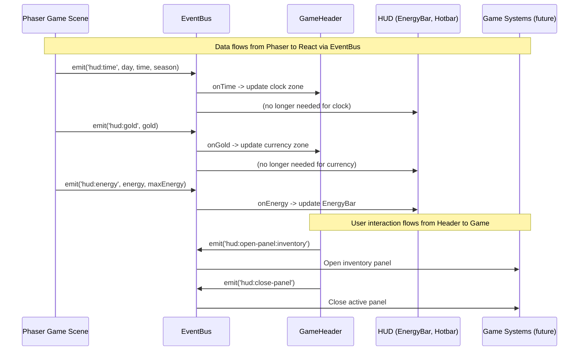
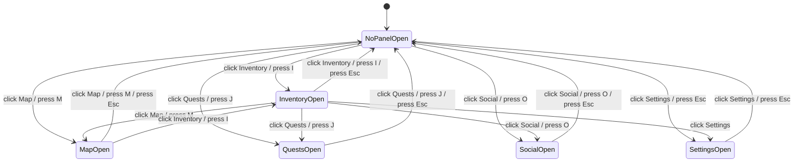

# Game Header and Navigation Design Document

## Overview

This document defines the technical design for introducing a persistent game header bar that consolidates the existing ClockPanel, CurrencyDisplay, and MenuButton HUD elements into a unified strip at the top of the game screen, adds a Nookstead text logo, and provides five icon-based navigation buttons (Inventory, Map, Quests, Social, Settings) with keyboard shortcut support. The implementation restructures the game layout from a single full-viewport container to a vertical flexbox (fixed-height header + flex-grow canvas area) per ADR-003.

## Design Summary (Meta)

```yaml
design_type: "new_feature"
risk_level: "medium"
complexity_level: "medium"
complexity_rationale: >
  (1) ACs require layout restructuring from full-viewport to flexbox, migration of three
  existing HUD components into a new header, introduction of five navigation icon buttons
  with toggle/panel state management, keyboard shortcut system with text input exclusion,
  ResizeObserver-based --ui-scale recalculation, and pixel-art sprite integration -- these
  span layout, state management, input handling, and visual rendering layers.
  (2) The Phaser Scale.RESIZE mode depends on accurate parent container dimensions; the
  flexbox migration introduces a timing risk on initial mount. The --ui-scale formula
  change from window dimensions to container dimensions affects all existing HUD elements.
main_constraints:
  - "Global CSS only (PostCSS, no CSS Modules) -- all styles in global.css"
  - "Pixel-perfect rendering: image-rendering: pixelated, integer --ui-scale (2-6)"
  - "LimeZu Modern UI sprite sheet (hud_32.png, 32px grid) for all visual elements"
  - "Press Start 2P pixel font via next/font/google"
  - "EventBus naming convention: hud: prefix for all new events"
  - "Phaser Scale.RESIZE must receive accurate container dimensions"
biggest_risks:
  - "Phaser canvas may receive zero-height container on first frame before flexbox layout resolves"
  - "Keyboard shortcuts may conflict with Phaser input handling (double-processing)"
  - "--ui-scale recalculation change from window to container dimensions may cause sizing regression in existing HUD elements"
unknowns:
  - "Exact sprite coordinates for nav icons (Inventory, Map, Quests, Social, Settings) -- pending 1:1 zoom verification in image editor"
  - "Whether ResizeObserver fires before or after Phaser's first Scale.RESIZE event on initial mount"
```

## Background and Context

### Prerequisite ADRs

- **ADR-003: Game Header Layout Architecture** -- Selects the layout restructure approach (vertical flexbox with fixed header + flex-grow canvas area). Documents the rejected overlay and Phaser-rendered approaches with rationale.
- **ADR-002: Player Authentication with NextAuth.js v5** -- Header renders only for authenticated players on the `/game` route.

### Applicable Standards

#### Classification Table

| Standard | Type | Source | Impact on Design |
|----------|------|--------|-----------------|
| Prettier single quotes | Explicit | `.prettierrc` | All new TypeScript/CSS code must use single quotes |
| 2-space indentation | Explicit | `.editorconfig` | All files use space-based 2-space indent |
| ESLint flat config with @nx/eslint-plugin | Explicit | `eslint.config.mjs` | Module boundary enforcement; new components must comply |
| TypeScript strict mode | Explicit | `tsconfig.base.json` (`"strict": true`) | All new interfaces must be fully typed; no implicit any |
| PostCSS global CSS (no CSS Modules) | Explicit | Project convention per CLAUDE.md | All styles go in `global.css` using BEM-like class naming |
| `image-rendering: pixelated` triple fallback | Implicit | `global.css` Section 6 (.hud rules) | All sprite-containing elements must apply the triple fallback |
| EventBus pub/sub pattern with `hud:` prefix | Implicit | `EventBus.ts` + `HUD.tsx` | New events must follow `hud:` naming convention |
| NineSlicePanel component for pixel art panels | Implicit | `NineSlicePanel.tsx` | Header background and active state frames must use NineSlicePanel |
| `spriteCSSStyle()` for --ui-scale-responsive icons | Implicit | `sprite.ts` + `ClockPanel.tsx` | Nav icons and status icons must use spriteCSSStyle for responsive scaling |
| `'use client'` directive on interactive components | Implicit | All HUD components | All new header components must include `'use client'` directive |
| `@/*` path alias for imports | Explicit | `tsconfig.json` paths | All imports from `apps/game/src/*` must use `@/*` alias |

### Agreement Checklist

#### Scope

- [x] Create GameHeader component with logo, clock, navigation, and currency zones
- [x] Create NavIcon component for individual navigation buttons
- [x] Create NavTooltip component for hover tooltips with shortcut hints
- [x] Restructure `.game-app` layout from position:relative to flexbox column
- [x] Create `.game-canvas-area` wrapper containing game-container and HUD overlay
- [x] Migrate ClockPanel data into header clock zone
- [x] Migrate CurrencyDisplay data into header currency zone
- [x] Remove MenuButton component from HUD
- [x] Implement keyboard shortcuts (I, M, J, O, Escape) with text input exclusion
- [x] Recalculate `--ui-scale` using ResizeObserver on canvas area container
- [x] Add new EventBus events for panel open/close
- [x] Add CSS for header, nav icons, tooltips, day/night tinting, seasonal accents

#### Non-Scope (Explicitly not changing)

- [x] Game system panel contents (Inventory, Map, Quests, Social, Settings UIs)
- [x] Phaser game engine code (`src/game/**/*`) -- no modifications to scenes or main.ts
- [x] EnergyBar component -- remains in HUD overlay, no changes
- [x] Hotbar component -- remains in HUD overlay, no changes
- [x] HotbarSlot component -- no changes
- [x] Landing page, loading screen, authentication -- no changes
- [x] Seasonal decorative particles (Could Have; deferred to future implementation)
- [x] Currency earn/spend animations (separate implementation)
- [x] Festival decorative borders (Could Have; deferred)

#### Constraints

- [x] Parallel operation: No (layout restructure is a breaking change to `.game-app`)
- [x] Backward compatibility: Not required (replacing existing layout approach)
- [x] Performance measurement: Required (header must render within 16ms; no FPS impact on Phaser canvas)

#### Design Reflection of Agreements

- [x] All scope items map to specific components in "Main Components" section
- [x] Non-scope items are explicitly excluded from the Change Impact Map
- [x] Performance constraint is addressed in Non-Functional Requirements and AC-NFR-1

### Problem to Solve

The current HUD scatters game-state information across isolated, absolutely positioned overlays (ClockPanel top-left, CurrencyDisplay top-right, MenuButton bottom-right). There is no brand presence during gameplay, no visible navigation to game systems, and no persistent way for players to discover available features. The header consolidates status, navigation, and brand into one predictable horizontal strip.

### Current Challenges

1. **No brand presence**: The Nookstead logo disappears once the player enters gameplay.
2. **Scattered HUD**: Clock, currency, and menu are positioned independently in three corners, increasing cognitive load.
3. **Poor discoverability**: The single MenuButton is the only entry point to all game systems, requiring multiple clicks.
4. **Z-index collision risk**: As more overlays are added, absolutely positioned HUD elements risk colliding.

### Requirements

#### Functional Requirements

- FR-1: Header bar component spanning full viewport width with fixed height
- FR-2: Nookstead text logo in Press Start 2P font with teal glow
- FR-3: Consolidated clock and season display (migrated from ClockPanel)
- FR-4: Consolidated currency display (migrated from CurrencyDisplay)
- FR-5: Five navigation icons (Inventory, Map, Quests, Social, Settings)
- FR-6: Layout restructure (flexbox: header + canvas area)
- FR-7: Keyboard shortcuts (I, M, J, O, Escape)
- FR-8: MenuButton removal

#### Non-Functional Requirements

- **Performance**: Header renders within 16ms; no impact on Phaser canvas FPS; layout recalculation within 100ms on resize
- **Reliability**: Header renders with default values before EventBus connects; graceful fallback if sprites fail to load
- **Accessibility**: ARIA landmarks, `aria-pressed` on nav buttons, `aria-live="polite"` on status regions, keyboard focus management, WCAG 2.2 AA compliance
- **Bundle size**: Header additions must not exceed 5KB gzipped

## Acceptance Criteria (AC) -- EARS Format

### FR-1: Header Bar Component

- [ ] **AC-1.1**: The system shall render a horizontal header bar at the top of the game screen spanning the full viewport width.
- [ ] **AC-1.2**: The header shall maintain a fixed height of `calc(16px * var(--ui-scale))`, pixel-aligned at all --ui-scale tiers (2-6).
- [ ] **AC-1.3**: The header shall use a NineSlicePanel (SLOT_NORMAL) background consistent with existing HUD visual style.
- [ ] **AC-1.4**: The header shall render above the Phaser canvas (z-index 5) and below the HUD overlay (z-index 10).

### FR-2: Nookstead Text Logo

- [ ] **AC-2.1**: The header shall display "NOOKSTEAD" in Press Start 2P font with teal (#48C7AA) color and a pulsing glow effect (`text-shadow` animation, 3s loop).
- [ ] **AC-2.2**: The logo font size shall scale with `--ui-scale` via `calc(5px * var(--ui-scale))`.
- [ ] **AC-2.3**: **While** `prefers-reduced-motion: reduce` is active, the glow shall remain static (no animation).
- [ ] **AC-2.4**: The logo shall include an `aria-hidden="true"` attribute (decorative element).

### FR-3: Consolidated Clock and Season Display

- [ ] **AC-3.1**: **When** the game clock advances (EventBus `hud:time` event), the header shall update day number, time, and season display in real-time.
- [ ] **AC-3.2**: The clock zone shall display a season icon sprite, "Day X", and "HH:MM" time.
- [ ] **AC-3.3**: The clock display shall use `role="status"` with `aria-live="polite"` and provide a screen-reader label in the format "Day X of Season, HH:MM".
- [ ] **AC-3.4**: **When** the header is rendered, the standalone ClockPanel shall no longer appear as a separate floating element in the HUD.

### FR-4: Consolidated Currency Display

- [ ] **AC-4.1**: **When** the player's gold balance changes (EventBus `hud:gold` event), the currency display in the header shall update immediately.
- [ ] **AC-4.2**: The currency zone shall display a coin icon sprite and formatted gold amount (locale-aware, e.g., "1,234").
- [ ] **AC-4.3**: The currency display shall use `role="status"` with `aria-label` in the format "Gold: X".
- [ ] **AC-4.4**: **When** the header is rendered, the standalone CurrencyDisplay shall no longer appear as a separate floating element in the HUD.

### FR-5: Navigation Icons

- [ ] **AC-5.1**: The header shall display five navigation icon buttons in this order: Inventory, Map, Quests, Social, Settings.
- [ ] **AC-5.2**: **When** the player clicks a navigation icon, the system shall emit the corresponding EventBus event (`hud:open-panel:{name}`) and the icon shall show an active/selected visual state (SLOT_SELECTED golden frame).
- [ ] **AC-5.3**: **When** the player clicks an already-active navigation icon, the system shall emit `hud:close-panel` and the icon shall return to its default state.
- [ ] **AC-5.4**: **When** the player clicks a different navigation icon while a panel is open, the system shall close the current panel and open the new one (only one panel open at a time).
- [ ] **AC-5.5**: Each navigation button shall be a `<button>` element with `aria-label` (e.g., "Open inventory") and `aria-pressed` reflecting the panel open/closed state.
- [ ] **AC-5.6**: All navigation icons shall have a minimum touch target of 44x44 CSS pixels.

### FR-6: Layout Restructure

- [ ] **AC-6.1**: The `.game-app` container shall use `display: flex; flex-direction: column` with the header at the top and the canvas area filling the remaining height via `flex: 1`.
- [ ] **AC-6.2**: The Phaser canvas shall render correctly within the reduced container height without cropping or overflow.
- [ ] **AC-6.3**: The HUD overlay (EnergyBar, Hotbar) shall be positioned relative to the canvas area container (not the full viewport).
- [ ] **AC-6.4**: The `--ui-scale` custom property shall be recalculated based on the canvas area container dimensions (not `window.innerWidth`/`window.innerHeight`).

### FR-7: Keyboard Shortcuts

- [ ] **AC-7.1**: **When** the player presses `I` and no text input is focused, the system shall toggle the Inventory panel and the corresponding header icon shall reflect the panel state.
- [ ] **AC-7.2**: **When** the player presses `M` and no text input is focused, the system shall toggle the Map panel.
- [ ] **AC-7.3**: **When** the player presses `J` and no text input is focused, the system shall toggle the Quests panel.
- [ ] **AC-7.4**: **When** the player presses `O` and no text input is focused, the system shall toggle the Social panel.
- [ ] **AC-7.5**: **When** the player presses `Escape` and a panel is open, the system shall close the current panel. **If** no panel is open, **then** the system shall open the Settings panel.
- [ ] **AC-7.6**: **While** a text input, textarea, select, or contentEditable element is focused, keyboard shortcuts shall not fire.

### FR-8: MenuButton Removal

- [ ] **AC-8.1**: **When** the game loads with the header navigation, no MenuButton shall appear in the bottom-right corner of the HUD.
- [ ] **AC-8.2**: The `hud:menu-toggle` EventBus event shall be deprecated (no longer emitted).

### Non-Functional ACs

- [ ] **AC-NFR-1**: The header component shall render within 16ms on initial page load (verifiable via React Profiler or Performance API).
- [ ] **AC-NFR-2**: The Phaser canvas shall maintain 60fps on desktop with the header present (no regression from current baseline).
- [ ] **AC-NFR-3**: The header shall pass automated accessibility checks (axe-core) with zero critical or serious violations.

## Existing Codebase Analysis

### Implementation Path Mapping

| Type | Path | Description |
|------|------|-------------|
| Existing | `apps/game/src/components/game/GameApp.tsx` | Game layout root; will be restructured to flexbox |
| Existing | `apps/game/src/components/hud/HUD.tsx` | HUD root; will remove ClockPanel, CurrencyDisplay, MenuButton |
| Existing | `apps/game/src/components/hud/ClockPanel.tsx` | Clock display; logic migrated to header, component deprecated |
| Existing | `apps/game/src/components/hud/CurrencyDisplay.tsx` | Currency display; logic migrated to header, component deprecated |
| Existing | `apps/game/src/components/hud/MenuButton.tsx` | Menu button; removed entirely |
| Existing | `apps/game/src/components/hud/NineSlicePanel.tsx` | Reusable panel; will be imported by header components |
| Existing | `apps/game/src/components/hud/sprite.ts` | Sprite utilities; no changes, imported by header |
| Existing | `apps/game/src/components/hud/sprites.ts` | Sprite coordinates; will add nav icon coordinates |
| Existing | `apps/game/src/components/hud/types.ts` | HUD types; will add HeaderState, NavItem, PanelId types |
| Existing | `apps/game/src/game/EventBus.ts` | EventBus; no code changes (new events use existing emitter) |
| Existing | `apps/game/src/app/global.css` | Global styles; will add Section 7 for header styles |
| New | `apps/game/src/components/header/GameHeader.tsx` | Root header component |
| New | `apps/game/src/components/header/NavIcon.tsx` | Navigation icon button component |
| New | `apps/game/src/components/header/NavTooltip.tsx` | Pixel art tooltip component |
| New | `apps/game/src/components/header/useHeaderState.ts` | Custom hook for header state management |
| New | `apps/game/src/components/header/useKeyboardShortcuts.ts` | Custom hook for keyboard shortcuts |
| New | `apps/game/src/components/header/constants.ts` | Navigation items data array and header constants |

### Similar Functionality Search

**Search performed**: Searched for existing navigation, menu, panel toggle, and keyboard shortcut implementations.

- **MenuButton**: Found in `components/hud/MenuButton.tsx`. Emits `hud:menu-toggle`. This is the only existing navigation mechanism. **Decision**: Replace with header navigation icons (MenuButton removed).
- **Keyboard shortcuts**: Found in `HUD.tsx` lines 58-70 -- hotbar slot selection via Digit keys. **Decision**: Extend this pattern with a new `useKeyboardShortcuts` hook for navigation keys. The hotbar keyboard handler remains in HUD.tsx.
- **Panel toggle logic**: No existing implementation found. **Decision**: New implementation in `useHeaderState` hook.
- **Tooltip**: No existing tooltip component found. **Decision**: New NavTooltip component.

### Code Inspection Evidence

#### What Was Examined

| File Inspected | Key Finding | Design Impact |
|---------------|-------------|---------------|
| `GameApp.tsx` (33 lines) | Renders `<div className="game-app">` with LoadingScreen, PhaserGame, and HUD as siblings. PhaserGame uses `ref={phaserRef}`. Loading state managed via EventBus `preload-complete` event. | GameApp.tsx restructured to add header and canvas-area wrapper. HUD becomes child of canvas-area. LoadingScreen z-index unchanged. |
| `HUD.tsx` (93 lines) | Manages `HUDState` via useState. Computes `--ui-scale` from `window.innerWidth`/`innerHeight`. Subscribes to EventBus `hud:time`, `hud:gold`, `hud:energy`. Renders ClockPanel, CurrencyDisplay, EnergyBar, Hotbar, MenuButton. | HUD.tsx modified: remove ClockPanel/CurrencyDisplay/MenuButton imports and renders. --ui-scale computation moves to GameApp or canvas-area level (shared between header and HUD). |
| `ClockPanel.tsx` (46 lines) | Receives `day`, `time`, `season` as props. Uses NineSlicePanel, spriteCSSStyle, SPRITES.seasonSpring/Summer/Autumn/Winter. Has ARIA status role and aria-live. | Clock rendering logic replicated in GameHeader clock zone. Same props pattern. Same ARIA approach. ClockPanel.tsx file can be deprecated. |
| `CurrencyDisplay.tsx` (33 lines) | Receives `gold` as prop. Uses NineSlicePanel, spriteCSSStyle, SPRITES.coinIcon. Formats via `toLocaleString()`. Has ARIA status role. | Currency rendering logic replicated in GameHeader currency zone. Same pattern. CurrencyDisplay.tsx file can be deprecated. |
| `MenuButton.tsx` (30 lines) | Simple button with normal/hover sprite states. Uses spriteNativeStyle. Emits `hud:menu-toggle` on click. | Removed entirely. Replaced by header NavIcon components. |
| `NineSlicePanel.tsx` (73 lines) | CSS Grid 3x3 with explicit cell placement. Accepts `slices` prop (defaults to SLOT_NORMAL). Uses spriteNativeStyle for corners, spriteStretchStyle for edges/center. | Reused as-is for header background and active nav icon frames. No modifications needed. |
| `sprite.ts` (96 lines) | Four functions: spriteStyle, spriteCSSStyle, spriteNativeStyle, spriteStretchStyle. All reference SHEET_PATH '/assets/ui/hud_32.png'. | No modifications. All four functions imported by header components. |
| `sprites.ts` (55 lines) | SLOT_NORMAL, SLOT_SELECTED NineSliceSets. SPRITES object with coinIcon, menuBtnNormal, menuBtnActive, season icons, energy bar sprites. All marked "approximate." | Add nav icon sprite coordinates (inventory, map, quests, social, settings). Existing sprites unchanged. |
| `types.ts` (42 lines) | Season, SpriteRect, NineSliceSet, HotbarItem, HUDState interfaces. DEFAULT_HUD_STATE constant. HUDState has day/time/season/gold/energy/maxEnergy/hotbarItems/selectedSlot. | Add PanelId type, NavItem interface, HeaderState interface. HUDState unchanged (header reads same state). |
| `global.css` (751 lines) | Organized in numbered sections (1-6). Section 4: .game-app (position:relative, 100vw x 100vh). Section 6: HUD system (.hud, .nine-slice, .clock-panel, .currency-display, .menu-button, .energy-bar, .hotbar, .hotbar-slot). | Section 4 modified for flexbox. Section 6: .clock-panel, .currency-display, .menu-button styles deprecated/removed. New Section 7 added for header styles. |
| `EventBus.ts` (4 lines) | Simple `new Events.EventEmitter()` from Phaser. No type safety. | No code changes. New events emitted using existing emitter instance. |
| `main.ts` (26 lines) | Phaser config: `scale: { mode: Phaser.Scale.RESIZE, width: '100%', height: '100%' }`, `parent: 'game-container'`. | No changes. Scale.RESIZE automatically reads new parent container dimensions after flexbox restructure. |
| `layout.tsx` (34 lines) | Root layout with AuthProvider, global.css import, Press Start 2P font loaded via `<link>` element. | No changes needed. Font already available globally. |
| `game/page.tsx` (13 lines) | Dynamic import of GameApp with `{ ssr: false }`. | No changes needed. |

#### Key Findings

1. **HUD --ui-scale is computed from window dimensions** (`window.innerWidth` / `window.innerHeight`). After layout restructure, this must change to use canvas-area container dimensions to avoid the header height inflating the scale factor.
2. **HUD state is managed entirely in HUD.tsx** via `useState<HUDState>`. The header needs access to the same `day`, `time`, `season`, `gold` state. Two approaches: (a) lift state up to GameApp, or (b) have header subscribe independently to EventBus. Option (b) is selected to minimize changes to existing HUD code.
3. **NineSlicePanel renders at native 1:1 pixel size for corners**. Header background must stretch horizontally, which the existing NineSlicePanel already supports via its CSS Grid `1fr` approach.
4. **Keyboard handling exists in HUD.tsx for hotbar** (Digit keys). New navigation shortcuts are a separate concern and should live in a dedicated hook to maintain separation of responsibilities.
5. **All HUD components use `'use client'` directive**. New header components must follow this pattern.

#### How Findings Influence Design

- **Independent EventBus subscription**: GameHeader subscribes directly to `hud:time` and `hud:gold` events rather than requiring state to be lifted to GameApp. This minimizes changes to HUD.tsx.
- **--ui-scale shared via ResizeObserver**: Both GameHeader and HUD need the same scale value. The scale computation moves to a shared location (either GameApp or a custom hook) and is passed as a CSS custom property on the canvas-area container.
- **NineSlicePanel reuse**: No wrapper or adapter needed; direct import with SLOT_NORMAL for header background and SLOT_SELECTED for active nav icon frame.
- **Separate keyboard hook**: Navigation shortcuts isolated in `useKeyboardShortcuts.ts` to avoid coupling with hotbar key handler.

### Integration Points

- **EventBus (Phaser -> Header)**: Header subscribes to `hud:time`, `hud:gold` events
- **EventBus (Header -> Game)**: Header emits `hud:open-panel:*`, `hud:close-panel` events
- **NineSlicePanel**: Header imports and uses existing component
- **Sprite utilities**: Header imports spriteCSSStyle from existing sprite.ts
- **--ui-scale CSS property**: Shared between header and HUD via parent container

## Design

### Architecture Overview



### Component Hierarchy Diagram



### Change Impact Map

```yaml
Change Target: Game layout restructure + header introduction
Direct Impact:
  - apps/game/src/components/game/GameApp.tsx (DOM restructure: add header + canvas-area wrapper)
  - apps/game/src/components/hud/HUD.tsx (remove ClockPanel, CurrencyDisplay, MenuButton; adjust --ui-scale source)
  - apps/game/src/components/hud/types.ts (add PanelId, NavItem, HeaderState types)
  - apps/game/src/components/hud/sprites.ts (add nav icon sprite coordinates)
  - apps/game/src/app/global.css (modify Section 4 .game-app; deprecate Section 6 clock/currency/menu styles; add Section 7 header styles)
Indirect Impact:
  - apps/game/src/components/hud/EnergyBar.tsx (positioning now relative to .game-canvas-area instead of .game-app -- CSS-only impact via parent container change)
  - apps/game/src/components/hud/Hotbar.tsx (same positioning impact as EnergyBar)
  - Phaser canvas (receives new parent container dimensions via Scale.RESIZE -- no code change)
No Ripple Effect:
  - apps/game/src/game/main.ts (Phaser config unchanged)
  - apps/game/src/game/EventBus.ts (emitter instance unchanged)
  - apps/game/src/game/scenes/* (all scenes unchanged)
  - apps/game/src/components/hud/NineSlicePanel.tsx (used as-is)
  - apps/game/src/components/hud/sprite.ts (used as-is)
  - apps/game/src/components/hud/EnergyBar.tsx (no code change; CSS position unchanged since .hud parent moves into .game-canvas-area)
  - apps/game/src/components/hud/Hotbar.tsx (same as EnergyBar)
  - apps/game/src/components/hud/HotbarSlot.tsx (unchanged)
  - apps/game/src/app/layout.tsx (unchanged)
  - apps/game/src/app/game/page.tsx (unchanged)
  - apps/game/src/components/game/LoadingScreen.tsx (unchanged)
  - apps/game/src/components/game/PhaserGame.tsx (unchanged)
  - Landing page components (unchanged)
  - Authentication components (unchanged)
```

### Data Flow



### Integration Points List

| Integration Point | Location | Old Implementation | New Implementation | Switching Method |
|-------------------|----------|-------------------|-------------------|------------------|
| Clock data display | ClockPanel.tsx (standalone) | Absolute-positioned overlay in .hud | Inline zone within GameHeader | Component replacement in GameApp |
| Currency data display | CurrencyDisplay.tsx (standalone) | Absolute-positioned overlay in .hud | Inline zone within GameHeader | Component replacement in GameApp |
| Menu navigation | MenuButton.tsx (standalone) | Single button emitting hud:menu-toggle | Five NavIcon buttons emitting per-panel events | Component replacement + event migration |
| HUD overlay container | .hud in GameApp -> .game-app | absolute, inset:0 within 100vw x 100vh | absolute, inset:0 within .game-canvas-area (flex:1) | DOM restructure in GameApp.tsx |
| --ui-scale computation | HUD.tsx useEffect (window dimensions) | window.innerWidth/innerHeight | ResizeObserver on .game-canvas-area container | Hook extraction + ref-based observation |
| Keyboard input | HUD.tsx useEffect (Digit keys) | Global keydown for hotbar only | Separate useKeyboardShortcuts hook for nav + existing hotbar handler | Additive (new hook in GameHeader) |

### Main Components

#### GameHeader (`components/header/GameHeader.tsx`)

- **Responsibility**: Root header container. Renders the four zones (logo, clock, nav, currency). Subscribes to EventBus for clock and currency data. Manages active panel state. Applies day/night tinting and seasonal accent CSS variables.
- **Interface**:
  - Props: `uiScale: number` (passed from GameApp)
  - Internal state: `HeaderState` (day, time, season, gold, activePanel)
  - Emits: `hud:open-panel:{panelId}`, `hud:close-panel` via EventBus
- **Dependencies**: NineSlicePanel, NavIcon, NavTooltip, spriteCSSStyle, SPRITES, EventBus, useHeaderState, useKeyboardShortcuts

#### NavIcon (`components/header/NavIcon.tsx`)

- **Responsibility**: Individual navigation button with sprite icon, text label, and state-driven visual treatment (default, hover, active, disabled, focus).
- **Interface**:
  - Props: `{ item: NavItem, isActive: boolean, onClick: () => void }`
  - Renders: `<button>` with ARIA attributes
- **Dependencies**: spriteCSSStyle, NineSlicePanel (for active state frame), NavTooltip

#### NavTooltip (`components/header/NavTooltip.tsx`)

- **Responsibility**: Pixel art tooltip showing system name and keyboard shortcut. Appears on hover (300ms delay) and keyboard focus.
- **Interface**:
  - Props: `{ label: string, shortcut: string, visible: boolean }`
  - Renders: Absolutely positioned div below parent
- **Dependencies**: None (pure CSS + text)

#### useHeaderState (`components/header/useHeaderState.ts`)

- **Responsibility**: Custom hook encapsulating header state management. Subscribes to EventBus events. Manages active panel toggle logic.
- **Interface**:
  - Returns: `{ state: HeaderState, togglePanel: (panelId: PanelId) => void, closePanel: () => void }`
- **Dependencies**: EventBus, useState, useEffect, useCallback

#### useKeyboardShortcuts (`components/header/useKeyboardShortcuts.ts`)

- **Responsibility**: Custom hook for navigation keyboard shortcuts (I, M, J, O, Escape). Excludes text input elements.
- **Interface**:
  - Params: `{ togglePanel: (panelId: PanelId) => void, closePanel: () => void, activePanel: PanelId | null }`
  - Side effect: Registers/unregisters global keydown listener
- **Dependencies**: useEffect

#### constants (`components/header/constants.ts`)

- **Responsibility**: Data-driven navigation items array, panel-to-shortcut mapping, header dimension constants.
- **Interface**: Exported constants (NAV_ITEMS, PANEL_SHORTCUTS, HEADER_HEIGHT_BASE)
- **Dependencies**: types.ts (NavItem, PanelId)

### Contract Definitions

```typescript
// New types added to apps/game/src/components/hud/types.ts

export type PanelId = 'inventory' | 'map' | 'quests' | 'social' | 'settings';

export interface NavItem {
  id: PanelId;
  label: string;           // Display label (e.g., "Inv")
  tooltipLabel: string;    // Full tooltip text (e.g., "Inventory")
  shortcut: string;        // Keyboard shortcut display (e.g., "I")
  ariaLabel: string;       // Screen reader label (e.g., "Open inventory")
  spriteKey: string;       // Key in SPRITES object (e.g., "navInventory")
  eventName: string;       // EventBus event (e.g., "hud:open-panel:inventory")
}

export interface HeaderState {
  day: number;
  time: string;            // "HH:MM"
  season: Season;
  gold: number;
  activePanel: PanelId | null;
}

export const DEFAULT_HEADER_STATE: HeaderState = {
  day: 1,
  time: '08:00',
  season: 'spring',
  gold: 0,
  activePanel: null,
};
```

### Data Contracts

#### GameHeader

```yaml
Input:
  Type: uiScale (number, 2-6)
  Preconditions: Integer value, clamped between 2 and 6
  Validation: Math.max(2, Math.min(6, Math.floor(value)))

  EventBus 'hud:time':
    Type: (day: number, time: string, season: string)
    Preconditions: day >= 1, time in "HH:MM" format, season in Season type
    Validation: season cast to Season type

  EventBus 'hud:gold':
    Type: (gold: number)
    Preconditions: gold >= 0
    Validation: none (trusted from Phaser)

Output:
  EventBus 'hud:open-panel:{panelId}':
    Type: void (no payload)
    Guarantees: Emitted only when activePanel changes to a new panel

  EventBus 'hud:close-panel':
    Type: void (no payload)
    Guarantees: Emitted only when activePanel changes from non-null to null

  Rendered DOM:
    Guarantees: <header> with role="banner", <nav> with aria-label
    On Error: Renders with DEFAULT_HEADER_STATE values

Invariants:
  - At most one panel can be active at any time (activePanel is single-value or null)
  - Header always renders (even before EventBus connects, with default values)
  - All sprite elements have aria-hidden="true"
```

#### useKeyboardShortcuts

```yaml
Input:
  Type: { togglePanel, closePanel, activePanel }
  Preconditions: Functions are stable (memoized via useCallback)

Output:
  Side Effect: window keydown event listener
  Guarantees: Listener cleaned up on unmount

Invariants:
  - Shortcuts never fire when activeElement is input/textarea/select/contentEditable
  - Shortcuts never fire when event.repeat is true
  - Escape closes active panel before toggling Settings
```

### Data Representation Decisions

| Data Structure | Decision | Rationale |
|---|---|---|
| `HeaderState` | **New** dedicated interface | HUDState contains `energy`, `maxEnergy`, `hotbarItems`, `selectedSlot` which are irrelevant to the header. Creating a focused HeaderState with only `day`, `time`, `season`, `gold`, `activePanel` follows the interface segregation principle. The header subscribes independently to EventBus and does not need HUDState. |
| `PanelId` | **New** union type | No existing type represents the set of navigable panels. A string literal union provides type safety for panel toggle logic. |
| `NavItem` | **New** interface | No existing type maps navigation items to their sprites, labels, shortcuts, and events. A data-driven array of NavItem objects makes the navigation extensible without structural changes. |
| `Season` | **Reuse** existing type from `types.ts` | Exact match for header's season display. No modifications needed. |
| `SpriteRect` | **Reuse** existing type from `types.ts` | Used for nav icon sprite coordinates. No modifications needed. |
| `NineSliceSet` | **Reuse** existing type from `types.ts` | Used for header background (SLOT_NORMAL) and active icon frame (SLOT_SELECTED). No modifications needed. |

### State Transitions and Invariants

```yaml
State Definition:
  - Initial State: { activePanel: null } (no panel open)
  - Possible States: null | 'inventory' | 'map' | 'quests' | 'social' | 'settings'

State Transitions:
  null → click NavIcon(X) → X                    # Open panel X
  X → click NavIcon(X) → null                    # Close current panel (toggle)
  X → click NavIcon(Y) → Y                       # Switch panel (close X, open Y)
  X → press Escape → null                        # Close current panel
  null → press Escape → 'settings'               # Open settings when nothing open
  X → press shortcut(X) → null                   # Toggle via keyboard (same as click)
  X → press shortcut(Y) → Y                      # Switch via keyboard

System Invariants:
  - Only one panel ID can be active at any time
  - activePanel transitions always emit the appropriate EventBus events
  - Visual state (NavIcon active/default) always reflects activePanel value
```



### Integration Boundary Contracts

```yaml
Boundary 1: EventBus (Phaser -> GameHeader)
  Input: hud:time(day: number, time: string, season: string)
  Output: Synchronous state update in HeaderState (setState)
  On Error: State retains previous value; no throw

Boundary 2: EventBus (Phaser -> GameHeader)
  Input: hud:gold(gold: number)
  Output: Synchronous state update in HeaderState (setState)
  On Error: State retains previous value; no throw

Boundary 3: EventBus (GameHeader -> Game Systems)
  Input: User click on NavIcon or keyboard shortcut
  Output: Async emit hud:open-panel:{panelId} or hud:close-panel (void payload)
  On Error: EventBus emit is fire-and-forget; no error propagation

Boundary 4: --ui-scale (GameApp -> GameHeader + HUD)
  Input: ResizeObserver entry.contentRect on .game-canvas-area
  Output: Computed integer --ui-scale (2-6) set as CSS custom property
  On Error: Falls back to default --ui-scale: 3

Boundary 5: NineSlicePanel (Header -> existing component)
  Input: slices={SLOT_NORMAL} or slices={SLOT_SELECTED}, children
  Output: Rendered 9-slice grid with content overlay
  On Error: None expected (static prop-driven rendering)
```

### Field Propagation Map

```yaml
fields:
  - name: "day"
    origin: "Phaser Game Scene (game clock)"
    transformations:
      - layer: "EventBus"
        type: "number"
        validation: "none (trusted source)"
      - layer: "GameHeader (useHeaderState)"
        type: "HeaderState.day"
        transformation: "direct assignment via setState"
      - layer: "DOM (clock zone)"
        type: "string interpolation"
        transformation: "'Day ' + day"
    destination: "Header clock zone text content + aria-label"
    loss_risk: "none"

  - name: "time"
    origin: "Phaser Game Scene (game clock)"
    transformations:
      - layer: "EventBus"
        type: "string ('HH:MM')"
        validation: "none"
      - layer: "GameHeader (useHeaderState)"
        type: "HeaderState.time"
        transformation: "direct assignment"
      - layer: "DOM (clock zone)"
        type: "string"
        transformation: "none (displayed as-is)"
    destination: "Header clock zone text content + aria-label"
    loss_risk: "none"

  - name: "season"
    origin: "Phaser Game Scene"
    transformations:
      - layer: "EventBus"
        type: "string"
        validation: "cast to Season type"
      - layer: "GameHeader (useHeaderState)"
        type: "HeaderState.season"
        transformation: "direct assignment"
      - layer: "DOM (clock zone)"
        type: "Season"
        transformation: "mapped to season sprite via SEASON_SPRITES lookup + season name text"
    destination: "Season icon sprite + season text in clock zone + CSS --season-accent variable"
    loss_risk: "none"

  - name: "gold"
    origin: "Phaser Game Scene (player inventory)"
    transformations:
      - layer: "EventBus"
        type: "number"
        validation: "none"
      - layer: "GameHeader (useHeaderState)"
        type: "HeaderState.gold"
        transformation: "direct assignment"
      - layer: "DOM (currency zone)"
        type: "string"
        transformation: "gold.toLocaleString() for comma formatting"
    destination: "Currency zone text content + aria-label"
    loss_risk: "none"

  - name: "activePanel"
    origin: "User input (click or keyboard shortcut)"
    transformations:
      - layer: "useHeaderState"
        type: "PanelId | null"
        transformation: "toggle logic (null->panelId, panelId->null, panelId->differentPanelId)"
      - layer: "EventBus (output)"
        type: "event name string"
        transformation: "mapped to 'hud:open-panel:{id}' or 'hud:close-panel'"
      - layer: "NavIcon"
        type: "boolean (isActive)"
        transformation: "activePanel === item.id"
    destination: "NavIcon aria-pressed attribute + visual active state + EventBus event"
    loss_risk: "none"
```

### Interface Change Impact Analysis

| Existing Operation | New Operation | Conversion Required | Adapter Required | Compatibility Method |
|-------------------|---------------|-------------------|------------------|---------------------|
| `hud:time` event subscription in HUD.tsx | Same event, now also subscribed in GameHeader | None | Not Required | Additive (both subscribe) |
| `hud:gold` event subscription in HUD.tsx | Same event, now also subscribed in GameHeader | None | Not Required | Additive (both subscribe) |
| `hud:menu-toggle` event emission (MenuButton) | Deprecated | Yes | Not Required | Remove emission + replace with per-panel events |
| `--ui-scale` from window dimensions | `--ui-scale` from container dimensions | Yes | Not Required | ResizeObserver replaces window resize listener |
| ClockPanel rendered in HUD | Clock zone rendered in GameHeader | Yes | Not Required | Component migration (same data, new location) |
| CurrencyDisplay rendered in HUD | Currency zone rendered in GameHeader | Yes | Not Required | Component migration (same data, new location) |

### Layout Architecture (per ADR-003)

The `.game-app` container changes from a single full-viewport block to a vertical flexbox layout:

```css
/* BEFORE */
.game-app {
  position: relative;
  width: 100vw;
  height: 100vh;
  overflow: hidden;
  background: #1a1a2e;
}

/* AFTER */
.game-app {
  display: flex;
  flex-direction: column;
  width: 100vw;
  height: 100vh;
  overflow: hidden;
  background: #1a1a2e;
}
```

New layout children:

```
.game-app (flex column, 100vw x 100vh)
  ├── .game-header (fixed height, z-index: 5)
  │     Height: calc(16px * var(--ui-scale))
  │     Max-height: 10vh
  ├── .game-canvas-area (flex: 1, position: relative, min-height: 0)
  │     ├── #game-container (width: 100%, height: 100%)
  │     │     └── Phaser Canvas (Scale.RESIZE)
  │     └── .hud (position: absolute, inset: 0, z-index: 10)
  │           ├── EnergyBar
  │           └── Hotbar
  └── LoadingScreen (position: absolute, inset: 0, z-index: 20)
```

### --ui-scale Recalculation via ResizeObserver

The `--ui-scale` computation moves from HUD.tsx to GameApp.tsx (or a shared hook). A ResizeObserver watches the `.game-canvas-area` element:

```typescript
// In GameApp.tsx
const canvasAreaRef = useRef<HTMLDivElement>(null);
const [uiScale, setUiScale] = useState(3);

useEffect(() => {
  const el = canvasAreaRef.current;
  if (!el) return;

  const observer = new ResizeObserver((entries) => {
    const entry = entries[0];
    if (!entry) return;
    const { width, height } = entry.contentRect;
    const scaleX = Math.floor(width / 480);
    const scaleY = Math.floor(height / 270);
    setUiScale(Math.max(2, Math.min(6, Math.min(scaleX, scaleY))));
  });

  observer.observe(el);
  return () => observer.disconnect();
}, []);
```

The computed `uiScale` is:
1. Set as a CSS custom property (`--ui-scale`) on the `.game-canvas-area` element (for HUD)
2. Passed as a prop to `<GameHeader uiScale={uiScale} />` (header sets it on its own container)

### CSS Architecture

All new styles are added to `global.css` following the existing section pattern.

#### Section 4 Modification (Game App Wrapper)

```css
/* Section 4: Game App Wrapper -- MODIFIED for flexbox layout */
.game-app {
  display: flex;
  flex-direction: column;
  width: 100vw;
  height: 100vh;
  overflow: hidden;
  background: #1a1a2e;
}

.game-canvas-area {
  flex: 1;
  position: relative;
  min-height: 0; /* Prevent flex child from overflowing */
  overflow: hidden;
}
```

#### Section 7: Game Header (New)

Key CSS classes with descriptions:

| Class | Purpose |
|-------|---------|
| `.game-header` | Root header container with flexbox row layout, fixed height, z-index 5 |
| `.game-header__logo` | Logo text with teal color, glow animation, scaled font |
| `.game-header__clock` | Clock zone wrapper |
| `.game-header__clock-content` | Flex row for season icon + day + time |
| `.game-header__nav` | Navigation zone with `<nav>` semantics |
| `.game-header__nav-list` | Flex row of nav icon buttons |
| `.game-header__currency` | Currency zone wrapper |
| `.game-header__currency-content` | Flex row for coin icon + amount |
| `.nav-icon` | Individual nav button with touch target sizing |
| `.nav-icon--active` | Active state with SLOT_SELECTED golden frame |
| `.nav-icon__sprite` | Sprite icon element |
| `.nav-icon__label` | Text label below icon |
| `.nav-tooltip` | Tooltip container (absolutely positioned below icon) |

**Pixel-Perfect Rendering Requirements:**
- All sprite-containing elements inherit `image-rendering: pixelated` (triple fallback)
- All dimensions use `calc(Xpx * var(--ui-scale))` for integer scaling
- NineSlicePanel corners render at native 1:1 pixel size (32px)
- No fractional scaling or sub-pixel positioning

**Day/Night Tinting:**
CSS custom property `--time-tint` is set dynamically based on game clock:

```css
.game-header {
  /* Time-of-day tint overlay */
  &::after {
    content: '';
    position: absolute;
    inset: 0;
    background-color: var(--time-tint, transparent);
    pointer-events: none;
    transition: background-color 2000ms ease-in-out;
    z-index: 1;
  }
}

@media (prefers-reduced-motion: reduce) {
  .game-header::after {
    transition-duration: 500ms;
  }
}
```

**Seasonal Theming CSS Variables:**
CSS custom property `--season-accent` is set based on current season:

```css
.game-header {
  --season-accent-spring: #81C784;
  --season-accent-summer: #FFD54F;
  --season-accent-autumn: #FF8A65;
  --season-accent-winter: #B3E5FC;
}
```

**Responsive Behavior:**
- Header height: `calc(16px * var(--ui-scale))`, max `10vh`
- Logo font: `calc(5px * var(--ui-scale))`
- Nav icon sprite: 16x16 base, scaled via `spriteCSSStyle` (auto `--ui-scale`)
- Nav label font: `calc(3px * var(--ui-scale))`
- Below 640px: Logo abbreviates to "N", nav labels hidden, clock condensed

```css
@media (max-width: 639px) {
  .game-header__logo-full { display: none; }
  .game-header__logo-mono { display: inline; }
  .nav-icon__label { display: none; }
  .game-header__clock-day { display: none; }
}

@media (min-width: 640px) {
  .game-header__logo-mono { display: none; }
}
```

### Sprite Sheet Integration

#### Existing Sprites (Reused)

| Element | SPRITES Key | Coordinates | Size | Status |
|---------|------------|-------------|------|--------|
| Coin icon | `coinIcon` | [32, 32, 11, 11] | 11x11 | Approximate |
| Season: Spring | `seasonSpring` | [0, 48, 11, 11] | 11x11 | Approximate |
| Season: Summer | `seasonSummer` | [11, 48, 11, 11] | 11x11 | Approximate |
| Season: Autumn | `seasonAutumn` | [21, 48, 11, 11] | 11x11 | Approximate |
| Season: Winter | `seasonWinter` | [32, 48, 11, 11] | 11x11 | Approximate |

#### New Sprites (To Be Added to sprites.ts)

| Element | Proposed SPRITES Key | Coordinates | Size | Status |
|---------|---------------------|-------------|------|--------|
| Inventory (backpack) | `navInventory` | TBD | 16x16 | Pending verification |
| Map | `navMap` | TBD | 16x16 | Pending verification |
| Quests (scroll) | `navQuests` | TBD | 16x16 | Pending verification |
| Social (people) | `navSocial` | TBD | 16x16 | Pending verification |
| Settings (gear) | `navSettings` | TBD | 16x16 | Pending verification |

**Fallback**: If suitable 16x16 icons are not found in the LimeZu sprite sheet at 1:1 zoom verification, text-only labels ("Inv", "Map", "Quest", "Social", "Gear") will be used as temporary placeholders. The NavItem.spriteKey field will be made optional to support this fallback.

#### NineSlicePanel Usage

| Header Element | NineSliceSet | Purpose |
|---------------|-------------|---------|
| Header background | `SLOT_NORMAL` | Full-width header background panel |
| Clock zone frame | `SLOT_NORMAL` | Frame around clock/season display |
| Currency zone frame | `SLOT_NORMAL` | Frame around gold display |
| Active nav icon frame | `SLOT_SELECTED` | Golden frame around selected nav icon |

### Keyboard Shortcuts Implementation

```typescript
// useKeyboardShortcuts.ts -- Implementation approach

const SHORTCUT_MAP: Record<string, PanelId> = {
  'KeyI': 'inventory',
  'KeyM': 'map',
  'KeyJ': 'quests',
  'KeyO': 'social',
};

function isTextInput(element: Element | null): boolean {
  if (!element) return false;
  const tagName = element.tagName.toLowerCase();
  if (tagName === 'textarea' || tagName === 'select') return true;
  if (tagName === 'input') {
    const type = (element as HTMLInputElement).type.toLowerCase();
    return !['button', 'submit', 'reset', 'checkbox', 'radio'].includes(type);
  }
  if ((element as HTMLElement).isContentEditable) return true;
  return false;
}

// In the hook:
useEffect(() => {
  function onKeyDown(e: KeyboardEvent) {
    if (e.repeat) return;
    if (isTextInput(document.activeElement)) return;

    const panelId = SHORTCUT_MAP[e.code];
    if (panelId) {
      e.preventDefault();
      togglePanel(panelId);
      return;
    }

    if (e.code === 'Escape') {
      e.preventDefault();
      if (activePanel !== null) {
        closePanel();
      } else {
        togglePanel('settings');
      }
    }
  }

  window.addEventListener('keydown', onKeyDown);
  return () => window.removeEventListener('keydown', onKeyDown);
}, [togglePanel, closePanel, activePanel]);
```

**Focus Management:**
- All nav icon `<button>` elements are natively keyboard-focusable
- Tab order follows visual order: Inventory > Map > Quests > Social > Settings
- Enter/Space on focused nav icon activates toggle (native button behavior)
- Focus ring: `:focus-visible` with `2px solid #ffdd57` outline, `2px` offset
- Logo, clock, and currency are not focusable (non-interactive)

### Error Handling

| Error Scenario | Handling |
|---------------|----------|
| EventBus not yet connected (Phaser still loading) | Header renders with DEFAULT_HEADER_STATE (Day 1, 08:00, spring, 0 gold). Updates when events arrive. |
| Sprite load failure (hud_32.png) | Nav icons fall back to text-only labels. NineSlicePanel gracefully degrades to empty grid cells with fallback background color (#0A0A1A). |
| ResizeObserver not supported (very old browsers) | Falls back to window.innerWidth/innerHeight calculation with window resize listener. |
| Invalid season value from EventBus | Cast to Season type with fallback to 'spring' if unrecognized. |

### Logging and Monitoring

- No server-side logging required (client-only feature).
- Console warnings (`console.warn`) for: unrecognized season values, missing sprite keys in SPRITES object.
- React Profiler can be used during development to verify header re-render count (should only re-render on state changes: clock tick, gold change, panel toggle).

## Implementation Plan

### Implementation Approach

**Selected Approach**: Vertical Slice (Feature-driven)

**Selection Reason**: The header is a self-contained feature with clear boundaries. Each slice delivers visible, testable progress:
1. Layout restructure (makes canvas area work with flexbox) -- L3 verification
2. Header shell with logo + clock + currency (migrates existing data) -- L1 verification
3. Navigation icons with panel toggle + keyboard shortcuts -- L1 verification
4. CSS polish (tooltips, animations, day/night tinting, responsive) -- L1 verification

This approach was selected because:
- Low inter-feature dependencies (each slice builds on the previous)
- Early value delivery (layout restructure is verifiable independently)
- The header feature is isolated from other game systems

### Technical Dependencies and Implementation Order

#### 1. Layout Restructure (Foundation)

- **Technical Reason**: All subsequent work depends on the flexbox layout being in place. The header cannot be positioned correctly without the flex column structure. The --ui-scale recalculation must work before any scaled elements are added.
- **Dependent Elements**: GameHeader, HUD overlay repositioning, --ui-scale accuracy
- **Verification**: L3 (build succeeds, Phaser canvas renders correctly in reduced container)

#### 2. GameHeader Shell with Clock and Currency Migration

- **Technical Reason**: Requires layout restructure (step 1) for correct positioning. Must verify that EventBus subscriptions work correctly with two consumers (header + HUD).
- **Prerequisites**: Step 1 complete
- **Dependent Elements**: NavIcon components (step 3) render inside this shell
- **Verification**: L1 (header visible with clock and currency data updating in real-time)

#### 3. Navigation Icons + Panel Toggle + Keyboard Shortcuts

- **Technical Reason**: Requires header shell (step 2) as render container. Panel state management is the core new functionality.
- **Prerequisites**: Steps 1 and 2 complete
- **Dependent Elements**: None (panel content is out of scope)
- **Verification**: L1 (clicking icons emits events, keyboard shortcuts work, active state visible)

#### 4. CSS Polish and Responsive Behavior

- **Technical Reason**: Requires all components in place (steps 1-3). Visual refinements (tooltips, animations, day/night, seasonal accents, mobile layout) are applied on top of functional components.
- **Prerequisites**: Steps 1-3 complete
- **Verification**: L1 (tooltips appear on hover, animations play, responsive layout adapts)

### Integration Points (E2E Verification)

**Integration Point 1: Layout Restructure -> Phaser Canvas**
- Components: `.game-app` flexbox -> `.game-canvas-area` -> `#game-container` -> Phaser Scale.RESIZE
- Verification: Load game page. Verify Phaser canvas fills the canvas-area container (not the full viewport). Resize the browser window and verify the canvas resizes correctly without overflow or cropping.

**Integration Point 2: EventBus -> GameHeader Clock**
- Components: Phaser Game scene -> EventBus `hud:time` -> GameHeader -> clock zone DOM
- Verification: Load game. Verify clock shows "Day 1 08:00 Spring" initially. Advance game time and verify the header clock updates.

**Integration Point 3: EventBus -> GameHeader Currency**
- Components: Phaser Game scene -> EventBus `hud:gold` -> GameHeader -> currency zone DOM
- Verification: Earn gold in-game. Verify the header currency display updates with formatted number.

**Integration Point 4: NavIcon -> EventBus -> Game Systems**
- Components: NavIcon click -> useHeaderState.togglePanel -> EventBus `hud:open-panel:*` -> Game system listener
- Verification: Click Inventory icon. Verify `hud:open-panel:inventory` event fires. Click again. Verify `hud:close-panel` event fires. Verify icon active state toggles.

**Integration Point 5: Keyboard Shortcuts -> Panel Toggle**
- Components: window keydown -> useKeyboardShortcuts -> togglePanel -> EventBus
- Verification: Press `I`. Verify inventory panel toggle event fires and icon state changes. Focus a text input, press `I`. Verify no event fires.

### Migration Strategy

#### ClockPanel Migration

1. Clock rendering logic (season sprite lookup, "Day X" text, "HH:MM" text) is replicated in GameHeader's clock zone.
2. EventBus `hud:time` subscription is added to `useHeaderState` hook.
3. ClockPanel import and render removed from HUD.tsx.
4. `.clock-panel` CSS class marked as deprecated in global.css (can be removed after verification).
5. `ClockPanel.tsx` file retained but unused (can be deleted in a follow-up cleanup).

#### CurrencyDisplay Migration

1. Currency rendering logic (coin icon, `toLocaleString()` formatting) is replicated in GameHeader's currency zone.
2. EventBus `hud:gold` subscription is added to `useHeaderState` hook.
3. CurrencyDisplay import and render removed from HUD.tsx.
4. `.currency-display` CSS class marked as deprecated in global.css.
5. `CurrencyDisplay.tsx` file retained but unused.

#### MenuButton Removal

1. MenuButton import and render removed from HUD.tsx.
2. `hud:menu-toggle` EventBus emission removed.
3. `.menu-button` CSS class marked as deprecated in global.css.
4. `MenuButton.tsx` file retained but unused.

#### HUD.tsx Modifications

1. Remove imports: `ClockPanel`, `CurrencyDisplay`, `MenuButton`.
2. Remove from render: `<ClockPanel>`, `<CurrencyDisplay>`, `<MenuButton>` JSX.
3. Remove from state: `hud:time` and `hud:gold` EventBus subscriptions in HUD.tsx (these move to GameHeader). Retain `hud:energy` subscription.
4. Remove `--ui-scale` computation from HUD.tsx (moves to GameApp.tsx). Instead, receive `--ui-scale` from parent CSS custom property on `.game-canvas-area`.
5. HUD.tsx continues to render EnergyBar and Hotbar.
6. HUD.tsx continues to handle hotbar keyboard shortcuts (Digit keys).

## Files to Create/Modify

### New Files

| File | Description |
|------|-------------|
| `apps/game/src/components/header/GameHeader.tsx` | Root header component with four zones (logo, clock, nav, currency). Subscribes to EventBus. Renders NineSlicePanel background. |
| `apps/game/src/components/header/NavIcon.tsx` | Individual navigation button component with sprite icon, label, active/hover/focus states. |
| `apps/game/src/components/header/NavTooltip.tsx` | Pixel art tooltip showing label + shortcut. Appears on hover (300ms delay) and focus. |
| `apps/game/src/components/header/useHeaderState.ts` | Custom hook for header state (day, time, season, gold, activePanel). EventBus subscriptions + panel toggle logic. |
| `apps/game/src/components/header/useKeyboardShortcuts.ts` | Custom hook for navigation keyboard shortcuts with text input exclusion. |
| `apps/game/src/components/header/constants.ts` | NAV_ITEMS array, SHORTCUT_MAP, HEADER constants. |

### Modified Files

| File | Changes |
|------|---------|
| `apps/game/src/components/game/GameApp.tsx` | Add `.game-canvas-area` wrapper div. Add `<GameHeader>` before canvas area. Move HUD inside canvas-area. Add ResizeObserver for --ui-scale. Add `canvasAreaRef`. |
| `apps/game/src/components/hud/HUD.tsx` | Remove ClockPanel, CurrencyDisplay, MenuButton imports and renders. Remove `hud:time` and `hud:gold` subscriptions (move to header). Remove --ui-scale window resize listener (receive from parent CSS). Simplify to EnergyBar + Hotbar + hotbar keyboard handler. |
| `apps/game/src/components/hud/types.ts` | Add `PanelId`, `NavItem`, `HeaderState`, `DEFAULT_HEADER_STATE` exports. |
| `apps/game/src/components/hud/sprites.ts` | Add nav icon sprite coordinates: `navInventory`, `navMap`, `navQuests`, `navSocial`, `navSettings` entries in SPRITES object. |
| `apps/game/src/app/global.css` | Modify Section 4 (.game-app to flexbox, add .game-canvas-area). Deprecate .clock-panel, .currency-display, .menu-button styles. Add Section 7: Game Header (all header CSS classes). |

### Deprecated Files (Retained, No Longer Imported)

| File | Reason |
|------|--------|
| `apps/game/src/components/hud/ClockPanel.tsx` | Functionality absorbed into GameHeader clock zone |
| `apps/game/src/components/hud/CurrencyDisplay.tsx` | Functionality absorbed into GameHeader currency zone |
| `apps/game/src/components/hud/MenuButton.tsx` | Functionality replaced by NavIcon components |

## Test Strategy

### Basic Test Design Policy

Each acceptance criterion maps to at least one test case. Tests verify observable behavior, not implementation details.

### Unit Tests

**Coverage target**: 80%+ for new header components.

| Test Suite | Tests | AC Coverage |
|-----------|-------|-------------|
| `GameHeader.test.tsx` | Renders header with default state; updates on EventBus events; renders all four zones | AC-1.1, AC-1.3, AC-3.1, AC-4.1 |
| `NavIcon.test.tsx` | Renders icon with label; shows active state when isActive=true; calls onClick on click; has correct ARIA attributes | AC-5.1, AC-5.2, AC-5.5 |
| `NavTooltip.test.tsx` | Renders tooltip text with shortcut; visible when visible=true; hidden when visible=false | AC-5.1 |
| `useHeaderState.test.ts` | Returns default state initially; subscribes to EventBus events; togglePanel opens/closes correctly; only one panel active at a time | AC-3.1, AC-4.1, AC-5.2, AC-5.3, AC-5.4 |
| `useKeyboardShortcuts.test.ts` | Fires togglePanel on shortcut key press; does not fire when text input focused; Escape closes active panel; Escape opens settings when no panel open | AC-7.1 through AC-7.6 |
| `constants.test.ts` | NAV_ITEMS has 5 items; each item has required fields; SHORTCUT_MAP maps correct keys | AC-5.1 |

### Integration Tests

| Test | Components | AC Coverage |
|------|-----------|-------------|
| Header + EventBus | Render GameHeader, emit hud:time and hud:gold events, verify DOM updates | AC-3.1, AC-4.1 |
| NavIcon + useHeaderState | Click nav icons, verify active state changes, verify EventBus events emitted | AC-5.2, AC-5.3, AC-5.4 |
| Keyboard + NavIcon state | Press shortcut keys, verify header icon state reflects panel toggle | AC-7.1 through AC-7.5 |

### E2E Tests (Playwright)

| Test | Scenario | AC Coverage |
|------|----------|-------------|
| Header renders on game load | Load /game, wait for header, verify logo + clock + nav + currency visible | AC-1.1, AC-2.1, AC-3.2, AC-4.2 |
| Layout restructure | Load /game, verify header at top, canvas below, no overflow | AC-6.1, AC-6.2 |
| Nav icon click | Click each nav icon, verify active state class applied | AC-5.2, AC-5.5 |
| Keyboard shortcuts | Press I/M/J/O/Esc, verify corresponding icon state changes | AC-7.1 through AC-7.5 |
| MenuButton removed | Load /game, verify no element matching .menu-button exists | AC-8.1 |
| Accessibility | Run axe-core audit on header, verify zero critical/serious violations | AC-NFR-3 |
| Responsive layout | Set viewport to 360px width, verify all nav icons visible and tappable | FR-11 (Should Have) |

### Visual Regression Tests

| Test | Description |
|------|-------------|
| Header at scale 2 | Screenshot comparison at 960x540 viewport |
| Header at scale 3 | Screenshot comparison at 1440x810 viewport |
| Header at scale 4 | Screenshot comparison at 1920x1080 viewport |
| Active nav icon | Screenshot of header with one icon in active state |
| Mobile layout | Screenshot at 375x667 viewport |

## Security Considerations

No additional security requirements. The header displays client-side state only, does not make network requests, and does not handle user credentials or sensitive data.

## Future Extensibility

1. **Additional navigation items**: The data-driven `NAV_ITEMS` array in `constants.ts` allows adding or removing items by updating the array, with no structural component changes.
2. **Panel content**: The header emits panel open/close events; actual panel UIs will be implemented in future PRDs and will subscribe to these events.
3. **Notification badges**: The `NavItem` interface can be extended with a `badgeCount?: number` field to support notification indicators.
4. **Seasonal decorative particles**: The header structure supports adding a `SeasonalParticles` component as a child of `.game-header` in a future implementation.
5. **Festival decorative borders**: CSS variables for season accent can be extended to festival-specific accents.
6. **Footer bar / side panels**: The flexbox layout naturally supports adding additional UI chrome elements.

## Alternative Solutions

### Alternative 1: Lift All State to GameApp

- **Overview**: Instead of GameHeader subscribing independently to EventBus, all HUD state (day, time, season, gold, energy, hotbar, activePanel) would be managed in GameApp and passed down via props.
- **Advantages**: Single source of truth; easier to reason about state flow.
- **Disadvantages**: Requires significant refactoring of HUD.tsx (converting from internal state to props); increases GameApp complexity; creates unnecessary re-renders in GameApp on every state change.
- **Reason for Rejection**: The independent subscription approach minimizes changes to existing HUD code and maintains the principle of co-locating state with the components that use it.

### Alternative 2: Single useHUDState Hook Shared by Header and HUD

- **Overview**: Extract all EventBus subscriptions into a shared hook consumed by both GameHeader and HUD.
- **Advantages**: Eliminates duplicate EventBus subscriptions; ensures consistent state.
- **Disadvantages**: Requires React Context or lifting state, adding complexity; the HUD and header have different state needs (header needs activePanel; HUD needs energy/hotbar).
- **Reason for Rejection**: The overlap is only two events (`hud:time`, `hud:gold`). EventBus is a pub/sub system designed for multiple subscribers. The minimal duplication is preferable to introducing shared state management complexity.

## Risks and Mitigation

| Risk | Impact | Probability | Mitigation |
|------|--------|-------------|------------|
| Phaser receives zero-height container on first frame before flexbox resolves | High | Low | Use ResizeObserver callback to confirm non-zero dimensions before allowing Phaser to initialize. Add `requestAnimationFrame` guard if needed. |
| Keyboard shortcuts conflict with Phaser input handling | Medium | Medium | Use `e.preventDefault()` in the React handler. Ensure Phaser's input system does not listen for the same keys at the game level. Test both systems active simultaneously. |
| --ui-scale regression in existing HUD elements when switching from window to container dimensions | Medium | Low | The container dimensions will be very close to window dimensions minus header height. Test all HUD elements (EnergyBar, Hotbar) at each --ui-scale tier (2-6) after migration. |
| Nav icon sprites not found at expected coordinates in hud_32.png | Low | Medium | Implement text-only fallback labels. Mark spriteKey as optional in NavItem. Verify coordinates at 1:1 zoom before implementation. |
| Header height exceeds 10% viewport on small mobile screens | Medium | Medium | Enforce `max-height: 10vh` on `.game-header`. Test at 375x667 (iPhone SE) and 360x640 (Android small). |
| Multiple EventBus subscribers cause timing issues (header updates before HUD) | Low | Low | EventBus is synchronous (Phaser.Events.EventEmitter). Both subscribers receive events in registration order. No timing risk. |

## References

- [PRD-002: Game Header and Navigation Bar](../prd/prd-002-game-header-navigation.md) -- Product requirements
- [UXRD-001: Game Header and Navigation Bar](../uxrd/uxrd-001-game-header-navigation.md) -- UX requirements and visual specs
- [ADR-003: Game Header Layout Architecture](../adr/adr-003-game-header-layout-architecture.md) -- Architecture decision for flexbox layout
- [HUD Design Spec](../documentation/design/systems/hud-design-spec.md) -- Current HUD component architecture
- [HUD Behavior & Feedback](../documentation/design/systems/hud-behavior-and-feedback.md) -- HUD interaction patterns
- [MDN: CSS Flexbox Layout](https://developer.mozilla.org/en-US/docs/Web/CSS/CSS_flexible_box_layout) -- Flexbox specification
- [MDN: ResizeObserver](https://developer.mozilla.org/en-US/docs/Web/API/ResizeObserver) -- Container dimension observation API
- [MDN: Crisp Pixel Art Look](https://developer.mozilla.org/en-US/docs/Games/Techniques/Crisp_pixel_art_look) -- image-rendering: pixelated best practices
- [Modern CSS Layout Techniques (2025-2026)](https://www.frontendtools.tech/blog/modern-css-layout-techniques-flexbox-grid-subgrid-2025) -- Flexbox and Grid layout patterns
- [LogRocket: ResizeObserver in React](https://blog.logrocket.com/using-resizeobserver-react-responsive-designs/) -- ResizeObserver with React hooks
- [Tania Rascia: Keyboard Shortcut Hook in React](https://www.taniarascia.com/keyboard-shortcut-hook-react/) -- Text input exclusion patterns for keyboard shortcuts
- [Phaser 3 Scale Manager Documentation](https://docs.phaser.io/phaser/concepts/scale-manager) -- Scale.RESIZE mode
- [WCAG 2.1 AA: Target Size](https://www.w3.org/WAI/WCAG21/Understanding/target-size.html) -- 44x44px touch targets

## Update History

| Date | Version | Changes | Author |
|------|---------|---------|--------|
| 2026-02-15 | 1.0 | Initial version | Design Agent |
