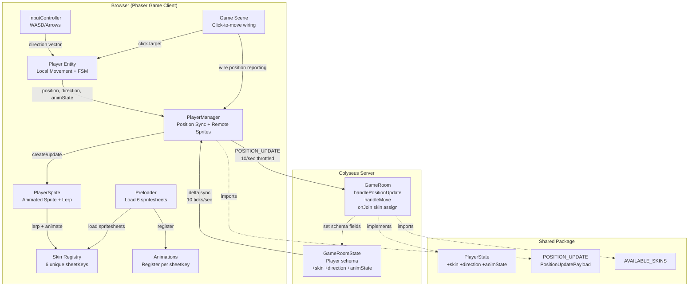
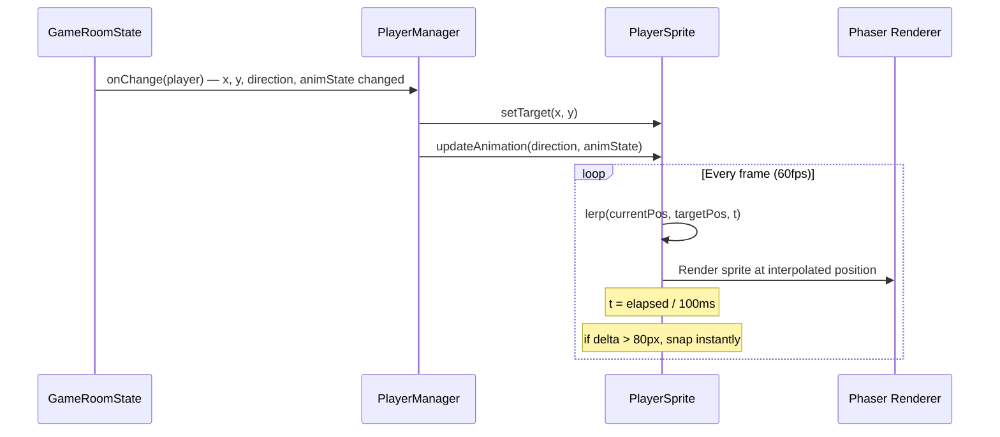
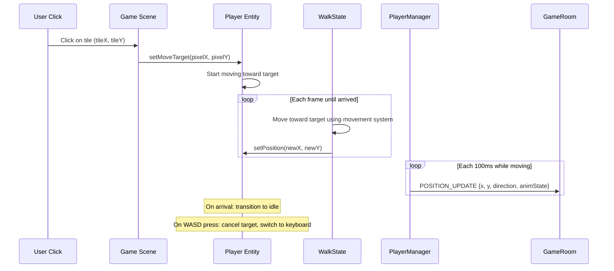

# Multiplayer Player Movement Synchronization and Skin Display Design Document

## Overview

This document defines the technical design for synchronizing local player keyboard movement to the Colyseus server in real-time, replacing remote player colored rectangles with animated Phaser sprites displaying server-assigned character skins, and fixing the skin registry bug that prevents multiple skins from loading. The design extends the shared type contracts, server schema, client rendering pipeline, and position sync protocol established in the Colyseus game server foundation (Design-003).

## Design Summary (Meta)

```yaml
design_type: "extension"
risk_level: "medium"
complexity_level: "medium"
complexity_rationale: >
  (1) ACs require coordinated changes across 4 packages (shared types, server schema,
  client entities, client multiplayer manager) with new message types, schema field
  additions, sprite rendering rewrite, throttled position sync, and linear interpolation.
  The skin registry fix cascades through Preloader, animation registration, and Player
  entity initialization. Click-to-move must be wired into the local Player entity's
  movement system. (2) Constraints include: Colyseus schema @type decorators for new
  string fields, maintaining backward compatibility with existing MOVE message, ensuring
  all 6 spritesheets load with unique texture keys, and achieving smooth 60fps rendering
  with 10/sec network updates via interpolation.
main_constraints:
  - "Client-authoritative movement (server accepts positions without validation)"
  - "10 ticks/sec server update rate constrains position sync frequency"
  - "All 6 scout spritesheets share identical frame layout (16x32, same row structure)"
  - "Colyseus @type() string fields for skin/direction/animState (not enums)"
  - "Existing MOVE message must remain functional for click-to-move"
biggest_risks:
  - "Skin registry fix breaks existing local player rendering if sheetKey references are missed"
  - "Linear interpolation produces visible jitter under inconsistent network latency"
  - "PlayerSprite rewrite from Graphics to Sprite may break existing PlayerManager callbacks"
unknowns:
  - "Whether Phaser.Math.Linear is sufficient or manual lerp is needed for per-frame interpolation"
  - "Whether click-to-move target tracking requires WalkState modification or a new state"
  - "Exact interpolation speed factor for smooth 10/sec updates at 100 px/sec player speed"
```

## Background and Context

### Prerequisite ADRs

- **ADR-003: Authentication Bridge between NextAuth and Colyseus** -- Establishes the Colyseus room lifecycle and `onAuth`/`onJoin` hooks used for skin assignment
- **ADR-004: Build and Serve Tooling for Colyseus Game Server** -- Establishes the server build pipeline and ESM configuration
- **ADR-005: Multiplayer Position Synchronization Protocol** -- Selects client-authoritative movement, pixel coordinates, 10/sec throttled updates, linear interpolation, unique skin sheet keys, and dual movement paths (POSITION_UPDATE + MOVE)

### Agreement Checklist

#### Scope

- [x] Extend `PlayerState` interface in `packages/shared/src/types/room.ts` with `skin`, `direction`, `animState` fields
- [x] Add `ClientMessage.POSITION_UPDATE` and `PositionUpdatePayload` to `packages/shared/src/types/messages.ts`
- [x] Add `AVAILABLE_SKINS` constant to `packages/shared/src/constants.ts`
- [x] Extend `Player` schema class in `apps/server/src/rooms/GameRoomState.ts` with new `@type` fields
- [x] Add `handlePositionUpdate()` to `apps/server/src/rooms/GameRoom.ts`
- [x] Add random skin assignment in `GameRoom.onJoin()`
- [x] Fix skin registry: unique `sheetKey` per skin in `apps/game/src/game/characters/skin-registry.ts`
- [x] Rewrite `PlayerSprite` from Graphics to Phaser.Sprite with animations
- [x] Update `PlayerManager` with throttled position sync and skin-aware sprite creation
- [x] Wire click-to-move to actually move local `Player` entity
- [x] Wire local Player movement to PlayerManager position reporting

#### Non-Scope (Explicitly not changing)

- [x] Server-authoritative movement validation (server accepts client positions)
- [x] Skin selection UI (server assigns randomly, no player choice)
- [x] Skin persistence (no database storage, fresh assignment each join)
- [x] Pathfinding for click-to-move (direct linear movement only)
- [x] NPC rendering (separate feature)
- [x] Chat system (separate feature)
- [x] Map generation, terrain, autotile system
- [x] Authentication (NextAuth, auth bridge)
- [x] Database schema or adapters
- [x] E2E test modifications (`apps/game-e2e/`)

#### Constraints

- [x] Parallel operation: Yes (server on port 2567, Next.js on port 3000)
- [x] Backward compatibility: Required (all existing CI targets must pass; existing MOVE message handler preserved)
- [x] Performance measurement: Required (10 updates/sec position sync, smooth 60fps interpolation on localhost)

### Problem to Solve

The Colyseus multiplayer infrastructure from PRD-002 is operational (connections, auth, state sync), but the player experience is non-functional for multiplayer gameplay:

1. **No movement sync**: Keyboard movement is purely local; the server never receives WASD-driven position updates
2. **No visual identity**: Remote players are rendered as colored rectangles, not character sprites
3. **Broken skin system**: All 6 skins share `sheetKey: 'char-scout'`, causing texture overwrites
4. **Incomplete server state**: Player schema lacks skin, direction, and animState fields
5. **Click-to-move disconnection**: Server receives click coordinates but local Player entity does not move

### Current Challenges

1. The `PlayerSprite` class uses `Phaser.GameObjects.Graphics` (colored rectangles) and `Phaser.GameObjects.Container` -- it has no sprite rendering, no animation support, and no interpolation
2. The `PlayerManager.sendMove()` sends tile coordinates via `ClientMessage.MOVE` but the server has no continuous position update path for keyboard movement
3. The skin registry defines 6 skins but all overwrite the same Phaser texture key, making only `scout_6` usable
4. The `Player` entity calls `getDefaultSkin()` hardcoding it to the first skin -- no mechanism for server-assigned skins
5. The `Game.ts` click-to-move handler sends coordinates to the server but never moves the local Player entity

### Requirements

#### Functional Requirements

- FR-1: Continuous keyboard movement position sync (10 msgs/sec, pixel coords)
- FR-2: Skin registry fix (unique texture keys per variant)
- FR-3: Server-side skin assignment and state tracking
- FR-4: Remote player sprite rendering with animations
- FR-5: Shared type and protocol updates
- FR-6: Click-to-move fix (local player moves to clicked tile)
- FR-7: Linear interpolation for remote player movement

#### Non-Functional Requirements

- **Performance**: 10 position updates/sec; smooth 60fps interpolation; < 200ms movement visibility latency on localhost
- **Scalability**: 10 concurrent players (M0.2 target); 100 msgs/sec inbound to server
- **Reliability**: Graceful degradation on packet loss (hold last position); full state snapshot on mid-session join
- **Maintainability**: Type-safe shared contracts; skin system extensible by adding registry entries

## Acceptance Criteria (AC) - EARS Format

### FR-1: Continuous Keyboard Movement Position Sync

- [ ] **When** the local player presses WASD/arrow keys and moves, the client shall send `POSITION_UPDATE` messages to the server at approximately 10 messages/sec with pixel coordinates, direction, and animState
- [ ] **When** the local player stops moving, the client shall send one final `POSITION_UPDATE` with `animState: 'idle'` and then cease sending updates
- [ ] **If** no position change has occurred since the last sent update, **then** no duplicate message shall be sent
- [ ] **While** the player is moving, the local movement system shall continue to operate at 60fps independently of the 10/sec network send rate

### FR-2: Skin Registry Fix

- [ ] **When** the Preloader completes loading, 6 distinct textures shall exist in the Phaser texture manager, each with a unique key (`scout_1` through `scout_6`)
- [ ] **When** animations are registered for a skin, the animation keys shall use the skin's unique sheetKey (e.g., `scout_3_idle_down`, not `char-scout_idle_down`)
- [ ] The local Player entity shall use the assigned skin's unique sheetKey when playing animations

### FR-3: Server-Side Skin Assignment

- [ ] **When** a player joins the GameRoom, `onJoin` shall assign a random skin from `AVAILABLE_SKINS` and set the `skin` field on the Player schema
- [ ] **When** a player joins, the Player schema shall include `skin` (string), `direction` (string, default `'down'`), and `animState` (string, default `'idle'`) fields
- [ ] The skin value shall be synchronized to all connected clients via Colyseus state sync

### FR-4: Remote Player Sprite Rendering

- [ ] **When** a remote player is added to the room state, a Phaser Sprite shall be created using the spritesheet corresponding to the player's `skin` value
- [ ] **When** the remote player's `animState` or `direction` changes, the sprite shall update its animation to match (e.g., `scout_3_walk_right`)
- [ ] The remote player sprite shall use bottom-center anchor (origin 0.5, 1.0) consistent with the local Player entity
- [ ] **When** a remote player is removed from the room state, the sprite shall be destroyed and cleaned up

### FR-5: Shared Type and Protocol Updates

- [ ] **When** a developer imports `PlayerState` from `@nookstead/shared`, `skin`, `direction`, and `animState` shall be required string fields alongside existing fields
- [ ] **When** a developer imports `ClientMessage`, `POSITION_UPDATE` shall be available as a message type constant
- [ ] The `PositionUpdatePayload` interface shall include `x: number`, `y: number`, `direction: string`, `animState: string`

### FR-6: Click-to-Move Fix

- [ ] **When** the player clicks a walkable tile, the local Player entity shall begin moving toward the clicked tile's pixel position
- [ ] **While** click-to-move is active, position updates shall be sent to the server at the same throttled rate as keyboard movement
- [ ] **If** the player presses a WASD/arrow key during click-to-move, **then** click-to-move shall be cancelled and keyboard movement shall take over immediately
- [ ] **When** the player reaches the click-to-move target, the player shall stop and transition to idle

### FR-7: Linear Interpolation

- [ ] **When** a remote player position update arrives, the remote sprite shall smoothly interpolate from its current position to the new target position
- [ ] The interpolation shall complete within approximately 100ms (one server tick interval)
- [ ] **If** the position delta exceeds 80 pixels (5 tiles), **then** the sprite shall snap to the new position immediately

## Existing Codebase Analysis

### Implementation Path Mapping

| Type | Path | Description |
|------|------|-------------|
| Existing (modify) | `packages/shared/src/types/room.ts` | Add `skin`, `direction`, `animState` to `PlayerState` |
| Existing (modify) | `packages/shared/src/types/messages.ts` | Add `POSITION_UPDATE` message and `PositionUpdatePayload` |
| Existing (modify) | `packages/shared/src/constants.ts` | Add `AVAILABLE_SKINS` constant |
| Existing (modify) | `apps/server/src/rooms/GameRoomState.ts` | Add `@type` fields to Player schema |
| Existing (modify) | `apps/server/src/rooms/GameRoom.ts` | Add `handlePositionUpdate()`, skin assignment in `onJoin()` |
| Existing (rewrite) | `apps/game/src/game/entities/PlayerSprite.ts` | Replace Graphics with Phaser.Sprite + interpolation |
| Existing (modify) | `apps/game/src/game/multiplayer/PlayerManager.ts` | Add position sync, skin-aware sprites, throttling |
| Existing (modify) | `apps/game/src/game/scenes/Game.ts` | Wire click-to-move to local Player, wire position reporting |
| Existing (modify) | `apps/game/src/game/characters/skin-registry.ts` | Fix sheetKey to be unique per skin |
| Existing (no change) | `apps/game/src/game/characters/frame-map.ts` | Already uses sheetKey param correctly; works once sheetKeys unique |
| Existing (no change) | `apps/game/src/game/characters/animations.ts` | Already parameterized by sheetKey; works once sheetKeys unique |
| Existing (no change) | `apps/game/src/game/scenes/Preloader.ts` | Already iterates skins; works once sheetKeys unique |
| Existing (modify) | `apps/game/src/game/entities/Player.ts` | Add moveTarget property, setMoveTarget(), clearMoveTarget() for click-to-move |
| Existing (modify) | `apps/game/src/game/entities/states/WalkState.ts` | Add click-to-move target handling: move toward target when no keyboard input is active |
| Existing (no change) | `apps/game/src/game/entities/states/IdleState.ts` | State transition logic unchanged |
| Existing (no change) | `apps/game/src/game/input/InputController.ts` | Input reading unchanged |
| Existing (no change) | `apps/game/src/game/systems/movement.ts` | Movement calculation unchanged |
| Existing (no change) | `apps/game/src/game/systems/spawn.ts` | Spawn logic unchanged |

### Code Inspection Evidence

| File Inspected | Key Finding | Design Impact |
|---------------|-------------|---------------|
| `packages/shared/src/types/room.ts:1-16` | `PlayerState` has 5 fields: userId, x, y, name, connected. No skin/direction/animState. | Must add 3 new required fields. All consumers (server schema, client callbacks) must handle new fields. |
| `packages/shared/src/types/messages.ts:1-12` | Only `ClientMessage.MOVE` exists. `MovePayload` has only x, y. | Must add `POSITION_UPDATE` message type and new `PositionUpdatePayload` with direction and animState. Keep `MOVE` for click-to-move backward compat. |
| `packages/shared/src/constants.ts:1-7` | Has TICK_RATE=10, PATCH_RATE_MS=100. No skin list. | Add `AVAILABLE_SKINS` array constant. Position sync throttle should use `TICK_INTERVAL_MS` (100ms). |
| `apps/server/src/rooms/GameRoomState.ts:1-13` | Player schema has @type decorators for userId, x, y, name, connected. | Add `@type('string') skin`, `@type('string') direction`, `@type('string') animState` with defaults. |
| `apps/server/src/rooms/GameRoom.ts:45-57` | `onJoin` creates Player with userId, name, x=0, y=0, connected=true. No skin. | Add `player.skin = randomSkin()` and set direction/animState defaults. |
| `apps/server/src/rooms/GameRoom.ts:38-39` | `onMessage(ClientMessage.MOVE, ...)` registered in `onCreate`. | Register new `onMessage(ClientMessage.POSITION_UPDATE, ...)` alongside. |
| `apps/game/src/game/entities/PlayerSprite.ts:21-66` | Uses Graphics+Container, tileToPixel conversion, moveTo snaps position. | Complete rewrite to Phaser.Sprite with skin-based texture, animation playback, and lerp interpolation. |
| `apps/game/src/game/multiplayer/PlayerManager.ts:49-96` | `setupCallbacks` creates PlayerSprite on add, calls sprite.moveTo on change. No throttling, no position sending. | Add position sync: throttled sending, skin-based sprite creation, interpolation update loop. |
| `apps/game/src/game/multiplayer/PlayerManager.ts:112-115` | `sendMove` sends tile coords. No continuous position sending. | Add `sendPositionUpdate(x, y, direction, animState)` with throttling. |
| `apps/game/src/game/scenes/Game.ts:127-137` | Click-to-move calls `playerManager.sendMove(tileX, tileY)` but does NOT move local Player. | Wire click to set a movement target on the local Player entity, then let the movement system handle actual movement. |
| `apps/game/src/game/characters/skin-registry.ts:22-53` | All 6 entries have `sheetKey: 'char-scout'`. | Change each to unique key: `scout_1`, `scout_2`, ..., `scout_6`. The sheetKey matches the skin key. |
| `apps/game/src/game/characters/skin-registry.ts:65-67` | `getDefaultSkin()` returns `SKIN_REGISTRY[0]`. | Add `getSkinByKey(key: string)` function for looking up skins by server-assigned key. |
| `apps/game/src/game/entities/Player.ts:46-47` | Constructor calls `getDefaultSkin()` and uses `skin.sheetKey`. | Player constructor will need a skin parameter or use a lookup by key. For initial implementation, keep using default skin for local player; server assigns the actual skin. |
| `apps/game/src/game/scenes/Preloader.ts:37-42` | Iterates `getSkins()`, calls `this.load.spritesheet(skin.sheetKey, ...)`. | Once sheetKeys are unique, this loads 6 separate textures correctly -- no change needed. |
| `apps/game/src/game/scenes/Preloader.ts:47-51` | Iterates `getSkins()`, calls `registerAnimations(this, skin.sheetKey, ...)`. | Once sheetKeys are unique, this registers 6 x 27 = 162 animations correctly -- no change needed. |
| `apps/game/src/game/characters/frame-map.ts:155-161` | `animKey(sheetKey, state, dir)` returns `${sheetKey}_${state}_${direction}`. | With unique sheetKeys, animation keys become `scout_1_idle_down` etc. All references must use the correct sheetKey. |
| `apps/game/src/game/entities/states/WalkState.ts:30-35` | Uses `this.context.sheetKey` for animation key generation. | Player.sheetKey must reflect the actual assigned skin's sheetKey. |
| `apps/game/src/game/constants.ts:12` | `PLAYER_SPEED = 100` (pixels per second). | At 10 updates/sec, max displacement per update = 10 pixels = 0.625 tiles. Well within lerp capability. |
| `apps/game/src/game/constants.ts:34-38` | PLAYER_DEPTH, PLAYER_SIZE, color constants for Graphics rendering. | These become unused after PlayerSprite rewrite. Keep for backward compat but PlayerSprite no longer uses them. |

### Similar Functionality Search

- **Position sync throttling**: No existing throttle mechanism in the codebase. The `PlayerManager.sendMove()` is fire-once per click. New throttled sending must be implemented from scratch.
- **Sprite interpolation**: No existing interpolation code. `PlayerSprite.moveTo()` snaps instantly. New lerp logic must be implemented.
- **Skin lookup by key**: `getDefaultSkin()` and `getSkins()` exist but no `getSkinByKey()`. Must add.
- **Click-to-move movement**: The `Game.ts` click handler sends to server but has no local movement wiring. No existing pathfinding or move-to-target logic. Must implement a simple target-based movement approach.

Decision: **New implementation** for position sync, interpolation, and click-to-move targeting. **Bug fix** for skin registry. **Extension** of existing server schema and shared types.

## Applicable Standards

### Classification Table

| Standard | Type | Source | Impact on Design |
|----------|------|--------|-----------------|
| Prettier: single quotes, 2-space indent | Explicit | `.prettierrc`, `.editorconfig` | All new code must use single quotes and 2-space indent |
| ESLint: flat config with @nx/eslint-plugin | Explicit | `eslint.config.mjs` | Module boundary enforcement applies to cross-package imports |
| TypeScript: strict mode, ES2022 target | Explicit | `tsconfig.base.json` | All new types must be strict-compatible; no implicit any |
| ESM modules (`"type": "module"`) | Explicit | `packages/shared/package.json` | Shared package exports use ESM; server uses ESM |
| Colyseus @type decorators require experimentalDecorators | Explicit | `apps/server/tsconfig.json` | Server-side schema classes use @type() decorator syntax |
| Jest for unit testing | Explicit | `nx.json` (@nx/jest/plugin) | New testable logic (throttling, interpolation) should have unit tests |
| Pure function pattern for game systems | Implicit | `apps/game/src/game/systems/movement.ts`, `spawn.ts` | Movement and spawn are pure functions with no Phaser dependency; new systems should follow this pattern |
| State machine pattern for player behavior | Implicit | `apps/game/src/game/entities/StateMachine.ts`, states/ | Player states use FSM with enter/update/exit lifecycle; click-to-move should integrate with this pattern |
| Singleton adapter pattern for services | Implicit | `apps/game/src/services/colyseus.ts` | Connection service is module-level singleton; PlayerManager follows scene-scoped instance pattern |
| Bottom-center sprite origin (0.5, 1.0) | Implicit | `apps/game/src/game/entities/Player.ts:58` | All player sprites (local and remote) use this origin for tile alignment |
| Barrel exports for shared package | Implicit | `packages/shared/src/index.ts` | New exports must be re-exported through the barrel file |

## Design

### Change Impact Map

```yaml
Change Target: Multiplayer player movement sync and skin display
Direct Impact:
  - packages/shared/src/types/room.ts (add skin, direction, animState to PlayerState)
  - packages/shared/src/types/messages.ts (add POSITION_UPDATE, PositionUpdatePayload)
  - packages/shared/src/constants.ts (add AVAILABLE_SKINS)
  - apps/server/src/rooms/GameRoomState.ts (add @type fields to Player schema)
  - apps/server/src/rooms/GameRoom.ts (handlePositionUpdate, skin assignment)
  - apps/game/src/game/entities/PlayerSprite.ts (complete rewrite)
  - apps/game/src/game/multiplayer/PlayerManager.ts (position sync, skin sprites)
  - apps/game/src/game/scenes/Game.ts (click-to-move wiring, position reporting)
  - apps/game/src/game/characters/skin-registry.ts (fix sheetKey, add getSkinByKey)
Indirect Impact:
  - apps/game/src/game/entities/Player.ts (sheetKey changes from 'char-scout' to 'scout_1')
  - apps/game/src/game/constants.ts (PLAYER_LOCAL_COLOR, PLAYER_REMOTE_COLOR become unused)
No Ripple Effect:
  - apps/game/src/game/characters/frame-map.ts (already parameterized by sheetKey)
  - apps/game/src/game/characters/animations.ts (already parameterized by sheetKey)
  - apps/game/src/game/scenes/Preloader.ts (already iterates skins correctly)
  - apps/game/src/game/entities/states/WalkState.ts (uses context.sheetKey, unchanged)
  - apps/game/src/game/entities/states/IdleState.ts (unchanged)
  - apps/game/src/game/input/InputController.ts (unchanged)
  - apps/game/src/game/systems/movement.ts (unchanged)
  - apps/game/src/game/systems/spawn.ts (unchanged)
  - apps/game/src/services/colyseus.ts (unchanged)
  - apps/game/src/auth.ts (unchanged)
  - Authentication system (unchanged)
  - Database schema and adapters (unchanged)
  - Map generation (unchanged)
  - E2E tests (unchanged)
```

### Architecture Overview



### Data Flow Diagrams

#### Local Player: Input to Server Broadcast

```mermaid
sequenceDiagram
    participant KB as Keyboard Input
    participant IC as InputController
    participant P as Player Entity
    participant WS as WalkState
    participant MS as Movement System
    participant PM as PlayerManager
    participant GR as GameRoom (Server)
    participant GS as GameRoomState

    loop Every frame (60fps)
        KB->>IC: Key state
        IC->>WS: getDirection()
        WS->>MS: calculateMovement()
        MS-->>WS: new position
        WS->>P: setPosition(x, y)
    end

    loop Every 100ms (10/sec)
        PM->>PM: Check: position changed?
        alt Position changed
            PM->>GR: POSITION_UPDATE {x, y, direction, animState}
            GR->>GS: player.x = x; player.y = y; player.direction = dir; player.animState = anim
            GS-->>PM: Delta patch to all clients
        end
    end
```

#### Remote Player: Server Update to Rendered Sprite



#### Click-to-Move Flow



### Integration Points List

| Integration Point | Location | Old Implementation | New Implementation | Switching Method |
|-------------------|----------|-------------------|-------------------|------------------|
| Player state contract | `packages/shared/src/types/room.ts` | `PlayerState { userId, x, y, name, connected }` | `PlayerState { userId, x, y, name, connected, skin, direction, animState }` | Add fields (additive, non-breaking) |
| Message protocol | `packages/shared/src/types/messages.ts` | `ClientMessage { MOVE }` | `ClientMessage { MOVE, POSITION_UPDATE }` | Add message type (additive) |
| Server schema | `apps/server/src/rooms/GameRoomState.ts` | `Player { userId, x, y, name, connected }` | `Player { ..., skin, direction, animState }` | Add @type fields |
| Server message handler | `apps/server/src/rooms/GameRoom.ts` | Only `handleMove` | Add `handlePositionUpdate` in `onCreate` | Add new onMessage handler |
| Server skin assignment | `apps/server/src/rooms/GameRoom.ts` onJoin | No skin | `player.skin = randomSkin()` | Add to existing onJoin |
| Remote player rendering | `apps/game/src/game/entities/PlayerSprite.ts` | Graphics rectangles | Phaser.Sprite with animations | Complete class rewrite |
| Position sync | `apps/game/src/game/multiplayer/PlayerManager.ts` | No continuous sending | Throttled POSITION_UPDATE | Add sync loop method |
| Click-to-move | `apps/game/src/game/scenes/Game.ts` | Sends to server only | Moves local Player + sends to server | Add Player.setMoveTarget call |
| Skin texture keys | `apps/game/src/game/characters/skin-registry.ts` | All `'char-scout'` | Unique per skin (`'scout_1'` etc.) | Change field values |

### Integration Point Map

```yaml
Integration Point 1:
  Existing Component: packages/shared/src/types/room.ts (PlayerState interface)
  Integration Method: Add 3 required string fields
  Impact Level: Medium (All consumers must handle new fields)
  Required Test Coverage: TypeScript compilation succeeds for both server and game

Integration Point 2:
  Existing Component: apps/server/src/rooms/GameRoom.ts (onCreate message registration)
  Integration Method: Register additional onMessage handler for POSITION_UPDATE
  Impact Level: Medium (New message type alongside existing MOVE)
  Required Test Coverage: Server handles both MOVE and POSITION_UPDATE correctly

Integration Point 3:
  Existing Component: apps/game/src/game/multiplayer/PlayerManager.ts (setupCallbacks)
  Integration Method: Replace PlayerSprite creation with skin-aware animated sprites
  Impact Level: High (Changes how all remote players render)
  Required Test Coverage: Remote players render with correct skin sprites and animations

Integration Point 4:
  Existing Component: apps/game/src/game/scenes/Game.ts (click-to-move handler)
  Integration Method: Add Player.setMoveTarget() call before/instead of sendMove()
  Impact Level: Medium (Changes click behavior for local player)
  Required Test Coverage: Clicking a tile moves the local player toward it

Integration Point 5:
  Existing Component: apps/game/src/game/characters/skin-registry.ts (SKIN_REGISTRY)
  Integration Method: Change sheetKey values from 'char-scout' to unique keys
  Impact Level: High (Cascades through Preloader, animations, Player entity)
  Required Test Coverage: All 6 textures load with unique keys; animations play correctly
```

### Main Components

#### Component 1: Shared Types Extensions (`packages/shared/`)

- **Responsibility**: Provide compile-time type safety for the extended player state, new message type, and skin constants
- **Interface**: Exports `PlayerState` (extended), `PositionUpdatePayload`, `ClientMessage.POSITION_UPDATE`, `AVAILABLE_SKINS`
- **Dependencies**: None (pure TypeScript types and constants)

#### Component 2: Server Schema and Room Extensions (`apps/server/`)

- **Responsibility**: Store and broadcast extended player state (skin, direction, animState); assign skins on join; handle position update messages
- **Interface**: `Player` schema with new `@type` fields; `handlePositionUpdate(client, payload)` method; random skin assignment in `onJoin`
- **Dependencies**: `@nookstead/shared` (for message types, skin list, payload types)

#### Component 3: PlayerSprite (Rewritten) (`apps/game/src/game/entities/PlayerSprite.ts`)

- **Responsibility**: Render a remote player as an animated Phaser.Sprite with correct skin, direction, and animation state; provide smooth position interpolation between server updates
- **Interface**: `constructor(scene, x, y, skin, sessionId)`, `setTarget(x, y)`, `updateAnimation(direction, animState)`, `update(delta)`, `destroy()`
- **Dependencies**: Phaser.Sprite, skin-registry (`getSkinByKey`), frame-map (`animKey`)

#### Component 4: PlayerManager Extensions (`apps/game/src/game/multiplayer/PlayerManager.ts`)

- **Responsibility**: Throttled position sync from local player to server; create animated remote player sprites with correct skins; update interpolation targets from server state changes
- **Interface**: `sendPositionUpdate(x, y, direction, animState)` (throttled), `update(delta)` (drives sprite interpolation), enhanced `setupCallbacks` with skin-aware sprite creation
- **Dependencies**: `@nookstead/shared` (message types), `PlayerSprite`, `@colyseus/sdk`

#### Component 5: Skin Registry Fix (`apps/game/src/game/characters/skin-registry.ts`)

- **Responsibility**: Provide unique Phaser texture keys per skin variant; lookup skins by server-assigned key
- **Interface**: `getSkinByKey(key: string): SkinDefinition | undefined` (new), existing `getSkins()` and `getDefaultSkin()` updated
- **Dependencies**: None

### Contract Definitions

#### Updated Shared Types

**Before** (`packages/shared/src/types/room.ts`):
```typescript
export interface PlayerState {
  userId: string;
  x: number;
  y: number;
  name: string;
  connected: boolean;
}
```

**After**:
```typescript
export interface PlayerState {
  userId: string;
  x: number;
  y: number;
  name: string;
  connected: boolean;
  skin: string;
  direction: string;
  animState: string;
}
```

**Before** (`packages/shared/src/types/messages.ts`):
```typescript
export const ClientMessage = {
  MOVE: 'move',
} as const;

export interface MovePayload {
  x: number;
  y: number;
}
```

**After**:
```typescript
export const ClientMessage = {
  MOVE: 'move',
  POSITION_UPDATE: 'position_update',
} as const;

export type ClientMessageType = typeof ClientMessage[keyof typeof ClientMessage];

export interface MovePayload {
  x: number;
  y: number;
}

export interface PositionUpdatePayload {
  x: number;
  y: number;
  direction: string;
  animState: string;
}
```

**Added to** (`packages/shared/src/constants.ts`):
```typescript
export const AVAILABLE_SKINS = [
  'scout_1',
  'scout_2',
  'scout_3',
  'scout_4',
  'scout_5',
  'scout_6',
] as const;

export type SkinKey = typeof AVAILABLE_SKINS[number];
```

#### Updated Server Schema

**Before** (`apps/server/src/rooms/GameRoomState.ts`):
```typescript
export class Player extends Schema {
  @type('string') userId = '';
  @type('number') x = 0;
  @type('number') y = 0;
  @type('string') name = '';
  @type('boolean') connected = true;
}
```

**After**:
```typescript
export class Player extends Schema {
  @type('string') userId = '';
  @type('number') x = 0;
  @type('number') y = 0;
  @type('string') name = '';
  @type('boolean') connected = true;
  @type('string') skin = '';
  @type('string') direction = 'down';
  @type('string') animState = 'idle';
}
```

#### Updated Server Room

**New `handlePositionUpdate` method in `GameRoom`:**

```typescript
private handlePositionUpdate(
  client: Client,
  payload: unknown
): void {
  if (
    !payload ||
    typeof payload !== 'object' ||
    typeof (payload as PositionUpdatePayload).x !== 'number' ||
    typeof (payload as PositionUpdatePayload).y !== 'number' ||
    typeof (payload as PositionUpdatePayload).direction !== 'string' ||
    typeof (payload as PositionUpdatePayload).animState !== 'string'
  ) {
    console.warn(
      `[GameRoom] Invalid position_update payload from sessionId=${client.sessionId}`
    );
    return;
  }

  const update = payload as PositionUpdatePayload;
  const player = this.state.players.get(client.sessionId);
  if (player) {
    player.x = update.x;
    player.y = update.y;
    player.direction = update.direction;
    player.animState = update.animState;
  }
}
```

**Updated `onCreate` registration:**

```typescript
this.onMessage(
  ClientMessage.POSITION_UPDATE,
  (client, payload: unknown) => {
    this.handlePositionUpdate(client, payload);
  }
);
```

**Updated `onJoin` with random skin assignment:**

```typescript
override onJoin(
  client: Client,
  _options: Record<string, unknown>,
  auth: AuthData
): void {
  const player = new Player();
  player.userId = auth.userId;
  player.name = auth.email.split('@')[0];
  player.x = 0;
  player.y = 0;
  player.connected = true;
  player.skin = AVAILABLE_SKINS[
    Math.floor(Math.random() * AVAILABLE_SKINS.length)
  ];
  player.direction = 'down';
  player.animState = 'idle';

  this.state.players.set(client.sessionId, player);
  console.log(
    `[GameRoom] Player joined: sessionId=${client.sessionId}, userId=${auth.userId}, skin=${player.skin}`
  );
}
```

#### Fixed Skin Registry

**Before** (`apps/game/src/game/characters/skin-registry.ts`):
```typescript
const SKIN_REGISTRY: readonly SkinDefinition[] = [
  { key: 'scout_1', sheetPath: 'characters/scout_1.png', sheetKey: 'char-scout' },
  { key: 'scout_2', sheetPath: 'characters/scout_2.png', sheetKey: 'char-scout' },
  // ... all share 'char-scout'
];
```

**After**:
```typescript
const SKIN_REGISTRY: readonly SkinDefinition[] = [
  { key: 'scout_1', sheetPath: 'characters/scout_1.png', sheetKey: 'scout_1' },
  { key: 'scout_2', sheetPath: 'characters/scout_2.png', sheetKey: 'scout_2' },
  { key: 'scout_3', sheetPath: 'characters/scout_3.png', sheetKey: 'scout_3' },
  { key: 'scout_4', sheetPath: 'characters/scout_4.png', sheetKey: 'scout_4' },
  { key: 'scout_5', sheetPath: 'characters/scout_5.png', sheetKey: 'scout_5' },
  { key: 'scout_6', sheetPath: 'characters/scout_6.png', sheetKey: 'scout_6' },
];

/**
 * Look up a skin definition by its key (e.g., 'scout_3').
 * Returns undefined if no skin matches.
 */
export function getSkinByKey(key: string): SkinDefinition | undefined {
  return SKIN_REGISTRY.find((s) => s.key === key);
}
```

**Cascade impact**: The `sheetKey` change from `'char-scout'` to `'scout_1'` cascades through:
1. `Preloader.preload()` -- calls `this.load.spritesheet(skin.sheetKey, ...)` which now loads 6 distinct textures (no code change needed, works automatically)
2. `Preloader.create()` -- calls `registerAnimations(this, skin.sheetKey, ...)` which now registers animations keyed as `scout_1_idle_down` etc. (no code change needed)
3. `Player.ts` -- constructor uses `getDefaultSkin().sheetKey` which changes from `'char-scout'` to `'scout_1'`. The player's `this.sheetKey` is set correctly. All animation keys in WalkState/IdleState use `this.context.sheetKey` which picks up the new value automatically.

#### PlayerSprite Rewrite

**Complete class design:**

```typescript
import Phaser from 'phaser';
import { getSkinByKey } from '../characters/skin-registry';
import { animKey, type Direction } from '../characters/frame-map';
import { TILE_SIZE } from '../constants';

/** Teleport threshold: if position delta exceeds this, snap instead of lerp. */
const SNAP_THRESHOLD = TILE_SIZE * 5; // 80 pixels (5 tiles)

/** Interpolation duration in milliseconds (matches server tick interval). */
const LERP_DURATION_MS = 100;

export class PlayerSprite {
  private sprite: Phaser.GameObjects.Sprite;
  private nameLabel: Phaser.GameObjects.Text;
  readonly sessionId: string;

  // Interpolation state
  private startX: number;
  private startY: number;
  private targetX: number;
  private targetY: number;
  private lerpElapsed = 0;
  private isLerping = false;

  // Animation state
  private currentDirection: Direction = 'down';
  private currentAnimState = 'idle';
  private sheetKey: string;

  constructor(
    private scene: Phaser.Scene,
    x: number,
    y: number,
    skinKey: string,
    name: string,
    sessionId: string
  ) {
    this.sessionId = sessionId;

    // Look up skin to get the correct sheetKey
    const skin = getSkinByKey(skinKey);
    this.sheetKey = skin ? skin.sheetKey : 'scout_1';

    // Create sprite with bottom-center origin (consistent with local Player)
    this.sprite = scene.add.sprite(x, y, this.sheetKey);
    this.sprite.setOrigin(0.5, 1.0);
    this.sprite.setDepth(2);

    // Play default idle animation
    const idleKey = animKey(this.sheetKey, 'idle', 'down');
    this.sprite.play(idleKey, true);

    // Name label above sprite
    this.nameLabel = scene.add.text(x, y - 34, name, {
      fontSize: '10px',
      color: '#ffffff',
      align: 'center',
    });
    this.nameLabel.setOrigin(0.5, 1);
    this.nameLabel.setDepth(2);

    // Initialize interpolation anchors
    this.startX = x;
    this.startY = y;
    this.targetX = x;
    this.targetY = y;
  }

  /**
   * Set a new interpolation target position.
   * If the delta exceeds SNAP_THRESHOLD, snap immediately.
   */
  setTarget(x: number, y: number): void {
    const dx = x - this.sprite.x;
    const dy = y - this.sprite.y;
    const dist = Math.sqrt(dx * dx + dy * dy);

    if (dist > SNAP_THRESHOLD) {
      // Teleport: snap immediately
      this.sprite.setPosition(x, y);
      this.nameLabel.setPosition(x, y - 34);
      this.startX = x;
      this.startY = y;
      this.targetX = x;
      this.targetY = y;
      this.isLerping = false;
    } else {
      // Start interpolation from current rendered position
      this.startX = this.sprite.x;
      this.startY = this.sprite.y;
      this.targetX = x;
      this.targetY = y;
      this.lerpElapsed = 0;
      this.isLerping = true;
    }
  }

  /**
   * Update the displayed animation based on server state.
   */
  updateAnimation(direction: string, animState: string): void {
    const dir = direction as Direction;
    if (
      dir !== this.currentDirection ||
      animState !== this.currentAnimState
    ) {
      this.currentDirection = dir;
      this.currentAnimState = animState;
      const key = animKey(this.sheetKey, animState, dir);
      this.sprite.play(key, true);
    }
  }

  /**
   * Per-frame update: advance interpolation.
   * Must be called from PlayerManager.update() each frame.
   */
  update(delta: number): void {
    if (!this.isLerping) return;

    this.lerpElapsed += delta;
    const t = Math.min(this.lerpElapsed / LERP_DURATION_MS, 1);

    const x = Phaser.Math.Linear(this.startX, this.targetX, t);
    const y = Phaser.Math.Linear(this.startY, this.targetY, t);

    this.sprite.setPosition(x, y);
    this.nameLabel.setPosition(x, y - 34);

    if (t >= 1) {
      this.isLerping = false;
    }
  }

  destroy(): void {
    this.sprite.destroy();
    this.nameLabel.destroy();
  }
}
```

#### PlayerManager Extensions

**Key additions to `PlayerManager`:**

```typescript
export class PlayerManager {
  private scene: Scene;
  private room: Room<unknown, GameRoomState> | null = null;
  private sprites = new Map<string, PlayerSprite>();
  private detachCallbacks: (() => void)[] = [];

  // Position sync state
  private lastSentTime = 0;
  private lastSentX = 0;
  private lastSentY = 0;
  private lastSentDirection = '';
  private lastSentAnimState = '';

  constructor(scene: Scene) {
    this.scene = scene;
  }

  // ... existing connect(), setupRoomEvents(), destroy() ...

  /**
   * Send a throttled position update to the server.
   * Only sends if enough time has elapsed (100ms) and state has changed.
   */
  sendPositionUpdate(
    x: number,
    y: number,
    direction: string,
    animState: string
  ): void {
    if (!this.room) return;

    const now = Date.now();
    if (now - this.lastSentTime < TICK_INTERVAL_MS) return;

    // Skip if nothing changed
    if (
      x === this.lastSentX &&
      y === this.lastSentY &&
      direction === this.lastSentDirection &&
      animState === this.lastSentAnimState
    ) {
      return;
    }

    this.room.send(ClientMessage.POSITION_UPDATE, {
      x,
      y,
      direction,
      animState,
    });

    this.lastSentTime = now;
    this.lastSentX = x;
    this.lastSentY = y;
    this.lastSentDirection = direction;
    this.lastSentAnimState = animState;
  }

  /**
   * Per-frame update: drive interpolation on all remote player sprites.
   * Must be called from Game scene update loop.
   */
  update(delta: number): void {
    for (const [sessionId, sprite] of this.sprites) {
      // Only interpolate remote sprites
      if (sessionId !== this.room?.sessionId) {
        sprite.update(delta);
      }
    }
  }

  private setupCallbacks(): void {
    if (!this.room) return;

    const $ = Callbacks.get(this.room as any);

    const detachAdd = $.onAdd(
      'players' as never,
      (player: any, sessionId: any) => {
        const isLocal = sessionId === this.room!.sessionId;

        if (!isLocal) {
          // Create animated sprite for remote player
          const sprite = new PlayerSprite(
            this.scene,
            player.x,
            player.y,
            player.skin || 'scout_1',
            player.name || sessionId,
            sessionId
          );
          this.sprites.set(sessionId, sprite);

          // Listen for state changes
          const detachChange = $.onChange(player, () => {
            sprite.setTarget(player.x, player.y);
            sprite.updateAnimation(
              player.direction || 'down',
              player.animState || 'idle'
            );
          });
          this.detachCallbacks.push(detachChange);
        }

        console.log(
          `[PlayerManager] Player added: ${sessionId}${isLocal ? ' (local)' : ''}, skin: ${player.skin}`
        );
      },
      true
    );
    this.detachCallbacks.push(detachAdd);

    const detachRemove = $.onRemove(
      'players' as never,
      (_player: any, sessionId: any) => {
        const sprite = this.sprites.get(sessionId);
        if (sprite) {
          sprite.destroy();
          this.sprites.delete(sessionId);
        }
        console.log(`[PlayerManager] Player removed: ${sessionId}`);
      }
    );
    this.detachCallbacks.push(detachRemove);
  }

  // ... sendMove() kept for click-to-move backward compatibility ...
}
```

#### Game.ts Integration

**Key changes to `Game.ts`:**

```typescript
// In create() -- click-to-move wiring:
this.input.on('pointerup', (pointer: Phaser.Input.Pointer) => {
  const dx = pointer.x - pointerDownX;
  const dy = pointer.y - pointerDownY;
  if (Math.sqrt(dx * dx + dy * dy) > CLICK_THRESHOLD) return;

  const tileX = Math.floor(pointer.worldX / TILE_SIZE);
  const tileY = Math.floor(pointer.worldY / TILE_SIZE);
  if (tileX < 0 || tileX >= MAP_WIDTH || tileY < 0 || tileY >= MAP_HEIGHT) return;

  // Calculate pixel target (center of tile, bottom edge for feet)
  const targetX = tileX * TILE_SIZE + TILE_SIZE / 2;
  const targetY = (tileY + 1) * TILE_SIZE;

  // Move local player to target (using existing movement system)
  this.player.setMoveTarget(targetX, targetY);

  // Also notify server of the tile click (backward compat)
  this.playerManager.sendMove(tileX, tileY);
});

// In update() or create() -- wire position reporting:
// Option: override update() in Game scene
override update(_time: number, delta: number): void {
  // Drive remote sprite interpolation
  this.playerManager.update(delta);

  // Report local player position to server
  this.playerManager.sendPositionUpdate(
    this.player.x,
    this.player.y,
    this.player.facingDirection,
    this.player.stateMachine.currentState // 'idle' or 'walk'
  );
}
```

**Click-to-move target on Player entity:**

The `Player` class needs a `setMoveTarget(x, y)` method. The simplest approach is to store a target position and have the WalkState check for a non-null target, moving toward it when no keyboard input is active.

```typescript
// Addition to Player class:
public moveTarget: { x: number; y: number } | null = null;

setMoveTarget(x: number, y: number): void {
  this.moveTarget = { x, y };
  // Transition to walk if currently idle
  if (this.stateMachine.currentState === 'idle') {
    this.stateMachine.setState('walk');
  }
}

clearMoveTarget(): void {
  this.moveTarget = null;
}
```

The `WalkState.update()` then checks: if keyboard input is active, use keyboard direction (and clear move target). If no keyboard input but move target exists, calculate direction toward target and move. If neither, transition to idle.

### Data Contract

#### sendPositionUpdate

```yaml
Input:
  Type: (x: number, y: number, direction: string, animState: string)
  Preconditions:
    - x and y are pixel coordinates within map bounds
    - direction is one of 'up', 'down', 'left', 'right'
    - animState is one of 'idle', 'walk'
  Validation: Throttle check (100ms minimum between sends); dirty check (skip if unchanged)

Output:
  Type: void (sends ClientMessage.POSITION_UPDATE to server)
  Guarantees:
    - Maximum 10 messages/sec per client
    - No duplicate messages when state has not changed
  On Error: Silently skipped if room is null (not connected)

Invariants:
  - Throttle timer uses Date.now() comparison, not setInterval
  - Last-sent state is tracked to prevent duplicates
```

#### handlePositionUpdate (server)

```yaml
Input:
  Type: (client: Client, payload: unknown)
  Preconditions:
    - Client is authenticated and has a Player entry in state.players
    - Payload is expected to match PositionUpdatePayload shape
  Validation: Type guard checks for number x/y and string direction/animState

Output:
  Type: void (mutates Player schema fields)
  Guarantees:
    - Player position and visual state updated atomically
    - State changes broadcast to all clients via Colyseus delta sync
  On Error: Logs warning and returns without modifying state

Invariants:
  - Only the player's own state is modified (keyed by client.sessionId)
  - Invalid payloads never corrupt room state
```

#### PlayerSprite.setTarget

```yaml
Input:
  Type: (x: number, y: number) — pixel coordinates
  Preconditions:
    - Sprite has been constructed and not destroyed
  Validation: Distance check for snap threshold

Output:
  Type: void (sets interpolation target)
  Guarantees:
    - If distance > 80px: sprite snaps to target immediately
    - If distance <= 80px: lerp begins from current position to target
    - Interpolation completes within ~100ms
  On Error: N/A (pure position arithmetic)

Invariants:
  - startX/startY reflect the sprite's position at the time of the call
  - lerpElapsed resets to 0 on each new target
```

### Data Representation Decisions

| Data Structure | Decision | Rationale |
|---|---|---|
| `PlayerState` (shared interface) | **Extend** existing type | Existing type covers core fields; adding skin/direction/animState is additive; all consumers already handle PlayerState |
| `PositionUpdatePayload` (shared interface) | **New** dedicated type | Different from existing MovePayload (has direction and animState fields, uses pixel coords vs tile coords); separate message type per ADR-005 |
| `Player` schema (server) | **Extend** existing class | Adding @type fields to existing Colyseus schema class; no new class needed |
| `PlayerSprite` (client) | **Rewrite** existing class | Current Graphics-based implementation cannot support sprite rendering; same responsibility (render remote player) but entirely different implementation |
| `AVAILABLE_SKINS` constant | **New** shared constant | No existing skin list in shared package; needed by both server (assignment) and potentially client (validation) |
| Move target on Player | **Extend** existing Player class | Adding a nullable target property is simpler than a new class; move target is an integral part of player behavior |

### Field Propagation Map

```yaml
fields:
  - name: "skin"
    origin: "Server random assignment in onJoin()"
    transformations:
      - layer: "Server GameRoom.onJoin"
        type: "string (SkinKey)"
        validation: "assigned from AVAILABLE_SKINS array"
        transformation: "random selection, written to Player schema"
      - layer: "Colyseus delta sync"
        type: "Player.skin (@type string)"
        transformation: "serialized and broadcast to all clients"
      - layer: "Client PlayerManager.setupCallbacks"
        type: "player.skin (string)"
        transformation: "passed to PlayerSprite constructor"
      - layer: "Client PlayerSprite constructor"
        type: "skinKey parameter"
        transformation: "looked up via getSkinByKey() to get sheetKey"
      - layer: "Client Phaser.Sprite"
        type: "texture key (string)"
        transformation: "used as sprite texture and animation key prefix"
    destination: "Rendered Phaser.Sprite with correct spritesheet"
    loss_risk: "low"
    loss_risk_reason: "If skin key not found in registry, falls back to 'scout_1'"

  - name: "direction"
    origin: "Client InputController.getFacingDirection()"
    transformations:
      - layer: "Client Game.update"
        type: "Direction (string literal)"
        transformation: "read from Player.facingDirection"
      - layer: "Client PlayerManager.sendPositionUpdate"
        type: "string in PositionUpdatePayload"
        validation: "throttled to 10/sec, dirty-checked"
      - layer: "Server GameRoom.handlePositionUpdate"
        type: "string"
        validation: "typeof check"
        transformation: "written to Player.direction schema field"
      - layer: "Colyseus delta sync"
        type: "Player.direction (@type string)"
        transformation: "broadcast to other clients"
      - layer: "Client PlayerManager onChange callback"
        type: "player.direction (string)"
        transformation: "passed to PlayerSprite.updateAnimation"
      - layer: "Client PlayerSprite"
        type: "Direction"
        transformation: "combined with animState to form animation key"
    destination: "Correct animation direction on remote player sprite"
    loss_risk: "none"

  - name: "animState"
    origin: "Client Player.stateMachine.currentState"
    transformations:
      - layer: "Client Game.update"
        type: "string ('idle' | 'walk')"
        transformation: "read from stateMachine.currentState"
      - layer: "Client PlayerManager.sendPositionUpdate"
        type: "string in PositionUpdatePayload"
        validation: "throttled, dirty-checked"
      - layer: "Server GameRoom.handlePositionUpdate"
        type: "string"
        validation: "typeof check"
        transformation: "written to Player.animState schema field"
      - layer: "Colyseus delta sync"
        type: "Player.animState (@type string)"
        transformation: "broadcast to other clients"
      - layer: "Client PlayerSprite.updateAnimation"
        type: "string"
        transformation: "combined with direction to form animation key"
    destination: "Correct idle/walk animation on remote player sprite"
    loss_risk: "none"

  - name: "position (x, y)"
    origin: "Client movement system (calculateMovement)"
    transformations:
      - layer: "Client Player entity"
        type: "number (pixel coordinates)"
        transformation: "setPosition() called by WalkState"
      - layer: "Client PlayerManager.sendPositionUpdate"
        type: "number in PositionUpdatePayload"
        validation: "throttled to 10/sec"
      - layer: "Server GameRoom.handlePositionUpdate"
        type: "number"
        validation: "typeof number check"
        transformation: "written to Player.x, Player.y schema fields"
      - layer: "Colyseus delta sync"
        type: "Player.x, Player.y (@type number)"
        transformation: "delta-compressed broadcast"
      - layer: "Client PlayerSprite.setTarget"
        type: "number (pixel coordinates)"
        transformation: "linear interpolation from current to target"
    destination: "Smoothly interpolated remote player sprite position"
    loss_risk: "none"
```

### Interface Change Impact Analysis

| Existing Operation | New Operation | Conversion Required | Adapter Required | Compatibility Method |
|-------------------|---------------|-------------------|------------------|---------------------|
| `PlayerState { 5 fields }` | `PlayerState { 8 fields }` | None (additive) | Not Required | Add 3 new required fields |
| `ClientMessage { MOVE }` | `ClientMessage { MOVE, POSITION_UPDATE }` | None (additive) | Not Required | Add new constant |
| `Player schema { 5 @type fields }` | `Player schema { 8 @type fields }` | None (additive) | Not Required | Add 3 new @type decorators |
| `GameRoom.handleMove()` | `GameRoom.handleMove()` + `handlePositionUpdate()` | None | Not Required | New method alongside existing |
| `GameRoom.onJoin()` (no skin) | `GameRoom.onJoin()` (with skin) | None | Not Required | Add skin assignment to existing method |
| `PlayerSprite` (Graphics) | `PlayerSprite` (Phaser.Sprite + lerp) | Complete rewrite | Not Required | Same class name, new implementation |
| `PlayerManager.sendMove()` | `sendMove()` + `sendPositionUpdate()` + `update()` | None | Not Required | New methods added |
| `getSkins()`, `getDefaultSkin()` | + `getSkinByKey()` | None | Not Required | New function added |
| `Game.create()` click handler | Updated click handler + `update()` override | Modification | Not Required | Change click handler, add update method |

### State Transitions and Invariants

```yaml
State Definition:
  Player Movement States:
    - idle: No keyboard input, no move target. Plays idle animation.
    - walk (keyboard): WASD/arrows pressed. Moves using movement system.
    - walk (click-to-move): Move target set, no keyboard input. Moves toward target.

  Position Sync States:
    - syncing: Player is moving; position updates sent at 10/sec
    - idle-sent: Final idle update sent; no more updates until next movement

State Transitions:
  Movement:
    idle → walk (keyboard): WASD key pressed
    idle → walk (click-to-move): Click on walkable tile sets move target
    walk (keyboard) → idle: All WASD keys released
    walk (click-to-move) → idle: Player reaches move target
    walk (click-to-move) → walk (keyboard): WASD key pressed (clears move target)

  Position Sync:
    idle-sent → syncing: Player starts moving (position changes detected)
    syncing → idle-sent: Player stops; final idle update sent
    syncing → syncing: Player continues moving; updates sent at 10/sec

  Remote Sprite Interpolation:
    static → lerping: New target position received from server
    lerping → static: Interpolation t reaches 1.0
    lerping → snapped: Position delta > 80px (teleport)
    snapped → static: Immediate (snap is instantaneous)

System Invariants:
  - Local player movement always operates at 60fps regardless of network state
  - Position updates are sent at most 10/sec (minimum 100ms between sends)
  - Remote sprites always display an animation matching the last received direction + animState
  - All remote player sprites use bottom-center origin (0.5, 1.0)
  - Each skin in the registry has a unique sheetKey matching its key field
  - The server assigns skins only in onJoin; clients cannot override their skin
```

### Integration Boundary Contracts

```yaml
Boundary 1: Game.update() -> PlayerManager.sendPositionUpdate()
  Input: Player.x, Player.y (pixel coords), Player.facingDirection (Direction), Player.stateMachine.currentState (string)
  Output: void (throttled message sent to server via WebSocket)
  On Error: Silently skipped if room is null

Boundary 2: Game.update() -> PlayerManager.update(delta)
  Input: delta (number, milliseconds since last frame)
  Output: void (advances interpolation on all remote PlayerSprites)
  On Error: N/A (iterates sprites map; empty map is no-op)

Boundary 3: PlayerManager -> GameRoom (POSITION_UPDATE message)
  Input: PositionUpdatePayload { x, y, direction, animState }
  Output: Player schema fields updated (async via WebSocket)
  On Error: Server logs warning and discards malformed payload

Boundary 4: GameRoomState delta sync -> PlayerManager.setupCallbacks onChange
  Input: Player schema field changes (x, y, direction, animState)
  Output: PlayerSprite.setTarget(x, y) and PlayerSprite.updateAnimation(direction, animState)
  On Error: N/A (Colyseus SDK handles deserialization)

Boundary 5: PlayerManager.setupCallbacks onAdd -> PlayerSprite constructor
  Input: player.skin (string), player.x, player.y (numbers), player.name (string), sessionId (string)
  Output: New PlayerSprite instance added to sprites map
  On Error: If skin key not found in registry, falls back to 'scout_1'

Boundary 6: Game.create() click handler -> Player.setMoveTarget()
  Input: target pixel coordinates (x, y) computed from clicked tile
  Output: Player.moveTarget set; state machine transitions to walk if idle
  On Error: N/A (pure position arithmetic)
```

### Error Handling

| Error Scenario | Handling Strategy | User Impact |
|---|---|---|
| Unknown skin key received from server | `getSkinByKey()` returns undefined; `PlayerSprite` falls back to `'scout_1'` | Remote player renders with default skin |
| POSITION_UPDATE with non-numeric x/y | Server `handlePositionUpdate` logs warning, discards payload | No state change; remote players see stale position |
| POSITION_UPDATE with invalid direction string | Server stores raw string; client animation key may not exist in Phaser AnimationManager | Sprite plays no animation (Phaser warning logged) |
| Room disconnected during position sync | `sendPositionUpdate` returns early (room is null) | Local movement continues; no sync |
| PlayerSprite destroyed during interpolation | `update()` called on destroyed sprite | Phaser handles gracefully; removed from sprites map in onRemove |
| Click on non-walkable tile | Tile walkability not checked in click handler (movement system handles collision) | Player attempts to move but collision stops at boundary |
| Network latency causes update gap | Lerp completes and sprite holds at last target position until next update | Brief pause visible; resumes smoothly when next update arrives |

### Logging and Monitoring

- **Player join (with skin)**: Log sessionId, userId, assigned skin (info level)
- **Position update received**: No per-message logging (10/sec is too frequent); use debug level if needed
- **Invalid payload**: Log message type, sessionId (warn level)
- **Skin assignment**: Log assigned skin key in onJoin (info level)
- **Remote sprite creation**: Log sessionId, skin, isLocal flag (info level via PlayerManager)
- **Remote sprite removal**: Log sessionId (info level via PlayerManager)
- **Interpolation snap (teleport)**: Log sessionId and distance (debug level, client-side)

## Implementation Plan

### Implementation Approach

**Selected Approach**: Vertical Slice with bottom-up dependency ordering

**Selection Reason**: The feature spans 4 packages (shared, server, game characters, game multiplayer) with clear dependency ordering: shared types must exist before server schema can reference them, skin registry fix must be deployed before sprites can use unique keys, and server must handle new messages before the client sends them. Each layer builds on the previous. However, the skin registry fix is an independent bug fix that can be done first, and the shared types update enables both server and client work in parallel.

### Technical Dependencies and Implementation Order

#### Required Implementation Order

1. **Skin registry fix (`apps/game/src/game/characters/skin-registry.ts`)**
   - Technical Reason: Bug fix that is independent of other changes; unblocks correct sprite rendering for both local and remote players
   - Dependent Elements: PlayerSprite rewrite, local Player rendering
   - Verification: L1 (6 distinct textures in Phaser texture manager after Preloader)

2. **Shared types update (`packages/shared/`)**
   - Technical Reason: Both server and client depend on the updated types, message constants, and skin list
   - Dependent Elements: Server schema, server room, PlayerManager, Game scene
   - Verification: L3 (TypeScript compilation succeeds for all packages)

3. **Server schema and room extensions (`apps/server/`)**
   - Technical Reason: Server must accept POSITION_UPDATE messages and assign skins before clients can send them or display them
   - Prerequisites: Shared types exist
   - Dependent Elements: Client-side position sync and skin display
   - Verification: L2 (unit tests for handlePositionUpdate, skin assignment)

4. **PlayerSprite rewrite (`apps/game/src/game/entities/PlayerSprite.ts`)**
   - Technical Reason: Must exist before PlayerManager can create animated sprites for remote players
   - Prerequisites: Skin registry fix (unique sheetKeys), shared types (for skin lookup)
   - Dependent Elements: PlayerManager setupCallbacks
   - Verification: L2 (sprite creates with correct texture, interpolation works)

5. **PlayerManager extensions (`apps/game/src/game/multiplayer/PlayerManager.ts`)**
   - Technical Reason: Wires position sync, skin-aware sprite creation, and interpolation updates
   - Prerequisites: PlayerSprite rewrite, shared types, server handling POSITION_UPDATE
   - Dependent Elements: Game.ts integration
   - Verification: L1 (remote players render as animated sprites; position updates sent)

6. **Game.ts integration**
   - Technical Reason: Final wiring: update loop for interpolation, position reporting, click-to-move fix
   - Prerequisites: PlayerManager extensions, Player.setMoveTarget (added to Player entity)
   - Verification: L1 (full E2E: two browsers see each other move with correct skins)

### Integration Points

**Integration Point 1: Shared types -> Server + Client**
- Components: `packages/shared` -> `apps/server`, `apps/game`
- Verification: `pnpm nx typecheck server` and `pnpm nx typecheck game` succeed

**Integration Point 2: Server POSITION_UPDATE handling**
- Components: Client `PlayerManager.sendPositionUpdate()` -> `GameRoom.handlePositionUpdate()`
- Verification: Send position update from client; verify Player schema fields update in server state

**Integration Point 3: Skin assignment -> Remote sprite rendering**
- Components: `GameRoom.onJoin()` (skin assignment) -> `PlayerManager.setupCallbacks` (skin in player state) -> `PlayerSprite` (correct texture)
- Verification: Two browser tabs connect; each sees the other's sprite with the assigned skin

**Integration Point 4: Position sync -> Interpolation**
- Components: `Game.update()` -> `PlayerManager.sendPositionUpdate()` -> server -> delta sync -> `PlayerSprite.setTarget()` -> `PlayerSprite.update()` (lerp)
- Verification: Player A moves with WASD; Player B sees smooth movement (not snapping)

**Integration Point 5: Click-to-move -> Player movement**
- Components: `Game.create()` click handler -> `Player.setMoveTarget()` -> `WalkState.update()` -> `Game.update()` position reporting
- Verification: Click a tile; local player walks to it; remote player sees the movement

### Migration Strategy

This is a mix of additive and modification changes. Key migration considerations:

1. **Shared types are additive**: Adding fields to `PlayerState` is non-breaking if all consumers handle the new fields. The server already initializes all fields in `onJoin()`.
2. **Skin registry fix is a behavioral change**: Changing `sheetKey` from `'char-scout'` to `'scout_1'` means the local Player entity's animation keys change. Since the `Player` class reads its `sheetKey` from `getDefaultSkin().sheetKey`, this change propagates automatically through `WalkState` and `IdleState`.
3. **PlayerSprite rewrite is a breaking change to the class API**: The constructor signature changes (adds skinKey, removes isLocal/tileX/tileY). PlayerManager is the only consumer and is modified simultaneously.
4. **Server schema extension is backward-compatible**: Colyseus delta sync handles new fields gracefully. Clients running old code ignore unknown fields.
5. **No database migration needed**: All new state is transient (in-memory Colyseus schema).

## Test Strategy

### Basic Test Design Policy

Test cases are derived from acceptance criteria. The primary testable surfaces are the server-side message handling, skin assignment logic, and client-side throttling/interpolation logic.

### Unit Tests

**Target**: `apps/server/src/rooms/GameRoom.ts` (handlePositionUpdate)

| AC | Test Case | Assertion |
|---|---|---|
| FR-5 (POSITION_UPDATE handling) | Send valid PositionUpdatePayload | Player.x, y, direction, animState updated |
| FR-5 (validation) | Send payload with missing direction | Warning logged, state unchanged |
| FR-5 (validation) | Send payload with non-numeric x | Warning logged, state unchanged |
| FR-3 (skin assignment) | Call onJoin with auth data | Player.skin is set to a value from AVAILABLE_SKINS |
| FR-3 (schema defaults) | Call onJoin | Player.direction defaults to 'down', animState to 'idle' |
| Backward compat | Send MOVE payload {x, y} | Player.x, y updated (existing behavior preserved) |

**Target**: `apps/game/src/game/characters/skin-registry.ts`

| AC | Test Case | Assertion |
|---|---|---|
| FR-2 (unique keys) | Check all entries in getSkins() | Every sheetKey is unique |
| FR-2 (key matches) | Check each entry | sheetKey equals key for every skin |
| Lookup | Call getSkinByKey('scout_3') | Returns entry with key 'scout_3' |
| Lookup (missing) | Call getSkinByKey('invalid') | Returns undefined |

**Target**: Position sync throttling logic (extracted pure function)

| AC | Test Case | Assertion |
|---|---|---|
| FR-1 (throttle) | Call sendPositionUpdate twice within 50ms | Second call is skipped (not sent) |
| FR-1 (throttle) | Call sendPositionUpdate with 100ms gap | Both calls are sent |
| FR-1 (dirty check) | Call sendPositionUpdate with same values | Skipped (no duplicate) |
| FR-1 (idle) | Call with animState 'idle' after 'walk' | Sent (state changed) |

**Target**: PlayerSprite interpolation logic (extracted pure function or class test)

| AC | Test Case | Assertion |
|---|---|---|
| FR-7 (lerp) | setTarget(110, 200) from (100, 200), update(50ms) | Position at (105, 200) (midpoint) |
| FR-7 (lerp complete) | setTarget(110, 200), update(100ms) | Position at (110, 200) |
| FR-7 (snap) | setTarget(500, 200) from (100, 200) | Position snaps to (500, 200) immediately |
| FR-7 (threshold) | setTarget(179, 200) from (100, 200) delta=79px | Lerp (under 80px threshold) |
| FR-7 (threshold) | setTarget(181, 200) from (100, 200) delta=81px | Snap (over 80px threshold) |

### Integration Tests

**Target**: Full position sync path (client -> server -> broadcast)

| AC | Test Case | Assertion |
|---|---|---|
| FR-1 + FR-5 | Client sends POSITION_UPDATE; check server state | Player schema reflects sent position, direction, animState |
| FR-3 | Two clients connect | Each player has a skin field with value from AVAILABLE_SKINS |
| Backward compat | MOVE and POSITION_UPDATE coexist | Both handlers registered and functional |

### E2E Tests

Manual E2E verification steps:

1. Start server: `pnpm nx serve server`
2. Start client: `pnpm nx dev game`
3. Open Browser Tab A, log in, enter game
4. Open Browser Tab B, log in, enter game
5. **Skin verification**: Both tabs show the other player as an animated sprite (not a colored rectangle). Check that the sprite texture matches the assigned skin.
6. **Movement sync**: In Tab A, press WASD to walk. In Tab B, verify the remote player sprite moves smoothly with correct facing direction and walk animation.
7. **Idle transition**: In Tab A, stop moving. In Tab B, verify the remote sprite switches to idle animation within 200ms.
8. **Click-to-move**: In Tab A, click a grass tile. Verify the local player walks toward it. In Tab B, verify the remote sprite shows the movement.
9. **Keyboard interrupt**: In Tab A, start click-to-move, then press WASD. Verify keyboard takes over immediately.
10. **CI verification**: `pnpm nx run-many -t lint test build typecheck` passes with all changes.

### Performance Tests

Not required as automated tests. Performance targets are verified through:
- Position update rate: count messages in browser DevTools Network tab over 10 seconds (expect 95-105)
- Interpolation smoothness: visual inspection on localhost (no visible jumps at 60fps)
- Frame rate: Phaser debug overlay shows >= 30fps with 2 players

## Security Considerations

1. **Client-authoritative movement**: The server accepts any position the client sends. This is an explicit trade-off for MVP simplicity (per ADR-005). No new security surface is added.
2. **Server-assigned skins**: Only the server assigns skins via `onJoin()`. Clients cannot send a message to change their skin. The `skin` field is set once and not updated by any client message handler.
3. **Input validation**: The `handlePositionUpdate` method validates payload structure before modifying state. Malformed payloads are logged and discarded.
4. **No PII exposure**: The `skin`, `direction`, and `animState` fields contain no personal information. They are broadcast to all clients as part of the game state.
5. **Existing auth unchanged**: All connections still require valid NextAuth JWE tokens via the existing auth bridge.

## Future Extensibility

1. **Additional skins**: Adding a new skin requires: (a) add PNG to `public/assets/characters/`, (b) add entry to `SKIN_REGISTRY`, (c) add key to `AVAILABLE_SKINS`. No other code changes needed.
2. **Skin selection UI**: Replace random assignment in `onJoin()` with a client-sent preference. Add a `SELECT_SKIN` message type. Server validates against `AVAILABLE_SKINS`.
3. **Skin persistence**: Store assigned skin in database (users table or new table). Load in `onJoin()` instead of random assignment.
4. **Server-authoritative movement**: Replace `handlePositionUpdate` with input-based movement processing (ADR-005 migration path). Add speed/bounds validation as intermediate step.
5. **Buffer-based interpolation**: If simple lerp produces unacceptable jitter, upgrade `PlayerSprite` to buffer 2-3 position snapshots with timestamps and render with intentional 100ms delay.
6. **Name labels**: Already included in `PlayerSprite` design. The `nameLabel` text object is created and positioned above the sprite.
7. **Additional animation states**: Adding states (e.g., farming, fishing) requires: add state to FSM, add animation rows to frame-map, update `animState` values in shared types.

## Alternative Solutions

### Alternative 1: Server-Side Movement System

- **Overview**: Send keyboard input commands (not positions) to the server. Server runs movement system (collision detection, terrain modifiers) and broadcasts authoritative positions.
- **Advantages**: Cheat-proof; single source of truth; consistent for all players.
- **Disadvantages**: Server must load map data (terrain, walkability grids); adds input latency requiring client-side prediction and reconciliation; significantly more complex.
- **Reason for Rejection**: Per ADR-005 Decision 1, the server has no map data and cannot validate movement. Client-authoritative is the MVP approach. Server-authoritative is planned for a future phase when cheating becomes a concern.

### Alternative 2: Tile-Based Position Sync

- **Overview**: Send tile coordinates instead of pixel coordinates. Remote players snap to tile positions.
- **Advantages**: Smaller payload; simpler math; no interpolation needed.
- **Disadvantages**: Loses sub-tile precision; movement appears choppy (locked to 16x16 grid); contradicts the smooth pixel-level movement already implemented in the movement system.
- **Reason for Rejection**: Per ADR-005 Decision 2, pixel coordinates preserve the smooth movement feel of the existing system. The bandwidth difference is negligible.

### Alternative 3: Snapshot Interpolation with Buffer

- **Overview**: Buffer 2-3 position snapshots and render 100-200ms behind real-time for jitter compensation.
- **Advantages**: Handles packet loss and timing jitter gracefully; smoother rendering under variable network conditions.
- **Disadvantages**: Adds 100-200ms of visual latency; requires timestamp synchronization; buffer management complexity; over-engineered for a cooperative farming game at MVP.
- **Reason for Rejection**: Per ADR-005 Decision 5, simple lerp is sufficient for walking-speed movement at 10 updates/sec. Buffer-based interpolation is the documented upgrade path if jitter becomes problematic.

## Risks and Mitigation

| Risk | Impact | Probability | Mitigation |
|------|--------|-------------|------------|
| Skin registry fix breaks local player rendering (sheetKey change cascades) | High | Medium | The `Player` constructor reads `getDefaultSkin().sheetKey` which automatically gets the new value. `WalkState` and `IdleState` use `this.context.sheetKey`. Test that local player animations still work after the change. |
| PlayerSprite rewrite breaks existing PlayerManager callbacks | Medium | Low | `PlayerManager.setupCallbacks` is modified simultaneously. The `onRemove` callback calls `sprite.destroy()` which works on both old and new implementation. |
| Interpolation produces visible jitter on high-latency connections | Medium | Medium | Use fixed 100ms lerp duration matching tick interval. If jitter persists, upgrade to buffer-based interpolation (ADR-005 kill criteria). |
| Click-to-move and keyboard movement conflict | Medium | Low | Design rule: keyboard input always takes priority. `WalkState.update()` checks keyboard first; if active, clears move target. |
| Position update messages flood the server at high player counts | Low | Low | Throttled to 10/sec per client via timestamp check. At 10 players, 100 msgs/sec inbound is well within Colyseus capacity. |
| Animation key not found in Phaser AnimationManager | Low | Low | `Preloader.create()` registers all animations for all skins before Game scene starts. If a skin key mismatch occurs, Phaser logs a warning but does not crash. |
| Remote player sprites not cleaned up on disconnect | Medium | Low | `PlayerManager` `onRemove` callback destroys sprites. `PlayerManager.destroy()` iterates all sprites. Both paths tested. |
| Colyseus schema changes require coordinated client/server deploy | Medium | Low | Schema extensions are additive (new fields with defaults). Colyseus delta sync handles unknown fields gracefully. Deploy server and client together. |

## File Change Matrix

| File | Change Type | What Changes | Complexity |
|------|------------|-------------|------------|
| `packages/shared/src/types/room.ts` | Modify | Add `skin`, `direction`, `animState` to `PlayerState` | Low |
| `packages/shared/src/types/messages.ts` | Modify | Add `POSITION_UPDATE`, `PositionUpdatePayload` | Low |
| `packages/shared/src/constants.ts` | Modify | Add `AVAILABLE_SKINS` array and `SkinKey` type | Low |
| `packages/shared/src/index.ts` | Verify | Ensure new exports are re-exported (already uses `export *`) | Low |
| `apps/server/src/rooms/GameRoomState.ts` | Modify | Add 3 `@type('string')` fields to `Player` class | Low |
| `apps/server/src/rooms/GameRoom.ts` | Modify | Add `handlePositionUpdate()`, register in `onCreate`, skin assignment in `onJoin` | Medium |
| `apps/game/src/game/characters/skin-registry.ts` | Modify | Fix `sheetKey` values, add `getSkinByKey()` | Low |
| `apps/game/src/game/entities/PlayerSprite.ts` | Rewrite | Replace Graphics with Phaser.Sprite + interpolation + animation | High |
| `apps/game/src/game/multiplayer/PlayerManager.ts` | Modify | Add position sync, throttling, skin-aware sprites, update loop | High |
| `apps/game/src/game/scenes/Game.ts` | Modify | Add `update()` override, wire click-to-move to Player, wire position reporting | Medium |
| `apps/game/src/game/entities/Player.ts` | Modify | Add `moveTarget`, `setMoveTarget()`, `clearMoveTarget()` | Low |
| `apps/game/src/game/entities/states/WalkState.ts` | Modify | Add click-to-move target handling (move toward target when no keyboard input) | Medium |
| `apps/game/src/game/constants.ts` | No change | Constants remain; Graphics-related ones become unused but not removed | None |
| `apps/game/src/game/characters/frame-map.ts` | No change | Already parameterized by sheetKey | None |
| `apps/game/src/game/characters/animations.ts` | No change | Already parameterized by sheetKey | None |
| `apps/game/src/game/scenes/Preloader.ts` | No change | Already iterates skins correctly | None |
| `apps/game/src/game/entities/states/IdleState.ts` | No change | State transition logic unchanged | None |
| `apps/game/src/game/input/InputController.ts` | No change | Input reading unchanged | None |
| `apps/game/src/game/systems/movement.ts` | No change | Movement calculation unchanged | None |
| `apps/game/src/game/systems/spawn.ts` | No change | Spawn logic unchanged | None |

**Total files modified**: 11
**Total files with no change**: 9
**Estimated complexity**: 4 Low + 3 Medium + 2 High = 9 change units

## References

- [PRD-004: Multiplayer Player Movement Synchronization and Skin Display](../prd/prd-004-multiplayer-player-sync.md) -- Requirements for this feature
- [ADR-005: Multiplayer Position Synchronization Protocol](../adr/adr-005-multiplayer-position-sync.md) -- Protocol decisions (client-authoritative, pixel coords, 10/sec, lerp, unique skin keys, dual movement paths)
- [Design-003: Colyseus Game Server Design](design-003-colyseus-game-server.md) -- Foundation design this extends
- [ADR-003: Authentication Bridge between NextAuth and Colyseus](../adr/adr-003-colyseus-auth-bridge.md) -- Auth infrastructure
- [ADR-004: Build and Serve Tooling for Colyseus Game Server](../adr/adr-004-colyseus-build-tooling.md) -- Server build pipeline
- [Entity Interpolation (Gabriel Gambetta)](https://www.gabrielgambetta.com/entity-interpolation.html) -- Authoritative reference on entity interpolation
- [Colyseus Schema State Synchronization](https://docs.colyseus.io/state/schema) -- @type decorator and delta sync
- [Colyseus Client SDK Callbacks](https://docs.colyseus.io/sdk) -- Client-side state change observation
- [Phaser.Math.Linear](https://docs.phaser.io/api-documentation/namespace/Phaser.Math) -- Linear interpolation utility

## Update History

| Date | Version | Changes | Author |
|------|---------|---------|--------|
| 2026-02-16 | 1.0 | Initial version | AI |
