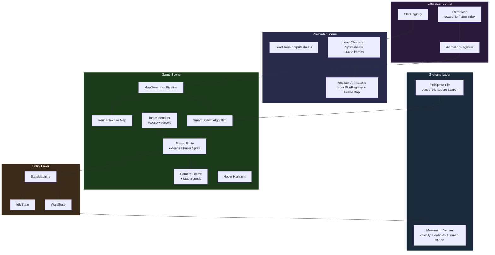
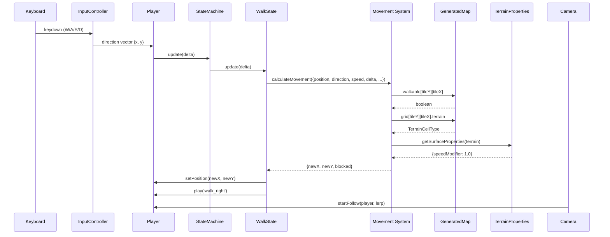
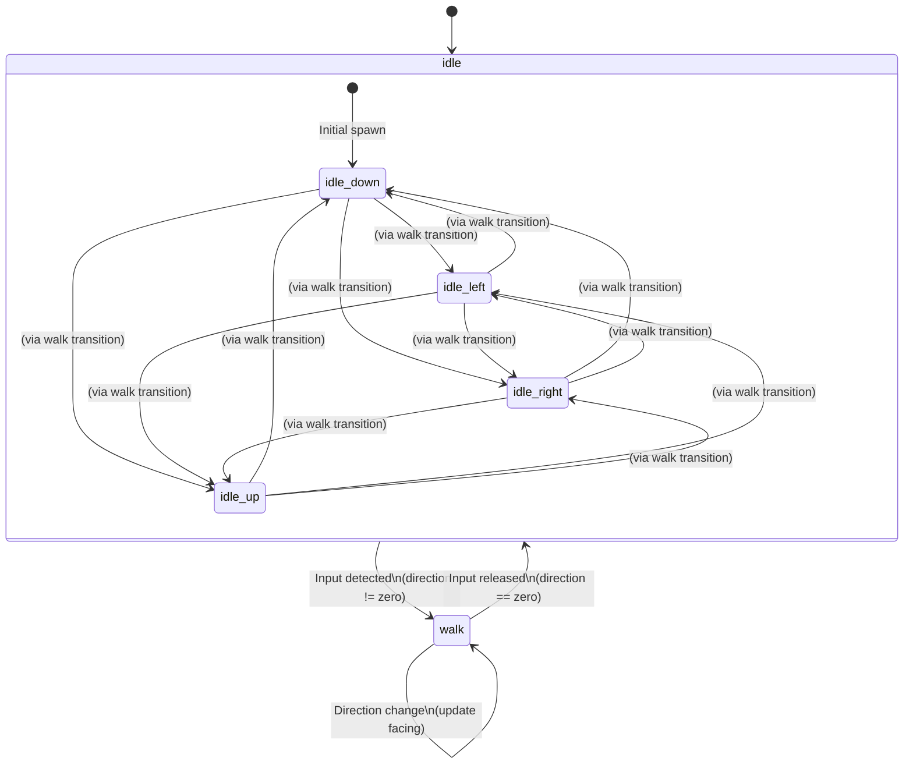

# Player Character System Design Document

## Overview

This document defines the complete technical design for introducing a player-controlled character entity into the Nookstead game. The player character is a 16x32 pixel animated sprite that moves freely across the procedurally generated island map using WASD/arrow key input, respects tile-based collision and terrain speed modifiers, and is tracked by the camera. The system establishes the entity, animation, and state management patterns that will be reused for NPCs and multiplayer characters in M0.2.

## Design Summary (Meta)

```yaml
design_type: "new_feature"
risk_level: "medium"
complexity_level: "medium"
complexity_rationale: >
  (1) ACs require a state machine managing 7 registered animation states with
  direction-aware transitions, an irregular sprite sheet frame mapping (non-uniform
  frame counts and direction orders across rows), axis-independent collision resolution
  against a tile grid, terrain speed modifier application, and camera behavior replacement
  from fit-map to follow-player -- these span entity lifecycle, input handling, physics,
  and rendering layers.
  (2) The sprite sheet's irregular layout (927px width not divisible by 16, different
  direction orders per animation row, variable frame counts) creates a correctness risk
  in frame index computation. The camera behavior change (removing drag-scroll, adding
  follow with map bounds clamping) modifies existing interactive behavior.
main_constraints:
  - "Phaser pixelArt mode: roundPixels=true, no antialiasing"
  - "16x32 character frames on 16x16 tile grid"
  - "No server authority (local-only movement, M0.2 adds Colyseus)"
  - "Multi-skin architecture: all skins share identical frame layout"
  - "Must preserve mouse-wheel zoom functionality"
  - "TypeScript strict mode enforced"
biggest_risks:
  - "Frame index computation errors due to 927px sheet width (57.9375 columns)"
  - "Camera behavior change (drag-scroll removal) may disrupt developer workflow"
  - "Collision sliding may feel janky on narrow passages or map corners"
unknowns:
  - "Exact visual appearance of character at different zoom levels"
  - "Whether 8 FPS animation rate feels right for player movement at 100px/sec"
```

## Background and Context

### Prerequisite ADRs

- **[ADR-004: Player Entity Architecture and Character State Management](../adr/adr-004-player-entity-architecture.md)**: Selects Phaser.Sprite subclass, class-based FSM, and spritesheet loader with explicit frame arrays. Documents rejected Container, ECS, enum+switch, JSON atlas, and programmatic frame approaches.
- **[ADR-001: Procedural Island Map Generation Architecture](../adr/adr-001-map-generation-architecture.md)**: Establishes the map rendering pipeline that produces the `GeneratedMap` with `walkable` grid and terrain classification used by collision and speed modifier systems.

### Applicable Standards

#### Classification Table

| Standard | Type | Source | Impact on Design |
|----------|------|--------|-----------------|
| Prettier single quotes | Explicit | `.prettierrc` | All new TypeScript code uses single quotes |
| 2-space indentation | Explicit | `.editorconfig` | All files use space-based 2-space indent |
| ESLint flat config with @nx/eslint-plugin | Explicit | `eslint.config.mjs` | Module boundary enforcement; new files must comply |
| TypeScript strict mode | Explicit | `tsconfig.base.json` (`"strict": true`) | All interfaces fully typed; no implicit any; noUnusedLocals |
| `@/*` path alias | Explicit | `tsconfig.json` paths | All imports from `apps/game/src/*` use `@/*` alias |
| Jest test framework with jsdom | Explicit | `jest.config.cts` | Unit tests use Jest with jsdom environment |
| Phaser pixelArt config | Implicit | `main.ts` game config | `pixelArt: true, roundPixels: true` -- all sprites render with nearest-neighbor filtering |
| Scene class pattern | Implicit | `scenes/Game.ts`, `scenes/Preloader.ts` | Scenes extend `Phaser.Scene`, use `create()` for setup |
| Constants module pattern | Implicit | `constants.ts` | Game constants exported as named `const` from centralized file |
| EventBus pub/sub pattern | Implicit | `EventBus.ts` | Cross-scene/React communication uses shared `EventEmitter` |
| Terrain data pattern | Implicit | `terrain-properties.ts` | Surface properties accessed via `getSurfaceProperties(terrainType)` |

### Agreement Checklist

#### Scope

- [x] Create player character entity class (Phaser.Sprite subclass)
- [x] Create finite state machine with idle and walk functional states
- [x] Register all 7 animation states (idle, waiting, walk, sit, hit, punch, hurt)
- [x] Load character sprite sheet in Preloader with 16x32 frame size
- [x] Implement WASD + arrow key input handling
- [x] Implement free pixel-based movement with diagonal normalization
- [x] Implement terrain speed modifier application
- [x] Implement tile-based collision with axis-independent resolution (wall-sliding)
- [x] Implement smart spawn on walkable grass near map center
- [x] Replace camera fit-map with follow-player + map bounds clamping
- [x] Preserve mouse-wheel zoom
- [x] Create multi-skin registry architecture (MVP loads Scout skin only)
- [x] Add character frame height constant (32)

#### Non-Scope (Explicitly not changing)

- [x] Map generation pipeline (`mapgen/`) -- no changes
- [x] Terrain properties (`terrain-properties.ts`) -- read-only usage
- [x] Map rendering to RenderTexture -- no changes
- [x] Boot scene -- no changes
- [x] Multiplayer synchronization -- local-only
- [x] Combat/interaction mechanics -- states registered but not triggered
- [x] Mobile virtual joystick -- keyboard only
- [x] HUD / React components -- no changes
- [x] NPC entity system -- M0.2

#### Constraints

- [x] Parallel operation: Not applicable (new feature, no existing behavior to parallel)
- [x] Backward compatibility: Camera behavior change replaces drag-scroll with follow-player (intentional per PRD FR-7)
- [x] Performance measurement: Must maintain 60 FPS on desktop (baseline regression check)

### Problem to Solve

The game currently renders a procedurally generated island map with no interactive entities. Players cannot explore the world, test terrain, or interact with anything. The camera is fixed at a zoom-to-fit level with drag-scroll navigation, which is a developer tool rather than a gameplay experience. Adding the player character is the foundational step that enables all future gameplay (farming, NPC dialogue, combat, multiplayer).

### Current Challenges

1. No entity system exists -- the game has only a static map rendered to a RenderTexture
2. The sprite sheet has an irregular layout requiring careful frame index computation
3. The camera must transition from fit-map developer view to player-following gameplay view
4. The character frame height (32px) differs from the tile/frame size constant (16px) used throughout the codebase

### Requirements

#### Functional Requirements

- FR-1: Character sprite loading in Preloader (16x32 frames)
- FR-2: Animation state registration (7 states, all directions)
- FR-3: Player character entity creation (visible on map, correct scale)
- FR-4: Smart spawn positioning (walkable grass near center)
- FR-5: Free pixel-based movement (WASD/arrows, diagonal normalization, terrain speed)
- FR-6: Tile-based collision (walkable grid, axis-independent, wall-sliding)
- FR-7: Camera follows player (centered, map bounds clamping, preserves zoom)
- FR-8: Multi-skin architecture (registry pattern, MVP loads Scout)
- FR-9: Smooth camera lerp (Should Have)
- FR-10: Tile hover highlight preserved (Should Have)

#### Non-Functional Requirements

- **Performance**: 60 FPS on desktop, 30 FPS on mobile; input-to-movement < 16ms; collision check < 0.1ms
- **Scalability**: Multi-skin without code changes; entity pattern reusable for NPCs
- **Reliability**: Spawn always finds valid tile; no stuck states; seamless animation transitions
- **Maintainability**: Animation data is declarative; state logic is isolated per state; new states/skins addable without modifying existing code

## Acceptance Criteria (AC) - EARS Format

### FR-1: Character Sprite Loading

- [ ] **When** the Preloader scene runs, the system shall load the character sprite sheet with frameWidth=16 and frameHeight=32 into the Phaser texture cache
- [ ] **When** sprite loading completes, the system shall have all character frames accessible by frame index

### FR-2: Animation State Registration

- [ ] **When** the Preloader completes, the system shall register all 7 animation states (idle, waiting, walk, sit, hit, punch, hurt) as Phaser animations with correct frame sequences and directions
- [ ] The idle and walk animations shall loop (`repeat: -1`) at 8 FPS
- [ ] The waiting animation shall use the same frames as idle
- [ ] **When** any registered animation key is played on a sprite using the loaded skin, the correct frames shall display in the correct order

### FR-3: Player Entity Creation

- [ ] **When** the Game scene creates the map, the system shall create a Player sprite that is visible on the map at the correct size (16x32 pixels, one tile wide, two tiles tall)
- [ ] The player sprite shall render above the map RenderTexture
- [ ] The idle-down animation shall play automatically on creation

### FR-4: Smart Spawn

- [ ] **When** the player entity is created, the system shall find a walkable grass tile nearest to the map center using expanding concentric square search
- [ ] The player's feet (bottom 16px) shall be aligned to the center of the found tile
- [ ] **If** no walkable grass tile exists, **then** the system shall fall back to any walkable tile

### FR-5: Movement

- [ ] **When** the player presses W/Up, S/Down, A/Left, or D/Right, the character shall move in the corresponding direction at 100 px/sec multiplied by the terrain speed modifier
- [ ] **While** two perpendicular movement keys are held, the character shall move diagonally with speed normalized by dividing by sqrt(2)
- [ ] **When** the character moves, the walk animation shall play in the movement direction
- [ ] **When** moving diagonally, the facing direction shall be the last horizontal direction pressed
- [ ] **When** all movement keys are released, the character shall stop and play the idle animation facing the last movement direction

### FR-6: Collision

- [ ] **When** the character moves toward an unwalkable tile, the system shall prevent the character from entering that tile
- [ ] **While** moving diagonally into a corner, **if** one axis is blocked and the other is free, **then** the character shall slide along the wall in the free direction
- [ ] Collision bounds shall be the bottom 16x16 area of the sprite (feet), not the full 16x32

### FR-7: Camera

- [ ] **When** the player character moves, the camera shall follow the character keeping it centered in the viewport
- [ ] **While** the character is near a map edge, the camera shall clamp to the map boundary and the character shall move off-center
- [ ] The mouse-wheel zoom shall continue to function alongside camera follow
- [ ] The camera shall use `setBounds()` to constrain scrolling to the map pixel dimensions

### FR-8: Multi-Skin

- [ ] The skin registry shall contain at least one entry (Scout) mapping a key to a sprite sheet path
- [ ] **When** a second skin entry is added to the registry, both skins shall load and animate without code changes to animation or movement systems

### FR-9: Camera Lerp (Should Have)

- [ ] **When** the camera follows the player, linear interpolation (lerp=0.1) shall smooth the camera movement
- [ ] **When** the player changes direction suddenly, the camera shall visibly smooth rather than snap

### FR-10: Hover Highlight (Should Have)

- [ ] **While** the player moves the mouse over the map, the tile hover highlight shall appear above the map but below the character sprite

## Existing Codebase Analysis

### Implementation Path Mapping

| Type | Path | Description |
|------|------|-------------|
| Existing | `apps/game/src/game/scenes/Game.ts` | Main game scene -- will be modified to create player entity, update camera, and add update loop |
| Existing | `apps/game/src/game/scenes/Preloader.ts` | Asset loading scene -- will be modified to load character sprite sheets |
| Existing | `apps/game/src/game/constants.ts` | Game constants -- will add `CHARACTER_FRAME_HEIGHT`, `PLAYER_SPEED`, `ANIMATION_FPS` |
| Existing | `apps/game/src/game/terrain-properties.ts` | Surface properties -- read-only usage for speed modifiers |
| Existing | `apps/game/src/game/mapgen/types.ts` | `GeneratedMap` type -- read-only usage for walkable grid |
| Existing | `apps/game/src/game/EventBus.ts` | Event emitter -- may emit player position events |
| New | `apps/game/src/game/entities/Player.ts` | Player entity class (Phaser.Sprite subclass) |
| New | `apps/game/src/game/entities/StateMachine.ts` | Lightweight finite state machine |
| New | `apps/game/src/game/entities/states/IdleState.ts` | Idle state implementation |
| New | `apps/game/src/game/entities/states/WalkState.ts` | Walk state implementation |
| New | `apps/game/src/game/entities/states/index.ts` | State barrel export |
| New | `apps/game/src/game/characters/skin-registry.ts` | Multi-skin registry and animation config |
| New | `apps/game/src/game/characters/frame-map.ts` | Sprite sheet frame index mapping |
| New | `apps/game/src/game/characters/animations.ts` | Animation registration from frame map |
| New | `apps/game/src/game/input/InputController.ts` | Keyboard input handler |
| New | `apps/game/src/game/systems/movement.ts` | Movement and collision logic (pure functions) |
| New | `apps/game/src/game/systems/spawn.ts` | Smart spawn algorithm (pure function) |

### Similar Functionality Search

- **Entity/character code**: No existing entity, character, or player code exists in the codebase. This is a greenfield implementation.
- **Animation code**: No animation registration exists. Only terrain spritesheet loading in Preloader.
- **Input handling**: No keyboard input handling exists. Only mouse pointer events in Game.ts.
- **State management**: No state machine pattern exists in the codebase.

**Decision**: Proceed with new implementation following existing design philosophy (Scene-based architecture, constants module, TypeScript strict mode).

### Integration Points

- **Integration Target**: `Preloader.ts` -- character sprite sheet loading alongside terrain tilesets
- **Invocation Method**: Additional `this.load.spritesheet()` calls in `preload()`, animation registration in `create()`
- **Integration Target**: `Game.ts` -- player entity creation, camera setup, update loop
- **Invocation Method**: New code in `create()` after map rendering; new `update()` method

### Code Inspection Evidence

#### What Was Examined

| File Inspected | Key Finding | Design Impact |
|---------------|-------------|---------------|
| `apps/game/src/game/scenes/Game.ts` (127 lines) | No `update()` method; camera uses `setZoom(Math.min(zoomX, zoomY))` and `centerOn()`; drag-scroll via `pointermove` with `pointer.isDown`; hover highlight at depth 1 | Must add `update()` method; replace camera logic; remove drag-scroll handler; preserve hover highlight |
| `apps/game/src/game/scenes/Preloader.ts` (39 lines) | Loads terrain spritesheets with `FRAME_SIZE x FRAME_SIZE`; emits `preload-complete`; starts Game scene in `create()` | Add character spritesheet loading with different frame height (16x32); register animations in `create()` before scene transition |
| `apps/game/src/game/constants.ts` (27 lines) | `FRAME_SIZE=16`, `TILE_SIZE=16`, `SPRITE_SIZE=16`; no character-specific constants | Add `CHARACTER_FRAME_HEIGHT=32`, `PLAYER_SPEED=100`, `ANIMATION_FPS=8` |
| `apps/game/src/game/main.ts` (26 lines) | `pixelArt: true`, `roundPixels: true`; `Scale.RESIZE` mode; scene order: Boot, Preloader, MainGame | No changes needed; pixel-perfect rendering already configured |
| `apps/game/src/game/terrain-properties.ts` (50 lines) | `getSurfaceProperties()` returns `SurfaceProperties` with `speedModifier` field; grass=1.0, water=0.5 (but not walkable) | Use `getSurfaceProperties(terrain).speedModifier` in movement calculation |
| `apps/game/src/game/mapgen/types.ts` (65 lines) | `GeneratedMap.walkable: boolean[][]` is `[y][x]` indexed; `Grid` is `Cell[][]` with `terrain: TerrainCellType` | Collision uses `walkable[y][x]`; speed modifier reads `grid[y][x].terrain` |
| `apps/game/src/game/EventBus.ts` (4 lines) | Simple Phaser `EventEmitter` singleton | May emit `player-position` events for React HUD in future |

#### Key Findings

- **No existing entity patterns**: The codebase has no precedent for game entities, state machines, or input handling. The design must establish these patterns from scratch.
- **Map data access**: `GeneratedMap` provides `walkable[y][x]` (boolean) and `grid[y][x].terrain` (TerrainCellType). Both are row-major (`[y][x]`), which must be respected in collision and speed modifier lookups.
- **Camera is fully replaced**: The current camera logic (fit-map zoom, drag-scroll, resize handler) is entirely replaced by follow-player behavior. The wheel-zoom handler is preserved.
- **Hover highlight depth**: Currently at depth 1. Player sprite should be at depth 2+ to render above it, satisfying FR-10.
- **RenderTexture**: The map renders to a single `RenderTexture` at origin (0,0). Player sprite position is in the same world coordinate space.

#### How Findings Influence Design

- The absence of existing patterns gives freedom to establish clean architecture but requires careful design since there are no conventions to follow beyond the Scene/constants patterns.
- The `[y][x]` grid indexing must be consistently used in all collision/terrain lookups -- reversing indices would cause silent bugs.
- Camera replacement is a direct substitution in `create()` with additional logic in `update()`.
- The depth system provides a natural layering solution: RenderTexture (default depth 0), hover highlight (depth 1), player sprite (depth 2).

## Design

### Change Impact Map

```yaml
Change Target: Player Character System (new feature)
Direct Impact:
  - apps/game/src/game/scenes/Game.ts (camera replacement, player creation, update loop)
  - apps/game/src/game/scenes/Preloader.ts (character spritesheet loading, animation registration)
  - apps/game/src/game/constants.ts (new constants: CHARACTER_FRAME_HEIGHT, PLAYER_SPEED, ANIMATION_FPS)
Indirect Impact:
  - Camera behavior changes from fit-map to follow-player (developer workflow change)
  - Hover highlight depth relationship changes (now below player sprite)
No Ripple Effect:
  - Map generation pipeline (mapgen/) - read-only usage of GeneratedMap
  - Terrain properties (terrain-properties.ts) - read-only usage
  - Boot scene - unchanged
  - React components / HUD - unchanged
  - EventBus - may emit new events but existing events unchanged
  - Terrain spritesheets / tilesets - unchanged
```

### Architecture Overview



### Data Flow



### Integration Points List

| Integration Point | Location | Old Implementation | New Implementation | Switching Method |
|---|---|---|---|---|
| Character asset loading | `Preloader.preload()` | Only terrain spritesheets | Add character spritesheet loading from skin registry | Additional `this.load.spritesheet()` calls |
| Animation registration | `Preloader.create()` | Direct scene transition | Register animations before `scene.start('Game')` | New code before existing `scene.start()` call |
| Player entity creation | `Game.create()` | No entities | Create Player sprite after map rendering | New code after map rendering block |
| Camera setup | `Game.create()` | `setZoom(Math.min(...))` + `centerOn()` + drag-scroll | `startFollow(player)` + `setBounds()` + preserve wheel zoom | Replace camera block; remove drag-scroll handler |
| Game update loop | `Game` class | No `update()` method | Add `update(time, delta)` for player input and state machine | New method on existing class |
| Hover highlight depth | `Game.create()` | `hover.setDepth(1)` | Keep depth 1; player at depth 2 | No change to hover; set player depth |

### Integration Point Map

```yaml
Integration Point 1:
  Existing Component: Preloader.preload()
  Integration Method: Additional load calls
  Impact Level: Low (additive, no existing behavior modified)
  Required Test Coverage: Verify character textures exist in cache after preload

Integration Point 2:
  Existing Component: Preloader.create()
  Integration Method: Animation registration before scene transition
  Impact Level: Low (additive, scene transition preserved)
  Required Test Coverage: Verify all 7 animation states registered with correct frame counts

Integration Point 3:
  Existing Component: Game.create()
  Integration Method: Player creation after map rendering
  Impact Level: Medium (camera behavior replaced)
  Required Test Coverage: Player visible on map; camera follows player; wheel zoom works

Integration Point 4:
  Existing Component: Game class
  Integration Method: New update() method
  Impact Level: High (core game loop addition)
  Required Test Coverage: Player responds to input; state machine transitions work; movement respects collision
```

### Main Components

#### Component 1: SkinRegistry and FrameMap (`characters/`)

- **Responsibility**: Define skin entries (key + sprite sheet path) and compute frame index arrays for each animation/direction combination
- **Interface**:
  ```typescript
  interface SkinDefinition {
    key: string;          // e.g., 'scout'
    sheetPath: string;    // e.g., 'characters/scout_6.png'
    sheetKey: string;     // Phaser texture key, e.g., 'char-scout'
  }

  interface AnimationDef {
    key: string;          // e.g., 'scout_idle_down'
    frames: number[];     // Frame indices from spritesheet
    frameRate: number;    // 8
    repeat: number;       // -1 for loop, 0 for once
  }

  function getSkins(): SkinDefinition[];
  function getAnimationDefs(skinKey: string, sheetKey: string): AnimationDef[];

  /** Derive COLS_PER_ROW at runtime from actual texture dimensions (ADR-004 guidance). */
  function computeColumnsPerRow(textureWidth: number, frameWidth: number): number;
  ```
- **Dependencies**: `constants.ts` for `TILE_SIZE`, `CHARACTER_FRAME_HEIGHT`, `ANIMATION_FPS`

#### Component 2: StateMachine (`entities/StateMachine.ts`)

- **Responsibility**: Manage character behavioral states with enter/update/exit lifecycle hooks. Enforce single-state invariance and handle transitions.
- **Interface**:
  ```typescript
  interface State {
    name: string;
    enter?(): void;
    update?(delta: number): void;
    exit?(): void;
  }

  class StateMachine {
    constructor(context: unknown, initialState: string, states: Record<string, State>);
    setState(name: string): void;
    update(delta: number): void;
    get currentState(): string;
  }
  ```
- **Dependencies**: None (framework-agnostic)

#### Component 3: Player Entity (`entities/Player.ts`)

- **Responsibility**: The player character game object. Extends `Phaser.GameObjects.Sprite`. Owns the state machine, receives input from InputController, and delegates movement to the movement system.
- **Interface**:
  ```typescript
  class Player extends Phaser.GameObjects.Sprite {
    constructor(scene: Phaser.Scene, x: number, y: number, skinKey: string, mapData: GeneratedMap);
    setInputController(controller: InputController): void;
    preUpdate(time: number, delta: number): void;
    get facingDirection(): Direction;
  }
  ```
- **Dependencies**: StateMachine, InputController, movement system, `GeneratedMap`

#### Component 4: InputController (`input/InputController.ts`)

- **Responsibility**: Read keyboard state (WASD + arrow keys) and produce a normalized direction vector. Stateless per frame -- simply reads current key state.
- **Interface**:
  ```typescript
  type Direction = 'up' | 'down' | 'left' | 'right';

  class InputController {
    constructor(scene: Phaser.Scene);
    getDirection(): { x: number; y: number };
    isMoving(): boolean;
    getFacingDirection(): Direction;
    destroy(): void;
  }
  ```
- **Dependencies**: `Phaser.Input.Keyboard`

#### Component 5: Movement System (`systems/movement.ts`)

- **Responsibility**: Pure functions for calculating movement with collision detection and terrain speed modifiers. No Phaser dependencies -- operates on primitive types.
- **Interface**:
  ```typescript
  interface MovementInput {
    position: { x: number; y: number };
    direction: { x: number; y: number };
    speed: number;
    delta: number;
    walkable: boolean[][];
    grid: Grid;
    mapWidth: number;
    mapHeight: number;
    tileSize: number;
  }

  interface MovementResult {
    x: number;
    y: number;
    blocked: { x: boolean; y: boolean };
  }

  function calculateMovement(input: MovementInput): MovementResult;

  function getTerrainSpeedModifier(
    x: number,
    y: number,
    grid: Grid,
    tileSize: number,
  ): number;
  ```
- **Dependencies**: `terrain-properties.ts` (`getSurfaceProperties`)

#### Component 6: Spawn System (`systems/spawn.ts`)

- **Responsibility**: Pure function that finds a walkable grass tile nearest to the map center using expanding concentric square search.
- **Interface**:
  ```typescript
  function findSpawnTile(
    walkable: boolean[][],
    grid: Grid,
    mapWidth: number,
    mapHeight: number,
  ): { tileX: number; tileY: number };
  ```
- **Dependencies**: None (operates on grid data)

### Contract Definitions

```typescript
// === Direction enum ===
type Direction = 'up' | 'down' | 'left' | 'right';

// === Skin Definition ===
interface SkinDefinition {
  key: string;
  sheetPath: string;
  sheetKey: string;
}

// === Animation Definition ===
interface AnimationDef {
  key: string;        // Format: '{sheetKey}_{state}_{direction}'
  frames: number[];
  frameRate: number;
  repeat: number;     // -1 = loop, 0 = play once
}

// === State interface ===
interface State {
  name: string;
  enter?(): void;
  update?(delta: number): void;
  exit?(): void;
}

// === Movement input ===
interface MovementInput {
  position: { x: number; y: number };
  direction: { x: number; y: number };
  speed: number;
  delta: number;
  walkable: boolean[][];
  grid: Grid;
  mapWidth: number;
  mapHeight: number;
  tileSize: number;
}

// === Movement result ===
interface MovementResult {
  x: number;
  y: number;
  blocked: { x: boolean; y: boolean };
}

// === Spawn result ===
interface SpawnTile {
  tileX: number;
  tileY: number;
}
```

### Data Contract

#### Movement System

```yaml
Input:
  Type: MovementInput { position: {x, y}, direction: {x, y}, speed, delta, walkable, grid, mapWidth, mapHeight, tileSize }
  Preconditions: |
    - direction.x and direction.y are -1, 0, or 1
    - speed > 0
    - delta > 0 (clamped internally to max 50ms to prevent tunneling)
    - walkable array is [y][x] indexed, dimensions match mapWidth/mapHeight
  Validation: None (trusted internal call)

Output:
  Type: MovementResult { x, y, blocked: { x, y } }
  Guarantees: |
    - Returned x,y are always on a walkable tile (feet position)
    - blocked.x/blocked.y indicate which axis was blocked by collision
    - Position never exceeds map bounds (0..mapWidth*tileSize, 0..mapHeight*tileSize)
  On Error: Returns current position unchanged (no movement)

Invariants:
  - The character's feet tile is always walkable after movement
  - Speed is always multiplied by terrain speed modifier
  - delta is clamped to 50ms maximum to prevent wall tunneling on tab background
```

#### Spawn System

```yaml
Input:
  Type: walkable (boolean[][]), grid (Grid), mapWidth (number), mapHeight (number)
  Preconditions: |
    - walkable dimensions match mapWidth x mapHeight
    - At least one walkable tile exists in the map
  Validation: None (trusted internal call)

Output:
  Type: SpawnTile { tileX, tileY }
  Guarantees: |
    - Returned tile is walkable (walkable[tileY][tileX] === true)
    - If a walkable grass tile exists, it is the closest one to the center
    - If no grass tile exists, any walkable tile nearest to center is returned
  On Error: Throws if no walkable tile exists (degenerate map)

Invariants:
  - The search is deterministic for the same map
```

### State Transitions and Invariants

```yaml
State Definition:
  - Initial State: idle (facing down)
  - Possible States: [idle, walk]
  - Registered but inactive: [sit, hit, punch, hurt, waiting]

State Transitions:
  idle -> (input detected, direction != 0) -> walk
  walk -> (input released, direction == 0) -> idle
  walk -> (direction changes) -> walk (update facing, no transition)

System Invariants:
  - Exactly one state is active at any time
  - The active animation always matches the current state + facing direction
  - State transitions trigger animation changes via enter() hooks
  - The facing direction persists across state transitions (idle remembers last walk direction)
```



### Sprite Sheet Frame Mapping

The character sprite sheet `scout_6.png` has these properties:

- **Image dimensions**: 927 x 656 pixels
- **Frame cell size**: 16 wide x 32 tall
- **Columns per row**: `computeColumnsPerRow(927, 16) = floor(927 / 16) = 57` (912px used, 15px remainder ignored by Phaser). Derived at runtime via `computeColumnsPerRow(textureWidth, frameWidth)` to guard against sheet dimension changes (see ADR-004).
- **Rows**: `floor(656 / 32) = 20` (640px used, 16px remainder ignored)
- **Frame index formula**: `row * COLS_PER_ROW + column` (0-indexed, where `COLS_PER_ROW = computeColumnsPerRow(textureWidth, frameWidth)`)

#### Row Layout

| Row | Y Range | Animation | Direction Order | Frames/Dir | Status |
|-----|---------|-----------|-----------------|------------|--------|
| 0 | 0-31 | header/reference | -- | -- | SKIP |
| 1 | 32-63 | **idle** | LEFT, UP, RIGHT, DOWN | 6 | Active (MVP) |
| 2 | 64-95 | **walk** | LEFT, UP, RIGHT, DOWN | 6 | Active (MVP) |
| 3 | 96-127 | sleep | -- | -- | SKIP |
| 4 | 128-159 | **sit** | LEFT, DOWN, RIGHT, UP | 3 | Registered |
| 5 | 160-191 | sit row 2 | -- | -- | SKIP (use row 4) |
| 6-7 | 192-255 | phone | -- | -- | SKIP |
| 8-12 | 256-415 | pick up/gift/lift/throw | -- | -- | SKIP |
| 13 | 416-447 | **hit** | LEFT, UP, RIGHT, DOWN | 6 | Registered |
| 14 | 448-479 | **punch** | LEFT, UP, RIGHT, DOWN | 6 | Registered |
| 15 | 480-511 | stab | -- | -- | SKIP |
| 16-18 | 512-607 | gun/shoot | -- | -- | SKIP |
| 19 | 608-639 | **hurt** | LEFT, UP, RIGHT (no DOWN) | 4 | Registered |

#### Exact Frame Indices

**COLS_PER_ROW = 57**

**idle (row 1, base = 1 * 57 = 57):**

| Direction | Frame Indices |
|-----------|--------------|
| left | 57, 58, 59, 60, 61, 62 |
| up | 63, 64, 65, 66, 67, 68 |
| right | 69, 70, 71, 72, 73, 74 |
| down | 75, 76, 77, 78, 79, 80 |

**waiting:** Same frames as idle (alias)

**walk (row 2, base = 2 * 57 = 114):**

| Direction | Frame Indices |
|-----------|--------------|
| left | 114, 115, 116, 117, 118, 119 |
| up | 120, 121, 122, 123, 124, 125 |
| right | 126, 127, 128, 129, 130, 131 |
| down | 132, 133, 134, 135, 136, 137 |

**sit (row 4, base = 4 * 57 = 228, DIFFERENT direction order: LEFT, DOWN, RIGHT, UP):**

| Direction | Frame Indices |
|-----------|--------------|
| left | 228, 229, 230 |
| down | 231, 232, 233 |
| right | 234, 235, 236 |
| up | 237, 238, 239 |

**hit (row 13, base = 13 * 57 = 741):**

| Direction | Frame Indices |
|-----------|--------------|
| left | 741, 742, 743, 744, 745, 746 |
| up | 747, 748, 749, 750, 751, 752 |
| right | 753, 754, 755, 756, 757, 758 |
| down | 759, 760, 761, 762, 763, 764 |

**punch (row 14, base = 14 * 57 = 798):**

| Direction | Frame Indices |
|-----------|--------------|
| left | 798, 799, 800, 801, 802, 803 |
| up | 804, 805, 806, 807, 808, 809 |
| right | 810, 811, 812, 813, 814, 815 |
| down | 816, 817, 818, 819, 820, 821 |

**hurt (row 19, base = 19 * 57 = 1083, only 3 directions, 4 frames each):**

| Direction | Frame Indices |
|-----------|--------------|
| left | 1083, 1084, 1085, 1086 |
| up | 1087, 1088, 1089, 1090 |
| right | 1091, 1092, 1093, 1094 |
| down | *(no down variant)* |

### Animation Key Format

Animation keys follow the pattern: `{sheetKey}_{state}_{direction}`

Examples for the Scout skin (`sheetKey: 'char-scout'`):
- `char-scout_idle_down`
- `char-scout_walk_left`
- `char-scout_sit_up`
- `char-scout_hurt_right`

This format ensures uniqueness across skins and enables programmatic key construction:
```typescript
function animKey(sheetKey: string, state: string, direction: Direction): string {
  return `${sheetKey}_${state}_${direction}`;
}
```

### Collision Detection Algorithm

Collision uses axis-independent resolution (wall-sliding):

```
function calculateMovement(input: MovementInput): MovementResult:
  { position, direction, speed, delta, walkable, grid, mapWidth, mapHeight, tileSize } = input

  0. Clamp delta to prevent tunneling when tab is backgrounded:
     delta = Math.min(delta, 50)

  1. Compute terrain speed modifier at current feet tile
  2. Calculate desired displacement:
     dx = direction.x * speed * speedMod * (delta / 1000)
     dy = direction.y * speed * speedMod * (delta / 1000)

  3. Try X movement independently:
     newX = position.x + dx
     feetTileX = floor(newX / tileSize)  // left edge of feet
     feetTileY = floor(position.y / tileSize)  // current Y tile
     if walkable[feetTileY][feetTileX] === true:
       accept newX
     else:
       newX = position.x (blocked)
       blocked.x = true

  4. Try Y movement independently (using accepted X):
     newY = position.y + dy
     feetTileX = floor(newX / tileSize)
     feetTileY = floor(newY / tileSize)
     if walkable[feetTileY][feetTileX] === true:
       accept newY
     else:
       newY = position.y (blocked)
       blocked.y = true

  5. Clamp to map bounds:
     newX = clamp(newX, 0, mapWidth * tileSize - 1)
     newY = clamp(newY, 0, mapHeight * tileSize - 1)

  6. Return { x: newX, y: newY, blocked: { x: blocked.x, y: blocked.y } }
```

**Important**: The collision bounds are the character's feet (bottom 16x16 area). The sprite's anchor point is set so that `sprite.x, sprite.y` represents the feet center position. The sprite renders with `setOrigin(0.5, 1.0)` so the anchor is at the bottom-center, and the visual extends 32px upward.

### Camera Integration

```typescript
// In Game.create(), after player creation:
const cam = this.cameras.main;
cam.setBackgroundColor(0x215c81);
cam.setBounds(0, 0, mapPixelW, mapPixelH);
cam.startFollow(this.player, true, 0.1, 0.1);  // roundPixels=true, lerp=0.1

// Preserve wheel zoom (existing handler unchanged)
// Remove drag-scroll handler (pointermove with pointer.isDown)
// Remove resize handler's centerOn and setZoom (camera follow handles positioning)
```

The `setBounds()` call constrains the camera to the map dimensions, preventing it from showing empty space beyond the map edges. The `startFollow()` with `roundPixels=true` ensures pixel-perfect rendering at all zoom levels. The lerp value of 0.1 provides smooth camera movement (FR-9).

### Smart Spawn Algorithm

```
function findSpawnTile(walkable, grid, mapWidth, mapHeight):
  centerX = floor(mapWidth / 2)
  centerY = floor(mapHeight / 2)

  // Check center first
  if isValidSpawn(centerX, centerY, walkable, grid):
    return { tileX: centerX, tileY: centerY }

  // Expanding concentric squares
  for radius = 1 to max(mapWidth, mapHeight):
    // Top and bottom edges of the square
    for x = centerX - radius to centerX + radius:
      for y in [centerY - radius, centerY + radius]:
        if inBounds(x, y) and isValidSpawn(x, y, walkable, grid):
          return { tileX: x, tileY: y }

    // Left and right edges (excluding corners already checked)
    for y = centerY - radius + 1 to centerY + radius - 1:
      for x in [centerX - radius, centerX + radius]:
        if inBounds(x, y) and isValidSpawn(x, y, walkable, grid):
          return { tileX: x, tileY: y }

  // Fallback: any walkable tile
  for y = 0 to mapHeight:
    for x = 0 to mapWidth:
      if walkable[y][x]:
        return { tileX: x, tileY: y }

  throw Error('No walkable tile found')

function isValidSpawn(x, y, walkable, grid):
  return walkable[y][x] && grid[y][x].terrain === 'grass'
```

### Multi-Skin Registry

```typescript
// characters/skin-registry.ts

const SKIN_REGISTRY: SkinDefinition[] = [
  {
    key: 'scout',
    sheetPath: 'characters/scout_6.png',
    sheetKey: 'char-scout',
  },
  // To add a new skin, append a SkinDefinition entry here.
  // All skins must share the same frame layout (same row/column structure).
  // No changes to animation or movement code are needed.
];

export function getSkins(): SkinDefinition[] {
  return SKIN_REGISTRY;
}

export function getDefaultSkin(): SkinDefinition {
  return SKIN_REGISTRY[0];
}
```

All skins share the same frame layout, so the frame index arrays computed in `frame-map.ts` apply to all skins. Adding a new skin requires only adding an entry to `SKIN_REGISTRY` -- no animation or movement code changes.

### Data Representation Decisions

| Data Structure | Decision | Rationale |
|---|---|---|
| `SkinDefinition` | **New** dedicated type | No existing type for character skin metadata; entirely new domain concept |
| `AnimationDef` | **New** dedicated type | Existing code has no animation types; this is a new subsystem |
| `Direction` | **New** string literal union | No existing direction concept; simple union type (`'up' \| 'down' \| 'left' \| 'right'`) |
| `State` (FSM) | **New** interface | No state management exists in codebase; new behavioral concept |
| `MovementResult` | **New** interface | No movement system exists; new domain concept |
| `SpawnTile` | **New** interface | Simple `{tileX, tileY}` result type; no existing tile coordinate types |
| `GeneratedMap` | **Reuse** existing | Already provides `walkable[][]` and `grid[][]` needed for collision/spawn |
| `SurfaceProperties` | **Reuse** existing | Already provides `speedModifier` via `getSurfaceProperties()` |
| `TerrainCellType` | **Reuse** existing | Used to check terrain type for spawn and speed modifier |

All new types are specific to the entity/character domain. No existing types cover > 60% of their fields, justifying new type creation. The three reused types (`GeneratedMap`, `SurfaceProperties`, `TerrainCellType`) are consumed read-only -- no modifications needed.

### Field Propagation Map

```yaml
fields:
  - name: "playerPosition (x, y)"
    origin: "Smart Spawn Algorithm / Movement System"
    transformations:
      - layer: "Spawn System"
        type: "SpawnTile {tileX, tileY}"
        transformation: "tileX * TILE_SIZE + TILE_SIZE / 2, (tileY + 1) * TILE_SIZE (sprite bottom, centers collision body in tile)"
      - layer: "Player Entity"
        type: "Phaser.Sprite position (x, y)"
        transformation: "setPosition(pixelX, pixelY) with origin(0.5, 1.0)"
      - layer: "Movement System"
        type: "MovementResult {x, y}"
        transformation: "collision-checked, speed-modified pixel coordinates"
      - layer: "Camera System"
        type: "Camera scroll target"
        transformation: "startFollow reads sprite.x, sprite.y automatically"
    destination: "Camera scroll position / Phaser renderer"
    loss_risk: "low"
    loss_risk_reason: "Tile-to-pixel conversion is one-way; pixel coords may not map back to exact tile center"

  - name: "terrainSpeedModifier"
    origin: "GeneratedMap.grid[y][x].terrain"
    transformations:
      - layer: "Movement System"
        type: "TerrainCellType"
        transformation: "getSurfaceProperties(terrain).speedModifier"
      - layer: "Movement System"
        type: "number (0.0-1.0)"
        transformation: "multiplied with base speed and delta"
    destination: "Player velocity calculation"
    loss_risk: "none"

  - name: "inputDirection"
    origin: "Keyboard key state"
    transformations:
      - layer: "InputController"
        type: "{x: -1|0|1, y: -1|0|1}"
        transformation: "Key booleans to direction vector"
      - layer: "Player/StateMachine"
        type: "Direction enum + velocity"
        transformation: "Direction vector determines state (idle/walk) and facing"
    destination: "Movement System / Animation selection"
    loss_risk: "none"
```

### Interface Change Impact Analysis

| Existing Operation | New Operation | Conversion Required | Adapter Required | Compatibility Method |
|---|---|---|---|---|
| `Preloader.preload()` | `Preloader.preload()` (extended) | None | Not Required | Additive calls |
| `Preloader.create()` | `Preloader.create()` (extended) | None | Not Required | Additive calls before `scene.start()` |
| `Game.create()` camera block | `Game.create()` camera block (replaced) | Yes | Not Required | Direct replacement |
| `Game` (no update) | `Game.update(time, delta)` | None | Not Required | New method |
| `cam.centerOn()` | `cam.startFollow()` | Yes | Not Required | API replacement |
| Drag-scroll handler | *(removed)* | N/A | Not Required | Handler deleted |
| Resize handler | Modified resize handler | Yes | Not Required | Remove centerOn/setZoom, keep setSize |

### Integration Boundary Contracts

```yaml
Boundary: Preloader -> Game (scene transition)
  Input: All character textures loaded, all animations registered in Phaser AnimationManager
  Output: Game scene starts with fully prepared texture cache (sync, via scene.start)
  On Error: Phaser throws on missing texture key -- fail fast, visible in console

Boundary: InputController -> Player
  Input: Direction vector {x: -1|0|1, y: -1|0|1}
  Output: Sync, returned from getDirection() each frame
  On Error: Returns {x: 0, y: 0} (no movement) if keyboard not available

Boundary: Player -> MovementSystem
  Input: MovementInput {position, direction, speed, delta, walkable, grid, mapWidth, mapHeight, tileSize}
  Output: MovementResult {x, y, blocked: {x, y}} (sync)
  On Error: Returns current position unchanged

Boundary: Player -> StateMachine
  Input: update(delta) called each frame; setState(name) for transitions
  Output: Sync -- delegates to current state's update/enter/exit hooks
  On Error: Unknown state name throws (fail fast)

Boundary: MovementSystem -> TerrainProperties
  Input: TerrainCellType from grid[y][x].terrain
  Output: SurfaceProperties with speedModifier (sync)
  On Error: Always succeeds (all terrain types have entries)

Boundary: Player -> Camera
  Input: Player sprite position (via startFollow)
  Output: Camera scroll position (managed by Phaser internally)
  On Error: Camera stays at last position
```

### Error Handling

| Error Scenario | Handling |
|---|---|
| Sprite sheet file not found | Phaser loader emits error event; game shows loading error. Fail fast. |
| No walkable grass tile for spawn | Fall back to any walkable tile. If no walkable tile exists, throw Error (degenerate map). |
| Invalid state transition | StateMachine logs warning and ignores transition. Does not crash. |
| Character pushed outside map bounds | Movement system clamps position to map bounds. |
| Terrain type not in SURFACE_PROPERTIES | TypeScript type system prevents this (TerrainCellType is a union). |

### Logging and Monitoring

- **Spawn position**: Log the spawn tile coordinates at game start (console.info for development)
- **Frame count verification**: Log the columns-per-row computed from sheet dimensions during animation registration (helps catch sheet layout changes)
- **State transitions**: StateMachine logs state changes at debug level (disabled in production)
- **No production monitoring**: M0.1 is local-only; no server-side metrics

## Implementation Plan

### Implementation Approach

**Selected Approach**: Vertical Slice (Feature-driven)
**Selection Reason**: The player character system is a single cohesive feature with clear boundaries. Each implementation step adds visible, testable functionality (sprite loads -> entity appears -> entity moves -> camera follows). There are no shared foundations needed by other features in parallel. The vertical approach delivers incremental value: after step 1, the character is visible; after step 2, it moves; after step 3, it has proper collision and camera.

### Technical Dependencies and Implementation Order

#### Required Implementation Order

1. **Constants and Type Definitions**
   - Technical Reason: All subsequent code depends on `CHARACTER_FRAME_HEIGHT`, `PLAYER_SPEED`, `ANIMATION_FPS`, `Direction` type
   - Dependent Elements: Frame map, animation registration, player entity, movement system

2. **Frame Map and Skin Registry** (`characters/`)
   - Technical Reason: Animation registration requires frame index arrays; Preloader requires skin definitions
   - Dependent Elements: Preloader integration, animation registration
   - Verification: L2 -- unit test that frame indices are correct for known sheet dimensions

3. **Animation Registration** (`characters/animations.ts`)
   - Technical Reason: Player entity needs registered animations to play
   - Dependent Elements: Player entity
   - Verification: L2 -- unit test that all animation keys are registered

4. **Preloader Integration**
   - Technical Reason: Sprite sheet must be loaded before Game scene can create the player
   - Dependent Elements: Game scene player creation
   - Verification: L3 -- build succeeds, texture available in cache

5. **StateMachine** (`entities/StateMachine.ts`)
   - Technical Reason: Player entity delegates behavior to FSM
   - Dependent Elements: Player entity, IdleState, WalkState
   - Verification: L2 -- unit test state transitions and lifecycle hooks

6. **Movement System** (`systems/movement.ts`)
   - Technical Reason: Pure functions for collision detection and terrain speed
   - Dependent Elements: WalkState
   - Verification: L2 -- unit test collision, wall-sliding, speed modifiers, boundary clamping

7. **Spawn System** (`systems/spawn.ts`)
   - Technical Reason: Player needs valid spawn position
   - Dependent Elements: Game scene player creation
   - Verification: L2 -- unit test concentric search, grass preference, fallback

8. **InputController** (`input/InputController.ts`)
   - Technical Reason: Player entity reads input direction each frame
   - Dependent Elements: Player entity
   - Verification: L2 -- unit test direction vector for key combinations

9. **Player Entity** (`entities/Player.ts`)
   - Technical Reason: Core entity bringing together FSM, input, movement, animation
   - Dependent Elements: Game scene integration
   - Verification: L2 -- unit test entity creation, state transitions, animation selection

10. **Game Scene Integration** (`scenes/Game.ts`)
    - Technical Reason: Final integration of all components in the scene
    - Dependent Elements: None (end of chain)
    - Verification: L1 -- player visible, moves with input, camera follows, collision works

### Integration Points

**Integration Point 1: Asset Loading**
- Components: SkinRegistry -> Preloader -> Phaser TextureCache
- Verification: After preload, `this.textures.exists(sheetKey)` returns true for all registered skins

**Integration Point 2: Animation Registration**
- Components: FrameMap + SkinRegistry -> AnimationRegistrar -> Phaser AnimationManager
- Verification: After registration, `this.anims.exists(animKey)` returns true for all 7 states x 4 directions per skin

**Integration Point 3: Player Creation**
- Components: SpawnSystem + Player + StateMachine + InputController -> Game.create()
- Verification: Player sprite visible on map at walkable grass tile, idle animation playing

**Integration Point 4: Game Loop**
- Components: InputController -> Player.preUpdate() -> StateMachine -> MovementSystem
- Verification: Keyboard input produces smooth character movement with collision

**Integration Point 5: Camera Follow**
- Components: Player position -> Camera.startFollow() -> Camera scroll
- Verification: Camera tracks player; map bounds prevent showing empty space; zoom works

### Migration Strategy

This is a new feature addition, not a migration. The only behavioral change is the camera:

1. **Camera behavior replacement**: The drag-scroll and fit-map camera logic in `Game.create()` is directly replaced with `startFollow()` and `setBounds()`. This is intentional per PRD FR-7.
2. **Zoom preservation**: The wheel-zoom handler is preserved unchanged.
3. **Resize handler**: Modified to remove `centerOn()` and `setZoom()` calls (camera follow handles positioning). The `cam.setSize()` call is preserved.

## Test Strategy

### Basic Test Design Policy

Each acceptance criterion maps to at least one test case. Pure functions (movement, spawn, frame map) have unit tests. Integration behavior (player entity with FSM, Game scene) tested at integration level. E2E tests verify visual outcomes.

### Unit Tests

Target coverage: 80%+ for `systems/`, `characters/`, `entities/StateMachine.ts`

| Test Area | Key Test Cases |
|-----------|----------------|
| `frame-map.ts` | Frame indices match expected values for each animation/direction; columns per row computed correctly from sheet dimensions |
| `spawn.ts` | Finds grass tile at center; finds nearest grass when center is water; falls back to non-grass walkable; throws on no walkable tiles; handles edge maps (all grass, all water except one tile) |
| `movement.ts` | Cardinal movement at correct speed; diagonal speed normalized; terrain speed modifier applied; collision prevents entering unwalkable tiles; wall-sliding works on corners; position clamped to map bounds; delta clamped to 50ms max (no tunneling on background tab) |
| `StateMachine.ts` | Initial state enter() called; setState() triggers exit/enter; update() delegates to current state; invalid state name throws |
| `InputController` | Single key produces correct direction; diagonal keys produce {-1,-1}, {1,1}, etc.; no keys produces {0,0}; getFacingDirection returns correct Direction |

### Integration Tests

| Test Area | Key Test Cases |
|-----------|----------------|
| Player entity | Player creates at spawn position with idle animation; input triggers state transition to walk; releasing input returns to idle; facing direction persists; correct animation key played for each state/direction |
| Animation registration | All 7 states registered with correct frame counts for scout skin; adding second skin registers duplicate animation set |

### E2E Tests

| Test Area | Key Test Cases |
|-----------|----------------|
| Visual rendering | Player character visible on map on game load |
| Movement | WASD keys move character in correct directions |
| Camera | Camera follows player; map bounds prevent empty space |
| Collision | Character cannot enter water tiles |

### Performance Tests

- Frame rate measurement: Verify 60 FPS on desktop with player character active (compare against baseline without character)
- No formal load testing needed for local-only single-player

## Security Considerations

No security requirements for this feature. All movement is local and client-side. Server-authoritative movement validation will be added with Colyseus integration in M0.2. No sensitive data is involved.

## Future Extensibility

1. **NPC Entities (M0.2)**: NPCs can extend the same `Phaser.Sprite` base pattern, use the same `StateMachine` class with different states (patrol, converse, reflect), and the same animation system with different skins.
2. **Multiplayer (M0.2)**: The movement system's input-driven design (direction + speed, not position) aligns with Colyseus' `move(direction)` message pattern. The local movement can be adapted to send inputs to the server with minimal refactoring.
3. **Additional Animation States**: The `StateMachine` supports adding states (sit, hit, punch, hurt) by creating new state classes and registering them -- no changes to existing states needed.
4. **New Skins**: Adding entries to `SKIN_REGISTRY` automatically loads and registers all animations for the new skin.
5. **Terrain Diversity**: When new terrain types are added (sand, dirt), the movement system already queries `getSurfaceProperties()` per frame, so new terrain speed modifiers work automatically.
6. **Combat System**: Hit, punch, and hurt animations are already registered. Combat states can be added to the FSM when the system is implemented.

## Alternative Solutions

### Alternative 1: Phaser.Container-based Entity

- **Overview**: Use a Phaser.Container as the entity base, with the sprite as a child object
- **Advantages**: Supports multi-child composition (sprite + health bar + nameplate + shadow)
- **Disadvantages**: Performance overhead from Container; indirection for sprite method calls; overkill for single-sprite MVP
- **Reason for Rejection**: ADR-004 analysis shows Container is unnecessary for a single-sprite entity. Migration path from Sprite to Container is straightforward if needed later.

### Alternative 2: JSON Texture Atlas for Sprite Sheet

- **Overview**: Create a JSON atlas file defining each frame by name and pixel coordinates
- **Advantages**: Self-documenting frame names; explicit coordinates; handles any layout
- **Disadvantages**: Requires creating and maintaining a JSON file per skin; second file to keep in sync with PNG; overkill when the sheet has consistent 16x32 frame cells
- **Reason for Rejection**: ADR-004 analysis shows spritesheet loader with explicit frame arrays is simpler and sufficient. All skins share the same layout, so frame indices are computed once.

### Alternative 3: Grid-Snapping Movement

- **Overview**: Character moves tile-to-tile in discrete steps (like classic Pokemon games)
- **Advantages**: Simpler collision (only check destination tile); natural tile alignment
- **Disadvantages**: Feels rigid and dated; PRD explicitly requires "free pixel-based movement"; doesn't support diagonal movement naturally
- **Reason for Rejection**: PRD FR-5 specifically requires pixel-based movement. Grid-snapping contradicts the Stardew Valley-style movement feel.

## Risks and Mitigation

| Risk | Impact | Probability | Mitigation |
|------|--------|-------------|------------|
| Frame index computation errors (927px width) | High | Medium | Compute COLS_PER_ROW from actual texture dimensions at runtime; unit test all frame indices against known values |
| Camera behavior change disrupts developer workflow | Medium | Low | Preserve zoom controls; developers can zoom out to see full map |
| Diagonal movement feels different from cardinal | Low | Medium | Standard vector normalization (divide by sqrt(2)); visual comparison testing |
| Collision wall-sliding feels janky | Medium | Medium | Axis-independent collision with independent X/Y checks; test single-tile corridors, corners, L-shapes |
| 8 FPS animation rate feels wrong at 100px/sec | Low | Medium | Make frame rate a configurable constant; adjust after playtesting |
| Sprite anchor misalignment causes collision offset | High | Low | Set origin(0.5, 1.0) so feet are the anchor point; verify feet tile matches collision tile in unit tests |
| Wall tunneling when tab is backgrounded | High | Medium | Clamp delta to 50ms maximum in `calculateMovement`; prevents large frame jumps from skipping collision tiles |

## References

- [PRD-003: Player Character System](../prd/prd-003-player-character-system.md) -- Requirements and acceptance criteria
- [ADR-004: Player Entity Architecture and Character State Management](../adr/adr-004-player-entity-architecture.md) -- Architecture decisions and rationale
- [ADR-001: Procedural Island Map Generation Architecture](../adr/adr-001-map-generation-architecture.md) -- Map generation pipeline producing the data this system consumes
- [Phaser 3 AnimationManager.generateFrameNumbers() API](https://docs.phaser.io/api-documentation/class/animations-animationmanager) -- Frame array generation for spritesheet animations
- [Phaser 3 Camera.startFollow() API](https://docs.phaser.io/api-documentation/class/cameras-scene2d-camera) -- Camera follow with lerp and round pixels
- [Create a State Machine for Character Logic in TypeScript (Ourcade)](https://blog.ourcade.co/posts/2021/character-logic-state-machine-typescript/) -- FSM pattern reference
- [State Pattern for Character Movement in Phaser 3 (Ourcade)](https://blog.ourcade.co/posts/2020/state-pattern-character-movement-phaser-3/) -- Movement-specific FSM patterns
- [Phaser Textures Documentation](https://docs.phaser.io/phaser/concepts/textures) -- Spritesheet vs Atlas concepts
- [Working with Texture Atlases in Phaser 3 (Medium)](https://airum82.medium.com/working-with-texture-atlases-in-phaser-3-25c4df9a747a) -- Atlas approach (rejected alternative)
- [Nookstead GDD v3.0](../nookstead-gdd-v3.md) -- Sections 7.7, 10.3, 13.4, 15.7, 20.1

## Update History

| Date | Version | Changes | Author |
|------|---------|---------|--------|
| 2026-02-15 | 1.0 | Initial version | AI |
| 2026-02-15 | 1.1 | Refactored calculateMovement to structured MovementInput object; added computeColumnsPerRow to FrameMap interface; added delta time clamping (50ms max); replaced commented-out farmer skin with descriptive extensibility comment | AI |
