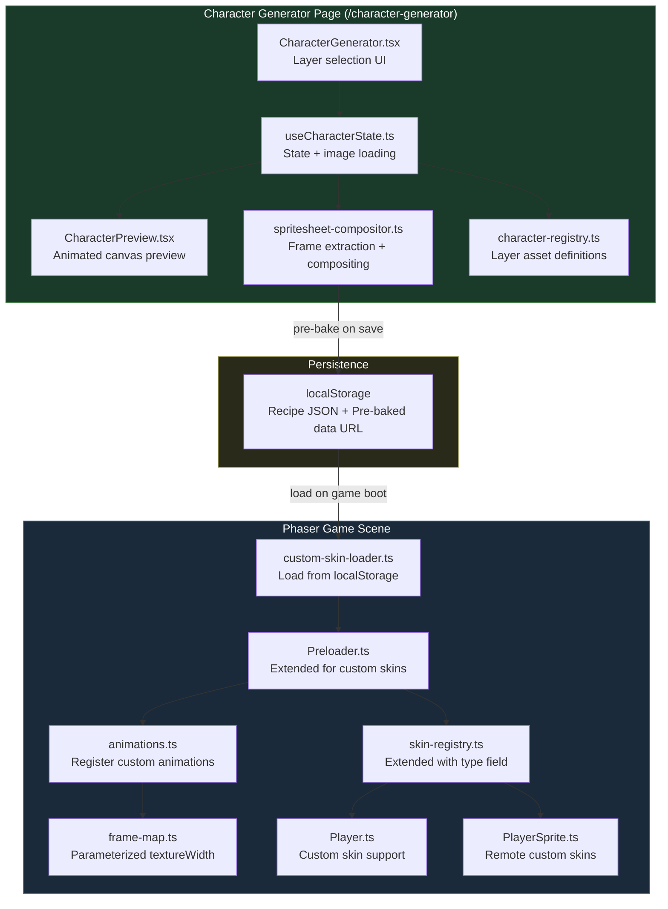
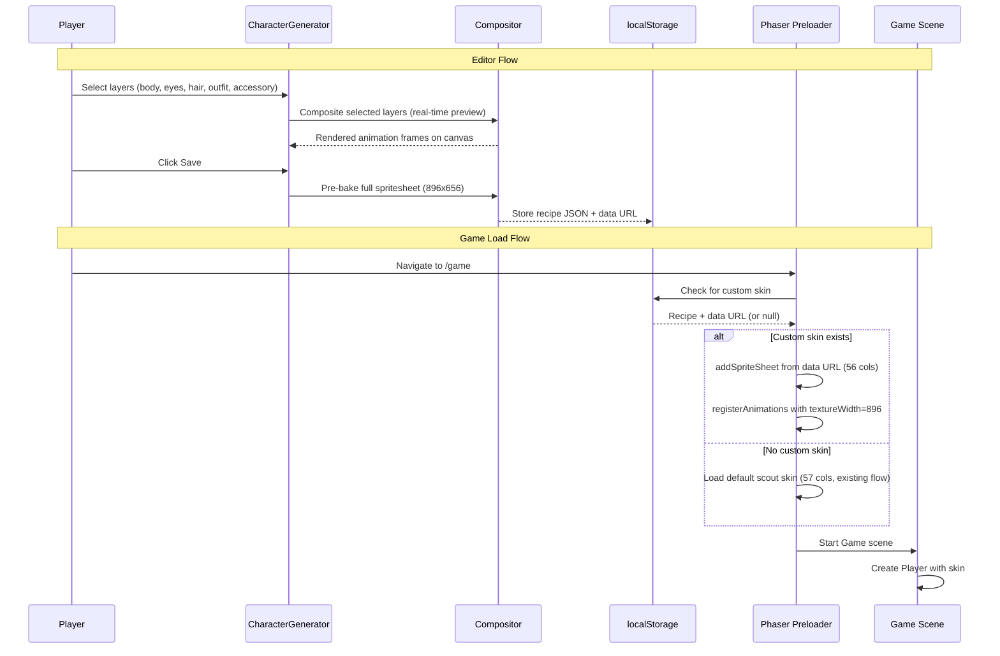

# Character Generator Design Document

## Overview

The Character Generator is a standalone browser-based editor at `/character-generator` that enables players to composite multiple sprite layers (body, eyes, hairstyle, outfit, accessories) into a unique in-game character skin. It uses a pre-bake hybrid approach: real-time canvas compositing for editor preview, and a single pre-baked spritesheet for game rendering with zero runtime overhead. The feature integrates with the existing Phaser skin system and Colyseus multiplayer protocol.

## Design Summary (Meta)

```yaml
design_type: "new_feature"
risk_level: "medium"
complexity_level: "high"
complexity_rationale: >
  (1) FR-4 (column count mismatch between 57-col body and 56-col overlays) requires
  per-layer frame extraction logic. FR-5 (pre-bake) requires full-sheet canvas
  compositing producing a Phaser-compatible spritesheet. FR-7 (Phaser integration)
  requires runtime texture registration with parameterized frame-map. FR-14 (multiplayer
  recipe sync) requires extending Colyseus PlayerState and client-side baking.
  (2) Constraints: body sheets (927px, 57 cols) vs overlay sheets (896px, 56 cols)
  create a structural mismatch in frame extraction. The pre-baked output must be
  pixel-compatible with the existing scout skin animation system. localStorage size
  limits constrain persistence strategy.
main_constraints:
  - "Body sheets 927px (57 cols) vs overlay sheets 896px (56 cols) column mismatch"
  - "Pre-baked output must work with existing Phaser animation frame-map"
  - "localStorage only for persistence (5-10MB browser limit)"
  - "Zero runtime compositing overhead in game scene"
  - "CSS Modules only for styling (no Tailwind, no styled-components)"
biggest_risks:
  - "Column mismatch causes frame misalignment in composited spritesheet"
  - "Pre-baked spritesheet incompatible with Phaser animation definitions"
  - "Multiplayer recipe sync adds latency to player join"
unknowns:
  - "Exact pixel layout of scout sheets vs character generator sheets (16px indicator row)"
  - "Whether smartphone partial sheets (384x192) cover enough animations to be useful in MVP"
```

## Background and Context

### Prerequisite ADRs

- [ADR-004: Player Entity Architecture](../adr/adr-004-player-entity-architecture.md): Establishes the sprite loading, animation system, and skin registry pattern used by the game.
- [ADR-005: Multiplayer Position Sync](../adr/adr-005-multiplayer-position-sync.md): Defines the Colyseus PlayerState schema including the `skin` field that this feature extends.

No common ADRs exist in the project yet. The character generator does not introduce cross-cutting concerns that require a common ADR.

### Agreement Checklist

#### Scope

- [x] Standalone `/character-generator` page following portrait-generator pattern
- [x] All adult layers: Body (9), Eyes (7), Hairstyle (29), Outfit (33), Accessory (20)
- [x] Kids layers as Should Have: Body (4), Eyes (6), Hairstyle (6), Outfit (7)
- [x] Smartphone and Book layers as Should Have
- [x] Real-time animated preview via canvas compositing
- [x] Pre-bake on save to single spritesheet
- [x] localStorage persistence for recipe and pre-baked spritesheet
- [x] Integration with Phaser skin system (load pre-baked sheet as texture)
- [x] Scout presets retained alongside custom skins
- [x] Manual commit strategy (save button, not auto-save)
- [x] Randomize button
- [x] Lazy asset loading by category

#### Non-Scope (Explicitly not changing)

- [x] Server-side persistence (database storage of recipes)
- [x] In-game modal editor (character editing within Phaser canvas)
- [x] Character trading/sharing between players
- [x] Undo/redo in editor
- [x] Animated GIF export (portrait generator has this, character generator does not)
- [x] Mobile-optimized editor layout
- [x] Existing scout skin rendering pipeline (preserved as-is)
- [x] Server-side spritesheet baking

#### Constraints

- [x] Parallel operation: Not applicable (new feature, no existing feature replaced)
- [x] Backward compatibility: Required -- existing scout skins must continue to work identically
- [x] Performance measurement: Pre-bake under 2 seconds, preview update under 100ms

#### Agreement reflection in design

- [x] Standalone page pattern: Section "Main Components > CharacterGeneratorPage"
- [x] Pre-bake hybrid approach: Section "Architecture Overview"
- [x] localStorage only: Section "Data Contract > SkinRecipe"
- [x] Scout presets: Section "Main Components > SkinRegistry extension"
- [x] Manual commit: Section "State Transitions"
- [x] Column mismatch handling: Section "Main Components > SpritesheetCompositor"

### Problem to Solve

Players currently have no control over their character's visual appearance. The game randomly assigns one of 6 pre-made scout skins. A character customization system is needed to support player identity and engagement. The LimeZu Character Generator asset pack provides comprehensive sprite layers that can be composited in-browser.

### Current Challenges

1. **No customization**: Players cannot choose or modify their character appearance.
2. **Column count mismatch**: The asset pack's body sheets (927px, 57 columns) have a different column count from overlay sheets (896px, 56 columns), requiring per-layer frame extraction.
3. **Hardcoded frame-map**: The current `getAnimationDefs()` function uses a hardcoded `TEXTURE_WIDTH = 927` constant, incompatible with the 896px pre-baked output format.
4. **No dynamic texture loading**: The Preloader loads all skins at boot time from static files. Custom skins need runtime texture registration from localStorage data.

### Requirements

#### Functional Requirements

- FR-1: Character Generator page at `/character-generator`
- FR-2: Layer selection UI for all adult categories (body, eyes, hairstyle, outfit, accessory)
- FR-3: Live animated preview with real-time compositing
- FR-4: Per-layer frame extraction handling column count mismatch
- FR-5: Pre-bake spritesheet on save (896x656, 56 columns)
- FR-6: Skin recipe persistence in localStorage
- FR-7: Integration with Phaser skin system
- FR-8: Scout preset skin selection
- FR-9: Randomize button
- FR-10: Lazy asset loading by category

#### Non-Functional Requirements

- **Performance**: Pre-bake under 2 seconds on average desktop hardware; preview update within 100ms of layer change; initial page load FCP under 2 seconds on 4G
- **Scalability**: Layer system supports adding new categories/options without architecture changes
- **Reliability**: Graceful fallback if localStorage unavailable; corrupt recipe recovery to defaults
- **Maintainability**: Pure-data compositing engine with no Phaser dependency; CSS Modules for styling

## Applicable Standards

### Classification Table

| Standard | Type | Source | Impact on Design |
|----------|------|--------|-----------------|
| Prettier: single quotes, 2-space indent | Explicit | `.prettierrc`, `.editorconfig` | All new code must follow formatting rules |
| ESLint flat config with @nx/eslint-plugin | Explicit | `eslint.config.mjs` | Module boundary enforcement, TypeScript rules |
| TypeScript strict mode, ES2022, bundler resolution | Explicit | `tsconfig.base.json` | All new types must satisfy strict mode |
| Next.js App Router with `'use client'` directives | Explicit | `apps/game/next.config.js`, `apps/game/src/app/` | Page components must use App Router conventions |
| Jest for unit tests, Playwright for E2E | Explicit | `jest.config.cts`, `playwright.config.ts` | Tests follow existing framework patterns |
| CI pipeline: lint, test, build, typecheck, e2e | Explicit | `.github/workflows/ci.yml` | All changes must pass CI |
| CSS Modules for component styling | Implicit | `apps/game/src/components/portrait-generator/PortraitGenerator.module.css` | New components use `.module.css` files |
| `@/*` path alias for imports | Implicit | `tsconfig.json` paths config + existing code | All imports within game app use `@/` prefix |
| Pure-data modules without Phaser dependency | Implicit | `frame-map.ts` (documented: "Pure data module with NO Phaser dependency") | Compositing engine must be Phaser-independent |
| Component pattern: page.tsx delegates to component | Implicit | `portrait-generator/page.tsx` -> `PortraitGenerator` component | Character generator page follows same pattern |
| Custom hook pattern for state management | Implicit | `usePortraitState.ts` | Character generator uses `useCharacterState` hook |
| Image caching with Map-based cache | Implicit | `portrait-canvas.ts` `imageCache` | Reuse existing image loading utilities or follow pattern |
| Skin registry as readonly array with lookup functions | Implicit | `skin-registry.ts` `SKIN_REGISTRY` | Extend registry pattern for custom skins |

**Gate Rule satisfied**: 6 explicit standards and 7 implicit standards identified.

## Acceptance Criteria (AC) - EARS Format

### Layer Selection and Preview (FR-2, FR-3)

- [ ] **AC-1**: **When** the player navigates to `/character-generator`, the system shall display the character editor with a preview panel showing a default character (first body + first eyes + first hairstyle + first outfit) with idle animation playing.
- [ ] **AC-2**: **When** the player selects a different option in any layer category, the system shall update the animated preview within 100ms showing the new layer composited with all other selected layers.
- [ ] **AC-3**: The Body layer shall always be required (cannot be deselected). Eyes, hairstyle, outfit, and accessory layers shall be individually optional.
- [ ] **AC-4**: **When** the player opens a category panel, the system shall display all available options as selectable thumbnails. Only one option per category shall be active at a time.

### Frame Extraction and Compositing (FR-4)

- [ ] **AC-5**: **When** compositing a body frame (57-column sheet) with an overlay frame (56-column sheet), the system shall extract each frame using its sheet-specific column count, then composite them at the correct animation position without misalignment.
- [ ] **AC-6**: The compositing engine shall produce pixel-identical results to manually layering the individual PNG files in an image editor (verified by unit tests comparing output ImageData).

### Pre-Bake and Persistence (FR-5, FR-6)

- [ ] **AC-7**: **When** the player clicks Save, the system shall composite all selected layers into a single 896x656 PNG spritesheet and store it as a data URL in localStorage alongside the recipe JSON.
- [ ] **AC-8**: The pre-baking process shall complete in under 2 seconds on average desktop hardware.
- [ ] **AC-9**: **When** the player revisits `/character-generator`, the system shall load the saved recipe from localStorage and pre-populate all layer selections.

### Phaser Integration (FR-7)

- [ ] **AC-10**: **When** the game loads and a custom skin exists in localStorage, the system shall register the pre-baked spritesheet as a Phaser texture and use it for the local player character. All 7 animation states (idle, waiting, walk, sit, hit, punch, hurt) in all applicable directions shall play correctly.
- [ ] **AC-11**: **When** no custom skin exists in localStorage, the game shall behave identically to the current scout skin system with no regression.

### Scout Presets (FR-8)

- [ ] **AC-12**: **When** the player selects a scout preset (e.g., `scout_3`), the system shall set the skin type to "preset" and the game shall load the corresponding pre-made spritesheet exactly as in the current system.
- [ ] **AC-13**: Selecting a scout preset shall not delete custom skin data from localStorage (the custom skin can be restored later).

### Randomize (FR-9)

- [ ] **AC-14**: **When** the player clicks Randomize, the system shall randomly select valid options for every layer category and update the preview immediately with the fully composited character.

### Lazy Loading (FR-10)

- [ ] **AC-15**: **When** the page loads, the system shall fetch fewer than 20 individual spritesheet files (only the assets needed for the default character display).
- [ ] **AC-16**: **When** the player opens a new category panel, the system shall load that category's assets on-demand with a visible loading indicator.

## Existing Codebase Analysis

### Implementation Path Mapping

| Type | Path | Description |
|------|------|-------------|
| Existing | `apps/game/src/app/portrait-generator/page.tsx` | Portrait generator page (pattern reference) |
| Existing | `apps/game/src/components/portrait-generator/` | Portrait generator components (pattern reference) |
| Existing | `apps/game/src/game/characters/frame-map.ts` | Animation frame index computation (needs parameterization) |
| Existing | `apps/game/src/game/characters/skin-registry.ts` | Skin definitions registry (needs extension) |
| Existing | `apps/game/src/game/characters/animations.ts` | Phaser animation registration (needs custom skin support) |
| Existing | `apps/game/src/game/scenes/Preloader.ts` | Asset preloading (needs custom skin loading) |
| Existing | `apps/game/src/game/entities/Player.ts` | Local player entity (needs custom skin support) |
| Existing | `apps/game/src/game/entities/PlayerSprite.ts` | Remote player sprite (needs custom skin support) |
| Existing | `apps/game/src/game/constants.ts` | Game constants (FRAME_SIZE, CHARACTER_FRAME_HEIGHT) |
| Existing | `packages/shared/src/types/room.ts` | Colyseus PlayerState (skin field) |
| Existing | `packages/shared/src/constants.ts` | SkinKey type and AVAILABLE_SKINS |
| New | `apps/game/src/app/character-generator/page.tsx` | Character generator page |
| New | `apps/game/src/components/character-generator/` | Character generator components |
| New | `apps/game/src/components/character-generator/types.ts` | Type definitions |
| New | `apps/game/src/components/character-generator/character-registry.ts` | Layer asset registry |
| New | `apps/game/src/components/character-generator/spritesheet-compositor.ts` | Compositing engine |
| New | `apps/game/src/components/character-generator/useCharacterState.ts` | State management hook |
| New | `apps/game/src/components/character-generator/CharacterPreview.tsx` | Animated preview component |
| New | `apps/game/src/components/character-generator/CharacterGenerator.tsx` | Main editor component |
| New | `apps/game/src/components/character-generator/LayerPanel.tsx` | Layer selection UI |
| New | `apps/game/src/components/character-generator/CharacterGenerator.module.css` | Styles |
| New | `apps/game/src/game/characters/custom-skin-loader.ts` | Custom skin loading for Phaser |

### Similar Functionality Search

**Search results**:
- Portrait generator (`/portrait-generator`): Similar canvas compositing pattern but for 32x32 portrait frames, not 16x32 game sprites. Different frame layout, different output format. **Decision**: Use as architectural reference but implement new compositing engine for the different spritesheet format.
- `portrait-canvas.ts` image loading utilities: `loadImage()` and `preloadImages()` provide image caching. **Decision**: Reuse these utilities in the character generator (import from portrait-canvas or extract to shared utility).
- Skin registry pattern: `skin-registry.ts` provides `SkinDefinition`, `getSkins()`, `getDefaultSkin()`, `getSkinByKey()`. **Decision**: Extend with `type` field and custom skin support.
- Frame-map module: `frame-map.ts` provides `getAnimationDefs()` with hardcoded `TEXTURE_WIDTH = 927`. **Decision**: Parameterize to accept variable texture width.

### Integration Points

- **Phaser Preloader**: Must detect and load custom skin from localStorage at boot
- **Player entity**: Must support both preset and custom skin types
- **PlayerSprite**: Must support rendering remote players with custom skins (via recipe baking)
- **Colyseus PlayerState**: `skin` field must transmit recipe JSON for custom skins
- **SkinRegistry**: Must return custom skin definition alongside preset skins

### Code Inspection Evidence

#### What Was Examined

| File Inspected | Key Finding | Design Impact |
|---------------|-------------|---------------|
| `apps/game/src/game/characters/frame-map.ts` (full file, 239 lines) | `TEXTURE_WIDTH = 927` hardcoded; `getAnimationDefs()` does not accept width parameter; `computeColumnsPerRow()` is exported and parameterizable | Must parameterize `getAnimationDefs()` to accept `textureWidth` parameter for 896px custom sheets |
| `apps/game/src/game/characters/skin-registry.ts` (full file, 76 lines) | `SkinDefinition` has `key`, `sheetPath`, `sheetKey` fields; `SKIN_REGISTRY` is a readonly array; no support for custom/dynamic skins | Extend `SkinDefinition` with optional `type` and `textureWidth` fields; add functions for custom skin registration |
| `apps/game/src/game/characters/animations.ts` (full file, 50 lines) | `registerAnimations()` calls `getAnimationDefs()` with `'scout'` hardcoded as skinKey; derives `colsPerRow` from actual texture width at runtime | Good: already parameterized for texture width. Bad: skinKey hardcoded to `'scout'` |
| `apps/game/src/game/scenes/Preloader.ts` (full file, 57 lines) | Loads all skins from `getSkins()` as spritesheets; registers animations in `create()`; no support for data URL textures | Must add custom skin loading path: check localStorage, create texture from data URL |
| `apps/game/src/game/entities/Player.ts` (full file, 134 lines) | Calls `getDefaultSkin()` in constructor; uses `skin.sheetKey` for sprite texture | Must check for custom skin first, fall back to default scout |
| `apps/game/src/game/entities/PlayerSprite.ts` (full file, 160 lines) | Receives `skinKey` in constructor; calls `getSkinByKey()` | Must handle custom skin keys for remote players |
| `apps/game/src/components/portrait-generator/portrait-canvas.ts` (full file, 103 lines) | `loadImage()` with Map-based cache, `drawFrame()` compositing | Reuse `loadImage()` pattern; implement new frame extraction for different sheet layout |
| `apps/game/src/components/portrait-generator/usePortraitState.ts` (full file, 117 lines) | State hook pattern with `useState`, `useCallback`, `useEffect` for image loading | Follow same pattern for `useCharacterState` |
| `packages/shared/src/types/room.ts` (full file, 15 lines) | `PlayerState.skin` is `string` type | Can transmit recipe JSON as string (no schema change needed) |
| `packages/shared/src/constants.ts` (full file, 26 lines) | `SkinKey` is union type of 6 scout keys; `AVAILABLE_SKINS` is array | Must extend `SkinKey` or keep it for presets only |

**Files inspected**: 10 / 10 in affected area (100%)

#### Key Findings

1. **frame-map.ts is almost ready**: The `computeColumnsPerRow()` function is already exported and parameterized. Only `getAnimationDefs()` needs a `textureWidth` parameter added.
2. **animations.ts has a hardcoded skinKey**: The `registerAnimations()` function passes `'scout'` to `getAnimationDefs()` regardless of actual skin. This is a bug that happens to work because all current skins are scouts.
3. **Preloader is synchronous**: It loads skins during `preload()` and registers animations in `create()`. Custom skin loading from localStorage (which involves `addBase64` or `addCanvas` which may be async) needs careful integration.
4. **PlayerState.skin is already a string**: No Colyseus schema change needed. Custom skins can transmit recipe JSON as the skin value. Remote clients parse the string to determine if it is a preset key or a recipe JSON.
5. **loadImage utility is reusable**: The `portrait-canvas.ts` `loadImage()` function with its Map-based cache can be extracted or imported for the character generator.

#### How Findings Influence Design

- The frame-map parameterization is a minimal, backward-compatible change (add optional parameter with default value of 927).
- The animations.ts `skinKey` hardcoding should be fixed as part of this feature (pass actual skin key instead of `'scout'`).
- Custom skin loading must happen before `Preloader.create()` calls `registerAnimations()`, or animations must be registered separately after async loading.
- Recipe-as-string in PlayerState.skin avoids Colyseus schema migration.

## Design

### Change Impact Map

```yaml
Change Target: Character Generator feature + Phaser skin integration
Direct Impact:
  - apps/game/src/game/characters/frame-map.ts (add textureWidth parameter to getAnimationDefs)
  - apps/game/src/game/characters/skin-registry.ts (extend SkinDefinition, add custom skin functions)
  - apps/game/src/game/characters/animations.ts (fix hardcoded skinKey, support custom sheets)
  - apps/game/src/game/scenes/Preloader.ts (add custom skin loading from localStorage)
  - apps/game/src/game/entities/Player.ts (check for custom skin in constructor)
  - apps/game/src/game/entities/PlayerSprite.ts (handle custom skin keys for remote players)
  - packages/shared/src/constants.ts (extend SkinKey type - optional, for type safety)
Indirect Impact:
  - apps/game/src/game/multiplayer/PlayerManager.ts (recipe parsing for remote custom skins)
  - apps/game/src/game/scenes/Game.ts (pass skin info to PlayerManager)
No Ripple Effect:
  - Map generation system (mapgen/)
  - Terrain system
  - Input system
  - Game HUD components
  - Portrait generator (separate feature, no shared state)
  - Authentication system
  - E2E tests (no game rendering tests exist)
```

### Architecture Overview



### Data Flow



### Integration Point Map

```yaml
## Integration Point Map
Integration Point 1:
  Existing Component: Preloader.create() - skin loading and animation registration
  Integration Method: Add custom skin detection before existing scout loading
  Impact Level: High (Process Flow Change)
  Required Test Coverage: Verify both custom and preset skins load correctly

Integration Point 2:
  Existing Component: frame-map.getAnimationDefs() - animation frame computation
  Integration Method: Add optional textureWidth parameter (backward compatible)
  Impact Level: Medium (Data Usage - different column count)
  Required Test Coverage: Unit test frame indices for both 57-col and 56-col configurations

Integration Point 3:
  Existing Component: skin-registry.getSkinByKey() - skin lookup
  Integration Method: Extend SkinDefinition interface, add custom skin functions
  Impact Level: Medium (Data Usage)
  Required Test Coverage: Verify lookup works for both preset and custom skins

Integration Point 4:
  Existing Component: Player constructor - skin selection
  Integration Method: Check localStorage for custom skin before using default
  Impact Level: High (Process Flow Change)
  Required Test Coverage: Verify correct skin applied in both scenarios

Integration Point 5:
  Existing Component: PlayerManager/PlayerSprite - remote player rendering
  Integration Method: Parse skin field to detect recipe JSON vs preset key
  Impact Level: High (Process Flow Change)
  Required Test Coverage: Verify remote players render with both skin types
```

### Main Components

#### 1. SpritesheetCompositor (`spritesheet-compositor.ts`)

- **Responsibility**: Pure-data module for frame extraction and multi-layer compositing. Handles the column count mismatch between body (57 cols) and overlay (56 cols) sheets. Produces composited frames for preview and full pre-baked spritesheets for game use.
- **Interface**:
  ```typescript
  /** Configuration for a single sprite layer. */
  interface LayerConfig {
    image: HTMLImageElement;
    /** Number of columns in this layer's spritesheet. */
    columns: number;
    /** Width of the spritesheet in pixels. */
    sheetWidth: number;
    /** Height of the spritesheet in pixels. */
    sheetHeight: number;
  }

  /** Frame dimensions for extraction. */
  interface FrameDimensions {
    frameWidth: number;   // 16
    frameHeight: number;  // 32
  }

  /**
   * Extract a single frame from a layer's spritesheet.
   *
   * Uses per-layer column count to compute the correct source
   * rectangle, handling the 57-col vs 56-col mismatch.
   */
  function extractFrame(
    layer: LayerConfig,
    row: number,
    col: number,
    dims: FrameDimensions
  ): { sx: number; sy: number; sw: number; sh: number };

  /**
   * Draw a single composited frame to a canvas context.
   * Layers are drawn bottom-to-top in array order.
   */
  function drawCompositeFrame(
    ctx: CanvasRenderingContext2D,
    layers: LayerConfig[],
    row: number,
    col: number,
    dims: FrameDimensions,
    scale: number
  ): void;

  /**
   * Pre-bake all layers into a single normalized spritesheet.
   * Output: 896x656 canvas (56 columns x 20.5 rows at 16x32).
   *
   * For each frame position in the output grid, extracts the
   * corresponding frame from each layer (using that layer's
   * column count) and composites them.
   */
  function prebakeSpritesheet(
    layers: LayerConfig[],
    dims: FrameDimensions
  ): HTMLCanvasElement;
  ```
- **Dependencies**: None (pure data module, no Phaser or React dependency)

**Column mismatch handling strategy**:

The body sheet is 927px wide (57 columns at 16px). Overlay sheets are 896px wide (56 columns). Animation frames occupy the leftmost 24 columns (6 frames x 4 directions). Since 24 < 56 < 57, all animation content fits within both sheet widths.

For the pre-baked output (896px, 56 columns):
1. For each output frame position (row, col) where col < 56:
   - Extract body frame at (row, col) using 57-column indexing
   - Extract overlay frame at (row, col) using 56-column indexing
   - Composite overlay on top of body
2. Columns 56+ from the body sheet are discarded (they contain no animation data used by the game)

This produces a 56-column output that is compatible with the frame-map when `textureWidth = 896`.

#### 2. CharacterGeneratorPage (`page.tsx`)

- **Responsibility**: Next.js App Router page at `/character-generator`. Thin wrapper that renders the `CharacterGenerator` component with `'use client'` directive.
- **Interface**: Default export React component
- **Dependencies**: `CharacterGenerator` component

#### 3. CharacterGenerator (`CharacterGenerator.tsx`)

- **Responsibility**: Main editor component. Renders the preview panel, layer selection UI, scout presets panel, and action buttons (Save, Randomize).
- **Interface**: React component using `useCharacterState` hook
- **Dependencies**: `useCharacterState`, `CharacterPreview`, `LayerPanel`, `character-registry`

#### 4. useCharacterState (`useCharacterState.ts`)

- **Responsibility**: State management hook. Manages selected layers, loads images, drives preview updates, handles save (pre-bake + localStorage), and handles load (restore from localStorage).
- **Interface**:
  ```typescript
  interface CharacterState {
    type: 'custom' | 'preset';
    body: LayerOption;
    eyes: LayerOption | null;
    hairstyle: LayerOption | null;
    outfit: LayerOption | null;
    accessory: LayerOption | null;
    smartphone: LayerOption | null;
    book: LayerOption | null;
    isKid: boolean;
    presetSkin: string | null;  // e.g. 'scout_3'
  }

  interface UseCharacterStateReturn {
    state: CharacterState;
    setLayer: (category: LayerCategory, option: LayerOption | null) => void;
    setPreset: (skinKey: string) => void;
    randomize: () => void;
    save: () => Promise<void>;
    layerImages: Map<LayerCategory, HTMLImageElement>;
    isLoading: boolean;
    isSaving: boolean;
    hasUnsavedChanges: boolean;
  }
  ```
- **Dependencies**: `character-registry`, `spritesheet-compositor`, `portrait-canvas` (loadImage utility)

#### 5. CharacterPreview (`CharacterPreview.tsx`)

- **Responsibility**: Animated canvas preview. Uses `requestAnimationFrame` to cycle through idle animation frames, compositing all selected layers in real-time.
- **Interface**: React component accepting `layerImages`, `animationState`, `direction`, `scale`
- **Dependencies**: `spritesheet-compositor`

#### 6. character-registry (`character-registry.ts`)

- **Responsibility**: Registry of all available layer options. Defines asset paths, display names, grouping, and color variants for each category.
- **Interface**:
  ```typescript
  type LayerCategory = 'body' | 'eyes' | 'hairstyle' | 'outfit' | 'accessory' | 'smartphone' | 'book';

  interface LayerOption {
    id: string;
    category: LayerCategory;
    path: string;
    displayName: string;
    group?: string;
    variant?: string;
    columns: number;      // 57 for body, 56 for overlays
    sheetWidth: number;    // 927 for body, 896 for overlays
    sheetHeight: number;   // 656 for full sheets
  }

  function getLayerOptions(category: LayerCategory, isKid?: boolean): LayerOption[];
  function getDefaultOptions(): Record<LayerCategory, LayerOption | null>;
  ```
- **Dependencies**: None (pure data)

#### 7. SkinRegistry Extension (`skin-registry.ts` modification)

- **Responsibility**: Extend `SkinDefinition` to support custom skins with different texture widths.
- **Interface change**:
  ```typescript
  interface SkinDefinition {
    key: string;
    sheetPath: string;
    sheetKey: string;
    type: 'preset' | 'custom';  // NEW
    textureWidth: number;        // NEW: 927 for scouts, 896 for custom
  }
  ```
- **Dependencies**: None

#### 8. custom-skin-loader (`custom-skin-loader.ts`)

- **Responsibility**: Load custom skin from localStorage into Phaser's TextureManager. Handles the async nature of `addBase64` or canvas-based texture creation.
- **Interface**:
  ```typescript
  interface CustomSkinData {
    recipe: SkinRecipe;
    dataUrl: string;
  }

  /** Check localStorage for a custom skin. */
  function getCustomSkinData(): CustomSkinData | null;

  /**
   * Load the custom skin into Phaser's TextureManager.
   * Returns the SkinDefinition for the loaded custom skin.
   */
  function loadCustomSkin(
    scene: Phaser.Scene,
    data: CustomSkinData
  ): Promise<SkinDefinition>;
  ```
- **Dependencies**: Phaser TextureManager

### Contract Definitions

```typescript
// ---- Skin Recipe (stored in localStorage) ----

interface SkinRecipe {
  type: 'custom';
  body: string;       // e.g. 'Body_03'
  eyes: string | null;
  hairstyle: string | null;
  outfit: string | null;
  accessory: string | null;
  smartphone: string | null;
  book: string | null;
  isKid: boolean;
}

interface PresetSkinRecipe {
  type: 'preset';
  skin: string;       // e.g. 'scout_3'
}

type StoredSkin = SkinRecipe | PresetSkinRecipe;

// localStorage keys
const SKIN_RECIPE_KEY = 'nookstead:skin:recipe';
const SKIN_SHEET_KEY = 'nookstead:skin:sheet';

// ---- Compositing output ----

interface PreBakeResult {
  canvas: HTMLCanvasElement;   // 896x656
  dataUrl: string;             // PNG data URL
  recipe: SkinRecipe;
}
```

### Data Contract

#### SpritesheetCompositor

```yaml
Input:
  Type: LayerConfig[] (array of loaded layer images with metadata)
  Preconditions:
    - All images must be fully loaded (img.complete === true)
    - Body layer must always be first in array
    - Each layer must have correct columns and sheetWidth
  Validation: Check image dimensions match declared sheetWidth/sheetHeight

Output:
  Type: HTMLCanvasElement (896x656) or individual frame rendering
  Guarantees:
    - Output canvas is exactly 896x656 pixels
    - All animation frames composited correctly with layer z-order preserved
    - Body-only columns (cols 56+) are excluded from output
  On Error: Throw Error with descriptive message (never return partial result)

Invariants:
  - Frame extraction always uses per-layer column count (not a global constant)
  - Layer draw order: body (bottom) -> eyes -> outfit -> hairstyle -> accessory (top)
```

#### custom-skin-loader

```yaml
Input:
  Type: CustomSkinData (recipe JSON + data URL string from localStorage)
  Preconditions:
    - data URL must be a valid PNG data URL
    - Phaser scene must be active
  Validation: Verify data URL starts with 'data:image/png;base64,'

Output:
  Type: Promise<SkinDefinition>
  Guarantees:
    - Texture is registered in Phaser TextureManager with key 'custom-skin'
    - SkinDefinition has type='custom', textureWidth=896
    - Animations are registered for all 27 states
  On Error: Log error, return null (game falls back to default scout skin)

Invariants:
  - Only one custom skin texture exists at a time (previous is removed if re-loaded)
```

### Data Representation Decisions

| Data Structure | Decision | Rationale |
|---|---|---|
| `SkinRecipe` | **New** dedicated type | No existing type represents a multi-layer character configuration. The portrait generator's `PortraitState` is for 32x32 portraits with different layer categories. Creating a new type avoids conflating two different domain concepts. |
| `LayerOption` | **New** type, inspired by `PortraitPiece` | Similar to `PortraitPiece` (id, category, path, displayName, group, variant) but adds `columns`, `sheetWidth`, `sheetHeight` for frame extraction. The portrait's `PortraitPiece` doesn't have these fields and adding them would be inappropriate for the portrait domain. Semantic fit: different concept (game spritesheet layer vs portrait layer). |
| `SkinDefinition` | **Extend** existing type | The existing `SkinDefinition` in `skin-registry.ts` represents exactly the right concept (a loadable character skin). Adding `type` and `textureWidth` fields extends it to support custom skins while preserving backward compatibility. All existing consumers receive the new fields with sensible defaults. |
| `CharacterState` | **New** type | No existing type manages the editor's multi-category selection state. The portrait's `PortraitState` has different categories and no save/preset logic. |
| `CustomSkinData` | **New** type | No existing type pairs a recipe with a baked data URL for localStorage retrieval. Small, focused, and specific to the custom skin loading concern. |

### Field Propagation Map

```yaml
fields:
  - name: "skin recipe"
    origin: "Character Generator UI (user layer selections)"
    transformations:
      - layer: "useCharacterState hook"
        type: "CharacterState"
        validation: "body required, other layers optional, isKid boolean"
      - layer: "Save action"
        type: "SkinRecipe (JSON)"
        transformation: "Extract layer IDs from CharacterState, serialize to JSON"
      - layer: "localStorage"
        type: "string (JSON)"
        transformation: "JSON.stringify"
      - layer: "Phaser Preloader"
        type: "SkinRecipe (parsed JSON)"
        transformation: "JSON.parse, validate type field"
      - layer: "Colyseus PlayerState.skin"
        type: "string (JSON or preset key)"
        transformation: "Serialize recipe JSON as string for transmission"
      - layer: "Remote client PlayerManager"
        type: "SkinRecipe (parsed)"
        transformation: "JSON.parse, detect type, bake if custom"
    destination: "Phaser TextureManager (registered as spritesheet texture)"
    loss_risk: "low"
    loss_risk_reason: "Recipe JSON is a simple key-value structure with string fields. Only risk is recipe referencing assets that no longer exist (mitigated by fallback to defaults)."

  - name: "pre-baked spritesheet data URL"
    origin: "SpritesheetCompositor.prebakeSpritesheet()"
    transformations:
      - layer: "Pre-bake action"
        type: "HTMLCanvasElement (896x656)"
        validation: "canvas dimensions === 896x656"
      - layer: "Canvas export"
        type: "string (data:image/png;base64,...)"
        transformation: "canvas.toDataURL('image/png')"
      - layer: "localStorage"
        type: "string"
        transformation: "direct storage"
      - layer: "Phaser Preloader"
        type: "Image element"
        transformation: "Create Image, set src to data URL, await load"
      - layer: "Phaser TextureManager"
        type: "Phaser.Textures.Texture"
        transformation: "addSpriteSheet(key, img, { frameWidth: 16, frameHeight: 32 })"
    destination: "Phaser sprite rendering"
    loss_risk: "low"
    loss_risk_reason: "Data URL is a lossless PNG encoding. The only risk is localStorage eviction (mitigated by checking on load)."
```

### State Transitions

```yaml
State Definition:
  - Initial State: Editor loads -> check localStorage -> either "editing_saved" or "editing_new"
  - Possible States:
    - editing_new: No saved recipe, default layers selected
    - editing_saved: Loaded from localStorage, layers pre-populated
    - editing_modified: Changes made since last save (hasUnsavedChanges = true)
    - saving: Pre-bake in progress
    - saved: Successfully saved to localStorage

State Transitions:
  editing_new -> editing_modified: User changes any layer
  editing_saved -> editing_modified: User changes any layer
  editing_modified -> saving: User clicks Save
  saving -> saved: Pre-bake completes successfully
  saving -> editing_modified: Pre-bake fails (stay in modified state, show error)
  saved -> editing_modified: User changes any layer after save
  (any state) -> editing_modified: User clicks Randomize

System Invariants:
  - Preview always reflects current layer selections (regardless of save state)
  - Save button is enabled only when hasUnsavedChanges === true
  - Body layer is never null
  - At most one held item (smartphone OR book, not both)
```

### Integration Points List

| Integration Point | Location | Old Implementation | New Implementation | Switching Method |
|-------------------|----------|-------------------|-------------------|------------------|
| Animation frame computation | `frame-map.ts:getAnimationDefs()` | Hardcoded `TEXTURE_WIDTH = 927` | Accept optional `textureWidth` param, default 927 | Backward-compatible parameter addition |
| Skin loading | `Preloader.preload()` | Load all skins from `getSkins()` file paths | Check localStorage first, load custom skin, then load presets | Conditional branch before existing code |
| Animation registration | `animations.ts:registerAnimations()` | Hardcoded `'scout'` as skinKey | Pass actual skin key from `SkinDefinition` | Parameter change |
| Player skin selection | `Player.ts:constructor()` | Always `getDefaultSkin()` | Check for custom skin, fall back to default | Conditional + function call |
| Remote player skin | `PlayerSprite.ts:constructor()` | `getSkinByKey(skinKey)` | Parse skinKey, detect recipe JSON, bake or lookup | Recipe detection logic |
| Multiplayer skin field | `PlayerState.skin` (shared types) | Scout key string (`'scout_1'`) | JSON string for custom skins, scout key for presets | String format detection |

### Integration Boundary Contracts

```yaml
Boundary 1: Editor -> localStorage
  Input: SkinRecipe JSON + PNG data URL string
  Output: void (sync write)
  On Error: Catch QuotaExceededError, display user message

Boundary 2: localStorage -> Phaser Preloader
  Input: Read SKIN_RECIPE_KEY and SKIN_SHEET_KEY from localStorage
  Output: SkinDefinition with loaded texture (async)
  On Error: Return null, fall back to default scout skin

Boundary 3: Phaser TextureManager <- Data URL
  Input: PNG data URL string
  Output: Registered Phaser Texture with spritesheet frames (async via addBase64)
  On Error: Log error, fall back to default scout

Boundary 4: Colyseus PlayerState.skin <- skin identifier
  Input: String (preset key 'scout_3' OR JSON recipe string)
  Output: String stored in PlayerState.skin field (sync)
  On Error: N/A (string assignment)

Boundary 5: Remote client <- PlayerState.skin
  Input: String from remote PlayerState
  Output: Rendered PlayerSprite with correct skin (async if baking needed)
  On Error: Use default scout skin for remote player, log warning
```

### Interface Change Impact Analysis

| Existing Operation | New Operation | Conversion Required | Adapter Required | Compatibility Method |
|-------------------|---------------|-------------------|------------------|---------------------|
| `getAnimationDefs(skinKey, sheetKey)` | `getAnimationDefs(skinKey, sheetKey, textureWidth?)` | None | Not Required | Optional parameter with default value |
| `registerAnimations(scene, sheetKey, textureWidth, frameWidth)` | No change (already parameterized) | None | Not Required | - |
| `getSkins(): SkinDefinition[]` | `getSkins(): SkinDefinition[]` (includes custom skin if registered) | None | Not Required | Extended return value |
| `getDefaultSkin()` | `getActiveSkin(): SkinDefinition` (checks custom first) | Yes | Not Required | New function, old function kept for backward compatibility |
| `getSkinByKey(key)` | `getSkinByKey(key)` (extended to find custom skin) | None | Not Required | Internal extension |
| `PlayerState.skin: string` | `PlayerState.skin: string` (no schema change) | None | Not Required | Value format detection |

### Error Handling

| Error Scenario | Handling Strategy |
|---|---|
| localStorage unavailable (private browsing) | Display message "Saving is not available in private browsing mode". Editor functions for preview only. |
| localStorage quota exceeded | Catch `QuotaExceededError`, display message "Storage is full. Clear browser data to save." |
| Corrupt recipe in localStorage | Validate recipe JSON on load. If invalid, delete stored data and start with defaults. Log warning. |
| Asset image fails to load | Display placeholder frame, log error. Allow user to select different option. |
| Pre-bake produces invalid output | Validate canvas dimensions before storing. If wrong, show error and do not save. |
| Data URL fails to load as Phaser texture | Catch error in custom-skin-loader, log, fall back to default scout skin. |
| Remote player recipe references unknown assets | Attempt to bake with available assets. Missing layers produce transparent frames. Fall back to scout skin if body layer missing. |

### Logging and Monitoring

- **Editor actions**: `console.info` for save, load, randomize operations (development aid)
- **Compositing performance**: `console.info` with timing for pre-bake operations
- **Phaser integration**: Existing `console.info` pattern in `registerAnimations()` extended to log custom skin loading
- **Error conditions**: `console.error` for all error handling paths (failed loads, invalid data)

## Implementation Plan

### Implementation Approach

**Selected Approach**: Vertical Slice (Feature-driven)

**Selection Reason**: The character generator is a self-contained feature with a clear user-facing value at each milestone. Dependencies between layers (compositing engine -> preview -> pre-bake -> Phaser integration) form a natural vertical stack. Each slice produces a testable, demonstrable artifact:

1. First slice: Compositing engine + basic preview = visible character compositing
2. Second slice: Full editor UI + save = complete editor experience
3. Third slice: Phaser integration = custom skin appears in game
4. Fourth slice: Multiplayer sync = other players see custom skin

This approach delivers user value incrementally and allows early validation of the critical compositing logic.

### Technical Dependencies and Implementation Order

#### Required Implementation Order

1. **SpritesheetCompositor (compositing engine)**
   - Technical Reason: Core algorithm that everything depends on. Frame extraction logic for the column mismatch must be validated first.
   - Dependent Elements: CharacterPreview (for rendering), pre-bake (for saving), custom-skin-loader (for game integration)

2. **frame-map.ts parameterization**
   - Technical Reason: Required before the pre-baked spritesheet can be loaded into Phaser with the correct animation frame indices.
   - Prerequisites: None (backward-compatible change)

3. **skin-registry.ts extension**
   - Technical Reason: Required for both the Preloader and Player entity to understand custom skins.
   - Prerequisites: None (additive change)

4. **Character Generator UI + Preview**
   - Technical Reason: Needs compositor for rendering, needs registry for layer options.
   - Prerequisites: SpritesheetCompositor, character-registry

5. **Pre-bake + localStorage persistence**
   - Technical Reason: Needs compositor for baking, needs UI for save button.
   - Prerequisites: SpritesheetCompositor, character-registry, UI

6. **custom-skin-loader + Preloader integration**
   - Technical Reason: Needs the parameterized frame-map, extended skin-registry, and saved data in localStorage.
   - Prerequisites: frame-map parameterization, skin-registry extension, pre-bake

7. **Player.ts + PlayerSprite.ts integration**
   - Technical Reason: Needs custom-skin-loader to have registered the texture.
   - Prerequisites: custom-skin-loader

8. **Multiplayer recipe sync**
   - Technical Reason: Needs all game integration to be working first.
   - Prerequisites: All above steps

### Integration Points (E2E Verification)

**Integration Point 1: Compositor + Preview**
- Components: SpritesheetCompositor -> CharacterPreview
- Verification: Load body + overlay images, verify canvas output shows correctly composited character with idle animation

**Integration Point 2: Pre-bake -> localStorage**
- Components: SpritesheetCompositor -> localStorage
- Verification: Click Save, verify recipe JSON and data URL are stored in localStorage with correct dimensions

**Integration Point 3: localStorage -> Phaser**
- Components: custom-skin-loader -> Preloader -> Game
- Verification: Save a custom skin, navigate to `/game`, verify local player renders with custom spritesheet. All animation states work.

**Integration Point 4: Multiplayer skin sync**
- Components: PlayerState.skin -> PlayerManager -> PlayerSprite
- Verification: Two browser tabs, one with custom skin, one with scout. Verify both players see each other's correct skins.

### Migration Strategy

No migration required. This is a purely additive feature:
- Existing scout skins continue to work with no changes (default behavior preserved)
- Custom skin is opt-in via the character generator
- All changes to existing files are backward-compatible (optional parameters, extended interfaces with defaults)
- No database migration (localStorage only)

## Test Strategy

### Basic Test Design Policy

Tests are derived directly from acceptance criteria. Each AC maps to at least one test case. The compositing engine receives the most thorough unit testing due to the critical column mismatch logic.

### Unit Tests

**Focus**: SpritesheetCompositor (highest risk, most complex logic)

1. **Frame extraction correctness** (AC-5, AC-6):
   - Test `extractFrame()` returns correct source coordinates for body (57 cols) and overlay (56 cols) at various row/col positions
   - Test that frame (row=1, col=0) on 57-col sheet returns `{sx: 0, sy: 32, sw: 16, sh: 32}`
   - Test that frame (row=1, col=0) on 56-col sheet returns `{sx: 0, sy: 32, sw: 16, sh: 32}` (same position, both correct)
   - Test boundary: frame at col=55 (last common column) extracts correctly from both sheet widths
   - Test boundary: frame at col=56 (body-only column) extracts correctly from body, not accessed from overlay

2. **Pre-bake output dimensions** (AC-7):
   - Test `prebakeSpritesheet()` produces a canvas of exactly 896x656 pixels
   - Test output has 56 columns and 20 rows of 32px frames (plus the 16px top section)

3. **frame-map parameterization** (AC-10):
   - Test `getAnimationDefs('test', 'test-key')` with default produces 57-column frame indices (backward compatible)
   - Test `getAnimationDefs('test', 'test-key', 896)` produces 56-column frame indices
   - Verify idle_down frames differ between 57-col and 56-col configurations

4. **Skin registry extension**:
   - Test `getSkins()` returns skins with `type` and `textureWidth` fields
   - Test backward compatibility: existing code that reads `key`, `sheetPath`, `sheetKey` still works

5. **Recipe serialization** (AC-9):
   - Test round-trip: create recipe -> serialize to JSON -> parse -> all fields preserved
   - Test validation: invalid recipe (missing body) is detected

### Integration Tests

1. **Compositor with real images** (AC-6):
   - Load actual body and overlay spritesheet PNGs
   - Composite them using `prebakeSpritesheet()`
   - Compare specific pixel values at known frame positions to expected values

2. **localStorage round-trip** (AC-9):
   - Save recipe + data URL to localStorage
   - Read back and verify recipe matches
   - Verify data URL produces a valid image of correct dimensions

### E2E Tests

1. **Editor loads and renders** (AC-1):
   - Navigate to `/character-generator`
   - Verify preview canvas is visible
   - Verify layer selection panels are present

2. **Layer selection updates preview** (AC-2):
   - Select a different body option
   - Verify preview canvas content changes (pixel comparison or visual check)

3. **Save and restore** (AC-7, AC-9):
   - Make layer selections
   - Click Save
   - Reload page
   - Verify selections are restored

4. **Scout preset selection** (AC-12):
   - Select a scout preset
   - Verify preset is stored correctly

### Performance Tests

- **Pre-bake timing** (AC-8): Measure `prebakeSpritesheet()` execution time across 50 random layer combinations. Assert < 2000ms.
- **Preview update latency** (AC-2): Measure time from `setLayer()` call to canvas repaint. Assert < 100ms.

## Security Considerations

No new security concerns. The character generator is a client-side tool:
- No user data is transmitted to a server (localStorage only for MVP)
- The skin recipe transmitted in multiplayer contains only asset identifier strings, not arbitrary code or user-uploaded content
- All assets are served from the game's own `/assets/` directory, no external image loading
- Canvas `toDataURL()` is same-origin safe (all images are same-origin)

## Future Extensibility

1. **Server-side persistence**: When a user account system is established, the recipe and pre-baked spritesheet can be stored server-side. The recipe format includes a `type` field for versioning.
2. **New layer categories**: The `LayerCategory` type and `character-registry.ts` can be extended with new categories without architectural changes.
3. **Different frame sizes**: The 32x32 and 48x48 variants from the asset pack can be supported by parameterizing `FrameDimensions`.
4. **In-game editor modal**: The compositing engine is Phaser-independent and can be embedded in a React overlay within the game page.
5. **Server-side baking**: A Node.js service could use the same compositor with `node-canvas` for CDN-cacheable spritesheets.
6. **IndexedDB storage**: If localStorage limits become a concern with multiple saved characters, IndexedDB offers much larger storage quotas.

## Alternative Solutions

### Alternative 1: Runtime compositing (no pre-bake)

- **Overview**: Instead of pre-baking, load all layer spritesheets into Phaser and composite them per-frame using multiple overlapping sprites.
- **Advantages**: No pre-bake step, no localStorage storage, instant preview = instant game skin.
- **Disadvantages**: Significant per-frame overhead (5-7 draw calls per character instead of 1). Multiplayer with 50 players = 250-350 extra draw calls per frame. Complex z-ordering between multiple sprites. Cannot use existing animation system without modification.
- **Reason for Rejection**: Violates the zero-runtime-overhead constraint. Performance degrades linearly with player count.

### Alternative 2: Server-side pre-bake and CDN storage

- **Overview**: Send the recipe to a server endpoint that composites the spritesheet using `node-canvas` and returns a CDN URL. Clients download the pre-baked sheet from the CDN.
- **Advantages**: No client-side compositing overhead, CDN caching for repeat visits and multiplayer, works on low-end devices.
- **Disadvantages**: Requires server infrastructure not yet built, adds network dependency, increases time-to-save, requires server costs. The project is in early scaffolding with no production server infrastructure.
- **Reason for Rejection**: Premature infrastructure investment. Can be added later as an optimization.

### Alternative 3: Full-width output (927x656, 57 columns)

- **Overview**: Instead of normalizing to 896x656 (56 cols), output a 927x656 (57 cols) sheet by using the body as the base canvas and compositing overlays within their 896px region.
- **Advantages**: No frame-map parameterization needed (same 57 columns as scouts). Simpler Phaser integration.
- **Disadvantages**: Columns 56 in the output have body-only content (no overlay data). The composited output is not pixel-identical to what a manual overlay would produce. More complex compositor (must handle variable-width overlay positioning).
- **Reason for Rejection**: While simpler for Phaser integration, it makes the compositor more complex and produces a spritesheet with inconsistent content. The frame-map parameterization (one optional parameter) is a cleaner solution.

## Risks and Mitigation

| Risk | Impact | Probability | Mitigation |
|------|--------|-------------|------------|
| Column mismatch causes frame misalignment | High | Medium | Comprehensive unit tests for frame extraction at boundary columns. Visual verification with reference composites. |
| Pre-baked sheet incompatible with Phaser animations | High | Low | Integration test that loads pre-baked sheet into Phaser and plays all 27 animations. Frame-map parameterization verified by unit tests. |
| localStorage quota exceeded | Medium | Low | Measure actual data URL sizes (expected 100-300KB). Well within 5MB limit for single character. Show clear error if exceeded. |
| Scout sheet pixel layout differs from character generator sheets | Medium | Medium | During implementation, visually compare scout sheet and character generator body sheet. If layouts differ, add Y-offset compensation to compositor. |
| Multiplayer recipe baking causes join delay | Medium | Medium | Cache baked textures by recipe hash. Show placeholder sprite during baking. Limit recipe size. |
| Smartphone partial sheets cause compositor errors | Low | Medium | Detect sheet dimensions. For partial sheets, composite only covered frames. Defer smartphone support to Should Have phase. |

## References

- [PRD-005: Character Generator](../prd/prd-005-character-generator.md) - Product requirements and user stories
- [PRD-003: Player Character System](../prd/prd-003-player-character-system.md) - Existing skin system architecture
- [ADR-004: Player Entity Architecture](../adr/adr-004-player-entity-architecture.md) - Player entity and animation system decisions
- [ADR-005: Multiplayer Position Sync](../adr/adr-005-multiplayer-position-sync.md) - Colyseus PlayerState schema
- [Phaser 3 TextureManager API](https://docs.phaser.io/api-documentation/class/textures-texturemanager) - `addSpriteSheet`, `addBase64`, `addCanvas` methods for runtime texture creation
- [Phaser 3 DynamicTexture API](https://newdocs.phaser.io/docs/3.80.0/Phaser.Textures.DynamicTexture) - Dynamic texture creation at runtime
- [MDN: Optimizing Canvas](https://developer.mozilla.org/en-US/docs/Web/API/Canvas_API/Tutorial/Optimizing_canvas) - Canvas performance best practices
- [MDN: OffscreenCanvas](https://developer.mozilla.org/en-US/docs/Web/API/OffscreenCanvas) - Offscreen canvas for worker-thread compositing (future optimization)
- [web.dev: OffscreenCanvas](https://web.dev/articles/offscreen-canvas) - OffscreenCanvas performance patterns for heavy canvas operations
- [LimeZu Modern Interiors Asset Pack](https://limezu.itch.io/) - Character Generator sprite layer source assets
- [MDN: Canvas drawImage](https://developer.mozilla.org/en-US/docs/Web/API/CanvasRenderingContext2D/drawImage) - Core compositing API used for layer stacking

## Update History

| Date | Version | Changes | Author |
|------|---------|---------|--------|
| 2026-02-17 | 1.0 | Initial version | AI-assisted design |
