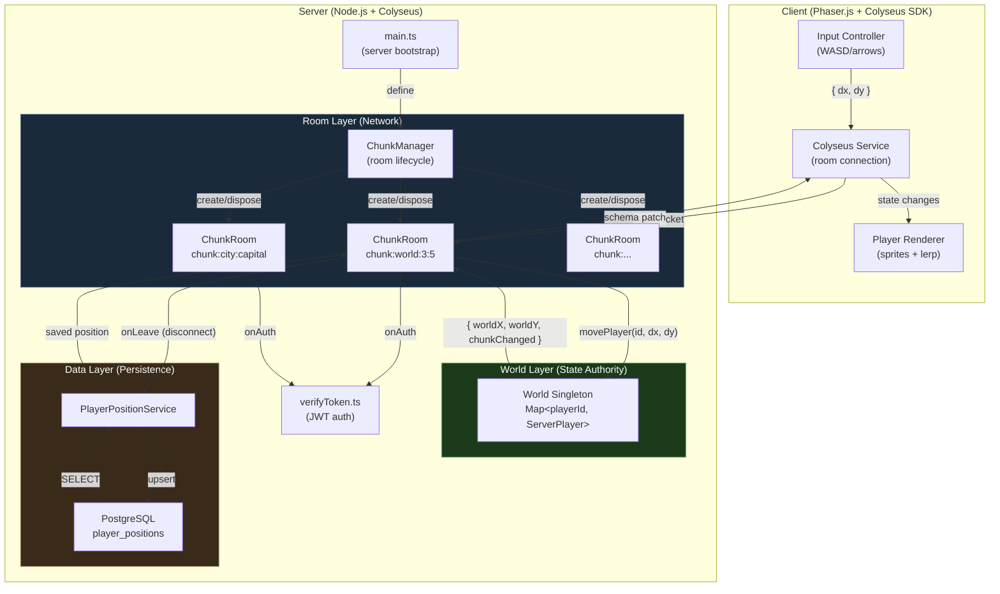
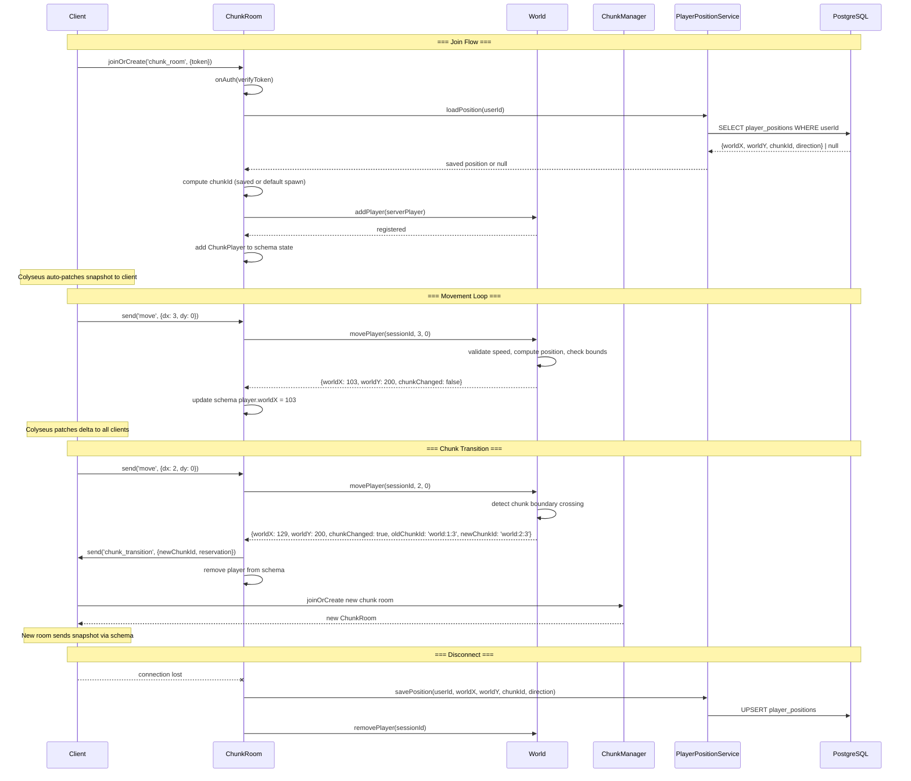

# Chunk-Based Room Architecture Design Document

## Overview

This document defines the technical design for replacing the single GameRoom with a chunk-based room system where one Colyseus room maps to one world chunk. The design introduces a World module as the authoritative state owner, a ChunkManager for room lifecycle, a ChunkRoom that replaces GameRoom, server-authoritative movement with speed/bounds validation, chunk transitions, and position persistence via a new `player_positions` database table.

## Design Summary (Meta)

```yaml
design_type: "refactoring"
risk_level: "medium"
complexity_level: "high"
complexity_rationale: >
  (1) ACs require coordinated changes across 5+ modules: World (new singleton
  with movement validation and chunk detection), ChunkManager (new room lifecycle
  manager), ChunkRoom (replacement for GameRoom with delegation to World),
  ChunkRoomState (new Colyseus schema), ServerPlayer (new server-side model),
  PlayerPositionService (new DB service), shared types (constants, messages, room
  types), and client-side colyseus service. This spans state management, room
  lifecycle, database persistence, and network protocol changes -- 4+ distinct
  technical domains.
  (2) Constraints: server-authoritative movement requires correct speed clamping
  and bounds validation; chunk transitions involve coordinated leave/join across
  rooms with race condition risks; Colyseus schema patching must be leveraged
  correctly for move-ack; position persistence must handle the disconnect-only
  save pattern reliably; chunk boundary oscillation requires debounce logic.
main_constraints:
  - "World singleton must be the single source of truth for all player state"
  - "ChunkRoom must delegate all state mutations to World API (no direct state manipulation)"
  - "Server-authoritative movement replaces client-authoritative (breaking protocol change)"
  - "Colyseus schema patching used for move-ack (no custom ack messages)"
  - "Position persistence on disconnect only (onLeave hook)"
  - "Existing auth bridge (verifyToken.ts) reused unchanged"
biggest_risks:
  - "Chunk transition race conditions (player briefly in no room or two rooms)"
  - "Move-ack latency via patchRate (up to 100ms delay) may feel unresponsive"
  - "Chunk boundary oscillation causing repeated room transitions"
  - "Server crash loses all in-flight position state"
unknowns:
  - "Exact world bounds for open world (configurable, defaulting to 16x16 chunks)"
  - "Whether Colyseus filterBy on chunkId works correctly with colon-delimited IDs"
  - "Whether patchRate 100ms is sufficient for responsive movement feel"
```

## Background and Context

### Prerequisite ADRs

- **ADR-0006: Chunk-Based Room Architecture** -- Covers all six architectural decisions: World-Room state ownership, chunk room lifecycle, location type hierarchy, movement authority, broadcasting strategy, and position persistence strategy.
- **ADR-003: Authentication Bridge between NextAuth and Colyseus** -- Establishes JWT token verification mechanism reused by ChunkRoom.
- **ADR-004: Build and Serve Tooling for Colyseus Game Server** -- Establishes esbuild-based build pipeline unchanged by this feature.
- **ADR-005: Multiplayer Position Synchronization Protocol** -- Partially superseded (Decisions 1, 4, 7); Decisions 2, 3, 5, 6 retained (pixel coordinates, update rate, client lerp, skin registry).

### Agreement Checklist

#### Scope

- [x] Replace `GameRoom` with `ChunkRoom` in `apps/server/src/rooms/`
- [x] Create `World` singleton in `apps/server/src/world/World.ts`
- [x] Create `ChunkManager` in `apps/server/src/world/ChunkManager.ts`
- [x] Create `ChunkRoomState` with `ChunkPlayer` schema in `apps/server/src/rooms/ChunkRoomState.ts`
- [x] Create `ServerPlayer` interface in `apps/server/src/models/Player.ts`
- [x] Create `player_positions` table in `packages/db/src/schema/player-positions.ts`
- [x] Create `PlayerPositionService` in `packages/db/src/services/player.ts`
- [x] Update `packages/shared/src/constants.ts` with chunk constants
- [x] Update `packages/shared/src/types/messages.ts` with new message types
- [x] Update `packages/shared/src/types/room.ts` with new player/location types
- [x] Update `apps/server/src/main.ts` to register ChunkRoom and initialize World
- [x] Update `apps/server/src/config.ts` with new configuration options

#### Non-Scope (Explicitly not changing)

- [x] Authentication bridge (`apps/server/src/auth/verifyToken.ts`) -- reused as-is
- [x] Database adapter (`packages/db/src/adapters/colyseus.ts`) -- reused as-is
- [x] Existing user schema (`packages/db/src/schema/users.ts`, `accounts.ts`) -- no modifications
- [x] Build tooling (`apps/server/project.json`, esbuild config) -- no modifications
- [x] Skin system (skin assignment logic retained, visual rendering unchanged)
- [x] Client-side Phaser rendering (out of scope for server design; client changes are a separate task)
- [x] NPC system, farming, combat, chat -- future features
- [x] Tile-level collision detection -- not in Phase 1

#### Constraints

- [x] Parallel operation: Yes (server on port 2567, Next.js on port 3000)
- [x] Backward compatibility: Not required for room protocol (breaking change: GameRoom replaced by ChunkRoom). DB changes are additive only.
- [x] Performance measurement: Required (chunk transition <200ms, movement throughput 500 msg/sec)

### Problem to Solve

The current single-room `GameRoom` architecture broadcasts all player state to all connected clients regardless of spatial location, cannot support server-authoritative movement (needed for chunk transition detection), has no position persistence, and has no concept of distinct world locations. This must be replaced with a spatially partitioned system where rooms map to world chunks.

### Current Challenges

1. **Single room bottleneck**: All players in one room means O(n) broadcast to every client on every state change
2. **Client-authoritative position**: Server cannot reliably detect chunk boundaries because it trusts client-reported positions
3. **No persistence**: Players always start at (0,0); no session continuity
4. **No spatial model**: No concept of chunks, locations, or world coordinates

### Requirements

#### Functional Requirements

- FR-1: World coordinate system with CHUNK_SIZE=64 and type-prefixed chunkIds
- FR-2: Unified location model (City, Player Instance, Open World)
- FR-3: ChunkRoom replaces GameRoom (one room per chunk, dynamic lifecycle)
- FR-4: Server-side player model with World as authority
- FR-5: Join flow (load/assign position, compute chunk, join room, send snapshot)
- FR-6: Server-authoritative movement (dx/dy, speed clamp, bounds validation)
- FR-7: Chunk transitions (detect boundary, leave old room, join new room)
- FR-8: Event-driven broadcasting (schema mutations + patchRate)
- FR-9: Position persistence (save on disconnect, load on reconnect)
- FR-10: World API (addPlayer, removePlayer, movePlayer, getPlayersInChunk)

#### Non-Functional Requirements

- **Performance**: Chunk transition <200ms, movement throughput >500 msg/sec, room creation <50ms
- **Scalability**: Support 50 concurrent players across multiple chunks
- **Reliability**: Position saved on every disconnect; World state consistent across room transitions
- **Maintainability**: Clean separation World (state) / ChunkRoom (network) / DB (persistence)

## Acceptance Criteria (AC) - EARS Format

### FR-1: World Coordinate System

- [x] The system shall use `worldX` and `worldY` as player position coordinates
- [x] **When** a player is at worldX=130, worldY=70 in the open world, the system shall compute chunkX=2, chunkY=1 and chunkId=`world:2:1`
- [x] **When** a player is in a city location, the system shall use the city's chunkId (e.g., `city:capital`) regardless of pixel position within the city
- [x] The `CHUNK_SIZE` constant shall equal 64 and be importable from `@nookstead/shared`

### FR-3: ChunkRoom

- [x] **When** the first player enters a chunk, the system shall create a new ChunkRoom for that chunk
- [x] **When** the last player leaves a chunk, the system shall dispose the ChunkRoom
- [x] **When** two players are in the same chunk, **if** one sends a move message, **then** the other shall receive a position update via schema patching

### FR-5: Join Flow

- [x] **When** a new player with no saved position connects, the system shall place them at the configured default spawn position
- [x] **When** a returning player connects, the system shall load their saved position from the database and place them at that position
- [x] **When** a player joins a chunk, the system shall provide a snapshot of all players currently in that chunk via Colyseus schema state

### FR-6: Server-Authoritative Movement

- [x] **When** a player sends dx=3, dy=0 and is at worldX=100, worldY=200, the system shall compute new position worldX=103, worldY=200
- [x] **If** a player sends dx/dy exceeding MAX_SPEED magnitude, **then** the system shall clamp the delta to MAX_SPEED
- [x] **If** a computed position would be outside world bounds, **then** the system shall clamp to the nearest valid position
- [x] **When** the server computes a new position, the system shall update the player's schema state so Colyseus patches the authoritative position to all clients (move-ack)

### FR-7: Chunk Transitions

- [x] **When** a player's new position falls in a different chunk, the system shall remove them from the old ChunkRoom and add them to the new ChunkRoom
- [x] **When** a chunk transition occurs, players in the old chunk shall see a player-left event and players in the new chunk shall see a player-joined event
- [x] **If** a player triggers chunk transitions faster than 500ms apart, **then** the system shall skip the transition (boundary oscillation mitigation)

### FR-8: Event-Driven Broadcasting

- [x] **While** all players in a chunk are stationary, the system shall send zero broadcast messages
- [x] **When** a player moves, the system shall broadcast only the changed player's state to other players in the same chunk

### FR-9: Position Persistence

- [x] **When** a player disconnects, the system shall save their worldX, worldY, chunkId, and direction to the database
- [x] **When** a player reconnects, the system shall restore their position from the database
- [x] **If** position persistence fails on disconnect, **then** the system shall log the error and complete the disconnect (no player stuck state)

### FR-10: World API

- [x] **When** `getPlayersInChunk('world:2:3')` is called with 3 players in that chunk, the system shall return an array of 3 ServerPlayer objects
- [x] **When** `movePlayer(id, 2, 0)` is called and the new position crosses a chunk boundary, the system shall return `{ chunkChanged: true, oldChunkId, newChunkId }`

## Existing Codebase Analysis

### Implementation Path Mapping

| Type | Path | Description |
|------|------|-------------|
| Existing (remove) | `apps/server/src/rooms/GameRoom.ts` | Current single room -- replaced by ChunkRoom |
| Existing (remove) | `apps/server/src/rooms/GameRoomState.ts` | Current schema -- replaced by ChunkRoomState |
| Existing (modify) | `apps/server/src/main.ts` | Server entry point -- update room registration |
| Existing (modify) | `apps/server/src/config.ts` | Server config -- add new config options |
| Existing (modify) | `packages/shared/src/constants.ts` | Shared constants -- add chunk constants |
| Existing (modify) | `packages/shared/src/types/messages.ts` | Message types -- update move payload, add server messages |
| Existing (modify) | `packages/shared/src/types/room.ts` | Room types -- update PlayerState, add Location types |
| Existing (modify) | `packages/shared/src/index.ts` | Shared exports -- export new types/constants |
| Existing (modify) | `packages/db/src/schema/index.ts` | Schema index -- export new player_positions |
| Existing (retain) | `apps/server/src/auth/verifyToken.ts` | Auth bridge -- unchanged |
| Existing (retain) | `packages/db/src/adapters/colyseus.ts` | DB adapter -- unchanged |
| Existing (retain) | `packages/db/src/services/auth.ts` | Auth service -- unchanged |
| New | `apps/server/src/world/World.ts` | World singleton (player state authority) |
| New | `apps/server/src/world/ChunkManager.ts` | Chunk room lifecycle manager |
| New | `apps/server/src/rooms/ChunkRoom.ts` | Chunk-based room (replaces GameRoom) |
| New | `apps/server/src/rooms/ChunkRoomState.ts` | Colyseus schema for chunk rooms |
| New | `apps/server/src/models/Player.ts` | ServerPlayer interface |
| New | `packages/db/src/schema/player-positions.ts` | Position persistence table |
| New | `packages/db/src/services/player.ts` | PlayerPositionService |

### Integration Points (Include even for new implementations)

- **Auth Integration**: ChunkRoom.onAuth reuses `verifyNextAuthToken` from `apps/server/src/auth/verifyToken.ts`
- **DB Integration**: PlayerPositionService uses `getGameDb()` from `packages/db/src/adapters/colyseus.ts`
- **Shared Types**: ChunkRoom and client both import from `@nookstead/shared`
- **Main.ts Registration**: `gameServer.define()` changes from GameRoom to ChunkRoom

### Code Inspection Evidence

| File Inspected | Key Finding | Design Impact |
|---------------|-------------|---------------|
| `apps/server/src/rooms/GameRoom.ts` (lines 1-135) | onAuth extracts token from options and calls verifyNextAuthToken; onJoin creates Player with random skin at (0,0); onMessage handles 'move' and 'position_update' with manual payload validation | ChunkRoom must replicate onAuth pattern exactly; onJoin changes to load position from DB; message handlers change to delegate to World API |
| `apps/server/src/rooms/GameRoomState.ts` (lines 1-16) | Player schema uses @type decorators with x/y (number), userId/name/skin/direction/animState (string), connected (boolean); MapSchema keyed by sessionId | ChunkPlayer schema drops x/y for worldX/worldY, drops connected and animState (server-only concerns); retains MapSchema pattern |
| `apps/server/src/main.ts` (lines 1-59) | Single `gameServer.define(ROOM_NAME, GameRoom)` call; DB initialized via `getGameDb(config.databaseUrl)` before server listen; graceful shutdown closes DB | Must change define to ChunkRoom with filterBy; add World initialization after DB init; retain graceful shutdown pattern |
| `apps/server/src/config.ts` (lines 1-29) | ServerConfig interface with port, authSecret, databaseUrl, corsOrigin; loadConfig validates required env vars with throw, optional vars with defaults | Extend ServerConfig with optional new fields; follow same validation pattern |
| `packages/shared/src/constants.ts` (lines 1-25) | Exports COLYSEUS_PORT, TICK_RATE, TICK_INTERVAL_MS, PATCH_RATE_MS, ROOM_NAME, MAX_PLAYERS_PER_ROOM, AVAILABLE_SKINS, POSITION_SYNC_INTERVAL_MS, SkinKey | Add CHUNK_SIZE, CHUNK_ROOM_NAME, MAX_SPEED, DEFAULT_SPAWN, WORLD_BOUNDS, LocationType; retain all existing exports for backward compatibility |
| `packages/shared/src/types/messages.ts` (lines 1-23) | ClientMessage.MOVE and POSITION_UPDATE; MovePayload {x, y}; PositionUpdatePayload {x, y, direction, animState}; ServerMessage.ERROR | Change MovePayload to {dx, dy}; add ServerMessage.CHUNK_TRANSITION; retain ServerMessage.ERROR |
| `packages/shared/src/types/room.ts` (lines 1-19) | PlayerState {userId, x, y, name, connected, skin, direction, animState}; GameRoomState; AuthData | Update PlayerState to {userId, worldX, worldY, chunkId, direction, skin, name}; add Location, LocationType types; retain AuthData |
| `packages/db/src/schema/users.ts` (lines 1-29) | users table with uuid PK, email unique, name, image, timestamps; usersRelations | New player_positions table references users.id as FK, follows same pgTable/uuid/timestamp patterns |
| `packages/db/src/services/auth.ts` (lines 1-49) | findOrCreateUser uses db.insert().onConflictDoUpdate().returning() pattern; takes DrizzleClient as first param | PlayerPositionService follows same pattern: db param, onConflictDoUpdate for upserts |
| `apps/server/src/rooms/GameRoom.spec.ts` (lines 1-480) | Tests use jest.mock for colyseus Room, config, and verifyToken; creates MockRoom class; tests onAuth, onJoin, onLeave, message handlers | ChunkRoom tests follow same mock pattern; add World mock; test delegation to World API |
| `packages/db/src/adapters/colyseus.ts` (lines 1-38) | Singleton getGameDb/closeGameDb with DrizzleClientOptions | Reused unchanged; PlayerPositionService receives db instance from getGameDb() |

### Similar Functionality Search

- **World/state management**: No existing World module or centralized state manager found. The GameRoomState is the only state container, owned by the room. New implementation justified.
- **Position persistence**: No existing position storage. The users table has no position columns. New `player_positions` table justified.
- **Room lifecycle management**: No existing ChunkManager or room factory. GameRoom is statically defined. New implementation justified.
- **Movement validation**: No existing speed/bounds validation. GameRoom.handleMove writes positions directly without validation. New implementation justified.

## Applicable Standards

### Classification Table

| Standard | Type | Source | Impact on Design |
|----------|------|--------|-----------------|
| Prettier: single quotes, 2-space indent | Explicit | `.prettierrc` | All new code must use single quotes and 2-space indent |
| ESLint: @nx/eslint-plugin flat config | Explicit | `eslint.config.mjs` | All new TS files must pass ESLint with module boundary enforcement |
| TypeScript: strict mode, ES2022 target, bundler resolution | Explicit | `tsconfig.base.json` | All new code must pass strict type checking |
| Colyseus decorators: experimentalDecorators + useDefineForClassFields:false | Explicit | `apps/server/tsconfig.json` | Schema classes must use @type() decorators compatible with these settings |
| Jest testing with mock patterns | Explicit | `apps/server/src/rooms/GameRoom.spec.ts` | Tests must follow established jest.mock pattern for Colyseus Room |
| Drizzle ORM schema patterns (pgTable, uuid, timestamp) | Implicit | `packages/db/src/schema/users.ts` | New DB schema must follow same pgTable definition pattern with uuid PK and timestamps |
| Service function pattern (db as first param, onConflictDoUpdate) | Implicit | `packages/db/src/services/auth.ts` | New services must accept DrizzleClient as first parameter and use onConflictDoUpdate for upserts |
| Singleton adapter pattern (module-level variable, lazy init) | Implicit | `packages/db/src/adapters/colyseus.ts` | World singleton should follow similar lazy-init pattern |
| Console.log for server logging with `[module]` prefix | Implicit | `apps/server/src/rooms/GameRoom.ts`, `main.ts` | All new modules must use `[ModuleName]` prefixed console.log |
| Shared types exported via index.ts barrel | Implicit | `packages/shared/src/index.ts` | All new shared types must be re-exported through index.ts |

## Design

### Change Impact Map

```yaml
Change Target: GameRoom → ChunkRoom replacement
Direct Impact:
  - apps/server/src/rooms/GameRoom.ts (removed, replaced by ChunkRoom.ts)
  - apps/server/src/rooms/GameRoomState.ts (removed, replaced by ChunkRoomState.ts)
  - apps/server/src/main.ts (room registration changes)
  - apps/server/src/config.ts (new config fields)
  - packages/shared/src/constants.ts (new constants)
  - packages/shared/src/types/messages.ts (protocol change: MovePayload dx/dy)
  - packages/shared/src/types/room.ts (PlayerState field changes)
  - packages/shared/src/index.ts (new exports)
  - packages/db/src/schema/index.ts (new export)
Indirect Impact:
  - apps/game/src/services/colyseus.ts (must update to join chunk rooms -- separate task)
  - apps/game/ PlayerManager/InputController (must send dx/dy instead of position -- separate task)
  - apps/server/src/rooms/GameRoom.spec.ts (removed, replaced by ChunkRoom.spec.ts)
No Ripple Effect:
  - apps/server/src/auth/verifyToken.ts (unchanged)
  - packages/db/src/adapters/colyseus.ts (unchanged)
  - packages/db/src/services/auth.ts (unchanged)
  - packages/db/src/schema/users.ts (unchanged)
  - packages/db/src/schema/accounts.ts (unchanged)
  - apps/server/src/config.spec.ts (unchanged)
  - apps/server/src/auth/verifyToken.spec.ts (unchanged)
  - Build tooling (project.json, esbuild config) (unchanged)
```

### Architecture Overview

The chunk-based architecture has three layers with clear ownership boundaries:



**State Ownership**: The World singleton is the single source of truth for all player state. ChunkRooms are read-only mirrors that reflect the World state subset for their chunk via Colyseus schema. ChunkRooms never modify player state directly; they call World API methods which return the updated state, and then the room updates the schema to trigger Colyseus delta patching.

### Data Flow



### Integration Points List

| Integration Point | Location | Old Implementation | New Implementation | Switching Method |
|-------------------|----------|-------------------|-------------------|------------------|
| Room registration | `main.ts` line 37 | `gameServer.define(ROOM_NAME, GameRoom)` | `gameServer.define(CHUNK_ROOM_NAME, ChunkRoom, { filterBy: ['chunkId'] })` | Direct replacement |
| Player state storage | `GameRoomState.players` | MapSchema in room state | World.players (in-memory) + ChunkRoomState.players (mirror) | New module |
| Movement handling | `GameRoom.handleMove()` | Direct schema write: `player.x = move.x` | Delegate to `World.movePlayer(id, dx, dy)` then update schema | Delegation pattern |
| Position sync | `GameRoom.handlePositionUpdate()` | Client sends absolute position | Removed; server computes position from dx/dy | Protocol change |
| Auth verification | `GameRoom.onAuth()` | `verifyNextAuthToken(token, secret)` | Same call in `ChunkRoom.onAuth()` | Copy (identical) |
| Player creation on join | `GameRoom.onJoin()` | Create Player at (0,0), random skin | Load from DB, create ServerPlayer, add to World, mirror to schema | New flow |
| Player removal on leave | `GameRoom.onLeave()` | `state.players.delete(sessionId)` | Save to DB, World.removePlayer, remove from schema | New flow |
| DB access | `main.ts` | `getGameDb(config.databaseUrl)` for auth only | Same adapter, add PlayerPositionService usage | Extend existing |

### Integration Point Map

```yaml
Integration Point 1:
  Existing Component: apps/server/src/main.ts - gameServer.define()
  Integration Method: Replace GameRoom with ChunkRoom in define call
  Impact Level: High (Process Flow Change)
  Required Test Coverage: Server starts and registers ChunkRoom

Integration Point 2:
  Existing Component: apps/server/src/auth/verifyToken.ts - verifyNextAuthToken()
  Integration Method: Called from ChunkRoom.onAuth() (same as GameRoom.onAuth())
  Impact Level: Low (Read-Only)
  Required Test Coverage: Auth works in ChunkRoom context

Integration Point 3:
  Existing Component: packages/db/src/adapters/colyseus.ts - getGameDb()
  Integration Method: PlayerPositionService receives db from getGameDb()
  Impact Level: Medium (Data Usage)
  Required Test Coverage: Position save and load via shared adapter

Integration Point 4:
  Existing Component: packages/shared/src/ - shared types and constants
  Integration Method: Updated types/constants imported by both server and client
  Impact Level: High (Contract Change)
  Required Test Coverage: TypeScript compilation passes for both consumer projects
```

### Main Components

#### World (`apps/server/src/world/World.ts`)

- **Responsibility**: Authoritative owner of all player state. Processes movement, validates speed/bounds, detects chunk transitions. Singleton.
- **Interface**:
  ```typescript
  class World {
    addPlayer(player: ServerPlayer): void;
    removePlayer(playerId: string): ServerPlayer | undefined;
    movePlayer(playerId: string, dx: number, dy: number): MoveResult;
    getPlayersInChunk(chunkId: string): ServerPlayer[];
    getPlayer(playerId: string): ServerPlayer | undefined;
  }
  ```
- **Dependencies**: None (pure in-memory state management). Depends on shared constants (CHUNK_SIZE, MAX_SPEED, WORLD_BOUNDS).

#### ChunkManager (`apps/server/src/world/ChunkManager.ts`)

- **Responsibility**: Manages chunk room lifecycle. Tracks active rooms. Mediates room creation via Colyseus matchMaker. Implements boundary oscillation cooldown.
- **Interface**:
  ```typescript
  class ChunkManager {
    registerRoom(chunkId: string, room: ChunkRoom): void;
    unregisterRoom(chunkId: string): void;
    getRoom(chunkId: string): ChunkRoom | undefined;
    getActiveRoomCount(): number;
    canTransition(playerId: string): boolean; // oscillation check
    recordTransition(playerId: string): void;
  }
  ```
- **Dependencies**: Colyseus matchMaker (for room creation coordination).

#### ChunkRoom (`apps/server/src/rooms/ChunkRoom.ts`)

- **Responsibility**: Network layer for one chunk. Delegates all state mutations to World API. Manages Colyseus schema state as a mirror of World state for its chunk. Handles auth, join, leave, and message routing.
- **Interface**: Colyseus Room lifecycle methods (onCreate, onAuth, onJoin, onLeave, onMessage, onDispose).
- **Dependencies**: World (singleton reference), ChunkManager, PlayerPositionService, verifyNextAuthToken.

#### ChunkRoomState (`apps/server/src/rooms/ChunkRoomState.ts`)

- **Responsibility**: Colyseus schema definition for chunk room state. Contains a MapSchema of ChunkPlayer entries for delta serialization.
- **Interface**:
  ```typescript
  class ChunkPlayer extends Schema {
    @type('string') id: string;
    @type('number') worldX: number;
    @type('number') worldY: number;
    @type('string') direction: string;
    @type('string') skin: string;
    @type('string') name: string;
  }

  class ChunkRoomState extends Schema {
    @type({ map: ChunkPlayer }) players = new MapSchema<ChunkPlayer>();
  }
  ```
- **Dependencies**: `@colyseus/schema`.

#### ServerPlayer (`apps/server/src/models/Player.ts`)

- **Responsibility**: Non-schema server-side player data model used by the World module. Contains all player fields including session tracking.
- **Interface**:
  ```typescript
  interface ServerPlayer {
    id: string;        // sessionId (unique per connection)
    userId: string;    // database user ID (persistent identity)
    worldX: number;
    worldY: number;
    chunkId: string;
    direction: string;
    skin: string;
    name: string;
    sessionId: string; // same as id, explicit for clarity
  }
  ```
- **Dependencies**: None (plain interface).

#### PlayerPositionService (`packages/db/src/services/player.ts`)

- **Responsibility**: Database access for player position persistence. Save (upsert) on disconnect, load on connect.
- **Interface**:
  ```typescript
  function savePosition(
    db: DrizzleClient,
    userId: string,
    worldX: number,
    worldY: number,
    chunkId: string,
    direction: string
  ): Promise<void>;

  function loadPosition(
    db: DrizzleClient,
    userId: string
  ): Promise<{ worldX: number; worldY: number; chunkId: string; direction: string } | null>;
  ```
- **Dependencies**: DrizzleClient, player_positions schema.

### Contract Definitions

```typescript
// === World API Return Types ===

interface MoveResult {
  worldX: number;
  worldY: number;
  chunkChanged: boolean;
  oldChunkId?: string;
  newChunkId?: string;
}

// === Message Protocol (Client → Server) ===

// Updated MovePayload (was {x, y}, now {dx, dy})
interface MovePayload {
  dx: number;
  dy: number;
}

// === Message Protocol (Server → Client) ===

const ServerMessage = {
  ERROR: 'error',
  CHUNK_TRANSITION: 'chunk_transition',
} as const;

interface ChunkTransitionPayload {
  newChunkId: string;
  // Optional: seat reservation data for secure transition
  reservation?: {
    sessionId: string;
    room: { roomId: string; processId: string; name: string };
  };
}

// === Shared Constants (additions) ===

const CHUNK_SIZE = 64;
const CHUNK_ROOM_NAME = 'chunk_room';
const MAX_SPEED = 5;
const DEFAULT_SPAWN = { worldX: 32, worldY: 32, chunkId: 'city:capital' };
const WORLD_BOUNDS = { minX: 0, minY: 0, maxX: 1024, maxY: 1024 }; // 16x16 chunks
const CHUNK_TRANSITION_COOLDOWN_MS = 500;

enum LocationType {
  CITY = 'CITY',
  PLAYER = 'PLAYER',
  OPEN_WORLD = 'OPEN_WORLD',
}
```

### Data Contract

#### World.movePlayer

```yaml
Input:
  Type: (playerId: string, dx: number, dy: number)
  Preconditions:
    - playerId exists in World.players
    - dx and dy are finite numbers
  Validation:
    - Magnitude of (dx, dy) clamped to MAX_SPEED
    - Resulting position clamped to WORLD_BOUNDS

Output:
  Type: MoveResult { worldX, worldY, chunkChanged, oldChunkId?, newChunkId? }
  Guarantees:
    - worldX and worldY are within WORLD_BOUNDS
    - If chunkChanged is true, oldChunkId and newChunkId are both defined and different
    - The player's internal state is already updated when this returns
  On Error: Returns current position unchanged if player not found

Invariants:
  - Player count in World.players does not change during movePlayer
  - The player's chunkId in World always matches the chunk computed from their worldX/worldY
```

#### PlayerPositionService.savePosition

```yaml
Input:
  Type: (db: DrizzleClient, userId: string, worldX: number, worldY: number, chunkId: string, direction: string)
  Preconditions:
    - userId exists in the users table
    - worldX, worldY are finite numbers
    - chunkId is a valid chunk ID string
  Validation: None (caller validates)

Output:
  Type: Promise<void>
  Guarantees:
    - A row exists in player_positions with the given userId after completion
    - If a row already existed, it is updated (upsert)
  On Error: Throws (caller must handle)

Invariants:
  - At most one row per userId in player_positions (unique constraint)
```

### Data Representation Decisions

| Data Structure | Decision | Rationale |
|---|---|---|
| ChunkPlayer (Colyseus schema) | **New** dedicated type | Cannot reuse existing Player schema: field names change (x/y to worldX/worldY), fields removed (connected, animState), this is a Colyseus @type schema class with specific serialization requirements |
| ServerPlayer (server model) | **New** interface | No existing non-schema player type exists. The current Player is a Colyseus schema class, unsuitable for use as a plain data model in the World module |
| MoveResult | **New** interface | No existing type for movement results. This is a new domain concept specific to server-authoritative movement |
| player_positions (DB table) | **New** table | No existing position storage. The users table has no position columns. Adding columns to users would mix concerns (identity vs game state) |
| MovePayload | **Reuse** existing type + modify | Existing MovePayload {x, y} is modified to {dx, dy}. Same message, different semantics. Breaking change is intentional. |
| AuthData | **Reuse** existing unchanged | Existing AuthData {userId, email} is sufficient for ChunkRoom auth. No changes needed. |
| LocationType | **New** enum | No existing location/type concept in the codebase. New domain concept. |

### Field Propagation Map

```yaml
fields:
  - name: "worldX / worldY"
    origin: "Client movement input (dx, dy)"
    transformations:
      - layer: "Network (Client → Server)"
        type: "MovePayload { dx: number, dy: number }"
        validation: "typeof check (number), reject non-numeric"
      - layer: "World (Server)"
        type: "ServerPlayer.worldX / worldY"
        transformation: "worldX += clamp(dx, MAX_SPEED); clamp(worldX, WORLD_BOUNDS)"
      - layer: "ChunkRoomState (Schema)"
        type: "ChunkPlayer.worldX / worldY"
        transformation: "direct copy from MoveResult.worldX / worldY"
      - layer: "Network (Server → Client)"
        type: "Colyseus schema delta patch"
        transformation: "automatic via @colyseus/schema"
    destination: "Client state / Phaser renderer"
    loss_risk: "none"

  - name: "chunkId"
    origin: "Computed from worldX, worldY via floor(pos / CHUNK_SIZE)"
    transformations:
      - layer: "World (Server)"
        type: "ServerPlayer.chunkId"
        transformation: "computed on addPlayer and after every movePlayer"
      - layer: "Database"
        type: "player_positions.chunkId (varchar)"
        transformation: "stored as string, no transformation"
    destination: "Database (persistence) / ChunkManager (routing)"
    loss_risk: "none"

  - name: "direction"
    origin: "Client input (derived from dx/dy sign)"
    transformations:
      - layer: "World (Server)"
        type: "ServerPlayer.direction"
        transformation: "derived from movement delta: dx>0='right', dx<0='left', dy>0='down', dy<0='up'"
      - layer: "ChunkRoomState (Schema)"
        type: "ChunkPlayer.direction"
        transformation: "direct copy"
      - layer: "Database"
        type: "player_positions.direction (varchar)"
        transformation: "stored as string on disconnect"
    destination: "Client state / animation system"
    loss_risk: "low"
    loss_risk_reason: "Direction is derived server-side from dx/dy; if delta is (0,0), direction retains previous value"

  - name: "userId"
    origin: "JWT token payload (auth)"
    transformations:
      - layer: "ChunkRoom.onAuth"
        type: "AuthData.userId"
        validation: "verifyNextAuthToken validates token"
      - layer: "World"
        type: "ServerPlayer.userId"
        transformation: "direct copy"
      - layer: "Database"
        type: "player_positions.userId (uuid FK)"
        transformation: "used as lookup key"
    destination: "Database (position lookup key)"
    loss_risk: "none"
```

### Interface Change Impact Analysis

| Existing Operation | New Operation | Conversion Required | Adapter Required | Compatibility Method |
|-------------------|---------------|-------------------|------------------|---------------------|
| `GameRoom.onAuth(client, options)` | `ChunkRoom.onAuth(client, options)` | None | Not Required | Identical implementation |
| `GameRoom.onJoin(client, options, auth)` | `ChunkRoom.onJoin(client, options, auth)` | Yes | Not Required | New implementation (load position, register in World, mirror to schema) |
| `GameRoom.onLeave(client, code)` | `ChunkRoom.onLeave(client, code)` | Yes | Not Required | New implementation (save position, remove from World, remove from schema) |
| `GameRoom.handleMove(client, {x, y})` | `ChunkRoom.handleMove(client, {dx, dy})` | Yes | Not Required | New implementation (delegate to World.movePlayer, handle chunk transition) |
| `GameRoom.handlePositionUpdate(client, payload)` | Removed | N/A | N/A | Client sends dx/dy moves only; no position_update message |
| `GameRoom.update() (tick)` | Removed | N/A | N/A | No tick loop; event-driven via schema mutations |
| `gameServer.define(ROOM_NAME, GameRoom)` | `gameServer.define(CHUNK_ROOM_NAME, ChunkRoom, opts)` | Yes | Not Required | Direct replacement in main.ts |

### State Transitions and Invariants

```yaml
State Definition:
  - Initial State: Player not connected (no entry in World)
  - Possible States:
    - NOT_CONNECTED: Player has no active session
    - JOINING: Player authenticated, loading position
    - IN_CHUNK: Player registered in World, present in a ChunkRoom
    - TRANSITIONING: Player moving between chunks (brief, <200ms)
    - DISCONNECTING: Player leaving, position being saved

State Transitions:
  NOT_CONNECTED → JOINING: Client sends joinOrCreate with valid token
  JOINING → IN_CHUNK: Position loaded/assigned, player added to World and ChunkRoom
  IN_CHUNK → IN_CHUNK: Movement within same chunk (movePlayer returns chunkChanged=false)
  IN_CHUNK → TRANSITIONING: Movement crosses chunk boundary (movePlayer returns chunkChanged=true)
  TRANSITIONING → IN_CHUNK: Player successfully joins new ChunkRoom
  TRANSITIONING → IN_CHUNK: Transition skipped due to oscillation cooldown (stays in current chunk)
  IN_CHUNK → DISCONNECTING: Client disconnects or network drops
  DISCONNECTING → NOT_CONNECTED: Position saved, player removed from World and ChunkRoom

System Invariants:
  - A player exists in exactly one ChunkRoom at any time (never zero, never two)
  - World.players[id].chunkId always equals computeChunkId(player.worldX, player.worldY)
  - ChunkRoomState.players only contains players whose World.chunkId matches this room's chunkId
  - Player worldX and worldY are always within WORLD_BOUNDS
```

### Integration Boundary Contracts

```yaml
Boundary: Client → ChunkRoom (WebSocket)
  Input: MovePayload { dx: number, dy: number }
  Output: Schema state patch (async, via patchRate)
  On Error: Invalid payload logged, message dropped silently

Boundary: ChunkRoom → World (function call)
  Input: movePlayer(playerId: string, dx: number, dy: number)
  Output: MoveResult (sync return)
  On Error: Returns current position if player not found

Boundary: ChunkRoom → PlayerPositionService (async function call)
  Input: savePosition(db, userId, worldX, worldY, chunkId, direction)
  Output: Promise<void>
  On Error: Error logged, disconnect completes anyway

Boundary: ChunkRoom → Client (WebSocket, server-sent message)
  Input: N/A (server-initiated)
  Output: ChunkTransitionPayload { newChunkId, reservation? }
  On Error: Client stays in current room; server logs error

Boundary: PlayerPositionService → PostgreSQL (SQL)
  Input: UPSERT query with userId, worldX, worldY, chunkId, direction
  Output: Promise<void> on success
  On Error: Throws database error (propagated to caller)
```

### Database Schema

**New table: `player_positions`** (`packages/db/src/schema/player-positions.ts`)

```typescript
import { pgTable, real, timestamp, uuid, varchar } from 'drizzle-orm/pg-core';
import { users } from './users';

export const playerPositions = pgTable('player_positions', {
  userId: uuid('user_id')
    .notNull()
    .references(() => users.id, { onDelete: 'cascade' })
    .unique()
    .primaryKey(),
  worldX: real('world_x').notNull().default(32),
  worldY: real('world_y').notNull().default(32),
  chunkId: varchar('chunk_id', { length: 100 }).notNull().default('city:capital'),
  direction: varchar('direction', { length: 10 }).notNull().default('down'),
  updatedAt: timestamp('updated_at', { withTimezone: true })
    .defaultNow()
    .notNull(),
});

export type PlayerPosition = typeof playerPositions.$inferSelect;
export type NewPlayerPosition = typeof playerPositions.$inferInsert;
```

Design notes:
- `userId` is both the PK and a FK to `users.id`, ensuring one position per user
- `real` type for worldX/worldY (float4, matching the precision needed for pixel coordinates)
- Default values match DEFAULT_SPAWN so a bare insert produces a valid default position
- Follows the same pgTable/uuid/timestamp pattern as existing `users` and `accounts` tables

### Error Handling

| Error Scenario | Handler | Behavior |
|---------------|---------|----------|
| Invalid move payload (non-numeric dx/dy) | ChunkRoom.handleMove | Log warning, drop message, no state change |
| Player not found in World during move | World.movePlayer | Return current position (no-op), log warning |
| Position save fails on disconnect | ChunkRoom.onLeave | Log error, continue disconnect (player removed from World and room) |
| Position load fails on join | ChunkRoom.onJoin | Log error, use default spawn position |
| Chunk transition fails (new room creation error) | ChunkRoom | Revert player position to pre-move state, send error to client, player stays in current room |
| Auth token verification fails | ChunkRoom.onAuth | Throw error (Colyseus rejects the join) |
| Boundary oscillation detected | ChunkManager.canTransition | Skip chunk transition, player stays in current chunk at new position |

### Logging and Monitoring

All server modules use `console.log` with `[ModuleName]` prefix, consistent with existing patterns:

```
[World] Player added: sessionId=abc123, userId=user-1, chunkId=world:2:3
[World] Player moved: sessionId=abc123, worldX=103, worldY=200
[World] Chunk transition: sessionId=abc123, world:1:3 → world:2:3
[ChunkRoom] Room created: chunk:world:2:3, roomId=xyz789
[ChunkRoom] Player joined: sessionId=abc123, chunkId=world:2:3
[ChunkRoom] Player left: sessionId=abc123, chunkId=world:2:3
[ChunkRoom] Room disposed: chunk:world:2:3
[ChunkManager] Active rooms: 5
[PlayerPositionService] Position saved: userId=user-1, worldX=103, worldY=200
[PlayerPositionService] Position loaded: userId=user-1, worldX=103, worldY=200
[PlayerPositionService] Position load failed, using default: userId=user-1
```

## Implementation Plan

### Implementation Approach

**Selected Approach**: Horizontal Slice (Foundation-driven)

**Selection Reason**: The components have strong technical dependencies that mandate a bottom-up implementation order. The shared types and DB schema must exist before the World module can be built. The World module must exist before ChunkRoom can delegate to it. The ChunkManager must exist before main.ts can wire everything together. This natural dependency chain favors horizontal slice construction where each layer is verified before the next layer is built on top of it.

### Technical Dependencies and Implementation Order

#### Required Implementation Order

1. **Shared Types and Constants** (`packages/shared/`)
   - Technical Reason: All other components import from shared. Must be compiled first.
   - Dependent Elements: World, ChunkRoom, ChunkRoomState, ServerPlayer, client

2. **Database Schema and Service** (`packages/db/`)
   - Technical Reason: Position persistence is needed by the join flow (load) and leave flow (save). Must exist before ChunkRoom can be implemented.
   - Prerequisites: None (additive schema change)
   - Dependent Elements: ChunkRoom (onJoin, onLeave)

3. **ServerPlayer Model** (`apps/server/src/models/Player.ts`)
   - Technical Reason: World and ChunkRoom both use this type
   - Prerequisites: Shared types (for direction, chunkId types)

4. **World Module** (`apps/server/src/world/World.ts`)
   - Technical Reason: ChunkRoom delegates all state mutations to World. Must exist and be tested before ChunkRoom implementation.
   - Prerequisites: ServerPlayer, shared constants (CHUNK_SIZE, MAX_SPEED, WORLD_BOUNDS)
   - Dependent Elements: ChunkRoom, ChunkManager

5. **ChunkRoomState** (`apps/server/src/rooms/ChunkRoomState.ts`)
   - Technical Reason: ChunkRoom creates this state on onCreate
   - Prerequisites: @colyseus/schema (already installed)

6. **ChunkManager** (`apps/server/src/world/ChunkManager.ts`)
   - Technical Reason: Mediates room lifecycle, manages oscillation cooldown. Referenced by ChunkRoom for transition logic.
   - Prerequisites: World

7. **ChunkRoom** (`apps/server/src/rooms/ChunkRoom.ts`)
   - Technical Reason: The integration point that wires World, ChunkManager, ChunkRoomState, and PlayerPositionService together
   - Prerequisites: All above components

8. **main.ts Update** (`apps/server/src/main.ts`)
   - Technical Reason: Final wiring -- replace GameRoom registration with ChunkRoom
   - Prerequisites: ChunkRoom, ChunkManager, World

### Integration Points

**Integration Point 1: Shared Types → All Consumers**
- Components: `packages/shared/` → `apps/server/`, `apps/game/`
- Verification: `pnpm nx typecheck shared && pnpm nx typecheck server`

**Integration Point 2: DB Schema → PlayerPositionService**
- Components: `player_positions` schema → `savePosition/loadPosition`
- Verification: Unit tests with test database

**Integration Point 3: World → ChunkRoom**
- Components: `World.movePlayer()` → `ChunkRoom.handleMove()`
- Verification: Integration test: send move message, verify World state updated and schema patched

**Integration Point 4: ChunkRoom → main.ts**
- Components: `ChunkRoom` → `gameServer.define()`
- Verification: Server starts, client can connect and join a chunk room

**Integration Point 5: Full E2E**
- Components: Client → ChunkRoom → World → Schema Patch → Client
- Verification: Two clients connect, one moves, other sees position update

### Migration Strategy

This is a clean replacement, not a migration:

1. GameRoom.ts and GameRoomState.ts are removed entirely
2. GameRoom.spec.ts is removed and replaced with ChunkRoom.spec.ts
3. main.ts switches from `define(ROOM_NAME, GameRoom)` to `define(CHUNK_ROOM_NAME, ChunkRoom, ...)`
4. MovePayload changes from `{x, y}` to `{dx, dy}` (breaking protocol change)
5. Client must be updated to send the new message format and handle chunk transitions

There is no gradual migration path. The old and new systems cannot coexist because they use different room types, different message protocols, and different state ownership models.

## Test Strategy

### Basic Test Design Policy

All acceptance criteria map to at least one test case. Tests follow the existing jest.mock pattern established in `GameRoom.spec.ts`.

### Unit Tests

**World.spec.ts** (highest priority -- core logic):
- addPlayer: registers player, getPlayer returns it, getPlayersInChunk returns it
- removePlayer: removes player, getPlayer returns undefined
- movePlayer: basic movement (dx=3, dy=0 → worldX increases by 3)
- movePlayer: speed clamping (dx=100 → clamped to MAX_SPEED)
- movePlayer: bounds clamping (position at edge + delta → clamped to bound)
- movePlayer: chunk detection (position crosses CHUNK_SIZE boundary → chunkChanged=true)
- movePlayer: no chunk change (position stays in same chunk → chunkChanged=false)
- movePlayer: direction derivation (dx>0 → 'right', dy<0 → 'up', etc.)
- movePlayer: unknown player returns current-like result (no crash)
- getPlayersInChunk: returns only players in specified chunk
- getPlayersInChunk: returns empty array for empty chunk

**ChunkManager.spec.ts**:
- registerRoom/unregisterRoom: tracks active rooms
- getRoom: returns registered room
- getActiveRoomCount: accurate count
- canTransition: returns true when no recent transition
- canTransition: returns false within cooldown period (500ms)
- recordTransition: updates last transition time

**PlayerPositionService.spec.ts** (with test DB):
- savePosition: creates new record for new user
- savePosition: updates existing record (upsert)
- loadPosition: returns saved position
- loadPosition: returns null for unknown user

### Integration Tests

**ChunkRoom.spec.ts** (with mock World):
- onCreate: sets ChunkRoomState, setPatchRate
- onAuth: rejects missing token, accepts valid token
- onJoin: calls World.addPlayer, adds ChunkPlayer to schema state
- onJoin with saved position: loads from DB, uses saved position
- onJoin new player: uses default spawn
- onLeave: calls savePosition and World.removePlayer
- handleMove: delegates to World.movePlayer, updates schema
- handleMove with chunk transition: sends CHUNK_TRANSITION to client
- handleMove with invalid payload: logs warning, no state change

### E2E Tests

- Two clients connect, authenticate, and appear in the same chunk room
- Client A sends a move, Client B receives the updated position
- A player moving across a chunk boundary transitions to a new room
- A player disconnects and reconnects at their saved position
- Speed-hack attempt (large dx/dy) is clamped by server

### Performance Tests

- 500 move messages/sec throughput (50 players * 10 moves/sec)
- Chunk transition latency <200ms on localhost
- Zero network traffic with 3 stationary players over 5 seconds

## Security Considerations

- **Authentication**: ChunkRoom.onAuth reuses the existing JWT verification (verifyNextAuthToken). No unauthenticated connections reach any room.
- **Input validation**: All dx/dy values validated as numbers. Non-numeric or missing fields rejected. Speed clamped to MAX_SPEED.
- **No client-authoritative position**: Clients send deltas, not positions. Teleportation and speed hacks are prevented by server-side validation.
- **SQL injection prevention**: Drizzle ORM parameterizes all queries. No raw SQL used.
- **Position data sensitivity**: Player positions are not PII. No encryption needed for the player_positions table beyond standard database security.

## Future Extensibility

- **Client-side prediction**: When input latency becomes noticeable, add client-side prediction with server reconciliation. The server-authoritative model supports this cleanly -- the server's position is already the ground truth.
- **Tile collision**: Future phases can add tile walkability validation in World.movePlayer without changing the room or protocol layers.
- **NPC integration**: NPCs can be added to the World module as entities with positions, using the same chunk assignment and broadcasting system as players.
- **Multi-process scaling**: The World singleton can be replaced with a distributed state store (Redis, etc.) when scaling beyond one Colyseus process, without changing the ChunkRoom interface.
- **Adjacent chunk preloading**: The ChunkManager can be extended to pre-create rooms for adjacent chunks when a player approaches a boundary, reducing transition latency.

## Alternative Solutions

### Alternative 1: Interest Management within Single Room

- **Overview**: Keep one large room but implement interest management (only send state changes to nearby players) using custom broadcast logic.
- **Advantages**: No room transitions, simpler client logic, no chunk concept needed
- **Disadvantages**: Custom broadcast logic replaces Colyseus's built-in schema patching (fighting the framework), single room still receives all messages from all players, does not scale memory-wise (all players in one room state), no natural partitioning for future NPC/farming systems
- **Reason for Rejection**: Fights Colyseus design (schema patching operates at room level, not per-client). The chunk-based approach aligns with Colyseus's room-as-partition model and provides natural spatial boundaries for future game systems.

### Alternative 2: Client-Initiated Chunk Transitions

- **Overview**: Client detects chunk boundary crossing and initiates room transition itself, rather than the server detecting it.
- **Advantages**: Simpler server logic (no chunk detection in movePlayer), lower latency (client transitions proactively)
- **Disadvantages**: Requires trusting the client to correctly compute chunk boundaries (cheat vector), client could refuse to transition (stay in wrong room), splits authority between client (position) and server (room assignment)
- **Reason for Rejection**: Conflicts with server-authoritative movement model (ADR-0006, Decision 4). If the server computes positions, it must also detect chunk boundaries. Client-initiated transitions would reintroduce the trust issues that server authority was designed to eliminate.

## Risks and Mitigation

| Risk | Impact | Probability | Mitigation |
|------|--------|-------------|------------|
| Chunk transition causes brief player invisibility (removed from old room before added to new) | Medium | Medium | World updates chunkId atomically before room transition. Player is always in exactly one room via the sequential leave-then-join process. Schema state is added to new room before schema is removed from old room. |
| Move-ack latency via patchRate (100ms) feels unresponsive | Medium | Medium | Acceptable for walking-speed 2D game. Future mitigation: add client-side prediction or reduce patchRate to 50ms. |
| Chunk boundary oscillation (player walks back and forth) | Medium | Medium | ChunkManager tracks last transition time per player. Transitions within 500ms of previous transition are skipped. Player stays in current chunk at new world position. |
| Position persistence write fails on disconnect | Medium | Low | Try/catch in onLeave. Error logged. Disconnect completes. Player gets default spawn on next connect (acceptable fallback). |
| Colyseus filterBy with colon-delimited chunkIds | Low | Low | Test with actual Colyseus matchmaker. If problematic, encode chunkIds differently (underscores) or use room metadata instead. |
| Server crash loses all in-flight position state | Medium | Low | Acceptable for Phase 1 (<50 players). Future mitigation: periodic saves every 5 minutes if crash frequency increases. |
| World singleton memory growth | Low | Low | ServerPlayer is small (~200 bytes). 50 players = ~10KB. Thousands of players would still be <1MB. Not a concern. |

## References

- [Colyseus Room Lifecycle](https://docs.colyseus.io/room/) - Room creation, autoDispose, and lifecycle events
- [Colyseus State Synchronization](https://docs.colyseus.io/state/) - Schema-based delta serialization and patchRate mechanics
- [Colyseus Matchmaker API](https://docs.colyseus.io/matchmaker/) - matchMaker.createRoom, reserveSeatFor, filterBy
- [Colyseus Schema Documentation](https://docs.colyseus.io/state/schema/) - @type decorators, MapSchema, ChangeTree
- [Entity Interpolation (Gabriel Gambetta)](https://www.gabrielgambetta.com/entity-interpolation.html) - Client-side interpolation for server-authoritative games
- [Server-Authoritative Game Networking (Gaffer On Games)](https://gafferongames.com/post/what_every_programmer_needs_to_know_about_game_networking/) - Networking models comparison
- [Spatial Partitioning for MMO Servers (GameDev.net)](https://www.gamedev.net/forums/topic/687829-space-partitioning-for-top-down-mmo-game-on-the-server/) - Chunk-based spatial partitioning patterns
- [Drizzle ORM Documentation](https://orm.drizzle.team/docs/overview) - Schema definition, upsert patterns
- [PRD-005: Chunk-Based Room Architecture](../prd/prd-005-chunk-based-room-architecture.md) - Source requirements
- [ADR-0006: Chunk-Based Room Architecture](../adr/ADR-0006-chunk-based-room-architecture.md) - Architecture decisions

## Update History

| Date | Version | Changes | Author |
|------|---------|---------|--------|
| 2026-02-17 | 1.0 | Initial version | Claude |
