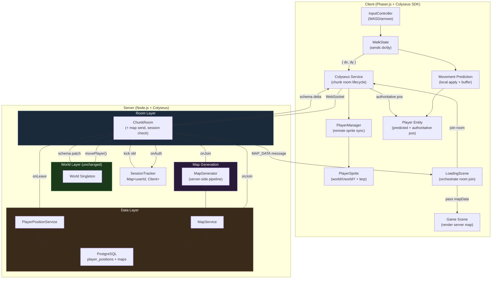
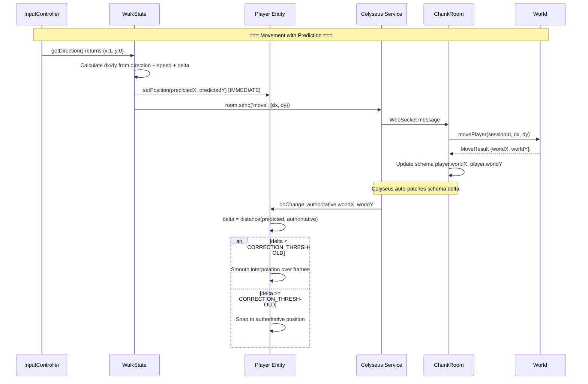
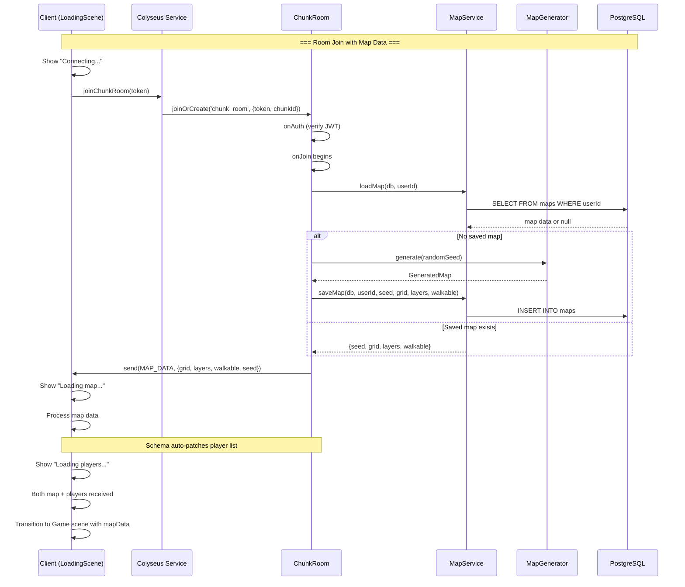
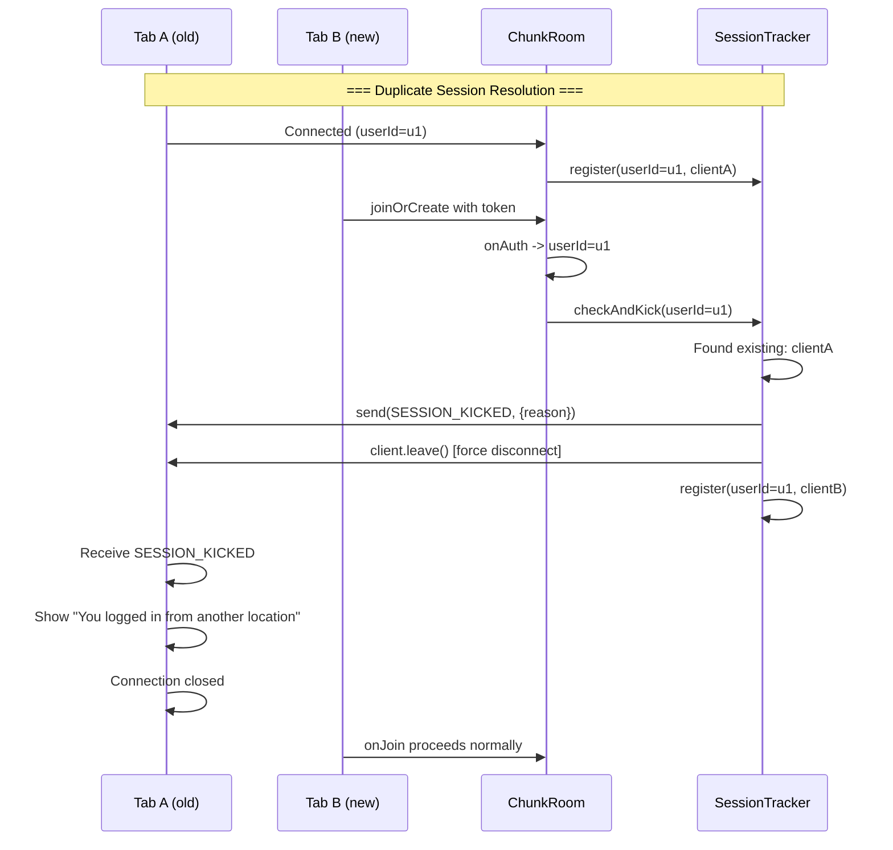

# Client Adaptation Design Document (Phase 2)

## Overview

This document defines the technical design for Phase 2 of the chunk-based room architecture: adapting the game client to speak the new server protocol, adding client-side movement prediction with server reconciliation, moving map generation to the server with database persistence, implementing a loading screen for the room join flow, and enforcing single-session per user. This design covers FR-15 through FR-20 from PRD-005.

## Design Summary (Meta)

```yaml
design_type: "extension"
risk_level: "medium"
complexity_level: "high"
complexity_rationale: >
  (1) ACs require coordinated changes across 15+ files spanning 4 projects
  (game client, server, shared, db) and 5 technical domains (networking protocol,
  input prediction, procedural generation, database persistence, scene management).
  FR-16 manages 3+ states (predicted position, authoritative position, reconciliation
  mode). FR-19 manages 4 loading states with timeout/retry logic.
  (2) Constraints: movement prediction must apply within same frame as input (zero
  additional frames of lag); map generation pipeline must work identically in Node.js
  as in browser; map data serialization must stay under 500KB; loading screen must
  gate on two independent async data sources (map + players); session enforcement
  must handle race conditions between auth and kick.
main_constraints:
  - "Client protocol is a breaking change -- no backward compatibility with game_room"
  - "Movement prediction must be zero-frame-lag (apply in same update loop as input)"
  - "Map generation pipeline must produce identical output in Node.js and browser"
  - "Map data sent via Colyseus message (not schema) due to size"
  - "Loading screen gates on both map data AND player snapshot before showing game"
  - "Session enforcement: newest session wins, old session kicked immediately"
biggest_risks:
  - "Movement prediction visual jitter under variable latency"
  - "Map generation pipeline has hidden browser dependencies (unlikely but untested)"
  - "Map data exceeds 500KB WebSocket message limit"
  - "Race condition between session kick and new session auth"
unknowns:
  - "Optimal correction threshold for movement prediction (8px default, needs tuning)"
  - "Whether alea PRNG produces identical output across Node.js versions"
  - "Exact serialized size of 64x64 map with 3 layers"
```

## Background and Context

### Prerequisite ADRs

- **ADR-0006: Chunk-Based Room Architecture** -- Covers World-Room state ownership, chunk room lifecycle, movement authority, broadcasting strategy. All decisions apply to Phase 2.
- **ADR-003: Authentication Bridge between NextAuth and Colyseus** -- JWT verification mechanism reused unchanged.
- **ADR-005: Multiplayer Position Synchronization Protocol** -- Partially superseded by Phase 1. Phase 2 completes the supersession by replacing client-authoritative position sync with prediction+reconciliation.
- **Design-005: Chunk-Based Room Architecture (Phase 1)** -- Server-side implementation this document extends to the client.

### Agreement Checklist

#### Scope

- [x] Update `apps/game/src/services/colyseus.ts` to connect to `chunk_room` instead of `game_room`
- [x] Update `apps/game/src/game/multiplayer/PlayerManager.ts` to use new protocol (dx/dy, worldX/worldY, chunk transitions)
- [x] Update `apps/game/src/game/entities/PlayerSprite.ts` to position at (worldX, worldY)
- [x] Update `apps/game/src/game/entities/Player.ts` to support prediction mode
- [x] Update `apps/game/src/game/entities/states/WalkState.ts` to send dx/dy and apply prediction
- [x] Update `apps/game/src/game/scenes/Game.ts` to receive map data from server (no local generation)
- [x] Create new Phaser `LoadingScene` for room join loading flow
- [x] Update `apps/game/src/game/main.ts` to register LoadingScene
- [x] Move map generation pipeline to `apps/server/src/mapgen/`
- [x] Move map types to `packages/shared/src/types/map.ts`
- [x] Create `maps` database table in `packages/db/src/schema/maps.ts`
- [x] Create `MapService` in `packages/db/src/services/map.ts`
- [x] Create `SessionTracker` in `apps/server/src/sessions/SessionTracker.ts`
- [x] Update `apps/server/src/rooms/ChunkRoom.ts` to send map data, integrate session tracking
- [x] Update `packages/shared/src/constants.ts` with new constants
- [x] Update `packages/shared/src/types/messages.ts` with new message types
- [x] Update `packages/shared/src/index.ts` with new exports

#### Non-Scope (Explicitly not changing)

- [x] Authentication bridge (`apps/server/src/auth/verifyToken.ts`) -- reused as-is
- [x] World module (`apps/server/src/world/World.ts`) -- no changes to movement logic
- [x] ChunkManager (`apps/server/src/world/ChunkManager.ts`) -- no changes
- [x] ChunkRoomState schema (`apps/server/src/rooms/ChunkRoomState.ts`) -- no changes
- [x] ServerPlayer model (`apps/server/src/models/Player.ts`) -- no changes
- [x] PlayerPositionService (`packages/db/src/services/player.ts`) -- no changes
- [x] Skin system -- retained as-is
- [x] Tile-level collision detection -- not in scope
- [x] NPC system, farming, combat, chat -- future features
- [x] React LoadingScreen component (`apps/game/src/components/game/LoadingScreen.tsx`) -- kept for asset preloading, LoadingScene is separate Phaser scene for room join

#### Constraints

- [x] Parallel operation: Yes (server on port 2567, Next.js on port 3000)
- [x] Backward compatibility: Not required for room protocol (breaking change, consistent with Phase 1)
- [x] Performance measurement: Required (prediction zero-frame-lag, map data <500KB, loading <2s)

### Problem to Solve

Phase 1 established the server-side chunk architecture, but the game client still speaks the legacy `game_room` protocol: it joins `game_room`, sends absolute position updates, generates maps locally, and has no concept of chunk rooms or server-authoritative movement. The client must be updated to match the server's new protocol, and several new capabilities must be added: movement prediction for responsive feel despite server authority, server-side map generation with persistence, a loading screen for the room join flow, and single-session enforcement to prevent dual-tab conflicts.

### Current Challenges

1. **Protocol mismatch**: Client sends `PositionUpdatePayload {x, y, direction, animState}` to `game_room`; server expects `MovePayload {dx, dy}` on `chunk_room`
2. **Client-authoritative position**: Client reports its own position; no prediction or reconciliation mechanism exists
3. **Client-side map generation**: Map is generated in-browser (Game.ts create()), not server-side; maps are not persisted
4. **No loading orchestration**: Game scene starts immediately after Phaser asset preload, with no waiting for server data
5. **No session enforcement**: Multiple tabs can connect simultaneously as the same user

### Requirements

#### Functional Requirements

- FR-15: Client Protocol Update (chunk_room, MovePayload, PlayerState, CHUNK_TRANSITION handling)
- FR-16: Client-Side Movement Prediction (local prediction, threshold-based reconciliation)
- FR-17: Server-Side Map Generation (pipeline on server, map data transmission to client)
- FR-18: Map Persistence (maps table, save on generation, load on reconnect)
- FR-19: Loading Screen (Phaser scene, progress states, timeout/retry)
- FR-20: Single-Session Enforcement (in-memory tracker, kick old session, client error handling)

#### Non-Functional Requirements

- **Performance**: Zero-frame prediction lag; map data <500KB; map gen <500ms; map load <50ms; loading total <2s
- **Reliability**: Prediction recovery within single frame on large desync; session cleanup on all disconnect paths
- **Security**: Server-authoritative maps (client cannot generate/tamper); single session prevents exploit duplication

## Acceptance Criteria (AC) - EARS Format

### FR-15: Client Protocol Update

- [ ] **When** the client connects to the server, the system shall join a room of type `chunk_room` (not `game_room`)
- [ ] **When** the player presses a movement key, the client shall send `{ dx, dy }` (not `{ x, y, direction, animState }`)
- [ ] **When** a remote player's state changes on the server, the client shall position the remote player sprite at `(worldX, worldY)` instead of `(x, y)`
- [ ] **When** the server sends a `CHUNK_TRANSITION` message with a new chunkId, the client shall leave the current room and join the new chunk room
- [ ] No references to `game_room`, `ROOM_NAME`, `PositionUpdatePayload`, or legacy `x`/`y` positioning shall remain in the client codebase after this change

### FR-16: Client-Side Movement Prediction

- [ ] **When** the player presses a movement key, the player sprite shall move within the same frame (zero additional frames of input lag) AND a `{ dx, dy }` message shall be sent to the server
- [ ] **When** the server responds with an authoritative position that is less than `CORRECTION_THRESHOLD` pixels from the predicted position, the client shall smoothly interpolate to the authoritative position over multiple frames
- [ ] **When** the server responds with an authoritative position that exceeds `CORRECTION_THRESHOLD` pixels from the predicted position, the client shall snap to the authoritative position in a single frame
- [ ] **While** the player is moving, the client shall maintain both a predicted position (local) and an authoritative position (from server) and render at the predicted position

### FR-17: Server-Side Map Generation

- [ ] **When** a new player with no saved map connects, the server shall generate a map using the pipeline (IslandPass, ConnectivityPass, WaterBorderPass, AutotilePass), save it to the database, and send complete map data (grid, layers, walkable) to the client
- [ ] **When** a returning player with a saved map connects, the server shall load the map from the database and send it to the client
- [ ] The client shall render the received map data directly without performing any local generation
- [ ] **When** two maps are generated with the same seed, the grid, layers, and walkability data shall be identical

### FR-18: Map Persistence

- [ ] **When** a new player connects for the first time, a row shall exist in the `maps` table with their userId, a seed, grid, layers, and walkable data
- [ ] **When** a returning player connects, the server shall query `maps` by userId and return the previously saved map data
- [ ] The `maps` migration shall be additive and backward-compatible (no existing tables affected)

### FR-19: Loading Screen on Room Join

- [ ] **When** the client joins a chunk room and map data has not yet arrived, the loading screen shall show "Loading map..."
- [ ] **When** map data arrives but the player snapshot has not yet arrived, the loading screen shall show "Loading players..."
- [ ] **When** both map data and player snapshot have been received, the loading screen shall dismiss and the game scene shall render
- [ ] **If** the client has been waiting for data for more than `LOADING_TIMEOUT_MS` (10s), **then** the loading screen shall show an error with a "Retry" button
- [ ] **When** the WebSocket connection fails during "Connecting..." stage, the loading screen shall show "Connection failed" with a retry option

### FR-20: Single-Session Enforcement

- [ ] **When** a player is connected in Tab A and the same player connects in Tab B, Tab A shall receive a "kicked" message and be disconnected, and Tab B shall proceed normally
- [ ] **When** a player disconnects, the session tracker shall have no entry for that userId
- [ ] **When** a player with no active session connects, no "kicked" message shall be sent
- [ ] **When** a client receives a "kicked" message, it shall display an error message: "You logged in from another location"

## Existing Codebase Analysis

### Implementation Path Mapping

| Type | Path | Description |
|------|------|-------------|
| Existing (modify) | `apps/game/src/services/colyseus.ts` | Change room type from `game_room` to `chunk_room`, add chunk transition support |
| Existing (modify) | `apps/game/src/game/multiplayer/PlayerManager.ts` | Replace position sync with dx/dy, handle worldX/worldY, chunk transitions |
| Existing (modify) | `apps/game/src/game/entities/PlayerSprite.ts` | Use worldX/worldY for positioning |
| Existing (modify) | `apps/game/src/game/entities/Player.ts` | Add prediction state (predictedX/Y, authoritativeX/Y) |
| Existing (modify) | `apps/game/src/game/entities/states/WalkState.ts` | Send dx/dy to server, apply prediction locally |
| Existing (modify) | `apps/game/src/game/entities/states/IdleState.ts` | Minor: handle server reconciliation while idle |
| Existing (modify) | `apps/game/src/game/scenes/Game.ts` | Remove local mapgen, receive map data from server, receive from LoadingScene |
| Existing (modify) | `apps/game/src/game/main.ts` | Register LoadingScene in Phaser config |
| Existing (modify) | `apps/game/src/components/game/GameApp.tsx` | No change needed (React LoadingScreen remains for asset preload) |
| Existing (modify) | `apps/server/src/rooms/ChunkRoom.ts` | Add map data sending on join, integrate SessionTracker |
| Existing (modify) | `apps/server/src/main.ts` | Import and initialize SessionTracker |
| Existing (modify) | `packages/shared/src/constants.ts` | Add CORRECTION_THRESHOLD, LOADING_TIMEOUT_MS, INTERPOLATION_SPEED |
| Existing (modify) | `packages/shared/src/types/messages.ts` | Add ServerMessage.MAP_DATA, SESSION_KICKED; add MapDataPayload |
| Existing (modify) | `packages/shared/src/index.ts` | Export new types/constants |
| Existing (modify) | `packages/db/src/schema/index.ts` | Export maps schema |
| Existing (modify) | `packages/db/src/index.ts` | Export map service |
| Existing (retain) | `apps/game/src/game/mapgen/` | Retained for reference; client no longer calls generate() |
| Existing (retain) | `apps/game/src/game/systems/movement.ts` | Retained for client-side prediction movement calculation |
| Existing (retain) | `apps/game/src/components/game/LoadingScreen.tsx` | Retained for Phaser asset preload |
| Existing (retain) | `apps/server/src/world/World.ts` | Unchanged |
| Existing (retain) | `apps/server/src/world/ChunkManager.ts` | Unchanged |
| Existing (retain) | `apps/server/src/rooms/ChunkRoomState.ts` | Unchanged |
| Existing (retain) | `apps/server/src/models/Player.ts` | Unchanged |
| New | `apps/game/src/game/scenes/LoadingScene.ts` | Phaser loading scene for room join flow |
| New | `apps/server/src/mapgen/index.ts` | Server-side map generation pipeline |
| New | `apps/server/src/mapgen/types.ts` | Server-side map types (re-export from shared) |
| New | `apps/server/src/mapgen/passes/island-pass.ts` | Copied from client mapgen |
| New | `apps/server/src/mapgen/passes/connectivity-pass.ts` | Copied from client mapgen |
| New | `apps/server/src/mapgen/passes/water-border-pass.ts` | Copied from client mapgen |
| New | `apps/server/src/mapgen/passes/autotile-pass.ts` | Copied from client mapgen (no browser deps) |
| New | `apps/server/src/sessions/SessionTracker.ts` | In-memory session tracking |
| New | `packages/shared/src/types/map.ts` | Shared map types (GeneratedMap, LayerData, etc.) |
| New | `packages/db/src/schema/maps.ts` | Maps database table |
| New | `packages/db/src/services/map.ts` | Map persistence service (save/load) |

### Code Inspection Evidence

| File Inspected | Key Finding | Design Impact |
|---------------|-------------|---------------|
| `apps/game/src/services/colyseus.ts` (lines 1-182) | Uses `ROOM_NAME` (game_room) for joinOrCreate; types are `GameRoomState`; singleton pattern with `currentRoom` variable | Must change to `CHUNK_ROOM_NAME`; need `joinChunkRoom(chunkId)` that accepts chunkId parameter; add `handleChunkTransition()` method |
| `apps/game/src/game/multiplayer/PlayerManager.ts` (lines 1-223) | Sends `PositionUpdatePayload` via `POSITION_UPDATE` message type; creates PlayerSprite at `(player.x, player.y)`; onChange reads `player.x`, `player.y`, `player.direction`, `player.animState` | Must change to send `MovePayload {dx, dy}` via `ClientMessage.MOVE`; create sprites at `(player.worldX, player.worldY)`; onChange reads `player.worldX`, `player.worldY`, `player.direction` |
| `apps/game/src/game/entities/PlayerSprite.ts` (lines 1-160) | Already has lerp interpolation with SNAP_THRESHOLD and LERP_DURATION_MS; setTarget(x, y) drives interpolation | Reusable for remote player rendering; change constructor to accept (worldX, worldY) |
| `apps/game/src/game/entities/Player.ts` (lines 1-133) | Uses `GeneratedMap` for collision detection in WalkState; has `moveTarget` for click-to-move; no prediction state | Must add prediction fields (predictedX, predictedY, authoritativeX, authoritativeY); mapData must come from server |
| `apps/game/src/game/entities/states/WalkState.ts` (lines 1-154) | Calls `calculateMovement()` for local physics; updates `context.setPosition(result.x, result.y)` directly | Must also send dx/dy to server after local prediction; prediction applies movement locally for zero-lag feel |
| `apps/game/src/game/scenes/Game.ts` (lines 1-179) | Creates MapGenerator inline in create(); reads seed from URL; renders map to RenderTexture; creates Player with mapData; creates PlayerManager | Must remove MapGenerator; receive mapData from LoadingScene via scene data; keep rendering logic |
| `apps/game/src/game/main.ts` (lines 1-26) | Phaser config with scenes: [Boot, Preloader, MainGame] | Must add LoadingScene between Preloader and MainGame |
| `apps/game/src/game/mapgen/index.ts` (lines 1-88) | MapGenerator uses `alea` for seedable PRNG; depends on `simplex-noise`, `terrain-properties`, pure types | All dependencies are pure JS; safe to run in Node.js; copy to server |
| `apps/game/src/game/mapgen/passes/autotile-pass.ts` (lines 1-119) | Imports from `../../autotile` for frame computation; no DOM/Canvas/Phaser deps | Pure math; safe for Node.js |
| `apps/game/src/game/mapgen/passes/island-pass.ts` (line 1-20) | Uses `simplex-noise` createNoise2D; imports constants from `../../constants` | Pure JS; constants need to be available on server |
| `apps/server/src/rooms/ChunkRoom.ts` (lines 1-214) | onJoin loads position, creates ServerPlayer, adds to schema; onAuth verifies JWT; handleMove delegates to World | Must extend onJoin to load/generate map and send MAP_DATA message; add session tracking in onAuth |
| `apps/server/src/main.ts` (lines 1-70) | Initializes DB, World, ChunkManager; defines ChunkRoom | Must initialize SessionTracker |
| `packages/shared/src/types/messages.ts` (lines 1-31) | Existing ServerMessage has ERROR and CHUNK_TRANSITION | Must add MAP_DATA and SESSION_KICKED |
| `packages/shared/src/constants.ts` (lines 1-57) | Has CHUNK_SIZE, MAX_SPEED, DEFAULT_SPAWN, WORLD_BOUNDS, CHUNK_TRANSITION_COOLDOWN_MS | Must add CORRECTION_THRESHOLD, LOADING_TIMEOUT_MS, INTERPOLATION_SPEED |
| `packages/db/src/services/player.ts` (lines 1-89) | Uses object parameter pattern; DrizzleClient as first param; onConflictDoUpdate for upserts | MapService must follow same patterns |
| `packages/db/src/schema/player-positions.ts` (lines 1-25) | pgTable with uuid PK + FK to users, real for coordinates, varchar for strings, timestamp | Maps schema must follow same pattern |
| `apps/game/src/game/systems/movement.ts` (lines 1-200) | Pure functions: calculateMovement, getTerrainSpeedModifier; framework-agnostic | Reuse for client-side prediction movement calculation |
| `apps/game/src/components/game/LoadingScreen.tsx` (lines 1-67) | React component; listens for EventBus 'preload-complete'; purely for Phaser asset loading | Separate from the new LoadingScene; both coexist |

### Similar Functionality Search

- **Movement prediction/reconciliation**: No existing prediction system. PlayerSprite has lerp interpolation for remote players but no local prediction. New implementation justified.
- **Map persistence**: No existing map storage. Only `player_positions` table exists. New `maps` table justified.
- **Session tracking**: No existing session enforcement. ChunkRoom has no duplicate detection. New implementation justified.
- **Loading scene (Phaser)**: No existing Phaser loading scene for server data. The React LoadingScreen handles asset preloading only. New Phaser LoadingScene justified.
- **Map generation on server**: Mapgen code exists only in client (`apps/game/src/game/mapgen/`). Must be copied to server. New server-side location justified.

## Applicable Standards

### Classification Table

| Standard | Type | Source | Impact on Design |
|----------|------|--------|-----------------|
| Prettier: single quotes, 2-space indent | Explicit | `.prettierrc` | All new code must use single quotes and 2-space indent |
| ESLint: @nx/eslint-plugin flat config | Explicit | `eslint.config.mjs` | All new TS files must pass ESLint |
| TypeScript: strict mode, ES2022 target, bundler resolution | Explicit | `tsconfig.base.json` | All new code must pass strict type checking |
| Colyseus decorators: experimentalDecorators + useDefineForClassFields:false | Explicit | `apps/server/tsconfig.json` | Schema classes on server use @type() decorators |
| Jest testing with mock patterns | Explicit | `apps/server/src/rooms/GameRoom.spec.ts` | Tests follow established jest.mock pattern |
| Phaser scene lifecycle (constructor, create, update) | Explicit | `apps/game/src/game/scenes/Game.ts` | LoadingScene must follow Phaser scene conventions |
| Drizzle ORM schema patterns (pgTable, uuid, timestamp) | Implicit | `packages/db/src/schema/player-positions.ts` | Maps schema follows same pgTable definition pattern |
| Service function pattern (db as first param, object params for 3+) | Implicit | `packages/db/src/services/player.ts` | MapService follows same pattern |
| Console.log with `[ModuleName]` prefix | Implicit | All server modules | New server modules use prefixed logging |
| Shared types exported via index.ts barrel | Implicit | `packages/shared/src/index.ts` | New shared types re-exported through index.ts |
| EventBus for cross-system communication in Phaser | Implicit | `apps/game/src/game/EventBus.ts` | LoadingScene emits events for status updates |
| Singleton pattern for client services | Implicit | `apps/game/src/services/colyseus.ts` | Colyseus service retains singleton pattern |

## Design

### Change Impact Map

```yaml
Change Target: Client adaptation for chunk-based rooms
Direct Impact:
  - apps/game/src/services/colyseus.ts (room type change, chunk transition support)
  - apps/game/src/game/multiplayer/PlayerManager.ts (protocol change, worldX/worldY)
  - apps/game/src/game/entities/PlayerSprite.ts (worldX/worldY positioning)
  - apps/game/src/game/entities/Player.ts (prediction state fields)
  - apps/game/src/game/entities/states/WalkState.ts (send dx/dy, prediction)
  - apps/game/src/game/entities/states/IdleState.ts (reconciliation while idle)
  - apps/game/src/game/scenes/Game.ts (remove local mapgen, receive data from LoadingScene)
  - apps/game/src/game/main.ts (register LoadingScene)
  - apps/server/src/rooms/ChunkRoom.ts (map data send, session tracking)
  - apps/server/src/main.ts (SessionTracker init)
  - packages/shared/src/constants.ts (new constants)
  - packages/shared/src/types/messages.ts (new message types)
  - packages/shared/src/index.ts (new exports)
  - packages/db/src/schema/index.ts (maps export)
  - packages/db/src/index.ts (map service export)
Indirect Impact:
  - apps/game/src/game/mapgen/ (client no longer calls generate() directly; code retained for reference)
  - apps/game/src/components/game/GameApp.tsx (no code change; LoadingScreen React component unchanged but user sees Phaser LoadingScene before it)
No Ripple Effect:
  - apps/server/src/auth/verifyToken.ts (unchanged)
  - apps/server/src/world/World.ts (unchanged)
  - apps/server/src/world/ChunkManager.ts (unchanged)
  - apps/server/src/rooms/ChunkRoomState.ts (unchanged)
  - apps/server/src/models/Player.ts (unchanged)
  - packages/db/src/services/player.ts (unchanged)
  - packages/db/src/schema/player-positions.ts (unchanged)
  - packages/db/src/adapters/ (unchanged)
  - Build tooling (unchanged)
```

### Architecture Overview



### Data Flow

#### Movement Prediction and Reconciliation Flow



#### Map Generation and Loading Flow



#### Session Enforcement Flow



### Integration Points List

| Integration Point | Location | Old Implementation | New Implementation | Switching Method |
|-------------------|----------|-------------------|-------------------|------------------|
| Room join | `colyseus.ts` | `joinOrCreate(ROOM_NAME, {token})` | `joinOrCreate(CHUNK_ROOM_NAME, {token, chunkId})` | Direct replacement |
| Movement sending | `PlayerManager.sendPositionUpdate()` | `room.send(POSITION_UPDATE, {x,y,dir,anim})` | Removed; WalkState sends `room.send(MOVE, {dx,dy})` directly via service | New pattern |
| Remote player creation | `PlayerManager.setupCallbacks()` | `new PlayerSprite(scene, player.x, player.y, ...)` | `new PlayerSprite(scene, player.worldX, player.worldY, ...)` | Field rename |
| Remote player update | `PlayerManager.setupCallbacks() onChange` | `sprite.setTarget(player.x, player.y)` | `sprite.setTarget(player.worldX, player.worldY)` | Field rename |
| Map generation | `Game.ts create()` | `new MapGenerator().generate(seed)` local | Receive mapData from LoadingScene via scene init data | Complete replacement |
| Scene flow | `main.ts` scenes array | `[Boot, Preloader, MainGame]` | `[Boot, Preloader, LoadingScene, MainGame]` | Add scene |
| Map data delivery | N/A (did not exist) | N/A | `ChunkRoom.onJoin` sends `MAP_DATA` message | New |
| Session enforcement | N/A (did not exist) | N/A | `SessionTracker.checkAndKick()` in `ChunkRoom.onAuth` | New |

### Integration Point Map

```yaml
Integration Point 1:
  Existing Component: apps/game/src/services/colyseus.ts - joinGameRoom()
  Integration Method: Replace with joinChunkRoom(chunkId), add handleTransition()
  Impact Level: High (Process Flow Change)
  Required Test Coverage: Client connects to chunk_room, handles transitions

Integration Point 2:
  Existing Component: apps/game/src/game/multiplayer/PlayerManager.ts - setupCallbacks()
  Integration Method: Change field references from x/y to worldX/worldY
  Impact Level: High (Data Usage Change)
  Required Test Coverage: Remote player sprites positioned correctly

Integration Point 3:
  Existing Component: apps/game/src/game/scenes/Game.ts - create()
  Integration Method: Remove MapGenerator; receive mapData from scene init data
  Impact Level: High (Process Flow Change)
  Required Test Coverage: Game renders server-provided map correctly

Integration Point 4:
  Existing Component: apps/server/src/rooms/ChunkRoom.ts - onJoin()
  Integration Method: Add map load/generate and MAP_DATA message send
  Impact Level: High (Process Flow Change)
  Required Test Coverage: Client receives map data on join

Integration Point 5:
  Existing Component: apps/server/src/rooms/ChunkRoom.ts - onAuth()
  Integration Method: Add SessionTracker check before accepting connection
  Impact Level: High (Process Flow Change)
  Required Test Coverage: Old session kicked when new session connects

Integration Point 6:
  Existing Component: apps/game/src/game/main.ts - Phaser scene config
  Integration Method: Insert LoadingScene into scenes array
  Impact Level: Medium (Scene Flow Change)
  Required Test Coverage: LoadingScene displays then transitions to Game
```

### Main Components

#### Colyseus Service Update (`apps/game/src/services/colyseus.ts`)

- **Responsibility**: Manage chunk room connection lifecycle. Join room by chunkId, handle chunk transitions (leave old, join new), handle session kicked message.
- **Interface**:
  ```typescript
  function joinChunkRoom(chunkId?: string): Promise<Room>;
  function handleChunkTransition(newChunkId: string): Promise<Room>;
  function leaveCurrentRoom(consented?: boolean): Promise<void>;
  function getRoom(): Room | null;
  function disconnect(): Promise<void>;
  function onSessionKicked(callback: () => void): void;
  ```
- **Dependencies**: `@colyseus/sdk`, `@nookstead/shared` (CHUNK_ROOM_NAME, ServerMessage)

#### PlayerManager Update (`apps/game/src/game/multiplayer/PlayerManager.ts`)

- **Responsibility**: Manage remote player sprites using new PlayerState fields (worldX, worldY, direction). Handle CHUNK_TRANSITION messages from server. Remove legacy position sync.
- **Interface**:
  ```typescript
  class PlayerManager {
    connect(): Promise<void>;
    update(delta: number): void;  // drive remote sprite interpolation
    destroy(): void;
    getRoom(): Room | null;
  }
  ```
- **Dependencies**: Colyseus Service, PlayerSprite, `@nookstead/shared`

#### Player Entity Update (`apps/game/src/game/entities/Player.ts`)

- **Responsibility**: Local player with prediction state. Tracks predicted position (updated locally on input) and authoritative position (updated on server response). Renders at predicted position. Reconciles when server response arrives.
- **New fields**:
  ```typescript
  // Prediction state
  authoritativeX: number;
  authoritativeY: number;

  // Reconciliation
  reconcile(serverX: number, serverY: number): void;
  ```
- **Dependencies**: StateMachine, InputController, movement system
- **Reconciliation ownership**: Reconciliation is driven at the Player entity level via the `reconcile()` method, NOT within individual FSM states. When `reconcile(serverX, serverY)` is called (triggered by schema onChange), the Player entity computes the delta and applies either smooth interpolation or snap regardless of which state (WalkState, IdleState, etc.) is active. IdleState does not need explicit reconciliation logic. If the player stops moving while interpolation is in progress, the interpolation continues to completion at the Player entity level.
- **Test case**: "Player stops moving while reconciliation interpolation is in progress" -- verify interpolation completes smoothly without visual jitter when state transitions from Walk to Idle mid-reconciliation.

#### LoadingScene (`apps/game/src/game/scenes/LoadingScene.ts`)

- **Responsibility**: Orchestrate room join flow. Connect to server, wait for MAP_DATA message and player snapshot, display progress, transition to Game scene when all data received. Handle timeout and retry.
- **Interface**: Phaser Scene lifecycle (create, update)
- **States**: `CONNECTING` -> `LOADING_MAP` -> `LOADING_PLAYERS` -> `READY` or `ERROR`
- **Dependencies**: Colyseus Service, EventBus, `@nookstead/shared` (LOADING_TIMEOUT_MS)

#### Server MapGenerator (`apps/server/src/mapgen/index.ts`)

- **Responsibility**: Run the map generation pipeline on the server. Identical logic to client mapgen but running in Node.js.
- **Interface**:
  ```typescript
  class MapGenerator {
    addPass(pass: GenerationPass): this;
    setLayerPass(pass: LayerPass): this;
    generate(seed?: number): GeneratedMap;
  }
  ```
- **Dependencies**: `alea`, `simplex-noise`, shared map types

#### SessionTracker (`apps/server/src/sessions/SessionTracker.ts`)

- **Responsibility**: Track active sessions per userId in memory. Detect duplicates and kick old sessions. Clean up on disconnect.
- **Interface**:
  ```typescript
  class SessionTracker {
    register(userId: string, client: Client, room: Room): void;
    unregister(userId: string): void;
    checkAndKick(userId: string): Promise<void>;
  }
  ```
- **Dependencies**: Colyseus Client type, `@nookstead/shared` (ServerMessage.SESSION_KICKED)

#### MapService (`packages/db/src/services/map.ts`)

- **Responsibility**: Database CRUD for map data. Save generated maps, load existing maps.
- **Interface**:
  ```typescript
  function saveMap(db: DrizzleClient, data: SaveMapData): Promise<void>;
  function loadMap(db: DrizzleClient, userId: string): Promise<LoadMapResult | null>;
  ```
- **Dependencies**: DrizzleClient, maps schema

### Contract Definitions

```typescript
// === New Shared Constants ===

const CORRECTION_THRESHOLD = 8;   // pixels; below = interpolate, above = snap
const LOADING_TIMEOUT_MS = 10000; // 10 seconds before showing error
const INTERPOLATION_SPEED = 0.2;  // lerp factor per frame for smooth correction

// === New Server Messages ===

const ServerMessage = {
  ERROR: 'error',
  CHUNK_TRANSITION: 'chunk_transition',
  MAP_DATA: 'map_data',
  SESSION_KICKED: 'session_kicked',
} as const;

// === Map Data Payload (Server -> Client) ===

interface MapDataPayload {
  seed: number;
  width: number;
  height: number;
  grid: SerializedGrid;     // Cell[][] serialized (terrain + elevation + meta)
  layers: SerializedLayer[]; // LayerData[] (name, terrainKey, frames[][])
  walkable: boolean[][];     // walkability grid
}

// Serialized types for network transfer (same structure, explicit for clarity)
type SerializedGrid = Array<Array<{
  terrain: string;
  elevation: number;
  meta: Record<string, number>;
}>>;

interface SerializedLayer {
  name: string;
  terrainKey: string;
  frames: number[][];
}

// === Session Kicked Payload ===

interface SessionKickedPayload {
  reason: string;
}

// === Shared Map Types (moved from client) ===

// These types move to packages/shared/src/types/map.ts:
// TerrainCellType, Cell, CellAction, Grid, LayerData, GeneratedMap,
// GenerationPass, LayerPass
```

### Data Contract

#### MapService.saveMap

```yaml
Input:
  Type: (db: DrizzleClient, data: SaveMapData)
  SaveMapData:
    userId: string (uuid)
    seed: number
    grid: object (JSON-serializable grid)
    layers: object (JSON-serializable layers)
    walkable: boolean[][] (JSON-serializable)
  Preconditions:
    - userId exists in the users table
    - grid, layers, walkable are valid JSON-serializable objects
  Validation: None (caller validates)

Output:
  Type: Promise<void>
  Guarantees:
    - A row exists in maps with the given userId after completion
    - If a row already existed, it is updated (upsert)
  On Error: Throws (caller must handle)

Invariants:
  - At most one row per userId in maps (unique constraint)
```

#### MapService.loadMap

```yaml
Input:
  Type: (db: DrizzleClient, userId: string)
  Preconditions:
    - userId is a valid UUID string
  Validation: None

Output:
  Type: Promise<LoadMapResult | null>
  LoadMapResult:
    seed: number
    grid: object (parsed from JSONB)
    layers: object (parsed from JSONB)
    walkable: boolean[][] (parsed from JSONB)
  Guarantees:
    - Returns null if no map exists for userId
    - Returns complete map data if map exists
  On Error: Throws (caller must handle)

Invariants:
  - Read-only operation; no data modification
```

#### SessionTracker.checkAndKick

```yaml
Input:
  Type: (userId: string)
  Preconditions:
    - userId is a non-empty string

Output:
  Type: Promise<void>
  Guarantees:
    - If an existing session for userId was found, it has been sent SESSION_KICKED and disconnected
    - The session tracker entry has been cleared for the old session
  On Error: Errors during kick are logged but not thrown (must not block new session)

Invariants:
  - At most one active session per userId after completion
```

### Data Representation Decisions

| Data Structure | Decision | Rationale |
|---|---|---|
| MapDataPayload (network message) | **New** dedicated type | No existing type for map data over WebSocket. New domain concept specific to map transmission. |
| SerializedGrid / SerializedLayer | **Reuse** existing GeneratedMap structure | The grid/layer types from GeneratedMap are serialized as-is via JSON/MsgPack. Same structure, just explicit naming for network context. |
| maps DB table | **New** table | No existing map storage. The users table has no map columns. Separate table follows the same pattern as player_positions (separate concern from identity). |
| SessionKickedPayload | **New** type | No existing session/kick message type. New domain concept. |
| LoadingScene state enum | **New** enum | No existing loading state machine. New UI concept for room join flow. |
| CORRECTION_THRESHOLD constant | **New** constant | No existing prediction threshold. New domain concept. |
| Shared map types (GeneratedMap, etc.) | **Reuse** existing types + relocate | Existing types in `apps/game/src/game/mapgen/types.ts` are moved to `packages/shared/src/types/map.ts` so both server and client can import them. Same types, new location. |

### Field Propagation Map

```yaml
fields:
  - name: "mapData (grid, layers, walkable)"
    origin: "Server MapGenerator pipeline (or DB load)"
    transformations:
      - layer: "Server (MapGenerator)"
        type: "GeneratedMap { grid, layers, walkable, seed }"
        validation: "Pipeline ensures valid terrain types, frame indices, walkability"
      - layer: "Database (maps table)"
        type: "JSONB columns: grid, layers, walkable"
        transformation: "JSON serialization via Drizzle; stored as-is"
      - layer: "Network (Server -> Client)"
        type: "MapDataPayload via room.send(MAP_DATA)"
        transformation: "MsgPack encoding by Colyseus; direct serialization of objects"
      - layer: "Client (LoadingScene)"
        type: "MapDataPayload received"
        transformation: "Pass to Game scene via scene init data"
      - layer: "Client (Game Scene)"
        type: "GeneratedMap"
        transformation: "Render to RenderTexture using Phaser sprites"
    destination: "Phaser RenderTexture (visual map) + Player entity (walkable grid for prediction)"
    loss_risk: "low"
    loss_risk_reason: "JSON serialization may lose numeric precision for elevation (float64 -> JSON -> float64 is lossless for finite values); frame indices are integers (no precision loss)"

  - name: "dx / dy (movement input)"
    origin: "Client InputController + WalkState calculation"
    transformations:
      - layer: "Client (WalkState)"
        type: "{ dx: number, dy: number }"
        validation: "Computed from normalized direction * speed * delta"
        transformation: "Applied locally for prediction (setPosition)"
      - layer: "Network (Client -> Server)"
        type: "MovePayload { dx: number, dy: number }"
        transformation: "MsgPack encoding"
      - layer: "Server (ChunkRoom)"
        type: "MovePayload"
        validation: "typeof check for number on dx and dy"
      - layer: "Server (World)"
        type: "movePlayer(id, dx, dy)"
        transformation: "Speed clamped to MAX_SPEED, bounds clamped to WORLD_BOUNDS"
    destination: "ServerPlayer.worldX/worldY -> ChunkPlayer schema -> Client schema patch"
    loss_risk: "none"

  - name: "authoritative position (worldX, worldY)"
    origin: "Server World.movePlayer() result"
    transformations:
      - layer: "Server (World)"
        type: "MoveResult { worldX, worldY }"
        transformation: "Speed-clamped and bounds-clamped position"
      - layer: "Server (ChunkRoomState schema)"
        type: "ChunkPlayer.worldX / worldY"
        transformation: "Direct copy from MoveResult"
      - layer: "Network (Server -> Client)"
        type: "Colyseus schema delta patch"
        transformation: "Automatic via @colyseus/schema patchRate"
      - layer: "Client (Player entity)"
        type: "authoritativeX / authoritativeY"
        transformation: "Reconciliation: if delta < threshold, interpolate; else snap"
    destination: "Player sprite rendered position (after reconciliation)"
    loss_risk: "low"
    loss_risk_reason: "Schema patching uses binary delta encoding; position values are float64 in JS, float32 in schema (@type number). Precision loss ~0.001px at typical coordinate ranges (0-1024). Acceptable for pixel-art game."

  - name: "userId (session tracking)"
    origin: "JWT token payload"
    transformations:
      - layer: "ChunkRoom.onAuth"
        type: "AuthData.userId"
        validation: "verifyNextAuthToken validates token"
      - layer: "SessionTracker"
        type: "Map<string, {client, room}>"
        transformation: "Used as lookup key"
    destination: "Session tracker (in-memory Map key)"
    loss_risk: "none"
```

### Interface Change Impact Analysis

| Existing Operation | New Operation | Conversion Required | Adapter Required | Compatibility Method |
|-------------------|---------------|-------------------|------------------|---------------------|
| `joinGameRoom()` | `joinChunkRoom(chunkId?)` | Yes | Not Required | Direct replacement in colyseus.ts |
| `PlayerManager.sendPositionUpdate(x, y, dir, anim)` | Removed | Yes | Not Required | WalkState sends dx/dy directly via colyseus service |
| `PlayerManager.sendMove(tileX, tileY)` | Removed | Yes | Not Required | Click-to-move now uses prediction system |
| `new PlayerSprite(scene, player.x, player.y, ...)` | `new PlayerSprite(scene, player.worldX, player.worldY, ...)` | Yes | Not Required | Field rename in constructor call |
| `sprite.setTarget(player.x, player.y)` | `sprite.setTarget(player.worldX, player.worldY)` | Yes | Not Required | Field rename in onChange callback |
| `sprite.updateAnimation(player.direction, player.animState)` | `sprite.updateAnimation(player.direction, derivedAnimState)` | Yes | Not Required | animState derived client-side from movement |
| `MapGenerator.generate(seed)` in Game.ts | Receive mapData from LoadingScene | Yes | Not Required | Complete pattern change |
| `Phaser scenes: [Boot, Preloader, Game]` | `[Boot, Preloader, LoadingScene, Game]` | Yes | Not Required | Add scene to array |
| N/A (no session check) | `SessionTracker.checkAndKick()` in onAuth | N/A (new) | Not Required | New functionality |
| N/A (no map message) | `room.send(MAP_DATA, payload)` in onJoin | N/A (new) | Not Required | New functionality |

### State Transitions and Invariants

#### LoadingScene States

```yaml
State Definition:
  - Initial State: CONNECTING
  - Possible States:
    - CONNECTING: WebSocket room join in progress
    - LOADING_MAP: Room joined, waiting for MAP_DATA message
    - LOADING_PLAYERS: Map received, waiting for initial player snapshot
    - READY: All data received, transitioning to Game scene
    - ERROR: Timeout or connection failure, showing retry option
    - RETRYING: User clicked retry, re-attempting from CONNECTING

State Transitions:
  CONNECTING -> LOADING_MAP: Room join succeeds (onJoin fires)
  CONNECTING -> ERROR: Room join fails or timeout
  LOADING_MAP -> LOADING_PLAYERS: MAP_DATA message received
  LOADING_MAP -> ERROR: Timeout waiting for map data
  LOADING_PLAYERS -> READY: Schema state populated (onAdd fires for players)
  LOADING_PLAYERS -> READY: No other players in chunk (immediate)
  LOADING_PLAYERS -> ERROR: Timeout waiting for player data
  READY -> [Game Scene]: Scene transition with mapData
  ERROR -> RETRYING: User clicks "Retry"
  RETRYING -> CONNECTING: Cleanup complete, restart flow

System Invariants:
  - Game scene never starts without mapData AND player snapshot both received
  - LoadingScene always shows current status text matching its state
  - Timeout timer resets on each state transition
  - Only one room connection attempt is active at a time
```

#### Player Prediction States

```yaml
State Definition:
  - Initial State: SYNCED (predicted == authoritative)
  - Possible States:
    - SYNCED: No pending predictions, positions match
    - PREDICTING: Client has applied local movement, waiting for server ack
    - INTERPOLATING: Small correction in progress (smooth lerp)
    - SNAPPING: Large correction applied immediately

State Transitions:
  SYNCED -> PREDICTING: Player presses movement key (local position applied)
  PREDICTING -> SYNCED: Server response matches predicted within 1px
  PREDICTING -> INTERPOLATING: Server response differs by < CORRECTION_THRESHOLD
  PREDICTING -> SNAPPING: Server response differs by >= CORRECTION_THRESHOLD
  INTERPOLATING -> SYNCED: Interpolation complete (reached authoritative)
  SNAPPING -> SYNCED: Snap applied (immediate, single frame)

System Invariants:
  - Player always renders at predicted position (never authoritative directly)
  - Predicted position is updated every frame during movement input
  - Authoritative position is updated only on server schema change
  - After snap, predicted position equals authoritative position
```

### Integration Boundary Contracts

```yaml
Boundary: Client WalkState -> Colyseus Service (function call)
  Input: MovePayload { dx: number, dy: number }
  Output: void (fire-and-forget; ack comes via schema patch)
  On Error: Room null check; if no room, drop message silently

Boundary: Colyseus Service -> ChunkRoom (WebSocket)
  Input: ClientMessage.MOVE with MovePayload
  Output: Schema delta patch (async, via patchRate)
  On Error: Invalid payload logged, message dropped

Boundary: ChunkRoom -> Client (WebSocket, MAP_DATA message)
  Input: N/A (server-initiated on join)
  Output: MapDataPayload { seed, width, height, grid, layers, walkable }
  On Error: If map generation/load fails, send error message; client shows error in LoadingScene

Boundary: ChunkRoom -> Client (WebSocket, SESSION_KICKED message)
  Input: N/A (server-initiated on duplicate detection)
  Output: SessionKickedPayload { reason: string }
  On Error: If send fails, force disconnect anyway

Boundary: SessionTracker -> ChunkRoom (function call)
  Input: checkAndKick(userId: string)
  Output: Promise<void>
  On Error: Log and continue (must not block new session)

Boundary: MapService -> PostgreSQL (SQL via Drizzle)
  Input: INSERT/SELECT on maps table
  Output: Promise<void> for save, Promise<LoadMapResult | null> for load
  On Error: Throws database error (propagated to ChunkRoom for handling)

Boundary: LoadingScene -> Game Scene (Phaser scene transition)
  Input: scene.start('Game', { mapData, room }) with init data
  Output: Game scene receives data in create(data)
  On Error: If transition fails, LoadingScene stays active
```

### Database Schema

**New table: `maps`** (`packages/db/src/schema/maps.ts`)

```typescript
import { jsonb, pgTable, integer, timestamp, uuid } from 'drizzle-orm/pg-core';
import { users } from './users';

export const maps = pgTable('maps', {
  userId: uuid('user_id')
    .notNull()
    .references(() => users.id, { onDelete: 'cascade' })
    .unique()
    .primaryKey(),
  seed: integer('seed').notNull(),
  grid: jsonb('grid').notNull(),
  layers: jsonb('layers').notNull(),
  walkable: jsonb('walkable').notNull(),
  updatedAt: timestamp('updated_at', { withTimezone: true })
    .defaultNow()
    .notNull(),
});

export type MapRecord = typeof maps.$inferSelect;
export type NewMapRecord = typeof maps.$inferInsert;
```

Design notes:
- `userId` is PK and FK to `users.id` (one map per user), following `player_positions` pattern
- `seed` is integer (map generation seeds are integers)
- `grid`, `layers`, `walkable` are JSONB columns storing the full map data
- Follows the same pgTable/uuid/timestamp pattern as existing tables
- `jsonb` type chosen over `json` for indexing capability and storage efficiency

### Error Handling

| Error Scenario | Handler | Behavior |
|---------------|---------|----------|
| Room join fails in LoadingScene | LoadingScene | Show "Connection failed" with Retry button |
| MAP_DATA timeout (>10s) | LoadingScene | Show "Loading timed out" with Retry button |
| Player snapshot timeout (>10s) | LoadingScene | Show "Loading timed out" with Retry button |
| Map generation fails on server | ChunkRoom.onJoin | Log error, send error message to client, client shows error in LoadingScene |
| Map save fails (DB error) | ChunkRoom.onJoin | Log error, continue (map was generated in memory, send to client anyway; map will be regenerated next session) |
| Map load fails (DB error) | ChunkRoom.onJoin | Log error, regenerate map from scratch |
| Session kick send fails | SessionTracker | Log error, force disconnect old client anyway |
| Stale session entry (edge case) | SessionTracker | On disconnect, always clean up entry; on connect, kick existing even if stale |
| Movement prediction large desync | Player.reconcile() | Snap to authoritative immediately (single frame recovery) |
| Chunk transition fails during loading | Colyseus Service | Log error, remain in current room |
| SESSION_KICKED received by client | Colyseus Service | Emit 'session:kicked' event, leave room, show error modal |
| Client receives MAP_DATA with invalid structure | LoadingScene | Log error, show error with retry |

### Logging and Monitoring

Server-side logging follows the `[ModuleName]` prefix pattern:

```
[SessionTracker] Session registered: userId=user-1, sessionId=abc123
[SessionTracker] Duplicate detected: userId=user-1, kicking old session=xyz789
[SessionTracker] Session unregistered: userId=user-1
[ChunkRoom] Generating map for new player: userId=user-1, seed=42
[ChunkRoom] Map loaded from DB: userId=user-1
[ChunkRoom] MAP_DATA sent: userId=user-1, size=245KB
[ChunkRoom] Map generation failed: userId=user-1, error=...
[MapService] Map saved: userId=user-1, seed=42
[MapService] Map loaded: userId=user-1
```

Client-side logging follows the `[ModuleName]` prefix pattern:

```
[LoadingScene] State: CONNECTING
[LoadingScene] State: LOADING_MAP
[LoadingScene] MAP_DATA received, size: 245KB
[LoadingScene] State: LOADING_PLAYERS
[LoadingScene] State: READY, transitioning to Game
[LoadingScene] Timeout reached, showing error
[ColyseusService] Joining chunk_room, chunkId: city:capital
[ColyseusService] Room joined, sessionId: abc123
[ColyseusService] Chunk transition: city:capital -> world:2:3
[ColyseusService] Session kicked: You logged in from another location
[Player] Prediction reconcile: delta=3.2px (interpolate)
[Player] Prediction reconcile: delta=25px (snap)
```

## Implementation Plan

### Implementation Approach

**Selected Approach**: Hybrid (Foundation-first then Feature-driven vertical slices)

**Selection Reason**: FR-15 (Client Protocol Update) is a foundation that all other FRs depend on -- without it, no client can communicate with the server at all. After the protocol foundation is established, the remaining FRs (FR-16 through FR-20) are relatively independent vertical slices that each deliver testable user value. FR-17 and FR-18 are tightly coupled (map generation requires persistence) and should be implemented together. The hybrid approach ensures the critical path (protocol) is solid before building features on top of it.

### Technical Dependencies and Implementation Order

#### Required Implementation Order

1. **Shared Types and Constants Update** (`packages/shared/`)
   - Technical Reason: All other components import shared types. New message types, map types, and constants must be defined first.
   - Dependent Elements: Colyseus Service, PlayerManager, LoadingScene, ChunkRoom, MapService, SessionTracker

2. **Database Schema: maps table** (`packages/db/`)
   - Technical Reason: MapService needs the schema. Migration must run before map save/load.
   - Prerequisites: Drizzle ORM (already installed)
   - Dependent Elements: MapService, ChunkRoom (map send on join)

3. **MapService** (`packages/db/src/services/map.ts`)
   - Technical Reason: ChunkRoom needs save/load functions for map data
   - Prerequisites: maps schema
   - Dependent Elements: ChunkRoom (onJoin)

4. **FR-15: Client Protocol Update** (colyseus.ts, PlayerManager, PlayerSprite)
   - Technical Reason: Foundation for all client-server communication
   - Prerequisites: Shared types
   - Dependent Elements: All other client-side FRs
   - Verification: L1 -- Client connects to chunk_room, remote players render at worldX/worldY

5. **FR-20: Session Enforcement** (SessionTracker, ChunkRoom, client handler)
   - Technical Reason: Independent of other FRs; can be done in parallel with FR-17/18
   - Prerequisites: Shared types (SESSION_KICKED message)
   - Verification: L1 -- Two tabs, old tab kicked

6. **FR-17 + FR-18: Server-Side Map Generation + Persistence** (server mapgen, MapService integration, ChunkRoom)
   - Technical Reason: Tightly coupled; map generation and persistence are one unit
   - Prerequisites: MapService, shared map types
   - Dependent Elements: FR-19 (LoadingScene needs MAP_DATA message)
   - Verification: L1 -- New player gets map from server, returning player gets same map

7. **FR-16: Movement Prediction** (Player entity, WalkState, reconciliation)
   - Technical Reason: Depends on working protocol (FR-15) and server movement flow
   - Prerequisites: FR-15 working end-to-end
   - Verification: L1 -- Movement feels instant, corrections are smooth/snap

8. **FR-19: Loading Screen** (LoadingScene, Game.ts update, main.ts)
   - Technical Reason: Depends on MAP_DATA message from FR-17
   - Prerequisites: FR-15 (room join), FR-17 (map data message)
   - Verification: L1 -- Loading screen visible during join, transitions to game

### Integration Points

**Integration Point 1: Shared Types -> All Consumers**
- Components: `packages/shared/` -> `apps/server/`, `apps/game/`
- Verification: `pnpm nx typecheck shared && pnpm nx typecheck server && pnpm nx typecheck game`

**Integration Point 2: Maps Schema -> MapService**
- Components: `packages/db/src/schema/maps.ts` -> `packages/db/src/services/map.ts`
- Verification: Unit tests with test database for save/load

**Integration Point 3: Client Protocol -> Server**
- Components: `colyseus.ts` -> `ChunkRoom`
- Verification: Client connects to chunk_room, sends dx/dy, receives schema patches

**Integration Point 4: SessionTracker -> ChunkRoom**
- Components: `SessionTracker.checkAndKick()` -> `ChunkRoom.onAuth()`
- Verification: Two clients connect as same user, first is kicked

**Integration Point 5: MapGenerator -> ChunkRoom -> Client**
- Components: `MapGenerator.generate()` -> `ChunkRoom.onJoin()` -> `MAP_DATA` -> `LoadingScene`
- Verification: New player receives map data, renders it correctly

**Integration Point 6: LoadingScene -> Game Scene**
- Components: `LoadingScene` (scene transition with data) -> `Game.create(data)`
- Verification: Game scene renders map from LoadingScene data, not local generation

**Integration Point 7: Full E2E**
- Components: Client -> LoadingScene -> ChunkRoom -> World -> Schema Patch -> Player Prediction
- Verification: Player joins, sees loading screen, map renders, movement feels instant, remote players visible

### Migration Strategy

This is a continuation of the Phase 1 clean replacement:

1. Client colyseus.ts: Replace `joinGameRoom()` with `joinChunkRoom()`. Remove `ROOM_NAME` import, use `CHUNK_ROOM_NAME`.
2. PlayerManager: Remove `sendPositionUpdate()` and `sendMove()`. Replace field references `x/y` with `worldX/worldY`. Add CHUNK_TRANSITION handler.
3. Game.ts: Remove MapGenerator instantiation and inline generation. Receive mapData from LoadingScene scene data parameter.
4. Player entity: Add prediction fields. WalkState now sends movement to server via colyseus service in addition to local application.
5. LoadingScene: New scene inserted into Phaser scene chain between Preloader and Game.
6. Server ChunkRoom: Extended with map data send and session tracking (additive changes to existing onAuth/onJoin).

There is no gradual migration path for the protocol change (FR-15). The old `game_room` protocol and the new `chunk_room` protocol cannot coexist -- this is consistent with Phase 1's clean replacement approach.

7. **Map type imports**: Client imports of map types (`GeneratedMap`, `Grid`, `Cell`, `LayerData`, etc.) in `Player.ts`, `Game.ts`, and mapgen passes must be updated to import from `@nookstead/shared` instead of `../mapgen/types`. The client's `mapgen/types.ts` file is replaced with re-exports from `@nookstead/shared` to maintain backward compatibility during transition. After all client files are updated, the mapgen generation pipeline code (passes, MapGenerator class) is deleted from the client as it is no longer called -- only the types remain via re-exports.

## Test Strategy

### Basic Test Design Policy

All acceptance criteria map to at least one test case. Tests follow the existing jest.mock pattern for server-side tests and Phaser scene testing patterns for client-side.

### Unit Tests

**MapService.spec.ts** (with test DB):
- saveMap: creates new record for new user
- saveMap: updates existing record (upsert)
- loadMap: returns saved map data
- loadMap: returns null for unknown user
- saveMap + loadMap round-trip: data is identical

**SessionTracker.spec.ts**:
- register: stores session entry
- unregister: removes session entry
- checkAndKick: no-op when no existing session
- checkAndKick: sends SESSION_KICKED and disconnects old client when duplicate
- checkAndKick: cleans up old entry after kick
- register after kick: new entry replaces old

**Server MapGenerator.spec.ts**:
- generate(): produces valid GeneratedMap with grid, layers, walkable
- generate(seed): same seed produces identical output
- generate(): different seeds produce different output
- generate(): all pipeline passes execute (island, connectivity, water border, autotile)

**Player prediction (Player.spec.ts)**:
- reconcile(): delta < threshold triggers interpolation mode
- reconcile(): delta >= threshold triggers snap
- reconcile(): snap sets predicted position to authoritative
- reconcile(): interpolation converges over frames

### Integration Tests

**ChunkRoom map integration (ChunkRoom.spec.ts additions)**:
- onJoin new player: generates map, saves to DB, sends MAP_DATA
- onJoin returning player: loads map from DB, sends MAP_DATA
- onJoin map generation failure: sends error, does not crash
- onAuth with duplicate session: sends SESSION_KICKED to old client, new client proceeds

**Client colyseus service integration**:
- joinChunkRoom: connects to chunk_room type
- handleChunkTransition: leaves old room, joins new room
- onSessionKicked: callback fires on SESSION_KICKED message

### E2E Tests

- Client connects, LoadingScene displays, receives map data, transitions to Game scene
- Two clients connect as same user: first client kicked, second proceeds
- Player moves and sees other players' movement in real time (worldX/worldY protocol)
- Player moves: prediction applies immediately, server correction is smooth
- Returning player sees the same map as their previous session
- Loading timeout: after 10s with no data, error screen with retry

### Performance Tests

- Map generation time: <500ms for 64x64 grid with all passes
- Map serialized size: <500KB for 64x64 grid with 3 layers
- Map load from DB: <50ms (single-row JSONB query by PK)
- Movement prediction: zero additional frames of input lag (visual inspection)
- Loading screen total duration: <2s on localhost

## Security Considerations

- **Server-authoritative maps**: Map generation runs exclusively on the server. Clients receive map data but cannot generate or modify it. This prevents map tampering.
- **Single-session enforcement**: Only one active session per userId. Prevents exploit duplication, state conflicts, and resource abuse from multiple simultaneous clients.
- **Input validation**: All dx/dy values validated on server (existing from Phase 1). Map data from server is trusted by client (server is the authority).
- **Authentication**: All connections authenticated via JWT (unchanged from Phase 1).
- **Session tracking cleanup**: Entries cleaned up on all disconnect paths to prevent stale entries from blocking reconnection.
- **Map data integrity**: Maps stored in JSONB with foreign key to users table. Only the server writes map data; clients are read-only consumers.

## Future Extensibility

- **Tile-level collision**: The walkable grid is already part of the map data sent to the client. When tile collision is added to the server (future FR), the client's prediction can also use the walkable grid for more accurate prediction, reducing the frequency of server corrections.
- **Map editing (farming)**: The maps table stores grid data that can be updated when players place objects or modify terrain. The existing upsert pattern supports partial updates.
- **Adjacent chunk preloading**: The LoadingScene pattern can be extended to preload adjacent chunk data before the player crosses a boundary, reducing transition latency.
- **Multi-process session tracking**: The in-memory SessionTracker can be replaced with Redis-backed tracking when horizontal scaling is needed, without changing the interface.
- **Map streaming**: If map data exceeds 500KB, the MAP_DATA message can be split into chunks or compressed. The LoadingScene already supports progressive loading states.

## Alternative Solutions

### Alternative 1: Full Input Replay for Prediction

- **Overview**: Instead of simple threshold-based correction, implement full input replay: client stores all unacknowledged inputs with sequence numbers, replays them from last server-acknowledged state on each server update.
- **Advantages**: More accurate prediction that matches server exactly; handles rapid direction changes better; proven pattern in FPS games.
- **Disadvantages**: Significantly more complex implementation; overkill for a slow-paced farming RPG with walking-speed movement; requires precise matching of client and server physics (server uses simplified physics without terrain speed modifiers). The overhead is not justified given the low movement speed (100px/sec) and typical LAN/broadband latency (<50ms).
- **Reason for Rejection**: The simple threshold-based approach (interpolate below threshold, snap above) is sufficient for Nookstead's movement speed and game genre. Full replay is appropriate for fast-paced competitive games but adds unnecessary complexity here.

### Alternative 2: Map Generation as Shared Package

- **Overview**: Instead of copying mapgen code to the server, create a `packages/mapgen` shared package importable by both server and client.
- **Advantages**: Single source of truth for generation code; no code duplication.
- **Disadvantages**: Adds a new Nx project with its own build config, tsconfig, and dependency management; the client no longer calls generate() directly so the shared package would only be consumed by the server; adds maintenance overhead for a package with one consumer.
- **Reason for Rejection**: Since only the server generates maps and the client only renders, the mapgen code is a server concern. Copying to the server is simpler and avoids a new shared package for code used by only one consumer. If map generation needs to run on both client and server in the future (e.g., for previews), this can be revisited.

### Alternative 3: React-based Loading Screen Instead of Phaser Scene

- **Overview**: Use the existing React LoadingScreen component (or a new React component) with state management for the room join flow, instead of a Phaser scene.
- **Advantages**: React has richer UI capabilities (modals, animations, styling); existing LoadingScreen component could be extended.
- **Disadvantages**: Requires complex coordination between React state and Phaser scene lifecycle; the Phaser game canvas must be hidden/shown; data handoff from React to Phaser is awkward (cannot pass objects via DOM); breaks the Phaser scene chain pattern.
- **Reason for Rejection**: A Phaser LoadingScene is the natural fit because the data (mapData, room) flows directly into the Game scene via Phaser's scene data system. React-to-Phaser data handoff would require an external store or global variable, adding unnecessary coupling.

## Risks and Mitigation

| Risk | Impact | Probability | Mitigation |
|------|--------|-------------|------------|
| Movement prediction visual jitter on high-latency connections | Medium | Medium | Tune CORRECTION_THRESHOLD and INTERPOLATION_SPEED. Use smooth interpolation for small corrections. On very high latency (>200ms), increase threshold to reduce correction frequency. |
| Map generation pipeline has hidden browser dependencies | Medium | Low | Test all passes in Node.js early. The code uses `simplex-noise` and `alea` (both pure JS). AutotilePass uses only math. No DOM/Canvas/Phaser deps found in code inspection. |
| Map data exceeds 500KB WebSocket message limit | High | Low | Measure early. A 64x64 grid with 3 layers and walkability data is estimated at ~200-300KB. If larger, apply JSON compression or strip unnecessary meta fields. |
| Race condition between session kick and new session auth | Medium | Low | SessionTracker.checkAndKick() sends kick and force-disconnects synchronously before registering new session. The new session's onJoin only proceeds after kick completes. |
| alea PRNG produces different output across Node.js versions | Medium | Low | Add a seed determinism test: generate map with fixed seed, compare output hash. The alea library is well-established and version-stable. |
| LoadingScene timeout triggers during slow map generation for new players | Medium | Medium | Map generation should complete in <500ms. The 10s timeout provides ample margin. If generation becomes slow, show "Generating world..." status text. |
| Stale SessionTracker entries after server crash | Medium | Low | Entries are in-memory; server crash clears all entries. On restart, no stale entries exist. The risk is during normal operation if disconnect handlers fail -- mitigated by always cleaning up in onLeave with try/catch. |
| JSONB query performance with large map data | Low | Low | Maps queried by PK (userId). Index performance is O(1). Monitor query times. Consider compression if maps grow significantly. |
| Client mapgen code becomes dead code | Low | High | The client mapgen code at `apps/game/src/game/mapgen/` is no longer called. Leave it for reference in Phase 2 but mark with a TODO comment for removal in a future cleanup. |

## References

- [Client-Side Prediction and Server Reconciliation (Gabriel Gambetta)](https://www.gabrielgambetta.com/client-side-prediction-server-reconciliation.html) -- Authoritative guide on prediction patterns; informed the reconciliation threshold approach
- [Client-Side Prediction Live Demo (Gabriel Gambetta)](https://www.gabrielgambetta.com/client-side-prediction-live-demo.html) -- Interactive demonstration of prediction and reconciliation
- [Colyseus Room API](https://docs.colyseus.io/) -- Room lifecycle, message sending, schema state
- [Colyseus State Synchronization](https://docs.colyseus.io/state) -- Schema delta patching mechanics
- [Colyseus FAQ](https://docs.colyseus.io/faq) -- Message encoding (MsgPack), payload limits
- [Phaser 3 Scenes Documentation](https://docs.phaser.io/phaser/concepts/scenes) -- Scene lifecycle, transitions, data passing
- [Phaser 3 Loader Documentation](https://docs.phaser.io/phaser/concepts/loader) -- Loading progress events
- [Drizzle ORM Documentation](https://orm.drizzle.team/docs/overview) -- Schema definition, JSONB columns, upsert patterns
- [PRD-005: Chunk-Based Room Architecture](../prd/prd-005-chunk-based-room-architecture.md) -- Source requirements (FR-15 through FR-20)
- [Design-005: Chunk-Based Room Architecture (Phase 1)](./design-005-chunk-based-room-architecture.md) -- Server-side design this document extends
- [ADR-0006: Chunk-Based Room Architecture](../adr/ADR-0006-chunk-based-room-architecture.md) -- Architecture decisions

## Update History

| Date | Version | Changes | Author |
|------|---------|---------|--------|
| 2026-02-17 | 1.0 | Initial version | Claude |
