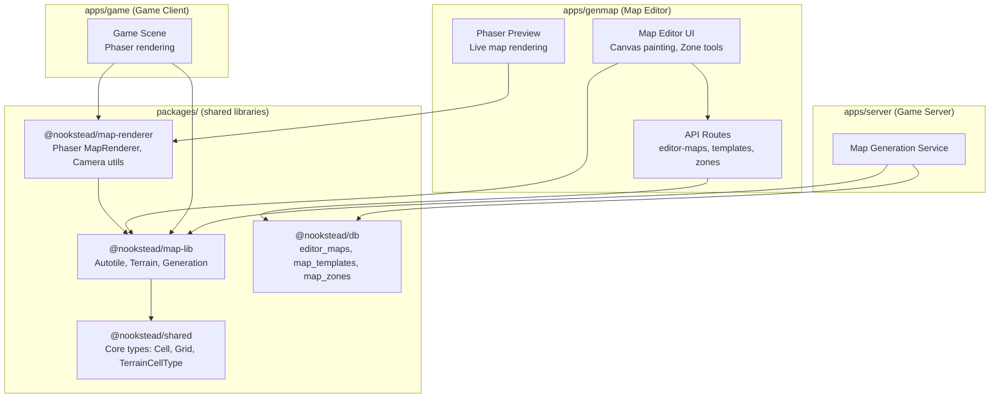
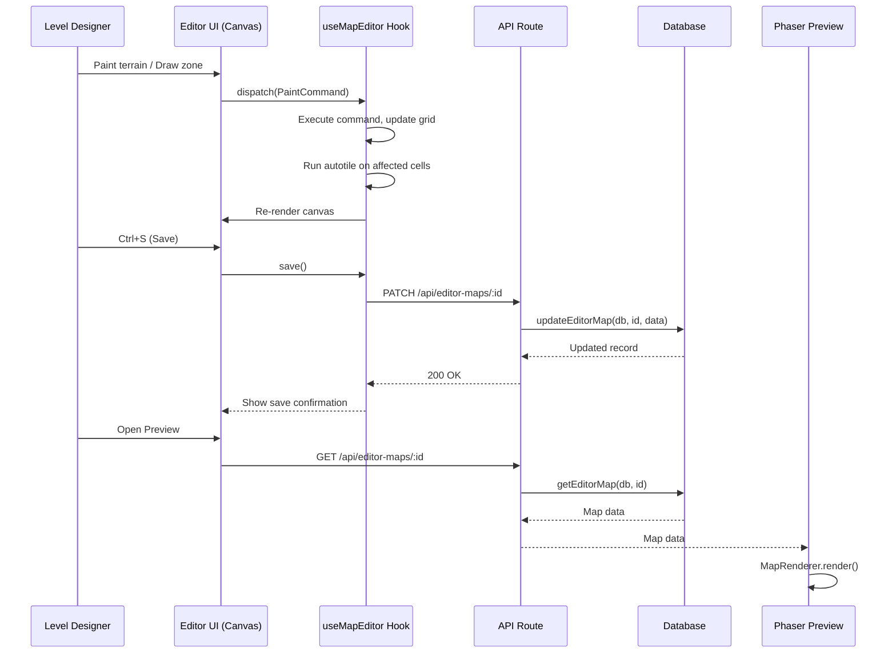

# Map Editor Design Document

## Overview

This document defines the technical design for the Nookstead Map Editor feature -- a visual map authoring tool integrated into the genmap admin app (`apps/genmap/`). It covers shared library extraction, database schema, editor UI, zone markup, templates, Phaser preview, advanced farm tools, and town map editing across 8 implementation batches. The design enables level designers to paint terrain using all 26 tilesets with real-time autotile preview, mark functional zones, create reusable templates, and preview maps in the Phaser 3 engine.

## Design Summary (Meta)

```yaml
design_type: "new_feature"
risk_level: "medium"
complexity_level: "high"
complexity_rationale: >
  (1) 45 functional requirements across 8 batches requiring coordination of 2 new shared packages,
  3 new DB tables, a full editor UI with canvas rendering, zone system, template system, and
  Phaser integration. Multiple state management concerns (editor state, undo/redo stack, zone
  overlay, layer management) exceed the 3+ state threshold.
  (2) Key constraints: zero-build package pattern, backward compatibility with existing 3-terrain
  maps, autotile algorithm consistency across 3 consumers, Phaser SSR avoidance, large map
  performance (256x256 = 65K cells).
main_constraints:
  - "Zero-build TS source packages (map-lib, map-renderer) following @nookstead/db pattern"
  - "Backward compatibility: existing maps with 3 terrain types must continue working"
  - "Autotile consistency: identical frame output across server, game, and editor"
  - "No browser/Phaser deps in map-lib (server must import it)"
  - "HTML5 Canvas for editor, Phaser only for preview (Batch 6)"
biggest_risks:
  - "Large map JSONB payloads (256x256 = 65K cells) degrading API performance"
  - "Phaser memory leaks in long-running editor sessions"
  - "Autotile frame inconsistency after extraction to shared package"
unknowns:
  - "Seed influence scope on template maps (terrain noise only vs zone boundary variation)"
  - "Maximum practical zones per map (500 target, needs profiling)"
  - "Whether map-renderer will have enough modules to justify a separate package"
```

## Background and Context

### Prerequisite ADRs

- **ADR-0009 (adr-006-map-editor-architecture.md)**: Five decisions -- three-package architecture, zero-build pattern, hybrid DB schema, dynamic Phaser import, dual-mode workflow
- **ADR-001 (adr-001-map-generation-architecture.md)**: Original map generation pipeline being extracted to map-lib
- **ADR-0007**: Sprite management storage patterns used by genmap
- **ADR-0008**: Game object collision zone schema referenced for object placement (Batch 7)

No common ADRs (`ADR-COMMON-*`) exist in the project yet.

### Agreement Checklist

#### Scope

- [x] Extract autotile engine, terrain definitions, generation pipeline to `packages/map-lib`
- [x] Create `packages/map-renderer` for Phaser tilemap rendering
- [x] Add 3 new DB tables: `editor_maps`, `map_templates`, `map_zones`
- [x] Build map editor UI in `apps/genmap/` with Canvas-based terrain painting
- [x] Zone markup tools (rectangle, polygon, 11 zone types)
- [x] Template system with constraints and player assignment
- [x] Phaser 3 live preview with avatar walking
- [x] Advanced farm tools (paths, fences, water features, objects)
- [x] Town map editing (large maps, multi-map linking, transport points)

#### Non-Scope (Explicitly not changing)

- [x] Existing `maps` table schema (player maps) -- read-only access for import/export
- [x] `packages/shared/src/types/map.ts` core types (Cell, Grid, LayerData, GeneratedMap) -- extended, not replaced
- [x] Game client rendering pipeline (`apps/game/src/game/scenes/Game.ts`) -- continues to work, imports updated
- [x] NPC AI behavior, quest editing, animated tiles, mobile UI
- [x] Authentication (genmap is internal, no auth required)

#### Constraints

- [x] Parallel operation: N/A (single-user editor)
- [x] Backward compatibility: Required -- existing 3-terrain maps must load without error
- [x] Performance measurement: Required -- 16ms paint operations, 200ms canvas render, 500ms API load

#### Design Reflection of Agreements

- Zero-build pattern reflected in package.json designs (Batch 1)
- Backward compatibility reflected in TerrainCellType extension strategy (Batch 1)
- Performance targets reflected in autotile computation approach and large map viewport culling (Batches 3, 8)

### Problem to Solve

Map generation logic is duplicated between `apps/game/` and `apps/server/`, with the genmap editor becoming a third consumer. The 26-terrain tileset system is only partially used (3 of 26 types). No visual editor exists for hand-crafting maps, marking zones, or creating reusable templates. The game needs designed environments (town districts, farm templates) that procedural generation alone cannot produce.

### Current Challenges

1. **Code duplication**: Autotile engine exists identically in `apps/game/src/game/autotile.ts` and `apps/server/src/mapgen/autotile.ts` (184 lines each, byte-for-byte identical except one JSDoc word)
2. **Limited terrain types**: `TerrainCellType` supports only `'deep_water' | 'water' | 'grass'` despite 26 tilesets being defined
3. **No map editor**: Maps are procedurally generated only; no visual authoring tool exists
4. **No zone system**: No way to mark functional areas (crop fields, spawn points, transitions)
5. **No template system**: Each player gets the same procedural map; no designed homestead variations

### Applicable Standards

#### Classification Table

| Standard | Type | Source | Impact on Design |
|----------|------|--------|-----------------|
| Prettier: single quotes, 2-space indent | Explicit | `.prettierrc`, `.editorconfig` | All code samples use single quotes and 2-space indent |
| ESLint flat config with Nx module boundaries | Explicit | `eslint.config.mjs` | New packages need proper Nx tags for boundary enforcement |
| TypeScript strict mode, ES2022 target, bundler resolution | Explicit | `tsconfig.base.json` | All new code must pass strict type checking |
| Zero-build package pattern | Explicit | `packages/db/package.json` | map-lib and map-renderer export TS source directly |
| Drizzle ORM for schema definitions | Explicit | `packages/db/src/schema/*.ts` | New tables use Drizzle pgTable with uuid PK, timestamps |
| Next.js Route Handlers for API | Implicit | `apps/genmap/src/app/api/*/route.ts` | Editor API uses `GET`/`POST`/`PATCH`/`DELETE` exports |
| React hooks for data fetching | Implicit | `apps/genmap/src/hooks/use-game-objects.ts` | Editor uses custom hooks with `useState`/`useCallback` pattern |
| Service function pattern: `(db: DrizzleClient, data) => Promise` | Implicit | `packages/db/src/services/map.ts` | DB services accept DrizzleClient as first parameter |
| Object parameter pattern for 3+ params | Implicit | `packages/db/src/services/map.ts` | Functions with 3+ params use object destructuring |
| `uuid().defaultRandom().primaryKey()` for PKs | Implicit | `packages/db/src/schema/game-objects.ts` | All new tables use auto-generated UUID primary keys |

### Requirements

#### Functional Requirements

All 45 functional requirements from PRD-007 (FR-1.1 through FR-8.6) are in scope. See the PRD for full acceptance criteria. Key requirements summarized per batch below.

#### Non-Functional Requirements

- **Performance**: 16ms paint operations on 64x64 canvas, 200ms canvas render, 500ms API load, 2s large map render
- **Scalability**: 10,000 editor maps, 500 zones per map, 100 published templates
- **Reliability**: Atomic save operations, cascade delete for zones, import creates copy (original preserved)
- **Maintainability**: Zero-build packages, single source of truth for autotile/terrain code

## Existing Codebase Analysis

### Implementation Path Mapping

| Type | Path | Description |
|------|------|-------------|
| Existing | `packages/shared/src/types/map.ts` | Core types: TerrainCellType (3 types), Cell, Grid, LayerData, GeneratedMap |
| Existing | `apps/game/src/game/autotile.ts` | Blob-47 autotile engine (184 lines, game copy) |
| Existing | `apps/server/src/mapgen/autotile.ts` | Blob-47 autotile engine (184 lines, server copy) |
| Existing | `apps/game/src/game/terrain.ts` | 26 terrain definitions, TILESETS groups, relationships |
| Existing | `apps/server/src/mapgen/terrain-properties.ts` | SurfaceProperties, isWalkable function (3 terrains) |
| Existing | `apps/server/src/mapgen/index.ts` | MapGenerator class, createMapGenerator factory |
| Existing | `apps/server/src/mapgen/passes/*.ts` | 4 generation passes (island, connectivity, water-border, autotile) |
| Existing | `packages/db/src/schema/maps.ts` | Player maps table (userId PK, JSONB grid/layers/walkable) |
| Existing | `packages/db/src/services/map.ts` | saveMap, loadMap services |
| Existing | `apps/genmap/src/components/navigation.tsx` | Nav with Sprites, Objects links (needs Maps link) |
| Existing | `apps/genmap/src/hooks/use-game-objects.ts` | Hook pattern for data fetching with pagination |
| Existing | `apps/game/src/game/scenes/Game.ts` | Phaser scene: RenderTexture-based map rendering |
| New | `packages/map-lib/src/` | Shared map library (autotile, terrain, generation) |
| New | `packages/map-renderer/src/` | Phaser map rendering utilities |
| New | `packages/db/src/schema/editor-maps.ts` | editor_maps table |
| New | `packages/db/src/schema/map-templates.ts` | map_templates table |
| New | `packages/db/src/schema/map-zones.ts` | map_zones table |
| New | `packages/db/src/services/editor-map.ts` | Editor map CRUD service |
| New | `packages/db/src/services/map-template.ts` | Template CRUD service |
| New | `packages/db/src/services/map-zone.ts` | Zone CRUD service |
| New | `apps/genmap/src/app/maps/` | Map editor pages |
| New | `apps/genmap/src/app/templates/` | Template management pages |
| New | `apps/genmap/src/app/api/editor-maps/` | Editor map API routes |
| New | `apps/genmap/src/app/api/templates/` | Template API routes |
| New | `apps/genmap/src/components/map-editor/` | Map editor UI components |
| New | `apps/genmap/src/hooks/use-map-editor.ts` | Editor state management hook |

### Code Inspection Evidence

#### What Was Examined

| File Inspected | Key Finding | Design Impact |
|---------------|-------------|---------------|
| `packages/shared/src/types/map.ts` (lines 1-121) | TerrainCellType is a 3-member union; Cell has terrain, elevation, meta, optional action | Extend TerrainCellType to 26 types additively; preserve Cell structure |
| `packages/db/src/schema/maps.ts` (lines 1-26) | userId is PK (one map per user), JSONB for grid/layers/walkable | New editor_maps uses UUID PK, same JSONB columns |
| `packages/db/src/services/map.ts` (lines 1-89) | Services take `(db: DrizzleClient, ...)`, use object params, return typed results | Follow same pattern for editor-map, map-template, map-zone services |
| `packages/db/package.json` (lines 1-50) | Zero-build: `"main": "./src/index.ts"`, exports map to `.ts` files | map-lib and map-renderer follow identical package.json structure |
| `apps/game/src/game/autotile.ts` (lines 1-183) | Complete blob-47 engine: FRAME_TABLE lookup, gateDiagonals, getFrame. No Phaser deps. | Extract to map-lib verbatim, update imports |
| `apps/game/src/game/terrain.ts` (lines 1-175) | 26 TERRAIN_NAMES, TERRAINS array, TILESETS groups, relationship functions. Imports SOLID_FRAME from autotile. | Extract to map-lib, update autotile import |
| `apps/server/src/mapgen/index.ts` (lines 1-109) | MapGenerator class, 4 passes, createMapGenerator factory. Imports from `./types` (re-export of shared types). | Extract to map-lib, change import to @nookstead/shared |
| `apps/server/src/mapgen/terrain-properties.ts` (lines 1-50) | SurfaceProperties interface, SURFACE_PROPERTIES record for 3 terrains, isWalkable | Extract to map-lib, extend to 26 terrains |
| `apps/server/src/mapgen/passes/autotile-pass.ts` (lines 1-119) | AutotilePass with LAYERS config (3 terrain layers), computeNeighborMask | Extract to map-lib, LAYERS config will expand for 26 terrains |
| `apps/genmap/src/hooks/use-game-objects.ts` (lines 1-80) | useState + useCallback + useEffect pattern, PAGE_SIZE pagination | Editor hooks follow same pattern |
| `apps/genmap/src/app/api/objects/route.ts` (lines 1-112) | Next.js Route Handler: getDb(), validate input, call service, return NextResponse.json | Editor API routes follow same pattern |
| `apps/game/src/game/scenes/Game.ts` (lines 1-181) | RenderTexture approach: stamp sprite per cell per layer, EventBus for React-Phaser comms | map-renderer wraps this pattern for reuse |
| `apps/genmap/src/components/navigation.tsx` (lines 1-45) | navItems array with href/label, usePathname for active state | Add Maps and Templates to navItems |

#### Key Findings

- Autotile engine is pure JS with zero browser dependencies -- safe to extract
- Terrain definitions import `SOLID_FRAME` from autotile -- must maintain this dependency in map-lib
- MapGenerator imports types from local `./types` which re-exports from `@nookstead/shared` -- extraction just changes import paths
- DB services consistently use `DrizzleClient` as first parameter, error propagation (no try/catch in services)
- Genmap API routes use `getDb()` from `@nookstead/db`, inline validation, and `NextResponse.json()`
- Game scene uses RenderTexture with stamp-and-draw pattern -- map-renderer should expose this as a class

#### How Findings Influence Design

- map-lib directory structure mirrors existing `apps/server/src/mapgen/` layout
- DB schema follows `game-objects.ts` pattern: uuid PK, timestamps, JSONB columns
- Services follow `map.ts` pattern: exported async functions, DrizzleClient first param
- API routes follow `objects/route.ts` pattern: inline validation, service calls
- Phaser rendering follows `Game.ts` stamp pattern, extracted into MapRenderer class

### Similar Functionality Search

- **Map generation**: Exists in `apps/server/src/mapgen/` -- will be extracted (not duplicated)
- **Autotile**: Exists in both `apps/game/` and `apps/server/` -- will be consolidated
- **Canvas rendering for editor**: Existing `atlas-zone-canvas.tsx` and `object-grid-canvas.tsx` use HTML5 Canvas for editing -- consistent with using Canvas for map editor
- **No existing map editor functionality** -- this is entirely new

Decision: Extract existing implementations to shared packages; build new editor UI.

## Acceptance Criteria (AC) - EARS Format

### Batch 1: Shared Map Library + Extended Type System

- [x] **When** `@nookstead/map-lib` is added as a dependency, the consumer shall import types and functions from TypeScript source without a build step
- [x] **When** `getFrame(mask)` is called with a valid 8-bit neighbor mask, the system shall return the correct frame index (0-47) identical to the current game/server output
- [x] **When** `TERRAINS` is imported from `@nookstead/map-lib`, the system shall provide all 26 entries with keys `terrain-01` through `terrain-26` and names matching `TERRAIN_NAMES`
- [x] **When** `createMapGenerator(64, 64).generate(12345)` is called from `@nookstead/map-lib`, the output shall be identical to the current server output for seed 12345
- [x] **When** `pnpm nx run-many -t lint test build typecheck` runs for game and server, the system shall report zero import errors
- [x] **When** a cell's terrain is set to any of the 26 types (e.g., `'gray_cobble'`), the TypeScript compiler shall accept it
- [x] **When** an existing map with `'grass'` cells is loaded, the system shall parse it without error

### Batch 2: DB Schema + Services

- [x] **When** the migration runs, the database shall contain `editor_maps`, `map_templates`, and `map_zones` tables with correct columns and types
- [x] **When** `createEditorMap` is called with valid data, the system shall generate a UUID, store the record, and return it
- [x] **When** `deleteEditorMap` is called, the system shall remove the map and cascade-delete all associated zones
- [x] **When** `importPlayerMap(db, userId)` is called for a user with a saved map, the system shall create an editor_maps record with identical grid/layers/walkable data

### Batch 3: Core Map Editor UI

- [x] **When** the brush tool paints cell (5,3) with `grass` selected, the system shall set that cell's terrain to `grass` and update autotile for it and its 8 neighbors within 16ms
- [x] **When** flood fill is clicked on a water cell with `sand_alpha` selected, the system shall replace all contiguous water cells (4-directional) within 200ms
- [x] **When** Ctrl+Z is pressed, the system shall undo the last paint operation; Ctrl+Y shall redo it
- [x] **When** Ctrl+S is pressed, the system shall save map data to the API and display a confirmation indicator

### Batch 4: Zone Markup Tools

- [x] **When** the user drags from tile (3,3) to (8,6) in zone rectangle mode, the system shall create a zone with bounds `{x:3, y:3, width:6, height:4}`
- [x] **When** a crop_field zone overlaps a water_feature zone, the system shall report a validation error
- [x] **When** zone visibility is toggled on, the system shall render all zones with type-specific colors

### Batch 5: Template System

- [x] **When** "Save as Template" is clicked, the system shall copy grid/layers/zones to a new template record without modifying the source map
- [x] **If** a template has constraint `zone_required: spawn_point` and no spawn_point zone exists, **then** publish shall fail with an error message

### Batch 6: Phaser 3 Live Preview

- [x] **When** the preview component mounts, the system shall create a Phaser game canvas; **when** it unmounts, the system shall destroy the Phaser instance
- [x] **When** the user presses arrow keys, the avatar shall move respecting walkability
- [x] **While** walkability overlay is enabled, walkable tiles shall show green tint and non-walkable tiles red tint

### Batch 7: Advanced Farm Features

- [x] **When** the path tool draws from (5,5) to (5,10), the system shall create a vertical road with correct autotile junction frames
- [x] **When** a game object with collision zones is placed, the system shall update the walkability grid accordingly

### Batch 8: Town Map Editing

- [x] **When** a 256x256 map is opened, the system shall render within 3 seconds and paint operations shall respond within 32ms
- [x] **When** a transition zone references another map by ID, the linked maps panel shall list that map

## Design

### Change Impact Map

```yaml
Change Target: Map Editor Feature (8 batches)
Direct Impact:
  - packages/shared/src/types/map.ts (TerrainCellType extension)
  - packages/db/src/schema/index.ts (new table exports)
  - packages/db/src/index.ts (new service exports)
  - apps/server/src/mapgen/ (files extracted to map-lib, replaced with re-exports or removed)
  - apps/game/src/game/autotile.ts (extracted to map-lib, replaced with re-export or removed)
  - apps/game/src/game/terrain.ts (extracted to map-lib, replaced with re-export or removed)
  - apps/genmap/src/components/navigation.tsx (add Maps, Templates nav items)
  - apps/genmap/src/app/ (new pages: maps/, templates/)
  - apps/genmap/src/app/api/ (new API routes: editor-maps/, templates/)
Indirect Impact:
  - apps/game/src/game/scenes/Game.ts (import path changes for autotile/terrain)
  - apps/server/src/mapgen/types.ts (may be removed, imports from @nookstead/shared)
  - apps/game/package.json (add @nookstead/map-lib, @nookstead/map-renderer deps)
  - apps/server/package.json (add @nookstead/map-lib dep)
  - apps/genmap/package.json (add @nookstead/map-lib, @nookstead/map-renderer, phaser deps)
No Ripple Effect:
  - packages/db/src/schema/users.ts, accounts.ts, player-positions.ts
  - packages/db/src/schema/sprites.ts, atlas-frames.ts, game-objects.ts
  - packages/db/src/services/auth.ts, player.ts, sprite.ts, atlas-frame.ts, game-object.ts
  - apps/genmap/src/app/sprites/, apps/genmap/src/app/objects/ (existing pages unchanged)
  - apps/game/src/game/entities/, multiplayer/, systems/ (unaffected)
```

### Architecture Overview



### Data Flow



### Integration Points List

| Integration Point | Location | Old Implementation | New Implementation | Switching Method |
|-------------------|----------|-------------------|-------------------|------------------|
| Autotile engine | `apps/game/src/game/autotile.ts` | Local copy | Import from `@nookstead/map-lib` | Update import path |
| Autotile engine | `apps/server/src/mapgen/autotile.ts` | Local copy | Import from `@nookstead/map-lib` | Update import path |
| Terrain definitions | `apps/game/src/game/terrain.ts` | Local file | Import from `@nookstead/map-lib` | Update import path |
| Terrain properties | `apps/server/src/mapgen/terrain-properties.ts` | Local file | Import from `@nookstead/map-lib` | Update import path |
| Map generation | `apps/server/src/mapgen/index.ts` | Local MapGenerator | Import from `@nookstead/map-lib` | Update import path |
| Generation passes | `apps/server/src/mapgen/passes/*.ts` | Local passes | Import from `@nookstead/map-lib` | Update import path |
| Map rendering | `apps/game/src/game/scenes/Game.ts` | Inline RenderTexture loop | Use `MapRenderer` from `@nookstead/map-renderer` | Refactor scene |
| Navigation | `apps/genmap/src/components/navigation.tsx` | 2 nav items | Add Maps, Templates items | Append to navItems array |
| DB schema index | `packages/db/src/schema/index.ts` | 7 exports | Add 3 new table exports | Append export lines |
| DB service index | `packages/db/src/index.ts` | 6 service groups | Add 3 new service groups | Append export blocks |

### Integration Boundary Contracts

```yaml
Boundary: map-lib -> shared
  Input: Import types (TerrainCellType, Cell, Grid, LayerData, GeneratedMap, GenerationPass, LayerPass)
  Output: Re-export all imported types (sync)
  On Error: Compile-time error if types are missing or incompatible

Boundary: map-renderer -> map-lib
  Input: GeneratedMap data, terrain definitions
  Output: Phaser tilemap layers (sync, Phaser scene context required)
  On Error: Throw if Phaser scene is not initialized or map data is invalid

Boundary: API Route -> DB Service
  Input: Validated request body (JSON)
  Output: Database record or null (async Promise)
  On Error: Let error propagate to API route, return 500 with error message

Boundary: Editor UI -> API Route
  Input: HTTP request with JSON body
  Output: JSON response with status code (async fetch)
  On Error: Display error toast in UI, preserve local editor state

Boundary: Editor Canvas -> useMapEditor Hook
  Input: Mouse events (click, drag coordinates, tool type)
  Output: Updated grid state, re-render signal (sync dispatch)
  On Error: Invalid coordinates silently ignored (out-of-bounds check)
```

---

## Batch 1: Shared Map Library + Extended Type System

### 1.1 packages/map-lib Directory Structure

```
packages/map-lib/
  package.json
  tsconfig.json
  src/
    index.ts                    # Public API barrel
    core/
      autotile.ts               # Blob-47 engine (from apps/game)
      terrain.ts                # 26 terrain definitions (from apps/game)
      terrain-properties.ts     # Surface properties (from apps/server)
    generation/
      map-generator.ts          # MapGenerator class (from apps/server)
      passes/
        island-pass.ts
        connectivity-pass.ts
        water-border-pass.ts
        autotile-pass.ts
      index.ts                  # Generation barrel
    types/
      index.ts                  # Re-exports from @nookstead/shared + new types
      map-types.ts              # MapType, ZoneType, ZoneShape, ZoneData, etc.
      template-types.ts         # MapTemplate, TemplateParameter, TemplateConstraint
```

### 1.2 packages/map-renderer Directory Structure

```
packages/map-renderer/
  package.json
  tsconfig.json
  src/
    index.ts                    # Public API barrel
    map-renderer.ts             # MapRenderer class (Phaser tilemap management)
    camera-utils.ts             # Pan, zoom, fit-to-viewport utilities
    overlay-renderer.ts         # Walkability and zone overlays
    types.ts                    # Renderer-specific types
```

### 1.3 Package Configuration

**packages/map-lib/package.json**:

```json
{
  "name": "@nookstead/map-lib",
  "version": "0.0.0",
  "private": true,
  "type": "module",
  "main": "./src/index.ts",
  "types": "./src/index.ts",
  "exports": {
    ".": {
      "types": "./src/index.ts",
      "import": "./src/index.ts",
      "default": "./src/index.ts"
    }
  },
  "nx": {
    "name": "map-lib",
    "tags": ["scope:shared", "type:lib"]
  },
  "dependencies": {
    "@nookstead/shared": "workspace:*",
    "alea": "^1.0.1",
    "simplex-noise": "^4.0.3",
    "tslib": "^2.3.0"
  }
}
```

**packages/map-renderer/package.json**:

```json
{
  "name": "@nookstead/map-renderer",
  "version": "0.0.0",
  "private": true,
  "type": "module",
  "main": "./src/index.ts",
  "types": "./src/index.ts",
  "exports": {
    ".": {
      "types": "./src/index.ts",
      "import": "./src/index.ts",
      "default": "./src/index.ts"
    }
  },
  "nx": {
    "name": "map-renderer",
    "tags": ["scope:client", "type:lib"]
  },
  "dependencies": {
    "@nookstead/map-lib": "workspace:*",
    "tslib": "^2.3.0"
  },
  "peerDependencies": {
    "phaser": "^3.80.0"
  }
}
```

### 1.4 Extended Type Definitions

**packages/shared/src/types/map.ts** -- TerrainCellType extension:

```typescript
/** Terrain classification for each cell in the grid. */
export type TerrainCellType =
  | 'deep_water'
  | 'water'
  | 'grass'
  // Grassland group
  | 'dirt_light_grass'
  | 'orange_grass'
  | 'pale_sage'
  | 'forest_edge'
  | 'lush_green'
  | 'grass_orange'
  | 'grass_alpha'
  | 'grass_fenced'
  // Water group
  | 'water_grass'
  | 'grass_water'
  | 'deep_water_water'
  // Sand group
  | 'light_sand_grass'
  | 'light_sand_water'
  | 'orange_sand_light_sand'
  | 'sand_alpha'
  // Misc
  | 'clay_ground'
  // Props
  | 'alpha_props_fence'
  // Stone group
  | 'ice_blue'
  | 'light_stone'
  | 'warm_stone'
  | 'gray_cobble'
  | 'slate'
  | 'dark_brick'
  | 'steel_floor'
  // Road group
  | 'asphalt_white_line'
  | 'asphalt_yellow_line';
```

**packages/map-lib/src/types/map-types.ts** -- New types:

```typescript
/** Map type discriminator with dimension constraints. */
export type MapType = 'player_homestead' | 'town_district' | 'template';

/** Dimension constraints per map type. */
export const MAP_TYPE_CONSTRAINTS: Record<MapType, {
  minWidth: number; maxWidth: number;
  minHeight: number; maxHeight: number;
}> = {
  player_homestead: { minWidth: 32, maxWidth: 64, minHeight: 32, maxHeight: 64 },
  town_district: { minWidth: 32, maxWidth: 256, minHeight: 32, maxHeight: 256 },
  template: { minWidth: 32, maxWidth: 256, minHeight: 32, maxHeight: 256 },
};

/** Zone type for functional areas on a map. */
export type ZoneType =
  | 'crop_field'
  | 'path'
  | 'water_feature'
  | 'decoration'
  | 'spawn_point'
  | 'transition'
  | 'npc_location'
  | 'animal_pen'
  | 'building_footprint'
  | 'transport_point'
  | 'lighting';

/** Zone shape discriminator. */
export type ZoneShape = 'rectangle' | 'polygon';

/** Rectangle bounds for rectangle zones. */
export interface ZoneBounds {
  x: number;
  y: number;
  width: number;
  height: number;
}

/** A vertex in a polygon zone. */
export interface ZoneVertex {
  x: number;
  y: number;
}

/** Zone data structure for functional areas. */
export interface ZoneData {
  id: string;
  name: string;
  zoneType: ZoneType;
  shape: ZoneShape;
  bounds?: ZoneBounds;
  vertices?: ZoneVertex[];
  properties: Record<string, unknown>;
  zIndex: number;
}

/** Zone type color mapping for rendering overlays. */
export const ZONE_COLORS: Record<ZoneType, string> = {
  crop_field: '#8B4513',      // brown
  path: '#808080',            // gray
  water_feature: '#4169E1',   // royal blue
  decoration: '#DDA0DD',      // plum
  spawn_point: '#00FF00',     // green
  transition: '#0000FF',      // blue
  npc_location: '#FFD700',    // gold
  animal_pen: '#D2691E',      // chocolate
  building_footprint: '#A9A9A9', // dark gray
  transport_point: '#FF6347', // tomato
  lighting: '#FFFF00',        // yellow
};

/** Zone overlap rules: which pairs are allowed to overlap. */
export const ZONE_OVERLAP_ALLOWED: Array<[ZoneType, ZoneType]> = [
  ['decoration', 'path'],
  ['decoration', 'crop_field'],
  ['lighting', 'path'],
  ['lighting', 'crop_field'],
  ['lighting', 'decoration'],
  ['lighting', 'spawn_point'],
  ['lighting', 'npc_location'],
  ['lighting', 'building_footprint'],
  ['lighting', 'transport_point'],
];

/** Validate map dimensions against type constraints. */
export function validateMapDimensions(
  mapType: MapType,
  width: number,
  height: number
): { valid: boolean; message?: string } {
  const constraints = MAP_TYPE_CONSTRAINTS[mapType];
  if (width < constraints.minWidth || width > constraints.maxWidth) {
    return {
      valid: false,
      message: `Width must be ${constraints.minWidth}-${constraints.maxWidth} for ${mapType}, got ${width}`,
    };
  }
  if (height < constraints.minHeight || height > constraints.maxHeight) {
    return {
      valid: false,
      message: `Height must be ${constraints.minHeight}-${constraints.maxHeight} for ${mapType}, got ${height}`,
    };
  }
  return { valid: true };
}
```

**packages/map-lib/src/types/template-types.ts** -- Template types:

```typescript
import type { MapType, ZoneData } from './map-types';
import type { Grid, LayerData } from '@nookstead/shared';

/** A configurable parameter for template variation. */
export interface TemplateParameter {
  name: string;
  type: 'string' | 'number' | 'boolean';
  default: string | number | boolean;
  description: string;
}

/** A constraint that must be satisfied for template publishing. */
export interface TemplateConstraint {
  type: 'zone_required' | 'min_zone_count' | 'min_zone_area' | 'max_zone_overlap' | 'dimension_match';
  target: string;
  value: number;
  message: string;
}

/** Complete template definition. */
export interface MapTemplate {
  id: string;
  name: string;
  description: string | null;
  mapType: MapType;
  baseWidth: number;
  baseHeight: number;
  parameters: TemplateParameter[];
  constraints: TemplateConstraint[];
  grid: Grid;
  layers: LayerData[];
  zones: ZoneData[];
  version: number;
  isPublished: boolean;
}
```

### 1.5 Terrain Properties Extension

**packages/map-lib/src/core/terrain-properties.ts** -- Extended for 26 terrains:

```typescript
import type { TerrainCellType } from '@nookstead/shared';

export interface SurfaceProperties {
  walkable: boolean;
  speedModifier: number;
  swimRequired: boolean;
  damaging: boolean;
}

const SURFACE_PROPERTIES: Record<TerrainCellType, SurfaceProperties> = {
  // Water (non-walkable)
  deep_water:     { walkable: false, speedModifier: 0,   swimRequired: false, damaging: false },
  water:          { walkable: false, speedModifier: 0.5, swimRequired: true,  damaging: false },
  water_grass:    { walkable: false, speedModifier: 0.5, swimRequired: true,  damaging: false },
  deep_water_water: { walkable: false, speedModifier: 0, swimRequired: false, damaging: false },

  // Walkable terrain
  grass:          { walkable: true, speedModifier: 1.0, swimRequired: false, damaging: false },
  dirt_light_grass: { walkable: true, speedModifier: 1.0, swimRequired: false, damaging: false },
  orange_grass:   { walkable: true, speedModifier: 1.0, swimRequired: false, damaging: false },
  pale_sage:      { walkable: true, speedModifier: 0.9, swimRequired: false, damaging: false },
  forest_edge:    { walkable: true, speedModifier: 0.8, swimRequired: false, damaging: false },
  lush_green:     { walkable: true, speedModifier: 0.9, swimRequired: false, damaging: false },
  grass_orange:   { walkable: true, speedModifier: 1.0, swimRequired: false, damaging: false },
  grass_alpha:    { walkable: true, speedModifier: 1.0, swimRequired: false, damaging: false },
  grass_fenced:   { walkable: true, speedModifier: 1.0, swimRequired: false, damaging: false },
  grass_water:    { walkable: true, speedModifier: 1.0, swimRequired: false, damaging: false },
  light_sand_grass: { walkable: true, speedModifier: 0.9, swimRequired: false, damaging: false },
  light_sand_water: { walkable: true, speedModifier: 0.9, swimRequired: false, damaging: false },
  orange_sand_light_sand: { walkable: true, speedModifier: 0.9, swimRequired: false, damaging: false },
  sand_alpha:     { walkable: true, speedModifier: 0.9, swimRequired: false, damaging: false },
  clay_ground:    { walkable: true, speedModifier: 0.9, swimRequired: false, damaging: false },
  alpha_props_fence: { walkable: false, speedModifier: 0, swimRequired: false, damaging: false },
  ice_blue:       { walkable: true, speedModifier: 0.7, swimRequired: false, damaging: false },
  light_stone:    { walkable: true, speedModifier: 1.0, swimRequired: false, damaging: false },
  warm_stone:     { walkable: true, speedModifier: 1.0, swimRequired: false, damaging: false },
  gray_cobble:    { walkable: true, speedModifier: 1.0, swimRequired: false, damaging: false },
  slate:          { walkable: true, speedModifier: 1.0, swimRequired: false, damaging: false },
  dark_brick:     { walkable: true, speedModifier: 1.0, swimRequired: false, damaging: false },
  steel_floor:    { walkable: true, speedModifier: 1.0, swimRequired: false, damaging: false },
  asphalt_white_line: { walkable: true, speedModifier: 1.1, swimRequired: false, damaging: false },
  asphalt_yellow_line: { walkable: true, speedModifier: 1.1, swimRequired: false, damaging: false },
};

export function getSurfaceProperties(terrain: TerrainCellType): SurfaceProperties {
  return SURFACE_PROPERTIES[terrain];
}

export function isWalkable(terrain: TerrainCellType): boolean {
  return SURFACE_PROPERTIES[terrain].walkable;
}
```

### 1.6 map-lib Public API (src/index.ts)

```typescript
// Re-export core types from @nookstead/shared
export type {
  TerrainCellType,
  Cell,
  CellAction,
  Grid,
  LayerData,
  GeneratedMap,
  GenerationPass,
  LayerPass,
} from '@nookstead/shared';

// Core modules
export {
  getFrame,
  gateDiagonals,
  N, NE, E, SE, S, SW, W, NW,
  FRAMES_PER_TERRAIN,
  SOLID_FRAME,
  ISOLATED_FRAME,
  EMPTY_FRAME,
  VALID_BLOB47_MASKS,
} from './core/autotile';

export {
  TERRAINS,
  TILESETS,
  getTerrainByKey,
  getInverseTileset,
  canLayerTogether,
  getTilesetsForTerrain,
  type TerrainType,
  type TilesetRelationship,
} from './core/terrain';

export {
  getSurfaceProperties,
  isWalkable,
  type SurfaceProperties,
} from './core/terrain-properties';

// Generation pipeline
export {
  MapGenerator,
  createMapGenerator,
} from './generation/map-generator';

export { IslandPass } from './generation/passes/island-pass';
export { ConnectivityPass } from './generation/passes/connectivity-pass';
export { WaterBorderPass } from './generation/passes/water-border-pass';
export { AutotilePass } from './generation/passes/autotile-pass';

// Map editor types
export type {
  MapType,
  ZoneType,
  ZoneShape,
  ZoneBounds,
  ZoneVertex,
  ZoneData,
  MapTemplate,
  TemplateParameter,
  TemplateConstraint,
} from './types';

export {
  MAP_TYPE_CONSTRAINTS,
  ZONE_COLORS,
  ZONE_OVERLAP_ALLOWED,
  validateMapDimensions,
} from './types';
```

### 1.7 Import Path Migration Plan

| Current Import | New Import | Files Affected |
|---------------|-----------|----------------|
| `from './autotile'` (in game) | `from '@nookstead/map-lib'` | `apps/game/src/game/terrain.ts`, `apps/game/src/game/scenes/Game.ts` |
| `from '../autotile'` (in server passes) | `from '@nookstead/map-lib'` | `apps/server/src/mapgen/passes/autotile-pass.ts` |
| `from './terrain-properties'` (in server) | `from '@nookstead/map-lib'` | `apps/server/src/mapgen/index.ts` |
| `from './types'` (in server mapgen) | `from '@nookstead/shared'` | `apps/server/src/mapgen/index.ts`, all passes |
| `from './passes/*'` (in server) | `from '@nookstead/map-lib'` | `apps/server/src/mapgen/index.ts` |

After extraction, `apps/server/src/mapgen/` and `apps/game/src/game/autotile.ts` can either be deleted or replaced with thin re-export files for gradual migration. The recommended approach is to replace with re-exports first, then delete after all consumers are updated and tests pass.

### 1.8 packages/map-renderer API

**packages/map-renderer/src/map-renderer.ts**:

```typescript
import type { Scene } from 'phaser';
import type { GeneratedMap, LayerData } from '@nookstead/map-lib';
import { EMPTY_FRAME, TERRAINS } from '@nookstead/map-lib';

export interface MapRendererConfig {
  tileSize: number;
  frameSize: number;
}

const DEFAULT_CONFIG: MapRendererConfig = {
  tileSize: 16,
  frameSize: 16,
};

export class MapRenderer {
  private scene: Scene;
  private config: MapRendererConfig;
  private rt: Phaser.GameObjects.RenderTexture | null = null;

  constructor(scene: Scene, config?: Partial<MapRendererConfig>) {
    this.scene = scene;
    this.config = { ...DEFAULT_CONFIG, ...config };
  }

  /** Render complete map to a RenderTexture. */
  render(map: GeneratedMap): Phaser.GameObjects.RenderTexture {
    const { tileSize, frameSize } = this.config;
    const mapPixelW = map.width * tileSize;
    const mapPixelH = map.height * tileSize;
    const scale = tileSize / frameSize;

    this.rt = this.scene.add.renderTexture(0, 0, mapPixelW, mapPixelH);
    this.rt.setOrigin(0, 0);

    const stamp = this.scene.add
      .sprite(0, 0, '')
      .setScale(scale)
      .setOrigin(0, 0)
      .setVisible(false);

    for (const layer of map.layers) {
      for (let y = 0; y < map.height; y++) {
        for (let x = 0; x < map.width; x++) {
          const frame = layer.frames[y][x];
          if (frame === EMPTY_FRAME) continue;
          stamp.setTexture(layer.terrainKey, frame);
          this.rt.draw(stamp, x * tileSize, y * tileSize);
        }
      }
    }

    stamp.destroy();
    return this.rt;
  }

  /** Update a single cell and its 8 neighbors (for live editing). */
  updateCell(
    map: GeneratedMap,
    x: number,
    y: number,
    newTerrain: string
  ): void {
    if (!this.rt) return;
    const { tileSize, frameSize } = this.config;
    const scale = tileSize / frameSize;

    // Re-render the 3x3 area around the changed cell
    for (let dy = -1; dy <= 1; dy++) {
      for (let dx = -1; dx <= 1; dx++) {
        const nx = x + dx;
        const ny = y + dy;
        if (nx < 0 || ny < 0 || nx >= map.width || ny >= map.height) continue;

        // Clear the tile area
        this.rt.erase(
          this.scene.add.rectangle(0, 0, tileSize, tileSize, 0x000000).setOrigin(0, 0),
          nx * tileSize,
          ny * tileSize
        );

        // Redraw all layers for this cell
        const stamp = this.scene.add
          .sprite(0, 0, '')
          .setScale(scale)
          .setOrigin(0, 0)
          .setVisible(false);

        for (const layer of map.layers) {
          const frame = layer.frames[ny][nx];
          if (frame === EMPTY_FRAME) continue;
          stamp.setTexture(layer.terrainKey, frame);
          this.rt.draw(stamp, nx * tileSize, ny * tileSize);
        }

        stamp.destroy();
      }
    }
  }

  /** Clean up resources. */
  destroy(): void {
    this.rt?.destroy();
    this.rt = null;
  }
}
```

**packages/map-renderer/src/camera-utils.ts**:

```typescript
import type { Scene } from 'phaser';

export interface CameraConfig {
  minZoom: number;
  maxZoom: number;
  zoomStep: number;
}

const DEFAULT_CAMERA_CONFIG: CameraConfig = {
  minZoom: 0.25,
  maxZoom: 4,
  zoomStep: 0.25,
};

export function fitToViewport(
  scene: Scene,
  mapWidth: number,
  mapHeight: number,
  tileSize: number
): void {
  const cam = scene.cameras.main;
  const mapPixelW = mapWidth * tileSize;
  const mapPixelH = mapHeight * tileSize;
  const scaleX = cam.width / mapPixelW;
  const scaleY = cam.height / mapPixelH;
  cam.setZoom(Math.min(scaleX, scaleY));
  cam.centerOn(mapPixelW / 2, mapPixelH / 2);
}

export function zoomIn(scene: Scene, config?: Partial<CameraConfig>): void {
  const { maxZoom, zoomStep } = { ...DEFAULT_CAMERA_CONFIG, ...config };
  const cam = scene.cameras.main;
  cam.setZoom(Math.min(cam.zoom + zoomStep, maxZoom));
}

export function zoomOut(scene: Scene, config?: Partial<CameraConfig>): void {
  const { minZoom, zoomStep } = { ...DEFAULT_CAMERA_CONFIG, ...config };
  const cam = scene.cameras.main;
  cam.setZoom(Math.max(cam.zoom - zoomStep, minZoom));
}

export function constrainCamera(
  scene: Scene,
  mapWidth: number,
  mapHeight: number,
  tileSize: number
): void {
  const cam = scene.cameras.main;
  cam.setBounds(0, 0, mapWidth * tileSize, mapHeight * tileSize);
}
```

### 1.9 Data Representation Decisions

| Data Structure | Decision | Rationale |
|---|---|---|
| TerrainCellType | **Extend** existing union in `@nookstead/shared` | Existing type is the canonical definition used by Cell; additive extension preserves backward compat |
| MapType | **New** type in `map-lib/src/types` | No existing type for map classification; new domain concept |
| ZoneType, ZoneShape, ZoneData | **New** types in `map-lib/src/types` | No existing zone system; entirely new domain concept |
| MapTemplate, TemplateParameter, TemplateConstraint | **New** types in `map-lib/src/types` | No existing template concept; new domain requiring dedicated types |
| SurfaceProperties | **Extend** existing interface in map-lib | Existing interface in server/mapgen covers 3 terrains; extend to 26 |
| TerrainType, TilesetRelationship | **Reuse** existing from `apps/game/terrain.ts` | Move verbatim to map-lib; same interface, new location |

---

## Batch 2: DB Schema + Services

### 2.1 Drizzle ORM Schema Definitions

**packages/db/src/schema/editor-maps.ts**:

```typescript
import {
  integer,
  jsonb,
  pgTable,
  text,
  timestamp,
  uuid,
  varchar,
} from 'drizzle-orm/pg-core';

export const editorMaps = pgTable('editor_maps', {
  id: uuid('id').defaultRandom().primaryKey(),
  name: varchar('name', { length: 255 }).notNull(),
  mapType: varchar('map_type', { length: 50 }).notNull(),
  width: integer('width').notNull(),
  height: integer('height').notNull(),
  seed: integer('seed'),
  grid: jsonb('grid').notNull(),
  layers: jsonb('layers').notNull(),
  walkable: jsonb('walkable').notNull(),
  metadata: jsonb('metadata'),
  createdBy: varchar('created_by', { length: 255 }),
  createdAt: timestamp('created_at', { withTimezone: true })
    .defaultNow()
    .notNull(),
  updatedAt: timestamp('updated_at', { withTimezone: true })
    .defaultNow()
    .notNull(),
});

export type EditorMap = typeof editorMaps.$inferSelect;
export type NewEditorMap = typeof editorMaps.$inferInsert;
```

**packages/db/src/schema/map-templates.ts**:

```typescript
import {
  boolean,
  integer,
  jsonb,
  pgTable,
  text,
  timestamp,
  uuid,
  varchar,
} from 'drizzle-orm/pg-core';

export const mapTemplates = pgTable('map_templates', {
  id: uuid('id').defaultRandom().primaryKey(),
  name: varchar('name', { length: 255 }).notNull(),
  description: text('description'),
  mapType: varchar('map_type', { length: 50 }).notNull(),
  baseWidth: integer('base_width').notNull(),
  baseHeight: integer('base_height').notNull(),
  parameters: jsonb('parameters'),
  constraints: jsonb('constraints'),
  grid: jsonb('grid').notNull(),
  layers: jsonb('layers').notNull(),
  zones: jsonb('zones'),
  version: integer('version').notNull().default(1),
  isPublished: boolean('is_published').notNull().default(false),
  createdAt: timestamp('created_at', { withTimezone: true })
    .defaultNow()
    .notNull(),
  updatedAt: timestamp('updated_at', { withTimezone: true })
    .defaultNow()
    .notNull(),
});

export type MapTemplateRecord = typeof mapTemplates.$inferSelect;
export type NewMapTemplateRecord = typeof mapTemplates.$inferInsert;
```

**packages/db/src/schema/map-zones.ts**:

```typescript
import {
  integer,
  jsonb,
  pgTable,
  timestamp,
  uuid,
  varchar,
} from 'drizzle-orm/pg-core';
import { editorMaps } from './editor-maps';

export const mapZones = pgTable('map_zones', {
  id: uuid('id').defaultRandom().primaryKey(),
  mapId: uuid('map_id')
    .notNull()
    .references(() => editorMaps.id, { onDelete: 'cascade' }),
  name: varchar('name', { length: 255 }).notNull(),
  zoneType: varchar('zone_type', { length: 50 }).notNull(),
  shape: varchar('shape', { length: 20 }).notNull(),
  bounds: jsonb('bounds'),
  vertices: jsonb('vertices'),
  properties: jsonb('properties'),
  zIndex: integer('z_index').notNull().default(0),
  createdAt: timestamp('created_at', { withTimezone: true })
    .defaultNow()
    .notNull(),
  updatedAt: timestamp('updated_at', { withTimezone: true })
    .defaultNow()
    .notNull(),
});

export type MapZone = typeof mapZones.$inferSelect;
export type NewMapZone = typeof mapZones.$inferInsert;
```

### 2.2 Migration SQL

```sql
-- Migration: Add map editor tables
-- Up

CREATE TABLE editor_maps (
  id          UUID PRIMARY KEY DEFAULT gen_random_uuid(),
  name        VARCHAR(255) NOT NULL,
  map_type    VARCHAR(50) NOT NULL,
  width       INTEGER NOT NULL,
  height      INTEGER NOT NULL,
  seed        INTEGER,
  grid        JSONB NOT NULL,
  layers      JSONB NOT NULL,
  walkable    JSONB NOT NULL,
  metadata    JSONB,
  created_by  VARCHAR(255),
  created_at  TIMESTAMPTZ NOT NULL DEFAULT now(),
  updated_at  TIMESTAMPTZ NOT NULL DEFAULT now()
);

CREATE TABLE map_templates (
  id          UUID PRIMARY KEY DEFAULT gen_random_uuid(),
  name        VARCHAR(255) NOT NULL,
  description TEXT,
  map_type    VARCHAR(50) NOT NULL,
  base_width  INTEGER NOT NULL,
  base_height INTEGER NOT NULL,
  parameters  JSONB,
  constraints JSONB,
  grid        JSONB NOT NULL,
  layers      JSONB NOT NULL,
  zones       JSONB,
  version     INTEGER NOT NULL DEFAULT 1,
  is_published BOOLEAN NOT NULL DEFAULT false,
  created_at  TIMESTAMPTZ NOT NULL DEFAULT now(),
  updated_at  TIMESTAMPTZ NOT NULL DEFAULT now()
);

CREATE TABLE map_zones (
  id          UUID PRIMARY KEY DEFAULT gen_random_uuid(),
  map_id      UUID NOT NULL REFERENCES editor_maps(id) ON DELETE CASCADE,
  name        VARCHAR(255) NOT NULL,
  zone_type   VARCHAR(50) NOT NULL,
  shape       VARCHAR(20) NOT NULL,
  bounds      JSONB,
  vertices    JSONB,
  properties  JSONB,
  z_index     INTEGER NOT NULL DEFAULT 0,
  created_at  TIMESTAMPTZ NOT NULL DEFAULT now(),
  updated_at  TIMESTAMPTZ NOT NULL DEFAULT now()
);

CREATE INDEX idx_editor_maps_map_type ON editor_maps(map_type);
CREATE INDEX idx_map_templates_published ON map_templates(is_published) WHERE is_published = true;
CREATE INDEX idx_map_zones_map_id ON map_zones(map_id);
```

### 2.3 Service Interfaces

**packages/db/src/services/editor-map.ts**:

```typescript
import { eq, and, desc } from 'drizzle-orm';
import type { DrizzleClient } from '../core/client';
import { editorMaps } from '../schema/editor-maps';
import type { EditorMap, NewEditorMap } from '../schema/editor-maps';

export interface CreateEditorMapData {
  name: string;
  mapType: string;
  width: number;
  height: number;
  seed?: number;
  grid: unknown;
  layers: unknown;
  walkable: unknown;
  metadata?: unknown;
  createdBy?: string;
}

export interface ListEditorMapsParams {
  mapType?: string;
  createdBy?: string;
  limit?: number;
  offset?: number;
}

export interface UpdateEditorMapData {
  name?: string;
  seed?: number;
  grid?: unknown;
  layers?: unknown;
  walkable?: unknown;
  metadata?: unknown;
  width?: number;
  height?: number;
}

export async function createEditorMap(
  db: DrizzleClient,
  data: CreateEditorMapData
): Promise<EditorMap> {
  const [result] = await db
    .insert(editorMaps)
    .values({
      name: data.name,
      mapType: data.mapType,
      width: data.width,
      height: data.height,
      seed: data.seed ?? null,
      grid: data.grid,
      layers: data.layers,
      walkable: data.walkable,
      metadata: data.metadata ?? null,
      createdBy: data.createdBy ?? null,
    })
    .returning();
  return result;
}

export async function getEditorMap(
  db: DrizzleClient,
  id: string
): Promise<EditorMap | null> {
  const result = await db
    .select()
    .from(editorMaps)
    .where(eq(editorMaps.id, id))
    .limit(1);
  return result.length > 0 ? result[0] : null;
}

export async function listEditorMaps(
  db: DrizzleClient,
  params?: ListEditorMapsParams
): Promise<EditorMap[]> {
  let query = db.select().from(editorMaps);

  const conditions = [];
  if (params?.mapType) {
    conditions.push(eq(editorMaps.mapType, params.mapType));
  }
  if (params?.createdBy) {
    conditions.push(eq(editorMaps.createdBy, params.createdBy));
  }

  if (conditions.length > 0) {
    query = query.where(and(...conditions)) as typeof query;
  }

  query = query.orderBy(desc(editorMaps.updatedAt)) as typeof query;

  if (params?.limit) {
    query = query.limit(params.limit) as typeof query;
  }
  if (params?.offset) {
    query = query.offset(params.offset) as typeof query;
  }

  return query;
}

export async function updateEditorMap(
  db: DrizzleClient,
  id: string,
  data: UpdateEditorMapData
): Promise<EditorMap | null> {
  const [result] = await db
    .update(editorMaps)
    .set({ ...data, updatedAt: new Date() })
    .where(eq(editorMaps.id, id))
    .returning();
  return result ?? null;
}

export async function deleteEditorMap(
  db: DrizzleClient,
  id: string
): Promise<void> {
  await db.delete(editorMaps).where(eq(editorMaps.id, id));
}
```

**packages/db/src/services/map-zone.ts**:

```typescript
import { eq, asc } from 'drizzle-orm';
import type { DrizzleClient } from '../core/client';
import { mapZones } from '../schema/map-zones';
import { editorMaps } from '../schema/editor-maps';
import type { MapZone, NewMapZone } from '../schema/map-zones';

export interface CreateMapZoneData {
  mapId: string;
  name: string;
  zoneType: string;
  shape: string;
  bounds?: unknown;
  vertices?: unknown;
  properties?: unknown;
  zIndex?: number;
}

export interface UpdateMapZoneData {
  name?: string;
  zoneType?: string;
  shape?: string;
  bounds?: unknown;
  vertices?: unknown;
  properties?: unknown;
  zIndex?: number;
}

export async function createMapZone(
  db: DrizzleClient,
  data: CreateMapZoneData
): Promise<MapZone> {
  // Verify map exists
  const map = await db
    .select({ id: editorMaps.id })
    .from(editorMaps)
    .where(eq(editorMaps.id, data.mapId))
    .limit(1);

  if (map.length === 0) {
    throw new Error(`Editor map not found: ${data.mapId}`);
  }

  const [result] = await db
    .insert(mapZones)
    .values({
      mapId: data.mapId,
      name: data.name,
      zoneType: data.zoneType,
      shape: data.shape,
      bounds: data.bounds ?? null,
      vertices: data.vertices ?? null,
      properties: data.properties ?? null,
      zIndex: data.zIndex ?? 0,
    })
    .returning();
  return result;
}

export async function getZonesForMap(
  db: DrizzleClient,
  mapId: string
): Promise<MapZone[]> {
  return db
    .select()
    .from(mapZones)
    .where(eq(mapZones.mapId, mapId))
    .orderBy(asc(mapZones.zIndex));
}

export async function updateMapZone(
  db: DrizzleClient,
  id: string,
  data: UpdateMapZoneData
): Promise<MapZone | null> {
  const [result] = await db
    .update(mapZones)
    .set({ ...data, updatedAt: new Date() })
    .where(eq(mapZones.id, id))
    .returning();
  return result ?? null;
}

export async function deleteMapZone(
  db: DrizzleClient,
  id: string
): Promise<void> {
  await db.delete(mapZones).where(eq(mapZones.id, id));
}
```

**packages/db/src/services/map-import-export.ts**:

```typescript
import { eq } from 'drizzle-orm';
import type { DrizzleClient } from '../core/client';
import { maps } from '../schema/maps';
import { editorMaps } from '../schema/editor-maps';
import type { EditorMap } from '../schema/editor-maps';

export async function importPlayerMap(
  db: DrizzleClient,
  userId: string
): Promise<EditorMap> {
  const playerMap = await db
    .select()
    .from(maps)
    .where(eq(maps.userId, userId))
    .limit(1);

  if (playerMap.length === 0) {
    throw new Error(`No map found for user: ${userId}`);
  }

  const source = playerMap[0];
  const grid = source.grid as unknown[][];
  const height = grid.length;
  const width = height > 0 ? (grid[0] as unknown[]).length : 0;

  const [result] = await db
    .insert(editorMaps)
    .values({
      name: `Imported: ${userId}`,
      mapType: 'player_homestead',
      width,
      height,
      seed: source.seed,
      grid: source.grid,
      layers: source.layers,
      walkable: source.walkable,
      metadata: {
        importedFrom: userId,
        importedAt: new Date().toISOString(),
        originalSeed: source.seed,
      },
    })
    .returning();

  return result;
}

export async function exportToPlayerMap(
  db: DrizzleClient,
  editorMapId: string,
  userId: string
): Promise<void> {
  const editorMap = await db
    .select()
    .from(editorMaps)
    .where(eq(editorMaps.id, editorMapId))
    .limit(1);

  if (editorMap.length === 0) {
    throw new Error(`Editor map not found: ${editorMapId}`);
  }

  const source = editorMap[0];
  await db
    .insert(maps)
    .values({
      userId,
      seed: source.seed ?? 0,
      grid: source.grid,
      layers: source.layers,
      walkable: source.walkable,
    })
    .onConflictDoUpdate({
      target: maps.userId,
      set: {
        seed: source.seed ?? 0,
        grid: source.grid,
        layers: source.layers,
        walkable: source.walkable,
        updatedAt: new Date(),
      },
    });
}

/**
 * Directly load a player map from the `maps` table into editor state
 * for in-place editing. Unlike importPlayerMap, this does NOT create
 * a copy in editor_maps -- changes are saved back to the player's
 * original map record. Fulfills PRD FR-2.7 "direct editing" option.
 */
export async function editPlayerMapDirect(
  db: DrizzleClient,
  userId: string
): Promise<{
  userId: string;
  grid: unknown;
  layers: unknown;
  walkable: unknown;
  seed: number;
  width: number;
  height: number;
}> {
  const playerMap = await db
    .select()
    .from(maps)
    .where(eq(maps.userId, userId))
    .limit(1);

  if (playerMap.length === 0) {
    throw new Error(`No map found for user: ${userId}`);
  }

  const source = playerMap[0];
  const grid = source.grid as unknown[][];
  const height = grid.length;
  const width = height > 0 ? (grid[0] as unknown[]).length : 0;

  return {
    userId: source.userId,
    grid: source.grid,
    layers: source.layers,
    walkable: source.walkable,
    seed: source.seed,
    width,
    height,
  };
}

/**
 * Save edited data back to the player's original map record.
 * Counterpart to editPlayerMapDirect -- writes changes in-place.
 */
export async function savePlayerMapDirect(
  db: DrizzleClient,
  data: {
    userId: string;
    grid: unknown;
    layers: unknown;
    walkable: unknown;
    seed?: number;
  }
): Promise<void> {
  await db
    .update(maps)
    .set({
      grid: data.grid,
      layers: data.layers,
      walkable: data.walkable,
      ...(data.seed !== undefined ? { seed: data.seed } : {}),
      updatedAt: new Date(),
    })
    .where(eq(maps.userId, data.userId));
}
```

**packages/db/src/services/map-template.ts**:

```typescript
import { eq, and, desc } from 'drizzle-orm';
import type { DrizzleClient } from '../core/client';
import { mapTemplates } from '../schema/map-templates';
import type { MapTemplateRecord, NewMapTemplateRecord } from '../schema/map-templates';

export interface CreateTemplateData {
  name: string;
  description?: string;
  mapType: string;
  baseWidth: number;
  baseHeight: number;
  parameters?: unknown;
  constraints?: unknown;
  grid: unknown;
  layers: unknown;
  zones?: unknown;
}

export interface UpdateTemplateData {
  name?: string;
  description?: string;
  parameters?: unknown;
  constraints?: unknown;
  grid?: unknown;
  layers?: unknown;
  zones?: unknown;
  version?: number;
}

export interface ListTemplatesParams {
  mapType?: string;
  isPublished?: boolean;
  limit?: number;
  offset?: number;
}

export async function createTemplate(
  db: DrizzleClient,
  data: CreateTemplateData
): Promise<MapTemplateRecord> {
  const [result] = await db
    .insert(mapTemplates)
    .values({
      name: data.name,
      description: data.description ?? null,
      mapType: data.mapType,
      baseWidth: data.baseWidth,
      baseHeight: data.baseHeight,
      parameters: data.parameters ?? null,
      constraints: data.constraints ?? null,
      grid: data.grid,
      layers: data.layers,
      zones: data.zones ?? null,
    })
    .returning();
  return result;
}

export async function getTemplate(
  db: DrizzleClient,
  id: string
): Promise<MapTemplateRecord | null> {
  const [result] = await db
    .select()
    .from(mapTemplates)
    .where(eq(mapTemplates.id, id))
    .limit(1);
  return result ?? null;
}

export async function updateTemplate(
  db: DrizzleClient,
  id: string,
  data: UpdateTemplateData
): Promise<MapTemplateRecord | null> {
  const [result] = await db
    .update(mapTemplates)
    .set({ ...data, updatedAt: new Date() })
    .where(eq(mapTemplates.id, id))
    .returning();
  return result ?? null;
}

export async function deleteTemplate(
  db: DrizzleClient,
  id: string
): Promise<void> {
  await db.delete(mapTemplates).where(eq(mapTemplates.id, id));
}

export async function listTemplates(
  db: DrizzleClient,
  params: ListTemplatesParams = {}
): Promise<MapTemplateRecord[]> {
  const conditions = [];
  if (params.mapType) {
    conditions.push(eq(mapTemplates.mapType, params.mapType));
  }
  if (params.isPublished !== undefined) {
    conditions.push(eq(mapTemplates.isPublished, params.isPublished));
  }

  let query = db
    .select()
    .from(mapTemplates)
    .orderBy(desc(mapTemplates.updatedAt));

  if (conditions.length > 0) {
    query = query.where(and(...conditions)) as typeof query;
  }
  if (params.limit) {
    query = query.limit(params.limit) as typeof query;
  }
  if (params.offset) {
    query = query.offset(params.offset) as typeof query;
  }

  return query;
}

/**
 * Publish a template, making it available for player assignment.
 * Increments the version number on each publish.
 */
export async function publishTemplate(
  db: DrizzleClient,
  id: string
): Promise<MapTemplateRecord | null> {
  const existing = await getTemplate(db, id);
  if (!existing) return null;

  const [result] = await db
    .update(mapTemplates)
    .set({
      isPublished: true,
      version: existing.version + 1,
      updatedAt: new Date(),
    })
    .where(eq(mapTemplates.id, id))
    .returning();
  return result ?? null;
}

/**
 * Get all published templates for a given map type.
 * Used by the player assignment service (Batch 5).
 */
export async function getPublishedTemplates(
  db: DrizzleClient,
  mapType: string
): Promise<MapTemplateRecord[]> {
  return db
    .select()
    .from(mapTemplates)
    .where(
      and(
        eq(mapTemplates.mapType, mapType),
        eq(mapTemplates.isPublished, true)
      )
    )
    .orderBy(desc(mapTemplates.updatedAt));
}
```

### 2.4 Field Propagation Map

```yaml
fields:
  - name: "grid"
    origin: "Editor Canvas (Cell[][] in useMapEditor hook)"
    transformations:
      - layer: "Editor UI"
        type: "Grid (Cell[][])"
        validation: "Each cell has valid TerrainCellType"
      - layer: "API Route"
        type: "JSON body"
        transformation: "JSON.stringify via fetch"
      - layer: "DB Service"
        type: "JSONB column"
        transformation: "Drizzle inserts as JSONB"
    destination: "editor_maps.grid / maps.grid (via export)"
    loss_risk: "none"

  - name: "layers"
    origin: "Autotile computation in useMapEditor hook"
    transformations:
      - layer: "Editor UI"
        type: "LayerData[]"
        validation: "frames[y][x] are valid frame indices (0-47)"
      - layer: "API Route"
        type: "JSON body"
        transformation: "JSON.stringify via fetch"
      - layer: "DB Service"
        type: "JSONB column"
        transformation: "Drizzle inserts as JSONB"
    destination: "editor_maps.layers / maps.layers (via export)"
    loss_risk: "none"

  - name: "walkable"
    origin: "Derived from grid terrain types via isWalkable()"
    transformations:
      - layer: "Editor UI"
        type: "boolean[][]"
        validation: "Dimensions match grid"
      - layer: "DB Service"
        type: "JSONB column"
        transformation: "Drizzle inserts as JSONB"
    destination: "editor_maps.walkable / maps.walkable (via export)"
    loss_risk: "none"

  - name: "zone bounds/vertices"
    origin: "Zone drawing tools (mouse coordinates snapped to tile grid)"
    transformations:
      - layer: "Editor UI"
        type: "ZoneBounds or ZoneVertex[]"
        validation: "Coordinates within map dimensions"
      - layer: "API Route"
        type: "JSON body"
        transformation: "JSON.stringify via fetch"
      - layer: "DB Service"
        type: "JSONB columns (bounds or vertices)"
        transformation: "Drizzle inserts as JSONB"
    destination: "map_zones.bounds / map_zones.vertices"
    loss_risk: "none"
```

---

## Batch 3: Core Map Editor UI

### 3.1 Component Hierarchy

```
MapEditorPage (/maps/[id]/page.tsx)
  +-- MapEditorLayout
      +-- MapEditorToolbar
      |   +-- ToolSelector (brush, fill, rect, eraser, zone-rect, zone-poly)
      |   +-- UndoRedoButtons
      |   +-- SaveButton
      |   +-- ZoomControls
      +-- MapEditorCanvas (HTML5 Canvas)
      |   +-- useMapEditorCanvas hook (render loop, mouse events)
      +-- MapEditorSidebar
          +-- TerrainPalette
          |   +-- TerrainGroup (collapsible, 8 groups)
          |       +-- TerrainItem (26 items)
          +-- LayerPanel
          |   +-- LayerItem (visibility, opacity, selection)
          |   +-- AddLayerButton
          +-- MapPropertiesPanel
          +-- ZonePanel (Batch 4)
```

### 3.2 Editor State Model (useMapEditor hook)

```typescript
/** Editor tool types. */
export type EditorTool =
  | 'brush'
  | 'fill'
  | 'rectangle'
  | 'eraser'
  | 'zone-rect'
  | 'zone-poly';

/** A single layer in the editor. */
export interface EditorLayer {
  id: string;
  name: string;
  terrainKey: string;
  visible: boolean;
  opacity: number;
  frames: number[][];
}

/** Complete editor state. */
export interface MapEditorState {
  // Map data
  mapId: string | null;
  name: string;
  mapType: MapType;
  width: number;
  height: number;
  seed: number | null;
  grid: Grid;
  layers: EditorLayer[];
  walkable: boolean[][];

  // Editor UI state
  activeTool: EditorTool;
  activeTerrainKey: string;
  activeLayerIndex: number;
  zoneVisibility: boolean;
  zones: ZoneData[];

  // Undo/redo
  undoStack: EditorCommand[];
  redoStack: EditorCommand[];

  // Status
  isDirty: boolean;
  isSaving: boolean;
  lastSavedAt: Date | null;
}

/** Action types for the editor reducer. */
export type MapEditorAction =
  | { type: 'PAINT_CELL'; x: number; y: number }
  | { type: 'PAINT_CELLS'; cells: Array<{ x: number; y: number }> }
  | { type: 'FILL'; x: number; y: number }
  | { type: 'RECTANGLE_FILL'; x1: number; y1: number; x2: number; y2: number }
  | { type: 'ERASE_CELL'; x: number; y: number }
  | { type: 'SET_TOOL'; tool: EditorTool }
  | { type: 'SET_TERRAIN'; terrainKey: string }
  | { type: 'SET_ACTIVE_LAYER'; index: number }
  | { type: 'ADD_LAYER'; name: string; terrainKey: string }
  | { type: 'REMOVE_LAYER'; index: number }
  | { type: 'TOGGLE_LAYER_VISIBILITY'; index: number }
  | { type: 'SET_LAYER_OPACITY'; index: number; opacity: number }
  | { type: 'REORDER_LAYERS'; fromIndex: number; toIndex: number }
  | { type: 'UNDO' }
  | { type: 'REDO' }
  | { type: 'LOAD_MAP'; map: EditorMap; zones: MapZone[] }
  | { type: 'SET_SAVING'; isSaving: boolean }
  | { type: 'MARK_SAVED' }
  | { type: 'SET_NAME'; name: string }
  | { type: 'RESIZE_MAP'; width: number; height: number }
  | { type: 'ADD_ZONE'; zone: ZoneData }
  | { type: 'UPDATE_ZONE'; zoneId: string; data: Partial<ZoneData> }
  | { type: 'DELETE_ZONE'; zoneId: string }
  | { type: 'TOGGLE_ZONE_VISIBILITY' };
```

### 3.3 Command Pattern for Undo/Redo

> **Design note -- differential (delta-based) undo:** Commands store only
> the changed cells per operation (a delta) instead of deep-cloning the
> entire grid. On a 256x256 map (65,536 cells) with a 50-deep undo stack,
> the deep-clone approach would hold ~50 full grid copies (~200 MB+).
> The delta approach stores only the cells that were actually modified,
> keeping memory proportional to edit size rather than map size.

Реализация: `packages/map-lib/src/core/commands.ts`

**Структуры данных:**

- **CellDelta** — дельта одной ячейки: координаты (x, y), старый и новый terrain. Хранит минимум данных для обратимости операции.
- **EditorCommand** — интерфейс реверсивной команды с методами `execute(state)` и `undo(state)`, плюс текстовое описание.

**Применение дельт (`applyDeltas`):**

Общая функция для execute и undo. Для каждой дельты обновляет terrain в grid (forward — новое значение, reverse — старое). После применения всех дельт вызывает `recomputeAutotileLayers` для затронутых ячеек с передачей materials, paintedCells и tilesets из состояния редактора, а затем `recomputeWalkability`. При forward-направлении формирует `paintedCells` (set координат) для оптимизации skip; при undo — пересчитывает всё без paintedCells.

**Команды:**

- **PaintCommand** — рисование кистью. Хранит layerIndex и массив CellDelta. Execute/undo делегируют в applyDeltas.
- **FillCommand** — заливка. Аналогичная структура, только без layerIndex.

Стек undo ограничен 50 операциями (MAX_UNDO_STACK).

### 3.4 Canvas Rendering Architecture

The editor canvas uses HTML5 Canvas 2D (consistent with existing genmap canvas tools like `atlas-zone-canvas.tsx` and `object-grid-canvas.tsx`). Phaser is used only for the live preview in Batch 6.

```typescript
/** Canvas rendering configuration. */
export interface CanvasConfig {
  tileSize: number;           // Display tile size in CSS pixels (default: 32)
  viewportWidth: number;      // Canvas viewport width
  viewportHeight: number;     // Canvas viewport height
}

/**
 * Core canvas rendering function.
 * Renders the terrain grid using tileset sprite sheets loaded as HTMLImageElement.
 * Called on every state change (paint, layer toggle, scroll, zoom).
 */
export function renderMapCanvas(
  ctx: CanvasRenderingContext2D,
  state: MapEditorState,
  tilesetImages: Map<string, HTMLImageElement>,
  camera: { x: number; y: number; zoom: number },
  config: CanvasConfig
): void {
  const { tileSize } = config;
  const scaledTile = tileSize * camera.zoom;

  ctx.clearRect(0, 0, config.viewportWidth, config.viewportHeight);
  ctx.save();
  ctx.translate(-camera.x * camera.zoom, -camera.y * camera.zoom);
  ctx.scale(camera.zoom, camera.zoom);

  // Calculate visible tile range for viewport culling
  const startX = Math.max(0, Math.floor(camera.x / tileSize));
  const startY = Math.max(0, Math.floor(camera.y / tileSize));
  const endX = Math.min(state.width, Math.ceil((camera.x + config.viewportWidth / camera.zoom) / tileSize));
  const endY = Math.min(state.height, Math.ceil((camera.y + config.viewportHeight / camera.zoom) / tileSize));

  // Render each visible layer
  for (const layer of state.layers) {
    if (!layer.visible) continue;
    ctx.globalAlpha = layer.opacity;
    const img = tilesetImages.get(layer.terrainKey);
    if (!img) continue;

    for (let y = startY; y < endY; y++) {
      for (let x = startX; x < endX; x++) {
        const frame = layer.frames[y][x];
        if (frame === 0) continue; // EMPTY_FRAME

        // Calculate source position in tileset (12 cols x 4 rows, 16x16 frames)
        const srcX = (frame % 12) * 16;
        const srcY = Math.floor(frame / 12) * 16;

        ctx.drawImage(img, srcX, srcY, 16, 16, x * tileSize, y * tileSize, tileSize, tileSize);
      }
    }
  }

  ctx.globalAlpha = 1.0;
  ctx.restore();
}
```

### 3.5 Autotile Real-Time Computation

При закрашивании ячейки система пересчитывает автотайл-фреймы и per-cell tileset keys для самой ячейки и её 8 соседей. Реализация находится в `packages/map-lib/src/core/autotile-layers.ts` (функция `recomputeAutotileLayers`).

Для каждой ячейки в зоне пересчёта выполняется следующий алгоритм:

1. **Оптимизация skip.** Если ячейка имеет тот же материал, что рисуется, не была напрямую закрашена, и уже имеет SOLID-фрейм (маска 255), — она пропускается. Добавление ещё одного same-material соседа не может изменить маску 255. Если же ячейка не SOLID (transition frame), она пересчитывается, т.к. новый сосед может изменить её маску.

2. **Вычисление маски.** Бит соседа устанавливается в 1, когда terrain соседа совпадает с terrain текущей ячейки (строгое сравнение строк). Все ячейки, включая напрямую закрашенные кистью, вычисляют маску нормально.

3. **Определение тайлсета (маска < 255).** Находится доминирующий чужой сосед (материал с максимальным количеством из 8 соседей). Затем ищется переходной тайлсет:
   - **Прямой поиск:** пара "текущий материал → доминирующий сосед" в словаре тайлсетов.
   - **Indirect поиск:** если прямой пары нет, ищется промежуточный материал B, такой что "текущий → B" и "B ↔ сосед" оба существуют. Используется тайлсет "текущий → B".
   - **Fallback:** базовый тайлсет материала (baseTilesetKey).

4. **SOLID (маска = 255).** Все соседи совпадают — используется базовый тайлсет напрямую.

Подробная спецификация алгоритма: `docs/autotile-transition-mechanics.md`.

### 3.6 Flood Fill Algorithm

> **Performance note:** The queue uses an index variable (`head`) instead of
> `Array.shift()`. Shifting an array is O(n) because it re-indexes every
> remaining element, making a naive BFS O(n^2) in the number of visited
> cells. With index-based dequeue, each iteration is O(1) and the overall
> fill is O(n). On a 256x256 map (65,536 cells) this avoids ~4 billion
> re-index operations in the worst case.

```typescript
/**
 * 4-directional flood fill.
 * Returns the list of cells that were filled (for undo).
 *
 * Uses index-based dequeue (head pointer) instead of queue.shift()
 * to avoid O(n) re-indexing per dequeue, keeping overall cost O(n).
 */
export function floodFill(
  grid: Grid,
  startX: number,
  startY: number,
  newTerrain: TerrainCellType,
  width: number,
  height: number
): Array<{ x: number; y: number; previousTerrain: TerrainCellType }> {
  const targetTerrain = grid[startY][startX].terrain;
  if (targetTerrain === newTerrain) return [];

  const filled: Array<{ x: number; y: number; previousTerrain: TerrainCellType }> = [];
  const visited = new Set<string>();
  const queue: Array<[number, number]> = [[startX, startY]];
  let head = 0;

  while (head < queue.length) {
    const [x, y] = queue[head++];
    const key = `${x},${y}`;
    if (visited.has(key)) continue;
    if (x < 0 || y < 0 || x >= width || y >= height) continue;
    if (grid[y][x].terrain !== targetTerrain) continue;

    visited.add(key);
    filled.push({ x, y, previousTerrain: targetTerrain });

    // 4-directional neighbors
    queue.push([x + 1, y], [x - 1, y], [x, y + 1], [x, y - 1]);
  }

  return filled;
}
```

### 3.7 API Routes Design

All API routes follow the existing genmap pattern (`apps/genmap/src/app/api/objects/route.ts`).

**apps/genmap/src/app/api/editor-maps/route.ts** (POST + GET):

```typescript
import { NextRequest, NextResponse } from 'next/server';
import { getDb, createEditorMap, listEditorMaps } from '@nookstead/db';

export async function GET(request: NextRequest) {
  const { searchParams } = new URL(request.url);
  const mapType = searchParams.get('mapType') ?? undefined;
  const limit = searchParams.get('limit');
  const offset = searchParams.get('offset');

  const db = getDb();
  const maps = await listEditorMaps(db, {
    mapType,
    limit: limit ? parseInt(limit, 10) : undefined,
    offset: offset ? parseInt(offset, 10) : undefined,
  });
  return NextResponse.json(maps);
}

export async function POST(request: NextRequest) {
  const body = await request.json();
  const { name, mapType, width, height, seed, grid, layers, walkable, metadata } = body;

  if (!name || typeof name !== 'string' || name.trim() === '') {
    return NextResponse.json({ error: 'name is required' }, { status: 400 });
  }
  if (!mapType || !['player_homestead', 'town_district', 'template'].includes(mapType)) {
    return NextResponse.json({ error: 'Invalid mapType' }, { status: 400 });
  }
  if (typeof width !== 'number' || typeof height !== 'number' || width < 1 || height < 1) {
    return NextResponse.json({ error: 'width and height must be positive integers' }, { status: 400 });
  }

  const db = getDb();
  const map = await createEditorMap(db, {
    name: name.trim(),
    mapType,
    width,
    height,
    seed: seed ?? null,
    grid,
    layers,
    walkable,
    metadata: metadata ?? null,
  });
  return NextResponse.json(map, { status: 201 });
}
```

**apps/genmap/src/app/api/editor-maps/[id]/route.ts** (GET + PATCH + DELETE):

```typescript
import { NextRequest, NextResponse } from 'next/server';
import { getDb, getEditorMap, updateEditorMap, deleteEditorMap } from '@nookstead/db';

export async function GET(
  _request: NextRequest,
  { params }: { params: Promise<{ id: string }> }
) {
  const { id } = await params;
  const db = getDb();
  const map = await getEditorMap(db, id);
  if (!map) {
    return NextResponse.json({ error: 'Map not found' }, { status: 404 });
  }
  return NextResponse.json(map);
}

export async function PATCH(
  request: NextRequest,
  { params }: { params: Promise<{ id: string }> }
) {
  const { id } = await params;
  const body = await request.json();
  const db = getDb();
  const updated = await updateEditorMap(db, id, body);
  if (!updated) {
    return NextResponse.json({ error: 'Map not found' }, { status: 404 });
  }
  return NextResponse.json(updated);
}

export async function DELETE(
  _request: NextRequest,
  { params }: { params: Promise<{ id: string }> }
) {
  const { id } = await params;
  const db = getDb();
  await deleteEditorMap(db, id);
  return new NextResponse(null, { status: 204 });
}
```

---

## Batch 4: Zone Markup Tools

### 4.1 Zone Drawing Tools

**Rectangle zone tool**: Click to start corner, drag to opposite corner. Coordinates are snapped to tile boundaries. The preview rectangle is drawn on the canvas overlay during drag. On mouse release, a dialog opens for zone name, type, and properties.

**Polygon zone tool**: Each click adds a vertex (snapped to tile corners). Double-click or Enter closes the polygon. Minimum 3 vertices required. The polygon preview renders as a semi-transparent filled shape during drawing.

### 4.2 Zone Type Properties Schema

```typescript
/** Type-specific properties for each zone type. */
export interface CropFieldProperties {
  soilQuality: number;       // 1-5
  irrigated: boolean;
  maxCropSlots: number;      // derived from area
}

export interface PathProperties {
  surfaceType: string;
  width: number;
}

export interface WaterFeatureProperties {
  waterType: 'pond' | 'river' | 'irrigation' | 'well';
  depth: number;
}

export interface SpawnPointProperties {
  direction: 'up' | 'down' | 'left' | 'right';
  priority: number;
}

export interface TransitionProperties {
  targetMapId: string;
  targetX: number;
  targetY: number;
  transitionType: 'walk' | 'door' | 'portal' | 'transport';
}

export interface NpcLocationProperties {
  npcId: string;
  scheduleTime: string;
  behavior: string;
}

export interface AnimalPenProperties {
  animalType: 'chicken' | 'cow' | 'pig' | 'sheep';
  capacity: number;          // derived from area
}

export interface LightingProperties {
  lightType: 'point' | 'ambient';
  radius: number;
  intensity: number;
  color: string;
  activeFrom: number;        // game hour (0-23)
  activeTo: number;          // game hour (0-23)
}

export interface TransportPointProperties {
  transportType: 'bus_stop' | 'ferry_dock' | 'district_exit';
  routeName?: string;
  schedule?: string;
  destination?: string;
  travelTime?: number;
}
```

### 4.3 Zone Overlap Detection

```typescript
/**
 * Check if two zones overlap and whether the overlap is allowed.
 */
export function detectZoneOverlap(
  zoneA: ZoneData,
  zoneB: ZoneData,
  allowedOverlaps: Array<[ZoneType, ZoneType]>
): { overlaps: boolean; allowed: boolean; tiles: Array<{ x: number; y: number }> } {
  const tilesA = getZoneTiles(zoneA);
  const tilesB = getZoneTiles(zoneB);
  const setB = new Set(tilesB.map(({ x, y }) => `${x},${y}`));
  const overlapping = tilesA.filter(({ x, y }) => setB.has(`${x},${y}`));

  if (overlapping.length === 0) {
    return { overlaps: false, allowed: true, tiles: [] };
  }

  const isAllowed = allowedOverlaps.some(
    ([a, b]) =>
      (a === zoneA.zoneType && b === zoneB.zoneType) ||
      (a === zoneB.zoneType && b === zoneA.zoneType)
  );

  return { overlaps: true, allowed: isAllowed, tiles: overlapping };
}

/** Get all tiles covered by a zone. */
function getZoneTiles(zone: ZoneData): Array<{ x: number; y: number }> {
  if (zone.shape === 'rectangle' && zone.bounds) {
    const tiles: Array<{ x: number; y: number }> = [];
    for (let y = zone.bounds.y; y < zone.bounds.y + zone.bounds.height; y++) {
      for (let x = zone.bounds.x; x < zone.bounds.x + zone.bounds.width; x++) {
        tiles.push({ x, y });
      }
    }
    return tiles;
  }
  if (zone.shape === 'polygon' && zone.vertices) {
    return rasterizePolygon(zone.vertices);
  }
  return [];
}
```

---

## Batch 5: Template System

### 5.1 Save-as-Template Workflow

1. User opens an editor map and clicks "Save as Template"
2. Dialog collects: template name, description, parameter definitions
3. System copies grid, layers to a new `map_templates` record
4. System queries `map_zones` for the current map and stores the zone data in the template's `zones` JSONB column (not metadata) so templates carry zone definitions as first-class data
5. Source editor map is unchanged
6. Template is created with `isPublished: false` and `version: 1`

### 5.2 Template Constraint Validation

```typescript
import type { MapTemplate, TemplateConstraint, ZoneData } from '@nookstead/map-lib';

export interface ConstraintResult {
  constraint: TemplateConstraint;
  passed: boolean;
  message: string;
}

export function validateTemplateConstraints(
  template: MapTemplate,
  zones: ZoneData[]
): ConstraintResult[] {
  return template.constraints.map((constraint) => {
    switch (constraint.type) {
      case 'zone_required': {
        const count = zones.filter((z) => z.zoneType === constraint.target).length;
        return {
          constraint,
          passed: count >= constraint.value,
          message: count >= constraint.value
            ? `OK: ${count} ${constraint.target} zone(s) found`
            : constraint.message,
        };
      }
      case 'min_zone_count': {
        const count = zones.filter((z) => z.zoneType === constraint.target).length;
        return {
          constraint,
          passed: count >= constraint.value,
          message: count >= constraint.value
            ? `OK: ${count} zones meet minimum`
            : constraint.message,
        };
      }
      case 'min_zone_area': {
        const totalArea = zones
          .filter((z) => z.zoneType === constraint.target)
          .reduce((sum, z) => sum + getZoneArea(z), 0);
        return {
          constraint,
          passed: totalArea >= constraint.value,
          message: totalArea >= constraint.value
            ? `OK: Total area ${totalArea} tiles`
            : constraint.message,
        };
      }
      default:
        return { constraint, passed: true, message: 'Unknown constraint type' };
    }
  });
}
```

### 5.3 Player Assignment Service

```typescript
export async function assignTemplateToPlayer(
  db: DrizzleClient,
  userId: string,
  seed?: number
): Promise<void> {
  // Get all published homestead templates
  const templates = await getPublishedTemplates(db, 'player_homestead');
  if (templates.length === 0) {
    throw new Error('No published homestead templates available');
  }

  // Random selection
  const template = templates[Math.floor(Math.random() * templates.length)];
  const actualSeed = seed ?? Date.now();

  // Apply seed variation to terrain (zones are preserved exactly)
  const grid = applyTerrainVariation(template.grid as Grid, actualSeed);
  const layers = recomputeAllAutotileLayers(grid, template.baseWidth, template.baseHeight);
  const walkable = computeWalkabilityGrid(grid);

  await saveMap(db, {
    userId,
    seed: actualSeed,
    grid,
    layers,
    walkable,
  });
}
```

---

## Batch 6: Phaser 3 Live Preview

### 6.1 Dynamic Import Pattern

Following the ADR-0009 decision and the existing `apps/game/` pattern:

```typescript
// apps/genmap/src/components/map-editor/phaser-preview-wrapper.tsx
'use client';
import dynamic from 'next/dynamic';

const PhaserPreview = dynamic(
  () => import('./phaser-preview'),
  { ssr: false, loading: () => <div className="animate-pulse bg-muted h-full" /> }
);

export { PhaserPreview };
```

### 6.2 Preview Scene

```typescript
// apps/genmap/src/components/map-editor/phaser-preview.tsx
import { useEffect, useRef } from 'react';
import Phaser from 'phaser';
import { MapRenderer } from '@nookstead/map-renderer';
import type { GeneratedMap } from '@nookstead/map-lib';

interface PhaserPreviewProps {
  mapData: GeneratedMap;
  walkable: boolean[][];
  zones: ZoneData[];
  showWalkability: boolean;
  showZones: boolean;
}

export default function PhaserPreviewComponent(props: PhaserPreviewProps) {
  const containerRef = useRef<HTMLDivElement>(null);
  const gameRef = useRef<Phaser.Game | null>(null);

  useEffect(() => {
    if (!containerRef.current) return;

    const config: Phaser.Types.Core.GameConfig = {
      type: Phaser.AUTO,
      parent: containerRef.current,
      width: containerRef.current.clientWidth,
      height: containerRef.current.clientHeight,
      backgroundColor: '#215c81',
      scene: {
        preload() { /* load tilesets */ },
        create() {
          const renderer = new MapRenderer(this);
          renderer.render(props.mapData);
          // Set up camera, avatar, overlays...
        },
        update() { /* avatar movement */ },
      },
    };

    gameRef.current = new Phaser.Game(config);

    return () => {
      gameRef.current?.destroy(true);
      gameRef.current = null;
    };
  }, []);

  return <div ref={containerRef} className="w-full h-full" />;
}
```

### 6.3 Walkability and Zone Overlays

The map-renderer package provides overlay rendering utilities:

```typescript
// packages/map-renderer/src/overlay-renderer.ts
import type { Scene } from 'phaser';
import type { ZoneData } from '@nookstead/map-lib';
import { ZONE_COLORS } from '@nookstead/map-lib';

export function renderWalkabilityOverlay(
  scene: Scene,
  walkable: boolean[][],
  tileSize: number
): Phaser.GameObjects.Graphics {
  const graphics = scene.add.graphics();
  graphics.setDepth(100);

  for (let y = 0; y < walkable.length; y++) {
    for (let x = 0; x < walkable[y].length; x++) {
      const color = walkable[y][x] ? 0x00ff00 : 0xff0000;
      graphics.fillStyle(color, 0.25);
      graphics.fillRect(x * tileSize, y * tileSize, tileSize, tileSize);
    }
  }

  return graphics;
}

export function renderZoneOverlay(
  scene: Scene,
  zones: ZoneData[],
  tileSize: number
): Phaser.GameObjects.Graphics {
  const graphics = scene.add.graphics();
  graphics.setDepth(101);

  for (const zone of zones) {
    const colorHex = parseInt(ZONE_COLORS[zone.zoneType].replace('#', ''), 16);
    graphics.fillStyle(colorHex, 0.3);
    graphics.lineStyle(2, colorHex, 0.8);

    if (zone.shape === 'rectangle' && zone.bounds) {
      const { x, y, width, height } = zone.bounds;
      graphics.fillRect(x * tileSize, y * tileSize, width * tileSize, height * tileSize);
      graphics.strokeRect(x * tileSize, y * tileSize, width * tileSize, height * tileSize);
    }
    // Polygon rendering handled similarly with beginPath/lineTo
  }

  return graphics;
}
```

---

## Batch 7: Advanced Farm Features

### 7.1 Path/Fence/Water Feature Tools

These are specialized tools that combine terrain painting with zone creation:

- **Path tool**: Paints road terrain (`terrain-25` or `terrain-26`) and creates a `path` zone covering the painted cells. Auto-connects segments at junctions.
- **Fence tool**: Paints `alpha_props_fence` (`terrain-17`) with gate placement via Shift+click.
- **Water feature stamps**: Pre-defined oval patterns (3x3, 5x5, 7x7) that paint `water` terrain and create `water_feature` zones.

### 7.2 Object Placement

Integrates with the existing game objects system from PRD-006. Objects are stored in the map's `metadata.placedObjects` array:

```typescript
export interface PlacedObject {
  objectId: string;           // FK to game_objects.id
  x: number;                  // tile x
  y: number;                  // tile y
  rotation: number;           // 0, 90, 180, 270
}
```

When an object is placed, its `collisionZones` (from the `game_objects` table) are applied to the walkability grid.

### 7.3 Expansion Boundary Visualization

For homestead maps, draw two boundary indicators:
- Solid border at 32x32 (core area)
- Dashed border at 64x64 (expansion limit)

Rendered as a Canvas overlay in the editor and as a Graphics object in Phaser preview.

---

## Batch 8: Town Map Editing

### 8.1 Large Map Performance

For maps >64x64, the editor uses viewport culling and chunked operations:

```typescript
/** Only render tiles visible in the current viewport. */
function getVisibleRange(
  camera: { x: number; y: number; zoom: number },
  viewportWidth: number,
  viewportHeight: number,
  tileSize: number,
  mapWidth: number,
  mapHeight: number
): { startX: number; startY: number; endX: number; endY: number } {
  return {
    startX: Math.max(0, Math.floor(camera.x / tileSize)),
    startY: Math.max(0, Math.floor(camera.y / tileSize)),
    endX: Math.min(mapWidth, Math.ceil((camera.x + viewportWidth / camera.zoom) / tileSize)),
    endY: Math.min(mapHeight, Math.ceil((camera.y + viewportHeight / camera.zoom) / tileSize)),
  };
}
```

### 8.2 Multi-Map Linking

Transition zones store references to other editor maps:

```typescript
// TransitionProperties (defined in Batch 4)
{
  targetMapId: 'uuid-of-market-street',
  targetX: 10,
  targetY: 0,
  transitionType: 'walk'
}
```

A "Linked Maps" panel queries all zones with `zoneType: 'transition'` for the current map and displays target map names with click-to-navigate.

### 8.3 Interior Zones

When a `building_footprint` zone is created on a town map, a "Create Interior" button appears. This creates a new editor map sized to the footprint dimensions, and establishes bidirectional transition zones:
- Exterior map: transition zone on the building entrance pointing to interior map
- Interior map: transition zone at the exit pointing back to exterior map

---

## Integration Point Map

```yaml
Integration Point 1:
  Existing Component: apps/server/src/mapgen/ (MapGenerator, passes, autotile)
  Integration Method: Extract to packages/map-lib, update imports
  Impact Level: High (code relocation)
  Required Test Coverage: Verify identical output for same seed

Integration Point 2:
  Existing Component: apps/game/src/game/autotile.ts, terrain.ts
  Integration Method: Replace with imports from @nookstead/map-lib
  Impact Level: High (code relocation)
  Required Test Coverage: Verify game rendering unchanged

Integration Point 3:
  Existing Component: packages/db/src/schema/index.ts
  Integration Method: Add exports for new tables
  Impact Level: Low (additive)
  Required Test Coverage: Schema migration runs without error

Integration Point 4:
  Existing Component: apps/genmap/src/components/navigation.tsx
  Integration Method: Add Maps and Templates to navItems
  Impact Level: Low (UI addition)
  Required Test Coverage: Navigation renders new items

Integration Point 5:
  Existing Component: packages/shared/src/types/map.ts
  Integration Method: Extend TerrainCellType union
  Impact Level: Medium (type widening)
  Required Test Coverage: Existing maps with 3 types still parse

Integration Point 6:
  Existing Component: apps/game/src/game/scenes/Game.ts
  Integration Method: Optionally refactor to use MapRenderer
  Impact Level: Medium (rendering refactor)
  Required Test Coverage: Game scene renders identically
```

## Implementation Plan

### Implementation Approach

**Selected Approach**: Vertical Slice (Feature-driven) with sequential batch dependencies

**Selection Reason**: Each batch delivers independently testable functionality. Batch 1 (shared library) is a foundation dependency for all subsequent batches. Batches 2-6 build incrementally on each other. Batches 7-8 are additive features with no cross-dependencies. This matches the PRD's batch structure and enables early value delivery (Batch 3 delivers a usable editor).

### Technical Dependencies and Implementation Order

1. **Batch 1: Shared Map Library** -- Must be first. All subsequent batches import from map-lib.
   - Prerequisite: None
   - Dependent: Batches 2-8

2. **Batch 2: DB Schema + Services** -- Required before editor UI can save/load.
   - Prerequisite: Batch 1 (types)
   - Dependent: Batches 3-8

3. **Batch 3: Core Map Editor UI** -- The primary deliverable; requires Batch 1 + 2.
   - Prerequisite: Batches 1, 2
   - Dependent: Batches 4-8

4. **Batch 4: Zone Markup** -- Extends editor with zone tools.
   - Prerequisite: Batch 3
   - Dependent: Batches 5, 7, 8

5. **Batch 5: Templates** -- Requires zones for constraint validation.
   - Prerequisite: Batches 3, 4

6. **Batch 6: Phaser Preview** -- Requires map-renderer from Batch 1.
   - Prerequisite: Batches 1, 3

7. **Batch 7: Advanced Farm** -- Extends painting tools; requires zones.
   - Prerequisite: Batches 3, 4

8. **Batch 8: Town Editing** -- Extends zones and maps; requires large map support.
   - Prerequisite: Batches 3, 4

### E2E Verification Per Batch

| Batch | Verification | Level |
|-------|-------------|-------|
| 1 | `pnpm nx run-many -t lint test build typecheck` passes for game, server, genmap | L3 |
| 1 | `createMapGenerator(64,64).generate(12345)` from map-lib matches server output | L2 |
| 2 | Migration runs; CRUD operations work via service functions | L2 |
| 3 | Open editor, paint terrain, save, reload -- map data persists | L1 |
| 4 | Draw zone, save, reload -- zone appears on map | L1 |
| 5 | Save map as template, publish, assign to player | L1 |
| 6 | Open preview, walk avatar, toggle overlays | L1 |
| 7 | Use path/fence/water tools, place objects | L1 |
| 8 | Create 256x256 map, edit, save, link to another map | L1 |

### Migration Strategy

1. **Phase 1**: Create packages/map-lib with extracted code. Keep original files as re-exports.
2. **Phase 2**: Update all imports in apps/game and apps/server to use @nookstead/map-lib.
3. **Phase 3**: Run full test suite. Remove original files only after all tests pass.
4. **Phase 4**: Add map-renderer package. Refactor Game.ts to use MapRenderer (optional, can coexist).

## Test Strategy

### Unit Tests

- **map-lib/core/autotile**: Test `getFrame()` for all 47 valid masks. Compare output against current test fixtures.
- **map-lib/core/terrain**: Test all 26 TERRAINS entries have correct keys, names, and relationships.
- **map-lib/core/terrain-properties**: Test `isWalkable()` for all 26 terrain types.
- **map-lib/generation**: Test `MapGenerator.generate(seed)` produces deterministic output.
- **db/services/editor-map**: Test CRUD operations with mock DB.
- **db/services/map-zone**: Test zone creation with FK validation, cascade delete.
- **Editor commands**: Test PaintCommand, FillCommand execute/undo produce correct state.
- **Flood fill**: Test 4-directional fill on various grid configurations.
- **Zone overlap detection**: Test allowed/disallowed overlap pairs.
- **Template constraints**: Test all constraint types (zone_required, min_zone_count, etc.).

### Integration Tests

- **Import path migration**: Verify `apps/game` and `apps/server` build successfully with new import paths.
- **DB migration**: Run migration on test database, verify all tables and indexes created.
- **API routes**: Test each endpoint (POST, GET, PATCH, DELETE) with valid and invalid inputs.
- **Import/export**: Import a player map, verify editor map matches, export back, verify player map matches.

### E2E Tests

- **Map creation workflow**: Create new map, paint terrain, save, reload, verify persistence.
- **Zone workflow**: Create map, add zones, validate, save, reload.
- **Template workflow**: Create map, save as template, publish, generate player map.
- **Preview workflow**: Open preview, verify Phaser canvas renders, walk avatar.

### Performance Tests

- Canvas render time for 64x64 map: target <200ms
- Single cell paint + autotile recalc: target <16ms
- Flood fill on 64x64 map: target <200ms
- API response for full 64x64 map load: target <500ms
- 256x256 map render: target <3s

## Security Considerations

- No authentication required (internal admin tool, same as existing genmap)
- Input validation on all API routes: type checking, length limits, format validation
- Grid dimension validation against map type constraints
- Zone coordinates validated against map bounds
- JSONB payload size limit: reject payloads >50MB
- No user-provided content rendered as HTML (XSS prevention)

## Error Handling

- **API errors**: Return structured `{ error: string }` JSON with appropriate HTTP status codes
- **DB errors**: Let errors propagate from service functions to API routes (fail-fast principle, matching existing pattern)
- **Canvas errors**: Gracefully handle missing tileset images with placeholder rendering
- **Save failures**: Display error toast, preserve local editor state (no data loss)
- **Import failures**: Return clear error if player map not found

## Future Extensibility

- **Animated tiles**: The frame index system (0-47) can be extended with frame sequences
- **Elevation editing**: Cell.elevation field exists but is not visually editable; future batch
- **Procedural town generation**: Template system provides foundation for town layout algorithms
- **Real-time collaboration**: editor_maps table supports multi-user with row-level locking
- **Sound zones**: New zone type can be added without schema migration (JSONB properties)

## Risks and Mitigation

| Risk | Impact | Probability | Mitigation |
|------|--------|-------------|------------|
| Large map JSONB payloads degrade API performance (256x256 = 65K cells) | High | Medium | Viewport culling for rendering. Consider JSONB compression or data separation for maps >128x128. Profile serialization. |
| Autotile frame inconsistency after extraction | High | Low | Comprehensive unit tests comparing frame output for all 47 valid masks. Run same test suite against old and new code before removing old code. |
| Phaser memory leaks in React component lifecycle | Medium | Medium | Strict lifecycle: create on mount, destroy on unmount. Use React refs. Test with repeated mount/unmount. |
| Extended TerrainCellType breaks existing map deserialization | High | Low | Additive extension only. Existing maps use 3 types that remain in the union. Add migration tests with real map data. |
| Zone overlap validation complexity with many zones | Medium | Medium | Simple pairwise checking is O(n^2); acceptable up to 500 zones. For larger counts, use spatial indexing. |
| Template seed variation produces invalid maps | Medium | Medium | Template constraints validate structural requirements. Run connectivity check as part of constraint validation. |
| map-renderer too thin to justify separate package | Low | Medium | ADR kill criteria: if fewer than 3 modules after Batch 6, merge into map-lib with Phaser as optional peer dep. |

## Interface Change Impact Analysis

| Existing Operation | New Operation | Conversion Required | Adapter Required | Compatibility Method |
|-------------------|---------------|-------------------|------------------|---------------------|
| `import { getFrame } from './autotile'` | `import { getFrame } from '@nookstead/map-lib'` | Yes | No | Update import path |
| `import { TERRAINS } from './terrain'` | `import { TERRAINS } from '@nookstead/map-lib'` | Yes | No | Update import path |
| `import { isWalkable } from './terrain-properties'` | `import { isWalkable } from '@nookstead/map-lib'` | Yes | No | Update import path |
| `import { MapGenerator } from './mapgen'` | `import { MapGenerator } from '@nookstead/map-lib'` | Yes | No | Update import path |
| `TerrainCellType` (3 members) | `TerrainCellType` (26+ members) | No | No | Additive union extension |
| Game.ts inline RenderTexture loop | `MapRenderer.render()` | Optional | No | Can coexist; refactor at discretion |

## References

- [Nookstead GDD v3](../nookstead-gdd-v3.md) -- World structure, zone architecture, farm system
- [PRD-007: Map Editor](../prd/prd-007-map-editor.md) -- All 45 functional requirements
- [ADR-0009: Map Editor Architecture](../adr/adr-006-map-editor-architecture.md) -- 5 architecture decisions
- [ADR-001: Map Generation Architecture](../adr/adr-001-map-generation-architecture.md) -- Original pipeline design
- [Phaser 3 Tilemap API](https://newdocs.phaser.io/docs/3.80.0/Phaser.Tilemaps.Tilemap) -- Tilemap rendering
- [Blob-47 Autotile Reference](https://web.archive.org/web/2023/https://www.boristhebrave.com/2013/07/14/autotiling/) -- Autotile algorithm
- [Drizzle ORM Documentation](https://orm.drizzle.team/docs/overview) -- Schema and migrations
- [Nx Zero-Build TypeScript Packages](https://nx.dev/blog/managing-ts-packages-in-monorepos) -- Package pattern

## Update History

| Date | Version | Changes | Author |
|------|---------|---------|--------|
| 2026-02-19 | 1.0 | Initial design covering all 8 batches | Claude |
