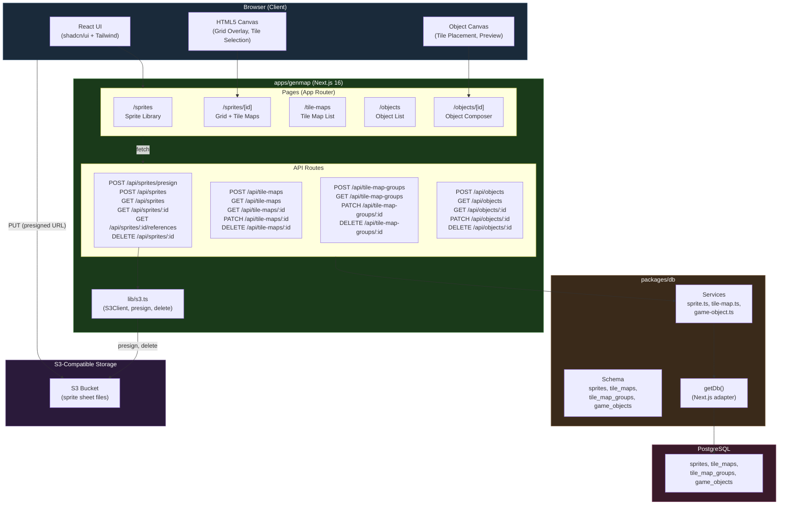
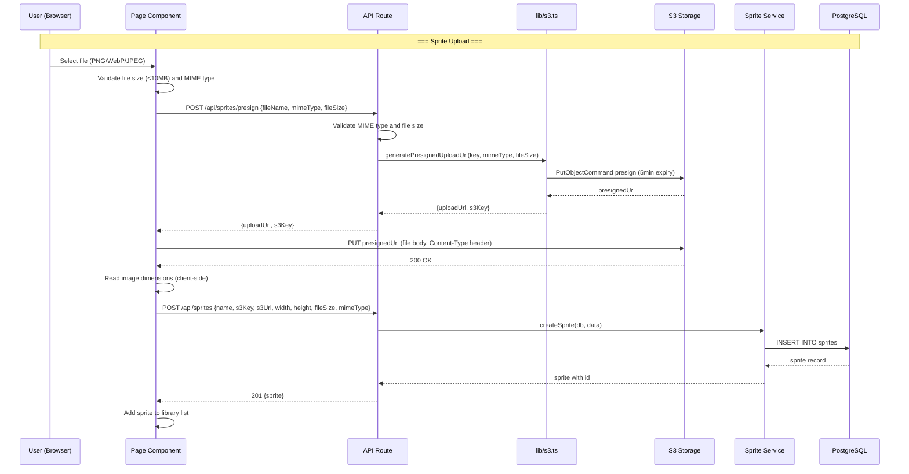
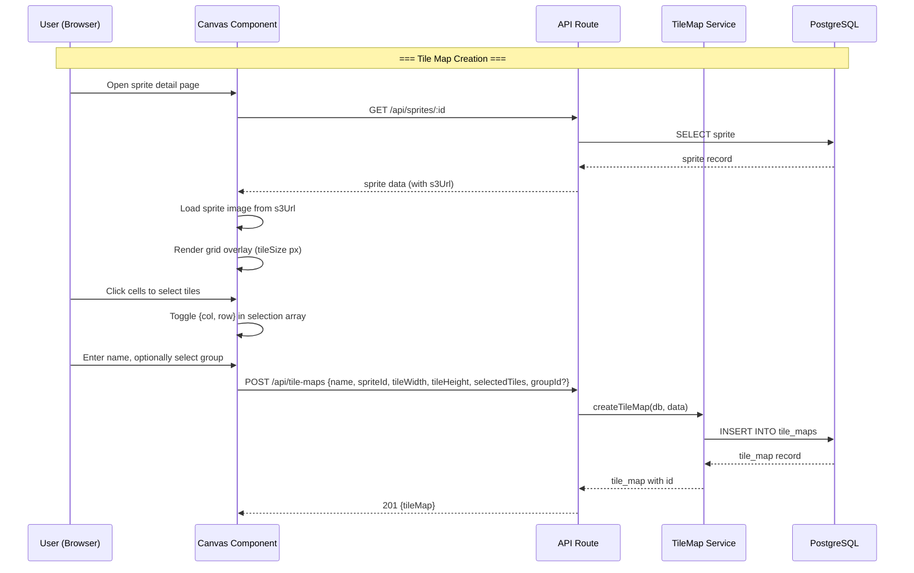
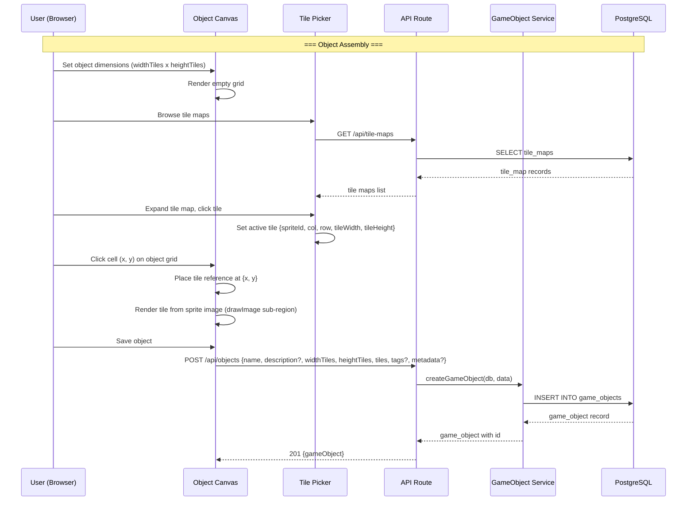

# Sprite Management and Object Assembly Design Document

## Overview

This document defines the technical design for the Sprite Management and Object Assembly feature -- an internal, browser-based tool at `apps/genmap/` for uploading sprite sheets to S3-compatible storage, extracting tile selections via interactive grid overlay, organizing tiles into named maps and groups, and assembling multi-tile game objects on a visual canvas. The tool is a Next.js 16 app using shadcn/ui, PostgreSQL via Drizzle ORM in `packages/db/`, and S3-compatible object storage.

## Design Summary (Meta)

```yaml
design_type: "new_feature"
risk_level: "medium"
complexity_level: "medium"
complexity_rationale: >
  (1) ACs require 4 new database tables, 20 API endpoints, S3 integration with presigned
  URLs, HTML5 Canvas rendering with grid overlay and tile selection, and a visual object
  composer -- spanning storage, database, API, and interactive UI domains.
  (2) Constraints: S3 presigned URL flow introduces a two-step upload (presign + register)
  with orphan file risk; JSONB tile data has no FK enforcement for game object sprite
  references; Canvas rendering must handle sprites up to 2048x2048 at 60fps interaction;
  all new schema must coexist with existing game tables without conflicts.
main_constraints:
  - "S3 endpoint must be configurable (AWS S3, Cloudflare R2, MinIO)"
  - "No server-side image processing -- all tile extraction is metadata-only"
  - "New DB tables must not reference or conflict with existing game tables"
  - "No authentication required (internal tool on trusted network)"
  - "Reuse getDb adapter from packages/db (no new adapter)"
  - "Single-layer tiles only -- each cell holds at most one tile reference"
biggest_risks:
  - "Orphan S3 files if registration fails after presigned URL upload"
  - "Stale sprite references in game_objects.tiles JSONB after sprite deletion"
  - "Canvas performance with large sprite sheets (2048x2048+)"
  - "S3 presigned URL compatibility across providers (MinIO known issues)"
unknowns:
  - "Whether MinIO presigned URL implementation is fully compatible with @aws-sdk/s3-request-presigner"
  - "Exact CORS configuration differences between R2, S3, and MinIO"
  - "Canvas rendering performance ceiling for very large sprite sheets"
```

## Background and Context

### Prerequisite ADRs

- **ADR-0007: Sprite Management Storage and Schema** -- Covers three decisions: (1) S3-compatible object storage with presigned URLs for sprite files, (2) JSONB metadata-only with flat arrays for tile coordinates in database schema, (3) reuse of `getDb` adapter from `packages/db/adapters/next.ts` for genmap database access.

### Agreement Checklist

#### Scope

- [x] Add 4 new Drizzle ORM schema files in `packages/db/src/schema/` (`sprites.ts`, `tile-maps.ts`, `tile-map-groups.ts`, `game-objects.ts`)
- [x] Export new schemas from `packages/db/src/schema/index.ts`
- [x] Add 3 new service files in `packages/db/src/services/` (`sprite.ts`, `tile-map.ts`, `game-object.ts`)
- [x] Export new services from `packages/db/src/index.ts`
- [x] Create S3 client module at `apps/genmap/src/lib/s3.ts`
- [x] Create 20 API route handlers under `apps/genmap/src/app/api/`
- [x] Create sprite library page (`/sprites`), sprite detail/editor page (`/sprites/[id]`)
- [x] Create tile map listing page (`/tile-maps`), tile map editor (embedded in sprite detail)
- [x] Create game object listing page (`/objects`), object editor page (`/objects/new`, `/objects/[id]`)
- [x] Create shared UI components (grid canvas, tile picker, upload form)
- [x] Run Drizzle migration for 4 new tables

#### Non-Scope (Explicitly not changing)

- [x] Existing database tables (`users`, `accounts`, `player_positions`, `maps`) -- no modifications
- [x] Existing services (`auth.ts`, `player.ts`, `map.ts`) -- no modifications
- [x] Existing adapters (`next.ts`, `colyseus.ts`) -- no modifications (reuse `getDb` as-is)
- [x] Game client app (`apps/game/`) -- no modifications
- [x] Game server (`apps/server/`) -- no modifications
- [x] Authentication -- none required (internal tool)
- [x] Tile animations, multi-layer tiles, undo/redo, real-time collaboration -- all out of scope
- [x] Export to Tiled/JSON map format -- out of scope
- [x] Phaser.js integration -- out of scope (data consumed separately)

#### Constraints

- [x] Parallel operation: Yes (genmap on its own port, separate from game server and game client)
- [x] Backward compatibility: Required for database (additive migrations only, no changes to existing tables)
- [x] Performance measurement: Not required (internal tool, no SLA targets; NFRs are guidelines)

### Problem to Solve

There is no tooling for managing the sprite-to-game-object pipeline. Artists produce sprite sheets (PNG/WebP images containing grids of tiles), but cataloging tiles, selecting subsets, and composing multi-tile objects is handled manually or ad-hoc. This creates friction in the content pipeline and introduces errors when tile coordinates are transcribed by hand.

### Current Challenges

1. **No sprite storage**: The monorepo has no file upload or S3 integration
2. **No tile extraction tooling**: Tile coordinates are transcribed manually from sprite sheets
3. **No object composition tooling**: Multi-tile game objects are defined by hand without visual feedback
4. **No asset catalog**: No central database of sprites, tile maps, or game objects

### Requirements

#### Functional Requirements

- FR-1 through FR-16: Sprite upload, registration, library, deletion, grid overlay, tile selection, tile map CRUD, tile map groups, object grid canvas, tile picker, object CRUD, object preview (per PRD-006)
- FR-17 through FR-20: 20 REST API endpoints for sprites, tile maps, tile map groups, and game objects
- FR-21: Four new database tables via Drizzle ORM

#### Non-Functional Requirements

- **Performance**: Presigned URL generation <200ms; canvas rendering for 2048x2048 sprites <100ms; API responses <200ms; object preview for 10x10 grid <200ms
- **Scalability**: Up to 1,000 sprites, 5,000 tile maps, 1,000 game objects
- **Reliability**: S3 upload failure shows clear error; orphan prevention accepted as MVP limitation; cascade delete integrity
- **Maintainability**: Service functions follow existing DrizzleClient-first-param pattern; schema files follow existing pgTable pattern

## Acceptance Criteria (AC) - EARS Format

### FR-1: Sprite Upload via Presigned URL

- [ ] **When** a content creator selects a PNG file under 10MB, the client shall obtain a presigned URL from the API, upload directly to S3, and register the sprite in the database
- [ ] **When** the sprite is registered, the sprite shall appear in the library with correct metadata (name, dimensions, file size, MIME type)
- [ ] **If** a content creator selects a file over 10MB, **then** the client shall reject the upload with an error message before any network request
- [ ] **If** the MIME type is not `image/png`, `image/webp`, or `image/jpeg`, **then** the presign API shall return a 400 error

### FR-2: Sprite Registration with Metadata

- [ ] **When** a client sends a registration request with all required fields (name, s3Key, s3Url, width, height, fileSize, mimeType), the API shall create a `sprites` record and return the generated UUID id
- [ ] **If** a required field is missing, **then** the API shall return a 400 error with a description of the missing field

### FR-3: Sprite Library with Thumbnail Preview

- [ ] **When** the sprite library page loads, the system shall display all sprites with thumbnails, names, dimensions, file sizes, and upload dates sorted by newest first
- [ ] The sprite library shall support pagination via `limit` and `offset` query parameters

### FR-4: Sprite Deletion

- [ ] **When** a sprite with no associated tile maps is deleted, the system shall remove the S3 object and delete the database record
- [ ] **If** a sprite has associated tile maps, **then** the system shall warn the user listing affected tile maps before deletion
- [ ] **When** deletion is confirmed, the sprite and all associated tile maps shall be cascade-deleted

### FR-5: Grid Overlay on Canvas

- [ ] **When** a sprite is displayed, the system shall render a grid overlay based on the selected tile size (8, 16, 32, 48, or 64 pixels)
- [ ] **When** the tile size is changed, the grid shall update immediately
- [ ] **If** sprite dimensions are not evenly divisible by tile size, **then** partial cells at edges shall be displayed but not selectable

### FR-6: Tile Selection on Grid

- [ ] **When** a grid cell is clicked, the system shall toggle its selection state (selected/deselected) with visual highlighting
- [ ] The selection state shall be tracked as an array of `{col, row}` coordinate objects

### FR-7: Tile Map Save

- [ ] **When** the content creator saves a tile selection with a name, the system shall create a `tile_maps` record with name, sprite_id, tile dimensions, and selected_tiles JSONB
- [ ] The API shall return the created tile map with its generated id

### FR-8: Tile Map Edit

- [ ] **When** an existing tile map is opened, the sprite shall display with previously selected tiles pre-highlighted
- [ ] **When** changes are saved, the system shall update the existing record (PATCH) without changing the id

### FR-9: Tile Map Groups

- [ ] **When** a group is created with a name, a `tile_map_groups` record shall be created
- [ ] **When** a group is deleted, tile maps in that group shall have their `group_id` set to null (not deleted)

### FR-10: Tile Map Listing

- [ ] **When** the tile map list loads, all tile maps shall be displayed with name, sprite thumbnail, tile size, tile count, and group name
- [ ] **If** a `groupId` filter is applied, **then** only tile maps in that group shall be shown

### FR-11: Object Grid Canvas

- [ ] **When** an object designer specifies width and height in tiles, an empty grid canvas shall render at those dimensions
- [ ] **When** a tile from a tile map is selected and a grid cell is clicked, the tile reference shall be placed in that cell
- [ ] **When** a cell is cleared, it shall become empty (no tile reference)

### FR-12: Tile Picker from Tile Maps

- [ ] **When** the object editor opens, a panel shall list all available tile maps
- [ ] **When** a tile map is expanded, individual tile previews shall render from the source sprite
- [ ] **When** a tile is clicked in the picker, it shall become the active tile for placement

### FR-13: Object Save

- [ ] **When** the designer saves an object with name, dimensions, and tile placements, a `game_objects` record shall be created with tiles stored as JSONB
- [ ] The tiles JSONB shall be a flat array of `{x, y, spriteId, col, row, tileWidth, tileHeight}` objects

### FR-14: Object Listing

- [ ] **When** the object list loads, all objects shall display with name, dimensions, tile count, tags, and creation date

### FR-15: Object Edit

- [ ] **When** an existing object is opened, the grid shall render with all previously placed tiles
- [ ] **If** object dimensions are reduced, **then** a confirmation warning shall appear about potential tile loss

### FR-16: Object Preview

- [ ] **When** tiles are placed on the object grid, a preview shall composite all tiles from source sprites at actual pixel size
- [ ] **When** a tile is added or removed, the preview shall update live

### FR-17 through FR-20: API Endpoints

- [ ] All 20 API endpoints shall validate required fields and return appropriate HTTP status codes (200, 201, 204, 400, 404)
- [ ] All list endpoints shall return arrays sorted by `createdAt` descending
- [ ] All delete endpoints shall return 204 on success
- [ ] **When** a POST /api/objects or PATCH /api/objects/:id request contains tiles referencing a non-existent spriteId, **then** the API shall return a 400 error listing the invalid sprite references
- [ ] **When** GET /api/sprites/:id/references is called for an existing sprite, **then** the API shall return the count of associated tile maps and a list of game objects referencing that sprite

### FR-21: Database Schema

- [ ] **When** the migration runs, all four tables shall exist with correct columns, types, and constraints
- [ ] **When** a sprite is deleted, associated tile maps shall be cascade-deleted
- [ ] **When** a group is deleted, associated tile maps shall have `group_id` set to null

## Existing Codebase Analysis

### Implementation Path Mapping

| Type | Path | Description |
|------|------|-------------|
| Existing (reference) | `packages/db/src/schema/users.ts` | UUID PK + timestamp pattern reference |
| Existing (reference) | `packages/db/src/schema/maps.ts` | JSONB column pattern reference |
| Existing (reference) | `packages/db/src/schema/accounts.ts` | Foreign key + unique index pattern |
| Existing (reference) | `packages/db/src/services/player.ts` | Service function pattern (DrizzleClient first param) |
| Existing (reference) | `packages/db/src/services/map.ts` | Service function pattern with object params |
| Existing (reference) | `packages/db/src/services/auth.ts` | Service with onConflictDoUpdate pattern |
| Existing (reference) | `packages/db/src/adapters/next.ts` | getDb singleton adapter |
| Existing (reference) | `packages/db/src/core/client.ts` | DrizzleClient type definition |
| Existing (modify) | `packages/db/src/schema/index.ts` | Must add 4 new schema exports |
| Existing (modify) | `packages/db/src/index.ts` | Must add new service exports |
| Existing (reference) | `apps/genmap/src/app/api/hello/route.ts` | API route handler pattern |
| Existing (reference) | `apps/genmap/src/lib/utils.ts` | cn() utility for className merging |
| Existing (reference) | `apps/genmap/components.json` | shadcn/ui config (New York style, RSC, Tailwind CSS) |
| New | `packages/db/src/schema/sprites.ts` | Sprites table schema |
| New | `packages/db/src/schema/tile-maps.ts` | Tile maps table schema |
| New | `packages/db/src/schema/tile-map-groups.ts` | Tile map groups table schema |
| New | `packages/db/src/schema/game-objects.ts` | Game objects table schema |
| New | `packages/db/src/services/sprite.ts` | Sprite CRUD service functions |
| New | `packages/db/src/services/tile-map.ts` | Tile map CRUD + group service functions |
| New | `packages/db/src/services/game-object.ts` | Game object CRUD service functions |
| New | `apps/genmap/src/lib/s3.ts` | S3 client configuration and helpers |
| New | `apps/genmap/src/app/api/sprites/presign/route.ts` | Presigned URL generation |
| New | `apps/genmap/src/app/api/sprites/route.ts` | Sprite list + create |
| New | `apps/genmap/src/app/api/sprites/[id]/route.ts` | Sprite get + delete |
| New | `apps/genmap/src/app/api/tile-maps/route.ts` | Tile map list + create |
| New | `apps/genmap/src/app/api/tile-maps/[id]/route.ts` | Tile map get + update + delete |
| New | `apps/genmap/src/app/api/tile-map-groups/route.ts` | Group list + create |
| New | `apps/genmap/src/app/api/tile-map-groups/[id]/route.ts` | Group update + delete |
| New | `apps/genmap/src/app/api/objects/route.ts` | Object list + create |
| New | `apps/genmap/src/app/api/objects/[id]/route.ts` | Object get + update + delete |
| New | `apps/genmap/src/app/sprites/page.tsx` | Sprite library page |
| New | `apps/genmap/src/app/sprites/[id]/page.tsx` | Sprite detail + tile map editor |
| New | `apps/genmap/src/app/tile-maps/page.tsx` | Tile map listing page |
| New | `apps/genmap/src/app/objects/page.tsx` | Object listing page |
| New | `apps/genmap/src/app/objects/new/page.tsx` | New object creation |
| New | `apps/genmap/src/app/objects/[id]/page.tsx` | Object editor page |
| New | `apps/genmap/src/components/sprite-grid-canvas.tsx` | Canvas with grid overlay + tile selection |
| New | `apps/genmap/src/components/tile-picker.tsx` | Tile map browser + tile selector for object editor |
| New | `apps/genmap/src/components/object-grid-canvas.tsx` | Object composition canvas |
| New | `apps/genmap/src/components/object-preview.tsx` | Live object preview renderer |
| New | `apps/genmap/src/components/sprite-upload-form.tsx` | Upload form with presigned URL flow |

### Integration Points

- **DB Integration**: All API routes import `getDb` from `@nookstead/db` and call service functions with the DrizzleClient instance
- **S3 Integration**: Sprite presign and delete API routes use the S3 client from `apps/genmap/src/lib/s3.ts`
- **Schema Registration**: New schemas re-exported from `packages/db/src/schema/index.ts` so Drizzle Kit includes them in migrations
- **Service Registration**: New services exported from `packages/db/src/index.ts` for consumer apps

### Code Inspection Evidence

| File Inspected | Key Finding | Design Impact |
|---------------|-------------|---------------|
| `packages/db/src/schema/users.ts` (lines 1-29) | Uses `pgTable('users', {...})` with `uuid('id').defaultRandom().primaryKey()`, `varchar('name', {length: 255})`, `timestamp('created_at', {withTimezone: true}).defaultNow().notNull()`; exports `$inferSelect` and `$inferInsert` types | All 4 new schema files must follow identical pattern: pgTable, uuid PK, timezone timestamps, type exports |
| `packages/db/src/schema/maps.ts` (lines 1-25) | Uses `jsonb('grid').notNull()` for JSONB columns without `.$type<>()` -- typed as `unknown` at DB level; references users.id with `onDelete: 'cascade'` | JSONB columns for `selected_tiles`, `tiles`, `tags`, `metadata` follow same untyped JSONB pattern; FK cascade follows same `references()` syntax |
| `packages/db/src/schema/accounts.ts` (lines 1-42) | Uses `references(() => users.id, { onDelete: 'cascade' })` for FK; defines compound unique index via table callback `(table) => [uniqueIndex(...)]`; exports relations via `relations()` | `tile_maps.sprite_id` FK uses same `references()` with cascade; `tile_maps.group_id` FK uses `onDelete: 'set null'`; relations defined for tile_maps to sprites and groups |
| `packages/db/src/schema/index.ts` (lines 1-4) | Barrel export: `export * from './users'; export * from './accounts'; export * from './player-positions'; export * from './maps';` | Must append 4 new exports for sprites, tile-maps, tile-map-groups, game-objects |
| `packages/db/src/core/client.ts` (lines 1-29) | `DrizzleClient` type is `ReturnType<typeof createDrizzleClient>`; `drizzle(sql, { schema })` passes all schema | New schemas auto-included when added to schema/index.ts barrel |
| `packages/db/src/services/player.ts` (lines 1-89) | Service functions take `db: DrizzleClient` as first param; uses `eq()` from `drizzle-orm` for WHERE; returns `Promise<T \| null>` for loads; interface for 3+ params | All new service functions must follow: DrizzleClient first param, interface for 3+ params, Promise return types |
| `packages/db/src/services/map.ts` (lines 1-89) | Uses `db.insert().values().onConflictDoUpdate()` for upsert; `db.select({...}).from(table).where(eq(...)).limit(1)` for single-row fetch | New services use same Drizzle query builder patterns for insert, select, update, delete |
| `packages/db/src/adapters/next.ts` (lines 1-28) | Singleton `getDb(url?)` reads `DATABASE_URL` from env; logs URL on first creation | genmap API routes call `getDb()` with no args (uses DATABASE_URL); no new adapter needed |
| `packages/db/src/index.ts` (lines 1-21) | Exports `getDb`, `closeDb`, `getGameDb`, `closeGameDb`, plus all service functions and their types | Must add exports for new sprite/tile-map/game-object service functions and types |
| `apps/genmap/src/app/api/hello/route.ts` (lines 1-3) | Minimal route handler: `export async function GET(request: Request)` returning `new Response(...)` | API routes use Next.js App Router convention with named HTTP method exports; must use `NextResponse.json()` for JSON responses |
| `apps/genmap/components.json` (lines 1-23) | shadcn/ui New York style, RSC enabled, Tailwind CSS with neutral base, Lucide icons, aliases `@/components`, `@/lib`, `@/hooks` | All new components use shadcn/ui components imported from `@/components/ui/`; utility classes via `cn()` from `@/lib/utils` |
| `apps/genmap/package.json` (lines 1-22) | Dependencies include `next ~16.0.1`, `react ^19.0.0`, `tailwindcss ^4.1.18`, `lucide-react`, `radix-ui`, `class-variance-authority`, `clsx`, `tailwind-merge` | Must add `@aws-sdk/client-s3` and `@aws-sdk/s3-request-presigner` as new dependencies; `@nookstead/db` must be added as workspace dependency |

### Similar Functionality Search

- **File upload / S3 integration**: No existing file upload, S3 client, or presigned URL code found in the monorepo. New implementation justified.
- **JSONB data management**: Existing `maps.ts` schema uses JSONB for `grid`, `layers`, `walkable`. The same pattern is adopted for tile coordinates and object data. No duplication -- new tables are for different domain entities.
- **CRUD services**: Existing services (`auth.ts`, `player.ts`, `map.ts`) are for user/game domain. New services are for sprite/asset domain. No overlap.
- **Canvas rendering**: No existing Canvas code in the monorepo. New implementation justified.
- **Image handling**: No existing image processing or rendering code. New implementation justified.

## Applicable Standards

### Classification Table

| Standard | Type | Source | Impact on Design |
|----------|------|--------|-----------------|
| Prettier: single quotes | Explicit | `.prettierrc` | All new code must use single quotes |
| EditorConfig: 2-space indent, UTF-8, trailing newline | Explicit | `.editorconfig` | All new files must use 2-space indent |
| ESLint: @nx/eslint-plugin flat config with module boundary enforcement | Explicit | `eslint.config.mjs` | All new TS/TSX files must pass ESLint |
| TypeScript: strict mode, ES2022, bundler resolution | Explicit | `tsconfig.base.json` | All new code must pass strict type checking (`noImplicitReturns`, `noUnusedLocals`, etc.) |
| Next.js App Router conventions | Explicit | `apps/genmap/tsconfig.json` (next plugin) | API routes use named exports (GET, POST, PATCH, DELETE); pages use default exports |
| shadcn/ui New York style with Tailwind CSS | Explicit | `apps/genmap/components.json` | UI components use shadcn/ui primitives with `cn()` utility |
| Drizzle ORM schema patterns (pgTable, uuid PK, timezone timestamps) | Implicit | `packages/db/src/schema/users.ts`, `maps.ts` | New schema files follow identical table definition pattern |
| Service function pattern (DrizzleClient first param, interface for 3+ params) | Implicit | `packages/db/src/services/player.ts`, `map.ts`, `auth.ts` | New service functions take `db: DrizzleClient` as first parameter |
| Barrel exports from index.ts | Implicit | `packages/db/src/schema/index.ts`, `packages/db/src/index.ts` | New schemas and services re-exported through barrel files |
| Type inference exports ($inferSelect, $inferInsert) | Implicit | `packages/db/src/schema/users.ts`, `player-positions.ts` | New schema files export inferred types for select and insert |
| JSONB without $type<> (untyped at DB level) | Implicit | `packages/db/src/schema/maps.ts` | JSONB columns use `jsonb()` without type annotation at schema level; application-level typing via separate interfaces |

## Design

### Change Impact Map

```yaml
Change Target: Sprite Management and Object Assembly (new feature)
Direct Impact:
  - packages/db/src/schema/index.ts (add 4 new schema exports)
  - packages/db/src/index.ts (add new service exports)
  - apps/genmap/package.json (add @aws-sdk/client-s3, @aws-sdk/s3-request-presigner, @nookstead/db)
  - apps/genmap/src/app/page.tsx (update to navigation hub or redirect to /sprites)
  - apps/genmap/src/app/layout.tsx (add navigation header)
Indirect Impact:
  - packages/db/drizzle.config.ts (no changes needed -- schema auto-discovered via index.ts)
  - Database (new migration with 4 tables -- additive only)
No Ripple Effect:
  - packages/db/src/schema/users.ts (unchanged)
  - packages/db/src/schema/accounts.ts (unchanged)
  - packages/db/src/schema/player-positions.ts (unchanged)
  - packages/db/src/schema/maps.ts (unchanged)
  - packages/db/src/services/auth.ts (unchanged)
  - packages/db/src/services/player.ts (unchanged)
  - packages/db/src/services/map.ts (unchanged)
  - packages/db/src/adapters/next.ts (unchanged)
  - packages/db/src/adapters/colyseus.ts (unchanged)
  - apps/game/ (entirely unchanged)
  - apps/server/ (entirely unchanged)
  - packages/shared/ (unchanged)
```

### Architecture Overview



### Data Flow

#### Sprite Upload Flow



#### Tile Map Creation Flow



#### Object Assembly Flow



### Integration Points List

| Integration Point | Location | Old Implementation | New Implementation | Switching Method |
|-------------------|----------|-------------------|-------------------|------------------|
| Schema barrel export | `packages/db/src/schema/index.ts` | 4 exports (users, accounts, player-positions, maps) | 8 exports (add sprites, tile-maps, tile-map-groups, game-objects) | Append exports |
| Package barrel export | `packages/db/src/index.ts` | Exports auth, player, map services | Exports auth, player, map + sprite, tile-map, game-object services | Append exports |
| DB adapter usage | `apps/genmap/src/app/api/*/route.ts` | No DB access in genmap | Import `getDb` from `@nookstead/db` | New usage |
| S3 client | `apps/genmap/src/lib/s3.ts` | Does not exist | New S3Client + presign/delete helpers | New module |
| Genmap dependencies | `apps/genmap/package.json` | No `@nookstead/db` or AWS SDK | Add `@nookstead/db`, `@aws-sdk/client-s3`, `@aws-sdk/s3-request-presigner` | Package addition |
| Landing page | `apps/genmap/src/app/page.tsx` | Static "Genmap" heading | Navigation hub with links to sprites, tile-maps, objects | Replace content |
| Layout | `apps/genmap/src/app/layout.tsx` | Minimal layout (html + body) | Add navigation header with links | Extend content |

### Integration Point Map

```yaml
Integration Point 1:
  Existing Component: packages/db/src/schema/index.ts - barrel exports
  Integration Method: Append 4 new schema module exports
  Impact Level: Low (Additive only)
  Required Test Coverage: TypeScript compilation passes; Drizzle migration generates correctly

Integration Point 2:
  Existing Component: packages/db/src/index.ts - package barrel exports
  Integration Method: Append new service function and type exports
  Impact Level: Low (Additive only)
  Required Test Coverage: TypeScript compilation passes; services importable from @nookstead/db

Integration Point 3:
  Existing Component: packages/db/src/adapters/next.ts - getDb()
  Integration Method: Import and call in genmap API routes (read-only integration)
  Impact Level: Low (Read-Only)
  Required Test Coverage: getDb() returns DrizzleClient; queries execute correctly

Integration Point 4:
  Existing Component: apps/genmap/package.json - dependencies
  Integration Method: Add @nookstead/db workspace dependency and AWS SDK packages
  Impact Level: Medium (Dependency addition)
  Required Test Coverage: pnpm install succeeds; imports resolve at build time

Integration Point 5:
  Existing Component: PostgreSQL database (shared with game server)
  Integration Method: Additive migration (4 new tables, no FK to existing tables)
  Impact Level: Medium (Database schema change)
  Required Test Coverage: Migration runs without errors; existing tables unaffected
```

### Main Components

#### Database Schema (`packages/db/src/schema/`)

Four new schema files defining Drizzle ORM table definitions.

##### `packages/db/src/schema/sprites.ts`

```typescript
import {
  integer,
  pgTable,
  text,
  timestamp,
  uuid,
  varchar,
} from 'drizzle-orm/pg-core';

export const sprites = pgTable('sprites', {
  id: uuid('id').defaultRandom().primaryKey(),
  name: varchar('name', { length: 255 }).notNull(),
  s3Key: text('s3_key').notNull().unique(),
  s3Url: text('s3_url').notNull(),
  width: integer('width').notNull(),
  height: integer('height').notNull(),
  fileSize: integer('file_size').notNull(),
  mimeType: varchar('mime_type', { length: 50 }).notNull(),
  createdAt: timestamp('created_at', { withTimezone: true })
    .defaultNow()
    .notNull(),
  updatedAt: timestamp('updated_at', { withTimezone: true })
    .defaultNow()
    .notNull(),
});

export type Sprite = typeof sprites.$inferSelect;
export type NewSprite = typeof sprites.$inferInsert;
```

##### `packages/db/src/schema/tile-map-groups.ts`

```typescript
import {
  pgTable,
  text,
  timestamp,
  uuid,
  varchar,
} from 'drizzle-orm/pg-core';

export const tileMapGroups = pgTable('tile_map_groups', {
  id: uuid('id').defaultRandom().primaryKey(),
  name: varchar('name', { length: 255 }).notNull(),
  description: text('description'),
  createdAt: timestamp('created_at', { withTimezone: true })
    .defaultNow()
    .notNull(),
  updatedAt: timestamp('updated_at', { withTimezone: true })
    .defaultNow()
    .notNull(),
});

export type TileMapGroup = typeof tileMapGroups.$inferSelect;
export type NewTileMapGroup = typeof tileMapGroups.$inferInsert;
```

##### `packages/db/src/schema/tile-maps.ts`

```typescript
import {
  integer,
  jsonb,
  pgTable,
  timestamp,
  uuid,
  varchar,
} from 'drizzle-orm/pg-core';
import { relations } from 'drizzle-orm';
import { sprites } from './sprites';
import { tileMapGroups } from './tile-map-groups';

export const tileMaps = pgTable('tile_maps', {
  id: uuid('id').defaultRandom().primaryKey(),
  spriteId: uuid('sprite_id')
    .notNull()
    .references(() => sprites.id, { onDelete: 'cascade' }),
  groupId: uuid('group_id').references(() => tileMapGroups.id, {
    onDelete: 'set null',
  }),
  name: varchar('name', { length: 255 }).notNull(),
  tileWidth: integer('tile_width').notNull(),
  tileHeight: integer('tile_height').notNull(),
  selectedTiles: jsonb('selected_tiles').notNull(),
  createdAt: timestamp('created_at', { withTimezone: true })
    .defaultNow()
    .notNull(),
  updatedAt: timestamp('updated_at', { withTimezone: true })
    .defaultNow()
    .notNull(),
});

export const tileMapsRelations = relations(tileMaps, ({ one }) => ({
  sprite: one(sprites, {
    fields: [tileMaps.spriteId],
    references: [sprites.id],
  }),
  group: one(tileMapGroups, {
    fields: [tileMaps.groupId],
    references: [tileMapGroups.id],
  }),
}));

export type TileMap = typeof tileMaps.$inferSelect;
export type NewTileMap = typeof tileMaps.$inferInsert;
```

##### `packages/db/src/schema/game-objects.ts`

```typescript
import {
  integer,
  jsonb,
  pgTable,
  text,
  timestamp,
  uuid,
  varchar,
} from 'drizzle-orm/pg-core';

export const gameObjects = pgTable('game_objects', {
  id: uuid('id').defaultRandom().primaryKey(),
  name: varchar('name', { length: 255 }).notNull(),
  description: text('description'),
  widthTiles: integer('width_tiles').notNull(),
  heightTiles: integer('height_tiles').notNull(),
  tiles: jsonb('tiles').notNull(),
  tags: jsonb('tags'),
  metadata: jsonb('metadata'),
  createdAt: timestamp('created_at', { withTimezone: true })
    .defaultNow()
    .notNull(),
  updatedAt: timestamp('updated_at', { withTimezone: true })
    .defaultNow()
    .notNull(),
});

export type GameObject = typeof gameObjects.$inferSelect;
export type NewGameObject = typeof gameObjects.$inferInsert;
```

##### Updated `packages/db/src/schema/index.ts`

```typescript
export * from './users';
export * from './accounts';
export * from './player-positions';
export * from './maps';
export * from './sprites';
export * from './tile-map-groups';
export * from './tile-maps';
export * from './game-objects';
```

#### S3 Client Module (`apps/genmap/src/lib/s3.ts`)

- **Responsibility**: Initialize S3Client with configurable endpoint; provide presigned URL generation and object deletion helpers; validate required environment variables.
- **Interface**:
  ```typescript
  // Environment variables (validated on first use)
  // S3_ENDPOINT, S3_BUCKET, S3_ACCESS_KEY_ID, S3_SECRET_ACCESS_KEY, S3_REGION

  function getS3Client(): S3Client;
  function getS3Config(): { bucket: string; region: string; endpoint: string };

  function generatePresignedUploadUrl(params: {
    key: string;
    contentType: string;
    contentLength: number;
  }): Promise<{ uploadUrl: string; s3Key: string }>;

  function deleteS3Object(key: string): Promise<void>;

  function buildS3Url(key: string): string;
  ```
- **Dependencies**: `@aws-sdk/client-s3`, `@aws-sdk/s3-request-presigner`

**Implementation Detail**:

```typescript
import {
  S3Client,
  PutObjectCommand,
  DeleteObjectCommand,
} from '@aws-sdk/client-s3';
import { getSignedUrl } from '@aws-sdk/s3-request-presigner';

interface S3Config {
  endpoint: string;
  bucket: string;
  region: string;
  accessKeyId: string;
  secretAccessKey: string;
}

function loadS3Config(): S3Config {
  const endpoint = process.env['S3_ENDPOINT'];
  const bucket = process.env['S3_BUCKET'];
  const region = process.env['S3_REGION'] ?? 'auto';
  const accessKeyId = process.env['S3_ACCESS_KEY_ID'];
  const secretAccessKey = process.env['S3_SECRET_ACCESS_KEY'];

  if (!endpoint || !bucket || !accessKeyId || !secretAccessKey) {
    throw new Error(
      'Missing required S3 environment variables: S3_ENDPOINT, S3_BUCKET, S3_ACCESS_KEY_ID, S3_SECRET_ACCESS_KEY'
    );
  }

  return { endpoint, bucket, region, accessKeyId, secretAccessKey };
}

let s3Client: S3Client | null = null;
let s3Config: S3Config | null = null;

function getS3Client(): S3Client {
  if (s3Client) return s3Client;
  const config = getS3Config();
  s3Client = new S3Client({
    endpoint: config.endpoint,
    region: config.region,
    credentials: {
      accessKeyId: config.accessKeyId,
      secretAccessKey: config.secretAccessKey,
    },
    forcePathStyle: true, // Required for MinIO and some S3-compatible providers
  });
  return s3Client;
}

function getS3Config(): S3Config {
  if (s3Config) return s3Config;
  s3Config = loadS3Config();
  return s3Config;
}

const PRESIGN_EXPIRY_SECONDS = 300; // 5 minutes
const MAX_FILE_SIZE = 10 * 1024 * 1024; // 10MB
const ALLOWED_MIME_TYPES = ['image/png', 'image/webp', 'image/jpeg'];

export async function generatePresignedUploadUrl(params: {
  key: string;
  contentType: string;
  contentLength: number;
}): Promise<{ uploadUrl: string; s3Key: string }> {
  const client = getS3Client();
  const config = getS3Config();

  const command = new PutObjectCommand({
    Bucket: config.bucket,
    Key: params.key,
    ContentType: params.contentType,
    ContentLength: params.contentLength,
  });

  const uploadUrl = await getSignedUrl(client, command, {
    expiresIn: PRESIGN_EXPIRY_SECONDS,
  });

  return { uploadUrl, s3Key: params.key };
}

export async function deleteS3Object(key: string): Promise<void> {
  const client = getS3Client();
  const config = getS3Config();

  await client.send(
    new DeleteObjectCommand({
      Bucket: config.bucket,
      Key: key,
    })
  );
}

export function buildS3Url(key: string): string {
  const config = getS3Config();
  return `${config.endpoint}/${config.bucket}/${key}`;
}

export { ALLOWED_MIME_TYPES, MAX_FILE_SIZE };
```

#### Database Services (`packages/db/src/services/`)

##### `packages/db/src/services/sprite.ts`

- **Responsibility**: CRUD operations for sprites table. List, get, create, delete (with cascade info).
- **Interface**:
  ```typescript
  interface CreateSpriteData {
    name: string;
    s3Key: string;
    s3Url: string;
    width: number;
    height: number;
    fileSize: number;
    mimeType: string;
  }

  function createSprite(db: DrizzleClient, data: CreateSpriteData): Promise<Sprite>;
  function getSprite(db: DrizzleClient, id: string): Promise<Sprite | null>;
  function listSprites(db: DrizzleClient, params?: { limit?: number; offset?: number }): Promise<Sprite[]>;
  function deleteSprite(db: DrizzleClient, id: string): Promise<void>;
  function countTileMapsBySprite(db: DrizzleClient, spriteId: string): Promise<number>;
  function findGameObjectsReferencingSprite(db: DrizzleClient, spriteId: string): Promise<{ id: string; name: string }[]>;
  ```
- **Dependencies**: DrizzleClient, sprites schema, tileMaps schema, gameObjects schema

**Implementation Detail**:

```typescript
import { eq, desc, sql } from 'drizzle-orm';
import type { DrizzleClient } from '../core/client';
import { sprites, type Sprite } from '../schema/sprites';
import { tileMaps } from '../schema/tile-maps';
import { gameObjects } from '../schema/game-objects';

export interface CreateSpriteData {
  name: string;
  s3Key: string;
  s3Url: string;
  width: number;
  height: number;
  fileSize: number;
  mimeType: string;
}

export async function createSprite(
  db: DrizzleClient,
  data: CreateSpriteData
): Promise<Sprite> {
  const [sprite] = await db
    .insert(sprites)
    .values(data)
    .returning();

  return sprite;
}

export async function getSprite(
  db: DrizzleClient,
  id: string
): Promise<Sprite | null> {
  const result = await db
    .select()
    .from(sprites)
    .where(eq(sprites.id, id))
    .limit(1);

  return result.length > 0 ? result[0] : null;
}

export async function listSprites(
  db: DrizzleClient,
  params?: { limit?: number; offset?: number }
): Promise<Sprite[]> {
  let query = db
    .select()
    .from(sprites)
    .orderBy(desc(sprites.createdAt));

  if (params?.limit) {
    query = query.limit(params.limit);
  }
  if (params?.offset) {
    query = query.offset(params.offset);
  }

  return query;
}

export async function deleteSprite(
  db: DrizzleClient,
  id: string
): Promise<void> {
  await db.delete(sprites).where(eq(sprites.id, id));
  // tile_maps cascade-deleted via FK constraint
}

export async function countTileMapsBySprite(
  db: DrizzleClient,
  spriteId: string
): Promise<number> {
  const result = await db
    .select({ count: sql<number>`count(*)` })
    .from(tileMaps)
    .where(eq(tileMaps.spriteId, spriteId));

  return Number(result[0].count);
}

export async function findGameObjectsReferencingSprite(
  db: DrizzleClient,
  spriteId: string
): Promise<{ id: string; name: string }[]> {
  // Search JSONB tiles array for objects containing this spriteId
  return db
    .select({ id: gameObjects.id, name: gameObjects.name })
    .from(gameObjects)
    .where(
      sql`${gameObjects.tiles}::jsonb @> ${JSON.stringify([{ spriteId }])}::jsonb`
    );
}
```

##### `packages/db/src/services/tile-map.ts`

- **Responsibility**: CRUD for tile_maps and tile_map_groups tables.
- **Interface**:
  ```typescript
  // Tile Map
  interface CreateTileMapData {
    spriteId: string;
    groupId?: string | null;
    name: string;
    tileWidth: number;
    tileHeight: number;
    selectedTiles: unknown;  // JSONB: [{col, row}, ...]
  }

  interface UpdateTileMapData {
    name?: string;
    groupId?: string | null;
    selectedTiles?: unknown;
  }

  function createTileMap(db: DrizzleClient, data: CreateTileMapData): Promise<TileMap>;
  function getTileMap(db: DrizzleClient, id: string): Promise<TileMap | null>;
  function listTileMaps(db: DrizzleClient, params?: { groupId?: string }): Promise<TileMap[]>;
  function updateTileMap(db: DrizzleClient, id: string, data: UpdateTileMapData): Promise<TileMap | null>;
  function deleteTileMap(db: DrizzleClient, id: string): Promise<void>;

  // Tile Map Group
  interface CreateGroupData {
    name: string;
    description?: string | null;
  }

  interface UpdateGroupData {
    name?: string;
    description?: string | null;
  }

  function createGroup(db: DrizzleClient, data: CreateGroupData): Promise<TileMapGroup>;
  function listGroups(db: DrizzleClient): Promise<TileMapGroup[]>;
  function updateGroup(db: DrizzleClient, id: string, data: UpdateGroupData): Promise<TileMapGroup | null>;
  function deleteGroup(db: DrizzleClient, id: string): Promise<void>;
  ```
- **Dependencies**: DrizzleClient, tileMaps schema, tileMapGroups schema

##### `packages/db/src/services/game-object.ts`

- **Responsibility**: CRUD for game_objects table.
- **Interface**:
  ```typescript
  interface CreateGameObjectData {
    name: string;
    description?: string | null;
    widthTiles: number;
    heightTiles: number;
    tiles: unknown;   // JSONB: [{x, y, spriteId, col, row, tileWidth, tileHeight}, ...]
    tags?: unknown;    // JSONB: string[]
    metadata?: unknown; // JSONB: object
  }

  interface UpdateGameObjectData {
    name?: string;
    description?: string | null;
    widthTiles?: number;
    heightTiles?: number;
    tiles?: unknown;
    tags?: unknown;
    metadata?: unknown;
  }

  function createGameObject(db: DrizzleClient, data: CreateGameObjectData): Promise<GameObject>;
  function getGameObject(db: DrizzleClient, id: string): Promise<GameObject | null>;
  function listGameObjects(db: DrizzleClient, params?: { limit?: number; offset?: number }): Promise<GameObject[]>;
  function updateGameObject(db: DrizzleClient, id: string, data: UpdateGameObjectData): Promise<GameObject | null>;
  function deleteGameObject(db: DrizzleClient, id: string): Promise<void>;

  /**
   * Validates that all spriteId references within a tiles array point to existing sprite records.
   * Extracts unique spriteId values from tiles, queries the sprites table, and returns any IDs
   * that do not match an existing row.
   *
   * @returns Array of invalid spriteId strings. Empty array means all references are valid.
   */
  function validateTileReferences(
    db: DrizzleClient,
    tiles: Array<{ spriteId: string }>
  ): Promise<string[]>;
  ```
- **Dependencies**: DrizzleClient, gameObjects schema, sprites schema

### Contract Definitions

#### Application-Level TypeScript Interfaces

These interfaces define the shape of JSONB data at the application level. They are separate from the Drizzle schema (which uses untyped `jsonb()`) to maintain consistency with the existing pattern in `maps.ts`.

```typescript
// === JSONB Data Shapes ===

/** A selected tile coordinate in a tile map */
interface TileCoordinate {
  col: number;  // zero-indexed column in sprite grid
  row: number;  // zero-indexed row in sprite grid
}

/** A tile reference placed in a game object grid cell */
interface ObjectTileReference {
  x: number;           // cell column in object grid (zero-indexed)
  y: number;           // cell row in object grid (zero-indexed)
  spriteId: string;    // UUID of source sprite
  col: number;         // tile column in source sprite grid
  row: number;         // tile row in source sprite grid
  tileWidth: number;   // tile width in pixels
  tileHeight: number;  // tile height in pixels
}

// tile_maps.selected_tiles: TileCoordinate[]
// game_objects.tiles: ObjectTileReference[]
// game_objects.tags: string[]
// game_objects.metadata: Record<string, unknown>
```

#### API Request/Response Contracts

##### Sprites API

```typescript
// POST /api/sprites/presign
interface PresignRequest {
  fileName: string;    // Original file name
  mimeType: string;    // 'image/png' | 'image/webp' | 'image/jpeg'
  fileSize: number;    // File size in bytes (max 10MB = 10485760)
}

interface PresignResponse {
  uploadUrl: string;   // Presigned PUT URL (5-minute expiry)
  s3Key: string;       // Generated S3 object key
}

// POST /api/sprites
interface CreateSpriteRequest {
  name: string;        // Display name (max 255 chars)
  s3Key: string;       // S3 object key from presign response
  s3Url: string;       // Full URL to stored file
  width: number;       // Image width in pixels
  height: number;      // Image height in pixels
  fileSize: number;    // File size in bytes
  mimeType: string;    // MIME type
}

// Response: Sprite (full DB record with id, createdAt, updatedAt)

// GET /api/sprites
// Query params: ?limit=N&offset=N (optional)
// Response: Sprite[]

// GET /api/sprites/:id
// Response: Sprite | 404

// DELETE /api/sprites/:id
// Response: 204 | 404
// Side effects: S3 object deleted, tile_maps cascade-deleted
// Pre-check: Returns { tileMapCount, affectedObjects } for confirmation UI

// GET /api/sprites/:id/references
// Response: SpriteReferencesResponse | 404
interface SpriteReferencesResponse {
  tileMapCount: number;                          // Number of tile maps using this sprite
  affectedObjects: { id: string; name: string }[]; // Game objects with tile references to this sprite
}
```

##### Tile Maps API

```typescript
// POST /api/tile-maps
interface CreateTileMapRequest {
  name: string;                    // Display name (max 255 chars)
  spriteId: string;                // UUID of source sprite (must exist)
  groupId?: string | null;         // UUID of group (optional)
  tileWidth: number;               // Tile width in pixels (8|16|32|48|64)
  tileHeight: number;              // Tile height in pixels (8|16|32|48|64)
  selectedTiles: TileCoordinate[]; // Array of selected grid coordinates
}

// Response: TileMap (full DB record)

// GET /api/tile-maps
// Query params: ?groupId=UUID (optional filter)
// Response: TileMap[]

// GET /api/tile-maps/:id
// Response: TileMap | 404

// PATCH /api/tile-maps/:id
interface UpdateTileMapRequest {
  name?: string;
  groupId?: string | null;
  selectedTiles?: TileCoordinate[];
}

// Response: TileMap (updated) | 404

// DELETE /api/tile-maps/:id
// Response: 204 | 404
```

##### Tile Map Groups API

```typescript
// POST /api/tile-map-groups
interface CreateGroupRequest {
  name: string;           // Group name (max 255 chars)
  description?: string;   // Optional description
}

// Response: TileMapGroup (full DB record)

// GET /api/tile-map-groups
// Response: TileMapGroup[]

// PATCH /api/tile-map-groups/:id
interface UpdateGroupRequest {
  name?: string;
  description?: string | null;
}

// Response: TileMapGroup (updated) | 404

// DELETE /api/tile-map-groups/:id
// Response: 204 | 404
// Side effect: Associated tile_maps have group_id set to null
```

##### Game Objects API

```typescript
// POST /api/objects
interface CreateObjectRequest {
  name: string;                      // Object name (max 255 chars)
  description?: string | null;       // Optional description
  widthTiles: number;                // Grid width in tiles (positive integer)
  heightTiles: number;               // Grid height in tiles (positive integer)
  tiles: ObjectTileReference[];      // Placed tile references
  tags?: string[];                   // Optional tags for categorization
  metadata?: Record<string, unknown>; // Optional extensible metadata
}

// Response: GameObject (full DB record)
// Error: 400 if tiles reference non-existent spriteIds (see Sprite Reference Validation below)

// GET /api/objects
// Query params: ?limit=N&offset=N (optional)
// Response: GameObject[]

// GET /api/objects/:id
// Response: GameObject | 404

// PATCH /api/objects/:id
interface UpdateObjectRequest {
  name?: string;
  description?: string | null;
  widthTiles?: number;
  heightTiles?: number;
  tiles?: ObjectTileReference[];
  tags?: string[];
  metadata?: Record<string, unknown>;
}

// Response: GameObject (updated) | 404
// Error: 400 if tiles reference non-existent spriteIds (see Sprite Reference Validation below)

// DELETE /api/objects/:id
// Response: 204 | 404
```

##### Sprite Reference Validation (POST /api/objects, PATCH /api/objects/:id)

When the request body contains a `tiles` array, the API route handler performs a sprite reference validation step before persisting:

1. Extract the set of unique `spriteId` values from the `tiles` array.
2. Call `validateTileReferences(db, tiles)` from the game-object service (see interface below).
3. If any `spriteId` does not correspond to an existing sprite record, return a 400 error with the list of invalid IDs.

**400 Error Response (invalid sprite references)**:
```json
{
  "error": "Invalid sprite references in tiles",
  "details": [
    "spriteId 'aaaaaaaa-bbbb-cccc-dddd-eeeeeeeeeeee' does not exist",
    "spriteId 'ffffffff-gggg-hhhh-iiii-jjjjjjjjjjjj' does not exist"
  ]
}
```

This validation applies to both `POST /api/objects` (create) and `PATCH /api/objects/:id` (update, when `tiles` is present in the request body). It satisfies PRD FR-20: "Given a create/update request with tiles referencing a non-existent spriteId, when the API validates it, then a 400 error is returned listing the invalid sprite references."

#### Error Response Contract

All API endpoints return errors in a consistent format:

```typescript
interface ApiError {
  error: string;         // Human-readable error message
  details?: string[];    // Optional list of specific validation failures
}

// HTTP Status Codes:
// 400 - Validation error (missing fields, invalid types, size exceeded, bad MIME type)
// 404 - Resource not found
// 500 - Internal server error (S3 failure, DB error)
```

### Data Contract

#### Sprite Service: createSprite

```yaml
Input:
  Type: (db: DrizzleClient, data: CreateSpriteData)
  Preconditions:
    - data.s3Key is a valid key matching an uploaded S3 object
    - data.mimeType is one of 'image/png', 'image/webp', 'image/jpeg'
    - data.width and data.height are positive integers
    - data.fileSize is a positive integer <= 10485760
    - data.name is a non-empty string <= 255 chars
  Validation: None at service level (API route validates)

Output:
  Type: Promise<Sprite>
  Guarantees:
    - A row exists in sprites with generated UUID id
    - createdAt and updatedAt are set to current time
  On Error: Throws (duplicate s3Key triggers unique constraint violation)

Invariants:
  - s3Key is unique across all sprites
```

#### Tile Map Service: createTileMap

```yaml
Input:
  Type: (db: DrizzleClient, data: CreateTileMapData)
  Preconditions:
    - data.spriteId references an existing sprite
    - data.groupId (if provided) references an existing group or is null
    - data.selectedTiles is a valid JSON array of {col, row} objects
    - data.tileWidth and data.tileHeight are from {8, 16, 32, 48, 64}
  Validation: spriteId FK validated by database constraint

Output:
  Type: Promise<TileMap>
  Guarantees:
    - A row exists in tile_maps with generated UUID id
    - sprite_id FK constraint is satisfied
  On Error: Throws (invalid spriteId triggers FK violation)

Invariants:
  - tile_maps.sprite_id always references a valid sprite (enforced by FK)
  - If sprite is deleted, all referencing tile_maps are cascade-deleted
```

#### Presigned URL Generation

```yaml
Input:
  Type: { key: string, contentType: string, contentLength: number }
  Preconditions:
    - S3 environment variables are configured
    - contentType is in ALLOWED_MIME_TYPES
    - contentLength <= MAX_FILE_SIZE
  Validation: Caller validates before calling

Output:
  Type: Promise<{ uploadUrl: string, s3Key: string }>
  Guarantees:
    - uploadUrl is a valid presigned PUT URL with 5-minute expiry
    - uploadUrl enforces ContentType and ContentLength
  On Error: Throws if S3 client initialization fails or signing fails

Invariants:
  - Presigned URL becomes invalid after 5 minutes
  - Only PUT operations with matching ContentType are permitted
```

### Data Representation Decisions

| Data Structure | Decision | Rationale |
|---|---|---|
| `sprites` table | **New** dedicated table | No existing sprite/asset storage in the codebase. New domain entity. |
| `tile_maps` table | **New** dedicated table | No existing tile map concept. New domain entity with FK to sprites. |
| `tile_map_groups` table | **New** dedicated table | No existing grouping mechanism for tile maps. Simple standalone entity. |
| `game_objects` table | **New** dedicated table | No existing game object composition table. New domain entity. |
| `TileCoordinate` (JSONB) | **New** application-level interface | No existing tile coordinate type. Domain-specific data shape for JSONB column. |
| `ObjectTileReference` (JSONB) | **New** application-level interface | No existing multi-sprite tile reference type. Extends TileCoordinate with sprite pointer and position. |
| JSONB column pattern | **Reuse** existing `maps.grid`/`maps.layers` pattern | Existing maps schema uses untyped `jsonb()` without `.$type<>()`. New JSONB columns follow same pattern for consistency. |
| UUID primary key pattern | **Reuse** existing `users.id` pattern | `uuid('id').defaultRandom().primaryKey()` is the established PK pattern across all tables. |
| Timestamp pattern | **Reuse** existing `users.createdAt`/`updatedAt` pattern | `timestamp('created_at', { withTimezone: true }).defaultNow().notNull()` is established. |

### Field Propagation Map

```yaml
fields:
  - name: "spriteId (in tile_maps)"
    origin: "User selects sprite in UI"
    transformations:
      - layer: "API Layer"
        type: "CreateTileMapRequest.spriteId (string UUID)"
        validation: "required, valid UUID format"
      - layer: "Service Layer"
        type: "CreateTileMapData.spriteId (string)"
        transformation: "passed through unchanged"
      - layer: "Database Layer"
        type: "tile_maps.sprite_id (UUID FK)"
        transformation: "stored as FK, validated by constraint"
    destination: "tile_maps.sprite_id column"
    loss_risk: "none"

  - name: "selectedTiles (tile coordinates)"
    origin: "User clicks cells on grid overlay (Canvas interaction)"
    transformations:
      - layer: "Canvas Component"
        type: "Array<{col: number, row: number}>"
        validation: "col >= 0, row >= 0, within sprite grid bounds"
      - layer: "API Layer"
        type: "CreateTileMapRequest.selectedTiles (TileCoordinate[])"
        validation: "required, array of objects with col and row numbers"
      - layer: "Service Layer"
        type: "CreateTileMapData.selectedTiles (unknown)"
        transformation: "passed through as JSONB"
      - layer: "Database Layer"
        type: "tile_maps.selected_tiles (JSONB)"
        transformation: "stored as JSON array"
    destination: "tile_maps.selected_tiles column"
    loss_risk: "none"

  - name: "tiles (object tile references)"
    origin: "User places tiles on object grid (Canvas interaction)"
    transformations:
      - layer: "Object Canvas Component"
        type: "Array<ObjectTileReference>"
        validation: "x/y within object dimensions, spriteId valid UUID, col/row non-negative"
      - layer: "API Layer"
        type: "CreateObjectRequest.tiles (ObjectTileReference[])"
        validation: "required, array of objects with x, y, spriteId, col, row, tileWidth, tileHeight"
      - layer: "Service Layer"
        type: "CreateGameObjectData.tiles (unknown)"
        transformation: "passed through as JSONB"
      - layer: "Database Layer"
        type: "game_objects.tiles (JSONB)"
        transformation: "stored as JSON array"
    destination: "game_objects.tiles column"
    loss_risk: "medium"
    loss_risk_reason: "spriteId references within JSONB are not FK-enforced. If a sprite is deleted, tile references in game_objects become stale. Mitigated by application-level warnings on sprite deletion and placeholder rendering."

  - name: "s3Key / s3Url (sprite file reference)"
    origin: "API generates S3 key during presign; client constructs URL"
    transformations:
      - layer: "Presign API"
        type: "PresignResponse.s3Key (string)"
        transformation: "generated as 'sprites/{uuid}/{filename}'"
      - layer: "Registration API"
        type: "CreateSpriteRequest.s3Key / s3Url (string)"
        validation: "required, non-empty"
      - layer: "Database Layer"
        type: "sprites.s3_key (text UNIQUE) / sprites.s3_url (text)"
        transformation: "stored as-is"
    destination: "sprites table; used by client to load images"
    loss_risk: "low"
    loss_risk_reason: "Orphan S3 files possible if registration fails after upload. Accepted for MVP."
```

### Interface Change Impact Analysis

| Existing Operation | New Operation | Conversion Required | Adapter Required | Compatibility Method |
|-------------------|---------------|-------------------|------------------|---------------------|
| `packages/db/src/schema/index.ts` exports | Same + 4 new exports | None | Not Required | Additive append |
| `packages/db/src/index.ts` exports | Same + new service exports | None | Not Required | Additive append |
| `getDb()` usage (game app) | Same (unchanged) | None | Not Required | - |
| `hello/route.ts` API route | Same (retained) | None | Not Required | - |
| `page.tsx` landing page | Updated to navigation hub | Yes | Not Required | Direct replacement |
| `layout.tsx` root layout | Extended with navigation | Yes | Not Required | Content extension |

No breaking changes to existing interfaces. All modifications are additive.

### Component Hierarchy

```
apps/genmap/src/
  app/
    layout.tsx                          # Root layout with navigation header
    page.tsx                            # Landing page / redirect to /sprites
    sprites/
      page.tsx                          # Sprite library (grid of sprite cards)
      [id]/
        page.tsx                        # Sprite detail + tile map editor
    tile-maps/
      page.tsx                          # Tile map listing with group filter
    objects/
      page.tsx                          # Object listing
      new/
        page.tsx                        # New object creation
      [id]/
        page.tsx                        # Object editor
    api/
      sprites/
        presign/route.ts                # POST: generate presigned URL
        route.ts                        # GET: list, POST: register
        [id]/
          route.ts                      # GET: detail, DELETE: remove
          references/route.ts           # GET: check references before delete
      tile-maps/
        route.ts                        # GET: list, POST: create
        [id]/route.ts                   # GET: detail, PATCH: update, DELETE: remove
      tile-map-groups/
        route.ts                        # GET: list, POST: create
        [id]/route.ts                   # PATCH: update, DELETE: remove
      objects/
        route.ts                        # GET: list, POST: create
        [id]/route.ts                   # GET: detail, PATCH: update, DELETE: remove
  components/
    navigation.tsx                      # Sidebar/header navigation
    sprite-upload-form.tsx              # File picker + presigned URL upload flow
    sprite-card.tsx                     # Sprite thumbnail card for library grid
    sprite-grid-canvas.tsx              # HTML5 Canvas: sprite image + grid overlay + tile selection
    tile-map-list.tsx                   # Tile map list with group filter
    tile-map-card.tsx                   # Tile map summary card
    tile-picker.tsx                     # Tile map browser for object editor (expandable panels)
    object-grid-canvas.tsx              # Object composition grid canvas
    object-preview.tsx                  # Live composite preview of assembled object
    object-card.tsx                     # Object summary card for listing
    group-selector.tsx                  # Dropdown for tile map group selection
    confirm-dialog.tsx                  # Reusable confirmation dialog (delete warnings)
  hooks/
    use-sprites.ts                      # Data fetching hook for sprites
    use-tile-maps.ts                    # Data fetching hook for tile maps
    use-game-objects.ts                 # Data fetching hook for game objects
    use-tile-map-groups.ts              # Data fetching hook for groups
  lib/
    s3.ts                               # S3 client configuration
    utils.ts                            # Existing cn() utility
    api.ts                              # Fetch wrapper for API calls
    validation.ts                       # Shared validation constants and functions
```

### Canvas Rendering Approach

#### Sprite Grid Canvas (`sprite-grid-canvas.tsx`)

The sprite grid canvas renders a sprite sheet image with an interactive grid overlay for tile selection.

**Rendering Layers** (drawn in order):
1. **Sprite Image**: Load from S3 URL, draw with `drawImage()` at canvas scale
2. **Grid Lines**: Draw semi-transparent grid lines (1px, `rgba(255, 255, 255, 0.3)`) at tile intervals
3. **Selection Overlay**: Draw colored rectangle (`rgba(59, 130, 246, 0.4)`) over selected cells
4. **Hover Highlight**: Draw hover indicator on the cell under the cursor (`rgba(255, 255, 255, 0.2)`)

**Interaction**:
- Canvas listens to `mousedown`, `mousemove`, `mouseup` events
- Click coordinates converted to grid cell via `col = Math.floor(x / tileWidth)`, `row = Math.floor(y / tileHeight)`
- Partial cells (where sprite dimensions are not evenly divisible) are excluded from interaction
- Selected cells tracked in React state as `Set<string>` (key: `"${col},${row}"`)

**Performance**:
- Canvas renders at actual sprite dimensions (no scaling for accuracy)
- Use `requestAnimationFrame` for hover/selection rendering
- Only redraw affected layers on interaction (not full repaint)

#### Object Grid Canvas (`object-grid-canvas.tsx`)

The object canvas renders a grid at defined dimensions where tiles can be placed.

**Rendering Layers** (drawn in order):
1. **Background**: Fill with neutral background color
2. **Placed Tiles**: For each placed tile, load source sprite image and draw the specific sub-region using `drawImage(spriteImg, sx, sy, sw, sh, dx, dy, dw, dh)` where `sx = col * tileWidth`, `sy = row * tileHeight`
3. **Grid Lines**: Draw grid at tile intervals
4. **Active Cell Highlight**: Highlight cell under cursor
5. **Empty Cell Indicator**: Light dashed border for unoccupied cells

**Tile Image Caching**:
- Maintain a `Map<string, HTMLImageElement>` cache keyed by sprite S3 URL
- Load sprite images on demand when a tile from that sprite is first placed
- Reuse cached images for subsequent tiles from the same sprite

#### Object Preview (`object-preview.tsx`)

Separate read-only canvas that composites all placed tiles into a pixel-accurate preview.

- Renders at actual pixel dimensions: `widthTiles * tileWidth` x `heightTiles * tileHeight`
- No grid lines, no interaction -- pure visual output
- Updates on every tile placement/removal via `useEffect` dependency on tiles array
- Missing sprites (stale references) render as a colored placeholder rectangle with an "X" pattern

### State Management

State is managed within React components using standard hooks (`useState`, `useReducer`, `useEffect`). No external state management library is needed given the tool's single-user nature.

**Sprite Grid Canvas State**:
```typescript
const [selectedTiles, setSelectedTiles] = useState<Set<string>>(new Set());
const [tileSize, setTileSize] = useState<number>(16);
const [hoveredCell, setHoveredCell] = useState<{col: number, row: number} | null>(null);
```

**Object Grid Canvas State**:
```typescript
const [tiles, setTiles] = useState<ObjectTileReference[]>([]);
const [activeTile, setActiveTile] = useState<Omit<ObjectTileReference, 'x' | 'y'> | null>(null);
const [dimensions, setDimensions] = useState<{width: number, height: number}>({width: 3, height: 3});
```

**Data Fetching**:
- Custom hooks (`use-sprites.ts`, etc.) wrap `fetch()` calls to API routes
- No SWR or React Query -- simple `useEffect` + `useState` pattern suitable for internal tool
- Error states handled in hooks and surfaced to UI via shadcn/ui Alert components

### Error Handling

| Error Scenario | Layer | Handling Strategy |
|---------------|-------|-------------------|
| S3 env vars missing | `lib/s3.ts` init | Throw with descriptive message on first use (fail fast) |
| Presigned URL generation fails | API route | Return 500 with error message; log error server-side |
| Client-to-S3 upload fails | Client component | Display error toast; no DB record created (no orphan) |
| Sprite registration fails after S3 upload | API route | Return 400/500; orphan S3 file accepted for MVP |
| Invalid MIME type | API route (presign) | Return 400 with `"Unsupported MIME type"` |
| File size exceeds 10MB | Client-side + API | Client validates before request; API validates in presign |
| Missing required field | API route | Return 400 with field-specific error message |
| Referenced sprite not found | API route (tile-map create) | Return 400 with `"Sprite not found"` |
| Referenced group not found | API route (tile-map create) | Return 400 with `"Group not found"` |
| Tiles reference non-existent spriteId | API route (object create/update) | Call `validateTileReferences(db, tiles)`; return 400 with list of invalid spriteId values |
| S3 delete fails during sprite deletion | API route | Log error; delete DB record anyway (best effort) |
| Stale sprite reference in game object | Object preview component | Render placeholder tile with visual indicator |
| Database connection failure | Service layer | Error propagates to API route; return 500 |

### Logging and Monitoring

- **Server-side logging**: Use `console.log` with `[SpriteAPI]`, `[TileMapAPI]`, `[ObjectAPI]`, `[S3]` prefixes (consistent with existing `[ModuleName]` pattern in codebase)
- **Log on**: S3 presign generation, sprite registration, sprite deletion (success/failure), S3 delete failure
- **No structured logging framework** for MVP (consistent with existing codebase using bare console.log)
- **No metrics/monitoring** for MVP (internal tool)

### Integration Boundary Contracts

```yaml
Boundary: API Route <-> Database Service
  Input: Validated request body (parsed JSON)
  Output: Database entity (sync, Promise<T>)
  On Error: Service throws; API route catches and returns HTTP error

Boundary: API Route <-> S3 Client
  Input: S3 key, content type, content length
  Output: Presigned URL string (sync via Promise)
  On Error: S3 client throws; API route catches and returns 500

Boundary: Client Component <-> API Route
  Input: HTTP request (fetch) with JSON body
  Output: JSON response (sync via fetch Promise)
  On Error: Client receives HTTP error status; displays error in UI

Boundary: Client <-> S3 Storage (direct upload)
  Input: PUT request with file body to presigned URL
  Output: HTTP 200 on success
  On Error: Client catches fetch error; displays upload failure; does not call registration API
```

## Implementation Plan

### Implementation Approach

**Selected Approach**: Vertical Slice (Feature-driven)

**Selection Reason**: The feature has three distinct user-facing workflows (sprite upload, tile map creation, object assembly) that can each be implemented and verified end-to-end independently. Each slice delivers usable functionality: (1) sprites can be uploaded and browsed even without tile maps, (2) tile maps can be created once sprites exist, (3) objects can be assembled once tile maps exist. This natural dependency chain makes vertical slicing the optimal approach -- each phase builds on the previous and is independently verifiable.

### Technical Dependencies and Implementation Order

#### Required Implementation Order

1. **Database Schema + Migration**
   - Technical Reason: All other components depend on the database tables
   - Dependent Elements: All services, all API routes

2. **Database Services**
   - Technical Reason: API routes call service functions; services depend on schema
   - Prerequisites: Schema files in place
   - Dependent Elements: All API routes

3. **S3 Client Module**
   - Technical Reason: Sprite presign and delete APIs depend on S3 client
   - Prerequisites: None (standalone module)
   - Dependent Elements: Sprite API routes

4. **Sprite API Routes + Upload UI** (Vertical Slice 1)
   - Technical Reason: Sprites must exist before tile maps can reference them
   - Prerequisites: Schema, services, S3 client
   - L1 Verification: Upload a sprite and see it in the library

5. **Tile Map API Routes + Grid Canvas UI** (Vertical Slice 2)
   - Technical Reason: Tile maps must exist before objects can use them
   - Prerequisites: Sprites exist and are functional
   - L1 Verification: Select tiles on a sprite and save as tile map

6. **Tile Map Group API Routes + Group UI** (Vertical Slice 2b)
   - Technical Reason: Groups are an organizational feature on top of tile maps
   - Prerequisites: Tile maps functional
   - L1 Verification: Create group, assign tile map, filter by group

7. **Game Object API Routes + Object Composer UI** (Vertical Slice 3)
   - Technical Reason: Objects reference tiles from tile maps
   - Prerequisites: Tile maps functional
   - L1 Verification: Assemble an object from tile map tiles and save

### Integration Points (E2E Verification)

**Integration Point 1: Schema Registration**
- Components: New schema files -> `schema/index.ts` -> Drizzle migration
- Verification: `pnpm nx run db:generate` produces migration; `pnpm nx run db:push` applies without errors; all 4 tables visible in database

**Integration Point 2: Service -> Database**
- Components: Service functions -> DrizzleClient -> PostgreSQL
- Verification: Service unit tests with test database; CRUD operations succeed

**Integration Point 3: API Route -> Service**
- Components: API route handlers -> `getDb()` -> service functions
- Verification: HTTP requests to each endpoint return correct status codes and data

**Integration Point 4: Client -> S3 (Presigned URL)**
- Components: Upload form -> presign API -> S3 direct upload -> register API
- Verification: Upload a PNG file through the UI; verify file exists in S3 and record in database

**Integration Point 5: Canvas -> Tile Map -> API**
- Components: Grid canvas selection -> POST tile-map API -> database
- Verification: Select tiles on canvas, save, reload page, verify tiles are pre-selected

**Integration Point 6: Object Composer -> Tile Maps -> Sprite Images**
- Components: Object canvas -> tile picker -> tile map API -> sprite images from S3
- Verification: Place tiles from multiple sprites into object grid; preview shows correct composite

### Migration Strategy

- All migrations are additive (4 new tables, no modifications to existing tables)
- No data migration needed (new tables start empty)
- Migration generated via `drizzle-kit generate` and applied via `drizzle-kit push` or `drizzle-kit migrate`
- Safe to run while game server is operating (no existing table changes)

## Test Strategy

### Basic Test Design Policy

Each acceptance criterion maps to at least one test case. Service functions are unit-tested with a test database. API routes are integration-tested via HTTP requests. Canvas components are tested via manual verification (HTML5 Canvas testing is not practical with Jest).

### Unit Tests

**Coverage target**: 80% for service functions and validation logic

**Service tests** (in `packages/db/src/services/`):
- `sprite.spec.ts`: createSprite, getSprite, listSprites, deleteSprite, countTileMapsBySprite, findGameObjectsReferencingSprite
- `tile-map.spec.ts`: createTileMap, getTileMap, listTileMaps, updateTileMap, deleteTileMap, createGroup, listGroups, updateGroup, deleteGroup
- `game-object.spec.ts`: createGameObject, getGameObject, listGameObjects, updateGameObject, deleteGameObject

**Validation tests** (in `apps/genmap/src/lib/`):
- `validation.spec.ts`: MIME type validation, file size validation, tile size validation, required field checks

**Test pattern**: Follow existing `map.spec.ts` and `player.spec.ts` patterns -- mock DrizzleClient, test function behavior with various inputs.

### Integration Tests

**API route integration tests** (in `apps/genmap/src/app/api/`):
- Test each endpoint with valid requests -> verify correct response
- Test with invalid requests -> verify 400 errors
- Test not-found scenarios -> verify 404
- Test cascade behavior (delete sprite -> tile maps deleted)

### E2E Tests

E2E tests are deferred for MVP. Manual testing covers the primary workflows:
1. Upload sprite -> verify in library
2. Create tile map -> verify selections persist
3. Create object -> verify tile placement and preview

### Performance Tests

Not required for MVP (internal tool). Performance guidelines from NFRs are verified via manual observation during development.

## Security Considerations

- **No authentication**: Internal tool on trusted network (per PRD-006)
- **Input validation**: All API inputs validated for type, length, and format
- **MIME type restriction**: Only `image/png`, `image/webp`, `image/jpeg` allowed
- **File size cap**: 10MB enforced both client-side and via presigned URL
- **S3 credentials**: Stored in environment variables, never exposed to client
- **Presigned URL expiry**: 5-minute TTL prevents URL reuse
- **SQL injection**: Mitigated by Drizzle ORM parameterized queries
- **No PII**: Tool manages only sprite assets, no user data

## Future Extensibility

- **Tile animations**: The `game_objects.metadata` JSONB column can store frame sequence data in a future version
- **Multi-layer tiles**: Object grid could be extended to support a `layer` field in ObjectTileReference
- **Version history**: `updatedAt` timestamps enable tracking changes; a separate version table could be added
- **Full-text search**: GIN indexes on `tags` JSONB column would enable efficient tag-based search
- **Bulk import**: The presigned URL pattern supports parallel uploads; a batch registration endpoint could be added
- **Game engine integration**: The API endpoints provide all data needed for Phaser to consume sprite/object data
- **Export to Tiled**: Object data could be transformed to Tiled TMX/JSON format via an export endpoint

## Alternative Solutions

### Alternative 1: Server-Side File Upload

- **Overview**: Upload files through Next.js API route (proxy to S3) instead of presigned URLs
- **Advantages**: Simpler single-step flow; no CORS configuration; server validates before storing
- **Disadvantages**: Server buffers up to 10MB per upload; doubles bandwidth; server bottleneck for concurrent uploads
- **Reason for Rejection**: ADR-0007 Decision 1 selected presigned URLs for zero server memory pressure and scalability

### Alternative 2: Normalized Tile Tables

- **Overview**: Separate `tile_selections` and `object_tiles` tables with one row per tile reference
- **Advantages**: Full FK enforcement on sprite references; standard relational queries
- **Disadvantages**: 64 tiles = 64 rows (vs 1 JSONB column); requires joins for complete entity reads; batch insert complexity
- **Reason for Rejection**: ADR-0007 Decision 2 selected JSONB for single-row efficiency and consistency with existing `maps.grid` pattern

### Alternative 3: Canvas Library (Fabric.js / Konva.js)

- **Overview**: Use a Canvas abstraction library instead of raw Canvas 2D API
- **Advantages**: Higher-level API; built-in event handling; object model for canvas elements
- **Disadvantages**: Additional dependency; abstraction overhead; learning curve for team; the grid overlay and tile selection are simple enough for raw Canvas
- **Reason for Rejection**: Raw Canvas 2D API is sufficient for the interaction model (grid lines, rectangular selection, sub-image drawing). Adding a library increases bundle size and complexity without proportional benefit.

## Risks and Mitigation

| Risk | Impact | Probability | Mitigation |
|------|--------|-------------|------------|
| Orphan S3 files from failed registration | Low | Medium | Accept for MVP; log failures; plan reconciliation script with S3 lifecycle rules |
| MinIO presigned URL incompatibility | Medium | Medium | Use standard S3 API only; test with MinIO; fallback to server-side proxy if needed |
| Canvas performance with 2048x2048 sprites | Medium | Low | Test with large sprites; if slow, downsample display image while keeping coordinates accurate |
| Stale sprite references in game objects | Medium | Medium | Warn before sprite deletion listing affected objects; render placeholders for missing tiles |
| CORS misconfiguration blocks S3 uploads | Medium | Medium | Document CORS setup per provider (S3, R2, MinIO); verify in development setup guide |
| JSONB query performance with large payloads | Low | Low | Expected scale (<100 tiles per entity) well within JSONB performance envelope |
| Database migration conflicts | Low | Low | New tables have distinct names; no FK to existing game tables; additive-only migration |
| S3 provider behavior differences | Medium | Medium | Use only standard S3 API operations (PutObject, DeleteObject); avoid provider-specific features |

## References

- [AWS S3 Presigned URL Documentation](https://docs.aws.amazon.com/AmazonS3/latest/userguide/PresignedUrlUploadObject.html) -- Official guide for presigned URL upload pattern
- [Presigned URLs in Next.js App Router (Coner Murphy)](https://conermurphy.com/blog/presigned-urls-nextjs-s3-upload/) -- Implementation pattern for Next.js App Router with @aws-sdk/s3-request-presigner
- [Upload to S3 in Next.js with Postgres (Neon Guide)](https://neon.com/guides/next-upload-aws-s3) -- Combined S3 upload + database registration pattern
- [AWS SDK v3 Presigned URL Guide](https://aws.amazon.com/blogs/developer/generate-presigned-url-modular-aws-sdk-javascript/) -- Official AWS SDK v3 presigned URL generation
- [Cloudflare R2 AWS SDK v3 Examples](https://developers.cloudflare.com/r2/examples/aws/aws-sdk-js-v3/) -- R2 compatibility with configurable endpoint
- [Drizzle ORM PostgreSQL Column Types](https://orm.drizzle.team/docs/column-types/pg) -- Official Drizzle ORM JSONB column documentation
- [Drizzle ORM PostgreSQL Best Practices (2025)](https://gist.github.com/productdevbook/7c9ce3bbeb96b3fabc3c7c2aa2abc717) -- Community best practices guide for Drizzle ORM with PostgreSQL
- [Type Safety on JSONB Fields (Drizzle Discussion)](https://github.com/drizzle-team/drizzle-orm/discussions/386) -- JSONB typing patterns for Drizzle ORM
- [PostgreSQL JSONB Documentation](https://www.postgresql.org/docs/current/datatype-json.html) -- Official JSONB type documentation
- [HTML5 Canvas API (MDN)](https://developer.mozilla.org/en-US/docs/Web/API/Canvas_API) -- Canvas rendering reference
- [shadcn/ui Documentation](https://ui.shadcn.com/) -- Component library documentation
- [PRD-006: Sprite Management and Object Assembly](../prd/prd-006-sprite-management.md) -- Source requirements
- [ADR-0007: Sprite Management Storage and Schema](../adr/ADR-0007-sprite-management-storage-and-schema.md) -- Architecture decisions

## Update History

| Date | Version | Changes | Author |
|------|---------|---------|--------|
| 2026-02-17 | 1.0 | Initial version | Claude (Technical Designer) |
