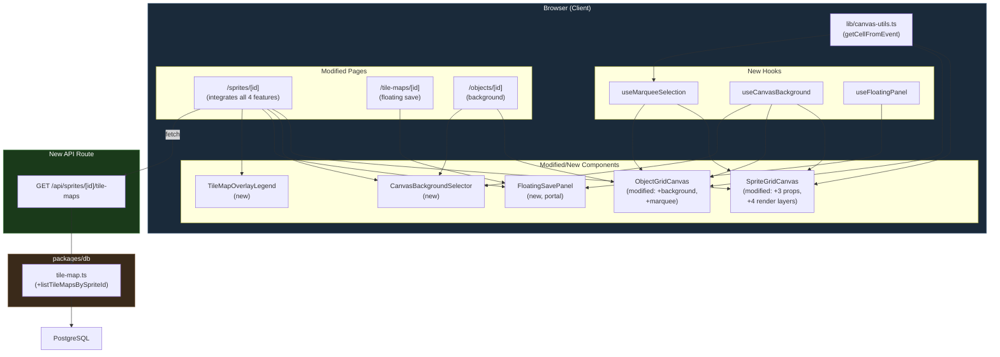
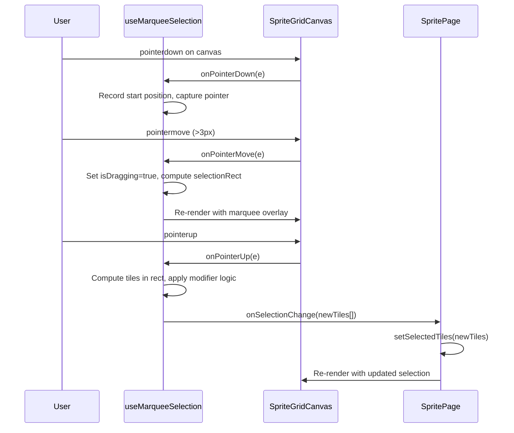
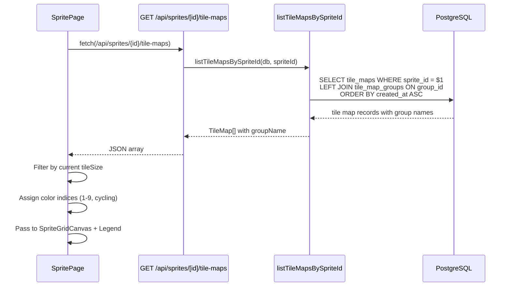

# Genmap Editor UX Improvements Design Document

## Overview

This document defines the technical design for four targeted UX improvements to the Genmap sprite/tile map editor (`apps/genmap/`): (1) marquee rectangle selection for tiles, (2) configurable canvas background previews, (3) a floating draggable "Save as Tile Map" panel, and (4) existing tile map overlay visualization with auto-colored selections. These enhancements address three workflow bottlenecks identified in daily use: tedious single-click tile selection, no background control for transparency verification, and scroll-to-save workflow friction.

## Design Summary (Meta)

```yaml
design_type: "extension"
risk_level: "low"
complexity_level: "medium"
complexity_rationale: >
  (1) ACs require coordination of 7 canvas render layers with correct z-ordering,
  pointer event handling with modifier keys and drag threshold logic, React portal
  rendering for floating panel, and localStorage persistence across 3 hooks.
  (2) Constraints: canvas render performance must remain smooth with overlay layers;
  pointer capture must handle edge cases (leave during drag, window resize);
  backward compatibility required for existing onCellClick prop.
main_constraints:
  - "Backward compatibility: existing onCellClick and onCellHover props must continue to work unchanged"
  - "No new npm dependencies (pointer events and portals are native APIs)"
  - "No database schema changes (only additive DB service function and API endpoint)"
  - "Canvas render order is strictly defined (7 layers) and must not regress"
  - "All localStorage access wrapped in try/catch for Safari private mode"
biggest_risks:
  - "Canvas render performance with multiple tile map overlay layers"
  - "Pointer capture edge cases across browsers (particularly during fast drag)"
  - "Floating panel z-index conflicts with existing shadcn/ui dialogs"
unknowns:
  - "Performance ceiling when rendering >500 overlay tiles across multiple tile maps"
  - "Cross-browser consistency of setPointerCapture on touch-enabled desktops"
```

## Background and Context

### Prerequisite ADRs

- **ADR-0007: Sprite Management Storage and Schema** -- Covers storage decisions and schema patterns used by the sprite management system that these UX improvements extend.
- No common ADRs exist (`docs/adr/ADR-COMMON-*` not found). No new common ADRs are needed as these changes do not introduce new cross-cutting technical patterns.

### Agreement Checklist

#### Scope

- [x] Modify `SpriteGridCanvas` to support marquee selection, background prop, and overlay rendering
- [x] Modify `ObjectGridCanvas` to support background prop and marquee-based batch tile placement
- [x] Create 3 new hooks (`use-marquee-selection`, `use-canvas-background`, `use-floating-panel`)
- [x] Create 3 new components (`CanvasBackgroundSelector`, `FloatingSavePanel`, `TileMapOverlayLegend`)
- [x] Extract `getCellFromEvent` into shared utility `lib/canvas-utils.ts`
- [x] Create new API endpoint `GET /api/sprites/[id]/tile-maps`
- [x] Add `listTileMapsBySpriteId` function to `packages/db/src/services/tile-map.ts`
- [x] Modify sprite detail page (`/sprites/[id]`) to integrate all 4 features
- [x] Modify tile-map edit page (`/tile-maps/[id]`) to use floating save panel
- [x] Modify object edit page (`/objects/[id]`) to use configurable background

#### Non-Scope (Explicitly not changing)

- [x] Database schema -- no new tables or columns
- [x] Existing API endpoints -- no modifications to existing routes
- [x] Existing services in `packages/db/src/services/` -- no modifications (only addition)
- [x] Game client app (`apps/game/`) -- no modifications
- [x] Authentication -- none required
- [x] Ctrl+A select-all shortcut -- explicitly resolved as not adding
- [x] Undo/redo for selection -- explicitly resolved as not implementing
- [x] Mobile-first responsive behavior -- desktop-focused internal tool

#### Constraints

- [x] Parallel operation: Yes (genmap operates independently)
- [x] Backward compatibility: Required (existing `onCellClick` prop must continue working)
- [x] Performance measurement: Not required (internal tool, no SLA targets)

#### Agreement Reflection

| Agreement | Design Section |
|-----------|---------------|
| Backward compat for onCellClick | Main Components > SpriteGridCanvas -- `onCellClick` remains as optional prop |
| No Ctrl+A | Feature 1 AC -- explicitly omitted from keyboard shortcuts |
| No undo/redo | Feature 1 AC -- explicitly excluded |
| Floating panel on tile-map edit page | Feature 3 scope -- both sprite detail and tile-map edit pages |
| ObjectGridCanvas marquee placement | Feature 1 scope -- adapted for batch tile painting |
| All localStorage in try/catch | Contract Definitions > localStorage -- error handling pattern |

### Problem to Solve

The current Genmap editor has three workflow bottlenecks:

1. **Tedious tile selection**: Selecting 30 contiguous tiles requires 30 individual clicks. Professional editors use marquee (drag-to-select) as the primary selection method.
2. **No background control**: Users cannot preview sprites against different backgrounds, making transparency verification difficult.
3. **Scroll-to-save workflow**: The save form is below the canvas in document flow, forcing users to scroll away from their selection to save.
4. **No overlay visualization**: Users cannot see which tiles are already claimed by existing tile maps when creating new selections.

### Current Challenges

- `SpriteGridCanvas` only supports single-click toggle via `onCellClick` callback
- No background layer in `SpriteGridCanvas` (draws sprite directly on blank canvas)
- `ObjectGridCanvas` has hardcoded checkerboard colors (`#e0e0e0`/`#c0c0c0`)
- The save form on the sprite detail page is inline at the bottom of the page (lines 223-253)
- No API to query tile maps by sprite ID exists
- `getCellFromEvent` is duplicated in both `SpriteGridCanvas` and `ObjectGridCanvas`

### Requirements

#### Functional Requirements

- FR-1: Marquee rectangle selection with modifier key support (Shift/Ctrl)
- FR-2: Configurable canvas background with localStorage persistence
- FR-3: Floating draggable save panel with React portal rendering
- FR-4: Existing tile map overlay visualization with auto-colored palette
- FR-5: New API endpoint for listing tile maps by sprite ID
- FR-6: Shared `getCellFromEvent` utility extraction

#### Non-Functional Requirements

- **Performance**: Canvas rendering with overlays must remain interactive (no perceptible lag during mouse interaction); overlay rendering for up to 500 tiles across 10 tile maps should complete within one animation frame
- **Reliability**: localStorage failures must not break functionality (graceful fallback to defaults)
- **Maintainability**: New hooks and components follow existing patterns (single-responsibility hooks, shadcn/ui component composition)

## Acceptance Criteria (AC) - EARS Format

### Feature 1: Marquee Rectangle Selection

- [ ] **When** a user clicks a tile on the SpriteGridCanvas without modifier keys, the system shall toggle that tile's selection state (existing behavior preserved)
- [ ] **When** a user clicks and drags beyond 3 pixels on the SpriteGridCanvas without modifier keys, the system shall render a dashed blue marquee rectangle snapped to tile grid boundaries
- [ ] **When** the user releases the mouse after a marquee drag without modifier keys, the system shall replace the current selection with all tiles inside the rectangle
- [ ] **When** the user holds Shift during a marquee drag, the system shall add tiles inside the rectangle to the existing selection (union)
- [ ] **When** the user holds Ctrl/Cmd during a marquee drag, the system shall remove tiles inside the rectangle from the existing selection (subtract)
- [ ] **When** the user holds Ctrl/Cmd and clicks a single tile, the system shall toggle that tile without affecting the rest of the selection
- [ ] **When** the user holds Shift and clicks a single tile, the system shall add that tile to the selection without deselecting
- [ ] **When** the mouse leaves the canvas during a drag, the system shall cancel the drag and revert to the pre-drag selection
- [ ] **When** the Escape key is pressed during a drag, the system shall cancel the drag and revert to the pre-drag selection
- [ ] **If** the drag starts and ends on the same tile after exceeding the 3px threshold, **then** the system shall select exactly that one tile
- [ ] The `onSelectionChange` callback shall provide the full array of selected `TileCoord[]` after any selection operation
- [ ] The existing `onCellClick` prop shall continue to function when no `onSelectionChange` is provided (backward compatibility)
- [ ] **When** a user clicks and drags on the ObjectGridCanvas with an active brush, the system shall fill all cells within the marquee rectangle with the active tile

### Feature 2: Configurable Canvas Background

- [ ] **When** the canvas background is set to 'checkerboard', the system shall render an alternating two-color check pattern as the first layer before the sprite image
- [ ] **When** the canvas background is set to a solid color, the system shall fill the canvas with that color before drawing the sprite image
- [ ] **When** a background option is selected, the system shall persist the choice to localStorage under `genmap-canvas-background`
- [ ] **When** the page loads, the system shall restore the saved background preference from localStorage, defaulting to 'checkerboard' if none is stored
- [ ] **If** localStorage is unavailable (e.g., Safari private mode), **then** the system shall use 'checkerboard' without error
- [ ] The CanvasBackgroundSelector shall display five options: checkerboard, black, white, grass green (#4a7c3f), and a custom color picker
- [ ] The active swatch shall have a 2px ring outline distinguishing it from inactive swatches
- [ ] The background setting shall apply consistently across SpriteGridCanvas and ObjectGridCanvas on all pages
- [ ] **When** the ObjectGridCanvas has empty cells, the configured background shall be visible in those cells

### Feature 3: Floating Draggable Save Panel

- [ ] **When** the user selects at least 1 tile on the sprite detail page, the FloatingSavePanel shall appear with fade-in animation
- [ ] **When** all tiles are deselected or the save completes, the panel shall disappear
- [ ] **When** the user drags the panel by its drag handle, the panel shall move to the new position using pointer events
- [ ] **When** the user releases the drag, the position shall be saved to localStorage under `genmap-floating-panel-save`
- [ ] **When** the page loads with stored position, the panel shall restore that position, clamped to viewport bounds
- [ ] **When** the viewport is resized such that the panel would be outside bounds, the system shall re-clamp the position
- [ ] **When** the user clicks the collapse button, the panel shall shrink to title bar only, showing the selected tile count
- [ ] The panel shall render via `ReactDOM.createPortal` to `document.body`
- [ ] The panel shall use `z-index: 40` (below shadcn/ui dialogs at z-index 50)
- [ ] The panel shall have fixed width of 320px with 8px border radius and drop shadow
- [ ] The panel shall contain: tile map name input, group selector dropdown, tile count display, and save button
- [ ] The FloatingSavePanel shall also be applied to the tile-map edit page (`/tile-maps/[id]`), replacing the inline save section
- [ ] **If** localStorage is unavailable, **then** the panel shall use the default position (bottom-right, 16px margin) without error

### Feature 4: Existing Tile Map Overlay with Auto-Colors

- [ ] **When** the sprite detail page loads, the system shall fetch all tile maps for this sprite via `GET /api/sprites/[id]/tile-maps`
- [ ] **When** tile maps exist for the current sprite and matching tile size, the system shall render colored overlays on the SpriteGridCanvas at 40% opacity
- [ ] Each tile map overlay shall use a distinct color from the 10-color palette, assigned by creation order (index 0 reserved for active selection)
- [ ] The TileMapOverlayLegend shall display each tile map with: visibility toggle, color swatch, clickable name (linking to `/tile-maps/[id]`), and tile count
- [ ] **When** a visibility toggle is clicked, the system shall show or hide that tile map's overlay
- [ ] **When** the tile size selector is changed, the system shall filter overlays to show only tile maps with matching tileWidth/tileHeight
- [ ] **When** a new tile map is saved, the system shall re-fetch the tile maps list so the newly saved map appears as an overlay
- [ ] **If** no tile maps exist for this sprite, **then** the legend panel shall be hidden
- [ ] **If** more than 9 tile maps exist, **then** colors shall cycle through indices 1-9
- [ ] The `GET /api/sprites/[id]/tile-maps` endpoint shall return tile maps ordered by `createdAt ASC`
- [ ] The response shall include: id, name, groupId, groupName, tileWidth, tileHeight, selectedTiles, createdAt

## Existing Codebase Analysis

### Implementation Path Mapping

| Type | Path | Description |
|------|------|-------------|
| Existing (modify) | `apps/genmap/src/components/sprite-grid-canvas.tsx` | Canvas component for tile selection -- add background, overlay, and marquee layers |
| Existing (modify) | `apps/genmap/src/components/object-grid-canvas.tsx` | Object canvas -- add background prop and marquee placement |
| Existing (modify) | `apps/genmap/src/app/sprites/[id]/page.tsx` | Sprite detail page -- integrate all 4 features, replace inline save form |
| Existing (modify) | `apps/genmap/src/app/tile-maps/[id]/page.tsx` | Tile map edit page -- add floating save panel |
| Existing (modify) | `apps/genmap/src/app/objects/[id]/page.tsx` | Object edit page -- add background selector |
| Existing (modify) | `packages/db/src/services/tile-map.ts` | Add `listTileMapsBySpriteId` function |
| Existing (modify) | `packages/db/src/index.ts` | Export new service function |
| Existing (reference) | `apps/genmap/src/components/tile-size-selector.tsx` | Toggle button pattern reference for background swatches |
| Existing (reference) | `apps/genmap/src/components/object-preview.tsx` | Canvas rendering pattern reference |
| Existing (reference) | `apps/genmap/src/hooks/use-keyboard-shortcuts.ts` | Hook pattern reference (event listener setup/cleanup) |
| Existing (reference) | `apps/genmap/src/components/group-selector.tsx` | Dropdown component reused in FloatingSavePanel |
| New | `apps/genmap/src/lib/canvas-utils.ts` | Shared `getCellFromEvent` utility |
| New | `apps/genmap/src/hooks/use-marquee-selection.ts` | Marquee drag logic hook |
| New | `apps/genmap/src/hooks/use-canvas-background.ts` | localStorage-backed background preference hook |
| New | `apps/genmap/src/hooks/use-floating-panel.ts` | Drag positioning + persistence hook |
| New | `apps/genmap/src/components/canvas-background-selector.tsx` | Color swatch row component |
| New | `apps/genmap/src/components/floating-save-panel.tsx` | Floating draggable save panel component |
| New | `apps/genmap/src/components/tile-map-overlay-legend.tsx` | Tile map legend with visibility toggles |
| New | `apps/genmap/src/app/api/sprites/[id]/tile-maps/route.ts` | API endpoint for listing tile maps by sprite |

### Similar Functionality Search

- **Marquee/drag selection**: No existing drag selection code in the codebase. `SpriteGridCanvas` uses single-click toggle only. New implementation justified.
- **Canvas background rendering**: `ObjectGridCanvas` has hardcoded checkerboard (lines 77-88). This implementation will be refactored into the configurable `useCanvasBackground` pattern. No duplication -- extending existing code.
- **Floating panel/portal**: No existing portal-rendered floating panels in the codebase. `ConfirmDialog` uses shadcn/ui Dialog (which internally uses portals), but the floating draggable panel is a different interaction pattern. New implementation justified.
- **getCellFromEvent**: This exact function exists in both `SpriteGridCanvas` (lines 134-161) and `ObjectGridCanvas` (lines 173-194). This is duplication that will be resolved by extraction to `canvas-utils.ts`.
- **localStorage hooks**: No existing localStorage persistence hooks in the codebase. New implementation justified.

### Code Inspection Evidence

#### What Was Examined

| File Inspected | Key Finding | Design Impact |
|---------------|-------------|---------------|
| `sprite-grid-canvas.tsx` (196 lines) | `getCellFromEvent` at lines 134-161; render layers: image, selection overlay, grid lines, hover. `TileCoord` type exported. Uses `requestAnimationFrame`. | Must preserve existing render logic, insert new layers (background, overlays, marquee) at correct positions. Extract `getCellFromEvent`. |
| `object-grid-canvas.tsx` (233 lines) | Duplicate `getCellFromEvent` at lines 173-194; hardcoded checkerboard at lines 77-88; `GridTiles` and `TilePlacement` types exported. | Refactor checkerboard to use `background` prop. Extract shared `getCellFromEvent`. Add marquee for batch placement. |
| `sprites/[id]/page.tsx` (296 lines) | Inline save form at lines 223-253 conditionally rendered when `selectedTiles.length > 0`. State: `tileMapName`, `tileMapGroupId`, `isSaving`. `handleSaveTileMap` at lines 101-136. | Replace inline save div with `FloatingSavePanel`. Pass same state variables as props. Add tile map overlay fetch and legend. |
| `tile-maps/[id]/page.tsx` (265 lines) | Inline save section at lines 239-246. `handleSave` at lines 107-138 uses PATCH. No tile size selector (tileWidth fixed from loaded tile map). | Add `FloatingSavePanel` for save section. Different props than sprite detail (save vs create). |
| `objects/[id]/page.tsx` (337 lines) | Uses `ObjectGridCanvas` with `TilePicker`. No background selector currently. | Add `CanvasBackgroundSelector` above the canvas area. Pass `background` prop to `ObjectGridCanvas`. |
| `tile-size-selector.tsx` (35 lines) | Toggle button pattern with active ring styling. Uses `px-3 py-1 rounded text-sm font-medium border`. | Reference pattern for CanvasBackgroundSelector swatch buttons. Consistent visual language. |
| `use-keyboard-shortcuts.ts` (63 lines) | Event listener pattern: `useCallback` for handler, `useEffect` for add/remove listener. Suppresses shortcuts when in input/textarea/select. | Follow same pattern for `useFloatingPanel` document-level pointer event listeners. |
| `object-preview.tsx` (146 lines) | Uses `ctx.clearRect` for empty cells; separate image cache via `useRef`. | May adopt background preference for consistency (lower priority). |
| `packages/db/src/services/tile-map.ts` (110 lines) | Existing functions: `createTileMap`, `getTileMap`, `listTileMaps`, `updateTileMap`, `deleteTileMap`, group functions. DrizzleClient first-param pattern. Uses `eq`, `desc` from drizzle-orm. | Add `listTileMapsBySpriteId` following same function pattern. Import `asc` for createdAt ordering. |

#### How Findings Influence Design

- **Existing render pattern**: `SpriteGridCanvas.render()` callback is a single function redrawing all layers. New layers (background, overlays, marquee) must be inserted at correct positions within this function. Cannot use separate canvases because the layers must composite correctly.
- **getCellFromEvent duplication**: Both canvas components implement nearly identical coordinate mapping. Extraction to a shared utility is a prerequisite before marquee hook development.
- **State ownership**: The sprite detail page owns all state (selectedTiles, tileMapName, etc.). The floating panel receives state via props, maintaining the existing architecture.
- **Service function pattern**: All service functions take `DrizzleClient` as first parameter and return `Promise<T>`. The new `listTileMapsBySpriteId` follows this exact pattern.

## Applicable Standards

### Classification Table

| Standard | Type | Source | Impact on Design |
|----------|------|--------|-----------------|
| Prettier: single quotes, no trailing commas config | Explicit | `.prettierrc` | All new code must use single quotes |
| EditorConfig: 2-space indent, UTF-8, trailing newline | Explicit | `.editorconfig` | All new files use 2-space indent |
| TypeScript: strict mode, ES2022, bundler resolution | Explicit | `tsconfig.base.json` | All new code must pass strict type checking (`noImplicitReturns`, `noUnusedLocals`) |
| Next.js App Router conventions | Explicit | `apps/genmap/tsconfig.json` | API routes use named exports (GET, POST); pages use default exports |
| shadcn/ui New York style with Tailwind CSS | Explicit | `apps/genmap/components.json` | UI components use shadcn/ui primitives with `cn()` utility |
| ESLint: @nx/eslint-plugin flat config | Explicit | `eslint.config.mjs` | All new TS/TSX files must pass ESLint |
| 'use client' directive on interactive components | Implicit | `sprite-grid-canvas.tsx`, `object-grid-canvas.tsx`, all hooks | All new hooks and interactive components must have `'use client'` directive |
| requestAnimationFrame for canvas rendering | Implicit | `sprite-grid-canvas.tsx:130-132`, `object-grid-canvas.tsx:154-157` | Canvas rendering uses rAF pattern with cleanup via `cancelAnimationFrame` |
| Hook naming convention: `use-*.ts` | Implicit | `hooks/use-keyboard-shortcuts.ts`, `hooks/use-sprites.ts` | New hooks follow `use-{name}.ts` naming in `hooks/` directory |
| DrizzleClient first-param service pattern | Implicit | `packages/db/src/services/tile-map.ts`, `sprite.ts` | New service functions take `db: DrizzleClient` as first parameter |
| Component export: named exports | Implicit | All components in `components/` | Components use named function exports, not default exports |

## Design

### Change Impact Map

```yaml
Change Target: SpriteGridCanvas + Sprite Detail Page
Direct Impact:
  - apps/genmap/src/components/sprite-grid-canvas.tsx (add 3 new optional props, 4 new render layers, refactor getCellFromEvent)
  - apps/genmap/src/components/object-grid-canvas.tsx (add background prop, refactor checkerboard, extract getCellFromEvent, add marquee)
  - apps/genmap/src/app/sprites/[id]/page.tsx (integrate all 4 features, replace inline save form)
  - apps/genmap/src/app/tile-maps/[id]/page.tsx (add floating save panel)
  - apps/genmap/src/app/objects/[id]/page.tsx (add background selector)
  - packages/db/src/services/tile-map.ts (add listTileMapsBySpriteId)
  - packages/db/src/index.ts (export new function)
  - apps/genmap/src/hooks/use-marquee-selection.ts (new)
  - apps/genmap/src/hooks/use-canvas-background.ts (new)
  - apps/genmap/src/hooks/use-floating-panel.ts (new)
  - apps/genmap/src/lib/canvas-utils.ts (new)
  - apps/genmap/src/components/canvas-background-selector.tsx (new)
  - apps/genmap/src/components/floating-save-panel.tsx (new)
  - apps/genmap/src/components/tile-map-overlay-legend.tsx (new)
  - apps/genmap/src/app/api/sprites/[id]/tile-maps/route.ts (new)
Indirect Impact:
  - Canvas render performance (additional overlay layers)
  - localStorage (2 new keys: genmap-canvas-background, genmap-floating-panel-save)
No Ripple Effect:
  - Database schema (no changes to any tables)
  - packages/db/src/schema/* (all unchanged)
  - Existing API endpoints (all unchanged)
  - apps/game/ (unchanged)
  - Game server / Colyseus code (unchanged)
  - packages/db/src/adapters/* (unchanged)
  - apps/genmap/src/components/tile-picker.tsx (unchanged)
  - apps/genmap/src/components/sprite-upload-form.tsx (unchanged)
```

### Architecture Overview



### Data Flow

#### Marquee Selection Flow



#### Tile Map Overlay Fetch Flow



### Canvas Render Layer Specification

```mermaid
graph TB
    subgraph RenderOrder["SpriteGridCanvas Render Layers (top to bottom)"]
        L7["Layer 7: Hover highlight<br/>rgba(255,255,255,0.2) or rgba(239,68,68,0.3)"]
        L6["Layer 6: Marquee rectangle<br/>rgba(59,130,246,0.25) fill + 1px dashed blue border"]
        L5["Layer 5: Grid lines<br/>rgba(255,255,255,0.5) 1px"]
        L4["Layer 4: Active selection overlay<br/>rgba(59,130,246,0.4)"]
        L3["Layer 3: Existing tile map overlays<br/>per-map color, 40% opacity, 1px border at 70%"]
        L2["Layer 2: Sprite image<br/>drawImage()"]
        L1["Layer 1: Background<br/>checkerboard or solid color"]
    end

    L7 --> L6 --> L5 --> L4 --> L3 --> L2 --> L1

    style L1 fill:#4a7c3f,color:#ffffff
    style L2 fill:#666,color:#ffffff
    style L3 fill:#10b981,color:#ffffff
    style L4 fill:#3b82f6,color:#ffffff
    style L5 fill:#999,color:#ffffff
    style L6 fill:#3b82f6,color:#ffffff
    style L7 fill:#ccc,color:#000
```



### Integration Points List

| Integration Point | Location | Old Implementation | New Implementation | Switching Method |
|-------------------|----------|-------------------|-------------------|------------------|
| getCellFromEvent extraction | `sprite-grid-canvas.tsx` + `object-grid-canvas.tsx` | Inline function in each component | Import from `lib/canvas-utils.ts` | Replace inline with import |
| SpriteGridCanvas background | `sprite-grid-canvas.tsx` render function | No background (draw image directly) | Render background layer before image based on `background` prop | Add optional prop, insert render step |
| ObjectGridCanvas background | `object-grid-canvas.tsx` lines 77-88 | Hardcoded `#e0e0e0`/`#c0c0c0` | Configurable via `background` prop | Replace hardcoded values with prop-driven logic |
| Inline save form replacement | `sprites/[id]/page.tsx` lines 223-253 | Inline `<div>` with form elements | `<FloatingSavePanel>` with same state bindings | Remove inline div, add portal component |
| Tile-map edit save section | `tile-maps/[id]/page.tsx` lines 239-246 | Inline `<Button>` | `<FloatingSavePanel>` with PATCH handler | Replace inline section |
| Tile map overlay data | `sprites/[id]/page.tsx` | No tile map data on sprite page | Fetch via new API, pass as `existingTileMaps` prop | New data flow, additive |
| DB service addition | `packages/db/src/services/tile-map.ts` | No `listTileMapsBySpriteId` | New function added at end of file | Append function |
| Package barrel export | `packages/db/src/index.ts` | Existing exports | Add `listTileMapsBySpriteId` export | Append export |

### Integration Point Map

```yaml
Integration Point 1:
  Existing Component: sprite-grid-canvas.tsx - getCellFromEvent (lines 134-161)
  Integration Method: Extract to canvas-utils.ts, replace with import
  Impact Level: Medium (Refactor)
  Required Test Coverage: Canvas click still produces correct TileCoord

Integration Point 2:
  Existing Component: sprites/[id]/page.tsx - inline save form (lines 223-253)
  Integration Method: Remove inline div, render FloatingSavePanel with same state bindings
  Impact Level: High (Process Flow Change)
  Required Test Coverage: Save flow still works; panel appears/disappears with selection

Integration Point 3:
  Existing Component: object-grid-canvas.tsx - checkerboard rendering (lines 77-88)
  Integration Method: Replace hardcoded colors with background prop logic
  Impact Level: Medium (Rendering Change)
  Required Test Coverage: Canvas renders correct background for each option

Integration Point 4:
  Existing Component: packages/db/src/services/tile-map.ts
  Integration Method: Add new exported function at end of file
  Impact Level: Low (Additive)
  Required Test Coverage: Function returns correct tile maps filtered by spriteId

Integration Point 5:
  Existing Component: tile-maps/[id]/page.tsx - save button section
  Integration Method: Replace inline save button with FloatingSavePanel
  Impact Level: High (Process Flow Change)
  Required Test Coverage: PATCH save flow still works via floating panel
```

### Main Components

#### `lib/canvas-utils.ts` (New Shared Utility)

- **Responsibility**: Provide coordinate mapping from mouse/pointer events to grid cells
- **Interface**:
  ```typescript
  export interface CellFromEventOptions {
    canvas: HTMLCanvasElement;
    canvasLogicalWidth: number;
    canvasLogicalHeight: number;
    cellWidth: number;
    cellHeight: number;
    maxCols: number;
    maxRows: number;
  }

  export function getCellFromEvent(
    e: { clientX: number; clientY: number },
    options: CellFromEventOptions
  ): { col: number; row: number } | null;
  ```
- **Dependencies**: None (pure function)

#### `useMarqueeSelection` Hook (New)

- **Responsibility**: Encapsulate pointer event handling for marquee rectangle selection with modifier key tracking, drag threshold, and pointer capture
- **Interface**:
  ```typescript
  interface UseMarqueeSelectionOptions {
    canvasRef: React.RefObject<HTMLCanvasElement>;
    cellWidth: number;
    cellHeight: number;
    maxCols: number;
    maxRows: number;
    canvasLogicalWidth: number;
    canvasLogicalHeight: number;
    dragThreshold?: number; // default: 3
  }

  interface MarqueeState {
    isDragging: boolean;
    selectionRect: {
      startCol: number;
      startRow: number;
      endCol: number;
      endRow: number;
    } | null;
    modifiers: { shift: boolean; ctrl: boolean };
  }

  function useMarqueeSelection(options: UseMarqueeSelectionOptions): {
    marquee: MarqueeState;
    handlers: {
      onPointerDown: (e: React.PointerEvent<HTMLCanvasElement>) => void;
      onPointerMove: (e: React.PointerEvent<HTMLCanvasElement>) => void;
      onPointerUp: (e: React.PointerEvent<HTMLCanvasElement>) => void;
    };
    getTilesInRect: () => Array<{ col: number; row: number }>;
    cancelDrag: () => void;
  };
  ```
- **Dependencies**: `lib/canvas-utils.ts` for `getCellFromEvent`
- **Key implementation notes**:
  - Uses `setPointerCapture(e.pointerId)` on `pointerdown` for reliable tracking
  - Stores `startPixel` position on `pointerdown`; tracks `currentPixel` on `pointermove`
  - Only transitions to `isDragging=true` when movement exceeds `dragThreshold` pixels
  - Snaps rect to grid: `minCol = min(startCol, currentCol)`, `maxCol = max(...)`, similarly for rows
  - On `pointerup`: if `isDragging`, calls parent callback with tiles in rect; if not dragging (click), calls parent with single cell
  - `cancelDrag()` resets all state to pre-drag values; called on mouse leave and Escape

#### `useCanvasBackground` Hook (New)

- **Responsibility**: Read/write canvas background preference to localStorage with graceful fallback
- **Interface**:
  ```typescript
  type CanvasBackground =
    | { type: 'checkerboard' }
    | { type: 'solid'; color: string };

  function useCanvasBackground(): {
    background: CanvasBackground;
    setBackground: (bg: CanvasBackground) => void;
  };
  ```
- **Dependencies**: None
- **localStorage key**: `genmap-canvas-background`
- **Default**: `{ type: 'checkerboard' }`
- **Error handling**: All `localStorage.getItem`/`setItem` calls wrapped in try/catch; on error, returns default without persisting

#### `useFloatingPanel` Hook (New)

- **Responsibility**: Manage draggable panel position, collapse state, localStorage persistence, and viewport clamping
- **Interface**:
  ```typescript
  interface UseFloatingPanelOptions {
    storageKey: string;
    defaultPosition: { x: number; y: number };
    panelWidth: number;
    panelHeight: number;
  }

  function useFloatingPanel(options: UseFloatingPanelOptions): {
    position: { x: number; y: number };
    isCollapsed: boolean;
    isDragging: boolean;
    setCollapsed: (collapsed: boolean) => void;
    dragHandlers: {
      onPointerDown: (e: React.PointerEvent) => void;
    };
  };
  ```
- **Dependencies**: None
- **Key implementation notes**:
  - On `pointerdown` on drag handle: `setPointerCapture`, record offset between pointer and panel top-left
  - Document-level `pointermove` listener updates position (clamped to viewport: at least 50% of panel width visible, title bar always visible)
  - Document-level `pointerup` listener persists position to localStorage
  - Window `resize` listener re-clamps position
  - Collapsed state persisted alongside position in localStorage

#### `CanvasBackgroundSelector` Component (New)

- **Responsibility**: Render a row of color swatch buttons for background selection with custom color picker
- **Interface**:
  ```typescript
  interface CanvasBackgroundSelectorProps {
    value: CanvasBackground;
    onChange: (bg: CanvasBackground) => void;
    className?: string;
  }
  ```
- **Dependencies**: `CanvasBackground` type from `useCanvasBackground`
- **Visual design**: Row of 24x24px rounded buttons (`border-radius: 4px`). Checkerboard swatch uses CSS `linear-gradient`. Active swatch has `ring-2 ring-primary` outline. Custom swatch wraps a hidden `<input type="color">`.
- **Presets**: checkerboard, `#000000` (black), `#ffffff` (white), `#4a7c3f` (grass green), custom

#### `FloatingSavePanel` Component (New)

- **Responsibility**: Render a floating, draggable save form panel via React portal
- **Interface**:
  ```typescript
  interface FloatingSavePanelProps {
    selectedTilesCount: number;
    tileMapName: string;
    onNameChange: (name: string) => void;
    tileMapGroupId: string | null;
    onGroupIdChange: (id: string | null) => void;
    onSave: () => void;
    isSaving: boolean;
    isVisible: boolean;
    // For tile-map edit page variant:
    saveButtonLabel?: string;
  }
  ```
- **Dependencies**: `useFloatingPanel` hook, `GroupSelector` component, shadcn/ui `Card`, `Input`, `Button`
- **Portal**: `ReactDOM.createPortal(jsx, document.body)`
- **Z-index**: 40
- **Width**: 320px fixed
- **Styling**: `shadow-lg`, `rounded-lg`, `border`, `bg-background`
- **Collapse behavior**: When collapsed, shows only title bar with tile count: "Save as Tile Map (N)"

#### `TileMapOverlayLegend` Component (New)

- **Responsibility**: Render a collapsible legend listing existing tile maps with color swatches and visibility toggles
- **Interface**:
  ```typescript
  interface TileMapOverlayLegendProps {
    tileMaps: Array<{
      id: string;
      name: string;
      colorIndex: number;
      tileCount: number;
    }>;
    visibility: Record<string, boolean>;
    onToggleVisibility: (id: string) => void;
    currentSelectionCount: number;
    className?: string;
  }
  ```
- **Dependencies**: shadcn/ui `Button` (icon variant for eye toggle), Lucide `Eye`/`EyeOff` icons
- **Behavior**: Collapsed by default when `tileMaps.length === 0`, expanded when tileMaps exist. Each row: eye toggle, color swatch (16x16px), tile map name (clickable `<a href="/tile-maps/[id]">`), tile count.

#### Modified `SpriteGridCanvas`

- **New optional props** (all backward compatible):
  ```typescript
  background?: CanvasBackground;
  existingTileMaps?: Array<{
    id: string;
    colorIndex: number;
    tiles: TileCoord[];
    visible: boolean;
  }>;
  onSelectionChange?: (tiles: TileCoord[]) => void;
  ```
- **Modified render function** -- new layer order:
  1. Background (checkerboard or solid) -- **new**
  2. Sprite image (existing)
  3. Existing tile map overlays -- **new**
  4. Active selection overlay (existing)
  5. Grid lines (existing)
  6. Marquee rectangle -- **new**
  7. Hover highlight (existing)
- **Modified event handlers**: Replace `onClick`/`onMouseMove`/`onMouseLeave` with `onPointerDown`/`onPointerMove`/`onPointerUp` from `useMarqueeSelection`. Single-click path detected when drag threshold is not exceeded.

#### Modified `ObjectGridCanvas`

- **New optional props**:
  ```typescript
  background?: CanvasBackground;
  ```
- **Modified render function**: Replace hardcoded checkerboard (lines 77-88) with `background` prop-driven rendering using same logic as `SpriteGridCanvas` Layer 1.
- **Marquee placement**: When `activeTile` is set and user drags, fill all cells in the marquee rectangle with the active tile.

### Contract Definitions

#### Overlay Color Palette

```typescript
export const TILE_MAP_OVERLAY_COLORS = [
  '#3b82f6', // 0: Blue -- reserved for current selection
  '#10b981', // 1: Emerald
  '#f59e0b', // 2: Amber
  '#f43f5e', // 3: Rose
  '#8b5cf6', // 4: Violet
  '#06b6d4', // 5: Cyan
  '#f97316', // 6: Orange
  '#ec4899', // 7: Pink
  '#14b8a6', // 8: Teal
  '#84cc16', // 9: Lime
] as const;

/** Get overlay color index for a tile map (0-indexed in creation order) */
export function getOverlayColorIndex(tileMapIndex: number): number {
  return (tileMapIndex % 9) + 1;
}
```

#### CanvasBackground Type

```typescript
export type CanvasBackground =
  | { type: 'checkerboard' }
  | { type: 'solid'; color: string };
```

#### localStorage Contracts

```typescript
// Key: 'genmap-canvas-background'
// Value: JSON string of CanvasBackground
// Default: { type: 'checkerboard' }

// Key: 'genmap-floating-panel-save'
// Value: JSON string of { x: number; y: number; collapsed: boolean }
// Default: { x: window.innerWidth - 336, y: window.innerHeight - 300, collapsed: false }
```

All localStorage access follows this pattern:

```typescript
function readFromStorage<T>(key: string, fallback: T): T {
  try {
    const raw = localStorage.getItem(key);
    if (raw === null) return fallback;
    return JSON.parse(raw) as T;
  } catch {
    return fallback;
  }
}

function writeToStorage(key: string, value: unknown): void {
  try {
    localStorage.setItem(key, JSON.stringify(value));
  } catch {
    // Safari private mode -- silently ignore
  }
}
```

### API Contract

#### `GET /api/sprites/[id]/tile-maps`

**Request**: No body. Path parameter: sprite UUID.

**Response** (200):
```typescript
interface TileMapForSpriteResponse {
  id: string;
  name: string;
  groupId: string | null;
  groupName: string | null;
  tileWidth: number;
  tileHeight: number;
  selectedTiles: Array<{ col: number; row: number }>;
  createdAt: string; // ISO 8601
}

// Response: TileMapForSpriteResponse[]
// Ordered by createdAt ASC (oldest first, for stable color assignment)
```

**Error responses**:
- 404: Sprite not found
- 500: Database error

**Implementation**:
```typescript
// apps/genmap/src/app/api/sprites/[id]/tile-maps/route.ts
import { NextResponse } from 'next/server';
import { getDb, getSprite, listTileMapsBySpriteId } from '@nookstead/db';

export async function GET(
  _request: Request,
  { params }: { params: Promise<{ id: string }> }
) {
  const { id } = await params;
  const db = getDb();
  const sprite = await getSprite(db, id);
  if (!sprite) {
    return NextResponse.json({ error: 'Sprite not found' }, { status: 404 });
  }
  const tileMaps = await listTileMapsBySpriteId(db, id);
  return NextResponse.json(tileMaps);
}
```

### Data Contract

#### listTileMapsBySpriteId

```yaml
Input:
  Type: (db: DrizzleClient, spriteId: string)
  Preconditions:
    - spriteId is a valid UUID string
  Validation: None at service level (API route validates sprite exists)

Output:
  Type: Promise<Array<{ id, name, groupId, groupName, tileWidth, tileHeight, selectedTiles, createdAt }>>
  Guarantees:
    - Results filtered to sprite_id = spriteId
    - Ordered by created_at ASC
    - groupName is null when groupId is null or group was deleted
  On Error: Throws on database errors

Invariants:
  - Only tile maps with matching sprite_id are returned
  - Order is stable (by createdAt ASC) for consistent color assignment
```

### Data Representation Decisions

| Data Structure | Decision | Rationale |
|---|---|---|
| `CanvasBackground` | **New** dedicated type | No existing background configuration type. Simple discriminated union for two background modes. |
| `MarqueeState` | **New** dedicated type | No existing drag state type. Specific to marquee interaction pattern. |
| `TileMapForSpriteResponse` | **New** dedicated API response type | Extends existing `TileMap` with `groupName` join field. Creating a view type avoids modifying existing TileMap type. |
| `TileCoord` | **Reuse** existing type from `sprite-grid-canvas.tsx` | Already exported and used across the codebase. No changes needed. |
| `CellFromEventOptions` | **New** utility options type | Replaces inline parameters in duplicated `getCellFromEvent`. Consolidates canvas coordinate mapping configuration. |

### Field Propagation Map

```yaml
fields:
  - name: "spriteId (for tile map overlay fetch)"
    origin: "URL path parameter /sprites/[id]"
    transformations:
      - layer: "Page Component"
        type: "string (from useParams)"
        validation: "non-null from router"
      - layer: "API Layer (GET /api/sprites/[id]/tile-maps)"
        type: "string path param"
        validation: "sprite exists check before query"
      - layer: "Service Layer (listTileMapsBySpriteId)"
        type: "string spriteId parameter"
        transformation: "passed to WHERE clause"
      - layer: "Database Layer"
        type: "UUID comparison via eq(tileMaps.spriteId, spriteId)"
        transformation: "SQL WHERE filter"
    destination: "Filtered tile_maps rows returned to client"
    loss_risk: "none"

  - name: "background (canvas background preference)"
    origin: "User clicks swatch in CanvasBackgroundSelector"
    transformations:
      - layer: "Component (CanvasBackgroundSelector)"
        type: "CanvasBackground"
        validation: "type-safe discriminated union"
      - layer: "Hook (useCanvasBackground)"
        type: "CanvasBackground"
        transformation: "serialized to JSON string"
      - layer: "localStorage"
        type: "string (JSON)"
        transformation: "stored under key genmap-canvas-background"
      - layer: "Canvas render function"
        type: "CanvasBackground"
        transformation: "deserialized, drives checkerboard or fillRect"
    destination: "Canvas background layer rendering"
    loss_risk: "low"
    loss_risk_reason: "localStorage may be unavailable in private browsing; fallback to checkerboard mitigates."

  - name: "panelPosition (floating panel position)"
    origin: "User drags panel drag handle"
    transformations:
      - layer: "Hook (useFloatingPanel)"
        type: "{ x: number; y: number }"
        validation: "clamped to viewport bounds"
      - layer: "localStorage"
        type: "string (JSON)"
        transformation: "stored under key genmap-floating-panel-save"
      - layer: "Component (FloatingSavePanel)"
        type: "{ x: number; y: number }"
        transformation: "applied as CSS left/top"
    destination: "Panel CSS position"
    loss_risk: "low"
    loss_risk_reason: "localStorage may be unavailable; fallback to default position."
```

### Interface Change Impact Analysis

| Existing Operation | New Operation | Conversion Required | Adapter Required | Compatibility Method |
|-------------------|---------------|-------------------|------------------|---------------------|
| `SpriteGridCanvas({ onCellClick })` | `SpriteGridCanvas({ onCellClick, onSelectionChange, background, existingTileMaps })` | None | Not Required | New props are optional; existing usage unchanged |
| `ObjectGridCanvas({ ... })` | `ObjectGridCanvas({ ..., background })` | None | Not Required | New prop is optional; default renders existing checkerboard |
| `getCellFromEvent` inline in SGC | Import from `canvas-utils.ts` | Yes (refactor) | Not Required | Extract function, update import |
| `getCellFromEvent` inline in OGC | Import from `canvas-utils.ts` | Yes (refactor) | Not Required | Extract function, update import |
| Inline save form in sprites/[id] | `FloatingSavePanel` component | Yes (replace) | Not Required | Same state bindings, different rendering |
| Inline save in tile-maps/[id] | `FloatingSavePanel` component | Yes (replace) | Not Required | Same state bindings, different rendering |
| No tile map fetch on sprite page | `GET /api/sprites/[id]/tile-maps` | N/A | N/A | New additive data flow |

### Integration Boundary Contracts

```yaml
Boundary: SpriteGridCanvas <-> useMarqueeSelection
  Input: canvasRef, cell dimensions, grid bounds
  Output: MarqueeState (sync, updated via React state)
  On Error: Cancel drag, revert to pre-drag state

Boundary: SpritePage <-> GET /api/sprites/[id]/tile-maps
  Input: HTTP GET with sprite ID path param
  Output: JSON array of tile maps (async via fetch Promise)
  On Error: Silent failure; overlays not shown; no error displayed to user

Boundary: useCanvasBackground <-> localStorage
  Input: CanvasBackground object (serialized to JSON)
  Output: CanvasBackground object (deserialized from JSON string)
  On Error: Return default { type: 'checkerboard' }; do not throw

Boundary: FloatingSavePanel <-> document.body (portal)
  Input: React element tree
  Output: DOM nodes rendered into body
  On Error: Panel fails to render; save form unavailable (unlikely)

Boundary: useFloatingPanel <-> localStorage
  Input: Position + collapsed state (serialized)
  Output: Restored position + collapsed state
  On Error: Return default position; do not throw

Boundary: listTileMapsBySpriteId <-> PostgreSQL
  Input: spriteId UUID string via Drizzle eq() filter
  Output: Array of tile map records with group name join
  On Error: Throws; API route catches and returns 500
```

### Error Handling

| Error Scenario | Layer | Handling Strategy |
|---------------|-------|-------------------|
| localStorage unavailable | `useCanvasBackground`, `useFloatingPanel` | Catch in try/catch; use default values; no user-visible error |
| Tile map overlay fetch fails | Sprite detail page | Catch in fetch; log to console; render page without overlays |
| Pointer capture fails | `useMarqueeSelection` | Catch in try/catch; fall back to click-only behavior |
| Portal mount target missing | `FloatingSavePanel` | Check `document.body` exists; render null if not available (SSR guard) |
| Invalid JSON in localStorage | Hooks | JSON.parse in try/catch; return default on parse error |
| Canvas context unavailable | Render functions | Null-check `getContext('2d')`; return early if null |

### Logging and Monitoring

- No server-side logging needed for the new API endpoint beyond standard error handling (consistent with existing pattern using `console.error` in API routes).
- No client-side logging for canvas operations (performance-sensitive code path).
- localStorage errors are silently caught (consistent with graceful degradation pattern).

## Implementation Plan

### Implementation Approach

**Selected Approach**: Vertical Slice (Feature-driven) with shared utility extraction first

**Selection Reason**: The four features have a natural dependency structure: Feature 2 (background) is the simplest and provides a foundation layer for the canvas, Feature 1 (marquee) requires the shared `getCellFromEvent` utility, Feature 3 (floating panel) is independent, and Feature 4 (overlays) depends on the API endpoint. Implementing Feature 2 first establishes the canvas render layer architecture that all other features plug into. Each feature is independently verifiable and delivers user value.

### Technical Dependencies and Implementation Order

#### Required Implementation Order

1. **Shared Utility Extraction + Feature 2 (Background)** -- Phase 1
   - Technical Reason: `getCellFromEvent` extraction is prerequisite for Features 1 and marquee in ObjectGridCanvas. Background rendering establishes the first canvas layer that other features build on.
   - Dependent Elements: Features 1, 3, 4 depend on the refactored canvas rendering structure.

2. **Feature 1 (Marquee Selection)** -- Phase 2
   - Technical Reason: Requires `getCellFromEvent` from canvas-utils.ts (Phase 1). Modifies SpriteGridCanvas event handling that Feature 4 also uses.
   - Prerequisites: Phase 1 complete (canvas-utils.ts exists, canvas render function restructured)

3. **Feature 3 (Floating Save Panel)** -- Phase 3
   - Technical Reason: Independent of canvas changes. Can be built in parallel with Feature 1, but placing after avoids conflicts in the sprite detail page.
   - Prerequisites: None strictly, but Phase 1 establishes the page layout changes

4. **Feature 4 (Tile Map Overlays)** -- Phase 4
   - Technical Reason: Requires the API endpoint and DB service function. Depends on canvas render layer architecture from Phase 1. Adds the overlay legend to the sprite detail page (modified in Phase 3).
   - Prerequisites: Phase 1 (canvas layers), DB service, API endpoint

### Integration Points (E2E Verification)

**Integration Point 1: getCellFromEvent Extraction**
- Components: `canvas-utils.ts` -> `SpriteGridCanvas` + `ObjectGridCanvas`
- Verification: Click on canvas cells still produces correct TileCoord values; hover still highlights correct cell

**Integration Point 2: Canvas Background Rendering**
- Components: `useCanvasBackground` -> `CanvasBackgroundSelector` -> `SpriteGridCanvas` + `ObjectGridCanvas`
- Verification: Select each background option; canvas renders correct background; preference persists across page navigation; works in private browsing mode

**Integration Point 3: Marquee Selection**
- Components: `useMarqueeSelection` -> `SpriteGridCanvas` -> sprite detail page
- Verification: Drag on canvas shows marquee; release selects tiles; modifier keys work (Shift adds, Ctrl subtracts); existing click toggle still works

**Integration Point 4: Floating Save Panel**
- Components: `FloatingSavePanel` -> sprite detail page -> POST /api/tile-maps
- Verification: Panel appears when tiles selected; save creates tile map; panel position persists; panel works on tile-map edit page

**Integration Point 5: Tile Map Overlay**
- Components: `GET /api/sprites/[id]/tile-maps` -> sprite detail page -> `SpriteGridCanvas` + `TileMapOverlayLegend`
- Verification: Existing tile maps render as colored overlays; legend shows correct colors and counts; visibility toggles work; tile size filter works; new save adds overlay

### Migration Strategy

- No database migration needed (no schema changes).
- The `getCellFromEvent` extraction is a pure refactor -- behavior is unchanged, only location moves.
- The inline save form removal on the sprite detail page is a direct replacement -- all state bindings are preserved, only the rendering container changes.
- All new props are optional, so existing component usage continues to work during incremental rollout.

## Test Strategy

### Basic Test Design Policy

Each acceptance criterion maps to at least one test case. Hook logic is unit-testable. Canvas rendering is verified via manual testing (HTML5 Canvas pixel assertions are impractical in Jest). API endpoint is integration-tested.

### Unit Tests

**Coverage target**: 80% for hooks and utility functions

- **`canvas-utils.spec.ts`**: Test `getCellFromEvent` with various coordinates, edge cases (outside bounds, partial cells), and scaling factors
- **`use-canvas-background.spec.ts`**: Test default value, localStorage read/write, error fallback
- **`use-floating-panel.spec.ts`**: Test default position, viewport clamping, collapse state persistence
- **`use-marquee-selection.spec.ts`**: Test drag threshold detection, tile enumeration from rect, modifier key state tracking
- **`tile-map.spec.ts`** (extend existing): Test `listTileMapsBySpriteId` returns filtered results, correct ordering

### Integration Tests

- **`GET /api/sprites/[id]/tile-maps`**: Test with existing sprite (returns tile maps), non-existent sprite (returns 404), sprite with no tile maps (returns empty array)

### E2E Tests

E2E tests are deferred for MVP. Manual testing covers:
1. Marquee select tiles -> verify selection count updates
2. Change background -> verify persists across page navigation
3. Drag floating panel -> verify position persists on reload
4. View overlays -> verify colors match legend -> toggle visibility
5. Save new tile map -> verify overlay appears immediately

### Performance Tests

Not required for MVP. Manual observation during development verifies:
- Canvas with 10 tile map overlays (500 total overlay tiles) renders without lag
- Floating panel drag is smooth (no jank during pointermove)

## Security Considerations

- **No authentication changes**: Internal tool on trusted network (consistent with existing setup)
- **New API endpoint**: `GET /api/sprites/[id]/tile-maps` returns only tile map data for a specific sprite. No sensitive data exposed.
- **localStorage**: Stores only UI preferences (background color, panel position). No sensitive data.
- **Input validation**: The new API endpoint validates sprite ID exists before querying tile maps.

## Future Extensibility

- **Customizable checkerboard colors**: The `CanvasBackground` type can be extended with `{ type: 'checkerboard'; color1: string; color2: string }` without breaking existing preferences.
- **Multi-canvas sync**: The `useCanvasBackground` hook can be extended to support per-canvas backgrounds if needed (currently global).
- **Keyboard-only selection**: The `useMarqueeSelection` hook can be extended with arrow-key selection expansion for accessibility improvements.
- **Overlay tooltip**: Hovering over an overlay tile could show a tooltip with the tile map name. The infrastructure (per-tile overlay data) supports this.
- **Panel docking**: The `useFloatingPanel` hook could be extended with snap-to-edge docking behavior.

## Alternative Solutions

### Alternative 1: Canvas Library for Overlays (Konva.js)

- **Overview**: Use Konva.js or Fabric.js for layer management instead of manual Canvas 2D API
- **Advantages**: Built-in layer management, event delegation per shape, built-in hit detection
- **Disadvantages**: 50KB+ bundle size; abstraction overhead; entire canvas rendering approach would need rewriting; existing raw Canvas code is already functional
- **Reason for Rejection**: The 7-layer rendering is straightforward with raw Canvas 2D. Adding a library increases complexity and bundle size without proportional benefit for this use case.

### Alternative 2: react-draggable for Floating Panel

- **Overview**: Use the `react-draggable` npm package for panel drag behavior
- **Advantages**: Battle-tested library; handles edge cases; well-documented
- **Disadvantages**: Additional dependency; ~8KB bundle; our use case is simple enough for native pointer events; library may not handle portal rendering correctly
- **Reason for Rejection**: Native Pointer Events API with `setPointerCapture` provides all needed functionality with zero dependencies. The implementation is ~50 lines of hook code.

### Alternative 3: Separate Overlay Canvas Element

- **Overview**: Render overlays in a separate `<canvas>` element positioned absolutely over the main canvas
- **Advantages**: Overlay updates don't require redrawing the sprite image; potential performance win
- **Disadvantages**: Two canvases must stay perfectly aligned (dimensions, position, scaling); interaction events need to be coordinated between canvases; CSS `imageRendering: pixelated` must match
- **Reason for Rejection**: The current single-canvas approach with `requestAnimationFrame` is already performant. Splitting into multiple canvases adds alignment complexity without measurable performance benefit at the expected scale (<500 overlay tiles).

## Risks and Mitigation

| Risk | Impact | Probability | Mitigation |
|------|--------|-------------|------------|
| Canvas performance with many overlay tiles (>500) | Medium | Low | Batch fill operations by color; profile with large datasets; fallback to offscreen canvas compositing if needed |
| setPointerCapture browser inconsistencies | Low | Low | All modern browsers support Pointer Events Level 2; fallback to mouse events if pointerId is unavailable |
| Floating panel z-index conflicts with shadcn dialogs | Low | Medium | Use z-index 40 (below shadcn Dialog at 50); test with ConfirmDialog open while panel is visible |
| localStorage quota exceeded | Low | Low | Panel position and background are <200 bytes; quota is typically 5MB |
| getCellFromEvent extraction breaks existing behavior | Medium | Low | Refactor is straightforward extraction; manual testing before and after |
| Marquee on touch devices fires unintended drags | Low | Medium | Internal tool is desktop-focused; 3px threshold helps; consider touch-specific threshold if reported |

## References

- [Implementing Canvas Hit Region Detection and Drag-to-Select with React](https://www.ziyili.dev/blog/canvas-click-drag-to-select) -- Canvas marquee selection implementation patterns
- [Creating Drag Interactions with setPointerCapture](https://blog.r0b.io/post/creating-drag-interactions-with-set-pointer-capture-in-java-script/) -- Pointer capture for reliable drag behavior
- [How I Built Drag and Drop in React Without Libraries (Using Pointer Events)](https://medium.com/@aswathyraj/how-i-built-drag-and-drop-in-react-without-libraries-using-pointer-events-a0f96843edb7) -- Native pointer events in React 2026
- [React createPortal Official Documentation](https://react.dev/reference/react-dom/createPortal) -- Portal rendering for floating UI
- [Mastering Persistent State: The useLocalStorage Hook](https://www.usehooks.io/blog/mastering-persistent-state-the-uselocalstorage-hook) -- localStorage persistence patterns
- [Persisting React State in localStorage (Josh Comeau)](https://www.joshwcomeau.com/react/persisting-react-state-in-localstorage/) -- Best practices for localStorage hooks
- [WCAG 2.5.7 Dragging Movements](https://www.w3.org/WAI/WCAG22/Understanding/dragging-movements.html) -- Accessibility requirement for drag alternatives
- [UXRD-002: Genmap Editor UX Improvements](../uxrd/uxrd-002-genmap-editor-ux-improvements.md) -- Source UX specifications
- [Design-007: Sprite Management](../design/design-007-sprite-management.md) -- Existing design context
- [ADR-0007: Sprite Management Storage and Schema](../adr/ADR-0007-sprite-management-storage-and-schema.md) -- Architecture decisions

## Update History

| Date | Version | Changes | Author |
|------|---------|---------|--------|
| 2026-02-18 | 1.0 | Initial version | Claude (Technical Designer) |
