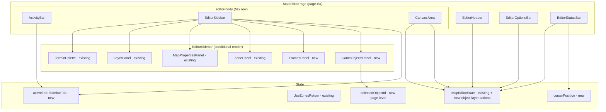
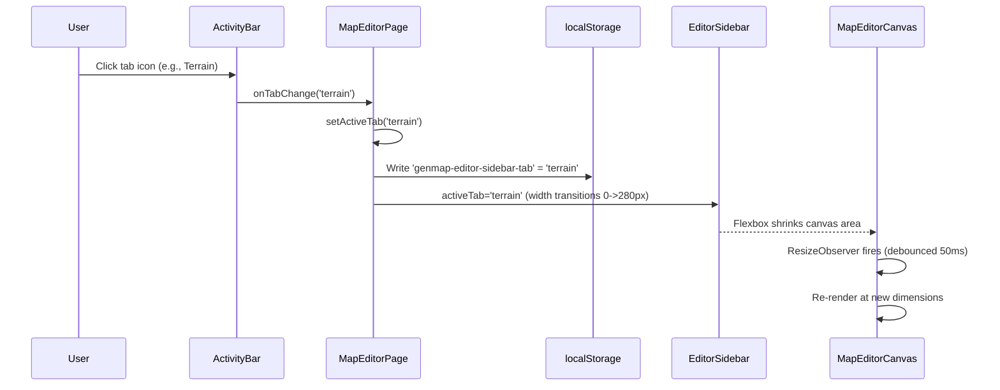
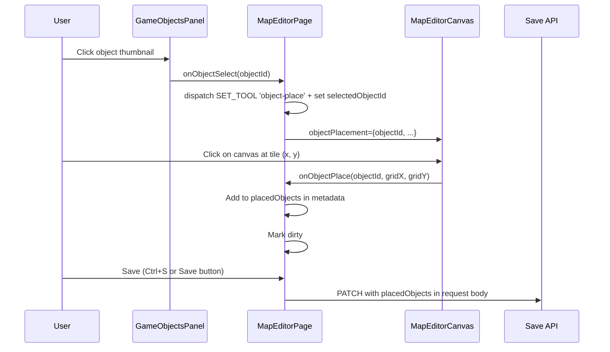

# Map Editor UI Redesign Design Document

## Overview

This document defines the technical design for restructuring the Genmap map editor page (`apps/genmap/src/app/maps/[id]/page.tsx`) from its current 3-column rigid layout into a Photoshop-style professional editor UI with an Activity Bar, collapsible push sidebar, context-sensitive Options Bar, compact header, and status bar. It also introduces two new panels (Frames and Game Objects) and an object placement system. The redesign reuses all four existing panel components (TerrainPalette, LayerPanel, MapPropertiesPanel, ZonePanel) without modification to their internals.

## Design Summary (Meta)

```yaml
design_type: "refactoring"
risk_level: "medium"
complexity_level: "medium"
complexity_rationale: >
  (1) FR-001 through FR-007 require replacing the entire page layout with 7 new components,
  introducing 2 new sidebar panels with data fetching, an object placement tool with canvas
  integration, and a new API endpoint. Sidebar state, cursor position tracking, and object
  placement state add 3 new state concerns to manage alongside the existing editor state.
  (2) Key constraints: existing panel components must be reused without modification, the
  editor must remain functional during migration, the page must break out of the genmap
  container layout, and canvas must auto-resize via ResizeObserver during sidebar transitions.
main_constraints:
  - "Existing panel components (TerrainPalette, LayerPanel, MapPropertiesPanel, ZonePanel) reused AS-IS"
  - "Page must break out of genmap root layout container (container mx-auto px-6 py-6)"
  - "Canvas must auto-resize via ResizeObserver during 200ms sidebar open/close transitions"
  - "NO dark theme -- uses existing genmap light theme"
  - "Backward compatibility: all existing editor features must continue working"
biggest_risks:
  - "Canvas resize jank during sidebar transition (ResizeObserver fires mid-animation)"
  - "Breaking the container layout may conflict with other genmap pages"
  - "Object placement state interaction with existing undo/redo system"
unknowns:
  - "Whether existing panel components need internal scroll adjustments for 280px sidebar width"
  - "Performance of loading all game objects at once for the Game Objects panel"
  - "Best approach for rendering placed objects on the canvas without impacting paint performance"
```

## Background and Context

### Prerequisite ADRs

- **ADR-0009 (adr-006-map-editor-architecture.md)**: Three-package architecture, zero-build pattern, hybrid DB schema, dynamic Phaser import, dual-mode workflow
- **ADR-0008**: Game object collision zone schema referenced for object placement
- **ADR-0007**: Sprite management storage patterns used for frame thumbnail rendering

No common ADRs (`ADR-COMMON-*`) exist in the project yet.

### Agreement Checklist

#### Scope

- [x] Rewrite the page layout of `apps/genmap/src/app/maps/[id]/page.tsx` to full-width Photoshop-style layout
- [x] Create 7 new components: EditorHeader, EditorOptionsBar, ActivityBar, EditorSidebar, FramesPanel, GameObjectsPanel, EditorStatusBar
- [x] Replace `MapEditorToolbar` with `EditorOptionsBar` (context-sensitive)
- [x] Add object placement tool type (`'object-place'`) to EditorTool union
- [x] Create new API endpoint `GET /api/frames/by-filename`
- [x] Add `activeTab` state with localStorage persistence
- [x] Add `cursorPosition` state for status bar
- [x] Add object placement state management

#### Non-Scope (Explicitly not changing)

- [x] Existing panel component internals (`TerrainPalette`, `LayerPanel`, `MapPropertiesPanel`, `ZonePanel`) -- reused without modification
- [x] `useMapEditor` hook and reducer logic -- unchanged
- [x] `useZones` hook and `useZoneApi` hook -- unchanged
- [x] `useTilesetImages` hook -- unchanged
- [x] Canvas rendering logic (`canvas-renderer.ts`) -- unchanged (except adding cursor position callback and object rendering)
- [x] Zone drawing tools (`zone-drawing.ts`, `zone-overlay.ts`) -- unchanged
- [x] Paint tools (brush, fill, rectangle, eraser) -- unchanged
- [x] Export and template dialogs -- moved but not modified
- [x] No dark theme (removed per user decision)
- [x] No responsive/mobile layout (desktop editor only, future concern)

#### Constraints

- [x] Parallel operation: N/A (single-user editor)
- [x] Backward compatibility: Required -- all existing editor features must continue working
- [x] Performance measurement: Canvas re-render after sidebar transition must complete within 50ms debounce window

#### Design Reflection of Agreements

- Existing panel reuse reflected in EditorSidebar rendering each panel via conditional switch (FR-004)
- No dark theme reflected in absence of any theme scoping CSS (Feature 1 of UXRD removed)
- localStorage persistence reflected in sidebar tab state management (FR-004)
- Object placement as new tool type reflected in EditorTool union extension (FR-006)

### Problem to Solve

The current 3-column layout wastes 21% of horizontal space on permanent sidebars, has no panel collapsibility, scatters content across distant screen regions, and lacks Frames and Game Objects panels. The editor needs a professional Photoshop-style layout with collapsible sidebar, context-sensitive toolbar, and new browsing/placement capabilities.

### Current Challenges

1. **Wasted screen space**: Rigid 200px left + 200px right sidebars permanently consume 400px regardless of whether panels are needed
2. **No collapsibility**: Unlike Photoshop, VS Code, or Figma, panels cannot be hidden to focus on the canvas
3. **Scattered content**: Properties/Layers/Zones on the left, Terrain on the right forces users to switch between distant screen regions
4. **Missing panels**: No Frames browser panel; no Game Objects browser/placement panel
5. **Container constraint**: The genmap root layout wraps all pages in `container mx-auto px-6 py-6`, preventing full-viewport editor layouts

### Applicable Standards

#### Classification Table

| Standard | Type | Source | Impact on Design |
|----------|------|--------|-----------------|
| Prettier: single quotes, 2-space indent | Explicit | `.prettierrc`, `.editorconfig` | All code samples use single quotes, 2-space indent |
| TypeScript strict mode, ES2022 target, bundler resolution | Explicit | `tsconfig.base.json` | All new code must pass strict type checking, no implicit any |
| ESLint flat config with Nx module boundaries | Explicit | `eslint.config.mjs` | New components must be within `apps/genmap` boundary |
| Drizzle ORM for schema definitions | Explicit | `packages/db/src/schema/*.ts` | New DB service function follows `(db: DrizzleClient, ...) => Promise` pattern |
| Next.js Route Handlers for API | Implicit | `apps/genmap/src/app/api/*/route.ts` | New endpoint uses `GET` export with NextRequest/NextResponse |
| React hooks for data fetching | Implicit | `apps/genmap/src/hooks/use-game-objects.ts` | Panel components use hooks for API calls with loading/error states |
| Component props: `state: MapEditorState, dispatch: Dispatch<MapEditorAction>` | Implicit | All existing panel components | Sidebar passes same props through to existing panels |
| Service function pattern: `(db: DrizzleClient, data) => Promise` | Implicit | `packages/db/src/services/atlas-frame.ts` | New `getFramesByFilename` service follows this pattern |
| shadcn/ui components for UI primitives | Implicit | `apps/genmap/src/components/ui/*` | New components use Button, Tooltip, Input from shadcn/ui |

### Requirements

#### Functional Requirements

| ID | Requirement | Source |
|----|-------------|--------|
| FR-001 | Full-viewport editor layout with 100vh height, breaking out of genmap container | UXRD-003 Layout |
| FR-002 | Compact header (36px) with back link, inline-editable map name, and action buttons | UXRD-003 Feature 2 |
| FR-003 | Context-sensitive Options Bar (32px) replacing MapEditorToolbar | UXRD-003 Feature 3 |
| FR-004 | Activity Bar (40px) with 6 icon tabs + collapsible push sidebar (280px) | UXRD-003 Feature 4 |
| FR-005 | Frames panel with search, atlas grouping, and frame thumbnail grid | UXRD-003 Feature 5 |
| FR-006 | Game Objects panel with search, category grouping, and click-to-place/drag-to-place | UXRD-003 Feature 6 |
| FR-007 | Status bar (24px) with zoom, cursor coordinates, active layer, save status | UXRD-003 Feature 7 |
| FR-008 | New API endpoint `GET /api/frames/by-filename?filename=xxx` | UXRD-003 Feature 5 |
| FR-009 | Object placement tool type and canvas rendering of placed objects | UXRD-003 Feature 6 |
| FR-010 | localStorage persistence of active sidebar tab | UXRD-003 Feature 4 |

#### Non-Functional Requirements

- **Performance**: Sidebar open/close transition completes in 200ms. Canvas re-render after resize debounced by 50ms. Object placement preview renders at 60fps.
- **Accessibility**: WCAG 2.1 AA. Keyboard shortcuts 1-6 for tabs. ARIA roles on all interactive elements.
- **Maintainability**: 7 new single-responsibility components. Existing panels reused without modification.

## Acceptance Criteria (AC) - EARS Format

### FR-001: Full-Viewport Layout

- [ ] The editor page shall occupy 100vh with no scrollbar on the page body
- [ ] **When** the editor page mounts, the layout shall visually fill the entire viewport, overriding the genmap container margins
- [ ] The layout shall use a flex column with header (36px) + options bar (32px) + body (flex: 1) + status bar (24px)

### FR-002: Compact Header

- [ ] The header shall render at 36px height with a back arrow linking to `/maps`, an inline map name, and action buttons (Export, Template, Settings)
- [ ] **When** user clicks the map name text, the text shall become an editable input field
- [ ] **When** user presses Enter or blurs the input, the system shall dispatch `SET_NAME` with the new value
- [ ] **When** user presses Escape while editing the name, the system shall revert to the previous value
- [ ] **If** Save is not present in the header, **then** save shall be accessible only from the Options Bar

### FR-003: Options Bar

- [ ] The Options Bar shall render at 32px height, replacing the existing `MapEditorToolbar` component
- [ ] The left section shall display the active tool name and tool-specific controls (zone type selector for zone tools, brush size placeholder for brush)
- [ ] **When** the active tool changes, tool-specific controls shall transition with 150ms opacity/max-width animation
- [ ] The bar shall contain undo/redo buttons, save button with status dot, zoom controls, and grid/walkability toggles
- [ ] All existing keyboard shortcuts (B, F, R, E, Z, P, G, W, Ctrl+Z, Ctrl+Y, Ctrl+S) shall continue working

### FR-004: Activity Bar and Sidebar

- [ ] The Activity Bar shall render as a 40px-wide vertical strip with 6 icon buttons: Terrain, Layers, Properties, Zones, Frames, Game Objects
- [ ] **When** user clicks an Activity Bar tab, the sidebar shall open (280px) showing the corresponding panel content
- [ ] **When** user clicks the currently active tab, the sidebar shall close and the canvas shall expand
- [ ] The sidebar shall animate width from 0 to 280px (and back) with a 200ms ease-in-out CSS transition
- [ ] **When** the sidebar opens or closes, the canvas shall auto-resize via flexbox and ResizeObserver
- [ ] **When** user switches between tabs while sidebar is open, only the panel content shall change (no width animation)
- [ ] The active tab shall persist in localStorage under key `genmap-editor-sidebar-tab`
- [ ] **When** the page loads with a stored tab, the sidebar shall open to that tab automatically
- [ ] **If** no stored tab exists, **then** the sidebar shall start closed
- [ ] Number keys 1-6 shall toggle the corresponding tab when no input is focused
- [ ] **When** user presses Escape while the sidebar is open and no input is focused, the sidebar shall close

### FR-005: Frames Panel

- [ ] The Frames panel shall display a search input and a list of atlas filenames grouped from `GET /api/frames/search?q=term`
- [ ] **When** user types in the search input, results shall be filtered via debounced (300ms) API call
- [ ] **When** user clicks an atlas filename, it shall expand to show a grid of frame thumbnails (32x32px, 4 columns)
- [ ] Frame thumbnails shall be rendered via `<canvas>` elements using atlas image and frame source coordinates
- [ ] **When** user clicks a frame thumbnail, the frame ID shall be copied to clipboard with a toast notification
- [ ] Frame detail data shall be lazy-fetched via `GET /api/frames/by-filename?filename=xxx` on first expand and cached

### FR-006: Game Objects Panel

- [ ] The Game Objects panel shall load all objects via `GET /api/objects` on mount
- [ ] Objects shall be grouped by `category` field with collapsible category headers
- [ ] **When** user types in the search input, objects shall be filtered client-side by name, category, and tags
- [ ] Object thumbnails shall be 48x48px rendered from the first layer's frame data
- [ ] **When** user clicks an object thumbnail, the tool shall switch to `'object-place'` mode with that object selected
- [ ] **While** in object-place mode, clicking on the canvas shall place the object at the clicked grid position (snapped to grid)
- [ ] **When** user drags an object thumbnail to the canvas, the object shall be placed at the drop position
- [ ] **When** user presses Escape while in object-place mode, the system shall exit object-place mode and deselect the object
- [ ] **If** the active layer is a TileLayer when the user selects an object, **then** the system shall display a toast: "Select or create an Object Layer first"
- [ ] **When** user clicks "Add Layer", a type selector dialog shall allow choosing "Tile Layer" or "Object Layer"
- [ ] Placed objects shall be stored in the active ObjectLayer's `objects` array within the `editor_maps.layers` JSONB column

### FR-007: Status Bar

- [ ] The status bar shall render at 24px height at the bottom of the viewport
- [ ] The status bar shall display: zoom percentage, cursor tile coordinates, active layer name, and save status
- [ ] **While** the cursor is on the canvas, the coordinates shall update in real-time
- [ ] **If** the cursor is not on the canvas, **then** coordinates shall display `(--)`
- [ ] **When** user clicks the zoom percentage, a dropdown shall appear with preset zoom levels (25%, 50%, 75%, 100%, 150%, 200%, 400%)
- [ ] Save status shall show "Not yet saved" / "Unsaved changes" / "Saving..." / "Saved [time]" based on state

### FR-008: Frames by Filename API

- [ ] `GET /api/frames/by-filename?filename=xxx` shall return an array of AtlasFrame objects for the given filename
- [ ] **If** the filename parameter is missing or empty, **then** the endpoint shall return 400 with an error message
- [ ] **If** no frames match the filename, **then** the endpoint shall return an empty array

### FR-009: Object Placement Canvas Rendering

- [ ] **While** in object-place mode with cursor on canvas, a ghost preview of the selected object shall render at the cursor's grid-snapped position
- [ ] The canvas renderer shall iterate layers in order; for each ObjectLayer, it shall render its `objects` array using game object frame data
- [ ] Each PlacedObject shall render at `(gridX * tileSize, gridY * tileSize)` with rotation and flip transforms applied, respecting the parent layer's opacity
- [ ] Object layers shall render above preceding tile layers and below subsequent layers (layer ordering determines depth)
- [ ] Each placed object shall store: `objectId`, `objectName`, `gridX`, `gridY`, `rotation`, `flipX`, `flipY`

### FR-010: Sidebar Tab Persistence

- [ ] **When** the active tab changes, the value shall be written to localStorage key `genmap-editor-sidebar-tab`
- [ ] **When** the page mounts, the stored tab value shall be read and the sidebar opened to that tab
- [ ] **If** localStorage contains an invalid tab value, **then** the sidebar shall start closed

## Existing Codebase Analysis

### Implementation Path Mapping

| Type | Path | Description |
|------|------|-------------|
| Existing | `apps/genmap/src/app/maps/[id]/page.tsx` (507 lines) | Map editor page -- complete layout rewrite |
| Existing | `apps/genmap/src/components/map-editor/map-editor-toolbar.tsx` (362 lines) | Current toolbar -- replaced by EditorOptionsBar |
| Existing | `apps/genmap/src/components/map-editor/map-editor-canvas.tsx` | Canvas component -- add cursor position callback + object rendering |
| Existing | `apps/genmap/src/hooks/map-editor-types.ts` (111 lines) | Editor types -- add `'object-place'` to EditorTool |
| Existing | `apps/genmap/src/hooks/use-map-editor.ts` (598 lines) | Editor reducer -- unchanged |
| Existing | `apps/genmap/src/components/map-editor/terrain-palette.tsx` | Terrain palette -- moved to sidebar, unchanged |
| Existing | `apps/genmap/src/components/map-editor/layer-panel.tsx` | Layer panel -- moved to sidebar, unchanged |
| Existing | `apps/genmap/src/components/map-editor/map-properties-panel.tsx` | Map properties -- moved to sidebar, unchanged |
| Existing | `apps/genmap/src/components/map-editor/zone-panel.tsx` | Zone panel -- moved to sidebar, unchanged |
| Existing | `apps/genmap/src/app/layout.tsx` | Root layout with `container mx-auto px-6 py-6` wrapper |
| Existing | `apps/genmap/src/app/api/frames/search/route.ts` | Frames search endpoint |
| Existing | `apps/genmap/src/app/api/objects/route.ts` | Objects list endpoint |
| Existing | `packages/db/src/services/atlas-frame.ts` | Atlas frame DB services |
| Existing | `packages/db/src/schema/atlas-frames.ts` | Atlas frames schema |
| Existing | `packages/db/src/schema/game-objects.ts` | Game objects schema |
| Existing | `packages/db/src/schema/editor-maps.ts` | Editor maps schema |
| New | `apps/genmap/src/components/map-editor/editor-header.tsx` | Compact header component |
| New | `apps/genmap/src/components/map-editor/editor-options-bar.tsx` | Context-sensitive options bar |
| New | `apps/genmap/src/components/map-editor/activity-bar.tsx` | Vertical icon tab strip |
| New | `apps/genmap/src/components/map-editor/editor-sidebar.tsx` | Animated sidebar container |
| New | `apps/genmap/src/components/map-editor/frames-panel.tsx` | Atlas frame browser |
| New | `apps/genmap/src/components/map-editor/game-objects-panel.tsx` | Game object browser + placement |
| New | `apps/genmap/src/components/map-editor/editor-status-bar.tsx` | Bottom status strip |
| New | `apps/genmap/src/app/api/frames/by-filename/route.ts` | Frames by filename endpoint |

### Code Inspection Evidence

#### What Was Examined

- `apps/genmap/src/app/maps/[id]/page.tsx` (507 lines) -- full page component
- `apps/genmap/src/components/map-editor/map-editor-toolbar.tsx` (362 lines) -- toolbar being replaced
- `apps/genmap/src/hooks/map-editor-types.ts` (111 lines) -- state and action type definitions
- `apps/genmap/src/hooks/use-map-editor.ts` (first 100 lines) -- reducer initial state and patterns
- `apps/genmap/src/hooks/use-zones.ts` (first 30 lines) -- UseZonesReturn interface
- `apps/genmap/src/components/map-editor/map-editor-canvas.tsx` (first 80 lines) -- canvas props interface
- `apps/genmap/src/components/map-editor/terrain-palette.tsx` -- props: `state, dispatch, tilesetImages`
- `apps/genmap/src/components/map-editor/layer-panel.tsx` -- props: `state, dispatch`
- `apps/genmap/src/components/map-editor/map-properties-panel.tsx` -- props: `state, dispatch`
- `apps/genmap/src/components/map-editor/zone-panel.tsx` -- props: `zoneState: UseZonesReturn`
- `apps/genmap/src/app/layout.tsx` -- root layout container constraints
- `apps/genmap/src/app/api/frames/search/route.ts` -- existing frames API pattern
- `apps/genmap/src/app/api/objects/route.ts` -- existing objects API pattern
- `packages/db/src/services/atlas-frame.ts` -- existing DB service patterns
- `packages/db/src/schema/atlas-frames.ts` -- atlas frames table structure
- `packages/db/src/schema/editor-maps.ts` -- editor maps table structure
- `packages/db/src/schema/game-objects.ts` -- game objects table + interfaces
- 17 files inspected covering all affected areas

#### Key Findings

| File Inspected | Key Finding | Design Impact |
|---------------|-------------|---------------|
| `page.tsx:293-504` | 3-column flex layout with `gap-4 h-[calc(100vh-12rem)]` | Entire layout replaced; calc-based height removed |
| `page.tsx:42-57` | Camera, grid, walkability state lifted to page level | Same pattern preserved in new layout |
| `page.tsx:98-179` | Export and template dialog state/handlers in page | Dialog state/handlers move unchanged to new page |
| `layout.tsx:27` | `<main className="container mx-auto px-6 py-6">` | Editor page must use negative margins or route-group layout to break out |
| `map-editor-toolbar.tsx:14-24` | Toolbar props: state, dispatch, save, camera, onCameraChange, showGrid, onToggleGrid, showWalkability, onToggleWalkability | EditorOptionsBar adopts same prop interface |
| `map-editor-toolbar.tsx:86-123` | Keyboard shortcuts implemented in toolbar useEffect | Move keyboard shortcuts to EditorOptionsBar |
| `map-editor-canvas.tsx:44-68` | Canvas props include `camera`, `onCameraChange`, zone callbacks | Canvas adds `onCursorMove` callback for status bar |
| `map-editor-types.ts:6-12` | `EditorTool` union: `'brush' \| 'fill' \| 'rectangle' \| 'eraser' \| 'zone-rect' \| 'zone-poly'` | Add `'object-place'` to union |
| `map-editor-types.ts:26-58` | `MapEditorState` has `isDirty`, `isSaving`, `lastSavedAt` | Status bar reads these fields directly |
| `terrain-palette.tsx:156-165` | Props: `state, dispatch, tilesetImages` (3 props) | Sidebar passes all 3 through |
| `zone-panel.tsx:42-44` | Props: `zoneState: UseZonesReturn` (single prop) | Sidebar passes zoneState through |
| `atlas-frame.ts:85-109` | Existing services: `searchFrameFilenames`, `listDistinctFilenames` | Need new `getFramesByFilename` following same pattern |
| `editor-maps.ts:20` | `layers: jsonb('layers')` column stores `EditorLayer[]` | Object layers stored as `ObjectLayer` entries in existing `layers` JSONB. No migration needed. |
| `game-objects.ts:10-16` | `GameObjectLayer` interface with `frameId`, `spriteId`, offsets | Used for rendering object thumbnails and placed objects |

#### How Findings Influence Design

- The root layout's `container mx-auto px-6 py-6` wrapper means the editor page needs a CSS override to break out. Best approach: add a route-group `(editor)` layout for `maps/[id]` or use negative margins on the page root.
- All existing panel props are well-defined interfaces -- the sidebar can pass them through without transformation.
- Object layers are stored as `ObjectLayer` entries within the existing `layers` JSONB column on `editor_maps`. No DB migration needed — existing maps without a `type` field default to `TileLayer`.
- The existing `atlas-frame.ts` service file provides the pattern for the new `getFramesByFilename` function.
- Camera/grid state is already lifted to the page level, matching the new layout's requirement to share state between Options Bar, Canvas, and Status Bar.
- Keyboard shortcuts are currently in the toolbar component and must be migrated to the Options Bar.

### Similar Functionality Search

- **Collapsible sidebar**: No existing collapsible sidebar pattern in the codebase. New implementation required.
- **Activity bar / tab navigation**: No existing activity bar pattern. New implementation required.
- **Frame browsing**: The Frames search API (`/api/frames/search`) and DB service exist. The Frames panel is a new UI consumer of these existing services.
- **Object browsing**: The Objects API (`/api/objects`) exists. The Game Objects panel is a new UI consumer.
- **Status bar**: No existing status bar component. New implementation required.
- **localStorage persistence**: No existing localStorage pattern for editor state in the codebase. The pattern from `use-map-editor.ts` (which uses API persistence) is different. New custom hook or inline implementation.

**Decision**: All new UI implementations. No duplicates to avoid. Existing API endpoints and DB services are reused.

### Integration Points

| Integration Point | Location | Old Implementation | New Implementation | Switching Method |
|-------------------|----------|-------------------|-------------------|------------------|
| Page layout | `page.tsx` | 3-column flex with Breadcrumb | Full-viewport flex column with EditorHeader | Complete rewrite of JSX |
| Toolbar | `page.tsx:352-362` | `<MapEditorToolbar ... />` | `<EditorOptionsBar ... />` | Direct replacement, same props |
| Terrain panel | `page.tsx:391-398` | Rendered in right sidebar div | Rendered in EditorSidebar when activeTab === 'terrain' | Move into sidebar switch |
| Layer panel | `page.tsx:313-314` | Rendered in left sidebar div | Rendered in EditorSidebar when activeTab === 'layers' | Move into sidebar switch |
| Properties panel | `page.tsx:308-309` | Rendered in left sidebar div | Rendered in EditorSidebar when activeTab === 'properties' | Move into sidebar switch |
| Zone panel | `page.tsx:315-316` | Rendered in left sidebar div | Rendered in EditorSidebar when activeTab === 'zones' | Move into sidebar switch |
| Canvas cursor | `map-editor-canvas.tsx` | No cursor position exposed | New `onCursorMove` callback prop | Additive -- new optional prop |
| EditorTool type | `map-editor-types.ts` | 6-member union | 7-member union with `'object-place'` | Additive -- new union member |

## Design

### Change Impact Map

```yaml
Change Target: MapEditorPage layout + EditorLayer type system + EditorTool type
Direct Impact:
  - apps/genmap/src/app/maps/[id]/page.tsx (complete layout rewrite)
  - apps/genmap/src/hooks/map-editor-types.ts (replace EditorLayer with discriminated union, add 'object-place' to EditorTool, add new reducer actions: ADD_OBJECT_LAYER, PLACE_OBJECT, REMOVE_OBJECT, MOVE_OBJECT, MARK_DIRTY)
  - apps/genmap/src/hooks/use-map-editor.ts (new reducer cases for object layer actions, LOAD_MAP normalization for layer types)
  - apps/genmap/src/components/map-editor/map-editor-canvas.tsx (add onCursorMove + object layer rendering)
  - apps/genmap/src/components/map-editor/canvas-renderer.ts (branch rendering by layer type: TileLayer vs ObjectLayer)
  - apps/genmap/src/components/map-editor/layer-panel.tsx (layer type icons, type selector in add dialog, disable tools based on active layer type)
  - apps/genmap/src/app/api/frames/by-filename/route.ts (new API endpoint)
  - packages/db/src/services/atlas-frame.ts (new getFramesByFilename service function)
  - packages/db/src/index.ts (export new service function)
Indirect Impact:
  - apps/genmap/src/components/map-editor/map-editor-toolbar.tsx (no longer imported by page -- dead code)
No Ripple Effect:
  - apps/genmap/src/components/map-editor/terrain-palette.tsx (unchanged)
  - apps/genmap/src/components/map-editor/map-properties-panel.tsx (unchanged)
  - apps/genmap/src/components/map-editor/zone-panel.tsx (unchanged)
  - apps/genmap/src/components/map-editor/zone-creation-dialog.tsx (unchanged)
  - apps/genmap/src/hooks/use-zones.ts (unchanged)
  - apps/genmap/src/hooks/use-zone-api.ts (unchanged)
  - apps/genmap/src/components/map-editor/tools/* (unchanged)
  - packages/db/src/schema/editor-maps.ts (unchanged -- no new column, objects stored in existing layers JSONB)
  - All other genmap pages (unaffected by layout change)
```

### Architecture Overview



### Data Flow

#### Sidebar Toggle Flow



#### Object Placement Flow



### Component Architecture

#### Component Hierarchy

```
MapEditorPage (page.tsx -- rewritten)
  |
  +-- EditorHeader
  |     Props: mapName, onNameChange, onExport, onSaveAsTemplate
  |
  +-- EditorOptionsBar
  |     Props: state, dispatch, save, camera, onCameraChange,
  |            showGrid, onToggleGrid, showWalkability, onToggleWalkability
  |
  +-- div.editor-body (flex row, flex: 1)
  |     |
  |     +-- ActivityBar
  |     |     Props: activeTab, onTabChange
  |     |
  |     +-- EditorSidebar
  |     |     Props: activeTab, onClose, state, dispatch,
  |     |            tilesetImages, zoneState, onObjectSelect
  |     |     Renders conditionally:
  |     |       'terrain'    -> TerrainPalette (existing)
  |     |       'layers'     -> LayerPanel (existing)
  |     |       'properties' -> MapPropertiesPanel (existing)
  |     |       'zones'      -> ZonePanel (existing)
  |     |       'frames'     -> FramesPanel (new)
  |     |       'game-objects' -> GameObjectsPanel (new)
  |     |
  |     +-- div.canvas-area (flex: 1)
  |           MapEditorCanvas (existing, modified)
  |
  +-- EditorStatusBar
  |     Props: zoom, onZoomChange, cursorPosition,
  |            activeLayerName, isDirty, isSaving, lastSavedAt
  |
  +-- ZoneCreationDialog (existing, unchanged)
  +-- ExportDialog (existing logic, unchanged)
  +-- TemplateDialog (existing logic, unchanged)
```

### Main Components

#### EditorHeader

- **Responsibility**: Compact 36px header with navigation, inline map name editing, and action buttons
- **Interface**:
  ```typescript
  interface EditorHeaderProps {
    mapName: string;
    onNameChange: (name: string) => void;
    isDirty: boolean;
    onExport: () => void;
    onSaveAsTemplate: () => void;
  }
  ```
- **Dependencies**: Lucide icons (`ArrowLeft`, `Upload`, `Copy`, `Settings`), shadcn/ui `Button`, `Input`, `Tooltip`
- **File**: `apps/genmap/src/components/map-editor/editor-header.tsx`

#### EditorOptionsBar

- **Responsibility**: Context-sensitive 32px toolbar replacing MapEditorToolbar. Shows tool-specific controls, undo/redo, save, zoom, grid/walkability toggles. Handles keyboard shortcuts.
- **Interface**:
  ```typescript
  interface EditorOptionsBarProps {
    state: MapEditorState;
    dispatch: Dispatch<MapEditorAction>;
    save: () => Promise<void>;
    camera: Camera;
    onCameraChange: (camera: Camera) => void;
    showGrid: boolean;
    onToggleGrid: () => void;
    showWalkability: boolean;
    onToggleWalkability: () => void;
  }
  ```
- **Dependencies**: Lucide icons (`Undo2`, `Redo2`, `Grid3x3`, `Footprints`), shadcn/ui `Button`, `Tooltip`
- **File**: `apps/genmap/src/components/map-editor/editor-options-bar.tsx`
- **Notes**: Identical prop interface to current `MapEditorToolbar`. Tool-specific section uses conditional rendering based on `state.activeTool`.

#### ActivityBar

- **Responsibility**: 40px vertical icon strip with 6 tab buttons. Manages tab toggle behavior (click active = close, click inactive = open).
- **Interface**:
  ```typescript
  type SidebarTab = 'terrain' | 'layers' | 'properties' | 'zones' | 'frames' | 'game-objects';

  interface ActivityBarProps {
    activeTab: SidebarTab | null;
    onTabChange: (tab: SidebarTab | null) => void;
  }
  ```
- **Dependencies**: Lucide icons (`Mountain`, `Layers`, `SlidersHorizontal`, `Map`, `Frame`, `Gamepad2`), shadcn/ui `Tooltip`
- **File**: `apps/genmap/src/components/map-editor/activity-bar.tsx`
- **Notes**: Each button toggles its tab. Active state shows 2px left border in `--primary` color.

#### EditorSidebar

- **Responsibility**: Animated-width container (0 or 280px) that renders the active panel with a header and close button.
- **Interface**:
  ```typescript
  interface EditorSidebarProps {
    activeTab: SidebarTab | null;
    onClose: () => void;
    // Pass-through props for panels
    state: MapEditorState;
    dispatch: Dispatch<MapEditorAction>;
    tilesetImages: Map<string, HTMLImageElement>;
    zoneState: UseZonesReturn;
    onObjectSelect: (objectId: string, objectName: string) => void;
  }
  ```
- **Dependencies**: Existing panel components, new FramesPanel and GameObjectsPanel
- **File**: `apps/genmap/src/components/map-editor/editor-sidebar.tsx`
- **Behavior**: CSS `transition: width 200ms ease-in-out`. `overflow: hidden` during animation. Panel content fades in/out on tab switch (100ms opacity transition).
- **Scroll position preservation**: Maintain a `Map<SidebarTab, number>` ref tracking each panel's `scrollTop`. On tab switch, save the outgoing panel's scroll position and restore the incoming panel's position. This prevents scroll reset when toggling between tabs.
- **Escape key**: When Escape is pressed and the sidebar is open (and no child input is focused), close the sidebar by calling `onClose()`.

#### FramesPanel

- **Responsibility**: Atlas frame browser with search, grouped by filename, lazy-loaded frame details.
- **Interface**:
  ```typescript
  // Self-contained -- no props required
  interface FramesPanelProps {}
  ```
- **Internal State**: `searchQuery`, `filenames`, `expandedAtlases: Set<string>`, `frameCache: Map<string, AtlasFrame[]>`, `spriteImageCache: Map<string, HTMLImageElement>`, `isLoading`
- **Dependencies**: Existing `/api/frames/search` and new `/api/frames/by-filename` endpoints
- **File**: `apps/genmap/src/components/map-editor/frames-panel.tsx`
- **Data Fetching Strategy**:
  1. On mount: `GET /api/frames/search` to load all filenames
  2. On expand atlas: `GET /api/frames/by-filename?filename=xxx` (lazy, cached)
  3. On expand atlas: `GET /api/sprites/{spriteId}` to load sprite image for thumbnails (lazy, cached)
  4. Search: debounced 300ms, calls `GET /api/frames/search?q=term`

#### GameObjectsPanel

- **Responsibility**: Game object browser with search, category grouping, selection, and placement initiation.
- **Interface**:
  ```typescript
  interface GameObjectsPanelProps {
    onObjectSelect: (objectId: string, objectName: string) => void;
  }
  ```
- **Internal State**: `searchQuery`, `objects: GameObject[]`, `expandedCategories: Set<string>`, `selectedObjectId: string | null`, `isLoading`
- **Dependencies**: Existing `/api/objects` endpoint
- **File**: `apps/genmap/src/components/map-editor/game-objects-panel.tsx`
- **Object Grouping**: Group by `category` field. `null` category -> "Uncategorized". Client-side filter by `name`, `category`, `tags`.

#### EditorStatusBar

- **Responsibility**: 24px bottom strip showing zoom, cursor position, active layer name, save status.
- **Interface**:
  ```typescript
  interface EditorStatusBarProps {
    zoom: number;
    onZoomChange: (zoom: number) => void;
    cursorPosition: { x: number; y: number } | null;
    activeLayerName: string;
    isDirty: boolean;
    isSaving: boolean;
    lastSavedAt: string | null;
  }
  ```
- **Dependencies**: shadcn/ui `Button` (for zoom dropdown)
- **File**: `apps/genmap/src/components/map-editor/editor-status-bar.tsx`

### Contract Definitions

#### SidebarTab Type

```typescript
// In a new file or in map-editor-types.ts
export type SidebarTab =
  | 'terrain'
  | 'layers'
  | 'properties'
  | 'zones'
  | 'frames'
  | 'game-objects';
```

#### EditorTool Extension

```typescript
// In map-editor-types.ts (modified)
export type EditorTool =
  | 'brush'
  | 'fill'
  | 'rectangle'
  | 'eraser'
  | 'zone-rect'
  | 'zone-poly'
  | 'object-place';  // NEW
```

#### Layer Type System (Discriminated Union)

The existing `EditorLayer` interface (single tile-layer type) is replaced with a discriminated union supporting both tile layers and object layers. This follows the Tiled editor model where objects are placed on dedicated object layers rather than stored separately.

```typescript
// In map-editor-types.ts (replaces existing EditorLayer interface)
interface BaseLayer {
  id: string;
  name: string;
  visible: boolean;
  opacity: number;
}

interface TileLayer extends BaseLayer {
  type: 'tile';
  terrainKey: string;
  /** 2D array of autotile frame indices matching the map dimensions [y][x]. */
  frames: number[][];
}

interface PlacedObject {
  id: string;            // Unique instance ID (crypto.randomUUID())
  objectId: string;      // References game_objects.id
  objectName: string;    // Cached display name for UI
  gridX: number;         // Tile X position
  gridY: number;         // Tile Y position
  rotation: number;      // 0, 90, 180, 270 degrees (default: 0)
  flipX: boolean;        // Horizontal flip (default: false)
  flipY: boolean;        // Vertical flip (default: false)
}

interface ObjectLayer extends BaseLayer {
  type: 'object';
  objects: PlacedObject[];
}

type EditorLayer = TileLayer | ObjectLayer;
```

**Migration note**: Existing saved maps have layers without a `type` field. The `LOAD_MAP` handler treats any layer without `type` (or with `type: 'tile'`) as a `TileLayer`. No DB migration is needed -- the `layers` JSONB column on `editor_maps` already stores the full layer array, and object layers are simply another layer type serialized into the same column.

#### Canvas Cursor Callback Extension

```typescript
// In map-editor-canvas.tsx (new optional prop)
interface MapEditorCanvasProps {
  // ... existing props ...
  /** Called when cursor moves over canvas with tile coordinates. null when cursor leaves. */
  onCursorMove?: (position: { x: number; y: number } | null) => void;
  /** Called when user clicks canvas in object-place mode. */
  onObjectPlace?: (gridX: number, gridY: number) => void;
  /** Object data needed for rendering placed object sprites on object layers. */
  objectRenderData?: Map<string, { image: HTMLImageElement; frameX: number; frameY: number; frameW: number; frameH: number }>;
}
```

**Note**: `placedObjects` is no longer a separate prop. Objects are read from `ObjectLayer.objects` within the `state.layers` array, which the canvas already receives via `state`.

### Data Contract

#### GET /api/frames/by-filename

```yaml
Input:
  Type: Query parameter `filename` (string)
  Preconditions: filename must be non-empty string
  Validation: Check filename parameter exists and is non-empty

Output:
  Type: AtlasFrame[] (JSON array)
  Guarantees: All frames belong to the queried filename. Empty array if no matches.
  On Error: 400 { error: string } if filename missing/empty

Invariants:
  - Read-only endpoint, no mutations
  - Results ordered by frame coordinates (frameX, frameY)
```

#### Object Placement Persistence

```yaml
Input:
  Type: PlacedObject[] stored within ObjectLayer.objects in editor_maps.layers JSONB column
  Preconditions: Each PlacedObject has valid objectId referencing game_objects.id
  Validation: objectId existence validated at save time (best-effort, not blocking)

Output:
  Type: Persisted as part of layers JSONB, loaded as part of LOAD_MAP action
  Guarantees: ObjectLayers and their PlacedObjects restored on map load via layer normalization
  On Error: Missing objectId references logged but not blocking (orphan tolerance)

Invariants:
  - ObjectLayer.objects array is immutable during canvas render
  - Object position is always grid-aligned (integer gridX, gridY)
  - No separate DB column or migration needed -- objects are part of the layers array
```

### Data Representation Decisions

| Data Structure | Decision | Rationale |
|---|---|---|
| `SidebarTab` | **New** string union type | No existing tab/panel type in codebase. Simple string union, no data payload needed. |
| `PlacedObject` | **New** dedicated interface | No existing type matches placed-object concept. The `ZoneData` type has different semantics (zone boundaries vs point placement). |
| `EditorTool` extension | **Extend** existing union | Existing 6-member union extended with `'object-place'`. Follows same pattern. All existing consumers handle unknown tools gracefully. |
| Object placement storage | **Reuse** existing `layers` JSONB column | `ObjectLayer` entries stored alongside `TileLayer` entries in `editor_maps.layers`. No DB migration needed. Existing maps default to `type: 'tile'`. |

### State Management Changes

#### New State in MapEditorPage (page-level useState)

```typescript
// Sidebar tab state (persisted to localStorage)
const [activeTab, setActiveTab] = useState<SidebarTab | null>(() => {
  if (typeof window === 'undefined') return null;
  const stored = localStorage.getItem('genmap-editor-sidebar-tab');
  if (stored && SIDEBAR_TABS.includes(stored as SidebarTab)) {
    return stored as SidebarTab;
  }
  return null;
});

// Cursor position for status bar
const [cursorPosition, setCursorPosition] = useState<{ x: number; y: number } | null>(null);

// Selected object for placement (only the selection lives at page level)
const [selectedObjectId, setSelectedObjectId] = useState<string | null>(null);
const [selectedObjectName, setSelectedObjectName] = useState<string | null>(null);
```

**Note**: `placedObjects` is no longer separate page-level state. Objects live inside the `ObjectLayer.objects` array within `state.layers`, managed by the reducer.

#### New Reducer Actions (in map-editor-types.ts)

The reducer gains four new actions for object layer management, plus the existing `'object-place'` tool type handled by `SET_TOOL`:

```typescript
// New actions added to MapEditorAction union
| { type: 'ADD_OBJECT_LAYER'; name: string }
| { type: 'PLACE_OBJECT'; object: PlacedObject }
| { type: 'REMOVE_OBJECT'; objectId: string }
| { type: 'MOVE_OBJECT'; objectId: string; gridX: number; gridY: number }
| { type: 'MARK_DIRTY' }
```

**Reducer handlers**:
- `ADD_OBJECT_LAYER`: Creates a new `ObjectLayer` with empty `objects` array, appends to `state.layers`, sets `isDirty: true`
- `PLACE_OBJECT`: Adds the `PlacedObject` to the active layer's `objects` array (active layer must be `ObjectLayer`), sets `isDirty: true`
- `REMOVE_OBJECT`: Removes the object with matching `objectId` from the active `ObjectLayer`, sets `isDirty: true`
- `MOVE_OBJECT`: Updates `gridX`/`gridY` for the object with matching `objectId` in the active `ObjectLayer`, sets `isDirty: true`
- `MARK_DIRTY`: Sets `isDirty: true` (for external state changes)

The existing `ADD_LAYER` action is updated to create `TileLayer` specifically (adding `type: 'tile'` to the created layer). The `SET_TOOL` handler already handles any `EditorTool` value.

#### localStorage Persistence

```typescript
// Sync activeTab to localStorage
useEffect(() => {
  if (activeTab) {
    localStorage.setItem('genmap-editor-sidebar-tab', activeTab);
  } else {
    localStorage.removeItem('genmap-editor-sidebar-tab');
  }
}, [activeTab]);
```

### Field Propagation Map

```yaml
fields:
  - name: "cursorPosition"
    origin: "Canvas mousemove event"
    transformations:
      - layer: "MapEditorCanvas"
        type: "{ x: number; y: number } | null"
        transformation: "pixel coords -> tile coords (Math.floor(px / TILE_SIZE))"
      - layer: "MapEditorPage"
        type: "{ x: number; y: number } | null"
        transformation: "none (pass-through state)"
      - layer: "EditorStatusBar"
        type: "string display"
        transformation: "format as '(x, y)' or '(--)'"
    destination: "Status bar UI text"
    loss_risk: "none"

  - name: "activeTab"
    origin: "User click on ActivityBar / number key press"
    transformations:
      - layer: "ActivityBar / keyboard handler"
        type: "SidebarTab | null"
        transformation: "toggle logic: same tab -> null, different tab -> new tab"
      - layer: "MapEditorPage"
        type: "SidebarTab | null"
        transformation: "none (state holder)"
      - layer: "localStorage"
        type: "string"
        transformation: "serialized as string, null removes key"
    destination: "EditorSidebar width + panel content / localStorage"
    loss_risk: "low"
    loss_risk_reason: "Invalid localStorage value handled by fallback to null"

  - name: "placedObjects (via ObjectLayer)"
    origin: "User click on canvas in object-place mode"
    transformations:
      - layer: "MapEditorCanvas"
        type: "{ gridX, gridY }"
        transformation: "pixel to grid coordinates, snap to grid"
      - layer: "Reducer (PLACE_OBJECT action)"
        type: "ObjectLayer.objects: PlacedObject[]"
        transformation: "append new PlacedObject to active ObjectLayer's objects array"
      - layer: "editor_maps.layers JSONB"
        type: "JSONB"
        transformation: "serialized as part of the layers array (no separate column)"
    destination: "Database editor_maps.layers JSONB column (within ObjectLayer entries)"
    loss_risk: "none"
    loss_risk_reason: "Objects are serialized as part of the existing layers JSONB flow -- same path as tile data"
```

### CSS/Layout Architecture

#### Full-Width Layout Strategy

The root layout (`apps/genmap/src/app/layout.tsx`) wraps all pages in:
```html
<main className="container mx-auto px-6 py-6">{children}</main>
```

**Strategy**: Create a maps `[id]` route-specific layout file at `apps/genmap/src/app/maps/[id]/layout.tsx` that replaces the default wrapper, or use CSS overrides on the page root to break out of the container.

**Chosen approach**: CSS override on the page root element. The editor page root div uses:
```css
.editor-page {
  /* Break out of container */
  margin: -1.5rem;          /* negate px-6 py-6 (24px = 1.5rem) */
  width: calc(100% + 3rem); /* restore full width */
  height: 100vh;
  display: flex;
  flex-direction: column;
  overflow: hidden;
}
```

This avoids creating a separate layout file (which would require re-rendering the Navigation component) and is contained to the single page component.

**Alternative considered**: Route group layout at `apps/genmap/src/app/(editor)/maps/[id]/layout.tsx` with no container class. Rejected because it requires moving the file and restructuring the route hierarchy, which is more invasive.

#### Flex Layout Structure

```
+-------------------------------------------------------------------+
| EditorHeader                                            (36px, flex-shrink: 0)
+-------------------------------------------------------------------+
| EditorOptionsBar                                        (32px, flex-shrink: 0)
+--+----------+------------------------------------------------------+
|  |          |                                                       |
|AB| Sidebar  |  Canvas Area                                          |
|  | (0/280px)|  (flex: 1, min-width: 0)                             |
|40|          |                                                       |
|px|          |                                                       |
|  |          |                                                       |
+--+----------+------------------------------------------------------+
| EditorStatusBar                                         (24px, flex-shrink: 0)
+-------------------------------------------------------------------+
```

#### Sidebar Transition CSS

```css
.editor-sidebar {
  width: 0;
  overflow: hidden;
  flex-shrink: 0;
  transition: width 200ms ease-in-out;
  border-right: 0px solid hsl(var(--border));
}

.editor-sidebar[data-open='true'] {
  width: 280px;
  border-right-width: 1px;
}

/* Panel content fade */
.sidebar-panel-content {
  opacity: 0;
  transition: opacity 100ms ease;
}

.sidebar-panel-content[data-visible='true'] {
  opacity: 1;
}

/* Respect reduced motion */
@media (prefers-reduced-motion: reduce) {
  .editor-sidebar {
    transition: none;
  }
  .sidebar-panel-content {
    transition: none;
  }
}
```

#### Canvas ResizeObserver Integration

The existing `MapEditorCanvas` already uses a ResizeObserver internally to track container size. The sidebar transition causes the canvas container to resize via flexbox, which triggers the observer. A 50ms debounce on the observer callback prevents re-render jank during the 200ms transition.

### Integration Boundary Contracts

```yaml
Boundary: ActivityBar -> MapEditorPage
  Input: SidebarTab identifier (string union)
  Output: Sync -- updated activeTab state
  On Error: N/A (UI-only, no failure mode)

Boundary: EditorSidebar -> Panel Components
  Input: MapEditorState, Dispatch, tilesetImages, zoneState (pass-through)
  Output: Sync -- panel components render their own UI
  On Error: Panel components handle their own errors internally

Boundary: MapEditorCanvas -> MapEditorPage (cursor position)
  Input: Mouse events on canvas
  Output: Sync -- { x: number, y: number } | null via callback
  On Error: Returns null on any unexpected state

Boundary: FramesPanel -> /api/frames/by-filename
  Input: GET request with filename query param
  Output: Async -- AtlasFrame[] JSON response
  On Error: Toast notification, empty state shown in panel

Boundary: GameObjectsPanel -> /api/objects
  Input: GET request (no params, loads all objects)
  Output: Async -- GameObject[] JSON response
  On Error: Toast notification, empty state shown in panel

Boundary: MapEditorPage -> Save API
  Input: PATCH request with layers array (containing both TileLayer and ObjectLayer entries) in body
  Output: Async -- updated map data
  On Error: Toast notification, dirty state preserved
```

### Integration Point Map

```yaml
Integration Point 1:
  Existing Component: MapEditorCanvas.onMouseMove (internal)
  Integration Method: New onCursorMove callback prop
  Impact Level: Low (Read-Only -- exposes existing data)
  Required Test Coverage: Verify cursor position updates on mousemove, returns null on mouseleave

Integration Point 2:
  Existing Component: MapEditorPage layout JSX
  Integration Method: Complete replacement of render tree
  Impact Level: High (Process Flow Change)
  Required Test Coverage: All existing editor features verified functional after layout swap

Integration Point 3:
  Existing Component: map-editor-types.ts EditorTool union
  Integration Method: Union member addition
  Impact Level: Medium (Type system change)
  Required Test Coverage: Verify SET_TOOL with 'object-place' works, existing tools unaffected

Integration Point 4:
  Existing Component: editor_maps.layers JSONB column
  Integration Method: New layer type (ObjectLayer) in existing layers array
  Impact Level: Medium (Data Usage)
  Required Test Coverage: Verify ObjectLayer with PlacedObjects survives save/load cycle, existing TileLayers unaffected
```

### Object Placement System Design

#### Tool Type Addition

Add `'object-place'` to the `EditorTool` union in `map-editor-types.ts`. The existing reducer's `SET_TOOL` handler already sets `activeTool` to the provided value, so no reducer changes are needed.

#### Object Layer Architecture

Objects are stored as part of the existing `layers` JSONB column on `editor_maps`, using the discriminated union `EditorLayer = TileLayer | ObjectLayer`. This eliminates the need for a separate `placed_objects` DB column or migration.

**Key design decisions**:
- The user must have an `ObjectLayer` selected as the active layer to place objects
- If the active layer is a `TileLayer`, show a toast: "Select or create an Object Layer first"
- The "Add Layer" dialog gains a type selector: "Tile Layer" or "Object Layer"
- Object layers participate in the same layer ordering, visibility, opacity, and reorder operations as tile layers

#### Placement State Management

Object placement is managed through the reducer (inside `state.layers`), not as separate page-level state. This provides consistency with tile layer editing and enables future undo/redo support.

```typescript
// In page.tsx -- only selectedObjectId remains at page level
const [selectedObjectId, setSelectedObjectId] = useState<string | null>(null);

const handleObjectSelect = useCallback((objectId: string, objectName: string) => {
  setSelectedObjectId(objectId);
  dispatch({ type: 'SET_TOOL', tool: 'object-place' });
}, [dispatch]);

const handleObjectPlace = useCallback((gridX: number, gridY: number) => {
  if (!selectedObjectId) return;
  // Active layer must be an ObjectLayer (validated by caller)
  dispatch({
    type: 'PLACE_OBJECT',
    object: {
      id: crypto.randomUUID(),
      objectId: selectedObjectId,
      objectName: selectedObjectName, // cached from selection
      gridX,
      gridY,
      rotation: 0,
      flipX: false,
      flipY: false,
    },
  });
}, [dispatch, selectedObjectId, selectedObjectName]);
```

**Note on dirty state**: Since object mutations now go through the reducer (like tile operations), the reducer actions (`PLACE_OBJECT`, `REMOVE_OBJECT`, `MOVE_OBJECT`) set `isDirty: true` as part of their handlers. The `MARK_DIRTY` action is retained for other external state changes.

#### Persistence Strategy: Objects in `layers` JSONB

**Decision**: Objects are stored as `ObjectLayer` entries within the existing `editor_maps.layers` JSONB column. No additional DB column or migration is needed.

**Rationale**:
- The `layers` JSONB column already serializes the full `EditorLayer[]` array on save and deserializes on load. Adding `ObjectLayer` entries is transparent to the save/load flow.
- This matches the Tiled editor model where object layers are first-class layers alongside tile layers.
- No DB migration required -- existing maps have only `TileLayer`-shaped entries (no `type` field), which the `LOAD_MAP` handler defaults to `type: 'tile'`.
- Layer ordering determines render depth, so objects naturally respect z-ordering without additional logic.

**Alternative rejected**: Separate `placed_objects` JSONB column on `editor_maps`. This would require a Drizzle migration, separate save/load logic, and state management outside the reducer. The integrated approach is simpler and more consistent.

**Alternative rejected**: Separate `map_objects` table. Over-engineering for current needs -- placed objects share the map's lifecycle and are always loaded/saved together.

**Alternative rejected**: Storing in `metadata.placedObjects`. The `metadata` field is `Record<string, string>`, which cannot hold `PlacedObject[]` under strict TypeScript.

**Backward compatibility**: The `LOAD_MAP` handler applies a normalization step:
```typescript
// Normalize layers from DB (add type field if missing)
const normalizedLayers: EditorLayer[] = rawLayers.map(layer => {
  if (!('type' in layer) || layer.type === 'tile') {
    return { ...layer, type: 'tile' as const };
  }
  return layer as ObjectLayer;
});
```

**Data format in layers JSONB** (after save):
```json
[
  { "id": "uuid", "name": "Ground", "type": "tile", "terrainKey": "grass", "visible": true, "opacity": 1, "frames": [[...]] },
  { "id": "uuid", "name": "Objects", "type": "object", "visible": true, "opacity": 1, "objects": [
    { "id": "uuid", "objectId": "uuid", "objectName": "Oak Tree", "gridX": 5, "gridY": 10, "rotation": 0, "flipX": false, "flipY": false }
  ]}
]
```

**State management change**: Add `MARK_DIRTY` action to `MapEditorAction` union in `map-editor-types.ts`:
```typescript
| { type: 'MARK_DIRTY' }
```
Reducer handler: `case 'MARK_DIRTY': return { ...state, isDirty: true };`

#### Layer Panel Changes

The Layer Panel must be updated to support the discriminated union:
- Display a layer type icon next to each layer name: tile icon for `TileLayer`, object icon for `ObjectLayer`
- The "Add Layer" dialog gains a type selector dropdown: "Tile Layer" (default) or "Object Layer"
- Tile layers display the `terrainKey` as subtitle text; Object layers display `"${objects.length} objects"` as subtitle text
- Visibility toggle, opacity slider, reorder (drag), and delete all work identically for both layer types
- When an `ObjectLayer` is selected as active, terrain painting tools are disabled (brush, fill, rectangle, eraser show as inactive)
- When a `TileLayer` is selected as active, the `object-place` tool is disabled

#### Canvas Rendering for Object Layers

The canvas renderer (`canvas-renderer.ts`) iterates `state.layers` in order. The rendering path branches based on layer type:

- **TileLayer**: Existing terrain/autotile rendering (unchanged)
- **ObjectLayer**: For each `PlacedObject` in the layer's `objects` array:
  1. Look up the game object by `objectId` in the `objectRenderData` map
  2. Draw the object sprite at `(gridX * tileSize, gridY * tileSize)`
  3. Apply rotation transform (`ctx.rotate(rotation * Math.PI / 180)`)
  4. Apply flip transforms (`ctx.scale(flipX ? -1 : 1, flipY ? -1 : 1)`)
  5. Apply the layer's `opacity` via `ctx.globalAlpha`
  6. Skip invisible layers (`visible === false`)

Both layer types respect layer ordering for depth -- objects on a layer between two tile layers render between those tile layers.

#### Phaser 3 Export Considerations

When exporting a map for use in the Phaser 3 game client, the two layer types translate differently:

- **TileLayer** maps to `Phaser.Tilemaps.TilemapLayer` (existing pattern in the `map-renderer` package). No change needed.
- **ObjectLayer** maps to a `Phaser.GameObjects.Group` containing `Phaser.GameObjects.Sprite` instances:
  - Each `PlacedObject` becomes a `Sprite` positioned at pixel coordinates `(gridX * tileSize, gridY * tileSize)`
  - The sprite texture comes from the game object's atlas frame (looked up via `objectId` -> `game_objects.layers[0].frameId` -> atlas frame coordinates)
  - Collision zones from the game object definition (`game_objects.collisionZones`) become Phaser physics bodies attached to the sprite
  - Rotation and flip transforms are applied to the sprite via `sprite.setAngle(rotation)` and `sprite.setFlip(flipX, flipY)`
- The export service (`packages/map-renderer`) will need a new `createObjectLayer(objectLayer: ObjectLayer, gameObjects: Map<string, GameObject>): Phaser.GameObjects.Group` function
- Object layers respect the layer ordering (depth) via Phaser's depth system (`group.setDepth(layerIndex)`)

#### Canvas Rendering of Placed Objects

Placed objects are rendered during the canvas draw loop, after terrain layers but before zone overlays. Each placed object is drawn using its first layer's frame data (same as the thumbnail) at the grid-snapped position.

The page component builds an `objectRenderData` map by:
1. Fetching game object data (already loaded by GameObjectsPanel)
2. For each placed object's `objectId`, looking up the first `GameObjectLayer.frameId`
3. Looking up the atlas frame coordinates and sprite image
4. Passing a `Map<objectId, { image, frameX, frameY, frameW, frameH }>` to the canvas

### New API Endpoint Design

#### GET /api/frames/by-filename

**File**: `apps/genmap/src/app/api/frames/by-filename/route.ts`

```typescript
import { NextRequest, NextResponse } from 'next/server';
import { getDb, getFramesByFilename } from '@nookstead/db';

export async function GET(request: NextRequest) {
  const { searchParams } = new URL(request.url);
  const filename = searchParams.get('filename');

  if (!filename || filename.trim() === '') {
    return NextResponse.json(
      { error: 'filename query parameter is required' },
      { status: 400 }
    );
  }

  const db = getDb();
  const frames = await getFramesByFilename(db, filename.trim());
  return NextResponse.json(frames);
}
```

**DB Service** (added to `packages/db/src/services/atlas-frame.ts`):

```typescript
export async function getFramesByFilename(
  db: DrizzleClient,
  filename: string
): Promise<(typeof atlasFrames.$inferSelect)[]> {
  return db
    .select()
    .from(atlasFrames)
    .where(eq(atlasFrames.filename, filename))
    .orderBy(atlasFrames.frameX, atlasFrames.frameY);
}
```

### Interface Change Impact Analysis

| Existing Operation | New Operation | Conversion Required | Adapter Required | Compatibility Method |
|-------------------|---------------|-------------------|------------------|---------------------|
| `MapEditorToolbar` component | `EditorOptionsBar` component | No (same props) | Not Required | Direct replacement |
| `EditorTool` (6 members) | `EditorTool` (7 members) | No | Not Required | Union extension (backward compatible) |
| `MapEditorCanvasProps` | `MapEditorCanvasProps` + 4 optional props | No | Not Required | Additive optional props |
| Page layout (3-column) | Page layout (activity bar + sidebar + canvas) | Yes | Not Required | Complete JSX rewrite |
| `editor_maps.layers` schema | `editor_maps.layers` schema (extended with ObjectLayer) | No | Not Required | ObjectLayer entries added to existing layers JSONB array |

### Error Handling

| Error Scenario | Handling | User Impact |
|---------------|----------|-------------|
| `/api/frames/by-filename` fails | Toast error, panel shows empty state | Frames not visible for that atlas |
| `/api/objects` fails | Toast error, panel shows "Failed to load objects" | Object panel unavailable |
| Invalid localStorage tab value | Fallback to `null` (sidebar closed) | Sidebar starts closed |
| ResizeObserver error | Catch and ignore, canvas uses last known size | Canvas may not resize (rare) |
| Object placement with invalid objectId | Object not rendered, logged to console | Placed object invisible |
| Canvas `onCursorMove` fires with NaN coordinates | Filter out NaN, return null | Status bar shows `(--)` |

## Implementation Plan

### Implementation Approach

**Selected Approach**: Vertical Slice (Feature-driven)

**Selection Reason**: Each feature (header, options bar, sidebar, frames panel, objects panel, status bar) delivers user-visible value independently. The sidebar layout shell must come first as the foundation, but subsequent features can be added incrementally without breaking existing functionality. This allows the editor to remain functional throughout the migration.

### Technical Dependencies and Implementation Order

#### Required Implementation Order

1. **Phase 1 -- Layout Shell + Sidebar**
   - Technical Reason: Foundation layout must exist before any other component can be placed
   - Creates: EditorHeader, ActivityBar, EditorSidebar, page.tsx rewrite
   - Dependent Elements: All subsequent phases depend on this
   - Verification: L1 -- existing panels render in sidebar tabs, canvas fills remaining space

2. **Phase 2 -- Options Bar + Status Bar**
   - Technical Reason: Options Bar replaces MapEditorToolbar (must be done while toolbar functionality is fresh in context)
   - Creates: EditorOptionsBar, EditorStatusBar
   - Prerequisites: Phase 1 layout shell
   - Modifies: MapEditorCanvas (add onCursorMove)
   - Verification: L1 -- all toolbar functions work, status bar updates in real-time

3. **Phase 3 -- Frames Panel + API**
   - Technical Reason: Frames panel requires new API endpoint + DB service
   - Creates: FramesPanel, /api/frames/by-filename route, getFramesByFilename service
   - Prerequisites: Phase 1 sidebar
   - Verification: L1 -- search works, atlas expand shows frame thumbnails

4. **Phase 4 -- Game Objects Panel + Object Placement**
   - Technical Reason: Most complex feature; depends on sidebar and canvas integration
   - Creates: GameObjectsPanel, PlacedObject type, object placement state
   - Modifies: map-editor-types.ts (EditorTool), MapEditorCanvas (object rendering)
   - Prerequisites: Phase 1 sidebar, Phase 2 options bar
   - Verification: L1 -- objects browsable, click-to-place works, objects persist on save

### Integration Points (E2E Verification)

**Integration Point 1: Layout Shell**
- Components: New layout -> Existing panels
- Verification: Open each sidebar tab, verify all existing panel functionality (terrain painting, layer management, zone creation, property editing)

**Integration Point 2: Options Bar**
- Components: EditorOptionsBar -> useMapEditor reducer
- Verification: All 6 existing tools selectable, undo/redo works, save works, zoom works, grid/walkability toggle works

**Integration Point 3: Status Bar**
- Components: MapEditorCanvas -> EditorStatusBar
- Verification: Move mouse over canvas, verify coordinates update. Change zoom, verify percentage updates. Switch layers, verify layer name updates.

**Integration Point 4: Frames API**
- Components: FramesPanel -> /api/frames/by-filename -> getFramesByFilename
- Verification: Search returns results, expand atlas shows frame thumbnails with correct images

**Integration Point 5: Object Placement**
- Components: GameObjectsPanel -> MapEditorCanvas -> ObjectLayer in editor_maps.layers
- Verification: Select object, click canvas, object appears at grid position, save, reload, object persists

### Migration Strategy

The migration follows a strangler pattern where the new layout replaces the old one in a single commit (Phase 1), but all existing functionality is preserved by moving panels into the sidebar:

1. **Phase 1 commit**: Replace entire page.tsx JSX with new layout. All existing panel components plugged into sidebar tabs. MapEditorToolbar still imported as temporary fallback (wrapped in EditorOptionsBar shell).
2. **Phase 2 commit**: EditorOptionsBar fully implements toolbar functionality. Delete `apps/genmap/src/components/map-editor/map-editor-toolbar.tsx` (dead code after replacement).
3. **Phase 3 commit**: FramesPanel added to sidebar. No existing functionality affected.
4. **Phase 4 commit**: GameObjectsPanel + object placement added. New tool type in EditorTool union.

**Backward compatibility**: At every phase, the editor remains fully functional. Existing terrain painting, layer management, zone tools, undo/redo, save, export, and template features all continue working.

## Test Strategy

### Basic Test Design Policy

Tests derive directly from acceptance criteria. Each AC maps to at least one test case.

### Unit Tests

- **EditorHeader**: Test inline editing (focus, Enter commits, Escape reverts)
- **ActivityBar**: Test tab toggle logic (click active = null, click inactive = that tab)
- **EditorStatusBar**: Test display logic (cursor format, save status text)
- **SidebarTab persistence**: Test localStorage read/write with valid, invalid, and missing values
- **getFramesByFilename**: Test DB service returns correct frames for filename, empty for unknown
- **PlacedObject serialization**: Test round-trip through JSON.stringify/parse

### Integration Tests

- **EditorSidebar + Panel rendering**: Mount sidebar with each activeTab value, verify correct panel component renders
- **FramesPanel + API**: Mock API, verify search triggers debounced call, expand triggers by-filename call
- **GameObjectsPanel + Canvas**: Mock API, verify object selection dispatches SET_TOOL, canvas receives placement data
- **Options Bar + Reducer**: Verify all tool selections, undo/redo, and save flow through correctly

### E2E Tests

- Open editor page, verify full-viewport layout renders without scrollbar
- Click each Activity Bar tab, verify sidebar opens/closes with animation
- Paint terrain in sidebar-open state, verify canvas responds correctly
- Search frames, expand atlas, verify thumbnails render
- Select game object, click canvas, verify object appears at grid position
- Save map, reload, verify placed objects persist
- Test keyboard shortcuts 1-6 for tab switching

### Performance Tests

- Measure sidebar open/close animation frame rate (target: no frame drops during 200ms transition)
- Measure canvas re-render time after sidebar transition (target: <50ms)
- Measure FramesPanel initial load time with 100+ filenames (target: <500ms)
- Measure GameObjectsPanel with 200+ objects (target: <500ms initial render)

## Security Considerations

- **API endpoint**: `/api/frames/by-filename` is read-only with no authentication (genmap is an internal tool). The `filename` parameter is used directly in a Drizzle ORM `eq()` clause, which is parameterized and SQL injection-safe.
- **localStorage**: Stores only the sidebar tab name (a string from a fixed union). No sensitive data.
- **Object placement**: Object IDs come from the trusted internal database. No user-supplied arbitrary data is rendered on canvas.

## Future Extensibility

- **Brush size control**: The Options Bar tool-specific section has a placeholder for brush size. When brush size is implemented, it slots into the existing conditional rendering.
- **Object rotation/deletion**: The PlacedObject type already includes a `rotation` field. A future "select placed object" tool can read/modify/delete placed objects.
- **Resizable sidebar**: The fixed 280px sidebar could be replaced with a draggable resize handle using `react-resizable-panels`.
- **Floating panels**: The sidebar architecture could be extended to support detachable floating panels (Tiled-style).
- **Multi-tab open**: The current design is single-tab exclusive. Future versions could support multiple simultaneous panels.

## Alternative Solutions

### Alternative 1: Overlay Sidebar Instead of Push

- **Overview**: Sidebar overlays the canvas (position: absolute) instead of pushing it
- **Advantages**: No canvas resize needed, simpler implementation
- **Disadvantages**: Canvas is obscured by sidebar, poor UX for a map editor where canvas visibility is critical
- **Reason for Rejection**: The push pattern is standard in professional editors (VS Code, Photoshop) and preserves full canvas visibility

### Alternative 2: Separate map_objects Table for Placed Objects

- **Overview**: Create a new `map_objects` table with foreign keys to `editor_maps` and `game_objects`
- **Advantages**: Proper relational modeling, query individual objects, cascade delete
- **Disadvantages**: Schema migration, new CRUD service, join queries, over-engineering for current needs
- **Reason for Rejection**: Placed objects are always loaded/saved with the map (1:1 lifecycle), volume is small (<100 per map), and the existing `metadata` JSONB column handles this elegantly without migration

### Alternative 3: Route Group Layout for Full-Width

- **Overview**: Create `apps/genmap/src/app/(editor)/maps/[id]/layout.tsx` with no container class
- **Advantages**: Clean separation, no CSS hacks
- **Disadvantages**: Requires moving the page file to a new route group, may break existing URL patterns, more invasive refactor
- **Reason for Rejection**: CSS override approach is simpler, contained to a single page, and avoids route restructuring

## Risks and Mitigation

| Risk | Impact | Probability | Mitigation |
|------|--------|-------------|------------|
| Canvas resize jank during sidebar animation | Medium | Medium | 50ms debounce on ResizeObserver callback; `will-change: width` on sidebar for GPU acceleration |
| Existing panel components don't fit 280px width | Low | Low | Panels currently work at 200px; 280px is wider. Test all panels at new width. |
| Object placement conflicts with paint tools | Medium | Low | Clear tool state when switching between object-place and paint tools. Only one tool active at a time. |
| Large number of game objects slows panel render | Medium | Low | Virtual scrolling if >200 objects. Initial implementation loads all. |
| Breaking container CSS affects other pages | Low | Low | CSS override uses specific `.editor-page` class, scoped to page root div only |
| localStorage quota exceeded | Low | Very Low | Single string value (~20 chars), negligible storage. No mitigation needed. |

## References

- [VS Code UI Architecture](https://code.visualstudio.com/docs/getstarted/userinterface) -- Activity Bar + Sidebar pattern
- [Photoshop Workspace](https://helpx.adobe.com/photoshop/using/workspace-basics.html) -- Options bar, tool panels
- [react-resizable-panels](https://github.com/bvaughn/react-resizable-panels) -- Panel layout library for future resizable sidebar
- [ResizeObserver in React](https://blog.logrocket.com/using-resizeobserver-react-responsive-designs/) -- ResizeObserver patterns for responsive designs
- [Persisting React State in localStorage](https://www.joshwcomeau.com/react/persisting-react-state-in-localstorage/) -- Best practices for localStorage state persistence
- [HTML5 Canvas Drag and Drop](https://konvajs.org/docs/drag_and_drop/Drag_and_Drop.html) -- Canvas drag-and-drop patterns
- [shadcn/ui Sidebar Architecture (2026)](https://medium.com/@rivainasution/shadcn-ui-react-series-part-11-sidebar-architecting-a-scalable-sidebar-system-in-react-f45274043863) -- Modern React sidebar architecture patterns
- [WCAG 2.5.7 Dragging Movements](https://www.w3.org/WAI/WCAG21/Understanding/dragging-movements) -- Accessibility requirement for drag-and-drop alternatives

## Update History

| Date | Version | Changes | Author |
|------|---------|---------|--------|
| 2026-02-19 | 1.0 | Initial version | Technical Designer Agent |
