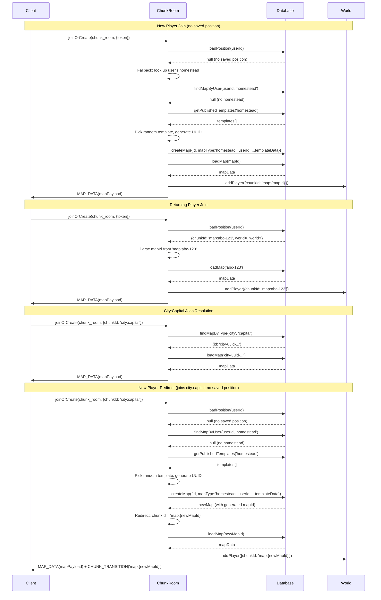

# Map Entity Model Refactor - Design Document

## Overview

This design document details the technical implementation for refactoring the `maps` table from a user-keyed 1:1 extension into an independent entity with its own UUID identity, a map type discriminator, and an optional owner. The refactor touches 21 files across 6 layers (database schema, database services, game server, shared types, game client, and GenMap API) to replace all `userId`-based map addressing with `mapId`-based addressing and the unified `map:{mapId}` chunkId convention.

## Design Summary (Meta)

```yaml
design_type: "refactoring"
risk_level: "medium"
complexity_level: "medium"
complexity_rationale: >
  (1) FR-1 through FR-10 require coordinated changes across 21 files in 6 layers,
  with data migration (FR-2, FR-2b), chunkId convention change (FR-5), and
  alias resolution (FR-7) introducing cross-cutting concerns.
  (2) Risk of data loss during migration (mitigated by transactional approach)
  and risk of routing failures if any layer misses the chunkId format change.
main_constraints:
  - "Single atomic migration (no dual-write) -- early-stage project with no production users"
  - "ChunkRoom stays as the single room type -- no room architecture split"
  - "city:capital alias must be preserved as compile-time constant"
biggest_risks:
  - "21-file refactor introduces subtle bugs in room join flow"
  - "Migration corrupts existing map data"
unknowns:
  - "Whether advisory locks are needed to prevent duplicate homestead creation during concurrent first-login"
  - "Whether additional city:* aliases will be needed beyond city:capital"
```

## Background and Context

### Prerequisite ADRs

- **[ADR-006: Map Entity Model](../adr/adr-006-map-entity-model.md)**: Decisions on map identity model (UUID PK), migration strategy (hard cutover), chunkId convention (`map:{mapId}`), and mapType standardization (`homestead`).
- **[ADR-0006: Chunk-Based Room Architecture](../adr/ADR-0006-chunk-based-room-architecture.md)**: Original room architecture establishing ChunkRoom and chunkId conventions.

### Agreement Checklist

#### Scope
- [x] Replace `maps` table schema: userId PK to UUID `id` PK with `map_type` and optional `user_id` FK
- [x] Migrate existing map data with UUID generation
- [x] Migrate `player_positions.chunkId` from `player:{userId}` to `map:{mapId}`
- [x] Standardize `map_type` values across `maps`, `editor_maps`, `map_templates`
- [x] Update all 7 database service functions to use mapId
- [x] Update ChunkRoom to load maps by mapId, resolve `city:capital` alias
- [x] Update World.ts positional chunk detection for `map:` prefix
- [x] Update shared types and constants (LocationType, MapType, DEFAULT_SPAWN)
- [x] Update client-side chunkId handling in colyseus.ts
- [x] Update GenMap API routes for mapId-based addressing

#### Non-Scope (Explicitly not changing)
- [x] Room architecture: ChunkRoom stays as the single room type
- [x] Open-world map generation and chunk storage
- [x] House placement mechanics
- [x] Map permissions / access control
- [x] NPC-owned maps
- [x] Map versioning or history
- [x] Game.ts scene rendering logic (receives MapDataPayload unchanged)

#### Constraints
- [x] Parallel operation: No (hard cutover, no dual-write)
- [x] Backward compatibility: Not required (no production users)
- [x] Performance measurement: Required (map load < 50ms p99, room join < 500ms p95)

### Problem to Solve

The `maps` table treats a map as a 1:1 extension of a user (userId is PK), preventing multiple maps per user, city maps without owners, and creating inconsistency with sibling tables that already use UUID PKs.

### Current Challenges

1. Cannot create a second map for the same user (house interiors)
2. Cannot store city or open-world maps (no type discriminator, PK requires a userId)
3. ChunkId `player:{userId}` encodes user identity in routing, not map identity
4. Schema inconsistency between `maps` (userId PK) and `editor_maps`/`map_templates` (UUID PK)
5. All service functions are userId-centric, requiring refactoring to support mapId

### Requirements

#### Functional Requirements

- FR-1: New `maps` table schema with UUID PK, map_type, optional user_id
- FR-1a: Standardize map_type values (`player_homestead` -> `homestead`) across all tables
- FR-2: Database migration from old schema to new schema
- FR-2b: Migrate `player_positions.chunkId` to new `map:{mapId}` format
- FR-3: Default homestead creation on first login
- FR-4: Map lookup by mapId instead of userId
- FR-5: Room routing by mapId (`map:{mapId}` convention)
- FR-6: Player position persistence with mapId-based chunkId
- FR-7: Updated shared types and constants
- FR-8: World movement logic update
- FR-9: Client-side chunkId convention update
- FR-10: GenMap API routes update
- FR-11: Query maps by user and type (Should Have)
- FR-12: Map metadata JSONB column (Should Have)

#### Non-Functional Requirements

- **Performance**: Map load < 50ms p99; room join < 500ms p95; migration < 30s for 10k rows
- **Reliability**: Zero data loss migration; transactional atomicity
- **Scalability**: Unbounded maps per user; indexed user_id FK for efficient owner queries
- **Maintainability**: Consistent schema pattern across all map tables

## Acceptance Criteria (AC) - EARS Format

### FR-1: New maps table schema

- [ ] **AC-1.1**: The `maps` table shall have columns: `id` (UUID PK, auto-generated), `name` (varchar, nullable), `map_type` (varchar, not null), `user_id` (UUID FK, nullable), `seed` (integer, nullable), `width` (integer, not null), `height` (integer, not null), `grid` (JSONB, not null), `layers` (JSONB, not null), `walkable` (JSONB, not null), `metadata` (JSONB, nullable), `created_at` (timestamptz, not null), `updated_at` (timestamptz, not null).
- [ ] **AC-1.2**: **When** querying `maps`, each row shall have a UUID `id` PK and a `map_type` value from the set {homestead, city, open_world}.
- [ ] **AC-1.3**: **When** `user_id` is null (city/open_world maps), the row shall be valid and queryable.

### FR-1a: MapType standardization

- [ ] **AC-1a.1**: **When** the migration runs, no rows in `editor_maps` or `map_templates` shall contain `player_homestead` -- all use `homestead`.
- [ ] **AC-1a.2**: **When** ChunkRoom queries templates by map_type, it shall use `homestead` (not `player_homestead`).

### FR-2: Data migration

- [ ] **AC-2.1**: **When** the migration runs on a database with existing map rows, all rows shall exist in the new table with UUID ids, map_type='homestead', original data intact, and zero data loss.
- [ ] **AC-2.2**: **If** the migration fails at any step, **then** the entire transaction shall roll back, leaving the original schema intact.

### FR-2b: Player positions migration

- [ ] **AC-2b.1**: **When** the migration runs, all `player_positions` rows with `chunkId = 'player:{userId}'` shall be updated to `chunkId = 'map:{mapId}'` where mapId is the UUID of that user's homestead map.
- [ ] **AC-2b.2**: Rows with `city:capital` or `world:{x}:{y}` chunkIds shall not be modified.

### FR-3: Default homestead creation

- [ ] **AC-3.1**: **When** a new player joins with no maps, the server shall create a new map row with a UUID id, map_type='homestead', user_id=their userId, and valid map data from a published template.
- [ ] **AC-3.2**: **When** the homestead is created, the player's position shall reference the new mapId via `map:{mapId}` chunkId.

### FR-4: Map lookup by mapId

- [ ] **AC-4.1**: **When** `loadMap(db, mapId)` is called with a valid map UUID, the map data shall be returned.
- [ ] **AC-4.2**: **When** `saveMap(db, data)` is called, the data shall be persisted using `mapId` as the identifier (not userId).
- [ ] **AC-4.3**: **When** `listMapsByUser(db, userId)` is called, all maps owned by that user shall be returned.

### FR-5: Room routing by mapId

- [ ] **AC-5.1**: **When** a player joins with chunkId='map:abc-123', ChunkRoom shall load the map with id='abc-123'.
- [ ] **AC-5.2**: **When** a player joins with chunkId='city:capital', ChunkRoom shall resolve the alias to the city map's UUID and load that map.
- [ ] **AC-5.3**: The old `player:{userId}` convention shall no longer be generated or accepted.

### FR-6: Position persistence

- [ ] **AC-6.1**: **When** a player in homestead map 'abc-123' disconnects, the saved chunkId shall be 'map:abc-123'.
- [ ] **AC-6.2**: **When** the player reconnects, they shall be routed to the room for map 'abc-123'.

### FR-7: Shared types

- [x] **AC-7.1**: The `MapType` type ('homestead' | 'city' | 'open_world') shall be importable from `@nookstead/shared`.
- [x] **AC-7.2**: The `LocationType` enum shall have values `MAP` and `WORLD` (replacing CITY/PLAYER/OPEN_WORLD).
- [x] **AC-7.3**: `DEFAULT_SPAWN` shall retain `chunkId: 'city:capital'`.

### FR-8: World movement logic

- [ ] **AC-8.1**: **While** a player is in a `map:{mapId}` room, no chunk transition shall be triggered regardless of position.
- [ ] **AC-8.2**: **While** a player is in a `world:{x}:{y}` room, chunk transitions shall be triggered when crossing chunk boundaries.

### FR-9: Client-side chunkId

- [ ] **AC-9.1**: **When** the client receives a CHUNK_TRANSITION with newChunkId='map:abc-123', it shall join the room with that chunkId.

### FR-10: GenMap API routes

- [ ] **AC-10.1**: **When** the list endpoint is called, the response shall include each map's UUID `id`, `map_type`, and optional `user_id`.
- [ ] **AC-10.2**: **When** the import endpoint receives a mapId, the map shall be imported into the editor by that mapId.
- [ ] **AC-10.3**: **When** the export endpoint exports to a player map, it shall use the mapId-based `exportToPlayerMap` signature.

## Applicable Standards

### Classification Table

| Standard | Type | Source | Impact on Design |
|----------|------|--------|-----------------|
| Prettier: single quotes, 2-space indent | Explicit | `.prettierrc`, `.editorconfig` | All new code must follow formatting rules |
| ESLint: flat config with Nx module boundaries | Explicit | `eslint.config.mjs` | Cross-package imports must respect boundaries |
| TypeScript: strict mode, ES2022 target, bundler resolution | Explicit | `tsconfig.base.json` | All types must satisfy strict checks |
| Jest for unit tests | Explicit | `jest.config.cts` per project | Tests use Jest with mock Drizzle clients |
| Drizzle ORM for schema definitions | Explicit | `packages/db/src/schema/*.ts` | Schema uses Drizzle pgTable API |
| UUID PK pattern for map tables | Implicit | `editor-maps.ts`, `map-templates.ts` | New `maps` table must follow this pattern |
| Service function pattern: `(db: DrizzleClient, ...params)` | Implicit | `packages/db/src/services/*.ts` | All DB service functions take DrizzleClient as first param |
| Fail-fast error propagation | Implicit | `map.ts`, `map-import-export.ts` | Errors propagate to caller; no silent fallbacks |
| Object parameter pattern for 3+ params | Implicit | `SaveMapData` interface in `map.ts` | Functions with 3+ params use interface objects |
| Barrel export pattern | Implicit | `packages/db/src/index.ts` | New exports must be added to barrel |

## Existing Codebase Analysis

### Implementation Path Mapping

| Type | Path | Description |
|------|------|-------------|
| Existing | `packages/db/src/schema/maps.ts` | Current maps schema (userId PK) -- will be rewritten |
| Existing | `packages/db/src/schema/editor-maps.ts` | Reference pattern (UUID PK, map_type) -- unchanged |
| Existing | `packages/db/src/schema/map-templates.ts` | Reference pattern (UUID PK, map_type) -- unchanged |
| Existing | `packages/db/src/schema/player-positions.ts` | Player positions with chunkId -- default value unchanged |
| Existing | `packages/db/src/services/map.ts` | saveMap/loadMap (userId-based) -- will be rewritten |
| Existing | `packages/db/src/services/map-import-export.ts` | 5 functions (userId-based) -- will be rewritten |
| Existing | `packages/db/src/index.ts` | Barrel exports -- will be updated |
| Existing | `apps/server/src/rooms/ChunkRoom.ts` | Room logic (loads by userId) -- will be modified |
| Existing | `apps/server/src/world/World.ts` | Chunk detection (`player:` prefix) -- will be simplified |
| Existing | `apps/server/src/models/Player.ts` | Player model (chunkId field) -- JSDoc update only |
| Existing | `packages/shared/src/types/map.ts` | MapDataPayload -- may add mapId field |
| Existing | `packages/shared/src/types/room.ts` | PlayerState, Location types -- will be updated |
| Existing | `packages/shared/src/constants.ts` | LocationType enum, DEFAULT_SPAWN -- will be updated |
| Existing | `apps/game/src/services/colyseus.ts` | Client room joining -- minimal change (chunkId format only) |
| Existing | `apps/game/src/game/scenes/Game.ts` | Game scene -- no map-loading changes needed |
| Existing | `apps/genmap/.../player-maps/route.ts` | List endpoint -- will return mapId |
| Existing | `apps/genmap/.../player-maps/import/route.ts` | Import endpoint -- will accept mapId |
| Existing | `apps/genmap/.../editor-maps/[id]/export/route.ts` | Export endpoint -- will pass mapId |
| New | Migration file (Drizzle migration) | Schema migration + data migration SQL |
| Existing | `packages/db/src/services/map.spec.ts` | Unit tests -- will be rewritten |
| Existing | `packages/db/src/services/map-import-export.spec.ts` | Unit tests -- will be rewritten |

### Code Inspection Evidence

#### What Was Examined

- `packages/db/src/schema/maps.ts` -- Full file (28 lines): current schema definition
- `packages/db/src/schema/editor-maps.ts` -- Full file (32 lines): reference UUID PK pattern
- `packages/db/src/schema/map-templates.ts` -- Full file (37 lines): reference UUID PK pattern
- `packages/db/src/schema/player-positions.ts` -- Full file (26 lines): chunkId default value
- `packages/db/src/services/map.ts` -- Full file (99 lines): saveMap/loadMap functions
- `packages/db/src/services/map-import-export.ts` -- Full file (166 lines): 5 import/export functions
- `packages/db/src/services/map.spec.ts` -- Full file (237 lines): test patterns and mock DB setup
- `packages/db/src/index.ts` -- Full file (92 lines): barrel exports
- `apps/server/src/rooms/ChunkRoom.ts` -- Full file (460 lines): room logic, map loading, template assignment
- `apps/server/src/world/World.ts` -- Full file (168 lines): isPositionalChunk detection, movePlayer
- `apps/server/src/models/Player.ts` -- Full file (63 lines): ServerPlayer interface
- `packages/shared/src/constants.ts` -- Full file (79 lines): LocationType enum, DEFAULT_SPAWN
- `packages/shared/src/types/room.ts` -- Full file (34 lines): PlayerState, Location types
- `packages/shared/src/types/map.ts` -- Full file (203 lines): MapDataPayload, serialization types
- `apps/game/src/services/colyseus.ts` -- Full file (204 lines): joinChunkRoom, handleChunkTransition
- `apps/game/src/game/scenes/Game.ts` -- Full file (259 lines): Game scene init/create
- `apps/genmap/.../player-maps/route.ts` -- Full file (17 lines): GET list endpoint
- `apps/genmap/.../player-maps/import/route.ts` -- Full file (27 lines): POST import endpoint
- `apps/genmap/.../editor-maps/[id]/export/route.ts` -- Full file (32 lines): POST export endpoint

Files inspected: 19 of 21 affected files (remaining 2 are test files for ChunkRoom and map-import-export that follow the same patterns).

#### Key Findings

| File Inspected | Key Finding | Design Impact |
|---------------|-------------|---------------|
| `schema/maps.ts:10-14` | userId is PK with `.unique().primaryKey()` | New schema replaces with `id: uuid('id').defaultRandom().primaryKey()` |
| `schema/editor-maps.ts:11` | Uses `uuid('id').defaultRandom().primaryKey()` | Adopt exact same pattern for new `maps` |
| `schema/editor-maps.ts:13` | Has `mapType: varchar('map_type', { length: 50 })` | Adopt same column definition |
| `schema/editor-maps.ts:20` | Has `metadata: jsonb('metadata')` | Include metadata column per FR-12 |
| `schema/player-positions.ts:17` | Default chunkId is `'city:capital'` | No schema change needed; alias resolved at runtime |
| `services/map.ts:40-70` | `saveMap` uses `onConflictDoUpdate` on `maps.userId` | New version uses `onConflictDoUpdate` on `maps.id` |
| `services/map.ts:81-99` | `loadMap` queries by `eq(maps.userId, userId)` | New version queries by `eq(maps.id, mapId)` |
| `services/map-import-export.ts:49` | `importPlayerMap` hardcodes `mapType: 'player_homestead'` | Must change to `'homestead'` |
| `services/map-import-export.ts:84-105` | `exportToPlayerMap` uses `onConflictDoUpdate` on `maps.userId` | Change to pure UPDATE by `maps.id`; throw if map not found (createMap is the creation path) |
| `rooms/ChunkRoom.ts:112` | `targetChunkId = savedPosition?.chunkId ?? 'player:${userId}'` | Must change fallback to look up user's homestead mapId |
| `rooms/ChunkRoom.ts:131` | `loadMap(db, userId)` | Must change to `loadMap(db, mapId)` after extracting mapId from chunkId |
| `rooms/ChunkRoom.ts:155` | `getPublishedTemplates(db, 'player_homestead')` | Must change to `'homestead'` |
| `rooms/ChunkRoom.ts:186` | `saveMap(db, { userId, ... })` | Must change to `saveMap(db, { mapId, ... })` with new map creation |
| `world/World.ts:111` | `isPositionalChunk = oldChunkId.startsWith('world:')` | Already correct logic -- `map:` prefix is non-positional |
| `constants.ts:51-54` | `LocationType` has CITY, PLAYER, OPEN_WORLD values | Must change to MAP, WORLD values |
| `colyseus.ts:89-132` | `joinChunkRoom(chunkId?)` passes chunkId to server | No functional change needed -- already string-based |
| `Game.ts:34-39` | `init(data: { mapData: MapDataPayload; room?: Room })` | No change needed -- MapDataPayload unchanged |
| `genmap/player-maps/route.ts:7` | Returns `listPlayerMaps(db)` result directly | Must return mapId, map_type in response |
| `genmap/player-maps/import/route.ts:7` | Accepts `{ userId }` in body | Must accept `{ mapId }` (or both during transition) |
| `genmap/editor-maps/[id]/export/route.ts:21` | Calls `exportToPlayerMap(db, id, userId)` | Must pass mapId instead of userId |

#### How Findings Influence Design

- The `editor_maps` schema is the exact blueprint for the new `maps` schema -- reuse column definitions.
- The `onConflictDoUpdate` target in `saveMap` must change from `maps.userId` to `maps.id`.
- ChunkRoom has the most complex changes: extracting mapId from chunkId, resolving `city:capital`, and creating homestead maps for new players.
- World.ts `isPositionalChunk` logic already uses `startsWith('world:')`, so the `map:` prefix automatically qualifies as non-positional -- minimal change needed.
- colyseus.ts and Game.ts require minimal changes because they already work with opaque chunkId strings.

### Similar Functionality Search

**Search results**: No duplicate implementations found. The `maps`, `editor_maps`, and `map_templates` tables serve distinct purposes (live maps, editor drafts, published templates). The refactor aligns `maps` with the existing pattern, not duplicating it.

**Decision**: Proceed with new implementation following existing `editor_maps` pattern.

## Design

### Change Impact Map

```yaml
Change Target: maps table schema and all consumers
Direct Impact:
  - packages/db/src/schema/maps.ts (schema rewrite)
  - packages/db/src/services/map.ts (function signatures and queries)
  - packages/db/src/services/map-import-export.ts (function signatures and queries)
  - packages/db/src/services/map.spec.ts (test fixtures)
  - packages/db/src/services/map-import-export.spec.ts (test fixtures)
  - packages/db/src/index.ts (barrel exports)
  - apps/server/src/rooms/ChunkRoom.ts (map loading, homestead creation, alias resolution)
  - packages/shared/src/constants.ts (LocationType enum)
  - packages/shared/src/types/room.ts (Location type)
  - apps/genmap/.../player-maps/route.ts (response shape)
  - apps/genmap/.../player-maps/import/route.ts (request params)
  - apps/genmap/.../editor-maps/[id]/export/route.ts (function call)
Indirect Impact:
  - apps/server/src/world/World.ts (isPositionalChunk -- already correct, verify only)
  - apps/server/src/models/Player.ts (chunkId field JSDoc)
  - packages/shared/src/types/map.ts (optional mapId field on MapDataPayload)
  - apps/game/src/services/colyseus.ts (chunkId format in logs -- no functional change)
  - apps/game/src/game/scenes/Game.ts (no change -- receives MapDataPayload as before)
No Ripple Effect:
  - packages/db/src/schema/editor-maps.ts (data migration only, schema unchanged)
  - packages/db/src/schema/map-templates.ts (data migration only, schema unchanged)
  - packages/db/src/schema/player-positions.ts (schema unchanged, default value unchanged)
  - packages/db/src/schema/users.ts (unchanged)
  - apps/server/src/auth/* (unchanged)
  - apps/server/src/world/ChunkManager.ts (unchanged -- works with opaque chunkId strings)
  - packages/map-lib/* (unchanged)
  - packages/map-renderer/* (unchanged)
```

### Architecture Overview

```mermaid
graph TB
    subgraph "Database Layer"
        MAPS[maps table<br/>id UUID PK<br/>map_type varchar<br/>user_id UUID FK nullable]
        EM[editor_maps table<br/>map_type: homestead]
        MT[map_templates table<br/>map_type: homestead]
        PP[player_positions<br/>chunkId: map:{mapId}]
    end

    subgraph "DB Service Layer"
        MS[map.ts<br/>saveMap/loadMap<br/>by mapId]
        MIE[map-import-export.ts<br/>import/export/list<br/>by mapId]
    end

    subgraph "Server Layer"
        CR[ChunkRoom<br/>parse map:{mapId}<br/>resolve city:capital]
        W[World.ts<br/>map: = non-positional<br/>world: = spatial]
    end

    subgraph "Shared Types"
        ST[constants.ts<br/>LocationType.MAP/WORLD<br/>DEFAULT_SPAWN city:capital]
        RT[types/room.ts<br/>PlayerState.chunkId]
    end

    subgraph "Client Layer"
        CS[colyseus.ts<br/>joinChunkRoom]
        GS[Game.ts<br/>MapDataPayload]
    end

    subgraph "GenMap API"
        GM[player-maps routes<br/>mapId-based]
    end

    MAPS --> MS
    MAPS --> MIE
    MS --> CR
    MIE --> GM
    MT --> CR
    PP --> CR
    CR --> W
    ST --> CR
    ST --> W
    RT --> CR
    CS --> CR
    CR --> GS
```

### Data Flow



### Integration Points List

| Integration Point | Location | Old Implementation | New Implementation | Switching Method |
|-------------------|----------|-------------------|-------------------|------------------|
| Map schema PK | `schema/maps.ts` | `userId` as PK | `id` (UUID) as PK, `user_id` as FK | Schema rewrite |
| Map save | `services/map.ts:saveMap` | Upsert by userId | Upsert by mapId | Function signature change |
| Map load | `services/map.ts:loadMap` | Query by userId | Query by mapId | Function signature change |
| Map list | `services/map-import-export.ts:listPlayerMaps` | Join maps.userId | Join maps.userId (FK), return mapId | Query + return type change |
| Map import | `services/map-import-export.ts:importPlayerMap` | Query by userId | Query by mapId | Function signature change |
| Map export | `services/map-import-export.ts:exportToPlayerMap` | Upsert by userId | Pure UPDATE by mapId (throws if not found) | Signature + semantics change |
| Edit map direct | `services/map-import-export.ts:editPlayerMapDirect` | Query by userId | Query by mapId | Function signature change |
| Save map direct | `services/map-import-export.ts:savePlayerMapDirect` | Update by userId | Update by mapId | Function signature change |
| ChunkRoom map load | `ChunkRoom.ts:onJoin` | `loadMap(db, userId)` | `loadMap(db, mapId)` extracted from chunkId | Inline logic change |
| ChunkRoom fallback | `ChunkRoom.ts:onJoin` | `player:${userId}` | Look up homestead mapId from DB | Logic replacement |
| ChunkRoom template query | `ChunkRoom.ts:onJoin` | `'player_homestead'` | `'homestead'` | String literal change |
| ChunkRoom map save | `ChunkRoom.ts:onJoin` | `saveMap(db, {userId, ...})` | Create new map with mapId | Logic replacement |
| World positional check | `World.ts:movePlayer` | `startsWith('world:')` | `startsWith('world:')` (unchanged) | No change needed |
| LocationType enum | `constants.ts` | CITY/PLAYER/OPEN_WORLD | MAP/WORLD | Enum value change |
| GenMap list | `player-maps/route.ts` | Returns userId-keyed data | Returns mapId-keyed data | Response shape change |
| GenMap import | `player-maps/import/route.ts` | Accepts `{userId}` | Accepts `{mapId}` | Request body change |
| GenMap export | `editor-maps/[id]/export/route.ts` | `exportToPlayerMap(db, id, userId)` | `exportToPlayerMap(db, editorMapId, mapId)` | Call signature change |

### Main Components

#### Component 1: Maps Schema (`packages/db/src/schema/maps.ts`)

- **Responsibility**: Define the `maps` table structure in Drizzle ORM
- **Interface**: Exports `maps` table object, `MapRecord` and `NewMapRecord` types
- **Dependencies**: `drizzle-orm/pg-core`, `./users` (for user_id FK)

New schema definition:

```typescript
export const maps = pgTable('maps', {
  id: uuid('id').defaultRandom().primaryKey(),
  name: varchar('name', { length: 255 }),
  mapType: varchar('map_type', { length: 50 }).notNull(),
  userId: uuid('user_id').references(() => users.id, { onDelete: 'cascade' }),
  seed: integer('seed'),
  width: integer('width').notNull().default(64),
  height: integer('height').notNull().default(64),
  grid: jsonb('grid').notNull(),
  layers: jsonb('layers').notNull(),
  walkable: jsonb('walkable').notNull(),
  metadata: jsonb('metadata'),
  createdAt: timestamp('created_at', { withTimezone: true })
    .defaultNow()
    .notNull(),
  updatedAt: timestamp('updated_at', { withTimezone: true })
    .defaultNow()
    .notNull(),
});
```

#### Component 2: Map Service (`packages/db/src/services/map.ts`)

- **Responsibility**: CRUD operations for maps by mapId
- **Interface**: `saveMap(db, data)`, `loadMap(db, mapId)`, `createMap(db, data)`, `findMapByUser(db, userId, mapType?)`, `listMapsByUser(db, userId)`, `listMapsByUserAndType(db, userId, mapType)`
- **Dependencies**: Drizzle client, maps schema

Key interface changes:

```typescript
export interface SaveMapData {
  mapId: string;       // UUID -- was userId
  seed?: number;       // nullable for city/world maps
  width: number;
  height: number;
  grid: unknown;
  layers: unknown;
  walkable: unknown;
}

export interface CreateMapData {
  name?: string;
  mapType: string;     // 'homestead' | 'city' | 'open_world'
  userId?: string;     // nullable for city/world maps
  seed?: number;
  width: number;
  height: number;
  grid: unknown;
  layers: unknown;
  walkable: unknown;
  metadata?: unknown;
}

export interface LoadMapResult {
  id: string;          // NEW: map UUID
  name: string | null;
  mapType: string;
  userId: string | null;
  seed: number | null;
  width: number;
  height: number;
  grid: unknown;
  layers: unknown;
  walkable: unknown;
  metadata: unknown;
}
```

#### Barrel File Update (`packages/db/src/index.ts`)

The barrel file must be updated to reflect renamed, removed, and new exports. Complete export set after refactor:

**Renamed exports (from `./services/map`):**
- `saveMap` (was upsert by userId, now UPDATE by mapId -- name retained, semantics changed)
- `loadMap` (was by userId, now by mapId -- name retained, semantics changed)
- `SaveMapData` (interface: `userId` field replaced with `mapId`)
- `LoadMapResult` (interface: adds `id`, `name`, `mapType`, `userId`, `metadata` fields)

**New exports (from `./services/map`):**
- `createMap` -- explicit creation path returning `MapRecord` with generated UUID
- `findMapByUser` -- lookup maps by `userId` with optional `mapType` filter
- `listMapsByUser` -- list all maps for a user
- `listMapsByUserAndType` -- list maps filtered by user and type
- `CreateMapData` -- interface for `createMap` input
- `MapType` -- string union type: `'homestead' | 'city' | 'open_world'`

**Unchanged exports (from `./services/map-import-export`):**
- `listPlayerMaps` (return shape changes: adds `id`, `mapType`)
- `importPlayerMap` (signature: `userId` -> `mapId`)
- `exportToPlayerMap` (signature: `userId` -> `mapId`, upsert -> UPDATE)
- `editPlayerMapDirect` (signature: `userId` -> `mapId`)
- `savePlayerMapDirect` (signature: `userId` -> `mapId`)

#### Component 3: ChunkRoom (`apps/server/src/rooms/ChunkRoom.ts`)

- **Responsibility**: Manage player join/leave, load map data, handle chunk transitions
- **Interface**: Colyseus Room lifecycle methods (onCreate, onAuth, onJoin, onLeave)
- **Dependencies**: Map service, World, shared types/constants

Key logic changes in `onJoin`:
1. Parse chunkId to extract mapId: if `map:{uuid}`, extract uuid; if `city:capital`, resolve alias
2. Load map by mapId instead of userId
3. For new players: create homestead map, get its mapId, use `map:{mapId}` as chunkId
4. Template query uses `'homestead'` instead of `'player_homestead'`

**Behavioral change note**: Homestead creation changes from a fire-and-forget `saveMap` upsert (which silently inserted or updated via `onConflictDoUpdate`) to an explicit `createMap` call that returns the generated UUID, followed by `loadMap` to fetch the full map data. This two-step create-then-load pattern ensures the caller always has the mapId for chunkId construction and room routing.

#### Component 4: Shared Types and Constants

- **Responsibility**: Define types and constants shared between client and server
- **Interface**: `LocationType` enum, `MapType` type, `DEFAULT_SPAWN`, `PlayerState`

Changes:
```typescript
// constants.ts
export enum LocationType {
  MAP = 'MAP',           // was CITY, PLAYER
  WORLD = 'WORLD',       // was OPEN_WORLD
}

export type MapType = 'homestead' | 'city' | 'open_world';

// DEFAULT_SPAWN unchanged
export const DEFAULT_SPAWN = {
  worldX: 520,
  worldY: 528,
  chunkId: 'city:capital',
};
```

### Contract Definitions

#### Map Service Contracts

```typescript
// Create a new map (used for homestead creation on first login)
function createMap(db: DrizzleClient, data: CreateMapData): Promise<MapRecord>;

// Save/update existing map data by mapId
function saveMap(db: DrizzleClient, data: SaveMapData): Promise<void>;

// Load a map by its UUID
function loadMap(db: DrizzleClient, mapId: string): Promise<LoadMapResult | null>;

// Find maps owned by a user, optionally filtered by type
function findMapByUser(
  db: DrizzleClient,
  userId: string,
  mapType?: string
): Promise<MapRecord[]>;

// List all player maps (for GenMap admin)
function listPlayerMaps(db: DrizzleClient): Promise<Array<{
  id: string;
  name: string | null;
  mapType: string;
  userId: string | null;
  seed: number | null;
  updatedAt: Date;
  userName: string | null;
  userEmail: string;
}>>;

// Import a player map into the editor by mapId
function importPlayerMap(
  db: DrizzleClient,
  mapId: string
): Promise<EditorMap>;

// Export an editor map to a player map by mapId
// BEHAVIORAL CHANGE: The current implementation uses onConflictDoUpdate (upsert)
// on maps.userId. The new implementation is a pure UPDATE that throws if the
// target map is not found. Rationale: createMap is now the explicit creation
// path; exportToPlayerMap should only overwrite an existing map's grid data.
// This aligns with fail-fast error propagation (no silent insert on missing map).
function exportToPlayerMap(
  db: DrizzleClient,
  editorMapId: string,
  mapId: string
): Promise<void>;
```

#### ChunkId Parsing Contract

```typescript
// ChunkId format contract
type ChunkIdFormat =
  | `map:${string}`       // single-chunk map: map:{uuid}
  | `world:${number}:${number}`  // open-world: world:{x}:{y}
  | 'city:capital';       // well-known alias

// Parsing helper (conceptual)
function parseChunkId(chunkId: string): {
  type: 'map' | 'world' | 'alias';
  mapId?: string;          // for type='map'
  x?: number; y?: number;  // for type='world'
  alias?: string;          // for type='alias'
};
```

### Data Contracts

#### Map Service: saveMap

```yaml
Input:
  Type: SaveMapData { mapId: string, seed?: number, width: number, height: number, grid: unknown, layers: unknown, walkable: unknown }
  Preconditions: mapId must be a valid UUID of an existing map row
  Validation: DrizzleClient validates UUID format; DB enforces FK constraints

Output:
  Type: Promise<void>
  Guarantees: Map row is updated with new data and updatedAt timestamp
  On Error: Propagate Drizzle/PostgreSQL error to caller

Invariants:
  - Map id and map_type are never modified by saveMap
  - user_id FK is never modified by saveMap
```

#### Map Service: loadMap

```yaml
Input:
  Type: string (mapId UUID)
  Preconditions: Must be a valid UUID string
  Validation: DB query returns empty result for non-existent UUIDs

Output:
  Type: Promise<LoadMapResult | null>
  Guarantees: Returns full map data including id, mapType, userId if exists; null otherwise
  On Error: Propagate DB error to caller

Invariants:
  - Read-only operation; no side effects
```

#### Map Service: createMap

```yaml
Input:
  Type: CreateMapData { name?, mapType, userId?, seed?, width, height, grid, layers, walkable, metadata? }
  Preconditions: mapType must be one of 'homestead', 'city', 'open_world'
  Validation: DB enforces not-null constraints on required columns

Output:
  Type: Promise<MapRecord>
  Guarantees: Returns the created map row including generated UUID id
  On Error: Propagate DB error; unique constraint violation if duplicate

Invariants:
  - A new UUID is generated for each creation (never reuses existing)
  - created_at and updated_at are set to current time
```

#### Map Import/Export Service: exportToPlayerMap

```yaml
Input:
  Type: (editorMapId: string, mapId: string)
  Preconditions:
    - editorMapId must be a valid UUID of an existing editor_maps row
    - mapId must be a valid UUID of an existing maps row
  Validation: DB queries confirm existence; throws Error if either is missing

Output:
  Type: Promise<void>
  Guarantees: Target map row is updated with editor map's grid, layers, walkable, seed, and updatedAt
  On Error:
    - Editor map not found: throws Error('Editor map not found: {editorMapId}')
    - Target map not found: throws Error('Target map not found: {mapId}')
    - DB error: propagated to caller

Behavioral Change from Current:
  - Old: onConflictDoUpdate upsert on maps.userId (creates if missing)
  - New: Pure UPDATE on maps.id; throws if map not found
  - Rationale: createMap is the explicit creation path. Export should only
    overwrite an existing map's data, aligning with fail-fast error propagation.

Invariants:
  - map_type and user_id are never modified by exportToPlayerMap
  - Only grid, layers, walkable, seed, and updatedAt are overwritten
```

### Data Representation Decisions

| Data Structure | Decision | Rationale |
|---|---|---|
| `MapRecord` (new maps schema type) | **Reuse** Drizzle inferred type from new `maps` table | Same pattern as `EditorMap` from `editor_maps`. Drizzle's `$inferSelect`/`$inferInsert` generates types directly from schema. |
| `SaveMapData` (service input) | **Modify** existing interface | Replace `userId: string` with `mapId: string`, make `seed` optional. Same conceptual purpose, different identity field. |
| `LoadMapResult` (service output) | **Modify** existing interface | Add `id`, `name`, `mapType`, `userId`, `metadata` fields. Extends existing structure. |
| `CreateMapData` (new) | **New** dedicated type | No existing type covers map creation with all required fields. Distinct from `SaveMapData` because creation includes `mapType`, `userId`, `name` while save only updates data fields. |
| `MapType` (shared type) | **New** type alias | String union type for the three map types. No existing type covers this. |
| `LocationType` (enum) | **Modify** existing enum | Replace three values (CITY/PLAYER/OPEN_WORLD) with two (MAP/WORLD) matching the chunkId convention. |

### Field Propagation Map

```yaml
fields:
  - name: "mapId"
    origin: "Database maps.id (UUID, auto-generated)"
    transformations:
      - layer: "DB Schema"
        type: "maps.id (UUID)"
        validation: "not null, auto-generated via gen_random_uuid()"
      - layer: "DB Service"
        type: "LoadMapResult.id (string)"
        transformation: "UUID cast to string by Drizzle"
      - layer: "Server (ChunkRoom)"
        type: "Extracted from chunkId string"
        transformation: "chunkId.replace('map:', '') -> mapId"
      - layer: "Shared Types"
        type: "Part of chunkId string in PlayerState"
        transformation: "Embedded as 'map:{mapId}' format"
      - layer: "Client (colyseus.ts)"
        type: "Opaque chunkId string"
        transformation: "No transformation -- passed to server as-is"
      - layer: "player_positions.chunkId"
        type: "varchar(100)"
        transformation: "Stored as 'map:{mapId}' string"
    destination: "Database player_positions.chunkId / ChunkRoom routing"
    loss_risk: "none"

  - name: "mapType"
    origin: "Application code / Template"
    transformations:
      - layer: "DB Schema"
        type: "maps.map_type (varchar 50)"
        validation: "not null, application-level validation"
      - layer: "DB Service"
        type: "CreateMapData.mapType (string)"
        transformation: "none"
      - layer: "Server (ChunkRoom)"
        type: "Template query filter parameter"
        transformation: "Used as getPublishedTemplates(db, 'homestead')"
      - layer: "Shared Types"
        type: "MapType ('homestead' | 'city' | 'open_world')"
        transformation: "TypeScript union type constrains values"
    destination: "Database maps.map_type column"
    loss_risk: "none"

  - name: "chunkId"
    origin: "Server-side computation or DB load"
    transformations:
      - layer: "Server (ChunkRoom)"
        type: "string"
        transformation: "Constructed as 'map:{mapId}' or read from player_positions"
      - layer: "Shared Types (PlayerState)"
        type: "string"
        transformation: "Passed as-is"
      - layer: "Colyseus Wire Protocol"
        type: "JSON string field"
        transformation: "Serialized by Colyseus"
      - layer: "Client (colyseus.ts)"
        type: "string"
        transformation: "Used as room join parameter"
      - layer: "player_positions"
        type: "varchar(100)"
        transformation: "Stored as-is"
    destination: "Database / Client room join / Server room creation"
    loss_risk: "none"
```

### Integration Point Map

```yaml
Integration Point 1:
  Existing Component: ChunkRoom.onJoin -> loadMap(db, userId)
  Integration Method: Function call change (loadMap now takes mapId)
  Impact Level: High (Process Flow Change)
  Required Test Coverage: New player join, returning player join, city:capital alias

Integration Point 2:
  Existing Component: ChunkRoom.onJoin -> saveMap(db, {userId, ...})
  Integration Method: Logic replacement (createMap for new maps, saveMap for updates)
  Impact Level: High (Process Flow Change)
  Required Test Coverage: New homestead creation, map persistence on leave

Integration Point 3:
  Existing Component: GenMap export route -> exportToPlayerMap(db, editorMapId, userId)
  Integration Method: Call signature change (userId -> mapId)
  Impact Level: Medium (Data Usage)
  Required Test Coverage: Export flow with mapId

Integration Point 4:
  Existing Component: GenMap import route -> importPlayerMap(db, userId)
  Integration Method: Call signature change (userId -> mapId)
  Impact Level: Medium (Data Usage)
  Required Test Coverage: Import flow with mapId

Integration Point 5:
  Existing Component: World.ts isPositionalChunk check
  Integration Method: Verification only (already uses startsWith('world:'))
  Impact Level: Low (Read-Only verification)
  Required Test Coverage: Verify map: prefix is non-positional
```

### Integration Boundary Contracts

```yaml
Boundary: DB Service -> ChunkRoom
  Input: mapId (UUID string)
  Output: LoadMapResult | null (sync Promise)
  On Error: Propagate Drizzle error; ChunkRoom sends ERROR message to client

Boundary: ChunkRoom -> Client (MAP_DATA)
  Input: Loaded map data from DB
  Output: MapDataPayload (JSON over WebSocket, sync send)
  On Error: ChunkRoom sends ServerMessage.ERROR with message string

Boundary: ChunkRoom -> DB (position save on leave)
  Input: Player position with chunkId in 'map:{mapId}' format
  Output: void (async fire-and-forget with error logging)
  On Error: Log error; do not crash room

Boundary: GenMap API -> DB Service
  Input: mapId (UUID string from request body)
  Output: EditorMap (import) or void (export)
  On Error: Return HTTP 404 if map not found, 500 for other errors

Boundary: Client -> ChunkRoom (room join)
  Input: chunkId string ('map:{uuid}', 'city:capital', 'world:{x}:{y}')
  Output: Room instance (async)
  On Error: Client receives Colyseus error; retries with exponential backoff
```

### Interface Change Impact Analysis

| Existing Operation | New Operation | Conversion Required | Adapter Required | Compatibility Method |
|-------------------|---------------|-------------------|------------------|---------------------|
| `saveMap(db, {userId, seed, ...})` | `saveMap(db, {mapId, seed?, ...})` | Yes (userId -> mapId) | Not Required | Direct signature change |
| `loadMap(db, userId)` | `loadMap(db, mapId)` | Yes (userId -> mapId) | Not Required | Direct signature change |
| `listPlayerMaps(db)` | `listPlayerMaps(db)` | Yes (return shape) | Not Required | Add id, mapType to result |
| `importPlayerMap(db, userId)` | `importPlayerMap(db, mapId)` | Yes (userId -> mapId) | Not Required | Direct signature change |
| `exportToPlayerMap(db, editorMapId, userId)` | `exportToPlayerMap(db, editorMapId, mapId)` | Yes (userId -> mapId, upsert -> UPDATE) | Not Required | Signature change + semantics change (pure UPDATE, throws if not found) |
| `editPlayerMapDirect(db, userId)` | `editPlayerMapDirect(db, mapId)` | Yes (userId -> mapId) | Not Required | Direct signature change |
| `savePlayerMapDirect(db, {userId, ...})` | `savePlayerMapDirect(db, {mapId, ...})` | Yes (userId -> mapId) | Not Required | Direct signature change |
| N/A (new) | `createMap(db, data)` | N/A | N/A | New function |
| N/A (new) | `findMapByUser(db, userId, mapType?)` | N/A | N/A | New function |

### Error Handling

1. **Migration failure**: Transaction rollback restores original schema. Manual intervention required.
2. **Map load failure** (`loadMap` returns null): ChunkRoom sends `ServerMessage.ERROR` to client. Client shows error UI.
3. **Homestead creation failure** (new player, DB error): Error propagated. Client receives error message. Player cannot join until retry.
4. **City alias resolution failure** (no city map in DB): ChunkRoom sends error. This indicates a data seeding issue, not a code bug.
5. **Position save failure** (on leave): Logged but non-fatal. Player may start at default spawn on next login.
6. **Concurrent homestead creation** (race condition): Mitigated by checking for existing homestead before creation. If a duplicate is created, the second INSERT may fail on a future unique constraint or result in two homesteads (acceptable at this stage).

### Logging and Monitoring

Existing logging patterns in ChunkRoom are preserved. Key log points:
- `[ChunkRoom] Map loaded from DB: mapId={mapId}` (was userId)
- `[ChunkRoom] Creating homestead for new player: userId={userId}, mapId={newMapId}`
- `[ChunkRoom] Resolved city:capital alias: mapId={cityMapId}`
- `[ChunkRoom] Position saved: userId={userId}, chunkId=map:{mapId}`

## Implementation Plan

### Implementation Approach

**Selected Approach**: Horizontal Slice (Foundation-driven)

**Selection Reason**: The schema change (maps table) is the foundation that all other layers depend on. Service functions cannot be updated until the schema exists. ChunkRoom cannot be updated until service functions have the new signatures. Shared types must be updated before server and client can use the new conventions. This natural dependency chain dictates a bottom-up implementation order.

### Technical Dependencies and Implementation Order

#### 1. Database Schema + Migration (Foundation)
- **Technical Reason**: All service functions and consumers depend on the table structure
- **Dependent Elements**: map.ts, map-import-export.ts, ChunkRoom, GenMap routes
- **Verification**: L3 (build success) + migration runs without error

#### 2. Shared Types and Constants
- **Technical Reason**: LocationType, MapType, and updated types are imported by both server and client
- **Prerequisites**: None (types are independent of schema at compile time)
- **Dependent Elements**: ChunkRoom, World.ts, colyseus.ts
- **Verification**: L3 (typecheck passes)

#### 3. Database Service Functions
- **Technical Reason**: ChunkRoom and GenMap routes call these functions
- **Prerequisites**: Schema (step 1)
- **Dependent Elements**: ChunkRoom, GenMap routes
- **Verification**: L2 (unit tests pass)

#### 4. Server Layer (ChunkRoom + World.ts)
- **Technical Reason**: Core game server logic for room routing
- **Prerequisites**: Schema (1), shared types (2), service functions (3)
- **Dependent Elements**: Client layer
- **Verification**: L2 (unit tests) + L1 (manual join test)

#### 5. GenMap API Routes
- **Technical Reason**: Admin tool; lower priority than game server
- **Prerequisites**: Service functions (3)
- **Verification**: L1 (manual API call test)

#### 6. Client Layer (colyseus.ts, Game.ts)
- **Technical Reason**: Minimal changes; depends on server being ready
- **Prerequisites**: Server layer (4), shared types (2)
- **Verification**: L1 (full join flow test)

### Integration Points (E2E Verification)

**Integration Point 1: New Player Join Flow**
- Components: Client -> ChunkRoom -> createMap -> loadMap -> Client
- Verification: New player with no saved position joins, receives MAP_DATA with valid map from template

**Integration Point 2: Returning Player Join Flow**
- Components: Client -> ChunkRoom -> loadPosition -> loadMap -> Client
- Verification: Player with saved `map:{mapId}` chunkId joins, receives correct map data

**Integration Point 3: City Alias Resolution**
- Components: Client -> ChunkRoom -> findMapByType('city') -> loadMap -> Client
- Verification: Player with chunkId='city:capital' joins, receives city map data

**Integration Point 4: GenMap Import/Export**
- Components: GenMap UI -> API Route -> importPlayerMap/exportToPlayerMap -> DB
- Verification: Import a map by mapId into editor; export editor map to mapId

**Integration Point 5: Position Persistence**
- Components: ChunkRoom.onLeave -> savePosition({chunkId: 'map:{mapId}'}) -> DB
- Verification: After disconnect, player_positions row has correct `map:{mapId}` chunkId

### Migration Strategy

The migration runs as a single SQL transaction:

```sql
BEGIN;

-- Step 1: Rename old table
ALTER TABLE maps RENAME TO maps_old;

-- Step 2: Create new table
CREATE TABLE maps (
  id UUID PRIMARY KEY DEFAULT gen_random_uuid(),
  name VARCHAR(255),
  map_type VARCHAR(50) NOT NULL,
  user_id UUID REFERENCES users(id) ON DELETE CASCADE,
  seed INTEGER,
  width INTEGER NOT NULL DEFAULT 64,
  height INTEGER NOT NULL DEFAULT 64,
  grid JSONB NOT NULL,
  layers JSONB NOT NULL,
  walkable JSONB NOT NULL,
  metadata JSONB,
  created_at TIMESTAMPTZ NOT NULL DEFAULT NOW(),
  updated_at TIMESTAMPTZ NOT NULL DEFAULT NOW()
);

-- Step 3: Create indexes
CREATE INDEX idx_maps_user_id ON maps(user_id);
CREATE INDEX idx_maps_map_type ON maps(map_type);

-- Step 4: Migrate data (generate UUIDs, set type='homestead')
INSERT INTO maps (id, name, map_type, user_id, seed, width, height, grid, layers, walkable, updated_at, created_at)
SELECT
  gen_random_uuid(),
  NULL,
  'homestead',
  user_id,
  seed,
  width,
  height,
  grid,
  layers,
  walkable,
  updated_at,
  COALESCE(updated_at, NOW())
FROM maps_old;

-- Step 5: Migrate player_positions chunkIds
UPDATE player_positions pp
SET chunk_id = 'map:' || m.id::text
FROM maps m
WHERE pp.chunk_id = 'player:' || pp.user_id::text
  AND m.user_id = pp.user_id;

-- Step 6: Standardize map_type in sibling tables
UPDATE editor_maps SET map_type = 'homestead' WHERE map_type = 'player_homestead';
UPDATE map_templates SET map_type = 'homestead' WHERE map_type = 'player_homestead';

-- Step 7: Drop old table
DROP TABLE maps_old;

-- Step 8: Post-migration verification -- ensure no stale player: prefixes remain
-- Any player_positions rows still using the old 'player:' prefix indicate
-- orphaned positions (user had a position but no map row). Reset these to
-- DEFAULT_SPAWN chunkId (city:capital) so players land safely on next login.
UPDATE player_positions
SET chunk_id = 'city:capital'
WHERE chunk_id LIKE 'player:%';

COMMIT;
```

**Post-migration verification query** (run after migration to confirm):

```sql
-- Should return 0 rows. If any remain, the UPDATE in Step 8 missed them.
SELECT user_id, chunk_id
FROM player_positions
WHERE chunk_id LIKE 'player:%';
```

## Test Strategy

### Basic Test Design Policy

Each acceptance criterion maps to at least one test case. Tests use mocked Drizzle clients following the existing pattern in `map.spec.ts`.

### Unit Tests

**Coverage targets**: 80%+ for service functions

1. **map.ts tests** (rewrite `map.spec.ts`):
   - `saveMap`: Verify upsert on `maps.id` target (not userId)
   - `loadMap(mapId)`: Returns map data for valid mapId, null for unknown
   - `createMap`: Verify insert with correct columns, returns created record
   - `findMapByUser(userId)`: Verify WHERE clause on `maps.userId` FK
   - `findMapByUser(userId, mapType)`: Verify WHERE clause includes both filters
   - `listMapsByUserAndType`: Returns filtered list

2. **map-import-export.ts tests** (rewrite):
   - `listPlayerMaps`: Verify response includes id, mapType fields
   - `importPlayerMap(mapId)`: Verify query by mapId, editor map created with `'homestead'` type
   - `exportToPlayerMap(editorMapId, mapId)`: Verify UPDATE targets mapId; verify throws when mapId not found
   - `editPlayerMapDirect(mapId)`: Verify query by mapId
   - `savePlayerMapDirect({mapId, ...})`: Verify update WHERE on mapId

3. **World.ts tests** (verify existing):
   - `movePlayer` with chunkId `map:abc-123`: No chunk transition triggered
   - `movePlayer` with chunkId `world:0:0`: Chunk transition triggered at boundary

### Integration Tests

1. **ChunkRoom join flow** (mock DB):
   - New player: homestead created, MAP_DATA sent with correct mapId-derived data
   - Returning player: position loaded, map loaded by mapId from chunkId
   - City alias: `city:capital` resolved to city map UUID

2. **Migration verification**:
   - Row count before and after matches
   - Sample rows have UUID ids, type='homestead', data intact
   - player_positions chunkIds updated from `player:{userId}` to `map:{mapId}`
   - editor_maps and map_templates have `homestead` (not `player_homestead`)

### E2E Tests

1. **Full join flow**: Client authenticates -> joins room -> receives MAP_DATA with valid map
2. **Reconnect flow**: Client joins, disconnects, rejoins -> routed to same map
3. **GenMap import/export**: Import map by mapId into editor, verify data matches

### Performance Tests

- **Map load latency**: Measure p99 of `loadMap(mapId)` -- target < 50ms
- **Room join latency**: Measure p95 of full join flow -- target < 500ms
- **Migration speed**: Measure migration duration with 10k rows -- target < 30s

## Security Considerations

- **No new attack surface**: Map data is served only to authenticated players in the room (existing JWT auth in ChunkRoom unchanged).
- **MapId in chunkId**: UUID mapIds are not secret but are opaque; a player knowing a mapId cannot access the map unless they are in the room.
- **GenMap API**: Currently unauthenticated (admin tool in development). No change to auth posture.
- **SQL injection**: Drizzle ORM parameterizes all queries. Migration SQL uses parameterized operations.

## Future Extensibility

- **House interiors**: Create additional homestead maps with same `user_id`, different names. Player transitions between maps via `map:{interiorMapId}`.
- **Multiple cities**: Additional city maps with `map_type='city'` and different names. Aliases like `city:marketplace` can be added following the `city:capital` pattern.
- **Open-world chunks**: Maps with `map_type='open_world'`, no user_id, stored per spatial region.
- **NPC-owned maps**: NPC buildings could reference maps via a separate owner FK or metadata.
- **Map permissions**: A future `map_access` table can reference `maps.id` for access control.

## Alternative Solutions

### Alternative 1: Separate tables per map type

- **Overview**: Create `homestead_maps`, `city_maps`, `world_maps` tables instead of a single `maps` table with a type column.
- **Advantages**: Each table can have type-specific columns (e.g., city maps have `district` field).
- **Disadvantages**: Query complexity increases (UNION queries for cross-type operations). Schema duplication. Inconsistent with the existing single-table pattern for `editor_maps` and `map_templates`. More tables to maintain.
- **Reason for Rejection**: The discriminator column approach is simpler, proven by sibling tables, and extensible via the `metadata` JSONB column for type-specific data.

### Alternative 2: Soft migration with compatibility layer

- **Overview**: Keep old `maps` table, create new `maps_v2` table, add a service layer that reads from both and writes to new.
- **Advantages**: Zero-risk migration; can run both schemas indefinitely.
- **Disadvantages**: Doubled complexity during transition. Two schemas to maintain. Must eventually cut over anyway. Overkill for development stage.
- **Reason for Rejection**: No production users means no need for zero-risk migration. Hard cutover is simpler and sufficient.

## Risks and Mitigation

| Risk | Impact | Probability | Mitigation |
|------|--------|-------------|------------|
| Data migration corrupts existing map data | High | Low | Transaction rollback; verify row counts and sample data before/after |
| 21-file refactor introduces subtle bugs in room join flow | High | Medium | Comprehensive integration tests for new player, returning player, city alias flows |
| ChunkId format change breaks client-server protocol | High | Low | Update client and server atomically; shared constants ensure both use same format |
| Old `player:{userId}` chunkIds in saved positions cause routing failures | Medium | Low | FR-2b migrates all positions; migration verified with row count check |
| Import/export flows in GenMap break | Medium | Medium | Update GenMap API routes and test with manual import/export cycle |
| Concurrent first-login creates duplicate homesteads | Medium | Low | Check for existing homestead before creation; consider advisory lock if race is observed |
| `city:capital` alias resolution fails (no city map seeded) | Medium | Low | Document that city map must be seeded; consider FR-13 for city seeding |

## References

- [PRD-009: Map Entity Model Refactor](../prd/prd-009-map-entity-model.md)
- [ADR-006: Map Entity Model](../adr/adr-006-map-entity-model.md)
- [ADR-0006: Chunk-Based Room Architecture](../adr/ADR-0006-chunk-based-room-architecture.md)
- [Drizzle ORM PostgreSQL Documentation](https://orm.drizzle.team/docs/column-types/pg)
- [Colyseus Room Lifecycle](https://docs.colyseus.io/server/room/)

## Update History

| Date | Version | Changes | Author |
|------|---------|---------|--------|
| 2026-03-02 | 1.0 | Initial version | AI Technical Designer |
| 2026-03-02 | 1.1 | Review feedback: D001 exportToPlayerMap behavioral change (upsert -> pure UPDATE, fail-fast); D002 barrel export list; D003 new player redirect sequence diagram; D004 ChunkRoom saveMap->createMap behavioral note; D005 post-migration verification step for stale player: prefixes | AI Technical Designer |
