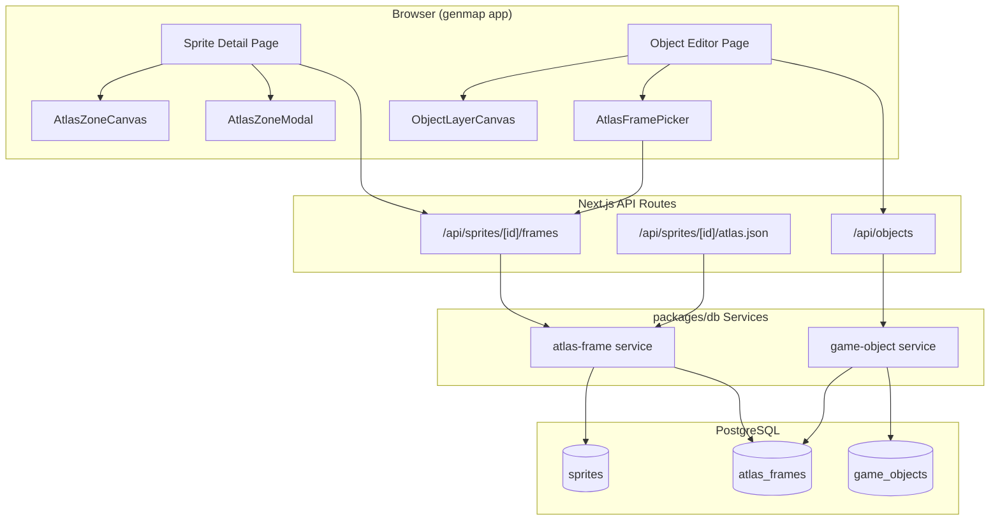
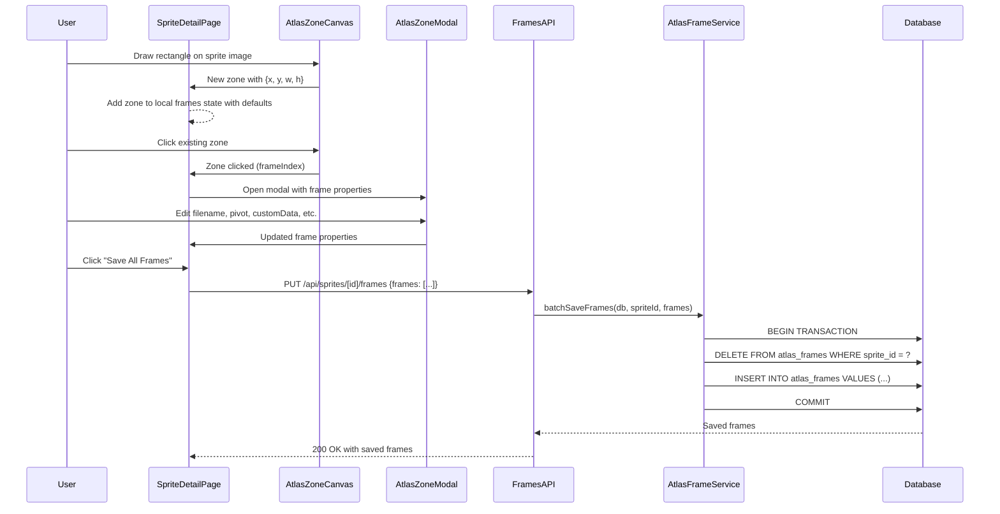
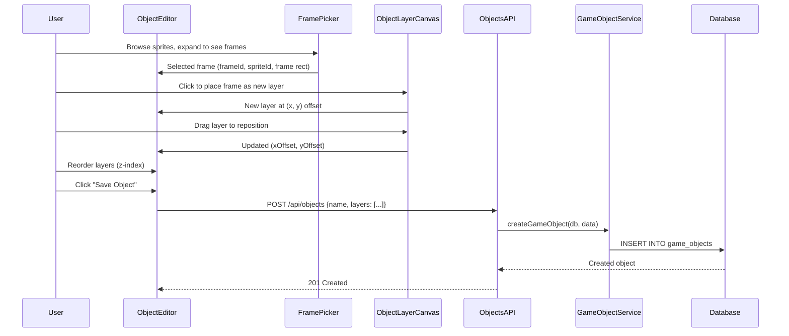

# Texture Atlas Refactor Design Document

## Overview

This document defines the technical design for refactoring the genmap sprite editor from a tile-grid workflow to a Phaser 3 Texture Atlas workflow. The change replaces fixed-size tile selection with free-form rectangular zone drawing, introduces a new `atlas_frames` table with full Phaser 3 atlas properties, drops the `tile_maps` and `tile_map_groups` tables, and rebuilds `game_objects` to compose objects from atlas frame layers with pixel-offset positioning.

## Design Summary (Meta)

```yaml
design_type: "refactoring"
risk_level: "medium"
complexity_level: "medium"
complexity_rationale: >
  (1) ACs require a destructive migration (dropping 2 tables, recreating 1), a new atlas_frames table
  with 10+ columns, replacement of the core sprite editor canvas component, a new zone-property
  modal, a new frame-picker sidebar, and a Phaser 3 atlas JSON export endpoint -- spanning database,
  API, and interactive UI domains.
  (2) Constraints: destructive migration with no rollback path; free-form rectangle drawing on
  canvas replaces grid-snapped interaction (different coordinate model); frame name uniqueness
  must be enforced per-sprite at DB level; object composition shifts from tile-grid to layered
  frame positioning with pixel offsets.
main_constraints:
  - "Clean destructive migration -- no data preservation needed"
  - "Frame names (filenames) must be unique per sprite (DB unique constraint)"
  - "All Phaser 3 atlas frame properties stored as typed columns (not JSONB blob)"
  - "customData stored as JSONB for extensible game-logic properties (passable, collisionRect)"
  - "Reuse existing getDb adapter and presigned URL patterns"
  - "sprites table unchanged"
biggest_risks:
  - "Destructive migration cannot be rolled back -- all tile map data lost"
  - "Free-form rectangle drawing introduces pixel-precision coordinate math vs tile-snapped"
  - "Object composition complexity increases (pixel offsets vs tile grid)"
unknowns:
  - "Optimal canvas UX for overlapping zone selection and editing"
  - "Whether batch save transaction performance is adequate for 100+ frames"
```

## Background and Context

### Prerequisite ADRs

- **ADR-0007: Sprite Management Storage and Schema** -- Established S3 presigned URL storage, JSONB metadata pattern, `getDb` adapter reuse. This refactor supersedes the tile-map portions of Decision 2 (schema) while preserving the S3 storage (Decision 1) and adapter (Decision 3) decisions.

### Agreement Checklist

#### Scope

- [x] Create new `atlas_frames` table with Phaser 3 properties as typed columns
- [x] Drop `tile_maps` and `tile_map_groups` tables
- [x] Recreate `game_objects` table with frame-layer composition schema
- [x] New API routes: `POST/PUT /api/sprites/[id]/frames` (batch save), `GET /api/sprites/[id]/frames`, `GET /api/sprites/[id]/atlas.json`
- [x] Updated `/api/objects` routes for new game object structure
- [x] Remove all tile-map and tile-map-group API routes and services
- [x] Replace `sprite-grid-canvas.tsx` with `atlas-zone-canvas.tsx` (free-form rectangle drawing)
- [x] New `atlas-zone-modal.tsx` (floating modal for zone properties)
- [x] New `atlas-frame-picker.tsx` (replaces `tile-picker.tsx` for object editor)
- [x] Update sprite detail page to use new atlas editor components
- [x] Update object editor pages (new/edit) for frame-layer composition
- [x] Update navigation (remove "Tile Maps" link)
- [x] Phaser 3 atlas JSON export endpoint

#### Non-Scope (Explicitly not changing)

- [x] `sprites` table schema -- kept as-is
- [x] Sprite upload flow (S3 presigned URLs) -- no changes
- [x] Sprite list page and sprite card components -- no changes
- [x] S3 client module (`apps/genmap/src/lib/s3.ts`) -- no changes
- [x] `packages/db/` core client and adapters -- no changes
- [x] Existing game tables (users, accounts, player_positions, maps) -- no changes
- [x] Authentication -- remains none (internal tool)

#### Constraints

- [x] Parallel operation: No (clean destructive migration)
- [x] Backward compatibility: Not required (internal tool, no data to preserve)
- [x] Performance measurement: Not required (internal single-user tool)

### Problem to Solve

The current tile-grid workflow forces sprite regions into fixed-size grid cells (e.g., 16x16, 32x32). This cannot represent arbitrarily-sized sprite frames needed for Phaser 3 texture atlases, where frames have variable dimensions, pivot points, trim data, and custom metadata. The tile-map concept is an intermediate step that does not map to Phaser's atlas format.

### Current Challenges

1. **Fixed tile sizes** -- Cannot define frames of arbitrary dimensions (e.g., a 24x48 character frame on a 16x16 grid)
2. **No Phaser 3 compatibility** -- Tile maps have no concept of `filename`, `pivot`, `rotated`, `trimmed`, `spriteSourceSize`, or `customData`
3. **No atlas JSON export** -- Cannot produce Phaser 3-loadable atlas JSON from current data
4. **Object composition limited to tile grid** -- Objects are composed on a fixed grid; cannot position frames at arbitrary pixel offsets
5. **No passability/collision data** -- No mechanism for per-frame game-logic properties

### Requirements

#### Functional Requirements

- FR1: Draw free-form rectangular zones on sprite images to define atlas frames
- FR2: Each frame stores all Phaser 3 atlas properties (filename, frame rect, rotated, trimmed, spriteSourceSize, sourceSize, pivot)
- FR3: Each frame stores extensible `customData` JSONB (passable boolean, collisionRect)
- FR4: Frame names (filenames) must be unique per sprite
- FR5: All frames for a sprite save at once (batch save)
- FR6: Click on a zone to open a floating modal with properties and delete option
- FR7: Export Phaser 3 compatible atlas JSON per sprite
- FR8: Objects composed of atlas frame layers with pixel offsets and layer ordering
- FR9: Frame picker sidebar in object editor shows frames grouped by sprite
- FR10: Drop tile_maps and tile_map_groups (tables, routes, services, UI)

#### Non-Functional Requirements

- **Performance**: Canvas rendering must remain responsive with up to 100 zones visible on a 2048x2048 sprite
- **Reliability**: Batch frame save uses a database transaction -- all frames save or none
- **Maintainability**: Atlas frame properties stored as typed columns (not opaque JSONB) for query and validation

## Acceptance Criteria (AC) - EARS Format

### FR1: Free-form Rectangle Zone Drawing

- [ ] **When** user clicks and drags on the sprite image, the system shall draw a rectangular zone overlay showing the selection in real time
- [ ] **When** user releases the mouse after dragging, the system shall create a new frame zone with the drawn rectangle coordinates
- [ ] The system shall display all existing frame zones as colored overlays on the sprite image
- [ ] **When** user presses Escape during a drag, the system shall cancel the zone creation

### FR2: Phaser 3 Frame Properties

- [ ] **When** a new zone is created, the system shall auto-populate `frame` {x, y, w, h} from the drawn rectangle coordinates
- [ ] **When** a new zone is created, the system shall set default values: `rotated: false`, `trimmed: false`, `spriteSourceSize` same as frame, `sourceSize` same as frame w/h, `pivot: {x: 0.5, y: 0.5}`
- [ ] **When** user edits frame properties in the modal, the system shall validate and store the updated values

### FR3: Custom Data (Passable/Collision)

- [ ] **When** user toggles the passable checkbox in the frame modal, the system shall store `passable: true/false` in `customData`
- [ ] **If** user defines a collision rectangle, **then** the system shall store `collisionRect: {x, y, w, h}` in `customData` with coordinates relative to the frame

### FR4: Frame Name Uniqueness

- [ ] **When** user attempts to save frames where two frames have the same filename for the same sprite, the system shall reject the save and display an error
- [ ] The system shall enforce frame name uniqueness per sprite at the database level via unique constraint

### FR5: Batch Save

- [ ] **When** user clicks Save, the system shall send all frames for the sprite in a single API request
- [ ] **If** the save succeeds, **then** all frames are persisted atomically (transaction)
- [ ] **If** any frame fails validation, **then** no frames are saved and the system shall display the validation error

### FR6: Zone Click and Modal

- [ ] **When** user clicks on an existing zone overlay, the system shall open a floating modal positioned near the click point
- [ ] The modal shall display all editable frame properties (filename, rotated, trimmed, spriteSourceSize, sourceSize, pivot, customData)
- [ ] **When** user clicks Delete in the modal, the system shall remove the zone from the editor (persisted on next batch save)

### FR7: Atlas JSON Export

- [ ] **When** `GET /api/sprites/[id]/atlas.json` is called, the system shall return a valid Phaser 3 JSON Array format atlas
- [ ] The exported JSON shall include all frames with their properties and the `meta` section with image URL and sprite dimensions
- [ ] **If** the sprite has no frames, **then** the system shall return an empty frames array

### FR8: Object Frame-Layer Composition

- [ ] **When** user selects a frame from the frame picker, the system shall add it as a new layer on the object canvas at position (0, 0)
- [ ] **When** user drags a layer on the canvas, the system shall update the layer's x/y pixel offset
- [ ] **When** user reorders layers, the system shall update the layerOrder values
- [ ] The system shall render all layers composited on the object canvas with correct offsets and z-ordering

### FR9: Frame Picker Sidebar

- [ ] The frame picker shall list all sprites that have at least one frame defined
- [ ] **When** user expands a sprite in the picker, the system shall display thumbnail previews of each frame
- [ ] **When** user clicks a frame thumbnail, the system shall set it as the active frame for placement

### FR10: Remove Tile Maps

- [ ] The system shall not have any tile-map or tile-map-group API routes after migration
- [ ] The navigation shall not display a "Tile Maps" link
- [ ] The database shall not contain `tile_maps` or `tile_map_groups` tables after migration

## Applicable Standards

### Classification Table

| Standard | Type | Source | Impact on Design |
|----------|------|--------|-----------------|
| Prettier: single quotes, 2-space indent | Explicit | `.prettierrc` | All new code follows this formatting |
| ESLint flat config with Nx module boundaries | Explicit | `eslint.config.mjs` | New files must respect module boundary rules |
| TypeScript strict mode, ES2022, bundler resolution | Explicit | `tsconfig.base.json` | All new types must be strict-safe, no implicit any |
| Drizzle ORM schema pattern (one file per table group) | Explicit | `packages/db/src/schema/*.ts` | New schema files follow existing naming and export pattern |
| `DrizzleClient` parameter convention for services | Implicit | `packages/db/src/services/*.ts` | All service functions accept `db: DrizzleClient` as first parameter |
| `getDb()` singleton import in API routes | Implicit | `apps/genmap/src/app/api/*/route.ts` | All routes call `getDb()` from `@nookstead/db` |
| Presigned URL pattern for S3 image URLs | Implicit | `apps/genmap/src/lib/sprite-url.ts` | Sprite image URLs use `withSignedUrl`/`withSignedUrls` |
| Canvas rendering with `requestAnimationFrame` loop | Implicit | `sprite-grid-canvas.tsx`, `object-grid-canvas.tsx` | New canvas component follows same render loop pattern |
| `'use client'` directive on interactive components | Implicit | All component files in `apps/genmap/src/components/` | New components with state/effects must use `'use client'` |

## Existing Codebase Analysis

### Implementation Path Mapping

| Type | Path | Description |
|------|------|-------------|
| Existing (KEEP) | `packages/db/src/schema/sprites.ts` | Sprites table schema -- unchanged |
| Existing (DROP) | `packages/db/src/schema/tile-maps.ts` | Tile maps schema -- to be deleted |
| Existing (DROP) | `packages/db/src/schema/tile-map-groups.ts` | Tile map groups schema -- to be deleted |
| Existing (RECREATE) | `packages/db/src/schema/game-objects.ts` | Game objects schema -- recreated with new structure |
| Existing (MODIFY) | `packages/db/src/schema/index.ts` | Schema barrel -- update exports |
| Existing (MODIFY) | `packages/db/src/index.ts` | DB barrel -- update exports |
| Existing (MODIFY) | `packages/db/src/services/sprite.ts` | Sprite service -- remove tile-map count, add frame count |
| Existing (DROP) | `packages/db/src/services/tile-map.ts` | Tile map service -- delete entirely |
| Existing (MODIFY) | `packages/db/src/services/game-object.ts` | Game object service -- rewrite for new schema |
| New | `packages/db/src/schema/atlas-frames.ts` | Atlas frames table schema |
| New | `packages/db/src/services/atlas-frame.ts` | Atlas frame service (CRUD, batch save) |
| New | `packages/db/src/migrations/0004_*.sql` | Destructive migration SQL |
| Existing (DROP) | `apps/genmap/src/app/api/tile-maps/route.ts` | Tile maps API -- delete |
| Existing (DROP) | `apps/genmap/src/app/api/tile-maps/[id]/route.ts` | Tile map detail API -- delete |
| Existing (DROP) | `apps/genmap/src/app/api/tile-map-groups/route.ts` | Groups API -- delete |
| Existing (DROP) | `apps/genmap/src/app/api/tile-map-groups/[id]/route.ts` | Group detail API -- delete |
| Existing (DROP) | `apps/genmap/src/app/api/sprites/[id]/tile-maps/route.ts` | Sprite tile maps API -- delete |
| Existing (MODIFY) | `apps/genmap/src/app/api/sprites/[id]/references/route.ts` | References API -- update to count frames instead of tile maps |
| Existing (MODIFY) | `apps/genmap/src/app/api/objects/route.ts` | Objects list/create API -- update for new schema |
| Existing (MODIFY) | `apps/genmap/src/app/api/objects/[id]/route.ts` | Object detail API -- update for new schema |
| New | `apps/genmap/src/app/api/sprites/[id]/frames/route.ts` | Batch save/get frames API |
| New | `apps/genmap/src/app/api/sprites/[id]/atlas.json/route.ts` | Atlas JSON export API |
| Existing (REPLACE) | `apps/genmap/src/components/sprite-grid-canvas.tsx` | Replaced by atlas-zone-canvas.tsx |
| Existing (DROP) | `apps/genmap/src/components/tile-picker.tsx` | Replaced by atlas-frame-picker.tsx |
| New | `apps/genmap/src/components/atlas-zone-canvas.tsx` | Free-form zone drawing canvas |
| New | `apps/genmap/src/components/atlas-zone-modal.tsx` | Floating modal for zone properties |
| New | `apps/genmap/src/components/atlas-frame-picker.tsx` | Frame picker sidebar for object editor |
| Existing (MODIFY) | `apps/genmap/src/app/sprites/[id]/page.tsx` | Sprite detail page -- replace tile-map editor with atlas editor |
| Existing (MODIFY) | `apps/genmap/src/app/objects/new/page.tsx` | Object creation -- use frame layers |
| Existing (MODIFY) | `apps/genmap/src/app/objects/[id]/page.tsx` | Object edit -- use frame layers |
| Existing (MODIFY) | `apps/genmap/src/components/navigation.tsx` | Remove "Tile Maps" nav item |
| Existing (DROP) | `apps/genmap/src/app/tile-maps/page.tsx` | Tile maps list page -- delete |
| Existing (DROP) | `apps/genmap/src/app/tile-maps/[id]/page.tsx` | Tile map detail page -- delete |
| Existing (DROP) | `apps/genmap/src/components/group-selector.tsx` | Group selector component -- delete |
| Existing (DROP) | `apps/genmap/src/components/group-manager.tsx` | Group manager component -- delete |
| Existing (MODIFY) | `apps/genmap/src/components/object-grid-canvas.tsx` | Replace tile-grid with frame-layer composition canvas |

### Code Inspection Evidence

| File Inspected | Key Finding | Design Impact |
|---------------|-------------|---------------|
| `packages/db/src/services/sprite.ts:60-69` | `countTileMapsBySprite` queries `tileMaps` table | Must replace with `countFramesBySprite` querying `atlasFrames` |
| `packages/db/src/services/sprite.ts:71-81` | `findGameObjectsReferencingSprite` uses JSONB `@>` operator on `gameObjects.tiles` | Must update to query new `game_object_layers` JSONB structure |
| `packages/db/src/services/tile-map.ts` | 131 lines of tile-map CRUD + group CRUD | Entire file deleted; replaced by `atlas-frame.ts` service |
| `packages/db/src/services/game-object.ts:26-32` | `TileReference` interface with `spriteId, col, row, tileCol, tileRow` | Replaced by `FrameLayerReference` with `frameId, spriteId, xOffset, yOffset, layerOrder` |
| `packages/db/src/services/game-object.ts:88-106` | `validateTileReferences` validates sprite IDs | Replaced by `validateFrameReferences` validating frame IDs exist in `atlas_frames` |
| `packages/db/src/index.ts:32-47` | Exports tile-map service functions | Remove all tile-map exports, add atlas-frame exports |
| `apps/genmap/src/components/sprite-grid-canvas.tsx` | 468 lines, grid-snapped coordinate model with `tileWidth/tileHeight` | Replaced by `atlas-zone-canvas.tsx` with pixel-coordinate model |
| `apps/genmap/src/components/tile-picker.tsx` | Fetches tile maps, renders tile thumbnails via canvas | Replaced by `atlas-frame-picker.tsx` fetching frames, rendering frame region thumbnails |
| `apps/genmap/src/components/object-grid-canvas.tsx:10-17` | `TilePlacement` interface with sprite tile coordinates | Replaced by `FramePlacement` with frameId, spriteId, xOffset, yOffset |
| `apps/genmap/src/hooks/use-marquee-selection.ts` | 249 lines, grid-snapped marquee selection | Reused concept but adapted for pixel-coordinate rectangle drawing |
| `apps/genmap/src/app/sprites/[id]/page.tsx:120-154` | `handleSaveTileMap` POSTs to `/api/tile-maps` | Replaced by `handleSaveFrames` posting all frames to `/api/sprites/[id]/frames` |
| `apps/genmap/src/components/navigation.tsx:8-12` | `navItems` array includes `{ href: '/tile-maps', label: 'Tile Maps' }` | Remove tile-maps nav item |

### Similar Functionality Search

Searched for "atlas", "frame", "zone", "rectangle selection" in existing codebase:
- No existing atlas or frame functionality found -- this is new functionality
- The `useMarqueeSelection` hook provides rectangle-drawing mechanics that can be adapted (not reused directly, since it uses grid-snapped coordinates)

Decision: **New implementation** for atlas-specific components, adapting patterns from existing canvas components.

## Design

### Change Impact Map

```yaml
Change Target: Sprite editor workflow (tile-grid -> texture atlas)
Direct Impact:
  - packages/db/src/schema/tile-maps.ts (DELETE)
  - packages/db/src/schema/tile-map-groups.ts (DELETE)
  - packages/db/src/schema/game-objects.ts (RECREATE)
  - packages/db/src/schema/index.ts (UPDATE exports)
  - packages/db/src/index.ts (UPDATE exports)
  - packages/db/src/services/tile-map.ts (DELETE)
  - packages/db/src/services/sprite.ts (MODIFY -- replace tile-map references)
  - packages/db/src/services/game-object.ts (REWRITE)
  - apps/genmap/src/app/api/tile-maps/ (DELETE directory)
  - apps/genmap/src/app/api/tile-map-groups/ (DELETE directory)
  - apps/genmap/src/app/api/sprites/[id]/tile-maps/ (DELETE)
  - apps/genmap/src/app/api/sprites/[id]/references/route.ts (MODIFY)
  - apps/genmap/src/app/api/objects/route.ts (MODIFY)
  - apps/genmap/src/app/api/objects/[id]/route.ts (MODIFY)
  - apps/genmap/src/components/sprite-grid-canvas.tsx (REPLACE)
  - apps/genmap/src/components/tile-picker.tsx (REPLACE)
  - apps/genmap/src/components/object-grid-canvas.tsx (REWRITE)
  - apps/genmap/src/app/sprites/[id]/page.tsx (REWRITE)
  - apps/genmap/src/app/objects/new/page.tsx (REWRITE)
  - apps/genmap/src/app/objects/[id]/page.tsx (REWRITE)
  - apps/genmap/src/app/tile-maps/ (DELETE directory)
  - apps/genmap/src/components/navigation.tsx (MODIFY)
  - apps/genmap/src/components/group-selector.tsx (DELETE)
  - apps/genmap/src/components/group-manager.tsx (DELETE)
Indirect Impact:
  - apps/genmap/src/hooks/use-game-objects.ts (MAY need type updates)
  - apps/genmap/src/components/object-preview.tsx (UPDATE for new tile format)
  - apps/genmap/src/app/api/sprites/[id]/route.ts (MAY need cascade update for frames)
No Ripple Effect:
  - packages/db/src/schema/sprites.ts (unchanged)
  - packages/db/src/adapters/ (unchanged)
  - packages/db/src/core/ (unchanged)
  - apps/genmap/src/lib/s3.ts (unchanged)
  - apps/genmap/src/lib/sprite-url.ts (unchanged)
  - apps/genmap/src/lib/canvas-utils.ts (may add helpers, base unchanged)
  - apps/genmap/src/hooks/use-sprites.ts (unchanged)
  - apps/genmap/src/app/sprites/page.tsx (unchanged)
  - apps/genmap/src/components/sprite-upload-form.tsx (unchanged)
  - apps/game/ (completely unaffected)
  - apps/server/ (completely unaffected)
  - packages/shared/ (completely unaffected)
```

### Architecture Overview



### Data Flow

#### Frame Creation Flow



#### Object Composition Flow



### Integration Points List

| Integration Point | Location | Old Implementation | New Implementation | Switching Method |
|-------------------|----------|-------------------|-------------------|------------------|
| Sprite detail editor | `sprites/[id]/page.tsx` | `SpriteGridCanvas` + tile size selector + tile map save | `AtlasZoneCanvas` + `AtlasZoneModal` + batch frame save | Full component replacement |
| Object editor tile source | `objects/new/page.tsx`, `objects/[id]/page.tsx` | `TilePicker` (fetches tile maps) | `AtlasFramePicker` (fetches atlas frames) | Full component replacement |
| Object canvas | `object-grid-canvas.tsx` | Grid-based tile placement | Layer-based frame composition | Full component rewrite |
| Sprite references check | `sprites/[id]/references/route.ts` | Counts tile maps, finds JSONB sprite refs | Counts atlas frames, finds frame layer refs | Update query logic |
| Navigation | `navigation.tsx` | `[Sprites, Tile Maps, Objects]` | `[Sprites, Objects]` | Remove array entry |
| DB schema exports | `packages/db/src/schema/index.ts` | Exports tile-maps, tile-map-groups, game-objects | Exports atlas-frames, game-objects (new) | Update barrel file |
| DB service exports | `packages/db/src/index.ts` | Exports tile-map service, game-object service | Exports atlas-frame service, game-object service (new) | Update barrel file |

### Integration Point Map

```yaml
Integration Point 1:
  Existing Component: Sprite Detail Page -> SpriteGridCanvas
  Integration Method: Component replacement (SpriteGridCanvas -> AtlasZoneCanvas)
  Impact Level: High (Process Flow Change)
  Required Test Coverage: Verify zone drawing, zone click, modal open/close, batch save round-trip

Integration Point 2:
  Existing Component: Object Editor Pages -> TilePicker + ObjectGridCanvas
  Integration Method: Component replacement (TilePicker -> AtlasFramePicker, ObjectGridCanvas rewrite)
  Impact Level: High (Process Flow Change)
  Required Test Coverage: Verify frame selection, layer placement, layer reorder, object save round-trip

Integration Point 3:
  Existing Component: packages/db/src/services/sprite.ts -> countTileMapsBySprite
  Integration Method: Function replacement (countTileMapsBySprite -> countFramesBySprite)
  Impact Level: Medium (Data Usage)
  Required Test Coverage: Unit test new count function

Integration Point 4:
  Existing Component: Navigation -> navItems array
  Integration Method: Array entry removal
  Impact Level: Low (Read-Only)
  Required Test Coverage: Visual verification that Tile Maps link is absent
```

### Main Components

#### Component 1: `atlas_frames` Table and Service

- **Responsibility**: Store and manage Phaser 3 atlas frame definitions per sprite
- **Interface**: `batchSaveFrames(db, spriteId, frames[])`, `getFramesBySprite(db, spriteId)`, `getAtlasJson(db, spriteId)`, `countFramesBySprite(db, spriteId)`, `deleteFramesBySprite(db, spriteId)`
- **Dependencies**: `sprites` table (FK), `DrizzleClient`

#### Component 2: `AtlasZoneCanvas`

- **Responsibility**: Render sprite image with zone overlays, handle free-form rectangle drawing and zone click detection
- **Interface**: Props: `imageUrl`, `zones[]`, `onZoneCreate(rect)`, `onZoneClick(index)`, `background`
- **Dependencies**: `canvas-utils.ts`, HTML5 Canvas API

#### Component 3: `AtlasZoneModal`

- **Responsibility**: Display and edit frame properties in a floating modal anchored near the clicked zone
- **Interface**: Props: `frame`, `onUpdate(frame)`, `onDelete()`, `onClose()`, `position: {x, y}`
- **Dependencies**: shadcn/ui Dialog/Card components

#### Component 4: `AtlasFramePicker`

- **Responsibility**: Display available atlas frames grouped by sprite, allow selection for object composition
- **Interface**: Props: `activeFrame`, `onFrameSelect(frame)`
- **Dependencies**: Sprite and frame API endpoints

#### Component 5: Redesigned `game_objects` Table and Service

- **Responsibility**: Store game objects with frame-layer composition
- **Interface**: `createGameObject(db, data)`, `getGameObject(db, id)`, `listGameObjects(db, params)`, `updateGameObject(db, id, data)`, `deleteGameObject(db, id)`, `validateFrameReferences(db, layers[])`
- **Dependencies**: `atlas_frames` table, `sprites` table, `DrizzleClient`

### Contract Definitions

#### Atlas Frame (Database Row -> API Response)

```typescript
interface AtlasFrame {
  id: string;           // uuid PK
  spriteId: string;     // uuid FK -> sprites
  filename: string;     // unique per sprite, used as Phaser atlas key
  frameX: number;       // x position in sprite image
  frameY: number;       // y position in sprite image
  frameW: number;       // width in sprite image
  frameH: number;       // height in sprite image
  rotated: boolean;     // default false
  trimmed: boolean;     // default false
  spriteSourceSizeX: number;  // default 0 (offset within source; 0 when not trimmed)
  spriteSourceSizeY: number;  // default 0 (offset within source; 0 when not trimmed)
  spriteSourceSizeW: number;  // default same as frameW
  spriteSourceSizeH: number;  // default same as frameH
  sourceSizeW: number;        // default same as frameW
  sourceSizeH: number;        // default same as frameH
  pivotX: number;       // default 0.5 (decimal)
  pivotY: number;       // default 0.5 (decimal)
  customData: Record<string, unknown> | null;  // JSONB: {passable, collisionRect, ...}
  createdAt: Date;
  updatedAt: Date;
}
```

#### Batch Save Request

```typescript
interface BatchSaveFramesRequest {
  frames: Array<{
    filename: string;
    frameX: number;
    frameY: number;
    frameW: number;
    frameH: number;
    rotated?: boolean;
    trimmed?: boolean;
    spriteSourceSizeX?: number;
    spriteSourceSizeY?: number;
    spriteSourceSizeW?: number;
    spriteSourceSizeH?: number;
    sourceSizeW?: number;
    sourceSizeH?: number;
    pivotX?: number;
    pivotY?: number;
    customData?: Record<string, unknown> | null;
  }>;
}
```

#### Game Object (New Schema)

```typescript
interface GameObject {
  id: string;
  name: string;
  description: string | null;
  layers: GameObjectLayer[];  // JSONB
  tags: string[] | null;      // JSONB
  metadata: Record<string, unknown> | null;  // JSONB
  createdAt: Date;
  updatedAt: Date;
}

interface GameObjectLayer {
  frameId: string;    // uuid reference to atlas_frames.id
  spriteId: string;   // uuid reference to sprites.id (denormalized for rendering)
  xOffset: number;    // pixel offset from object origin
  yOffset: number;    // pixel offset from object origin
  layerOrder: number; // z-index (0 = bottom)
}
```

#### Phaser 3 Atlas JSON Export

```typescript
interface PhaserAtlasJson {
  frames: Array<{
    filename: string;
    frame: { x: number; y: number; w: number; h: number };
    rotated: boolean;
    trimmed: boolean;
    spriteSourceSize: { x: number; y: number; w: number; h: number };
    sourceSize: { w: number; h: number };
    pivot: { x: number; y: number };
    customData?: Record<string, unknown>;
  }>;
  meta: {
    app: string;    // "nookstead-genmap"
    version: string; // "1.0"
    image: string;  // sprite S3 URL
    format: string; // "RGBA8888"
    size: { w: number; h: number };
    scale: string;  // "1"
  };
}
```

### Data Contract

#### Batch Save Frames API (`PUT /api/sprites/[id]/frames`)

```yaml
Input:
  Type: BatchSaveFramesRequest (JSON body)
  Preconditions:
    - Sprite with given ID must exist
    - frames array can be empty (clears all frames for the sprite)
    - Each frame.filename must be non-empty string
    - Each frame.filename must be unique within the request
    - Frame coordinates must be non-negative integers
    - Frame dimensions (w, h) must be positive integers
    - Frame rect must fit within sprite image dimensions
    - pivot values must be between 0 and 1
  Validation: Server-side validation in API route before service call

Output:
  Type: AtlasFrame[] (JSON array of saved frames)
  Guarantees:
    - All frames saved atomically (transaction)
    - Frame IDs are newly generated UUIDs (existing frames for sprite are replaced)
    - Timestamps set to current time
  On Error:
    - 404 if sprite not found
    - 400 if validation fails (with error message)
    - 500 if transaction fails (no frames saved)

Invariants:
  - After successful save, atlas_frames for this sprite contains exactly the frames in the request
  - Frame filenames are unique per sprite (DB constraint)
```

#### Atlas JSON Export (`GET /api/sprites/[id]/atlas.json`)

```yaml
Input:
  Type: URL path parameter (sprite ID)
  Preconditions: Sprite with given ID must exist

Output:
  Type: PhaserAtlasJson
  Guarantees:
    - Valid Phaser 3 JSON Array format
    - All frames for the sprite included
    - meta.image contains presigned S3 URL
    - meta.size matches sprite dimensions
  On Error:
    - 404 if sprite not found

Invariants:
  - Export is read-only; does not modify any data
```

### Integration Boundary Contracts

```yaml
Boundary 1: Browser -> Frames API
  Input: JSON body with frames array
  Output: Sync JSON response with saved frames or error
  On Error: HTTP 400/404/500 with {error: string} body

Boundary 2: Browser -> Atlas JSON API
  Input: Sprite ID in URL path
  Output: Sync JSON response in Phaser 3 atlas format
  On Error: HTTP 404 with {error: string} body

Boundary 3: Browser -> Objects API
  Input: JSON body with name, layers array
  Output: Sync JSON response with saved game object
  On Error: HTTP 400/404/500 with {error: string} body

Boundary 4: Frames API -> AtlasFrameService
  Input: DrizzleClient, spriteId string, frames array
  Output: Async Promise<AtlasFrame[]>
  On Error: Throws error (transaction rolled back)

Boundary 5: Objects API -> GameObjectService
  Input: DrizzleClient, game object data with layers
  Output: Async Promise<GameObject>
  On Error: Throws error
```

### Database Schema Design

#### `atlas_frames` Table (NEW)

```typescript
// packages/db/src/schema/atlas-frames.ts
import {
  boolean,
  integer,
  jsonb,
  pgTable,
  real,
  text,
  timestamp,
  unique,
  uuid,
  varchar,
} from 'drizzle-orm/pg-core';
import { relations } from 'drizzle-orm';
import { sprites } from './sprites';

export const atlasFrames = pgTable(
  'atlas_frames',
  {
    id: uuid('id').defaultRandom().primaryKey(),
    spriteId: uuid('sprite_id')
      .notNull()
      .references(() => sprites.id, { onDelete: 'cascade' }),
    filename: varchar('filename', { length: 255 }).notNull(),
    frameX: integer('frame_x').notNull(),
    frameY: integer('frame_y').notNull(),
    frameW: integer('frame_w').notNull(),
    frameH: integer('frame_h').notNull(),
    rotated: boolean('rotated').notNull().default(false),
    trimmed: boolean('trimmed').notNull().default(false),
    spriteSourceSizeX: integer('sprite_source_size_x').notNull().default(0),
    spriteSourceSizeY: integer('sprite_source_size_y').notNull().default(0),
    spriteSourceSizeW: integer('sprite_source_size_w'),
    spriteSourceSizeH: integer('sprite_source_size_h'),
    sourceSizeW: integer('source_size_w'),
    sourceSizeH: integer('source_size_h'),
    pivotX: real('pivot_x').notNull().default(0.5),
    pivotY: real('pivot_y').notNull().default(0.5),
    customData: jsonb('custom_data'),
    createdAt: timestamp('created_at', { withTimezone: true })
      .defaultNow()
      .notNull(),
    updatedAt: timestamp('updated_at', { withTimezone: true })
      .defaultNow()
      .notNull(),
  },
  (table) => [
    unique('atlas_frames_sprite_filename_unique').on(
      table.spriteId,
      table.filename
    ),
  ]
);

export const atlasFramesRelations = relations(atlasFrames, ({ one }) => ({
  sprite: one(sprites, {
    fields: [atlasFrames.spriteId],
    references: [sprites.id],
  }),
}));

export type AtlasFrame = typeof atlasFrames.$inferSelect;
export type NewAtlasFrame = typeof atlasFrames.$inferInsert;
```

#### `game_objects` Table (RECREATED)

```typescript
// packages/db/src/schema/game-objects.ts (rewritten)
import {
  jsonb,
  pgTable,
  text,
  timestamp,
  uuid,
  varchar,
} from 'drizzle-orm/pg-core';

export const gameObjects = pgTable('game_objects', {
  id: uuid('id').defaultRandom().primaryKey(),
  name: varchar('name', { length: 255 }).notNull(),
  description: text('description'),
  layers: jsonb('layers').notNull(),  // GameObjectLayer[]
  tags: jsonb('tags'),                // string[]
  metadata: jsonb('metadata'),        // Record<string, unknown>
  createdAt: timestamp('created_at', { withTimezone: true })
    .defaultNow()
    .notNull(),
  updatedAt: timestamp('updated_at', { withTimezone: true })
    .defaultNow()
    .notNull(),
});

export type GameObject = typeof gameObjects.$inferSelect;
export type NewGameObject = typeof gameObjects.$inferInsert;
```

#### Migration SQL

```sql
-- 0004_texture_atlas_refactor.sql

-- Drop old tables
DROP TABLE IF EXISTS "tile_maps" CASCADE;
DROP TABLE IF EXISTS "tile_map_groups" CASCADE;
DROP TABLE IF EXISTS "game_objects" CASCADE;

-- Create atlas_frames table
CREATE TABLE "atlas_frames" (
  "id" uuid PRIMARY KEY DEFAULT gen_random_uuid() NOT NULL,
  "sprite_id" uuid NOT NULL REFERENCES "sprites"("id") ON DELETE CASCADE,
  "filename" varchar(255) NOT NULL,
  "frame_x" integer NOT NULL,
  "frame_y" integer NOT NULL,
  "frame_w" integer NOT NULL,
  "frame_h" integer NOT NULL,
  "rotated" boolean NOT NULL DEFAULT false,
  "trimmed" boolean NOT NULL DEFAULT false,
  "sprite_source_size_x" integer NOT NULL DEFAULT 0,
  "sprite_source_size_y" integer NOT NULL DEFAULT 0,
  "sprite_source_size_w" integer,
  "sprite_source_size_h" integer,
  "source_size_w" integer,
  "source_size_h" integer,
  "pivot_x" real NOT NULL DEFAULT 0.5,
  "pivot_y" real NOT NULL DEFAULT 0.5,
  "custom_data" jsonb,
  "created_at" timestamp with time zone DEFAULT now() NOT NULL,
  "updated_at" timestamp with time zone DEFAULT now() NOT NULL,
  CONSTRAINT "atlas_frames_sprite_filename_unique" UNIQUE("sprite_id", "filename")
);

-- Create new game_objects table
CREATE TABLE "game_objects" (
  "id" uuid PRIMARY KEY DEFAULT gen_random_uuid() NOT NULL,
  "name" varchar(255) NOT NULL,
  "description" text,
  "layers" jsonb NOT NULL,
  "tags" jsonb,
  "metadata" jsonb,
  "created_at" timestamp with time zone DEFAULT now() NOT NULL,
  "updated_at" timestamp with time zone DEFAULT now() NOT NULL
);
```

### Data Representation Decisions

| Data Structure | Decision | Rationale |
|---|---|---|
| `atlas_frames` | **New** dedicated table | No existing type matches Phaser 3 atlas frame structure. Tile map coordinates ({col, row} in JSONB) have no overlap with atlas frame properties (filename, rect, pivot, trim, etc.). Typed columns chosen over JSONB to enable DB-level validation and querying. |
| `game_objects.layers` | **New** JSONB structure replacing `tiles` | Old `tiles` JSONB stored `{spriteId, col, row, tileCol, tileRow}` -- incompatible with new `{frameId, spriteId, xOffset, yOffset, layerOrder}` structure. <80% field overlap with old format. Clean replacement justified. |
| `game_objects.tags` | **Reuse** existing JSONB pattern | Same `string[]` JSONB pattern as before. No change needed. |
| `game_objects.metadata` | **Reuse** existing JSONB pattern | Same `Record<string, unknown>` JSONB pattern as before. No change needed. |

### Field Propagation Map

```yaml
fields:
  - name: "frameX/frameY/frameW/frameH"
    origin: "User draws rectangle on AtlasZoneCanvas"
    transformations:
      - layer: "UI (AtlasZoneCanvas)"
        type: "local state {x, y, w, h} in pixels"
        validation: "non-negative, within sprite bounds"
      - layer: "API Route (/api/sprites/[id]/frames)"
        type: "BatchSaveFramesRequest.frames[].frameX/Y/W/H"
        validation: "integer, positive w/h, within sprite dimensions"
        transformation: "none (pass-through)"
      - layer: "Service (atlas-frame.ts)"
        type: "NewAtlasFrame insert values"
        transformation: "none (pass-through)"
      - layer: "Database (atlas_frames table)"
        type: "integer columns frame_x, frame_y, frame_w, frame_h"
        transformation: "none (stored as-is)"
    destination: "atlas_frames.frame_x/y/w/h columns"
    loss_risk: "none"

  - name: "filename"
    origin: "User enters in AtlasZoneModal text input"
    transformations:
      - layer: "UI (AtlasZoneModal)"
        type: "string input"
        validation: "non-empty, no duplicate within sprite"
      - layer: "API Route"
        type: "string in request body"
        validation: "non-empty string, trimmed, max 255 chars"
        transformation: "trimmed"
      - layer: "Database"
        type: "varchar(255) with unique constraint per sprite"
        transformation: "none"
    destination: "atlas_frames.filename"
    loss_risk: "none"

  - name: "customData (passable, collisionRect)"
    origin: "User toggles checkbox / enters rect values in AtlasZoneModal"
    transformations:
      - layer: "UI (AtlasZoneModal)"
        type: "{ passable: boolean, collisionRect?: {x,y,w,h} }"
        validation: "boolean for passable; rect coords non-negative if provided"
      - layer: "API Route"
        type: "JSONB object in request body"
        validation: "must be object or null"
        transformation: "none (pass-through)"
      - layer: "Database"
        type: "jsonb column custom_data"
        transformation: "none"
    destination: "atlas_frames.custom_data"
    loss_risk: "none"

  - name: "layers (frameId, spriteId, xOffset, yOffset, layerOrder)"
    origin: "User places frames on ObjectLayerCanvas"
    transformations:
      - layer: "UI (ObjectEditor)"
        type: "GameObjectLayer[] in local state"
        validation: "frameId must reference valid frame, offsets are integers"
      - layer: "API Route (/api/objects)"
        type: "JSONB array in request body"
        validation: "array of layer objects, frameIds validated against DB"
        transformation: "none"
      - layer: "Database (game_objects table)"
        type: "jsonb column layers"
        transformation: "none"
    destination: "game_objects.layers"
    loss_risk: "low"
    loss_risk_reason: "Frame deletion could leave stale frameId references in layers JSONB (same pattern as old tile sprite references). Handled at application level."
```

### API Design

#### `PUT /api/sprites/[id]/frames` -- Batch Save Frames

Replaces all frames for a sprite with the provided set. Uses delete-then-insert within a transaction.

```typescript
// apps/genmap/src/app/api/sprites/[id]/frames/route.ts
export async function PUT(
  request: NextRequest,
  { params }: { params: Promise<{ id: string }> }
) {
  const { id } = await params;
  const db = getDb();
  const sprite = await getSprite(db, id);
  if (!sprite) {
    return NextResponse.json({ error: 'Sprite not found' }, { status: 404 });
  }

  const body = await request.json();
  const { frames } = body;

  // Validate frames array
  if (!Array.isArray(frames)) {
    return NextResponse.json(
      { error: 'frames must be an array' },
      { status: 400 }
    );
  }

  // Allow empty array to clear all frames
  if (frames.length === 0) {
    await deleteFramesBySprite(db, id);
    return NextResponse.json([]);
  }

  // Validate uniqueness of filenames
  const filenames = frames.map((f: { filename: string }) => f.filename);
  if (new Set(filenames).size !== filenames.length) {
    return NextResponse.json(
      { error: 'Frame filenames must be unique within a sprite' },
      { status: 400 }
    );
  }

  // Validate each frame
  for (const frame of frames) {
    if (!frame.filename || typeof frame.filename !== 'string') {
      return NextResponse.json(
        { error: 'Each frame must have a non-empty filename' },
        { status: 400 }
      );
    }
    // Validate frame rect within sprite bounds
    if (frame.frameX + frame.frameW > sprite.width ||
        frame.frameY + frame.frameH > sprite.height) {
      return NextResponse.json(
        { error: `Frame "${frame.filename}" extends beyond sprite dimensions` },
        { status: 400 }
      );
    }
  }

  // Populate defaults for optional fields
  const normalizedFrames = frames.map((f: BatchSaveFramesRequest['frames'][0]) => ({
    ...f,
    rotated: f.rotated ?? false,
    trimmed: f.trimmed ?? false,
    spriteSourceSizeX: f.spriteSourceSizeX ?? 0,
    spriteSourceSizeY: f.spriteSourceSizeY ?? 0,
    spriteSourceSizeW: f.spriteSourceSizeW ?? f.frameW,
    spriteSourceSizeH: f.spriteSourceSizeH ?? f.frameH,
    sourceSizeW: f.sourceSizeW ?? f.frameW,
    sourceSizeH: f.sourceSizeH ?? f.frameH,
    pivotX: f.pivotX ?? 0.5,
    pivotY: f.pivotY ?? 0.5,
  }));

  const saved = await batchSaveFrames(db, id, normalizedFrames);
  return NextResponse.json(saved);
}
```

#### `GET /api/sprites/[id]/frames` -- Get Frames

```typescript
export async function GET(
  request: NextRequest,
  { params }: { params: Promise<{ id: string }> }
) {
  const { id } = await params;
  const db = getDb();
  const sprite = await getSprite(db, id);
  if (!sprite) {
    return NextResponse.json({ error: 'Sprite not found' }, { status: 404 });
  }
  const frames = await getFramesBySprite(db, id);
  return NextResponse.json(frames);
}
```

#### `GET /api/sprites/[id]/atlas.json` -- Atlas JSON Export

```typescript
// apps/genmap/src/app/api/sprites/[id]/atlas.json/route.ts
export async function GET(
  request: NextRequest,
  { params }: { params: Promise<{ id: string }> }
) {
  const { id } = await params;
  const db = getDb();
  const sprite = await getSprite(db, id);
  if (!sprite) {
    return NextResponse.json({ error: 'Sprite not found' }, { status: 404 });
  }

  const signedSprite = await withSignedUrl(sprite);
  const frames = await getFramesBySprite(db, id);

  const atlasJson = {
    frames: frames.map((f) => ({
      filename: f.filename,
      frame: { x: f.frameX, y: f.frameY, w: f.frameW, h: f.frameH },
      rotated: f.rotated,
      trimmed: f.trimmed,
      spriteSourceSize: {
        x: f.spriteSourceSizeX,
        y: f.spriteSourceSizeY,
        w: f.spriteSourceSizeW,
        h: f.spriteSourceSizeH,
      },
      sourceSize: { w: f.sourceSizeW, h: f.sourceSizeH },
      pivot: { x: f.pivotX, y: f.pivotY },
      ...(f.customData ? { customData: f.customData } : {}),
    })),
    meta: {
      app: 'nookstead-genmap',
      version: '1.0',
      image: signedSprite.s3Url,
      format: 'RGBA8888',
      size: { w: sprite.width, h: sprite.height },
      scale: '1',
    },
  };

  return NextResponse.json(atlasJson);
}
```

#### Updated `/api/objects` -- Frame-Layer Composition

```typescript
// POST /api/objects (updated)
export async function POST(request: NextRequest) {
  const body = await request.json();
  const { name, description, layers, tags, metadata } = body;

  if (!name || typeof name !== 'string' || name.trim() === '') {
    return NextResponse.json({ error: 'name is required' }, { status: 400 });
  }
  if (!Array.isArray(layers)) {
    return NextResponse.json(
      { error: 'layers must be an array' },
      { status: 400 }
    );
  }

  const db = getDb();

  if (layers.length > 0) {
    const invalidIds = await validateFrameReferences(db, layers);
    if (invalidIds.length > 0) {
      return NextResponse.json(
        { error: 'Invalid frame references', invalidFrameIds: invalidIds },
        { status: 400 }
      );
    }
  }

  const obj = await createGameObject(db, {
    name: name.trim(),
    description: description ?? null,
    layers,
    tags: tags ?? null,
    metadata: metadata ?? null,
  });

  return NextResponse.json(obj, { status: 201 });
}
```

#### Routes to Remove

- `DELETE apps/genmap/src/app/api/tile-maps/route.ts`
- `DELETE apps/genmap/src/app/api/tile-maps/[id]/route.ts`
- `DELETE apps/genmap/src/app/api/tile-map-groups/route.ts`
- `DELETE apps/genmap/src/app/api/tile-map-groups/[id]/route.ts`
- `DELETE apps/genmap/src/app/api/sprites/[id]/tile-maps/route.ts`

### Interface Change Impact Analysis

| Existing Operation | New Operation | Conversion Required | Adapter Required | Compatibility Method |
|-------------------|---------------|-------------------|------------------|---------------------|
| `createTileMap(db, data)` | Removed | N/A | Not Required | Deleted |
| `getTileMap(db, id)` | Removed | N/A | Not Required | Deleted |
| `listTileMaps(db, params)` | Removed | N/A | Not Required | Deleted |
| `updateTileMap(db, id, data)` | Removed | N/A | Not Required | Deleted |
| `deleteTileMap(db, id)` | Removed | N/A | Not Required | Deleted |
| `createGroup(db, data)` | Removed | N/A | Not Required | Deleted |
| `listGroups(db)` | Removed | N/A | Not Required | Deleted |
| `updateGroup(db, id, data)` | Removed | N/A | Not Required | Deleted |
| `deleteGroup(db, id)` | Removed | N/A | Not Required | Deleted |
| `listTileMapsBySpriteId(db, spriteId)` | `getFramesBySprite(db, spriteId)` | Yes | Not Required | Direct replacement |
| `countTileMapsBySprite(db, spriteId)` | `countFramesBySprite(db, spriteId)` | Yes | Not Required | Direct replacement |
| `findGameObjectsReferencingSprite(db, spriteId)` | `findGameObjectsReferencingSprite(db, spriteId)` (updated query) | Yes | Not Required | Update JSONB query |
| `createGameObject(db, data)` | `createGameObject(db, data)` (new data shape) | Yes | Not Required | New interface |
| `getGameObject(db, id)` | `getGameObject(db, id)` | None | Not Required | Same |
| `listGameObjects(db, params)` | `listGameObjects(db, params)` | None | Not Required | Same |
| `updateGameObject(db, id, data)` | `updateGameObject(db, id, data)` (new data shape) | Yes | Not Required | New interface |
| `deleteGameObject(db, id)` | `deleteGameObject(db, id)` | None | Not Required | Same |
| `validateTileReferences(db, tiles)` | `validateFrameReferences(db, layers)` | Yes | Not Required | New interface |
| N/A (new) | `batchSaveFrames(db, spriteId, frames)` | N/A | N/A | New function |
| N/A (new) | `getFramesBySprite(db, spriteId)` | N/A | N/A | New function |

### UI Component Architecture

#### `AtlasZoneCanvas` (replaces `SpriteGridCanvas`)

Key differences from `SpriteGridCanvas`:
- **No grid lines** -- zones are free-form rectangles, not grid-snapped
- **Pixel coordinates** -- rectangle drawing uses raw pixel coordinates on the sprite image, not tile coordinates
- **Zone overlays** -- each existing frame is rendered as a colored rectangle overlay with its filename label
- **Click detection** -- clicking inside a zone opens the properties modal; clicking empty space starts a new zone drag. When zones overlap, the zone with the smallest area at the click point is selected (most specific match). If areas are equal, the most recently created zone is selected.

Rendering layers (similar pattern to existing canvas):
1. Background (checkerboard or solid)
2. Sprite image
3. Existing zone overlays (colored rectangles with labels)
4. Active drag rectangle (dashed outline during creation)
5. Hover highlight on zones

#### `AtlasZoneModal` (new)

A floating card/popover anchored near the clicked zone:
- Displays frame filename (editable text input)
- Shows frame rect (read-only: x, y, w, h)
- Editable fields: rotated, trimmed, spriteSourceSize, sourceSize, pivot
- Passable toggle (writes to customData.passable)
- Collision rect inputs (writes to customData.collisionRect)
- Custom key-value pairs editor for additional customData
- Delete button to remove the zone

#### `AtlasFramePicker` (replaces `TilePicker`)

Sidebar in the object editor:
- Fetches all sprites that have frames via `GET /api/sprites` then `GET /api/sprites/[id]/frames` for expanded sprites
- Expandable sprite sections showing frame thumbnails
- Each thumbnail rendered via canvas (drawing the frame region from the sprite image)
- Click a thumbnail to set it as the active frame for layer placement

### Error Handling

| Error Scenario | Handler | User Feedback |
|---------------|---------|---------------|
| Batch save with duplicate filenames | API route validation | Toast: "Frame filenames must be unique within a sprite" |
| Frame rect extends beyond sprite bounds | API route validation | Toast: "Frame X extends beyond sprite dimensions" |
| Frame save transaction failure | Service layer catch | Toast: "Failed to save frames" |
| Invalid frame references in game object | API route validation | Toast: "Invalid frame references" with IDs |
| Sprite not found for frame operations | API route 404 | Toast: "Sprite not found" |
| Atlas JSON export for sprite with no frames | API route returns empty frames | Valid JSON with empty frames array |

### Logging and Monitoring

- Log batch save operations with sprite ID and frame count at info level
- Log transaction failures at error level with full error context
- Log atlas JSON export requests at info level
- No sensitive data in logs (no S3 keys or presigned URLs)

## Implementation Plan

### Implementation Approach

**Selected Approach**: Vertical Slice (Feature-driven)
**Selection Reason**: This refactor replaces a complete workflow end-to-end. Each feature (frames, objects, UI) depends on the database layer being ready first, but the old code can be removed in a single sweep since no backward compatibility is needed. A vertical approach delivers the atlas frame workflow first (schema + service + API + UI for frames), then the object composition workflow second, then cleanup of old code last.

### Technical Dependencies and Implementation Order

#### 1. Database Migration and Schema (Foundation)

- **Technical Reason**: All other components depend on the new table structures
- **Dependent Elements**: Frame service, object service, all API routes, all UI components

#### 2. Atlas Frame Service and API

- **Technical Reason**: Frame CRUD must exist before the frame editor UI can save data
- **Prerequisites**: Database migration applied, schema files created

#### 3. Atlas Editor UI (Zone Canvas + Modal)

- **Technical Reason**: Users must be able to create and edit frames before object composition
- **Prerequisites**: Frame API endpoints operational

#### 4. Atlas JSON Export

- **Technical Reason**: Export builds on stored frame data
- **Prerequisites**: Frame service complete

#### 5. Game Object Service and API (Updated)

- **Technical Reason**: Object API must use new layer schema before UI can save objects
- **Prerequisites**: Atlas frames table exists (for frame reference validation)

#### 6. Object Editor UI (Frame Picker + Layer Canvas)

- **Technical Reason**: Depends on both frame API (for picker) and object API (for save)
- **Prerequisites**: Frame API and object API both operational

#### 7. Cleanup (Remove Old Code)

- **Technical Reason**: Safe to remove old tile-map code only after new code is verified working
- **Prerequisites**: All new workflows verified

### Integration Points

**Integration Point 1: Atlas Frame Round-Trip**
- Components: AtlasZoneCanvas -> Frames API -> AtlasFrameService -> Database
- Verification: Draw zones, save, reload page, verify zones persist and display correctly

**Integration Point 2: Atlas JSON Export**
- Components: Frames API -> AtlasFrameService -> Phaser JSON format
- Verification: Save frames, request atlas.json, validate output with Phaser 3 JSON schema

**Integration Point 3: Object Composition Round-Trip**
- Components: AtlasFramePicker -> ObjectLayerCanvas -> Objects API -> GameObjectService -> Database
- Verification: Select frames, position layers, save object, reload, verify layers persist

**Integration Point 4: Sprite Delete Cascade**
- Components: Sprite delete -> cascade deletes atlas_frames
- Verification: Delete sprite, verify its atlas_frames rows are removed

### Migration Strategy

Clean destructive migration with no data preservation:
1. Run migration SQL that drops `tile_maps`, `tile_map_groups`, old `game_objects`
2. Creates `atlas_frames` and new `game_objects`
3. No data migration step -- existing tile maps and game objects are discarded
4. Migration is irreversible by design

## Test Strategy

### Basic Test Design Policy

Each acceptance criterion maps to at least one test case. Tests focus on observable behavior (API responses, database state) rather than implementation details.

### Unit Tests

- **atlas-frame service** (`packages/db/src/services/atlas-frame.spec.ts`):
  - `batchSaveFrames` creates frames atomically
  - `batchSaveFrames` replaces existing frames for a sprite
  - `batchSaveFrames` rejects duplicate filenames (unique constraint)
  - `getFramesBySprite` returns all frames ordered by filename
  - `countFramesBySprite` returns correct count
  - `deleteFramesBySprite` removes all frames for a sprite
- **game-object service** (`packages/db/src/services/game-object.spec.ts`):
  - `createGameObject` saves layers JSONB correctly
  - `validateFrameReferences` detects invalid frame IDs
  - `findGameObjectsReferencingSprite` queries layers JSONB correctly

### Integration Tests

- **Frames API** round-trip: PUT frames -> GET frames -> verify data matches
- **Atlas JSON export**: PUT frames -> GET atlas.json -> validate Phaser 3 format
- **Objects API** round-trip: POST object with layers -> GET object -> verify layers
- **Sprite cascade delete**: Create sprite + frames -> delete sprite -> verify frames gone
- **Frame name uniqueness**: PUT frames with duplicate filenames -> verify 400 error

### E2E Tests

- Atlas editor workflow: Navigate to sprite -> draw zones -> edit properties -> save -> reload -> verify zones displayed
- Object editor workflow: Create object -> select frame from picker -> position -> save -> reload -> verify
- Navigation: Verify "Tile Maps" link absent, "Sprites" and "Objects" present

### Performance Tests

Not required for this internal tool. However, canvas rendering should be spot-checked with a large sprite (2048x2048) and 50+ zones to ensure acceptable responsiveness.

## Security Considerations

- No authentication changes (internal tool on trusted network)
- Frame filename input is validated and sanitized (max 255 chars, trimmed)
- customData JSONB is stored as-is but validated as an object at the API layer
- S3 presigned URLs continue to use existing security model (5-minute expiry)

## Future Extensibility

- **Animation support**: Atlas frames could be grouped into animation sequences by adding an `animations` table that references `atlas_frames` by ID
- **Phaser JSON Hash format**: Export could support both JSON Array and JSON Hash formats with a query parameter
- **Frame auto-detection**: Future algorithm could auto-detect frame boundaries from sprite image transparency
- **Multi-sprite atlas**: Multiple sprites could be combined into a single atlas JSON with a shared meta.image (texture packer-style)

## Alternative Solutions

### Alternative 1: Store All Frame Properties in JSONB

- **Overview**: Store entire Phaser 3 frame data as a single JSONB column on the sprites table (similar to current `tile_maps.selected_tiles` pattern)
- **Advantages**: Simpler schema (no new table), single-row read for all frames, maximum flexibility
- **Disadvantages**: No DB-level uniqueness constraint on filenames, no typed column validation, harder to query individual frames, cannot enforce frame rect bounds at DB level
- **Reason for Rejection**: Frame data requires DB-level uniqueness enforcement (filename per sprite) and typed validation. JSONB approach was appropriate for simple coordinate arrays (tile selections) but not for structured entities with constraints.

### Alternative 2: Keep Tile Maps Table and Add Atlas Overlay

- **Overview**: Preserve tile_maps table, add atlas_frames table alongside, support both workflows
- **Advantages**: No data loss, backward compatible, gradual migration
- **Disadvantages**: Two competing workflows confuse the UI, doubles the code surface area, tile maps serve no purpose in the atlas workflow, maintenance burden of unused tables
- **Reason for Rejection**: User explicitly requested dropping tile maps. No data preservation needed. Keeping dead tables adds unnecessary complexity.

## Risks and Mitigation

| Risk | Impact | Probability | Mitigation |
|------|--------|-------------|------------|
| Destructive migration loses data | Low (no valuable data yet) | Certain | Explicitly confirmed: no data migration needed |
| Free-form rectangle drawing UX complexity | Medium | Medium | Start with simple single-rectangle draw; iterate on UX based on usage |
| Overlapping zones cause confusion on canvas | Medium | Medium | Color-code zones, show filename labels, click to highlight/select |
| Batch save with 100+ frames may be slow | Low | Low | Use single transaction with bulk insert; test with realistic frame counts |
| Stale frame references in game_objects.layers | Medium | Medium | Same pattern as existing stale sprite references; application-level handling |
| Canvas performance with many zones | Low | Low | Use requestAnimationFrame; only re-render on state change |

## References

- [Phaser 3 Texture Atlas JSON Array Format](https://docs.phaser.io/api-documentation/namespace/textures-parsers) -- JSONArray parser expects `frames` array with `filename`, `frame`, `rotated`, `trimmed`, `spriteSourceSize`, `sourceSize`, `pivot` properties
- [Phaser 3 Atlas Loader](https://docs.phaser.io/api-documentation/class/loader-loaderplugin) -- `this.load.atlas(key, textureURL, atlasURL)` for loading atlas JSON
- [Phaser 3 TextureManager.addAtlas](https://docs.phaser.io/api-documentation/class/textures-texturemanager) -- Runtime atlas addition supporting JSON Array and JSON Hash formats
- [Drizzle ORM Unique Constraints](https://orm.drizzle.team/docs/indexes-constraints#unique) -- Composite unique constraint syntax for Drizzle schema definitions
- [ADR-0007: Sprite Management Storage and Schema](../adr/ADR-0007-sprite-management-storage-and-schema.md) -- Prerequisite decisions for S3 storage, JSONB patterns, and adapter reuse

## Update History

| Date | Version | Changes | Author |
|------|---------|---------|--------|
| 2026-02-18 | 1.0 | Initial version | AI |
