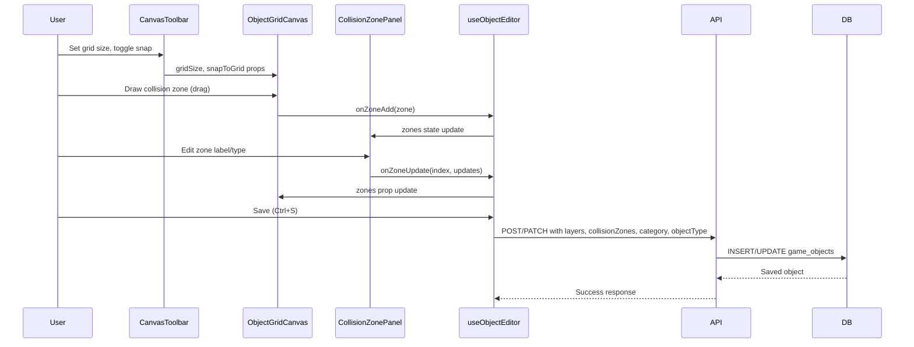

# Advanced Object Editor Design Document

## Overview

This design document specifies seven enhancements to the genmap object editor that transform it from a basic layer compositor into a full-featured game object authoring tool. The enhancements add a resizable canvas with grid snapping, object classification metadata, a visual collision zone editor, improved atlas frame selection with search, a BEM-style frame name constructor, and shared component extraction to eliminate code duplication between the new/edit pages.

## Design Summary (Meta)

```yaml
design_type: "extension"
risk_level: "medium"
complexity_level: "medium"
complexity_rationale: >
  (1) Features 2 and 4 manage 3+ interactive states (grid snap mode, editor mode toggling,
  collision zone drawing/selecting/resizing states). Feature 4 alone coordinates click-drag
  creation, selection, repositioning, and resize handle interaction on the canvas.
  (2) The shared hook extraction (useObjectEditor) touches both page components and all
  canvas/panel children, creating a wide integration surface. Database schema changes
  propagate through service layer, API routes, and UI components.
main_constraints:
  - "Canvas rendering must remain 60fps with grid lines, collision zone overlays, and layer rendering combined"
  - "Database migration must be additive-only (no breaking changes to existing game_objects rows)"
  - "Collision zone data must map directly to Phaser 3 Arcade Physics StaticBody API without transformation"
  - "All new UI controls must have tooltip descriptions for discoverability"
biggest_risks:
  - "Canvas performance degradation when rendering grid lines + multiple collision zones + layers simultaneously at large canvas sizes (up to 2048x2048)"
  - "Shared hook extraction (useObjectEditor) may introduce regressions in existing create/edit workflows"
  - "Collision zone drawing interaction conflicts with existing layer drag interaction on the same canvas"
unknowns:
  - "Whether resize handles on collision zones need sub-pixel precision or can snap to grid"
  - "Whether BEM autocomplete suggestions will be responsive enough with a large number of existing frame names"
```

## Background and Context

### Prerequisite ADRs

- **ADR-0008: Object Editor Collision Zones and Metadata**: Defines the `CollisionZone` interface (JSONB column on `game_objects`), the free-text varchar approach for `category`/`objectType` fields, and the decision to keep grid settings as editor session state in `localStorage`.
- **ADR-0007: Sprite Management Storage and Schema**: Establishes the `game_objects` table schema, JSONB patterns for `layers`/`tags`/`metadata`, and the `atlas_frames.customData` reserved keys.

No common ADRs exist in the project (`docs/adr/ADR-COMMON-*` was checked -- none found).

### Agreement Checklist

#### Scope
- [x] Resizable canvas with width/height controls and "Fit" button (Feature 1)
- [x] Grid system with snap/free modes and preset sizes (Feature 2)
- [x] `category` and `objectType` varchar columns with autocomplete (Feature 3)
- [x] Visual collision zone editor with draw/select/move/resize (Feature 4)
- [x] Atlas frame picker search and filtering (Feature 5)
- [x] BEM-style frame name constructor for AtlasZoneModal (Feature 6)
- [x] Tooltips on all icon buttons and compact modal elements (Feature 7)
- [x] Shared `useObjectEditor` hook and `ObjectEditorLayout` component extraction

#### Non-Scope (Explicitly not changing)
- [x] Sprite upload/management pages (sprites list, sprite detail)
- [x] Atlas zone canvas drawing tool (existing rectangle zone editor for frame definitions)
- [x] Tile map editor pages
- [x] Database connection layer or Drizzle client setup
- [x] Game runtime / Phaser 3 integration (collision zones are authored only, not consumed yet)
- [x] Canvas size persistence to database (stays in component state per ADR-0008 Decision 3)

#### Constraints
- [x] Parallel operation: No (single-user internal tool)
- [x] Backward compatibility: Required (existing game objects must load and display unchanged)
- [x] Performance measurement: Not required (internal tool, subjective 60fps target)

### Problem to Solve

The object editor currently provides basic layer composition with fixed 256px canvas, no grid assistance, no object classification, and no collision zone authoring. Each page (new/edit) duplicates ~80% of its code. Artists and designers need a more capable editor to produce game-ready object data including collision boundaries, classification metadata, and precise grid-aligned positioning.

### Current Challenges

1. **Fixed canvas size**: 256x256 is too small for large objects (buildings, trees) and too large for small items (flowers, tools). No way to adjust.
2. **No grid snapping**: Layers must be positioned by pixel, making aligned composition tedious.
3. **No object classification**: Objects cannot be categorized or filtered as the library grows.
4. **No collision authoring**: Collision zones must be defined outside the editor or hardcoded in game logic.
5. **No frame search**: Finding a specific atlas frame requires manually expanding each sprite section.
6. **Code duplication**: `new/page.tsx` (425 lines) and `[id]/page.tsx` (615 lines) share nearly identical layer management, tag management, and layout code.

### Requirements

#### Functional Requirements

- FR1: Users can resize the canvas between 64x64 and 2048x2048 pixels in grid-cell-size steps
- FR2: Users can toggle between snap-to-grid and free placement modes with configurable grid sizes
- FR3: Users can assign `category` and `objectType` to objects with autocomplete from existing values
- FR4: Users can draw, select, move, resize, and delete collision zones on the canvas
- FR5: Users can search atlas frames by filename across all sprites
- FR6: Users can construct frame names using BEM block/element/modifier fields with autocomplete
- FR7: All icon-only buttons display descriptive tooltips on hover

#### Non-Functional Requirements

- **Performance**: Canvas must maintain smooth rendering (target 60fps) at maximum canvas size (2048x2048) with grid overlay and up to 10 collision zones
- **Maintainability**: Shared hook extraction must reduce total lines of code by at least 30% across the two page components
- **Reliability**: All existing object create/edit/delete flows must continue to work after changes

## Acceptance Criteria (AC) - EARS Format

### Feature 1: Resizable Canvas Area

- [ ] The system shall display width and height number inputs in a toolbar above the canvas, defaulting to 256x256
- [ ] **When** the user changes the width or height input, the canvas shall resize to the specified dimensions
- [ ] **If** the user enters a value below 64 or above 2048, **then** the system shall clamp the value to the nearest boundary
- [ ] **When** the user clicks the "Fit" button, the system shall calculate the bounding box of all layers and set canvas size to fit all content plus 16px padding on each side
- [ ] **If** no layers exist when "Fit" is clicked, **then** the system shall keep the current canvas size unchanged
- [ ] The width/height inputs shall step by the current grid cell size

### Feature 2: Grid System with Two Modes

- [ ] The system shall render semi-transparent grid lines on the canvas after the background layer and before frame layers
- [ ] The system shall provide grid preset buttons for 8x8, 16x16 (default), 32x32, and 64x64 pixel grids
- [ ] **When** snap mode is active and the user drags a layer, the system shall snap xOffset/yOffset to the nearest grid cell boundary using `Math.round(value / gridSize) * gridSize`
- [ ] **When** free mode is active, the system shall place layers at exact pixel positions (current behavior)
- [ ] **When** the user clicks the grid toggle button, the system shall show or hide grid lines
- [ ] Grid mode and cell size shall persist across browser sessions via `localStorage`

### Feature 3: Object Category and Type

- [ ] The system shall display category and objectType input fields in the right panel metadata section
- [ ] **When** the user types in the category or objectType field, the system shall display an autocomplete dropdown showing existing distinct values from other objects
- [ ] The system shall store category and objectType as nullable varchar(100) columns on game_objects
- [ ] **When** saving an object with category/objectType values, the system shall include them in the POST/PATCH payload
- [ ] The GET /api/objects/suggestions endpoint shall return distinct non-null values for the requested field

### Feature 4: Visual Collision Zone Editor

- [ ] The system shall provide an editor mode toggle between "Layers" and "Collision Zones" in the toolbar
- [ ] **While** in collision zone mode, existing frame layers shall render at reduced opacity (0.3)
- [ ] **When** the user click-drags on the canvas in collision zone mode, the system shall create a new rectangular collision zone
- [ ] **When** the user clicks an existing collision zone, the system shall select it and display a selection highlight
- [ ] **When** the user drags a selected collision zone, the system shall reposition it
- [ ] **When** the user drags a resize handle on a selected collision zone, the system shall resize it
- [ ] The right panel shall show a zone list with label, type toggle (collision/walkable), position/size fields, and delete button
- [ ] **When** the user toggles zone type, the color shall change between red (collision) and green (walkable)
- [ ] Collision zones shall be saved as part of the game object POST/PATCH payload as a `collisionZones` JSON array

### Feature 5: Improved Atlas Frame Selection

- [ ] The system shall display a search input at the top of the AtlasFramePicker
- [ ] **When** text is entered in the search input, the system shall filter frames by filename across all sprites
- [ ] **When** searching, sprites with matching frames shall auto-expand
- [ ] Frame count badges shall display on sprite section headers
- [ ] Frame filename labels shall have increased max-width or a tooltip showing the full name on hover

### Feature 6: BEM-Style Frame Name Constructor

- [ ] The system shall provide a two-mode toggle: "Manual" and "Constructor" for the filename input in AtlasZoneModal
- [ ] **While** in Constructor mode, the system shall display three input fields: Block, Element, Modifier
- [ ] The system shall show a live preview of the constructed name in the format `block_element--modifier`
- [ ] **When** the user types in the Block field, the system shall show autocomplete suggestions from unique first segments of existing frame filenames
- [ ] **When** the user types in the Element field, the system shall show suggestions for elements that appear after the selected block
- [ ] **When** the user types in the Modifier field, the system shall show suggestions for modifiers that appear after the selected block+element

### Feature 7: UI Improvements

- [ ] All icon-only buttons in the editor shall have Tooltip wrappers displaying descriptive text
- [ ] AtlasZoneModal shall use compact form fields (reduced padding, smaller input heights)
- [ ] Tooltips shall use the existing shadcn Tooltip component from `@/components/ui/tooltip`

### Shared Component Extraction

- [ ] The `useObjectEditor` hook shall encapsulate layer management, tag management, and save/load state
- [ ] The `ObjectEditorLayout` component shall encapsulate the three-column layout (frame picker, canvas, right panel)
- [ ] Both `objects/new/page.tsx` and `objects/[id]/page.tsx` shall use the shared hook and layout
- [ ] All existing create/edit/delete functionality shall work identically after extraction

## Applicable Standards

### Classification Table

| Standard | Type | Source | Impact on Design |
|----------|------|--------|-----------------|
| Prettier (single quotes, 2-space indent) | Explicit | `.prettierrc` | All new code must use single quotes and 2-space indentation |
| ESLint with @nx/eslint-plugin, flat config | Explicit | `eslint.config.mjs` | React-typescript lint rules enforced |
| TypeScript strict mode | Explicit | `tsconfig.base.json` (`"strict": true`) | All new interfaces must have explicit types, no implicit `any` |
| `noUnusedLocals` enabled | Explicit | `tsconfig.base.json` | No unused variables allowed in new components |
| `@/*` path alias to `./src/*` | Explicit | `apps/genmap/tsconfig.json` | All imports within genmap must use `@/` prefix |
| Drizzle ORM with JSONB for semi-structured data | Implicit | `packages/db/src/schema/*.ts` | New structured data (collision zones) uses JSONB column with TypeScript interface |
| UUID primary keys with `defaultRandom()` | Implicit | All schema files | Collision zone IDs use `crypto.randomUUID()` client-side |
| `'use client'` directive on interactive components | Implicit | All component files in genmap | New components with state/effects must declare `'use client'` |
| `sonner` toast for user feedback | Implicit | `new/page.tsx`, `[id]/page.tsx` | Save/error feedback uses `toast.success()` / `toast.error()` |
| Canvas render loop via `requestAnimationFrame` | Implicit | `object-grid-canvas.tsx`, `atlas-zone-canvas.tsx` | Canvas rendering follows existing rAF loop pattern |

**Gate check**: 5 explicit standards and 5 implicit standards identified. Gate passed.

## Existing Codebase Analysis

### Implementation Path Mapping

| Type | Path | Description |
|------|------|-------------|
| Existing | `apps/genmap/src/components/object-grid-canvas.tsx` | Canvas component for layer composition (396 lines) |
| Existing | `apps/genmap/src/components/atlas-frame-picker.tsx` | Frame selection sidebar (255 lines) |
| Existing | `apps/genmap/src/app/objects/new/page.tsx` | Create object page (425 lines) |
| Existing | `apps/genmap/src/app/objects/[id]/page.tsx` | Edit object page (615 lines) |
| Existing | `apps/genmap/src/app/api/objects/route.ts` | POST/GET objects API (83 lines) |
| Existing | `apps/genmap/src/app/api/objects/[id]/route.ts` | PATCH/GET/DELETE object API (93 lines) |
| Existing | `packages/db/src/schema/game-objects.ts` | Schema definition (34 lines) |
| Existing | `packages/db/src/services/game-object.ts` | CRUD service (95 lines) |
| Existing | `apps/genmap/src/components/atlas-zone-modal.tsx` | Frame properties modal (694 lines) |
| Existing | `apps/genmap/src/components/atlas-zone-canvas.tsx` | Rectangle drawing canvas (733 lines) - reference for collision zone drawing patterns |
| Existing | `apps/genmap/src/components/ui/tooltip.tsx` | Shadcn tooltip component |
| New | `apps/genmap/src/components/canvas-toolbar.tsx` | Canvas toolbar with all controls |
| New | `apps/genmap/src/components/collision-zone-panel.tsx` | Right panel section for collision zone editing |
| New | `apps/genmap/src/components/bem-frame-name-constructor.tsx` | BEM name builder with autocomplete |
| New | `apps/genmap/src/hooks/use-object-editor.ts` | Shared editor logic hook |
| New | `apps/genmap/src/app/api/objects/suggestions/route.ts` | Distinct values endpoint |
| New | `apps/genmap/src/app/api/frames/search/route.ts` | Frame search endpoint |
| New | `packages/db/src/migrations/0005_*.sql` | Migration for new columns |

### Similar Functionality Search

| Search Target | Found? | Decision |
|---------------|--------|----------|
| Rectangle drawing on canvas | Yes: `atlas-zone-canvas.tsx` has full drag-to-create-rect implementation with snap-to-grid | **Reuse patterns** from `AtlasZoneCanvas` for collision zone drawing (drag state, rect normalization, snap functions) |
| Grid line rendering | Yes: `atlas-zone-canvas.tsx` lines 342-361 render tile grid lines with zoom-aware line width | **Reuse pattern** for grid rendering in `ObjectGridCanvas` |
| Autocomplete/suggestions UI | No existing autocomplete component found | **New implementation** using native datalist or a custom dropdown |
| Search/filter in list | No search feature exists in any picker or list | **New implementation** with search input + filter logic |
| Shared hook pattern | `use-canvas-background.ts` and `use-keyboard-shortcuts.ts` exist as shared hooks | **Follow pattern** for `useObjectEditor` hook |

### Code Inspection Evidence

#### What Was Examined

| File Inspected | Key Finding | Design Impact |
|---------------|-------------|---------------|
| `object-grid-canvas.tsx:50` | `DEFAULT_CANVAS_SIZE = 256` used as fallback when `canvasWidth`/`canvasHeight` props not provided | Canvas resize feature adds controlled state for these existing props |
| `object-grid-canvas.tsx:194-249` | Render loop: background -> layers -> selection highlight. No grid rendering step. | Grid lines must be inserted between background and layers in render order |
| `object-grid-canvas.tsx:264-376` | Pointer handlers: down selects/starts drag, move updates position, up commits or adds layer | Collision zone mode must intercept these handlers when editor mode is "zones" |
| `object-grid-canvas.tsx:319-324` | Layer drag uses `Math.round()` for pixel positioning | Snap-to-grid replaces this with `Math.round(value / gridSize) * gridSize` |
| `atlas-zone-canvas.tsx:129-131` | `snapToTile()` and `snapToTileCeil()` functions exist for grid snapping | Can extract and reuse these functions for object grid snap |
| `atlas-zone-canvas.tsx:144-169` | `dragToRect()` normalizes drag state to positive-dimension rectangle | Reuse this pattern for collision zone creation |
| `atlas-zone-canvas.tsx:364-410` | Zone overlay rendering with color, fill, stroke, label | Adapt for collision zone overlay rendering with red/green color coding |
| `new/page.tsx:62-127` | Layer management functions: add, update, delete, moveUp, moveDown | Extract into `useObjectEditor` hook |
| `new/page.tsx:131-148` | Tag management functions: add, remove, keyDown handler | Extract into `useObjectEditor` hook |
| `[id]/page.tsx:124-179` | `loadLayersWithSpriteUrls()` fetches sprite URLs and frame coordinates | Keep in page component (edit-specific), hook receives loaded layers |
| `[id]/page.tsx:182-243` | Layer management functions - identical to new/page.tsx | Confirms duplication, validates hook extraction |
| `atlas-frame-picker.tsx:99-172` | Renders sprites as collapsible sections, no search input | Search input added at top, filter logic wraps existing sprite/frame rendering |
| `atlas-zone-modal.tsx:512-526` | Filename input is a plain text Input component | BEM constructor adds a mode toggle, replacing the simple Input in constructor mode |
| `packages/db/src/schema/game-objects.ts:18-31` | Table has id, name, description, layers, tags, metadata, timestamps | Add category, objectType, collisionZones columns |
| `packages/db/src/services/game-object.ts:7-21` | CreateGameObjectData and UpdateGameObjectData interfaces | Add category, objectType, collisionZones fields |
| `apps/genmap/src/components/ui/tooltip.tsx:1-57` | Full shadcn Tooltip with Provider, Root, Trigger, Content | Wrap icon buttons in `<Tooltip><TooltipTrigger>...<TooltipContent>` |

#### How Findings Influence Design

- The existing `atlas-zone-canvas.tsx` provides battle-tested rectangle drawing, grid snapping, and zone overlay rendering patterns. The collision zone editor in `ObjectGridCanvas` will follow the same state machine (idle -> drawing -> committed) rather than inventing a new interaction model.
- The render loop in `object-grid-canvas.tsx` is already structured as numbered layers. Adding grid lines (layer 2) and collision zones (layer 4) follows the existing pattern.
- Both page components share identical function signatures for layer and tag management, confirming that a shared hook extraction is mechanically straightforward.
- The `use-canvas-background.ts` hook demonstrates the project's pattern for `localStorage`-persisted editor state -- grid settings will follow this exact pattern.

## Data Representation Decisions

| Data Structure | Decision | Rationale |
|---|---|---|
| `CollisionZone` | **New** dedicated interface | Defined by ADR-0008. No existing type covers collision zone semantics. The `Zone` interface in `atlas-zone-canvas.tsx` is for frame rectangle definitions (different domain). |
| `category` / `objectType` fields | **Extend** existing `game_objects` schema | ADR-0008 Decision 2. Adds nullable varchar columns to existing table. |
| Grid settings state | **Reuse** existing `localStorage` pattern | Follows `useCanvasBackground` hook pattern exactly (ADR-0008 Decision 3). |
| `FrameLayer` interface | **Reuse** existing, no changes | Collision zones are separate from layers; no extension needed. |
| Editor mode state | **New** local component state | Simple `'layers' | 'zones'` union type, no persistence needed. |

## Design

### Change Impact Map

```yaml
Change Target: game_objects schema and object editor UI
Direct Impact:
  - packages/db/src/schema/game-objects.ts (add CollisionZone interface, add columns)
  - packages/db/src/services/game-object.ts (update Create/Update interfaces)
  - packages/db/src/services/game-object.spec.ts (update test data)
  - apps/genmap/src/components/object-grid-canvas.tsx (grid, snap, collision zones, editor mode)
  - apps/genmap/src/components/atlas-frame-picker.tsx (search input, filtering)
  - apps/genmap/src/app/objects/new/page.tsx (use shared hook + layout, add new features)
  - apps/genmap/src/app/objects/[id]/page.tsx (use shared hook + layout, add new features)
  - apps/genmap/src/app/api/objects/route.ts (accept new fields)
  - apps/genmap/src/app/api/objects/[id]/route.ts (accept new fields)
  - apps/genmap/src/components/atlas-zone-modal.tsx (BEM constructor integration)
Indirect Impact:
  - apps/genmap/src/app/objects/page.tsx (objects list may display category/type badges)
  - apps/genmap/src/components/object-card.tsx (may show category/type)
No Ripple Effect:
  - Sprite pages (sprites list, sprite detail, atlas zone canvas/modal for sprite frames)
  - Tile map pages
  - packages/db/src/schema/sprites.ts, atlas-frames.ts
  - All other services (map, player, sprite, atlas-frame)
  - Navigation component
  - apps/game (not yet integrated)
```

### Architecture Overview

```mermaid
graph TD
    subgraph "genmap App (Next.js)"
        subgraph "Pages"
            NP[objects/new/page.tsx]
            EP[objects/id/page.tsx]
        end

        subgraph "Shared Hook"
            UOE[useObjectEditor]
        end

        subgraph "Layout"
            OEL[ObjectEditorLayout]
        end

        subgraph "Components"
            CT[CanvasToolbar]
            OGC[ObjectGridCanvas]
            AFP[AtlasFramePicker]
            CZP[CollisionZonePanel]
            BEM[BemFrameNameConstructor]
        end

        subgraph "API Routes"
            AOBJ[/api/objects]
            AOBJID[/api/objects/id]
            ASUG[/api/objects/suggestions]
            AFRM[/api/frames/search]
        end
    end

    subgraph "packages/db"
        SCH[schema/game-objects.ts]
        SVC[services/game-object.ts]
    end

    NP --> UOE
    EP --> UOE
    NP --> OEL
    EP --> OEL
    OEL --> CT
    OEL --> OGC
    OEL --> AFP
    OEL --> CZP
    CT --> OGC
    AOBJ --> SVC
    AOBJID --> SVC
    SVC --> SCH
```

### Data Flow



### Integration Points List

| Integration Point | Location | Old Implementation | New Implementation | Switching Method |
|-------------------|----------|-------------------|-------------------|------------------|
| Canvas render pipeline | `ObjectGridCanvas.render()` | Background -> Layers -> Selection | Background -> Grid -> Layers -> Zones -> Selection | Direct modification of render function |
| Canvas pointer handlers | `ObjectGridCanvas.handlePointer*()` | Always handles layer interaction | Mode-switched: layers mode or zones mode | `editorMode` prop controls handler behavior |
| Layer drag positioning | `ObjectGridCanvas.handlePointerMove()` | `Math.round(startLayerX + dx)` | Conditional snap: `Math.round(value / gridSize) * gridSize` when snap enabled | `snapToGrid` and `gridSize` props |
| Object save payload | `new/page.tsx` and `[id]/page.tsx` `handleSave()` | `{ name, description, layers, tags, metadata }` | `{ name, description, layers, tags, metadata, category, objectType, collisionZones }` | Add fields to JSON body |
| API POST handler | `api/objects/route.ts` POST | Destructures name, description, layers, tags, metadata | Also destructures category, objectType, collisionZones | Add fields to destructuring and pass-through |
| API PATCH handler | `api/objects/[id]/route.ts` PATCH | Handles name, description, layers, tags, metadata | Also handles category, objectType, collisionZones | Add conditional update fields |
| Schema definition | `game-objects.ts` table definition | 7 columns | 10 columns (add category, objectType, collisionZones) | Drizzle migration |
| AtlasZoneModal filename | `atlas-zone-modal.tsx` line 512-526 | Plain `<Input>` for filename | Toggle between plain input and BEM constructor | Mode toggle state in modal |

### Integration Point Map

```yaml
Integration Point 1:
  Existing Component: ObjectGridCanvas.render() callback
  Integration Method: Insert grid rendering step between background and layer rendering
  Impact Level: Medium (Render pipeline modification)
  Required Test Coverage: Visual verification that grid renders correctly at all preset sizes

Integration Point 2:
  Existing Component: ObjectGridCanvas pointer event handlers
  Integration Method: Mode-conditional branching based on editorMode prop
  Impact Level: High (Process flow change - handlers serve dual purpose)
  Required Test Coverage: Verify layer interaction still works in layers mode, zone interaction works in zones mode

Integration Point 3:
  Existing Component: packages/db/src/services/game-object.ts Create/UpdateGameObjectData
  Integration Method: Add optional fields to existing interfaces
  Impact Level: Low (Additive change, existing callers unaffected)
  Required Test Coverage: Unit tests for create/update with new fields

Integration Point 4:
  Existing Component: api/objects/route.ts POST and api/objects/[id]/route.ts PATCH
  Integration Method: Add field extraction from request body
  Impact Level: Medium (API contract extension)
  Required Test Coverage: API tests for new fields accepted and returned

Integration Point 5:
  Existing Component: objects/new/page.tsx and objects/[id]/page.tsx
  Integration Method: Replace inline state/functions with useObjectEditor hook + ObjectEditorLayout
  Impact Level: High (Major refactor of both pages)
  Required Test Coverage: Full E2E verification of create and edit flows after extraction
```

### Main Components

#### CanvasToolbar (New)

- **Responsibility**: Renders all canvas controls: size inputs, fit button, grid presets, grid toggle, snap toggle, editor mode toggle. All with Tooltip wrappers.
- **Interface**:
  ```typescript
  interface CanvasToolbarProps {
    canvasWidth: number;
    canvasHeight: number;
    onCanvasSizeChange: (width: number, height: number) => void;
    onFit: () => void;
    gridSize: number;
    onGridSizeChange: (size: number) => void;
    showGrid: boolean;
    onShowGridChange: (show: boolean) => void;
    snapToGrid: boolean;
    onSnapToGridChange: (snap: boolean) => void;
    editorMode: 'layers' | 'zones';
    onEditorModeChange: (mode: 'layers' | 'zones') => void;
    hasLayers: boolean; // Enables/disables Fit button
  }
  ```
- **Dependencies**: shadcn Button, Input, Tooltip components

#### ObjectGridCanvas (Enhanced)

- **Responsibility**: Renders layers on a resizable canvas with optional grid lines and collision zone overlays. Handles two interaction modes: layer placement/drag and collision zone draw/select/move/resize.
- **Interface** (additions to existing props):
  ```typescript
  // New props added to existing ObjectGridCanvasProps
  gridSize?: number;
  snapToGrid?: boolean;
  showGrid?: boolean;
  editorMode?: 'layers' | 'zones';
  collisionZones?: CollisionZone[];
  selectedZoneIndex?: number | null;
  onZoneAdd?: (zone: Omit<CollisionZone, 'id'>) => void;
  onZoneUpdate?: (index: number, updates: Partial<CollisionZone>) => void;
  onZoneSelect?: (index: number | null) => void;
  ```
- **Dependencies**: None (pure canvas rendering)

#### CollisionZonePanel (New)

- **Responsibility**: Renders the collision zone list in the right panel. Allows editing selected zone properties (label, type, x, y, width, height) and deleting zones.
- **Interface**:
  ```typescript
  interface CollisionZonePanelProps {
    zones: CollisionZone[];
    selectedZoneIndex: number | null;
    onZoneSelect: (index: number | null) => void;
    onZoneUpdate: (index: number, updates: Partial<CollisionZone>) => void;
    onZoneDelete: (index: number) => void;
    onZoneAdd: () => void; // Add empty zone at canvas center
  }
  ```
- **Dependencies**: shadcn Input, Button, Label, Tooltip components

#### AtlasFramePicker (Enhanced)

- **Responsibility**: Displays sprites with expandable frame lists. Adds search input to filter frames by filename.
- **Interface** (no change to existing props):
  - Internal enhancement: search state, filtered frames computation, auto-expand matching sprites
- **Dependencies**: None new

#### BemFrameNameConstructor (New)

- **Responsibility**: Three-field BEM name builder with autocomplete suggestions, used as an alternative to the plain filename input in AtlasZoneModal.
- **Interface**:
  ```typescript
  interface BemFrameNameConstructorProps {
    value: string; // Current filename
    onChange: (filename: string) => void;
    existingFilenames: string[]; // For autocomplete suggestions
  }
  ```
- **Dependencies**: shadcn Input component

#### useObjectEditor Hook (New)

- **Responsibility**: Encapsulates all shared editor state and logic: layers, tags, collision zones, metadata fields, save status.
- **Interface**:
  ```typescript
  interface UseObjectEditorOptions {
    initialData?: {
      name: string;
      description: string;
      tags: string[];
      layers: FrameLayer[];
      category: string | null;
      objectType: string | null;
      collisionZones: CollisionZone[];
    };
    onSave: (data: ObjectEditorData) => Promise<void>;
  }

  interface UseObjectEditorReturn {
    // Metadata
    name: string;
    setName: (name: string) => void;
    description: string;
    setDescription: (desc: string) => void;
    category: string | null;
    setCategory: (cat: string | null) => void;
    objectType: string | null;
    setObjectType: (type: string | null) => void;

    // Tags
    tags: string[];
    newTag: string;
    setNewTag: (tag: string) => void;
    addTag: () => void;
    removeTag: (tag: string) => void;
    handleTagKeyDown: (e: React.KeyboardEvent) => void;

    // Layers
    layers: FrameLayer[];
    selectedLayerIndex: number | null;
    setSelectedLayerIndex: (index: number | null) => void;
    handleLayerAdd: (frameData: Omit<FrameLayer, 'xOffset' | 'yOffset' | 'layerOrder'>) => void;
    handleLayerUpdate: (index: number, updates: Partial<Pick<FrameLayer, 'xOffset' | 'yOffset' | 'layerOrder'>>) => void;
    handleLayerDelete: (index: number) => void;
    handleMoveLayerUp: (index: number) => void;
    handleMoveLayerDown: (index: number) => void;

    // Collision zones
    collisionZones: CollisionZone[];
    selectedZoneIndex: number | null;
    setSelectedZoneIndex: (index: number | null) => void;
    handleZoneAdd: (zone: Omit<CollisionZone, 'id'>) => void;
    handleZoneUpdate: (index: number, updates: Partial<CollisionZone>) => void;
    handleZoneDelete: (index: number) => void;

    // Save
    isSaving: boolean;
    error: string | null;
    handleSave: () => void;

    // Preview
    layersToPreview: () => LayerPreviewData[];
  }
  ```
- **Dependencies**: React hooks, FrameLayer type, CollisionZone type

### Contract Definitions

```typescript
// packages/db/src/schema/game-objects.ts - New interface
export interface CollisionZone {
  id: string;           // UUID, generated client-side via crypto.randomUUID()
  label: string;        // Human-readable label (e.g., "trunk", "doorway")
  type: 'collision' | 'walkable';
  shape: 'rectangle';   // Only rectangles for Phaser 3 Arcade Physics
  x: number;            // X offset from object origin in pixels
  y: number;            // Y offset from object origin in pixels
  width: number;        // Zone width in pixels
  height: number;       // Zone height in pixels
}

// packages/db/src/services/game-object.ts - Updated interfaces
export interface CreateGameObjectData {
  name: string;
  description?: string | null;
  layers: GameObjectLayer[];
  tags?: unknown | null;
  metadata?: unknown | null;
  category?: string | null;       // NEW
  objectType?: string | null;     // NEW
  collisionZones?: CollisionZone[] | null;  // NEW
}

export interface UpdateGameObjectData {
  name?: string;
  description?: string | null;
  layers?: GameObjectLayer[];
  tags?: unknown | null;
  metadata?: unknown | null;
  category?: string | null;       // NEW
  objectType?: string | null;     // NEW
  collisionZones?: CollisionZone[] | null;  // NEW
}
```

### Data Contract

#### ObjectGridCanvas (Enhanced)

```yaml
Input:
  Type: ObjectGridCanvasProps (extended)
  Preconditions:
    - layers is an array (may be empty)
    - canvasWidth/canvasHeight in range [64, 2048]
    - gridSize is one of 8, 16, 32, 64
    - collisionZones is an array (may be empty)
    - editorMode is 'layers' or 'zones'
  Validation: Props validated by TypeScript types

Output:
  Type: Callback invocations (onLayerAdd, onLayerUpdate, onLayerSelect, onZoneAdd, onZoneUpdate, onZoneSelect)
  Guarantees:
    - Layer coordinates are integers (rounded from canvas coords)
    - When snapToGrid is true, layer coordinates are multiples of gridSize
    - Collision zone dimensions are always positive (normalized from drag)
  On Error: No errors thrown; invalid interactions are silently ignored (e.g., drag on empty area with no active frame in layers mode)

Invariants:
  - Canvas renders at 60fps regardless of interaction state
  - Layer render order determined by layerOrder property
  - Only one item (layer or zone) can be selected at a time
```

#### API Suggestions Endpoint

```yaml
Input:
  Type: GET /api/objects/suggestions?field=category|objectType
  Preconditions: field query parameter is either "category" or "objectType"
  Validation: Return 400 if field is missing or invalid

Output:
  Type: string[] (JSON array of distinct non-null values, sorted alphabetically)
  Guarantees: No null values in response array, case-preserving
  On Error: 400 for invalid field parameter, 500 for database errors

Invariants:
  - Response reflects current state of game_objects table
  - Empty array returned if no objects have values for the requested field
```

#### API Frames Search Endpoint

```yaml
Input:
  Type: GET /api/frames/search?q=<query>
  Preconditions: q query parameter is a non-empty string
  Validation: Return 400 if q is missing or empty

Output:
  Type: Array of { filename: string, spriteId: string, spriteName: string }
  Guarantees: Only frames with filenames containing the query (case-insensitive) are returned
  On Error: 400 for missing query, 500 for database errors

Invariants:
  - Results limited to 100 entries to prevent large responses
```

### Integration Boundary Contracts

```yaml
Boundary: useObjectEditor Hook <-> Page Components
  Input: initialData (loaded object or empty defaults), onSave callback
  Output: Full editor state and handler functions (sync)
  On Error: Save errors stored in hook state, displayed via toast

Boundary: ObjectGridCanvas <-> useObjectEditor
  Input: layers, collisionZones, editorMode, gridSize, snapToGrid (via props)
  Output: onLayerAdd, onLayerUpdate, onZoneAdd, onZoneUpdate callbacks (sync)
  On Error: Invalid canvas coordinates silently discarded

Boundary: API Routes <-> DB Service Layer
  Input: Parsed request body fields (category, objectType, collisionZones)
  Output: Created/updated game object record (sync via await)
  On Error: Propagate database errors as 500 responses

Boundary: AtlasFramePicker <-> API
  Input: /api/sprites (GET all sprites), /api/sprites/:id/frames (GET frames)
  Output: SpriteData[], AtlasFrameData[] (async)
  On Error: Log to console, display empty state

Boundary: BemFrameNameConstructor <-> API
  Input: /api/frames/search?q=<block> (GET matching frames for autocomplete)
  Output: Frame filename suggestions (async)
  On Error: Show empty suggestions, do not block user input
```

### Field Propagation Map

```yaml
fields:
  - name: "category"
    origin: "User Input (right panel text field)"
    transformations:
      - layer: "UI Component"
        type: "string | null"
        validation: "optional, user-entered free text"
      - layer: "useObjectEditor Hook"
        type: "string | null"
        transformation: "trim() on save, null if empty"
      - layer: "API Route (POST/PATCH)"
        type: "string | undefined"
        validation: "typeof check, max length 100 implicit via DB"
      - layer: "DB Service"
        type: "string | null"
        transformation: "pass-through to Drizzle insert/update"
      - layer: "Database"
        type: "varchar(100) nullable"
        transformation: "stored as-is"
    destination: "game_objects.category column"
    loss_risk: "none"

  - name: "objectType"
    origin: "User Input (right panel text field)"
    transformations:
      - layer: "UI Component"
        type: "string | null"
        validation: "optional, user-entered free text"
      - layer: "useObjectEditor Hook"
        type: "string | null"
        transformation: "trim() on save, null if empty"
      - layer: "API Route (POST/PATCH)"
        type: "string | undefined"
        validation: "typeof check, max length 100 implicit via DB"
      - layer: "DB Service"
        type: "string | null"
        transformation: "pass-through to Drizzle insert/update"
      - layer: "Database"
        type: "varchar(100) nullable"
        transformation: "stored as-is"
    destination: "game_objects.object_type column"
    loss_risk: "none"

  - name: "collisionZones"
    origin: "User Canvas Interaction (draw rectangle) / CollisionZonePanel (edit fields)"
    transformations:
      - layer: "ObjectGridCanvas"
        type: "Omit<CollisionZone, 'id'>"
        validation: "width > 0, height > 0 (enforced by drag normalization)"
      - layer: "useObjectEditor Hook"
        type: "CollisionZone[]"
        transformation: "id added via crypto.randomUUID(), default label 'Zone N', default type 'collision'"
      - layer: "API Route (POST/PATCH)"
        type: "unknown (from JSON body)"
        validation: "Array.isArray check, each zone validated for required fields"
      - layer: "DB Service"
        type: "CollisionZone[] | null"
        transformation: "pass-through to Drizzle as JSONB"
      - layer: "Database"
        type: "jsonb nullable"
        transformation: "stored as JSON array"
    destination: "game_objects.collision_zones column"
    loss_risk: "low"
    loss_risk_reason: "JSONB has no schema validation at DB level; malformed zones could be stored if API validation is bypassed"
```

### Interface Change Impact Analysis

| Existing Operation | New Operation | Conversion Required | Adapter Required | Compatibility Method |
|-------------------|---------------|-------------------|------------------|---------------------|
| `createGameObject(db, data)` | `createGameObject(db, data)` | None | Not Required | New fields are optional in `CreateGameObjectData` |
| `updateGameObject(db, id, data)` | `updateGameObject(db, id, data)` | None | Not Required | New fields are optional in `UpdateGameObjectData` |
| `getGameObject(db, id)` | `getGameObject(db, id)` | None | Not Required | Returns all columns including new ones (null for existing rows) |
| `listGameObjects(db, params)` | `listGameObjects(db, params)` | None | Not Required | Returns all columns including new ones |
| `ObjectGridCanvas` props | `ObjectGridCanvas` props (extended) | None | Not Required | New props are all optional with sensible defaults |
| `AtlasFramePicker` props | `AtlasFramePicker` props (unchanged) | None | Not Required | Search is internal enhancement |
| API POST `/api/objects` body | API POST `/api/objects` body (extended) | None | Not Required | New fields extracted from body with `?? null` fallback |
| API PATCH `/api/objects/[id]` body | API PATCH `/api/objects/[id]` body (extended) | None | Not Required | New fields handled with `if (field !== undefined)` pattern |

### State Transitions

```yaml
State Definition:
  - Editor Mode States: ['layers', 'zones']
  - Canvas Interaction States (Layers Mode): ['idle', 'dragging-layer']
  - Canvas Interaction States (Zones Mode): ['idle', 'drawing-zone', 'dragging-zone', 'resizing-zone']

State Transitions:
  # Editor Mode
  layers → toggle button → zones
  zones → toggle button → layers

  # Layers Mode Interaction
  idle → pointerdown on layer → dragging-layer
  idle → pointerup on empty (with active frame) → idle (layer added)
  idle → pointerup on empty (no active frame) → idle (deselect)
  dragging-layer → pointerup → idle

  # Zones Mode Interaction
  idle → pointerdown on empty → drawing-zone
  idle → pointerdown on zone → idle (zone selected)
  idle → pointerdown on selected zone body → dragging-zone
  idle → pointerdown on selected zone handle → resizing-zone
  drawing-zone → pointermove (drag exceeds threshold) → drawing-zone (rect preview)
  drawing-zone → pointerup → idle (zone created if rect has positive area)
  dragging-zone → pointerup → idle
  resizing-zone → pointerup → idle

System Invariants:
  - Switching editor mode deselects any selected layer or zone
  - Only one zone or layer can be selected at a time
  - Drawing a zone is only possible in zones mode
  - Dragging a layer is only possible in layers mode
```

### Error Handling

| Error Scenario | Handling Strategy |
|----------------|-------------------|
| Save fails (network/server error) | Display error via `toast.error()`, keep form state, set `error` in hook state |
| Invalid frame references on save | API returns 400 with `invalidFrameIds`, display as toast error |
| Autocomplete suggestions fetch fails | Silently fail, show empty dropdown, log to console |
| Frame search endpoint fails | Show "Search unavailable" message in picker, log to console |
| Canvas fails to get 2d context | Early return from render function (existing pattern) |
| Invalid canvas size input (NaN) | Clamp to min 64 / max 2048, parseInt with fallback |
| Collision zone with zero area | Discard (do not add zone if width or height is 0 after drag normalization) |
| Malformed collisionZones in API request | API validates array structure, returns 400 for invalid zones |

### Logging and Monitoring

This is an internal development tool. No structured logging or monitoring infrastructure is needed.

- Console errors for failed API fetches (existing pattern via `console.error`)
- Toast notifications for user-facing success/error feedback (existing pattern via `sonner`)

## Implementation Plan

### Implementation Approach

**Selected Approach**: Vertical Slice (Feature-driven) with shared infrastructure first

**Selection Reason**: The seven features are largely independent -- each can be implemented, tested, and verified as a complete vertical slice. However, the shared hook extraction (infrastructure) should come first because it establishes the component architecture that all features build upon. This is a hybrid approach: one horizontal infrastructure task, then vertical feature slices.

The features have minimal inter-dependencies: grid system (Feature 2) is independent of collision zones (Feature 4), frame search (Feature 5) is independent of BEM constructor (Feature 6), etc. This allows parallel development if needed and enables early value delivery per feature.

### Technical Dependencies and Implementation Order

#### Required Implementation Order

1. **Database schema + migration + service layer updates** (Features 3, 4 prerequisite)
   - Technical Reason: Schema changes must exist before API routes or UI can reference new fields
   - Dependent Elements: API routes, useObjectEditor hook, CollisionZonePanel, autocomplete UI

2. **Shared hook extraction (useObjectEditor + ObjectEditorLayout)** (All features prerequisite)
   - Technical Reason: Both page components must be refactored before adding new features to avoid doubling the work
   - Prerequisites: None (pure refactor of existing code)

3. **CanvasToolbar + Resizable Canvas (Feature 1)** (Feature 2 prerequisite)
   - Technical Reason: Grid controls live in the toolbar; canvas size must be controllable before grid can be rendered
   - Prerequisites: Shared hook extraction (toolbar integrates with hook state)

4. **Grid System (Feature 2)**
   - Technical Reason: Grid rendering and snap logic are independent but benefit from toolbar being ready
   - Prerequisites: CanvasToolbar component, ObjectGridCanvas enhancement

5. **API routes for new fields + Collision Zone Editor (Features 3, 4)**
   - Technical Reason: API must accept new fields before UI can save them; collision zone editor is the most complex feature
   - Prerequisites: Schema migration, shared hook, canvas toolbar (mode toggle)

6. **Atlas Frame Search (Feature 5), BEM Constructor (Feature 6), Tooltips (Feature 7)**
   - Technical Reason: These are independent enhancements with no cross-dependencies
   - Prerequisites: None (can be done in any order after shared hook)

### Integration Points

**Integration Point 1: Schema Migration**
- Components: Drizzle schema -> Migration SQL -> PostgreSQL
- Verification: Run `drizzle-kit generate` and verify migration SQL, then apply migration

**Integration Point 2: Shared Hook Extraction**
- Components: Page components -> useObjectEditor hook -> ObjectEditorLayout
- Verification: Both create and edit flows work identically before and after extraction (manual E2E test)

**Integration Point 3: Canvas Grid + Snap**
- Components: CanvasToolbar -> ObjectGridCanvas (gridSize, snapToGrid props)
- Verification: Enable snap mode, drag a layer, verify coordinates are multiples of grid size

**Integration Point 4: Collision Zone Round-Trip**
- Components: ObjectGridCanvas (draw) -> useObjectEditor (state) -> API (save) -> DB -> API (load) -> useObjectEditor -> ObjectGridCanvas (render)
- Verification: Create object with collision zones, reload page, verify zones appear at correct positions

**Integration Point 5: Autocomplete Suggestions**
- Components: Category/Type inputs -> /api/objects/suggestions -> DB (SELECT DISTINCT)
- Verification: Create two objects with same category, open third object, verify autocomplete shows the category

### Migration Strategy

The database migration is additive-only (three new nullable columns). No data transformation is needed for existing rows. The migration can be applied at any time without downtime.

```sql
ALTER TABLE game_objects ADD COLUMN category VARCHAR(100);
ALTER TABLE game_objects ADD COLUMN object_type VARCHAR(100);
ALTER TABLE game_objects ADD COLUMN collision_zones JSONB DEFAULT '[]';
```

Existing objects will have `null` for category and objectType, and `[]` (empty array) for collisionZones.

## Test Strategy

### Basic Test Design Policy

Test cases are derived from acceptance criteria. Each AC maps to at least one test case.

### Unit Tests

- **useObjectEditor hook**: Test layer management (add, update, delete, reorder), tag management (add, remove), collision zone management (add, update, delete), metadata state
- **Snap logic**: Test `Math.round(value / gridSize) * gridSize` with various inputs and grid sizes
- **Collision zone validation**: Test that zones with zero/negative dimensions are rejected
- **BEM name construction**: Test block_element--modifier assembly from separate fields
- **BEM autocomplete parsing**: Test extraction of unique blocks, elements, modifiers from filename lists
- **Fit button calculation**: Test bounding box computation from layer positions and frame dimensions

### Integration Tests

- **game-object.spec.ts**: Add tests for create/update with category, objectType, collisionZones fields
- **API route tests**: Test POST/PATCH/GET with new fields, test suggestions endpoint, test frames search endpoint
- **CollisionZone validation at API layer**: Test that malformed zones return 400

### E2E Tests

- Create an object with layers, collision zones, category, and type -> verify all data persists and loads correctly on page refresh
- Edit an existing object -> add collision zones -> save -> reload -> verify zones appear
- Search for frames in AtlasFramePicker -> verify filtering works across sprites

### Performance Tests

Not required for this internal tool. Canvas rendering should be visually smooth, verified by manual testing at max canvas size (2048x2048) with grid overlay and 10 collision zones.

## Security Considerations

- **Input validation**: Category and objectType are free-text fields limited to varchar(100) by the database. API layer should sanitize to prevent SQL injection (Drizzle ORM parameterizes queries automatically).
- **CollisionZones validation**: API validates that collisionZones is an array of objects with required fields (id, label, type, shape, x, y, width, height) before database insertion.
- **No authentication**: genmap is an internal tool with no user authentication. No access control changes needed.

## Future Extensibility

- **Polygon collision zones**: The `shape: 'rectangle'` field in `CollisionZone` allows future extension to `'circle'` or `'polygon'` if the project migrates from Arcade Physics to Matter.js
- **Category reference table**: If category proliferation becomes problematic (>50 distinct values), a reference table can be introduced without changing the game_objects schema (just add a foreign key)
- **Per-object grid hints**: If users need per-object grid memory, `metadata.gridHint` can be added without schema changes (per ADR-0008 Decision 3 kill criteria)
- **Undo/redo**: The `useObjectEditor` hook's centralized state management is structured to support future undo/redo by wrapping state changes in a command pattern

## Alternative Solutions

### Alternative 1: Use Matter.js Physics Instead of Arcade Physics

- **Overview**: Use Matter.js (Phaser 3's alternative physics engine) which supports compound bodies and non-rectangular shapes
- **Advantages**: Native compound body support, polygon/circle collision shapes, more realistic physics
- **Disadvantages**: Higher CPU cost, more complex API, overkill for a 2D pixel art RPG with grid-based movement
- **Reason for Rejection**: Phaser 3 Arcade Physics is sufficient for AABB rectangle collision in a grid-based game. The performance cost and complexity of Matter.js is not justified.

### Alternative 2: Store Collision Data in atlas_frames.customData Instead of game_objects

- **Overview**: Reuse the existing `customData.collisionRect` pattern on `atlas_frames` for object-level collision
- **Advantages**: No schema change, reuses existing pattern
- **Disadvantages**: Frame-level collision is per-tile, not per-composed-object. A multi-layer object (tree = trunk + canopy) needs object-level collision zones that span multiple frames.
- **Reason for Rejection**: ADR-0008 explicitly separates frame-level and object-level collision. They serve different purposes and are consumed at different runtime points.

### Alternative 3: Inline All Features in Page Components Without Shared Hook

- **Overview**: Add all seven features directly to both page components without extracting shared code
- **Advantages**: Simpler initial implementation, no abstraction overhead
- **Disadvantages**: Doubles the code for every feature, makes future changes require edits in two places, pages would grow to 800+ lines each
- **Reason for Rejection**: The pages already share ~80% identical code. Adding seven features without extraction would make maintenance unsustainable.

## Risks and Mitigation

| Risk | Impact | Probability | Mitigation |
|------|--------|-------------|------------|
| Canvas performance at 2048x2048 with grid + zones | Medium | Low | Grid lines use simple `moveTo/lineTo`; collision zone overlays are few rectangles. Profile if sluggish. |
| Shared hook extraction introduces regressions | High | Medium | Extract incrementally: first move layer logic, verify, then tags, verify, then add new features. |
| Collision zone drawing conflicts with layer drag | Medium | Medium | Editor mode toggle completely separates the two interaction paths -- no ambiguity. |
| BEM autocomplete slow with many frames | Low | Low | Limit suggestions to 20 entries; debounce input with 200ms delay. |
| Migration conflicts with concurrent schema changes | Medium | Low | Check for pending migrations before generating; coordinate with team. |

## References

- [Phaser 3 Arcade Physics Concepts](https://docs.phaser.io/phaser/concepts/physics/arcade) - Collision detection and AABB body constraints
- [Phaser 3 StaticBody API](https://docs.phaser.io/api-documentation/class/physics-arcade-staticbody) - `setSize()` and `setOffset()` for collision zone mapping
- [BEM Naming Convention](https://getbem.com/naming/) - Block Element Modifier naming standard adapted for frame names
- [Master CSS Naming Conventions in 2025](https://medium.com/@wmukhtar/master-css-naming-conventions-in-2025-bem-oocss-smacss-suit-css-and-beyond-c3afe583c92b) - Modern BEM usage context
- [HTML5 Canvas Best Rendering Practices](https://codingtechroom.com/question/best-rendering-practices-html5-canvas) - Canvas performance optimization patterns
- [Mastering Rectangular Collision Detection in HTML5 Canvas](https://infinitejs.com/posts/mastering-rectangular-collision-html5-canvas/) - AABB collision detection on canvas
- [Konva.js Collision Detection](https://konvajs.org/docs/sandbox/Collision_Detection.html) - Reference for canvas drag-and-drop collision patterns
- [Using React Hooks with Canvas](https://itnext.io/using-react-hooks-with-canvas-f188d6e416c0) - React canvas hook patterns
- [PostgreSQL JSONB Documentation](https://www.postgresql.org/docs/current/datatype-json.html) - JSONB type for collision zones column
- [Drizzle ORM Documentation](https://orm.drizzle.team/docs/overview) - Schema definitions and migrations

## Update History

| Date | Version | Changes | Author |
|------|---------|---------|--------|
| 2026-02-19 | 1.0 | Initial version | AI Technical Designer |
