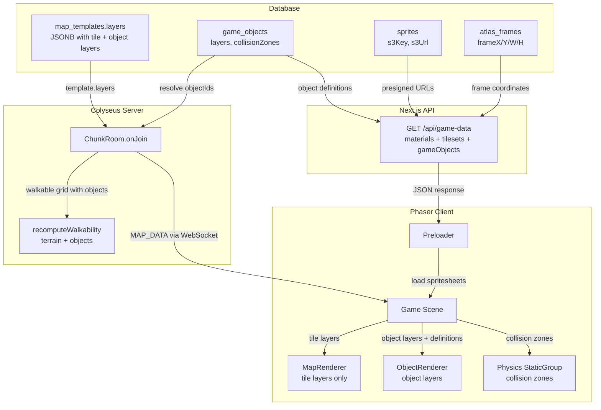
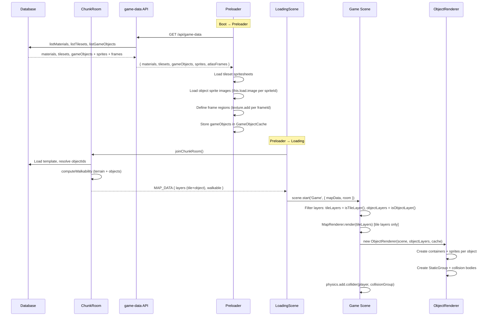

# Game Object Client Rendering Design Document

## Overview

Game objects and sprites placed on maps in genmap are invisible to players. The entire client pipeline -- from shared types through asset loading to rendering and physics -- lacks object layer support. This design document specifies the changes needed to render multi-layer game objects in the Phaser.js 3 game client, create physics bodies from collision zones, and incorporate object collision data into the server-computed walkability grid.

## Design Summary (Meta)

```yaml
design_type: "new_feature"
risk_level: "medium"
complexity_level: "medium"
complexity_rationale: >
  (1) ACs require coordinating type changes across shared/map-lib/map-renderer/game/server packages,
  adding a new API endpoint, extending two loading pipelines (Preloader + ChunkRoom), implementing
  multi-layer composite sprite rendering, and integrating physics bodies with the existing collider.
  (2) Risk of breakage at the MapDataPayload boundary (server-client contract) and potential
  performance impact from rendering many composite sprites.
main_constraints:
  - "MapDataPayload is the WebSocket contract between server and client -- changes must be backward compatible"
  - "Phaser 3 Arcade Physics supports only AABB rectangles (no compound bodies)"
  - "Object spritesheets are in S3 and require presigned URLs via the game-data API"
  - "Walkability grid must be computed server-side before sending MAP_DATA"
biggest_risks:
  - "Large maps with many placed objects could cause performance issues during rendering and physics"
  - "Breaking the MapDataPayload contract could crash existing clients"
unknowns:
  - "Maximum number of placed objects per map in practice (affects rendering performance)"
  - "Whether Phaser RenderTexture stamp approach works for object layers or if individual sprites are needed for z-ordering"
```

## Background and Context

### Prerequisite ADRs

- **ADR-0008**: Object Editor Collision Zones and Metadata -- defines the `CollisionZone` data structure, its storage as a dedicated JSONB column on `game_objects`, and the Phaser 3 runtime consumption pattern using StaticGroup
- **ADR-0007**: Sprite Management Storage and Schema -- establishes the `sprites`, `atlas_frames`, and `game_objects` tables and their JSONB patterns

### Agreement Checklist

#### Scope
- [x] Extend shared types (`LayerData`/`SerializedLayer`) with object layer discriminant
- [x] Extend `MapDataPayload` to include object layers
- [x] Extend `game-data` API to return game object definitions (sprite layers + collision zones + sprite URLs)
- [x] Extend Preloader to load spritesheets referenced by placed game objects
- [x] Extend MapRenderer (or Game scene) to render multi-layer game objects
- [x] Create physics bodies from collision zones in the Game scene
- [x] Update `recomputeWalkability()` to account for object collision zones
- [x] Update ChunkRoom to resolve and send object layer data

#### Non-Scope (Explicitly not changing)
- [x] genmap editor object placement workflow (already works)
- [x] game_objects database schema (already has layers + collisionZones columns)
- [x] Tile layer rendering pipeline (MapRenderer for terrain layers stays unchanged)
- [x] Player character rendering and animation system
- [x] NPC rendering (not yet implemented)
- [x] Object interaction system (future feature)
- [x] Object animation (future feature -- static rendering only)
- [x] `flipY` rendering support (`SerializedPlacedObject` carries the field but the renderer ignores it initially; vertical flipping is uncommon for top-down 2D objects)

#### Constraints
- [x] Parallel operation: Not required (new feature, no existing behavior to maintain)
- [x] Backward compatibility: Required -- MapDataPayload changes must not break clients that do not yet handle object layers
- [x] Performance measurement: Recommended -- test with maps containing 50+ placed objects

### Problem to Solve

When a map template is published in genmap and assigned to a player, the ChunkRoom sends a `MAP_DATA` message containing the map's `layers` array. Currently, `SerializedLayer` only models tile layers (with `frames` and `terrainKey` fields). Object layers saved by genmap (containing `PlacedObject[]` with `objectId` references) are included in the `layers` array but are silently skipped by `MapRenderer.render()` (line 42: `if (!layerData.frames) continue`).

The result: players see terrain but no objects (trees, buildings, furniture, etc.) that were placed by map designers.

### Current Challenges

1. **No type discriminator**: `SerializedLayer` has no `type` field, so tile and object layers are indistinguishable
2. **No object definition resolution**: The client has no way to resolve `objectId` references to render data (sprite layers, frame coordinates, collision zones)
3. **No spritesheet loading**: The Preloader only loads tileset and character spritesheets, not object spritesheets from S3
4. **No object rendering**: MapRenderer only handles tile layers -- there is no code to render composite multi-layer game objects
5. **No physics bodies**: Collision zones defined in the database are never translated to Phaser physics bodies
6. **Incomplete walkability**: `recomputeWalkability()` only considers terrain materials, ignoring object collision zones

### Requirements

#### Functional Requirements

- FR-1: Object layers from map templates are correctly typed and transmitted via WebSocket
- FR-2: The game-data API returns game object definitions including sprite layer metadata, collision zones, and presigned sprite URLs
- FR-3: The Preloader discovers and loads all spritesheets needed by placed game objects
- FR-4: Each game object renders as a multi-layer sprite composite at the correct grid position
- FR-5: Collision zones of type `collision` create invisible static physics bodies that block player movement
- FR-6: Collision zones of type `walkable` allow passage through areas that would otherwise be blocked
- FR-7: The server-computed walkability grid accounts for object collision zones

#### Non-Functional Requirements

- **Performance**: Rendering 50+ placed objects on a 64x64 map should maintain 60 FPS at 2x zoom
- **Reliability**: Missing or failed object sprite loads should not crash the renderer -- objects with missing sprites are silently skipped
- **Maintainability**: Object rendering should be encapsulated in a dedicated class, not mixed into the Game scene

## Acceptance Criteria (AC) - EARS Format

### FR-1: Type System and Data Transmission

- [ ] **AC-1.1**: `SerializedLayer` shall use a discriminated union with `type: 'tile' | 'object'` field
- [ ] **AC-1.2**: **When** an object layer is present in the map template layers array, the system shall include it in the `MapDataPayload.layers` array with `type: 'object'` and the `objects: SerializedPlacedObject[]` field
- [ ] **AC-1.3**: **If** a `SerializedLayer` has no `type` field (legacy data), **then** the client shall treat it as `type: 'tile'`

### FR-2: Game Object Definitions API

- [ ] **AC-2.1**: **When** the game-data API receives a GET request, the response shall include a `gameObjects` map from objectId to `{ layers: GameObjectLayer[], collisionZones: CollisionZone[] }`
- [ ] **AC-2.2**: The response shall include a `sprites` map from spriteId to `{ s3Url: string, width: number, height: number }` for all sprites referenced by the returned game objects
- [ ] **AC-2.3**: The response shall include an `atlasFrames` map from frameId to `{ frameX, frameY, frameW, frameH }` for all frames referenced by the returned game object layers

### FR-3: Asset Loading

- [ ] **AC-3.1**: **When** map data is received containing object layers, the Preloader shall identify all unique spriteIds from all placed objects' definitions, load them as Phaser images (`this.load.image`), and define named frame regions on each texture via `texture.add(frameId, 0, frameX, frameY, frameW, frameH)`
- [ ] **AC-3.2**: **If** a spritesheet fails to load, **then** the Preloader shall log a warning and continue loading remaining assets

### FR-4: Rendering

- [ ] **AC-4.1**: Each placed game object shall render at pixel position `(gridX * TILE_SIZE, gridY * TILE_SIZE)` with each layer offset by `(xOffset, yOffset)` from the GameObjectLayer definition
- [ ] **AC-4.2**: Layers within a game object shall render in `layerOrder` sequence (lowest first)
- [ ] **AC-4.3**: **When** a PlacedObject has `flipX: true`, the composite object shall be rendered horizontally flipped
- [ ] **AC-4.4**: **When** a PlacedObject has `rotation` set to a non-zero value, the composite object shall be rotated accordingly
- [ ] **AC-4.5**: Game objects and the player shall use y-sorted depth: `depth = sprite.y`. The terrain RenderTexture shall remain at `depth = 0`. This ensures objects and the player correctly occlude each other based on their vertical position on screen (lower y = further back = rendered behind higher y)
- [ ] **AC-4.6**: The player's depth shall be updated each frame in `preUpdate()` via `this.setDepth(this.y)`, replacing the current static `depth: 2`

### FR-5 & FR-6: Physics and Collision

- [ ] **AC-5.1**: **When** the Game scene creates, each collision zone of `type: 'collision'` shall create an invisible static physics body at position `(objectPixelX + zone.x + zone.width/2, objectPixelY + zone.y + zone.height/2)` with size `(zone.width, zone.height)`
- [ ] **AC-5.2**: The player sprite shall collide with collision-type static bodies (blocked movement)
- [ ] **AC-5.3**: Collision zones of `type: 'walkable'` shall NOT create physics bodies (walkable overrides are handled at the walkability grid level)

### FR-7: Walkability Grid

- [ ] **AC-7.1**: **When** `recomputeWalkability()` is called with placed objects data, collision zones of `type: 'collision'` shall mark overlapping tile cells as non-walkable (`false`)
- [ ] **AC-7.2**: **When** `recomputeWalkability()` is called with placed objects data, collision zones of `type: 'walkable'` shall mark overlapping tile cells as walkable (`true`), overriding both terrain walkability and prior collision zones
- [ ] **AC-7.3**: The walkability computation shall apply collision zones first, then walkable zones (walkable overrides collision)

## Applicable Standards

### Classification Table

| Standard | Type | Source | Impact on Design |
|----------|------|--------|-----------------|
| Prettier: single quotes, 2-space indent | Explicit | `.prettierrc`, `.editorconfig` | All new code must use single quotes and 2-space indent |
| ESLint flat config with `@nx/eslint-plugin` | Explicit | `eslint.config.mjs` | New code must pass lint |
| TypeScript strict mode, ES2022 target | Explicit | `tsconfig.json` | Strict null checks, no implicit any |
| JSONB for semi-structured data | Implicit | `packages/db/src/schema/*.ts` | Object definitions stored as JSONB |
| Service layer pattern (functions, not classes) | Implicit | `packages/db/src/services/*.ts` | DB access via exported async functions |
| Presigned S3 URLs for sprites | Implicit | `apps/game/src/game/scenes/Preloader.ts`, `apps/game/src/app/api/game-data/route.ts` | Sprite URLs must be presigned at API response time |
| MapDataPayload as WebSocket contract | Implicit | `packages/shared/src/types/map.ts`, `apps/server/src/rooms/ChunkRoom.ts` | Changes must maintain backward compat |
| TILE_SIZE = 16 constant | Implicit | `apps/game/src/game/constants.ts` | Grid-to-pixel conversion uses 16px tiles |

## Existing Codebase Analysis

### Implementation Path Mapping

| Type | Path | Description |
|------|------|-------------|
| Existing | `packages/shared/src/types/map.ts` | `LayerData`, `SerializedLayer`, `MapDataPayload` -- needs type discriminator and object variant |
| Existing | `packages/map-renderer/src/map-renderer.ts` | Tile layer rendering -- skips non-tile layers; no object rendering |
| Existing | `apps/game/src/game/scenes/Preloader.ts` | Asset loading -- only loads tilesets and characters |
| Existing | `apps/game/src/game/scenes/Game.ts` | Game scene setup -- no object rendering or physics |
| Existing | `apps/game/src/app/api/game-data/route.ts` | API -- returns materials and tilesets, not game objects |
| Existing | `apps/server/src/rooms/ChunkRoom.ts` | Server join flow -- sends MapDataPayload without resolving object definitions |
| Existing | `packages/map-lib/src/core/walkability.ts` | Walkability -- terrain-only, ignores objects |
| Existing | `packages/db/src/services/game-object.ts` | DB service -- `getGameObject()`, `listGameObjects()` already exist |
| Existing | `packages/db/src/services/sprite.ts` | DB service -- `getSprite()` already exists |
| Existing | `packages/db/src/schema/game-objects.ts` | Schema -- `GameObjectLayer`, `CollisionZone` interfaces already defined |
| New | `apps/game/src/game/objects/ObjectRenderer.ts` | New class to manage game object rendering and physics |

### Code Inspection Evidence

#### What Was Examined

| File Inspected | Key Finding | Design Impact |
|---------------|-------------|---------------|
| `packages/shared/src/types/map.ts` | `SerializedLayer` has no `type` discriminator; only has `frames`, `terrainKey`, `tilesetKeys` | Must add discriminated union with backward compat for legacy layers |
| `packages/map-renderer/src/map-renderer.ts:42` | `if (!layerData.frames) continue` silently skips object layers | MapRenderer stays unchanged for tile layers; object rendering handled separately |
| `apps/game/src/game/scenes/Preloader.ts:53-91` | Loads character sheets in `preload()`, tileset sheets in `create()` via game-data API | Object spritesheets should load in `create()` after game-data API returns object data |
| `apps/game/src/game/scenes/Game.ts:40-51` | Creates MapRenderer, renders map, creates Player; no physics setup | Must add ObjectRenderer creation and physics body setup after map render |
| `apps/game/src/app/api/game-data/route.ts` | Returns `{ materials, tilesets }` -- no game objects | Extend to return game object definitions with resolved sprite URLs |
| `apps/server/src/rooms/ChunkRoom.ts:134-195` | Constructs MapDataPayload from template data; `layers` comes directly from template JSONB | Object layers already present in template JSONB; server must resolve objectIds for walkability |
| `packages/map-lib/src/core/walkability.ts:18-33` | Only iterates `grid[y][x].terrain` for walkability | Must accept optional placed objects + definitions parameter |
| `packages/db/src/schema/game-objects.ts:10-16` | `GameObjectLayer` has `frameId`, `spriteId`, `xOffset`, `yOffset`, `layerOrder` | Reuse this interface directly in shared types |
| `packages/db/src/schema/game-objects.ts:18-27` | `CollisionZone` has `id`, `label`, `type`, `shape`, `x`, `y`, `width`, `height` | Reuse this interface directly in shared types |
| `apps/genmap/src/hooks/use-object-render-data.ts` | Resolves objectId via `/api/objects/:id` then `/api/sprites/:id` then `/api/sprites/:id/frames` | Game client should use a bulk endpoint instead of N+1 individual fetches |
| `apps/game/src/game/systems/movement.ts:78-89` | `isTileWalkable()` checks `walkable[tileY][tileX]` -- tile-grid-based blocking | Walkability grid remains the primary movement blocker; physics is secondary enforcement |
| `apps/game/src/game/entities/Player.ts:52-80` | Player is a Sprite with bottom-center origin, depth 2, no physics body | Must add Arcade Physics body to player for collider registration |

#### Key Findings

1. **Object layers already flow through the pipeline** -- genmap saves them in the editor map's `layers` JSONB, templates copy them, and ChunkRoom sends them in MapDataPayload. They are just silently ignored on the client.

2. **MapRenderer should NOT render objects** -- it uses a RenderTexture stamp pattern (flattening all tiles into a single texture), which would prevent per-object depth sorting. Objects need individual Phaser game objects.

3. **Walkability is tile-grid-based** -- the movement system uses `walkable[y][x]` boolean grid, not pixel-based physics. Object collision zones (defined in pixels) must be mapped to tile grid cells.

4. **Dual enforcement needed** -- walkability grid prevents movement at the calculation level (both client and server), while Phaser physics bodies provide visual/physical blocking on the client. Both must agree.

5. **Player lacks a physics body** -- currently a plain Sprite. Adding a collider with the object StaticGroup requires enabling Arcade Physics on the player.

#### How Findings Influence Design

- Object rendering is a separate concern from tile rendering -- a new `ObjectRenderer` class handles it
- Walkability update happens server-side before MAP_DATA is sent, so the client receives a complete walkable grid
- Physics bodies on the client are secondary enforcement, not the primary blocker
- The game-data API gets a bulk object definitions endpoint to avoid N+1 fetches

### Similar Functionality Search

- **Object rendering in genmap**: `canvas-renderer.ts` renders objects using HTML5 Canvas 2D API (not Phaser). Different rendering target but same data flow pattern.
- **Tile rendering in game**: `MapRenderer` renders tiles. Different rendering approach needed for objects (individual sprites vs stamped texture).
- **No existing Phaser object/physics rendering code** in the game client.

**Decision**: New implementation required. No existing client-side object rendering code to reuse.

## Design

### Change Impact Map

```yaml
Change Target: Game object rendering pipeline (new feature)
Direct Impact:
  - packages/shared/src/types/map.ts (SerializedLayer discriminated union, new types)
  - packages/shared/src/index.ts (export new types)
  - apps/game/src/app/api/game-data/route.ts (add game object definitions to response)
  - apps/game/src/game/scenes/Preloader.ts (load object spritesheets)
  - apps/game/src/game/scenes/Game.ts (filter layers by type, create ObjectRenderer, setup physics; remove `as unknown as GeneratedMap` cast)
  - apps/game/src/game/objects/ObjectRenderer.ts (new file)
  - packages/map-lib/src/core/walkability.ts (accept object collision zones)
  - packages/map-lib/src/index.ts (export updated walkability types)
  - apps/server/src/rooms/ChunkRoom.ts (resolve object definitions for walkability)
  - packages/map-renderer/src/map-renderer.ts (type update only, no behavior change)
Indirect Impact:
  - packages/db/src/index.ts (may export new service for bulk object/sprite/frame lookup)
  - apps/game/src/game/entities/Player.ts (needs physics body for collider, needs y-sorted depth)
  - apps/game/src/game/scenes/LoadingScene.ts (no change -- passes MapDataPayload through)
No Ripple Effect:
  - apps/genmap/ (editor already handles objects, no changes needed)
  - packages/db/src/schema/ (no schema changes)
  - apps/game/src/game/systems/movement.ts (uses walkable grid, which will already include object data)
  - apps/game/src/game/entities/states/ (movement states use walkable grid, already correct)
  - apps/game/src/game/multiplayer/ (PlayerManager, remote sprites -- unaffected)
```

### Architecture Overview



### Data Flow

#### Server-Side Flow (ChunkRoom.onJoin)

**Walkability recomputation policy**: Walkability is **always recomputed on every join**, regardless of whether the player is new or returning. This ensures:
- Object collision zones from the current game_objects table are always reflected
- Changes to object definitions (e.g., a tree's collision zone was resized) take effect immediately
- The saved `walkable` grid in the DB is treated as a cache, not a source of truth

```
For RETURNING players (savedMap exists):
  1. Load savedMap from DB (savedMap.layers, savedMap.grid, savedMap.walkable)
  2. Extract objectIds from all object layers in savedMap.layers
  3. Batch-fetch current game_objects for those objectIds (collisionZones)
  4. Recompute walkability from scratch:
     a. recomputeWalkability(grid, width, height, materials) -- terrain base
     b. applyObjectCollisionZones(walkable, objectLayers, objectDefinitions, TILE_SIZE) -- overlay
  5. Send MapDataPayload with recomputed walkable grid
  6. (Fire-and-forget) Update saved walkable grid in DB if it changed

For NEW players (no savedMap, using template):
  1. Pick random published template
  2. Extract objectIds from all object layers in template.layers
  3. Batch-fetch current game_objects for those objectIds (collisionZones)
  4. Compute walkability from scratch:
     a. recomputeWalkability(grid, width, height, materials) -- terrain base
     b. applyObjectCollisionZones(walkable, objectLayers, objectDefinitions, TILE_SIZE) -- overlay
  5. Send MapDataPayload with computed walkable grid
  6. Save map to DB with computed walkable grid
```

**Note**: The template's `walkable` field and `savedMap.walkable` are **not used directly**. They exist as cached values for other consumers but are always recomputed in ChunkRoom.onJoin to ensure consistency with the current game_objects table.

#### Client-Side Flow

```
1. Preloader.create():
   a. Fetch /api/game-data → { materials, tilesets, gameObjects, sprites, atlasFrames }
   b. Load tileset spritesheets (existing)
   c. Load object sprite images (this.load.image per unique spriteId)
   d. Define frame regions on each loaded texture via texture.add()
   e. Store gameObjects/sprites/atlasFrames in a GameObjectCache service

2. LoadingScene → receives MAP_DATA → passes to Game

3. Game.create():
   a. FILTER mapData.layers into tile layers and object layers:
      - tileLayers = mapData.layers.filter(isTileLayer) -- these have `frames`
      - objectLayers = mapData.layers.filter(isObjectLayer) -- these have `objects`
   b. Build a LayerData[]-compatible structure from tileLayers for MapRenderer
      (SerializedTileLayer and LayerData have identical runtime shape)
   c. Render tile layers via MapRenderer (existing, unchanged)
   d. Create ObjectRenderer(scene, objectLayers, gameObjectCache)
   e. ObjectRenderer creates:
      - Phaser.GameObjects.Container per placed object
      - Child sprites per GameObjectLayer (sorted by layerOrder)
      - StaticGroup with invisible bodies for collision zones
   f. Register physics.add.collider(player, collisionGroup)
```

**Important: LayerData / SerializedLayer type gap**

`GeneratedMap.layers` is typed as `LayerData[]`, which always has `frames` and `terrainKey`. After the discriminated union change, `MapDataPayload.layers` becomes `SerializedLayer[]` (union of `SerializedTileLayer | SerializedObjectLayer`). `Game.ts:34` currently casts `MapDataPayload` to `GeneratedMap` via `as unknown as GeneratedMap`, which would be unsound if object layers are present (they lack `frames`).

The fix is to stop casting the full `MapDataPayload` to `GeneratedMap`. Instead, `Game.create()` should:

1. Filter `mapData.layers` using `isTileLayer()` and `isObjectLayer()` helpers
2. Pass only `SerializedTileLayer[]` to `MapRenderer.render()` -- this is safe because `SerializedTileLayer` is structurally identical to `LayerData` at runtime (both have `name`, `terrainKey`, `frames`, optional `tilesetKeys`)
3. Pass `SerializedObjectLayer[]` to `ObjectRenderer`

`LayerData` itself does **not** need to become a discriminated union. It remains a tile-only rendering interface used by `MapRenderer` and `GeneratedMap`. The discriminated union exists only at the network transfer layer (`SerializedLayer`). The filtering step in `Game.create()` bridges the two type systems.

```typescript
// Game.ts -- updated init/create flow
import { isTileLayer, isObjectLayer, type SerializedTileLayer, type SerializedObjectLayer } from '@nookstead/shared';

init(data: { mapData: MapDataPayload; room?: Room }): void {
  // Store raw MapDataPayload -- do NOT cast to GeneratedMap
  this.rawMapData = data.mapData;
  this.room = data.room ?? null;
  this.serverSpawnX = data.mapData.spawnX;
  this.serverSpawnY = data.mapData.spawnY;
}

create(): void {
  const mapData = this.rawMapData;
  if (!mapData) return;

  // Filter layers by type
  const tileLayers = mapData.layers.filter(isTileLayer);
  const objectLayers = mapData.layers.filter(isObjectLayer);

  // MapRenderer expects LayerData[] -- SerializedTileLayer is structurally identical
  const mapForRenderer = {
    width: mapData.width,
    height: mapData.height,
    seed: mapData.seed,
    grid: mapData.grid,
    layers: tileLayers as unknown as LayerData[],
    walkable: mapData.walkable,
  };

  this.mapRenderer = new MapRenderer(this, { tileSize: TILE_SIZE, frameSize: FRAME_SIZE });
  this.mapRenderer.render(mapForRenderer);

  // Object rendering (new)
  this.objectRenderer = new ObjectRenderer(this, objectLayers, gameObjectCache, TILE_SIZE);
  // ... physics setup ...
}
```

### Data Flow Diagram



### Integration Points List

| Integration Point | Location | Old Implementation | New Implementation | Switching Method |
|-------------------|----------|-------------------|-------------------|------------------|
| SerializedLayer type | `packages/shared/src/types/map.ts` | Single interface (tile only) | Discriminated union (tile + object) | Type addition (backward compat) |
| game-data API response | `apps/game/src/app/api/game-data/route.ts` | `{ materials, tilesets }` | `{ materials, tilesets, gameObjects, sprites, atlasFrames }` | Additive fields |
| Preloader asset loading | `apps/game/src/game/scenes/Preloader.ts` | Loads tilesets only | Also loads object sprite images + defines frame regions | Additional loading step in `create()` |
| Game scene setup | `apps/game/src/game/scenes/Game.ts` | MapRenderer only; layers cast to GeneratedMap | Filter layers by type; MapRenderer for tile layers + ObjectRenderer for object layers + physics | Layer filtering replaces unsafe cast; additional initialization after map render |
| Walkability computation | `packages/map-lib/src/core/walkability.ts` | Terrain-only | Terrain + object collision zones | New `applyObjectCollisionZones()` function |
| ChunkRoom join flow | `apps/server/src/rooms/ChunkRoom.ts` | Direct template layers | Resolve object definitions, compute full walkability | Additional resolution step before MAP_DATA |

### Main Components

#### Component 1: Shared Types Extension

- **Responsibility**: Define discriminated union for `SerializedLayer` and network-transfer types for placed objects and game object definitions
- **Interface**: TypeScript type definitions exported from `@nookstead/shared`
- **Dependencies**: None (pure type definitions)

#### Component 2: Game Object Definitions API

- **Responsibility**: Return all game object definitions needed for rendering, including sprite URLs and frame coordinates
- **Interface**: Extended `GET /api/game-data` response with `gameObjects`, `sprites`, `atlasFrames` fields
- **Dependencies**: `@nookstead/db` (game-object, sprite, atlas-frame services), `@nookstead/s3` (presigned URLs)

#### Component 3: GameObjectCache Service

- **Responsibility**: Store game object definitions, sprite metadata, and frame data fetched from the API for use during rendering
- **Interface**: `getObjectDefinition(objectId)`, `getSpriteUrl(spriteId)`, `getFrameData(frameId)`
- **Dependencies**: game-data API response

#### Component 4: ObjectRenderer

- **Responsibility**: Create and manage Phaser game objects (containers, sprites, physics bodies) for all placed objects on the map
- **Interface**: Constructor takes scene, object layers, and cache; provides `destroy()` for cleanup; exposes `collisionGroup` for collider registration
- **Dependencies**: GameObjectCache, Phaser Scene

#### Component 5: Walkability Extension

- **Responsibility**: Apply object collision zones to the terrain-based walkability grid
- **Interface**: `applyObjectCollisionZones(walkable, placedObjects, objectDefinitions, tileSize)` -- mutates walkable grid in place
- **Dependencies**: None (pure function)

### Depth Sorting Strategy

All renderable entities (game objects and player) use **y-sorted depth** so that entities lower on screen render in front of entities higher on screen. This creates correct visual occlusion (e.g., a player walking behind a tree is occluded by the tree trunk).

**Depth formula**: `depth = sprite.y` (pixel y-coordinate)

| Entity | Current Depth | New Depth | Update Frequency |
|--------|--------------|-----------|-----------------|
| Terrain RenderTexture | 0 | 0 (unchanged) | Static |
| Hover highlight | 1 | 1 (unchanged) | Static |
| Player | 2 (static) | `this.y` (y-sorted) | Every frame in `preUpdate()` |
| Game object container | N/A | `gridY * tileSize + tileSize` | Set once at creation |

**Player depth update**: The existing `Player.preUpdate()` method (which already handles reconciliation interpolation and FSM updates) gains one additional line:

```typescript
// Player.ts -- in preUpdate(), after super.preUpdate()
this.setDepth(this.y);
```

This replaces the static `this.setDepth(2)` in the constructor. The player's depth now tracks its y-position, so walking behind a tree (higher y than the tree) renders the player in front, and walking in front (lower y) renders the player behind.

**Object depth**: Each object container is set to `depth = gridY * tileSize + tileSize` at creation time. The `+ tileSize` offset anchors the depth to the bottom of the object's grid cell, matching the player's bottom-center origin convention.

**RenderTexture safety**: The terrain RenderTexture stays at `depth = 0`. Since all y-sorted depths are positive pixel coordinates (minimum `tileSize = 16`), the terrain always renders behind all entities.

**Known limitation**: Objects are static (no animation or movement), so their depth is set once. If dynamic objects are added in the future, they would also need per-frame depth updates.

### Contract Definitions

#### SerializedLayer Discriminated Union

```typescript
// packages/shared/src/types/map.ts

/** Tile layer: autotile frame data for terrain rendering. */
export interface SerializedTileLayer {
  type: 'tile';
  name: string;
  terrainKey: string;
  frames: number[][];
  tilesetKeys?: string[][];
}

/** A placed game object reference within an object layer. */
export interface SerializedPlacedObject {
  id: string;
  objectId: string;
  objectName: string;
  gridX: number;
  gridY: number;
  rotation: number;
  flipX: boolean;
  flipY: boolean;
}

/** Object layer: placed game objects on the map. */
export interface SerializedObjectLayer {
  type: 'object';
  name: string;
  objects: SerializedPlacedObject[];
}

/** Discriminated union for all layer types in network transfer. */
export type SerializedLayer = SerializedTileLayer | SerializedObjectLayer;
```

**Backward Compatibility**: The existing `SerializedLayer` interface has no `type` field. Code consuming `SerializedLayer` should treat layers without a `type` field as `'tile'`:

```typescript
function isTileLayer(layer: SerializedLayer): layer is SerializedTileLayer {
  return !('type' in layer) || layer.type === 'tile';
}

function isObjectLayer(layer: SerializedLayer): layer is SerializedObjectLayer {
  return 'type' in layer && layer.type === 'object';
}
```

These helper functions shall be exported from `@nookstead/shared`.

#### Game Object Definition Types (Shared)

```typescript
// packages/shared/src/types/map.ts

/** A single render layer within a game object definition. */
export interface GameObjectLayerDef {
  frameId: string;
  spriteId: string;
  xOffset: number;
  yOffset: number;
  layerOrder: number;
}

/** A collision zone on a game object. */
export interface CollisionZoneDef {
  id: string;
  label: string;
  type: 'collision' | 'walkable';
  shape: 'rectangle';
  x: number;
  y: number;
  width: number;
  height: number;
}

/** Complete game object definition for client-side rendering. */
export interface GameObjectDefinition {
  id: string;
  name: string;
  layers: GameObjectLayerDef[];
  collisionZones: CollisionZoneDef[];
}

/** Sprite metadata for client-side asset loading. */
export interface SpriteMeta {
  s3Url: string;
  width: number;
  height: number;
}

/** Atlas frame metadata for client-side rendering. */
export interface AtlasFrameMeta {
  spriteId: string;
  frameX: number;
  frameY: number;
  frameW: number;
  frameH: number;
}
```

#### Updated MapDataPayload

No change to `MapDataPayload` structure -- it already has `layers: SerializedLayer[]`. The type change from the old interface to the discriminated union is transparent. Object layers will now be typed correctly.

#### game-data API Response

```typescript
interface GameDataResponse {
  materials: MaterialProperties[];
  tilesets: TilesetMeta[];
  // New fields:
  gameObjects: Record<string, GameObjectDefinition>;
  sprites: Record<string, SpriteMeta>;
  atlasFrames: Record<string, AtlasFrameMeta>;
}
```

### Data Contract

#### game-data API

```yaml
Input:
  Type: HTTP GET /api/game-data
  Preconditions: Database accessible, S3 accessible for presigned URLs
  Validation: None (read-only endpoint)

Output:
  Type: GameDataResponse (JSON)
  Guarantees:
    - materials array contains all materials in DB
    - tilesets array contains all tilesets with valid presigned URLs
    - gameObjects map contains ALL game objects in DB (keyed by id)
    - sprites map contains all sprites referenced by any game object layer
    - atlasFrames map contains all frames referenced by any game object layer
  On Error: HTTP 500 with { error: "Internal server error" }

Invariants:
  - Every spriteId in gameObjects[x].layers exists as a key in sprites
  - Every frameId in gameObjects[x].layers exists as a key in atlasFrames
```

#### ObjectRenderer

```yaml
Input:
  Type: ObjectRendererConfig
    scene: Phaser.Scene
    objectLayers: SerializedObjectLayer[]
    cache: GameObjectCache
    tileSize: number
  Preconditions:
    - Scene has Arcade Physics enabled
    - All sprite images referenced by game objects are loaded in Phaser texture manager with frame regions defined
    - Cache is populated from game-data API response
  Validation: Skip objects whose definitions are not in cache

Output:
  Type: ObjectRenderer instance
  Guarantees:
    - One Container per placed object with correct position and layer sprites
    - collisionGroup StaticGroup containing all collision-type zones
    - No sprites created for objects with missing textures
  On Error: Log warning per missing object/sprite, continue rendering others

Invariants:
  - Container count equals number of successfully rendered placed objects
  - Physics body count equals number of collision-type zones from successfully rendered objects
```

#### Walkability Extension

```yaml
Input:
  Type: applyObjectCollisionZones parameters
    walkable: boolean[][] (mutable, will be modified in place)
    placedObjects: Array<{ objectId: string, gridX: number, gridY: number }>
    objectDefinitions: Map<string, { collisionZones: CollisionZoneDef[] }>
    tileSize: number
  Preconditions:
    - walkable grid dimensions match map dimensions
    - gridX/gridY are valid tile coordinates
  Validation: Skip objects whose objectId is not in objectDefinitions

Output:
  Type: void (modifies walkable in place)
  Guarantees:
    - Collision zones set overlapping cells to false
    - Walkable zones set overlapping cells to true (applied after collision)
    - Out-of-bounds cells are clamped (no array index errors)
  On Error: Skip individual objects with missing definitions

Invariants:
  - Grid dimensions unchanged
  - Only cells overlapping collision/walkable zones are modified
```

### Data Representation Decisions

| Data Structure | Decision | Rationale |
|---|---|---|
| `SerializedPlacedObject` | **New** type in shared | Maps 1:1 to editor's `PlacedObject` but lives in the network transfer types namespace. The editor type includes `id` as a string UUID; the serialized version is identical. Creating a separate type maintains the boundary between editor types (map-lib) and network types (shared). |
| `GameObjectDefinition` | **New** type in shared | No existing network transfer type for object definitions. The DB schema type (`GameObject`) includes DB metadata (timestamps, etc.) that should not be sent to the client. |
| `GameObjectLayerDef` | **New** type in shared (mirrors DB `GameObjectLayer`) | Identical fields to `GameObjectLayer` from `packages/db/src/schema/game-objects.ts`, but defined in shared package to avoid game client depending on DB package. |
| `CollisionZoneDef` | **New** type in shared (mirrors DB `CollisionZone`) | Same rationale as above -- client needs collision zone data without a DB package dependency. |
| `SpriteMeta` / `AtlasFrameMeta` | **New** types in shared | Lightweight subsets of the full DB `Sprite` and `AtlasFrame` types. Only the fields needed for client-side rendering are included. |

### Field Propagation Map

```yaml
fields:
  - name: "objectId (PlacedObject reference)"
    origin: "genmap editor (user places object on map)"
    transformations:
      - layer: "Editor State"
        type: "PlacedObject.objectId"
        validation: "Must reference existing game_objects.id"
      - layer: "Database (map_templates.layers JSONB)"
        type: "Embedded in object layer JSON"
        transformation: "Serialized as part of layers array"
      - layer: "ChunkRoom (server)"
        type: "Extracted from template.layers"
        transformation: "Used to batch-fetch game_objects for walkability"
      - layer: "MapDataPayload (network)"
        type: "SerializedPlacedObject.objectId"
        transformation: "Passed through unchanged"
      - layer: "Game Scene (client)"
        type: "Used as key into GameObjectCache"
        transformation: "Resolved to GameObjectDefinition"
    destination: "ObjectRenderer creates sprites from definition"
    loss_risk: "low"
    loss_risk_reason: "objectId is a UUID string passed through without transformation"

  - name: "collisionZones (object collision data)"
    origin: "genmap collision zone editor (ADR-0008)"
    transformations:
      - layer: "Database (game_objects.collision_zones JSONB)"
        type: "CollisionZone[]"
        validation: "Application-level validation at API write time"
      - layer: "ChunkRoom (server)"
        type: "Fetched from game_objects table by objectId"
        transformation: "Used by applyObjectCollisionZones() to modify walkable grid"
      - layer: "game-data API (client)"
        type: "CollisionZoneDef[] in GameObjectDefinition"
        transformation: "Mapped from DB CollisionZone (identical fields)"
      - layer: "ObjectRenderer (client)"
        type: "Used to create Phaser StaticBody instances"
        transformation: "x/y relative to object origin → absolute pixel position"
    destination: "Phaser StaticGroup bodies + walkable grid cells"
    loss_risk: "low"
    loss_risk_reason: "Collision zones flow as structured JSON; only transformation is coordinate offset"

  - name: "spriteId + frameId (render layer references)"
    origin: "genmap object editor (layer composition)"
    transformations:
      - layer: "Database (game_objects.layers JSONB)"
        type: "GameObjectLayer.spriteId, .frameId"
        validation: "validateFrameReferences() at write time"
      - layer: "game-data API"
        type: "Resolved to SpriteMeta (s3Url) and AtlasFrameMeta (frameX/Y/W/H)"
        transformation: "spriteId → presigned S3 URL; frameId → frame coordinates"
      - layer: "Preloader"
        type: "s3Url used as Phaser spritesheet source"
        transformation: "URL → loaded texture in Phaser TextureManager"
      - layer: "ObjectRenderer"
        type: "spriteId → texture key, frameId → frame coordinates for Phaser.Sprite"
        transformation: "Frame rect used to set texture frame on sprite"
    destination: "Phaser sprite child within object Container"
    loss_risk: "medium"
    loss_risk_reason: "If sprite fails to load from S3, the object will be missing visual layers. Mitigated by graceful skip with warning log."
```

### Integration Boundary Contracts

```yaml
Boundary 1: ChunkRoom → MapDataPayload (WebSocket)
  Input: Template layers (JSONB from DB, includes object layers)
  Output: MapDataPayload with typed layers array (sync, single message)
  On Error: Send ServerMessage.ERROR to client, do not send MAP_DATA

Boundary 2: game-data API → Preloader (HTTP)
  Input: HTTP GET request
  Output: JSON with materials, tilesets, gameObjects, sprites, atlasFrames (sync HTTP response)
  On Error: Return HTTP 500; Preloader logs error and continues without object data

Boundary 3: Preloader → Game Scene (Phaser scene data)
  Input: GameObjectCache populated from API response
  Output: Cache available as singleton/registry for Game scene to access
  On Error: Cache may be partially populated; ObjectRenderer handles missing entries

Boundary 4: Game Scene → ObjectRenderer (constructor)
  Input: Scene reference, object layers from MapDataPayload, GameObjectCache, tileSize
  Output: Rendered objects in scene, collisionGroup for physics registration
  On Error: Individual objects with missing data are skipped with console.warn

Boundary 5: recomputeWalkability + applyObjectCollisionZones (function call)
  Input: Grid, dimensions, materials map, placed objects, object definitions, tileSize
  Output: Modified walkable[][] grid (sync, in-place mutation)
  On Error: Objects with missing definitions are skipped; walkable grid is still valid
```

### Integration Point Map

```yaml
Integration Point 1:
  Existing Component: ChunkRoom.onJoin (map loading and MAP_DATA sending)
  Integration Method: Add object definition resolution step before walkability computation
  Impact Level: Medium (data flow change -- walkable grid now incorporates objects)
  Required Test Coverage: Verify walkable grid includes object collision zones

Integration Point 2:
  Existing Component: GET /api/game-data route handler
  Integration Method: Add game object, sprite, and frame data to response
  Impact Level: Medium (API response shape change -- additive)
  Required Test Coverage: Verify response includes gameObjects/sprites/atlasFrames

Integration Point 3:
  Existing Component: Preloader.create() asset loading
  Integration Method: Add object spritesheet loading after game-data fetch
  Impact Level: Low (additive loading step)
  Required Test Coverage: Verify object spritesheets are loaded when game objects exist

Integration Point 4:
  Existing Component: Game.create() scene setup
  Integration Method: Add ObjectRenderer creation and physics collider setup
  Impact Level: Medium (new rendering + physics in main game scene)
  Required Test Coverage: Verify objects render at correct positions; verify collision blocks movement

Integration Point 5:
  Existing Component: Player entity (needs physics body for collider)
  Integration Method: Enable Arcade Physics on player sprite
  Impact Level: Medium (adding physics to existing entity)
  Required Test Coverage: Verify player collides with object collision bodies
```

### Error Handling

| Error Scenario | Handling |
|----------------|----------|
| game-data API fails | Preloader logs error, continues. No object data available. ObjectRenderer creates nothing. |
| Individual sprite fails to load from S3 | Preloader logs warning per sprite. Objects using that sprite render without those layers. |
| objectId in PlacedObject not found in GameObjectCache | ObjectRenderer logs warning, skips that object. Other objects render normally. |
| Collision zone coordinates out of map bounds | `applyObjectCollisionZones` clamps to grid bounds. No array index errors. |
| No object layers in map data | ObjectRenderer creates nothing. No physics group. No performance cost. |

### Logging and Monitoring

```
[Preloader] Loaded N object spritesheets
[Preloader] Warning: Failed to load sprite {spriteId}: {error}
[ObjectRenderer] Rendered N objects with M collision bodies
[ObjectRenderer] Warning: Skipping object {objectId} - definition not found in cache
[ChunkRoom] Walkability updated with N object collision zones for userId={userId}
```

## Implementation Plan

### Implementation Approach

**Selected Approach**: Vertical Slice (Feature-driven)
**Selection Reason**: Each phase delivers a testable increment. The feature has low inter-component coupling -- types can be defined first, then API, then loading, then rendering, then physics, then walkability. Each step builds on the previous but can be verified independently.

### Technical Dependencies and Implementation Order

#### Phase 1: Foundation -- Types and API

1. **Shared Types Extension** (`packages/shared/src/types/map.ts`)
   - Technical Reason: All other components depend on these type definitions
   - Dependent Elements: API, Preloader, Game scene, ObjectRenderer, walkability
   - Changes:
     - Add `SerializedTileLayer`, `SerializedObjectLayer`, `SerializedPlacedObject` interfaces
     - Change `SerializedLayer` to discriminated union
     - Add `GameObjectDefinition`, `GameObjectLayerDef`, `CollisionZoneDef`, `SpriteMeta`, `AtlasFrameMeta`
     - Add `isTileLayer()`, `isObjectLayer()` helper functions
     - Export all new types from `packages/shared/src/index.ts`
   - Verification: L3 (build success)

2. **game-data API Extension** (`apps/game/src/app/api/game-data/route.ts`)
   - Technical Reason: Client needs object definitions before rendering
   - Prerequisites: Shared types defined
   - Changes:
     - Import `listGameObjects`, `getFramesBySprite`, `getSprite` from `@nookstead/db`
     - Fetch all game objects, their referenced sprites, and frame data
     - Generate presigned URLs for sprite S3 keys
     - Return `gameObjects`, `sprites`, `atlasFrames` in response
   - Verification: L1 (API returns correct data via curl/browser)

#### Phase 2: Asset Loading

3. **GameObjectCache Service** (`apps/game/src/game/services/game-object-cache.ts`)
   - Technical Reason: Decouples data fetching from rendering
   - Prerequisites: API response shape finalized
   - Changes:
     - Create a simple cache class storing maps from objectId/spriteId/frameId to definitions
     - Provide typed getters
   - Verification: L2 (unit tests)

4. **Preloader Extension** (`apps/game/src/game/scenes/Preloader.ts`)
   - Technical Reason: Sprite textures must be loaded before rendering
   - Prerequisites: API extension, GameObjectCache
   - Changes:
     - After `fetchGameData()`, populate GameObjectCache
     - Identify unique sprite URLs from the response
     - Load each object sprite as a Phaser **image** (not spritesheet): `this.load.image(spriteId, s3Url)`
     - After images are loaded, define frame regions on each texture manually:
       ```typescript
       const texture = this.textures.get(spriteId);
       texture.add(frameId, 0, frameX, frameY, frameW, frameH);
       ```
     - This approach is chosen over `this.load.spritesheet()` because object spritesheets have **varying frame sizes** (each atlas frame can have different dimensions). Phaser's spritesheet loader requires uniform frame sizes, which does not match our data model where each `AtlasFrameMeta` has its own `frameW`/`frameH`.
   - Verification: L1 (textures with named frames appear in Phaser TextureManager)

#### Phase 3: Rendering

5. **ObjectRenderer** (`apps/game/src/game/objects/ObjectRenderer.ts`)
   - Technical Reason: Core rendering logic for objects
   - Prerequisites: Spritesheets loaded, cache populated
   - Changes:
     - Create `ObjectRenderer` class
     - `render(objectLayers, tileSize)` creates Containers with child Sprites
     - Each Container positioned at `(gridX * tileSize, gridY * tileSize)`
     - Each child Sprite uses the spriteId as texture key and frameId as frame name:
       `scene.add.sprite(xOffset, yOffset, spriteId, frameId)`
       (frame regions were defined by Preloader via `texture.add()`)
     - Handle `flipX` and `rotation` on the Container
     - Depth sorting: containers at `depth = gridY * tileSize + tileSize` (y-sort, see Depth Sorting Strategy section)
   - Verification: L1 (objects visible in game at correct positions)

#### Phase 4: Physics

6. **Collision Bodies** (in `ObjectRenderer`)
   - Technical Reason: Objects must block player movement
   - Prerequisites: ObjectRenderer rendering works
   - Changes:
     - After creating containers, iterate collision zones
     - Create invisible StaticGroup members for `type: 'collision'` zones
     - Expose `getCollisionGroup()` method
   - Verification: L1 (player cannot walk through collision zones)

7. **Player Physics and Depth Integration** (`apps/game/src/game/scenes/Game.ts`, `Player.ts`)
   - Technical Reason: Collider requires physics body on both sides; y-sorted depth required for correct occlusion with objects
   - Prerequisites: ObjectRenderer with collision group
   - Changes:
     - Enable Arcade Physics on Player sprite: `scene.physics.add.existing(player)`
     - Register collider: `scene.physics.add.collider(player, objectRenderer.getCollisionGroup())`
     - Replace static `this.setDepth(2)` in Player constructor with y-sorted depth
     - Add `this.setDepth(this.y)` in Player.preUpdate() (see Depth Sorting Strategy section)
   - Verification: L1 (player stops at object boundaries; player renders behind objects when at lower y)

#### Phase 5: Server-Side Walkability

8. **Walkability Extension** (`packages/map-lib/src/core/walkability.ts`)
   - Technical Reason: Server-computed walkable grid must include object collision zones
   - Prerequisites: Shared types for collision zones
   - Changes:
     - Add `applyObjectCollisionZones()` function
     - Maps pixel-based collision zones to tile grid cells
     - Applies collision (false) then walkable (true) overrides
   - Verification: L2 (unit tests with known collision zones and expected grid output)

9. **ChunkRoom Integration** (`apps/server/src/rooms/ChunkRoom.ts`)
   - Technical Reason: Walkable grid sent in MAP_DATA must reflect current object collision zones
   - Prerequisites: Walkability extension, DB service for batch object lookup
   - Changes:
     - For BOTH new and returning players: extract objectIds from object layers in the map's layers array
     - Batch-fetch current game object definitions from DB
     - Always recompute walkability from scratch (terrain base + object overlay), ignoring any cached walkable grid
     - For returning players: fire-and-forget update of saved walkable grid in DB if changed
     - For new players: save map to DB with the freshly computed walkable grid
   - Verification: L1 (walkable grid includes object collision data; stale saved walkable grids are overwritten)

### Interface Change Impact Analysis

| Existing Operation | New Operation | Conversion Required | Adapter Required | Compatibility Method |
|-------------------|---------------|-------------------|------------------|---------------------|
| `SerializedLayer` (single interface) | `SerializedLayer` (discriminated union) | No | No | Union is backward compatible; old layers treated as tile type |
| `fetchGameData(): GameData` | `fetchGameData(): GameData` (extended) | No | No | Additive fields; old consumers ignore new fields |
| `recomputeWalkability(grid, w, h, materials)` | `recomputeWalkability(grid, w, h, materials)` unchanged | No | No | New `applyObjectCollisionZones()` is called separately |
| `MapRenderer.render(map)` | `MapRenderer.render(map)` unchanged | No | No | MapRenderer continues to skip non-tile layers via `if (!layerData.frames)` |
| `Player` (no physics body, static depth 2) | `Player` (with Arcade Physics body, y-sorted depth) | Yes | No | `scene.physics.add.existing(player)` wraps existing sprite; `setDepth(this.y)` in preUpdate() replaces static depth |

### Migration Strategy

No data migration required. The changes are:
- **Additive type changes**: Discriminated union adds `type` field; existing data without it is handled by `isTileLayer()` helper
- **Additive API changes**: New fields in game-data response; existing consumers unaffected
- **New rendering code**: ObjectRenderer is created only when object layers exist
- **New walkability step**: `applyObjectCollisionZones()` is called after existing `recomputeWalkability()`

## Test Strategy

### Basic Test Design Policy

Each acceptance criterion maps to at least one test case.

### Unit Tests

- **Walkability extension** (`packages/map-lib/src/core/walkability.spec.ts`):
  - AC-7.1: Collision zone marks overlapping tiles as non-walkable
  - AC-7.2: Walkable zone marks overlapping tiles as walkable (overrides terrain)
  - AC-7.3: Walkable zones applied after collision zones (correct ordering)
  - Edge case: Collision zone partially outside map bounds (clamping)
  - Edge case: Object with no collision zones (no-op)

- **Layer type helpers** (`packages/shared/src/types/map.spec.ts`):
  - AC-1.1: `isTileLayer()` returns true for `{ type: 'tile' }` and for legacy layers without `type`
  - AC-1.1: `isObjectLayer()` returns true for `{ type: 'object' }`

- **GameObjectCache** (`apps/game/src/game/services/game-object-cache.spec.ts`):
  - Returns correct definition for known objectId
  - Returns undefined for unknown objectId
  - Returns correct sprite URL for known spriteId

### Integration Tests

- **game-data API** (`apps/game/src/app/api/game-data/route.spec.ts`):
  - AC-2.1: Response includes gameObjects map
  - AC-2.2: Response includes sprites map with s3Urls
  - AC-2.3: Response includes atlasFrames map with frame coordinates
  - Referential integrity: all spriteIds/frameIds in gameObjects exist in sprites/atlasFrames

### E2E Tests

- **Visual verification** (manual or Playwright screenshot comparison):
  - AC-4.1: Objects render at correct grid positions
  - AC-5.2: Player is blocked by collision zones
  - AC-5.3: Player can walk through walkable zones

### Performance Tests

- **Rendering benchmark** (manual):
  - Create a map with 50+ placed objects
  - Verify 60 FPS at 2x zoom on target hardware
  - Profile Phaser scene object count and draw calls

## Security Considerations

- **S3 presigned URLs**: Already handled by existing `generatePresignedGetUrl()`. Object sprite URLs use the same pattern as tileset URLs. URLs expire after the configured TTL.
- **No user input in object rendering**: All object data comes from the database (authored by map designers), not from player input. No injection risk.

## Known Limitations

1. **`flipY` not rendered**: `SerializedPlacedObject.flipY` is carried in the data contract but ignored by the renderer. Vertical flipping is uncommon for top-down 2D objects and can be added later if needed.

2. **Collision zones not transformed for rotation/flip**: When a `PlacedObject` has `flipX: true`, `flipY: true`, or a non-zero `rotation`, the collision zones are rendered at their original (un-transformed) positions. Correct behavior would require mirroring or rotating the zone coordinates to match the visual transform. This is acceptable for launch because most placed objects in the initial content set are not rotated or flipped. Supporting this in the future requires computing the affine transform and applying it to each zone's `(x, y, width, height)` before creating physics bodies and updating walkability.

3. **All game objects loaded eagerly**: The `game-data` API returns ALL game objects in the database, not just those referenced by the current map. This is acceptable while the total object count is small (expected < 100). When the content library grows, the API should accept an `objectIds` query parameter to return only the needed subset.

4. **Static depth for objects**: Object depth is set once at creation time. If dynamic/animated objects are introduced that can move vertically, they would need per-frame depth updates similar to the player.

## Future Extensibility

- **Object animations**: `GameObjectLayerDef` could be extended with animation data (frame sequences). ObjectRenderer would create animated sprites instead of static ones.
- **Object interactions**: Objects could have an `interactionType` field. When the player clicks on an object, the Game scene dispatches an interaction event.
- **Dynamic object placement**: In the future, players may be able to place objects on their homestead. The ObjectRenderer would need `addObject()` and `removeObject()` methods.
- **Object pooling**: For maps with many identical objects, Phaser's object pooling could reduce allocation overhead.

## Alternative Solutions

### Alternative 1: Embed Full Object Data in MapDataPayload

- **Overview**: Instead of the client fetching object definitions from the game-data API, the server embeds full render data (sprite URLs, frame coordinates, collision zones) directly in the MAP_DATA WebSocket message.
- **Advantages**: Single data source, no additional HTTP request, works immediately after WebSocket connection
- **Disadvantages**: Significantly larger WebSocket payload (sprite URLs repeated for each object instance), no cacheability across map loads, tight coupling between server map loading and sprite URL generation, server must import S3 presigned URL generation
- **Reason for Rejection**: Object definitions are global data shared across all maps. Fetching them once via the game-data API (which already exists and handles presigned URLs) is cleaner and more cacheable. The Preloader already handles async loading before the game starts.

### Alternative 2: Render Objects into MapRenderer RenderTexture

- **Overview**: Stamp object sprites into the same RenderTexture as terrain tiles, maintaining the single-texture approach.
- **Advantages**: Simpler rendering (single draw), no individual game objects to manage
- **Disadvantages**: No per-object depth sorting (objects behind the player would render in front), no per-object physics, no future interaction/animation support, objects "baked" into terrain
- **Reason for Rejection**: Game objects need depth sorting relative to the player (a tree trunk should occlude the player when behind it) and individual physics bodies. The RenderTexture approach prevents both.

## Risks and Mitigation

| Risk | Impact | Probability | Mitigation |
|------|--------|-------------|------------|
| Large number of Phaser objects degrades FPS | High | Low | Profile early; consider RenderTexture for distant objects or LOD |
| Breaking MapDataPayload backward compatibility | High | Low | Discriminated union is additive; `isTileLayer()` handles legacy data |
| Sprite loading delays game start | Medium | Medium | Preloader already shows progress bar; object sprites load in parallel with tilesets |
| Collision zone misalignment with visual | Medium | Low | Use same coordinate system (pixel offsets from object origin) for rendering and physics |
| Player physics body affects existing movement | Medium | Low | Enable physics body with `immovable: false`, test movement system thoroughly |
| Loading ALL game objects from DB in game-data API | Low | Low | Acceptable for now (expected < 100 objects total). When object count grows significantly, switch to loading only objects referenced by the current map's object layers. |
| Rotation/flip transforms not applied to collision zones | Medium | Low | Collision zone positions assume the object is in its default orientation. When `flipX`, `flipY`, or `rotation` are applied, collision zones may not align with the visual. Documented as known limitation -- proper transform support requires mirroring/rotating zone coordinates, which adds complexity. |

## References

- [ADR-0008: Object Editor Collision Zones and Metadata](../adr/ADR-0008-object-editor-collision-zones-and-metadata.md) -- CollisionZone data structure and Phaser 3 consumption pattern
- [ADR-0007: Sprite Management Storage and Schema](../adr/ADR-0007-sprite-management-storage-and-schema.md) -- game_objects, sprites, atlas_frames schema
- [Phaser 3 Arcade Physics: StaticGroup](https://docs.phaser.io/api-documentation/class/physics-arcade-staticgroup) -- StaticGroup API for collision bodies
- [Phaser 3 GameObjects.Container](https://docs.phaser.io/api-documentation/class/gameobjects-container) -- Container for grouping multi-layer sprites
- [Phaser 3 physics.add.existing](https://docs.phaser.io/api-documentation/class/physics-arcade-factory#addexisting) -- Adding physics to existing game objects

## Update History

| Date | Version | Changes | Author |
|------|---------|---------|--------|
| 2026-03-01 | 1.0 | Initial version | Claude |
| 2026-03-01 | 1.1 | Review fixes: I001 (LayerData type gap -- added layer filtering in Game.create(), removed unsafe GeneratedMap cast), I002 (Player depth sorting -- y-sorted depth for both objects and player, new AC-4.5/4.6, Depth Sorting Strategy section), I003 (ChunkRoom walkability timing -- always recompute on join for both new and returning players), I005 (spritesheet loading -- chose Phaser images + manual frame regions over spritesheets). Additional: flipY documented in Non-Scope, Known Limitations section added (collision zone transforms, eager loading, static depth). | Claude |
