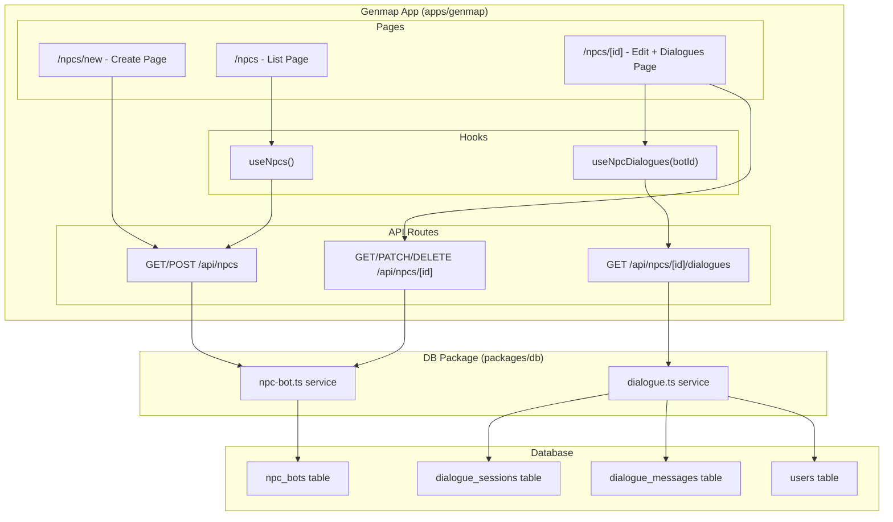
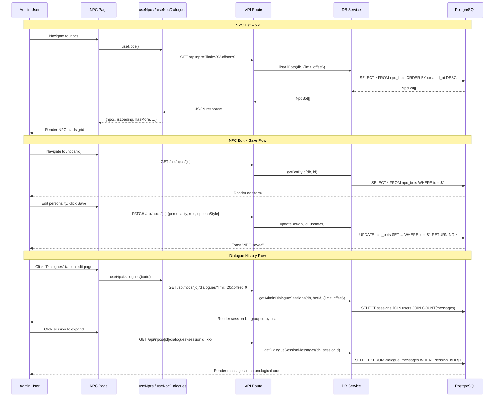

# NPC Editor Design Document

## Overview

The NPC Editor adds a full CRUD admin interface for NPC bots and a read-only dialogue history viewer to the genmap admin tool. Game developers and admins can create, view, edit, and delete NPCs with their personality parameters (name, skin, personality, role, speech style), and browse all player-NPC conversations grouped by user and session.

## Design Summary (Meta)

```yaml
design_type: "new_feature"
risk_level: "low"
complexity_level: "low"
complexity_rationale: "N/A - standard CRUD with read-only viewer, follows well-established genmap patterns"
main_constraints:
  - "Do NOT modify existing database schema"
  - "Follow existing genmap CRUD patterns exactly"
  - "No authentication required (internal admin tool)"
biggest_risks:
  - "NPC personality edits do not take effect on active Colyseus rooms until restart"
  - "Dialogue history for popular NPCs may have hundreds of sessions requiring pagination"
unknowns:
  - "None - all infrastructure exists, patterns are established"
```

## Background and Context

### Prerequisite ADRs

- **ADR-0013-npc-bot-entity-architecture.md**: NPC bot entity design, schema, and Colyseus integration
- **ADR-0014-ai-dialogue-openai-sdk.md**: AI dialogue system with OpenAI SDK integration

### Agreement Checklist

#### Scope
- [x] Full CRUD for NPC bots via genmap admin tool
- [x] Read-only dialogue history viewer (all conversations between players and an NPC)
- [x] New DB service functions: `createBotAdmin`, `getBotById`, `updateBot`, `listAllBots`, `deleteBot`, `getAdminDialogueSessions`
- [x] New API routes under `/api/npcs/` and `/api/npcs/[id]/dialogues/`
- [x] New React hook `useNpcs()` and `useNpcDialogues()`
- [x] New pages: NPC list, NPC create, NPC edit, NPC dialogue history
- [x] Navigation entry "NPCs" in genmap nav bar

#### Non-Scope (Explicitly not changing)
- [x] Database schema (npc_bots, dialogue_sessions, dialogue_messages tables) -- use as-is
- [x] Colyseus server bot logic -- no runtime changes
- [x] Game client NPC rendering or dialogue UI
- [x] User authentication -- genmap has no auth
- [x] Dialogue message creation/editing -- read-only viewer only

#### Constraints
- [x] Parallel operation: N/A (no migration, additive feature)
- [x] Backward compatibility: Not required (new feature, no existing NPC editor)
- [x] Performance measurement: Not required (admin tool, low traffic)

### Problem to Solve

Currently, NPC bots can only be created programmatically via the Colyseus server when a player first enters a homestead. There is no admin interface to:
- View all NPCs across all maps
- Edit NPC personality parameters (personality prompt, role, speech style)
- Create NPCs with specific configurations for testing
- Delete test NPCs
- Review dialogue conversations between players and NPCs for quality assurance

### Current Challenges

1. **No visibility**: Admins cannot see which NPCs exist or what their personality settings are
2. **No editing**: Changing an NPC's personality requires direct database manipulation
3. **No dialogue review**: No way to review AI-generated dialogue quality without playing the game
4. **No test NPC creation**: Cannot create NPCs with specific configurations for testing AI behavior

### Requirements

#### Functional Requirements

- FR-1: List all NPCs with pagination (20 per page)
- FR-2: Create a new NPC with name, skin, mapId, personality, role, speechStyle
- FR-3: View and edit an existing NPC's personality parameters
- FR-4: Delete an NPC (with cascade delete of dialogue data)
- FR-5: View all dialogue sessions for a specific NPC, grouped by user
- FR-6: View messages within a specific dialogue session in chronological order
- FR-7: Paginated dialogue session list (20 sessions per page)

#### Non-Functional Requirements

- **Performance**: Page loads under 500ms for list views (admin tool, low traffic)
- **Scalability**: Pagination handles NPCs with 100+ dialogue sessions
- **Reliability**: Standard error handling, toast notifications for success/failure
- **Maintainability**: Follow existing genmap CRUD patterns exactly

## Acceptance Criteria (AC) - EARS Format

### NPC List (FR-1)

- [ ] The system shall display all NPCs in a card grid with name, skin, role, and map name
- [ ] **When** the page loads, the system shall fetch the first 20 NPCs ordered by creation date (newest first)
- [ ] **When** the user clicks "Load More", the system shall append the next 20 NPCs
- [ ] **While** data is loading, the system shall display skeleton placeholders
- [ ] **If** no NPCs exist, **then** the system shall display an empty state with a "New NPC" button
- [ ] **If** fetching fails, **then** the system shall display an error message with a retry button

### NPC Create (FR-2)

- [ ] **When** the user submits the create form with valid data, the system shall create the NPC and redirect to the edit page
- [ ] The system shall require name (non-empty string, max 64 chars) and skin (from AVAILABLE_SKINS dropdown)
- [ ] The system shall require mapId (dropdown from existing maps)
- [ ] The system shall accept optional fields: personality (textarea), role (text input, max 64 chars), speechStyle (textarea)
- [ ] **If** required fields are missing, **then** the system shall display validation errors
- [ ] **When** creation succeeds, the system shall show a success toast

### NPC Edit (FR-3)

- [ ] **When** the edit page loads, the system shall fetch and display the NPC's current data
- [ ] **When** the user saves changes, the system shall send a PATCH request with only changed fields
- [ ] **If** the NPC is not found, **then** the system shall display a "Not found" error with a back button
- [ ] The system shall display a warning banner: "Personality changes will not take effect on active game rooms until the room restarts"
- [ ] **When** save succeeds, the system shall show a success toast

### NPC Delete (FR-4)

- [ ] **When** the user clicks Delete, the system shall show a confirmation dialog
- [ ] The confirmation dialog shall warn that all dialogue history will also be deleted (cascade)
- [ ] **When** deletion is confirmed, the system shall delete the NPC and redirect to the NPC list
- [ ] **When** deletion succeeds, the system shall show a success toast

### Dialogue History (FR-5, FR-6, FR-7)

- [ ] **When** the user navigates to an NPC's dialogue tab, the system shall list all dialogue sessions grouped by user
- [ ] Each session entry shall display: user name/email, session start time, end time (or "Active"), message count
- [ ] **When** the user clicks a session, the system shall expand it to show messages in chronological order
- [ ] Each message shall display: role (user/assistant), content, timestamp
- [ ] **When** sessions exceed 20, the system shall show a "Load More" button for pagination
- [ ] The dialogue viewer shall be read-only (no edit or delete actions on messages)

## Applicable Standards

### Classification Table

| Standard | Type | Source | Impact on Design |
|----------|------|--------|-----------------|
| Prettier single quotes | Explicit | `.prettierrc` | All new code uses single quotes |
| ESLint flat config + @nx/eslint-plugin | Explicit | `eslint.config.mjs` | Module boundary enforcement |
| TypeScript strict mode | Explicit | `tsconfig.base.json` | All types must be explicit |
| Next.js App Router | Explicit | `apps/genmap/next.config.js` | API routes use Route Handlers |
| shadcn/ui component library | Explicit | `apps/genmap/src/components/ui/` | Use existing UI components |
| Drizzle ORM | Explicit | `packages/db/` | DB queries follow Drizzle patterns |
| CRUD API pattern (GET/POST/PATCH/DELETE) | Implicit | `apps/genmap/src/app/api/objects/` | Follow exact same route structure |
| Hook pattern (useXxx with pagination) | Implicit | `apps/genmap/src/hooks/use-game-objects.ts` | PAGE_SIZE=20, hasMore, loadMore |
| Page pattern (list/edit/new) | Implicit | `apps/genmap/src/app/(app)/objects/` | Grid cards, skeleton loaders, confirm dialog |
| DB service pattern (fail-fast, RETURNING) | Implicit | `packages/db/src/services/game-object.ts` | DrizzleClient param, explicit types |
| Toast notification pattern (sonner) | Implicit | Multiple genmap pages | `.success()` / `.error()` on operations |

## Existing Codebase Analysis

### Implementation Path Mapping

| Type | Path | Description |
|------|------|-------------|
| Existing | `packages/db/src/services/npc-bot.ts` | Bot service with createBot, loadBots, saveBotPositions |
| Existing | `packages/db/src/services/dialogue.ts` | Dialogue service with session/message CRUD |
| Existing | `packages/db/src/schema/npc-bots.ts` | NPC bot table schema |
| Existing | `packages/db/src/schema/dialogue-sessions.ts` | Dialogue session schema |
| Existing | `packages/db/src/schema/dialogue-messages.ts` | Dialogue message schema |
| Existing | `packages/db/src/schema/users.ts` | Users table (for dialogue user info) |
| Existing | `packages/db/src/index.ts` | DB package barrel exports |
| Existing | `packages/shared/src/constants.ts` | AVAILABLE_SKINS, BOT_NAMES constants |
| Existing | `apps/genmap/src/components/navigation.tsx` | Nav bar (add NPCs entry) |
| New | `packages/db/src/services/npc-bot.ts` | Add getBotById, updateBot, listAllBots, deleteBot |
| New | `packages/db/src/services/dialogue.ts` | Add getAdminDialogueSessions |
| New | `apps/genmap/src/app/api/npcs/route.ts` | GET (list) + POST (create) |
| New | `apps/genmap/src/app/api/npcs/[id]/route.ts` | GET + PATCH + DELETE |
| New | `apps/genmap/src/app/api/npcs/[id]/dialogues/route.ts` | GET (admin dialogue sessions) |
| New | `apps/genmap/src/hooks/use-npcs.ts` | NPC list hook with pagination |
| New | `apps/genmap/src/hooks/use-npc-dialogues.ts` | Dialogue sessions hook |
| New | `apps/genmap/src/app/(app)/npcs/page.tsx` | NPC list page |
| New | `apps/genmap/src/app/(app)/npcs/new/page.tsx` | NPC create page |
| New | `apps/genmap/src/app/(app)/npcs/[id]/page.tsx` | NPC edit page with dialogue tab |
| New | `apps/genmap/src/components/npc-card.tsx` | NPC card for list grid |

### Integration Points

- **DB package exports**: New functions must be exported from `packages/db/src/index.ts`
- **Navigation**: Add `{ href: '/npcs', label: 'NPCs' }` to navItems array
- **Maps API**: NPC create form needs to fetch maps list via existing `/api/editor-maps` endpoint

### Similar Functionality Search

Searched for existing NPC editor or admin tools in the codebase:
- **Keyword search**: "npc editor", "bot editor", "npc admin" -- none found
- **Similar CRUD patterns**: Objects editor (`apps/genmap/src/app/(app)/objects/`) serves as the primary reference pattern
- **Decision**: New implementation following existing Objects editor pattern

### Code Inspection Evidence

| File Inspected | Key Finding | Design Impact |
|---------------|-------------|---------------|
| `packages/db/src/services/game-object.ts` | Full CRUD pattern: create/get/list/update/delete with DrizzleClient | Adopt same function signatures for NPC service |
| `packages/db/src/services/npc-bot.ts` | Only has createBot/loadBots/saveBotPositions | Need to add 4 new functions |
| `packages/db/src/services/dialogue.ts` | Has per-user queries but no admin (all-users) query | Need new admin query function |
| `apps/genmap/src/app/api/objects/route.ts` | GET with limit/offset params, POST with body validation | Follow exact same pattern |
| `apps/genmap/src/app/api/objects/[id]/route.ts` | GET/PATCH/DELETE with params Promise destructuring | Follow exact same pattern |
| `apps/genmap/src/hooks/use-game-objects.ts` | PAGE_SIZE=20, fetchObjects/loadMore/hasMore pattern | Copy pattern for useNpcs |
| `apps/genmap/src/app/(app)/objects/page.tsx` | Grid layout, skeleton loading, ConfirmDialog delete | Follow exact same page pattern |
| `apps/genmap/src/app/(app)/objects/[id]/page.tsx:48-50` | useParams + useRouter + fetch pattern for edit page | Adopt same loading/error pattern |
| `apps/genmap/src/components/navigation.tsx:8-15` | navItems array with href/label objects | Add NPCs entry to this array |
| `packages/db/src/schema/users.ts:11-22` | Users table has id, email, name, image | JOIN users for dialogue viewer |
| `packages/shared/src/constants.ts:4-19` | AVAILABLE_SKINS type and array | Use for skin dropdown |
| `apps/genmap/src/components/confirm-dialog.tsx` | Reusable dialog with destructive variant | Reuse for NPC delete confirmation |

## Design

### Change Impact Map

```yaml
Change Target: NPC Editor feature (new)
Direct Impact:
  - packages/db/src/services/npc-bot.ts (add 5 new functions: createBotAdmin, getBotById, listAllBots, updateBot, deleteBot)
  - packages/db/src/services/dialogue.ts (add 1 new function)
  - packages/db/src/index.ts (add new exports)
  - apps/genmap/src/components/navigation.tsx (add nav item)
  - apps/genmap/src/app/api/npcs/ (new API routes)
  - apps/genmap/src/app/(app)/npcs/ (new pages)
  - apps/genmap/src/hooks/ (new hooks)
  - apps/genmap/src/components/npc-card.tsx (new component)
Indirect Impact:
  - None (additive feature, no changes to existing behavior)
No Ripple Effect:
  - Colyseus server (bot runtime behavior unchanged)
  - Game client (NPC rendering, dialogue UI unchanged)
  - Other genmap pages (objects, sprites, tilesets, maps, etc.)
  - Existing DB service functions (createBot, loadBots, saveBotPositions unchanged)
```

### Architecture Overview



### Data Flow



### Integration Points List

| Integration Point | Location | Old Implementation | New Implementation | Switching Method |
|-------------------|----------|-------------------|-------------------|------------------|
| Navigation | `navigation.tsx` navItems array | 6 nav items | 7 nav items (add NPCs) | Direct array addition |
| DB exports | `packages/db/src/index.ts` | Exports createBot, loadBots, saveBotPositions | Add getBotById, updateBot, listAllBots, deleteBot, getAdminDialogueSessions | Add export lines |
| Maps dropdown data | `/api/editor-maps` GET endpoint | Used by map editor | Also used by NPC create form for map selection | No change (read-only reuse) |

### Main Components

#### Component 1: DB Service Extensions (npc-bot.ts)

- **Responsibility**: CRUD operations for NPC bots
- **Interface**: 4 new functions following existing pattern
- **Dependencies**: DrizzleClient, npcBots schema

#### Component 2: DB Service Extensions (dialogue.ts)

- **Responsibility**: Admin dialogue query (all users for a bot)
- **Interface**: 1 new function
- **Dependencies**: DrizzleClient, dialogueSessions/dialogueMessages/users schemas

#### Component 3: API Routes (/api/npcs/)

- **Responsibility**: REST endpoints for NPC CRUD and dialogue viewing
- **Interface**: Standard Next.js Route Handlers
- **Dependencies**: @nookstead/db package

#### Component 4: React Hooks (useNpcs, useNpcDialogues)

- **Responsibility**: Client-side data fetching with pagination
- **Interface**: Standard hook return pattern (items, isLoading, hasMore, loadMore, refetch)
- **Dependencies**: API routes

#### Component 5: Pages and Components

- **Responsibility**: UI rendering for NPC management
- **Interface**: Next.js pages in App Router
- **Dependencies**: Hooks, shadcn/ui components, shared constants

### Contract Definitions

#### New DB Service Functions

```typescript
// packages/db/src/services/npc-bot.ts

/** Data for creating an NPC bot from the admin editor.
 *  Unlike the existing CreateBotData (used by BotManager at runtime, requires worldX/worldY/direction),
 *  this interface accepts personality/role/speechStyle fields and uses default position values. */
export interface AdminCreateBotData {
  name: string;
  skin: string;
  mapId: string;
  personality?: string;
  role?: string;
  speechStyle?: string;
}

/** Data for updating an existing NPC bot. All fields optional (partial update). */
export interface UpdateBotData {
  name?: string;
  skin?: string;
  personality?: string | null;
  role?: string | null;
  speechStyle?: string | null;
}

/** Create an NPC bot from admin editor. Uses default position (0,0) and direction ('down').
 *  Distinct from existing createBot() which is used by BotManager at runtime. */
export async function createBotAdmin(
  db: DrizzleClient,
  data: AdminCreateBotData
): Promise<NpcBot>;

/** Get a single bot by ID. Returns null if not found. */
export async function getBotById(
  db: DrizzleClient,
  id: string
): Promise<NpcBot | null>;

/** List all bots across all maps with pagination. */
export async function listAllBots(
  db: DrizzleClient,
  params?: { limit?: number; offset?: number }
): Promise<NpcBot[]>;

/** Update a bot's editable fields. Returns updated record or null. */
export async function updateBot(
  db: DrizzleClient,
  id: string,
  data: UpdateBotData
): Promise<NpcBot | null>;

/** Delete a bot by ID. Returns deleted record or null. */
export async function deleteBot(
  db: DrizzleClient,
  id: string
): Promise<NpcBot | null>;
```

```typescript
// packages/db/src/services/dialogue.ts

/** A dialogue session with user info and message count (for admin listing). */
export interface AdminDialogueSession {
  sessionId: string;
  startedAt: Date;
  endedAt: Date | null;
  userId: string;
  userName: string | null;
  userEmail: string;
  messageCount: number;
}

/** List all dialogue sessions for a bot (across all users) for admin viewing. */
export async function getAdminDialogueSessions(
  db: DrizzleClient,
  botId: string,
  params?: { limit?: number; offset?: number }
): Promise<AdminDialogueSession[]>;
```

#### API Contracts

**GET /api/npcs**

```
Query params: ?limit=20&offset=0
Response 200: NpcBot[]
Response 400: { error: "limit must be a positive integer" }
```

**POST /api/npcs**

```
Request body: {
  name: string (required, 1-64 chars),
  skin: string (required, must be in AVAILABLE_SKINS),
  mapId: string (required, valid UUID),
  personality?: string,
  role?: string (max 64 chars),
  speechStyle?: string
}
Response 201: NpcBot
Response 400: { error: "validation message" }
```

**GET /api/npcs/[id]**

```
Response 200: NpcBot
Response 404: { error: "NPC not found" }
```

**PATCH /api/npcs/[id]**

```
Request body: {
  name?: string (1-64 chars),
  skin?: string (must be in AVAILABLE_SKINS),
  personality?: string | null,
  role?: string | null (max 64 chars),
  speechStyle?: string | null
}
Response 200: NpcBot (updated)
Response 400: { error: "validation message" }
Response 404: { error: "NPC not found" }
```

**DELETE /api/npcs/[id]**

```
Response 204: (no body)
Response 404: { error: "NPC not found" }
```

**GET /api/npcs/[id]/dialogues**

```
Query params: ?limit=20&offset=0
  OR
Query params: ?sessionId=uuid (to get messages for a specific session)
Response 200 (session list): AdminDialogueSession[]
Response 200 (session messages): DialogueMessage[]
Response 404: { error: "NPC not found" }
```

### Data Contract

#### NPC CRUD Service

```yaml
Input:
  Type: AdminCreateBotData | UpdateBotData
  Preconditions:
    - name: non-empty string, max 64 chars
    - skin: must be a value from AVAILABLE_SKINS
    - mapId: valid UUID referencing existing map
    - role: max 64 chars if provided
  Validation: API route layer validates before calling service

Output:
  Type: NpcBot | null
  Guarantees:
    - Returns full NpcBot record with all columns after insert/update
    - Returns null when record not found (get/update/delete)
  On Error: Throws (fail-fast, error propagates to API layer)

Invariants:
  - Database schema is never modified
  - updatedAt is set to current timestamp on update
```

#### Admin Dialogue Service

```yaml
Input:
  Type: botId (string), params (limit/offset)
  Preconditions:
    - botId must be a valid UUID (not validated by service, returns empty for invalid)
  Validation: API route validates botId existence before calling

Output:
  Type: AdminDialogueSession[]
  Guarantees:
    - Sessions ordered by startedAt descending (newest first)
    - Each session includes user name/email from users table via JOIN
    - messageCount is accurate COUNT of dialogue_messages for session
  On Error: Throws (fail-fast)

Invariants:
  - Read-only operation, no data modification
  - User data included via LEFT JOIN (graceful handling if user deleted)
```

### Data Representation Decisions

| Data Structure | Decision | Rationale |
|---|---|---|
| NpcBot | **Reuse** existing `NpcBot` type from schema | Exact match, inferred from schema, used throughout |
| UpdateBotData | **New** interface | Partial update pattern not in existing types, mirrors `UpdateGameObjectData` pattern |
| AdminDialogueSession | **New** interface | No existing type combines session + user info + message count; this is an admin-specific projection |
| DialogueMessage | **Reuse** existing type from schema | Already used by `getDialogueSessionMessages` |
| AdminCreateBotData | **New** interface | Admin creation requires personality/role/speechStyle fields and uses default worldX/worldY/direction values; existing CreateBotData (BotManager runtime) has different field set |

### Component Tree

```
apps/genmap/src/
  app/(app)/npcs/
    page.tsx                    # NPC list page
    new/
      page.tsx                  # NPC create page
    [id]/
      page.tsx                  # NPC edit + dialogue page (tabs)
  hooks/
    use-npcs.ts                 # NPC list with pagination
    use-npc-dialogues.ts        # Dialogue sessions with pagination
  components/
    npc-card.tsx                # Card component for NPC list grid
  app/api/npcs/
    route.ts                    # GET (list) + POST (create)
    [id]/
      route.ts                  # GET + PATCH + DELETE
      dialogues/
        route.ts                # GET (admin dialogue sessions or session messages)
```

### Page Layouts

#### NPC List Page (`/npcs`)

```
+----------------------------------------------------------+
| [Navigation bar with "NPCs" active]                      |
+----------------------------------------------------------+
| NPCs                                     [New NPC button] |
|                                                           |
| +------------+ +------------+ +------------+ +----------+ |
| | NPC Card   | | NPC Card   | | NPC Card   | | NPC Card | |
| | Name       | | Name       | | Name       | | Name     | |
| | Skin icon  | | Skin icon  | | Skin icon  | | Skin icon| |
| | Role       | | Role       | | Role       | | Role     | |
| | Map name   | | Map name   | | Map name   | | Map name | |
| | [Edit]     | | [Edit]     | | [Edit]     | | [Edit]   | |
| | [Delete]   | | [Delete]   | | [Delete]   | | [Delete] | |
| +------------+ +------------+ +------------+ +----------+ |
|                                                           |
|                   [Load More]                             |
+----------------------------------------------------------+
```

#### NPC Create Page (`/npcs/new`)

```
+----------------------------------------------------------+
| NPCs > New NPC                                            |
+----------------------------------------------------------+
| Create NPC                                                |
|                                                           |
| Name *        [________________________]                  |
| Skin *        [dropdown: scout_1..scout_6]                |
| Map *         [dropdown: list of maps]                    |
| Role          [________________________]                  |
| Personality   [________________________]                  |
|               [________________________]                  |
|               [________________________]                  |
| Speech Style  [________________________]                  |
|               [________________________]                  |
|                                                           |
|               [Create NPC]  [Cancel]                      |
+----------------------------------------------------------+
```

#### NPC Edit Page (`/npcs/[id]`)

```
+----------------------------------------------------------+
| NPCs > NPC Name                                          |
+----------------------------------------------------------+
| Edit NPC: "NPC Name"                                     |
|                                                           |
| [!] Personality changes will not take effect on active    |
|     game rooms until the room restarts.                   |
|                                                           |
| [Details tab] [Dialogues tab]                             |
+----------------------------------------------------------+
| Details Tab:                                              |
|                                                           |
| Name *        [________________________]                  |
| Skin *        [dropdown: scout_1..scout_6]                |
| Map           MapName (read-only display)                 |
| Role          [________________________]                  |
| Personality   [________________________]                  |
|               [________________________]                  |
| Speech Style  [________________________]                  |
|               [________________________]                  |
|                                                           |
|               [Save Changes]                              |
|               [Delete NPC]                                |
+----------------------------------------------------------+
| Dialogues Tab:                                            |
|                                                           |
| User: alice@example.com (Alice)                           |
| +------------------------------------------------------+ |
| | Session: Mar 1, 2026 14:30 - 14:45 (12 messages)    | |
| | [v] Expand                                           | |
| |   [User] Hello there!            14:30:01            | |
| |   [NPC]  Well hello! How are...  14:30:03            | |
| |   [User] I need help with...     14:30:15            | |
| +------------------------------------------------------+ |
| | Session: Feb 28, 2026 10:00 - 10:20 (8 messages)    | |
| +------------------------------------------------------+ |
|                                                           |
| User: bob@example.com (Bob)                               |
| +------------------------------------------------------+ |
| | Session: Mar 2, 2026 09:00 - Active (5 messages)    | |
| +------------------------------------------------------+ |
|                                                           |
|                   [Load More Sessions]                    |
+----------------------------------------------------------+
```

### Field Propagation Map

```yaml
fields:
  - name: "name"
    origin: "Admin form input"
    transformations:
      - layer: "API Route"
        type: "string"
        validation: "required, non-empty, max 64 chars, trimmed"
      - layer: "DB Service"
        type: "CreateBotData.name / UpdateBotData.name"
        transformation: "passed through"
      - layer: "Database"
        type: "varchar(64)"
        transformation: "stored as-is"
    destination: "npc_bots.name"
    loss_risk: "none"

  - name: "skin"
    origin: "Admin form dropdown"
    transformations:
      - layer: "API Route"
        type: "string"
        validation: "required, must be in AVAILABLE_SKINS"
      - layer: "DB Service"
        type: "CreateBotData.skin"
        transformation: "passed through"
      - layer: "Database"
        type: "varchar(32)"
        transformation: "stored as-is"
    destination: "npc_bots.skin"
    loss_risk: "none"

  - name: "personality"
    origin: "Admin form textarea"
    transformations:
      - layer: "API Route"
        type: "string | undefined"
        validation: "optional, no max length (text column)"
      - layer: "DB Service"
        type: "CreateBotData.personality (via schema default) / UpdateBotData.personality"
        transformation: "passed through, undefined excluded from update"
      - layer: "Database"
        type: "text (nullable)"
        transformation: "stored as-is"
    destination: "npc_bots.personality"
    loss_risk: "none"

  - name: "mapId"
    origin: "Admin form dropdown (map selector)"
    transformations:
      - layer: "API Route"
        type: "string"
        validation: "required, valid UUID format"
      - layer: "DB Service"
        type: "CreateBotData.mapId"
        transformation: "passed through"
      - layer: "Database"
        type: "uuid (FK -> maps.id)"
        transformation: "FK constraint validates existence"
    destination: "npc_bots.map_id"
    loss_risk: "none"
```

### Integration Boundary Contracts

```yaml
Boundary: API Route <-> DB Service
  Input: Validated request data (trimmed strings, verified enums)
  Output: NpcBot record or null (sync, Promise)
  On Error: Service throws, API route catches and returns 500

Boundary: React Hook <-> API Route
  Input: HTTP request with query params or JSON body
  Output: JSON response (sync HTTP)
  On Error: Hook sets error state, page renders error UI

Boundary: Page Component <-> React Hook
  Input: Hook return object {items, isLoading, error, ...}
  Output: React elements (rendered UI)
  On Error: Conditional rendering based on error/isLoading state

Boundary: NPC Create Form <-> Maps API
  Input: GET /api/editor-maps (existing endpoint)
  Output: MapRecord[] for dropdown population
  On Error: Show "Failed to load maps" in dropdown area
```

### Error Handling

| Error Scenario | Layer | Handling |
|----------------|-------|----------|
| DB connection failure | DB Service | Error propagates (fail-fast) |
| NPC not found (GET/PATCH/DELETE) | API Route | Return 404 `{ error: "NPC not found" }` |
| Invalid skin value | API Route | Return 400 `{ error: "skin must be one of: scout_1, ..." }` |
| Empty name | API Route | Return 400 `{ error: "name is required" }` |
| Invalid mapId (FK violation) | DB Service | Error propagates, API returns 500 |
| Fetch failure | React Hook | Set error state, display error message + retry button |
| Save failure | Page | Toast error message, keep form data intact |
| Delete failure | Page | Toast error message, keep confirm dialog open |

### Logging and Monitoring

Standard genmap pattern -- no custom logging beyond default Next.js request logging. Errors are surfaced through API response codes and client-side toast notifications.

## Implementation Plan

### Implementation Approach

**Selected Approach**: Vertical Slice (Feature-driven)
**Selection Reason**: Each slice (DB services -> API routes -> hooks -> pages) can be built and verified end-to-end for one feature (list, create, edit, delete, dialogues) before moving to the next. This matches the genmap project's existing development pattern where each admin feature was built as a complete vertical stack.

### Technical Dependencies and Implementation Order

#### Required Implementation Order

1. **DB Service Extensions (npc-bot.ts + dialogue.ts)**
   - Technical Reason: All API routes depend on these functions
   - Dependent Elements: API routes, hooks, pages

2. **DB Package Exports (index.ts)**
   - Technical Reason: API routes import from `@nookstead/db`
   - Prerequisites: Step 1 complete

3. **API Routes (/api/npcs/)**
   - Technical Reason: Hooks fetch from these endpoints
   - Prerequisites: Steps 1-2 complete

4. **React Hooks (useNpcs, useNpcDialogues)**
   - Technical Reason: Pages use these hooks for data
   - Prerequisites: Step 3 complete

5. **Pages and Components (NPC list, create, edit, dialogue viewer)**
   - Technical Reason: Top-level UI depends on all layers below
   - Prerequisites: Steps 1-4 complete

6. **Navigation Update**
   - Technical Reason: Must be last to avoid broken links
   - Prerequisites: Step 5 complete

### Integration Points

**Integration Point 1: DB Service -> API Route**
- Components: `npc-bot.ts` functions -> `/api/npcs/route.ts`
- Verification: Manual API testing with curl/browser, verify correct JSON responses

**Integration Point 2: API Route -> React Hook**
- Components: `/api/npcs/route.ts` -> `useNpcs()` hook
- Verification: NPC list page renders data, pagination works

**Integration Point 3: Hook -> Page**
- Components: `useNpcs()` -> `/npcs/page.tsx`
- Verification: Full page rendering with skeleton loading, error states, empty states

**Integration Point 4: Dialogue API -> Dialogue Hook -> Edit Page**
- Components: `/api/npcs/[id]/dialogues/route.ts` -> `useNpcDialogues()` -> Dialogues tab
- Verification: Session list displays with user info, expanding shows messages

### Migration Strategy

No migration needed. This is a purely additive feature:
- No schema changes
- No data migration
- Existing functionality remains untouched

## Test Strategy

### Basic Test Design Policy

Tests are derived from acceptance criteria. Each AC maps to at least one test case.

### Unit Tests

**DB Service functions** (`packages/db/src/services/npc-bot.spec.ts`):
- Test `getBotById` returns bot or null
- Test `listAllBots` pagination (limit/offset)
- Test `updateBot` partial updates and updatedAt timestamp
- Test `deleteBot` returns deleted record

**DB Service functions** (`packages/db/src/services/dialogue.spec.ts`):
- Test `getAdminDialogueSessions` returns sessions with user info
- Test `getAdminDialogueSessions` pagination
- Test `getAdminDialogueSessions` message count accuracy

### Integration Tests

**API Route tests** (manual or automated):
- GET /api/npcs returns paginated list
- POST /api/npcs validates required fields, creates bot
- PATCH /api/npcs/[id] validates fields, updates bot
- DELETE /api/npcs/[id] returns 204
- GET /api/npcs/[id]/dialogues returns sessions with user info

### E2E Tests

Not required for admin tool. Manual verification of:
- Full CRUD workflow (create -> list -> edit -> delete)
- Dialogue viewer with real data
- Pagination on both NPC list and dialogue sessions
- Error states (invalid data, not found)

## Security Considerations

- **No auth**: Genmap is an internal admin tool, consistent with all other genmap features
- **Input validation**: All API routes validate input (string lengths, enum values, required fields)
- **SQL injection**: Drizzle ORM uses parameterized queries by default
- **Cascade deletes**: Deleting an NPC cascades to all dialogue sessions and messages (by FK constraint in schema)

## Future Extensibility

- **NPC position editing**: Could add map canvas for setting worldX/worldY visually
- **Bulk operations**: Could add multi-select delete for NPC cleanup
- **Dialogue export**: Could add CSV/JSON export of dialogue history for AI training data
- **Live preview**: Could show Phaser sprite preview for the selected skin
- **Dialogue analytics**: Could add message count, session duration, user engagement metrics

## Alternative Solutions

### Alternative 1: Standalone NPC Admin Service

- **Overview**: Build a separate Next.js app specifically for NPC management
- **Advantages**: Separation of concerns, could be deployed independently
- **Disadvantages**: Duplicates DB connection setup, navigation fragmentation, maintenance overhead
- **Reason for Rejection**: Genmap already serves as the unified admin tool; adding another app adds unnecessary infrastructure complexity

### Alternative 2: Database GUI (Drizzle Studio / pgAdmin)

- **Overview**: Use existing database tools for NPC editing
- **Advantages**: No development effort, immediate availability
- **Disadvantages**: No validation, no user-friendly UI, no dialogue viewer, error-prone for non-technical users
- **Reason for Rejection**: Does not meet the requirement for a user-friendly admin interface with proper validation and dialogue viewing

## Risks and Mitigation

| Risk | Impact | Probability | Mitigation |
|------|--------|-------------|------------|
| NPC personality edits not taking effect on active rooms | Medium | High | Display warning banner on edit page |
| Large dialogue history causing slow queries | Low | Medium | Pagination (20 per page), existing DB indexes on botId/userId |
| Deleting NPC with active dialogue sessions | Low | Low | Cascade delete handles this at DB level, confirm dialog warns user |
| Map dropdown loading failure on create page | Low | Low | Show error state in dropdown, allow retry |

## References

- Existing genmap Objects editor pattern: `apps/genmap/src/app/(app)/objects/`
- NPC Bot entity design: `docs/adr/ADR-0013-npc-bot-entity-architecture.md`
- AI Dialogue system: `docs/adr/ADR-0014-ai-dialogue-openai-sdk.md`
- NPC Bot companion design: `docs/design/design-019-npc-bot-companion.md`
- NPC Dialogue system design: `docs/design/design-020-npc-dialogue-system.md`

## Update History

| Date | Version | Changes | Author |
|------|---------|---------|--------|
| 2026-03-03 | 1.0 | Initial version | AI Technical Designer |
