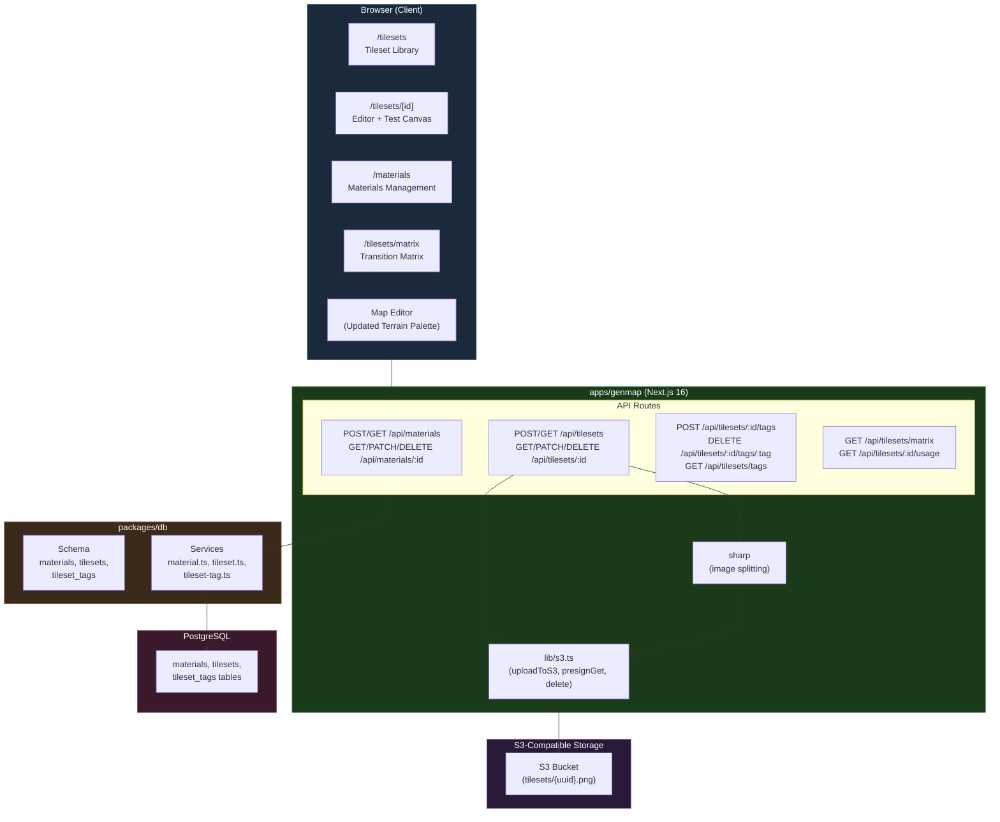
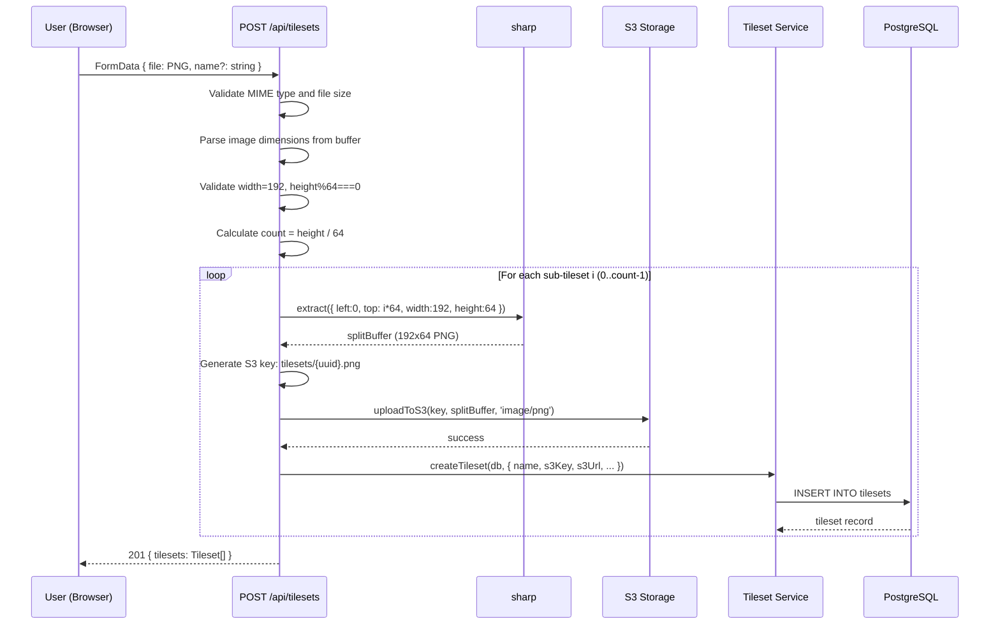
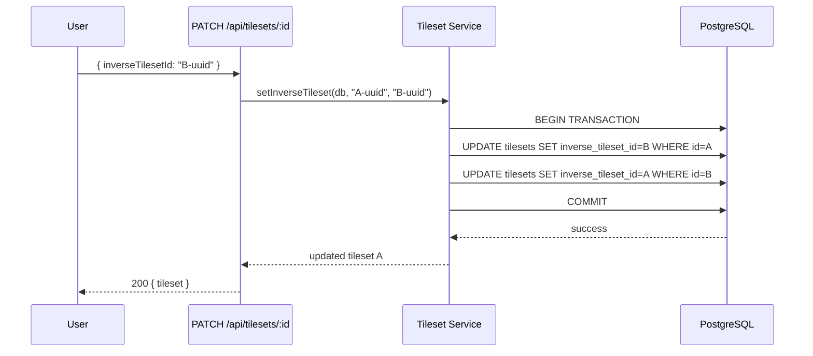

# Tileset Management Design Document

## Overview

This document defines the technical design for the Tileset Management system in the Nookstead genmap map editor. The system replaces the 26 hardcoded terrain definitions in `packages/map-lib/src/core/terrain.ts` with a fully database-driven registry. It introduces three new database tables (`materials`, `tilesets`, `tileset_tags`), REST API endpoints for CRUD operations, server-side image splitting for multi-tileset uploads, an interactive autotile test canvas, a transition matrix view, and a seed migration that imports the existing 26 tilesets. After migration, the map editor terrain palette loads tilesets from the database API instead of static constants.

**Related Documents:**
- **PRD-008:** `docs/prd/prd-008-tileset-management.md` -- Functional requirements
- **ADR-0009:** `docs/adr/ADR-0009-tileset-management-architecture.md` -- Architecture decisions (full DB migration, materials as entities, split on upload, tileset-material relationship model)
- **UXRD-004:** `docs/uxrd/uxrd-004-tileset-management-ui.md` -- UI specifications

## Design Summary (Meta)

```yaml
design_type: "new_feature"
risk_level: "medium"
complexity_level: "high"
complexity_rationale: >
  (1) ACs require 3 new database tables, 15+ API endpoints, server-side image splitting
  with sharp, S3 integration, an interactive autotile test canvas with Blob-47 frame
  calculation, a transition matrix view, and a seed migration that replaces 26 hardcoded
  terrain definitions -- spanning storage, database, API, image processing, and interactive
  UI domains. (2) Constraints: server-side image splitting requires sharp and adds CPU load;
  inverse tileset linking requires bidirectional transactional updates; seed migration is
  a one-way operation that removes existing compile-time constants; backward compatibility
  with saved editor maps referencing terrain-XX keys must be maintained; the test canvas
  must run autotile recalculation at 60fps.
main_constraints:
  - "Fixed tileset dimensions: 192x64 pixels (12x4 grid of 16x16 tiles)"
  - "Server-side image splitting required for multi-tileset uploads"
  - "Backward compatibility: editor maps store terrain-XX keys that must resolve after migration"
  - "Bidirectional inverse links maintained atomically in transactions"
  - "S3 endpoint must be configurable (AWS S3, Cloudflare R2, MinIO)"
  - "No authentication required (internal tool on trusted network)"
biggest_risks:
  - "Seed migration breaks existing editor maps referencing hardcoded terrain keys"
  - "Map editor terrain palette regression after switching from static to API-loaded data"
  - "Server-side image splitting correctness (pixel-perfect 192x64 crops)"
  - "Bidirectional inverse link consistency under concurrent updates"
unknowns:
  - "Exact set of unique materials to extract from current terrain relationships"
  - "Whether all tilesets without explicit relationships should have from_material_id NOT NULL or nullable"
  - "Performance impact of replacing in-memory constant lookups with DB queries during map generation"
```

## Implementation Status

**Status:** IMPLEMENTED
**Implementation Date:** 2026-02-20 (DB services and schema), 2026-02-21 (full migration via Design-012)

### Completed Components
- Database schema: `materials`, `tilesets`, `tileset_tags` tables created and operational
- Database services: `material.ts`, `tileset.ts`, `tileset-tag.ts` fully implemented with CRUD operations
- Seed migration: 26 tilesets, 21 materials seeded from original hardcoded data
- API endpoints: All CRUD endpoints for materials, tilesets, tags, matrix, and usage operational
- Terrain palette: Migrated from hardcoded TERRAINS to API-loaded data
- Tileset image loading: Migrated from static file paths to S3 presigned URLs

### Post-Migration (Design-012)
- All hardcoded terrain definitions removed from `map-lib`
- `TerrainCellType` auto-generated from DB via codegen script
- Game client uses `/api/tilesets` and `/api/materials` endpoints
- Server uses DB editor maps for new player provisioning
- 21 deprecated files deleted

## Background and Context

### Prerequisite ADRs

- **ADR-0009: Tileset Management Architecture** -- Covers four decisions: (1) Full migration from hardcoded to DB-driven tileset system, (2) Materials as first-class database entities, (3) Split multi-tileset images on upload (discard original), (4) Direct FK columns with inverse self-reference for tileset-material relationships.
- **ADR-0007: Sprite Management Storage and Schema** -- Established the S3 storage pattern, upload flow, `getDb` adapter reuse, and Drizzle ORM schema conventions that this design extends to tilesets.

### Agreement Checklist

#### Scope

- [x] Add 3 new Drizzle ORM schema files in `packages/db/src/schema/` (`materials.ts`, `tilesets.ts`, `tileset-tags.ts`)
- [x] Export new schemas from `packages/db/src/schema/index.ts`
- [x] Add 3 new service files in `packages/db/src/services/` (`material.ts`, `tileset.ts`, `tileset-tag.ts`)
- [x] Export new services from `packages/db/src/index.ts`
- [x] Create 15+ API route handlers under `apps/genmap/src/app/api/` (materials, tilesets, tags, matrix, usage)
- [x] Create tileset list page (`/tilesets`), tileset edit page (`/tilesets/[id]`), transition matrix page (`/tilesets/matrix`)
- [x] Create materials management page (`/materials`)
- [x] Create new UI components: TilesetCard, TilesetUploadForm, TilesetImageCanvas, AutotilePreview, TransitionTestCanvas, MaterialPalette, TagEditor
- [x] Update terrain palette to load from API instead of hardcoded constants
- [x] Update `use-tileset-images.ts` to load from S3 presigned URLs
- [x] Create seed migration script for 26 existing tilesets
- [x] Run Drizzle migration for 3 new tables

#### Non-Scope (Explicitly not changing)

- [x] Existing database tables (`sprites`, `atlas_frames`, `game_objects`, `editor_maps`, `users`, etc.) -- no modifications
- [x] Existing services (`sprite.ts`, `atlas-frame.ts`, `game-object.ts`, etc.) -- no modifications
- [x] Autotile engine (`packages/map-lib/src/core/autotile.ts`) -- reused unchanged
- [x] Game client app (`apps/game/`) -- no modifications in Design-011 scope (subsequent Design-012 added API endpoints and migrated Preloader/movement)
- [x] Authentication -- none required
- [x] Variable tile sizes (fixed 16x16 only)
- [x] Animated tilesets
- [x] AI-generated tilesets
- [x] Real-time collaboration
- [x] Tileset version history (beyond Could Have FR-28)

#### Constraints

- [x] Parallel operation: Yes (genmap runs independently from game server)
- [x] Backward compatibility: Required for editor maps (terrain-XX keys must resolve after migration)
- [x] Performance measurement: Not required (internal tool, no SLA); NFRs are guidelines

### Problem to Solve

The map editor's 26 terrain tilesets are defined as compile-time constants in `packages/map-lib/src/core/terrain.ts`. Adding, modifying, or reordering terrain types requires source code changes, a rebuild, and a redeployment. There is no upload workflow for tileset images, no centralized material registry, no visual transition testing, and no coverage analysis for material-pair transitions.

### Current Challenges

1. **No extensibility**: Adding a tileset requires modifying `terrain.ts`, rebuilding `map-lib`, and manually placing the PNG in `public/tilesets/`.
2. **No metadata management**: Material properties (walkability, speed) are scattered across `terrain-properties.ts` as per-tileset entries rather than per-material.
3. **No validation or preview**: No way to test autotile transitions before using a tileset on a map.
4. **No usage tracking**: No feedback about which maps depend on a tileset before deletion.
5. **No transition coverage view**: No way to see which material pairs have tilesets and which are gaps.

### Requirements

#### Functional Requirements

- FR-1 through FR-4: Tileset upload with auto-split, registration, dimension validation, frame content validation
- FR-5 through FR-7: Material CRUD, list page, deletion with dependency check
- FR-8 through FR-11: Material assignment, inverse linking, tagging, tileset list/management
- FR-12 through FR-13: Transition test canvas, auto-preview generation
- FR-14 through FR-16: Usage tracking, transition matrix view, seed data migration
- FR-17 through FR-21: API endpoints for tilesets, materials, tags, matrix, usage
- FR-22: Database schema (3 new tables)

#### Non-Functional Requirements

- **Performance**: Single tileset upload < 2s; multi-tileset split (10 tilesets) < 10s; test canvas 60fps paint; list page 100 tilesets < 1s; transition matrix 50 materials < 500ms; API CRUD < 200ms
- **Reliability**: S3 upload failure rolls back entire batch; pixel-perfect image splitting; bidirectional inverse links in single transaction; FK cascade integrity
- **Scalability**: Up to 500 tilesets, 100 materials, 1000 tags
- **Security**: No authentication; input validation on all endpoints; S3 credentials in env vars

## Acceptance Criteria (AC) - EARS Format

### FR-1: Tileset Upload with Auto-Split

- [ ] **When** a content creator uploads a 192x256 PNG (4 tilesets), the server shall split it into 4 separate 192x64 images, upload each to S3, and create 4 tileset records in the database
- [ ] **When** a content creator uploads a 192x64 PNG (1 tileset), the server shall create 1 S3 object and 1 database record
- [ ] **If** the uploaded image has width not equal to 192, **then** the server shall return a 400 error specifying that width must be 192
- [ ] **If** the image height is not a multiple of 64, **then** the server shall return a 400 error

### FR-2: Tileset Registration with Metadata

- [ ] **When** a successful upload of N tilesets completes, the API response shall contain an array of N tileset records, each with a unique `id`, correct `s3Key`, `width=192`, `height=64`
- [ ] **When** a single tileset is uploaded, the response shall contain a single tileset record

### FR-3: Tileset Dimension Validation

- [ ] **When** an image of 192x128 is validated, it shall pass (2 tilesets detected)
- [ ] **If** image height is 63, **then** validation shall fail with "Height must be a multiple of 64 (4 rows of 16px tiles). Got: 63"
- [ ] **If** image width is 160, **then** validation shall fail with "Width must be exactly 192 (12 columns of 16px tiles). Got: 160"

### FR-4: Frame Content Validation

- [ ] **When** all 48 frames contain visible pixels, validation shall report all 48 as valid
- [ ] **When** frames 0 and 47 are fully transparent, validation shall report those 2 frames as empty and the remaining 46 as valid; the tileset shall still be created

### FR-5: Material CRUD

- [ ] **When** a content creator creates a material with name "Shallow Water", a record shall be created with key "shallow_water" (auto-generated), color, walkable, and speedModifier values
- [ ] **If** a material named "Water" already exists, **then** creating another with name "Water" shall return a 409 conflict error
- [ ] **When** a material's walkable is updated from true to false, the record shall reflect the new value

### FR-7: Material Deletion with Dependency Check

- [ ] **When** deletion is initiated for a material referenced by 5 tilesets, the API shall return the list of affected tilesets
- [ ] **When** deletion is confirmed, the material shall be deleted and referencing tilesets shall have their material FK set to null
- [ ] **When** deletion is initiated for a material with 0 tileset references, deletion shall proceed without a warning

### FR-8: Material Assignment on Tilesets

- [ ] **When** a content creator selects "water" as from and "grass" as to and saves, the tileset record shall be updated with correct material foreign keys
- [ ] **If** the creator selects the same material for both from and to, **then** a validation error shall prevent saving

### FR-9: Inverse Tileset Linking

- [ ] **When** tileset A's inverse is set to B, both A.inverseTilesetId=B.id and B.inverseTilesetId=A.id shall be set in a single transaction
- [ ] **When** A's inverse is cleared, both A and B shall have null inverseTilesetId
- [ ] **If** a user attempts to set A's inverse to A, **then** a validation error shall be returned

### FR-10: Tagging System

- [ ] **When** tag "coastal" is added to a tileset with tags ["water", "transition"], the tileset shall have 3 tags
- [ ] **When** the tileset list is filtered by tag "water", only tilesets with that tag shall be shown
- [ ] **If** the same tag is added twice, **then** no duplicate shall be created

### FR-12: Transition Test Canvas

- [ ] **When** the test canvas loads for a tileset with from=water and to=grass, all 100 cells shall show the "to" material
- [ ] **When** a user clicks cell (5,5), the autotile algorithm shall select the "isolated" frame (frame 47) for that cell
- [ ] **When** "Clear canvas" is clicked, all cells shall reset to the "to" material

### FR-15: Transition Matrix View

- [ ] **When** 3 materials and 2 tilesets (water-to-grass, grass-to-water) exist, the matrix shall show a 3x3 grid with 2 non-zero cells

### FR-16: Seed Data Migration

- [ ] **When** the migration script runs, 26 tileset records shall exist with correct names, S3 keys, and material assignments
- [ ] **When** the map editor is opened after migration, the terrain palette shall display the same 26 tilesets loaded from the API

## Existing Codebase Analysis

### Implementation Path Mapping

| Type | Path | Description |
|------|------|-------------|
| Existing (reference) | `packages/db/src/schema/sprites.ts` | UUID PK, S3 fields, timestamp pattern reference |
| Existing (reference) | `packages/db/src/schema/atlas-frames.ts` | FK with cascade, unique constraint, relations pattern |
| Existing (reference) | `packages/db/src/schema/game-objects.ts` | JSONB columns, interface exports pattern |
| Existing (reference) | `packages/db/src/schema/editor-maps.ts` | JSONB layers containing terrainKey references |
| Existing (reference) | `packages/db/src/services/sprite.ts` | DrizzleClient first-param CRUD pattern |
| Existing (reference) | `packages/db/src/services/atlas-frame.ts` | Batch operations, transaction, search patterns |
| Existing (reference) | `apps/genmap/src/app/api/sprites/route.ts` | FormData upload, image dimension parsing, S3 upload pattern |
| Existing (reference) | `apps/genmap/src/lib/s3.ts` | S3Client singleton, uploadToS3, generatePresignedGetUrl, deleteS3Object |
| Existing (reference) | `apps/genmap/src/lib/sprite-url.ts` | withSignedUrl/withSignedUrls helper pattern |
| Existing (reference) | `apps/genmap/src/lib/validation.ts` | generateS3Key, sanitizeFileName helpers |
| Existing (modify) | `packages/db/src/schema/index.ts` | Must add 3 new schema exports |
| Existing (modify) | `packages/db/src/index.ts` | Must add new service exports |
| Existing (modify) | `apps/genmap/src/components/map-editor/terrain-palette.tsx` | Replace hardcoded TERRAINS/TILESETS imports with API data |
| Existing (modify) | `apps/genmap/src/components/map-editor/use-tileset-images.ts` | Replace static file paths with S3 presigned URLs |
| Existing (modify) | `apps/genmap/src/components/navigation.tsx` | Add "Tilesets" and "Materials" nav items |
| Existing (remove, post-migration) | `packages/map-lib/src/core/terrain.ts` | Remove TERRAINS, TERRAIN_NAMES, TILESETS constants |
| Existing (remove, post-migration) | `packages/map-lib/src/core/terrain-properties.ts` | Remove SURFACE_PROPERTIES (migrated to materials table) |
| New | `packages/db/src/schema/materials.ts` | Materials table schema |
| New | `packages/db/src/schema/tilesets.ts` | Tilesets table schema |
| New | `packages/db/src/schema/tileset-tags.ts` | Tileset tags table schema |
| New | `packages/db/src/services/material.ts` | Material CRUD service |
| New | `packages/db/src/services/tileset.ts` | Tileset CRUD + transition matrix service |
| New | `packages/db/src/services/tileset-tag.ts` | Tag management service |
| New | `apps/genmap/src/app/api/materials/route.ts` | Materials list + create |
| New | `apps/genmap/src/app/api/materials/[id]/route.ts` | Material get + update + delete |
| New | `apps/genmap/src/app/api/tilesets/route.ts` | Tilesets list + upload |
| New | `apps/genmap/src/app/api/tilesets/[id]/route.ts` | Tileset get + update + delete |
| New | `apps/genmap/src/app/api/tilesets/[id]/tags/route.ts` | Add tag |
| New | `apps/genmap/src/app/api/tilesets/[id]/tags/[tag]/route.ts` | Remove tag |
| New | `apps/genmap/src/app/api/tilesets/[id]/usage/route.ts` | Usage tracking |
| New | `apps/genmap/src/app/api/tilesets/tags/route.ts` | List distinct tags |
| New | `apps/genmap/src/app/api/tilesets/matrix/route.ts` | Transition matrix data |
| New | `apps/genmap/src/app/(app)/tilesets/page.tsx` | Tilesets list page |
| New | `apps/genmap/src/app/(app)/tilesets/[id]/page.tsx` | Tileset edit page |
| New | `apps/genmap/src/app/(app)/tilesets/matrix/page.tsx` | Transition matrix page |
| New | `apps/genmap/src/app/(app)/materials/page.tsx` | Materials management page |

### Similar Functionality Search

- **S3 upload pipeline**: Existing in `apps/genmap/src/lib/s3.ts` and `apps/genmap/src/app/api/sprites/route.ts`. The tileset upload reuses the same S3 module (`uploadToS3`, `generatePresignedGetUrl`, `deleteS3Object`, `buildS3Url`). New addition: server-side image splitting with `sharp` before S3 upload (sprites do not split).
- **CRUD services**: Existing sprite service (`packages/db/src/services/sprite.ts`) establishes the DrizzleClient-first-param pattern. New material and tileset services follow the same pattern. No overlap with existing services.
- **Signed URL helper**: Existing `apps/genmap/src/lib/sprite-url.ts` provides `withSignedUrl`/`withSignedUrls`. This is reusable for tilesets since both share the `s3Key`/`s3Url` record shape.
- **Tag management**: No existing tag service. `game_objects.tags` stores tags as JSONB array on the entity itself. The tileset tag system uses a dedicated join table (`tileset_tags`) for normalized tag storage with independent query support. This is a new pattern justified by the need for tag-based filtering and distinct tag listing across tilesets.
- **Surface properties**: Existing in `packages/map-lib/src/core/terrain-properties.ts` as `SURFACE_PROPERTIES` record keyed by `TerrainCellType`. This is being migrated to the `materials` table. After migration, this file is removed.
- **Canvas rendering**: Existing `apps/genmap/src/components/map-editor/canvas-renderer.ts` renders terrain using tileset images and frame indices. The test canvas uses the same autotile algorithm (`getFrame` from `@nookstead/map-lib/autotile`) but in a smaller 10x10 grid with simplified rendering.

**Decision**: Reuse existing S3 module and signed URL helpers. Create new services following the established pattern. Create dedicated tag table (not JSONB array) for query flexibility.

### Code Inspection Evidence

| File Inspected | Key Finding | Design Impact |
|---------------|-------------|---------------|
| `packages/db/src/schema/sprites.ts` | Uses `pgTable('sprites', {...})` with `uuid('id').defaultRandom().primaryKey()`, `text('s3_key').notNull().unique()`, timezone timestamps | Tilesets table follows identical pattern for S3 fields, UUID PK, timestamps |
| `packages/db/src/schema/atlas-frames.ts:45-51` | Uses `unique('atlas_frames_sprite_filename_unique').on(table.spriteId, table.filename)` for composite unique constraint | `tileset_tags` uses composite primary key `primaryKey({ columns: [table.tilesetId, table.tag] })` |
| `packages/db/src/schema/atlas-frames.ts:53-58` | Uses `relations(atlasFrames, ({ one }) => ({...}))` for Drizzle relations | Tilesets schema defines relations for fromMaterial, toMaterial, inverseTileset, and tags |
| `packages/db/src/services/sprite.ts:22-25` | `createSprite(db: DrizzleClient, data)` with `db.insert(sprites).values(data).returning()` | All new service functions follow identical insert pattern |
| `packages/db/src/services/atlas-frame.ts:29-64` | Uses `db.transaction(async (tx) => {...})` for batch operations | Inverse tileset linking uses transaction for bidirectional update |
| `apps/genmap/src/app/api/sprites/route.ts:7-55` | FormData parsing, file validation, `uploadToS3`, `buildS3Url`, `parseImageDimensions`, `createSprite`, `withSignedUrl` | Tileset upload route follows same structure but adds sharp splitting step |
| `apps/genmap/src/lib/s3.ts:65-78` | `uploadToS3(s3Key, body, contentType)` accepts Buffer, uses PutObjectCommand | Reused directly for tileset uploads after splitting |
| `apps/genmap/src/lib/sprite-url.ts:9-14` | `withSignedUrl<T extends {s3Key, s3Url}>` generates presigned GET URL | Reusable for tilesets (same record shape) |
| `packages/map-lib/src/core/terrain.ts:50-58` | `TERRAINS` array maps terrain names to `{key, file, name, solidFrame}` with `terrain-XX` key format | Seed migration preserves these keys for backward compatibility |
| `packages/map-lib/src/core/terrain.ts:61-93` | `setRelationship(num, {from, to, inverseOf})` defines 14 material relationships across 26 tilesets | Seed migration extracts unique materials and creates FK relationships |
| `packages/map-lib/src/core/terrain.ts:124-175` | `TILESETS` object groups tilesets into 8 named collections (grassland, water, sand, forest, stone, road, props, misc) | Seed migration creates tags from group names |
| `packages/map-lib/src/core/terrain-properties.ts:23-215` | `SURFACE_PROPERTIES` maps each terrain name to `{walkable, speedModifier, swimRequired, damaging}` | Material properties derived from the `from` material of each relationship |
| `apps/genmap/src/components/map-editor/terrain-palette.tsx:12-14` | Imports `TERRAINS`, `TILESETS`, `SOLID_FRAME` from `@nookstead/map-lib` | Must be replaced with API data fetching |
| `apps/genmap/src/components/map-editor/use-tileset-images.ts:32-76` | Loads 26 PNGs from `/tilesets/terrain-XX.png` as `HTMLImageElement` | Must be updated to load from S3 presigned URLs |
| `apps/genmap/src/components/map-editor/canvas-renderer.ts:95` | `const img = tilesetImages.get(layer.terrainKey)` -- looks up tileset image by terrain key | Works unchanged as long as the key-to-image map is populated from API data |
| `apps/genmap/src/hooks/map-editor-types.ts:45-46` | `TileLayer.terrainKey: string` stores the terrain key in each layer | Terrain keys preserved across migration; format remains `terrain-XX` for existing maps |
| `packages/db/src/schema/editor-maps.ts:18` | `layers: jsonb('layers').notNull()` stores layer data as JSONB | Usage tracking scans this JSONB for `terrainKey` values |

## Applicable Standards

### Classification Table

| Standard | Type | Source | Impact on Design |
|----------|------|--------|-----------------|
| Prettier: single quotes, 2-space indent | Explicit | `.prettierrc`, `.editorconfig` | All new code uses single quotes and 2-space indent |
| ESLint: @nx/eslint-plugin flat config | Explicit | `eslint.config.mjs` | All new TS/TSX files must pass ESLint |
| TypeScript: strict mode, ES2022, bundler resolution | Explicit | `tsconfig.base.json` | All new code must pass strict type checking |
| Next.js App Router conventions | Explicit | `apps/genmap/next.config.js` | API routes use named exports (GET, POST, PATCH, DELETE); pages use default exports |
| shadcn/ui New York style with Tailwind CSS | Explicit | `apps/genmap/components.json` | UI components use shadcn/ui primitives with `cn()` utility |
| Drizzle ORM schema patterns (pgTable, uuid PK, timezone timestamps) | Implicit | `packages/db/src/schema/sprites.ts`, `editor-maps.ts` | New schema files follow identical pattern |
| Service function pattern (DrizzleClient first param) | Implicit | `packages/db/src/services/sprite.ts`, `atlas-frame.ts` | New service functions take `db: DrizzleClient` as first parameter |
| S3 key generation pattern (`{prefix}/{uuid}/{filename}`) | Implicit | `apps/genmap/src/lib/validation.ts:15-17` | Tileset S3 keys use `tilesets/{uuid}.png` format |
| Barrel exports from index.ts | Implicit | `packages/db/src/schema/index.ts`, `packages/db/src/index.ts` | New schemas and services re-exported through barrel files |
| FormData upload with server-side processing | Implicit | `apps/genmap/src/app/api/sprites/route.ts` | Tileset upload follows same FormData pattern with added sharp splitting |
| Signed URL helper for S3 records | Implicit | `apps/genmap/src/lib/sprite-url.ts` | Reuse `withSignedUrl`/`withSignedUrls` for tileset records |

## Design

### Change Impact Map

```yaml
Change Target: Tileset Management System (new feature + migration)
Direct Impact:
  - packages/db/src/schema/index.ts (add 3 new schema exports)
  - packages/db/src/index.ts (add new service exports)
  - apps/genmap/src/components/map-editor/terrain-palette.tsx (replace hardcoded imports with API data)
  - apps/genmap/src/components/map-editor/use-tileset-images.ts (replace static paths with presigned URLs)
  - apps/genmap/src/components/navigation.tsx (add Tilesets and Materials nav items)
  - packages/map-lib/src/core/terrain.ts (REMOVED — Design-012 migration complete)
  - packages/map-lib/src/core/terrain-properties.ts (REMOVED — Design-012 migration complete)
Indirect Impact:
  - packages/shared/src/types/map.ts (TerrainCellType now auto-generated via codegen from DB materials)
  - apps/genmap/src/components/map-editor/canvas-renderer.ts (tilesetImages map populated differently, but API unchanged)
  - Database (new migration with 3 tables -- additive only)
No Ripple Effect:
  - packages/db/src/schema/sprites.ts (unchanged)
  - packages/db/src/schema/atlas-frames.ts (unchanged)
  - packages/db/src/schema/game-objects.ts (unchanged)
  - packages/db/src/schema/editor-maps.ts (unchanged -- layers JSONB read-only for usage tracking)
  - packages/db/src/services/sprite.ts (unchanged)
  - packages/db/src/services/atlas-frame.ts (unchanged)
  - packages/map-lib/src/core/autotile.ts (unchanged -- reused by test canvas)
  - apps/game/ (entirely unchanged)
  - apps/genmap/src/lib/s3.ts (unchanged -- reused as-is)
```

### Architecture Overview



### Data Flow

#### Tileset Upload Flow



#### Inverse Tileset Linking Flow



### Integration Points List

| Integration Point | Location | Old Implementation | New Implementation | Switching Method |
|-------------------|----------|-------------------|-------------------|------------------|
| Schema barrel export | `packages/db/src/schema/index.ts` | 10 exports | 13 exports (add materials, tilesets, tileset-tags) | Append exports |
| Package barrel export | `packages/db/src/index.ts` | Exports existing services | Add material, tileset, tileset-tag service exports | Append exports |
| Terrain palette data source | `terrain-palette.tsx` line 12-14 | `import { TERRAINS, TILESETS } from '@nookstead/map-lib'` | `fetch('/api/tilesets')` on mount | Replace import with API call |
| Tileset image loading | `use-tileset-images.ts` line 57 | `img.src = '/tilesets/${key}.png'` | `img.src = tileset.s3Url` (presigned URL from API) | Replace static path with API URL |
| Canvas renderer tileset lookup | `canvas-renderer.ts` line 95 | `tilesetImages.get(layer.terrainKey)` | Same call, map populated from API data | No code change needed |
| Navigation items | `navigation.tsx` | Sprites, Objects, Maps, Templates | Add Tilesets, Materials | Append nav items |

### Integration Point Map

```yaml
Integration Point 1:
  Existing Component: packages/db/src/schema/index.ts - barrel exports
  Integration Method: Append 3 new schema module exports (materials, tilesets, tileset-tags)
  Impact Level: Low (Additive only)
  Required Test Coverage: TypeScript compilation passes; Drizzle migration generates correctly

Integration Point 2:
  Existing Component: packages/db/src/index.ts - package barrel exports
  Integration Method: Append new service function and type exports
  Impact Level: Low (Additive only)
  Required Test Coverage: Services importable from @nookstead/db

Integration Point 3:
  Existing Component: terrain-palette.tsx - static terrain data
  Integration Method: Replace TERRAINS/TILESETS constant imports with API data fetching
  Impact Level: High (Process Flow Change)
  Required Test Coverage: Terrain palette displays same 26 tilesets after migration; visual regression test

Integration Point 4:
  Existing Component: use-tileset-images.ts - static file loading
  Integration Method: Replace hardcoded paths with presigned URLs from API
  Impact Level: High (Process Flow Change)
  Required Test Coverage: All tileset images load and display in terrain palette and canvas

Integration Point 5:
  Existing Component: editor_maps.layers JSONB - terrain key references
  Integration Method: Read-only scan for usage tracking (no modification)
  Impact Level: Low (Read-Only)
  Required Test Coverage: Usage count matches actual references in saved maps
```

### Main Components

#### Database Schema (`packages/db/src/schema/`)

Three new schema files following the established Drizzle ORM patterns.

##### `packages/db/src/schema/materials.ts`

```typescript
import {
  boolean,
  pgTable,
  real,
  timestamp,
  uuid,
  varchar,
} from 'drizzle-orm/pg-core';

export const materials = pgTable('materials', {
  id: uuid('id').defaultRandom().primaryKey(),
  name: varchar('name', { length: 100 }).notNull().unique(),
  key: varchar('key', { length: 100 }).notNull().unique(),
  color: varchar('color', { length: 7 }).notNull(),
  walkable: boolean('walkable').notNull().default(true),
  speedModifier: real('speed_modifier').notNull().default(1.0),
  swimRequired: boolean('swim_required').notNull().default(false),
  damaging: boolean('damaging').notNull().default(false),
  createdAt: timestamp('created_at', { withTimezone: true })
    .defaultNow()
    .notNull(),
  updatedAt: timestamp('updated_at', { withTimezone: true })
    .defaultNow()
    .notNull(),
});

export type Material = typeof materials.$inferSelect;
export type NewMaterial = typeof materials.$inferInsert;
```

##### `packages/db/src/schema/tilesets.ts`

```typescript
import {
  integer,
  pgTable,
  text,
  timestamp,
  uuid,
  varchar,
} from 'drizzle-orm/pg-core';
import { relations } from 'drizzle-orm';
import { materials } from './materials';
import { tilesetTags } from './tileset-tags';

export const tilesets = pgTable('tilesets', {
  id: uuid('id').defaultRandom().primaryKey(),
  name: varchar('name', { length: 255 }).notNull(),
  key: varchar('key', { length: 100 }).notNull().unique(),
  s3Key: text('s3_key').notNull().unique(),
  s3Url: text('s3_url').notNull(),
  width: integer('width').notNull().default(192),
  height: integer('height').notNull().default(64),
  fileSize: integer('file_size').notNull(),
  mimeType: varchar('mime_type', { length: 50 }).notNull(),
  fromMaterialId: uuid('from_material_id').references(() => materials.id, {
    onDelete: 'set null',
  }),
  toMaterialId: uuid('to_material_id').references(() => materials.id, {
    onDelete: 'set null',
  }),
  inverseTilesetId: uuid('inverse_tileset_id').references((): any => tilesets.id, {
    onDelete: 'set null',
  }),
  sortOrder: integer('sort_order').notNull().default(0),
  createdAt: timestamp('created_at', { withTimezone: true })
    .defaultNow()
    .notNull(),
  updatedAt: timestamp('updated_at', { withTimezone: true })
    .defaultNow()
    .notNull(),
});

export const tilesetsRelations = relations(tilesets, ({ one, many }) => ({
  fromMaterial: one(materials, {
    fields: [tilesets.fromMaterialId],
    references: [materials.id],
    relationName: 'fromMaterial',
  }),
  toMaterial: one(materials, {
    fields: [tilesets.toMaterialId],
    references: [materials.id],
    relationName: 'toMaterial',
  }),
  inverseTileset: one(tilesets, {
    fields: [tilesets.inverseTilesetId],
    references: [tilesets.id],
    relationName: 'inverseTileset',
  }),
  tags: many(tilesetTags),
}));

export type Tileset = typeof tilesets.$inferSelect;
export type NewTileset = typeof tilesets.$inferInsert;
```

##### `packages/db/src/schema/tileset-tags.ts`

```typescript
import {
  pgTable,
  primaryKey,
  uuid,
  varchar,
} from 'drizzle-orm/pg-core';
import { relations } from 'drizzle-orm';
import { tilesets } from './tilesets';

export const tilesetTags = pgTable(
  'tileset_tags',
  {
    tilesetId: uuid('tileset_id')
      .notNull()
      .references(() => tilesets.id, { onDelete: 'cascade' }),
    tag: varchar('tag', { length: 50 }).notNull(),
  },
  (table) => [
    primaryKey({ columns: [table.tilesetId, table.tag] }),
  ]
);

export const tilesetTagsRelations = relations(tilesetTags, ({ one }) => ({
  tileset: one(tilesets, {
    fields: [tilesetTags.tilesetId],
    references: [tilesets.id],
  }),
}));

export type TilesetTag = typeof tilesetTags.$inferSelect;
export type NewTilesetTag = typeof tilesetTags.$inferInsert;
```

##### Updated `packages/db/src/schema/index.ts`

```typescript
// Append to existing exports:
export * from './materials';
export * from './tilesets';
export * from './tileset-tags';
```

#### Database Services (`packages/db/src/services/`)

##### `packages/db/src/services/material.ts`

```typescript
import { eq, asc, count, or, sql } from 'drizzle-orm';
import type { DrizzleClient } from '../core/client';
import { materials } from '../schema/materials';
import { tilesets } from '../schema/tilesets';

export interface CreateMaterialData {
  name: string;
  key: string;
  color: string;
  walkable?: boolean;
  speedModifier?: number;
  swimRequired?: boolean;
  damaging?: boolean;
}

export interface UpdateMaterialData {
  name?: string;
  key?: string;
  color?: string;
  walkable?: boolean;
  speedModifier?: number;
  swimRequired?: boolean;
  damaging?: boolean;
}

export async function createMaterial(
  db: DrizzleClient,
  data: CreateMaterialData
) {
  const [material] = await db.insert(materials).values(data).returning();
  return material;
}

export async function getMaterial(db: DrizzleClient, id: string) {
  const [material] = await db
    .select()
    .from(materials)
    .where(eq(materials.id, id));
  return material ?? null;
}

export async function getMaterialByKey(db: DrizzleClient, key: string) {
  const [material] = await db
    .select()
    .from(materials)
    .where(eq(materials.key, key));
  return material ?? null;
}

export async function listMaterials(db: DrizzleClient) {
  return db.select().from(materials).orderBy(asc(materials.name));
}

export async function updateMaterial(
  db: DrizzleClient,
  id: string,
  data: UpdateMaterialData
) {
  const [updated] = await db
    .update(materials)
    .set({ ...data, updatedAt: new Date() })
    .where(eq(materials.id, id))
    .returning();
  return updated ?? null;
}

export async function deleteMaterial(db: DrizzleClient, id: string) {
  const [deleted] = await db
    .delete(materials)
    .where(eq(materials.id, id))
    .returning();
  return deleted ?? null;
}

export async function countTilesetsByMaterial(
  db: DrizzleClient,
  materialId: string
): Promise<number> {
  const [result] = await db
    .select({ count: count() })
    .from(tilesets)
    .where(
      or(
        eq(tilesets.fromMaterialId, materialId),
        eq(tilesets.toMaterialId, materialId)
      )
    );
  return result?.count ?? 0;
}

export async function getTilesetsReferencingMaterial(
  db: DrizzleClient,
  materialId: string
) {
  return db
    .select({ id: tilesets.id, name: tilesets.name })
    .from(tilesets)
    .where(
      or(
        eq(tilesets.fromMaterialId, materialId),
        eq(tilesets.toMaterialId, materialId)
      )
    );
}
```

##### `packages/db/src/services/tileset.ts`

```typescript
import { eq, desc, ilike, and, or, sql, count, inArray } from 'drizzle-orm';
import type { DrizzleClient } from '../core/client';
import { tilesets } from '../schema/tilesets';
import { tilesetTags } from '../schema/tileset-tags';
import { materials } from '../schema/materials';
import { editorMaps } from '../schema/editor-maps';

export interface CreateTilesetData {
  name: string;
  key: string;
  s3Key: string;
  s3Url: string;
  width?: number;
  height?: number;
  fileSize: number;
  mimeType: string;
  fromMaterialId?: string | null;
  toMaterialId?: string | null;
  sortOrder?: number;
}

export interface UpdateTilesetData {
  name?: string;
  fromMaterialId?: string | null;
  toMaterialId?: string | null;
  inverseTilesetId?: string | null;
  sortOrder?: number;
}

export interface ListTilesetsParams {
  materialId?: string;
  tag?: string;
  search?: string;
  limit?: number;
  offset?: number;
  sort?: 'name' | 'createdAt';
  order?: 'asc' | 'desc';
}

export async function createTileset(
  db: DrizzleClient,
  data: CreateTilesetData
) {
  const [tileset] = await db.insert(tilesets).values(data).returning();
  return tileset;
}

export async function getTileset(db: DrizzleClient, id: string) {
  const [tileset] = await db
    .select()
    .from(tilesets)
    .where(eq(tilesets.id, id));
  return tileset ?? null;
}

export async function listTilesets(
  db: DrizzleClient,
  params?: ListTilesetsParams
) {
  const conditions: any[] = [];

  if (params?.materialId) {
    conditions.push(
      or(
        eq(tilesets.fromMaterialId, params.materialId),
        eq(tilesets.toMaterialId, params.materialId)
      )
    );
  }

  if (params?.search) {
    conditions.push(ilike(tilesets.name, `%${params.search}%`));
  }

  if (params?.tag) {
    // Subquery: tilesets that have this tag
    conditions.push(
      sql`${tilesets.id} IN (
        SELECT ${tilesetTags.tilesetId} FROM ${tilesetTags}
        WHERE ${tilesetTags.tag} = ${params.tag}
      )`
    );
  }

  const whereClause = conditions.length > 0 ? and(...conditions) : undefined;

  const query = db
    .select()
    .from(tilesets)
    .where(whereClause)
    .orderBy(
      params?.sort === 'name' ? tilesets.name : desc(tilesets.createdAt)
    );

  if (params?.limit !== undefined) {
    query.limit(params.limit);
  }
  if (params?.offset !== undefined) {
    query.offset(params.offset);
  }

  return query;
}

export async function updateTileset(
  db: DrizzleClient,
  id: string,
  data: UpdateTilesetData
) {
  const [updated] = await db
    .update(tilesets)
    .set({ ...data, updatedAt: new Date() })
    .where(eq(tilesets.id, id))
    .returning();
  return updated ?? null;
}

export async function deleteTileset(db: DrizzleClient, id: string) {
  const [deleted] = await db
    .delete(tilesets)
    .where(eq(tilesets.id, id))
    .returning();
  return deleted ?? null;
}

/**
 * Set bidirectional inverse link between two tilesets.
 * Both A.inverseTilesetId = B and B.inverseTilesetId = A
 * are updated in a single transaction.
 */
export async function setInverseTileset(
  db: DrizzleClient,
  tilesetAId: string,
  tilesetBId: string
) {
  return db.transaction(async (tx) => {
    // Clear any existing inverse links on both sides
    await tx
      .update(tilesets)
      .set({ inverseTilesetId: null, updatedAt: new Date() })
      .where(eq(tilesets.inverseTilesetId, tilesetAId));
    await tx
      .update(tilesets)
      .set({ inverseTilesetId: null, updatedAt: new Date() })
      .where(eq(tilesets.inverseTilesetId, tilesetBId));

    // Set new bidirectional link
    const [a] = await tx
      .update(tilesets)
      .set({ inverseTilesetId: tilesetBId, updatedAt: new Date() })
      .where(eq(tilesets.id, tilesetAId))
      .returning();
    await tx
      .update(tilesets)
      .set({ inverseTilesetId: tilesetAId, updatedAt: new Date() })
      .where(eq(tilesets.id, tilesetBId));

    return a;
  });
}

/**
 * Remove bidirectional inverse link from a tileset and its partner.
 */
export async function removeInverseTileset(
  db: DrizzleClient,
  tilesetId: string
) {
  return db.transaction(async (tx) => {
    const [tileset] = await tx
      .select({ inverseTilesetId: tilesets.inverseTilesetId })
      .from(tilesets)
      .where(eq(tilesets.id, tilesetId));

    if (tileset?.inverseTilesetId) {
      await tx
        .update(tilesets)
        .set({ inverseTilesetId: null, updatedAt: new Date() })
        .where(eq(tilesets.id, tileset.inverseTilesetId));
    }

    const [updated] = await tx
      .update(tilesets)
      .set({ inverseTilesetId: null, updatedAt: new Date() })
      .where(eq(tilesets.id, tilesetId))
      .returning();

    return updated;
  });
}

/**
 * Get the transition matrix: for each (from, to) material pair,
 * the count of tilesets and a representative tileset ID.
 */
export async function getTransitionMatrix(db: DrizzleClient) {
  const allMaterials = await db
    .select()
    .from(materials)
    .orderBy(materials.name);

  const cells = await db
    .select({
      fromId: tilesets.fromMaterialId,
      toId: tilesets.toMaterialId,
      count: count(),
      representativeId: sql<string>`MIN(${tilesets.id})`,
    })
    .from(tilesets)
    .where(
      and(
        sql`${tilesets.fromMaterialId} IS NOT NULL`,
        sql`${tilesets.toMaterialId} IS NOT NULL`
      )
    )
    .groupBy(tilesets.fromMaterialId, tilesets.toMaterialId);

  return { materials: allMaterials, cells };
}

/**
 * Get editor maps that reference a tileset's key in their layers JSONB.
 */
export async function getTilesetUsage(
  db: DrizzleClient,
  tilesetKey: string
) {
  // Search the layers JSONB array for objects containing this terrainKey
  const maps = await db
    .select({ id: editorMaps.id, name: editorMaps.name })
    .from(editorMaps)
    .where(
      sql`${editorMaps.layers}::jsonb @> ${JSON.stringify([{ terrainKey: tilesetKey }])}::jsonb`
    );

  return { maps, count: maps.length };
}
```

##### `packages/db/src/services/tileset-tag.ts`

```typescript
import { eq, sql, asc } from 'drizzle-orm';
import type { DrizzleClient } from '../core/client';
import { tilesetTags } from '../schema/tileset-tags';

export async function setTags(
  db: DrizzleClient,
  tilesetId: string,
  tags: string[]
) {
  return db.transaction(async (tx) => {
    // Delete existing tags
    await tx
      .delete(tilesetTags)
      .where(eq(tilesetTags.tilesetId, tilesetId));

    if (tags.length === 0) return [];

    // Insert new tags
    const inserted = await tx
      .insert(tilesetTags)
      .values(tags.map((tag) => ({ tilesetId, tag })))
      .returning();

    return inserted;
  });
}

export async function getTags(
  db: DrizzleClient,
  tilesetId: string
): Promise<string[]> {
  const rows = await db
    .select({ tag: tilesetTags.tag })
    .from(tilesetTags)
    .where(eq(tilesetTags.tilesetId, tilesetId))
    .orderBy(asc(tilesetTags.tag));
  return rows.map((r) => r.tag);
}

export async function addTag(
  db: DrizzleClient,
  tilesetId: string,
  tag: string
) {
  const [inserted] = await db
    .insert(tilesetTags)
    .values({ tilesetId, tag })
    .onConflictDoNothing()
    .returning();
  return inserted ?? null;
}

export async function removeTag(
  db: DrizzleClient,
  tilesetId: string,
  tag: string
) {
  await db
    .delete(tilesetTags)
    .where(
      sql`${tilesetTags.tilesetId} = ${tilesetId} AND ${tilesetTags.tag} = ${tag}`
    );
}

export async function listDistinctTags(
  db: DrizzleClient
): Promise<{ tag: string; count: number }[]> {
  const rows = await db
    .select({
      tag: tilesetTags.tag,
      count: sql<number>`count(*)::int`,
    })
    .from(tilesetTags)
    .groupBy(tilesetTags.tag)
    .orderBy(asc(tilesetTags.tag));

  return rows;
}
```

### Contract Definitions

#### Application-Level TypeScript Interfaces

```typescript
// === API Request/Response Types ===

/** POST /api/materials request body */
interface CreateMaterialRequest {
  name: string;          // max 100 chars
  key?: string;          // auto-generated from name if omitted
  color: string;         // hex color, e.g., "#4ade80"
  walkable?: boolean;    // default true
  speedModifier?: number; // default 1.0, range 0.0-2.0
  swimRequired?: boolean; // default false
  damaging?: boolean;    // default false
}

/** PATCH /api/materials/:id request body */
interface UpdateMaterialRequest {
  name?: string;
  key?: string;
  color?: string;
  walkable?: boolean;
  speedModifier?: number;
  swimRequired?: boolean;
  damaging?: boolean;
}

/** POST /api/tilesets request (FormData) */
// Fields:
//   file: File (PNG/WebP, max 10MB, width=192, height=N*64)
//   name?: string (default: derived from filename)
//   fromMaterialId?: string (UUID)
//   toMaterialId?: string (UUID)

/** POST /api/tilesets response */
interface UploadTilesetsResponse {
  tilesets: Tileset[];  // Array of created tileset records (one per split)
}

/** GET /api/tilesets query params */
// ?materialId=UUID   -- filter by from or to material
// ?tag=string        -- filter by tag
// ?search=string     -- name search (case-insensitive partial match)
// ?sort=name|createdAt
// ?order=asc|desc
// ?limit=N&offset=N

/** PATCH /api/tilesets/:id request body */
interface UpdateTilesetRequest {
  name?: string;
  fromMaterialId?: string | null;
  toMaterialId?: string | null;
  inverseTilesetId?: string | null;
  tags?: string[];       // Replace all tags
}

/** GET /api/tilesets/matrix response */
interface TransitionMatrixResponse {
  materials: Material[];
  cells: {
    fromId: string;
    toId: string;
    count: number;
    representativeId?: string;
  }[];
}

/** GET /api/tilesets/:id/usage response */
interface TilesetUsageResponse {
  maps: { id: string; name: string }[];
  count: number;
}

/** POST /api/tilesets/:id/tags request body */
interface AddTagRequest {
  tag: string;  // max 50 chars
}

/** GET /api/tilesets/tags response */
type DistinctTagsResponse = { tag: string; count: number }[];

/** Error response (consistent across all endpoints) */
interface ApiError {
  error: string;
  details?: string[];
}
```

### Data Contract

#### Material Service: createMaterial

```yaml
Input:
  Type: (db: DrizzleClient, data: CreateMaterialData)
  Preconditions:
    - data.name is non-empty, max 100 chars, unique
    - data.key is non-empty, max 100 chars, unique, lowercase alphanumeric + underscores
    - data.color is a valid 7-char hex color string (e.g., "#4ade80")
    - data.speedModifier is in range [0.0, 2.0]
  Validation: Uniqueness enforced by DB unique constraints

Output:
  Type: Promise<Material>
  Guarantees:
    - A row exists in materials with generated UUID id
    - createdAt and updatedAt set to current time
  On Error: Throws on duplicate name or key (unique constraint violation)

Invariants:
  - name and key are unique across all materials
```

#### Tileset Service: createTileset

```yaml
Input:
  Type: (db: DrizzleClient, data: CreateTilesetData)
  Preconditions:
    - data.s3Key is a valid key matching an uploaded S3 object
    - data.key is unique across all tilesets
    - data.fromMaterialId (if provided) references an existing material
    - data.toMaterialId (if provided) references an existing material
  Validation: FK validated by database constraint

Output:
  Type: Promise<Tileset>
  Guarantees:
    - A row exists in tilesets with generated UUID id
    - Material FK constraints are satisfied
  On Error: Throws on duplicate s3Key or key

Invariants:
  - s3Key and key are unique across all tilesets
  - fromMaterialId and toMaterialId (if set) always reference valid materials
```

#### Tileset Service: setInverseTileset

```yaml
Input:
  Type: (db: DrizzleClient, tilesetAId: string, tilesetBId: string)
  Preconditions:
    - Both tileset IDs exist in the tilesets table
    - tilesetAId !== tilesetBId (enforced at API layer)
  Validation: API route validates IDs differ

Output:
  Type: Promise<Tileset> (returns tileset A)
  Guarantees:
    - A.inverseTilesetId = B.id AND B.inverseTilesetId = A.id
    - Any previous inverse partners of A or B have their reference cleared
    - All updates in a single database transaction
  On Error: Transaction rolls back; throws

Invariants:
  - Bidirectional consistency: if A.inverse = B, then B.inverse = A
```

### Data Representation Decisions

| Data Structure | Decision | Rationale |
|---|---|---|
| `materials` table | **New** dedicated table | No existing material/surface type table. Current `SURFACE_PROPERTIES` is a TypeScript record, not DB-stored. Materials are a core domain entity. |
| `tilesets` table | **New** dedicated table | No existing tileset storage. Current tilesets are compile-time constants in `terrain.ts`. |
| `tileset_tags` table | **New** join table | No existing tag-per-entity table. `game_objects.tags` uses JSONB array, but tilesets need indexed tag-based filtering and cross-tileset tag listing. A join table enables `SELECT DISTINCT tag` and `WHERE tag = X` queries efficiently. |
| S3 storage fields (`s3Key`, `s3Url`) | **Reuse** existing `sprites` pattern | Same column types (`text`), same S3 module (`apps/genmap/src/lib/s3.ts`). |
| UUID primary key pattern | **Reuse** existing pattern | `uuid('id').defaultRandom().primaryKey()` is the established PK across all tables. |
| Timestamp pattern | **Reuse** existing pattern | `timestamp('...', { withTimezone: true }).defaultNow().notNull()` is established. |

### Field Propagation Map

```yaml
fields:
  - name: "tileset image file"
    origin: "User uploads PNG via TilesetUploadForm"
    transformations:
      - layer: "Client"
        type: "File object"
        validation: "MIME type (PNG/WebP), size <= 10MB"
      - layer: "API Route"
        type: "Buffer (from FormData)"
        validation: "width === 192, height % 64 === 0"
        transformation: "sharp.extract() splits into N 192x64 buffers"
      - layer: "S3"
        type: "PNG file object"
        transformation: "uploadToS3(key, buffer, 'image/png')"
      - layer: "Database"
        type: "tilesets.s3_key (text), tilesets.s3_url (text)"
        transformation: "stored as key + constructed URL"
    destination: "S3 bucket + tilesets table s3_key/s3_url columns"
    loss_risk: "low"
    loss_risk_reason: "Original multi-tileset image is discarded after splitting. This is by design (ADR-0009 Decision 3)."

  - name: "fromMaterialId"
    origin: "User selects material in dropdown on tileset edit page"
    transformations:
      - layer: "Client"
        type: "string (UUID)"
        validation: "must be a valid material ID, differs from toMaterialId"
      - layer: "API Route"
        type: "PATCH body { fromMaterialId: string }"
        validation: "UUID format, exists in materials table"
      - layer: "Service Layer"
        type: "UpdateTilesetData.fromMaterialId"
        transformation: "passed through unchanged"
      - layer: "Database"
        type: "tilesets.from_material_id (UUID FK)"
        transformation: "stored as FK, validated by constraint"
    destination: "tilesets.from_material_id column"
    loss_risk: "none"

  - name: "inverseTilesetId"
    origin: "User selects inverse tileset in dropdown"
    transformations:
      - layer: "Client"
        type: "string (UUID)"
        validation: "must differ from current tileset ID"
      - layer: "API Route"
        type: "PATCH body { inverseTilesetId: string }"
        validation: "UUID format, not self-referencing"
      - layer: "Service Layer"
        type: "setInverseTileset(db, A, B)"
        transformation: "bidirectional update in transaction: A.inverse=B AND B.inverse=A"
      - layer: "Database"
        type: "tilesets.inverse_tileset_id (UUID FK, self-referencing)"
        transformation: "two UPDATE statements in transaction"
    destination: "tilesets.inverse_tileset_id on both A and B"
    loss_risk: "low"
    loss_risk_reason: "If transaction fails, both updates roll back. Consistency guaranteed by transaction isolation."

  - name: "terrainKey in editor_maps.layers"
    origin: "Map editor saves layer data with terrainKey references"
    transformations:
      - layer: "Editor Canvas"
        type: "EditorLayer.terrainKey (string)"
        validation: "must match a tileset key"
      - layer: "Database"
        type: "editor_maps.layers JSONB array of {terrainKey, frames, ...}"
        transformation: "stored as-is in JSONB"
    destination: "editor_maps.layers column"
    loss_risk: "medium"
    loss_risk_reason: "terrainKey references are not FK-enforced (stored in JSONB). Deleting a tileset does not update referencing maps. Mitigated by usage tracking and deletion warnings."
```

### Interface Change Impact Analysis

| Existing Operation | New Operation | Conversion Required | Adapter Required | Compatibility Method |
|-------------------|---------------|-------------------|------------------|---------------------|
| `import { TERRAINS, TILESETS } from '@nookstead/map-lib'` in terrain-palette.tsx | `fetch('/api/tilesets')` | Yes | Not Required | Replace import with API call |
| `img.src = '/tilesets/${key}.png'` in use-tileset-images.ts | `img.src = tileset.s3Url` (presigned URL) | Yes | Not Required | Replace static path with API URL |
| `SURFACE_PROPERTIES[terrain]` lookups | `getMaterial(db, id)` or cached material data | Yes | Not Required | Replace constant lookup with DB query or client cache |
| `tilesetImages.get(layer.terrainKey)` in canvas-renderer.ts | Same call, same API | None | Not Required | Map populated from API data instead of static files |
| `packages/db/src/schema/index.ts` exports | Same + 3 new exports | None | Not Required | Additive append |
| `packages/db/src/index.ts` exports | Same + new service exports | None | Not Required | Additive append |

### Integration Boundary Contracts

```yaml
Boundary: API Route <-> Database Service
  Input: Validated request body (parsed JSON or FormData fields)
  Output: Database entity (sync, Promise<T>)
  On Error: Service throws; API route catches and returns HTTP error

Boundary: API Route <-> S3 Storage (upload)
  Input: Buffer + S3 key + content type
  Output: void (success) or throw (failure)
  On Error: If S3 upload fails mid-batch, already-uploaded objects are cleaned up (best effort); DB records not created

Boundary: API Route <-> sharp (image splitting)
  Input: Full image buffer (192 x N*64 PNG)
  Output: Array of 192x64 PNG buffers
  On Error: Throws if extraction fails; API returns 500

Boundary: Client Component <-> API Route
  Input: HTTP request (fetch) with JSON body or FormData
  Output: JSON response (sync via fetch Promise)
  On Error: Client receives HTTP error status; displays error in UI

Boundary: Test Canvas <-> Autotile Engine
  Input: 10x10 grid of material assignments ('A' | 'B')
  Output: 10x10 grid of frame indices (0-47)
  On Error: N/A (pure computation, always succeeds)
```

### Image Processing

Server-side image splitting uses `sharp` to extract individual 192x64 tileset strips from multi-tileset uploads.

```typescript
import sharp from 'sharp';

interface SplitResult {
  buffer: Buffer;
  index: number;
  fileSize: number;
}

async function splitTilesetImage(
  buffer: Buffer,
  tilesetCount: number
): Promise<SplitResult[]> {
  const results: SplitResult[] = [];

  for (let i = 0; i < tilesetCount; i++) {
    const splitBuffer = await sharp(buffer)
      .extract({ left: 0, top: i * 64, width: 192, height: 64 })
      .png()
      .toBuffer();

    results.push({
      buffer: splitBuffer,
      index: i,
      fileSize: splitBuffer.length,
    });
  }

  return results;
}

async function validateFrameContent(
  buffer: Buffer
): Promise<{ valid: number[]; empty: number[] }> {
  const valid: number[] = [];
  const empty: number[] = [];

  for (let frame = 0; frame < 48; frame++) {
    const col = frame % 12;
    const row = Math.floor(frame / 12);
    const frameBuffer = await sharp(buffer)
      .extract({ left: col * 16, top: row * 16, width: 16, height: 16 })
      .ensureAlpha()
      .raw()
      .toBuffer();

    // Check if any pixel has alpha > 0
    let hasContent = false;
    for (let i = 3; i < frameBuffer.length; i += 4) {
      if (frameBuffer[i] > 0) {
        hasContent = true;
        break;
      }
    }

    if (hasContent) {
      valid.push(frame);
    } else {
      empty.push(frame);
    }
  }

  return { valid, empty };
}
```

### Error Handling

| Error Scenario | Layer | Handling Strategy |
|---------------|-------|-------------------|
| Invalid MIME type on upload | API route | Return 400 with "Unsupported file type" |
| File size exceeds 10MB | API route | Return 400 with size error |
| Width not 192 or height not multiple of 64 | API route | Return 400 with dimension error and expected values |
| S3 upload fails during multi-tileset split | API route | Clean up already-uploaded S3 objects (best effort); return 500 |
| sharp extraction fails | API route | Return 500 with "Image processing failed" |
| Duplicate material name/key | API route | Catch DB unique constraint error; return 409 |
| Material deletion with dependent tilesets | API route | Return dependent tilesets list; require confirmation; on confirm, delete sets FKs to null |
| Tileset deletion with map references | API route | Return usage data; require confirmation |
| Self-referencing inverse link | API route | Return 400 "A tileset cannot be its own inverse" |
| Same from/to material | API route | Return 400 "From and To materials must be different" |
| Nonexistent material ID in tileset update | API route | Return 400 "Material not found" |
| Database connection failure | Service layer | Error propagates to API route; return 500 |

### Logging and Monitoring

- **Server-side logging**: Use `console.log` / `console.error` with `[TilesetAPI]`, `[MaterialAPI]`, `[S3]` prefixes
- **Log on**: Tileset upload (count, file size), S3 upload success/failure, image split completion, material create/delete, inverse link set/clear, seed migration progress
- **No structured logging** for MVP (consistent with existing codebase)
- **No metrics/monitoring** for MVP (internal tool)

## Implementation Plan

### Implementation Approach

**Selected Approach**: Vertical Slice (Feature-driven) with Foundation-First Database Layer

**Selection Reason**: The feature has a natural dependency chain: (1) materials must exist before tilesets can reference them, (2) tilesets must exist before tags, inverse links, and the transition matrix can function, (3) the seed migration must complete before the terrain palette can switch to API data. The database schema and services form a common foundation that all vertical slices depend on. Once the foundation is in place, features are delivered as vertical slices: material CRUD, tileset upload, tileset configuration (tags, inverse), test canvas, transition matrix, and finally the seed migration with palette integration.

### Technical Dependencies and Implementation Order

#### Required Implementation Order

1. **Database Schema + Migration**
   - Technical Reason: All services and API routes depend on table definitions
   - Dependent Elements: All services, all API routes, seed migration

2. **Database Services (material, tileset, tileset-tag)**
   - Technical Reason: API routes call service functions
   - Prerequisites: Schema files in place

3. **Material API Routes + Materials Page** (Vertical Slice 1)
   - Technical Reason: Materials must exist before tilesets can reference them
   - L1 Verification: Create a material and see it in the list

4. **Tileset API Routes + Upload Flow + List Page** (Vertical Slice 2)
   - Technical Reason: Tilesets must exist before configuration features work
   - Prerequisites: Materials exist; sharp installed
   - L1 Verification: Upload a multi-tileset PNG and see all splits in the list

5. **Tileset Configuration (tags, inverse, edit page)** (Vertical Slice 3)
   - Technical Reason: Depends on tilesets and materials existing
   - Prerequisites: Tilesets and materials CRUD functional
   - L1 Verification: Assign materials, add tags, link inverse tileset

6. **Test Canvas + Auto-Preview** (Vertical Slice 4)
   - Technical Reason: Requires tileset images and autotile engine
   - Prerequisites: Tileset edit page, autotile engine from map-lib
   - L1 Verification: Paint cells on test canvas and see correct autotile frames

7. **Transition Matrix + Usage Tracking** (Vertical Slice 5)
   - Technical Reason: Requires materials and tilesets with material assignments
   - Prerequisites: Materials and tilesets with from/to assignments
   - L1 Verification: Matrix shows correct counts; usage shows referencing maps

8. **Seed Migration + Terrain Palette Integration** (Vertical Slice 6)
   - Technical Reason: Must be last -- replaces hardcoded system with DB-driven system
   - Prerequisites: All CRUD operations functional; all seed data (materials, tilesets, tags, inverse links) creatable
   - L1 Verification: After migration, terrain palette shows same 26 tilesets from API

### Integration Points (E2E Verification)

**Integration Point 1: Schema Registration**
- Components: New schema files -> `schema/index.ts` -> Drizzle migration
- Verification: `drizzle-kit generate` produces migration; `drizzle-kit push` applies without errors; all 3 tables visible

**Integration Point 2: Service -> Database**
- Components: Service functions -> DrizzleClient -> PostgreSQL
- Verification: Service unit tests pass; CRUD operations succeed for materials, tilesets, tags

**Integration Point 3: API Route -> Service**
- Components: API route handlers -> `getDb()` -> service functions
- Verification: HTTP requests to each endpoint return correct status codes and data

**Integration Point 4: Upload -> sharp -> S3**
- Components: Upload form -> API route -> sharp split -> S3 upload -> DB record
- Verification: Upload a 192x192 PNG; verify 3 S3 objects created and 3 DB records with correct data

**Integration Point 5: Inverse Linking Transaction**
- Components: PATCH /api/tilesets/:id -> setInverseTileset -> DB transaction
- Verification: Set A.inverse=B; verify both A and B records updated; clear A.inverse; verify both null

**Integration Point 6: Terrain Palette API Integration**
- Components: terrain-palette.tsx -> GET /api/tilesets -> presigned URLs -> image loading
- Verification: Terrain palette displays same 26 tilesets post-migration; canvas rendering works

### Migration Strategy

The seed migration is a one-time script that:

1. **Creates materials** from unique `from`/`to` strings in `terrain.ts` relationships, supplemented by `SURFACE_PROPERTIES` data.
2. **Uploads existing PNGs** from `public/tilesets/terrain-XX.png` to S3 with key format `tilesets/{uuid}.png`.
3. **Creates tileset records** preserving the `terrain-XX` key format for backward compatibility with saved editor maps.
4. **Sets inverse links** based on `inverseOf` fields in existing relationships.
5. **Creates tags** from the `TILESETS` group assignments (grassland, water, sand, forest, stone, road, props, misc).
6. **Idempotency**: Checks for existing records by key before inserting. Safe to run multiple times.

After migration verification:
- Remove `TERRAINS`, `TERRAIN_NAMES`, `TILESETS` from `terrain.ts`
- Remove `SURFACE_PROPERTIES` from `terrain-properties.ts`
- Update terrain palette to fetch from API
- Update `use-tileset-images.ts` to load from presigned URLs

## Test Strategy

### Basic Test Design Policy

Each acceptance criterion maps to at least one test case. Service functions are unit-tested with a test database. API routes are integration-tested via HTTP requests. Canvas components are verified manually.

### Unit Tests

**Coverage target**: 80% for service functions and validation logic.

**Service tests** (in `packages/db/src/services/`):
- `material.spec.ts`: createMaterial, getMaterial, getMaterialByKey, listMaterials, updateMaterial, deleteMaterial, countTilesetsByMaterial, getTilesetsReferencingMaterial
- `tileset.spec.ts`: createTileset, getTileset, listTilesets (all filter combinations), updateTileset, deleteTileset, setInverseTileset (bidirectional, clear, self-reference), removeInverseTileset, getTransitionMatrix, getTilesetUsage
- `tileset-tag.spec.ts`: setTags, getTags, addTag, removeTag, listDistinctTags, duplicate tag handling

**Image processing tests** (in `apps/genmap/`):
- `splitTilesetImage.spec.ts`: Single image (192x64), multi-image (192x256), frame content validation

### Integration Tests

**API route integration tests** (in `apps/genmap/src/app/api/`):
- Materials: CRUD operations, duplicate name/key handling, dependency check on delete
- Tilesets: Upload with auto-split (1, 3, 10 tilesets), dimension validation errors, list with filters, inverse linking, deletion with usage check
- Tags: Add, remove, duplicate prevention, distinct listing
- Matrix: Correct counts for material pairs
- Usage: Correct map references

### E2E Tests

Deferred for MVP. Manual testing covers:
1. Upload multi-tileset PNG -> verify splits in list
2. Create material -> assign to tileset -> verify on edit page
3. Link inverse tilesets -> verify bidirectional
4. Paint on test canvas -> verify autotile frames
5. Open transition matrix -> verify counts
6. Run seed migration -> verify terrain palette unchanged

### Performance Tests

Not required for MVP. Performance guidelines verified via manual observation.

## Security Considerations

- **No authentication**: Internal tool on trusted network
- **Input validation**: All API inputs validated for type, length, and format
- **MIME type restriction**: Only `image/png` and `image/webp` allowed for tilesets
- **File size cap**: 10MB enforced both client-side and server-side
- **S3 credentials**: Stored in environment variables, never exposed to client
- **Image processing safety**: sharp operates on buffers, no shell commands
- **SQL injection**: Mitigated by Drizzle ORM parameterized queries
- **Material key format**: Validated as lowercase alphanumeric + underscores only

## Future Extensibility

- **Tileset versioning** (FR-28): Add a `version` column to tilesets and a `tileset_versions` history table
- **Batch tag operations** (FR-25): Bulk tag endpoints accepting array of tileset IDs
- **Tileset comparison view** (FR-24): Client-side feature using existing test canvas component
- **Tileset export/import** (FR-27): JSON bundle endpoint for backup/sharing
- **Material palette** (FR-26): Visual swatch picker component using existing material data
- **Game engine integration**: API endpoints provide all data needed for Phaser to consume tilesets dynamically
- **Additional surface properties**: The materials table can be extended with columns for sound effects, particle systems, etc.

## Alternative Solutions

### Alternative 1: Client-Side Image Splitting

- **Overview**: Split multi-tileset images in the browser using Canvas API before uploading each strip to S3 via presigned URLs
- **Advantages**: No server-side image processing; reduces API server CPU load; reuses presigned URL pattern from sprites
- **Disadvantages**: Requires multiple presigned URL requests (N per upload); client must handle N parallel uploads; browser Canvas may alter pixel data (color space, anti-aliasing); split quality depends on browser implementation
- **Reason for Rejection**: ADR-0009 Decision 3 selected server-side splitting for pixel-perfect accuracy and simpler client flow. The CPU cost is negligible at expected upload frequency.

### Alternative 2: Tags as JSONB Array on Tilesets Table

- **Overview**: Store tags as a `jsonb('tags')` column on the tilesets table (matching the `game_objects.tags` pattern)
- **Advantages**: Simpler schema (no join table); single-row read includes tags; matches existing pattern
- **Disadvantages**: No efficient `SELECT DISTINCT tag` query; no indexed tag-based filtering; tag deduplication must be application-enforced; difficult to count tilesets per tag
- **Reason for Rejection**: The tileset management UI requires tag-based filtering (`GET /api/tilesets?tag=water`), distinct tag listing (`GET /api/tilesets/tags`), and per-tag counts. A join table with composite PK provides these queries efficiently with database-level uniqueness enforcement.

### Alternative 3: Keep Static Terrain Definitions with DB Override

- **Overview**: Retain the 26 hardcoded terrains as immutable defaults and add only user-uploaded tilesets to the database
- **Advantages**: Zero migration risk; compile-time type safety preserved for built-in terrains
- **Disadvantages**: Two sources of truth; every query must merge static + DB data; cannot modify built-in tilesets; inconsistent data model
- **Reason for Rejection**: ADR-0009 Decision 1 selected full migration for single source of truth and consistent data model.

## Risks and Mitigation

| Risk | Impact | Probability | Mitigation |
|------|--------|-------------|------------|
| Seed migration breaks editor maps referencing terrain-XX keys | High | Medium | Preserve exact key format in migration; verify by loading all editor maps post-migration |
| Terrain palette regression after static-to-API switch | High | Medium | Implement API-loaded palette alongside static version during development; compare output visually |
| sharp image splitting produces incorrect results | Medium | Low | Unit test splitting with known PNG inputs; verify pixel-perfect output |
| S3 upload failure during multi-tileset batch | Medium | Low | Clean up already-uploaded objects on failure; return clear error; no partial DB records |
| Inverse tileset link consistency issues | Medium | Medium | Transaction-based bidirectional updates; comprehensive unit tests for all edge cases |
| Transition matrix unusable with 50+ materials | Low | Low | Implement sticky headers and horizontal scroll; at expected scale (20-30 materials), fits on screen |
| File upload through API increases server memory | Medium | Low | 10MB limit; single-user internal tool; memory usage is not a practical concern |
| Tag proliferation makes filtering ineffective | Low | Low | Display tag usage counts; suggest existing tags via autocomplete |

## References

- [Sharp Image Processing - extract() API](https://sharp.pixelplumbing.com/api-resize/) -- Official Sharp documentation for image region extraction
- [Drizzle ORM Documentation](https://orm.drizzle.team/docs/overview) -- ORM used for schema definitions and migrations
- [Drizzle ORM PostgreSQL Column Types](https://orm.drizzle.team/docs/column-types/pg) -- Column type reference
- [HTML5 Canvas API (MDN)](https://developer.mozilla.org/en-US/docs/Web/API/Canvas_API) -- Canvas rendering for test canvas and preview
- [shadcn/ui Documentation](https://ui.shadcn.com/) -- Component library for genmap UI
- [Blob-47 Autotile Algorithm](https://www.boristhebrave.com/2013/07/14/tileset-roundup/) -- Background on the autotile technique
- [PRD-008: Tileset Management](../prd/prd-008-tileset-management.md) -- Source requirements
- [ADR-0009: Tileset Management Architecture](../adr/ADR-0009-tileset-management-architecture.md) -- Architecture decisions
- [UXRD-004: Tileset Management UI](../uxrd/uxrd-004-tileset-management-ui.md) -- UI specifications
- [Design-007: Sprite Management](design-007-sprite-management.md) -- Reference design for S3 upload and DB patterns

## Update History

| Date | Version | Changes | Author |
|------|---------|---------|--------|
| 2026-02-20 | 1.0 | Initial version | Claude (Technical Designer) |
| 2026-02-21 | 1.1 | Mark as implemented; update impact map for Design-012 migration completion | Claude |
