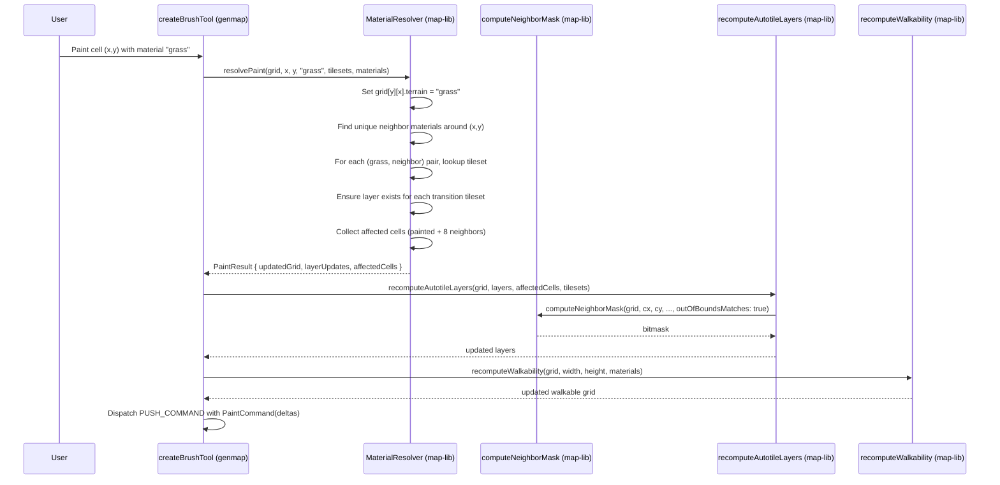

# Map Algorithm Extraction and Material Painting Pipeline Design Document

## Overview

This design document specifies the extraction of all pure map algorithms from `apps/genmap/` into `packages/map-lib/`, the addition of a material-based painting resolution pipeline, and the refactoring of `apps/game/src/game/scenes/Game.ts` to use the shared `MapRenderer`. The extraction creates a testable, reusable foundation of pure functions, resolves a documented out-of-bounds behavior divergence, and enables material-level painting where users select materials (e.g., "grass") and the system auto-resolves transition tilesets and layers.

## Design Summary (Meta)

```yaml
design_type: "refactoring"
risk_level: "medium"
complexity_level: "medium"
complexity_rationale: >
  (1) The material resolver must coordinate tileset lookups, layer creation/management,
  and cascading neighbor updates -- managing 3+ states (grid, layers, walkability)
  per paint operation. Multiple ACs require correct multi-layer autotile recomputation.
  (2) Risk of breaking ~15 existing import sites during extraction. The OOB behavior
  divergence must be correctly parameterized to avoid subtle autotile rendering bugs.
main_constraints:
  - "Zero-build pattern: map-lib exports TypeScript source directly (no dist/)"
  - "No database dependency in map-lib: material/tileset data passed as parameters"
  - "Backward compatibility: all existing editor behavior preserved after extraction"
biggest_risks:
  - "Import migration misses a file, causing runtime errors"
  - "MaterialResolver transition lookup produces incorrect layer assignments"
unknowns:
  - "Optimal caching strategy for tileset transition lookup table"
```

## Background and Context

### Prerequisite ADRs

- **ADR-0006 (adr-006-map-editor-architecture.md)**: Established three-package architecture (map-lib, map-renderer, db) and zero-build pattern. This extraction adds modules to map-lib as originally intended.
- **ADR-0009 (ADR-0009-tileset-management-architecture.md)**: Database-driven tilesets and materials with `fromMaterialId`/`toMaterialId` foreign keys. Provides the data model that the MaterialResolver consumes.
- **ADR-0010 (ADR-0010-map-lib-algorithm-extraction.md)**: Companion ADR documenting the decision to extract algorithms and add the material pipeline.

### Agreement Checklist

#### Scope
- [x] Extract pure algorithms from genmap to map-lib (autotile-utils, drawing algorithms, commands, zone geometry, zone validation)
- [x] Move EditorLayer type hierarchy to map-lib (full type, tight coupling accepted)
- [x] Move TilesetInfo and MaterialInfo to map-lib with extensions for material pipeline
- [x] Add MaterialResolver module for material-based painting
- [x] Parameterize computeNeighborMask with outOfBoundsMatches option
- [x] Refactor Game.ts to use MapRenderer from map-renderer package
- [x] Update all genmap imports to point to @nookstead/map-lib

#### Non-Scope (Explicitly not changing)
- [x] UI tool creators (createBrushTool, createFillTool, createRectangleTool, createEraserTool) stay in genmap
- [x] use-map-editor.ts React hook stays in genmap
- [x] canvas-renderer.ts (Canvas 2D) stays in genmap
- [x] zone-overlay.ts (Canvas 2D) stays in genmap
- [x] Database schema (no DB changes)
- [x] map-renderer package internals (no changes except Game.ts consuming it)
- [x] Server-side map generation pipeline (already in map-lib)

#### Constraints
- [x] Parallel operation: No (big-bang import migration within genmap)
- [x] Backward compatibility: Required (all editor features must work identically after extraction)
- [x] Performance measurement: Not required (pure refactoring, no algorithmic changes)

### Problem to Solve

1. Pure algorithms are embedded in UI-coupled files, making them untestable without mocking React dispatch and UI types.
2. Two implementations of neighbor bitmask computation exist with divergent out-of-bounds behavior: `autotile-utils.ts` (OOB = matching) and `transition-test-canvas.tsx` (OOB = not matching). The divergence is undocumented.
3. No material-based painting pipeline exists. Users paint with terrain keys, requiring manual tileset knowledge.
4. `Game.ts` duplicates the stamp-based rendering logic that already exists in `MapRenderer`.

### Current Challenges

- Testing `computeNeighborMask` requires constructing a `Cell[][]` grid and providing `TilesetInfo[]` -- doable but the function is buried in a file that also imports `EditorLayer` from a file that imports `EditorCommand` from a file that imports `MapEditorState` -- deep import chains that pull in the entire editor type system.
- Adding the material resolver on top of the current structure would require it to import from `hooks/autotile-utils.ts`, creating a dependency from new feature code to the existing tightly-coupled hooks layer.
- The `floodFill` function takes `MapEditorState['layers']` as a parameter type, coupling it to the state shape rather than a generic layer array.

### Requirements

#### Functional Requirements

- FR1: All pure algorithms must be importable from `@nookstead/map-lib` without any React, DOM, or Phaser dependencies.
- FR2: `computeNeighborMask` must accept an `outOfBoundsMatches` parameter to support both map editor (true) and transition test canvas (false) use cases.
- FR3: A `MaterialResolver` must resolve a material paint operation into affected layers, cells for autotile recomputation, and walkability updates.
- FR4: `Game.ts` must render maps using `MapRenderer` instead of inline stamp logic.
- FR5: All existing editor features must work identically after extraction (no behavioral changes).

#### Non-Functional Requirements

- **Maintainability**: Each module in map-lib has a single responsibility. No module exceeds 300 lines. All public functions have JSDoc documentation.
- **Testability**: Every exported function can be tested with simple data inputs (grids, coordinate arrays) without framework mocking.
- **Performance**: No algorithmic changes. Material resolver adds O(k) tileset lookup per paint operation where k = number of tilesets (typically < 30). Negligible overhead.

## Acceptance Criteria (AC) - EARS Format

### AC1: Algorithm Extraction

- [ ] All functions listed in the extraction scope are importable from `@nookstead/map-lib` and execute correctly with pure data inputs (no React/DOM/Phaser dependencies in the import chain).
- [ ] **When** `computeNeighborMask` is called with `outOfBoundsMatches: true`, out-of-bounds neighbors are treated as matching (bit set). **When** called with `outOfBoundsMatches: false`, out-of-bounds neighbors are treated as not matching (bit not set).
- [ ] **When** `bresenhamLine(0, 0, 5, 3)` is called, the system shall return a contiguous array of grid points with no diagonal gaps, matching the current implementation output exactly.
- [ ] **When** `floodFill` is called on a grid where the start cell matches the target terrain, the system shall return an empty delta array.
- [ ] **When** `recomputeAutotileLayers` is called with an empty `affectedCells` array, the system shall return the input layers unchanged.

### AC2: Type Migration

- [ ] `EditorLayer`, `BaseLayer`, `TileLayer`, `ObjectLayer`, `PlacedObject`, `EditorTool`, `SidebarTab`, `MapEditorState`, `MapEditorAction`, `LoadMapPayload`, `CellDelta`, and `EditorCommand` are importable from `@nookstead/map-lib`.
- [ ] `TilesetInfo` and `MaterialInfo` are importable from `@nookstead/map-lib` with extended fields (`fromMaterialId`, `toMaterialId` on TilesetInfo; `renderPriority`, `key` on MaterialInfo).
- [ ] No genmap source file imports types from `hooks/map-editor-types.ts`, `hooks/map-editor-commands.ts`, or `hooks/autotile-utils.ts` (all imports come from `@nookstead/map-lib`).

### AC3: Material Resolver

- [ ] **When** `resolvePaint(grid, x, y, "grass", width, height, layers, transitionMap, materials)` is called, the system shall set `grid[y][x].terrain` to the material's key and return a `PaintResult` with the set of layers that need autotile recomputation.
- [ ] **When** painting a cell with material "grass" adjacent to a cell with material "sand", the system shall identify the tileset with `fromMaterialId` matching "grass" and `toMaterialId` matching "sand" (or vice versa), and ensure a layer for that tileset exists.
- [ ] **If** no tileset exists for a given material pair transition, **then** the system shall skip that transition (no layer created) and include a diagnostic warning in the result.
- [ ] **When** painting cascades to neighbor cells, the system shall recompute autotile frames for the painted cell and all 8 neighbors.

### AC4: Game.ts MapRenderer Integration

- [ ] `Game.ts` uses `MapRenderer.render()` to render all map layers instead of inline stamp logic.
- [ ] The rendered output is visually identical to the current inline rendering (same tile positions, scales, and frame indices).
- [ ] `Game.ts` uses `map.width`/`map.height` from the `GeneratedMap` data instead of hardcoded `MAP_WIDTH`/`MAP_HEIGHT` constants for map dimensions.

### AC5: Zone Algorithm Extraction

- [ ] **When** `rasterizePolygon` is called with a triangle defined by vertices `[(0,0), (4,0), (2,4)]`, the system shall return all tile coordinates whose center falls inside the triangle.
- [ ] **When** `validateAllZones` is called with two overlapping zones of types that are not in `ZONE_OVERLAP_ALLOWED`, the system shall return a validation error listing the overlapping tiles.
- [ ] `computeRectBounds`, `clampBounds`, `isSimplePolygon`, `polygonArea`, `toZoneVertices` are importable from `@nookstead/map-lib`.

## Applicable Standards

### Classification Table

| Standard | Type | Source | Impact on Design |
|----------|------|--------|-----------------|
| Prettier: single quotes, 2-space indent | Explicit | `.prettierrc`, `.editorconfig` | All new code formatted accordingly |
| TypeScript strict mode | Explicit | `tsconfig.base.json` (`"strict": true`) | All new types must satisfy strict checks |
| ESLint with Nx module boundary enforcement | Explicit | `eslint.config.mjs` | map-lib tagged `scope:shared, type:lib` -- no app imports allowed |
| Zero-build package pattern | Explicit | ADR-0006, `package.json` exports | No `dist/` directory, export `.ts` source directly |
| ES modules (`"type": "module"`) | Explicit | `package.json` | Use `export`/`import`, no CommonJS |
| `noUnusedLocals`, `noImplicitReturns` | Explicit | `tsconfig.base.json` | All functions must have explicit returns, no dead locals |
| JSDoc on all public functions | Implicit | Observed in `core/autotile.ts` (all exports have JSDoc) | All new public functions must have JSDoc |
| Immutable update pattern | Implicit | Observed in `autotile-utils.ts`, `map-editor-commands.ts` (`.map(row => [...row])`) | State mutations must create new array/object references |
| `ReadonlyArray` for input collections | Implicit | Observed in `autotile-utils.ts` (`tilesets: ReadonlyArray<TilesetInfo>`) | Function parameters that should not be mutated use `Readonly` types |
| Row-major grid convention `grid[y][x]` | Implicit | Observed in all grid code (`grid[y][x]`, `frames[y][x]`) | All grid access uses `[y][x]` ordering |
| `readonly` on class fields and command interfaces | Implicit | Observed in `map-editor-commands.ts` (`readonly description`, `private readonly deltas`) | Class fields that should not change after construction are `readonly` |

## Existing Codebase Analysis

### Implementation Path Mapping

| Type | Path | Description |
|------|------|-------------|
| Existing | `packages/map-lib/src/core/autotile.ts` | Blob-47 engine (stays, no changes) |
| Existing | `packages/map-lib/src/types/map-types.ts` | Zone types, map types (stays, no changes) |
| Existing | `packages/map-lib/src/types/template-types.ts` | Template types (stays, no changes) |
| Existing | `apps/genmap/src/hooks/autotile-utils.ts` | Source for neighbor-mask, autotile-layers, walkability extraction |
| Existing | `apps/genmap/src/hooks/map-editor-types.ts` | Source for editor type extraction |
| Existing | `apps/genmap/src/hooks/map-editor-commands.ts` | Source for command extraction |
| Existing | `apps/genmap/src/components/map-editor/tools/brush-tool.ts` | Source for bresenhamLine extraction |
| Existing | `apps/genmap/src/components/map-editor/tools/fill-tool.ts` | Source for floodFill extraction |
| Existing | `apps/genmap/src/components/map-editor/zone-drawing.ts` | Source for zone geometry extraction |
| Existing | `apps/genmap/src/lib/zone-validation.ts` | Source for zone validation extraction |
| Existing | `apps/genmap/src/components/transition-test-canvas.tsx` | Uses divergent OOB behavior (will import parameterized version) |
| Existing | `apps/game/src/game/scenes/Game.ts` | Inline rendering to refactor |
| Existing | `packages/map-renderer/src/map-renderer.ts` | MapRenderer class (Game.ts target) |
| New | `packages/map-lib/src/core/neighbor-mask.ts` | Extracted computeNeighborMask with OOB param |
| New | `packages/map-lib/src/core/autotile-layers.ts` | Extracted recomputeAutotileLayers, checkTerrainPresence |
| New | `packages/map-lib/src/core/walkability.ts` | Extracted recomputeWalkability |
| New | `packages/map-lib/src/core/drawing-algorithms.ts` | Extracted bresenhamLine, floodFill, rectangleFill |
| New | `packages/map-lib/src/core/commands.ts` | Extracted applyDeltas, PaintCommand, FillCommand |
| New | `packages/map-lib/src/core/zone-geometry.ts` | Extracted zone drawing algorithms |
| New | `packages/map-lib/src/core/zone-validation.ts` | Extracted zone validation |
| New | `packages/map-lib/src/core/material-resolver.ts` | NEW: Material painting pipeline |
| New | `packages/map-lib/src/types/editor-types.ts` | Extracted editor types |
| New | `packages/map-lib/src/types/material-types.ts` | TilesetInfo, MaterialInfo (extended) |

### Code Inspection Evidence

#### What Was Examined

| File Inspected | Key Finding | Design Impact |
|---------------|-------------|---------------|
| `apps/genmap/src/hooks/autotile-utils.ts` (full, 196 lines) | Pure functions with no React imports. Only dependency on EditorLayer type. OOB = matching. | Direct extraction. EditorLayer moves to map-lib. |
| `apps/genmap/src/hooks/map-editor-types.ts` (full, 195 lines) | Pure type definitions. Imports EditorCommand and TilesetInfo/MaterialInfo. No React types in the type definitions themselves. | All types move to map-lib. |
| `apps/genmap/src/hooks/map-editor-commands.ts` (full, 141 lines) | Pure classes. Only import from autotile-utils (recomputeAutotileLayers, recomputeWalkability). | Direct extraction. Internal imports become same-package imports. |
| `apps/genmap/src/components/map-editor/tools/brush-tool.ts` (full, 124 lines) | `bresenhamLine` is pure. `createBrushTool` depends on React Dispatch and ToolHandlers. | Extract `bresenhamLine` only. |
| `apps/genmap/src/components/map-editor/tools/fill-tool.ts` (full, 122 lines) | `floodFill` is pure (takes Cell[][], returns CellDelta[]). `createFillTool` depends on React Dispatch. | Extract `floodFill` only. |
| `apps/genmap/src/components/map-editor/tools/rectangle-tool.ts` (full, 94 lines) | No standalone pure function -- rectangle fill logic is inline in the onMouseUp handler. | Extract rectangle fill as a new pure function `rectangleFill`. |
| `apps/genmap/src/components/map-editor/tools/eraser-tool.ts` (full, 91 lines) | Uses `bresenhamLine` from brush-tool. `createEraserTool` depends on React Dispatch. DEFAULT_TERRAIN constant. | `createEraserTool` stays in genmap; will import bresenhamLine from map-lib. |
| `apps/genmap/src/components/map-editor/zone-drawing.ts` (full, 84 lines) | All functions are pure geometry. TilePos type is a simple {x, y}. | Direct extraction. TilePos merged with existing ZoneVertex or kept as TileCoord. |
| `apps/genmap/src/lib/zone-validation.ts` (full, 162 lines) | All functions are pure. TileCoord, OverlapResult, ValidationError types. Uses ZONE_OVERLAP_ALLOWED from map-lib. | Direct extraction with types. |
| `apps/genmap/src/components/transition-test-canvas.tsx:38-45` | `computeBitmask` with OOB = NOT matching. | Validates need for `outOfBoundsMatches` parameter. |
| `apps/game/src/game/scenes/Game.ts:52-69` | Inline stamp rendering duplicating MapRenderer.render(). | Refactor to use MapRenderer. |
| `packages/map-renderer/src/map-renderer.ts` (full, 121 lines) | MapRenderer.render() accepts GeneratedMap, uses EMPTY_FRAME from map-lib. | Game.ts can use this directly. LayerData compatibility verified. |
| `packages/db/src/schema/tilesets.ts` (full, 63 lines) | `fromMaterialId`, `toMaterialId` FK columns on tilesets table. | MaterialResolver uses these for transition lookup. |
| `packages/db/src/schema/materials.ts` (full, 31 lines) | `key`, `walkable`, `renderPriority` columns on materials table. | MaterialInfo type must include these fields. |

#### How Findings Influence Design

- **All extraction candidates are confirmed pure**: No function scheduled for extraction has React, DOM, or Phaser dependencies. The extraction is mechanically safe.
- **EditorLayer is the key coupling point**: Moving EditorLayer to map-lib breaks the circular dependency chain (autotile-utils imports EditorLayer from map-editor-types, which imports EditorCommand from map-editor-commands, which imports from autotile-utils). In map-lib, all three modules can import from the shared types module.
- **Rectangle fill needs extraction as a new function**: Unlike bresenhamLine and floodFill which exist as named exports, the rectangle fill logic is inline in `createRectangleTool.onMouseUp`. A new `rectangleFill` pure function must be created.
- **MaterialInfo needs extension**: The current `MaterialInfo` has only `walkable: boolean`. The DB materials table has `key`, `walkable`, `speedModifier`, `renderPriority`, `swimRequired`, `damaging`. The map-lib `MaterialInfo` should include the fields needed for the resolver (`key`, `walkable`, `renderPriority`).
- **TilesetInfo needs extension**: The current `TilesetInfo` has `key` and `name`. The material resolver needs `fromMaterialId` and `toMaterialId`. The extended type adds these as optional fields (backward compatible).

## Design

### Change Impact Map

```yaml
Change Target: packages/map-lib (add 9 new modules + 2 new type files)
Direct Impact:
  - packages/map-lib/src/index.ts (add re-exports for all new modules)
  - packages/map-lib/src/types/index.ts (add re-exports for new types)
Indirect Impact:
  - apps/genmap/src/hooks/autotile-utils.ts (becomes re-export shim or deleted)
  - apps/genmap/src/hooks/map-editor-types.ts (becomes re-export shim or deleted)
  - apps/genmap/src/hooks/map-editor-commands.ts (becomes re-export shim or deleted)
  - apps/genmap/src/components/map-editor/tools/brush-tool.ts (import bresenhamLine from map-lib)
  - apps/genmap/src/components/map-editor/tools/fill-tool.ts (import floodFill from map-lib)
  - apps/genmap/src/components/map-editor/tools/eraser-tool.ts (import bresenhamLine from map-lib)
  - apps/genmap/src/components/map-editor/tools/rectangle-tool.ts (import rectangleFill from map-lib)
  - apps/genmap/src/components/map-editor/zone-drawing.ts (becomes re-export shim or deleted)
  - apps/genmap/src/lib/zone-validation.ts (becomes re-export shim or deleted)
  - apps/genmap/src/components/transition-test-canvas.tsx (import computeNeighborMask with outOfBoundsMatches: false)
  - apps/genmap/src/hooks/use-map-editor.ts (update imports)
  - apps/game/src/game/scenes/Game.ts (replace inline rendering with MapRenderer)
No Ripple Effect:
  - packages/map-renderer/ (no changes to MapRenderer internals)
  - packages/db/ (no schema changes)
  - packages/shared/ (no type changes)
  - apps/game/ other files (no import changes beyond Game.ts)
  - apps/server/ (does not import any affected code)
```

### Architecture Overview

```mermaid
graph TD
    subgraph "packages/map-lib"
        direction TB
        TYPES["types/"]
        ET["editor-types.ts<br/>(EditorLayer, MapEditorState, etc.)"]
        MT["material-types.ts<br/>(TilesetInfo, MaterialInfo)"]
        CORE["core/"]
        AT["autotile.ts<br/>(existing: getFrame, gateDiagonals)"]
        NM["neighbor-mask.ts<br/>(computeNeighborMask)"]
        AL["autotile-layers.ts<br/>(recomputeAutotileLayers)"]
        WK["walkability.ts<br/>(recomputeWalkability)"]
        DA["drawing-algorithms.ts<br/>(bresenhamLine, floodFill, rectangleFill)"]
        CM["commands.ts<br/>(applyDeltas, PaintCommand, FillCommand)"]
        ZG["zone-geometry.ts<br/>(computeRectBounds, polygonArea, etc.)"]
        ZV["zone-validation.ts<br/>(rasterizePolygon, validateAllZones)"]
        MR["material-resolver.ts<br/>(resolvePaint, buildTransitionMap)"]

        TYPES --> ET
        TYPES --> MT
        CORE --> AT
        CORE --> NM
        CORE --> AL
        CORE --> WK
        CORE --> DA
        CORE --> CM
        CORE --> ZG
        CORE --> ZV
        CORE --> MR

        NM --> AT
        AL --> NM
        CM --> AL
        CM --> WK
        MR --> AL
        MR --> NM
        MR --> WK
    end

    subgraph "apps/genmap (UI layer)"
        BT["tools/brush-tool.ts<br/>(createBrushTool)"]
        FT["tools/fill-tool.ts<br/>(createFillTool)"]
        RT["tools/rectangle-tool.ts<br/>(createRectangleTool)"]
        ER["tools/eraser-tool.ts<br/>(createEraserTool)"]
        UME["use-map-editor.ts"]
        CR["canvas-renderer.ts"]
        TTC["transition-test-canvas.tsx"]
    end

    BT --> DA
    BT --> CM
    FT --> DA
    FT --> CM
    RT --> DA
    RT --> CM
    ER --> DA
    UME --> CM
    UME --> MR
    TTC --> NM

    subgraph "apps/game"
        GS["scenes/Game.ts"]
    end
    subgraph "packages/map-renderer"
        MRR["MapRenderer"]
    end
    GS --> MRR
```



### Data Flow

#### Material Paint Operation



### Integration Points List

| Integration Point | Location | Old Implementation | New Implementation | Switching Method |
|-------------------|----------|-------------------|-------------------|------------------|
| Autotile computation | `autotile-utils.ts` -> `neighbor-mask.ts` | `computeNeighborMask` in genmap hooks | Same function in `@nookstead/map-lib` | Import path change |
| Autotile layer recomputation | `autotile-utils.ts` -> `autotile-layers.ts` | `recomputeAutotileLayers` in genmap hooks | Same function in `@nookstead/map-lib` | Import path change |
| Walkability | `autotile-utils.ts` -> `walkability.ts` | `recomputeWalkability` in genmap hooks | Same function in `@nookstead/map-lib` | Import path change |
| Bresenham line | `brush-tool.ts` -> `drawing-algorithms.ts` | `bresenhamLine` in tools/ | Same function in `@nookstead/map-lib` | Import path change |
| Flood fill | `fill-tool.ts` -> `drawing-algorithms.ts` | `floodFill` in tools/ | Same function in `@nookstead/map-lib` | Import path change |
| Rectangle fill | `rectangle-tool.ts` -> `drawing-algorithms.ts` | Inline logic in onMouseUp | New `rectangleFill` function in `@nookstead/map-lib` | Extract + import |
| Editor commands | `map-editor-commands.ts` -> `commands.ts` | Commands in genmap hooks | Same classes in `@nookstead/map-lib` | Import path change |
| Zone geometry | `zone-drawing.ts` -> `zone-geometry.ts` | Functions in genmap components | Same functions in `@nookstead/map-lib` | Import path change |
| Zone validation | `zone-validation.ts` -> `zone-validation.ts` | Functions in genmap lib | Same functions in `@nookstead/map-lib` | Import path change |
| Editor types | `map-editor-types.ts` -> `editor-types.ts` | Types in genmap hooks | Same types in `@nookstead/map-lib` | Import path change |
| Map rendering | `Game.ts` inline rendering | Inline stamp loop (lines 52-69) | `MapRenderer.render()` | Replace code block |
| Material painting | NEW | N/A | `MaterialResolver` in `@nookstead/map-lib` | New module |

### Main Components

#### Component 1: `core/neighbor-mask.ts`

- **Responsibility**: Compute 8-bit neighbor bitmask for autotile calculations. Provides configurable out-of-bounds behavior.
- **Interface**:

```typescript
import type { Cell } from '@nookstead/shared';
import type { TilesetInfo } from '../types/material-types';

/**
 * Direction offsets for the 8 neighbors, ordered to match bitmask constants.
 * Each entry: [dx, dy, maskBit].
 */
export const NEIGHBOR_OFFSETS: ReadonlyArray<readonly [number, number, number]>;

export interface NeighborMaskOptions {
  /**
   * How to treat out-of-bounds neighbors.
   * - true: OOB neighbors are treated as matching (bit set). Use for seamless map edges.
   * - false: OOB neighbors are treated as not matching (bit not set). Use for isolated tiles.
   * @default true
   */
  outOfBoundsMatches?: boolean;
}

/**
 * Check if a terrain cell type belongs to a layer's terrain key.
 */
export function checkTerrainPresence(
  terrain: string,
  terrainKey: string,
  tilesets: ReadonlyArray<TilesetInfo>,
): boolean;

/**
 * Compute the 8-bit neighbor mask for a cell at (x, y) within a grid.
 */
export function computeNeighborMask(
  grid: Cell[][],
  x: number,
  y: number,
  width: number,
  height: number,
  terrainKey: string,
  tilesets: ReadonlyArray<TilesetInfo>,
  options?: NeighborMaskOptions,
): number;
```

- **Dependencies**: `core/autotile.ts` (N, NE, E, SE, S, SW, W, NW constants), `types/material-types.ts` (TilesetInfo)

#### Component 2: `core/autotile-layers.ts`

- **Responsibility**: Recompute autotile frames for affected cells across all layers after a paint operation.
- **Interface**:

```typescript
import type { Cell } from '@nookstead/shared';
import type { EditorLayer } from '../types/editor-types';
import type { TilesetInfo } from '../types/material-types';

/**
 * Recompute autotile frames for affected cells after a paint operation.
 * Returns a new layers array with updated frames (immutable updates).
 */
export function recomputeAutotileLayers(
  grid: Cell[][],
  layers: EditorLayer[],
  affectedCells: ReadonlyArray<{ x: number; y: number }>,
  tilesets: ReadonlyArray<TilesetInfo>,
): EditorLayer[];
```

- **Dependencies**: `core/neighbor-mask.ts`, `core/autotile.ts` (getFrame, EMPTY_FRAME)

#### Component 3: `core/walkability.ts`

- **Responsibility**: Compute walkability grid from terrain data and material properties.
- **Interface**:

```typescript
import type { Cell } from '@nookstead/shared';
import type { MaterialInfo } from '../types/material-types';

/**
 * Recompute the walkability grid from terrain data.
 * Terrains not found in the map default to walkable (true).
 */
export function recomputeWalkability(
  grid: Cell[][],
  width: number,
  height: number,
  materials: ReadonlyMap<string, MaterialInfo>,
): boolean[][];
```

- **Dependencies**: `types/material-types.ts` (MaterialInfo)

#### Component 4: `core/drawing-algorithms.ts`

- **Responsibility**: Pure drawing/rasterization algorithms for map editing tools.
- **Interface**:

```typescript
import type { Cell } from '@nookstead/shared';
import type { CellDelta } from '../types/editor-types';
import type { EditorLayer } from '../types/editor-types';

/**
 * Bresenham's line algorithm.
 * Returns an array of integer grid points from (x0,y0) to (x1,y1),
 * including both endpoints. No diagonal gaps.
 */
export function bresenhamLine(
  x0: number,
  y0: number,
  x1: number,
  y1: number,
): Array<{ x: number; y: number }>;

/**
 * 4-directional BFS flood fill.
 * Returns CellDelta[] for all cells that changed.
 */
export function floodFill(
  grid: Cell[][],
  startX: number,
  startY: number,
  newTerrain: string,
  width: number,
  height: number,
  layerIndex: number,
  layers: ReadonlyArray<EditorLayer>,
): CellDelta[];

/** Options for rectangle fill. */
export interface RectangleFillOptions {
  grid: Cell[][];
  minX: number;
  minY: number;
  maxX: number;
  maxY: number;
  newTerrain: string;
  width: number;
  height: number;
  layerIndex: number;
  layers: ReadonlyArray<EditorLayer>;
}

/**
 * Fill all cells within a rectangle with a new terrain.
 * Returns CellDelta[] for all cells that changed.
 */
export function rectangleFill(options: RectangleFillOptions): CellDelta[];
```

- **Dependencies**: `types/editor-types.ts` (CellDelta, EditorLayer)

#### Component 5: `core/commands.ts`

- **Responsibility**: Reversible editor commands with delta-based undo/redo.
- **Interface**:

```typescript
import type { MapEditorState, CellDelta, EditorCommand } from '../types/editor-types';

/**
 * Apply a set of cell deltas to the state in the given direction.
 * After applying terrain changes, recomputes autotile frames and walkability.
 */
export function applyDeltas(
  state: MapEditorState,
  deltas: CellDelta[],
  direction: 'forward' | 'backward',
): MapEditorState;

/**
 * Command: paint a set of cells to a new terrain.
 */
export class PaintCommand implements EditorCommand {
  readonly description: string;
  constructor(deltas: CellDelta[], description?: string);
  execute(state: MapEditorState): MapEditorState;
  undo(state: MapEditorState): MapEditorState;
}

/**
 * Command: flood fill.
 */
export class FillCommand implements EditorCommand {
  readonly description: string;
  constructor(deltas: CellDelta[], description?: string);
  execute(state: MapEditorState): MapEditorState;
  undo(state: MapEditorState): MapEditorState;
}
```

- **Dependencies**: `core/autotile-layers.ts`, `core/walkability.ts`, `types/editor-types.ts`

#### Component 6: `core/zone-geometry.ts`

- **Responsibility**: Pure geometric computations for zone definitions.
- **Interface**:

```typescript
import type { ZoneBounds, ZoneVertex } from '../types/map-types';

export interface TileCoord {
  x: number;
  y: number;
}

/** Compute ZoneBounds from two tile positions (handles reversed drags). */
export function computeRectBounds(
  start: TileCoord,
  end: TileCoord,
): ZoneBounds;

/** Clamp ZoneBounds to map dimensions. */
export function clampBounds(
  bounds: ZoneBounds,
  mapWidth: number,
  mapHeight: number,
): ZoneBounds;

/** Check if a polygon defined by vertices is simple (no self-intersection). */
export function isSimplePolygon(vertices: TileCoord[]): boolean;

/** Compute polygon area using shoelace formula. */
export function polygonArea(vertices: TileCoord[]): number;

/** Convert TileCoord array to ZoneVertex array. */
export function toZoneVertices(vertices: TileCoord[]): ZoneVertex[];
```

- **Dependencies**: `types/map-types.ts` (ZoneBounds, ZoneVertex)

#### Component 7: `core/zone-validation.ts`

- **Responsibility**: Zone overlap detection and validation.
- **Interface**:

```typescript
import type { ZoneData, ZoneType } from '../types/map-types';
import type { TileCoord } from './zone-geometry';

export interface OverlapResult {
  overlaps: boolean;
  allowed: boolean;
  tiles: TileCoord[];
}

export interface ValidationError {
  zoneA: string;
  zoneB: string;
  zoneAType: ZoneType;
  zoneBType: ZoneType;
  tiles: TileCoord[];
}

/** Get the set of tiles covered by a zone's geometry. */
export function getZoneTiles(zone: ZoneData): TileCoord[];

/** Rasterize a polygon to tile coordinates using point-in-polygon test. */
export function rasterizePolygon(
  vertices: ReadonlyArray<{ x: number; y: number }>,
): TileCoord[];

/** Detect overlap between two zones. */
export function detectZoneOverlap(
  zoneA: ZoneData,
  zoneB: ZoneData,
): OverlapResult;

/** Validate all zone pairs and return disallowed overlaps as errors. */
export function validateAllZones(zones: ZoneData[]): ValidationError[];
```

- **Dependencies**: `types/map-types.ts` (ZoneData, ZoneType, ZONE_OVERLAP_ALLOWED)

#### Component 8: `core/material-resolver.ts` (NEW)

- **Responsibility**: Resolve material-based paint operations into layer updates, tileset selections, and autotile recomputation targets.
- **Interface**:

```typescript
import type { Cell } from '@nookstead/shared';
import type { EditorLayer } from '../types/editor-types';
import type { TilesetInfo, MaterialInfo } from '../types/material-types';

/**
 * A transition mapping entry: for a given material pair, which tileset handles it.
 */
export interface TransitionEntry {
  fromMaterialKey: string;
  toMaterialKey: string;
  tilesetKey: string;
  tilesetName: string;
}

/**
 * Pre-built lookup table for fast material pair -> tileset resolution.
 * Key format: "fromMaterialKey:toMaterialKey"
 */
export type TransitionMap = ReadonlyMap<string, TransitionEntry>;

/**
 * Build a transition map from tileset and material data.
 * Call once when tilesets/materials are loaded, cache the result.
 */
export function buildTransitionMap(
  tilesets: ReadonlyArray<TilesetInfo>,
  materials: ReadonlyMap<string, MaterialInfo>,
): TransitionMap;

/**
 * Diagnostic warning for missing transitions.
 */
export interface TransitionWarning {
  fromMaterial: string;
  toMaterial: string;
  message: string;
}

/**
 * Result of a material paint resolution.
 */
export interface PaintResult {
  /** Updated grid with new terrain at painted cell. */
  updatedGrid: Cell[][];
  /** Layers after creating/updating transition layers. */
  updatedLayers: EditorLayer[];
  /** Cells that need autotile recomputation (painted cell + neighbors). */
  affectedCells: ReadonlyArray<{ x: number; y: number }>;
  /** Warnings for missing tileset transitions. */
  warnings: TransitionWarning[];
}

/** Options for material paint resolution. */
export interface ResolvePaintOptions {
  grid: Cell[][];
  x: number;
  y: number;
  materialKey: string;
  width: number;
  height: number;
  layers: EditorLayer[];
  transitionMap: TransitionMap;
  materials: ReadonlyMap<string, MaterialInfo>;
}

/**
 * Resolve a material paint operation.
 *
 * 1. Sets grid[y][x].terrain to materialKey.
 * 2. Scans 8 neighbors to find unique adjacent materials.
 * 3. For each (materialKey, neighborMaterial) pair, looks up the transition tileset.
 * 4. Ensures a layer exists for each transition tileset.
 * 5. Collects the painted cell and its 8 neighbors as affected cells.
 *
 * Does NOT recompute autotile frames or walkability -- caller must invoke
 * recomputeAutotileLayers and recomputeWalkability with the returned affected cells.
 */
export function resolvePaint(options: ResolvePaintOptions): PaintResult;

/**
 * Create a new EditorLayer for a transition tileset.
 */
export function createTransitionLayer(
  tilesetKey: string,
  tilesetName: string,
  width: number,
  height: number,
): EditorLayer;
```

- **Dependencies**: `types/editor-types.ts`, `types/material-types.ts`

#### Component 9: `types/editor-types.ts`

- **Responsibility**: All editor-related type definitions shared across consumers.
- **Interface**:

```typescript
import type { Cell } from '@nookstead/shared';
import type { MapType, ZoneData } from '../types/map-types';
import type { TilesetInfo, MaterialInfo } from './material-types';

/** Editor tool types. */
export type EditorTool =
  | 'brush'
  | 'fill'
  | 'rectangle'
  | 'eraser'
  | 'zone-rect'
  | 'zone-poly'
  | 'object-place';

/** Sidebar tab identifiers. */
export type SidebarTab =
  | 'terrain'
  | 'layers'
  | 'properties'
  | 'zones'
  | 'frames'
  | 'game-objects';

/** All sidebar tab values as a runtime-accessible constant array. */
export const SIDEBAR_TABS: SidebarTab[];

/** Common fields shared by all layer types. */
export interface BaseLayer {
  id: string;
  name: string;
  visible: boolean;
  opacity: number;
}

/** A tile-based layer with terrain data and autotile frames. */
export interface TileLayer extends BaseLayer {
  type: 'tile';
  terrainKey: string;
  frames: number[][];
}

/** An object representing a game object placed on the map. */
export interface PlacedObject {
  id: string;
  objectId: string;
  objectName: string;
  gridX: number;
  gridY: number;
  rotation: number;
  flipX: boolean;
  flipY: boolean;
}

/** A layer containing placed game objects. */
export interface ObjectLayer extends BaseLayer {
  type: 'object';
  objects: PlacedObject[];
}

/** A single tile layer in the editor (backward-compatible flat structure). */
export interface EditorLayer {
  id: string;
  name: string;
  terrainKey: string;
  visible: boolean;
  opacity: number;
  frames: number[][];
}

/** A cell-level delta entry for undo/redo. */
export interface CellDelta {
  layerIndex: number;
  x: number;
  y: number;
  oldTerrain: string;
  newTerrain: string;
  oldFrame: number;
  newFrame: number;
}

/** A reversible editor command. */
export interface EditorCommand {
  readonly description: string;
  execute(state: MapEditorState): MapEditorState;
  undo(state: MapEditorState): MapEditorState;
}

/** Complete editor state. */
export interface MapEditorState {
  mapId: string | null;
  name: string;
  mapType: MapType | null;
  width: number;
  height: number;
  seed: number;
  grid: Cell[][];
  layers: EditorLayer[];
  walkable: boolean[][];
  tilesets: ReadonlyArray<TilesetInfo>;
  materials: ReadonlyMap<string, MaterialInfo>;
  activeLayerIndex: number;
  activeTool: EditorTool;
  activeTerrainKey: string;
  undoStack: EditorCommand[];
  redoStack: EditorCommand[];
  metadata: Record<string, string>;
  isDirty: boolean;
  isSaving: boolean;
  lastSavedAt: string | null;
  zones: ZoneData[];
  zoneVisibility: boolean;
}

/** Action types for the editor reducer. */
export type MapEditorAction =
  | { type: 'SET_TOOL'; tool: EditorTool }
  | { type: 'SET_TERRAIN'; terrainKey: string }
  | { type: 'SET_ACTIVE_LAYER'; index: number }
  | { type: 'LOAD_MAP'; map: LoadMapPayload }
  | { type: 'SET_NAME'; name: string }
  | { type: 'SET_SEED'; seed: number }
  | { type: 'RESIZE_MAP'; newWidth: number; newHeight: number }
  | { type: 'SET_METADATA'; metadata: Record<string, string> }
  | { type: 'SET_SAVING'; isSaving: boolean }
  | { type: 'MARK_SAVED' }
  | { type: 'MARK_DIRTY' }
  | { type: 'ADD_LAYER'; name: string; terrainKey: string }
  | { type: 'REMOVE_LAYER'; index: number }
  | { type: 'TOGGLE_LAYER_VISIBILITY'; index: number }
  | { type: 'SET_LAYER_OPACITY'; index: number; opacity: number }
  | { type: 'REORDER_LAYERS'; fromIndex: number; toIndex: number }
  | { type: 'ADD_OBJECT_LAYER'; name: string }
  | { type: 'PLACE_OBJECT'; layerIndex: number; object: PlacedObject }
  | { type: 'REMOVE_OBJECT'; layerIndex: number; objectId: string }
  | { type: 'MOVE_OBJECT'; layerIndex: number; objectId: string; gridX: number; gridY: number }
  | { type: 'UNDO' }
  | { type: 'REDO' }
  | { type: 'PUSH_COMMAND'; command: EditorCommand }
  | { type: 'SET_TILESETS'; tilesets: ReadonlyArray<TilesetInfo> }
  | { type: 'SET_MATERIALS'; materials: ReadonlyMap<string, MaterialInfo> }
  | { type: 'SET_ZONES'; zones: ZoneData[] }
  | { type: 'ADD_ZONE'; zone: ZoneData }
  | { type: 'UPDATE_ZONE'; zoneId: string; data: Partial<ZoneData> }
  | { type: 'DELETE_ZONE'; zoneId: string }
  | { type: 'TOGGLE_ZONE_VISIBILITY' };

/** Payload shape for LOAD_MAP action. */
export interface LoadMapPayload {
  id: string;
  name: string;
  mapType: string;
  width: number;
  height: number;
  seed: number | null;
  grid: Cell[][];
  layers: EditorLayer[] | unknown[];
  walkable: boolean[][];
  metadata?: unknown;
  zones?: ZoneData[];
}
```

#### Component 10: `types/material-types.ts`

- **Responsibility**: Type definitions for tileset and material data used by the painting pipeline.
- **Interface**:

```typescript
/**
 * Minimal tileset descriptor needed for autotile computations.
 * Extended from the original to include material relationship IDs.
 */
export interface TilesetInfo {
  /** Unique tileset key (e.g., "terrain-03"). */
  key: string;
  /** Human-readable tileset name (e.g., "water_grass"). */
  name: string;
  /** Material this tileset transitions FROM (UUID, optional for legacy tilesets). */
  fromMaterialId?: string;
  /** Material this tileset transitions TO (UUID, optional for legacy tilesets). */
  toMaterialId?: string;
}

/**
 * Material descriptor for painting and walkability.
 * Keyed by material name (e.g., "grass", "deep_water").
 */
export interface MaterialInfo {
  /** Material key matching the materials table key column. */
  key: string;
  /** Whether this material is walkable. */
  walkable: boolean;
  /** Render priority for layer ordering (higher = rendered on top). */
  renderPriority: number;
}
```

### Contract Definitions

See the interface definitions in each component section above.

### Data Contract

#### Material Resolver (`resolvePaint`)

```yaml
Input (ResolvePaintOptions):
  grid: Cell[][] (row-major, grid[y][x])
  x: number (0 <= x < width)
  y: number (0 <= y < height)
  materialKey: string (material key, e.g., "grass")
  width: number (grid width, positive integer)
  height: number (grid height, positive integer)
  layers: EditorLayer[] (current layer state)
  transitionMap: TransitionMap (pre-built lookup from buildTransitionMap)
  materials: ReadonlyMap<string, MaterialInfo>

  Preconditions:
    - 0 <= x < width and 0 <= y < height
    - materialKey exists in materials map
    - transitionMap was built from current tilesets/materials data

  Validation:
    - Out-of-range coordinates return unchanged state
    - Unknown materialKey returns unchanged state with warning

Output:
  PaintResult:
    updatedGrid: Cell[][] (new grid with terrain changed at [y][x])
    updatedLayers: EditorLayer[] (layers with new transition layers added if needed)
    affectedCells: Array<{x, y}> (cells needing autotile recomputation)
    warnings: TransitionWarning[] (missing transitions)

  Guarantees:
    - Original grid and layers are not mutated (immutable updates)
    - affectedCells always includes the painted cell
    - Each unique material pair has at most one layer

  On Error:
    - Invalid coordinates: return unchanged PaintResult (empty affectedCells)
    - Missing material: return unchanged PaintResult with warning
```

#### Neighbor Mask (`computeNeighborMask`)

```yaml
Input:
  grid: Cell[][] (row-major)
  x, y: number (cell coordinates)
  width, height: number (grid dimensions)
  terrainKey: string
  tilesets: ReadonlyArray<TilesetInfo>
  options?: { outOfBoundsMatches?: boolean }

  Preconditions:
    - 0 <= x < width and 0 <= y < height
    - terrainKey is a valid tileset key

Output:
  number: 8-bit neighbor mask (0-255)

  Guarantees:
    - Bit layout matches autotile.ts constants (N=1, NE=2, E=4, SE=8, S=16, SW=32, W=64, NW=128)
    - When outOfBoundsMatches is true (default), OOB neighbors have their bits set
    - When outOfBoundsMatches is false, OOB neighbors have their bits clear

Invariants:
  - Result is always in range [0, 255]
  - Diagonal gating is NOT applied (raw mask; gating happens in getFrame)
```

### Data Representation Decisions

| Data Structure | Decision | Rationale |
|---|---|---|
| EditorLayer | **Reuse** existing interface, move to map-lib | Existing type covers 100% of needs. User confirmed: tight coupling, all consumers share same type. |
| TilesetInfo | **Extend** existing interface in map-lib | Existing type covers base fields (key, name). Extension adds `fromMaterialId`, `toMaterialId` as optional fields for backward compatibility. |
| MaterialInfo | **New** expanded type in map-lib | Existing type has only `walkable: boolean`. New type adds `key` and `renderPriority` from DB schema. Not a breaking change -- consumers that only need walkability can still use the type (all fields present). |
| TransitionMap | **New** dedicated type | No existing type for material pair -> tileset lookup. This is a new concept specific to the material resolver. |
| TransitionEntry | **New** dedicated type | Represents a single entry in the transition map. No existing equivalent. |
| PaintResult | **New** dedicated type | Return type for resolvePaint. No existing equivalent -- this is a new operation. |
| TransitionWarning | **New** dedicated type | Diagnostic output for missing transitions. New concept. |
| TileCoord | **Reuse** pattern from zone-validation.ts | Move existing TileCoord to zone-geometry.ts (its canonical home). Identical to the existing type. |
| OverlapResult, ValidationError | **Reuse** existing types, move to map-lib | 100% field overlap with existing types in zone-validation.ts. |
| CellDelta, EditorCommand | **Reuse** existing interfaces, move to map-lib | 100% field overlap. Move from map-editor-commands.ts to editor-types.ts. |
| MapEditorState, MapEditorAction | **Reuse** existing types, move to map-lib | These are pure data types with no React dependency. Moving enables commands module to reference them without cross-package imports. |

### Field Propagation Map

```yaml
fields:
  - name: "materialKey"
    origin: "User selection in material palette (UI)"
    transformations:
      - layer: "UI Layer (genmap)"
        type: "string"
        validation: "must exist in materials Map"
      - layer: "MaterialResolver (map-lib)"
        type: "string"
        transformation: "used to set grid[y][x].terrain and lookup transitions"
      - layer: "Grid (map-lib)"
        type: "Cell.terrain (TerrainCellType)"
        transformation: "stored as cell terrain value"
    destination: "Cell.terrain in grid, persisted to editor_maps.grid JSONB"
    loss_risk: "low"
    loss_risk_reason: "materialKey maps 1:1 to terrain name; validated against materials Map before use"

  - name: "outOfBoundsMatches"
    origin: "Caller (map editor vs transition test canvas)"
    transformations:
      - layer: "neighbor-mask.ts"
        type: "boolean (default true)"
        transformation: "controls whether OOB neighbors set their mask bit"
    destination: "Affects 8-bit neighbor mask value (0-255)"
    loss_risk: "none"

  - name: "fromMaterialId / toMaterialId"
    origin: "tilesets table in database"
    transformations:
      - layer: "API Layer (genmap)"
        type: "string (UUID)"
        validation: "references materials(id)"
      - layer: "TilesetInfo (map-lib)"
        type: "string | undefined"
        transformation: "stored as optional fields on TilesetInfo"
      - layer: "TransitionMap (map-lib)"
        type: "map key: 'fromKey:toKey'"
        transformation: "resolved to material keys via materials Map"
    destination: "TransitionMap lookup for paint operations"
    loss_risk: "low"
    loss_risk_reason: "Material IDs are resolved to keys at TransitionMap build time; undefined IDs result in missing transitions (warned, not silent)"
```

### Integration Point Map

```yaml
Integration Point 1:
  Existing Component: apps/genmap/src/hooks/autotile-utils.ts (all exports)
  Integration Method: Import path redirect to @nookstead/map-lib
  Impact Level: High (Process Flow Change)
  Required Test Coverage: Verify all genmap features that use autotile computation still work

Integration Point 2:
  Existing Component: apps/genmap/src/hooks/map-editor-types.ts (all type exports)
  Integration Method: Import path redirect to @nookstead/map-lib
  Impact Level: Medium (Data Usage -- types only)
  Required Test Coverage: TypeScript compilation success

Integration Point 3:
  Existing Component: apps/genmap/src/hooks/map-editor-commands.ts (all exports)
  Integration Method: Import path redirect to @nookstead/map-lib
  Impact Level: High (Process Flow Change)
  Required Test Coverage: Undo/redo operations preserve correct state

Integration Point 4:
  Existing Component: apps/genmap/src/components/map-editor/tools/*.ts (pure algorithm imports)
  Integration Method: Change import source from local files to @nookstead/map-lib
  Impact Level: Medium (Import change only, no logic change)
  Required Test Coverage: Paint, fill, rectangle, erase tools produce same deltas

Integration Point 5:
  Existing Component: apps/genmap/src/components/transition-test-canvas.tsx (computeBitmask)
  Integration Method: Replace local computeBitmask with computeNeighborMask(outOfBoundsMatches: false)
  Impact Level: High (Behavior change -- must produce identical output with new param)
  Required Test Coverage: Transition test canvas renders identical autotile frames

Integration Point 6:
  Existing Component: apps/game/src/game/scenes/Game.ts (inline rendering loop)
  Integration Method: Replace inline stamp loop with MapRenderer.render()
  Impact Level: Medium (Code replacement, same visual output)
  Required Test Coverage: Game renders map identically (visual verification)

Integration Point 7:
  Existing Component: NEW -- MaterialResolver
  Integration Method: New module consumed by genmap painting pipeline
  Impact Level: High (New feature)
  Required Test Coverage: Unit tests for buildTransitionMap and resolvePaint
```

### Integration Boundary Contracts

```yaml
Boundary 1: map-lib -> genmap (algorithm consumption)
  Input: Pure data (Cell[][], EditorLayer[], coordinates, tilesets)
  Output: Computed results (bitmasks, updated layers, deltas) -- sync
  On Error: Invalid inputs return empty/unchanged results (no exceptions for OOB)

Boundary 2: genmap -> map-lib (type imports)
  Input: N/A (type-only imports)
  Output: TypeScript type definitions -- compile-time only
  On Error: Compilation failure if types are misused

Boundary 3: map-lib MaterialResolver -> genmap painting pipeline
  Input: Grid, coordinates, material key, TransitionMap, MaterialInfo map
  Output: PaintResult (sync)
  On Error: Unknown material returns unchanged result with TransitionWarning

Boundary 4: Game.ts -> map-renderer MapRenderer
  Input: GeneratedMap (from server or local generation)
  Output: Phaser.GameObjects.RenderTexture (sync)
  On Error: Empty/missing layers render as empty texture (no crash)
```

### Interface Change Impact Analysis

| Existing Operation | New Operation | Conversion Required | Adapter Required | Compatibility Method |
|-------------------|---------------|-------------------|------------------|---------------------|
| `computeNeighborMask(grid, x, y, w, h, key, tilesets)` | `computeNeighborMask(grid, x, y, w, h, key, tilesets, options?)` | None (additive) | Not Required | Optional parameter with default |
| `checkTerrainPresence(terrain, key, tilesets)` | Same signature | None | Not Required | - |
| `recomputeAutotileLayers(grid, layers, cells, tilesets)` | Same signature | None | Not Required | - |
| `recomputeWalkability(grid, w, h, materials)` | Same signature | None | Not Required | - |
| `bresenhamLine(x0, y0, x1, y1)` | Same signature | None | Not Required | - |
| `floodFill(grid, x, y, terrain, w, h, idx, layers)` | `floodFill(..., layers: ReadonlyArray<EditorLayer>)` | Minor (ReadonlyArray) | Not Required | ReadonlyArray accepts mutable arrays |
| `applyDeltas(state, deltas, direction)` | Same signature | None | Not Required | - |
| `PaintCommand(deltas, desc?)` | Same signature | None | Not Required | - |
| `FillCommand(deltas, desc?)` | Same signature | None | Not Required | - |
| transition-test-canvas `computeBitmask(grid, r, c)` | `computeNeighborMask(cellGrid, c, r, w, h, key, tilesets, {outOfBoundsMatches: false})` | Yes | Thin wrapper | Adapter function in transition-test-canvas.tsx |
| Game.ts inline rendering | `MapRenderer.render(map)` | Yes | Not Required | Direct replacement |
| N/A (new) | `resolvePaint(...)` | N/A | N/A | New function |
| N/A (new) | `buildTransitionMap(...)` | N/A | N/A | New function |
| N/A (new) | `rectangleFill(...)` | N/A | N/A | New function |

### Error Handling

All map-lib functions follow a defensive, non-throwing pattern:

- **Out-of-bounds coordinates**: Return empty results (empty delta array, unchanged layers) rather than throwing. This matches the existing behavior in autotile-utils.ts and the tool files.
- **Missing tileset/material**: `checkTerrainPresence` returns `false`. `MaterialResolver` includes a `TransitionWarning` in the result. No exceptions.
- **Empty inputs**: Functions handle empty arrays gracefully (e.g., `recomputeAutotileLayers` with empty `affectedCells` returns layers unchanged).

### Logging and Monitoring

No logging is added to map-lib (pure library with no I/O dependencies). The `TransitionWarning` type in `PaintResult` provides structured diagnostic output that the consuming UI layer can display or log as appropriate.

## What Stays in genmap

The following code remains in `apps/genmap/` because it has UI framework dependencies:

| File | Reason for Staying | Map-lib Imports Used |
|------|-------------------|---------------------|
| `tools/brush-tool.ts` | React `Dispatch`, `ToolHandlers` interface | `bresenhamLine`, `PaintCommand`, `CellDelta` |
| `tools/fill-tool.ts` | React `Dispatch`, `ToolHandlers` interface | `floodFill`, `FillCommand`, `CellDelta` |
| `tools/rectangle-tool.ts` | React `Dispatch`, `ToolHandlers`, `PreviewRect` | `rectangleFill`, `PaintCommand`, `CellDelta` |
| `tools/eraser-tool.ts` | React `Dispatch`, `ToolHandlers` | `bresenhamLine`, `PaintCommand`, `CellDelta` |
| `hooks/use-map-editor.ts` | React hook (`useReducer`, `useCallback`) | All editor types, commands, autotile functions |
| `components/canvas-renderer.ts` | Canvas 2D API | EditorLayer (type only) |
| `components/zone-overlay.ts` | Canvas 2D API | ZoneData (type only) |
| `components/map-editor-canvas.tsx` | React component, Phaser integration | ToolHandlers (local interface) |

## Game.ts Integration Plan

### Current Code (to be replaced)

```typescript
// Game.ts lines 52-69 (inline stamp rendering)
this.rt = this.add.renderTexture(0, 0, mapPixelW, mapPixelH);
const rt = this.rt;
rt.setOrigin(0, 0);
const stamp = this.add.sprite(0, 0, '').setScale(tileScale).setOrigin(0, 0).setVisible(false);
for (const layerData of this.mapData.layers) {
  for (let y = 0; y < MAP_HEIGHT; y++) {
    for (let x = 0; x < MAP_WIDTH; x++) {
      const frame = layerData.frames[y][x];
      if (frame === EMPTY_FRAME) continue;
      stamp.setTexture(layerData.terrainKey, frame);
      rt.draw(stamp, x * TILE_SIZE, y * TILE_SIZE);
    }
  }
}
stamp.destroy();
```

### New Code (using MapRenderer)

```typescript
import { MapRenderer } from '@nookstead/map-renderer';
import { TILE_SIZE, FRAME_SIZE } from '../constants';

// In create():
const renderer = new MapRenderer(this, { tileSize: TILE_SIZE, frameSize: FRAME_SIZE });
this.rt = renderer.render(this.mapData);
```

### Changes Required

1. Add `import { MapRenderer } from '@nookstead/map-renderer';` to Game.ts.
2. Remove `import { EMPTY_FRAME } from '@nookstead/map-lib';` (no longer needed directly).
3. Replace the inline rendering block (lines 52-69) with the two-line `MapRenderer` call.
4. Store the `MapRenderer` instance as a class field if `updateCell` is needed later.
5. Verify that `MAP_WIDTH`/`MAP_HEIGHT` constants match `this.mapData.width`/`this.mapData.height` (the MapRenderer uses the map's own dimensions).

## Import Migration Plan

### Files That Change Imports

| File | Old Import Source | New Import Source | Symbols |
|------|------------------|------------------|---------|
| `apps/genmap/src/hooks/use-map-editor.ts` | `./map-editor-types` | `@nookstead/map-lib` | EditorLayer, MapEditorState, MapEditorAction, EditorTool, etc. |
| `apps/genmap/src/hooks/use-map-editor.ts` | `./map-editor-commands` | `@nookstead/map-lib` | EditorCommand, PaintCommand, FillCommand, applyDeltas, CellDelta |
| `apps/genmap/src/hooks/use-map-editor.ts` | `./autotile-utils` | `@nookstead/map-lib` | recomputeAutotileLayers, recomputeWalkability, TilesetInfo, MaterialInfo |
| `apps/genmap/src/components/map-editor/tools/brush-tool.ts` | `@/hooks/map-editor-types` | `@nookstead/map-lib` | MapEditorState, MapEditorAction |
| `apps/genmap/src/components/map-editor/tools/brush-tool.ts` | `@/hooks/map-editor-commands` | `@nookstead/map-lib` | CellDelta, PaintCommand |
| `apps/genmap/src/components/map-editor/tools/fill-tool.ts` | `@/hooks/map-editor-types` | `@nookstead/map-lib` | MapEditorState, MapEditorAction |
| `apps/genmap/src/components/map-editor/tools/fill-tool.ts` | `@/hooks/map-editor-commands` | `@nookstead/map-lib` | CellDelta, FillCommand |
| `apps/genmap/src/components/map-editor/tools/fill-tool.ts` | `@nookstead/map-lib` (Cell) | Unchanged | Cell (already from map-lib) |
| `apps/genmap/src/components/map-editor/tools/fill-tool.ts` | Local `floodFill` | `@nookstead/map-lib` | floodFill |
| `apps/genmap/src/components/map-editor/tools/rectangle-tool.ts` | `@/hooks/map-editor-types` | `@nookstead/map-lib` | MapEditorState, MapEditorAction |
| `apps/genmap/src/components/map-editor/tools/rectangle-tool.ts` | `@/hooks/map-editor-commands` | `@nookstead/map-lib` | CellDelta, PaintCommand |
| `apps/genmap/src/components/map-editor/tools/eraser-tool.ts` | `@/hooks/map-editor-types` | `@nookstead/map-lib` | MapEditorState, MapEditorAction |
| `apps/genmap/src/components/map-editor/tools/eraser-tool.ts` | `@/hooks/map-editor-commands` | `@nookstead/map-lib` | CellDelta, PaintCommand |
| `apps/genmap/src/components/map-editor/tools/eraser-tool.ts` | `./brush-tool` (bresenhamLine) | `@nookstead/map-lib` | bresenhamLine |
| `apps/genmap/src/components/transition-test-canvas.tsx` | Local `computeBitmask` | `@nookstead/map-lib` | computeNeighborMask (with adapter) |
| `apps/genmap/src/components/map-editor/zone-drawing.ts` | N/A (source moves) | N/A | File becomes re-export shim |
| `apps/genmap/src/lib/zone-validation.ts` | N/A (source moves) | N/A | File becomes re-export shim |
| `apps/game/src/game/scenes/Game.ts` | `@nookstead/map-lib` (EMPTY_FRAME) | `@nookstead/map-renderer` | MapRenderer |

### Migration Strategy

**Approach**: Replace original files with re-export shims that forward to `@nookstead/map-lib`. This provides a non-breaking migration path -- existing imports continue to work. Shims can be removed in a follow-up cleanup.

Example shim for `apps/genmap/src/hooks/autotile-utils.ts`:

```typescript
// Re-export shim: all exports now come from @nookstead/map-lib
export {
  checkTerrainPresence,
  computeNeighborMask,
  recomputeAutotileLayers,
  recomputeWalkability,
} from '@nookstead/map-lib';
export type { TilesetInfo, MaterialInfo } from '@nookstead/map-lib';
```

Alternatively, all imports can be updated directly (preferred for a clean codebase, since all affected files are within the same PR).

## Implementation Plan

### Implementation Approach

**Selected Approach**: Horizontal Slice (Foundation-driven)
**Selection Reason**: The extraction creates a shared foundation (map-lib modules) that multiple consumers depend on. Building the foundation first ensures that all consumers can be updated in a single pass. The material resolver depends on the extracted autotile and walkability functions. The vertical alternative (feature-by-feature) would require partial extractions that create temporary intermediate states.

### Technical Dependencies and Implementation Order

#### Required Implementation Order

1. **Types Migration** (types/editor-types.ts, types/material-types.ts)
   - Technical Reason: All other modules depend on these type definitions. Must be available first.
   - Dependent Elements: Every core/ module, all genmap import updates.

2. **Core Algorithm Extraction** (neighbor-mask, autotile-layers, walkability, drawing-algorithms, zone-geometry, zone-validation)
   - Technical Reason: These are leaf modules with no cross-dependencies (except neighbor-mask -> autotile, which is already in map-lib).
   - Prerequisites: Types migration complete.

3. **Commands Extraction** (commands.ts)
   - Technical Reason: Commands depend on autotile-layers and walkability (for recomputation in applyDeltas).
   - Prerequisites: Core algorithm extraction complete.

4. **Material Resolver** (material-resolver.ts)
   - Technical Reason: New module that composes neighbor-mask, autotile-layers, and walkability. Cannot be built until those are available in map-lib.
   - Prerequisites: Core algorithm extraction complete.

5. **Import Migration** (update all genmap imports)
   - Technical Reason: Must happen after all source modules exist in map-lib.
   - Prerequisites: All map-lib modules complete.

6. **Game.ts Refactoring**
   - Technical Reason: Independent of genmap migration. Can happen in parallel with step 5.
   - Prerequisites: None (MapRenderer already exists).

### Integration Points

**Integration Point 1: map-lib types compile**
- Components: types/editor-types.ts + types/material-types.ts -> map-lib index.ts
- Verification: `pnpm nx typecheck map-lib` passes

**Integration Point 2: Core algorithms usable from genmap**
- Components: map-lib core/ modules -> genmap import migration
- Verification: `pnpm nx typecheck game` (genmap app) passes with updated imports

**Integration Point 3: Material resolver produces correct results**
- Components: material-resolver.ts -> unit tests
- Verification: Unit tests for buildTransitionMap and resolvePaint pass

**Integration Point 4: Game.ts renders correctly**
- Components: Game.ts -> MapRenderer
- Verification: Visual verification that game map rendering is identical

### Migration Strategy

Use re-export shims for a safe rollback path:
1. Create all new modules in map-lib.
2. Replace original genmap files with re-export shims.
3. Verify everything compiles and tests pass.
4. Optionally update direct imports in a follow-up (remove shims).

## Test Strategy

### Basic Test Design Policy

Each acceptance criterion maps to at least one unit test. Pure functions enable straightforward testing with grid fixtures.

### Unit Tests

Test files co-located with source in `packages/map-lib/src/core/`:

- `neighbor-mask.spec.ts`: Test OOB=true and OOB=false, corner cells, edge cells, center cells, all-same terrain, mixed terrain.
- `autotile-layers.spec.ts`: Test empty affectedCells, single cell update, multi-cell update, layer frame immutability.
- `walkability.spec.ts`: Test all-walkable, all-unwalkable, mixed, unknown terrain defaults to walkable.
- `drawing-algorithms.spec.ts`: Test bresenhamLine (horizontal, vertical, diagonal, single point), floodFill (same terrain no-op, bounded fill, full grid fill), rectangleFill (single cell, full grid, out-of-bounds clamping).
- `commands.spec.ts`: Test PaintCommand execute/undo roundtrip, FillCommand execute/undo roundtrip, applyDeltas forward/backward.
- `zone-geometry.spec.ts`: Test computeRectBounds (normal, reversed), clampBounds (within bounds, exceeding), isSimplePolygon (triangle, self-intersecting), polygonArea (known shapes).
- `zone-validation.spec.ts`: Test getZoneTiles (rectangle, polygon), rasterizePolygon (triangle, concave), detectZoneOverlap (overlapping, non-overlapping, allowed overlap), validateAllZones (no errors, with errors).
- `material-resolver.spec.ts`: Test buildTransitionMap (normal, missing materials), resolvePaint (single material, two-material transition, missing transition warning, edge cell).

### Integration Tests

- Compile-time integration: `pnpm nx typecheck map-lib` verifies all modules compile together.
- Import integration: `pnpm nx typecheck game` (genmap) verifies all updated imports resolve correctly.

### E2E Tests

- Visual verification that the genmap map editor renders and paints identically after extraction.
- Visual verification that `apps/game/` renders maps identically after Game.ts refactoring.

### Performance Tests

Not required. This is a pure refactoring with no algorithmic changes. The material resolver adds O(k) lookup where k = number of tilesets (< 30), which is negligible.

## Security Considerations

No security implications. All code is pure algorithmic computation with no network, filesystem, or user input handling. Map-lib has no new dependencies.

## Future Extensibility

- **Additional drawing tools**: New tool algorithms (circle brush, gradient fill, etc.) can be added to `core/drawing-algorithms.ts` following the same pattern.
- **Material priority rendering**: The `renderPriority` field on `MaterialInfo` enables future layer ordering optimizations.
- **Server-side material resolution**: The `MaterialResolver` can be used server-side for procedural map generation with material-based terrain assignment.
- **Multi-material paint**: `resolvePaint` can be extended to support painting with material blends.

## Alternative Solutions

### Alternative 1: Extract to a new `packages/map-algorithms` package

- **Overview**: Create a separate package instead of adding to map-lib.
- **Advantages**: Narrower package responsibility, clear separation from existing map-lib content.
- **Disadvantages**: Adds a third map-related package (map-lib, map-renderer, map-algorithms). Over-granular packaging for a private monorepo. All consumers would need to depend on both map-lib (for types) and map-algorithms (for functions).
- **Reason for Rejection**: ADR-0006 established map-lib as the home for pure map algorithms. Adding to it is the intended usage.

### Alternative 2: Move only types, keep algorithms as genmap utilities

- **Overview**: Move EditorLayer, TilesetInfo, MaterialInfo to map-lib, but keep algorithms in genmap as a local `lib/` directory.
- **Advantages**: Smaller extraction scope, types are shared but algorithms stay app-local.
- **Disadvantages**: Algorithms remain untestable without React mocking. Material resolver would depend on genmap-local code. Inconsistent boundary (types shared, functions not).
- **Reason for Rejection**: The primary goal is testability, which requires extracting the functions, not just the types.

## Risks and Mitigation

| Risk | Impact | Probability | Mitigation |
|------|--------|-------------|------------|
| Import migration misses a file | Medium (compilation error) | Low | Use Grep to find all import sites before migration. TypeScript compiler will catch missing imports. |
| OOB parameterization introduces subtle rendering bugs | High (visual artifacts) | Low | Comprehensive unit tests for both OOB modes. Visual comparison before/after. |
| MaterialResolver transition lookup returns wrong tileset | High (wrong terrain rendered) | Medium | Unit tests with known material pairs. Integration test with real DB data. |
| MapEditorState in map-lib creates unexpected coupling | Medium (architectural) | Low | MapEditorState is a pure data type with no React dependency. If coupling emerges, it can be split into MapState (map-lib) and EditorUIState (genmap). |
| Game.ts MapRenderer produces different visual output | Medium (visual regression) | Low | Side-by-side screenshot comparison. MapRenderer.render() was specifically built to match the inline pattern. |

## References

- [ADR-0006 / adr-006-map-editor-architecture.md](../adr/adr-006-map-editor-architecture.md) -- Three-package architecture decision
- [ADR-0009 / ADR-0009-tileset-management-architecture.md](../adr/ADR-0009-tileset-management-architecture.md) -- Database-driven tilesets and materials
- [ADR-0010 / ADR-0010-map-lib-algorithm-extraction.md](../adr/ADR-0010-map-lib-algorithm-extraction.md) -- Companion ADR for this design
- [design-007-map-editor.md](design-007-map-editor.md) -- Original map editor design
- [design-011-tileset-management.md](design-011-tileset-management.md) -- Tileset management design
- [Bresenham's Line Algorithm (Wikipedia)](https://en.wikipedia.org/wiki/Bresenham%27s_line_algorithm) -- Standard line rasterization
- [Flood Fill Algorithm (Wikipedia)](https://en.wikipedia.org/wiki/Flood_fill) -- BFS-based region fill
- [Blob Tileset Article](https://web.archive.org/web/2023/cr31.co.uk/stagecast/wang/blob.html) -- Blob-47 autotile reference

## Update History

| Date | Version | Changes | Author |
|------|---------|---------|--------|
| 2026-02-21 | 1.0 | Initial version | AI Technical Designer |
