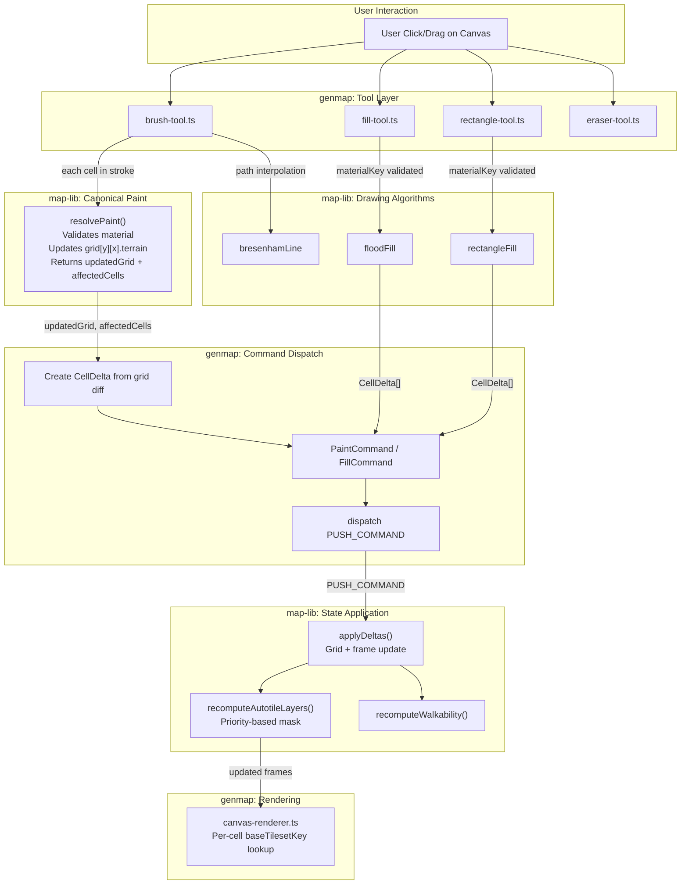

# Single-Layer Material Painting Pipeline Design Document

## Overview

This design document specifies the complete single-layer material painting pipeline for the map editor. The current codebase has a disconnected pipeline: `resolvePaint()` is dead code (no tool calls it), tools bypass it to create `CellDelta` arrays directly, `buildMapEditorData` has a flawed `baseTilesetKey` selection algorithm, dead functions are still exported, and the `TerrainCellType` union mixes material keys with tileset names. This document defines the target architecture where `resolvePaint()` is the canonical per-cell paint function (used by the brush tool) and fill/rectangle tools validate `materialKey` before invoking their drawing algorithms, and specifies all required cleanups to complete the single-layer material model.

## Design Summary (Meta)

```yaml
design_type: "refactoring"
risk_level: "medium"
complexity_level: "medium"
complexity_rationale: >
  (1) Rewiring all three paint tools (brush, fill, rectangle) to call
  resolvePaint requires changing tool architecture from "create deltas
  directly" to "call resolvePaint then derive deltas". AC-1 through AC-4
  touch 14+ files across map-lib and genmap (7 modified, 8 verified-unchanged). (2) The baseTilesetKey fix
  and dead code removal affect buildMapEditorData, index.ts exports, and
  autotile-utils.ts re-exports. Risk of breaking undo/redo if applyDeltas
  interaction changes. Constraint: existing undo/redo behavior must be
  preserved exactly.
main_constraints:
  - "Zero-build pattern: map-lib exports TypeScript source directly (no dist/)"
  - "No database dependency in map-lib: material/tileset data passed as parameters"
  - "Immutability contract for all state updates"
  - "resolvePaint must remain a pure function (no side effects)"
  - "Undo/redo correctness preserved: applyDeltas and recomputeAutotileLayers unchanged"
  - "SOLID block rule: painting always sets target cell to solid material, never complex transitions"
biggest_risks:
  - "Tool rewiring breaks paint behavior (brush stroke accumulation, flood fill boundaries)"
  - "baseTilesetKey fix changes rendered tiles if standalone tileset ordering differs"
  - "Removing computeNeighborMask export breaks transition-test-canvas.spec.ts (mitigated by Phase 2e import update)"
unknowns:
  - "Whether TerrainCellType regeneration can be scoped to materials-only without breaking shared package consumers"
  - "Whether any saved maps contain tileset names in Cell.terrain that would break with materials-only type"
```

## Background and Context

### Prerequisite ADRs

- **ADR-0006 (adr-006-map-editor-architecture.md)**: Established three-package architecture (map-lib, map-renderer, db) and zero-build pattern.
- **ADR-0009 (ADR-0009-tileset-management-architecture.md)**: Database-driven tilesets and materials with `fromMaterialId`/`toMaterialId` foreign keys.
- **ADR-0010 (ADR-0010-map-lib-algorithm-extraction.md)**: Companion ADR documenting the extraction of algorithms and the material pipeline. This design doc supersedes the multi-layer `resolvePaint` design from design-013 with a single-layer approach.

No common ADRs (`ADR-COMMON-*`) exist in this project.

### Agreement Checklist

#### Scope

- [x] Make `resolvePaint` the canonical per-cell paint function (brush tool); validate `materialKey` in fill and rectangle tools before invoking drawing algorithms
- [x] Fix `buildMapEditorData` baseTilesetKey selection to prefer standalone tilesets
- [x] Remove dead exports: `checkTerrainPresence`, `computeNeighborMask` from `index.ts`
- [x] Remove dead re-exports from `autotile-utils.ts`
- [x] Document `TerrainCellType` mixed union issue and define migration path
- [x] Define complete data flow: user click to rendered frame

#### Non-Scope (Explicitly not changing)

- [x] `applyDeltas` function in `commands.ts` -- already correct, processes all layers
- [x] `recomputeAutotileLayers` in `autotile-layers.ts` -- must continue to process ALL layers for undo/redo correctness
- [x] `computeNeighborMaskByMaterial` and `computeNeighborMaskByPriority` in `neighbor-mask.ts` -- these are the active mask functions
- [x] Drawing algorithms (`bresenhamLine`, `floodFill`, `rectangleFill`) -- pure geometry, accept generic string terrain parameter
- [x] Eraser tool -- uses hardcoded `DEFAULT_TERRAIN`, does not call `resolvePaint`
- [x] Layer management actions (`ADD_LAYER`, `REMOVE_LAYER`, `TOGGLE_LAYER_VISIBILITY`, etc.)
- [x] Zone tools and zone overlay system
- [x] Object layer system
- [x] Database schema (no DB changes)
- [x] `buildTransitionMap` function -- retained for future transition warnings
- [x] The terrain-to-material rename (already completed in previous iteration)

#### Constraints

- [x] Parallel operation: No (single developer refactoring)
- [x] Backward compatibility: Existing saved maps must continue to load and render correctly
- [x] Performance measurement: Not required (pipeline rewiring, not adding computation)
- [x] Undo/redo: Must work identically before and after changes

### Problem to Solve

The map editor's painting pipeline is architecturally disconnected. Five specific issues prevent the system from working as a coherent single-layer material painting system:

1. **`resolvePaint` is dead code**: All three paint tools (brush, fill, rectangle) bypass `resolvePaint()` and directly create `CellDelta` arrays. The function exists, is tested, but is never called in production. It should be the canonical paint function that enforces the SOLID block rule and provides affected cells for autotile recomputation.

2. **`baseTilesetKey` selection is flawed**: `buildMapEditorData()` assigns `baseTilesetKey` by taking the first tileset with a matching `fromMaterialKey`, regardless of whether it is a standalone tileset (e.g., `terrain-01` for grass) or a transition tileset (e.g., `grass_water` for grass-to-water). The palette swatch must use the standalone tileset's SOLID_FRAME, not a transition tileset's frame.

3. **Dead function exports**: `checkTerrainPresence` and `computeNeighborMask` (the old tileset-based mask functions) are still exported from `index.ts` and re-exported from `autotile-utils.ts`. They are unused in the active pipeline, which uses `computeNeighborMaskByMaterial` and `computeNeighborMaskByPriority` instead.

4. **`TerrainCellType` mixed union**: The auto-generated type (`terrain-cell-type.generated.ts`) includes both material keys (`'deep_water'`, `'water'`, `'grass'`) and tileset names (`'water_grass'`, `'grass_water'`). Since `Cell.terrain` is typed as `TerrainCellType`, assigning a material key requires `as` casts. This is a type-safety issue that needs a documented migration path.

5. **Design doc was incomplete**: The previous version of this document only covered the rename refactoring (`activeTerrainKey` to `activeMaterialKey`) but did not specify the full pipeline from user click to rendered frame.

### Current Challenges

The current tool implementations create `CellDelta` objects inline:

```typescript
// Current brush-tool.ts (PROBLEM: bypasses resolvePaint)
paintedCells.set(key, {
  layerIndex,
  x, y,
  oldTerrain,
  newTerrain: state.activeMaterialKey,
  oldFrame,
  newFrame: 0,  // placeholder, overridden by recomputeAutotileLayers
});
```

This means:
- No validation of `materialKey` against the materials map before painting
- No canonical "affected cells" computation -- tools don't compute 8-neighbor sets
- The SOLID block rule is implicitly enforced (tools set terrain to `activeMaterialKey`) but not explicitly through a shared function
- If painting logic needs to change (e.g., add validation, add warnings), every tool must be updated independently

### Requirements

#### Functional Requirements

- FR-1: `resolvePaint` must be the canonical paint function for per-cell painting (brush tool). Fill and rectangle tools must validate `materialKey` against the materials map before invoking drawing algorithms.
- FR-2: `resolvePaint` must update `grid[y][x].terrain` to `materialKey` (SOLID block) and return `{ updatedGrid, affectedCells }`
- FR-3: Tools must derive `CellDelta` arrays from the difference between old and new grid states returned by `resolvePaint`
- FR-4: `buildMapEditorData` must prefer standalone tilesets (fromMaterialKey set, toMaterialKey null) for `baseTilesetKey`
- FR-5: Dead exports (`checkTerrainPresence`, `computeNeighborMask`) must be removed from `index.ts` and `autotile-utils.ts`
- FR-6: Undo/redo must continue to work correctly (all layers recomputed via `applyDeltas` -> `recomputeAutotileLayers`)
- FR-7: The renderer must use per-cell `baseTilesetKey` lookup (already implemented, documented here for completeness)

#### Non-Functional Requirements

- **Performance**: Pipeline rewiring does not add computational steps; `resolvePaint` replaces inline logic
- **Maintainability**: Single canonical paint path reduces duplication across tools
- **Reliability**: Material validation in `resolvePaint` catches invalid paint operations before they reach the grid
- **Type safety**: Document path toward materials-only `TerrainCellType`

## Applicable Standards

### Classification Table

| Standard | Type | Source | Impact on Design |
|----------|------|--------|-----------------|
| Prettier: single quotes | Explicit | `.prettierrc` | All new/modified code uses single quotes |
| EditorConfig: 2-space indent | Explicit | `.editorconfig` | All indentation is 2 spaces |
| TypeScript strict mode | Explicit | `tsconfig.base.json` (`strict: true`) | No implicit any, strict null checks |
| ESLint flat config with Nx module boundaries | Explicit | `eslint.config.mjs` | Imports must respect package boundaries |
| Zero-build pattern (TS source exports) | Explicit | ADR-0006 / `package.json` exports with `@nookstead/source` condition | No `dist/` directory, direct `.ts` imports |
| Immutable state updates | Implicit | `commands.ts`, `use-map-editor.ts` reducer | All state changes create new objects; never mutate |
| JSDoc on all exported functions | Implicit | `autotile-layers.ts`, `material-resolver.ts`, `commands.ts` | All public functions must have JSDoc with `@param`/`@returns` |
| Pure function pattern for map algorithms | Implicit | All `core/*.ts` files | Map-lib functions are pure -- no side effects, DI for external data |
| `ReadonlyArray` for input arrays | Implicit | `recomputeAutotileLayers`, `buildTransitionMap` signatures | Use `ReadonlyArray<T>` or `readonly T[]` for function parameters |

## Acceptance Criteria (AC) - EARS Format

### AC-1: resolvePaint as Canonical Paint Function

- [ ] **When** `resolvePaint` is called with valid coordinates and materialKey, the system shall update `grid[y][x].terrain` to `materialKey` (SOLID block) and return `{ updatedGrid, affectedCells }` where affectedCells contains the painted cell plus in-bounds 8 neighbors
- [ ] **When** `resolvePaint` is called, the system shall NOT create, modify, or return any layer data (no `updatedLayers` field in `PaintResult`)
- [ ] **If** coordinates are out of bounds, **then** the system shall return the original grid unchanged with empty `affectedCells`
- [ ] **If** `materialKey` is not found in the materials map, **then** the system shall return a warning and empty `affectedCells`

### AC-2: Tools Call resolvePaint

- [ ] **When** the brush tool paints a cell, the system shall call `resolvePaint()` to validate and update the grid, then derive `CellDelta` entries from the grid difference
- [ ] **When** the fill tool floods a region, the system shall call `resolvePaint()` for each cell in the flood set (or an equivalent batch version), then derive `CellDelta` entries from the grid differences
- [ ] **When** the rectangle tool fills a rectangle, the system shall call `resolvePaint()` for each cell in the rectangle (or an equivalent batch version), then derive `CellDelta` entries from the grid differences
- [ ] The eraser tool shall NOT call `resolvePaint` (it uses hardcoded `DEFAULT_TERRAIN` and does not need material validation)

### AC-3: buildMapEditorData baseTilesetKey Fix

- [ ] **When** `buildMapEditorData` assigns `baseTilesetKey` to a material, the system shall prefer standalone tilesets (where `fromMaterialKey` is set AND `toMaterialKey` is null/undefined) over transition tilesets (where both `fromMaterialKey` and `toMaterialKey` are set)
- [ ] **If** no standalone tileset exists for a material, **then** the system shall fall back to the first transition tileset with matching `fromMaterialKey`
- [ ] **If** no tileset references the material at all, **then** `baseTilesetKey` shall be undefined

### AC-4: Dead Export Removal

- [ ] `checkTerrainPresence` shall be removed from `packages/map-lib/src/index.ts` exports
- [ ] `computeNeighborMask` shall be removed from `packages/map-lib/src/index.ts` exports
- [ ] `checkTerrainPresence` and `computeNeighborMask` re-exports shall be removed from `apps/genmap/src/hooks/autotile-utils.ts`
- [ ] The functions themselves shall remain in `neighbor-mask.ts` (not deleted) to avoid breaking tests that import them directly, but they shall not be part of the public API
- [ ] `apps/genmap/specs/transition-test-canvas.spec.ts` imports `computeNeighborMask` from `@nookstead/map-lib`. This import must be updated to a direct module import (`../../../packages/map-lib/src/core/neighbor-mask`) or the export must be retained. See Phase 2e.

### AC-5: Undo/Redo Preservation

- [ ] **While** the user performs undo/redo operations, the system shall recompute autotile frames for ALL layers (existing `applyDeltas` -> `recomputeAutotileLayers` pipeline unchanged)
- [ ] `applyDeltas` and `recomputeAutotileLayers` shall NOT be modified
- [ ] Paint operations dispatched via the new `resolvePaint`-based tools shall produce identical undo/redo behavior to the current implementation

### AC-6: TerrainCellType Documentation

- [ ] The design document shall include a documented migration path for resolving the `TerrainCellType` mixed union
- [ ] No runtime changes to `TerrainCellType` are required in this refactoring phase (deferred to future work)

## Existing Codebase Analysis

### Implementation Path Mapping

| Type | Path | Description |
|------|------|-------------|
| Existing (modify) | `packages/map-lib/src/core/material-resolver.ts` | Already simplified; remains canonical paint function |
| Existing (modify) | `packages/map-lib/src/core/map-editor-data.ts` | Fix baseTilesetKey selection algorithm |
| Existing (modify) | `packages/map-lib/src/index.ts` | Remove dead exports |
| Existing (modify) | `apps/genmap/src/components/map-editor/tools/brush-tool.ts` | Rewire to call resolvePaint |
| Existing (modify) | `apps/genmap/src/components/map-editor/tools/fill-tool.ts` | Rewire to call resolvePaint |
| Existing (modify) | `apps/genmap/src/components/map-editor/tools/rectangle-tool.ts` | Rewire to call resolvePaint |
| Existing (modify) | `apps/genmap/src/hooks/autotile-utils.ts` | Remove dead re-exports |
| Existing (no change) | `packages/map-lib/src/core/commands.ts` | Already correct |
| Existing (no change) | `packages/map-lib/src/core/autotile-layers.ts` | Already correct |
| Existing (no change) | `packages/map-lib/src/core/neighbor-mask.ts` | Functions remain; only exports change |
| Existing (no change) | `packages/map-lib/src/types/editor-types.ts` | Already renamed to activeMaterialKey |
| Existing (no change) | `packages/map-lib/src/types/material-types.ts` | Already has baseTilesetKey |
| Existing (no change) | `apps/genmap/src/hooks/use-map-editor.ts` | Already uses SET_MATERIAL |
| Existing (no change) | `apps/genmap/src/components/map-editor/terrain-palette.tsx` | Already material-oriented |
| Existing (no change) | `apps/genmap/src/components/map-editor/canvas-renderer.ts` | Already does per-cell baseTilesetKey lookup |
| Existing (no change) | `apps/genmap/src/components/map-editor/map-editor-canvas.tsx` | Already references activeMaterialKey |

### Integration Points (Include even for new implementations)

- **Integration Target**: `resolvePaint` called by all three paint tools
- **Invocation Method**: Direct function call, tool passes current grid and materialKey
- **Integration Target**: `buildMapEditorData` produces MaterialInfo with correct baseTilesetKey
- **Invocation Method**: Called in API route handler, result dispatched to editor state

### Code Inspection Evidence

#### What Was Examined

| File Inspected | Key Finding | Design Impact |
|---------------|-------------|---------------|
| `packages/map-lib/src/core/material-resolver.ts` (149 lines) | `resolvePaint` is fully implemented, pure, validated, and tested. Returns `{ updatedGrid, affectedCells, warnings }`. No layer manipulation. | Confirmed as canonical paint function -- no changes to its implementation needed |
| `apps/genmap/src/components/map-editor/tools/brush-tool.ts` (lines 19-43) | `tryPaint` creates `CellDelta` directly: reads `state.grid[y][x].terrain`, compares to `state.activeMaterialKey`, writes delta with `newFrame: 0`. Does NOT call `resolvePaint`. | MUST rewire to call `resolvePaint` for validation and grid update, then derive CellDelta from result |
| `apps/genmap/src/components/map-editor/tools/fill-tool.ts` (lines 16-25) | Calls `floodFill()` which returns `CellDelta[]` directly. Does NOT call `resolvePaint`. | MUST rewire: either modify `floodFill` to use `resolvePaint` internally, or call `resolvePaint` in a post-processing step |
| `apps/genmap/src/components/map-editor/tools/rectangle-tool.ts` (lines 55-66) | Calls `rectangleFill()` which returns `CellDelta[]` directly. Does NOT call `resolvePaint`. | Same approach as fill tool |
| `packages/map-lib/src/core/map-editor-data.ts` (lines 59-65) | `baseTilesetMap.set(fromKey, ts.key)` takes first tileset with matching fromKey, no preference for standalone vs transition | MUST add preference: standalone tilesets (toMaterialKey null/undefined) first |
| `packages/map-lib/src/index.ts` (line 54) | Exports `computeNeighborMask`, `checkTerrainPresence` alongside active functions | REMOVE these dead exports |
| `apps/genmap/src/hooks/autotile-utils.ts` (lines 4-5) | Re-exports `checkTerrainPresence`, `computeNeighborMask` from map-lib | REMOVE these dead re-exports |
| `packages/map-lib/src/core/neighbor-mask.ts` (lines 46-106) | `checkTerrainPresence` and `computeNeighborMask` exist as complete functions with tests | KEEP functions in file (tests import directly), REMOVE from public exports |
| `packages/shared/src/types/terrain-cell-type.generated.ts` | Union type includes both material keys and tileset names | Document migration path; no runtime change in this phase |
| `apps/genmap/src/components/map-editor/canvas-renderer.ts` (lines 104-108) | Per-cell baseTilesetKey lookup: `const matInfo = cellTerrain ? state.materials.get(cellTerrain)` -> `matInfo?.baseTilesetKey ?? layer.terrainKey` | CONFIRMED: already correct, no change needed |
| `packages/map-lib/src/core/autotile-layers.ts` (lines 83-93) | Uses `computeNeighborMaskByPriority` when materials available, falls back to `computeNeighborMaskByMaterial` | CONFIRMED: already correct, no change needed |
| `packages/map-lib/src/core/commands.ts` (lines 23-80) | `applyDeltas` calls `recomputeAutotileLayers(newGrid, newLayers, affectedCells, state.materials)` | CONFIRMED: already correct, no change needed |

#### Key Findings

1. **`resolvePaint` is complete and correct** -- it validates material, updates grid immutably, returns affected cells. No implementation changes needed. The work is in making tools CALL it.

2. **Tools bypass the canonical function** -- All three paint tools (brush, fill, rectangle) create `CellDelta` arrays directly without calling `resolvePaint`. This means material validation is skipped and the SOLID block rule is only implicitly enforced.

3. **Drawing algorithms return CellDelta directly** -- `floodFill()` and `rectangleFill()` in `drawing-algorithms.ts` return `CellDelta[]`, not grid updates. This means they cannot easily be composed with `resolvePaint` which operates on grids. Two approaches are possible: (a) modify drawing algorithms to return coordinate lists, then call `resolvePaint` for each, or (b) keep drawing algorithms as-is and validate materialKey before calling them.

4. **baseTilesetKey selection is order-dependent** -- `buildMapEditorData` iterates tilesets in DB order and takes the first `fromMaterialKey` match. If a transition tileset appears before a standalone tileset in the DB results, the wrong tileset is selected.

5. **`applyDeltas` is the critical undo/redo path** -- It processes ALL layers via `recomputeAutotileLayers`. This must NOT change. Since tools dispatch `PaintCommand`/`FillCommand` which call `applyDeltas`, the undo/redo path is preserved regardless of how tools create their `CellDelta` arrays.

#### How Findings Influence Design

- Finding 1 means `resolvePaint` implementation is stable -- only tool integration changes
- Finding 2 defines the core refactoring work: rewiring tools
- Finding 3 constrains the approach: since `floodFill`/`rectangleFill` return `CellDelta[]`, the simplest approach is to validate `materialKey` before calling these functions (approach B), rather than restructuring the drawing algorithms
- Finding 4 is a targeted fix in `buildMapEditorData`
- Finding 5 confirms undo/redo safety

### Similar Functionality Search

- **`resolvePaint` in `material-resolver.ts`**: The canonical paint function. Currently dead code. Must become active.
- **Inline paint logic in `brush-tool.ts` `tryPaint()`**: Duplicates what `resolvePaint` does (validate bounds, check same-terrain skip, update terrain). Must be replaced with `resolvePaint` call.
- **`floodFill` in `drawing-algorithms.ts`**: Returns `CellDelta[]`. Not a duplicate of `resolvePaint` (different scope -- multi-cell flood vs single-cell paint). Complementary.
- **`rectangleFill` in `drawing-algorithms.ts`**: Same as `floodFill` -- complementary, not duplicate.

**Decision**: The brush tool's `tryPaint` duplicates `resolvePaint`'s validation. Replace inline logic with `resolvePaint` call. For fill/rectangle tools, validate materialKey upfront, then use existing drawing algorithms.

## Design

### Change Impact Map

```yaml
Change Target: Tool Pipeline (brush-tool.ts, fill-tool.ts, rectangle-tool.ts)
Direct Impact:
  - apps/genmap/src/components/map-editor/tools/brush-tool.ts (rewire to use resolvePaint)
  - apps/genmap/src/components/map-editor/tools/fill-tool.ts (add materialKey validation)
  - apps/genmap/src/components/map-editor/tools/rectangle-tool.ts (add materialKey validation)
Indirect Impact:
  - CellDelta creation path changes (derived from resolvePaint grid diff for brush)
  - No impact on fill/rectangle CellDelta creation (drawing algorithms unchanged)
No Ripple Effect:
  - commands.ts (unchanged -- receives CellDelta[] regardless of how they were created)
  - autotile-layers.ts (unchanged)
  - use-map-editor.ts (unchanged -- receives PUSH_COMMAND actions as before)
  - canvas-renderer.ts (unchanged)

Change Target: buildMapEditorData (map-editor-data.ts)
Direct Impact:
  - packages/map-lib/src/core/map-editor-data.ts (baseTilesetKey selection algorithm)
Indirect Impact:
  - Palette swatch may change if standalone tileset differs from previously selected transition tileset
No Ripple Effect:
  - Material data structure unchanged
  - API route handler unchanged (calls buildMapEditorData, returns result)

Change Target: Public Exports (index.ts, autotile-utils.ts)
Direct Impact:
  - packages/map-lib/src/index.ts (remove checkTerrainPresence, computeNeighborMask)
  - apps/genmap/src/hooks/autotile-utils.ts (remove checkTerrainPresence, computeNeighborMask re-exports)
Indirect Impact:
  - apps/genmap/specs/transition-test-canvas.spec.ts imports `computeNeighborMask` from `@nookstead/map-lib` (must update import or retain export)
No Ripple Effect:
  - neighbor-mask.ts functions themselves remain (tests import directly)
  - neighbor-mask.spec.ts tests remain unchanged
```

### Architecture Overview



**Tool-level asymmetry (by design)**: The brush tool calls `resolvePaint()` per cell because it needs per-cell grid tracking (accumulated grid state across a stroke), material validation, and affected-cell computation. The fill and rectangle tools do NOT call `resolvePaint()`; instead they validate `materialKey` via a `state.materials.has()` guard clause and then delegate to their respective drawing algorithms (`floodFill`, `rectangleFill`), which already produce `CellDelta[]` arrays directly. This asymmetry is justified because:
1. The drawing algorithms are pure geometry functions that should not depend on `MaterialInfo` or the materials map.
2. Restructuring `floodFill`/`rectangleFill` to call `resolvePaint` internally would couple geometry to material concepts (see Alternative 1 in Alternative Solutions).
3. The guard clause achieves the same material validation goal without changing drawing algorithm signatures.

### Data Flow

**Complete Pipeline (target state)**:

```
1. User clicks/drags on canvas
   ↓
2. Tool receives tile coordinate (x, y)
   ↓
3a. [Brush] For each cell in stroke path:
    → Call resolvePaint(grid, materialKey, x, y, materials)
    → Receive { updatedGrid, affectedCells }
    → Accumulate grid changes, compute CellDelta per changed cell
    → On mouseUp: dispatch PaintCommand(deltas)

3b. [Fill] Validate materialKey exists in state.materials
    → Call floodFill(grid, x, y, materialKey, width, height, layerIndex, layers)
    → Receive CellDelta[]
    → dispatch FillCommand(deltas)

3c. [Rectangle] Validate materialKey exists in state.materials
    → Call rectangleFill({grid, minX, minY, maxX, maxY, newTerrain, ...})
    → Receive CellDelta[]
    → dispatch PaintCommand(deltas, 'Rectangle fill')
   ↓
4. PUSH_COMMAND action → reducer calls command.execute(state)
   → PaintCommand/FillCommand.execute calls applyDeltas(state, deltas, 'forward')
   ↓
5. applyDeltas:
   → Updates grid[y][x].terrain for each delta
   → Updates layer[layerIndex].frames[y][x] for each delta
   → Calls recomputeAutotileLayers(newGrid, newLayers, affectedCells, state.materials)
   → Calls recomputeWalkability(newGrid, width, height, state.materials)
   → Returns new MapEditorState
   ↓
6. Renderer (canvas-renderer.ts):
   → For each visible cell: reads grid[y][x].terrain
   → Looks up MaterialInfo from state.materials
   → Gets baseTilesetKey from MaterialInfo (falls back to layer.terrainKey)
   → Gets tileset image from tilesetImages map
   → Draws frame at layer.frames[y][x] from the tileset sprite sheet
```

### Integration Points List

| Integration Point | Location | Old Implementation | New Implementation | Switching Method |
|-------------------|----------|-------------------|-------------------|------------------|
| Brush paint validation | `brush-tool.ts:tryPaint()` | Inline bounds check, same-terrain skip, direct CellDelta creation | Call `resolvePaint()`, derive CellDelta from grid diff | Replace function body |
| Fill materialKey validation | `fill-tool.ts:onMouseDown()` | None (passes raw materialKey to floodFill) | Validate materialKey exists in materials before calling floodFill | Add guard clause |
| Rectangle materialKey validation | `rectangle-tool.ts:onMouseUp()` | None (passes raw materialKey to rectangleFill) | Validate materialKey exists in materials before calling rectangleFill | Add guard clause |
| baseTilesetKey assignment | `map-editor-data.ts:buildMapEditorData()` | First tileset with matching fromMaterialKey | Prefer standalone tileset (toMaterialKey null) | Algorithm change |
| Public API exports | `index.ts` | Exports checkTerrainPresence, computeNeighborMask | Remove these exports | Delete export lines |
| Compatibility re-exports | `autotile-utils.ts` | Re-exports checkTerrainPresence, computeNeighborMask | Remove these re-exports | Delete re-export lines |

### Main Components

#### Component 1: `resolvePaint` (Canonical Paint Function)

- **Responsibility**: Pure function that validates a material paint operation, updates the grid cell with a SOLID block of the material, and returns affected cells for autotile recomputation.
- **Current State**: Fully implemented, tested, but UNUSED by tools.
- **Target State**: Called by brush tool for every painted cell. Fill and rectangle tools validate materialKey using `state.materials.has()` before calling their respective drawing algorithms.
- **Interface**:
  ```typescript
  interface ResolvePaintOptions {
    grid: Cell[][];
    x: number;
    y: number;
    materialKey: string;
    width: number;
    height: number;
    materials: ReadonlyMap<string, MaterialInfo>;
  }

  interface PaintResult {
    updatedGrid: Cell[][];
    affectedCells: ReadonlyArray<{ x: number; y: number }>;
    warnings: TransitionWarning[];
  }
  ```
- **Dependencies**: `Cell` from `@nookstead/shared`, `MaterialInfo` from `material-types.ts`
- **Changes Needed**: None to the function itself. The change is in callers.

#### Component 2: Brush Tool (Rewired)

- **Responsibility**: Paint cells along the user's mouse stroke, using `resolvePaint` for each cell.
- **Current State**: Directly creates `CellDelta` objects in `tryPaint()`.
- **Target State**: Calls `resolvePaint()` per cell, accumulates `CellDelta` entries from grid differences.
- **Interface**: No public API change (same `ToolHandlers` interface).
- **Dependencies**: `resolvePaint` from `@nookstead/map-lib`
- **Changes Needed**: Rewrite `tryPaint()` to call `resolvePaint`, track accumulated grid, derive deltas.

#### Component 3: Fill Tool (Validated)

- **Responsibility**: Flood-fill a connected region with the active material.
- **Current State**: Calls `floodFill()` directly, which returns `CellDelta[]`. No material validation.
- **Target State**: Validates `materialKey` exists in `state.materials` before calling `floodFill()`. Early-return if invalid.
- **Interface**: No public API change.
- **Dependencies**: `floodFill` from `@nookstead/map-lib`
- **Changes Needed**: Add `if (!state.materials.has(state.activeMaterialKey)) return;` guard.

#### Component 4: Rectangle Tool (Validated)

- **Responsibility**: Fill a rectangle region with the active material.
- **Current State**: Calls `rectangleFill()` directly. No material validation.
- **Target State**: Validates `materialKey` before calling `rectangleFill()`. Early-return if invalid.
- **Interface**: No public API change.
- **Dependencies**: `rectangleFill` from `@nookstead/map-lib`
- **Changes Needed**: Add `if (!state.materials.has(state.activeMaterialKey)) return;` guard.

#### Component 5: `buildMapEditorData` (baseTilesetKey Fix)

- **Responsibility**: Transform raw DB records into editor-ready MaterialInfo and TilesetInfo arrays.
- **Current State**: Assigns `baseTilesetKey` using first tileset with matching `fromMaterialKey`.
- **Target State**: Prefers standalone tilesets (fromMaterialKey set, toMaterialKey null/undefined) over transition tilesets.
- **Interface**: No signature change.
- **Dependencies**: None (pure function)
- **Changes Needed**: Two-pass algorithm: first pass collects standalone tilesets, second pass fills gaps with transition tilesets.

### Contract Definitions

```typescript
// === material-resolver.ts (UNCHANGED) ===

export interface PaintResult {
  updatedGrid: Cell[][];
  affectedCells: ReadonlyArray<{ x: number; y: number }>;
  warnings: TransitionWarning[];
}

export interface ResolvePaintOptions {
  grid: Cell[][];
  x: number;
  y: number;
  materialKey: string;
  width: number;
  height: number;
  materials: ReadonlyMap<string, MaterialInfo>;
}

// === editor-types.ts (UNCHANGED from previous iteration) ===

export interface CellDelta {
  layerIndex: number;
  x: number;
  y: number;
  oldTerrain: string;
  newTerrain: string;
  oldFrame: number;
  newFrame: number;
}

// === material-types.ts (UNCHANGED from previous iteration) ===

export interface MaterialInfo {
  key: string;
  color: string;
  walkable: boolean;
  renderPriority: number;
  baseTilesetKey?: string;
}
```

### Data Contract

#### resolvePaint

```yaml
Input:
  Type: ResolvePaintOptions
  Preconditions:
    - grid dimensions match width x height
    - materialKey is a non-empty string
  Validation:
    - Coordinates (x, y) within bounds
    - materialKey exists in materials map

Output:
  Type: PaintResult
  Guarantees:
    - updatedGrid is a new array (immutable update)
    - updatedGrid[y][x].terrain === materialKey (SOLID block)
    - affectedCells contains painted cell + in-bounds 8-neighbors
    - Original grid is never mutated
  On Error:
    - Out of bounds: returns original grid reference, empty affectedCells
    - Unknown material: returns original grid reference, empty affectedCells, warning

Invariants:
  - Grid dimensions never change
  - No layer data is created, modified, or referenced
  - Pure function: no side effects
```

#### brush-tool tryPaint (after rewiring)

```yaml
Input:
  Type: (x: number, y: number) -- tile coordinates
  State Dependencies: state.grid, state.activeMaterialKey, state.materials, state.activeLayerIndex, state.layers
  Preconditions: isDrawing === true (called during mouse down/move)

Output:
  Type: void (accumulates CellDelta into paintedCells Map)
  Guarantees:
    - Only paints if resolvePaint returns non-empty affectedCells
    - CellDelta.oldTerrain is from original grid (before any brush stroke changes)
    - CellDelta.newTerrain === state.activeMaterialKey
    - CellDelta.newFrame is 0 (placeholder, overridden by recomputeAutotileLayers)
  On Error:
    - resolvePaint returns empty affectedCells → no delta accumulated (no-op)

Invariants:
  - Each cell painted at most once per stroke (Map key deduplication)
  - state is not mutated
```

#### buildMapEditorData baseTilesetKey

```yaml
Input:
  Type: rawMaterials: RawMaterial[], rawTilesets: RawTileset[]
  Preconditions: Arrays may be empty

Output:
  Type: MapEditorData { materials: MaterialInfo[], tilesets: TilesetInfo[] }
  Guarantees:
    - baseTilesetKey prefers standalone tilesets (toMaterialId === null)
    - Falls back to any tileset with matching fromMaterialKey if no standalone exists
    - baseTilesetKey is undefined if no tileset references the material

Invariants:
  - All materials from input are present in output
  - All tilesets from input are present in output
```

### Data Representation Decisions

| Data Structure | Decision | Rationale |
|---|---|---|
| `PaintResult` | **Reuse** existing type unchanged | Already simplified in previous iteration. Covers all needs. |
| `ResolvePaintOptions` | **Reuse** existing type unchanged | Already simplified. No new fields needed. |
| `CellDelta` | **Reuse** existing type unchanged | Tools still produce CellDelta arrays; only the creation path changes (via resolvePaint vs inline). |
| `MaterialInfo` | **Reuse** existing type unchanged | Already has baseTilesetKey from previous iteration. |

### Field Propagation Map

```yaml
fields:
  - name: "activeMaterialKey"
    origin: "User palette click (SET_MATERIAL action)"
    transformations:
      - layer: "UI Layer (terrain-palette.tsx)"
        type: "MapEditorAction"
        validation: "materialKey from MaterialInfo.key (guaranteed valid)"
      - layer: "State Layer (use-map-editor.ts reducer)"
        type: "MapEditorState.activeMaterialKey"
        transformation: "direct assignment"
      - layer: "Tool Layer (brush-tool.ts)"
        type: "string (passed to resolvePaint)"
        transformation: "resolvePaint validates against materials map"
      - layer: "Tool Layer (fill-tool.ts, rectangle-tool.ts)"
        type: "string (validated, then passed to drawing algorithm)"
        transformation: "guard clause: state.materials.has(key)"
      - layer: "resolvePaint result"
        type: "PaintResult.updatedGrid[y][x].terrain"
        transformation: "set to materialKey (SOLID block)"
      - layer: "CellDelta (derived from grid diff)"
        type: "CellDelta.newTerrain"
        transformation: "= materialKey"
      - layer: "Command Layer (PaintCommand -> applyDeltas)"
        type: "CellDelta.newTerrain"
        transformation: "written to grid[y][x].terrain"
    destination: "Cell.terrain in grid (MapEditorState.grid)"
    loss_risk: "none"

  - name: "baseTilesetKey"
    origin: "Database seed / buildMapEditorData computation"
    transformations:
      - layer: "API Layer (editor-data route)"
        type: "buildMapEditorData output"
        validation: "standalone tileset preferred over transition tileset"
      - layer: "State Layer (MapEditorState.materials)"
        type: "MaterialInfo.baseTilesetKey"
        validation: "optional string, must match a loaded tileset key"
      - layer: "Renderer Layer (canvas-renderer.ts)"
        type: "string (lookup key)"
        transformation: "state.materials.get(cellTerrain)?.baseTilesetKey ?? layer.terrainKey"
      - layer: "UI Layer (terrain-palette.tsx)"
        type: "string (swatch lookup)"
        transformation: "tilesetImages.get(material.baseTilesetKey)"
    destination: "Canvas tile rendering + palette swatch rendering"
    loss_risk: "low"
    loss_risk_reason: "If baseTilesetKey is undefined or not found in tilesetImages, renderer falls back to layer.terrainKey; palette shows color swatch fallback"
```

### Interface Change Impact Analysis

| Existing Operation | New Operation | Conversion Required | Adapter Required | Compatibility Method |
|-------------------|---------------|-------------------|------------------|---------------------|
| `brush-tool tryPaint()` inline delta creation | `tryPaint()` calls `resolvePaint()` | Yes (logic rewrite) | Not Required | Replace function body |
| `fill-tool onMouseDown()` no validation | `onMouseDown()` with materialKey guard | Yes (add guard) | Not Required | Add if-guard before floodFill call |
| `rectangle-tool onMouseUp()` no validation | `onMouseUp()` with materialKey guard | Yes (add guard) | Not Required | Add if-guard before rectangleFill call |
| `buildMapEditorData` first-match baseTilesetKey | Two-pass: standalone first, then fallback | Yes (algorithm change) | Not Required | Replace loop logic |
| `index.ts` exports checkTerrainPresence | Removed | N/A | Not Required | Delete export line |
| `index.ts` exports computeNeighborMask | Removed | N/A | Not Required | Delete export line |
| `autotile-utils.ts` re-exports dead functions | Removed | N/A | Not Required | Delete re-export lines |

### Integration Boundary Contracts

```yaml
Boundary Name: Tool -> resolvePaint (paint validation)
  Input: ResolvePaintOptions { grid, x, y, materialKey, width, height, materials }
  Output: PaintResult { updatedGrid, affectedCells, warnings } (sync)
  On Error: Invalid materialKey -> warning returned, empty affectedCells, original grid returned

Boundary Name: Tool -> Drawing Algorithm (fill/rectangle)
  Input: grid, coordinates, materialKey, dimensions, layerIndex, layers
  Output: CellDelta[] (sync)
  On Error: Same-terrain fill -> empty array (no-op)

Boundary Name: Tool -> Command Dispatch (PUSH_COMMAND)
  Input: PaintCommand or FillCommand wrapping CellDelta[]
  Output: New MapEditorState via reducer (sync)
  On Error: Empty deltas -> early return (no command dispatched)

Boundary Name: applyDeltas -> recomputeAutotileLayers (autotile refresh)
  Input: newGrid, newLayers, affectedCells, state.materials
  Output: Updated EditorLayer[] with recomputed frames (sync)
  On Error: Empty affectedCells -> returns input layers unchanged

Boundary Name: Renderer -> materials (tileset lookup)
  Input: grid[y][x].terrain -> state.materials.get(terrain)
  Output: MaterialInfo.baseTilesetKey -> tilesetImages.get(key) -> HTMLImageElement
  On Error: Missing material or baseTilesetKey -> falls back to layer.terrainKey
```

### Error Handling

- **Unknown materialKey in `resolvePaint`**: Returns warning with `message: "Unknown material key: ${materialKey}"`, empty `affectedCells`, original grid unchanged.
- **Unknown materialKey in fill/rectangle tools**: Guard clause returns early before calling drawing algorithm. No error displayed (silent no-op, same as current behavior when materials are not loaded).
- **Out of bounds coordinates in `resolvePaint`**: Returns original grid, empty `affectedCells`. Already implemented.
- **Missing `baseTilesetKey` in renderer**: Falls back to `layer.terrainKey` (line 107 of `canvas-renderer.ts`). Already implemented.
- **Missing `baseTilesetKey` in palette**: Falls back to material `color` as swatch (line 66 of `terrain-palette.tsx`). Already implemented.

### Logging and Monitoring

No changes to logging. The editor is a client-side tool with no server-side logging requirements for this refactoring.

## Integration Point Map

```yaml
Integration Point 1:
  Existing Component: brush-tool.ts tryPaint()
  Integration Method: Call resolvePaint instead of inline CellDelta creation
  Impact Level: High (Process Flow Change)
  Required Test Coverage: Verify brush stroke produces correct CellDelta sequence, same-terrain skip works, bounds validation works

Integration Point 2:
  Existing Component: fill-tool.ts onMouseDown()
  Integration Method: Add materialKey validation guard before floodFill call
  Impact Level: Low (Read-Only validation)
  Required Test Coverage: Verify fill with invalid materialKey produces no deltas

Integration Point 3:
  Existing Component: rectangle-tool.ts onMouseUp()
  Integration Method: Add materialKey validation guard before rectangleFill call
  Impact Level: Low (Read-Only validation)
  Required Test Coverage: Verify rectangle fill with invalid materialKey produces no deltas

Integration Point 4:
  Existing Component: map-editor-data.ts buildMapEditorData()
  Integration Method: Algorithm change for baseTilesetKey selection
  Impact Level: Medium (Data Usage -- affects which tileset is used for palette swatch)
  Required Test Coverage: Verify standalone tileset preferred over transition tileset

Integration Point 5:
  Existing Component: index.ts exports
  Integration Method: Remove dead exports
  Impact Level: Low (one test consumer found: transition-test-canvas.spec.ts)
  Required Test Coverage: TypeScript compilation succeeds after removal; transition-test-canvas.spec.ts import updated and tests pass
```

## Implementation Plan

### Implementation Approach

**Selected Approach**: Horizontal Slice (Foundation-driven)

**Selection Reason**: The map-lib changes (baseTilesetKey fix, export cleanup) must land before the genmap tool rewiring, because tools import from `@nookstead/map-lib`. Additionally, the brush tool rewiring is the most complex change and depends on `resolvePaint` being stable (which it already is). The foundation layer (map-lib cleanup) must be correct before the consumer layer (tools) is modified.

### Technical Dependencies and Implementation Order

#### Required Implementation Order

1. **Phase 1: map-lib Cleanup and Fix** (no consumer impact)
   - Technical Reason: These changes are within map-lib and do not affect genmap compilation. Safe to land first.
   - Dependent Elements: Phase 2 tools will import from the cleaned-up map-lib.
   - Tasks:
     - 1a. Fix `buildMapEditorData` baseTilesetKey selection to prefer standalone tilesets
     - 1b. Add unit tests for `buildMapEditorData` baseTilesetKey selection
     - 1c. Remove `checkTerrainPresence` and `computeNeighborMask` from `index.ts` exports (NOTE: `computeNeighborMask` is imported by `apps/genmap/specs/transition-test-canvas.spec.ts` -- this consumer must be updated in Phase 2e before or alongside this removal)
     - 1d. Verify no external consumers import these functions from `@nookstead/map-lib` (UPDATED: `transition-test-canvas.spec.ts` was identified as a consumer of `computeNeighborMask` via `@nookstead/map-lib`; this is addressed in Phase 2e)

2. **Phase 2: genmap Consumer Updates**
   - Technical Reason: Tools in genmap import from map-lib. Must follow Phase 1.
   - Prerequisites: Phase 1 complete
   - Tasks:
     - 2a. Remove dead re-exports from `autotile-utils.ts`
     - 2b. Add materialKey validation guard to `fill-tool.ts`
     - 2c. Add materialKey validation guard to `rectangle-tool.ts`
     - 2d. Rewire `brush-tool.ts` to call `resolvePaint` for each painted cell
     - 2e. Update `apps/genmap/specs/transition-test-canvas.spec.ts` to import `computeNeighborMask` directly from `packages/map-lib/src/core/neighbor-mask` instead of `@nookstead/map-lib` (required before or alongside Phase 1c export removal)

3. **Phase 3: Verification**
   - Technical Reason: Confirm all changes are correct
   - Prerequisites: Phase 1 + Phase 2 complete
   - Tasks:
     - 3a. Run TypeScript compilation (`pnpm nx run-many -t typecheck`)
     - 3b. Run all map-lib tests (`pnpm nx test map-lib`)
     - 3c. Run linting (`pnpm nx run-many -t lint`)
     - 3d. Manual verification: open map editor, paint with brush/fill/rectangle, verify undo/redo

### Detailed Component Specifications

#### Phase 1a: buildMapEditorData baseTilesetKey Fix

**Current code** (`map-editor-data.ts` lines 59-65):

NOTE: The existing code comments at lines 59-61 already describe the desired standalone-preference behavior ("Prefer standalone tilesets (fromMaterial only, no toMaterial). Fallback: any tileset where the material is fromMaterial."), but the implementation does not enforce this preference -- it takes the first match regardless of standalone vs transition status. The fix below implements the behavior the comments already describe.

```typescript
// Current: takes first match, no standalone preference
if (fromKey && !baseTilesetMap.has(fromKey)) {
  baseTilesetMap.set(fromKey, ts.key);
}
```

**Target code**:
```typescript
// Two-pass: standalone tilesets first, transition tilesets as fallback
const standaloneMap = new Map<string, string>();
const fallbackMap = new Map<string, string>();

for (const ts of rawTilesets) {
  const fromKey = ts.fromMaterialId ? materialIdToKey.get(ts.fromMaterialId) : undefined;
  const toKey = ts.toMaterialId ? materialIdToKey.get(ts.toMaterialId) : undefined;

  // ... existing tilesetInfos.push ...

  if (fromKey) {
    const isStandalone = !toKey;
    if (isStandalone && !standaloneMap.has(fromKey)) {
      standaloneMap.set(fromKey, ts.key);
    } else if (!isStandalone && !fallbackMap.has(fromKey)) {
      fallbackMap.set(fromKey, ts.key);
    }
  }
}

// Merge: standalone preferred, fallback fills gaps
const baseTilesetMap = new Map<string, string>();
for (const [key, value] of fallbackMap) {
  baseTilesetMap.set(key, value);
}
for (const [key, value] of standaloneMap) {
  baseTilesetMap.set(key, value); // overwrites fallback
}
```

#### Phase 2d: Brush Tool Rewiring

**Current `tryPaint`** (`brush-tool.ts` lines 19-43):
```typescript
function tryPaint(x: number, y: number): void {
  if (x < 0 || x >= state.width || y < 0 || y >= state.height) return;
  const key = `${x},${y}`;
  if (paintedCells.has(key)) return;
  const oldTerrain = state.grid[y][x].terrain;
  if (oldTerrain === state.activeMaterialKey) return;
  const layerIndex = state.activeLayerIndex;
  const oldFrame = layerIndex >= 0 && layerIndex < state.layers.length
    ? state.layers[layerIndex].frames[y][x] : 0;
  paintedCells.set(key, {
    layerIndex, x, y, oldTerrain,
    newTerrain: state.activeMaterialKey,
    oldFrame, newFrame: 0,
  });
}
```

**Target `tryPaint`**:
```typescript
function tryPaint(x: number, y: number): void {
  const key = `${x},${y}`;
  if (paintedCells.has(key)) return;

  // Use the accumulated grid (reflects prior brush stroke changes) for same-terrain check
  const currentTerrain = currentGrid[y]?.[x]?.terrain;
  if (currentTerrain === state.activeMaterialKey) return;

  const result = resolvePaint({
    grid: currentGrid,
    x, y,
    materialKey: state.activeMaterialKey,
    width: state.width,
    height: state.height,
    materials: state.materials,
  });

  if (result.affectedCells.length === 0) return;

  // Update accumulated grid for subsequent cells in this stroke
  currentGrid = result.updatedGrid;

  const layerIndex = state.activeLayerIndex;
  const oldTerrain = state.grid[y][x].terrain; // from ORIGINAL grid
  const oldFrame = layerIndex >= 0 && layerIndex < state.layers.length
    ? state.layers[layerIndex].frames[y][x] : 0;

  paintedCells.set(key, {
    layerIndex, x, y, oldTerrain,
    newTerrain: state.activeMaterialKey,
    oldFrame, newFrame: 0,
  });
}
```

Key changes:
1. `currentGrid` is a mutable reference initialized from `state.grid` on `onMouseDown` and updated after each `resolvePaint` call.
2. Bounds checking and materialKey validation are delegated to `resolvePaint`.
3. `oldTerrain` still comes from `state.grid` (original state), not `currentGrid`, to ensure correct undo behavior.

### Integration Points

Each integration point requires E2E verification:

**Integration Point 1: Brush tool rewiring**
- Components: `brush-tool.ts` -> `resolvePaint` -> `PaintCommand` -> `applyDeltas`
- Verification: Paint a brush stroke, verify cells change terrain. Undo, verify cells revert. Redo, verify cells change again.

**Integration Point 2: Fill tool validation**
- Components: `fill-tool.ts` -> `floodFill` -> `FillCommand` -> `applyDeltas`
- Verification: Fill with valid material, verify region fills. Fill with materials map empty (before data loads), verify no-op.

**Integration Point 3: Rectangle tool validation**
- Components: `rectangle-tool.ts` -> `rectangleFill` -> `PaintCommand` -> `applyDeltas`
- Verification: Rectangle fill with valid material, verify region fills. Same no-op test as fill.

**Integration Point 4: baseTilesetKey rendering**
- Components: `buildMapEditorData` -> `MaterialInfo.baseTilesetKey` -> `canvas-renderer.ts`
- Verification: Verify palette swatches show correct standalone tileset frames, not transition tileset frames.

### Migration Strategy

1. **No runtime data migration needed**: Cell.terrain values are already material keys (e.g., `'deep_water'`, `'grass'`). No saved map data changes.
2. **State serialization unaffected**: `save()` serializes `state.grid`, `state.layers`, etc. It does NOT serialize `activeMaterialKey` or `materials` map (those are editor-only UI state loaded from API).
3. **TerrainCellType migration** (deferred): The mixed union type requires regenerating `terrain-cell-type.generated.ts` with materials-only values. This is out of scope for this refactoring but documented below.

### TerrainCellType Migration Path (Deferred)

**Current problem**: `TerrainCellType` includes both material keys and tileset names:
```typescript
// Materials: 'deep_water', 'water', 'grass', 'dirt_light_grass', ...
// Tileset names: 'water_grass', 'grass_water', 'deep_water_water', 'sand_alpha', ...
```

Since `Cell.terrain` is typed as `TerrainCellType`, assigning a material key to it requires type assertion casts: `as Cell['terrain']` in `material-resolver.ts` line 131, and `as MapEditorState['grid'][0][0]['terrain']` in `commands.ts` line 43.

**Migration plan** (future work):
1. Update `generate:terrain-types` script to only include material keys from the `materials` table
2. Regenerate `terrain-cell-type.generated.ts`
3. Remove `as` casts from `material-resolver.ts` and `commands.ts`
4. Verify all saved maps only contain material keys in `Cell.terrain`

**Risk**: If any saved map contains tileset names (e.g., `'water_grass'`) in `Cell.terrain`, narrowing the type would require data migration. This needs investigation before executing.

## Test Strategy

### Basic Test Design Policy

Each acceptance criterion maps to at least one test case. The primary test surfaces are `material-resolver.spec.ts` (already complete), `map-editor-data` (new tests for baseTilesetKey), and manual testing for tool rewiring.

### Unit Tests

**material-resolver.spec.ts** (existing, no changes needed):
- 8 tests covering `resolvePaint`: valid paint, immutability, affectedCells, no updatedLayers, out of bounds, negative coords, edge cells, unknown materialKey
- 5 tests covering `buildTransitionMap`: key construction, skip missing fromKey/toKey, skip unknown materials, multiple tilesets

**map-editor-data.spec.ts** (NEW tests for baseTilesetKey fix):
- Test: "should prefer standalone tileset for baseTilesetKey"
  - Input: materials with one standalone tileset and one transition tileset for same material
  - Expected: baseTilesetKey = standalone tileset key
- Test: "should fall back to transition tileset when no standalone exists"
  - Input: materials with only transition tileset
  - Expected: baseTilesetKey = transition tileset key
- Test: "should set baseTilesetKey to undefined when no tileset references material"
  - Input: material with no matching tileset
  - Expected: baseTilesetKey = undefined

**brush-tool.spec.ts** (NEW tests for resolvePaint integration):
- Test: "should call resolvePaint for each painted cell"
  - Setup: Mock `resolvePaint`, invoke brush `tryPaint` on a valid cell
  - Expected: `resolvePaint` called with correct `ResolvePaintOptions`
- Test: "should not accumulate delta when resolvePaint returns empty affectedCells"
  - Setup: Mock `resolvePaint` to return empty `affectedCells` (e.g., out of bounds)
  - Expected: No CellDelta added to `paintedCells`

**fill-tool.spec.ts** (NEW tests for materialKey validation):
- Test: "should not call floodFill when materialKey is not in materials map"
  - Setup: Set `state.materials` to empty map, invoke fill
  - Expected: `floodFill` not called, no command dispatched

**rectangle-tool.spec.ts** (NEW tests for materialKey validation):
- Test: "should not call rectangleFill when materialKey is not in materials map"
  - Setup: Set `state.materials` to empty map, invoke rectangle fill
  - Expected: `rectangleFill` not called, no command dispatched

**neighbor-mask.spec.ts** (existing, no changes needed):
- Tests for `checkTerrainPresence` and `computeNeighborMask` remain (imported directly from module)
- Tests for `computeNeighborMaskByMaterial` and `computeNeighborMaskByPriority` remain

### Integration Tests

Covered by TypeScript compilation: if any reference site is missed when removing exports, `pnpm nx typecheck` will catch it.

### E2E Tests

Manual verification after all changes:
1. Open map editor, confirm palette shows material swatches (standalone tileset SOLID_FRAME)
2. Select a material, paint with brush tool -- cells change terrain
3. Undo brush stroke -- cells revert
4. Redo -- cells change again
5. Select a different material, use fill tool -- connected region fills
6. Undo fill -- region reverts
7. Use rectangle tool -- rectangle fills
8. Undo rectangle -- rectangle reverts
9. Verify palette swatches render correctly (not blank/wrong tileset)

### Performance Tests

Not required. The pipeline rewiring replaces inline code with function calls. `resolvePaint` is O(1) per cell (grid update + 8-neighbor scan). No new algorithmic complexity added.

## Security Considerations

No security implications. This is a client-side editor refactoring with no authentication, network, or data sensitivity changes.

## Future Extensibility

- **Batch `resolvePaint`**: If performance profiling shows per-cell `resolvePaint` calls are slow for large brush strokes, a `resolvePaintBatch(grid, cells, materialKey, ...)` variant could be added that updates multiple cells in one immutable grid copy.
- **Transition warnings**: `buildTransitionMap` is retained. A future feature could display warnings in the palette when painting a material that has no transition tileset to an adjacent material.
- **Material categories/tags**: The palette can be extended with material grouping once `MaterialInfo` is enriched with tag data from the database.
- **TerrainCellType cleanup**: Once the migration path is validated, the generated type can be narrowed to materials-only, removing all `as` casts.

## Alternative Solutions

### Alternative 1: Modify drawing algorithms to use resolvePaint internally

- **Overview**: Modify `floodFill` and `rectangleFill` in `drawing-algorithms.ts` to call `resolvePaint` for each cell instead of creating `CellDelta` directly.
- **Advantages**: Full canonical path for all tools, including fill and rectangle. Material validation at the deepest level.
- **Disadvantages**: Changes pure drawing algorithms that have no dependency on materials today. Adds `MaterialInfo` dependency to `drawing-algorithms.ts`. Increases coupling between geometry algorithms and material concepts. Changes function signatures, breaking the clean separation of concerns.
- **Reason for Rejection**: Drawing algorithms should remain pure geometry functions. Material validation belongs at the tool level, not inside coordinate computation. The simpler approach (guard clause in tools) achieves the same validation without coupling.

### Alternative 2: Keep tools as-is, delete resolvePaint

- **Overview**: Since tools work correctly without `resolvePaint`, delete it and remove the indirection.
- **Advantages**: Less code to maintain. No rewiring work.
- **Disadvantages**: Loses the canonical paint function concept. Material validation is duplicated across tools. No single place to add paint-time logic (warnings, validation, auditing). The brush tool's `tryPaint` duplicates `resolvePaint`'s logic.
- **Reason for Rejection**: Having a canonical paint function is architecturally correct. The current duplication is a liability. The rewiring work is modest (primarily the brush tool).

### Alternative 3: Full resolvePaint rewrite to return CellDelta[] directly

- **Overview**: Rewrite `resolvePaint` to return `CellDelta[]` instead of `{ updatedGrid, affectedCells }`, eliminating the grid-diff step in the brush tool.
- **Advantages**: Simpler brush tool integration. Direct CellDelta output matches what tools need.
- **Disadvantages**: `resolvePaint` would need `layerIndex` and `layers` as input parameters, re-coupling it to layer concepts. Violates the design principle that `resolvePaint` operates on grids only, not layers. The current separation (grid-only `resolvePaint` + tool-level CellDelta derivation) is cleaner.
- **Reason for Rejection**: Keeping `resolvePaint` layer-agnostic is the correct abstraction. The brush tool can derive CellDelta from the grid diff with minimal code.

## Risks and Mitigation

| Risk | Impact | Probability | Mitigation |
|------|--------|-------------|------------|
| Brush tool rewiring breaks stroke accumulation (cells painted twice, undo restores wrong state) | High (paint behavior broken) | Medium | Track `currentGrid` separately from `state.grid`; use `state.grid` for `oldTerrain` in CellDelta |
| baseTilesetKey fix changes rendered swatches unexpectedly | Low (cosmetic) | Medium | Compare before/after palette rendering manually; the fix is specifically to improve correctness |
| Removing checkTerrainPresence/computeNeighborMask breaks a consumer | Medium (TypeScript error) | Confirmed | `apps/genmap/specs/transition-test-canvas.spec.ts` imports `computeNeighborMask` from `@nookstead/map-lib`. Mitigated by Phase 2e: update import to direct module path before removing export |
| Fill/rectangle with empty materials map causes silent no-op | Low (user confusion) | Low | Materials are loaded on editor init. Guard clause matches current behavior (no regression) |
| TerrainCellType narrowing breaks saved maps | High (data loss) | N/A (deferred) | Investigate saved map data before executing type narrowing. Not in scope for this refactoring. |
| Undo/redo regression | High (data loss) | Very Low | `applyDeltas` and `recomputeAutotileLayers` are NOT modified. Tools still produce CellDelta[] dispatched via PaintCommand/FillCommand. |
| Per-cell grid copy in brush tool causes performance degradation during long strokes | Medium (UI jank) | Low | `resolvePaint` creates a new grid copy per call. During long brush strokes with many cells, this may cause GC pressure. Mitigated by: (1) grids are small (typical map sizes < 256x256), (2) only the modified row is shallow-copied, (3) if profiling shows issues, a batch `resolvePaintBatch` variant can be introduced (see Future Extensibility) |

## References

- [ADR-0010: Map Algorithm Extraction](../adr/ADR-0010-map-lib-algorithm-extraction.md) - Companion ADR for the map-lib extraction
- [Design-013: Map Lib Extraction](design-013-map-lib-extraction.md) - Previous design doc whose multi-layer `resolvePaint` is superseded by this document
- [Tiled Terrain Sets Documentation](https://doc.mapeditor.org/en/stable/manual/terrain/) - Tiled editor terrain set feature that this project uses for baked autotile transitions

## Update History

| Date | Version | Changes | Author |
|------|---------|---------|--------|
| 2026-02-21 | 1.0 | Initial version (rename-only scope) | Claude (technical-designer) |
| 2026-02-22 | 2.0 | Complete rewrite: full pipeline coverage, tool rewiring specification, baseTilesetKey fix, dead export removal, TerrainCellType migration path | Claude (technical-designer) |
