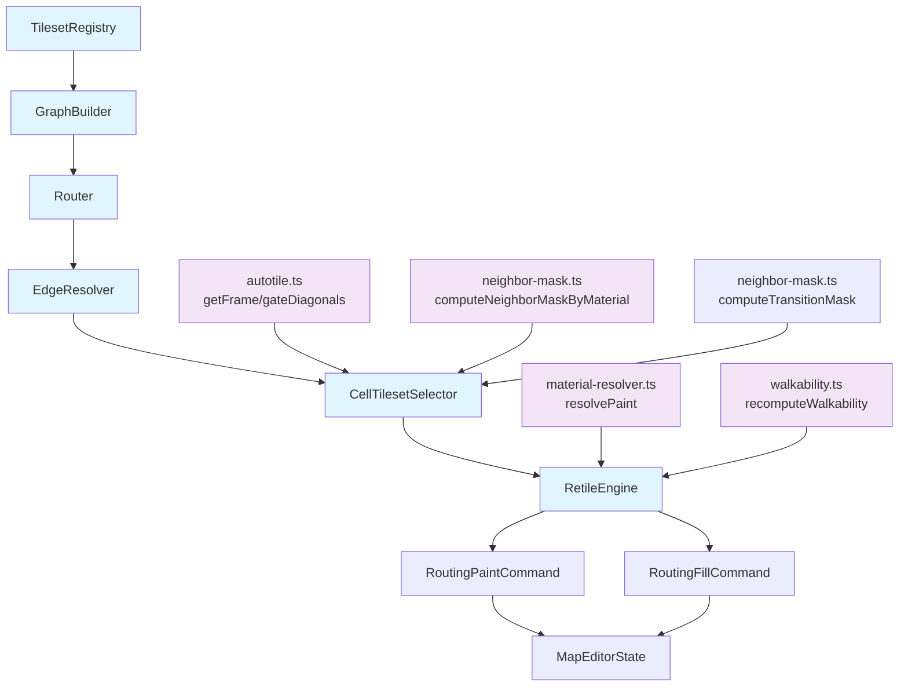
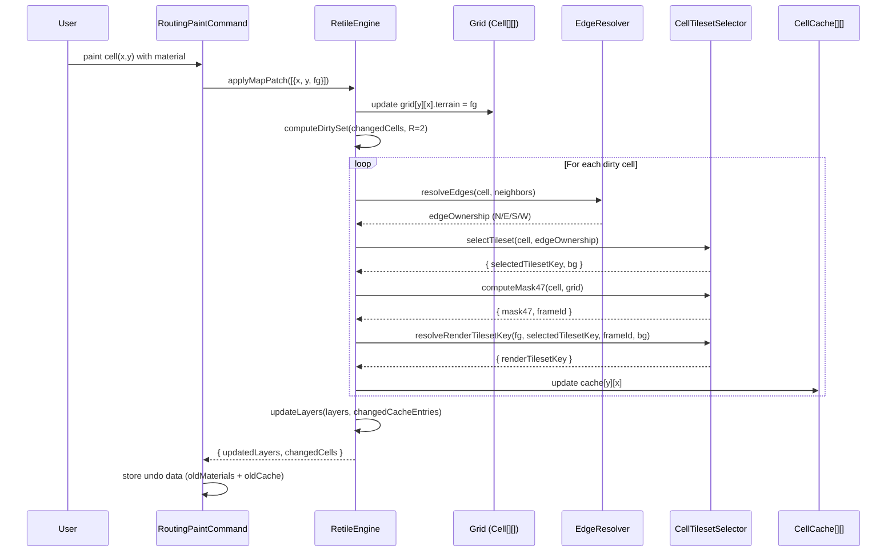

# Autotile Routing System Design Document

## Overview

This document defines the technical design for replacing the current dominant-neighbor autotile pipeline in `packages/map-lib/` with a graph-based routing system. The new system builds compatibility and render graphs from tileset metadata, computes shortest-path routing tables via BFS, resolves background consensus (virtual boundaries) between adjacent cells, selects a logical transition tileset per cell, and resolves the final render tileset per frame via fallback policy -- all driven by an incremental RetileEngine with per-cell caching. The command system (`PaintCommand`, `FillCommand`, `applyDeltas`) is also replaced with RetileEngine-integrated commands.

## Design Summary (Meta)

```yaml
design_type: "refactoring"
risk_level: "medium"
complexity_level: "high"
complexity_rationale: >
  (1) The 6-step core algorithm (graph build, BFS routing, background consensus, logical tileset selection,
  mask computation, frame-source resolution) involves 6+ coordinating modules with S1+S2 conflict resolution. Five painting variation scenarios (V1-V5) and four retile
  triggers (T1-T4) each require independent correctness verification.
  (2) Key constraints: immutability throughout (React state compatibility), zero-build TS source
  pattern, no browser deps in map-lib, backward-compatible EditorCommand interface for undo/redo,
  deterministic iteration order for conflict resolution, and performance ceiling of O(n) per
  single-cell paint where n = Chebyshev R=2 neighborhood.
main_constraints:
  - "Zero-build TS source pattern: map-lib exports .ts directly, no compile step"
  - "No browser/DOM dependencies in map-lib (pure algorithms, server-importable)"
  - "Immutability: never mutate inputs, return new objects/arrays"
  - "ReadonlyArray/ReadonlyMap for all input parameters"
  - "Backward-compatible EditorCommand interface for undo/redo stacks"
  - "Deterministic: same input always produces same output (no Map iteration order issues)"
  - "Single-layer constraint: one material per cell, no overlapping layers"
biggest_risks:
  - "Performance regression for large maps (256x256) during batch paint or full rebuild"
  - "Conflict resolution (S1) non-convergence causing infinite iteration loops"
  - "Breaking existing undo/redo behavior during command system migration"
unknowns:
  - "Optimal max iteration count for S1 (spec says 4, may need tuning)"
  - "Whether >50% map threshold for T2 full-pass is the right cutoff"
  - "Performance profile of BFS routing table rebuild (T3b) on large tileset sets"
```

## Background and Context

### Prerequisite ADRs

- **ADR-0011** (accepted): Architecture decision for autotile routing system -- full replacement of dominant-neighbor pipeline, RetileEngine-integrated commands, explicit fromMaterialKey/toMaterialKey, single-layer constraint, background consensus algorithm, S1+S2 conflict resolution strategies, and frame-level render fallback.
- **ADR-0010 (ADR-0010-map-lib-algorithm-extraction.md)**: Extraction of map algorithms into map-lib package; established zero-build pattern and module boundaries.
- **ADR-0009 (ADR-0009-tileset-management-architecture.md)**: Tileset management architecture; TilesetInfo schema with fromMaterialKey/toMaterialKey fields.
- **adr-006-map-editor-architecture.md**: Map editor architecture decisions including three-package split and dual-mode workflow.

No common ADRs (`ADR-COMMON-*`) exist in the project yet.

### Agreement Checklist

#### Scope
- [x] Replace `recomputeAutotileLayers()` with graph-based routing pipeline (6-step algorithm)
- [x] Replace `applyDeltas()`, `PaintCommand`, `FillCommand` with RetileEngine-integrated commands
- [x] Create 6 new modules: TilesetRegistry, GraphBuilder, Router, EdgeResolver, CellTilesetSelector, RetileEngine
- [x] Create new types file `routing-types.ts` with all routing-specific types
- [x] Validate `fromMaterialKey`/`toMaterialKey` at `TilesetRegistry` boundary (fields remain optional on `TilesetInfo` type; tilesets missing either field are excluded from routing graph)
- [x] Add per-cell cache with incremental dirty propagation
- [x] Update `packages/map-lib/src/index.ts` exports

#### Non-Scope (Explicitly not changing)
- [x] `autotile.ts` -- bit constants, `getFrame`, `gateDiagonals`, `FRAME_TABLE` are reused as-is
- [x] `canvas-renderer.ts` -- renderer reads `frames[y][x]` and `tilesetKeys[y][x]` unchanged
- [x] `EditorLayer` interface structure -- `frames` and `tilesetKeys` 2D arrays remain the same shape
- [x] `MapEditorState` -- no structural changes; `tilesets`/`materials` fields remain
- [x] Zone system, walkability, drawing algorithms, map-editor-data -- untouched
- [x] `material-resolver.ts` (`resolvePaint`, `buildTransitionMap`) -- kept for grid mutation; RetileEngine calls into it

#### Constraints
- [x] Parallel operation: No (full replacement, not parallel run with old system)
- [x] Backward compatibility: EditorCommand interface preserved; undo/redo stack structure unchanged
- [x] Performance measurement: Required -- benchmark single-cell paint on 256x256 map before/after

### Problem to Solve

The current autotile pipeline uses a dominant-neighbor heuristic: for each cell, it counts which foreign material appears most among its 8 neighbors, picks that as the "target," and searches for a tileset pair. This approach has three fundamental limitations:

1. **No multi-hop routing**: When materials A and B have no direct tileset but a path A->M->B exists through intermediate material M, the current `findIndirectTileset()` only searches one hop. With deeper graphs (A->M1->M2->B), it fails.
2. **No multi-material background consensus**: The dominant-neighbor approach assigns one tileset per cell based on neighbor counting. It cannot express "this side borders water while this side borders sand", since it forces a single dominant neighbor for the whole cell. Furthermore, it adds physical tiles of the intermediate material rather than allowing adjacent mixed tilesets to seamlessly form the boundary.
3. **No conflict resolution**: When a cell borders 3+ different materials, the system picks one dominant and ignores the rest. There is no strategy for resolving conflicting edge claims or degrading gracefully.

### Current Challenges

- **Visual artifacts at T-junctions**: Where 3 materials meet, the dominant-neighbor heuristic produces inconsistent transitions.
- **No configurable priority**: The rendering priority of materials (which material wins a conflict) is implicit in neighbor counting, not explicitly configurable.
- **Coupled recomputation**: `recomputeAutotileLayers()` recomputes everything from scratch for every affected cell, with only a same-material skip optimization. There is no per-cell cache to avoid redundant work.
- **Tight coupling of commands to recompute**: `applyDeltas()` directly calls `recomputeAutotileLayers()` inside the command execution, making it impossible to test the routing logic independently.

### Requirements

#### Functional Requirements

- FR1: Build undirected compatibility graph and directed render graph from tileset metadata
- FR2: Compute BFS routing table (`nextHop[A][B]`) with configurable tie-break preferences
- FR3: Compute canonical per-edge contracts (owner + transition type) for shared cardinal edges; diagonals remain mask-only (no ownership)
- FR4: Select exactly one logical tileset per cell based on background consensus
- FR5: Compute blob-47 mask in selected-mode basis with edge-contract gating and diagonal rules: FG-basis for base/no-transition cells, transition basis for selected BG on owned edges, and closed-cardinal behavior on non-owned foreign edges
- FR6: Support conflict resolution via S1 (boundary consensus reassign, max 4 iterations) and S2 (BG priority fallback)
- FR7: Incremental retile with per-cell cache and Chebyshev R=2 dirty propagation
- FR8: Four retile triggers: single-cell paint (T1), batch paint (T2), maskToTile change (T3a/T3b), theme switch (T4)
- FR9: Editor API: `applyMapPatch`, `updateTileset`, `removeTileset`, `addTileset`, `switchTilesetGroup`, `rebuild`
- FR10: New command system with RetileEngine-integrated PaintCommand/FillCommand preserving undo/redo
- FR11: Resolve per-frame render tileset fallback (`renderTilesetKey`) without changing logical routing selection (`selectedTilesetKey`)
- FR12: Apply post-recompute neighbor repaint policy: all dirty cells are recomputed, center is always committed, cardinal neighbor commit guarantees depend on edge stability class (C1/C2/C3 stable, C4/C5 non-mandatory), and diagonals are committed when both adjacent cardinal edges are stable

#### Non-Functional Requirements

- **Performance**: Single-cell paint on 256x256 map must complete in <5ms. Full rebuild must complete in <500ms.
- **Scalability**: Handle up to 30 materials and 100 tilesets without degradation.
- **Reliability**: S1 conflict resolution must converge within 4 iterations; deterministic output for identical inputs.
- **Maintainability**: Each module has a single responsibility, injected dependencies, and full JSDoc coverage. All modules independently testable.

### Core Algorithm: Background Consensus

The routing system operates on a unique variation of the Blob-47 bitmasking approach. Because the map strictly enforces a single-layer constraint (each grid cell has exactly one terrain material and one rendered tileset per frame), the system mathematically simulates background transitions without adding physical intermediary tiles.

**Step 1: Routing (Graph & Pathfinding)**
For any pair of neighboring materials (A, B), the algorithm finds the shortest path in the tileset definition graph. 
Example: `nextHop(deep_water, soil) = water`. If a direct transition exists, e.g., `soil` to `sand`, then `nextHop(soil, sand) = sand` (the background material).

**Step 2: Canonical Edge Contracts (EdgeResolver)**
For each shared cardinal edge `(A, B)`, the algorithm evaluates directional candidates and commits to one canonical contract:
- Candidate from A-side: `nextHop(A.fg, B.fg)` + pair availability check (direct-first, reverse fallback).
- Candidate from B-side: `nextHop(B.fg, A.fg)` + pair availability check (direct-first, reverse fallback).
- EdgeResolver selects one owner side and one transition type for the edge.
Diagonals are not ownership units; they only affect frame corners through diagonal gating.

**Step 3: Logical Tileset Selection (CellTilesetSelector)**
The cell reviews only its **owned cardinal contracts**:
- If it owns no foreign edges, it selects FG logical base provider (`bg = ''`).
- If owned edges request a single BG material, it selects that `FG_BG` transition (or reverse pair in reverse orientation mode).
- **Conflict Resolution**: If owned edges request multiple BGs, the single-layer constraint forces a choice. The cell applies S1 then S2 to converge to one BG.

**Step 4: Mask Calculation (Blob-47)**
Mask basis depends on the selected rendering mode for the cell:
- **Base/no-transition mode (`bg == ''`)**: use FG-equality mask (`bit = 1` when `neighbor.terrain === FG`), then in engine owner-context force foreign cardinal edges closed on non-owner side.
- **Transition mode (`bg != ''`)**: use edge-contract-aware transition mask. Cardinal opening (`bit = 0`) is allowed only when this cell owns that edge and the edge contract type matches selected BG; non-owned foreign edges (and owned foreign edges of other types) are forced closed (`bit = 1`).
The selected-mode mask is then passed through `gateDiagonals` and `getFrame` (or reverse mapping when orientation is reverse), ensuring edge-type consistency: transition opening is rendered only by the owner side of the canonical edge contract.

**Step 5: Frame Source Resolution (Render Fallback Policy)**
After `selectedTilesetKey` (logical) and `frameId` are known, the engine resolves `renderTilesetKey` for the final draw source.
- Default policy (v1): if `frameId === SOLID_FRAME` and `materials[fg].baseTilesetKey` exists, then `renderTilesetKey = materials[fg].baseTilesetKey`.
- Otherwise, `renderTilesetKey = selectedTilesetKey`.
This allows borrowing solid frames from another tileset (for example, using `water_grass` as the solid source for `water`) while keeping routing logic unchanged.

**Step 6: Neighbor Repaint Policy (Post-Recompute Commit Stage)**
After `RetileEngine` recomputes every cell in the local dirty set (`Chebyshev R=2`), commit policy is applied:
- Painted center cell is always committed.
- For cardinal center-neighbor edges, classify stability using route + pair resolution on both sides:
  - `C1`: same material (`A === B`)
  - `C2`: both sides direct, no bridge (`hopA === B`, `hopB === A`)
  - `C3`: both sides direct, same bridge (`hopA === hopB !== A,B`)
  - `C4`: both sides valid but mixed (reverse on at least one side or different bridges)
  - `C5`: at least one side unresolved (`resolvePair === null`)
- Neighbor commit is required only for stable classes (`C1/C2/C3`); for `C4/C5`, preserving previous neighbor visual state is allowed.
- Diagonal commit is required only for stable corners: a diagonal cell commits when both adjacent cardinal edges from the painted center are in `C1/C2/C3` (NW requires N+W, NE requires N+E, SE requires S+E, SW requires S+W).
- If a recomputed cell has no prior visual/cache state, its computed output is committed even when the edge class is `C4/C5` (initialization fallback).
- For non-paint triggers (full rebuild, tileset update/switch), all dirty cells are committed.

This policy does not change routing, edge ownership, or mask semantics. It controls only which recomputed neighbor outputs are guaranteed to be persisted for visual stability.

## Acceptance Criteria (AC) - EARS Format

### AC1: Graph Construction (FR1)

- [ ] **When** TilesetRegistry is initialized with a set of tilesets, the system shall build `compatGraph[A]` containing every material B where either A_B or B_A tileset exists
- [ ] **When** TilesetRegistry is initialized, the system shall build `renderGraph[A]` containing every material B where A_B tileset exists (directed)
- [ ] **If** a tileset has `fromMaterialKey === toMaterialKey`, **then** the system shall treat it as a base tileset and not add a self-edge to the graphs
- [ ] The system shall represent graphs using `ReadonlyMap<string, ReadonlySet<string>>`

### AC2: BFS Routing Table (FR2, V1)

- [ ] **When** `Router.computeRoutingTable()` is called, the system shall compute `nextHop[A][B]` for all reachable material pairs via BFS on the compatGraph
- [ ] **If** multiple paths of equal length exist from A to B, **then** the system shall tie-break using the configurable preference array (default: `['water', 'grass', 'sand', ...]`)
- [ ] **When** `nextHop('deep_water', 'soil')` is queried with water in the preference array, the system shall return `'water'` if a path through water exists
- [ ] **If** no path exists between A and B, **then** `nextHop[A][B]` shall be `null`
- [ ] The routing table shall be immutable after construction

### AC3: Edge Ownership (FR3, V2)

- [ ] **When** two adjacent cells have materials A and B (A !== B), the system shall compute ownership for the shared edge (N/E/S/W from each cell's perspective)
- [ ] **For** every resolved shared edge, the system shall produce one canonical edge contract (owner + transition type), and only the owner side may render an opening for that edge
- [ ] **If** only one candidate is valid (has a non-null nextHop and either a direct pair `A_nextHop` or reverse pair `nextHop_A`), **then** that candidate shall own the edge
- [ ] **If** both candidates are valid, **then** the candidate with higher `materialPriority` shall own the edge
- [ ] **If** neither candidate is valid, **then** the edge shall be marked as unresolved and logged
- [ ] **If** both direct and reverse pairs are available for a candidate, **then** direct shall be preferred
- [ ] **When** Preset A is active (water-side owns shore), water's materialPriority shall be higher than grass's. Example: `{ 'deep-water': 100, 'water': 90, 'sand': 50, 'grass': 30, 'soil': 10 }` — higher number = owns the edge
- [ ] **When** Preset B is active (land-side owns shore), grass's materialPriority shall be higher than water's. Example: `{ 'grass': 100, 'soil': 90, 'sand': 80, 'water': 30, 'deep-water': 10 }` — higher number = owns the edge
- [ ] The policy preset shall be switchable via `materialPriority` map without code changes

### AC4: Cell Tileset Selection and Frame Source Resolution (FR4, FR11, V3)

- [ ] **When** a cell has no owned edges (all neighbors are same material), the system shall select the FG logical base provider tileset
- [ ] **When** a cell's owned edges all require the same BG material, the system shall select the FG_BG tileset
- [ ] **When** `FG_BG` is missing but reverse pair `BG_FG` exists, **then** the system shall select `BG_FG` in reverse orientation mode
- [ ] **When** both `FG_BG` and `BG_FG` exist, **then** the system shall select `FG_BG` (direct-first precedence)
- [ ] **If** a cell's owned edges require multiple different BG materials, **then** the system shall apply S1 then S2 conflict resolution
- [ ] **When** a cell has no selected BG (`bg == ''`), the blob-47 mask shall be computed by FG neighbor comparison (`neighbor.terrain === fg`); in engine owner-context, foreign cardinal edges on non-owner side shall be forced closed (`bit = 1`)
- [ ] **When** a cell has selected BG (`bg != ''`), the blob-47 mask shall be computed in transition mode against BG with edge-contract gating: only owned matching cardinal edges may open (`bit = 0`), non-owned foreign cardinal edges remain closed (`bit = 1`)
- [ ] **When** reverse orientation mode is selected, **then** frame lookup shall use inverse mapping after diagonal gating (`getFrame((~mask47Input) & 0xFF)` where `mask47Input = gateDiagonals(rawMask)`)
- [ ] **When** computing diagonal mask bits, NW shall be set only if N and W are both set (diagonal gating preserved)
- [ ] **When** a cell's `frameId` is `SOLID_FRAME`, `bg == ''`, and `materials[fg].baseTilesetKey` exists, the system shall set `renderTilesetKey` to that base tileset key while keeping `selectedTilesetKey` unchanged
- [ ] **When** no fallback rule applies, the system shall set `renderTilesetKey === selectedTilesetKey`
- [ ] **For** any non-empty terrain cell, the system shall not produce empty `selectedTilesetKey` or empty `renderTilesetKey`
- [ ] The system shall not produce corner holes in island, bay, or inlet patterns (V3 requirement)

### AC5: Conflict Resolution (FR6, V4)

- [ ] **When** S1 (Owner Reassign) is applied, the system shall attempt to transfer conflicting edge ownership to the neighbor cell, using deterministic top-to-bottom left-to-right order
- [ ] **If** S1 does not resolve within 4 iterations, **then** the system shall fall back to S2
- [ ] **When** S2 (BG Priority) is applied, the system shall select the single BG material with highest priority (water > grass > sand)
- [ ] **While** S2 is applied, the system shall log the degraded case with cell coordinates and conflicting materials

### AC6: Incremental Retile Engine (FR7, FR8)

- [ ] **When** trigger T1 (single cell paint) fires, the dirty set shall be Chebyshev R=2 around the painted cell, with max 4 S1 iterations, falling back to S2
- [ ] **When** trigger T2 (batch paint) fires, the dirty set shall be the union of `expand(changedSet, R=2)`, with full-pass if changed cells exceed 50% of map
- [ ] **When** trigger T3a (maskToTile change) fires, the system shall find cells using that tilesetKey via selected/render indices and recompute render selection (`renderTilesetKey`) and frame output metadata
- [ ] **When** trigger T3b (tileset add/remove) fires, the system shall rebuild graphs + nextHop and dirty cells near affected materials + R=2
- [ ] **When** trigger T4 (theme switch) fires, the system shall perform a full rebuild
- [ ] The per-cell cache shall store: `{ fg, selectedTilesetKey, renderTilesetKey, bg, mask47, frameId, boundaryMaterialsHash }`
- [ ] The engine shall maintain `cellsBySelectedTilesetKey` and `cellsByRenderTilesetKey` indices (`Map<string, Set<number>>`) for fast T3a lookups

### AC7: Editor API (FR9)

- [ ] `applyMapPatch(patch)` shall accept `Array<{x, y, fg}>`, update grid terrain, and return changed cells
- [ ] `updateTileset(tilesetKey, newMaskToTile)` shall find affected cells via selected/render indices and recompute `renderTilesetKey` and frame output metadata, returning affected cells
- [ ] `removeTileset(tilesetKey)` shall rebuild graphs and dirty affected cells, returning affected cells
- [ ] `addTileset(tilesetInfo)` shall rebuild graphs and dirty affected cells, returning affected cells
- [ ] `switchTilesetGroup(tilesets)` shall perform a full rebuild, returning all cells
- [ ] `rebuild(mode, changedCells?)` shall support `'local'` (dirty propagation) and `'full'` (complete recompute) modes

### AC8: Command System (FR10)

- [ ] The new `PaintCommand` shall call `RetileEngine.applyMapPatch()` for execution
- [ ] The new `FillCommand` shall call `RetileEngine.applyMapPatch()` for execution
- [ ] **When** undo is called, the command shall restore old materials and old cell cache entries
- [ ] **When** redo is called, the command shall reapply new materials and new cell cache entries
- [ ] The `EditorCommand` interface (`execute`, `undo`, `description`) shall remain unchanged
- [ ] Commands shall store both old and new material + old and new cell cache for each affected cell

### AC9: Painting Scenarios (V5)

- [ ] **P1**: Given a base deep-water fill + soil rectangle, the system shall produce deep-water_water transition tilesets and flat soil interior tiles
- [ ] **P2**: Given a soil square + water lake inside, the system shall produce water_grass routing with correct blob-47 corner frames
- [ ] **P3**: Given deep-water | soil | sand strips, the system shall route through water for deep-water cells (deep-water_water) and route through grass for both soil and sand cells (soil_grass and sand_grass respectively, with S1 conflict resolution for sand when bordered by both soil and deep-water)

### AC10: Neighbor Repaint Policy (FR12)

- [ ] **When** a paint operation triggers local rebuild, the system shall recompute all cells in dirty set (`Chebyshev R=2`) before applying any neighbor commit policy
- [ ] **When** post-recompute commit runs, the painted center cell shall always be persisted
- [ ] **When** classifying each center-neighbor cardinal edge, the system shall derive one of `C1..C5` from `{ hopA, hopB, pairA, pairB }` using direct-first pair resolution
- [ ] **When** edge class is `C1`, `C2`, or `C3`, the system shall treat neighbor update as commit-required behavior
- [ ] **When** both adjacent cardinal edges for a diagonal are `C1`, `C2`, or `C3`, the system shall treat that diagonal neighbor update as commit-required behavior
- [ ] **When** edge class is `C4` or `C5`, the system may preserve previous neighbor frame/tileset output (neighbor update is not a required visual invariant)
- [ ] **When** a recomputed cell has no prior visual/cache state, the system shall commit that cell even under `C4/C5` (initialization fallback)
- [ ] **When** rebuild is triggered by non-paint operations (T3/T4), the system shall commit all dirty cells
- [ ] **For** every shared cardinal edge, owner-side opening invariant shall remain valid after commit policy (only owner may render opening on that edge)

## Applicable Standards

### Classification Table

| Standard | Type | Source | Impact on Design |
|----------|------|--------|-----------------|
| TypeScript strict mode | Explicit | `tsconfig.base.json` (`"strict": true`) | All new code must pass strict type checking; no implicit any |
| Prettier single quotes | Explicit | `.prettierrc` | All code samples and implementation use single quotes |
| 2-space indent | Explicit | `.editorconfig` (`indent_size = 2`) | All code uses 2-space indentation |
| ESLint @nx/enforce-module-boundaries | Explicit | `eslint.config.mjs` | New modules must respect package boundary rules |
| Jest test framework with ts-jest | Explicit | `packages/map-lib/jest.config.cts` | Tests use Jest with `.spec.ts` co-located files |
| Zero-build TS source pattern | Explicit | `tsconfig.lib.json` (`emitDeclarationOnly`) + `customConditions` | map-lib exports TS source directly; no compilation step |
| Immutable return pattern | Implicit | All functions in `autotile-layers.ts`, `commands.ts`, `material-resolver.ts` | Never mutate inputs; return new objects/arrays |
| ReadonlyArray/ReadonlyMap for inputs | Implicit | `recomputeAutotileLayers` signature, `resolvePaint` signature | All input parameters use Readonly variants |
| JSDoc on all exported functions | Implicit | Every export in `autotile.ts`, `neighbor-mask.ts`, `autotile-layers.ts` | All public API functions must have JSDoc comments |
| Test helper factory pattern | Implicit | `makeCell()`, `makeMaterial()` in `autotile-layers.spec.ts` | Tests use factory helpers for test data construction |
| Co-located test files | Implicit | `*.spec.ts` next to `*.ts` in `src/core/` | New modules have adjacent spec files |

**Gate check**: 6 explicit + 5 implicit standards identified (exceeds 3+2 minimum).

## Existing Codebase Analysis

### Implementation Path Mapping

| Type | Path | Description |
|------|------|-------------|
| Existing (replaced) | `packages/map-lib/src/core/autotile-layers.ts` | Current recompute pipeline (recomputeAutotileLayers, findDominantNeighbor, buildTilesetPairMap, findIndirectTileset) |
| Existing (replaced) | `packages/map-lib/src/core/commands.ts` | Current command system (applyDeltas, PaintCommand, FillCommand) |
| Existing (reused) | `packages/map-lib/src/core/autotile.ts` | Blob-47 engine (getFrame, gateDiagonals, FRAME_TABLE, bit constants) |
| Existing (partially reused) | `packages/map-lib/src/core/neighbor-mask.ts` | NEIGHBOR_OFFSETS, computeNeighborMaskByMaterial (base-mode), computeTransitionMask (transition-mode or equivalent inline logic) |
| Existing (reused) | `packages/map-lib/src/core/material-resolver.ts` | resolvePaint, buildTransitionMap (used by RetileEngine for grid mutation) |
| Existing (unchanged) | `packages/map-lib/src/types/material-types.ts` | TilesetInfo unchanged (fromMaterialKey/toMaterialKey stay optional; validated at TilesetRegistry boundary) |
| Existing (unchanged) | `packages/map-lib/src/types/editor-types.ts` | EditorLayer, MapEditorState, EditorCommand, CellDelta interfaces |
| Existing (updated) | `packages/map-lib/src/index.ts` | Exports updated: old exports deprecated, new modules exported |
| New | `packages/map-lib/src/types/routing-types.ts` | All routing-specific types |
| New | `packages/map-lib/src/core/tileset-registry.ts` | TilesetRegistry module |
| New | `packages/map-lib/src/core/graph-builder.ts` | GraphBuilder module |
| New | `packages/map-lib/src/core/router.ts` | Router module (BFS routing table) |
| New | `packages/map-lib/src/core/edge-resolver.ts` | EdgeResolver module (per-edge ownership) |
| New | `packages/map-lib/src/core/cell-tileset-selector.ts` | CellTilesetSelector module |
| New | `packages/map-lib/src/core/retile-engine.ts` | RetileEngine (incremental recompute + cache) |
| New | `packages/map-lib/src/core/routing-commands.ts` | New PaintCommand/FillCommand using RetileEngine |

### Similar Functionality Search

| Search Term | Found | Decision |
|------------|-------|---------|
| Graph/adjacency structure | None in codebase | New implementation justified |
| BFS/shortest path | None in codebase | New implementation justified |
| Edge ownership | None in codebase | New implementation justified |
| Per-cell cache | None in codebase | New implementation justified |
| Tileset pair map | `buildTilesetPairMap` in autotile-layers.ts | Superseded by TilesetRegistry (broader scope) |
| Transition map | `buildTransitionMap` in material-resolver.ts | Kept; TilesetRegistry wraps its output |
| Dirty propagation | Implicit in `recalcSet` expansion in autotile-layers.ts | Replaced by explicit R=2 Chebyshev dirty set |

### Code Inspection Evidence

#### What Was Examined

- `packages/map-lib/src/core/autotile-layers.ts` (355 lines) -- full read, all 5 functions
- `packages/map-lib/src/core/autotile.ts` (184 lines) -- full read, all exports
- `packages/map-lib/src/core/neighbor-mask.ts` (195 lines) -- full read, all 4 functions
- `packages/map-lib/src/core/commands.ts` (178 lines) -- full read, all 3 exports
- `packages/map-lib/src/core/material-resolver.ts` (148 lines) -- full read, all exports
- `packages/map-lib/src/types/editor-types.ts` (215 lines) -- full read, all interfaces
- `packages/map-lib/src/types/material-types.ts` (31 lines) -- full read, both interfaces
- `packages/map-lib/src/index.ts` (82 lines) -- full read, all re-exports
- `docs/design/autotile-system-reference.md` (867 lines) -- full read, complete reference
- `apps/genmap/src/hooks/use-map-editor.ts` (80 lines partial) -- reducer structure, imports
- `apps/genmap/src/components/map-editor/canvas-renderer.ts` (50 lines partial) -- rendering interface
- `packages/map-lib/src/core/autotile-layers.spec.ts` (60 lines partial) -- test patterns
- Files inspected: 12 / total in affected area: ~14 core modules

#### Key Findings

| File Inspected | Key Finding | Design Impact |
|---------------|-------------|---------------|
| `autotile-layers.ts:160-167` | `recomputeAutotileLayers` accepts `(grid, layers, affectedCells, materials, paintedCells, tilesets)` and returns `EditorLayer[]` | RetileEngine must produce same output shape: updated `EditorLayer[]` with `frames` and `tilesetKeys` |
| `autotile-layers.ts:39-50` | `buildTilesetPairMap` uses `"from:to"` key format | TilesetRegistry adopts same key format for pair lookup |
| `autotile.ts:154-178` | `gateDiagonals` and `getFrame` are stateless pure functions | Reuse directly in CellTilesetSelector -- no wrapping needed |
| `neighbor-mask.ts:126-151` | `computeNeighborMaskByMaterial` compares `grid[ny][nx].terrain === materialKey` | Reuse for base/no-transition mask path (`bg == ''`) |
| `neighbor-mask.ts:166-195` | `computeTransitionMask` uses target-specific inversion | Reuse (or equivalent inline logic) for transition mask path (`bg != ''`) |
| `commands.ts:23-122` | `applyDeltas` mutates shallow copies, then calls recompute + walkability | New commands follow same pattern but call RetileEngine instead |
| `commands.ts:128-178` | PaintCommand/FillCommand implement `EditorCommand` interface | New commands must implement same interface for undo/redo stack compatibility |
| `editor-types.ts:78-88` | `EditorLayer` has optional `tilesetKeys?: string[][]` | New system always populates `tilesetKeys`; keep optional for backward compat |
| `material-types.ts:6-14` | `TilesetInfo.fromMaterialKey` and `toMaterialKey` are optional | Kept optional; TilesetRegistry validates and excludes entries missing either field |
| `canvas-renderer.ts:40-49` | Renderer reads `state.layers[].frames[y][x]` and `state.layers[].tilesetKeys?.[y]?.[x]` | Output format must remain identical; no renderer changes needed |
| `use-map-editor.ts:1-18` | Reducer imports `recomputeAutotileLayers` from map-lib | Integration point: reducer switches to RetileEngine API |
| `autotile-layers.spec.ts:10-26` | Tests use `makeCell(terrain)` and `makeMaterial(key)` helpers | Follow same test helper pattern for routing module tests |

#### How Findings Influence Design

- **Output compatibility**: RetileEngine must produce `EditorLayer[]` with `frames: number[][]` and `tilesetKeys: string[][]` -- the renderer is not modified
- **`getFrame` reuse**: The blob-47 frame table is correct and battle-tested; CellTilesetSelector calls `getFrame(mask)` directly
- **Selected-mode mask reuse**: use `computeNeighborMaskByMaterial` for base/no-transition cells and `computeTransitionMask` (or equivalent BG-targeted logic) for transition cells
- **Command pattern preserved**: New commands implement `EditorCommand` interface unchanged; undo/redo stacks work as before
- **Immutability discipline**: Every function in the existing codebase returns new arrays/objects; new modules must follow the same pattern
- **Test patterns**: Factory helpers, co-located `.spec.ts` files, and Jest `describe`/`it` structure are established conventions

## Design

### Change Impact Map

```yaml
Change Target: Autotile recompute pipeline and command system
Direct Impact:
  - packages/map-lib/src/core/autotile-layers.ts (replaced by routing modules)
  - packages/map-lib/src/core/commands.ts (replaced by routing-commands.ts)
  - packages/map-lib/src/types/material-types.ts (TilesetInfo fields become required)
  - packages/map-lib/src/index.ts (exports updated)
  - apps/genmap/src/hooks/use-map-editor.ts (PUSH_COMMAND uses new commands)
Indirect Impact:
  - apps/genmap/src/components/map-editor/canvas-renderer.ts (no code change, but reads new tilesetKeys values)
  - Any consumer of recomputeAutotileLayers (must switch to RetileEngine)
  - Any consumer of PaintCommand/FillCommand (must import from new location)
No Ripple Effect:
  - packages/map-lib/src/core/autotile.ts (unchanged, reused)
  - packages/map-lib/src/core/walkability.ts (unchanged, still called by commands)
  - packages/map-lib/src/core/drawing-algorithms.ts (unchanged)
  - packages/map-lib/src/core/zone-geometry.ts (unchanged)
  - packages/map-lib/src/core/zone-validation.ts (unchanged)
  - packages/map-lib/src/core/map-editor-data.ts (unchanged)
  - packages/map-lib/src/types/editor-types.ts (EditorLayer/MapEditorState unchanged)
```

### Architecture Overview

The routing system is a 6-module pipeline with clear dependency flow:



**Legend**: Blue = new modules, Purple = existing reused modules.

### Data Flow



### Integration Point Map

```yaml
## Integration Point Map
Integration Point 1:
  Existing Component: use-map-editor.ts reducer (PUSH_COMMAND action handler)
  Integration Method: Replace PaintCommand/FillCommand imports with RoutingPaintCommand/RoutingFillCommand
  Impact Level: High (Process Flow Change)
  Required Test Coverage: Verify undo/redo cycle produces identical state

Integration Point 2:
  Existing Component: canvas-renderer.ts (renderMapCanvas function)
  Integration Method: No code change -- reads layer.frames[y][x] and layer.tilesetKeys[y][x]
  Impact Level: Low (Read-Only)
  Required Test Coverage: Visual regression on painting scenarios P1-P3

Integration Point 3:
  Existing Component: packages/map-lib/src/index.ts (public exports)
  Integration Method: Add new exports, deprecate old exports
  Impact Level: Medium (API Surface Change)
  Required Test Coverage: Verify all new modules importable from @nookstead/map-lib

Integration Point 4:
  Existing Component: material-resolver.ts (resolvePaint)
  Integration Method: RetileEngine calls resolvePaint for grid mutation, then runs routing pipeline
  Impact Level: Medium (Data Usage)
  Required Test Coverage: Grid state after resolvePaint matches expected terrain placement
```

### Integration Boundary Contracts

```yaml
Boundary: RetileEngine <-> MapEditorState
  Input: MapEditorState (grid, layers, tilesets, materials)
  Output: Sync -- new EditorLayer[] with updated frames and tilesetKeys
  On Error: Return unchanged layers + log warning

Boundary: RetileEngine <-> resolvePaint
  Input: ResolvePaintOptions (grid, x, y, materialKey, width, height, materials)
  Output: Sync -- PaintResult (updatedGrid, affectedCells, warnings)
  On Error: Return empty affectedCells + warning array

Boundary: RoutingPaintCommand <-> MapEditorState
  Input: MapEditorState (current state)
  Output: Sync -- new MapEditorState with updated grid, layers, walkable
  On Error: Return unchanged state (fail-safe)

Boundary: EdgeResolver <-> Router
  Input: Two material keys (cellA, cellB)
  Output: Sync -- EdgeMaterial (string)
  On Error: Return null (unresolved boundary)
```

### Integration Points List

| Integration Point | Location | Old Implementation | New Implementation | Switching Method |
|-------------------|----------|-------------------|-------------------|------------------|
| Autotile recompute | `use-map-editor.ts` reducer | `recomputeAutotileLayers()` | `RetileEngine.rebuild()` | Direct replacement in reducer |
| Paint command | `use-map-editor.ts` PUSH_COMMAND | `PaintCommand` from `commands.ts` | `RoutingPaintCommand` from `routing-commands.ts` | Import swap |
| Fill command | `use-map-editor.ts` PUSH_COMMAND | `FillCommand` from `commands.ts` | `RoutingFillCommand` from `routing-commands.ts` | Import swap |
| Tileset pair lookup | `autotile-layers.ts` internal | `buildTilesetPairMap()` | `TilesetRegistry.hasTileset()` | Module replacement |
| Transition resolution | `autotile-layers.ts` internal | `findDominantNeighbor()` + `findIndirectTileset()` | `Router.nextHop()` + `EdgeResolver` | Module replacement |
| Exports | `index.ts` | `applyDeltas, PaintCommand, FillCommand` | `RoutingPaintCommand, RoutingFillCommand, RetileEngine` | Export addition + deprecation |

### Main Components

#### Component 1: TilesetRegistry

- **Responsibility**: Central store for tileset metadata. Provides fast lookup by key, by material pair, and base tileset queries.
- **Interface**: `hasTileset(fg, bg)`, `getTilesetKey(fg, bg)`, `getBaseTilesetKey(material)`, `getAllMaterials()`, `getAllTransitionPairs()`
- **Dependencies**: None (leaf node)

#### Component 2: GraphBuilder

- **Responsibility**: Constructs undirected compatibility graph and directed render graph from TilesetRegistry data.
- **Interface**: `buildGraphs(registry)` returning `{ compatGraph, renderGraph }`
- **Dependencies**: TilesetRegistry

#### Component 3: Router

- **Responsibility**: Computes BFS routing table with configurable tie-break preferences.
- **Interface**: `computeRoutingTable(compatGraph, preferences)` returning `RoutingTable`, `nextHop(from, to)` query
- **Dependencies**: GraphBuilder output (compatGraph)

#### Component 4: EdgeResolver

- **Responsibility**: Resolves ownership of shared cardinal edges and produces one canonical edge contract per edge; provides per-direction virtual BG candidates used to build each contract.
- **Interface**: `resolveEdge(materialA, materialB, dir, router, registry, priorities)` returning `EdgeOwner | null`
- **Dependencies**: Router (nextHop), TilesetRegistry

> **Clarification -- Canonical Per-Edge Contract**: For each shared cardinal edge, both directional candidates are evaluated (`nextHop(A_fg, B_fg)` and `nextHop(B_fg, A_fg)`), but the renderer must commit to one canonical edge contract with one owner cell. Only the owner may render an opening on that edge; the non-owner treats that edge as closed in mask computation.

#### Component 5: CellTilesetSelector

- **Responsibility**: Selects one logical tileset per cell, computes the blob-47 mask and frame, then resolves the final render tileset via frame-source fallback. Candidate BGs come from owned edge contracts (direct-first pair resolution with reverse fallback per edge). If multiple owned edges require different BGs, S1/S2 conflict resolution selects a single BG. Mask basis is selected per cell: FG mask for base/no-transition (`bg == ''`) with foreign-cardinal non-owner closure in engine context, transition mask for selected BG (`bg != ''`) with edge-contract gating: owned matching edges may open, non-owned foreign edges remain closed.
- **Interface**: `selectTilesetForCell(cellFg, ownedEdges, registry, priorities)` returning `{ selectedTilesetKey, bg, orientation }`, `computeCellFrame(grid, x, y, width, height, fg, bg, orientation)` returning `{ mask47, frameId }`, `resolveRenderTilesetKey(fg, selectedTilesetKey, frameId, materials, bg)` returning `renderTilesetKey`
- **Dependencies**: TilesetRegistry, materialPriority config, autotile.ts (`getFrame`), neighbor-mask.ts (`computeNeighborMaskByMaterial`, `computeTransitionMask` or equivalent BG-targeted logic)

#### Component 6: RetileEngine

- **Responsibility**: Orchestrates the full pipeline: maintains per-cell cache, propagates dirty sets, calls EdgeResolver/CellTilesetSelector, resolves render fallback, and produces updated layers.
- **Interface**: `applyMapPatch()`, `updateTileset()`, `removeTileset()`, `addTileset()`, `switchTilesetGroup()`, `rebuild()`
- **Dependencies**: All other components + material-resolver.ts + walkability.ts

### Contract Definitions

```typescript
// ---- packages/map-lib/src/types/routing-types.ts ----

/** Graph of material compatibility (undirected). */
export type CompatGraph = ReadonlyMap<string, ReadonlySet<string>>;

/** Graph of renderable transitions (directed: A->B means A_B tileset exists). */
export type RenderGraph = ReadonlyMap<string, ReadonlySet<string>>;

/** Material priority map for edge ownership resolution. */
export type MaterialPriorityMap = ReadonlyMap<string, number>;

/** BFS routing table: nextHop[from][to] = intermediate material or null. */
export interface RoutingTable {
  /** Get the next hop material from `from` toward `to`. Returns null if unreachable. */
  nextHop(from: string, to: string): string | null;
  /** Check if a route exists between two materials. */
  hasRoute(from: string, to: string): boolean;
}

/** Direction of an adjacent cell (edge or corner). */
export type NeighborDirection = 'N' | 'NE' | 'E' | 'SE' | 'S' | 'SW' | 'W' | 'NW';

/** Per-cell cache entry for incremental retile. */
export interface CellCacheEntry {
  /** Foreground material key. */
  readonly fg: string;
  /** Logical tileset key chosen by routing/consensus. */
  readonly selectedTilesetKey: string;
  /** Final tileset key used for rendering this frame. */
  readonly renderTilesetKey: string;
  /** Background material (empty string if base tileset). */
  readonly bg: string;
  /** Computed blob-47 mask (post-gating). */
  readonly mask47: number;
  /** Frame index from FRAME_TABLE. */
  readonly frameId: number;
  /** Hash of the 8 boundary materials (used for cache invalidation). */
  readonly boundaryMaterialsHash: string;
}

/** Null cache entry for empty cells. */
export type CellCache = CellCacheEntry | null;

/** Per-cell diff for undo/redo. */
export interface CellPatchEntry {
  readonly x: number;
  readonly y: number;
  readonly oldFg: string;
  readonly newFg: string;
  readonly oldCache: CellCache;
  readonly newCache: CellCache;
}

/** Result from RetileEngine operations. */
export interface RetileResult {
  /** Updated layers array (new references for changed layers). */
  readonly layers: EditorLayer[];
  /** Updated grid (new references for changed rows). */
  readonly grid: Cell[][];
  /** Cells that were recomputed. */
  readonly changedCells: ReadonlyArray<{ x: number; y: number }>;
  /** Cell patch entries for undo/redo. */
  readonly patches: ReadonlyArray<CellPatchEntry>;
}

/** Options for the RetileEngine constructor. */
export interface RetileEngineOptions {
  readonly width: number;
  readonly height: number;
  readonly tilesets: ReadonlyArray<TilesetInfo>;
  readonly materials: ReadonlyMap<string, MaterialInfo>;
  readonly materialPriority: MaterialPriorityMap;
  readonly preferences: ReadonlyArray<string>;
}

/** Edge direction bitmask constants. */
export const EDGE_N = 1;
export const EDGE_E = 2;
export const EDGE_S = 4;
export const EDGE_W = 8;
```

### Data Contract

#### TilesetRegistry

```yaml
Input:
  Type: ReadonlyArray<TilesetInfo> (with required fromMaterialKey/toMaterialKey)
  Preconditions: All TilesetInfo entries have non-empty key and fromMaterialKey
  Validation: Skip entries where fromMaterialKey is absent

Output:
  Type: TilesetRegistry instance
  Guarantees: All lookups return consistent results; immutable after construction
  On Error: Missing pair returns undefined/false (no throw)

Invariants:
  - hasTileset(A, B) === true if and only if a tileset with from=A, to=B was provided
  - getBaseTilesetKey(A) returns the key of the tileset where from=A and to is absent/same
```

#### GraphBuilder

```yaml
Input:
  Type: TilesetRegistry
  Preconditions: Registry is fully constructed
  Validation: None (trusts registry)

Output:
  Type: { compatGraph: CompatGraph, renderGraph: RenderGraph }
  Guarantees:
    - compatGraph is undirected (if A in compatGraph[B] then B in compatGraph[A])
    - renderGraph is directed (A in renderGraph[B] does not imply B in renderGraph[A])
    - No self-edges (A is never in compatGraph[A])
  On Error: Returns empty graphs for empty registry

Invariants:
  - renderGraph is a subset of compatGraph edges
  - Every material in any graph edge exists in the registry
```

#### Router

```yaml
Input:
  Type: CompatGraph + preferences: ReadonlyArray<string>
  Preconditions: compatGraph is well-formed (undirected, no self-edges)
  Validation: Preferences with unknown materials are silently ignored

Output:
  Type: RoutingTable
  Guarantees:
    - nextHop(A, A) returns null (same material, no route needed)
    - nextHop(A, B) returns a material adjacent to A in compatGraph
    - If path exists, nextHop is always the first step of a shortest path
    - Tie-breaking is deterministic based on preferences array order
  On Error: Returns null for unreachable pairs (no throw)

Invariants:
  - Routing table is immutable after construction
  - For all A, B: if nextHop(A, B) !== null, then hasTileset(A, nextHop(A,B)) or hasTileset(nextHop(A,B), A) is true in compatGraph
```

#### EdgeResolver

```yaml
Input:
  Type: (materialA: string, materialB: string, dir: EdgeDirection, router: RoutingTable, registry: TilesetRegistry, priorities: MaterialPriorityMap)
  Preconditions: None
  Validation: Handles same materials by returning null (no foreign edge)

Output:
  Type: EdgeOwner | null
  Guarantees:
    - Evaluates both directional candidates (nextHop(A,B) and nextHop(B,A)) and selects one owner
    - Returns null if neither candidate is valid (unresolvable edge)
  - Called for each shared cardinal edge; final rendering uses one canonical edge contract.
    Candidate BG values may differ (e.g., A gets 'water', B gets 'grass'), but
    only the owner-side transition is renderable for that edge.
  On Error: Returns null for unresolved boundaries

Invariants:
  - Deterministic: same inputs always produce same EdgeOwner candidate
  - Only owner-side transition is renderable for the edge
```

#### CellTilesetSelector

```yaml
Input:
  Type: (fg: string, ownedEdges: Map<EdgeDirection, OwnedEdgeInfo>, registry: TilesetRegistry, priorities: MaterialPriorityMap)
  Preconditions: fg is a known material; ownedEdges contains 0..4 cardinal entries
  Validation: Unknown materials in ownedEdges are treated as unresolved and skipped

Output:
  Type: { selectedTilesetKey: string, renderTilesetKey: string, bg: string }
  Guarantees:
    - selectedTilesetKey is always a valid key in the registry (base or transition)
    - renderTilesetKey is always a valid key in the registry
    - bg is empty string for base tileset, material key for transition
  On Error: Falls back to base tileset for selectedTilesetKey and uses selectedTilesetKey as renderTilesetKey

Invariants:
  - If all owned transition directions resolve to one bg, selects that bg's transition tileset
  - If no owned transition directions remain, selects base tileset
  - Default frame-source policy: when frameId === SOLID_FRAME and bg === '' and materials[fg].baseTilesetKey exists, renderTilesetKey = materials[fg].baseTilesetKey
```

#### RetileEngine

```yaml
Input (applyMapPatch):
  Type: (state: MapEditorState, patch: Array<{x: number, y: number, fg: string}>)
  Preconditions: All coordinates within [0, width) x [0, height); fg is known material
  Validation: Out-of-bounds coordinates silently skipped

Output:
  Type: RetileResult { layers, grid, changedCells, patches }
  Guarantees:
    - Input state is not mutated
    - layers[].frames and layers[].tilesetKeys are updated only for changed cells
    - patches array enables full undo by reverting each entry
  On Error: Returns unchanged layers with empty changedCells

Invariants:
  - For any sequence of applyMapPatch + undo (via patches), state returns to original
  - Cache consistency: cache[y][x].frameId === layers[layerIdx].frames[y][x] for all cached cells
```

### Data Representation Decisions

| Data Structure | Decision | Rationale |
|---|---|---|
| `CellCacheEntry` | **New** dedicated type | No existing type matches per-cell routing cache; closest is CellDelta but it stores old/new terrain, not routing state |
| `CellPatchEntry` | **New** dedicated type | Replaces CellDelta for the new command system; stores cache snapshots instead of frame indices |
| `RoutingTable` | **New** interface | No existing graph/routing data structure in codebase |
| `CompatGraph` / `RenderGraph` | **New** type aliases | Graph structures are a new concept; simple `Map<string, Set<string>>` aliases |
| `MaterialPriorityMap` | **New** type alias | Configurable priority was implicit in neighbor counting; now explicit |
| `RetileResult` | **New** type | Combines layer output + undo data + change tracking in one return value |
| `TilesetInfo` | **Reuse** existing type | Keep optional fields; TilesetRegistry validates at boundary and excludes entries without both `fromMaterialKey` and `toMaterialKey` from routing. No type change needed. |
| `EditorCommand` | **Reuse** existing interface | Interface is unchanged; new commands implement it directly |
| `EditorLayer` | **Reuse** existing type | `frames` and `tilesetKeys` arrays are the exact output format needed |
| `MapEditorState` | **Reuse** existing type | No structural changes; state shape is unchanged |

### Field Propagation Map

```yaml
# Field Propagation Map
fields:
  - name: "fg (foreground material)"
    origin: "User paint action / applyMapPatch patch array"
    transformations:
      - layer: "Command Layer"
        type: "CellPatchEntry"
        validation: "material must exist in MaterialPriorityMap"
      - layer: "RetileEngine"
        type: "grid[y][x].terrain"
        transformation: "written to grid cell via resolvePaint"
      - layer: "CellCache"
        type: "CellCacheEntry.fg"
        transformation: "stored as-is from grid"
    destination: "grid[y][x].terrain + cache[y][x].fg"
    loss_risk: "none"

  - name: "selectedTilesetKey"
    origin: "CellTilesetSelector computation"
    transformations:
      - layer: "CellTilesetSelector"
        type: "string (logical tileset key)"
        validation: "must exist in TilesetRegistry"
      - layer: "CellCache"
        type: "CellCacheEntry.selectedTilesetKey"
        transformation: "stored as-is"
    destination: "CellCacheEntry.selectedTilesetKey (routing/debug state)"
    loss_risk: "none"

  - name: "renderTilesetKey"
    origin: "resolveRenderTilesetKey(fg, selectedTilesetKey, frameId, bg)"
    transformations:
      - layer: "CellTilesetSelector"
        type: "string (final render tileset key)"
        validation: "must exist in TilesetRegistry"
      - layer: "CellCache"
        type: "CellCacheEntry.renderTilesetKey"
        transformation: "stored as-is"
      - layer: "EditorLayer"
        type: "layer.tilesetKeys[y][x]"
        transformation: "copied from cache to layer output"
    destination: "layer.tilesetKeys[y][x] read by canvas-renderer.ts"
    loss_risk: "low"
    loss_risk_reason: "Cache-to-layer copy could be missed if cell not in dirty set"

  - name: "frameId"
    origin: "getFrame(mask47) computation"
    transformations:
      - layer: "CellTilesetSelector"
        type: "number (0-47)"
        validation: "mask47 is gated via gateDiagonals before getFrame"
      - layer: "CellCache"
        type: "CellCacheEntry.frameId"
        transformation: "stored as-is"
      - layer: "EditorLayer"
        type: "layer.frames[y][x]"
        transformation: "copied from cache to layer output"
    destination: "layer.frames[y][x] read by canvas-renderer.ts"
    loss_risk: "none"

  - name: "materialPriority"
    origin: "RetileEngineOptions configuration"
    transformations:
      - layer: "RetileEngine"
        type: "MaterialPriorityMap"
        transformation: "passed through to CellTilesetSelector"
      - layer: "CellTilesetSelector"
        type: "number (priority value)"
        transformation: "compared between alternative BGs during S1/S2 conflict resolution"
    destination: "Selected BG during conflicts"
    loss_risk: "none"
```

### Interface Change Impact Analysis

| Existing Operation | New Operation | Conversion Required | Adapter Required | Compatibility Method |
|-------------------|---------------|-------------------|------------------|---------------------|
| `recomputeAutotileLayers(grid, layers, affected, materials, painted, tilesets)` | `RetileEngine.rebuild('local', changedCells)` | Yes | Not required | Direct replacement; same output type (`EditorLayer[]`) |
| `applyDeltas(state, deltas, direction)` | `RoutingPaintCommand.execute(state)` / `.undo(state)` | Yes | Not required | New command wraps RetileEngine internally |
| `PaintCommand(deltas)` | `RoutingPaintCommand(patches, engine)` | Yes | Not required | Different constructor, same `EditorCommand` interface |
| `FillCommand(deltas)` | `RoutingFillCommand(patches, engine)` | Yes | Not required | Different constructor, same `EditorCommand` interface |
| `buildTilesetPairMap(tilesets)` | `TilesetRegistry.hasTileset(fg, bg)` / `.getTilesetKey(fg, bg)` | Yes | Not required | Registry provides broader API |
| `findDominantNeighbor(grid, x, y, ...)` | `EdgeResolver.resolveEdge(A, B, ...)` | Yes | Not required | Per-edge instead of per-cell dominant |
| `findIndirectTileset(cell, neighbor, ...)` | `Router.nextHop(A, B)` | Yes | Not required | BFS replaces 2-hop search |
| `computeTransitionMask(grid, x, y, target)` | `computeCellFrame(..., fg, bg)` selected-mode mask path | Yes | Not required | Transition cells use BG-targeted mask; base cells use FG mask |

### Error Handling

| Error Scenario | Module | Handling |
|---------------|--------|---------|
| Unknown material in paint patch | RetileEngine | Skip cell, log warning, continue processing other cells |
| No path between materials (nextHop = null) | Router | Return null; EdgeResolver marks edge as unresolved |
| Unresolved edge (neither candidate valid) | EdgeResolver | Return null; CellTilesetSelector falls back to base tileset |
| S1 non-convergence (>4 iterations) | RetileEngine | Fall back to S2 (BG priority); log degraded case |
| Multiple BG conflict after S2 | CellTilesetSelector | Select highest-priority BG; log which BGs were dropped |
| Out-of-bounds coordinates | RetileEngine | Skip silently (same behavior as current resolvePaint) |
| Empty grid (width=0 or height=0) | RetileEngine | Return unchanged layers immediately |

### Logging and Monitoring

- **Conflict logging**: When S2 fallback is applied, log cell coordinates, conflicting BG materials, and selected winner at `console.warn` level
- **Unresolved edge logging**: Log when an edge between two materials cannot be resolved at `console.warn` level
- **Performance logging**: Debug-only timing of full rebuild operations (gated by `DEBUG_AUTOTILE` flag, same as current system)
- **No production logging in hot path**: `computeCellFrame` and `resolveEdge` produce no console output in production mode

## Implementation Plan

### Implementation Approach

**Selected Approach**: Horizontal Slice (Foundation-driven)

**Selection Reason**: The 6 modules form a strict dependency chain (TilesetRegistry -> GraphBuilder -> Router -> EdgeResolver -> CellTilesetSelector -> RetileEngine). Each layer can be implemented and fully tested in isolation before the next layer is built on top. The routing table and graph structures are foundational -- they must be correct before edge resolution or cell selection can function. A vertical slice approach would require implementing stub versions of every layer simultaneously, increasing risk and making individual module testing harder.

### Technical Dependencies and Implementation Order

#### Required Implementation Order

1. **Types (`routing-types.ts`)**
   - Technical Reason: All modules depend on shared type definitions
   - Dependent Elements: Every other module imports from this file

2. **TilesetRegistry (`tileset-registry.ts`)**
   - Technical Reason: Leaf dependency; provides data for all graph and lookup operations
   - Dependent Elements: GraphBuilder, EdgeResolver, CellTilesetSelector, RetileEngine

3. **GraphBuilder (`graph-builder.ts`)**
   - Technical Reason: Depends on TilesetRegistry; required before Router
   - Dependent Elements: Router

4. **Router (`router.ts`)**
   - Technical Reason: Depends on GraphBuilder output; required before EdgeResolver
   - Dependent Elements: EdgeResolver, RetileEngine

5. **EdgeResolver (`edge-resolver.ts`)**
   - Technical Reason: Depends on Router and TilesetRegistry; required before CellTilesetSelector
   - Dependent Elements: CellTilesetSelector, RetileEngine

6. **CellTilesetSelector (`cell-tileset-selector.ts`)**
   - Technical Reason: Depends on TilesetRegistry and autotile.ts; required before RetileEngine
   - Dependent Elements: RetileEngine

7. **RetileEngine (`retile-engine.ts`)**
   - Technical Reason: Orchestrator; depends on all other modules
   - Dependent Elements: RoutingPaintCommand, RoutingFillCommand

8. **Commands (`routing-commands.ts`)**
   - Technical Reason: Depends on RetileEngine; final integration layer
   - Dependent Elements: use-map-editor.ts reducer

9. **Index exports and integration**
   - Technical Reason: Wire new modules into public API and editor reducer
   - Prerequisites: All modules complete and tested

### Integration Points

**Integration Point 1: RetileEngine -> EditorLayer output**
- Components: RetileEngine -> canvas-renderer.ts (via MapEditorState.layers)
- Verification: Paint a cell, verify `layer.frames[y][x]` and `layer.tilesetKeys[y][x]` produce correct rendering

**Integration Point 2: RoutingPaintCommand -> Undo/Redo stack**
- Components: RoutingPaintCommand -> MapEditorState.undoStack
- Verification: Execute paint, undo, redo -- verify grid and layers return to expected states

**Integration Point 3: RetileEngine -> resolvePaint**
- Components: RetileEngine.applyMapPatch -> material-resolver.resolvePaint
- Verification: After applyMapPatch, grid[y][x].terrain equals the painted material

**Integration Point 4: New exports -> genmap imports**
- Components: map-lib/index.ts -> genmap/hooks/use-map-editor.ts
- Verification: TypeScript compilation succeeds; old and new exports coexist during migration

### Migration Strategy

1. **Phase 1**: Implement all new modules alongside existing code. Old modules (`autotile-layers.ts`, `commands.ts`) remain in place.
2. **Phase 2**: Add new exports to `index.ts` with `@deprecated` JSDoc tags on old exports.
3. **Phase 3**: Switch `use-map-editor.ts` reducer to use new commands and RetileEngine. Remove old imports.
4. **Phase 4**: Delete deprecated modules (`recomputeAutotileLayers`, `applyDeltas`, old `PaintCommand`/`FillCommand`) and clean up old exports from `index.ts`.

Old and new code coexist during phases 1-2, avoiding any broken intermediate state. The switchover in phase 3 is a single reducer update.

## Module Contracts (Detailed)

### TilesetRegistry

```typescript
/**
 * Central registry for tileset metadata. Provides fast lookup by key,
 * by material pair, and base tileset queries.
 *
 * Constructed once from a tileset array; immutable after construction.
 */
export class TilesetRegistry {
  /**
   * @param tilesets - Complete set of tilesets. Entries without fromMaterialKey are skipped.
   */
  constructor(tilesets: ReadonlyArray<TilesetInfo>);

  /** Check if a transition tileset exists for the pair (fg, bg). */
  hasTileset(fg: string, bg: string): boolean;

  /** Get the tileset key for a transition pair. Returns undefined if not found. */
  getTilesetKey(fg: string, bg: string): string | undefined;

  /** Get the base (standalone) tileset key for a material. Returns undefined if not found. */
  getBaseTilesetKey(material: string): string | undefined;

  /** Get all unique material keys found in the tileset data. */
  getAllMaterials(): ReadonlySet<string>;

  /** Get all transition pairs as [fromMaterial, toMaterial] tuples. */
  getAllTransitionPairs(): ReadonlyArray<readonly [string, string]>;

  /** Get the TilesetInfo for a given key. */
  getTilesetInfo(key: string): TilesetInfo | undefined;
}
```

### GraphBuilder

```typescript
/** Output of the graph building step. */
export interface MaterialGraphs {
  /** Undirected: A is compat with B if either A_B or B_A tileset exists. */
  readonly compatGraph: CompatGraph;
  /** Directed: A renders onto B if A_B tileset exists. */
  readonly renderGraph: RenderGraph;
}

/**
 * Build compatibility and render graphs from tileset registry data.
 *
 * @param registry - Constructed TilesetRegistry.
 * @returns Both graph structures.
 */
export function buildGraphs(registry: TilesetRegistry): MaterialGraphs;
```

### Router

```typescript
/**
 * Compute the BFS routing table from the compatibility graph.
 *
 * For every material pair (A, B), finds the shortest path in compatGraph
 * and stores the first hop. When multiple equal-length paths exist,
 * tie-breaks using the preference array (earlier = preferred).
 *
 * @param compatGraph - Undirected compatibility graph.
 * @param preferences - Ordered material preference for tie-breaking.
 *   Materials not in this array have lowest priority.
 * @returns Immutable routing table.
 */
export function computeRoutingTable(
  compatGraph: CompatGraph,
  preferences: ReadonlyArray<string>,
): RoutingTable;
```

### EdgeResolver

```typescript
/**
 * Resolve ownership of a shared edge between two adjacent cells.
 *
 * Given cell with material A adjacent (in direction `dir`) to cell with
 * material B, determines which cell "owns" the edge for tileset selection.
 *
 * @param materialA - FG material of the source cell.
 * @param materialB - FG material of the neighbor cell.
 * @param dir - Direction from source to neighbor (N/E/S/W).
 * @param router - Routing table for nextHop queries.
 * @param registry - Tileset registry for hasTileset queries.
 * @param priorities - Material priority map for ownership tie-breaking.
 * @returns EdgeOwner if resolved, null if unresolvable.
 */
export function resolveEdge(
  materialA: string,
  materialB: string,
  dir: EdgeDirection,
  router: RoutingTable,
  registry: TilesetRegistry,
  priorities: MaterialPriorityMap,
): EdgeOwner | null;
```

### CellTilesetSelector

```typescript
/**
 * Select the tileset and compute the frame for a single cell.
 *
 * Step 3: Examines owned edges to determine the BG requirement.
 * Step 4: Computes the blob-47 mask in selected mode:
 *         FG mask for base/no-transition, BG-targeted mask for transition.
 * Step 5: Resolves final render tileset key via fallback policy.
 *
 * @param fg - Foreground material of the cell.
 * @param ownedEdges - Map of edge directions to EdgeOwner results (0-4 entries).
 * @param registry - Tileset registry.
 * @returns Selected logical tileset key, resolved background material, and orientation mode.
 */
export function selectTilesetForCell(
  fg: string,
  ownedEdges: ReadonlyMap<EdgeDirection, EdgeOwner>,
  registry: TilesetRegistry,
): { selectedTilesetKey: string; bg: string; orientation: 'direct' | 'reverse' };

/**
 * Compute the blob-47 mask and frame index for a cell.
 *
 * Selected-mode mask behavior:
 * - If `bg === ''` (base/no-transition), use `computeNeighborMaskByMaterial(..., fg)`,
 *   then close foreign cardinal edges for non-owner side in canonical owner-context.
 * - If `bg !== ''` (transition), compute a BG-targeted base mask and apply
 *   edge-contract gating on cardinal directions:
 *   opening (`bit=0`) is allowed only on owned edges typed as `bg`,
 *   all non-owned foreign edges are forced closed (`bit=1`).
 * Then apply orientation mapping (`direct` vs `reverse`) and frame lookup.
 *
 * @param grid - The 2D cell grid (indexed as grid[y][x]).
 * @param x - Column index of the target cell.
 * @param y - Row index of the target cell.
 * @param width - Grid width in cells.
 * @param height - Grid height in cells.
 * @param fg - Foreground material of the cell.
 * @param bg - Selected background material for the cell (`''` for base/no-transition mode).
 * @param orientation - Pair orientation mode (`direct` or `reverse`).
 * @returns mask47 (gated mask) and frameId (0-47).
 */
export function computeCellFrame(
  grid: ReadonlyArray<ReadonlyArray<{ terrain: string }>>,
  x: number,
  y: number,
  width: number,
  height: number,
  fg: string,
  bg: string,
  orientation: 'direct' | 'reverse' | '',
): { mask47: number; frameId: number };

/**
 * Resolve the final render tileset key for a computed frame.
 *
 * Default policy (v1):
 * - If frameId === SOLID_FRAME, bg === '', and materials[fg].baseTilesetKey exists, use that key.
 * - Otherwise use selectedTilesetKey.
 */
export function resolveRenderTilesetKey(
  fg: string,
  selectedTilesetKey: string,
  frameId: number,
  materials: ReadonlyMap<string, MaterialInfo>,
  registry: TilesetRegistry,
  bg: string,
): string;
```

### RetileEngine

```typescript
/**
 * Incremental retile engine with per-cell caching.
 *
 * Orchestrates the full routing pipeline: graph construction,
 * BFS routing, edge resolution, logical tileset selection, frame computation,
 * and frame-source fallback resolution.
 * Maintains a per-cell cache plus selected/render tileset indices for fast
 * incremental updates.
 */
export class RetileEngine {
  /**
   * Construct a new RetileEngine.
   *
   * @param options - Configuration including dimensions, tilesets, materials, priorities, preferences.
   */
  constructor(options: RetileEngineOptions);

  /**
   * T1/T2: Apply a set of material changes to the grid and recompute affected cells.
   *
   * @param state - Current editor state.
   * @param patch - Array of {x, y, fg} changes.
   * @returns RetileResult with updated layers, grid, and undo patches.
   */
  applyMapPatch(
    state: MapEditorState,
    patch: ReadonlyArray<{ x: number; y: number; fg: string }>,
  ): RetileResult;

  /**
   * T3a: Update the maskToTile mapping for a tileset (e.g., after tileset image edit).
   *
   * @param state - Current editor state.
   * @param tilesetKey - Key of the modified tileset.
   * @param newMaskToTile - New mask-to-tile mapping (unused by map-lib but triggers render selection refresh for indexed cells).
   * @returns RetileResult with cells that used this tileset recomputed.
   */
  updateTileset(
    state: MapEditorState,
    tilesetKey: string,
    newMaskToTile: ReadonlyArray<number>,
  ): RetileResult;

  /**
   * T3b: Remove a tileset and rebuild routing for affected materials.
   *
   * @param state - Current editor state.
   * @param tilesetKey - Key of the removed tileset.
   * @returns RetileResult with affected cells recomputed.
   */
  removeTileset(
    state: MapEditorState,
    tilesetKey: string,
  ): RetileResult;

  /**
   * T3b: Add a new tileset and rebuild routing for affected materials.
   *
   * @param state - Current editor state.
   * @param tilesetInfo - The new tileset to add.
   * @returns RetileResult with affected cells recomputed.
   */
  addTileset(
    state: MapEditorState,
    tilesetInfo: TilesetInfo,
  ): RetileResult;

  /**
   * T4: Switch entire tileset group (theme switch). Full rebuild.
   *
   * @param state - Current editor state.
   * @param tilesets - Complete new tileset array.
   * @returns RetileResult with all cells recomputed.
   */
  switchTilesetGroup(
    state: MapEditorState,
    tilesets: ReadonlyArray<TilesetInfo>,
  ): RetileResult;

  /**
   * General rebuild: local (dirty propagation) or full (complete recompute).
   *
   * @param state - Current editor state.
   * @param mode - 'local' for incremental, 'full' for complete.
   * @param changedCells - Cells that changed (required for 'local' mode).
   * @returns RetileResult.
   */
  rebuild(
    state: MapEditorState,
    mode: 'local' | 'full',
    changedCells?: ReadonlyArray<{ x: number; y: number }>,
  ): RetileResult;
}
```

### State Transitions and Invariants

```yaml
State Definition:
  - Cache Empty: RetileEngine constructed, no cells computed
  - Cache Partial: Some cells have cache entries (after local rebuild)
  - Cache Full: All cells have cache entries (after full rebuild)
  - Cache Stale: Graph/routing changed, cache entries may be invalid

State Transitions:
  Cache Empty → full rebuild → Cache Full
  Cache Full → applyMapPatch → Cache Full (only dirty cells updated)
  Cache Full → removeTileset/addTileset → Cache Stale → local rebuild → Cache Full
  Cache Full → switchTilesetGroup → Cache Empty → full rebuild → Cache Full
  Cache Partial → local rebuild → Cache Full (if all dirty cells resolved)

System Invariants:
  - For every non-empty cell (x,y): cache[y][x].fg === grid[y][x].terrain
  - For every cached cell: `frameId` is derived from selected-mode raw mask after `gateDiagonals` (`mask47Input`) + orientation (`direct`: `getFrame(mask47Input)`, `reverse`: `getFrame((~mask47Input) & 0xFF)`)
  - For every cached cell: cache[y][x].selectedTilesetKey is a valid key in TilesetRegistry
  - For every cached cell: cache[y][x].renderTilesetKey is a valid key in TilesetRegistry
  - cellsBySelectedTilesetKey and cellsByRenderTilesetKey indices are consistent with cache entries at all times
  - S1 iteration count never exceeds 4 per rebuild operation
```

## Test Strategy

### Basic Test Design Policy

Each AC maps to one or more test cases. Tests follow the factory helper pattern established in `autotile-layers.spec.ts`. All tests are co-located as `.spec.ts` files adjacent to source modules.

### Unit Tests

| Module | Key Test Cases | Target Coverage |
|--------|---------------|-----------------|
| `tileset-registry.spec.ts` | Constructor with various tileset configs; `hasTileset`/`getTilesetKey` for existing and missing pairs; `getBaseTilesetKey`; empty registry | 100% |
| `graph-builder.spec.ts` | Single pair; multiple pairs; undirected symmetry of compatGraph; directed renderGraph; base tilesets excluded from edges; empty input | 100% |
| `router.spec.ts` | Direct neighbor hop; 2-hop path; 3-hop path; tie-break with preferences; unreachable pair returns null; self-query returns null | 100% |
| `edge-resolver.spec.ts` | One valid candidate; both valid (priority decides); neither valid (null); various priority preset configurations | 100% |
| `cell-tileset-selector.spec.ts` | No owned edges (base tileset); one BG (transition tileset); multiple BGs (conflict); selected-mode mask computation (FG base-mode + BG transition-mode with owner gating); reverse orientation mapping; solid-frame render fallback to `baseTilesetKey` | 100% |
| `retile-engine.spec.ts` | T1 single paint; T2 batch paint; T3a maskToTile; T3b add/remove; T4 full rebuild; cache consistency; selected/render index consistency; dirty propagation radius | 90%+ |
| `routing-commands.spec.ts` | PaintCommand execute/undo cycle; FillCommand execute/undo; redo after undo; EditorCommand interface compliance | 100% |

### Integration Tests

| Test Suite | Scenario | Verification |
|-----------|----------|--------------|
| Routing pipeline E2E | Build registry -> graphs -> router -> resolve edges -> select tileset for a 5x5 grid | Correct tilesetKeys and frames for known configuration |
| Render fallback E2E | Cell with `frameId=SOLID_FRAME` and `baseTilesetKey` override | `selectedTilesetKey` preserved; `renderTilesetKey` switches to material base provider |
| Painting scenario P1 | Deep-water fill + soil rectangle | `deep_water_water` transition tilesets at borders, flat soil interior |
| Painting scenario P2 | Soil square + water lake | `water_grass` routing, correct selected-mode 47-mask corners (no false isolated transition cells) |
| Painting scenario P3 | Deep-water, soil, sand strips | dw cells use deep-water_water; soil cells use soil_grass; sand cells use sand_grass (S1 resolves conflict under Preset A) |
| Undo/redo cycle | Paint -> undo -> redo on 8x8 grid | State after redo === state after initial paint |

### E2E Tests

- Manual verification in genmap editor: paint P1-P3 scenarios and visually inspect tile rendering
- Automated: build a MapEditorState, execute RoutingPaintCommand, verify `layers` output can be consumed by `renderMapCanvas` without errors

### Performance Tests

- **Benchmark T1**: Single-cell paint on 256x256 grid, measure total `applyMapPatch` time. Target: <5ms.
- **Benchmark T4**: Full rebuild on 256x256 grid with 6 materials and 15 tilesets. Target: <500ms.
- **Benchmark BFS**: `computeRoutingTable` with 30 materials, 100 tilesets. Target: <10ms (one-time cost).

## Security Considerations

No security concerns. This module operates entirely on in-memory data structures within a single-user editor. No network I/O, no user input parsing, no authentication. All data comes from trusted tileset/material configuration.

## Future Extensibility

1. **Multi-layer support**: If the single-layer constraint is relaxed, EdgeResolver can be extended to consider layer priority in addition to material priority.
2. **Custom conflict resolution strategies**: The S1/S2 pipeline can be made pluggable via a strategy interface.
3. **Animated transitions**: The `maskToTile` mapping could be extended to arrays for animated tile frames without changing the routing pipeline.
4. **Server-side autotile**: RetileEngine is pure TypeScript with no browser deps, enabling server-side map generation with correct autotile.
5. **Weighted routing**: BFS could be replaced with Dijkstra if edge weights (transition quality scores) are introduced.

## Alternative Solutions

### Alternative 1: Extend Dominant-Neighbor Pipeline

- **Overview**: Add multi-hop search to `findIndirectTileset`, add priority-based tie-breaking to `findDominantNeighbor`, add per-cell caching as a wrapper.
- **Advantages**: Minimal code changes; low risk of regression.
- **Disadvantages**: Cannot express per-edge ownership; multi-hop search becomes O(n^2) without proper graph structure; no clean way to add configurable priority presets.
- **Reason for Rejection**: Fundamental limitation -- dominant-neighbor cannot support per-edge ownership, which is required for correct multi-material junction rendering.

### Alternative 2: Rule-Based Tileset Selection (Wang Tiles)

- **Overview**: Define explicit rules for every material combination at every configuration. Each cell evaluates a rule table to pick a tileset.
- **Advantages**: Maximum control; no graph computation needed.
- **Disadvantages**: Rule explosion (N materials = O(N^2) rules); manual maintenance nightmare; no automatic routing through intermediate materials.
- **Reason for Rejection**: Does not scale beyond 5-6 materials; requires manual rule authoring for every new material addition.

### Alternative 3: Dual Tilemap (Excalibur-style)

- **Overview**: Separate "logic map" and "graphics map." Logic map stores material IDs; graphics map has pre-rendered transition sprites selected from a small set (5 tiles).
- **Advantages**: Extremely fast rendering; tiny tileset requirements.
- **Disadvantages**: Limited to 2-material transitions; cannot handle the multi-material routing requirement (deep_water -> water -> grass -> sand).
- **Reason for Rejection**: Project requires arbitrary multi-material transitions with configurable routing.

## Risks and Mitigation

| Risk | Impact | Probability | Mitigation |
|------|--------|-------------|------------|
| S1 non-convergence produces flickering or incorrect tiles | High | Low | Max 4 iterations with deterministic order; S2 fallback always terminates; exhaustive unit tests for conflict scenarios |
| Performance regression on large maps | High | Medium | Benchmark before/after; incremental dirty propagation limits work per paint; full-pass threshold (50%) prevents worst-case incremental overhead |
| BFS routing table incorrect for complex graphs | High | Low | Exhaustive unit tests with known-correct expected paths; tie-break preference array makes behavior deterministic |
| Breaking undo/redo during migration | Medium | Medium | New commands implement same EditorCommand interface; round-trip test (execute -> undo -> verify === original) for every command type |
| TilesetInfo breaking change (optional -> required) | Medium | Low | Migration in index.ts: add type assertion or adapter; existing consumers warned via @deprecated |
| Edge ownership disagrees across adjacent cells | Medium | Medium | EdgeResolver is called symmetrically; unit tests verify that resolveEdge(A,B,N) and resolveEdge(B,A,S) are consistent |

## References

- [Autotiling Technique - Excalibur.js](https://excaliburjs.com/blog/Autotiling%20Technique/) - Modern blob-47 autotiling implementation patterns
- [Dual Tilemap Autotiling Technique - Excalibur.js](https://excaliburjs.com/blog/Dual%20Tilemap%20Autotiling%20Technique/) - Alternative dual-map approach (evaluated as Alternative 3)
- [Tile/Map-Based Game Techniques: Handling Terrain Transitions - GameDev.net](https://www.gamedev.net/articles/programming/general-and-gameplay-programming/tilemap-based-game-techniques-handling-terrai-r934/) - Classic terrain transition algorithms
- [How to Use Tile Bitmasking to Auto-Tile Your Level Layouts - Tuts+](https://code.tutsplus.com/how-to-use-tile-bitmasking-to-auto-tile-your-level-layouts--cms-25673t) - 4-bit/8-bit mask flow, diagonal gating rule, and LUT mapping to 47/48-tile sets
- [Autotiling by Code - GameMaker Forum](https://forum.gamemaker.io/index.php?threads/autotiling-by-code.76441/) - Practical trade-offs of single-layer transitions, transparent edges, and layered fallback strategies
- [Refactor Terrain Tile Matching Algorithm - Godot Proposals #7670](https://github.com/godotengine/godot-proposals/issues/7670) - Discussion of deterministic tile matching with backtracking
- [Designing a Lightweight Undo History with TypeScript - JitBlox](https://www.jitblox.com/blog/designing-a-lightweight-undo-history-with-typescript) - Command pattern for undo/redo in TypeScript
- [Undo, Redo, and the Command Pattern - esveo](https://www.esveo.com/en/blog/undo-redo-and-the-command-pattern/) - Best practices for TypeScript command-based undo/redo
- [Amit's Game Programming Information](http://www-cs-students.stanford.edu/~amitp/gameprog.html) - BFS and graph algorithms for game tile maps
- `docs/design/autotile-system-reference.md` - Internal reference for current autotile system being replaced
- `docs/design/design-015-neighbor-repaint-policy-v2-ru.md` - Post-recompute center/neighbor commit policy and edge stability classes (`C1..C5`)
- `docs/design/design-007-map-editor.md` - Parent design document for the map editor feature

## Algorithm Clarifications and Invariants

This section codifies the precise algorithm semantics, correcting ambiguities identified during edge/corner scenario verification.

### Key Invariants

1. **Routing is tileset SELECTION, never cell insertion.** When `nextHop(deep_water, soil) = water`, this means the `deep_water` cell selects `deep-water_water` as its tileset. No intermediate water cell is created or inserted into the grid. The grid always contains exactly the materials the user painted.

2. **The 47-mask is computed in selected mode, not globally FG-only.** For a cell with FG material `M` and selected BG `B`:
   - If `B === ''` (base/no-transition), mask starts from FG comparison: `bit = 1` when `neighbor.terrain === M`, else `0`; in engine owner-context, foreign cardinal edges are then forced closed (`bit = 1`) on non-owner side.
   - If `B !== ''` (transition), mask uses BG-targeted transition rule: `bit = 0` when `neighbor.terrain === B`, else `1`.
   This is what prevents transition cells on both sides of a boundary from collapsing to isolated frames.

3. **Diagonals follow the gating rule regardless of mask mode.** The `gateDiagonals()` function is applied after the raw 8-bit mask is computed. A diagonal bit (NW, NE, SE, SW) survives gating only if both adjacent cardinal bits are also set. This rule is applied identically in base mode and transition mode.

4. **Single-layer constraint: ONE rendered tileset per cell per frame.** Each cell computes one logical tileset (`selectedTilesetKey`) and one final render tileset (`renderTilesetKey`) for the current frame. There is no compositing, layering, or blending of multiple tilesets within a single cell.

5. **Each cardinal boundary has one canonical transition contract.** For a shared edge `(A,B)`, both directional candidates may be computed, but EdgeResolver must select one owner side for rendering that edge. The non-owner side must not open that same edge in its mask.

6. **Edge ownership gates transition rendering.** Ownership is used both for conflict resolution (S1/S2) and for per-edge mask gating: owned foreign edges can open toward selected BG; non-owned foreign edges stay closed for that cell. This enforces edge-type consistency and avoids double-painted boundaries.

7. **Frame fallback does not alter routing.** `renderTilesetKey` may differ from `selectedTilesetKey` for a specific frame (default: `SOLID_FRAME`), but routing, ownership, and BG consensus are always computed from materials and graph edges, not from fallback choices.

8. **Reverse-pair fallback is allowed, but only as fallback.** For a required transition `(FG, BG)`, the system first tries direct pair `FG_BG`. If direct is missing, it may use reverse pair `BG_FG` with reverse frame orientation (inverse/opposite-diagonal mapping). If both are missing, the edge is unresolved.

9. **Direct-first precedence is mandatory.** If both `FG_BG` and `BG_FG` exist, a cell with foreground `FG` must use `FG_BG`. Reverse fallback must never override an available direct pair.

10. **Reverse mode does not change routing semantics.** `nextHop`, ownership logic (S1/S2), and BG conflict resolution remain unchanged. Reverse mode only affects pair selection for rendering and frame orientation mapping.

11. **No empty tileset key for non-empty terrain.** For any cell with non-empty FG terrain, `selectedTilesetKey` and `renderTilesetKey` must not be empty after selection + fallback resolution.

12. **Neighbor repaint policy is post-recompute, not dirty-set filtering.** `RetileEngine` recomputes all cells in `R=2` dirty set. Edge class (`C1..C5`) affects commit guarantees for neighbors only: center always commits; cardinal neighbors are mandatory for `C1/C2/C3` and optional for `C4/C5`; diagonal neighbors are mandatory only when both adjacent cardinals are stable (`C1/C2/C3`).

### Per-Cell BG Resolution Algorithm (Detailed)

For a cell at position (x, y) with FG material `M`:

```
1. For each cardinal direction D in {N, E, S, W}:
   a. neighbor = grid[y + dy][x + dx]
   b. If neighbor is out of bounds or neighbor.terrain === M:
      mark edge D as non-transition and continue.
   c. Compute BOTH directional candidates for this shared edge:
      - selfCandidate: nextHop(M, neighbor.terrain) + pair resolution (direct first, else reverse)
      - neighborCandidate: nextHop(neighbor.terrain, M) + pair resolution (direct first, else reverse)
   d. Resolve canonical edge ownership with EdgeResolver:
      - If current cell owns D and selfCandidate is valid, record owned requirement
        `{ bg, orientation }` for this direction.
      - Otherwise mark D as non-owned foreign edge for mask gating.

2. Collect owned BG requirements:
   a. If zero owned requirements: use FG logical base provider tileset.
   b. If one unique BG: use resolved pair for that BG (direct first, else reverse).
   c. If multiple distinct BGs: CONFLICT -- apply S1 then S2 on owned requirements only.

3. S1 (Owner Reassign, max 4 iterations):
   For each conflicting owned edge, if neighbor has higher materialPriority:
   - Reassign this edge to neighbor (remove requirement from current cell).
   - If a single BG remains after reassignment: resolved.

4. S2 (BG Priority Fallback):
   If still multiple BGs after S1: pick one BG by preference/priority.
   For chosen BG:
   - use direct pair if available
   - else use reverse pair
   - else fallback to FG logical base provider.

5. Compute raw 8-bit mask in selected mode with edge-contract gating:
   If selected BG is empty (`bg == ''`):
      rawMask = computeNeighborMaskByMaterial(grid, x, y, width, height, M)
      For each cardinal foreign edge D:
      If currentCell is not owner of D:
         force cardinal bit(D) = 1 (closed on non-owner side)
   Else (`bg != ''`):
      rawMask = computeTransitionMask(grid, x, y, width, height, bg) // baseline only
      For each cardinal foreign edge D with canonical edge contract C:
      If C.owner == currentCell AND C.transitionType == bg:
         force cardinal bit(D) = 0 (open by owner contract)
      Else:
         force cardinal bit(D) = 1 (closed for non-owner or other transition type)

6. Apply diagonal gating:
   mask47Input = gateDiagonals(rawMask)

7. Compute frame by orientation:
   If selected orientation is reverse:
      frame = getFrame((~mask47Input) & 0xFF)
   Else:
      frame = getFrame(mask47Input)

8. Resolve render tileset key (frame-source fallback):
   selectedTilesetKey = result from step 2/3/4
   If frame == SOLID_FRAME AND bg == '' AND materials[M].baseTilesetKey exists:
      renderTilesetKey = materials[M].baseTilesetKey
   Else:
      renderTilesetKey = selectedTilesetKey
```

### Diagonal and Corner Handling Rules

1. **Diagonals do NOT participate in BG resolution.** Only the 4 cardinal directions (N, E, S, W) determine which tileset a cell selects. A diagonal-only foreign neighbor does not create a BG requirement.

2. **Diagonals DO participate in mask computation.** The selected-mode mask includes all 8 directions. In base mode (`bg == ''`), bits are FG-based with foreign-cardinal non-owner closure in engine context. In transition mode (`bg != ''`), cardinal bits follow canonical edge contracts (owner + transition type) and only then diagonals are gated from that cardinal context. In both modes, diagonals affect corner shape after gating.

3. **Diagonal gating prevents orphan corners.** If a diagonal bit is 0 but both adjacent cardinal bits are 1, the tile shows a corner indent (the foreign material "pokes in" at the corner). If either adjacent cardinal is also 0, the diagonal bit is cleared by gating, preventing a disconnected corner artifact.

4. **Corner where 3 materials meet.** At a T-junction or L-corner where materials A, B, and C all meet, each shared cardinal edge is resolved to one owner-side transition contract. Cells then compute masks from those contracts (FG base-mode or BG transition-mode with owner gating). The diagonal gating rule ensures corner artifacts are prevented when a cardinal edge is already open.

5. **Out-of-bounds neighbors.** For mask computation: OOB neighbors are treated as matching (bit = 1) by default (`outOfBoundsMatches = true`). For BG resolution: OOB directions are skipped entirely -- they produce no BG requirement. This means edge cells have fewer potential conflicts than interior cells.

6. **Virtual BG does NOT alter gating rules.** The `gateDiagonals()` function operates on the already computed raw mask bits, regardless of whether raw mask came from FG base-mode or BG transition-mode. Gating criteria remain strictly cardinal-adjacency based.

### S1 Conflict Resolution Behavior by Preset

The S1 algorithm's behavior depends heavily on the active priority preset:

**Preset A (water-side-owns: deep-water=100, water=90, sand=50, grass=30, soil=10):**
- Water-like materials (deep-water, water) have high priority and "claim" edges against land materials.
- When a land cell (sand, soil, grass) borders deep-water or water AND another material, S1 drops the water-side BG because the water-side neighbor "owns" that edge.
- This causes land cells to prefer grass BG at multi-material junctions.
- Visual effect: more grass intermediary between distant materials; deep_water boundaries show water on the deep_water side and grass on the land side.

**Preset B (land-side-owns: grass=100, soil=90, sand=80, water=30, deep-water=10):**
- Land materials have high priority and "claim" edges against water materials.
- When a land cell borders deep-water/water AND another material, S1 drops the grass/land BG (low-priority neighbor) and keeps water BG.
- Visual effect: land cells at multi-material junctions prefer water BG; deep_water boundaries show water on BOTH sides (smoother water gradient).

**Design implication**: The choice of preset is an aesthetic decision. Preset A produces more consistent "grass rings" around land masses; Preset B produces smoother water gradients. Both are valid and can be switched at runtime via `materialPriority` map.

### Base Tileset and Frame-Fallback Behavior

When a cell uses a logical base tileset (no transition) but has diagonal-only foreign neighbors, the mask is non-solid (e.g., 247 instead of 255). In this case:
- The frame from `FRAME_TABLE` may show a corner indent (e.g., frame 5 for mask 247).
- Default fallback (v1) only remaps `SOLID_FRAME`; non-solid frames continue to use `selectedTilesetKey`.
- If art constraints require non-solid borrowing, the frame-source policy can be extended beyond `SOLID_FRAME` without changing routing/ownership logic.

## Worked Examples

### Reference: Available Tilesets

| Tileset Name | from (FG) | to (BG) | Key |
|---|---|---|---|
| dusty-soil_grass | dusty-soil | grass | ts-dusty-soil-grass |
| fertile-soil_grass | fertile-soil | grass | ts-fertile-soil-grass |
| soil_grass | soil | grass | ts-soil-grass |
| wet-soil_grass | wet-soil | grass | ts-wet-soil-grass |
| tilled-soil_sand | tilled-soil | sand | ts-tilled-soil-sand |
| deep-water_water | deep-water | water | ts-deep-water-water |
| deep-sand_sand | deep-sand | sand | ts-deep-sand-sand |
| sand_water | sand | water | ts-sand-water |
| sand_grass | sand | grass | ts-sand-grass |
| grass_water | grass | water | ts-grass-water |
| water_grass | water | grass | ts-water-grass |

### Reference: Compat Graph (Undirected)

```
deep-water -- water
water -- grass
water -- sand
grass -- sand
grass -- soil
grass -- dusty-soil
grass -- fertile-soil
grass -- wet-soil
sand -- tilled-soil
sand -- deep-sand
```

### Reference: Routing Table (Key Entries)

| from | to | nextHop | path |
|---|---|---|---|
| deep-water | soil | water | deep-water -> water -> grass -> soil |
| soil | deep-water | grass | soil -> grass -> water -> deep-water |
| deep-water | sand | water | deep-water -> water -> sand |
| sand | deep-water | water | sand -> water -> deep-water |
| deep-water | grass | water | deep-water -> water -> grass |
| soil | water | grass | soil -> grass -> water |
| soil | sand | grass | soil -> grass -> sand |
| water | soil | grass | water -> grass -> soil |
| water | deep-water | deep-water | water -> deep-water (direct) |
| sand | soil | grass | sand -> grass -> soil |

### Reference: Material Priority (Preset A -- Water-Side Owns)

```
deep-water: 100, water: 90, sand: 50, grass: 30, soil: 10
```

---

### Worked Example 1: `deep_water | soil` (Simple Edge)

**Grid layout (3x3, focused on center):**
```
(0,0) dw   (1,0) dw   (2,0) dw
(0,1) dw   (1,1) dw   (2,1) soil
(0,2) dw   (1,2) dw   (2,2) soil
```

Focus: deep_water at (1,1) with soil neighbor at E(2,1).

#### Step 1: Graph Building
Compat graph includes: `deep-water -- water`, `water -- grass`, `grass -- soil`.
Render graph includes: `deep-water -> water`, `soil -> grass`.

#### Step 2: BFS Routing
- `nextHop(deep_water, soil) = water` (path: deep_water -> water -> grass -> soil, 3 hops)
- `nextHop(soil, deep_water) = grass` (path: soil -> grass -> water -> deep_water, 3 hops)

#### Step 3: Per-Cell BG Resolution

**Cell (1,1) -- deep_water:**
| Direction | Neighbor | Foreign? | nextHop | Tileset Exists? | BG |
|---|---|---|---|---|---|
| N(1,0) | dw | No | - | - | - |
| E(2,1) | soil | Yes | water | deep-water_water: YES | water |
| S(1,2) | dw | No | - | - | - |
| W(0,1) | dw | No | - | - | - |

Valid BGs: {water}. No conflict. Selected tileset: **deep-water_water** (BG=water).

**Cell (2,1) -- soil:**
| Direction | Neighbor | Foreign? | nextHop | Tileset Exists? | BG |
|---|---|---|---|---|---|
| N(2,0) | dw | Yes | grass | soil_grass: YES | grass |
| E(3,1) | OOB | - | - | - | - |
| S(2,2) | soil | No | - | - | - |
| W(1,1) | dw | Yes | grass | soil_grass: YES | grass |

Valid BGs: {grass}. No conflict. Selected tileset: **soil_grass** (BG=grass).

#### Step 4: Mask Computation

**Cell (1,1) -- deep_water, raw mask (selected mode):**
Neighbors: N=dw(1), NE=dw(1), E=soil(0), SE=soil(0), S=dw(1), SW=dw(1), W=dw(1), NW=dw(1)
Raw mask: N|NE|S|SW|W|NW = 1+2+16+32+64+128 = 243
Gated: Cardinals = N+S+W = 81. NE: N+E? E=0, not added. SE: S+E? E=0, not added. SW: S+W, raw=1 -> +32=113. NW: N+W, raw=1 -> +128=241.
**gated = 241, FRAME_TABLE[241] = frame 25** (T-junction open E, NW+SW corners filled)

**Cell (2,1) -- soil, raw mask (selected mode):**
Neighbors: N=dw(0), NE=OOB(1), E=OOB(1), SE=soil(1), S=soil(1), SW=dw(0), W=dw(0), NW=dw(0)
Raw mask: NE|E|SE|S = 2+4+8+16 = 30
Gated: Cardinals = E+S = 20. NE: N=0, not added. SE: S+E both 1, raw=1 -> +8=28. SW: S+W? W=0, not added. NW: N=0, not added.
**gated = 28, FRAME_TABLE[28] = frame 35** (L-corner E+S, SE filled)

#### Step 5: Visual Result

```
Cell (1,1): deep-water_water tileset, frame 25
  - deep_water FG fills N, S, W with NW/SW corners
  - water BG shows at E edge (where soil is)

Cell (2,1): soil_grass tileset, frame 35
  - soil FG fills E, S with SE corner
  - grass BG shows at N and W edges (where deep_water is)

Pixel boundary between (1,1) and (2,1):
  - (1,1) east edge shows: water texture
  - (2,1) west edge shows: grass texture
  - water | grass at boundary -- these are compat (grass_water exists)
  - Visual gradient: deep_water -> [water] | [grass] -> soil
```

**Key observation**: No intermediate water or grass cell is inserted. The routing only determines which tilesets are selected. The visual transition `deep_water -> water -> grass -> soil` is achieved by the BG materials of adjacent cells being compatible in the compat graph.

---

### Worked Example 2: `deep_water | soil | sand` (Three Materials)

**Grid layout (6x4):**
```
Row 0: dw  dw  dw  dw  dw  dw
Row 1: dw  dw  so  so  so  dw
Row 2: dw  dw  sa  sa  sa  dw
Row 3: dw  dw  dw  dw  dw  dw
```

Focus cells: deep_water(1,1), soil(2,1), sand(2,2), deep_water(1,2).

#### Step 2: Key Routing Entries
- `nextHop(deep_water, soil) = water`
- `nextHop(deep_water, sand) = water` (path: dw -> water -> sand)
- `nextHop(soil, deep_water) = grass`
- `nextHop(soil, sand) = grass` (path: soil -> grass -> sand)
- `nextHop(sand, deep_water) = water` (path: sand -> water -> deep_water)
- `nextHop(sand, soil) = grass` (path: sand -> grass -> soil)

#### Step 3: Per-Cell BG Resolution

**Cell (1,1) -- deep_water:**
| Dir | Neighbor | Foreign? | nextHop | Tileset? | BG |
|---|---|---|---|---|---|
| N | dw | No | | | |
| E | soil | Yes | water | deep-water_water: YES | water |
| S | dw | No | | | |
| W | dw | No | | | |

BGs: {water}. Selected: **deep-water_water**.

**Cell (2,1) -- soil:**
| Dir | Neighbor | Foreign? | nextHop | Tileset? | BG |
|---|---|---|---|---|---|
| N(2,0) | dw | Yes | grass | soil_grass: YES | grass |
| E(3,1) | soil | No | | | |
| S(2,2) | sand | Yes | grass | soil_grass: YES | grass |
| W(1,1) | dw | Yes | grass | soil_grass: YES | grass |

BGs: {grass}. No conflict. Selected: **soil_grass**.

**Cell (2,2) -- sand:**
| Dir | Neighbor | Foreign? | nextHop | Tileset? | BG |
|---|---|---|---|---|---|
| N(2,1) | soil | Yes | grass | sand_grass: YES | grass |
| E(3,2) | sand | No | | | |
| S(2,3) | dw | Yes | water | sand_water: YES | water |
| W(1,2) | dw | Yes | water | sand_water: YES | water |

BGs: {grass, water}. **CONFLICT** -- N wants grass, S and W want water.

**S1 resolution** (Preset A: deep-water=100, water=90, sand=50, grass=30, soil=10):

For each conflicting edge, check if the NEIGHBOR has higher materialPriority than sand (50):
- **N edge** (neighbor=soil, priority=10): 10 < 50. Soil does NOT have higher priority. **Cannot reassign.** Sand keeps this edge's BG requirement (grass).
- **S edge** (neighbor=dw, priority=100): 100 > 50. Deep-water HAS higher priority. **Reassign.** Sand drops this edge's BG requirement (water).
- **W edge** (neighbor=dw, priority=100): 100 > 50. **Reassign.** Sand drops this edge's BG requirement (water).

After S1: sand's remaining BGs = {grass}. Resolved! Selected: **sand_grass** (BG=grass).

**Note on S2 alternative**: If S1 had NOT resolved (e.g., if all conflicting edges had lower-priority neighbors), S2 fallback would pick the BG with highest priority in the preference array (water > grass > sand), selecting **sand_water**. Under Preset B (land-side-owns: grass=100, soil=90, sand=80, water=30, deep-water=10), S1 would reassign the N edge instead (soil priority=90 > sand=80), leaving {water}, and the result would be sand_water. The visual trade-off: sand_grass shows grass BG on the S and W edges toward deep_water, while sand_water would show water BG (a smoother visual gradient toward deep_water). This is a configurable aesthetic choice via the priority preset.

**Cell (1,2) -- deep_water:**
| Dir | Neighbor | Foreign? | nextHop | Tileset? | BG |
|---|---|---|---|---|---|
| N(1,1) | dw | No | | | |
| E(2,2) | sand | Yes | water | deep-water_water: YES | water |
| S(1,3) | dw | No | | | |
| W(0,2) | dw | No | | | |

BGs: {water}. Selected: **deep-water_water**.

#### Step 4: Mask Computation (Cell 2,1 -- soil)

Neighbors: N(2,0)=dw(0), NE(3,0)=dw(0), E(3,1)=so(1), SE(3,2)=sa(0), S(2,2)=sa(0), SW(1,2)=dw(0), W(1,1)=dw(0), NW(1,0)=dw(0)
Raw: E=4
Gated: Cardinals = E(4). No diagonals qualify (no two adjacent cardinals set).
**gated = 4, frame = 44** (E-only dead end)

Soil at (2,1) renders as a narrow strip extending east, with grass BG showing on N, S, and W sides.

#### Step 4: Mask Computation (Cell 2,2 -- sand)

Neighbors: N(2,1)=so(0), NE(3,1)=so(0), E(3,2)=sa(1), SE(3,3)=dw(0), S(2,3)=dw(0), SW(1,3)=dw(0), W(1,2)=dw(0), NW(1,1)=dw(0)
Raw: E=4
Gated: Cardinals = E(4). No diagonals qualify.
**gated = 4, frame = 44** (E-only dead end)

Sand at (2,2) also renders as E-only dead end, with grass BG showing on N, S, and W sides (sand_grass selected after S1 resolution).

#### Visual Summary

```
Boundary:  deep_water(1,1) | soil(2,1) | sand(2,2) | deep_water(1,2)
Tilesets:  dw_water        | soil_grass | sand_grass | dw_water
BG:        water           | grass      | grass      | water

Cell boundaries:
  (1,1)|(2,1): water | grass  -- compat (grass_water exists)
  (2,1)|(2,2): grass | grass  -- same BG, seamless transition
  (2,2)|(1,2): not adjacent in this layout (see vertical boundaries below)

Vertical boundaries (column 2):
  (2,1) soil (soil_grass, BG=grass) S-edge | (2,2) sand (sand_grass, BG=grass) N-edge
    -> grass | grass -- seamless (soil and sand both route through grass)
  (2,2) sand (sand_grass, BG=grass) S-edge | (2,3) dw (deep-water_water, BG=water)
    -> grass | water -- compat (grass_water exists)
```

**Note**: Under Preset A, S1 causes deep_water's high priority to "claim" its edges against sand, so sand drops the water BG and keeps grass. The visual gradient at the sand-deep_water boundary is sand -> [grass] | [water] -> deep_water, where grass and water are compat. Under Preset B, sand would use sand_water instead, producing the smoother gradient sand -> [water] | [water] -> deep_water.

---

### Worked Example 3: `deep_water | soil | water` (Routing Through Actual Water)

**Grid layout (6x4):**
```
Row 0: dw  dw   dw    dw    dw   dw
Row 1: dw  dw   soil  soil  soil dw
Row 2: dw  dw   water water water dw
Row 3: dw  dw   dw    dw    dw   dw
```

Focus cells: deep_water(1,1), soil(2,1), water(2,2), deep_water(1,2).

#### Step 2: Key Routing Entries
- `nextHop(water, deep_water) = deep_water` (direct compat neighbor!)
- `nextHop(water, soil) = grass` (path: water -> grass -> soil)
- `nextHop(soil, water) = grass` (path: soil -> grass -> water)

#### Step 3: Per-Cell BG Resolution

**Cell (2,2) -- water:**
| Dir | Neighbor | Foreign? | nextHop | Tileset? | BG |
|---|---|---|---|---|---|
| N(2,1) | soil | Yes | grass | water_grass (direct): YES | grass |
| E(3,2) | water | No | | | |
| S(2,3) | dw | Yes | deep_water | deep-water_water (reverse): YES | deep_water |
| W(1,2) | dw | Yes | deep_water | deep-water_water (reverse): YES | deep_water |

The render graph does not contain direct `water -> deep_water` (no `water_deep-water` tileset exists). Reverse fallback is therefore used for S/W edges via `deep-water -> water` (`deep-water_water`).

Valid BG requirements before conflict resolution: `{grass, deep_water}`.

Under Preset A (`deep-water=100, water=90, sand=50, grass=30, soil=10`), S1 reassigns S/W edges to deep_water neighbors (higher priority), leaving `{grass}` on the water cell.

Selected (Preset A): **water_grass** (BG=grass).

**Cell (1,2) -- deep_water:**
| Dir | Neighbor | Foreign? | nextHop | Tileset? | BG |
|---|---|---|---|---|---|
| N(1,1) | dw | No | | | |
| E(2,2) | water | Yes | water | deep-water_water: YES | water |
| S(1,3) | dw | No | | | |
| W(0,2) | dw | No | | | |

BGs: {water}. Selected: **deep-water_water**.

**Key insight**: Absence of direct `water_deep-water` does not make S/W edges intrinsically invalid. They are reverse-valid via `deep-water_water`. Final selected BG still depends on S1/S2 priorities. In Preset A, water keeps `water_grass`; with different priorities, water may keep deep_water BG and render in reverse mode.

#### Step 4: Mask Computation (Cell 2,2 -- water)

Selected BG is `grass` (Preset A result). Under edge-contract gating, transition openings are driven by owned edge contracts typed as `grass`, not by direct physical check `neighbor.terrain === grass`.

Neighbors: N=soil, NE=soil, E=water, SE=dw, S=dw, SW=dw, W=dw, NW=dw  
Even when no neighbor is physically `grass`, an owned edge may still target `grass` through routing (`nextHop`) and must open consistently by edge type.

**Rule**: edge-type consistency has priority over physical-BG adjacency checks for cardinal openings.

#### Visual Result at Boundaries

```
deep_water(1,2) | water(2,2)
BG:  water       | grass
Boundary: water meets grass -- compat (grass_water exists)
```

The viewer sees a consistent boundary contract: only the owner side opens each shared edge by its selected transition type. The non-owner side remains closed for that edge, avoiding contradictory "both-open" rendering and preventing false isolated/solid mismatches across the same boundary.

**Note**: If a direct `water_deep-water` tileset is later added, it takes precedence over reverse (`direct-first`) and keeps the same S1/S2 conflict flow.

---

### Worked Example 4: Painting Workflow (Step-by-Step)

**Map: 8x8, initial state: all deep_water.**

#### Step 1: Fill map with deep_water

All 64 cells: FG=deep_water, logical base tileset, mask=255, frame=1 (solid), render key resolved by solid-frame fallback policy (typically same key).

#### Step 2: Paint 4x4 soil rectangle at (2,2)-(5,5)

```
Row 0: dw dw dw dw dw dw dw dw
Row 1: dw dw dw dw dw dw dw dw
Row 2: dw dw SO SO SO SO dw dw
Row 3: dw dw SO SO SO SO dw dw
Row 4: dw dw SO SO SO SO dw dw
Row 5: dw dw SO SO SO SO dw dw
Row 6: dw dw dw dw dw dw dw dw
Row 7: dw dw dw dw dw dw dw dw
```

**Dirty set**: 16 painted cells + R=2 Chebyshev ring. Range: (0,0) to (7,7) at extremes.

**Border deep_water cells** (e.g., (1,2) -- west of soil):
- E neighbor = soil. `nextHop(dw, soil) = water`. `deep-water_water` exists.
- Selected: **deep-water_water** (BG=water).
- Mask: E=0 (soil), all others=1 (dw). gated=241, frame=25 (T-junction open E).

**Corner deep_water cells** (e.g., (1,1) -- diagonal SW of soil at (2,2)):
- All 4 cardinal neighbors = dw. Only diagonal SE(2,2) = soil.
- No cardinal foreign neighbors -> no BG requirements -> **base tileset**.
- Mask: SE=0, all others=1. Raw=247. Gated=247, frame=5 (missing SE corner).
- Non-solid frame rendering (frame 5) uses the selected logical tileset unless an extended fallback rule is configured.

**Border soil cells** (e.g., (2,2) -- NW corner of soil rectangle):
- N(2,1)=dw, E(3,2)=so, S(2,3)=so, W(1,2)=dw.
- N -> dw: `nextHop(soil, dw) = grass`. soil_grass exists. BG=grass.
- W -> dw: `nextHop(soil, dw) = grass`. BG=grass.
- BGs: {grass}. No conflict. Selected: **soil_grass**.
- Mask: N=0, NE=0, E=1, SE=1, S=1, SW=0, W=0, NW=0. Raw: E+SE+S=28. Gated: Cardinals=E+S=20. SE: S+E both 1, raw=1 -> 28. frame=35 (L-corner E+S, SE filled).

**Interior soil cells** (e.g., (3,3)):
- All 8 neighbors = soil. mask=255, frame=1 (solid). Logical base tileset; render key resolved by solid-frame fallback policy.

**Verification**: deep_water border cells use **deep-water_water** (BG=water). Soil border cells use **soil_grass** (BG=grass). Interior cells use logical base providers with solid-frame fallback applied at render-key resolution.

#### Step 3: Paint 2x2 water patch at (3,3)-(4,4)

```
Row 0: dw dw dw dw dw dw dw dw
Row 1: dw dw dw dw dw dw dw dw
Row 2: dw dw SO SO SO SO dw dw
Row 3: dw dw SO WA WA SO dw dw
Row 4: dw dw SO WA WA SO dw dw
Row 5: dw dw SO SO SO SO dw dw
Row 6: dw dw dw dw dw dw dw dw
Row 7: dw dw dw dw dw dw dw dw
```

**Dirty set**: 4 painted cells + R=2 ring. Range: (1,1) to (6,6).

**Soil cells newly bordering water** (e.g., (2,3) -- west of water at (3,3)):
- N(2,2)=so, E(3,3)=**water**, S(2,4)=so, W(1,3)=**dw**.
- E -> water: `nextHop(soil, water) = grass`. soil_grass exists. BG=grass.
- W -> dw: `nextHop(soil, dw) = grass`. BG=grass.
- BGs: {grass}. No conflict. Selected: **soil_grass** (unchanged from step 2 for this edge pattern).

**Water cells** (e.g., (3,3)):
- N(3,2)=so, E(4,3)=water, S(3,4)=water, W(2,3)=so.
- N -> soil: `nextHop(water, soil) = grass`. water_grass exists. BG=grass.
- W -> soil: `nextHop(water, soil) = grass`. BG=grass.
- BGs: {grass}. Selected: **water_grass**.
- Mask: N=0, NE=0, E=1, SE=1, S=1, SW=0, W=0, NW=0. gated=28, frame=35 (L-corner E+S).

**Outer deep_water | soil border** (e.g., (1,2)):
- Still has E=soil. Same as step 2. Selected: **deep-water_water**. No change.
- The recompute confirms identical results; cache detects no change.

**Verification after step 3**:
- Soil cells bordering water: **soil_grass** (grass BG, transition toward water via grass).
- Water cells bordering soil: **water_grass** (grass BG, transition toward soil via grass).
- Outer deep_water | soil border: **deep-water_water** (unchanged, routes through water).
- All invariants maintained.

#### Step 3 -- Three-Material Corner Detail

At position (2,2) -- soil cell at NW corner of soil rectangle:

After step 3, the neighbors of (2,2) are:
- N(2,1)=dw, NE(3,1)=dw, E(3,2)=**soil**, SE(3,3)=**water**, S(2,3)=**soil**, SW(1,3)=dw, W(1,2)=dw, NW(1,1)=dw.

Cardinal foreign neighbors: N=dw (BG=grass), W=dw (BG=grass). Cardinal same: E=soil, S=soil.
BGs: {grass}. Selected: **soil_grass**.

But note SE(3,3) = water (different from soil). This affects the mask:
- Raw mask: E(1)+S(1)+SE(0) and rest depends on dw neighbors.
  N=0, NE=0, E=1, SE=0, S=1, SW=0, W=0, NW=0.
  Raw: E+S = 4+16 = 20.
- Gated: Cardinals=E+S=20. SE: S+E both 1, raw SE=0 -> not added.
  gated=20, frame=36 (L-corner bare, E+S without SE).

This means the (2,2) soil cell has an L-corner opening to N and W (showing grass BG), with an indentation at SE where water meets. Frame 36 correctly shows the E+S extension without the SE corner, reflecting that the diagonal SE neighbor (water) is not soil.

If instead SE(3,3) were soil (before step 3), the mask would be gated=28 (with SE), frame=35 (L-corner filled). The step-3 water paint at (3,3) changes the mask from 28 to 20, from frame 35 to frame 36, creating the corner indent.

---

### T-Junction Example: Three Materials Meeting at a Point

Consider this local arrangement where deep_water, soil, and sand meet:

```
(1,0) dw    (2,0) dw
(1,1) dw    (2,1) soil
(1,2) dw    (2,2) sand
```

The **corner point** between (1,1), (2,1), (1,2), and (2,2) is where three materials (dw, soil, sand) visually converge.

**Cell (2,1) -- soil** (SE corner has sand):
- N=dw(BG=grass), E=OOB(skip), S=sand(BG=grass), W=dw(BG=grass). All BGs=grass.
- Mask: N=0, E=OOB(1), S=0, W=0. NE=OOB(1), SE=OOB-or-sand, SW=dw(0), NW=dw(0).
  If (3,2) is OOB: SE=1. Raw: NE+E+SE = 2+4+8=14. Cardinals: E(4). NE: N=0, skip. SE: S=0, skip. gated=4. frame=44.
  If (3,2) is sand: SE=0. Same result since S cardinal=0 gates SE anyway.

**Cell (2,2) -- sand** (NE corner has soil):
- N=soil(BG=grass), E=OOB(skip), S=OOB(skip), W=dw(BG=water). BGs: {grass, water}. CONFLICT.
- **S1** (Preset A: deep-water=100, water=90, sand=50, grass=30, soil=10):
  - N edge: neighbor=soil (priority=10) < sand (50). Cannot reassign.
  - W edge: neighbor=dw (priority=100) > sand (50). Reassign. Drop water BG.
  After S1: remaining = {grass}. Resolved! Selected: **sand_grass**. BG=grass.
- Mask: N=0, NE=OOB(1), E=OOB(1), SE=OOB(1), S=OOB(1), SW=dw(0), W=0, NW=dw(0).
  Raw: NE+E+SE+S = 2+4+8+16 = 30. Cardinals: E+S = 20. NE: N=0, skip. SE: S+E both 1, raw=1 -> +8=28.
  gated=28. frame=35 (L-corner E+S, SE filled).

**Cell (1,1) -- deep_water** (SE corner has sand at (2,2)):
- E=soil. BG=water. Selected: deep-water_water.
- SE(2,2)=sand. SE raw=0.
- Mask similar to Example 1. gated=241. frame=25.

**Cell (1,2) -- deep_water** (NE corner has soil at (2,1)):
- E=sand. BG=water. Selected: deep-water_water.
- NE(2,1)=soil. NE raw=0. But N cardinal: N(1,1)=dw -> N bit=1. E(2,2)=sand -> E bit=0. NE gated: needs N+E, E=0 -> NE not added.
- Mask: N=1, E=0, S=OOB(1), W=dw(1), NE=gated-off, SE=OOB(1), SW=OOB(1), NW=dw(1).
  Cardinals: N+S+W = 81. SE: S+E? E=0, skip. SW: S+W -> raw=1 -> +32=113. NW: N+W -> raw=1 -> +128=241.
  gated=241. frame=25 (T-junction open E).

**Visual at the meeting point**:
```
dw(deep-water_water) | soil(soil_grass)
        water BG      |     grass BG
-----------+-----------
        water BG      |     grass BG
dw(deep-water_water) | sand(sand_grass)
```

Each cell renders its own transition. The meeting point shows:
- Top boundary: water | grass -- compat (grass_water exists)
- Bottom boundary: water | grass -- compat (grass_water exists)
- Right boundary (vertical): grass | grass -- same BG, seamless

Under Preset A, both soil and sand route through grass when bordering deep_water, creating consistent grass BG on the right column. The deep_water cells consistently show water BG on the left column. No visual holes or orphan corners.

---

### Acceptance Test: Painting Workflow Invariants

The following invariants must hold after each step of the painting workflow (Scenario 4):

| Invariant | After Step 1 | After Step 2 | After Step 3 |
|---|---|---|---|
| All dw border cells use deep-water_water | N/A (no borders) | YES | YES (unchanged) |
| All soil border cells use soil_grass | N/A | YES | YES |
| All water cells use water_grass | N/A | N/A | YES |
| Interior cells use `SOLID_FRAME` with render key resolved by fallback policy | YES (all 64) | YES (dw interior + soil interior) | YES (dw + soil + water interior) |
| No cell has an empty/transparent edge in single-layer mode | YES | YES (all transitions covered) | YES |
| `cache[y][x].fg === grid[y][x].terrain` for all cells | YES | YES | YES |
| `cache[y][x].selectedTilesetKey` and `cache[y][x].renderTilesetKey` are valid in TilesetRegistry | YES | YES | YES |
| Undo step 3 restores step 2 state exactly | N/A | N/A | Required |
| Undo step 2 restores step 1 state exactly | N/A | Required | Required |

## Update History

| Date | Version | Changes | Author |
|------|---------|---------|--------|
| 2026-02-22 | 1.0 | Initial version | Claude Code |
| 2026-02-22 | 1.1 | Add Algorithm Clarifications, Worked Examples (4 scenarios + T-junction), diagonal/corner rules, key invariants, acceptance test table. Introduce an early dual-side BG interpretation for boundaries (later superseded by v1.6 canonical edge-contract ownership model). | Claude Code |
| 2026-02-22 | 1.2 | Fix S1 conflict resolution errors in Worked Examples 2 and T-junction: corrected sand cell from sand_water to sand_grass under Preset A (high-priority dw neighbor causes S/W edges to be reassigned, not N edge). Add explicit OOB handling rule to BG resolution algorithm. Add S1 Preset A vs Preset B visual trade-off analysis. Add OOB and virtual-BG-independent-of-gating rules to Diagonal and Corner Handling section. Update visual summaries for affected examples. | Claude Code |
| 2026-02-23 | 1.3 | Add frame-level render fallback model (variant 3): introduce logical vs render tileset keys (`selectedTilesetKey`/`renderTilesetKey`), default solid-frame fallback to `materials[fg].baseTilesetKey`, update AC/contracts/cache indices/invariants/tests, and clarify fallback does not modify routing or ownership. | Codex |
| 2026-02-23 | 1.4 | Add direct-first reverse-pair fallback: if `FG_BG` is missing but `BG_FG` exists, allow reverse orientation mode (current formula: `getFrame((~mask47Input) & 0xFF)` after diagonal gating), keep S1/S2 unchanged, require non-empty keys for non-empty terrain cells, and update Worked Example 3 to treat `deep-water_water` as reverse-valid from water side. | Codex |
| 2026-02-23 | 1.5 | Add selected-mode mask rule: base/no-transition cells use FG comparison mask, transition cells use BG-targeted mask (`computeTransitionMask` semantics), preserve diagonal gating and reverse orientation behavior, and update AC/invariants/contracts/tests to prevent false isolated transition cells. | Codex |
| 2026-02-23 | 1.6 | Correct edge-rendering semantics: transition is now defined as a canonical per-edge contract with owner-side rendering (not dual independent per-cell rendering). Update AC/invariants/algorithm/examples to enforce edge-type consistency, owner-gated cardinal openings, and base-only solid-frame fallback (`bg == ''`). | Codex |
| 2026-02-23 | 1.7 | Add explicit post-recompute neighbor repaint policy (`C1..C5`) to core algorithm, AC, and invariants: dirty set remains `Chebyshev R=2`, center commit is mandatory, neighbor commit is mandatory only for `C1/C2/C3`, and optional for `C4/C5`, with owner-side edge invariant preserved. | Codex |
| 2026-02-23 | 1.8 | Sync terminology with ADR status (`ADR-0011` accepted) and resolve cross-doc consistency items. | Codex |
