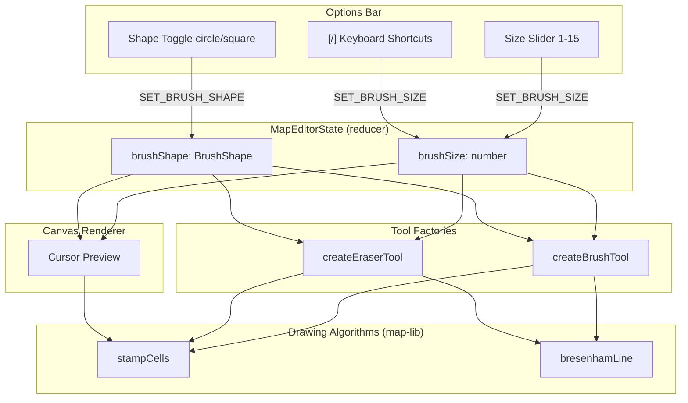

# Brush Thickness and Fill UI Design Document

## Overview

This document defines the technical design for adding configurable brush thickness/size (1-15 cell diameter), brush shape toggle (circle/square), fill tool button in the options bar, multi-cell cursor preview on the canvas, and keyboard shortcuts for brush size adjustment to the Nookstead genmap map editor. The eraser tool shares the same `brushSize` and `brushShape` settings as the brush tool.

## Design Summary (Meta)

```yaml
design_type: "extension"
risk_level: "low"
complexity_level: "low"
complexity_rationale: "N/A - straightforward UI extension with a single new pure algorithm (stampCells) and plumbing changes to pass two new state fields through existing tool/renderer interfaces."
main_constraints:
  - "Zero-build TS source pattern: map-lib exports .ts directly, no compile step"
  - "No browser/DOM dependencies in map-lib (pure algorithms)"
  - "Immutability: never mutate inputs, return new objects/arrays"
  - "Existing tool factory pattern (ToolHandlers) must be preserved"
  - "Existing dedup via Map<string, CellPatchEntry> handles overlapping stamps"
biggest_risks:
  - "Performance of large brush stamps (diameter 15) during fast drags"
unknowns: []
```

## Background and Context

### Prerequisite ADRs

- **ADR-0011** (accepted): Autotile routing architecture -- RetileEngine-integrated commands, CellPatchEntry format. Brush/eraser tools already use `RoutingPaintCommand` with `CellPatchEntry[]`.
- **ADR-0010** (accepted): Map-lib algorithm extraction -- established zero-build pattern, module boundaries, and the `drawing-algorithms.ts` location for pure grid algorithms.
- **adr-006-map-editor-architecture.md**: Map editor architecture including tool factory pattern and reducer-based state management.

No common ADRs (`ADR-COMMON-*`) exist in the project.

### Agreement Checklist

#### Scope
- [x] Add `brushSize` (1-15, default 1) and `brushShape` ('circle' | 'square', default 'circle') to `MapEditorState`
- [x] Add `SET_BRUSH_SIZE`, `ADJUST_BRUSH_SIZE`, and `SET_BRUSH_SHAPE` actions to `MapEditorAction`
- [x] Add `stampCells()` pure algorithm to `drawing-algorithms.ts`
- [x] Modify brush and eraser tools to use `stampCells` for multi-cell painting
- [x] Add brush size slider + shape toggle to options bar for brush/eraser tools
- [x] Add fill tool label in options bar (backend already implemented)
- [x] Add `[` / `]` keyboard shortcuts for brush size adjustment
- [x] Replace single-cell cursor highlight with multi-cell stamp preview for brush/eraser

#### Non-Scope (Explicitly not changing)
- [x] Fill tool logic (`floodFill`, `RoutingFillCommand`) -- backend already fully implemented
- [x] Rectangle tool -- no brush size concept
- [x] Zone tools, object-place tool -- unrelated
- [x] RetileEngine, routing pipeline, autotile computation -- unchanged
- [x] Undo/redo mechanism -- `RoutingPaintCommand` already handles multi-cell patches
- [x] Canvas renderer tile/object rendering -- only cursor highlight section changes

#### Constraints
- [x] Parallel operation: No (additive change, no migration needed)
- [x] Backward compatibility: Required -- `brushSize=1` must produce identical behavior to current single-cell painting
- [x] Performance measurement: Not required -- max stamp is 225 cells, well within frame budget

### Problem to Solve

The brush and eraser tools currently only paint one cell at a time (or one cell per Bresenham line point). For large maps (64x64, 128x128, 256x256), painting terrain one cell at a time is tedious and slow. Users need adjustable brush size to paint larger areas efficiently.

Additionally, the fill tool has a fully working backend (`floodFill` + `RoutingFillCommand`) and is selectable via keyboard shortcut (F), but has no visible button or label in the options bar UI, making it non-discoverable.

### Current Challenges

- **Single-cell painting only**: Brush and eraser paint exactly one cell per point, requiring many strokes for large areas.
- **No visual feedback for brush size**: The cursor highlight is always a single cell.
- **Fill tool not discoverable**: No UI affordance in the options bar; only accessible via keyboard shortcut.

### Requirements

#### Functional Requirements

- FR1: Brush and eraser tools paint a configurable area (1-15 cell diameter) per stroke point
- FR2: Brush shape can be toggled between circle and square
- FR3: Options bar shows brush size slider and shape toggle when brush or eraser is active
- FR4: Options bar shows "Fill" label when fill tool is active
- FR5: Canvas cursor preview shows the full brush stamp area instead of a single cell
- FR6: `[` and `]` keyboard shortcuts decrement/increment brush size
- FR7: Eraser shares the same brush size and shape settings as the brush tool

#### Non-Functional Requirements

- **Performance**: Max brush diameter 15 = max 225 cells per stamp. With Bresenham line interpolation during fast drags, the dedup `Map<string, CellPatchEntry>` already prevents redundant computation. No measurable impact expected.
- **Maintainability**: `stampCells` is a pure function in `drawing-algorithms.ts`, independently testable.

## Acceptance Criteria (AC) - EARS Format

### FR1: Multi-cell brush/eraser painting

- [ ] **When** the user paints with brush tool at brushSize=5 and brushShape='circle', the system shall paint all cells within a circle of diameter 5 centered on the cursor tile
- [ ] **When** the user paints with eraser tool at brushSize=5, the system shall erase all cells within the same stamp pattern
- [ ] **When** brushSize=1, the system shall paint exactly one cell (backward compatible with current behavior)
- [ ] **When** the user drags the brush across the canvas, the system shall apply `stampCells` at each Bresenham line point and deduplicate via the existing `Map<string, CellPatchEntry>`

### FR2: Brush shape toggle

- [ ] **When** the user selects 'square' brush shape with brushSize=5, the system shall paint a 5x5 square area
- [ ] **When** the user selects 'circle' brush shape with brushSize=5, the system shall paint all cells where `dx*dx + dy*dy <= r*r` (r = floor(5/2) = 2)

### FR3: Options bar brush controls

- [ ] **While** the active tool is 'brush' or 'eraser', the options bar shall display a brush size slider (range 1-15) and a shape toggle (circle/square icons)
- [ ] **While** the active tool is 'fill', 'rectangle', or any zone/object tool, the options bar shall not display brush controls

### FR4: Fill tool label

- [ ] **While** the active tool is 'fill', the options bar shall display "Fill" as the tool label

### FR5: Cursor preview

- [ ] **While** the active tool is 'brush' or 'eraser' and cursorTile is within map bounds, the system shall highlight all cells in the stamp area with `rgba(255, 255, 255, 0.15)` fill and outline the outer boundary with `rgba(255, 255, 255, 0.5)` stroke
- [ ] **While** the active tool is not 'brush' or 'eraser', the system shall show the current single-cell cursor highlight

### FR6: Keyboard shortcuts

- [ ] **When** the user presses `]` while no input is focused, the system shall increment brushSize by 1 (clamped to 15)
- [ ] **When** the user presses `[` while no input is focused, the system shall decrement brushSize by 1 (clamped to 1)

### FR7: Shared brush settings

- [ ] **When** the user changes brushSize while using the brush tool and then switches to eraser, the eraser shall use the same brushSize value
- [ ] The brushSize and brushShape are global editor state properties shared across brush and eraser tools

## Applicable Standards

### Classification Table

| Standard | Type | Source | Impact on Design |
|----------|------|--------|-----------------|
| Prettier single quotes | Explicit | `.prettierrc` | All new code uses single quotes |
| 2-space indent | Explicit | `.editorconfig` | All new code uses 2-space indent |
| Jest test framework | Explicit | `jest.config.cts` | Unit tests for `stampCells` use Jest |
| TypeScript strict mode | Explicit | `tsconfig.base.json` | All types must be explicit, no `any` |
| Zero-build TS source | Explicit | `tsconfig.lib.json` (emitDeclarationOnly) | map-lib exports `.ts` directly |
| Tool factory pattern | Implicit | `tools/brush-tool.ts`, `tools/eraser-tool.ts` | New params added to factory signatures |
| Reducer action pattern | Implicit | `editor-types.ts` MapEditorAction union | New actions follow existing discriminated union pattern |
| Pure algorithm in drawing-algorithms.ts | Implicit | `drawing-algorithms.ts` | `stampCells` goes in this file |
| Existing dedup via Map key | Implicit | `brush-tool.ts` line 28 | Multi-cell stamps reuse this dedup |
| Canvas cursor rendering in world coords | Implicit | `canvas-renderer.ts` lines 206-228 | Stamp preview renders in same save/restore block |

## Existing Codebase Analysis

### Implementation Path Mapping

| Type | Path | Description |
|------|------|-------------|
| Existing | `packages/map-lib/src/types/editor-types.ts` | EditorTool, MapEditorState, MapEditorAction types |
| Existing | `packages/map-lib/src/core/drawing-algorithms.ts` | bresenhamLine, floodFill, rectangleFill |
| Existing | `packages/map-lib/src/index.ts` | Public exports from map-lib |
| Existing | `apps/genmap/src/components/map-editor/tools/brush-tool.ts` | Brush tool factory |
| Existing | `apps/genmap/src/components/map-editor/tools/eraser-tool.ts` | Eraser tool factory |
| Existing | `apps/genmap/src/hooks/use-map-editor.ts` | Reducer + initial state |
| Existing | `apps/genmap/src/components/map-editor/editor-options-bar.tsx` | Options bar UI + keyboard shortcuts |
| Existing | `apps/genmap/src/components/map-editor/canvas-renderer.ts` | Canvas rendering including cursor highlight |
| Existing | `apps/genmap/src/components/map-editor/map-editor-canvas.tsx` | Canvas component, tool handler wiring |
| Existing | `packages/map-lib/src/core/drawing-algorithms.spec.ts` | Tests for drawing algorithms |

### Similar Functionality Search

- **Searched keywords**: "stamp", "brushSize", "brush size", "diameter", "radius" across the codebase.
- **Result**: No existing brush size or stamp functionality found. The only multi-cell drawing is `floodFill` (4-dir BFS) and `rectangleFill` (axis-aligned rect). Neither implements a circular/square stamp pattern.
- **Decision**: New implementation for `stampCells` following the established pattern in `drawing-algorithms.ts`.

### Code Inspection Evidence

#### What Was Examined

| File Inspected | Key Finding | Design Impact |
|---------------|-------------|---------------|
| `packages/map-lib/src/types/editor-types.ts` (full file) | `MapEditorState` has no brushSize/brushShape fields; `MapEditorAction` is a discriminated union | Add new fields + action variants following existing union pattern |
| `packages/map-lib/src/core/drawing-algorithms.ts` (full file) | Pure functions, no state, take dimensions as params, return arrays | `stampCells` follows same pattern: pure, bounds-clipped, returns `Array<{x,y}>` |
| `apps/genmap/src/components/map-editor/tools/brush-tool.ts` (full file) | `createBrushTool(state, dispatch)` -- uses closure vars `paintedCells` Map for dedup, calls `tryPaint(x,y)` per point | Add `brushSize`/`brushShape` params, expand each point via `stampCells` before `tryPaint` |
| `apps/genmap/src/components/map-editor/tools/eraser-tool.ts` (full file) | Identical structure to brush-tool; `tryErase(x,y)` with `erasedCells` Map dedup | Same modification as brush-tool |
| `apps/genmap/src/hooks/use-map-editor.ts:121-146` | `createInitialState()` returns `activeTool: 'brush'`, no brushSize | Add `brushSize: 1` and `brushShape: 'circle'` to initial state |
| `apps/genmap/src/hooks/use-map-editor.ts:282-288` | Reducer `SET_TOOL` case is a simple spread | Add `SET_BRUSH_SIZE` and `SET_BRUSH_SHAPE` cases following same pattern |
| `apps/genmap/src/components/map-editor/editor-options-bar.tsx:122-180` | Keyboard shortcuts in `useEffect`, tool-specific UI via conditionals | Add `[`/`]` to keydown handler, add conditional UI for brush/eraser tools |
| `apps/genmap/src/components/map-editor/canvas-renderer.ts:206-228` | Single-cell cursor highlight: fill + stroke one tileSize rect in world coords | Replace with `stampCells` loop for multi-cell highlight |
| `apps/genmap/src/components/map-editor/map-editor-canvas.tsx:220-270` | `useMemo` creates tool handlers via switch; passes `state` and `dispatch` | Pass `state.brushSize` and `state.brushShape` to brush/eraser factories |
| `packages/map-lib/src/core/drawing-algorithms.spec.ts` (full file) | Tests use `makeGrid`/`makeLayer` helpers, follow describe/it pattern | Add `describe('stampCells', ...)` in same file |

#### Key Findings

- The existing dedup mechanism in brush/eraser tools (`Map<string, CellPatchEntry>`) already handles the case where multiple overlapping stamps produce duplicate cell entries. No changes needed to dedup logic.
- The `RoutingPaintCommand` already accepts `CellPatchEntry[]` of arbitrary size. Multi-cell stamps simply produce a larger array -- no command changes needed.
- The canvas renderer cursor highlight is drawn inside the `ctx.save()/ctx.restore()` block (world coordinates), so multi-cell stamp preview uses the same coordinate system.
- Tool handler factories are recreated via `useMemo` whenever `state.activeTool`, `state.activeMaterialKey`, or `state.activeLayerIndex` changes. Adding `state.brushSize` and `state.brushShape` to the dependency array ensures tool handlers pick up size changes.

#### How Findings Influence Design

- `stampCells` returns `Array<{x, y}>` (same type as `bresenhamLine`) for seamless integration.
- Brush/eraser tool factories gain two new parameters rather than reading from `state` to keep the dependency explicit and the factory signature clear.
- Cursor preview reuses `stampCells` to generate the same cell set that painting would produce, ensuring visual accuracy.

## Design

### Change Impact Map

```yaml
Change Target: Brush/eraser tool painting and cursor preview
Direct Impact:
  - packages/map-lib/src/types/editor-types.ts (add BrushShape type, brushSize/brushShape fields, 2 actions)
  - packages/map-lib/src/core/drawing-algorithms.ts (add stampCells function)
  - packages/map-lib/src/index.ts (export stampCells, BrushShape)
  - apps/genmap/src/components/map-editor/tools/brush-tool.ts (use stampCells in tryPaint loop)
  - apps/genmap/src/components/map-editor/tools/eraser-tool.ts (use stampCells in tryErase loop)
  - apps/genmap/src/hooks/use-map-editor.ts (add brushSize/brushShape to initial state + reducer)
  - apps/genmap/src/components/map-editor/editor-options-bar.tsx (UI + keyboard shortcuts)
  - apps/genmap/src/components/map-editor/canvas-renderer.ts (multi-cell cursor preview)
  - apps/genmap/src/components/map-editor/map-editor-canvas.tsx (pass brushSize/brushShape to tools + renderer)
Indirect Impact:
  - None - all changes are additive; existing data formats and APIs unchanged
No Ripple Effect:
  - RetileEngine, routing pipeline, autotile computation (unchanged)
  - Fill tool, rectangle tool (unchanged)
  - Zone tools, object-place tool (unchanged)
  - Canvas layer/tile rendering (unchanged, only cursor highlight section modified)
  - Undo/redo stack structure (unchanged)
  - Save/load API (brushSize/brushShape are ephemeral UI state, not persisted)
```

### Architecture Overview



### Data Flow

```
User drags brush on canvas
  -> MapEditorCanvas.handlePointerMove dispatches tile coords
  -> toolHandlers.onMouseMove(tile) called on brush/eraser tool
  -> bresenhamLine(lastTile, currentTile) returns interpolated points
  -> For each point: stampCells(pt.x, pt.y, brushSize, brushShape, width, height)
  -> For each stamp cell: tryPaint(x, y) adds to paintedCells Map (dedup by "x,y" key)
  -> On mouseUp: RoutingPaintCommand(Array.from(paintedCells.values()), engine)
  -> dispatch({ type: 'PUSH_COMMAND', command })

User moves cursor (no click)
  -> MapEditorCanvas.handlePointerMove sets cursorTile state
  -> renderMapCanvas receives cursorTile + brushSize + brushShape
  -> Calls stampCells(cursorTile.x, cursorTile.y, brushSize, brushShape, width, height)
  -> Highlights each returned cell with rgba fill + outer boundary stroke
```

### Integration Points List

| Integration Point | Location | Old Implementation | New Implementation | Switching Method |
|-------------------|----------|-------------------|-------------------|------------------|
| Brush tool stamp | `brush-tool.ts` `tryPaint` call site | `tryPaint(tile.x, tile.y)` single cell | `stampCells(...)` then `tryPaint` each | Direct code change |
| Eraser tool stamp | `eraser-tool.ts` `tryErase` call site | `tryErase(tile.x, tile.y)` single cell | `stampCells(...)` then `tryErase` each | Direct code change |
| Cursor highlight | `canvas-renderer.ts` cursor section | Single cell fillRect + strokeRect | Loop over `stampCells(...)` result | Direct code change |
| State initialization | `use-map-editor.ts` `createInitialState` | No brushSize/brushShape | Add `brushSize: 1`, `brushShape: 'circle'` | Direct code change |
| Reducer actions | `use-map-editor.ts` `mapEditorReducer` | No SET_BRUSH_SIZE/SET_BRUSH_SHAPE cases | Add three new cases (SET_BRUSH_SIZE, ADJUST_BRUSH_SIZE, SET_BRUSH_SHAPE) | Direct code change |
| Tool factory wiring | `map-editor-canvas.tsx` `useMemo` | `createBrushTool(state, dispatch)` | `createBrushTool(state, dispatch, state.brushSize, state.brushShape)` | Direct code change |

### Main Components

#### Component 1: `stampCells` (new pure algorithm)

- **Responsibility**: Given a center cell, brush size, brush shape, and map bounds, compute all cells that fall within the stamp area. Bounds-clipped.
- **Interface**: `stampCells(cx, cy, brushSize, shape, width, height): Array<{x: number; y: number}>`
- **Dependencies**: None (pure function, no imports)

#### Component 2: Brush/Eraser Tool Modifications

- **Responsibility**: Expand each paint/erase point from a single cell to a stamp area using `stampCells`, then feed each cell into the existing `tryPaint`/`tryErase` dedup mechanism.
- **Interface**: Factory signatures gain `brushSize: number` and `brushShape: BrushShape` parameters.
- **Dependencies**: `stampCells` from `@nookstead/map-lib`, existing `bresenhamLine`, `RoutingPaintCommand`.

#### Component 3: Options Bar UI Extensions

- **Responsibility**: Show brush size slider and shape toggle for brush/eraser tools. Handle `[`/`]` keyboard shortcuts.
- **Interface**: Reads `state.brushSize` and `state.brushShape`, dispatches `SET_BRUSH_SIZE` and `SET_BRUSH_SHAPE` actions.
- **Dependencies**: `MapEditorState`, `MapEditorAction`, existing `dispatch`.

#### Component 4: Canvas Cursor Preview

- **Responsibility**: Replace single-cell cursor highlight with multi-cell stamp preview matching the current brush size and shape.
- **Interface**: `renderMapCanvas` receives `brushSize`, `brushShape`, and `activeTool` to decide preview mode.
- **Dependencies**: `stampCells` from `@nookstead/map-lib`.

### Contract Definitions

```typescript
// New type in editor-types.ts
export type BrushShape = 'circle' | 'square';

// New fields in MapEditorState
interface MapEditorState {
  // ... existing fields ...
  brushSize: number;       // 1-15, default 1
  brushShape: BrushShape;  // default 'circle'
}

// New action variants in MapEditorAction
type MapEditorAction =
  // ... existing variants ...
  | { type: 'SET_BRUSH_SIZE'; size: number }
  | { type: 'SET_BRUSH_SHAPE'; shape: BrushShape }
  | { type: 'ADJUST_BRUSH_SIZE'; delta: number };

// New function in drawing-algorithms.ts
export function stampCells(
  cx: number,
  cy: number,
  brushSize: number,
  shape: BrushShape,
  width: number,
  height: number,
): Array<{ x: number; y: number }>;

// Modified tool factory signatures
export function createBrushTool(
  state: MapEditorState,
  dispatch: Dispatch<MapEditorAction>,
  brushSize: number,
  brushShape: BrushShape,
): ToolHandlers;

export function createEraserTool(
  state: MapEditorState,
  dispatch: Dispatch<MapEditorAction>,
  brushSize: number,
  brushShape: BrushShape,
): ToolHandlers;

// Modified renderMapCanvas signature
export function renderMapCanvas(
  ctx: CanvasRenderingContext2D,
  state: MapEditorState,
  tilesetImages: Map<string, HTMLImageElement>,
  camera: Camera,
  config: CanvasConfig,
  cursorTile: { x: number; y: number } | null,
  previewRect: PreviewRect | null,
  objectRenderData?: Map<string, ObjectRenderEntry>,
  brushPreview?: { brushSize: number; brushShape: BrushShape; activeTool: string },
): void;
```

### Data Contract

#### stampCells

```yaml
Input:
  Type: (cx: number, cy: number, brushSize: number, shape: BrushShape, width: number, height: number)
  Preconditions:
    - cx, cy are integer coordinates (may be out of bounds -- OOB cells are clipped)
    - brushSize is integer in [1, 15]
    - shape is 'circle' or 'square'
    - width, height > 0
  Validation: Bounds clipping applied internally; no external validation needed

Output:
  Type: Array<{ x: number; y: number }>
  Guarantees:
    - All returned cells satisfy 0 <= x < width and 0 <= y < height
    - No duplicate entries
    - When brushSize=1, returns exactly [{x: cx, y: cy}] if in bounds, or [] if OOB
    - Circle: includes cells where (dx*dx + dy*dy) <= r*r, where r = Math.floor(brushSize / 2)
    - Square: includes cells in [cx-r, cx+r] x [cy-r, cy+r], where r = Math.floor(brushSize / 2)
  On Error: Returns empty array if center is fully OOB and brush does not overlap map

Invariants:
  - Pure function: no side effects, same input always produces same output
  - Output length <= brushSize * brushSize (for square) or <= pi*r*r+1 (for circle)
```

#### SET_BRUSH_SIZE / SET_BRUSH_SHAPE

```yaml
Input:
  SET_BRUSH_SIZE: { type: 'SET_BRUSH_SIZE'; size: number }
    Preconditions: size is clamped to [1, 15] in the reducer
  SET_BRUSH_SHAPE: { type: 'SET_BRUSH_SHAPE'; shape: BrushShape }
    Preconditions: shape is 'circle' or 'square'

Output:
  New MapEditorState with updated brushSize or brushShape

Invariants:
  - brushSize is always an integer in [1, 15]
  - brushShape is always 'circle' or 'square'
  - Changing brush settings does not trigger isDirty (these are ephemeral UI state)
```

### Data Representation Decisions

| Data Structure | Decision | Rationale |
|---|---|---|
| `BrushShape` | **New** dedicated type alias | No existing type represents brush shape; `'circle' | 'square'` is a new domain concept |
| `brushSize` / `brushShape` fields | **Extend** existing `MapEditorState` | These are editor UI state, same as `activeTool` and `activeMaterialKey`; extending is the natural fit |
| `SET_BRUSH_SIZE` / `SET_BRUSH_SHAPE` actions | **Extend** existing `MapEditorAction` union | Follows the exact same discriminated union pattern as all other actions |
| `stampCells` return type | **Reuse** existing `Array<{x: number; y: number}>` | Same return type as `bresenhamLine`, enabling seamless composition |

### Integration Boundary Contracts

```yaml
Boundary: stampCells -> brush-tool / eraser-tool
  Input: Center tile coordinates, brushSize, brushShape, map dimensions
  Output: Array of {x, y} cell coordinates (sync, immediate)
  On Error: Empty array for fully OOB stamps

Boundary: Options bar -> Reducer
  Input: SET_BRUSH_SIZE action with size number, SET_BRUSH_SHAPE action with shape string
  Output: Updated state via React reducer dispatch (sync within React cycle)
  On Error: Invalid size clamped in reducer; invalid shape ignored (TypeScript prevents at compile time)

Boundary: Reducer state -> Canvas renderer
  Input: brushSize, brushShape, activeTool passed via brushPreview parameter
  Output: Visual cursor preview rendered on canvas (sync, within rAF)
  On Error: If stampCells returns empty array, no preview rendered (graceful degradation)
```

### Field Propagation Map

```yaml
fields:
  - name: "brushSize"
    origin: "User interaction (slider, keyboard shortcut)"
    transformations:
      - layer: "Options Bar (UI)"
        type: "number (slider value or key event)"
        validation: "dispatched as raw number"
      - layer: "Reducer"
        type: "number in MapEditorState"
        transformation: "clamped to [1, 15] via Math.max(1, Math.min(15, size))"
      - layer: "Tool Factory (brush-tool, eraser-tool)"
        type: "number parameter"
        transformation: "passed through to stampCells as-is"
      - layer: "Canvas Renderer"
        type: "number in brushPreview param"
        transformation: "passed through to stampCells for cursor preview"
    destination: "stampCells function / cursor preview rendering"
    loss_risk: "none"

  - name: "brushShape"
    origin: "User interaction (shape toggle button)"
    transformations:
      - layer: "Options Bar (UI)"
        type: "BrushShape literal"
        validation: "dispatched as typed literal"
      - layer: "Reducer"
        type: "BrushShape in MapEditorState"
        transformation: "stored as-is"
      - layer: "Tool Factory"
        type: "BrushShape parameter"
        transformation: "passed through to stampCells as-is"
      - layer: "Canvas Renderer"
        type: "BrushShape in brushPreview param"
        transformation: "passed through to stampCells for cursor preview"
    destination: "stampCells function / cursor preview rendering"
    loss_risk: "none"
```

### Interface Change Impact Analysis

| Existing Operation | New Operation | Conversion Required | Adapter Required | Compatibility Method |
|-------------------|---------------|-------------------|------------------|---------------------|
| `createBrushTool(state, dispatch)` | `createBrushTool(state, dispatch, brushSize, brushShape)` | Yes (signature change) | Not Required | Update all call sites (only 1 in map-editor-canvas.tsx) |
| `createEraserTool(state, dispatch)` | `createEraserTool(state, dispatch, brushSize, brushShape)` | Yes (signature change) | Not Required | Update all call sites (only 1 in map-editor-canvas.tsx) |
| `renderMapCanvas(...7 params)` | `renderMapCanvas(...7 params, objectRenderData?, brushPreview?)` | No (additive optional param) | Not Required | New optional param appended at end |
| `MapEditorState` (no brushSize) | `MapEditorState` (with brushSize, brushShape) | No (additive fields) | Not Required | New fields with defaults in initial state |
| `MapEditorAction` (no SET_BRUSH_*) | `MapEditorAction` (with SET_BRUSH_SIZE, SET_BRUSH_SHAPE) | No (additive variants) | Not Required | New union members added |

### Error Handling

- **Out-of-bounds brush stamp**: `stampCells` clips all cells to `[0, width) x [0, height)`. No errors thrown.
- **Invalid brushSize in reducer**: `SET_BRUSH_SIZE` clamps to `[1, 15]` -- values outside range are silently corrected.
- **Missing brushPreview param in renderer**: Optional parameter defaults to `undefined`, falling back to single-cell cursor highlight.

### Logging and Monitoring

No additional logging required. The existing `[PUSH_COMMAND]` debug logs in the reducer already capture the number of painted cells, which will naturally increase with larger brush sizes.

## Implementation Plan

### Implementation Approach

**Selected Approach**: Vertical Slice (Feature-driven)

**Selection Reason**: This feature has low inter-module dependency complexity. The core algorithm (`stampCells`) has zero dependencies, the type changes are purely additive, and each modified file can be updated independently. A vertical slice delivers testable value at each step: (1) pure algorithm + tests, (2) state/reducer wiring, (3) tool integration, (4) UI/preview.

### Technical Dependencies and Implementation Order

#### Required Implementation Order

1. **Types + `stampCells` algorithm** (map-lib)
   - Technical Reason: All other changes depend on `BrushShape` type and `stampCells` function
   - Dependent Elements: Tool factories, reducer, options bar, canvas renderer

2. **Reducer + initial state** (genmap app)
   - Technical Reason: UI components and tools need `brushSize`/`brushShape` in state and SET_BRUSH_* actions
   - Prerequisites: Types from step 1

3. **Tool factory modifications** (genmap app)
   - Technical Reason: Painting behavior must use `stampCells` before UI can meaningfully test it
   - Prerequisites: `stampCells` from step 1, state from step 2

4. **Options bar UI + keyboard shortcuts** (genmap app)
   - Technical Reason: User-facing controls that dispatch SET_BRUSH_* actions
   - Prerequisites: Reducer from step 2

5. **Canvas cursor preview** (genmap app)
   - Technical Reason: Visual feedback that depends on `stampCells` and state fields
   - Prerequisites: `stampCells` from step 1, state from step 2

6. **Canvas component wiring** (genmap app)
   - Technical Reason: Pass new state fields to tool factories and renderer
   - Prerequisites: Steps 3, 4, 5

### Integration Points

**Integration Point 1: stampCells -> Tool Factories**
- Components: `drawing-algorithms.ts` -> `brush-tool.ts` / `eraser-tool.ts`
- Verification: Unit test `stampCells` independently; then verify brush tool with brushSize > 1 produces correct number of `CellPatchEntry` items in the paintedCells Map

**Integration Point 2: Reducer -> Options Bar**
- Components: `use-map-editor.ts` -> `editor-options-bar.tsx`
- Verification: Verify slider dispatches SET_BRUSH_SIZE and state.brushSize updates; verify `[`/`]` keys work

**Integration Point 3: State -> Canvas Renderer**
- Components: `use-map-editor.ts` -> `canvas-renderer.ts` via `map-editor-canvas.tsx`
- Verification: Visual verification that cursor preview matches actual paint area

### Migration Strategy

No migration needed. All changes are additive:
- `brushSize: 1` default produces identical behavior to current implementation
- `brushShape: 'circle'` is the default (with size 1, circle and square are identical)
- New optional `brushPreview` parameter in `renderMapCanvas` defaults to `undefined` (single-cell highlight)

## Detailed Implementation Specification

### 1. Type Changes (`packages/map-lib/src/types/editor-types.ts`)

Add the `BrushShape` type alias near the top of the file (after `EditorTool`):

```typescript
/** Brush shape for painting tools. */
export type BrushShape = 'circle' | 'square';
```

Add two new fields to `MapEditorState` in the "Editor UI state" section:

```typescript
// Editor UI state
activeLayerIndex: number;
activeTool: EditorTool;
activeMaterialKey: string;
brushSize: number;       // 1-15, default 1
brushShape: BrushShape;  // default 'circle'
```

Add two new action variants to `MapEditorAction`:

```typescript
| { type: 'SET_BRUSH_SIZE'; size: number }
| { type: 'ADJUST_BRUSH_SIZE'; delta: number }
| { type: 'SET_BRUSH_SHAPE'; shape: BrushShape }
```

### 2. `stampCells` Algorithm (`packages/map-lib/src/core/drawing-algorithms.ts`)

```typescript
import type { BrushShape } from '../types/editor-types';

/**
 * Compute all cells within a brush stamp centered on (cx, cy).
 *
 * Circle: includes cells where dx*dx + dy*dy <= r*r (filled disc).
 * Square: includes cells in [cx-r, cx+r] x [cy-r, cy+r].
 *
 * All returned coordinates are clipped to [0, width) x [0, height).
 * When brushSize=1, returns [{x: cx, y: cy}] if in bounds, or [] if OOB.
 */
export function stampCells(
  cx: number,
  cy: number,
  brushSize: number,
  shape: BrushShape,
  width: number,
  height: number,
): Array<{ x: number; y: number }> {
  const r = Math.floor(brushSize / 2);
  const rSq = r * r;
  const cells: Array<{ x: number; y: number }> = [];

  for (let dy = -r; dy <= r; dy++) {
    for (let dx = -r; dx <= r; dx++) {
      if (shape === 'circle' && dx * dx + dy * dy > rSq) continue;

      const x = cx + dx;
      const y = cy + dy;
      if (x >= 0 && x < width && y >= 0 && y < height) {
        cells.push({ x, y });
      }
    }
  }

  return cells;
}
```

**Note on even brush sizes**: When `brushSize` is even (e.g., 4), `r = Math.floor(4/2) = 2`, which produces a 5x5 bounding box (`-2..+2`). This means even sizes produce the same stamp as `brushSize+1`. This is intentional and consistent with most pixel art editors where the stamp is always centered on a cell. The effective painted area for brush sizes 1-15:

| brushSize | r | Effective diameter (square) | Cell count (square) | Cell count (circle) |
|-----------|---|---------------------------|--------------------|--------------------|
| 1 | 0 | 1 | 1 | 1 |
| 2 | 1 | 3 | 9 | 5 |
| 3 | 1 | 3 | 9 | 5 |
| 4 | 2 | 5 | 25 | 13 |
| 5 | 2 | 5 | 25 | 13 |
| ... | | | | |
| 14 | 7 | 15 | 225 | ~149 |
| 15 | 7 | 15 | 225 | ~149 |

### 3. Export Updates (`packages/map-lib/src/index.ts`)

Add to the editor-types export block:

```typescript
export type { BrushShape } from './types/editor-types';
```

Add to the drawing-algorithms export:

```typescript
export { bresenhamLine, floodFill, rectangleFill, stampCells } from './core/drawing-algorithms';
```

### 4. Reducer Changes (`apps/genmap/src/hooks/use-map-editor.ts`)

In `createInitialState()`, add to the "Editor UI state" section:

```typescript
brushSize: 1,
brushShape: 'circle' as const,
```

In `mapEditorReducer`, add three new cases:

```typescript
case 'SET_BRUSH_SIZE':
  return {
    ...state,
    brushSize: Math.max(1, Math.min(15, Math.round(action.size))),
  };

case 'ADJUST_BRUSH_SIZE':
  return {
    ...state,
    brushSize: Math.max(1, Math.min(15, state.brushSize + action.delta)),
  };

case 'SET_BRUSH_SHAPE':
  return { ...state, brushShape: action.shape };
```

### 5. Brush Tool Modification (`apps/genmap/src/components/map-editor/tools/brush-tool.ts`)

Change the factory signature and import:

```typescript
import { bresenhamLine, stampCells, RoutingPaintCommand } from '@nookstead/map-lib';
import type { BrushShape } from '@nookstead/map-lib';

export function createBrushTool(
  state: MapEditorState,
  dispatch: Dispatch<MapEditorAction>,
  brushSize: number,
  brushShape: BrushShape,
): ToolHandlers {
```

In `onMouseDown`, replace `tryPaint(tile.x, tile.y)` with:

```typescript
const cells = stampCells(tile.x, tile.y, brushSize, brushShape, state.width, state.height);
for (const c of cells) {
  tryPaint(c.x, c.y);
}
```

In `onMouseMove`, replace the inner loop:

```typescript
const points = bresenhamLine(lastTile.x, lastTile.y, tile.x, tile.y);
for (const pt of points) {
  const cells = stampCells(pt.x, pt.y, brushSize, brushShape, state.width, state.height);
  for (const c of cells) {
    tryPaint(c.x, c.y);
  }
}
```

### 6. Eraser Tool Modification (`apps/genmap/src/components/map-editor/tools/eraser-tool.ts`)

Identical changes as brush tool: add `brushSize` and `brushShape` parameters, use `stampCells` in `onMouseDown` and `onMouseMove`. The `tryErase` function itself does not change.

### 7. Options Bar UI (`apps/genmap/src/components/map-editor/editor-options-bar.tsx`)

Add import for `BrushShape`:

```typescript
import type { BrushShape } from '@nookstead/map-lib';
```

Add to the tool-specific section (after the tool label, before the zone selector):

```typescript
{/* Brush/eraser controls */}
{(state.activeTool === 'brush' || state.activeTool === 'eraser') && (
  <div className="flex items-center gap-1.5">
    <input
      type="range"
      min={1}
      max={15}
      value={state.brushSize}
      onChange={(e) =>
        dispatch({ type: 'SET_BRUSH_SIZE', size: Number(e.target.value) })
      }
      className="w-24 h-4 accent-primary"
      aria-label="Brush size"
    />
    <span className="text-[11px] tabular-nums w-5 text-center">
      {state.brushSize}
    </span>

    {/* Shape toggle */}
    <div className="flex items-center gap-0.5">
      <Tooltip>
        <TooltipTrigger asChild>
          <Button
            variant="ghost"
            size="icon"
            className={cn('h-6 w-6', state.brushShape === 'circle' && 'bg-accent')}
            onClick={() => dispatch({ type: 'SET_BRUSH_SHAPE', shape: 'circle' })}
            aria-label="Circle brush"
          >
            {/* Simple circle icon using inline SVG or lucide Circle */}
            <svg width="14" height="14" viewBox="0 0 14 14">
              <circle cx="7" cy="7" r="5" fill="none" stroke="currentColor" strokeWidth="1.5" />
            </svg>
          </Button>
        </TooltipTrigger>
        <TooltipContent>Circle Brush</TooltipContent>
      </Tooltip>

      <Tooltip>
        <TooltipTrigger asChild>
          <Button
            variant="ghost"
            size="icon"
            className={cn('h-6 w-6', state.brushShape === 'square' && 'bg-accent')}
            onClick={() => dispatch({ type: 'SET_BRUSH_SHAPE', shape: 'square' })}
            aria-label="Square brush"
          >
            <svg width="14" height="14" viewBox="0 0 14 14">
              <rect x="2" y="2" width="10" height="10" fill="none" stroke="currentColor" strokeWidth="1.5" />
            </svg>
          </Button>
        </TooltipTrigger>
        <TooltipContent>Square Brush</TooltipContent>
      </Tooltip>
    </div>
  </div>
)}
```

Add `[` / `]` keyboard shortcuts in the existing `handleKeyDown` function. Uses `ADJUST_BRUSH_SIZE` with a delta to avoid needing `state.brushSize` in the `useEffect` dependency array (prevents stale closure and unnecessary re-registration):

```typescript
case '[':
  dispatch({ type: 'ADJUST_BRUSH_SIZE', delta: -1 });
  break;
case ']':
  dispatch({ type: 'ADJUST_BRUSH_SIZE', delta: 1 });
  break;
```

No change to the `useEffect` dependency array — `ADJUST_BRUSH_SIZE` is a relative action, the reducer computes the new value.

### 8. Canvas Renderer (`apps/genmap/src/components/map-editor/canvas-renderer.ts`)

Add a `BrushPreview` interface and modify the function signature:

```typescript
import { stampCells, type BrushShape } from '@nookstead/map-lib';

/** Brush preview configuration for multi-cell cursor. */
export interface BrushPreview {
  brushSize: number;
  brushShape: BrushShape;
  activeTool: string;
}
```

Modify `renderMapCanvas` signature to accept optional `brushPreview`:

```typescript
export function renderMapCanvas(
  ctx: CanvasRenderingContext2D,
  state: MapEditorState,
  tilesetImages: Map<string, HTMLImageElement>,
  camera: Camera,
  config: CanvasConfig,
  cursorTile: { x: number; y: number } | null,
  previewRect: PreviewRect | null,
  objectRenderData?: Map<string, ObjectRenderEntry>,
  brushPreview?: BrushPreview,
): void {
```

Replace the cursor highlight section (lines 206-228) with:

```typescript
// Cursor tile highlight
if (
  cursorTile &&
  cursorTile.x >= 0 &&
  cursorTile.x < state.width &&
  cursorTile.y >= 0 &&
  cursorTile.y < state.height
) {
  const isBrushLike =
    brushPreview &&
    (brushPreview.activeTool === 'brush' || brushPreview.activeTool === 'eraser') &&
    brushPreview.brushSize > 1;

  if (isBrushLike) {
    // Multi-cell stamp preview
    const cells = stampCells(
      cursorTile.x,
      cursorTile.y,
      brushPreview.brushSize,
      brushPreview.brushShape,
      state.width,
      state.height,
    );

    // Fill all stamp cells
    ctx.fillStyle = 'rgba(255, 255, 255, 0.15)';
    for (const c of cells) {
      ctx.fillRect(c.x * tileSize, c.y * tileSize, tileSize, tileSize);
    }

    // Outline the outer boundary: for each cell, draw edges that are not shared with another stamp cell
    const cellSet = new Set(cells.map((c) => `${c.x},${c.y}`));
    ctx.strokeStyle = 'rgba(255, 255, 255, 0.5)';
    ctx.lineWidth = 1 / zoom;
    ctx.beginPath();
    for (const c of cells) {
      const px = c.x * tileSize;
      const py = c.y * tileSize;
      // Top edge
      if (!cellSet.has(`${c.x},${c.y - 1}`)) {
        ctx.moveTo(px, py);
        ctx.lineTo(px + tileSize, py);
      }
      // Bottom edge
      if (!cellSet.has(`${c.x},${c.y + 1}`)) {
        ctx.moveTo(px, py + tileSize);
        ctx.lineTo(px + tileSize, py + tileSize);
      }
      // Left edge
      if (!cellSet.has(`${c.x - 1},${c.y}`)) {
        ctx.moveTo(px, py);
        ctx.lineTo(px, py + tileSize);
      }
      // Right edge
      if (!cellSet.has(`${c.x + 1},${c.y}`)) {
        ctx.moveTo(px + tileSize, py);
        ctx.lineTo(px + tileSize, py + tileSize);
      }
    }
    ctx.stroke();
  } else {
    // Single-cell highlight (default for fill, rectangle, zone, object-place tools or brushSize=1)
    ctx.fillStyle = 'rgba(255, 255, 255, 0.15)';
    ctx.fillRect(
      cursorTile.x * tileSize,
      cursorTile.y * tileSize,
      tileSize,
      tileSize,
    );
    ctx.strokeStyle = 'rgba(255, 255, 255, 0.5)';
    ctx.lineWidth = 1 / zoom;
    ctx.strokeRect(
      cursorTile.x * tileSize,
      cursorTile.y * tileSize,
      tileSize,
      tileSize,
    );
  }
}
```

### 9. Canvas Component Wiring (`apps/genmap/src/components/map-editor/map-editor-canvas.tsx`)

In the `useMemo` for `toolHandlers`, update the brush and eraser cases:

```typescript
case 'brush':
  return createBrushTool(state, dispatch, state.brushSize, state.brushShape);
case 'eraser':
  return createEraserTool(state, dispatch, state.brushSize, state.brushShape);
```

Add `state.brushSize` and `state.brushShape` to the `useMemo` dependency array.

In the `render` callback, pass the `brushPreview` parameter to `renderMapCanvas`:

```typescript
renderMapCanvas(
  ctx,
  state,
  tilesetImages,
  camera,
  config,
  cursorTile,
  previewRect,
  objectRenderData,
  { brushSize: state.brushSize, brushShape: state.brushShape, activeTool: state.activeTool },
);
```

### Files to Modify Summary

| File | Changes |
|------|---------|
| `packages/map-lib/src/types/editor-types.ts` | Add `BrushShape` type, `brushSize`/`brushShape` fields to `MapEditorState`, `SET_BRUSH_SIZE`/`SET_BRUSH_SHAPE` to `MapEditorAction` |
| `packages/map-lib/src/core/drawing-algorithms.ts` | Add `stampCells()` function + import `BrushShape` |
| `packages/map-lib/src/index.ts` | Export `stampCells` and `BrushShape` |
| `apps/genmap/src/components/map-editor/tools/brush-tool.ts` | Add `brushSize`/`brushShape` params, use `stampCells` in paint loop |
| `apps/genmap/src/components/map-editor/tools/eraser-tool.ts` | Add `brushSize`/`brushShape` params, use `stampCells` in erase loop |
| `apps/genmap/src/hooks/use-map-editor.ts` | Add `brushSize: 1`/`brushShape: 'circle'` to initial state, add `SET_BRUSH_SIZE`/`SET_BRUSH_SHAPE` reducer cases |
| `apps/genmap/src/components/map-editor/editor-options-bar.tsx` | Brush size slider + shape toggle UI for brush/eraser, `[`/`]` keyboard shortcuts |
| `apps/genmap/src/components/map-editor/canvas-renderer.ts` | Add `BrushPreview` interface, multi-cell cursor preview using `stampCells` |
| `apps/genmap/src/components/map-editor/map-editor-canvas.tsx` | Pass `brushSize`/`brushShape` to tool factories and `renderMapCanvas` |
| `packages/map-lib/src/core/drawing-algorithms.spec.ts` | Add `describe('stampCells', ...)` test suite |

### Performance Considerations

- **Max stamp size**: Diameter 15 produces at most 225 cells (square) or ~177 cells (circle) per stamp.
- **Bresenham interpolation**: Fast drags produce multiple Bresenham points per frame, each expanding to a stamp. Worst case: 50-pixel drag at diameter 15 = ~50 points x 225 cells = 11,250 `tryPaint` calls. The dedup `Map` ensures each cell is processed at most once, so the actual work is bounded by the number of unique cells affected (~500-2000 for a long drag).
- **Cursor preview**: `stampCells` is called once per frame for cursor preview. At max size (225 cells), this is negligible compared to the tile rendering loop.
- **No allocation overhead**: `stampCells` allocates a single array and pushes objects. No intermediate data structures.

## Test Strategy

### Basic Test Design Policy

Tests are derived directly from the acceptance criteria. Each AC maps to at least one test case.

### Unit Tests

Add a `describe('stampCells', ...)` block in `packages/map-lib/src/core/drawing-algorithms.spec.ts`:

```typescript
describe('stampCells', () => {
  // AC: brushSize=1 backward compatibility
  it('should return single cell for brushSize=1 (circle)', () => {
    const cells = stampCells(5, 5, 1, 'circle', 10, 10);
    expect(cells).toEqual([{ x: 5, y: 5 }]);
  });

  it('should return single cell for brushSize=1 (square)', () => {
    const cells = stampCells(5, 5, 1, 'square', 10, 10);
    expect(cells).toEqual([{ x: 5, y: 5 }]);
  });

  // AC: circle shape
  it('should return circle stamp for brushSize=5', () => {
    const cells = stampCells(5, 5, 5, 'circle', 20, 20);
    // r=2, cells where dx^2+dy^2 <= 4
    // Expected: (0,0),(1,0),(-1,0),(0,1),(0,-1),(1,1),(1,-1),(-1,1),(-1,-1),(2,0),(-2,0),(0,2),(0,-2)
    // = 13 cells
    expect(cells).toHaveLength(13);
    // All cells within radius
    for (const c of cells) {
      const dx = c.x - 5;
      const dy = c.y - 5;
      expect(dx * dx + dy * dy).toBeLessThanOrEqual(4);
    }
  });

  // AC: square shape
  it('should return square stamp for brushSize=5', () => {
    const cells = stampCells(5, 5, 5, 'square', 20, 20);
    // r=2, 5x5 = 25 cells
    expect(cells).toHaveLength(25);
    for (const c of cells) {
      expect(c.x).toBeGreaterThanOrEqual(3);
      expect(c.x).toBeLessThanOrEqual(7);
      expect(c.y).toBeGreaterThanOrEqual(3);
      expect(c.y).toBeLessThanOrEqual(7);
    }
  });

  // Boundary clipping
  it('should clip cells to map bounds', () => {
    const cells = stampCells(0, 0, 5, 'square', 10, 10);
    // r=2, would span [-2,2]x[-2,2] but clipped to [0,2]x[0,2] = 9 cells
    expect(cells).toHaveLength(9);
    for (const c of cells) {
      expect(c.x).toBeGreaterThanOrEqual(0);
      expect(c.y).toBeGreaterThanOrEqual(0);
    }
  });

  // Fully OOB
  it('should return empty array when center is fully out of bounds', () => {
    const cells = stampCells(-10, -10, 3, 'circle', 10, 10);
    expect(cells).toHaveLength(0);
  });

  // No duplicates
  it('should return no duplicate entries', () => {
    const cells = stampCells(5, 5, 7, 'circle', 20, 20);
    const keys = cells.map((c) => `${c.x},${c.y}`);
    expect(new Set(keys).size).toBe(keys.length);
  });

  // Even brush size
  it('should handle even brushSize (same stamp as brushSize+1)', () => {
    const cells4 = stampCells(5, 5, 4, 'square', 20, 20);
    const cells5 = stampCells(5, 5, 5, 'square', 20, 20);
    expect(cells4).toEqual(cells5);
  });
});
```

### Integration Tests

No new integration tests needed. The existing `RoutingPaintCommand` tests and `RetileEngine` integration tests verify the pipeline end-to-end with arbitrary `CellPatchEntry[]` inputs. Multi-cell stamps simply produce larger arrays.

### E2E Tests

No automated E2E tests for this feature. Visual verification:
1. Select brush tool, set size to 5, paint on canvas -- verify 5-diameter circle is painted
2. Switch to square shape -- verify square is painted
3. Press `]` three times -- verify size increments to 8
4. Switch to eraser -- verify eraser uses same brush size
5. Verify cursor preview matches actual painted area

## Security Considerations

No security implications. All changes are client-side UI state and pure algorithms. No new API endpoints, no data persistence changes, no authentication changes.

## Future Extensibility

- **Brush pressure sensitivity**: Could modulate `brushSize` based on stylus pressure (if PointerEvent.pressure is available).
- **Custom brush patterns**: `stampCells` could be generalized to accept a `BrushPattern` (e.g., diamond, cross) by adding more shape variants.
- **Brush size per-tool persistence**: Currently `brushSize` is shared. If rectangle or fill tools gain size concepts, per-tool sizes could be stored in a `Record<EditorTool, number>`.

## Alternative Solutions

### Alternative 1: Brush size in tool closure instead of state

- **Overview**: Store `brushSize` inside the tool factory closure rather than in `MapEditorState`.
- **Advantages**: No state/reducer changes needed.
- **Disadvantages**: Brush size would reset when tools are recreated (on every tool switch), keyboard shortcuts could not dispatch actions, and the value would not be accessible for cursor preview rendering.
- **Reason for Rejection**: Brush size needs to persist across tool switches and be visible to multiple components (options bar, canvas renderer, tool factories).

### Alternative 2: Pass full MapEditorState to renderer instead of brushPreview param

- **Overview**: The renderer already receives `state` -- just read `state.brushSize` and `state.brushShape` directly.
- **Advantages**: No new parameter needed.
- **Disadvantages**: Increases coupling between renderer and editor state. The renderer currently reads very specific fields from state (grid, layers, materials, width, height) and uses dedicated parameters for everything else. Adding a small `BrushPreview` object preserves this clean boundary.
- **Reason for Rejection**: The dedicated `brushPreview` parameter follows the existing renderer API design pattern where rendering options are passed as explicit parameters.

## Risks and Mitigation

| Risk | Impact | Probability | Mitigation |
|------|--------|-------------|------------|
| Large brush + fast drag causes frame drops | Low | Low | Dedup Map already limits unique cells; max stamp is 225 cells |
| Even/odd brush size confusion | Low | Medium | Document behavior in code comments; consistent with pixel art editors |
| Keyboard shortcut conflicts with other tools | Low | Low | `[` and `]` are not used by any existing shortcut |

## References

- Existing brush tool implementation: `apps/genmap/src/components/map-editor/tools/brush-tool.ts`
- Existing drawing algorithms: `packages/map-lib/src/core/drawing-algorithms.ts`
- ADR-0011 (autotile routing architecture): `docs/adr/ADR-0011-autotile-routing-architecture.md`
- ADR-0010 (map-lib extraction): `docs/adr/ADR-0010-map-lib-algorithm-extraction.md`

## Update History

| Date | Version | Changes | Author |
|------|---------|---------|--------|
| 2026-02-27 | 1.0 | Initial version | AI Technical Designer |
