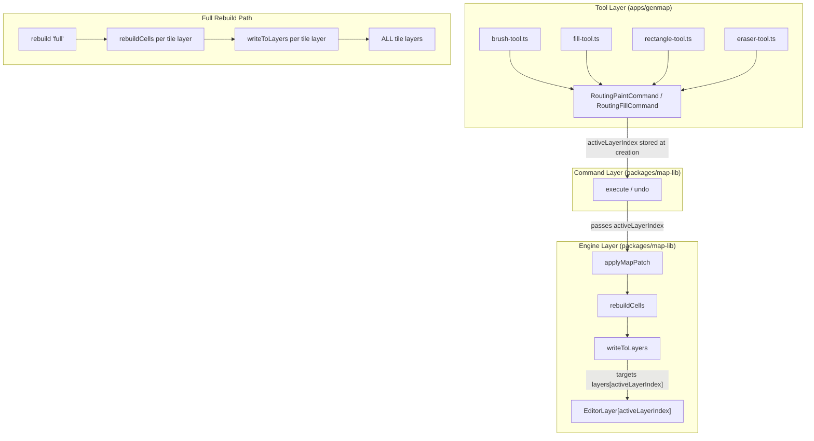

# Multi-Layer Painting and Object Placement Design Document

## Overview

This design document addresses two interconnected defects in the genmap map editor: (1) all drawing tools write rendered frame data exclusively to layer[0] regardless of `activeLayerIndex`, and (2) placed game objects are invisible because `objectRenderData` is never populated. Both issues stem from incomplete data threading through the paint and render pipelines.

## Design Summary (Meta)

```yaml
design_type: "extension"
risk_level: "low"
complexity_level: "low"
complexity_rationale: "Changes are additive optional parameters through an established pipeline. No new state machines, no new async coordination. Low risk because all new parameters default to existing behavior."
main_constraints:
  - "Backward compatibility: all 19 existing spec files must pass without modification"
  - "Undo/redo correctness: layer index must be captured at command creation, not execution"
biggest_risks:
  - "writeToLayers loop for full rebuild could have off-by-one if object layers are interspersed with tile layers"
  - "Shared hook may trigger redundant sprite fetches if not properly memoized"
unknowns:
  - "Whether sprite S3 signed URLs expire during long editing sessions"
  - "Whether future layer types will need different write strategies"
```

## Background and Context

### Prerequisite ADRs

- **ADR-0011: Autotile Routing Architecture** -- Establishes the RetileEngine pipeline (applyMapPatch -> rebuildCells -> writeToLayers) that this design modifies
- **ADR-0012: Multi-Layer Painting Pipeline** -- Documents the three architectural decisions implemented here: activeLayerIndex threading, full-rebuild layer policy, and shared object render data

### Agreement Checklist

#### Scope
- [x] Thread `activeLayerIndex` through: tool -> command constructor -> command.execute -> engine.applyMapPatch -> rebuildCells -> writeToLayers
- [x] Update `RoutingPaintCommand` and `RoutingFillCommand` to store and pass `activeLayerIndex`
- [x] Update all 4 tool files (brush, fill, rectangle, eraser) to pass `state.activeLayerIndex`
- [x] Make `rebuild('full')` write to ALL tile layers
- [x] Create shared `useObjectRenderData` hook for object rendering

#### Non-Scope (Explicitly not changing)
- [x] Grid structure: the shared `Cell[][]` grid is NOT being changed to per-layer grids
- [x] Autotile computation logic: edge resolution, tileset selection, frame computation remain unchanged
- [x] Object layer reducer: `PLACE_OBJECT`, `REMOVE_OBJECT`, `MOVE_OBJECT` actions already work correctly
- [x] GameObjectsPanel internal thumbnail rendering (it will optionally consume the shared hook but its internal implementation is unchanged)

#### Constraints
- [x] Backward compatibility: Required (all new params default to 0)
- [x] Parallel operation: Not applicable (single-user editor)
- [x] Performance measurement: Not required (changes are O(1) per cell, only full rebuild adds O(layers) multiplier)

### Problem to Solve

1. **Broken multi-layer painting**: `writeToLayers()` at line 1125-1144 of `retile-engine.ts` uses `layers.find(l => l.type !== 'object')` to find the FIRST tile layer. It always writes to this layer regardless of which layer the user selected. All four drawing tools (brush, fill, rectangle, eraser) create commands without layer context, and commands call `engine.applyMapPatch()` which also lacks layer context.

2. **Invisible placed objects**: The canvas renderer at line 134 of `canvas-renderer.ts` correctly checks `objectRenderData` and draws placed objects when data is available. However, `page.tsx` never constructs or passes `objectRenderData` to `MapEditorCanvas`. The `GameObjectsPanel` loads sprite images and atlas frames internally but does not expose them. There is no mechanism to populate `objectRenderData` from the fetched sprite/frame data.

### Current Challenges

- The `EditorCommand` interface (`execute(state): state`, `undo(state): state`) passes entire state to commands, but commands must NOT read `activeLayerIndex` from this state during undo (it may have changed since the original operation).
- `GameObjectsPanel` uses internal React state for sprite images and frame data, making them inaccessible to the canvas renderer.

### Requirements

#### Functional Requirements

- FR-1: Drawing tools write frame data to the layer at `activeLayerIndex`
- FR-2: Undo/redo operations write to the layer that was active when the command was created
- FR-3: Full rebuild operations write frame data to all tile layers
- FR-4: Placed game objects are visible on the canvas

#### Non-Functional Requirements

- **Performance**: No measurable regression for single-layer maps (default path unchanged)
- **Maintainability**: All new parameters are optional with defaults; zero impact on existing callers
- **Reliability**: Existing 19 spec files pass without modification

## Acceptance Criteria (AC) - EARS Format

### FR-1: Layer-Targeted Drawing

- [ ] **When** user selects layer[1] and paints with the brush tool, the system shall write frame data and tilesetKey to `layers[1].frames[y][x]` and `layers[1].tilesetKeys[y][x]`
- [ ] **When** user selects layer[1] and uses the fill tool, the system shall write fill results to `layers[1]`
- [ ] **When** user selects layer[1] and uses the rectangle tool, the system shall write rectangle fill results to `layers[1]`
- [ ] **When** user selects layer[1] and uses the eraser tool, the system shall write eraser results to `layers[1]`
- [ ] **If** `activeLayerIndex` is not provided (omitted), **then** the system shall default to writing to layer[0]

### FR-2: Undo/Redo Layer Correctness

- [ ] **When** user paints on layer[1], switches to layer[2], then undoes, the system shall write the undo result to layer[1] (the layer where the paint occurred)
- [ ] **When** user redoes after the above undo, the system shall write the redo result to layer[1]

### FR-3: Full Rebuild All Layers

- [ ] **When** `rebuild(state, 'full')` is called, the system shall write computed frames and tilesetKeys to every tile layer (layers where `type !== 'object'`)
- [ ] **If** no tile layers exist, **then** the system shall return without error

### FR-4: Object Rendering

- [ ] **When** an object is placed on an object layer, the system shall render it on the canvas using sprite/frame data from the shared hook
- [ ] **When** the user hovers with a selected object in `object-place` mode, the system shall display a ghost preview at the cursor position

### Backward Compatibility

- [ ] All 19 existing spec files in `packages/map-lib/src/core/` shall pass without modification

## Existing Codebase Analysis

### Implementation Path Mapping

| Type | Path | Description |
|------|------|-------------|
| Existing | `packages/map-lib/src/core/retile-engine.ts` | `writeToLayers()` at L1125-1144, `applyMapPatch()` at L145, `rebuildCells()` at L458, `rebuild()` at L377 |
| Existing | `packages/map-lib/src/core/routing-commands.ts` | `RoutingPaintCommand` and `RoutingFillCommand` constructors and execute/undo |
| Existing | `apps/genmap/src/components/map-editor/tools/brush-tool.ts` | Creates `RoutingPaintCommand` at L83 |
| Existing | `apps/genmap/src/components/map-editor/tools/fill-tool.ts` | Creates `RoutingFillCommand` at L45 |
| Existing | `apps/genmap/src/components/map-editor/tools/rectangle-tool.ts` | Creates `RoutingPaintCommand` at L86 |
| Existing | `apps/genmap/src/components/map-editor/tools/eraser-tool.ts` | Creates `RoutingPaintCommand` at L85 |
| Existing | `apps/genmap/src/components/map-editor/canvas-renderer.ts` | `renderMapCanvas()` already accepts `objectRenderData` param |
| Existing | `apps/genmap/src/components/map-editor/game-objects-panel.tsx` | Internal sprite/frame loading logic |
| Existing | `apps/genmap/src/app/(editor)/maps/[id]/page.tsx` | `handleObjectPlace` at L125; `MapEditorCanvas` rendered without `objectRenderData` |
| New | `apps/genmap/src/hooks/use-object-render-data.ts` | Shared hook for loading and caching object sprite/frame data |

### Integration Points

- **Integration Target**: `RetileEngine.applyMapPatch()` -> `rebuildCells()` -> `writeToLayers()`
- **Invocation Method**: Optional parameter addition with default value
- **Integration Target**: Tool functions -> Command constructors
- **Invocation Method**: Pass `state.activeLayerIndex` as new constructor argument
- **Integration Target**: `page.tsx` -> `MapEditorCanvas` component
- **Invocation Method**: New `objectRenderData` prop populated by shared hook

### Code Inspection Evidence

| File Inspected | Key Finding | Design Impact |
|---------------|-------------|---------------|
| `retile-engine.ts:1125-1144` (writeToLayers) | Uses `layers.find()` to get first non-object layer; always writes to layer[0] | Must add `activeLayerIndex` param to target specific layer |
| `retile-engine.ts:145-206` (applyMapPatch) | Calls `rebuildCells(newGrid, newLayers, dirtySet, paintedPatches)` without layer context | Must pass `activeLayerIndex` through to rebuildCells |
| `retile-engine.ts:458-713` (rebuildCells) | Calls `writeToLayers(layers, x, y, frameId, renderKey)` at L692 | Must forward `activeLayerIndex` to writeToLayers |
| `retile-engine.ts:377-416` (rebuild) | For `mode === 'full'`, calls same `rebuildCells` path | Full mode must iterate all tile layers |
| `routing-commands.ts:31-39` (RoutingPaintCommand ctor) | Stores only `patches` and `engine`; no layer index | Must add `activeLayerIndex` field |
| `routing-commands.ts:132-139` (RoutingFillCommand ctor) | Same pattern as RoutingPaintCommand | Must add `activeLayerIndex` field |
| `routing-commands.ts:50-73` (execute/undo) | Calls `engine.applyMapPatch(state, mapPatches)` | Must pass stored `activeLayerIndex` |
| `brush-tool.ts:83-86` (onMouseUp) | Creates `new RoutingPaintCommand(patches, engine)` | Must pass `state.activeLayerIndex` |
| `fill-tool.ts:45` | Creates `new RoutingFillCommand(patches, engine)` | Must pass `state.activeLayerIndex` |
| `rectangle-tool.ts:86` | Creates `new RoutingPaintCommand(patches, engine)` | Must pass `state.activeLayerIndex` |
| `eraser-tool.ts:85` | Creates `new RoutingPaintCommand(patches, engine)` | Must pass `state.activeLayerIndex` |
| `canvas-renderer.ts:54` | `objectRenderData?: Map<string, ObjectRenderEntry>` already an optional param | No signature change needed; just need to populate it |
| `canvas-renderer.ts:134-155` | Object layer rendering code already implemented; checks `objectRenderData` map | Rendering logic is complete; only data population is missing |
| `game-objects-panel.tsx:383-458` (loadSpriteData) | Fetches sprites via `/api/sprites/{id}` and frames via `/api/sprites/{id}/frames`; stores in local state | Extract this logic into a reusable hook |
| `page.tsx:533-550` (MapEditorCanvas) | Passes `onObjectPlace` and `selectedObjectId` but NOT `objectRenderData` | Must pass `objectRenderData` from shared hook |
| `map-editor-canvas.tsx:83` | Props interface already declares `objectRenderData?: Map<string, ObjectRenderEntry>` | No component interface change needed |
| `retile-engine.ts:276` (updateTileset) | Calls `writeToLayers` directly to update frame data after tileset change | Must iterate all tile layers (T3a trigger, same all-layers policy as full rebuild) |
| `retile-engine.ts:326-340` (addTileset) | Calls `rebuildAffectedMaterials` -> `rebuildCells` -> `writeToLayers` | Must target all tile layers through rebuildCells (T3b trigger) |
| `retile-engine.ts:299-314` (removeTileset) | Same path as addTileset: `rebuildAffectedMaterials` -> `rebuildCells` -> `writeToLayers` | Must target all tile layers through rebuildCells (T3b trigger) |

### Similar Functionality Search

- **Sprite loading pattern**: `GameObjectsPanel` at line 383-458 already implements the exact sprite/frame loading logic needed. The shared hook must extract this pattern, not duplicate it.
- **Layer writing pattern**: `writeToLayers()` is the single write point. No other code writes to layer frames/tilesetKeys.
- **Decision**: Extract `GameObjectsPanel`'s loading logic into `useObjectRenderData` hook. Reuse existing write point (`writeToLayers`) with added parameter.

## Applicable Standards

### Classification Table

| Standard | Type | Source | Impact on Design |
|----------|------|--------|-----------------|
| Prettier: single quotes, 2-space indent | Explicit | `.prettierrc`, `.editorconfig` | All new code follows formatting |
| ESLint flat config with Nx module boundaries | Explicit | `eslint.config.mjs` | New hook must respect project boundaries |
| TypeScript strict mode, ES2022, bundler resolution | Explicit | `tsconfig.base.json` | All new params typed; no `any` |
| Jest for unit/integration tests | Explicit | `jest.config.cts` | New tests use Jest framework |
| Immutable input state pattern | Implicit | `retile-engine.ts` ("Input state is NEVER mutated") | New code must clone before modifying |
| Optional parameter with default for backward compat | Implicit | Existing pattern in `RetileEngineOptions` (materialPriority, preferences) | New `activeLayerIndex` param follows same pattern |
| EditorCommand interface: execute/undo return new state | Implicit | `editor-types.ts:105-108` | Commands must not mutate input state |
| Tool factory function pattern | Implicit | All tool files return `ToolHandlers` | New hook follows existing React hooks pattern |
| Canvas renderer accepts optional data maps | Implicit | `renderMapCanvas` signature with `objectRenderData?` | Consistent with existing optional params |

## Design

### Change Impact Map

```yaml
Change Target: RetileEngine.writeToLayers()
Direct Impact:
  - packages/map-lib/src/core/retile-engine.ts (method signature + implementation)
  - packages/map-lib/src/core/retile-engine.ts (rebuildCells passes through activeLayerIndex)
  - packages/map-lib/src/core/retile-engine.ts (applyMapPatch passes through activeLayerIndex)
  - packages/map-lib/src/core/retile-engine.ts (rebuild 'full' mode iterates all tile layers)
Indirect Impact:
  - packages/map-lib/src/core/routing-commands.ts (RoutingPaintCommand/RoutingFillCommand gain field)
  - apps/genmap/src/components/map-editor/tools/brush-tool.ts (pass activeLayerIndex to command)
  - apps/genmap/src/components/map-editor/tools/fill-tool.ts (pass activeLayerIndex to command)
  - apps/genmap/src/components/map-editor/tools/rectangle-tool.ts (pass activeLayerIndex to command)
  - apps/genmap/src/components/map-editor/tools/eraser-tool.ts (pass activeLayerIndex to command)
No Ripple Effect:
  - Edge resolver, cell tileset selector, router, graph builder (autotile computation is unchanged)
  - Grid structure (shared Cell[][] is unchanged)
  - Object layer reducer actions (PLACE_OBJECT, REMOVE_OBJECT, MOVE_OBJECT work correctly)
  - Zone system (unrelated to paint pipeline)
  - All 19 existing spec files (backward compatible defaults)

Change Target: Object render data pipeline
Direct Impact:
  - apps/genmap/src/hooks/use-object-render-data.ts (NEW file)
  - apps/genmap/src/app/(editor)/maps/[id]/page.tsx (consume hook, pass to canvas)
Indirect Impact:
  - apps/genmap/src/components/map-editor/game-objects-panel.tsx (optionally refactored to use shared hook)
No Ripple Effect:
  - canvas-renderer.ts (already accepts objectRenderData; no change needed)
  - map-editor-canvas.tsx (already accepts objectRenderData prop; no change needed)
```

### Architecture Overview

The changes thread `activeLayerIndex` through the existing pipeline without altering the pipeline's structure:



### Data Flow

#### Current (Broken) Flow

```
User selects layer[1] and paints
  -> brush-tool creates RoutingPaintCommand(patches, engine)     // NO layer index
  -> command.execute(state)
  -> engine.applyMapPatch(state, patches)                        // NO layer index
  -> rebuildCells(grid, layers, dirtySet, paintedPatches)        // NO layer index
  -> writeToLayers(layers, x, y, frame, key)
  -> layers.find(l => l.type !== 'object')                       // ALWAYS layer[0]
  -> layer[0].frames[y][x] = frame                              // WRONG LAYER
```

#### Fixed Flow

```
User selects layer[1] and paints
  -> brush-tool creates RoutingPaintCommand(patches, engine, 1)  // activeLayerIndex=1
  -> command.execute(state)
  -> engine.applyMapPatch(state, patches, 1)                     // activeLayerIndex=1
  -> rebuildCells(grid, layers, dirtySet, paintedPatches, 1)     // activeLayerIndex=1
  -> writeToLayers(layers, x, y, frame, key, 1)
  -> layers[1].frames[y][x] = frame                             // CORRECT LAYER
```

#### Undo After Layer Switch

```
User painted on layer[1], then switched to layer[2], then presses Undo
  -> command.undo(state)  // state.activeLayerIndex is 2, but command stores 1
  -> engine.applyMapPatch(state, undoPatches, 1)                 // Uses stored index=1
  -> writeToLayers(layers, x, y, frame, key, 1)                 // Writes to layer[1]
```

### Integration Points List

| Integration Point | Location | Old Implementation | New Implementation | Switching Method |
|-------------------|----------|-------------------|-------------------|------------------|
| writeToLayers layer selection | `retile-engine.ts:1125-1144` | `layers.find(l => type !== 'object')` | `layers[activeLayerIndex]` with fallback to find | Optional parameter |
| rebuildCells layer forwarding | `retile-engine.ts:458` | No layer context | Passes `activeLayerIndex` to `writeToLayers` | Optional parameter |
| applyMapPatch layer forwarding | `retile-engine.ts:145` | No layer context | Passes `activeLayerIndex` to `rebuildCells` | Optional parameter |
| rebuild full mode | `retile-engine.ts:377` | Single call to `rebuildCells` | Loop over all tile layers, call `writeToLayers` per layer | Conditional logic in `rebuild` |
| Command constructor | `routing-commands.ts:31` | `constructor(patches, engine)` | `constructor(patches, engine, activeLayerIndex)` | New parameter with default |
| Command execute/undo | `routing-commands.ts:50/84` | `engine.applyMapPatch(state, patches)` | `engine.applyMapPatch(state, patches, this.activeLayerIndex)` | Use stored field |
| Tool -> Command | `brush-tool.ts:83` | `new RoutingPaintCommand(patches, engine)` | `new RoutingPaintCommand(patches, engine, state.activeLayerIndex)` | Pass from state |
| Object render data | `page.tsx:533` | `objectRenderData` not passed | Pass from `useObjectRenderData` hook | New hook + prop |

### Main Components

#### Component 1: RetileEngine (Modified)

- **Responsibility**: Autotile computation pipeline with layer-targeted output
- **Interface Changes**:
  - `applyMapPatch(state, patches, activeLayerIndex?: number)` -- new optional param
  - `writeToLayers(layers, x, y, frameId, tilesetKey, activeLayerIndex?: number)` -- new optional param
  - `rebuild(state, mode, changedCells?, activeLayerIndex?: number)` -- full mode writes to all tile layers
- **Dependencies**: No new dependencies

#### Component 2: RoutingPaintCommand / RoutingFillCommand (Modified)

- **Responsibility**: Reversible paint/fill operations with layer targeting
- **Interface Changes**:
  - Constructor: `constructor(patches, engine, activeLayerIndex?: number)` -- defaults to 0
  - New readonly field: `activeLayerIndex: number`
- **Dependencies**: Passes `activeLayerIndex` to `engine.applyMapPatch()`

#### Component 3: useObjectRenderData (New)

- **Responsibility**: Load and cache sprite images and atlas frame data for game objects
- **Interface**: `useObjectRenderData(objectIds: string[]): Map<string, ObjectRenderEntry>`
- **Dependencies**: Fetches from `/api/sprites/{id}` and `/api/sprites/{id}/frames`

### Interface Change Matrix

| Existing Operation | New Operation | Conversion Required | Adapter Required | Compatibility Method |
|-------------------|---------------|-------------------|------------------|---------------------|
| `applyMapPatch(state, patches)` | `applyMapPatch(state, patches, activeLayerIndex?)` | None | Not Required | Optional param defaults to 0 |
| `writeToLayers(layers, x, y, frame, key)` | `writeToLayers(layers, x, y, frame, key, activeLayerIndex?)` | None | Not Required | Optional param defaults to 0 |
| `rebuildCells(grid, layers, dirty, painted)` | `rebuildCells(grid, layers, dirty, painted, activeLayerIndex?)` | None | Not Required | Optional param defaults to 0 |
| `rebuild(state, mode, changed?)` | `rebuild(state, mode, changed?, activeLayerIndex?)` | None | Not Required | Full mode iterates all tile layers |
| `RoutingPaintCommand(patches, engine)` | `RoutingPaintCommand(patches, engine, activeLayerIndex?)` | None | Not Required | Optional param defaults to 0 |
| `RoutingFillCommand(patches, engine)` | `RoutingFillCommand(patches, engine, activeLayerIndex?)` | None | Not Required | Optional param defaults to 0 |

### Contract Definitions

```typescript
// RetileEngine additions (all existing params unchanged)
applyMapPatch(
  state: MapEditorState,
  patch: ReadonlyArray<MapPatchEntry>,
  activeLayerIndex?: number,        // NEW: defaults to 0
): RetileResult;

rebuild(
  state: MapEditorState,
  mode: 'full' | 'local',
  changedCells?: ReadonlyArray<{ x: number; y: number }>,
  activeLayerIndex?: number,        // NEW: for 'local' mode; 'full' writes all
): RetileResult;

// writeToLayers (private, but shown for design clarity)
private writeToLayers(
  layers: EditorLayer[],
  x: number,
  y: number,
  frameId: number,
  tilesetKey: string,
  activeLayerIndex?: number,        // NEW: defaults to 0
): void;

// Command constructors
class RoutingPaintCommand implements EditorCommand {
  constructor(
    patches: ReadonlyArray<CellPatchEntry>,
    engine: RetileEngine,
    activeLayerIndex?: number,      // NEW: defaults to 0, stored as readonly field
  );
}

class RoutingFillCommand implements EditorCommand {
  constructor(
    patches: ReadonlyArray<CellPatchEntry>,
    engine: RetileEngine,
    activeLayerIndex?: number,      // NEW: defaults to 0, stored as readonly field
  );
}

// New shared hook
function useObjectRenderData(
  objectIds: string[],
): Map<string, ObjectRenderEntry>;

interface ObjectRenderEntry {
  image: HTMLImageElement;
  frameX: number;
  frameY: number;
  frameW: number;
  frameH: number;
}
```

### Data Contract

#### RetileEngine.writeToLayers (modified)

```yaml
Input:
  Type: (layers: EditorLayer[], x: number, y: number, frameId: number, tilesetKey: string, activeLayerIndex?: number)
  Preconditions:
    - layers array is mutable (already cloned by caller)
    - 0 <= x < width, 0 <= y < height
    - activeLayerIndex in range [0, layers.length) OR defaults to 0
  Validation: If activeLayerIndex targets an object layer or is out of bounds, fall back to first tile layer

Output:
  Type: void (mutates layers in place)
  Guarantees:
    - Exactly one tile layer is updated per call (unless full rebuild mode)
    - frames[y][x] and tilesetKeys[y][x] are set

On Error: Silent no-op if no valid tile layer exists (existing behavior preserved)

Note: In full-rebuild mode, the caller (rebuild) iterates all tile layers and calls writeToLayers
  for each, passing the layer index explicitly.

Invariants:
  - Object layers are never written to by writeToLayers
  - Grid state is never modified by writeToLayers
```

#### useObjectRenderData

```yaml
Input:
  Type: objectIds: string[] (unique object IDs present on any object layer)
  Derivation: Derive objectIds by iterating state.layers, filtering layers where type === 'object',
    flatMapping their objects arrays, and collecting unique objectId values. Use useMemo for stability.
  Preconditions: None (empty array is valid)
  Validation: Invalid objectIds are silently skipped

Output:
  Type: Map<string, ObjectRenderEntry>
  Guarantees:
    - Returns entries only for objects with valid sprite+frame data
    - Images are fully loaded (image.complete === true) before being included

On Error: Individual fetch failures are silently skipped; partial results returned

Invariants:
  - Hook output is referentially stable when objectIds are unchanged (useMemo)
  - No side effects outside of network fetches and image loading
```

### Data Representation Decisions

| Data Structure | Decision | Rationale |
|---|---|---|
| `activeLayerIndex` (number) | **Reuse** existing field from `MapEditorState` | Same semantic meaning; just needs to be threaded through the pipeline |
| `ObjectRenderEntry` | **Reuse** existing type from `canvas-renderer.ts` | Already defined and used by the canvas renderer; exact match for our needs |
| Hook return type `Map<string, ObjectRenderEntry>` | **Reuse** existing pattern | `renderMapCanvas` already accepts `Map<string, ObjectRenderEntry>` |

### Field Propagation Map

```yaml
fields:
  - name: "activeLayerIndex"
    origin: "MapEditorState.activeLayerIndex (user UI selection)"
    transformations:
      - layer: "Tool Layer"
        type: "number (from state.activeLayerIndex)"
        validation: "none (trusted from state)"
      - layer: "Command Layer"
        type: "readonly number (stored on command instance)"
        transformation: "captured at creation time, immutable"
      - layer: "Engine Layer (applyMapPatch)"
        type: "number | undefined"
        transformation: "defaults to 0 if undefined"
      - layer: "Engine Layer (rebuildCells)"
        type: "number"
        transformation: "passed through unchanged"
      - layer: "Engine Layer (writeToLayers)"
        type: "number"
        transformation: "used as array index into layers[]"
    destination: "EditorLayer[activeLayerIndex].frames[y][x] and .tilesetKeys[y][x]"
    loss_risk: "none"

  - name: "objectRenderData"
    origin: "API endpoints /api/sprites/{id} and /api/sprites/{id}/frames"
    transformations:
      - layer: "Hook (useObjectRenderData)"
        type: "Map<string, ObjectRenderEntry>"
        transformation: "fetch sprites, fetch frames, load images, assemble map"
      - layer: "Page (page.tsx)"
        type: "Map<string, ObjectRenderEntry>"
        transformation: "passed as prop to MapEditorCanvas"
      - layer: "Canvas (canvas-renderer.ts)"
        type: "Map<string, ObjectRenderEntry>"
        transformation: "looked up per placed object for drawImage"
    destination: "Canvas 2D drawImage calls for placed objects"
    loss_risk: "low"
    loss_risk_reason: "S3 signed URLs may expire; sprite data may fail to load"
```

### Integration Boundary Contracts

```yaml
Boundary 1: Tool -> Command Constructor
  Input: state.activeLayerIndex (number, 0-based)
  Output: Command instance with stored activeLayerIndex (sync)
  On Error: N/A (always succeeds)

Boundary 2: Command -> Engine.applyMapPatch
  Input: activeLayerIndex (number, optional, defaults to 0)
  Output: RetileResult with layers updated at target index (sync)
  On Error: Returns unchanged state if patches empty

Boundary 3: Engine.writeToLayers -> EditorLayer
  Input: activeLayerIndex (number, 0-based)
  Output: Mutated layer.frames[y][x] and layer.tilesetKeys[y][x] (sync, in-place)
  On Error: Falls back to first tile layer if target is invalid

Boundary 4: useObjectRenderData -> canvas-renderer
  Input: Map<string, ObjectRenderEntry>
  Output: drawImage calls on canvas context (sync)
  On Error: Skips objects without render data (entry not found or image incomplete)
```

### Error Handling

- **Invalid activeLayerIndex** (out of bounds or targeting object layer): `writeToLayers` falls back to first tile layer (existing behavior). This preserves backward compatibility and handles edge cases like layer deletion during command execution.
- **Missing objectRenderData**: Canvas renderer silently skips objects without render entries (existing behavior at line 141: `if (!entry || !entry.image.complete) continue`).
- **Sprite fetch failure**: `useObjectRenderData` catches errors per-sprite and returns partial results. Objects without loaded sprites are invisible but do not crash.

### Integration Point Map

```yaml
Integration Point 1:
  Existing Component: RetileEngine.applyMapPatch (retile-engine.ts:145)
  Integration Method: Optional parameter addition
  Impact Level: Medium (data flow change through pipeline)
  Required Test Coverage: Verify activeLayerIndex reaches writeToLayers; verify default=0

Integration Point 2:
  Existing Component: RoutingPaintCommand constructor (routing-commands.ts:31)
  Integration Method: Optional parameter addition
  Impact Level: Medium (stored field affects execute/undo behavior)
  Required Test Coverage: Verify stored index used in execute/undo, not state.activeLayerIndex

Integration Point 3:
  Existing Component: page.tsx MapEditorCanvas render (page.tsx:533)
  Integration Method: New prop from hook
  Impact Level: Low (additive prop, no existing behavior change)
  Required Test Coverage: Verify objectRenderData is populated and passed

Integration Point 4:
  Existing Component: RetileEngine.rebuild full mode (retile-engine.ts:377)
  Integration Method: Loop logic change
  Impact Level: Medium (behavior change for full rebuild)
  Required Test Coverage: Verify all tile layers updated; verify object layers skipped

Integration Point 5:
  Existing Component: RetileEngine.updateTileset (retile-engine.ts:276), addTileset (retile-engine.ts:326-340), removeTileset (retile-engine.ts:299-314)
  Integration Method: All-layers write policy (same as full rebuild)
  Impact Level: Medium (T3a/T3b triggers must write to all tile layers)
  Required Test Coverage: Verify updateTileset iterates all tile layers; verify addTileset/removeTileset via rebuildAffectedMaterials path writes to all tile layers
```

## Implementation Plan

### Implementation Approach

**Selected Approach**: Vertical Slice
**Selection Reason**: The two work items (layer targeting and object rendering) are independent features that can each be completed end-to-end. Layer targeting requires changes across the tool-command-engine vertical slice. Object rendering requires the hook-page-canvas vertical slice. Neither depends on the other, and each delivers user-visible value independently.

### Technical Dependencies and Implementation Order

#### Required Implementation Order

1. **RetileEngine parameter additions** (`writeToLayers`, `rebuildCells`, `applyMapPatch`, `rebuild`, `updateTileset`, `addTileset`, `removeTileset`)
   - Technical Reason: Foundation that all other changes depend on
   - Note: `updateTileset` (T3a) writes to layers directly and must iterate all tile layers. `addTileset`/`removeTileset` (T3b) call `rebuildAffectedMaterials` -> `rebuildCells` -> `writeToLayers` and must also target all tile layers.
   - Dependent Elements: Commands, tools

2. **Command class modifications** (`RoutingPaintCommand`, `RoutingFillCommand`)
   - Technical Reason: Must use updated engine API to pass `activeLayerIndex`
   - Prerequisites: Step 1

3. **Tool file updates** (brush, fill, rectangle, eraser)
   - Technical Reason: Must pass `state.activeLayerIndex` to updated command constructors
   - Prerequisites: Step 2

4. **Full rebuild all-layers logic**
   - Technical Reason: Separate from single-cell paint path; can be done after or in parallel with steps 2-3
   - Note: Layer type discrimination requires the casting pattern `(layer as unknown as { type: string }).type === 'object'` since `EditorLayer` does not have a `type` discriminator field directly. This applies wherever tile layers must be distinguished from object layers (full rebuild iteration, T3a/T3b paths).
   - Prerequisites: Step 1

5. **useObjectRenderData hook** (independent of steps 1-4)
   - Technical Reason: Requires only existing API endpoints, no map-lib changes
   - Prerequisites: None (independent)

6. **page.tsx integration** (consumes hook, passes to canvas)
   - Technical Reason: Wires hook output to canvas component
   - Note: Derive `objectIds` by iterating `state.layers`, filtering layers where `type === 'object'`, flatMapping their `objects` arrays, and collecting unique `objectId` values. Use `useMemo` for stability.
   - Prerequisites: Step 5

### Integration Points

**Integration Point 1: Layer-targeted painting**
- Components: Tool -> Command -> Engine -> writeToLayers
- Verification: Paint on layer[1], verify `layers[1].frames[y][x]` updated, `layers[0].frames[y][x]` unchanged

**Integration Point 2: Undo across layer switch**
- Components: Command.undo -> Engine -> writeToLayers
- Verification: Paint layer[1], switch to layer[2], undo, verify layer[1] restored

**Integration Point 3: Full rebuild**
- Components: rebuild('full') -> writeToLayers per tile layer
- Verification: After full rebuild, all tile layers have consistent frame data

**Integration Point 3b: T3a/T3b tileset change -> all tile layers write**
- Components: updateTileset -> writeToLayers per tile layer; addTileset/removeTileset -> rebuildAffectedMaterials -> rebuildCells -> writeToLayers per tile layer
- Verification: After tileset add/remove/update, all tile layers reflect the change

**Integration Point 4: Object rendering**
- Components: useObjectRenderData -> page.tsx -> MapEditorCanvas -> canvas-renderer
- Verification: Place object, verify it appears on canvas

## Test Strategy

### Basic Test Design Policy

Tests are derived directly from the acceptance criteria. Each AC maps to at least one test case.

### Unit Tests

**RetileEngine** (add to `retile-engine.spec.ts` or new `retile-engine.multilayer.spec.ts`):
- `writeToLayers` with `activeLayerIndex=1` writes to `layers[1]`, not `layers[0]`
- `writeToLayers` with `activeLayerIndex=undefined` writes to first tile layer (default)
- `writeToLayers` with invalid index falls back to first tile layer
- `writeToLayers` skips object layers when targeting by index
- `rebuild('full')` writes to all tile layers in the array

**Commands** (add to `routing-commands.spec.ts`):
- `RoutingPaintCommand` stores `activeLayerIndex` from constructor
- `execute()` passes stored index to `applyMapPatch`, not `state.activeLayerIndex`
- `undo()` passes stored index to `applyMapPatch`, not `state.activeLayerIndex`

### Integration Tests

**Multi-layer painting** (add to `retile-engine.integration.spec.ts`):
- Paint on layer[1] in a 2-layer map: verify layer[1] updated, layer[0] unchanged
- Undo after layer switch: verify original layer restored
- Fill on layer[1]: verify fill results on correct layer

**Full rebuild** (add to `retile-engine.integration.spec.ts`):
- Create 3-tile-layer map, trigger full rebuild, verify all layers have consistent frames

### E2E Tests

Not required for this change. Verification can be done through unit and integration tests since the canvas rendering path (`renderMapCanvas`) already handles `objectRenderData` correctly.

### Backward Compatibility Tests

- Run all 19 existing spec files without modification
- Verify: `pnpm nx test map-lib` passes with zero failures

## Security Considerations

No security implications. All changes are local to the editor's in-memory state and client-side rendering. No new network endpoints are added (the shared hook uses existing `/api/sprites` endpoints).

## Future Extensibility

- **Per-layer material grids**: If tile layers evolve to have independent grids (not shared `Cell[][]`), `writeToLayers` will need to compute frames per-layer rather than using a shared computation. The current design's layer-index threading will still be applicable.
- **Decoration layers**: Future blend-mode or decoration layers may need different write strategies. The `type` field discriminator on layers provides a clean extension point.
- **Collaborative editing**: If multiple users edit simultaneously, `activeLayerIndex` capture in commands prevents conflicts (each user's operations target the layer they intended).

## Alternative Solutions

### Alternative 1: Per-Layer Grid Architecture

- **Overview**: Give each tile layer its own `Cell[][]` grid, making layers truly independent
- **Advantages**: Clean separation, no shared-state coordination needed
- **Disadvantages**: Massive refactor of the entire pipeline; breaks the fundamental assumption that terrain is shared
- **Reason for Rejection**: Overkill for the current problem; the shared grid is an intentional design choice for autotile transitions that span materials

### Alternative 2: Store activeLayerIndex on RetileEngine Instance

- **Overview**: Set `engine.activeLayerIndex = N` before calling `applyMapPatch`
- **Advantages**: No method signature changes
- **Disadvantages**: Fatal flaw -- engine is shared across all operations; undo would use the engine's current index (which reflects the user's current layer, not the original operation's layer)
- **Reason for Rejection**: Breaks undo/redo correctness

## Risks and Mitigation

| Risk | Impact | Probability | Mitigation |
|------|--------|-------------|------------|
| activeLayerIndex out of bounds during undo (layer deleted after paint) | Medium | Low | Fallback to first tile layer in writeToLayers |
| Full rebuild performance with many layers | Low | Low | Full rebuilds are infrequent (tileset change only); O(layers) multiplier is negligible for 2-5 layers |
| Sprite S3 URL expiration during long sessions | Medium | Medium | Hook can be extended with refresh-on-error logic; not blocking for initial implementation |
| Existing tests break from signature change | High | Very Low | All new params have defaults; no existing call sites change |

## References

- [ADR-0011: Autotile Routing Architecture](../adr/ADR-0011-autotile-routing-architecture.md)
- [ADR-0012: Multi-Layer Painting Pipeline](../adr/ADR-0012-multi-layer-painting-pipeline.md)
- [Design-015: Autotile Routing System](design-015-autotile-routing-system.md)
- [Design-016: Brush Thickness and Fill UI](design-016-brush-thickness-and-fill-ui.md)

## Update History

| Date | Version | Changes | Author |
|------|---------|---------|--------|
| 2026-02-28 | 1.0 | Initial version | Technical Designer |
