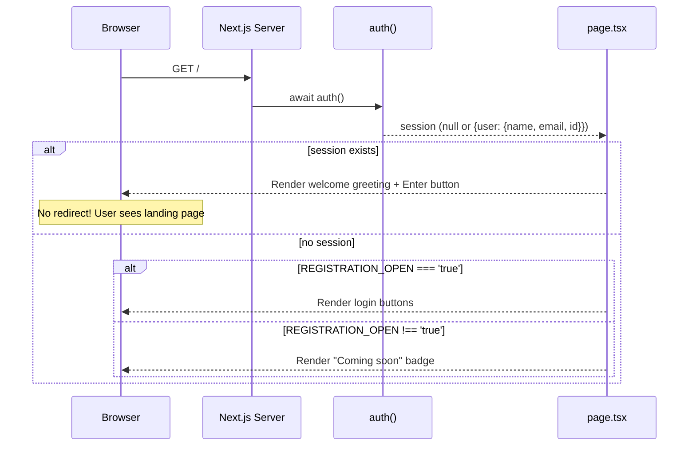

# Login/Loader Redesign Design Document

## Overview

This document defines the technical design for three related changes to the Nookstead game client landing experience: (1) making the landing page auth-aware so authenticated users see a welcome-back greeting with an "Enter" button instead of being silently redirected, (2) replacing the `isLocalhost` check with a server-side `REGISTRATION_OPEN` environment variable to gate registration availability, and (3) redesigning the loading screen to reuse the `HeroDayCycle` animated sky from the landing page for visual consistency.

## Design Summary (Meta)

```yaml
design_type: "extension"
risk_level: "low"
complexity_level: "low"
complexity_rationale: >
  All three requirements modify existing components with straightforward
  conditional rendering logic. No new state management, no new external
  dependencies, no new API endpoints. The main complexity is sharing the
  HeroDayCycle component between two contexts (landing hero and loading screen).
main_constraints:
  - "Global CSS only (no CSS Modules, no Tailwind)"
  - "page.tsx is a Server Component -- auth-aware rendering happens server-side"
  - "LoadingScreen is a client component rendered inside GameApp"
  - "HeroDayCycle is a client component using useDayCycle hook"
biggest_risks:
  - "HeroDayCycle imports useDayCycle which uses setInterval -- must verify no memory leaks when LoadingScreen unmounts"
  - "Loading screen must remain visually functional while Phaser assets load (HeroDayCycle adds DOM elements that could compete with Phaser for resources)"
unknowns:
  - "Whether the HeroDayCycle animated sky adds perceptible overhead during Phaser asset loading"
```

## Background and Context

### Prerequisite ADRs

- `adr-002-nextauth-authentication.md`: NextAuth v5 JWT session strategy, OAuth providers
- No common ADRs required -- this change does not introduce new technology or patterns

### Agreement Checklist

#### Scope

- [x] Modify `apps/game/src/app/page.tsx` to remove `redirect('/game')`, add auth-aware conditional rendering
- [x] Modify `apps/game/src/app/page.tsx` to replace `isLocalhost` check with `REGISTRATION_OPEN` env var
- [x] Modify `apps/game/src/components/game/LoadingScreen.tsx` to use `HeroDayCycle`, logo image, and tagline
- [x] Modify `apps/game/src/app/global.css` to add loading screen hero-style classes
- [x] Update `.env.example` to document `REGISTRATION_OPEN` variable

#### Non-Scope (Explicitly not changing)

- [x] `HeroDayCycle.tsx` -- reused as-is, no modifications
- [x] `useDayCycle.ts` -- reused as-is, no modifications
- [x] `LandingContent.tsx` -- unchanged
- [x] `LoginButton.tsx` -- unchanged
- [x] `auth.ts` -- unchanged (session structure stays the same)
- [x] `GameApp.tsx` -- unchanged (LoadingScreen interface stays `{ visible: boolean }`)
- [x] Route protection middleware -- unchanged
- [x] `/game` route -- unchanged

#### Constraints

- [x] Parallel operation: Not applicable (replacing in-place)
- [x] Backward compatibility: Not required (landing page is not an API)
- [x] Performance measurement: Not required (no heavy computation added)

### Problem to Solve

1. **Authenticated users never see the landing page.** The current `redirect('/game')` on line 16-18 of `page.tsx` means returning players skip the landing page entirely. This prevents showing a personalized welcome and forces an immediate redirect that adds latency.

2. **Registration gating is tied to hostname.** The `isLocalhost` check hardcodes availability to `localhost` or `127.0.0.1`, making it impossible to open registration on a staging or production domain without code changes.

3. **Loading screen is visually disconnected from the landing page.** The loading screen uses a static dark gradient, a CSS text logo, and its own star/cloud implementations, creating a jarring visual transition from the animated hero landing section.

### Current Challenges

- `page.tsx` calls `redirect('/game')` for authenticated users, which is a server-side redirect that adds a network round-trip and prevents any authenticated-user UI on the landing page.
- The `isLocalhost` host detection is fragile and cannot be toggled without deployment.
- `LoadingScreen.tsx` duplicates cloud rendering logic from `page.tsx` and has its own star rendering that differs from `HeroDayCycle`.

### Requirements

#### Functional Requirements

- **R1**: Auth-aware landing page rendering with welcome greeting and Enter button
- **R2**: Server-side `REGISTRATION_OPEN` environment variable controlling registration gate
- **R3**: Loading screen visual redesign using shared `HeroDayCycle` component

#### Non-Functional Requirements

- **Performance**: HeroDayCycle adds a 1-second setInterval; this is negligible. No additional network requests.
- **Maintainability**: Reducing duplication by reusing HeroDayCycle in both contexts.
- **Accessibility**: Enter button must be keyboard-focusable and have clear focus styles.

## Acceptance Criteria (AC) - EARS Format

### R1: Auth-Aware Landing Page

- [ ] **When** an authenticated user visits `/`, the system shall display "Welcome back, [name]" where `[name]` is `session.user.name` from the NextAuth session
- [ ] **When** an authenticated user visits `/`, the system shall display an "Enter" button that navigates to `/game`
- [ ] **While** a user is authenticated, the system shall hide all login buttons (Google/Discord)
- [ ] **If** `session.user.name` is null or empty, **then** the system shall display "Welcome back" without a name
- [ ] The system shall no longer call `redirect('/game')` for authenticated users visiting `/`

### R2: Coming Soon Gate

- [ ] **When** `REGISTRATION_OPEN` environment variable is not set to `"true"`, the system shall display the "Coming soon" badge instead of login buttons for unauthenticated users
- [ ] **When** `REGISTRATION_OPEN` environment variable is set to `"true"`, the system shall display login buttons for unauthenticated users
- [ ] **While** a user is authenticated, the system shall display the Enter button regardless of the `REGISTRATION_OPEN` value
- [ ] The system shall read `REGISTRATION_OPEN` as a server-side environment variable (not `NEXT_PUBLIC_` prefixed)

### R3: Loading Screen Redesign

- [ ] The loading screen shall render the `HeroDayCycle` component as its background sky
- [ ] The loading screen shall display the logo image (`/logo.png`, 400x98px) instead of the CSS text "NOOKSTEAD" logo
- [ ] The loading screen shall display the tagline "Build your homestead in a living world" below the logo
- [ ] The loading screen shall retain a visible loading progress indicator (animated bar)
- [ ] The loading screen shall retain the pixel divider decoration
- [ ] The loading screen shall remove its own star and cloud rendering (replaced by HeroDayCycle)

## Applicable Standards

### Classification Table

| Standard | Type | Source | Impact on Design |
|----------|------|--------|-----------------|
| Prettier: single quotes, 2-space indent | Explicit | `.prettierrc`, `.editorconfig` | All new code must use single quotes |
| ESLint flat config with Nx module boundaries | Explicit | `eslint.config.mjs` | Imports must respect module boundaries |
| TypeScript strict mode, ES2022 target | Explicit | `tsconfig.json` | Type-safe implementations required |
| `@/*` path alias maps to `apps/game/src/*` | Explicit | `tsconfig.json` paths | All internal imports use `@/` prefix |
| Global CSS with BEM-like naming | Implicit | `global.css` | New CSS classes follow `block__element--modifier` pattern |
| Server Components by default, `'use client'` for interactivity | Implicit | `page.tsx`, component files | `page.tsx` stays as Server Component |
| Env vars: server-side without prefix, client-side with `NEXT_PUBLIC_` | Implicit | `useDayCycle.ts`, `.env.example` | `REGISTRATION_OPEN` is server-only |
| Component files use PascalCase, hooks use camelCase | Implicit | `HeroDayCycle.tsx`, `useDayCycle.ts` | Follow existing naming |

## Existing Codebase Analysis

### Implementation Path Mapping

| Type | Path | Description |
|------|------|-------------|
| Existing (modify) | `apps/game/src/app/page.tsx` | Landing page Server Component -- remove redirect, add auth-aware rendering, replace isLocalhost |
| Existing (modify) | `apps/game/src/components/game/LoadingScreen.tsx` | Loading screen -- replace with HeroDayCycle, logo image, tagline |
| Existing (modify) | `apps/game/src/app/global.css` | Add loading screen hero-style CSS classes |
| Existing (modify) | `.env.example` | Document REGISTRATION_OPEN variable |
| Existing (reuse) | `apps/game/src/components/landing/HeroDayCycle.tsx` | Day/night cycle sky component -- used as-is in LoadingScreen |
| Existing (reuse) | `apps/game/src/components/landing/useDayCycle.ts` | Day cycle state hook -- used transitively via HeroDayCycle |
| No change | `apps/game/src/components/game/GameApp.tsx` | Parent of LoadingScreen -- interface unchanged |
| No change | `apps/game/src/auth.ts` | Auth configuration -- unchanged |

### Similar Functionality Search

- **Cloud rendering**: Duplicated between `page.tsx` (lines 28-66) and `LoadingScreen.tsx` (lines 22-77). Both generate random cloud sprites with identical logic. The loading screen version will be removed (replaced by HeroDayCycle which has its own approach).
- **Star rendering**: `LoadingScreen.tsx` (lines 10-20, 80-94) has its own star implementation with random positions. `HeroDayCycle.tsx` has a deterministic star implementation with seeded PRNG. The loading screen will adopt HeroDayCycle's approach by composition.
- **Decision**: Reuse `HeroDayCycle` in `LoadingScreen` rather than duplicating sky rendering logic.

### Code Inspection Evidence

| File Inspected | Key Finding | Design Impact |
|---------------|-------------|---------------|
| `apps/game/src/app/page.tsx:1-119` | Server Component using `auth()` for session, `headers()` for host detection | Auth-aware rendering uses existing `session` variable; remove redirect and isLocalhost |
| `apps/game/src/app/page.tsx:95-101` | `isLocalhost` ternary controls LoginButton vs Coming soon badge | Replace with `process.env.REGISTRATION_OPEN === 'true'` |
| `apps/game/src/components/game/LoadingScreen.tsx:1-121` | Client component with `{ visible: boolean }` interface, renders stars/clouds/logo/progress bar | Interface unchanged; internal rendering replaced |
| `apps/game/src/components/game/GameApp.tsx:54` | `<LoadingScreen visible={loading} />` -- simple boolean prop | No change to parent integration |
| `apps/game/src/components/landing/HeroDayCycle.tsx:1-146` | Client component, self-contained, no props, uses `useDayCycle()` hook | Can be imported directly into LoadingScreen |
| `apps/game/src/components/landing/useDayCycle.ts:135-150` | Hook uses `useState` + `useEffect` with `setInterval(tick, 1000)` and cleanup | Cleanup runs on unmount -- safe for LoadingScreen lifecycle |
| `apps/game/src/auth.ts:62-66` | Session callback adds `user.id`; standard session has `user.name`, `user.email`, `user.image` | `session.user.name` available for welcome greeting |
| `apps/game/src/app/global.css:580-694` | Loading screen CSS uses `.loading-screen` block with nested selectors | Modify to remove star/cloud classes, add hero-sky integration |
| `.env.example:1-70` | Documents env vars with comments; no `REGISTRATION_OPEN` entry | Add new entry with documentation |

## Design

### Change Impact Map

```yaml
Change Target: Landing page auth-aware rendering (page.tsx)
Direct Impact:
  - apps/game/src/app/page.tsx (remove redirect, add conditional rendering)
Indirect Impact:
  - None (page.tsx is the entry point, no other files import it)
No Ripple Effect:
  - auth.ts (unchanged)
  - middleware/proxy (unchanged)
  - /game route (unchanged)
  - LoginButton component (unchanged)

Change Target: Registration gate env variable (page.tsx)
Direct Impact:
  - apps/game/src/app/page.tsx (replace isLocalhost with env check)
  - .env.example (document new variable)
Indirect Impact:
  - None
No Ripple Effect:
  - next.config.js (server-side env, no config needed)
  - Deployment scripts (env var added at infrastructure level)

Change Target: Loading screen redesign (LoadingScreen.tsx)
Direct Impact:
  - apps/game/src/components/game/LoadingScreen.tsx (new rendering)
  - apps/game/src/app/global.css (CSS changes for loading screen)
Indirect Impact:
  - None
No Ripple Effect:
  - GameApp.tsx (interface unchanged)
  - HeroDayCycle.tsx (reused as-is)
  - PhaserGame.tsx (unrelated)
```

### Architecture Overview

```mermaid
graph TD
    subgraph "Landing Page (Server Component)"
        PAGE["page.tsx"]
        PAGE -->|authenticated| WELCOME["Welcome Back + Enter Button"]
        PAGE -->|unauthenticated + REGISTRATION_OPEN| LOGIN["Login Buttons"]
        PAGE -->|unauthenticated + !REGISTRATION_OPEN| SOON["Coming Soon Badge"]
        PAGE --> HDC1["HeroDayCycle (sky)"]
        PAGE --> CLOUDS["Clouds"]
        PAGE --> CONTENT["LandingContent"]
    end

    subgraph "Game Route"
        GAME["/game page.tsx"]
        GAME --> GAMEAPP["GameApp"]
        GAMEAPP --> LOADING["LoadingScreen"]
        LOADING --> HDC2["HeroDayCycle (sky)"]
        LOADING --> LOGO["Logo Image"]
        LOADING --> TAG["Tagline"]
        LOADING --> PROGRESS["Progress Bar"]
        GAMEAPP --> PHASER["PhaserGame"]
    end

    WELCOME -->|"Enter button click"| GAME

    style HDC1 fill:#2a4a3a,stroke:#48c7aa
    style HDC2 fill:#2a4a3a,stroke:#48c7aa
```



### Data Flow

#### R1: Auth-Aware Rendering Flow



#### R3: Loading Screen Component Tree

```
LoadingScreen (client component)
├── HeroDayCycle (client component, existing)
│   ├── Sky gradient overlay (position: absolute, z-index: 0)
│   ├── Stars (deterministic, seeded PRNG)
│   ├── Sun glow (sunrise/sunset)
│   └── Moon (pixel art SVG)
├── Content (z-index: 2)
│   ├── Logo image (/logo.png, 400x98)
│   ├── Tagline text
│   ├── Pixel divider
│   ├── Progress bar (animated)
│   └── "Loading..." text
```

### Integration Points List

| Integration Point | Location | Old Implementation | New Implementation | Switching Method |
|-------------------|----------|-------------------|-------------------|------------------|
| Auth check in page.tsx | `page.tsx:16-18` | `redirect('/game')` | Conditional rendering (welcome vs login) | Direct replacement |
| Registration gate | `page.tsx:13-14, 95-101` | `isLocalhost` host check | `process.env.REGISTRATION_OPEN === 'true'` | Direct replacement |
| LoadingScreen sky | `LoadingScreen.tsx:52-94` | Custom stars + clouds + static gradient | `<HeroDayCycle />` component | Direct replacement |
| LoadingScreen logo | `LoadingScreen.tsx:98-103` | CSS text `<h1>NOOKSTEAD</h1>` | `<Image src="/logo.png" />` | Direct replacement |

### Main Components

#### Modified: `page.tsx` (Server Component)

- **Responsibility**: Landing page with auth-aware rendering and registration gate
- **Interface**: No props (Next.js page component). Uses `auth()` for session, `process.env.REGISTRATION_OPEN` for gate.
- **Dependencies**: `@/auth` (auth function), `@/components/auth/LoginButton`, `@/components/landing/HeroDayCycle`, `@/components/landing/LandingContent`, `next/image`, `next/link`
- **Changes**:
  - Remove `redirect` import and `redirect('/game')` call
  - Remove `headers()` import and `isLocalhost` computation
  - Add `import Link from 'next/link'`
  - Add conditional rendering: authenticated shows welcome + Enter, unauthenticated shows login/coming-soon based on env
  - Add `next/link` for Enter button navigation

#### Modified: `LoadingScreen.tsx` (Client Component)

- **Responsibility**: Full-screen overlay during Phaser asset loading
- **Interface**: `{ visible: boolean }` (unchanged)
- **Dependencies**: `@/components/landing/HeroDayCycle` (new), `next/image` (new)
- **Changes**:
  - Remove `stars` and `clouds` useMemo blocks
  - Remove stars and clouds DOM rendering
  - Add `<HeroDayCycle />` as background sky
  - Replace text logo with `<Image src="/logo.png" />`
  - Add tagline text
  - Keep progress bar and divider

### Contract Definitions

No new contracts introduced. The `LoadingScreen` interface remains `{ visible: boolean }`. The `HeroDayCycle` component takes no props.

### Data Contract

#### page.tsx Auth-Aware Rendering

```yaml
Input:
  Type: NextAuth Session | null
  Source: auth() server-side call
  Fields Used: session.user.name (string | null | undefined)

Output:
  Type: JSX (React Server Component)
  Variants:
    Authenticated: Welcome greeting + Enter button
    Unauthenticated + REGISTRATION_OPEN: Login buttons
    Unauthenticated + !REGISTRATION_OPEN: Coming soon badge

Environment:
  REGISTRATION_OPEN: string | undefined (server-side only)
  Interpretation: "true" = open, anything else = closed
```

### Data Representation Decisions

| Data Structure | Decision | Rationale |
|---|---|---|
| Session user data | **Reuse** existing NextAuth session type | `session.user.name` already available from OAuth profile; no new types needed |
| Registration gate | **Reuse** `process.env` string | Simple boolean-like env var; no new type or config structure needed |

### Integration Boundary Contracts

```yaml
Boundary Name: page.tsx -> auth()
  Input: None (called with no arguments)
  Output: Session | null (sync, awaited)
  On Error: Returns null (NextAuth handles errors internally)

Boundary Name: page.tsx -> REGISTRATION_OPEN env
  Input: process.env.REGISTRATION_OPEN
  Output: string | undefined
  On Error: undefined treated as "closed" (safe default)

Boundary Name: LoadingScreen -> HeroDayCycle
  Input: None (no props)
  Output: Animated sky background (React element)
  On Error: Falls back to dark static background via CSS fallback
```

### Error Handling

- **`session.user.name` is null**: Display "Welcome back" without a name. The template uses optional chaining.
- **`REGISTRATION_OPEN` is undefined**: Treated as `false` (coming soon badge shown). This is the safe default.
- **HeroDayCycle fails to render in LoadingScreen**: The `.loading-screen` CSS has a `background` fallback gradient, so the screen remains usable.

### Interface Change Impact Analysis

| Existing Operation | New Operation | Conversion Required | Adapter Required | Compatibility Method |
|-------------------|---------------|-------------------|------------------|---------------------|
| `redirect('/game')` in page.tsx | Removed (conditional JSX instead) | No | No | Direct removal |
| `isLocalhost` check | `process.env.REGISTRATION_OPEN` check | No | No | Direct replacement |
| `LoadingScreen({ visible })` | `LoadingScreen({ visible })` | None | No | Interface unchanged |

## Implementation Details

### R1: page.tsx Auth-Aware Rendering

**Before** (lines 16-18):
```tsx
if (session?.user) {
  redirect('/game');
}
```

**After** (conceptual):
```tsx
const isAuthenticated = !!session?.user;
const displayName = session?.user?.name;
const registrationOpen = process.env.REGISTRATION_OPEN === 'true';

// In JSX:
{isAuthenticated ? (
  <>
    <p className="landing-hero__welcome">
      Welcome back{displayName ? `, ${displayName}` : ''}
    </p>
    <Link href="/game" className="landing-hero__enter-btn">
      Enter
    </Link>
  </>
) : (
  <>
    {registrationOpen ? (
      <LoginButton provider="google" />
    ) : (
      <div className="coming-soon-badge">Coming soon</div>
    )}
  </>
)}
```

**Footer hint text**: For authenticated users, replace the hint text ("Sign in to start your adventure" / "We're working hard to open the gates") with `"Ready to continue your adventure"`. For unauthenticated users when registration is closed, keep the existing "We're working hard to open the gates" text. When registration is open, keep "Sign in to start your adventure".

**Removed imports**: `redirect` from `next/navigation`, `headers` from `next/headers`.

**Added imports**: `Link` from `next/link`.

### R2: Environment Variable

Server-side only (no `NEXT_PUBLIC_` prefix). Read directly in the Server Component:

```tsx
const registrationOpen = process.env.REGISTRATION_OPEN === 'true';
```

Added to `.env.example`:
```env
# Registration Gate
# Set to "true" to show login buttons on the landing page
# Any other value or unset shows "Coming soon" badge
REGISTRATION_OPEN=true
```

### R3: LoadingScreen Redesign

**Before**: Custom stars, clouds, CSS text logo, static dark gradient.

**After**:
```tsx
'use client';

import Image from 'next/image';
import { HeroDayCycle } from '@/components/landing/HeroDayCycle';

interface LoadingScreenProps {
  visible: boolean;
}

export function LoadingScreen({ visible }: LoadingScreenProps) {
  if (!visible) return null;

  return (
    <div className="loading-screen">
      {/* Animated day/night sky (reused from landing page) */}
      <HeroDayCycle />

      {/* Content overlay */}
      <div className="loading-screen__content">
        <div className="loading-screen__logo-wrapper">
          <Image
            src="/logo.png"
            alt="Nookstead"
            width={400}
            height={98}
            priority
            className="loading-screen__logo-img"
          />
        </div>

        <p className="loading-screen__tagline">
          Build your homestead in a living world
        </p>

        <div className="loading-screen__divider" aria-hidden="true">
          <span />
          <span />
          <span />
        </div>

        <div className="loading-screen__bar-outer">
          <div className="loading-screen__bar-inner" />
        </div>

        <p className="loading-screen__text">Loading...</p>
      </div>
    </div>
  );
}
```

### CSS Changes (global.css)

**Loading screen section changes**:

1. Remove `.loading-screen__clouds`, `.loading-screen__stars`, `.loading-screen__star` rules
2. Remove `.loading-screen__logo`, `.loading-screen__logo-shadow` rules (CSS text logo)
3. Replace `.loading-screen` background gradient with a dark fallback (HeroDayCycle provides the gradient)
4. Add `.loading-screen__logo-img` styles (matching landing hero logo)
5. Add `.loading-screen__tagline` styles (matching landing hero tagline)

**New landing page classes**:

1. Add `.landing-hero__welcome` for the welcome greeting text
2. Add `.landing-hero__enter-btn` for the Enter button

**Enter button styling**:
```css
.landing-hero__enter-btn {
  display: inline-block;
  padding: 14px 48px;
  font-family: 'Press Start 2P', monospace;
  font-size: 0.7rem;
  color: #0a0a1a;
  background-color: #48c7aa;
  border: 2px solid #3aad94;
  text-transform: uppercase;
  letter-spacing: 2px;
  transition: background-color 0.15s, transform 0.1s, box-shadow 0.15s;
}

.landing-hero__enter-btn:hover {
  transform: translateY(-2px);
  box-shadow: 0 4px 0 #1a3a2e;
  background-color: #5ad4b8;
}

.landing-hero__enter-btn:active {
  transform: translateY(0);
  box-shadow: none;
}

.landing-hero__enter-btn:focus-visible {
  outline: 2px solid #ffdd57;
  outline-offset: 2px;
}
```

### Shared Visual Elements Between Landing Hero and Loading Screen

| Visual Element | Landing Hero | Loading Screen (Redesigned) |
|---------------|-------------|---------------------------|
| Sky background | `HeroDayCycle` (animated gradient + stars + moon + sun glow) | `HeroDayCycle` (same component) |
| Logo | `<Image src="/logo.png" />` with float animation + glow drop-shadow | Same image, same float animation, same glow |
| Tagline | "Build your homestead in a living world" | Same text |
| Pixel divider | 3 squares (dark, teal, dark) | Same divider |
| Clouds | 10 drifting cloud sprites | **Not included** -- HeroDayCycle does not render clouds; clouds are separate in landing hero. Loading screen omits clouds for simplicity. |
| Progress bar | N/A | Loading-specific (retained) |

### Field Propagation Map

Not applicable -- no fields cross component boundaries. This design modifies rendering logic only; no data flows between layers or modules are added or changed.

## Integration Point Map

```yaml
Integration Point 1:
  Existing Component: page.tsx (Server Component rendering)
  Integration Method: Conditional JSX based on session and env var
  Impact Level: Medium (rendering flow change for authenticated users)
  Required Test Coverage: Verify all three rendering paths (authenticated, unauth+open, unauth+closed)

Integration Point 2:
  Existing Component: LoadingScreen.tsx -> HeroDayCycle.tsx
  Integration Method: Component composition (import and render)
  Impact Level: Low (internal rendering replacement, external interface unchanged)
  Required Test Coverage: Verify LoadingScreen renders with HeroDayCycle, verify unmount cleanup

Integration Point 3:
  Existing Component: GameApp.tsx -> LoadingScreen.tsx
  Integration Method: No change (same { visible: boolean } prop)
  Impact Level: Low (no interface change)
  Required Test Coverage: Existing integration unchanged
```

## Implementation Plan

### Implementation Approach

**Selected Approach**: Vertical Slice

**Selection Reason**: Each requirement (R1, R2, R3) modifies a self-contained component with minimal cross-requirement dependencies. R1 and R2 both modify `page.tsx` and should be implemented together. R3 modifies `LoadingScreen.tsx` independently. The vertical approach delivers complete features per-slice and allows independent verification.

### Technical Dependencies and Implementation Order

#### Required Implementation Order

1. **R1 + R2: page.tsx modifications**
   - Technical Reason: Both R1 (auth-aware) and R2 (env gate) modify the same conditional rendering block in `page.tsx`. Implementing together avoids merge conflicts and ensures the three-way conditional (authenticated / unauth+open / unauth+closed) is correct.
   - Dependent Elements: None (page.tsx is a leaf component)

2. **R3: LoadingScreen.tsx + CSS changes**
   - Technical Reason: Independent of R1/R2. Can be implemented in parallel or after.
   - Prerequisites: None (HeroDayCycle already exists)

3. **CSS additions to global.css**
   - Technical Reason: Supports both R1 (Enter button, welcome text) and R3 (loading screen hero styles). Can be done alongside either.

4. **.env.example update**
   - Technical Reason: Documentation only, no code dependency.

### Integration Points

**Integration Point 1: Auth-Aware Landing Page**
- Components: `auth()` -> `page.tsx` conditional rendering
- Verification: Manual test: sign in, visit `/`, verify welcome greeting and Enter button. Sign out, verify login buttons or coming soon badge based on `REGISTRATION_OPEN`.

**Integration Point 2: Loading Screen with HeroDayCycle**
- Components: `LoadingScreen` -> `HeroDayCycle`
- Verification: Navigate to `/game`, verify loading screen shows animated sky, logo image, tagline, and progress bar. Verify transition to game when Phaser loads.

### Migration Strategy

No migration needed. All changes are in-place replacements. No data migration, no API changes, no database changes.

## Test Strategy

### Basic Test Design Policy

Test cases derive from the EARS acceptance criteria above. Given the UI-focused nature of these changes, the primary verification method is visual/behavioral testing.

### Unit Tests

- **page.tsx rendering**: Not easily unit-testable (Server Component with `auth()` side effect). Covered by integration/E2E tests.
- **LoadingScreen rendering**: Test that `LoadingScreen` renders `HeroDayCycle` when `visible={true}` and returns null when `visible={false}`.

### Integration Tests

- **Auth-aware rendering**: Use Next.js testing utilities to render `page.tsx` with mocked `auth()` returning a session, verify welcome text appears and login buttons are hidden.
- **Registration gate**: Mock `process.env.REGISTRATION_OPEN` to `'true'` and `undefined`, verify correct rendering.

### E2E Tests

- **Authenticated landing page**: Sign in, navigate to `/`, verify "Welcome back" text and Enter button visible, verify login buttons hidden.
- **Enter button navigation**: Click Enter button, verify navigation to `/game`.
- **Coming soon gate**: With `REGISTRATION_OPEN` unset, verify "Coming soon" badge appears for unauthenticated users.
- **Loading screen visual**: Navigate to `/game`, verify loading screen shows logo image (not text), tagline, and animated sky.

### Performance Tests

Not required -- no heavy computation or network calls added. The HeroDayCycle 1-second interval is already proven in production on the landing page.

## Security Considerations

- **`REGISTRATION_OPEN` is server-side only**: Not exposed to the client via `NEXT_PUBLIC_` prefix. Cannot be tampered with by users.
- **Session data exposure**: Only `session.user.name` is rendered. No sensitive data (email, ID) is displayed on the landing page.
- **Enter button links to `/game`**: Route protection middleware in `auth.ts` already gates `/game` to authenticated users only.

## Future Extensibility

- **Additional auth providers**: The conditional rendering structure supports adding more `LoginButton` instances trivially.
- **Granular registration gates**: `REGISTRATION_OPEN` could be extended to an allowlist or invite code system in the future.
- **Loading screen progress**: The progress bar currently uses a CSS animation (indeterminate). It could be connected to actual Phaser loading progress via the `EventBus` in a future enhancement.
- **Shared hero component**: If more screens need the hero visual treatment, `HeroDayCycle` + logo + tagline could be extracted into a shared `HeroSection` component.

## Alternative Solutions

### Alternative 1: Keep redirect but add a flash greeting

- **Overview**: Keep `redirect('/game')` but add a brief greeting toast/notification on the `/game` page after redirect.
- **Advantages**: No change to landing page flow.
- **Disadvantages**: User never sees the landing page; greeting is transient and easy to miss; adds complexity to the game page.
- **Reason for Rejection**: Requirements explicitly state removing the redirect so users see the landing page.

### Alternative 2: Use `NEXT_PUBLIC_REGISTRATION_OPEN` for client-side gate

- **Overview**: Make the env var client-accessible so the gate could also work in client components.
- **Advantages**: Could be used in client-side logic if needed.
- **Disadvantages**: Exposes configuration to client bundle; users could see the value in browser devtools.
- **Reason for Rejection**: Server-side-only is more secure and the gate logic only runs in the Server Component.

### Alternative 3: Create a new `LoadingHero` component instead of reusing `HeroDayCycle`

- **Overview**: Build a separate sky component for the loading screen with a subset of HeroDayCycle features.
- **Advantages**: Could be optimized specifically for the loading context (e.g., no moon/sun glow to reduce DOM).
- **Disadvantages**: Code duplication; maintenance burden of keeping two sky components in sync.
- **Reason for Rejection**: HeroDayCycle is lightweight enough (no performance concern) and reuse reduces maintenance.

## Risks and Mitigation

| Risk | Impact | Probability | Mitigation |
|------|--------|-------------|------------|
| HeroDayCycle setInterval running during Phaser loading adds CPU overhead | Low | Low | The 1-second interval is minimal; HeroDayCycle is already in production. If issues arise, defer interval start until after a short delay. |
| Welcome greeting flickers on slow auth resolution | Low | Low | `auth()` runs server-side before rendering; no client-side flash. |
| `REGISTRATION_OPEN` env var not set in deployment | Medium | Medium | Default to "closed" (coming soon badge); document in `.env.example` with clear comments. |
| Removing redirect breaks deep-link expectations | Low | Low | Authenticated users can still navigate to `/game` via the Enter button; middleware still protects the route. |

## References

- [PRD: Landing Page and Social Authentication](D:/git/github/nookstead/server/docs/prd/prd-001-landing-page-auth.md) -- Original requirements for landing page and auth
- [Design Doc: Landing Page Auth](D:/git/github/nookstead/server/docs/design/design-001-landing-page-auth.md) -- Original implementation design
- [Design Doc: Hero Day/Night Cycle](D:/git/github/nookstead/server/docs/design/hero-day-night-cycle.md) -- HeroDayCycle component design
- [ADR-002: NextAuth Authentication](D:/git/github/nookstead/server/docs/adr/adr-002-nextauth-authentication.md) -- Auth architecture decisions
- [Next.js Server Components](https://nextjs.org/docs/app/building-your-application/rendering/server-components) -- Server-side rendering patterns
- [Next.js Environment Variables](https://nextjs.org/docs/app/building-your-application/configuring/environment-variables) -- Server vs client env vars

## Update History

| Date | Version | Changes | Author |
|------|---------|---------|--------|
| 2026-03-01 | 1.0 | Initial version | Claude (Technical Designer) |
