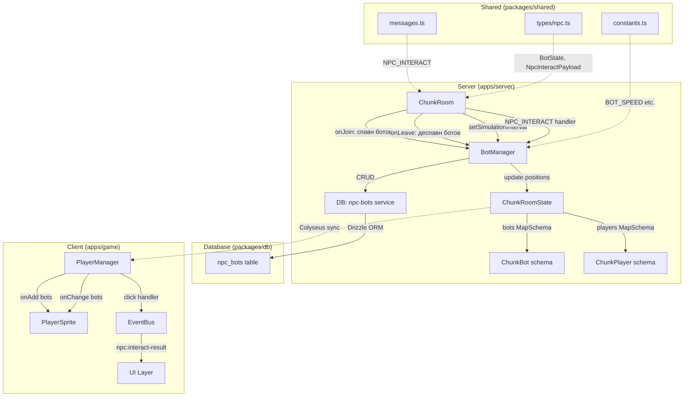
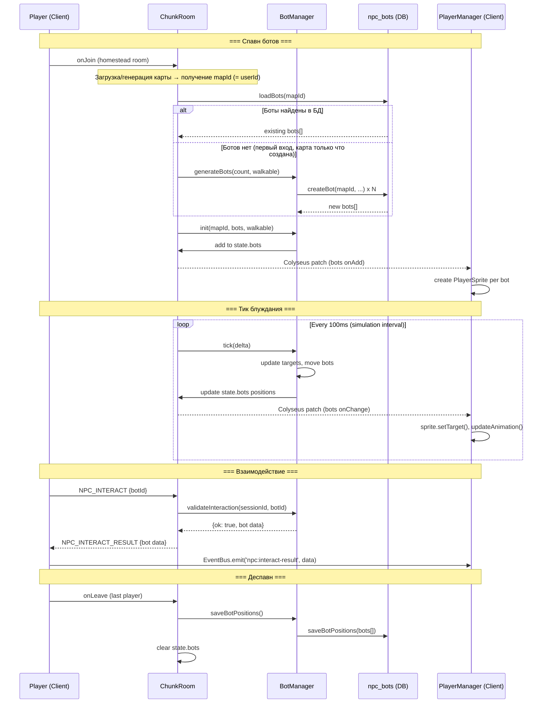
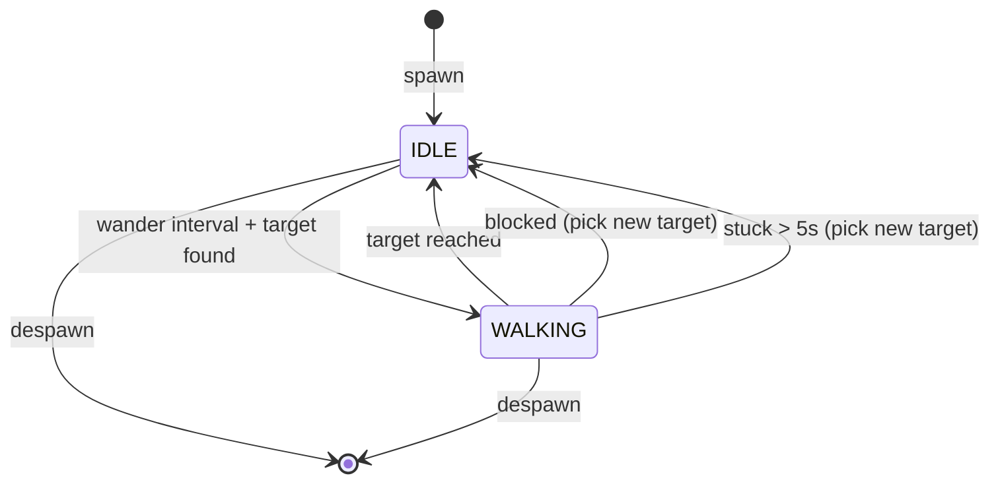

# Design-019: Система NPC бот-компаньонов

## Обзор

Детальный технический дизайн серверно-управляемой системы бот-компаньонов для хоумстедов игроков. Боты — персистентные NPC-сущности с поведением случайного блуждания, физическими столкновениями и базовой интерактивностью. Архитектура заложена как прекурсор полноценной NPC-системы (npc-service.md).

## Design Summary (Meta)

```yaml
design_type: "new_feature"
risk_level: "medium"
complexity_level: "medium"
complexity_rationale: "Требуется координация 4 слоёв (DB schema -> server logic -> Colyseus state -> client rendering), интеграция с существующим ChunkRoom lifecycle, управление 2+ состояниями бота (IDLE/WALKING), и sync через Colyseus patch-rate"
main_constraints:
  - "Алигнмент с архитектурой npc-service.md (размещение в npc-service/lifecycle/)"
  - "Переиспользование существующих PlayerSprite и анимаций без модификации"
  - "Тик-обработка ботов не должна деградировать серверный тик > 2 мс"
biggest_risks:
  - "Боты застревают в непроходимых зонах из-за отсутствия A* pathfinding"
  - "Race condition при одновременном входе двух игроков на один хоумстед"
unknowns:
  - "Оптимальные параметры блуждания (радиус, интервал) для естественного поведения"
  - "Визуальное отличие бота от удалённого игрока (нужно ли?)"
```

## Предпосылки и контекст

### Prerequisite ADRs

- [ADR-0013: NPC Bot Entity Architecture](../adr/ADR-0013-npc-bot-entity-architecture.md) — все архитектурные решения по Colyseus-состоянию, размещению логики, БД-схеме, алгоритму блуждания, рендерингу и протоколу взаимодействия
- [ADR-0006: Chunk-Based Room Architecture](../adr/ADR-0006-chunk-based-room-architecture.md) — архитектура чанк-комнат, используемая для хоумстедов

### Чеклист договорённостей

#### Скоуп
- [x] Добавление бот-сущностей на хоумстеды (комнаты `player:{userId}`)
- [x] Серверная логика блуждания (BotManager в npc-service/lifecycle/)
- [x] Colyseus Schema (ChunkBot) и MapSchema (`bots`)
- [x] DB-таблица `npc_bots` и сервис-функции
- [x] Клиентский рендеринг через PlayerSprite и колбеки в PlayerManager
- [x] Протокол взаимодействия (NPC_INTERACT / NPC_INTERACT_RESULT)

#### Вне скоупа (не изменяется)
- [x] Существующий PlayerSprite — не модифицируется, переиспользуется as-is
- [x] Существующая `World` (server) — боты не добавляются в world.players
- [x] Существующие PlayerManager callbacks для `players` — не модифицируются
- [x] A* Pathfinding — не реализуется
- [x] AI-диалоги, память, ежедневное планирование (M0.3/M0.4)

#### Ограничения
- [x] Параллельная работа: боты и игроки сосуществуют в одной комнате без конфликтов
- [x] Обратная совместимость: клиенты без поддержки ботов не ломаются (пустая MapSchema `bots`)
- [x] Измерение производительности: тик-обработка ботов < 2 мс

### Проблема

Хоумстеды игроков визуально пусты. Нет NPC-сущностей в проекте. Нужен фундамент для будущей NPC-системы в формате простых бот-компаньонов.

### Текущие ограничения

- Colyseus ChunkRoomState содержит только `players` MapSchema
- Нет NPC-таблиц в БД
- Нет NPC-логики на сервере
- Нет NPC-рендеринга на клиенте
- Нет A*-pathfinding (движение через прямую проверку проходимости)

### Требования

#### Функциональные
- FR-1..FR-10 из PRD-009 (см. [PRD-009](../prd/prd-009-npc-bot-companion.md))

#### Нефункциональные
- **Производительность**: < 1 мс на бота за тик, суммарно < 2 мс для всех ботов комнаты
- **Масштабируемость**: до 10 ботов на хоумстед
- **Надёжность**: ошибки загрузки/сохранения ботов не блокируют вход игрока
- **Поддерживаемость**: код в npc-service/ с чёткими интерфейсами для будущего расширения

## Критерии приёмки (AC) — формат EARS

### FR-1: Спавн ботов

- [ ] **AC-1.1**: **When** игрок присоединяется к комнате хоумстеда (chunkId начинается с `player:`) **и** это первый вход (карта генерируется из шаблона и сохраняется через `saveMap()`), система создаёт N ботов (N = конфигурируемое значение, по умолчанию 1) со случайными именами и скинами, привязывает их к mapId (= userId) карты, сохраняет в `npc_bots` и добавляет в `state.bots`
- [ ] **AC-1.2**: **When** игрок присоединяется к комнате хоумстеда **и** карта уже существует в БД, система загружает ботов по mapId карты и добавляет их в `state.bots` с сохранёнными позициями
- [ ] **AC-1.3**: **If** загрузка ботов из БД завершается ошибкой, **then** система логирует ошибку и продолжает работу комнаты без ботов (не блокирует onJoin)

### FR-2: Случайное блуждание

- [ ] **AC-2.1**: **While** бот находится в состоянии IDLE дольше `BOT_WANDER_INTERVAL` тиков, система выбирает случайный проходимый тайл в радиусе `BOT_WANDER_RADIUS` и переводит бота в состояние WALKING
- [ ] **AC-2.2**: **While** бот находится в состоянии WALKING, система перемещает его к целевому тайлу со скоростью `BOT_SPEED` (60 пикселей/сек), проверяя проходимость каждый тик
- [ ] **AC-2.3**: **When** бот достигает целевого тайла (расстояние < 2 px), система переводит его в IDLE
- [ ] **AC-2.4**: **If** бот заблокирован (целевой тайл непроходим), **then** система выбирает новую случайную цель
- [ ] **AC-2.5**: **If** бот не двигался > 5 секунд в состоянии WALKING (stuck detection), **then** система выбирает новую случайную цель

### FR-3: Физическое столкновение

- [ ] **AC-3.1**: Бот регистрируется как непроходимый объект. **When** игрок пытается переместиться на тайл, занятый ботом, движение блокируется (аналогично непроходимому тайлу)

### FR-4: Уникальные имена

- [ ] **AC-4.1**: **When** создаётся новый бот, система присваивает ему имя из предопределённого списка `BOT_NAMES`, гарантируя уникальность в пределах хоумстеда
- [ ] **AC-4.2**: Имя бота отображается над его спрайтом (через PlayerSprite name label)

### FR-5: Персистентность

- [ ] **AC-5.1**: **When** боты создаются, их данные (id, mapId, name, skin, worldX, worldY, direction) записываются в таблицу `npc_bots`
- [ ] **AC-5.2**: **When** последний игрок покидает комнату, позиции всех ботов обновляются в `npc_bots`
- [ ] **AC-5.3**: **When** игрок входит повторно, боты восстанавливаются из БД с теми же id, именами, скинами

### FR-6: Деспавн

- [ ] **AC-6.1**: **When** последний игрок покидает комнату хоумстеда (onLeave с проверкой clients.length), система сохраняет позиции ботов и удаляет их из `state.bots`

### FR-7: Взаимодействие

- [ ] **AC-7.1**: **When** клиент отправляет `NPC_INTERACT` с botId, сервер проверяет что бот существует и игрок находится в радиусе 3 тайлов
- [ ] **AC-7.2**: **If** валидация пройдена, **then** сервер отправляет `NPC_INTERACT_RESULT` с данными бота (id, name, state)
- [ ] **AC-7.3**: **If** бот не найден или игрок слишком далеко, **then** сервер отправляет `NPC_INTERACT_RESULT` с ошибкой

### FR-8: Множественные боты

- [ ] **AC-8.1**: Система поддерживает до `MAX_BOTS_PER_HOMESTEAD` ботов на хоумстед (по умолчанию 5)
- [ ] **AC-8.2**: Все боты хоумстеда обрабатываются в едином тик-цикле

### FR-9: Плавное отображение

- [ ] **AC-9.1**: **When** сервер обновляет позицию бота, клиент применяет интерполяцию через PlayerSprite.setTarget() (аналогично удалённым игрокам)
- [ ] **AC-9.2**: **When** бот меняет направление или состояние, клиент обновляет анимацию через PlayerSprite.updateAnimation()

### FR-10: Спрайты

- [ ] **AC-10.1**: Бот использует скин из `AVAILABLE_SKINS` (scout_1..scout_6), назначенный при создании

## Анализ существующей кодовой базы

### Standards Identification Gate

| Стандарт | Тип | Источник | Влияние на дизайн |
|----------|-----|---------|-------------------|
| Biome/ESLint strict mode | Explicit | `eslint.config.mjs` | Весь новый код проходит strict linting |
| TypeScript strict mode | Explicit | `tsconfig.json` | Все типы должны быть явными, без `any` (кроме обоснованных случаев) |
| Prettier: single quotes, 2-space indent | Explicit | `.prettierrc`, `.editorconfig` | Форматирование нового кода |
| Jest test framework | Explicit | `jest.config.cts` | Unit-тесты в `.spec.ts` файлах |
| Drizzle ORM schema pattern | Explicit | `packages/db/src/schema/*.ts` | DB-схема через pgTable() с типизацией |
| Factory-функции для сущностей | Implicit | `apps/server/src/models/Player.ts` | Создание бота через factory: `createBot()` |
| Service-функции для DB-операций | Implicit | `packages/db/src/services/*.ts` | CRUD через отдельные функции: `loadBots()`, `saveBots()` |
| Colyseus Schema с @type декораторами | Implicit | `apps/server/src/rooms/ChunkRoomState.ts` | ChunkBot определяется как Schema-класс |
| Shared types/constants в packages/shared | Implicit | `packages/shared/src/` | Новые типы и константы в shared-пакете |
| EventBus для клиент-UI коммуникации | Implicit | `apps/game/src/game/EventBus.ts` | NPC-взаимодействие через EventBus.emit() |

### Code Inspection Evidence

#### Что было исследовано

| Исследованный файл | Ключевая находка | Влияние на дизайн |
|-------------------|-----------------|-------------------|
| `apps/server/src/rooms/ChunkRoom.ts` (448 строк) | onJoin определяет homestead по `player:` prefix в chunkId, имеет доступ к `mapWalkable` | Спавн ботов интегрируется в конец onJoin, после загрузки карты |
| `apps/server/src/rooms/ChunkRoomState.ts` (22 строки) | ChunkPlayer extends Schema с @type, ChunkRoomState имеет `players` MapSchema | ChunkBot создаётся по аналогии, `bots` MapSchema добавляется в ChunkRoomState |
| `apps/server/src/world/World.ts` (164 строки) | World управляет только игроками, movePlayer валидирует speed/bounds | Боты НЕ добавляются в World; BotManager управляет их позициями независимо |
| `apps/server/src/models/Player.ts` (62 строки) | ServerPlayer interface + createServerPlayer factory | Паттерн: interface + factory для серверных сущностей |
| `packages/shared/src/types/messages.ts` (34 строки) | ClientMessage/ServerMessage как const objects | NPC_INTERACT добавляется в ClientMessage, NPC_INTERACT_RESULT в ServerMessage |
| `packages/shared/src/constants.ts` (78 строк) | AVAILABLE_SKINS, TILE_SIZE=16, MAX_SPEED=5, PATCH_RATE_MS=100 | Новые константы BOT_SPEED, BOT_WANDER_RADIUS и т.д. добавляются в тот же файл |
| `apps/game/src/game/multiplayer/PlayerManager.ts` (191 строка) | Callbacks.onAdd('players'), создание PlayerSprite, onChange для интерполяции | Добавить аналогичные onAdd/onChange/onRemove для 'bots' с тем же PlayerSprite |
| `apps/game/src/game/entities/PlayerSprite.ts` (169 строк) | Конструктор: scene, worldX, worldY, skinKey, name, isLocal, sessionId | Переиспользуется для ботов: isLocal=false, sessionId=botId |
| `apps/game/src/game/systems/movement.ts` (200 строк) | calculateMovement(): проверяет walkable[y][x] для каждой оси отдельно (wall-sliding) | Серверный бот использует аналогичную проверку isTileWalkable |
| `packages/db/src/schema/player-positions.ts` (25 строк) | pgTable с uuid PK, FK на users.id, worldX/worldY real | npc_bots следует этому паттерну: uuid PK, FK на maps.userId (PK карты) |
| `packages/db/src/services/player.ts` (89 строк) | savePosition/loadPosition: upsert паттерн, DrizzleClient как параметр | loadBots/saveBots/createBot следуют тому же паттерну |
| `packages/shared/src/systems/spawn.ts` (156 строк) | findSpawnTile: поиск проходимого grass-тайла от центра карты | Используется для нахождения спавн-позиций ботов |
| `apps/game/src/game/scenes/Game.ts` (199 строк) | PlayerManager создаётся в create(), update() вызывает playerManager.update(delta) | Не требует изменений — PlayerManager.update() будет обновлять и бот-спрайты |
| `docs/documentation/design/systems/npc-service.md` (920 строк) | NPC Service: lifecycle/, movement/, dialogue/, memory/, ai/, data/, types/ | BotManager размещается в npc-service/lifecycle/ |

#### Поиск аналогичной функциональности

Поиск по ключевым словам `bot`, `npc`, `companion`, `wander` в кодовой базе не выявил существующих реализаций. Проект не содержит NPC-сущностей. npc-service.md — это спецификация, а не реализация.

### Маппинг путей реализации

| Тип | Путь | Описание |
|-----|------|----------|
| Существующий | `apps/server/src/rooms/ChunkRoom.ts` | Интеграция спавна/деспавна ботов |
| Существующий | `apps/server/src/rooms/ChunkRoomState.ts` | Добавление ChunkBot schema и `bots` MapSchema |
| Существующий | `packages/shared/src/types/messages.ts` | Добавление NPC_INTERACT, NPC_INTERACT_RESULT |
| Существующий | `packages/shared/src/constants.ts` | Добавление BOT_* констант |
| Существующий | `packages/shared/src/index.ts` | Экспорт новых типов |
| Существующий | `apps/game/src/game/multiplayer/PlayerManager.ts` | Добавление колбеков для `bots` |
| Существующий | `packages/db/src/schema/index.ts` | Экспорт новой схемы |
| Существующий | `packages/db/src/index.ts` | Экспорт новых сервис-функций |
| **Новый** | `apps/server/src/npc-service/index.ts` | Экспорт NPC-сервиса |
| **Новый** | `apps/server/src/npc-service/lifecycle/BotManager.ts` | Управление ботами: спавн, деспавн, тик |
| **Новый** | `apps/server/src/npc-service/types/bot-types.ts` | Серверные типы ботов |
| **Новый** | `packages/shared/src/types/npc.ts` | Общие NPC-типы для клиента и сервера |
| **Новый** | `packages/db/src/schema/npc-bots.ts` | Drizzle-схема таблицы npc_bots |
| **Новый** | `packages/db/src/services/npc-bot.ts` | CRUD-сервис: loadBots, saveBots, createBot |

### Интеграционные точки

| Точка интеграции | Место | Старая реализация | Новая реализация | Метод переключения |
|-----------------|-------|-------------------|------------------|--------------------|
| ChunkRoom.onJoin | ChunkRoom.ts:82-358 | Только спавн игрока | + Спавн ботов после загрузки/создания карты. Для новых игроков: после `saveMap()` — создание ботов с mapId. Для возвращающихся: загрузка ботов по mapId | Добавление кода в конец метода |
| ChunkRoom.onLeave | ChunkRoom.ts:361-397 | Сохранение позиции + удаление из state | + Сохранение бот-позиций при выходе последнего | Добавление проверки clients |
| ChunkRoom.onCreate | ChunkRoom.ts:40-59 | Регистрация MOVE handler | + Регистрация NPC_INTERACT handler + setSimulationInterval | Добавление кода |
| ChunkRoomState | ChunkRoomState.ts | Только `players` MapSchema | + `bots` MapSchema<ChunkBot> | Расширение класса |
| PlayerManager.setupCallbacks | PlayerManager.ts:89-161 | Только `players` колбеки | + `bots` onAdd/onChange/onRemove | Добавление метода setupBotCallbacks() |
| messages.ts | messages.ts | 2 ClientMessage, 5 ServerMessage | + NPC_INTERACT, NPC_INTERACT_RESULT | Расширение enum-объектов |
| constants.ts | constants.ts | Игровые константы | + BOT_SPEED, BOT_WANDER_RADIUS и т.д. | Добавление экспортов |

## Дизайн

### Карта влияния изменений

```yaml
Change Target: Система бот-компаньонов
Direct Impact:
  - apps/server/src/rooms/ChunkRoom.ts (спавн/деспавн ботов, message handler, simulation interval)
  - apps/server/src/rooms/ChunkRoomState.ts (ChunkBot schema, bots MapSchema)
  - packages/shared/src/types/messages.ts (NPC_INTERACT, NPC_INTERACT_RESULT)
  - packages/shared/src/constants.ts (BOT_* константы)
  - packages/shared/src/index.ts (экспорт новых типов)
  - apps/game/src/game/multiplayer/PlayerManager.ts (bot колбеки)
  - packages/db/src/schema/index.ts (экспорт npc-bots)
  - packages/db/src/index.ts (экспорт bot-сервисов)
Indirect Impact:
  - apps/game/src/game/scenes/Game.ts (PlayerManager.update() автоматически обновляет бот-спрайты)
  - packages/shared/src/types/room.ts (опционально — BotState в ChunkRoomState type)
  - apps/server/src/world/World.ts (ChunkRoom.handleMove() вызывает откат movePlayer() при коллизии с ботом)
No Ripple Effect:
  - apps/game/src/game/entities/Player.ts (локальный игрок не затронут)
  - apps/game/src/game/entities/PlayerSprite.ts (не модифицируется)
  - apps/game/src/game/systems/movement.ts (не модифицируется)
  - Все остальные DB-таблицы и сервисы
```

### Архитектура (обзор)



### Поток данных



### Компоненты

#### 1. ChunkBot (Colyseus Schema)

**Ответственность**: Серверно-клиентская синхронизация состояния бота через Colyseus.

**Файл**: `apps/server/src/rooms/ChunkRoomState.ts`

```typescript
import { Schema, MapSchema, type } from '@colyseus/schema';

export class ChunkBot extends Schema {
  @type('string') id!: string;
  @type('number') worldX!: number;
  @type('number') worldY!: number;
  @type('string') direction!: string;
  @type('string') skin!: string;
  @type('string') name!: string;
  @type('string') state!: string;    // 'idle' | 'walking'
  @type('string') mapId!: string;    // maps.userId (PK карты хоумстеда)
}

export class ChunkRoomState extends Schema {
  @type({ map: ChunkPlayer }) players = new MapSchema<ChunkPlayer>();
  @type({ map: ChunkBot }) bots = new MapSchema<ChunkBot>();
}
```

**Зависимости**: `@colyseus/schema`

#### 2. BotManager

**Ответственность**: Управление жизненным циклом ботов (спавн, деспавн, тик, блуждание).

**Файл**: `apps/server/src/npc-service/lifecycle/BotManager.ts`

**Интерфейс**:
```typescript
export class BotManager {
  constructor(config: BotManagerConfig);

  /** Инициализация с mapId, ботами и картой проходимости */
  init(mapId: string, bots: ServerBot[], walkable: boolean[][]): void;

  /** Обновление всех ботов за один тик */
  tick(delta: number): void;

  /** Получение текущего состояния ботов для Colyseus-синхронизации */
  getBotUpdates(): BotUpdate[];

  /** Проверка, занят ли тайл ботом (для коллизии, AC-3.1) */
  isTileOccupiedByBot(tileX: number, tileY: number): boolean;

  /** Валидация взаимодействия игрока с ботом */
  validateInteraction(playerX: number, playerY: number, botId: string): InteractionResult;

  /** Сохранение позиций ботов (для деспавна) */
  getBotPositions(): BotPosition[];

  /** Очистка */
  destroy(): void;
}

interface BotManagerConfig {
  mapWidth: number;
  mapHeight: number;
  tileSize: number;
  wanderRadius: number;
  wanderIntervalTicks: number;
  botSpeed: number;
  stuckTimeoutMs: number;
}
```

**Зависимости**: walkable grid, shared constants

#### 3. Таблица npc_bots (Drizzle Schema)

**Ответственность**: Персистентное хранение данных ботов.

**Файл**: `packages/db/src/schema/npc-bots.ts`

```typescript
import { pgTable, real, timestamp, uuid, varchar } from 'drizzle-orm/pg-core';
import { maps } from './maps';

export const npcBots = pgTable('npc_bots', {
  id: uuid('id').defaultRandom().primaryKey(),
  mapId: uuid('map_id')
    .notNull()
    .references(() => maps.userId, { onDelete: 'cascade' }),
  name: varchar('name', { length: 100 }).notNull(),
  skin: varchar('skin', { length: 50 }).notNull(),
  worldX: real('world_x').notNull().default(0),
  worldY: real('world_y').notNull().default(0),
  direction: varchar('direction', { length: 10 }).notNull().default('down'),
  createdAt: timestamp('created_at', { withTimezone: true })
    .defaultNow()
    .notNull(),
  updatedAt: timestamp('updated_at', { withTimezone: true })
    .defaultNow()
    .notNull(),
});

export type NpcBot = typeof npcBots.$inferSelect;
export type NewNpcBot = typeof npcBots.$inferInsert;
```

#### 4. DB-сервис (npc-bot.ts)

**Ответственность**: CRUD-операции для таблицы npc_bots.

**Файл**: `packages/db/src/services/npc-bot.ts`

```typescript
/** Загрузить всех ботов карты */
export async function loadBots(
  db: DrizzleClient,
  mapId: string
): Promise<NpcBot[]>;

/** Сохранить/обновить позиции ботов */
export async function saveBotPositions(
  db: DrizzleClient,
  bots: { id: string; worldX: number; worldY: number; direction: string }[]
): Promise<void>;

/** Создать нового бота */
export async function createBot(
  db: DrizzleClient,
  data: NewNpcBot
): Promise<NpcBot>;
```

**Зависимости**: `DrizzleClient`, `npcBots` schema

#### 5. Общие типы (packages/shared)

**Файл**: `packages/shared/src/types/npc.ts`

```typescript
export interface BotState {
  id: string;
  worldX: number;
  worldY: number;
  direction: string;
  skin: string;
  name: string;
  state: 'idle' | 'walking';
  mapId: string;    // maps.userId (PK карты хоумстеда)
}

export interface NpcInteractPayload {
  botId: string;
}

export interface NpcInteractResult {
  success: boolean;
  bot?: {
    id: string;
    name: string;
    state: string;
  };
  error?: string;
}
```

**Файл**: `packages/shared/src/constants.ts` (добавление)

```typescript
// Bot configuration
export const BOT_SPEED = 60;                    // пикселей/сек (медленнее игрока)
export const BOT_WANDER_RADIUS = 8;             // тайлов от текущей позиции
export const BOT_WANDER_INTERVAL_TICKS = 30;    // тиков между выборами новой цели (3 сек)
export const MAX_BOTS_PER_HOMESTEAD = 5;
export const DEFAULT_BOT_COUNT = 1;
export const BOT_INTERACTION_RADIUS = 3;        // тайлов
export const BOT_STUCK_TIMEOUT_MS = 5000;       // ms
export const MAX_WANDER_TARGET_ATTEMPTS = 20;   // максимум попыток поиска проходимого тайла

export const BOT_NAMES = [
  'Biscuit', 'Clover', 'Maple', 'Pebble', 'Hazel',
  'Bramble', 'Thistle', 'Fern', 'Willow', 'Acorn',
  'Sage', 'Basil', 'Juniper', 'Daisy', 'Moss',
  'Ivy', 'Nutmeg', 'Cedar', 'Poppy', 'Thyme',
] as const;
```

**Файл**: `packages/shared/src/types/messages.ts` (расширение)

```typescript
export const ClientMessage = {
  MOVE: 'move',
  POSITION_UPDATE: 'position_update',
  NPC_INTERACT: 'npc_interact',
} as const;

export const ServerMessage = {
  ERROR: 'error',
  CHUNK_TRANSITION: 'chunk_transition',
  MAP_DATA: 'map_data',
  SESSION_KICKED: 'session_kicked',
  ROOM_REDIRECT: 'room_redirect',
  NPC_INTERACT_RESULT: 'npc_interact_result',
} as const;
```

### Контракты данных

#### BotManager

```yaml
Input:
  Type: BotManagerConfig + ServerBot[] + boolean[][]
  Preconditions: walkable grid имеет размеры mapWidth x mapHeight, bots содержит валидные позиции
  Validation: Проверка что bot positions находятся в пределах карты

Output:
  Type: BotUpdate[] (каждый тик)
  Guarantees: Все позиции находятся в пределах карты и на проходимых тайлах
  On Error: Бот остаётся на месте (не перемещается)

Invariants:
  - Количество ботов не изменяется после init() до destroy()
  - Все бот-позиции всегда на проходимых тайлах
  - Бот всегда в одном из двух состояний: IDLE или WALKING
```

#### NPC_INTERACT Handler

```yaml
Input:
  Type: NpcInteractPayload { botId: string }
  Preconditions: Клиент авторизован, находится в комнате хоумстеда
  Validation: botId существует в state.bots, игрок в радиусе BOT_INTERACTION_RADIUS

Output:
  Type: NpcInteractResult
  Guarantees: success=true только если бот найден и игрок в радиусе
  On Error: { success: false, error: 'reason' }
```

### Решения по представлению данных

| Структура данных | Решение | Обоснование |
|---|---|---|
| ChunkBot (Colyseus schema) | **Новый** тип | Специфичен для NPC-синхронизации, не совпадает с ChunkPlayer (нет sessionId, есть state/mapId) |
| ServerBot (server interface) | **Новый** тип | Серверное представление бота (аналог ServerPlayer), но с другим lifecycle |
| BotState (shared type) | **Новый** тип | Нет существующего типа с полем state + mapId |
| NpcBot (DB type) | **Новый** тип | Новая таблица npc_bots |
| NpcInteractPayload/Result | **Новый** тип | Новый протокол взаимодействия |
| BOT_NAMES | **Новая** константа | Нет предопределённых имён в проекте |

### Переходы состояний бота

```yaml
State Definition:
  - Initial State: IDLE (при спавне)
  - Possible States: [IDLE, WALKING]

State Transitions:
  IDLE → (wander interval elapsed, target selected) → WALKING
  WALKING → (target reached, distance < 2px) → IDLE
  WALKING → (blocked, target unreachable) → IDLE (new target next interval)
  WALKING → (stuck > 5 sec) → IDLE (new target next interval)

System Invariants:
  - Бот всегда в одном из двух состояний
  - Позиция бота всегда на проходимом тайле
  - Направление бота соответствует вектору движения
```



### Механизм коллизии ботов

AC-3.1 требует, чтобы боты блокировали движение игрока аналогично непроходимому тайлу. Ниже описана интеграция с существующей системой движения.

#### Публичный метод BotManager

BotManager предоставляет метод проверки занятости тайла ботом:

```typescript
/**
 * Проверяет, занят ли тайл ботом.
 * Используется ChunkRoom.handleMove() для блокировки движения игрока.
 */
isTileOccupiedByBot(tileX: number, tileY: number): boolean {
  for (const bot of this.bots.values()) {
    const botTileX = Math.floor(bot.worldX / this.config.tileSize);
    const botTileY = Math.floor(bot.worldY / this.config.tileSize);
    if (botTileX === tileX && botTileY === tileY) {
      return true;
    }
  }
  return false;
}
```

#### Интеграция в ChunkRoom.handleMove()

После вызова `world.movePlayer()` добавляется проверка коллизии с ботами. Если новая позиция игрока совпадает с тайлом бота, перемещение отклоняется (позиция в Colyseus-схеме не обновляется):

```typescript
private handleMove(client: Client, payload: unknown): void {
  // ... валидация payload ...

  const move = payload as MovePayload;
  const result = world.movePlayer(client.sessionId, move.dx, move.dy);

  // Проверка коллизии с ботами (AC-3.1)
  if (this.botManager) {
    const destTileX = Math.floor(result.worldX / TILE_SIZE);
    const destTileY = Math.floor(result.worldY / TILE_SIZE);
    if (this.botManager.isTileOccupiedByBot(destTileX, destTileY)) {
      // Откат позиции в World — бот блокирует движение
      const player = world.getPlayer(client.sessionId);
      if (player) {
        world.movePlayer(client.sessionId, -move.dx, -move.dy);
      }
      return; // Позиция в schema не обновляется — клиент остаётся на месте
    }
  }

  // ... обновление schema, обработка chunk transition ...
}
```

#### Порядок проверок

```
1. world.movePlayer(dx, dy)       — стандартная валидация (speed clamp, bounds)
2. botManager.isTileOccupiedByBot() — проверка коллизии с ботами
3. Если тайл занят ботом → откат позиции, return (move rejected)
4. Если тайл свободен → обновление ChunkPlayer schema (move accepted)
```

**Примечание**: Проверка коллизии выполняется только в homestead-комнатах (где `this.botManager` инициализирован). В обычных чанках `this.botManager` равен `undefined`, и проверка пропускается.

### Алгоритм блуждания (детали)

```
function tick(delta):
  for each bot:
    if bot.state == IDLE:
      bot.idleTicks++
      if bot.idleTicks >= WANDER_INTERVAL_TICKS:
        target = pickRandomWalkableTile(bot, walkable, WANDER_RADIUS)
        if target != null:
          bot.target = target
          bot.state = WALKING
          bot.idleTicks = 0
          bot.stuckTimer = 0

    if bot.state == WALKING:
      dx = bot.target.x - bot.worldX
      dy = bot.target.y - bot.worldY
      dist = sqrt(dx*dx + dy*dy)

      if dist < 2:
        bot.state = IDLE
        bot.target = null
        continue

      // Нормализация и применение скорости
      nx = dx / dist
      ny = dy / dist
      moveX = nx * BOT_SPEED * (delta / 1000)
      moveY = ny * BOT_SPEED * (delta / 1000)

      // Проверка проходимости (как в movement.ts)
      newX = bot.worldX + moveX
      tileX = floor(newX / TILE_SIZE)
      tileY = floor(bot.worldY / TILE_SIZE)
      if isTileWalkable(tileX, tileY, walkable):
        bot.worldX = newX
      else:
        blocked = true

      newY = bot.worldY + moveY
      tileX = floor(bot.worldX / TILE_SIZE)
      tileY = floor(newY / TILE_SIZE)
      if isTileWalkable(tileX, tileY, walkable):
        bot.worldY = newY
      else:
        blocked = true

      if blocked:
        bot.state = IDLE
        bot.target = null

      // Stuck detection
      bot.stuckTimer += delta
      if bot.stuckTimer > STUCK_TIMEOUT_MS:
        bot.state = IDLE
        bot.target = null

      // Обновление direction
      bot.direction = deriveDirection(moveX, moveY) ?? bot.direction

function pickRandomWalkableTile(bot, walkable, radius):
  centerTileX = floor(bot.worldX / TILE_SIZE)
  centerTileY = floor(bot.worldY / TILE_SIZE)
  attempts = 0
  while attempts < MAX_WANDER_TARGET_ATTEMPTS:
    offsetX = randomInt(-radius, radius)
    offsetY = randomInt(-radius, radius)
    tileX = centerTileX + offsetX
    tileY = centerTileY + offsetY
    if isTileWalkable(tileX, tileY, walkable, mapWidth, mapHeight):
      return { x: tileX * TILE_SIZE + TILE_SIZE / 2,
               y: (tileY + 1) * TILE_SIZE }  // feet alignment
    attempts++
  return null  // не найден за MAX_WANDER_TARGET_ATTEMPTS попыток
```

### Field Propagation Map

```yaml
fields:
  - name: "bot.worldX / bot.worldY"
    origin: "BotManager.tick() calculation"
    transformations:
      - layer: "Server (BotManager)"
        type: "number (pixel coordinates)"
        validation: "0 <= value <= mapSize * TILE_SIZE, on walkable tile"
        transformation: "calculated from speed * delta + direction"
      - layer: "Colyseus Schema (ChunkBot)"
        type: "@type('number')"
        transformation: "direct assignment from BotManager"
      - layer: "Client (PlayerSprite)"
        type: "interpolated position"
        transformation: "setTarget(x, y) -> lerp over 100ms"
    destination: "Phaser sprite.x / sprite.y"
    loss_risk: "none"

  - name: "bot.direction"
    origin: "BotManager: derived from movement delta"
    transformations:
      - layer: "Server (BotManager)"
        type: "string ('up'|'down'|'left'|'right')"
        validation: "enum check"
        transformation: "deriveDirection(dx, dy)"
      - layer: "Colyseus Schema (ChunkBot)"
        type: "@type('string')"
        transformation: "direct assignment"
      - layer: "Client (PlayerSprite)"
        type: "Direction"
        transformation: "updateAnimation(direction, animState)"
    destination: "Phaser sprite animation key"
    loss_risk: "none"

  - name: "bot.state"
    origin: "BotManager state machine"
    transformations:
      - layer: "Server (BotManager)"
        type: "'idle' | 'walking'"
        transformation: "state transitions in tick()"
      - layer: "Colyseus Schema (ChunkBot)"
        type: "@type('string')"
        transformation: "direct assignment"
      - layer: "Client (PlayerManager)"
        type: "string"
        transformation: "mapped to animState: idle->idle, walking->walk"
    destination: "PlayerSprite animation state"
    loss_risk: "none"

  - name: "bot.id, bot.name, bot.skin, bot.mapId"
    origin: "Database (npc_bots table)"
    transformations:
      - layer: "DB Service"
        type: "NpcBot (Drizzle inferred)"
        validation: "uuid format, non-empty strings"
      - layer: "Server (BotManager)"
        type: "ServerBot interface"
        transformation: "select relevant fields"
      - layer: "Colyseus Schema (ChunkBot)"
        type: "@type('string')"
        transformation: "direct assignment at spawn"
    destination: "Client PlayerSprite constructor args"
    loss_risk: "none"
```

### Обработка ошибок

| Сценарий | Поведение |
|----------|----------|
| loadBots() throws | Логирование ошибки, комната работает без ботов. onJoin не блокируется |
| createBot() throws | Логирование, retry один раз. При повторной ошибке — 0 ботов при первом входе |
| saveBotPositions() throws | Логирование ошибки (fire-and-forget). Позиции потеряны, при следующем входе боты спавнятся на дефолтных позициях |
| pickRandomWalkableTile() returns null | Бот остаётся в IDLE, попытка на следующий цикл |
| Bot stuck > 5 секунд | Принудительный переход в IDLE, выбор новой цели |
| NPC_INTERACT с несуществующим botId | Ответ { success: false, error: 'Bot not found' } |
| NPC_INTERACT с далёким ботом | Ответ { success: false, error: 'Too far' } |

### Логирование и мониторинг

```
[BotManager] Bots loaded from DB: mapId={mapId}, count={N}
[BotManager] Bot created: id={botId}, name={name}, skin={skin}, mapId={mapId}
[BotManager] Bot spawned: id={botId}, position=({worldX},{worldY})
[BotManager] Bot stuck detected: id={botId}, position=({worldX},{worldY}), elapsed={ms}ms
[BotManager] Bots saved to DB: mapId={mapId}, count={N}
[BotManager] Bot despawned: mapId={mapId}, count={N}
[ChunkRoom] NPC_INTERACT: sessionId={sid}, botId={botId}, result={success/error}
```

### Integration Boundary Contracts

```yaml
Boundary: ChunkRoom → BotManager
  Input: walkable[][], bots[] (from DB or generated), delta (from simulation interval)
  Output: BotUpdate[] (sync, каждый тик) | BotPosition[] (для сохранения, при деспавне)
  On Error: BotManager возвращает пустой массив, логирует ошибку

Boundary: BotManager → DB Service (npc-bot.ts)
  Input: mapId для загрузки, NewNpcBot для создания, BotPosition[] для сохранения
  Output: NpcBot[] (async Promise)
  On Error: Промис reject — обрабатывается вызывающим кодом (try/catch в ChunkRoom)

Boundary: ChunkRoomState → Client (Colyseus sync)
  Input: bots MapSchema<ChunkBot> изменения
  Output: Автоматическая Colyseus-синхронизация (binaryPatch)
  On Error: Colyseus восстанавливает соединение автоматически

Boundary: PlayerManager → PlayerSprite (client)
  Input: bot данные из onChange callback (worldX, worldY, direction, skin, name, state)
  Output: Visual update (sprite position, animation)
  On Error: Спрайт остаётся на последней известной позиции
```

### Integration Point Map

```yaml
Integration Point 1:
  Existing Component: ChunkRoom.onJoin()
  Integration Method: |
    Для новых игроков: после saveMap() — создание ботов с mapId (= userId), добавление в state.bots
    Для возвращающихся: после loadMap() — загрузка ботов по mapId, добавление в state.bots
    mapId определяется из chunkId (формат 'player:{userId}') — совпадает с maps.userId (PK таблицы maps)
  Impact Level: Medium (Добавление без изменения существующего потока)
  Required Test Coverage: Тест что существующий onJoin для игроков не ломается

Integration Point 2:
  Existing Component: ChunkRoom.onLeave()
  Integration Method: Добавление проверки последнего игрока и сохранения бот-позиций
  Impact Level: Medium (Добавление условной логики)
  Required Test Coverage: Тест что onLeave для игроков работает как раньше

Integration Point 3:
  Existing Component: ChunkRoom.onCreate()
  Integration Method: Добавление message handler и simulation interval
  Impact Level: Low (Добавление обработчиков)
  Required Test Coverage: Тест что MOVE handler продолжает работать

Integration Point 4:
  Existing Component: ChunkRoomState
  Integration Method: Добавление bots MapSchema (расширение класса)
  Impact Level: Low (Добавление нового поля)
  Required Test Coverage: Тест что players MapSchema не затронута

Integration Point 5:
  Existing Component: PlayerManager.setupCallbacks()
  Integration Method: Добавление метода setupBotCallbacks() аналогичного setupCallbacks()
  Impact Level: Low (Добавление нового метода)
  Required Test Coverage: Тест что player callbacks продолжают работать
```

## План реализации

### Подход

**Выбранный подход**: Vertical Slice (по фичам)

**Причина**: Каждый слой (DB -> Server -> Colyseus -> Client) нужен для валидации работы бота. Вертикальный срез позволяет увидеть работающего бота на первом же интеграционном шаге.

### Технические зависимости и порядок реализации

#### 1. Shared Types & Constants (фундамент)
- **Техническая причина**: Все остальные компоненты зависят от типов и констант
- **Зависимые элементы**: DB schema, BotManager, ChunkRoomState, PlayerManager

#### 2. DB Schema & Service (персистентность)
- **Техническая причина**: BotManager нужен для загрузки/сохранения ботов
- **Предпосылки**: Shared types

#### 3. ChunkBot Schema & ChunkRoomState (синхронизация)
- **Техническая причина**: Colyseus-синхронизация обеспечивает передачу данных на клиент
- **Предпосылки**: Shared types

#### 4. BotManager (серверная логика)
- **Техническая причина**: Ядро бот-системы — спавн, тик, блуждание
- **Предпосылки**: Shared types, DB Service

#### 5. ChunkRoom Integration (интеграция с комнатой)
- **Техническая причина**: Связывает BotManager с ChunkRoom lifecycle
- **Предпосылки**: BotManager, ChunkBot Schema, DB Service

#### 6. Client Integration (отображение)
- **Техническая причина**: Визуализация ботов на клиенте
- **Предпосылки**: ChunkBot Schema (для Colyseus sync)

### Точки интеграции с E2E верификацией

**Integration Point 1: DB -> Server**
- Компоненты: npc-bot service -> BotManager
- Верификация: Unit-тест loadBots/saveBots с реальной (тестовой) БД

**Integration Point 2: Server -> Colyseus**
- Компоненты: BotManager -> ChunkRoomState.bots
- Верификация: Unit-тест что BotManager.tick() обновляет позиции в ChunkBot instances

**Integration Point 3: Colyseus -> Client**
- Компоненты: ChunkRoomState.bots -> PlayerManager -> PlayerSprite
- Верификация: E2E тест: вход на хоумстед -> бот виден -> бот движется

**Integration Point 4: Client -> Server (interaction)**
- Компоненты: Click -> NPC_INTERACT -> ChunkRoom -> BotManager
- Верификация: E2E тест: клик по боту -> NPC_INTERACT_RESULT получен

## Стратегия тестирования

### Основная политика

Тест-кейсы выводятся из критериев приёмки (AC). Каждый AC имеет минимум один тест.

### Unit-тесты

**BotManager** (apps/server/src/npc-service/lifecycle/BotManager.spec.ts):
- AC-2.1: Тест что бот в IDLE переходит в WALKING после wander interval
- AC-2.2: Тест что бот перемещается к цели со скоростью BOT_SPEED
- AC-2.3: Тест что бот переходит в IDLE по достижении цели
- AC-2.4: Тест что заблокированный бот выбирает новую цель
- AC-2.5: Тест stuck detection (5 секунд без движения)
- AC-3.1: Тест isTileOccupiedByBot() возвращает `true` для тайла с ботом и `false` для пустого тайла
- AC-4.1: Тест уникальности имён при генерации ботов
- AC-7.1: Тест validateInteraction с валидным расстоянием
- AC-7.3: Тест validateInteraction с невалидным botId / далёким игроком
- AC-8.1: Тест что generateBots() не создаёт больше MAX_BOTS_PER_HOMESTEAD ботов

**DB Service** (packages/db/src/services/npc-bot.spec.ts):
- AC-5.1: Тест createBot сохраняет в БД
- AC-5.2: Тест saveBotPositions обновляет позиции
- AC-5.3: Тест loadBots возвращает сохранённых ботов

### Integration-тесты

**ChunkRoom Bot Integration** (apps/server/src/rooms/ChunkRoom.spec.ts):
- AC-1.1: Тест спавна ботов при первом входе на хоумстед
- AC-1.2: Тест загрузки ботов при повторном входе
- AC-1.3: Тест что ошибка загрузки ботов не блокирует onJoin
- AC-3.1: Тест что handleMove() отклоняет перемещение на тайл, занятый ботом (позиция в schema не обновляется)
- AC-6.1: Тест деспавна при выходе последнего игрока

### E2E тесты

- AC-4.2: Имя бота отображается над спрайтом (PlayerSprite name label виден)
- AC-9.1: Бот отображается и плавно двигается на клиенте
- AC-10.1: Бот использует корректный скин и анимации

### Производительность

- AC-8.2: Тик 10 ботов < 2 мс (benchmark)

## Безопасность

- NPC_INTERACT валидирует sessionId (только авторизованные игроки)
- NPC_INTERACT валидирует близость (BOT_INTERACTION_RADIUS = 3 тайла)
- Клиент не может перемещать ботов — вся логика серверная
- Невалидные payload (отсутствующий botId, неверный тип) отклоняются с логированием

## Будущая расширяемость

- **M0.3 Dialogue**: BotManager расширяется состоянием TALKING, NPC_INTERACT_RESULT содержит `dialogueAvailable: true`, новые сообщения NPC_DIALOGUE_START/MESSAGE
- **A* Pathfinding**: Модуль `npc-service/movement/Pathfinder.ts` заменяет прямое движение в BotManager без изменения интерфейса
- **Daily Planning**: NPCLifecycleManager (из npc-service.md) может использовать или заменить BotManager
- **Городские NPC**: Новый тип комнаты (city chunks), отдельный менеджер, но та же ChunkBot schema
- **Эмоции/активности**: Добавление полей в ChunkBot schema (@type emotion, @type activity)

## Альтернативные решения

### Альтернатива 1: Клиентские боты (визуальные заглушки)

- **Обзор**: Клиент сам рендерит «фейковых» NPC без серверной синхронизации
- **Преимущества**: Нулевая нагрузка на сервер, мгновенная реализация
- **Недостатки**: Нет персистентности, нет столкновений, каждый клиент видит разных ботов, невозможно расширить в NPC-систему
- **Причина отказа**: Не является фундаментом для NPC-сервиса, противоречит серверной авторитативности проекта

### Альтернатива 2: Полноценный NPCLifecycleManager сразу

- **Обзор**: Реализовать полный NPCLifecycleManager из npc-service.md с тир-системой
- **Преимущества**: Сразу финальная архитектура
- **Недостатки**: Значительно больший скоуп (4+ недели), нет AI-инфраструктуры для диалогов/памяти
- **Причина отказа**: Оверинжиниринг для MVP, нарушение YAGNI

## Риски и снижение

| Риск | Влияние | Вероятность | Снижение |
|------|---------|-------------|----------|
| Бот застревает в углах | Средний | Средняя | Stuck detection (5 сек) + случайный выбор новой цели |
| Race condition при спавне | Низкий | Низкая | Спавн ботов привязан к первому onJoin, повторные входы подгружают существующих |
| Colyseus patch overhead | Низкий | Низкая | < 10 ботов, MapSchema оптимизирована для разреженных изменений |
| Конфликт с npc-service.md при M0.3 | Средний | Низкая | Алигнмент структуры папок, интерфейс BotManager совместим с NPCLifecycleManager |

## Файловый манифест

### Новые файлы

| Файл | Описание |
|------|----------|
| `apps/server/src/npc-service/index.ts` | Экспорт NPC-сервиса (BotManager) |
| `apps/server/src/npc-service/lifecycle/BotManager.ts` | Управление ботами: спавн, деспавн, тик, блуждание |
| `apps/server/src/npc-service/lifecycle/BotManager.spec.ts` | Unit-тесты BotManager |
| `apps/server/src/npc-service/types/bot-types.ts` | Серверные типы: ServerBot, BotManagerConfig, BotUpdate |
| `packages/shared/src/types/npc.ts` | Общие типы: BotState, NpcInteractPayload, NpcInteractResult |
| `packages/db/src/schema/npc-bots.ts` | Drizzle-схема таблицы npc_bots |
| `packages/db/src/services/npc-bot.ts` | CRUD-сервис: loadBots, saveBotPositions, createBot |
| `packages/db/src/services/npc-bot.spec.ts` | Unit-тесты DB-сервиса |

### Модифицируемые файлы

| Файл | Изменение |
|------|----------|
| `apps/server/src/rooms/ChunkRoomState.ts` | Добавление ChunkBot schema, `bots` MapSchema в ChunkRoomState |
| `apps/server/src/rooms/ChunkRoom.ts` | Интеграция BotManager: спавн в onJoin, деспавн в onLeave, NPC_INTERACT handler, setSimulationInterval |
| `packages/shared/src/types/messages.ts` | Добавление NPC_INTERACT, NPC_INTERACT_RESULT |
| `packages/shared/src/constants.ts` | Добавление BOT_SPEED, BOT_WANDER_RADIUS, BOT_NAMES и т.д. |
| `packages/shared/src/index.ts` | Экспорт новых типов из types/npc.ts |
| `packages/shared/src/types/room.ts` | Опционально: BotState в ChunkRoomState interface |
| `packages/db/src/schema/index.ts` | Экспорт npc-bots schema |
| `packages/db/src/index.ts` | Экспорт функций из npc-bot service |
| `apps/game/src/game/multiplayer/PlayerManager.ts` | Добавление setupBotCallbacks() для bots MapSchema + click handling |

## Ссылки

- [PRD-009: NPC Bot-Companion System](../prd/prd-009-npc-bot-companion.md)
- [ADR-0013: NPC Bot Entity Architecture](../adr/ADR-0013-npc-bot-entity-architecture.md)
- [NPC Service Specification](../documentation/design/systems/npc-service.md)
- [ADR-0006: Chunk-Based Room Architecture](../adr/ADR-0006-chunk-based-room-architecture.md)
- [Colyseus Schema Documentation](https://docs.colyseus.io/state/schema/)

## История обновлений

| Дата | Версия | Изменения | Автор |
|------|---------|---------|--------|
| 2026-03-01 | 1.0 | Начальная версия | Technical Designer Agent |
| 2026-03-01 | 1.1 | Исправлен тип worldX/worldY в npc_bots (integer -> real). Добавлена секция "Механизм коллизии ботов" (AC-3.1). Обновлена карта влияния (World.ts -> Indirect Impact). Удалён bot-names.ts (BOT_NAMES в constants.ts). Добавлена константа MAX_WANDER_TARGET_ATTEMPTS. Добавлены недостающие тесты AC-3.1, AC-4.2, AC-8.1. | Technical Designer Agent |
| 2026-03-01 | 1.2 | **Боты привязаны к карте, а не к пользователю**: `npc_bots.ownerId` → `npc_bots.mapId` (FK на `maps.userId` — PK таблицы maps). ChunkBot schema: `ownerId` → `mapId`. BotManager.init() принимает `mapId`. DB-сервис `loadBots(mapId)` вместо `loadBots(ownerId)`. BotState shared-тип: `ownerId` → `mapId`. Поток спавна: для новых игроков — создание ботов после `saveMap()` с mapId; для возвращающихся — загрузка по mapId. Обновлены AC-1.1, AC-1.2, AC-5.1, data flow, field propagation map, integration boundary contracts, логирование. | Technical Designer Agent |
