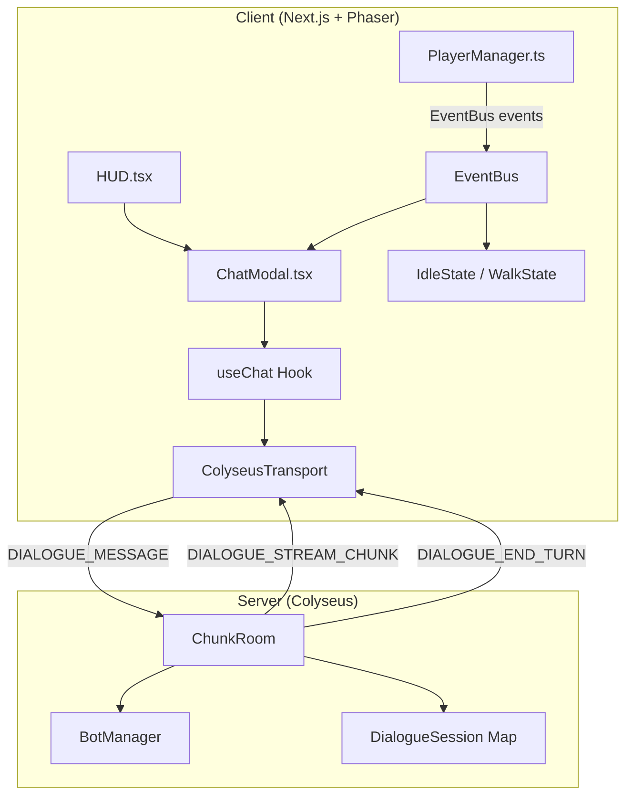
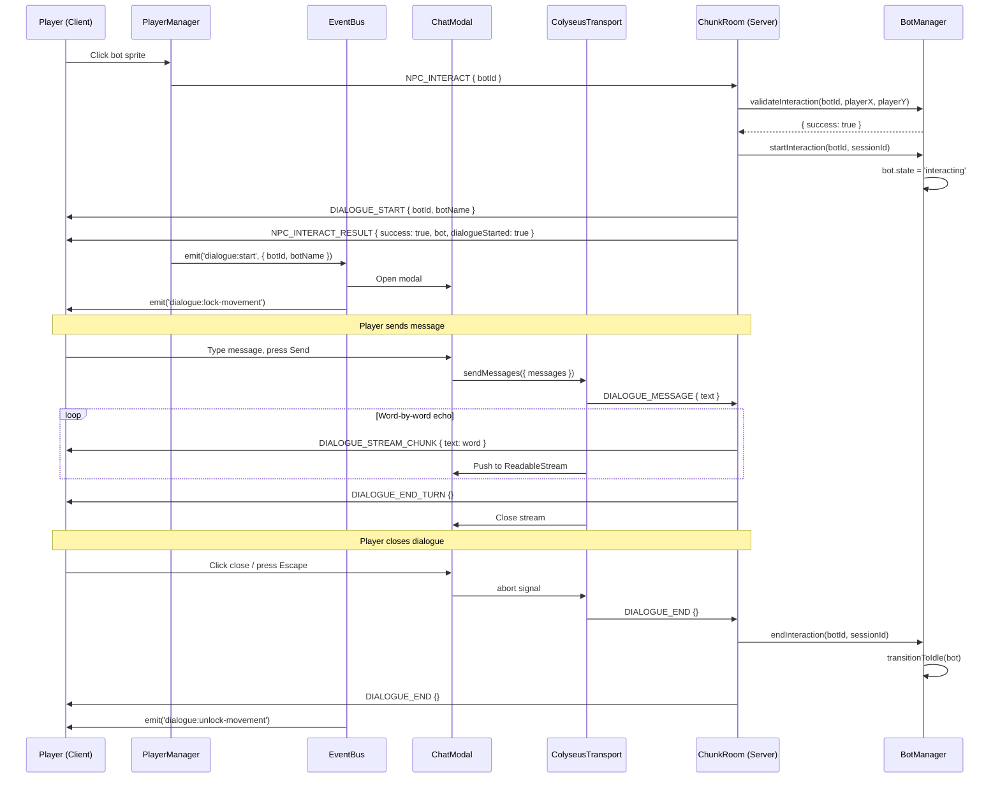
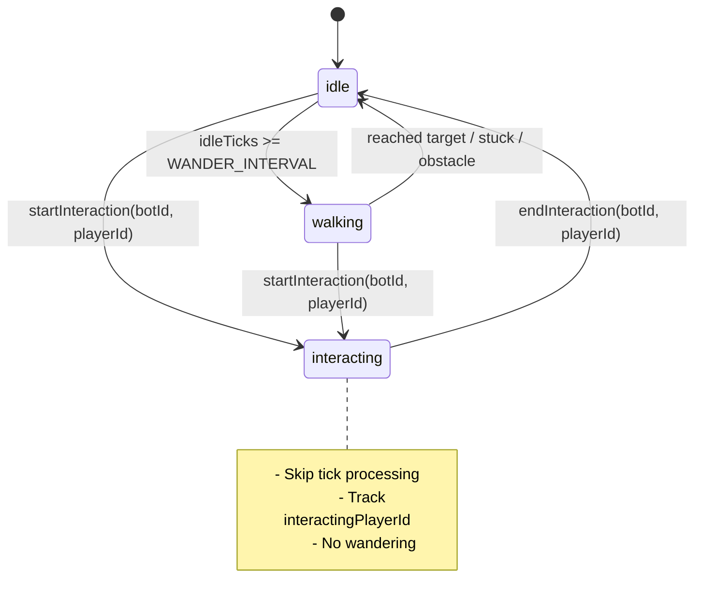

# Design-020: NPC Dialogue System

## Overview

Implement player-bot dialogue with a chat modal UI using AI SDK's `useChat` hook connected via a custom Colyseus WebSocket transport. For MVP, the server echoes back user messages with pseudo-streaming (word-by-word chunks, no real AI). Bot stops moving during dialogue, player movement is locked. This is the first step toward full AI-powered NPC conversations described in `npc-service.md`.

## Design Summary (Meta)

```yaml
design_type: "new_feature"
risk_level: "medium"
complexity_level: "medium"
complexity_rationale: >
  (1) ACs require coordinating 4 layers (shared types -> server handlers -> Colyseus transport -> React UI),
  managing 3 bot states (idle/walking/interacting), and bridging two streaming paradigms (Colyseus messages -> ReadableStream).
  (2) Risk: AI SDK ChatTransport interface is not widely documented for custom WebSocket transports;
  the exact contract (return type, stream format) requires careful implementation.
main_constraints:
  - "Must use AI SDK useChat hook with custom Colyseus transport (user decision)"
  - "No AI in MVP - server echoes back user messages with pseudo-streaming"
  - "Single-phase interaction: NPC_INTERACT directly starts dialogue (user decision)"
  - "Follow existing message protocol pattern (ClientMessage/ServerMessage enums)"
  - "Movement lock on both client (input disabled) and server (MOVE rejected)"
biggest_risks:
  - "AI SDK ChatTransport interface compatibility: custom transport must produce correct stream format"
  - "Race condition: player disconnects during active dialogue stream"
  - "Timer cleanup: pseudo-streaming setTimeout chain must be cancelled on disconnect/abort"
unknowns:
  - "Exact AI SDK ChatTransport interface contract (sendMessages return type)"
  - "Optimal pseudo-streaming delay for natural feel (100ms per word is initial guess)"
```

## Background and Context

### Prerequisite ADRs

- [ADR-0013: NPC Bot Entity Architecture](../adr/ADR-0013-npc-bot-entity-architecture.md) -- Colyseus state separation (`bots` MapSchema), BotManager placement in `npc-service/lifecycle/`, interaction protocol (`NPC_INTERACT`/`NPC_INTERACT_RESULT`)
- [ADR-0006: Chunk-Based Room Architecture](../adr/ADR-0006-chunk-based-room-architecture.md) -- ChunkRoom lifecycle, message handling patterns

### Agreement Checklist

#### Scope
- [x] Add `interacting` state to `BotAnimState` (shared types)
- [x] Add dialogue message types to `ClientMessage`/`ServerMessage` enums
- [x] Server: BotManager interacting state, dialogue handlers, movement lock
- [x] Server: Pseudo-streaming echo handler (word-by-word with delays)
- [x] Client: `ColyseusTransport` implementing AI SDK ChatTransport interface
- [x] Client: `ChatModal` React component with `useChat` + `GameModal`
- [x] Client: HUD integration for chat modal open/close
- [x] Client: Player movement lock during dialogue (input disabled)
- [x] Cleanup on disconnect, abort, and close

#### Non-Scope (Explicitly not changing)
- [x] No real AI integration (no Claude API calls, no AI service)
- [x] No NPC memory system or personality
- [x] No multi-player dialogue (1:1 exclusive only)
- [x] No changes to existing bot wandering/walking behavior
- [x] No changes to PlayerSprite rendering
- [x] No changes to existing NPC_INTERACT validation logic (distance check)

#### Constraints
- [x] Parallel operation: No (new feature, no migration needed)
- [x] Backward compatibility: Required (existing NPC_INTERACT must still work for clients without dialogue support)
- [x] Performance measurement: Not required for MVP

### Design Reflection
- Scope items map to Components 1-6 below
- Non-scope explicitly excludes AI service (matches "no AI in MVP" agreement)
- Backward compatibility: `NPC_INTERACT_RESULT` response shape is extended (new `dialogueStarted` field), existing clients ignore unknown fields

### Problem to Solve

Players can click on NPC bots and receive an `NPC_INTERACT_RESULT` message, but there is no dialogue or chat experience. The interaction is a dead end -- the client receives bot data but has nothing to display or do with it. This design adds the first interactive conversation layer.

### Current Challenges

1. No dialogue UI exists -- `NPC_INTERACT_RESULT` is emitted via EventBus but no component consumes it for chat
2. No bot state for "in conversation" -- bots continue wandering during interaction
3. No player movement restriction -- player can walk away during interaction
4. No streaming infrastructure -- future AI responses will need streaming, so the transport layer should be established now

### Requirements

#### Functional Requirements

- FR-1: Player clicks bot, dialogue modal opens with bot name
- FR-2: Player types message, bot responds with echo (pseudo-streamed)
- FR-3: Bot enters `interacting` state (stops moving) during dialogue
- FR-4: Player movement is locked during dialogue (both client and server)
- FR-5: Player can close dialogue (close button or Escape key)
- FR-6: Dialogue cleans up on player disconnect
- FR-7: Only one player can dialogue with a given bot at a time (1:1 exclusive)

#### Non-Functional Requirements

- **Performance**: Pseudo-streaming response should start within 200ms of message send
- **Reliability**: Server-side cleanup must handle all edge cases (disconnect, abort, room dispose)
- **Maintainability**: Transport layer swappable for real AI service without UI changes

## Applicable Standards

### Classification Table

| Standard | Type | Source | Impact on Design |
|----------|------|--------|-----------------|
| Prettier: single quotes | Explicit | `.prettierrc` | All new code uses single quotes |
| ESLint: `@nx/enforce-module-boundaries` | Explicit | `eslint.config.mjs` | Shared types in `packages/shared`, no cross-app imports |
| TypeScript strict mode | Explicit | `tsconfig.json` | All types must be explicit, no implicit any |
| `ClientMessage`/`ServerMessage` enum pattern | Implicit | `packages/shared/src/types/messages.ts` | New message types follow `as const` object pattern |
| EventBus bridge pattern (Phaser <-> React) | Implicit | `apps/game/src/game/EventBus.ts` | Dialogue events bridge via EventBus |
| BotManager decoupled from Colyseus | Implicit | `apps/server/src/npc-service/lifecycle/BotManager.ts` | BotManager returns updates, ChunkRoom applies to schema |
| GameModal + Radix Dialog pattern | Implicit | `apps/game/src/components/hud/GameModal.tsx` | Chat modal reuses GameModal component |
| Factory function pattern for entities | Implicit | `apps/server/src/npc-service/types/bot-types.ts` | Follow `createServerBot` pattern for any new factories |
| Shared types in `packages/shared` | Implicit | `packages/shared/src/types/` | All client-server contract types go in shared package |

## Acceptance Criteria (AC) - EARS Format

### FR-1: Dialogue Initiation

- [ ] **When** the server validates a successful `NPC_INTERACT` request, the system shall transition the bot to `interacting` state, send `DIALOGUE_START` to the client, and open the chat modal displaying the bot's name
- [ ] **If** the bot is already in `interacting` state (another player is dialoguing), **then** the system shall respond with `NPC_INTERACT_RESULT { success: false, error: 'Bot is busy' }`
- [ ] **While** the bot is in `interacting` state, the system shall render the bot as idle (no walking animation)

### FR-2: Message Exchange

- [ ] **When** the player submits a message in the chat modal, the system shall send `DIALOGUE_MESSAGE` to the server and display the message in the chat
- [ ] **When** the server receives `DIALOGUE_MESSAGE`, the system shall echo the message text back via `DIALOGUE_STREAM_CHUNK` messages (one per word, ~100ms intervals) followed by `DIALOGUE_END_TURN`
- [ ] **While** the bot is responding (streaming), the system shall display a typing indicator and disable the send button

### FR-3: Bot State During Dialogue

- [ ] **While** a bot is in `interacting` state, the system shall skip tick processing for that bot (no wandering, no stuck detection)
- [ ] **When** dialogue ends, the system shall transition the bot back to `idle` state with `idleTicks` reset to 0

### FR-4: Player Movement Lock

- [ ] **While** the player is in a dialogue session, the system shall reject `MOVE` messages on the server
- [ ] **While** the player is in a dialogue session, the system shall disable keyboard and click-to-move input on the client

### FR-5: Dialogue Termination

- [ ] **When** the player clicks the close button or presses Escape, the system shall send `DIALOGUE_END` to the server and close the chat modal
- [ ] **When** the server receives `DIALOGUE_END`, the system shall cancel any in-progress pseudo-streaming and return the bot to `idle` state

### FR-6: Disconnect Cleanup

- [ ] **When** a player disconnects while in dialogue, the system shall cancel streaming, end the dialogue session, and return the bot to `idle` state
- [ ] **When** the room disposes, the system shall clean up all active dialogue sessions

### FR-7: Exclusive Access

- [ ] **If** a second player attempts to interact with a bot that is already in dialogue, **then** the system shall reject the interaction with an error message

## Existing Codebase Analysis

### Implementation Path Mapping

| Type | Path | Description |
|------|------|-------------|
| Existing | `packages/shared/src/types/messages.ts` | Message type enums - extend with dialogue messages |
| Existing | `packages/shared/src/types/npc.ts` | BotAnimState, NpcInteractResult - extend |
| Existing | `apps/server/src/npc-service/lifecycle/BotManager.ts` | Bot state machine - add `interacting` state |
| Existing | `apps/server/src/npc-service/types/bot-types.ts` | ServerBot, InteractionResult - extend |
| Existing | `apps/server/src/rooms/ChunkRoom.ts` | Message handlers - add dialogue handlers |
| Existing | `apps/server/src/rooms/ChunkRoomState.ts` | ChunkBot schema - state field already supports any string |
| Existing | `apps/game/src/game/multiplayer/PlayerManager.ts` | Room event listeners - add dialogue message listeners |
| Existing | `apps/game/src/components/hud/HUD.tsx` | React HUD - add ChatModal |
| Existing | `apps/game/src/game/entities/states/IdleState.ts` | Idle state - check movement lock |
| Existing | `apps/game/src/game/entities/states/WalkState.ts` | Walk state - check movement lock |
| New | `apps/game/src/services/ColyseusTransport.ts` | Custom AI SDK transport |
| New | `apps/game/src/components/hud/ChatModal.tsx` | Chat modal component |
| New | `packages/shared/src/types/dialogue.ts` | Dialogue payload types |

### Code Inspection Evidence

| File Inspected | Key Finding | Design Impact |
|---------------|-------------|---------------|
| `packages/shared/src/types/messages.ts` | Uses `as const` object pattern for message enums, typed via `keyof typeof` | New dialogue messages follow same pattern |
| `packages/shared/src/types/npc.ts` | `BotAnimState` is a union type `'idle' \| 'walking'` | Must extend to include `'interacting'` |
| `apps/server/src/npc-service/lifecycle/BotManager.ts:249-254` | `tickBot()` dispatches on `bot.state` with if/else | Must add `interacting` branch that returns `false` (skip) |
| `apps/server/src/npc-service/lifecycle/BotManager.ts:357-363` | `transitionToIdle()` resets targetX/Y, idleTicks, walkStartTime | Reuse for dialogue end cleanup |
| `apps/server/src/rooms/ChunkRoom.ts:103-109` | `onMessage` handlers follow pattern: validate payload, get player, delegate to manager | New dialogue handlers follow same pattern |
| `apps/server/src/rooms/ChunkRoom.ts:635-680` | `handleMove()` gets player from World, applies delta | Add dialogue-session check before processing |
| `apps/server/src/rooms/ChunkRoom.ts:547-618` | `onLeave()` saves positions, cleans up bots on last player leave | Must clean up active dialogue session |
| `apps/game/src/game/multiplayer/PlayerManager.ts:271-277` | Listens for `NPC_INTERACT_RESULT` and emits via EventBus | Extend to also listen for dialogue-specific messages |
| `apps/game/src/components/hud/HUD.tsx:22-23` | Modal state managed with `useState(false)` | ChatModal follows same pattern |
| `apps/game/src/components/hud/GameModal.tsx:20-76` | Radix Dialog with NineSlicePanel, close button, title | ChatModal wraps GameModal with chat-specific content |
| `apps/game/src/game/entities/states/IdleState.ts:36-44` | Checks `inputController.isMoving()` and `moveTarget` for walk transition | Must also check movement lock flag |
| `apps/game/src/game/entities/states/WalkState.ts:47-65` | Checks keyboard input and moveTarget | Must check movement lock, transition to idle if locked |
| `apps/game/src/game/scenes/Game.ts:181-202` | Click-to-move handler on `pointerup` | Must check movement lock before setting moveTarget |

### Similar Functionality Search

- **Chat/dialogue**: No existing chat or dialogue components found in the codebase
- **Streaming**: No existing streaming infrastructure in the codebase
- **Modal patterns**: `GameModal` component exists and will be reused
- **Transport/SDK**: No AI SDK usage in the codebase (packages must be added)

**Decision**: New implementation following existing design patterns. No duplication risk.

## Design

### Change Impact Map

```yaml
Change Target: NPC Dialogue System
Direct Impact:
  - packages/shared/src/types/messages.ts (add 4 new message types)
  - packages/shared/src/types/npc.ts (extend BotAnimState, NpcInteractResult)
  - apps/server/src/npc-service/lifecycle/BotManager.ts (add interacting state, dialogue methods)
  - apps/server/src/npc-service/types/bot-types.ts (extend ServerBot, InteractionResult)
  - apps/server/src/rooms/ChunkRoom.ts (add dialogue handlers, movement lock)
  - apps/game/src/game/multiplayer/PlayerManager.ts (add dialogue event listeners)
  - apps/game/src/components/hud/HUD.tsx (add ChatModal integration)
  - apps/game/src/game/entities/states/IdleState.ts (movement lock check)
  - apps/game/src/game/entities/states/WalkState.ts (movement lock check)
  - apps/game/src/game/scenes/Game.ts (movement lock for click-to-move)
Indirect Impact:
  - apps/game/package.json (add ai, @ai-sdk/react dependencies)
  - apps/game/src/app/global.css (add chat modal styles)
No Ripple Effect:
  - Bot wandering/walking behavior (unchanged, interacting state simply skips tick)
  - Player sprite rendering (unchanged)
  - Map loading, chunk transitions (unchanged)
  - Database schema (no changes)
  - Colyseus ChunkRoomState schema (state field is already string type)
```

### Architecture Overview



### Data Flow



### Bot State Machine Diagram



### Integration Point Map

```yaml
## Integration Point Map
Integration Point 1:
  Existing Component: ChunkRoom.handleNpcInteract()
  Integration Method: Extend success path to call BotManager.startInteraction() and send DIALOGUE_START
  Impact Level: High (Process Flow Change)
  Required Test Coverage: Verify existing NPC_INTERACT still works, verify dialogue starts on success

Integration Point 2:
  Existing Component: ChunkRoom.handleMove()
  Integration Method: Add dialogue-session check at start of method
  Impact Level: Medium (Data Usage - reads dialogue session map)
  Required Test Coverage: Verify movement rejected during dialogue, allowed otherwise

Integration Point 3:
  Existing Component: ChunkRoom.onLeave()
  Integration Method: Add dialogue cleanup before existing cleanup logic
  Impact Level: Medium (Process Flow Extension)
  Required Test Coverage: Verify bot returns to idle on player disconnect

Integration Point 4:
  Existing Component: PlayerManager.setupRoomEvents()
  Integration Method: Add listeners for DIALOGUE_START, DIALOGUE_STREAM_CHUNK, DIALOGUE_END_TURN
  Impact Level: Medium (Event Addition)
  Required Test Coverage: Verify EventBus events fire correctly

Integration Point 5:
  Existing Component: HUD.tsx
  Integration Method: Add ChatModal component and EventBus listeners
  Impact Level: Low (UI Addition)
  Required Test Coverage: Verify modal opens/closes on events

Integration Point 6:
  Existing Component: IdleState.update() / WalkState.update() / Game.ts click-to-move
  Integration Method: Check EventBus movement-lock flag
  Impact Level: Medium (Input gating)
  Required Test Coverage: Verify no movement during dialogue
```

### Main Components

#### Component 1: Shared Types (`packages/shared`)

- **Responsibility**: Define all dialogue-related types and message constants shared between client and server
- **Interface**: Type exports consumed by both apps
- **Dependencies**: None (leaf package)

#### Component 2: BotManager Dialogue Extensions (`apps/server`)

- **Responsibility**: Manage bot `interacting` state, track bot-player dialogue sessions, skip ticks for interacting bots
- **Interface**: `startInteraction(botId, playerId)`, `endInteraction(botId, playerId)`, `isInteracting(botId)`
- **Dependencies**: Existing BotManager, ServerBot type

#### Component 3: ChunkRoom Dialogue Handlers (`apps/server`)

- **Responsibility**: Handle `DIALOGUE_MESSAGE` and `DIALOGUE_END` client messages, run pseudo-streaming echo, enforce movement lock, clean up on disconnect
- **Interface**: Colyseus `onMessage` handlers
- **Dependencies**: BotManager, ChunkRoomState

#### Component 4: ColyseusTransport (`apps/game`)

- **Responsibility**: Bridge AI SDK `useChat` hook with Colyseus room messaging. Convert Colyseus WebSocket events into a `ReadableStream` consumable by AI SDK
- **Interface**: Implements AI SDK `ChatTransport` interface (`sendMessages` method)
- **Dependencies**: `@colyseus/sdk` Room, `ai` package types

#### Component 5: ChatModal (`apps/game`)

- **Responsibility**: Render dialogue UI -- message list, input field, send button, close button. Use `useChat` hook with `ColyseusTransport`
- **Interface**: React component with `open`, `onOpenChange`, `botName`, `transport` props
- **Dependencies**: `@ai-sdk/react`, GameModal, ColyseusTransport

#### Component 6: Movement Lock System

- **Responsibility**: Disable player input (keyboard + click-to-move) during dialogue
- **Interface**: EventBus events `dialogue:lock-movement` / `dialogue:unlock-movement`; global flag checked by IdleState, WalkState, and Game scene
- **Dependencies**: EventBus, IdleState, WalkState, Game scene

### Contract Definitions

#### New Message Types

```typescript
// packages/shared/src/types/messages.ts - additions

export const ClientMessage = {
  // ... existing
  DIALOGUE_MESSAGE: 'dialogue_message',
  DIALOGUE_END: 'dialogue_end',
} as const;

export const ServerMessage = {
  // ... existing
  DIALOGUE_START: 'dialogue_start',
  DIALOGUE_STREAM_CHUNK: 'dialogue_stream_chunk',
  DIALOGUE_END_TURN: 'dialogue_end_turn',
} as const;
```

#### Dialogue Payload Types

```typescript
// packages/shared/src/types/dialogue.ts

/** Client -> Server: player sends a chat message */
export interface DialogueMessagePayload {
  text: string;
}

/** Server -> Client: dialogue session started */
export interface DialogueStartPayload {
  botId: string;
  botName: string;
}

/** Server -> Client: streaming text chunk */
export interface DialogueStreamChunkPayload {
  text: string;
}

/** Client -> Server / Server -> Client: dialogue ended */
// No payload needed (empty object)
```

#### Extended BotAnimState

```typescript
// packages/shared/src/types/npc.ts - modification
export type BotAnimState = 'idle' | 'walking' | 'interacting';
```

#### Extended NpcInteractResult

```typescript
// packages/shared/src/types/npc.ts - modification
export type NpcInteractResult =
  | { success: true; bot: NpcBotData; dialogueStarted: true }
  | { success: false; error: string };
```

#### Extended ServerBot

```typescript
// apps/server/src/npc-service/types/bot-types.ts - addition
export interface ServerBot {
  // ... existing fields
  /** Session ID of player currently interacting. null when not in dialogue. */
  interactingPlayerId: string | null;
}
```

#### BotManager New Methods

```typescript
// apps/server/src/npc-service/lifecycle/BotManager.ts - additions

/**
 * Start a dialogue interaction between a player and a bot.
 * Sets bot state to 'interacting' and records the player session.
 * Returns false if bot is already interacting with another player.
 */
startInteraction(botId: string, playerId: string): boolean;

/**
 * End a dialogue interaction.
 * Returns bot to idle state and clears interactingPlayerId.
 * No-op if playerId doesn't match the interacting player.
 */
endInteraction(botId: string, playerId: string): void;

/**
 * Check if a bot is currently in dialogue.
 */
isInteracting(botId: string): boolean;

/**
 * End all interactions for a given player (used on disconnect cleanup).
 */
endAllInteractionsForPlayer(playerId: string): void;
```

### Data Contract

#### ColyseusTransport.sendMessages()

```yaml
Input:
  Type: "{ chatId: string; trigger: string; messages: UIMessage[]; abortSignal?: AbortSignal }"
  Preconditions: Room must be connected, dialogue session must be active
  Validation: Check room exists, extract last user message text

Output:
  Type: "ReadableStream (UIMessageStream format)"
  Guarantees: Stream emits text deltas for each DIALOGUE_STREAM_CHUNK, closes on DIALOGUE_END_TURN
  On Error: Stream closes with error if room disconnects

Invariants:
  - One active stream per transport instance at a time
  - Previous stream is cancelled before starting new one
  - AbortSignal cancellation sends DIALOGUE_END to server
```

#### ChunkRoom Dialogue Session

```yaml
Input:
  Type: "Map<sessionId, { botId: string, streamTimers: NodeJS.Timeout[] }>"
  Preconditions: Player must exist in room, bot must be available
  Validation: Check session not already in dialogue, check bot not interacting

Output:
  Type: "DIALOGUE_STREAM_CHUNK and DIALOGUE_END_TURN messages sent to client"
  Guarantees: All timers cancelled on end/disconnect, bot returns to idle
  On Error: Silent cleanup (log + return bot to idle)

Invariants:
  - One dialogue session per player
  - One player per bot
  - Session always cleaned up (disconnect, end, dispose)
```

### Data Representation Decisions

| Data Structure | Decision | Rationale |
|---|---|---|
| `BotAnimState` | **Extend** existing union type | Adding `'interacting'` to existing `'idle' \| 'walking'` union is a non-breaking extension. All consumers that switch on state will need an `interacting` branch, but TypeScript exhaustiveness checking will catch missing cases. |
| `NpcInteractResult` | **Extend** existing discriminated union | Adding `dialogueStarted: true` to the success variant. Existing clients that don't check this field are unaffected. |
| `DialogueMessagePayload` etc. | **New** dedicated types | No existing types for dialogue payloads. These represent a new domain concept. |
| `ServerBot.interactingPlayerId` | **Extend** existing interface | Adding one nullable field to track dialogue partner. Minimal change with clear semantics. |
| Dialogue session tracking (server) | **New** `Map<sessionId, DialogueSession>` in ChunkRoom | No existing session tracking mechanism. This is room-level state, not BotManager responsibility. |

### Field Propagation Map

```yaml
fields:
  - name: "text (user message)"
    origin: "ChatModal input field (user types text)"
    transformations:
      - layer: "ColyseusTransport"
        type: "string"
        validation: "non-empty, trimmed"
      - layer: "Colyseus WebSocket"
        type: "DialogueMessagePayload { text: string }"
        transformation: "wrapped in payload object"
      - layer: "ChunkRoom handler"
        type: "string"
        validation: "typeof text === 'string', non-empty"
        transformation: "split into words for echo streaming"
      - layer: "DIALOGUE_STREAM_CHUNK"
        type: "DialogueStreamChunkPayload { text: string }"
        transformation: "one word per chunk + trailing space"
    destination: "ChatModal message display via useChat"
    loss_risk: "none"

  - name: "botId / botName (dialogue context)"
    origin: "BotManager.validateInteraction() result"
    transformations:
      - layer: "ChunkRoom"
        type: "{ botId: string, botName: string }"
        transformation: "extracted from InteractionResult"
      - layer: "DIALOGUE_START message"
        type: "DialogueStartPayload"
        transformation: "sent as Colyseus message"
      - layer: "EventBus"
        type: "{ botId: string, botName: string }"
        transformation: "emitted as event data"
    destination: "ChatModal header (botName), ColyseusTransport (botId for context)"
    loss_risk: "none"
```

### State Transitions and Invariants

```yaml
State Definition:
  - Initial State: No dialogue session (player not in dialogue, bot in idle/walking)
  - Possible States:
    - NO_DIALOGUE: Player moves freely, bot wanders
    - DIALOGUE_ACTIVE: Player locked, bot interacting, messages can be exchanged
    - DIALOGUE_STREAMING: Subset of ACTIVE -- server is sending stream chunks

State Transitions:
  NO_DIALOGUE -> DIALOGUE_ACTIVE: NPC_INTERACT success
  DIALOGUE_ACTIVE -> DIALOGUE_STREAMING: DIALOGUE_MESSAGE received by server
  DIALOGUE_STREAMING -> DIALOGUE_ACTIVE: DIALOGUE_END_TURN sent by server
  DIALOGUE_ACTIVE -> NO_DIALOGUE: DIALOGUE_END (from client or disconnect cleanup)
  DIALOGUE_STREAMING -> NO_DIALOGUE: DIALOGUE_END or disconnect (cancels stream)

System Invariants:
  - A bot in 'interacting' state always has exactly one interactingPlayerId
  - A player in a dialogue session always has a corresponding entry in ChunkRoom's dialogueSessions map
  - When a dialogue session ends, both the bot state AND the session map entry are cleaned up
  - Movement is locked if and only if the player has an active dialogue session
```

### Integration Boundary Contracts

```yaml
Boundary 1: ColyseusTransport <-> ChunkRoom
  Input: ClientMessage.DIALOGUE_MESSAGE { text: string }
  Output: Async sequence of ServerMessage.DIALOGUE_STREAM_CHUNK { text: string }, then ServerMessage.DIALOGUE_END_TURN {}
  On Error: If room disconnects, transport stream errors; if message invalid, server logs and ignores

Boundary 2: EventBus (Phaser <-> React)
  Input: EventBus.emit('dialogue:start', { botId, botName }) from PlayerManager
  Output: Sync -- ChatModal opens via HUD state change
  On Error: If no listener registered, event is silently dropped (EventBus behavior)

Boundary 3: BotManager <-> ChunkRoom
  Input: ChunkRoom calls startInteraction(botId, sessionId)
  Output: Sync boolean (true if started, false if bot busy)
  On Error: Returns false, ChunkRoom sends error to client

Boundary 4: Movement Lock (EventBus flag)
  Input: EventBus.emit('dialogue:lock-movement') / EventBus.emit('dialogue:unlock-movement')
  Output: Global flag read by IdleState, WalkState, Game.ts click handler
  On Error: If flag stuck (unlock never fired), player must reload -- mitigated by cleanup in onLeave
```

### Interface Change Impact Analysis

| Existing Operation | New Operation | Conversion Required | Adapter Required | Compatibility Method |
|-------------------|---------------|-------------------|------------------|---------------------|
| `BotManager.tickBot(bot)` | `BotManager.tickBot(bot)` -- extended | None | Not Required | Add `interacting` branch returning false |
| `BotManager.validateInteraction()` | `BotManager.validateInteraction()` -- extended | None | Not Required | Add `isInteracting` check before distance check |
| `ChunkRoom.handleNpcInteract()` | `ChunkRoom.handleNpcInteract()` -- extended | None | Not Required | Add dialogue start on success path |
| `ChunkRoom.handleMove()` | `ChunkRoom.handleMove()` -- extended | None | Not Required | Add dialogue session check at entry |
| `ChunkRoom.onLeave()` | `ChunkRoom.onLeave()` -- extended | None | Not Required | Add dialogue cleanup before existing logic |
| `IdleState.update()` | `IdleState.update()` -- extended | None | Not Required | Add movement lock check before walk transition |
| `WalkState.update()` | `WalkState.update()` -- extended | None | Not Required | Add movement lock check, transition to idle if locked |
| N/A (new) | `ColyseusTransport.sendMessages()` | N/A | N/A | New class implementing ChatTransport |
| N/A (new) | `ChatModal` component | N/A | N/A | New React component |

### Error Handling

| Error Scenario | Detection | Handling | Recovery |
|---------------|-----------|----------|----------|
| Bot not found during dialogue message | `BotManager.isInteracting(botId)` returns false | Log warning, send `DIALOGUE_END` to client | Client closes modal |
| Player sends DIALOGUE_MESSAGE without active session | `dialogueSessions.has(sessionId)` check | Ignore message, log warning | No action needed |
| Player disconnects during streaming | `onLeave()` fires | Cancel all timers, call `endInteraction`, clean session map | Bot returns to idle |
| Room disposes during dialogue | `onDispose()` fires | BotManager.destroy() clears all bots | Clean shutdown |
| ColyseusTransport room is null | Null check in `sendMessages` | Reject promise / close stream with error | useChat shows error state |
| Abort signal fired (user closes modal during stream) | AbortSignal listener | Send `DIALOGUE_END` to server, close stream | Server cleans up on receipt |

### Logging and Monitoring

```
[ChunkRoom] Dialogue started: sessionId={sid}, botId={bid}, botName={name}
[ChunkRoom] Dialogue message: sessionId={sid}, text={truncated}
[ChunkRoom] Dialogue streaming: sessionId={sid}, chunks={n}, totalMs={ms}
[ChunkRoom] Dialogue ended: sessionId={sid}, botId={bid}, reason={close|disconnect|abort}
[ChunkRoom] Dialogue cleanup on leave: sessionId={sid}
[BotManager] Bot interacting: botId={bid}, playerId={pid}
[BotManager] Bot interaction ended: botId={bid}
```

## Implementation Plan

### Implementation Approach

**Selected Approach**: Vertical Slice (Feature-driven)

**Selection Reason**: The dialogue system is a self-contained feature that touches all layers (shared types -> server -> client). Implementing vertically allows early end-to-end verification. Each phase delivers a testable slice: Phase 1 establishes the contract, Phase 2 makes the server functional, Phase 3 connects the client UI.

### Technical Dependencies and Implementation Order

#### 1. Shared Types (Foundation)
- **Technical Reason**: Both server and client depend on these type definitions
- **Dependent Elements**: All other components

#### 2. BotManager Extensions (Server Core)
- **Technical Reason**: ChunkRoom dialogue handlers depend on BotManager interacting state
- **Prerequisites**: Shared types

#### 3. ChunkRoom Dialogue Handlers (Server Integration)
- **Technical Reason**: Client transport depends on server sending correct messages
- **Prerequisites**: BotManager extensions, shared types

#### 4. ColyseusTransport + ChatModal (Client)
- **Technical Reason**: Requires server to be functional for end-to-end testing
- **Prerequisites**: Server dialogue handlers operational

#### 5. Movement Lock (Cross-cutting)
- **Technical Reason**: Can be implemented in parallel with client UI, but requires EventBus events from step 4
- **Prerequisites**: Dialogue events flowing

### Integration Points

**Integration Point 1: Shared Types -> Server**
- Components: `packages/shared/types` -> `apps/server/npc-service/BotManager`
- Verification: TypeScript compilation succeeds, BotManager unit tests pass with new state

**Integration Point 2: Server Handlers -> Client Transport**
- Components: `ChunkRoom` -> `ColyseusTransport`
- Verification: Manual test: send NPC_INTERACT, verify DIALOGUE_START received, send DIALOGUE_MESSAGE, verify stream chunks received

**Integration Point 3: Client Transport -> ChatModal**
- Components: `ColyseusTransport` -> `useChat` -> `ChatModal`
- Verification: Full dialogue flow: click bot -> modal opens -> type message -> see echo response streamed -> close modal

**Integration Point 4: Movement Lock**
- Components: `EventBus` -> `IdleState` + `WalkState` + `Game.ts`
- Verification: During dialogue, WASD/arrows and click-to-move are disabled; after close, movement works again

## Test Strategy

### Basic Test Design Policy

Test cases derived from acceptance criteria. Each AC maps to at least one test.

### Unit Tests

**BotManager:**
- `startInteraction()` sets bot state to `interacting`, records playerId -> returns true
- `startInteraction()` on already-interacting bot -> returns false
- `endInteraction()` returns bot to `idle`, clears interactingPlayerId
- `endInteraction()` with wrong playerId -> no-op
- `endAllInteractionsForPlayer()` cleans up all bots for that player
- `tickBot()` on interacting bot -> returns false (skip)
- `validateInteraction()` on interacting bot -> returns `{ success: false, error: 'Bot is busy' }`

**ColyseusTransport:**
- `sendMessages()` extracts last user message text and sends via room
- `sendMessages()` creates ReadableStream that emits text deltas from DIALOGUE_STREAM_CHUNK
- `sendMessages()` stream closes on DIALOGUE_END_TURN
- AbortSignal cancellation sends DIALOGUE_END to room
- `sendMessages()` with null room -> stream errors

### Integration Tests

**ChunkRoom Dialogue Flow:**
- NPC_INTERACT success -> bot state becomes `interacting`, DIALOGUE_START sent
- DIALOGUE_MESSAGE -> echo chunks received word-by-word, DIALOGUE_END_TURN sent
- DIALOGUE_END -> bot returns to `idle`
- MOVE during dialogue -> rejected (no position change)
- Player disconnect during dialogue -> bot returns to `idle`
- Second player NPC_INTERACT on busy bot -> error response

### E2E Tests

**Full Dialogue Flow:**
- Click bot -> modal opens with bot name -> type "hello world" -> see "hello world" echoed word-by-word -> close modal -> movement works again

### Performance Tests

Not required for MVP (non-functional requirements note).

## Security Considerations

- **Input validation**: Server validates `DIALOGUE_MESSAGE` payload (must be string, reasonable length limit ~500 chars)
- **Rate limiting**: Not needed for MVP echo, but the handler structure should support future rate limiting
- **No PII concerns**: Echo handler does not persist messages or send to external services

## Future Extensibility

- **Real AI integration**: Replace pseudo-streaming echo with AI service call. `ColyseusTransport` remains unchanged; only the ChunkRoom handler changes from echo to AI API call
- **NPC personality**: `DIALOGUE_START` can include seed persona data for the AI
- **Conversation history**: Server can store message history in DB; `DIALOGUE_START` can load recent context
- **Multiple dialogue types**: Transport pattern supports different message formats via message metadata
- **Emotion/reaction system**: Bot could transition to emotion-specific animations during dialogue

## Alternative Solutions

### Alternative 1: Direct HTTP Transport (DefaultChatTransport)

- **Overview**: Use AI SDK's built-in `DefaultChatTransport` with a Next.js API route that proxies to the game server
- **Advantages**: Standard AI SDK usage, no custom transport code
- **Disadvantages**: Adds HTTP round-trip latency, requires separate API route, duplicates connection (HTTP + WebSocket), doesn't leverage existing Colyseus connection
- **Reason for Rejection**: User decision to use Colyseus WebSocket directly for lower latency and architectural consistency

### Alternative 2: No AI SDK (Raw Colyseus Messages)

- **Overview**: Build chat UI without AI SDK, directly using Colyseus messages and React state
- **Advantages**: No new dependencies, simpler implementation
- **Disadvantages**: Loses AI SDK streaming UI management, status tracking, message state management. Would need to reimplement these for future AI integration
- **Reason for Rejection**: AI SDK provides message management infrastructure that becomes critical when real AI is integrated. Establishing the transport pattern now avoids future rework.

### Alternative 3: Two-Phase Interaction (Inspect Then Talk)

- **Overview**: First click shows NPC info panel, second click (or "Talk" button) starts dialogue
- **Advantages**: Cleaner UX separation between inspection and dialogue
- **Disadvantages**: Extra click for MVP with no inspection content to show
- **Reason for Rejection**: User decision for single-phase (NPC_INTERACT directly starts dialogue). Can be added later when NPC info panels are implemented.

## Risks and Mitigation

| Risk | Impact | Probability | Mitigation |
|------|--------|-------------|------------|
| AI SDK ChatTransport interface incompatibility | High | Medium | Research exact interface before implementation; fall back to raw Colyseus if needed |
| Timer leak in pseudo-streaming (setTimeout chain) | Medium | Medium | Store timer IDs in dialogue session, cancel all in endDialogue/onLeave/onDispose |
| Movement lock flag stuck after crash | Medium | Low | EventBus cleanup in onLeave; worst case player reloads |
| Race condition: two interactions arrive simultaneously | Low | Low | BotManager.startInteraction() is synchronous, Colyseus processes messages sequentially |
| `ai` / `@ai-sdk/react` package size impact on client bundle | Low | Low | Tree-shaking should limit impact; monitor bundle size |

## References

- [AI SDK Documentation: Transport](https://ai-sdk.dev/docs/ai-sdk-ui/transport) -- Custom transport configuration
- [AI SDK Documentation: Chatbot](https://ai-sdk.dev/docs/ai-sdk-ui/chatbot) -- useChat hook usage and message parts
- [AI SDK Reference: DirectChatTransport](https://ai-sdk.dev/docs/reference/ai-sdk-ui/direct-chat-transport) -- sendMessages() method signature reference
- [Colyseus SDK: Room](https://docs.colyseus.io/client/room/) -- room.send() and onMessage() API
- [ADR-0013: NPC Bot Entity Architecture](../adr/ADR-0013-npc-bot-entity-architecture.md)
- [Design-019: NPC Bot-Companion System](../design/design-019-npc-bot-companion.md)

## Update History

| Date | Version | Changes | Author |
|------|---------|---------|--------|
| 2026-03-02 | 1.0 | Initial version | Claude (Technical Designer) |
