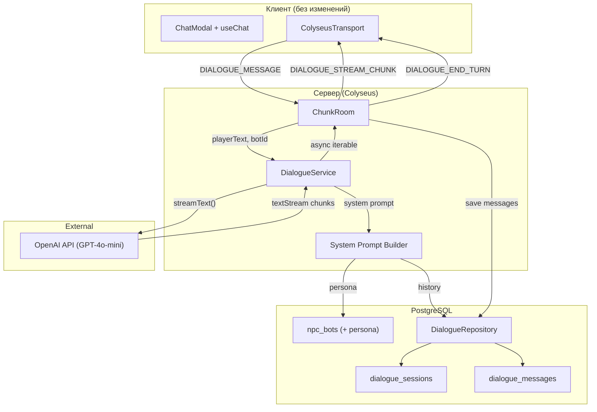
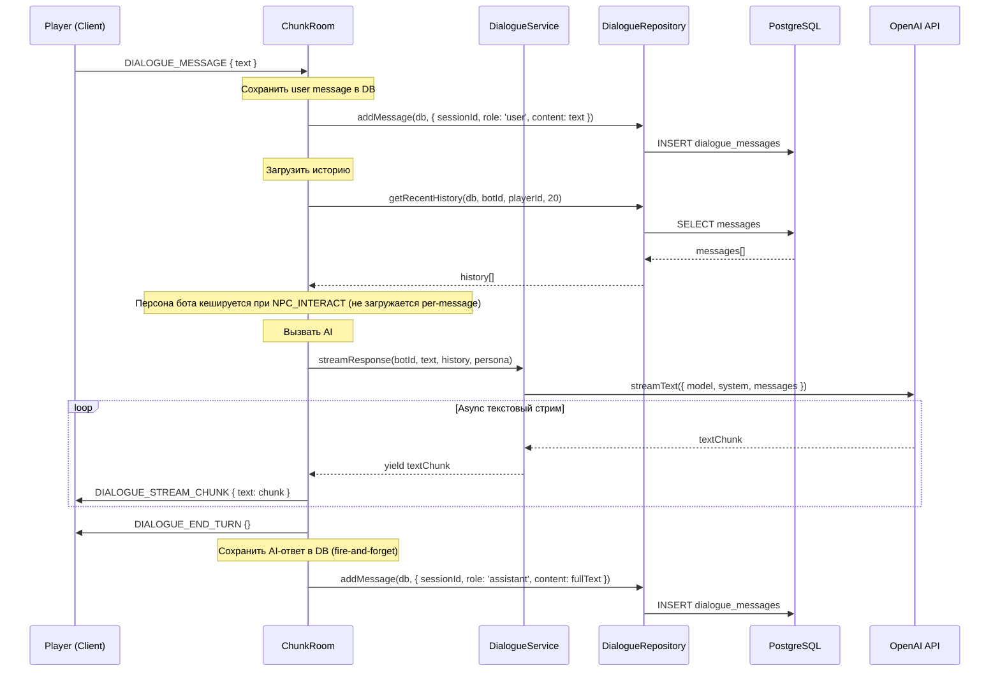

# Design-021: Интеграция AI-диалогов с персистентностью

## Обзор

Замена псевдо-стримингового echo-обработчика из Design-020 на реальные AI-ответы через OpenAI GPT-4o-mini посредством Vercel AI SDK. Добавление персистентности диалогов в PostgreSQL (таблицы `dialogue_sessions` и `dialogue_messages`) и системы персон NPC (расширение `npc_bots`). Клиентская часть остаётся полностью неизменной.

## Design Summary (Meta)

```yaml
design_type: "extension"
risk_level: "medium"
complexity_level: "medium"
complexity_rationale: >
  (1) AC требуют координации 4 компонентов (DialogueService -> ChunkRoom -> DB -> AI API),
  управления async stream lifecycle (AbortController), и best-effort DB persistence параллельно со стримингом.
  (2) Риски: AI API таймауты/rate limits требуют graceful fallback; fire-and-forget DB writes
  могут привести к потере данных при crash.
main_constraints:
  - "Существующий Colyseus WebSocket-протокол (DIALOGUE_STREAM_CHUNK/DIALOGUE_END_TURN) неизменен"
  - "Клиентская часть (ColyseusTransport, ChatModal) не модифицируется"
  - "DB-записи не блокируют стриминг (fire-and-forget)"
  - "OPENAI_API_KEY -- обязательная переменная окружения"
biggest_risks:
  - "OpenAI API таймаут/rate limit во время стриминга -- требуется graceful fallback"
  - "Fire-and-forget DB записи: потеря сообщений при crash между стримингом и сохранением"
  - "Размер контекстного окна: загрузка слишком большой истории замедляет AI-ответ"
unknowns:
  - "Оптимальное количество сообщений истории для контекста (10? 20? 50?)"
  - "Оптимальный системный промпт для RP-диалогов в контексте фермерской RPG"
  - "Поведение AI SDK v5 с OpenAI Responses API vs Chat Completions API"
```

## Фон и контекст

### Предпосылочные ADR

- [ADR-0014: AI-диалоги NPC через OpenAI + Vercel AI SDK](../adr/ADR-0014-ai-dialogue-openai-sdk.md) -- Выбор AI-провайдера (OpenAI GPT-4o-mini), паттерн интеграции (Colyseus WS), персистентность (PostgreSQL), персона (колонки в npc_bots)
- [ADR-0013: Архитектура сущности NPC бот-компаньона](../adr/ADR-0013-npc-bot-entity-architecture.md) -- Colyseus-состояние, BotManager, таблица npc_bots
- [ADR-0006: Chunk-Based Room Architecture](../adr/ADR-0006-chunk-based-room-architecture.md) -- ChunkRoom lifecycle, message handling

### Чеклист соглашений

#### Скоуп
- [x] Создать `DialogueService` -- сервис AI-генерации ответов
- [x] Создать `DialogueRepository` -- DB-сервис для диалогов
- [x] Создать DB-схемы: `dialogue_sessions`, `dialogue_messages`
- [x] Расширить `npc_bots` персона-колонками (`personality`, `role`, `speechStyle`)
- [x] Модифицировать `ChunkRoom.handleDialogueMessage()` -- заменить echo на AI
- [x] Модифицировать `ChunkRoom.dialogueSessions` -- добавить `dbSessionId` и `AbortController`
- [x] Расширить `ServerConfig` -- добавить `openaiApiKey`
- [x] Экспортировать новые сервисы и типы из `packages/db`

#### Не-скоуп (явно не изменяется)
- [x] Клиентская часть: ColyseusTransport, ChatModal, HUD, movement lock (Design-020 -- без изменений)
- [x] Colyseus WebSocket-протокол: DIALOGUE_START, DIALOGUE_MESSAGE, DIALOGUE_STREAM_CHUNK, DIALOGUE_END_TURN, DIALOGUE_END -- неизменен
- [x] BotManager: interacting state, validateInteraction, startInteraction, endInteraction -- без изменений
- [x] Пакет `packages/shared` -- никаких новых типов сообщений
- [x] Типы `BotAnimState`, `NpcInteractResult` -- без изменений
- [x] NPC memory/reflection система (GDD) -- будущая работа

#### Ограничения
- [x] Параллельная работа: Нет (расширение Design-020)
- [x] Обратная совместимость: Обязательна (бот без персоны получает default prompt)
- [x] Измерение производительности: Не требуется для MVP

### Отражение в дизайне
- Скоуп-элементы соответствуют Компонентам 1-7 ниже
- Не-скоуп явно исключает клиентские изменения (соглашение "zero client changes")
- Обратная совместимость: nullable персона-колонки, бот без персоны получает generic system prompt

### Решаемая проблема

ChunkRoom.handleDialogueMessage() в Design-020 реализует echo: сервер повторяет сообщения игрока по словам через setTimeout-цепочку. NPC не имеет интеллекта, персоны или памяти -- диалог не создаёт игрового опыта.

### Текущие проблемы

1. **Нет AI-ответов**: echo-обработчик -- заглушка без интеллекта
2. **Нет истории диалогов**: при закрытии диалога история теряется
3. **Нет персоны NPC**: все боты отвечают одинаково (echo)
4. **setTimeout-цепочка**: хрупкий механизм стриминга (timer cleanup, нет backpressure)

### Требования

#### Функциональные требования

- FR-1: NPC отвечает осмысленными AI-генерированными сообщениями вместо echo
- FR-2: AI-ответы стримятся чанками через существующий протокол
- FR-3: История диалогов сохраняется в PostgreSQL
- FR-4: AI использует историю предыдущих разговоров для контекста
- FR-5: NPC имеет настраиваемую персону (personality, role, speechStyle)
- FR-6: При ошибке AI -- graceful fallback сообщение
- FR-7: AI-запрос отменяется при disconnect/close диалога

#### Нефункциональные требования

- **Производительность**: Первый чанк AI-ответа < 2 секунд (включая загрузку истории)
- **Надёжность**: DB-сбой не блокирует диалоговый поток (best-effort persistence)
- **Стоимость**: < $0.50/час при 10 одновременных диалогах (GPT-4o-mini pricing)
- **Поддерживаемость**: Переключение AI-провайдера -- замена одного импорта

## Применимые стандарты

### Таблица классификации

| Стандарт | Тип | Источник | Влияние на дизайн |
|----------|-----|----------|-------------------|
| Prettier: single quotes, 2-space indent | Explicit | `.prettierrc`, `.editorconfig` | Весь новый код |
| ESLint: `@nx/enforce-module-boundaries` | Explicit | `eslint.config.mjs` | DB-сервисы в `packages/db`, server code в `apps/server` |
| TypeScript strict mode | Explicit | `tsconfig.json` | Все типы явные, без implicit any |
| Drizzle ORM schema pattern | Explicit | `drizzle.config.ts`, `packages/db/src/schema/` | Новые таблицы следуют pgTable + export type pattern |
| DB service pattern: `fn(db: DrizzleClient, ...)` | Implicit | `packages/db/src/services/npc-bot.ts` | DialogueRepository следует тому же паттерну |
| Barrel export pattern | Implicit | `packages/db/src/index.ts`, `packages/db/src/schema/index.ts` | Новые схемы и сервисы экспортируются через index.ts |
| Server config `loadConfig()` pattern | Implicit | `apps/server/src/config.ts` | `openaiApiKey` добавляется как обязательная env var |
| Fail-fast для критичных, fire-and-forget для некритичных | Implicit | `ChunkRoom.ts:570-575` (bot load error), `npc-bot.ts:100` (partial save) | AI-ошибка = fallback (не crash), DB-ошибка = log (не block) |
| Console.log с `[Module]` prefix | Implicit | `ChunkRoom.ts`, `BotManager.ts` | Все логи с `[DialogueService]`, `[ChunkRoom]` prefix |

## Критерии приёмки (AC) - формат EARS

### FR-1: AI-генерированные ответы

- [ ] **When** игрок отправляет DIALOGUE_MESSAGE, система shall отправить сообщение в DialogueService и получить AI-сгенерированный ответ вместо echo
- [ ] **If** у бота задана персона (personality не null), **then** AI-ответ shall соответствовать указанному стилю речи и роли
- [ ] **If** у бота персона не задана (personality is null), **then** система shall использовать default system prompt ("Ты дружелюбный NPC в фермерской RPG")

### FR-2: Стриминг AI-ответов

- [ ] **When** DialogueService возвращает async текстовый стрим, система shall отправлять каждый чанк как DIALOGUE_STREAM_CHUNK и завершать DIALOGUE_END_TURN
- [ ] **While** AI генерирует ответ, существующий клиентский typing indicator shall отображаться (протокол неизменен)

### FR-3: Персистентность диалогов

- [ ] **When** начинается новый диалог (NPC_INTERACT success), система shall создать запись в `dialogue_sessions`
- [ ] **When** игрок отправляет сообщение, система shall сохранить его в `dialogue_messages` с role='user'
- [ ] **When** AI завершает ответ, система shall сохранить полный текст в `dialogue_messages` с role='assistant'
- [ ] **When** диалог завершается, система shall обновить `endedAt` в `dialogue_sessions`

### FR-4: Контекст истории

- [ ] **When** AI генерирует ответ, система shall загрузить последние N сообщений из DB и включить их в промпт
- [ ] Сохранённые данные shall быть доступны после перезапуска сервера

### FR-5: Персона NPC

- [ ] Таблица `npc_bots` shall содержать nullable колонки: `personality` (text), `role` (varchar 64), `speechStyle` (text)
- [ ] **When** бот имеет персону, система shall использовать её для формирования system prompt

### FR-6: Graceful Fallback и валидация ввода

- [ ] **If** AI API возвращает ошибку или таймаут (30s), **then** система shall отправить fallback сообщение ("*пожимает плечами*") как единственный DIALOGUE_STREAM_CHUNK + DIALOGUE_END_TURN
- [ ] **If** DB-запись не удалась, **then** система shall залогировать ошибку и продолжить диалог (не блокировать)
- [ ] **If** сообщение игрока превышает 500 символов, **then** система shall обрезать его до 500 символов перед отправкой в AI

### FR-7: Отмена AI-запроса

- [ ] **When** игрок закрывает диалог или отключается во время AI-стриминга, система shall abort AI-запрос через AbortController
- [ ] **When** AI-запрос отменён, система shall не сохранять частичный ответ в DB
- [ ] **When** AI-запрос отменён после сохранения user message, "осиротевшее" сообщение остаётся в DB — это допустимо, т.к. AI увидит неотвеченное сообщение при следующем диалоге и сможет продолжить контекст

## Анализ существующей кодовой базы

### Карта путей реализации

| Тип | Путь | Описание |
|-----|------|----------|
| Существующий | `apps/server/src/rooms/ChunkRoom.ts` | handleDialogueMessage() -- замена echo на AI, dialogueSessions type change |
| Существующий | `apps/server/src/config.ts` | ServerConfig -- добавление openaiApiKey |
| Существующий | `packages/db/src/schema/npc-bots.ts` | Добавление persona-колонок |
| Существующий | `packages/db/src/schema/index.ts` | Экспорт новых схем |
| Существующий | `packages/db/src/index.ts` | Экспорт DialogueRepository функций |
| Существующий | `apps/server/package.json` | Добавление ai, @ai-sdk/openai зависимостей |
| Новый | `apps/server/src/npc-service/ai/DialogueService.ts` | AI-сервис генерации ответов |
| Новый | `packages/db/src/schema/dialogue-sessions.ts` | Схема таблицы dialogue_sessions |
| Новый | `packages/db/src/schema/dialogue-messages.ts` | Схема таблицы dialogue_messages |
| Новый | `packages/db/src/services/dialogue.ts` | DialogueRepository -- DB-операции для диалогов |

### Инспекция кода: свидетельства

| Файл | Ключевое наблюдение | Влияние на дизайн |
|------|---------------------|-------------------|
| `apps/server/src/rooms/ChunkRoom.ts:96-99` | `dialogueSessions = Map<string, { botId, streamTimers[] }>` | Заменить `streamTimers` на `dbSessionId` + `abortController` |
| `apps/server/src/rooms/ChunkRoom.ts:684-727` | `handleDialogueMessage()` использует `setTimeout` цепочку для echo | Полная замена: async for loop с `streamText().textStream` |
| `apps/server/src/rooms/ChunkRoom.ts:665-673` | `onDispose()` очищает `session.streamTimers` через `clearTimeout` | Заменить на `abortController.abort()` |
| `apps/server/src/rooms/ChunkRoom.ts:729-755` | `handleDialogueEnd()` очищает timers, вызывает `endInteraction` | Заменить timer cleanup на `abort()`, добавить `endSession(db, dbSessionId)` |
| `packages/db/src/schema/npc-bots.ts:1-7` | Импорт `pgTable, real, timestamp, uuid, varchar` из `drizzle-orm/pg-core` | Новые схемы следуют тому же паттерну, добавить `text` import |
| `packages/db/src/services/npc-bot.ts:36-47` | `createBot(db, data)` -- fail-fast, returns single record | DialogueRepository следует тому же паттерну |
| `packages/db/src/core/client.ts:11` | `DrizzleClient = ReturnType<typeof createDrizzleClient>` | Все DB-функции принимают `db: DrizzleClient` |
| `apps/server/src/config.ts:1-29` | `loadConfig()` бросает ошибку для обязательных env vars | `openaiApiKey` -- throw если не задан |
| `apps/server/package.json:84-90` | Dependencies: `@nookstead/db`, `@nookstead/shared`, `alea`, `simplex-noise` | Добавить `ai`, `@ai-sdk/openai` |

### Поиск похожей функциональности

- **AI/LLM**: Нет существующих AI-интеграций в проекте -- новая функциональность
- **Streaming**: setTimeout-based echo в ChunkRoom -- заменяется
- **Dialogue storage**: Нет существующего хранения диалогов -- новая функциональность
- **Persona/prompt**: Нет существующей системы промптов -- новая функциональность

**Решение**: Новая реализация, следующая существующим паттернам проекта. Нет риска дупликации.

## Дизайн

### Карта изменений

```yaml
Change Target: AI Dialogue Integration
Direct Impact:
  - apps/server/src/rooms/ChunkRoom.ts (handleDialogueMessage замена, dialogueSessions тип, onDispose/handleDialogueEnd cleanup)
  - apps/server/src/config.ts (openaiApiKey добавление)
  - packages/db/src/schema/npc-bots.ts (personality, role, speechStyle колонки)
  - packages/db/src/schema/index.ts (экспорт новых схем)
  - packages/db/src/index.ts (экспорт dialogue service)
  - apps/server/package.json (ai, @ai-sdk/openai dependencies)
Indirect Impact:
  - packages/db Drizzle migration (новые таблицы + ALTER TABLE)
  - NpcBot TypeScript тип (новые optional поля)
No Ripple Effect:
  - Клиентская часть (ColyseusTransport, ChatModal, HUD, movement lock)
  - Colyseus WebSocket протокол (неизменен)
  - BotManager (interacting state logic неизменен)
  - packages/shared (никаких изменений)
  - Другие DB-таблицы и сервисы
```

### Обзор архитектуры



### Поток данных



### Интеграционные точки

| Точка интеграции | Расположение | Старая реализация | Новая реализация | Метод переключения |
|------------------|-------------|-------------------|------------------|--------------------|
| handleDialogueMessage() | ChunkRoom.ts:684 | setTimeout echo loop | async for + streamText() | Полная замена тела метода |
| dialogueSessions type | ChunkRoom.ts:96-99 | `{ botId, streamTimers[] }` | `{ botId, dbSessionId, abortController }` | Изменение типа Map value |
| onDispose cleanup | ChunkRoom.ts:665-673 | `clearTimeout(timer)` | `abortController.abort()` | Замена cleanup логики |
| handleDialogueEnd cleanup | ChunkRoom.ts:729-755 | `clearTimeout` + endInteraction | `abort()` + endInteraction + endSession | Расширение cleanup |
| handleNpcInteract | ChunkRoom.ts:871-913 | Создаёт dialogue session с streamTimers | Создаёт session с dbSessionId + abortController | Расширение session creation |
| ServerConfig | config.ts | 4 поля | 5 полей (+ openaiApiKey) | Расширение interface + loadConfig |

### Карта интеграционных точек

```yaml
## Integration Point Map
Integration Point 1:
  Existing Component: ChunkRoom.handleDialogueMessage()
  Integration Method: Полная замена тела метода (echo -> AI stream)
  Impact Level: High (Process Flow Change)
  Required Test Coverage: AI-ответ стримится как DIALOGUE_STREAM_CHUNK; fallback при ошибке

Integration Point 2:
  Existing Component: ChunkRoom.handleNpcInteract() -- dialogue session creation
  Integration Method: Расширение session объекта (добавить dbSessionId, abortController)
  Impact Level: Medium (Data Structure Change)
  Required Test Coverage: DB session создаётся при начале диалога

Integration Point 3:
  Existing Component: ChunkRoom.handleDialogueEnd() / onDispose()
  Integration Method: Замена clearTimeout на abort() + DB endSession
  Impact Level: Medium (Cleanup Logic Change)
  Required Test Coverage: AbortController отменяет AI-запрос; DB session завершается

Integration Point 4:
  Existing Component: apps/server/src/config.ts
  Integration Method: Добавление openaiApiKey в ServerConfig
  Impact Level: Low (Configuration Extension)
  Required Test Coverage: Сервер не стартует без OPENAI_API_KEY
```

### Основные компоненты

#### Компонент 1: DialogueService (`apps/server/src/npc-service/ai/DialogueService.ts`)

- **Ответственность**: Инкапсуляция всех вызовов AI SDK. Формирование system prompt из персоны бота. Возврат async iterable текстовых чанков.
- **Интерфейс**:
  ```typescript
  export class DialogueService {
    constructor(config: {
      apiKey: string;
      model?: string;        // default: 'gpt-4o-mini'
      provider?: 'openai' | 'anthropic';  // default: 'openai'
    });

    streamResponse(params: {
      botName: string;
      persona: { personality?: string; role?: string; speechStyle?: string } | null;
      playerText: string;
      conversationHistory: Array<{ role: 'user' | 'assistant'; content: string }>;
      abortSignal?: AbortSignal;
    }): AsyncIterable<string>;
  }
  ```
- **Зависимости**: `ai` (streamText), `@ai-sdk/openai` (openai provider)

#### Компонент 2: DialogueRepository (`packages/db/src/services/dialogue.ts`)

- **Ответственность**: CRUD-операции для dialogue_sessions и dialogue_messages
- **Интерфейс**:
  ```typescript
  export function createSession(
    db: DrizzleClient,
    data: { botId: string; playerId: string; userId?: string }
  ): Promise<DialogueSession>;

  export function endSession(
    db: DrizzleClient,
    sessionId: string
  ): Promise<void>;

  export function addMessage(
    db: DrizzleClient,
    data: { sessionId: string; role: 'user' | 'assistant'; content: string }
  ): Promise<DialogueMessage>;

  // Запрос по userId (persistent, не Colyseus session ID) для истории между перезаходами
  export function getRecentHistory(
    db: DrizzleClient,
    botId: string,
    userId: string,
    limit?: number
  ): Promise<Array<{ role: string; content: string; createdAt: Date }>>;

  export function getSessionMessages(
    db: DrizzleClient,
    sessionId: string
  ): Promise<DialogueMessage[]>;
  ```
- **Зависимости**: `drizzle-orm`, schema tables

#### Компонент 3: DB Schema -- dialogue_sessions (`packages/db/src/schema/dialogue-sessions.ts`)

- **Ответственность**: Определение таблицы dialogue_sessions
- **Структура**:
  ```typescript
  import { pgTable, timestamp, uuid, varchar } from 'drizzle-orm/pg-core';
  import { npcBots } from './npc-bots';
  import { users } from './users';

  export const dialogueSessions = pgTable('dialogue_sessions', {
    id: uuid('id').defaultRandom().primaryKey(),
    botId: uuid('bot_id')
      .notNull()
      .references(() => npcBots.id, { onDelete: 'cascade' }),
    playerId: varchar('player_id', { length: 255 }).notNull(),
    userId: uuid('user_id')
      .references(() => users.id, { onDelete: 'set null' }),
    startedAt: timestamp('started_at', { withTimezone: true })
      .defaultNow()
      .notNull(),
    endedAt: timestamp('ended_at', { withTimezone: true }),
  }, (table) => [
    index('idx_ds_bot_player').on(table.botId, table.playerId),
    index('idx_ds_ended_at').on(table.endedAt),
  ]);

  export type DialogueSession = typeof dialogueSessions.$inferSelect;
  export type NewDialogueSession = typeof dialogueSessions.$inferInsert;
  ```

#### Компонент 4: DB Schema -- dialogue_messages (`packages/db/src/schema/dialogue-messages.ts`)

- **Ответственность**: Определение таблицы dialogue_messages
- **Структура**:
  ```typescript
  import { pgTable, text, timestamp, uuid, varchar } from 'drizzle-orm/pg-core';
  import { dialogueSessions } from './dialogue-sessions';

  export const dialogueMessages = pgTable('dialogue_messages', {
    id: uuid('id').defaultRandom().primaryKey(),
    sessionId: uuid('session_id')
      .notNull()
      .references(() => dialogueSessions.id, { onDelete: 'cascade' }),
    role: varchar('role', { length: 16 }).notNull(),
    content: text('content').notNull(),
    createdAt: timestamp('created_at', { withTimezone: true })
      .defaultNow()
      .notNull(),
  }, (table) => [
    index('idx_dm_session_id').on(table.sessionId),
    index('idx_dm_created_at').on(table.createdAt),
  ]);

  export type DialogueMessage = typeof dialogueMessages.$inferSelect;
  export type NewDialogueMessage = typeof dialogueMessages.$inferInsert;
  ```

#### Компонент 5: NPC Persona Extension (ALTER `npc_bots`)

- **Ответственность**: Добавление persona-колонок в существующую таблицу npc_bots
- **Изменения в `packages/db/src/schema/npc-bots.ts`**:
  ```typescript
  // Добавить text import
  import { pgTable, real, text, timestamp, uuid, varchar } from 'drizzle-orm/pg-core';

  // Добавить колонки в pgTable:
  personality: text('personality'),   // nullable
  role: varchar('role', { length: 64 }),  // nullable
  speechStyle: text('speech_style'),  // nullable
  ```
- **Зависимости**: Drizzle migration для ALTER TABLE

#### Компонент 6: ChunkRoom Integration (модификация `apps/server/src/rooms/ChunkRoom.ts`)

- **Ответственность**: Замена echo-обработчика на AI-интеграцию
- **Ключевые изменения**:
  1. Импорт и инициализация `DialogueService`
  2. Изменение типа `dialogueSessions` Map value:
     ```typescript
     private dialogueSessions = new Map<
       string,
       {
         botId: string;
         dbSessionId: string;
         abortController: AbortController | null;
         persona: { personality?: string | null; role?: string | null; speechStyle?: string | null } | null;
       }
     >();
     ```
  3. В `handleNpcInteract()` -- создание DB session при начале диалога. **КРИТИЧНО**: обернуть `createSession()` в try-catch; при ошибке вызвать `BotManager.endInteraction()` для отката состояния бота и отправить `NPC_INTERACT_RESULT { success: false }` клиенту
  4. В `handleDialogueMessage()` -- полная замена:
     - Сохранить user message в DB
     - Загрузить историю из DB
     - Вызвать `dialogueService.streamResponse()`
     - `for await (const chunk of textStream)` -> `client.send(DIALOGUE_STREAM_CHUNK)`
     - После завершения: `client.send(DIALOGUE_END_TURN)`, сохранить assistant message в DB
  5. В `handleDialogueEnd()` -- `abortController?.abort()` вместо `clearTimeout`, `endSession(db, dbSessionId)`
  6. В `onDispose()` -- аналогичная замена cleanup
- **Зависимости**: DialogueService, DialogueRepository, getGameDb

#### Компонент 7: Server Config Extension (модификация `apps/server/src/config.ts`)

- **Ответственность**: Добавление OPENAI_API_KEY в конфигурацию
- **Изменения**:
  ```typescript
  export interface ServerConfig {
    port: number;
    authSecret: string;
    databaseUrl: string;
    corsOrigin: string;
    openaiApiKey: string;  // NEW
  }

  export function loadConfig(): ServerConfig {
    // ... existing ...
    const openaiApiKey = process.env['OPENAI_API_KEY'];
    if (!openaiApiKey) {
      throw new Error('OPENAI_API_KEY environment variable is required.');
    }
    return { port, authSecret, databaseUrl, corsOrigin, openaiApiKey };
  }
  ```

### Определения контрактов

#### Протокол сообщений (НЕИЗМЕНЕН)

Существующий протокол из Design-020 остаётся без изменений:

```typescript
// packages/shared/src/types/messages.ts -- НЕ МОДИФИЦИРУЕТСЯ
ClientMessage.DIALOGUE_MESSAGE  // { text: string }
ClientMessage.DIALOGUE_END      // {}
ServerMessage.DIALOGUE_START    // { botId, botName }
ServerMessage.DIALOGUE_STREAM_CHUNK  // { text: string }
ServerMessage.DIALOGUE_END_TURN     // {}
```

#### DialogueService Contract

```typescript
// apps/server/src/npc-service/ai/DialogueService.ts

interface StreamResponseParams {
  botName: string;
  persona: {
    personality?: string | null;
    role?: string | null;
    speechStyle?: string | null;
  } | null;
  playerText: string;
  conversationHistory: Array<{ role: 'user' | 'assistant'; content: string }>;
  abortSignal?: AbortSignal;
}

// Returns async iterable of text chunks
// On AI error: yields single fallback message
// On abort: stops yielding
```

### Контракты данных

#### DialogueService.streamResponse()

```yaml
Input:
  Type: StreamResponseParams
  Preconditions: API key валиден, абортSignal не отменён, playerText.length <= 500
  Validation: playerText непустой, обрезается до 500 символов если длиннее

Output:
  Type: AsyncIterable<string>
  Guarantees: При успехе -- итерируемый стрим текстовых чанков. При ошибке AI -- один fallback чанк.
  On Error: yield fallback message "*пожимает плечами*", log error

Invariants:
  - AbortSignal отменяет AI-запрос (нет утечки)
  - Fallback всегда выдаёт хотя бы один чанк
```

#### DialogueRepository

```yaml
createSession:
  Input: { botId: string, playerId: string, userId?: string }
  Output: DialogueSession record
  On Error: Propagate (fail-fast)

addMessage:
  Input: { sessionId: string, role: 'user' | 'assistant', content: string }
  Output: DialogueMessage record
  On Error: Propagate (caller handles fire-and-forget)

getRecentHistory:
  Input: botId, userId (persistent user ID, не Colyseus sessionId), limit (default 20)
  Output: Array<{ role, content, createdAt }> -- across all sessions for this bot-user pair
  On Error: Propagate

endSession:
  Input: sessionId
  Output: void (updates endedAt)
  On Error: Propagate
```

### Решения по представлению данных

| Структура данных | Решение | Обоснование |
|---|---|---|
| `dialogue_sessions` | **Новая** таблица | Нет существующей таблицы для диалоговых сессий. Новый домен. |
| `dialogue_messages` | **Новая** таблица | Нет существующей таблицы для сообщений. Нормализация: session -> messages (1:N). |
| `NpcBot.personality/role/speechStyle` | **Расширение** существующего типа | Добавление 3 nullable полей к существующей таблице. 0% overlap с текущими полями, но тот же домен (NPC бот). Создание отдельной таблицы -- оверинжиниринг для MVP. |
| Dialogue session tracking (ChunkRoom) | **Расширение** существующей Map | Map value расширяется: `{ botId, streamTimers[] }` -> `{ botId, dbSessionId, abortController }`. Тот же паттерн, другие поля. |

### Карта пропагации полей

```yaml
fields:
  - name: "text (user message)"
    origin: "ChatModal input field (неизменено)"
    transformations:
      - layer: "ColyseusTransport (неизменён)"
        type: "string"
        validation: "non-empty, trimmed"
      - layer: "Colyseus WebSocket (неизменён)"
        type: "DialogueMessagePayload { text: string }"
        transformation: "wrapped in payload"
      - layer: "ChunkRoom.handleDialogueMessage()"
        type: "string"
        validation: "typeof text === 'string', non-empty"
        transformation: "passed to DialogueService + saved to DB as user message"
      - layer: "DialogueRepository.addMessage()"
        type: "NewDialogueMessage { sessionId, role: 'user', content }"
        transformation: "INSERT into dialogue_messages"
      - layer: "DialogueService.streamResponse()"
        type: "string (as part of messages array)"
        transformation: "included in AI prompt as last user message"
    destination: "OpenAI API (in messages array) + PostgreSQL (dialogue_messages)"
    loss_risk: "low"
    loss_risk_reason: "DB write is fire-and-forget -- message lost on DB failure"

  - name: "AI response text"
    origin: "OpenAI API (streamText textStream)"
    transformations:
      - layer: "DialogueService"
        type: "AsyncIterable<string>"
        transformation: "yielded as-is from textStream"
      - layer: "ChunkRoom.handleDialogueMessage()"
        type: "string chunks"
        transformation: "accumulated into fullText + sent as DIALOGUE_STREAM_CHUNK"
      - layer: "DialogueRepository.addMessage()"
        type: "NewDialogueMessage { sessionId, role: 'assistant', content: fullText }"
        transformation: "INSERT into dialogue_messages (after stream ends)"
    destination: "Client (via DIALOGUE_STREAM_CHUNK messages) + PostgreSQL (dialogue_messages)"
    loss_risk: "low"
    loss_risk_reason: "Response sent to client immediately; DB write is fire-and-forget"

  - name: "persona (personality, role, speechStyle)"
    origin: "npc_bots table (via loadBots or direct query)"
    transformations:
      - layer: "ChunkRoom"
        type: "{ personality?: string, role?: string, speechStyle?: string }"
        transformation: "loaded from bot record at dialogue start"
      - layer: "DialogueService"
        type: "system prompt string"
        transformation: "concatenated into system prompt template"
    destination: "OpenAI API (as system message)"
    loss_risk: "none"
```

### Матрица изменений интерфейсов

| Существующая операция | Новая операция | Конвертация | Адаптер | Метод совместимости |
|----------------------|---------------|-------------|---------|---------------------|
| `handleDialogueMessage()` (echo) | `handleDialogueMessage()` (AI) | Полная замена | Нет | Тот же contract: принимает payload, стримит chunks |
| `dialogueSessions` Map type | `dialogueSessions` Map type (extended) | Изменение value type | Нет | Все места использования обновляются |
| `handleDialogueEnd()` (clearTimeout) | `handleDialogueEnd()` (abort + endSession) | Расширение | Нет | Совместимая замена cleanup |
| `onDispose()` (clearTimeout loop) | `onDispose()` (abort loop) | Расширение | Нет | Совместимая замена cleanup |
| `ServerConfig` (4 fields) | `ServerConfig` (5 fields) | Расширение | Нет | Добавление поля |
| N/A (new) | `DialogueService.streamResponse()` | N/A | N/A | Новый класс |
| N/A (new) | `DialogueRepository.*` | N/A | N/A | Новые функции |

### Переходы состояний и инварианты

```yaml
State Definition:
  - Initial State: Диалог начат (Design-020), echo-режим
  - After Migration: Диалог начат, AI-режим + DB persistence

Bot Dialogue States (неизменены из Design-020):
  idle -> interacting: NPC_INTERACT success
  interacting -> idle: DIALOGUE_END / disconnect

AI Stream States (новое):
  IDLE: Нет активного AI-запроса
  STREAMING: streamText() активен, чанки отправляются клиенту
  COMPLETED: Стрим завершён, assistant message сохранён в DB
  ABORTED: AbortController.abort() вызван, стрим прерван
  FALLBACK: AI-ошибка, отправлен fallback message

System Invariants:
  - При активном AI-стриме всегда существует AbortController в dialogueSessions
  - После COMPLETED или ABORTED AbortController = null
  - DB session (dialogue_sessions) создаётся при NPC_INTERACT и завершается (endedAt) при DIALOGUE_END/disconnect
  - Каждое сообщение (user/assistant) сохраняется в dialogue_messages ровно один раз (кроме aborted partial responses)
```

### Контракты интеграционных границ

```yaml
Boundary 1: ChunkRoom <-> DialogueService
  Input: StreamResponseParams (botName, persona, playerText, history, abortSignal)
  Output: AsyncIterable<string> -- текстовые чанки AI-ответа
  On Error: DialogueService ловит AI-ошибки, yield fallback message. ChunkRoom не обрабатывает AI-ошибки.

Boundary 2: ChunkRoom <-> DialogueRepository
  Input: createSession/addMessage/endSession/getRecentHistory вызовы
  Output: Sync Promise -- resolved с данными или rejected с ошибкой
  On Error: ChunkRoom обрабатывает fire-and-forget: addMessage ошибка логируется, не блокирует стриминг. createSession/endSession -- fail-fast.

Boundary 3: DialogueService <-> OpenAI API
  Input: HTTP POST с messages, system prompt, model config
  Output: SSE stream текстовых чанков
  On Error: 30s timeout -> streamText throws -> DialogueService catches -> yield fallback. Rate limit -> same handling.

Boundary 4: ChunkRoom <-> Client (НЕИЗМЕНЕНА из Design-020)
  Input: ClientMessage.DIALOGUE_MESSAGE { text }
  Output: ServerMessage.DIALOGUE_STREAM_CHUNK { text }, ServerMessage.DIALOGUE_END_TURN {}
  On Error: Нет изменений
```

### Обработка ошибок

| Сценарий ошибки | Обнаружение | Обработка | Восстановление |
|-----------------|-------------|-----------|----------------|
| AI API таймаут (30s) | streamText throws | DialogueService yield fallback "*пожимает плечами*" | Клиент получает fallback как обычный ответ |
| AI API rate limit | streamText throws (429) | DialogueService yield fallback, log error | Следующий запрос может пройти |
| AI стрим прерван | AbortSignal | Стрим прекращается, частичный ответ НЕ сохраняется в DB | DIALOGUE_END_TURN отправляется клиенту |
| DB: createSession fail | Promise reject | Откат BotManager.endInteraction(), отправить NPC_INTERACT_RESULT { success: false, error: 'Failed to initialize dialogue' } | Бот возвращается в idle, клиент получает ошибку, может повторить |
| DB: addMessage fail | Promise reject | Log error, НЕ блокировать стриминг (fire-and-forget) | Сообщение потеряно, диалог продолжается |
| DB: getRecentHistory fail | Promise reject | Log error, use empty history | AI отвечает без контекста истории |
| DB: endSession fail | Promise reject | Log error | Session остаётся "open" -- не критично |
| OPENAI_API_KEY не задан | loadConfig() throws | Сервер не стартует | Администратор добавляет env var |
| Disconnect во время AI stream | onLeave() fires | abortController.abort(), endSession, endInteraction | Bot возвращается в idle |

### Логирование и мониторинг

```
[DialogueService] AI stream started: botId={bid}, model=gpt-4o-mini
[DialogueService] AI stream completed: botId={bid}, chunks={n}, totalMs={ms}
[DialogueService] AI stream error: botId={bid}, error={msg} -- using fallback
[DialogueService] AI stream aborted: botId={bid}
[ChunkRoom] Dialogue session created: sessionId={sid}, botId={bid}, dbSessionId={dbSid}
[ChunkRoom] Dialogue message: sessionId={sid}, text={truncated}
[ChunkRoom] Dialogue AI response saved: sessionId={sid}, length={chars}
[ChunkRoom] Dialogue DB error (non-blocking): sessionId={sid}, operation={op}, error={msg}
[ChunkRoom] Dialogue ended: sessionId={sid}, botId={bid}, reason={close|leave|abort}
```

## План реализации

### Подход к реализации

**Выбранный подход**: Вертикальный срез (Feature-driven)

**Обоснование**: Изменения затрагивают все слои (DB schema -> DB service -> AI service -> ChunkRoom). Вертикальный подход позволяет верифицировать E2E поток на каждом этапе: сначала DB-слой (schema + repository), затем AI-слой (DialogueService), затем интеграция (ChunkRoom). Каждый слой тестируется независимо.

### Технические зависимости и порядок реализации

#### 1. DB Schema + Repository (Фундамент)
- **Техническая причина**: Все остальные компоненты зависят от DB-схемы и repository
- **Зависимые элементы**: ChunkRoom integration, DialogueService (для истории)
- **Содержание**: dialogue-sessions.ts, dialogue-messages.ts, npc-bots persona columns, dialogue.ts service, index.ts exports, Drizzle migration

#### 2. Server Config (Конфигурация)
- **Техническая причина**: DialogueService требует API key
- **Предпосылки**: Нет (независим)
- **Содержание**: openaiApiKey в ServerConfig + loadConfig

#### 3. DialogueService (AI-слой)
- **Техническая причина**: ChunkRoom вызывает DialogueService для AI-ответов
- **Предпосылки**: Server config (API key)
- **Содержание**: DialogueService class с streamResponse()

#### 4. ChunkRoom Integration (Связующий слой)
- **Техническая причина**: Соединяет все компоненты в единый поток
- **Предпосылки**: DB Repository (для сохранения), DialogueService (для AI), Server Config (для API key)
- **Содержание**: handleDialogueMessage замена, dialogueSessions type, handleNpcInteract extension, cleanup обновление

#### 5. npm Dependencies
- **Техническая причина**: DialogueService импортирует ai и @ai-sdk/openai
- **Содержание**: `pnpm add ai @ai-sdk/openai` в apps/server

### Интеграционные точки с E2E верификацией

**Integration Point 1: DB Schema + Repository**
- Components: dialogue-sessions.ts + dialogue-messages.ts -> dialogue.ts service
- Verification: Unit tests для createSession, addMessage, getRecentHistory, endSession

**Integration Point 2: DialogueService + OpenAI**
- Components: DialogueService -> streamText() -> OpenAI API
- Verification: Unit test с mock streamText; интеграционный тест с реальным API (опционально)

**Integration Point 3: ChunkRoom Full Flow**
- Components: ChunkRoom -> DialogueService + DialogueRepository
- Verification: Полный поток: DIALOGUE_MESSAGE -> AI stream -> DIALOGUE_STREAM_CHUNK -> DB save

### Стратегия миграции

1. **Drizzle migration**: `pnpm nx run db:generate` для создания SQL-миграции
   - CREATE TABLE `dialogue_sessions` с FK на `npc_bots.id` и `users.id`
   - CREATE TABLE `dialogue_messages` с FK на `dialogue_sessions.id`
   - ALTER TABLE `npc_bots` ADD COLUMN `personality`, `role`, `speech_style`
2. **Применение**: `pnpm nx run db:migrate` (Drizzle Kit)
3. **Обратная совместимость**: Все новые колонки nullable -- существующие данные не затрагиваются

## Стратегия тестирования

### Базовая политика

Тест-кейсы выводятся из acceptance criteria. Каждый AC имеет хотя бы один тест.

### Unit-тесты

**DialogueService:**
- `streamResponse()` с mock streamText -> yield текстовые чанки
- `streamResponse()` при AI-ошибке -> yield fallback message
- `streamResponse()` с AbortSignal -> стрим прекращается
- `streamResponse()` с персоной бота -> system prompt содержит personality, role, speechStyle
- `streamResponse()` без персоны -> system prompt содержит default prompt
- `streamResponse()` с историей -> messages массив содержит историю

**DialogueRepository:**
- `createSession()` создаёт запись в DB -> return session
- `endSession()` обновляет endedAt
- `addMessage()` создаёт запись -> return message
- `getRecentHistory()` возвращает сообщения через sessions для пары bot-player, отсортированные по createdAt
- `getRecentHistory()` с limit -> возвращает не более N записей
- `getSessionMessages()` возвращает сообщения для конкретной session

### Интеграционные тесты

**ChunkRoom AI Dialogue Flow:**
- DIALOGUE_MESSAGE -> AI stream чанки получены -> DIALOGUE_END_TURN отправлен
- User message сохранён в DB с role='user'
- Assistant message сохранён в DB с role='assistant' после завершения стрима
- DB session создаётся при NPC_INTERACT и завершается при DIALOGUE_END
- AI-ошибка -> fallback message отправлен клиенту
- Disconnect во время AI stream -> abort + cleanup
- История загружается при каждом новом сообщении

### E2E тесты

**Full AI Dialogue Flow:**
- Кликнуть бота -> модал открывается -> ввести "Привет" -> получить AI-ответ (не echo) -> закрыть модал
- Проверить, что сообщения сохранены в DB

### Тесты производительности

Не требуются для MVP.

## Безопасность

- **API Key**: `OPENAI_API_KEY` хранится как env var, не логируется, не отправляется клиенту
- **Input validation**: Длина сообщения ограничена (max 500 chars) перед отправкой в AI
- **Prompt injection**: System prompt чётко разграничивает инструкции (system) и пользовательский ввод (user role)
- **Rate limiting**: Не реализовано для MVP -- AI API имеет собственные rate limits. Colyseus обрабатывает сообщения последовательно (естественный throttle)
- **Data privacy**: Диалоги хранятся в собственной PostgreSQL. Сообщения отправляются в OpenAI API (compliance с OpenAI terms of service)

## Будущая расширяемость

- **Переключение на Claude**: Замена `openai.chat('gpt-4o-mini')` на `anthropic('claude-3-haiku')` -- одна строка (ADR-0014)
- **NPC Memory System**: `dialogue_messages` + `dialogue_sessions` -- фундамент для memory retrieval по recency + importance (GDD)
- **Reflection System**: Периодическая генерация insights из истории диалогов (GDD)
- **Persona Evolution**: Расширение persona-колонок до полноценной seed_persona JSON или отдельной таблицы
- **Multi-model routing**: Разные модели для разных NPC типов (Haiku для простых, Sonnet для ключевых -- GDD)
- **Game context injection**: Время суток, сезон, погода в system prompt (GDD)

## Альтернативные решения

### Альтернатива 1: LangChain для AI-интеграции

- **Обзор**: Использовать LangChain.js вместо Vercel AI SDK для chain-based prompt management
- **Преимущества**: Встроенные memory chains, prompt templates, output parsers
- **Недостатки**: Тяжёлая зависимость (100+ sub-packages), оверинжиниринг для простого streamText, проект не использует LangChain
- **Причина отклонения**: AI SDK покрывает текущие потребности (streamText + provider abstraction) с минимальными зависимостями

### Альтернатива 2: Собственный HTTP client для OpenAI

- **Обзор**: fetch() + SSE-парсинг напрямую к OpenAI REST API
- **Преимущества**: Нулевые зависимости, полный контроль
- **Недостатки**: Ручной SSE-парсинг, ручная обработка стриминга, привязка к OpenAI, нет абстракции провайдера
- **Причина отклонения**: AI SDK уже решает эти задачи; ручная реализация -- unnecessary complexity

## Риски и митигация

| Риск | Импакт | Вероятность | Митигация |
|------|--------|-------------|-----------|
| OpenAI API таймаут при высокой нагрузке | Medium | Medium | 30s timeout + fallback message; future: add retry с exponential backoff |
| Стоимость API при масштабировании | Medium | Low | GPT-4o-mini ~$0.15/1M tokens; мониторинг расходов; future: кэширование типовых ответов |
| Fire-and-forget DB write потеря данных | Low | Low | Логирование ошибок; future: retry queue для критичных writes |
| AI SDK breaking changes (v5 -> v6) | Medium | Low | Зафиксировать version в package.json; AI SDK имеет migration guides |
| Prompt injection через пользовательские сообщения | Medium | Medium | Чёткое разделение system/user roles; input length limit; future: content moderation |
| Размер контекстного окна превышает лимит модели | Low | Low | Ограничить history до 20 сообщений; GPT-4o-mini имеет 128K context |

## Ссылки

- [Vercel AI SDK: streamText](https://ai-sdk.dev/docs/reference/ai-sdk-core/stream-text) -- API reference для серверного стриминга
- [AI SDK: OpenAI Provider](https://ai-sdk.dev/providers/ai-sdk-providers/openai) -- Настройка OpenAI провайдера
- [AI SDK: Provider Management](https://ai-sdk.dev/docs/ai-sdk-core/provider-management) -- Переключение между провайдерами
- [AI SDK: Migration Guide 5.0](https://ai-sdk.dev/docs/migration-guides/migration-guide-5-0) -- Изменения в v5 (Responses API)
- [Drizzle ORM: PostgreSQL](https://orm.drizzle.team/docs/get-started-postgresql) -- Drizzle schema и миграции
- [ADR-0014: AI-диалоги NPC через OpenAI + Vercel AI SDK](../adr/ADR-0014-ai-dialogue-openai-sdk.md)
- [Design-020: NPC Dialogue System](design-020-npc-dialogue-system.md)
- [ADR-0013: Архитектура сущности NPC бот-компаньона](../adr/ADR-0013-npc-bot-entity-architecture.md)

## История обновлений

| Дата | Версия | Изменения | Автор |
|------|--------|-----------|-------|
| 2026-03-02 | 1.0 | Начальная версия | Claude (Technical Designer) |
