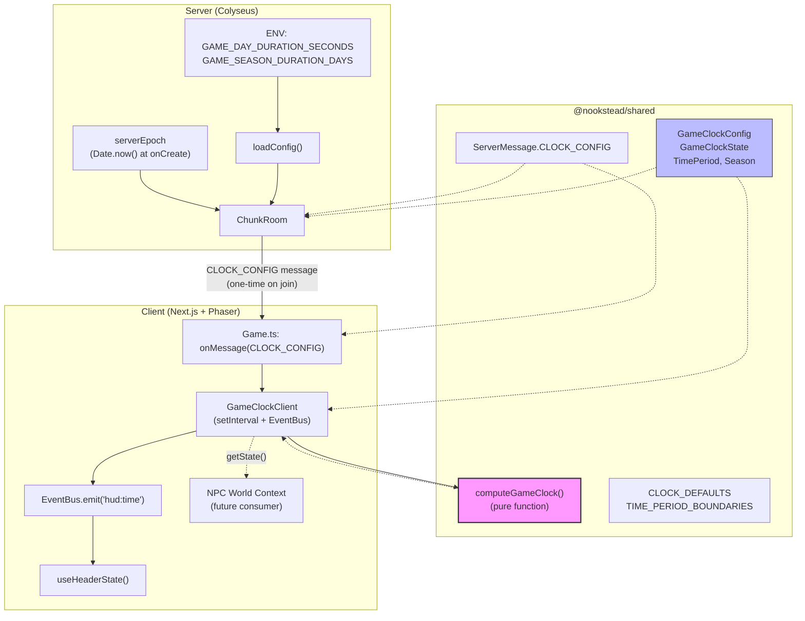
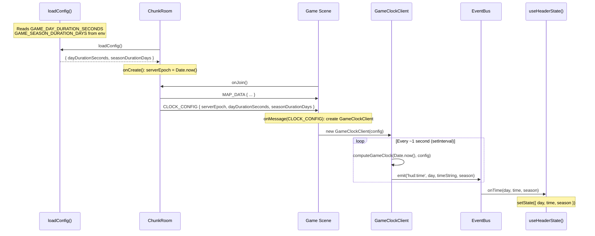

# Design-023: Game Clock System

## Overview

Implement the game clock system for Nookstead, providing server-authoritative time with client-side computation. The server sends a one-time `CLOCK_CONFIG` message on player join; the client computes game time (day, hour, minute, season, time period) locally from `Date.now()` and the config. EventBus emits `hud:time` events every ~1 second so the existing HUD displays real data instead of hardcoded defaults.

## Design Summary (Meta)

```yaml
design_type: "new_feature"
risk_level: "low"
complexity_level: "medium"
complexity_rationale: >
  (1) ACs require coordinating 3 layers (shared types/functions -> server config+message -> client computation+HUD),
  deriving 5 computed fields (day, hour, minute, season, timePeriod) from a single epoch+config,
  and maintaining consistency across all connected clients.
  (2) Risk: client clock drift at high speed multipliers could cause visible desynchronization
  of time periods between players, though this is acceptable for MVP per ADR-0016.
main_constraints:
  - "Zero bandwidth after initial CLOCK_CONFIG handshake (ADR-0016 Decision 1)"
  - "Ephemeral time: no DB persistence, resets on server restart (ADR-0016 Decision 3)"
  - "Landing page useDayCycle remains independent (cosmetic only, not game time)"
  - "No visual tinting in MVP (Phaser camera effects deferred)"
  - "Existing EventBus contract hud:time(day, time, season) must not change"
biggest_risks:
  - "Client clock skew: Date.now() divergence between browsers could cause different time periods at boundary hours (5:00, 7:00, 17:00, 19:00)"
  - "High speed multiplier (60x+) amplifies clock skew proportionally"
unknowns:
  - "Exact Date.now() skew between modern browsers (expected 1-5 seconds, acceptable for visual transitions)"
```

## Background and Context

### Prerequisite ADRs

- [ADR-0016: Game Clock Architecture](../adr/ADR-0016-game-clock-architecture.md) -- Defines client-computed time from server config, ephemeral time, day duration via env var, season as modulo of day number, time period boundaries

### Agreement Checklist

#### Scope
- [x] Add `GAME_DAY_DURATION_SECONDS` and `GAME_SEASON_DURATION_DAYS` env vars to server config
- [x] Add `CLOCK_CONFIG` to `ServerMessage` enum
- [x] Server sends `CLOCK_CONFIG` message on room join (after `MAP_DATA`)
- [x] Create shared pure function `computeGameClock(nowMs, config)` in `@nookstead/shared`
- [x] Create shared types (`GameClockConfig`, `GameClockState`, `TimePeriod`, `Season`) in `@nookstead/shared`
- [x] Create client `GameClockClient` class that runs setInterval(1000) and emits EventBus events
- [x] Game scene listens for `CLOCK_CONFIG` and creates `GameClockClient`
- [x] HUD displays real day, time, and season data
- [x] Move `Season` type to `@nookstead/shared`, re-export from `hud/types.ts`

#### Non-Scope (Explicitly not changing)
- [x] No visual tinting (Phaser camera effects deferred to separate task)
- [x] No DB persistence of game time (ephemeral, resets on server restart)
- [x] No changes to landing page `useDayCycle` hook (stays independent, cosmetic only)
- [x] No changes to `useHeaderState` hook (already listens for `hud:time` via EventBus)
- [x] No changes to `ChunkRoomState` schema (clock data via message, not Colyseus state)
- [x] No hot-reload of clock config (requires server restart to change)
- [x] No NTP correction or periodic sync (kill criteria: drift > 30s at 60x)

#### Constraints
- [x] Parallel operation: No (new feature, no migration needed)
- [x] Backward compatibility: Not required (no existing clock implementation to preserve)
- [x] Performance measurement: Not required

### Design Reflection
- All scope items map to Components 1-5 below
- Non-scope explicitly excludes visual tinting, persistence, and landing page changes per user-confirmed MVP
- EventBus contract `hud:time(day, time, season)` is maintained -- `useHeaderState` works without modification

### Problem to Solve

The HUD currently displays hardcoded default values (day=1, time="08:00", season="spring") because no game clock implementation exists. The NPC system (ADR-0015) requires dynamic World Context (time of day, season) for prompts but receives static strings. Without a working clock, the game cannot support: day/night cycle awareness, seasonal content, NPC schedule-based behavior, or time-based gameplay mechanics.

### Current Challenges

1. `useHeaderState` listens for `hud:time` EventBus events but no component emits them with real data
2. No shared time computation logic exists -- both server (for NPC World Context) and client need it
3. `Season` type is defined only in the client (`hud/types.ts`) but the server needs it too for NPC prompts
4. No mechanism to configure game time speed (day duration, season length) via server environment

### Requirements

#### Functional Requirements

- FR-1: Server loads clock configuration from environment variables with sensible defaults
- FR-2: Server sends clock config to each client on room join
- FR-3: Client computes game time locally from config + system clock
- FR-4: HUD displays dynamic day, time (HH:MM), and season
- FR-5: Time periods (dawn/day/dusk/night) correctly derived from game hour
- FR-6: Seasons cycle through spring/summer/autumn/winter based on day count
- FR-7: At default config (86400s day), game time equals UTC time

#### Non-Functional Requirements

- **Performance**: Clock computation < 0.1ms per tick (pure arithmetic, no allocations in hot path)
- **Reliability**: Client gracefully handles missing CLOCK_CONFIG (shows defaults)
- **Maintainability**: Core logic is a single pure function testable without Phaser or Colyseus

## Applicable Standards

### Classification Table

| Standard | Type | Source | Impact on Design |
|----------|------|--------|-----------------|
| Prettier: single quotes | Explicit | `.prettierrc` | All new code uses single quotes |
| ESLint: `@nx/enforce-module-boundaries` | Explicit | `eslint.config.mjs` | Shared types in `packages/shared`, no cross-app imports |
| TypeScript strict mode | Explicit | `tsconfig.json` | All types must be explicit, no implicit any |
| Nx plugin inference (no project.json) | Explicit | `nx.json` | Targets inferred from config files, no manual target config |
| `ClientMessage`/`ServerMessage` as const object pattern | Implicit | `packages/shared/src/types/messages.ts` | New `CLOCK_CONFIG` follows same `as const` pattern |
| EventBus bridge pattern (Phaser <-> React) | Implicit | `apps/game/src/game/EventBus.ts` | Clock events bridge to React via EventBus `hud:time` |
| Shared types in `packages/shared` | Implicit | `packages/shared/src/types/` | All client-server contract types go in shared package |
| Systems directory pattern | Implicit | `apps/game/src/game/systems/` | New `GameClockClient` placed in systems directory |
| `loadConfig()` env var pattern | Implicit | `apps/server/src/config.ts` | New clock config fields parsed via same pattern with defaults |

## Acceptance Criteria (AC) - EARS Format

### FR-1: Server Configuration

- [ ] **AC-1**: The system shall load `GAME_DAY_DURATION_SECONDS` from environment (default: 86400) and `GAME_SEASON_DURATION_DAYS` from environment (default: 7) via `loadConfig()`
- [ ] **AC-1.1**: **If** `GAME_DAY_DURATION_SECONDS` is below 60, **then** the system shall clamp to 60. **If** above 604800, **then** clamp to 604800
- [ ] **AC-1.2**: **If** `GAME_SEASON_DURATION_DAYS` is below 1, **then** the system shall clamp to 1. **If** above 365, **then** clamp to 365

### FR-2: Server Clock Config Message

- [ ] **AC-2**: **When** a player joins a room (onJoin), the system shall send `ServerMessage.CLOCK_CONFIG` with `{ serverEpoch, dayDurationSeconds, seasonDurationDays }` after `MAP_DATA`
- [ ] **AC-2.1**: The `serverEpoch` field shall be a `Date.now()` value set once in `onCreate()` and shared across all player joins to that room

### FR-3: Client Time Computation

- [ ] **AC-3**: **When** the client receives `CLOCK_CONFIG`, the system shall create a `GameClockClient` that computes game time from `Date.now() - serverEpoch` and the config parameters
- [ ] **AC-3.1**: The `computeGameClock(nowMs, config)` pure function shall return `{ day, hour, minute, season, timePeriod, timeString }` where `day` starts at 1
- [ ] **AC-3.2**: **If** `Date.now() < serverEpoch` (future epoch edge case), **then** the system shall treat elapsed time as 0 (day=1, hour=0, minute=0)

### FR-4: HUD Display

- [ ] **AC-4**: **While** the `GameClockClient` is active, the system shall emit `EventBus.emit('hud:time', day, timeString, season)` every ~1 second with computed values
- [ ] **AC-4.1**: The `timeString` field shall be in "HH:MM" format with zero-padded hours and minutes (e.g., "05:30", "14:00")
- [ ] **AC-4.2**: **If** `CLOCK_CONFIG` has not been received, **then** the HUD shall display defaults (day=1, time="08:00", season="spring") -- current behavior preserved

### FR-5: Time Period Computation

- [ ] **AC-5**: The system shall compute `timePeriod` from game hour as follows: dawn (5 <= hour < 7), day (7 <= hour < 17), dusk (17 <= hour < 19), night (hour >= 19 OR hour < 5)
- [ ] **AC-5.1**: **When** game hour transitions from 4 to 5, the `timePeriod` shall change from `'night'` to `'dawn'`
- [ ] **AC-5.2**: **When** game hour transitions from 18 to 19, the `timePeriod` shall change from `'dusk'` to `'night'`

### FR-6: Season Cycling

- [ ] **AC-6**: The system shall compute season from day number: `seasonIndex = floor((day - 1) / seasonDurationDays) % 4` where 0=spring, 1=summer, 2=autumn, 3=winter
- [ ] **AC-6.1**: **When** `seasonDurationDays=7`, day 1-7 shall be spring, day 8-14 summer, day 15-21 autumn, day 22-28 winter, day 29+ spring again

### FR-7: Default Config Alignment

- [ ] **AC-7**: **When** `dayDurationSeconds=86400` (default), game hour shall equal `floor(utcElapsedMs / 3600000) % 24` -- i.e., game time tracks UTC elapsed since server start
- [ ] **AC-7.1**: **When** `dayDurationSeconds=1440` (60x speed), one game day shall complete in 24 real minutes

## Existing Codebase Analysis

### Implementation Path Mapping

| Type | Path | Description |
|------|------|-------------|
| Existing | `apps/server/src/config.ts` | ServerConfig interface and loadConfig() -- extend with clock fields |
| Existing | `apps/server/src/rooms/ChunkRoom.ts` | Room lifecycle -- add serverEpoch field, send CLOCK_CONFIG in onJoin |
| Existing | `apps/server/src/rooms/ChunkRoomState.ts` | Colyseus schema -- NO changes (clock via message) |
| Existing | `packages/shared/src/types/messages.ts` | Message enums -- add CLOCK_CONFIG |
| Existing | `packages/shared/src/constants.ts` | Shared constants -- add clock defaults |
| Existing | `packages/shared/src/index.ts` | Package re-exports -- add clock types and functions |
| Existing | `apps/game/src/game/scenes/Game.ts` | Game scene -- listen for CLOCK_CONFIG, create GameClockClient |
| Existing | `apps/game/src/game/EventBus.ts` | EventEmitter -- no changes needed |
| Existing | `apps/game/src/components/header/useHeaderState.ts` | HUD hook -- no changes needed (already listens for hud:time) |
| Existing | `apps/game/src/components/hud/types.ts` | Season type -- re-export from shared |
| New | `packages/shared/src/types/clock.ts` | GameClockConfig, GameClockState, TimePeriod types |
| New | `packages/shared/src/systems/game-clock.ts` | computeGameClock() pure function |
| New | `apps/game/src/game/systems/GameClockClient.ts` | Client clock wrapper with setInterval + EventBus |

### Code Inspection Evidence

| File Inspected | Key Finding | Design Impact |
|---------------|-------------|---------------|
| `apps/server/src/config.ts:1-37` | `loadConfig()` reads env vars with defaults, throws on required vars, returns flat config object | Follow same pattern: parse with defaults, add to `ServerConfig` interface |
| `apps/server/src/rooms/ChunkRoom.ts:114-185` | `onCreate()` stores chunkId, sets patch rate, registers message handlers | Add `serverEpoch = Date.now()` in `onCreate()` |
| `apps/server/src/rooms/ChunkRoom.ts:208-627` | `onJoin()` sends `MAP_DATA` at line 528 | Send `CLOCK_CONFIG` after `MAP_DATA` at line ~530 |
| `packages/shared/src/types/messages.ts:1-22` | Uses `as const` object for `ServerMessage`, string values for keys | Add `CLOCK_CONFIG: 'clock_config'` following same pattern |
| `packages/shared/src/constants.ts:1-143` | All shared constants in one file with JSDoc comments | Add clock constants (defaults, time period boundaries) |
| `packages/shared/src/index.ts:1-100` | Re-exports types and constants organized by domain (map, NPC, fence) | Add clock section with types and function re-exports |
| `apps/game/src/components/hud/types.ts:1-9` | `Season` type defined as union, `HeaderState` uses `Season` and `time: string` | Move `Season` to shared, re-export here for backward compat |
| `apps/game/src/components/header/useHeaderState.ts:1-31` | Listens for `EventBus.on('hud:time', (day, time, season))`, casts season to `Season` | Contract matches -- just emit real data |
| `apps/game/src/game/systems/` directory | Contains `dialogue-lock.ts`, `displacement.ts`, `movement.ts` | Place `GameClockClient.ts` here (follows systems pattern) |
| `packages/shared/src/systems/spawn.ts` | Contains `findSpawnTile()` pure function | Place `game-clock.ts` here (follows shared systems pattern) |
| `apps/game/src/game/scenes/Game.ts:173-181` | `init()` receives `mapData` and `room` from LoadingScene | Access `room` for `onMessage(CLOCK_CONFIG)` listener |
| `apps/game/src/game/scenes/Game.ts:183-404` | `create()` sets up game, registers handlers, emits scene-ready | Add CLOCK_CONFIG listener and GameClockClient creation |
| `apps/game/src/game/scenes/Game.ts:925-941` | `shutdown()` cleans up EventBus listeners, destroys managers | Add GameClockClient cleanup |
| `apps/game/src/components/landing/useDayCycle.ts:1-148` | Independent cosmetic hook using `getRuntimeConfig().dayCycleMs` with local `Date.now()` | Confirm no interaction -- stays separate |

### Similar Functionality Search

- **Clock/time computation**: No existing game clock implementation found in the codebase
- **useDayCycle**: Landing page cosmetic hook (`apps/game/src/components/landing/useDayCycle.ts`) -- independent system using local `Date.now() % cycleMs` for sky gradient animation. Not related to game time.
- **Season type**: Already defined in `apps/game/src/components/hud/types.ts` -- will be moved to shared package

**Decision**: New implementation. The landing page `useDayCycle` is a purely cosmetic visual effect hook unrelated to game time mechanics. No duplication risk.

## Design

### Change Impact Map

```yaml
Change Target: Game Clock System
Direct Impact:
  - packages/shared/src/types/clock.ts (NEW - clock types)
  - packages/shared/src/systems/game-clock.ts (NEW - pure computation function)
  - packages/shared/src/types/messages.ts (add CLOCK_CONFIG to ServerMessage)
  - packages/shared/src/constants.ts (add clock default constants)
  - packages/shared/src/index.ts (re-export clock types, function, constants)
  - apps/server/src/config.ts (add dayDurationSeconds, seasonDurationDays to ServerConfig)
  - apps/server/src/rooms/ChunkRoom.ts (add serverEpoch field, send CLOCK_CONFIG in onJoin)
  - apps/game/src/game/systems/GameClockClient.ts (NEW - client clock wrapper)
  - apps/game/src/game/scenes/Game.ts (listen for CLOCK_CONFIG, create GameClockClient, cleanup)
  - apps/game/src/components/hud/types.ts (re-export Season from shared)
Indirect Impact:
  - NPC World Context (ADR-0015) will consume GameClockClient.getState() in future -- not wired in this task
No Ripple Effect:
  - ChunkRoomState schema (no changes)
  - Landing page useDayCycle hook (independent)
  - useHeaderState hook (already listens for hud:time, no changes)
  - Player movement, bot behavior, dialogue system (unchanged)
  - Database schema (no changes)
  - Colyseus patch system (CLOCK_CONFIG is a one-time message, not schema state)
```

### Architecture Overview



### Data Flow



### Integration Point Map

```yaml
## Integration Point Map
Integration Point 1:
  Existing Component: ServerConfig interface + loadConfig() in apps/server/src/config.ts
  Integration Method: Add two new fields with defaults
  Impact Level: Low (Read-Only - existing fields unchanged)
  Required Test Coverage: Verify defaults, verify env var override, verify clamping

Integration Point 2:
  Existing Component: ChunkRoom.onJoin() in apps/server/src/rooms/ChunkRoom.ts
  Integration Method: Add client.send(CLOCK_CONFIG) after MAP_DATA send
  Impact Level: Low (Addition after existing message, no process flow change)
  Required Test Coverage: Verify CLOCK_CONFIG sent after MAP_DATA

Integration Point 3:
  Existing Component: ServerMessage enum in packages/shared/src/types/messages.ts
  Integration Method: Add CLOCK_CONFIG entry
  Impact Level: Low (Addition to const object, no existing entries changed)
  Required Test Coverage: TypeScript compilation succeeds

Integration Point 4:
  Existing Component: Game.ts create() in apps/game/src/game/scenes/Game.ts
  Integration Method: Add room.onMessage(CLOCK_CONFIG) listener, create GameClockClient
  Impact Level: Medium (New listener and system creation in create())
  Required Test Coverage: Verify GameClockClient created on CLOCK_CONFIG receipt, verify cleanup on shutdown

Integration Point 5:
  Existing Component: EventBus hud:time contract
  Integration Method: GameClockClient emits real data via existing event signature
  Impact Level: Low (Replaces static defaults with real data, same event shape)
  Required Test Coverage: Verify EventBus receives correct (day, timeString, season) args
```

### Main Components

#### Component 1: Shared Types (`packages/shared/src/types/clock.ts`)

- **Responsibility**: Define all clock-related types shared between server and client
- **Interface**: Type-only exports (no runtime code)
- **Dependencies**: None (leaf module)

#### Component 2: Shared Pure Function (`packages/shared/src/systems/game-clock.ts`)

- **Responsibility**: Compute game clock state from current time and config. Single source of truth for time computation logic.
- **Interface**: `computeGameClock(nowMs: number, config: GameClockConfig): GameClockState`
- **Dependencies**: Types from `clock.ts`, constants from `constants.ts`

#### Component 3: Server Config Extension (`apps/server/src/config.ts`)

- **Responsibility**: Load clock configuration from environment variables with defaults and validation
- **Interface**: Extended `ServerConfig` interface with `dayDurationSeconds` and `seasonDurationDays`
- **Dependencies**: `@nookstead/shared` constants for defaults

#### Component 4: Server Room Extension (`apps/server/src/rooms/ChunkRoom.ts`)

- **Responsibility**: Store `serverEpoch` at room creation, send `CLOCK_CONFIG` to joining clients
- **Interface**: `client.send(ServerMessage.CLOCK_CONFIG, payload)` in `onJoin`
- **Dependencies**: `loadConfig()`, `ServerMessage`

#### Component 5: Client GameClockClient (`apps/game/src/game/systems/GameClockClient.ts`)

- **Responsibility**: Receive clock config, run periodic computation, emit EventBus events, expose current state for on-demand access
- **Interface**: `constructor(config: GameClockConfig)`, `getState(): GameClockState`, `destroy(): void`
- **Dependencies**: `computeGameClock()` from shared, `EventBus` from Phaser

### Contract Definitions

#### Shared Types (`packages/shared/src/types/clock.ts`)

```typescript
export type TimePeriod = 'dawn' | 'day' | 'dusk' | 'night';
export type Season = 'spring' | 'summer' | 'autumn' | 'winter';

export interface GameClockConfig {
  serverEpoch: number;           // Date.now() on server at room creation (ms)
  dayDurationSeconds: number;    // Real seconds per game day (86400 = real-time)
  seasonDurationDays: number;    // Game days per season (default 7)
}

export interface GameClockState {
  day: number;                   // Day number starting at 1
  hour: number;                  // 0-23
  minute: number;                // 0-59
  season: Season;
  timePeriod: TimePeriod;
  timeString: string;            // "HH:MM" zero-padded
}
```

#### Shared Constants (`packages/shared/src/constants.ts` additions)

```typescript
// ─── Game Clock Configuration ────────────────────────────────────────────────

/** Default day duration in real seconds (86400 = real-time 1:1 with UTC). */
export const DEFAULT_DAY_DURATION_SECONDS = 86400;

/** Default season duration in game days. */
export const DEFAULT_SEASON_DURATION_DAYS = 7;

/** Minimum allowed day duration in seconds (1 minute). */
export const MIN_DAY_DURATION_SECONDS = 60;

/** Maximum allowed day duration in seconds (7 days). */
export const MAX_DAY_DURATION_SECONDS = 604800;

/** Minimum allowed season duration in days. */
export const MIN_SEASON_DURATION_DAYS = 1;

/** Maximum allowed season duration in days. */
export const MAX_SEASON_DURATION_DAYS = 365;

/** Hour boundaries for time period computation. */
export const TIME_PERIOD_DAWN_START = 5;
export const TIME_PERIOD_DAY_START = 7;
export const TIME_PERIOD_DUSK_START = 17;
export const TIME_PERIOD_NIGHT_START = 19;
```

#### New Message Type (`packages/shared/src/types/messages.ts` addition)

```typescript
export const ServerMessage = {
  // ... existing entries
  CLOCK_CONFIG: 'clock_config',
} as const;
```

#### Shared Pure Function (`packages/shared/src/systems/game-clock.ts`)

```typescript
import type { GameClockConfig, GameClockState, Season, TimePeriod } from '../types/clock';
import {
  TIME_PERIOD_DAWN_START,
  TIME_PERIOD_DAY_START,
  TIME_PERIOD_DUSK_START,
  TIME_PERIOD_NIGHT_START,
} from '../constants';

const SEASONS: readonly Season[] = ['spring', 'summer', 'autumn', 'winter'];

/**
 * Compute game clock state from the current time and server config.
 *
 * Pure function: no side effects, deterministic output for given inputs.
 * Both server and client can use this for consistent time computation.
 */
export function computeGameClock(
  nowMs: number,
  config: GameClockConfig
): GameClockState {
  const elapsedMs = Math.max(0, nowMs - config.serverEpoch);
  const dayDurationMs = config.dayDurationSeconds * 1000;

  // Day number (1-based)
  const day = Math.floor(elapsedMs / dayDurationMs) + 1;

  // Progress within current day (0.0 to 1.0)
  const dayProgressMs = elapsedMs % dayDurationMs;
  const dayFraction = dayProgressMs / dayDurationMs;

  // Hour and minute
  const totalMinutes = Math.floor(dayFraction * 1440); // 24 * 60
  const hour = Math.floor(totalMinutes / 60);
  const minute = totalMinutes % 60;

  // Season (4 seasons cycling)
  const seasonIndex = Math.floor((day - 1) / config.seasonDurationDays) % 4;
  const season = SEASONS[seasonIndex];

  // Time period
  const timePeriod = getTimePeriod(hour);

  // Formatted time string
  const timeString = `${String(hour).padStart(2, '0')}:${String(minute).padStart(2, '0')}`;

  return { day, hour, minute, season, timePeriod, timeString };
}

function getTimePeriod(hour: number): TimePeriod {
  if (hour >= TIME_PERIOD_NIGHT_START || hour < TIME_PERIOD_DAWN_START) {
    return 'night';
  }
  if (hour >= TIME_PERIOD_DUSK_START) {
    return 'dusk';
  }
  if (hour >= TIME_PERIOD_DAY_START) {
    return 'day';
  }
  return 'dawn';
}
```

#### Server Config Extension (`apps/server/src/config.ts`)

```typescript
export interface ServerConfig {
  // ... existing fields
  dayDurationSeconds: number;
  seasonDurationDays: number;
}

// In loadConfig():
const dayDurationSeconds = Math.max(
  MIN_DAY_DURATION_SECONDS,
  Math.min(
    MAX_DAY_DURATION_SECONDS,
    parseInt(process.env['GAME_DAY_DURATION_SECONDS'] ?? '', 10)
      || DEFAULT_DAY_DURATION_SECONDS
  )
);

const seasonDurationDays = Math.max(
  MIN_SEASON_DURATION_DAYS,
  Math.min(
    MAX_SEASON_DURATION_DAYS,
    parseInt(process.env['GAME_SEASON_DURATION_DAYS'] ?? '', 10)
      || DEFAULT_SEASON_DURATION_DAYS
  )
);
```

#### ChunkRoom Extension (`apps/server/src/rooms/ChunkRoom.ts`)

```typescript
export class ChunkRoom extends Room<{ state: ChunkRoomState }> {
  // ... existing fields
  private serverEpoch!: number;
  private clockConfig!: { dayDurationSeconds: number; seasonDurationDays: number };

  override onCreate(options: Record<string, unknown>): void {
    // ... existing code
    const config = loadConfig();
    this.serverEpoch = Date.now();
    this.clockConfig = {
      dayDurationSeconds: config.dayDurationSeconds,
      seasonDurationDays: config.seasonDurationDays,
    };
    // ... rest of existing code
  }

  override async onJoin(client: Client, ...): Promise<void> {
    // ... existing code (steps 1-7)

    // 7. Send map data to client
    client.send(ServerMessage.MAP_DATA, mapPayload);

    // 8. Send clock configuration
    client.send(ServerMessage.CLOCK_CONFIG, {
      serverEpoch: this.serverEpoch,
      dayDurationSeconds: this.clockConfig.dayDurationSeconds,
      seasonDurationDays: this.clockConfig.seasonDurationDays,
    });

    // ... rest of existing code (bot spawn)
  }
}
```

#### Client GameClockClient (`apps/game/src/game/systems/GameClockClient.ts`)

```typescript
import { EventBus } from '../EventBus';
import { computeGameClock } from '@nookstead/shared/systems/game-clock';
import type { GameClockConfig, GameClockState } from '@nookstead/shared';

/**
 * Client-side game clock that periodically computes time from server config
 * and emits EventBus events for HUD display.
 *
 * Does NOT tick via Phaser update loop -- uses setInterval(1000) for
 * consistent 1-second updates independent of frame rate.
 */
export class GameClockClient {
  private config: GameClockConfig;
  private intervalId: ReturnType<typeof setInterval> | null = null;
  private currentState: GameClockState;

  constructor(config: GameClockConfig) {
    this.config = config;
    this.currentState = computeGameClock(Date.now(), this.config);

    // Emit initial state immediately
    this.emit(this.currentState);

    // Start periodic updates
    this.intervalId = setInterval(() => {
      this.currentState = computeGameClock(Date.now(), this.config);
      this.emit(this.currentState);
    }, 1000);
  }

  /** Get current clock state on demand (for NPC World Context). */
  getState(): GameClockState {
    return this.currentState;
  }

  /** Stop the interval and clean up. */
  destroy(): void {
    if (this.intervalId !== null) {
      clearInterval(this.intervalId);
      this.intervalId = null;
    }
  }

  private emit(state: GameClockState): void {
    EventBus.emit('hud:time', state.day, state.timeString, state.season);
  }
}
```

#### Game Scene Integration (`apps/game/src/game/scenes/Game.ts`)

```typescript
// In class fields:
private gameClock: GameClockClient | null = null;

// In create(), after playerManager.connect():
if (this.room) {
  this.room.onMessage(ServerMessage.CLOCK_CONFIG, (data: GameClockConfig) => {
    console.log('[Game] CLOCK_CONFIG received:', data);
    this.gameClock = new GameClockClient(data);
  });
}

// In shutdown():
if (this.gameClock) {
  this.gameClock.destroy();
  this.gameClock = null;
}
```

### Data Contract

#### computeGameClock()

```yaml
Input:
  Type: "(nowMs: number, config: GameClockConfig)"
  Preconditions: nowMs >= 0, config.dayDurationSeconds > 0, config.seasonDurationDays > 0
  Validation: Math.max(0, nowMs - config.serverEpoch) -- negative elapsed treated as 0

Output:
  Type: "GameClockState"
  Guarantees:
    - day >= 1
    - hour in [0, 23]
    - minute in [0, 59]
    - season is one of 'spring' | 'summer' | 'autumn' | 'winter'
    - timePeriod is one of 'dawn' | 'day' | 'dusk' | 'night'
    - timeString matches /^\d{2}:\d{2}$/
  On Error: Cannot error (pure arithmetic)

Invariants:
  - Same (nowMs, config) always produces same output
  - day increases monotonically with nowMs
  - season cycles spring->summer->autumn->winter->spring
```

#### CLOCK_CONFIG Message

```yaml
Input:
  Type: "GameClockConfig { serverEpoch: number, dayDurationSeconds: number, seasonDurationDays: number }"
  Preconditions: Client has received MAP_DATA, room is connected
  Validation: Client validates all fields are numbers > 0

Output:
  Type: "One-time Colyseus message from server to client"
  Guarantees: Sent exactly once per onJoin, after MAP_DATA
  On Error: If message never received, client shows defaults (current behavior)

Invariants:
  - serverEpoch is identical for all clients joining the same room instance
  - dayDurationSeconds and seasonDurationDays do not change without server restart
```

### Data Representation Decisions

| Data Structure | Decision | Rationale |
|---|---|---|
| `Season` | **Reuse** existing type from `hud/types.ts`, relocate to `@nookstead/shared` | Identical union type (`'spring' \| 'summer' \| 'autumn' \| 'winter'`). Server needs it for NPC World Context. Re-export from original location preserves existing imports. |
| `TimePeriod` | **New** type in `@nookstead/shared` | No existing type. Represents a new domain concept (dawn/day/dusk/night). |
| `GameClockConfig` | **New** interface in `@nookstead/shared` | No existing config structure for clock. Matches ADR-0016 specification exactly. |
| `GameClockState` | **New** interface in `@nookstead/shared` | No existing computed time state. Contains all derived fields (day, hour, minute, season, timePeriod, timeString). |
| `HeaderState` | **Reuse** unchanged | Already uses `Season` and `time: string`. Changing `Season` import source (shared re-export) is transparent. |

### Field Propagation Map

```yaml
fields:
  - name: "serverEpoch"
    origin: "Date.now() at ChunkRoom.onCreate()"
    transformations:
      - layer: "Server Config"
        type: "number (ms timestamp)"
        validation: "Set once in onCreate, immutable thereafter"
      - layer: "CLOCK_CONFIG message"
        type: "GameClockConfig.serverEpoch"
        transformation: "Sent as-is via Colyseus message"
      - layer: "GameClockClient"
        type: "GameClockConfig.serverEpoch"
        transformation: "Used in subtraction: Date.now() - serverEpoch"
      - layer: "computeGameClock()"
        type: "Input parameter via config"
        transformation: "elapsedMs = nowMs - serverEpoch"
    destination: "Derived game time values (day, hour, minute)"
    loss_risk: "none"

  - name: "dayDurationSeconds"
    origin: "GAME_DAY_DURATION_SECONDS env var (default 86400)"
    transformations:
      - layer: "loadConfig()"
        type: "number"
        validation: "Clamped to [60, 604800]"
      - layer: "ChunkRoom.clockConfig"
        type: "number"
        transformation: "Stored as class field"
      - layer: "CLOCK_CONFIG message"
        type: "GameClockConfig.dayDurationSeconds"
        transformation: "Sent as-is"
      - layer: "computeGameClock()"
        type: "Input parameter via config"
        transformation: "Converted to ms: dayDurationSeconds * 1000"
    destination: "Day boundary computation, hour/minute derivation"
    loss_risk: "none"

  - name: "day / hour / minute / season / timePeriod / timeString"
    origin: "computeGameClock() pure function output"
    transformations:
      - layer: "GameClockClient"
        type: "GameClockState"
        transformation: "Stored as currentState, emitted via EventBus"
      - layer: "EventBus"
        type: "(day: number, timeString: string, season: string)"
        transformation: "Destructured into positional args for hud:time event"
      - layer: "useHeaderState()"
        type: "HeaderState"
        transformation: "Merged into React state via setState"
    destination: "HUD display (day number, time string, season label)"
    loss_risk: "none"
```

### Interface Change Impact Analysis

| Existing Operation | New Operation | Conversion Required | Adapter Required | Compatibility Method |
|-------------------|---------------|-------------------|------------------|---------------------|
| `ServerConfig` (6 fields) | `ServerConfig` (8 fields) | None | Not Required | Two new optional-like fields with defaults |
| `loadConfig()` returns 6 fields | `loadConfig()` returns 8 fields | None | Not Required | Existing callers unaffected by new fields |
| `ServerMessage` (9 entries) | `ServerMessage` (10 entries) | None | Not Required | New entry appended, existing entries unchanged |
| `ChunkRoom.onCreate()` | `ChunkRoom.onCreate()` extended | None | Not Required | Add serverEpoch + clockConfig after existing setup |
| `ChunkRoom.onJoin()` | `ChunkRoom.onJoin()` extended | None | Not Required | Add client.send(CLOCK_CONFIG) after MAP_DATA |
| `Game.create()` | `Game.create()` extended | None | Not Required | Add CLOCK_CONFIG listener after playerManager.connect() |
| `Game.shutdown()` | `Game.shutdown()` extended | None | Not Required | Add gameClock?.destroy() cleanup |
| `Season` in `hud/types.ts` | `Season` in `@nookstead/shared`, re-exported | None | Not Required | Re-export preserves all existing import paths |
| N/A | `computeGameClock()` | N/A | N/A | New pure function |
| N/A | `GameClockClient` | N/A | N/A | New class |

### Integration Boundary Contracts

```yaml
Boundary 1: Server -> Client (CLOCK_CONFIG message)
  Input: Client joins room (onJoin completes)
  Output: Sync -- Colyseus message with GameClockConfig payload
  On Error: If server fails to send, client shows defaults (graceful degradation)

Boundary 2: GameClockClient -> EventBus
  Input: setInterval fires every 1000ms
  Output: Sync -- EventBus.emit('hud:time', day, timeString, season)
  On Error: If EventBus has no listeners, event is silently dropped

Boundary 3: EventBus -> useHeaderState (React)
  Input: EventBus 'hud:time' event with (day, time, season) args
  Output: Sync -- React setState updates HUD display
  On Error: No error path -- existing handler casts season to Season type

Boundary 4: GameClockClient.getState() -> NPC World Context (future)
  Input: On-demand call from NPC prompt builder
  Output: Sync -- returns cached GameClockState
  On Error: If GameClockClient not initialized, caller must handle null
```

### Error Handling

| Error Scenario | Detection | Handling | Recovery |
|---------------|-----------|----------|----------|
| CLOCK_CONFIG never received | No GameClockClient created | HUD shows defaults (day=1, time="08:00", season="spring") | Current behavior, no degradation |
| Invalid env var (non-numeric) | `parseInt()` returns NaN | `\|\| DEFAULT_*` fallback in loadConfig() | Uses default value |
| Env var out of range | Value < min or > max | `Math.max(min, Math.min(max, value))` clamping | Clamped to valid range |
| serverEpoch in the future | `Date.now() < serverEpoch` | `Math.max(0, elapsed)` | Day=1, hour=0, minute=0 |
| GameClockClient interval leak | Scene shutdown without destroy | `shutdown()` calls `gameClock?.destroy()` | Interval cleared |

### Logging and Monitoring

```
[ChunkRoom] CLOCK_CONFIG sent: sessionId={sid}, serverEpoch={epoch}, dayDuration={dur}s, seasonDuration={days}d
[Game] CLOCK_CONFIG received: serverEpoch={epoch}, dayDuration={dur}, seasonDuration={days}
```

No continuous logging from the clock tick (would be noisy at 1Hz). Debug logging can be added temporarily by uncommenting in `GameClockClient.emit()`.

## File-Level Changes Table

| File | Action | Change Description |
|------|--------|-------------------|
| `packages/shared/src/types/clock.ts` | **CREATE** | `TimePeriod`, `Season`, `GameClockConfig`, `GameClockState` types |
| `packages/shared/src/systems/game-clock.ts` | **CREATE** | `computeGameClock()` pure function |
| `packages/shared/src/types/messages.ts` | MODIFY | Add `CLOCK_CONFIG: 'clock_config'` to `ServerMessage` |
| `packages/shared/src/constants.ts` | MODIFY | Add clock default constants and time period boundaries |
| `packages/shared/src/index.ts` | MODIFY | Re-export clock types, function, and constants |
| `apps/server/src/config.ts` | MODIFY | Add `dayDurationSeconds`, `seasonDurationDays` to `ServerConfig`, parse in `loadConfig()` |
| `apps/server/src/rooms/ChunkRoom.ts` | MODIFY | Add `serverEpoch` field in `onCreate()`, send `CLOCK_CONFIG` in `onJoin()` |
| `apps/game/src/game/systems/GameClockClient.ts` | **CREATE** | Client clock class with setInterval and EventBus emission |
| `apps/game/src/game/scenes/Game.ts` | MODIFY | Add CLOCK_CONFIG listener in `create()`, GameClockClient field, cleanup in `shutdown()` |
| `apps/game/src/components/hud/types.ts` | MODIFY | Change `Season` to re-export from `@nookstead/shared` |

**Total: 10 files (3 new, 7 modified)**

## Implementation Plan

### Implementation Approach

**Selected Approach**: Vertical Slice (Feature-driven)

**Selection Reason**: The game clock is a self-contained feature with a clear data flow from server config through shared computation to client display. Each phase delivers a testable slice:
- Phase 1 establishes the shared types and pure computation function (testable in isolation)
- Phase 2 wires the server to send config (verifiable by observing Colyseus messages)
- Phase 3 connects the client to compute and display (end-to-end verification)

The vertical approach is preferred because:
1. The pure function (`computeGameClock`) is the core logic and can be thoroughly tested independently before any integration
2. Server changes are minimal (2 lines in onCreate, 1 send in onJoin) and low-risk
3. Client integration has a clear success criterion: HUD shows real time instead of "08:00"

### Technical Dependencies and Implementation Order

#### 1. Shared Types + Pure Function (Foundation)
- **Technical Reason**: Both server and client depend on these type definitions and the computation function
- **Dependent Elements**: All other components
- **Verification**: L2 -- Unit tests for `computeGameClock()` pass

#### 2. Server Config + Room Extension
- **Technical Reason**: Client needs CLOCK_CONFIG message to function; server must send it
- **Prerequisites**: Shared types and constants
- **Verification**: L3 -- Server builds without errors, CLOCK_CONFIG logged in onJoin

#### 3. Client GameClockClient + Scene Integration
- **Technical Reason**: Requires server to be sending CLOCK_CONFIG for end-to-end testing
- **Prerequisites**: Server sends CLOCK_CONFIG, shared computation function
- **Verification**: L1 -- HUD displays real day/time/season values

### Integration Points

**Integration Point 1: Shared Types -> Server Config**
- Components: `packages/shared/src/types/clock.ts` -> `apps/server/src/config.ts`
- Verification: TypeScript compilation succeeds, `loadConfig()` returns clock fields with correct defaults

**Integration Point 2: Server Room -> Client Scene**
- Components: `ChunkRoom.onJoin()` -> `Game.create() onMessage(CLOCK_CONFIG)`
- Verification: Manual test: join room, verify console log "[Game] CLOCK_CONFIG received" with valid epoch

**Integration Point 3: GameClockClient -> EventBus -> HUD**
- Components: `GameClockClient` -> `EventBus` -> `useHeaderState`
- Verification: L1 -- HUD time display updates every second with correct format, day increments match expected speed

## Test Strategy

### Basic Test Design Policy

Test cases derived from acceptance criteria. The core `computeGameClock()` is a pure function making it ideal for comprehensive unit testing. Client integration tests verify EventBus emission.

### Unit Tests (`packages/shared/src/systems/game-clock.spec.ts`)

**computeGameClock() -- Core Logic:**

| Test Case | Input | Expected Output | AC |
|-----------|-------|-----------------|-----|
| Real-time default config | nowMs = epoch + 14h, dayDuration=86400 | hour=14, minute=0, timePeriod='day' | AC-7 |
| Day boundary | nowMs = epoch + 86400000 | day=2 | AC-3.1 |
| Midnight wrapping | nowMs = epoch + 23.99h | hour=23, minute=59 | AC-4.1 |
| Time string format | nowMs = epoch + 5.5h | timeString="05:30" | AC-4.1 |
| Season spring (day 1) | day=1, seasonDays=7 | season='spring' | AC-6 |
| Season summer (day 8) | day=8, seasonDays=7 | season='summer' | AC-6.1 |
| Season autumn (day 15) | day=15, seasonDays=7 | season='autumn' | AC-6.1 |
| Season winter (day 22) | day=22, seasonDays=7 | season='winter' | AC-6.1 |
| Season cycle wrap (day 29) | day=29, seasonDays=7 | season='spring' | AC-6.1 |
| Dawn period | hour=5 | timePeriod='dawn' | AC-5 |
| Dawn period (6:59) | hour=6 | timePeriod='dawn' | AC-5 |
| Day period (7:00) | hour=7 | timePeriod='day' | AC-5 |
| Day period (16:59) | hour=16 | timePeriod='day' | AC-5 |
| Dusk period (17:00) | hour=17 | timePeriod='dusk' | AC-5 |
| Night period (19:00) | hour=19 | timePeriod='night' | AC-5.2 |
| Night period (4:59) | hour=4 | timePeriod='night' | AC-5 |
| Night-to-dawn transition | hour=4->5 | night->dawn | AC-5.1 |
| Dusk-to-night transition | hour=18->19 | dusk->night | AC-5.2 |
| Future epoch (elapsed < 0) | nowMs < serverEpoch | day=1, hour=0, minute=0 | AC-3.2 |
| 60x speed multiplier | dayDuration=1440, 12 real min elapsed | day=1, hour=12 | AC-7.1 |
| Day 1 starts at 1 | nowMs = epoch | day=1 | AC-3.1 |

### Unit Tests (`apps/game/src/game/systems/GameClockClient.spec.ts`)

**GameClockClient -- EventBus Integration:**
- Verify constructor emits initial `hud:time` event immediately
- Verify setInterval fires and emits updated values after 1 second (mock Date.now + jest.advanceTimersByTime)
- Verify `getState()` returns current GameClockState
- Verify `destroy()` clears the interval (no further emissions)
- Verify EventBus receives correct positional args: `(day: number, timeString: string, season: string)`

### Unit Tests (`apps/server/src/config.spec.ts`)

**loadConfig() -- Clock Fields:**
- Verify default values when env vars not set (86400, 7)
- Verify env var override (custom values parsed correctly)
- Verify clamping: dayDuration=0 -> 60, dayDuration=999999 -> 604800
- Verify clamping: seasonDuration=0 -> 1, seasonDuration=999 -> 365

### Integration Tests

**ChunkRoom CLOCK_CONFIG:**
- Verify CLOCK_CONFIG message is sent after MAP_DATA in onJoin (inspect client.send call order in mock)
- Verify CLOCK_CONFIG payload contains valid serverEpoch, dayDurationSeconds, seasonDurationDays

### E2E Tests

Not required for MVP. The feature is fully verifiable via unit tests (pure function) and manual visual verification (HUD displays updating time).

### Performance Tests

Not required. `computeGameClock()` is pure arithmetic (< 0.01ms per call). No profiling needed.

## Security Considerations

- **No sensitive data**: Clock config contains only timing parameters (epoch, durations). No PII or secrets.
- **No user input**: All config comes from server environment variables. No injection risk.
- **Tampering**: Client could modify `Date.now()`, but since the clock is purely cosmetic in MVP (no gameplay-affecting decisions based on client time), this has no security impact.

## Future Extensibility

- **Visual tinting**: `GameClockClient.getState().timePeriod` provides the trigger for Phaser camera tint transitions. No clock changes needed -- just consume the existing state.
- **NPC World Context**: `gameClock.getState()` returns current time/season for NPC prompt injection. The Game scene stores a reference for this purpose.
- **Time persistence**: If quests require persistent day/season state, `serverEpoch` can be stored in a single DB row or env var. The computation logic remains unchanged.
- **Hot config reload**: Send a new `CLOCK_CONFIG` message when config changes. Client replaces its `GameClockClient` instance. No structural changes needed.
- **Weather system**: Can consume `season` and `timePeriod` from `GameClockState` to influence weather probabilities.
- **NPC schedules**: NPC daily plans can query `gameClock.getState().hour` to determine current activity slot.

## Alternative Solutions

### Alternative 1: Colyseus Schema Fields (ADR-0016 Option A)

- **Overview**: Add `gameDay`, `gameTimeMinutes`, `season` as Colyseus schema fields updated every tick
- **Advantages**: Guaranteed sync via Colyseus auto-patch; no client computation
- **Disadvantages**: Continuous bandwidth for deterministic data; tick-rate precision instead of system clock; patches every game-minute at 60x speed
- **Reason for Rejection**: Violates principle that deterministic data should not be continuously synchronized. Selected Option B per ADR-0016.

### Alternative 2: Server-Pushed Periodic Sync (ADR-0016 Option C)

- **Overview**: Server sends clock message every ~10 seconds to correct client drift
- **Advantages**: Periodic drift correction; more accurate at high speed multipliers
- **Disadvantages**: Still consumes bandwidth; complexity of interpolation between syncs; overengineering for current requirements
- **Reason for Rejection**: Kill criteria (30s drift at 60x) is unlikely to be hit with modern browser clocks. Can be added later if needed.

## Risks and Mitigation

| Risk | Impact | Probability | Mitigation |
|------|--------|-------------|------------|
| Client clock skew causes different time periods between players | Low | Low | Acceptable for MVP: visual-only effect, 1-5s skew at 1x is imperceptible. Monitor with kill criteria (30s at 60x). |
| Server restart resets day counter to 1 | Low | Medium | By design (ephemeral time). Document as known behavior. Future: persist serverEpoch in DB. |
| setInterval(1000) drift over long sessions | Low | Low | Acceptable: cumulative drift is sub-second. EventBus emission is best-effort display update, not authoritative. |
| Multiple CLOCK_CONFIG messages (reconnect/redirect) | Low | Low | GameClockClient is recreated on each CLOCK_CONFIG receipt. Old instance destroyed, new one starts fresh. |
| Import path change for Season type | Low | Low | Re-export from original `hud/types.ts` location ensures backward compatibility |

## References

- [ADR-0016: Game Clock Architecture](../adr/ADR-0016-game-clock-architecture.md) -- All architectural decisions for this feature
- [Game Design Spec: Game Clock](../documentation/plans/plan-game-clock.md) -- Full game design specification for time, seasons, and day/night cycle
- [ADR-0015: NPC Prompt Architecture](../adr/ADR-0015-npc-prompt-architecture.md) -- World Context (section 2) that will consume clock data
- [GDD v3, Section 6.5: Game Time and Weather](../nookstead-gdd-v3.md) -- Time system specification
- [UXRD-001: Game Header Navigation](../uxrd/uxrd-001-game-header-navigation.md) -- HUD clock display, EventBus `hud:time` contract
- [MDN: Date.now()](https://developer.mozilla.org/en-US/docs/Web/JavaScript/Reference/Global_Objects/Date/now) -- Client clock precision
- [Colyseus Documentation: Room Lifecycle](https://docs.colyseus.io/server/room/) -- onJoin, client.send patterns

## Update History

| Date | Version | Changes | Author |
|------|---------|---------|--------|
| 2026-03-14 | 1.0 | Initial version | Claude (Technical Designer) |
