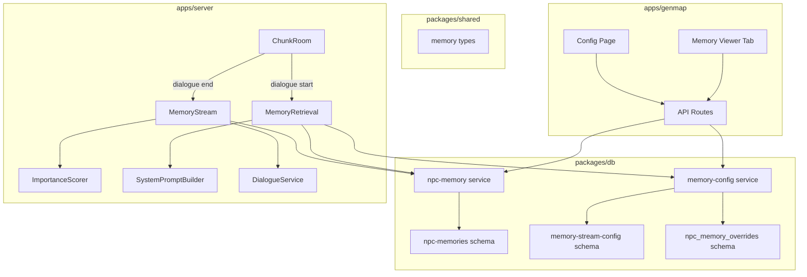
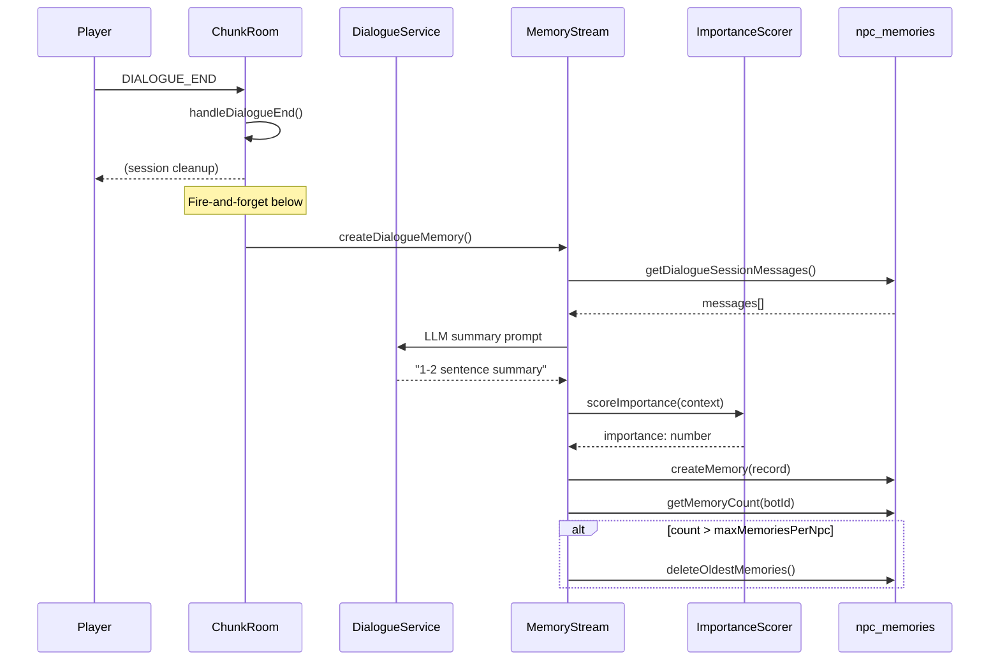
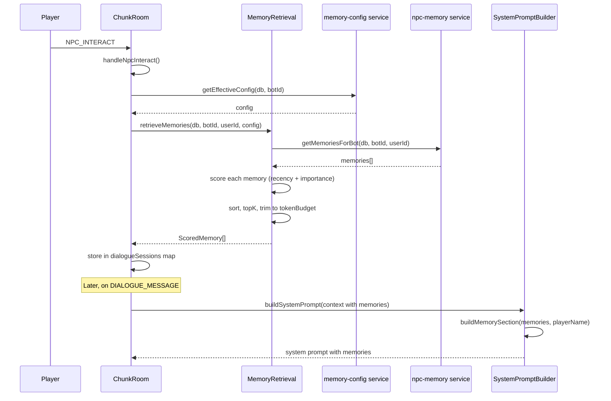

# Memory Stream NPC Memory System (Phase 0) Design Document

## Overview

This document specifies the Phase 0 implementation of the Memory Stream system -- the NPC memory subsystem that enables NPCs to remember past interactions with players. Phase 0 covers interaction memories only (dialogue summaries), rule-based importance scoring, weighted retrieval (recency + importance), admin tooling (config page + memory viewer tab), and integration with the existing dialogue pipeline.

## Design Summary (Meta)

```yaml
design_type: "new_feature"
risk_level: "medium"
complexity_level: "medium"
complexity_rationale: >
  (1) ACs require coordinating LLM summary generation with fire-and-forget DB writes,
  exponential decay scoring, token-budget-aware retrieval, and admin CRUD across
  3 packages (db, server, genmap).
  (2) Risk of prompt token budget overflow and latency regression on dialogue start
  if retrieval is not bounded correctly.
main_constraints:
  - "Token budget for memory section: max 400 tokens"
  - "No pgvector / no semantic search in Phase 0"
  - "Only interaction memories (no observations, reflections, gossip)"
  - "Rule-based importance scoring only (lookup table, no LLM)"
  - "Must follow existing Drizzle schema, DB service, and genmap patterns exactly"
biggest_risks:
  - "LLM summary generation latency on dialogue end may delay next dialogue start if not fire-and-forget"
  - "Memory retrieval adds latency to dialogue start path (~50-100ms for in-app scoring)"
unknowns:
  - "Quality of 1-2 sentence LLM summaries with gpt-4o-mini for Russian-language dialogues"
  - "Optimal half-life tuning for real player behavior patterns"
```

## Background and Context

### Prerequisite ADRs

- **ADR-0013**: NPC Bot Entity Architecture -- defines `npc_bots` table, BotManager, Colyseus state sync
- **ADR-0014**: AI Dialogue via OpenAI + Vercel AI SDK -- defines DialogueService, streaming pattern, cost model
- **ADR-0015**: NPC Prompt Architecture (Character-Card / Scene-Contract) -- defines SystemPromptBuilder sections, memory slots placeholder (`buildMemorySection()` returning "(Пока нет воспоминаний)")

No common ADRs exist in `docs/adr/ADR-COMMON-*`; none are required for this feature.

### Agreement Checklist

#### Scope
- [x] New `npc_memories` table for storing memory records
- [x] New `memory_stream_config` table for global config (single row)
- [x] New `npc_memory_overrides` table for per-NPC config overrides
- [x] DB services for memory CRUD and config management
- [x] Shared types for memory, config, and override
- [x] Server memory module: ImportanceScorer, MemoryRetrieval, MemoryStream class
- [x] SystemPromptBuilder update: `buildMemorySection()` accepts and formats `ScoredMemory[]`
- [x] ChunkRoom integration: retrieve memories on dialogue start, create memory on dialogue end
- [x] Genmap admin: memory config page at `/npcs/memory-config`, memory viewer tab on NPC edit page
- [x] API routes for config and memory CRUD

#### Non-Scope (Explicitly not changing)
- [x] No observation memories (Phase 1+ ActionAwareness)
- [x] No reflection memories (Phase 1+ ReflectionEngine)
- [x] No gossip memories (Phase 1+ Gossip system)
- [x] No pgvector / semantic search / embeddings
- [x] No LLM-based importance scoring (rule-based only)
- [x] No relevance weight in retrieval formula (gamma = 0)
- [x] No changes to DialogueService streaming logic or LLM model selection
- [x] No changes to Colyseus protocol (DIALOGUE_STREAM_CHUNK / DIALOGUE_END_TURN unchanged)
- [x] No changes to client-side code

#### Constraints
- [x] Parallel operation: Not required (new feature, no migration)
- [x] Backward compatibility: Yes -- empty memory section must not break existing dialogues
- [x] Performance measurement: Memory retrieval < 200ms, summary generation fire-and-forget (no latency impact on dialogue flow)

### Problem to Solve

NPCs currently have no memory of past interactions. The `buildMemorySection()` in `SystemPromptBuilder.ts` (line 119-121) returns a static placeholder "(Пока нет воспоминаний)". Every dialogue with an NPC starts from zero context, breaking the core value proposition of Nookstead: "a world that notices what you do."

### Current Challenges

1. **No persistence**: Dialogue messages are stored in `dialogue_messages` but never summarized or fed back to the NPC
2. **Placeholder code**: `buildMemorySection()` is ready for expansion but returns a hardcoded string
3. **No admin visibility**: Operators cannot inspect or tune NPC memory behavior
4. **No configuration**: Memory parameters (topK, half-life, weights) are not configurable without code changes

### Requirements

#### Functional Requirements

1. After a dialogue session ends, generate an LLM summary and store it as a memory record
2. On dialogue start, retrieve top-K memories for the bot-user pair and inject into the system prompt
3. Memories are scored by recency (exponential decay) and importance (rule-based lookup)
4. Admin can view all memories for an NPC, delete individual memories
5. Admin can configure global memory parameters and per-NPC overrides
6. Config uses global defaults with nullable per-NPC overrides that take precedence

#### Non-Functional Requirements

- **Performance**: Memory retrieval < 200ms for 1000 memories per NPC; summary generation must not block dialogue flow
- **Scalability**: Support 1000 memories per NPC with automatic cleanup of oldest memories
- **Reliability**: Fire-and-forget pattern for non-critical writes (memory creation, cleanup); fail-fast for critical reads (retrieval)
- **Maintainability**: Follow existing Drizzle schema, DB service, and genmap patterns; no new patterns introduced

## Acceptance Criteria (AC) - EARS Format

### AC-1: Memory Creation on Dialogue End

- [x] **When** a dialogue session ends (handleDialogueEnd), the system shall load all messages for that session, generate an LLM summary, score importance via lookup table, and store a memory record in `npc_memories`
- [x] **If** the dialogue has zero messages, **then** the system shall skip memory creation (no empty memories)
- [x] **If** LLM summary generation fails, **then** the system shall log the error and not create a memory (fire-and-forget, no user-visible error)
- [x] **When** a memory is created and the NPC's total memory count exceeds `maxMemoriesPerNpc`, the system shall delete the oldest memories to stay within the limit

### AC-2: Memory Retrieval on Dialogue Start

- [x] **When** a player starts a dialogue (handleNpcInteract), the system shall retrieve the effective config for that NPC, fetch all memories for the bot-user pair, score them, and return the top-K memories within the token budget
- [x] **If** no memories exist for the bot-user pair, **then** the system shall return an empty array (no error)
- [x] **While** memories are being retrieved, the system shall not delay the NPC_INTERACT_RESULT response (retrieval happens before the first DIALOGUE_MESSAGE, not before the interact result)

### AC-3: Memory Injection into Prompt

- [x] **When** memories are available, `buildMemorySection()` shall format them as a Russian-language section titled "ТВОИ ВОСПОМИНАНИЯ О {playerName}" with each memory as a bullet point
- [x] **If** no memories are available, **then** `buildMemorySection()` shall return an empty string (omit section entirely)
- [x] The total memory section shall not exceed the configured `tokenBudget` (default 400 tokens), trimming lower-scored memories as needed

### AC-4: Importance Scoring

- [x] The system shall assign importance based on a lookup table: first meeting = 7, normal dialogue = 4, emotional dialogue = 6, gift received = 7, quest-related = 8
- [x] **When** `meetingCount === 0` (first meeting), the system shall use `importanceFirstMeeting` value
- [x] **If** `meetingCount > 0`, **then** the system shall use `importanceNormalDialogue` value (Phase 0 only distinguishes first vs. subsequent meetings)
- [x] **Note**: emotional/gift/quest importance values are stored in the admin config for future phases but only `importanceFirstMeeting` and `importanceNormalDialogue` are used by `scoreImportance()` in Phase 0

### AC-5: Retrieval Algorithm

- [x] Recency score shall be computed as `exp(-0.693 * hoursElapsed / halfLifeHours)` (exponential decay)
- [x] Importance score shall be normalized as `importance / 10`
- [x] Total score shall be `recencyWeight * recencyScore + importanceWeight * importanceScore`
- [x] Memories shall be sorted by total score descending, top-K selected, then trimmed to fit token budget

### AC-6: Admin Config Page

- [x] **When** the admin navigates to `/npcs/memory-config`, the system shall display a form with all global config parameters (topK, halfLifeHours, weights, importance values, maxMemoriesPerNpc, tokenBudget)
- [x] **When** the admin saves the config form, the system shall persist the values via PATCH `/api/npcs/memory-config`
- [x] The system shall create default config on first access if none exists

### AC-7: Admin Memory Viewer

- [x] **When** the admin clicks the "Memories" tab on the NPC edit page, the system shall display a table of all memories for that NPC with content, type, importance badge, and creation date
- [x] **When** the admin clicks delete on a memory, the system shall remove it from the database
- [x] The "Memories" tab shall show per-NPC override controls at the bottom

## Applicable Standards

### Classification Table

| Standard | Type | Source | Impact on Design |
|----------|------|--------|-----------------|
| Prettier: single quotes | Explicit | `.prettierrc` | All new code uses single quotes |
| EditorConfig: 2-space indent, UTF-8 | Explicit | `.editorconfig` | Consistent formatting |
| ESLint: flat config with Nx module boundaries | Explicit | `eslint.config.mjs` | Cross-package imports must follow boundary rules |
| TypeScript: strict mode, ES2022 target | Explicit | `tsconfig.base.json` | Strict null checks, no implicit any |
| Drizzle Kit: strict mode, PostgreSQL dialect | Explicit | `packages/db/drizzle.config.ts` | Schema changes must be compatible with drizzle-kit |
| Jest: test framework for all packages | Explicit | `jest.config.ts` per package | Tests use Jest with TypeScript |
| DB service pattern: `db: DrizzleClient` first param | Implicit | `packages/db/src/services/npc-bot.ts`, `dialogue.ts` | All new services follow `(db, data) => Promise<T>` pattern |
| Schema pattern: `pgTable` + `$inferSelect` + `$inferInsert` | Implicit | `packages/db/src/schema/npc-bots.ts` | All new schemas export table + Select/Insert types |
| Genmap hooks pattern: `useState` + `useCallback` + `fetch` | Implicit | `apps/genmap/src/hooks/use-npc-dialogues.ts` | Admin hooks follow the same data fetching pattern |
| Fire-and-forget for non-critical writes | Implicit | `ChunkRoom.ts:769-778` | Memory creation uses `.catch()` pattern |
| Error prefix pattern: `[module-name]` in logs | Implicit | `ChunkRoom.ts`, `npc-bot.ts` | All logs use `[module]` prefix |

## Existing Codebase Analysis

### Implementation Path Mapping

| Type | Path | Description |
|------|------|-------------|
| Existing | `packages/db/src/schema/npc-bots.ts` | NPC bots schema (FK target for new memories table) |
| Existing | `packages/db/src/schema/dialogue-sessions.ts` | Dialogue sessions schema (FK target for memory source linking) |
| Existing | `packages/db/src/schema/index.ts` | Schema barrel export (add new schema exports) |
| Existing | `packages/db/src/services/npc-bot.ts` | NPC bot CRUD services (pattern reference) |
| Existing | `packages/db/src/services/dialogue.ts` | Dialogue services including `getDialogueSessionMessages` |
| Existing | `packages/db/src/index.ts` | DB package barrel export (add new service exports) |
| Existing | `apps/server/src/npc-service/ai/SystemPromptBuilder.ts` | Prompt builder with `buildMemorySection()` placeholder |
| Existing | `apps/server/src/npc-service/ai/DialogueService.ts` | Dialogue service with `SeedPersona`, `StreamResponseParams` |
| Existing | `apps/server/src/rooms/ChunkRoom.ts` | Room with dialogue lifecycle handlers |
| Existing | `packages/shared/src/index.ts` | Shared types barrel export |
| Existing | `apps/genmap/src/app/(app)/npcs/[id]/page.tsx` | NPC edit page with Details and Dialogues tabs |
| Existing | `apps/genmap/src/components/navigation.tsx` | Navigation with `navItems` array |
| Existing | `apps/genmap/src/hooks/use-npc-dialogues.ts` | Hook pattern reference |
| New | `packages/db/src/schema/npc-memories.ts` | Memory records schema |
| New | `packages/db/src/schema/memory-stream-config.ts` | Global config + per-NPC overrides schemas |
| New | `packages/db/src/services/npc-memory.ts` | Memory CRUD service |
| New | `packages/db/src/services/memory-config.ts` | Config management service |
| New | `packages/shared/src/types/memory.ts` | Shared memory types |
| New | `apps/server/src/npc-service/memory/ImportanceScorer.ts` | Rule-based importance scoring |
| New | `apps/server/src/npc-service/memory/MemoryRetrieval.ts` | Weighted scoring retrieval |
| New | `apps/server/src/npc-service/memory/MemoryStream.ts` | Memory creation orchestrator |
| New | `apps/server/src/npc-service/memory/index.ts` | Memory module barrel export |
| New | `apps/server/src/npc-service/memory/__tests__/ImportanceScorer.spec.ts` | Unit tests |
| New | `apps/server/src/npc-service/memory/__tests__/MemoryRetrieval.spec.ts` | Unit tests |
| New | `apps/server/src/npc-service/memory/__tests__/MemoryStream.spec.ts` | Unit tests |
| New | `apps/genmap/src/app/(app)/npcs/memory-config/page.tsx` | Global config admin page |
| New | `apps/genmap/src/app/api/npcs/memory-config/route.ts` | Config API route |
| New | `apps/genmap/src/app/api/npcs/[id]/memories/route.ts` | Memory list/delete API route |
| New | `apps/genmap/src/app/api/npcs/[id]/memory-override/route.ts` | Per-NPC override API route |
| New | `apps/genmap/src/hooks/use-memory-config.ts` | Config hook |
| New | `apps/genmap/src/hooks/use-npc-memories.ts` | Memory viewer hook |

### Similar Functionality Search

Searched for keywords: "memory", "remember", "history", "recall", "summary", "score", "retrieval".

- **`getRecentDialogueHistory()`** in `dialogue.ts` -- retrieves raw message history for prompts. This is a different concern (raw messages vs. summarized memories). No duplication.
- **`buildMemorySection()`** in `SystemPromptBuilder.ts` -- placeholder function that returns static text. This is the exact integration point we will modify.
- **No existing memory or scoring implementations found.** Proceeding with new implementation.

Decision: **New implementation** -- no similar functionality exists to reuse.

### Code Inspection Evidence

#### What Was Examined

| File Inspected | Key Finding | Design Impact |
|---------------|-------------|---------------|
| `packages/db/src/schema/npc-bots.ts` (54 lines) | Uses `pgTable`, `uuid().defaultRandom().primaryKey()`, `timestamp({ withTimezone: true }).defaultNow()`, JSONB `$type<>`, FK with `onDelete: 'cascade'`, exports `$inferSelect` and `$inferInsert` types | Must follow identical schema definition pattern |
| `packages/db/src/schema/dialogue-sessions.ts` (32 lines) | Uses index definition via third arg callback `(table) => [index(...)]`, FK references `npcBots.id` and `users.id` | Memory table must use same index syntax and FK references |
| `packages/db/src/schema/index.ts` (17 lines) | Pure re-exports with `export * from './...'` | Add `export * from './npc-memories'` and `export * from './memory-stream-config'` |
| `packages/db/src/services/npc-bot.ts` (295 lines) | All functions: `async function name(db: DrizzleClient, ...)`. Uses typed interfaces for params. Returns typed results. `result[0] ?? null` pattern for single-row returns. `desc()` for ordering. | All new service functions must follow this signature pattern |
| `packages/db/src/services/dialogue.ts` (316 lines) | `getDialogueSessionMessages(db, sessionId)` returns `DialogueMessage[]` ordered by `createdAt`. `getSessionCountForPair` available for meeting count. | Use `getDialogueSessionMessages` to load messages before summarization. Use `getSessionCountForPair` for first-meeting detection. |
| `apps/server/src/npc-service/ai/SystemPromptBuilder.ts` (197 lines) | `buildMemorySection()` at line 119 returns hardcoded string. `estimateTokens()` at line 46 does `Math.ceil(text.length / 3.5)`. `PromptContext` has optional `worldContext?`. Prompt is in Russian. | Modify `buildMemorySection` to accept `ScoredMemory[]`. Add optional `memories?` to `PromptContext`. Use `estimateTokens()` for token budget enforcement. |
| `apps/server/src/npc-service/ai/DialogueService.ts` (98 lines) | `SeedPersona` interface at line 14. `StreamResponseParams` at line 26. `DialogueService` class uses `@ai-sdk/openai` with `createOpenAI`. Model is `gpt-4o-mini`. | Use same `DialogueService` instance for LLM summary generation. No changes needed to `StreamResponseParams`. |
| `apps/server/src/rooms/ChunkRoom.ts` (1221 lines) | `handleNpcInteract` (line 975): creates DB session, loads persona, tracks in `dialogueSessions` Map. `handleDialogueMessage` (line 742): loads history, queries meetingCount, streams response. `handleDialogueEnd` (line 867): ends DB session, fire-and-forget. `getGameDb()` used for DB access. | Add memory retrieval in `handleNpcInteract` (after session creation). Add memory creation in `handleDialogueEnd` (fire-and-forget). Store memories in `dialogueSessions` Map entry. |
| `apps/genmap/src/app/(app)/npcs/[id]/page.tsx` (687 lines) | Uses Radix Tabs with `<Tabs value={activeTab}>`, `<TabsTrigger value="details">`, `<TabsTrigger value="dialogues">`. Currently 2 tabs. Hooks: `useNpcDialogues`. | Add third `<TabsTrigger value="memories">` tab. |
| `apps/genmap/src/hooks/use-npc-dialogues.ts` (112 lines) | Exports interfaces + hook. Uses `useState`, `useCallback`, `useRef`, `useEffect`. `PAGE_SIZE = 20`. Fetch pattern: `fetch('/api/npcs/${id}/...')`. | New hooks must follow identical structure. |
| `apps/genmap/src/components/navigation.tsx` (50 lines) | `navItems` array of `{ href, label }`. Navigation uses `pathname.startsWith(item.href)`. | Memory config page at `/npcs/memory-config` will be naturally under the NPCs nav item (startsWith `/npcs`). No navigation change needed. |
| `packages/db/src/index.ts` (130 lines) | Named exports with types from each service file. | Add memory and config service exports. |

#### Key Findings

1. **Schema pattern is strict**: All tables use `uuid().defaultRandom().primaryKey()`, `timestamp({ withTimezone: true }).defaultNow().notNull()`, and export `$inferSelect`/`$inferInsert` types
2. **DB services are pure functions**: All take `db: DrizzleClient` as first param, never instantiate their own connection
3. **Fire-and-forget is established**: ChunkRoom uses `.catch()` for non-critical DB writes (message saves at lines 769-778, 854-863)
4. **Russian-language prompts**: All prompt text is in Russian; memory section must follow this convention
5. **`estimateTokens()` is available**: Already exported from SystemPromptBuilder for token counting
6. **Meeting count is already queried**: `getSessionCountForPair()` is called in `handleDialogueMessage` (line 811); can be reused for first-meeting detection

#### How Findings Influence Design

- All new Drizzle schemas follow the exact `pgTable` + type export pattern from `npc-bots.ts`
- All new DB services follow the `(db: DrizzleClient, data: TypedInterface) => Promise<T>` pattern
- Memory creation on dialogue end uses fire-and-forget (`.catch()`) pattern
- Memory retrieval on dialogue start is done eagerly before the first message (not lazily)
- `estimateTokens()` is reused for token budget enforcement in retrieval
- `getSessionCountForPair()` determines whether this is a first meeting for importance scoring

## Design

### Change Impact Map

```yaml
Change Target: NPC Memory System (new)
Direct Impact:
  - packages/db/src/schema/npc-memories.ts (new file)
  - packages/db/src/schema/memory-stream-config.ts (new file)
  - packages/db/src/services/npc-memory.ts (new file)
  - packages/db/src/services/memory-config.ts (new file)
  - packages/db/src/schema/index.ts (add 2 exports)
  - packages/db/src/index.ts (add service exports)
  - packages/shared/src/types/memory.ts (new file)
  - packages/shared/src/index.ts (add type export)
  - apps/server/src/npc-service/memory/ (new module, 4 files)
  - apps/server/src/npc-service/ai/SystemPromptBuilder.ts (modify buildMemorySection)
  - apps/server/src/rooms/ChunkRoom.ts (add retrieval in handleNpcInteract, creation in handleDialogueEnd)
  - apps/genmap/src/app/(app)/npcs/[id]/page.tsx (add Memories tab)
  - apps/genmap/src/app/(app)/npcs/memory-config/page.tsx (new page)
  - apps/genmap/src/app/api/npcs/memory-config/route.ts (new route)
  - apps/genmap/src/app/api/npcs/[id]/memories/route.ts (new route)
  - apps/genmap/src/app/api/npcs/[id]/memory-override/route.ts (new route)
  - apps/genmap/src/hooks/use-memory-config.ts (new hook)
  - apps/genmap/src/hooks/use-npc-memories.ts (new hook)
Indirect Impact:
  - DialogueService.ts (no code changes, but its instance is used by MemoryStream for summary generation)
  - NPC dialogue quality (memories will influence NPC responses)
No Ripple Effect:
  - Client-side game code (Phaser, Next.js app)
  - Colyseus protocol messages
  - BotManager / movement engine
  - Map editor, sprite editor, object editor
  - Authentication / session management
  - Other DB schemas (users, maps, sprites, etc.)
```

### Architecture Overview



### Data Flow

#### Memory Creation Flow (Dialogue End)



#### Memory Retrieval Flow (Dialogue Start)



### Integration Point Map

```yaml
Integration Point 1:
  Existing Component: ChunkRoom.handleDialogueEnd()
  Integration Method: Fire-and-forget call to MemoryStream.createDialogueMemory()
  Impact Level: Low (adds async operation after existing cleanup, no process flow change)
  Required Test Coverage: Verify memory record created after dialogue end

Integration Point 2:
  Existing Component: ChunkRoom.handleNpcInteract()
  Integration Method: Add memory retrieval between session creation and DIALOGUE_START send
  Impact Level: Medium (adds async operations to dialogue start path)
  Required Test Coverage: Verify memories retrieved and stored in session; verify no latency regression

Integration Point 3:
  Existing Component: ChunkRoom.handleDialogueMessage()
  Integration Method: Pass stored memories to SystemPromptBuilder via PromptContext
  Impact Level: Low (data passthrough, no logic change)
  Required Test Coverage: Verify memories appear in generated system prompt

Integration Point 4:
  Existing Component: SystemPromptBuilder.buildMemorySection()
  Integration Method: Change function signature to accept ScoredMemory[]; update buildSystemPrompt to pass memories
  Impact Level: Medium (interface change for buildMemorySection)
  Required Test Coverage: Verify formatted output matches expected Russian-language format; verify empty array produces empty string

Integration Point 5:
  Existing Component: genmap NPC edit page tabs
  Integration Method: Add third TabsTrigger "Memories" with TabsContent
  Impact Level: Low (additive UI change)
  Required Test Coverage: Verify tab renders memory list and override controls
```

### Integration Points List

| Integration Point | Location | Old Implementation | New Implementation | Switching Method |
|-------------------|----------|-------------------|-------------------|------------------|
| Memory section in prompt | `SystemPromptBuilder.buildMemorySection()` | Returns `"(Пока нет воспоминаний)"` | Accepts `ScoredMemory[]`, formats as Russian bullet list | Direct modification |
| PromptContext type | `SystemPromptBuilder.ts` | No `memories` field | Add optional `memories?: ScoredMemory[]` | Backward-compatible extension |
| Dialogue start | `ChunkRoom.handleNpcInteract()` | Creates session, sends DIALOGUE_START | Also retrieves memories and stores in session map | Add code after session creation |
| Dialogue message | `ChunkRoom.handleDialogueMessage()` | Passes persona to DialogueService | Also passes memories via PromptContext | Add memories to context |
| Dialogue end | `ChunkRoom.handleDialogueEnd()` | Ends DB session, cleans up | Also fires MemoryStream.createDialogueMemory() | Add fire-and-forget call |
| NPC edit page | `npcs/[id]/page.tsx` | 2 tabs: Details, Dialogues | 3 tabs: Details, Dialogues, Memories | Add TabsTrigger + TabsContent |

### Main Components

#### Component 1: Database Schema (`packages/db/src/schema/`)

**Responsibility**: Define the three new tables -- `npc_memories`, `memory_stream_config`, `npc_memory_overrides` -- following existing Drizzle patterns.

**`npc_memories` table**:
```typescript
export const npcMemories = pgTable(
  'npc_memories',
  {
    id: uuid('id').defaultRandom().primaryKey(),
    botId: uuid('bot_id')
      .notNull()
      .references(() => npcBots.id, { onDelete: 'cascade' }),
    userId: uuid('user_id')
      .notNull()
      .references(() => users.id, { onDelete: 'cascade' }),
    type: varchar('type', { length: 32 }).notNull().default('interaction'),
    content: text('content').notNull(),
    importance: smallint('importance').notNull(),
    dialogueSessionId: uuid('dialogue_session_id')
      .references(() => dialogueSessions.id, { onDelete: 'set null' }),
    createdAt: timestamp('created_at', { withTimezone: true })
      .defaultNow()
      .notNull(),
  },
  (table) => [
    index('idx_nm_bot_user').on(table.botId, table.userId),
    index('idx_nm_bot_created').on(table.botId, table.createdAt),
    index('idx_nm_bot_importance').on(table.botId, table.importance),
  ]
);

export type NpcMemoryRow = typeof npcMemories.$inferSelect;
export type NewNpcMemory = typeof npcMemories.$inferInsert;
```

**`memory_stream_config` table** (single-row global config):
```typescript
export const memoryStreamConfig = pgTable('memory_stream_config', {
  id: uuid('id').defaultRandom().primaryKey(),
  topK: smallint('top_k').notNull().default(10),
  halfLifeHours: real('half_life_hours').notNull().default(48),
  recencyWeight: real('recency_weight').notNull().default(1.0),
  importanceWeight: real('importance_weight').notNull().default(1.0),
  maxMemoriesPerNpc: smallint('max_memories_per_npc').notNull().default(1000),
  tokenBudget: smallint('token_budget').notNull().default(400),
  importanceFirstMeeting: smallint('importance_first_meeting').notNull().default(7),
  importanceNormalDialogue: smallint('importance_normal_dialogue').notNull().default(4),
  importanceEmotionalDialogue: smallint('importance_emotional_dialogue').notNull().default(6),
  importanceGiftReceived: smallint('importance_gift_received').notNull().default(7),
  importanceQuestRelated: smallint('importance_quest_related').notNull().default(8),
  updatedAt: timestamp('updated_at', { withTimezone: true })
    .defaultNow()
    .notNull(),
});

export type MemoryStreamConfigRow = typeof memoryStreamConfig.$inferSelect;
```

**`npc_memory_overrides` table**:
```typescript
export const npcMemoryOverrides = pgTable('npc_memory_overrides', {
  id: uuid('id').defaultRandom().primaryKey(),
  botId: uuid('bot_id')
    .notNull()
    .unique()
    .references(() => npcBots.id, { onDelete: 'cascade' }),
  topK: smallint('top_k'),
  halfLifeHours: real('half_life_hours'),
  recencyWeight: real('recency_weight'),
  importanceWeight: real('importance_weight'),
  maxMemoriesPerNpc: smallint('max_memories_per_npc'),
  tokenBudget: smallint('token_budget'),
  updatedAt: timestamp('updated_at', { withTimezone: true })
    .defaultNow()
    .notNull(),
});

export type NpcMemoryOverrideRow = typeof npcMemoryOverrides.$inferSelect;
```

#### Component 2: Shared Types (`packages/shared/src/types/memory.ts`)

**Responsibility**: Define shared type interfaces used across server and genmap.

```typescript
export type MemoryType = 'interaction' | 'observation' | 'reflection' | 'gossip';

export interface NpcMemory {
  id: string;
  botId: string;
  userId: string;
  type: MemoryType;
  content: string;
  importance: number;
  dialogueSessionId: string | null;
  createdAt: string; // ISO string for client
}

export interface MemoryStreamConfig {
  topK: number;
  halfLifeHours: number;
  recencyWeight: number;
  importanceWeight: number;
  maxMemoriesPerNpc: number;
  tokenBudget: number;
  importanceFirstMeeting: number;
  importanceNormalDialogue: number;
  importanceEmotionalDialogue: number;
  importanceGiftReceived: number;
  importanceQuestRelated: number;
}

export interface NpcMemoryOverride {
  botId: string;
  topK?: number | null;
  halfLifeHours?: number | null;
  recencyWeight?: number | null;
  importanceWeight?: number | null;
  maxMemoriesPerNpc?: number | null;
  tokenBudget?: number | null;
}
```

#### Component 3: DB Services (`packages/db/src/services/`)

**Responsibility**: CRUD operations for memories and config.

**`npc-memory.ts`**:
- `createMemory(db, data: CreateMemoryData): Promise<NpcMemoryRow>` -- insert a single memory
- `getMemoriesForBot(db, botId, userId): Promise<NpcMemoryRow[]>` -- all memories for a bot-user pair (for scoring in-app)
- `getMemoryCount(db, botId): Promise<number>` -- count all memories for a bot
- `deleteOldestMemories(db, botId, keepCount): Promise<void>` -- delete oldest memories exceeding limit
- `deleteMemory(db, id): Promise<void>` -- admin delete single memory
- `listMemoriesAdmin(db, botId, params?): Promise<NpcMemoryRow[]>` -- paginated list for admin viewer

**`memory-config.ts`**:
- `getGlobalConfig(db): Promise<MemoryStreamConfig>` -- get the single config row, or create defaults
- `updateGlobalConfig(db, data: Partial<MemoryStreamConfig>): Promise<MemoryStreamConfig>` -- update config
- `getNpcOverride(db, botId): Promise<NpcMemoryOverrideRow | null>` -- get per-NPC override
- `upsertNpcOverride(db, botId, data): Promise<NpcMemoryOverrideRow>` -- create or update override
- `deleteNpcOverride(db, botId): Promise<void>` -- remove override (use global defaults)
- `getEffectiveConfig(db, botId): Promise<MemoryStreamConfig>` -- merge global config with override (override nulls = use global)

#### Component 4: Server Memory Module (`apps/server/src/npc-service/memory/`)

**Responsibility**: Business logic for importance scoring, retrieval algorithm, and memory creation orchestration.

**ImportanceScorer.ts**:
```typescript
export interface ImportanceScorerConfig {
  firstMeeting: number;
  normalDialogue: number;
  emotionalDialogue: number;
  giftReceived: number;
  questRelated: number;
}

export function scoreImportance(
  config: ImportanceScorerConfig,
  context: { isFirstMeeting: boolean }
): number {
  // Phase 0: binary distinction only
  return context.isFirstMeeting ? config.firstMeeting : config.normalDialogue;
}
```

**MemoryRetrieval.ts**:
```typescript
export interface RetrievalConfig {
  topK: number;
  halfLifeHours: number;
  recencyWeight: number;
  importanceWeight: number;
  tokenBudget: number;
}

export interface ScoredMemory {
  memory: NpcMemoryRow;
  recencyScore: number;
  importanceScore: number;
  totalScore: number;
}

export async function retrieveMemories(
  db: DrizzleClient,
  botId: string,
  userId: string,
  config: RetrievalConfig
): Promise<ScoredMemory[]> {
  // 1. Fetch all memories for bot-user pair
  // 2. Calculate recency: exp(-0.693 * hoursElapsed / halfLifeHours)
  // 3. Normalize importance: importance / 10
  // 4. Combine: totalScore = recencyWeight * recencyScore + importanceWeight * importanceScore
  // 5. Sort descending, take topK
  // 6. Trim to fit within tokenBudget using estimateTokens()
}
```

**MemoryStream.ts**:

> **Design Decision (I004 resolution)**: MemoryStream uses the Vercel AI SDK's `generateText()` function directly (from `ai` package) with `createOpenAI` (from `@ai-sdk/openai`), rather than going through `DialogueService`. This is because `DialogueService.streamResponse()` is an `AsyncGenerator<string>` designed for real-time dialogue streaming with `StreamResponseParams` — an interface mismatch for simple background text generation. Using `generateText` directly is cleaner and avoids adding a non-streaming method to DialogueService.

```typescript
import { generateText } from 'ai';
import { createOpenAI } from '@ai-sdk/openai';

export interface MemoryStreamConfig {
  apiKey: string;
  model?: string; // default: 'gpt-4o-mini'
}

export class MemoryStream {
  private openai;
  private model: string;

  constructor(config: MemoryStreamConfig) {
    this.openai = createOpenAI({ apiKey: config.apiKey });
    this.model = config.model ?? 'gpt-4o-mini';
  }

  async createDialogueMemory(params: {
    db: DrizzleClient;
    botId: string;
    userId: string;
    dialogueSessionId: string;
    isFirstMeeting: boolean;
    botName: string;
    playerName: string;
    config: MemoryStreamConfig;
  }): Promise<void> {
    // 1. Load messages via getDialogueSessionMessages()
    // 2. If no messages, return early
    // 3. Generate LLM summary using generateText() directly (see prompt below)
    // 4. Validate summary: non-empty, trim to max 500 chars
    // 5. Score importance via scoreImportance()
    // 6. Create memory record via createMemory()
    // 7. Check count, cleanup if over maxMemoriesPerNpc
  }

  private async generateSummary(
    botName: string,
    playerName: string,
    messages: Array<{ role: string; content: string }>
  ): Promise<string> {
    const dialogue = messages
      .map((m) => `${m.role === 'user' ? playerName : botName}: ${m.content}`)
      .join('\n');

    const { text } = await generateText({
      model: this.openai(this.model),
      maxTokens: 150,
      prompt: SUMMARY_PROMPT.replace('${botName}', botName)
        .replace('${playerName}', playerName)
        .replace('${dialogue}', dialogue),
    });
    return text.slice(0, 500); // Hard limit on summary length
  }
}

const SUMMARY_PROMPT = `Кратко перескажи этот диалог между NPC "\${botName}" и игроком "\${playerName}" в 1-2 предложениях от лица \${botName}. Сфокусируйся на ключевых фактах, эмоциях и примечательных деталях. Пиши на русском языке.

Диалог:
\${dialogue}`;
```

> **Note (I009)**: The feature spec M0.4 states "every NPC dialogue turn creates a memory record" (per-turn). Phase 0 creates per-session LLM summaries instead — more token-efficient and produces higher-quality context. Per-turn granularity may be added in future phases.

> **Note (I010)**: Summary output is validated: empty responses skip memory creation; content is trimmed to 500 chars max. A 15-second timeout should be applied to the `generateText` call to prevent resource exhaustion from stalled LLM requests.

#### Component 5: SystemPromptBuilder Integration

**Responsibility**: Format retrieved memories into the system prompt.

Modified `buildMemorySection()`:
```typescript
function buildMemorySection(
  memories?: ScoredMemory[],
  playerName?: string
): string {
  if (!memories || memories.length === 0) {
    return '';
  }
  const header = `ТВОИ ВОСПОМИНАНИЯ О ${playerName ?? 'этом человеке'}`;
  const items = memories.map((m) => `- ${m.memory.content}`).join('\n');
  return `${header}\n${items}`;
}
```

Updated `PromptContext`:
```typescript
export interface PromptContext {
  persona: SeedPersona;
  botName: string;
  playerName: string;
  meetingCount: number;
  worldContext?: WorldContext;
  memories?: ScoredMemory[];
}
```

#### Component 6: ChunkRoom Integration

**handleNpcInteract** additions (after session creation, before DIALOGUE_START send):
```typescript
// Load effective config and retrieve memories (best-effort)
let memories: ScoredMemory[] = [];
try {
  const config = await getEffectiveConfig(db, botId);
  const userId = (client.auth as AuthData)?.userId;
  memories = await retrieveMemories(db, botId, userId, {
    topK: config.topK,
    halfLifeHours: config.halfLifeHours,
    recencyWeight: config.recencyWeight,
    importanceWeight: config.importanceWeight,
    tokenBudget: config.tokenBudget,
  });
} catch (err) {
  console.error('[ChunkRoom] Memory retrieval failed (continuing without):', err);
}

// Store memories in dialogueSessions map
this.dialogueSessions.set(client.sessionId, {
  botId,
  dbSessionId,
  abortController: null,
  persona,
  memories, // new field
});
```

**dialogueSessions map** type updated to include `memories: ScoredMemory[]`.

**handleDialogueMessage** additions: Pass `memories` from session to `PromptContext`.

**handleDialogueEnd** additions (fire-and-forget):

> **Note (I003)**: All data needed for memory creation (session, botId, dbSessionId, botName, playerName, userId) MUST be captured into local variables before `this.dialogueSessions.delete()` runs at the end of the existing cleanup. The fire-and-forget Promise chain runs asynchronously after the delete, so it must not reference `this.dialogueSessions` or stale Colyseus schema refs.

```typescript
const session = this.dialogueSessions.get(client.sessionId);
// Capture all data into locals before cleanup deletes session
const botId = session?.botId;
const dbSessionId = session?.dbSessionId;
const botSchema = botId ? this.state.bots.get(botId) : undefined;
const botName = botSchema?.name ?? 'NPC';
const player = world.getPlayer(client.sessionId);
const userId = player?.userId;
const playerName = player?.name ?? 'Stranger';
// ... existing cleanup (including this.dialogueSessions.delete) ...

// Fire-and-forget: create memory from dialogue (uses only captured locals)
if (this.memoryStream && botId && dbSessionId && userId) {
  getEffectiveConfig(db, botId)
    .then((config) =>
      getSessionCountForPair(db, botId, userId).then((count) =>
        this.memoryStream!.createDialogueMemory({
          db,
          botId,
          userId,
          dialogueSessionId: dbSessionId,
          isFirstMeeting: count <= 1,
          botName,
          playerName,
          config,
        })
      )
    )
    .catch((err: unknown) => {
      console.error('[ChunkRoom] Memory creation failed:', err);
    });
}
```

**ChunkRoom.onCreate** additions: Initialize `MemoryStream` instance.

#### Component 7: Genmap Admin

**Memory Config Page** (`/npcs/memory-config/page.tsx`):
- Form with number inputs for all `MemoryStreamConfig` fields
- Each input has min/max/step matching the plan's balancing parameters
- Save button calls PATCH `/api/npcs/memory-config`
- Uses `useMemoryConfig()` hook

**NPC Memory Viewer** (third tab on `/npcs/[id]`):
- Table showing memories: content (text), type (badge), importance (colored badge), createdAt (formatted date)
- Delete button per memory row
- Per-NPC override section at bottom with nullable number inputs
- Uses `useNpcMemories(id)` hook

**API Routes**:
- `GET /api/npcs/memory-config` -- returns global config
- `PATCH /api/npcs/memory-config` -- updates global config
- `GET /api/npcs/[id]/memories` -- lists memories for NPC (paginated)
- `DELETE /api/npcs/[id]/memories` -- deletes a memory by id (from request body)
- `GET /api/npcs/[id]/memory-override` -- returns per-NPC override
- `PUT /api/npcs/[id]/memory-override` -- creates/updates override
- `DELETE /api/npcs/[id]/memory-override` -- removes override

### Contract Definitions

```typescript
// === DB Service Contracts ===

interface CreateMemoryData {
  botId: string;
  userId: string;
  type: string;
  content: string;
  importance: number;
  dialogueSessionId?: string;
}

// === Server Module Contracts ===

interface ScoredMemory {
  memory: NpcMemoryRow;
  recencyScore: number;    // 0.0 - 1.0
  importanceScore: number; // 0.0 - 1.0
  totalScore: number;      // weighted sum
}

// === API Route Contracts ===

// GET /api/npcs/memory-config → MemoryStreamConfig
// PATCH /api/npcs/memory-config → body: Partial<MemoryStreamConfig> → MemoryStreamConfig
// GET /api/npcs/[id]/memories?limit=20&offset=0 → NpcMemory[]
// DELETE /api/npcs/[id]/memories → body: { memoryId: string } → { success: true }
// GET /api/npcs/[id]/memory-override → NpcMemoryOverride | null
// PUT /api/npcs/[id]/memory-override → body: Partial<NpcMemoryOverride> → NpcMemoryOverride
// DELETE /api/npcs/[id]/memory-override → { success: true }
```

### Data Contract

#### MemoryStream.createDialogueMemory

```yaml
Input:
  Type: CreateDialogueMemoryParams
  Preconditions:
    - botId must reference existing npc_bots row
    - userId must reference existing users row
    - dialogueSessionId must reference existing dialogue_sessions row
    - config must be a valid MemoryStreamConfig (positive numeric values)
  Validation: Check messages array length > 0 before proceeding

Output:
  Type: Promise<void>
  Guarantees:
    - On success, exactly one memory record created in npc_memories
    - Memory count for botId will not exceed config.maxMemoriesPerNpc
  On Error: Logs error, does not throw (fire-and-forget context)

Invariants:
  - Memory importance is always between 1 and 10
  - Memory content is never empty
  - Memory type is always 'interaction' in Phase 0
```

#### retrieveMemories

```yaml
Input:
  Type: (db: DrizzleClient, botId: string, userId: string, config: RetrievalConfig)
  Preconditions:
    - botId and userId are valid UUIDs
    - config.topK > 0, config.halfLifeHours > 0
  Validation: None (empty result is valid)

Output:
  Type: Promise<ScoredMemory[]>
  Guarantees:
    - Array length <= config.topK
    - Total estimated tokens of all memory contents <= config.tokenBudget
    - Array sorted by totalScore descending
  On Error: Throws (caller handles via try/catch with fallback to empty array)

Invariants:
  - recencyScore is in range [0.0, 1.0]
  - importanceScore is in range [0.0, 1.0]
  - totalScore = recencyWeight * recencyScore + importanceWeight * importanceScore
```

### Data Representation Decisions

| Data Structure | Decision | Rationale |
|---|---|---|
| NpcMemoryRow | **New** dedicated type via Drizzle `$inferSelect` | No existing type represents a memory record; new table requires new type |
| MemoryStreamConfig | **New** shared interface | No existing config type for memory parameters; distinct domain concept |
| NpcMemoryOverride | **New** shared interface | Per-NPC override is a distinct concept from global config |
| ScoredMemory | **New** server-only interface | Wraps NpcMemoryRow with computed scores; only needed during retrieval pipeline |
| PromptContext | **Reuse** existing type + extend | Add optional `memories?: ScoredMemory[]` field; existing type covers 80%+ of needs |
| CreateMemoryData | **New** interface in DB service | Follows existing pattern (e.g., `CreateBotData`, `CreateSessionData`) |

### Field Propagation Map

```yaml
fields:
  - name: "memory.content"
    origin: "LLM summary generation (MemoryStream.createDialogueMemory)"
    transformations:
      - layer: "Server (MemoryStream)"
        type: "string"
        validation: "non-empty after LLM generation"
        transformation: "raw LLM output, 1-2 sentences"
      - layer: "DB Service (createMemory)"
        type: "text column"
        transformation: "stored as-is"
      - layer: "DB Service (getMemoriesForBot)"
        type: "NpcMemoryRow.content"
        transformation: "read as-is"
      - layer: "Server (MemoryRetrieval)"
        type: "ScoredMemory.memory.content"
        transformation: "none, passed through with scores"
      - layer: "Server (SystemPromptBuilder)"
        type: "string in prompt"
        transformation: "prefixed with '- ' bullet point"
      - layer: "API (admin viewer)"
        type: "NpcMemory.content (string)"
        transformation: "serialized to JSON, ISO date for createdAt"
    destination: "LLM system prompt / Admin UI"
    loss_risk: "none"

  - name: "memory.importance"
    origin: "ImportanceScorer (rule-based lookup)"
    transformations:
      - layer: "Server (ImportanceScorer)"
        type: "number (1-10)"
        validation: "clamped to 1-10 range"
      - layer: "DB Service (createMemory)"
        type: "smallint column"
        transformation: "stored as-is"
      - layer: "Server (MemoryRetrieval)"
        type: "number, normalized to 0.0-1.0"
        transformation: "importance / 10"
      - layer: "API (admin viewer)"
        type: "number"
        transformation: "none"
    destination: "Retrieval scoring / Admin UI badge"
    loss_risk: "none"

  - name: "config (global + override)"
    origin: "Admin config page / DB defaults"
    transformations:
      - layer: "API Route"
        type: "Partial<MemoryStreamConfig>"
        validation: "numeric range checks"
      - layer: "DB Service (getEffectiveConfig)"
        type: "MemoryStreamConfig"
        transformation: "merge: override nulls fall through to global values"
      - layer: "Server (MemoryRetrieval)"
        type: "RetrievalConfig (subset)"
        transformation: "destructured to relevant fields"
    destination: "Retrieval algorithm parameters"
    loss_risk: "low"
    loss_risk_reason: "Override merge logic must correctly handle null vs. 0 -- null means 'use global', 0 would be a valid override"
```

### Integration Boundary Contracts

```yaml
Boundary 1: ChunkRoom → MemoryStream
  Input: CreateDialogueMemoryParams (botId, userId, sessionId, isFirstMeeting, names, config)
  Output: void (async, fire-and-forget)
  On Error: Log and swallow (memory creation is non-critical)

Boundary 2: ChunkRoom → MemoryRetrieval
  Input: (db, botId, userId, RetrievalConfig)
  Output: ScoredMemory[] (sync Promise)
  On Error: Catch and fall back to empty array (dialogue works without memories)

Boundary 3: MemoryRetrieval → SystemPromptBuilder
  Input: ScoredMemory[] via PromptContext.memories
  Output: Formatted Russian-language string section in system prompt
  On Error: N/A (pure function, no external calls)

Boundary 4: Genmap API Routes → DB Services
  Input: HTTP request params/body
  Output: JSON response (sync)
  On Error: Return 500 with { error: string } body

Boundary 5: MemoryStream → DialogueService (LLM summary)
  Input: Summary prompt + dialogue messages as context
  Output: 1-2 sentence string
  On Error: Throw (caller catches in fire-and-forget chain)
```

### Interface Change Impact Analysis

| Existing Operation | New Operation | Conversion Required | Adapter Required | Compatibility Method |
|-------------------|---------------|-------------------|------------------|---------------------|
| `buildMemorySection()` (no params) | `buildMemorySection(memories?, playerName?)` (optional params) | No | No | Default params make it backward-compatible |
| `PromptContext` (no `memories` field) | `PromptContext` (optional `memories?` field) | No | No | Optional field is additive |
| `dialogueSessions` Map value type | Extended with `memories: ScoredMemory[]` | No | No | New field added to map value |
| `buildSystemPrompt(context)` | Same signature, internally passes memories to `buildMemorySection` | No | No | Context extension is transparent |

### Error Handling

| Error Scenario | Handling Strategy | User Impact |
|----------------|-------------------|-------------|
| LLM summary generation fails | Log error, skip memory creation (fire-and-forget) | None -- next dialogue simply has fewer memories |
| Memory retrieval DB query fails | Catch, fall back to empty array, log warning | None -- dialogue works without memories |
| Config load fails | Catch, use hardcoded defaults, log warning | None -- system uses default parameters |
| Memory insert fails | Log error in fire-and-forget chain | None -- memory not persisted, no user notification |
| Memory count exceeds limit | Delete oldest memories after creation | None -- transparent cleanup |
| Admin API route fails | Return 500 with error message | Admin sees error toast |
| Token budget exceeded | Trim lowest-scored memories from result | None -- fewer memories in prompt |

### Logging and Monitoring

All log messages follow the established `[module]` prefix pattern:

```
[MemoryStream] Creating dialogue memory: botId={id}, userId={id}, sessionId={id}
[MemoryStream] Memory created: importance={n}, content length={n}
[MemoryStream] Cleanup: deleted {n} oldest memories for botId={id}
[MemoryStream] Summary generation failed: {error}
[MemoryRetrieval] Retrieved {n} memories for botId={id}, userId={id} in {ms}ms
[MemoryRetrieval] Token budget trim: {n} memories removed
[ChunkRoom] Memory retrieval failed (continuing without): {error}
[ChunkRoom] Memory creation failed: {error}
```

## Implementation Plan

### Implementation Approach

**Selected Approach**: Vertical Slice (Feature-driven)
**Selection Reason**: The memory system is a self-contained feature that cuts across all layers (DB schema -> services -> server logic -> admin UI). Each layer depends on the previous one, making a bottom-up vertical approach natural. The feature delivers immediate user value once the ChunkRoom integration is in place.

### Technical Dependencies and Implementation Order

#### Required Implementation Order

1. **Database Schema (npc-memories.ts, memory-stream-config.ts)**
   - Technical Reason: All other components depend on the table definitions and Drizzle types
   - Dependent Elements: DB services, server module, API routes

2. **Shared Types (memory.ts)**
   - Technical Reason: API routes and genmap components depend on shared type definitions
   - Dependent Elements: DB services (interface alignment), server module, genmap hooks/pages
   - Prerequisites: Schema types inform the shared type design

3. **DB Services (npc-memory.ts, memory-config.ts)**
   - Technical Reason: Server memory module and API routes both call these services
   - Dependent Elements: MemoryStream, MemoryRetrieval, API routes
   - Prerequisites: Schema must exist

4. **Server Memory Module (ImportanceScorer, MemoryRetrieval, MemoryStream)**
   - Technical Reason: ChunkRoom integration depends on these components
   - Dependent Elements: ChunkRoom integration
   - Prerequisites: DB services must exist

5. **SystemPromptBuilder Update (buildMemorySection)**
   - Technical Reason: ChunkRoom passes memories through PromptContext to the builder
   - Prerequisites: ScoredMemory type from server module

6. **ChunkRoom Integration**
   - Technical Reason: This is the runtime integration point that activates the feature
   - Prerequisites: All server-side components must exist

7. **Genmap Admin (API routes, hooks, pages)**
   - Technical Reason: Admin tooling can be developed in parallel with server integration but requires DB services
   - Prerequisites: DB services and shared types

### Integration Points (E2E Verification)

**Integration Point 1: Memory Creation Pipeline**
- Components: ChunkRoom.handleDialogueEnd() -> MemoryStream -> DB services -> npc_memories table
- Verification: Start dialogue, exchange messages, end dialogue; verify memory record exists in DB with correct content, importance, and references

**Integration Point 2: Memory Retrieval Pipeline**
- Components: ChunkRoom.handleNpcInteract() -> MemoryRetrieval -> DB services -> SystemPromptBuilder
- Verification: After creating a memory (via point 1), start a new dialogue; verify the system prompt contains the memory content

**Integration Point 3: Admin Config Pipeline**
- Components: Config page -> API route -> memory-config service -> memory_stream_config table
- Verification: Change topK value in admin; verify next dialogue retrieves the new number of memories

**Integration Point 4: Admin Memory Viewer**
- Components: Memory viewer tab -> API route -> npc-memory service -> npc_memories table
- Verification: Create memories via dialogue; verify they appear in the admin viewer with correct data

### Migration Strategy

No data migration is required. This is a pure additive change:
- New tables are created via Drizzle migration
- Global config row is created on first access (lazy initialization)
- Empty memory tables have no impact on existing dialogues
- `buildMemorySection()` returns empty string when no memories exist, maintaining current behavior

## Test Strategy

### Basic Test Design Policy

Each acceptance criterion maps to at least one test case. Tests are organized by component.

### Unit Tests

**ImportanceScorer.spec.ts**:
- `scoreImportance` returns `firstMeeting` value when `isFirstMeeting === true`
- `scoreImportance` returns `normalDialogue` value when `isFirstMeeting === false`
- Default config values produce expected scores (7 for first meeting, 4 for normal)

**MemoryRetrieval.spec.ts**:
- `retrieveMemories` returns empty array when no memories exist
- Recency score equals 1.0 for a memory created just now
- Recency score equals ~0.5 for a memory created `halfLifeHours` ago
- Recency score approaches 0.0 for very old memories
- Importance score equals `importance / 10` for any valid importance value
- Total score combines recency and importance with configured weights
- Result is sorted by totalScore descending
- Result is limited to topK entries
- Result is trimmed to fit within tokenBudget
- Memories with content exceeding the entire tokenBudget are excluded

**MemoryStream.spec.ts** (with mocked DialogueService and DB services):
- `createDialogueMemory` calls `getDialogueSessionMessages` with correct sessionId
- `createDialogueMemory` skips memory creation when messages array is empty
- `createDialogueMemory` calls LLM with correct prompt format (Russian)
- `createDialogueMemory` calls `createMemory` with correct importance from scorer
- `createDialogueMemory` calls `deleteOldestMemories` when count exceeds limit
- `createDialogueMemory` does not call `deleteOldestMemories` when count is within limit

**SystemPromptBuilder (buildMemorySection)**:
- Returns empty string when memories is undefined
- Returns empty string when memories is empty array
- Formats memories as Russian-language bullet list with correct header
- Uses playerName in header

### Integration Tests

- Full dialogue flow with memory: talk -> end -> memory created in DB -> talk again -> memory in prompt
- Config change propagation: update global config -> verify retrieval uses new values
- Per-NPC override: set override for one bot -> verify it uses override, other bot uses global
- Memory cleanup: create memories exceeding limit -> verify oldest are deleted

### E2E Tests

- Admin config page: load page -> modify topK -> save -> reload -> verify persisted
- Admin memory viewer: create dialogue -> check memories tab -> verify memory appears -> delete memory -> verify removed

### Performance Tests

- Memory retrieval with 1000 memories: < 200ms (DB query + in-app scoring)
- Memory creation (LLM summary + DB insert): measure latency (informational, not blocking)

## Security Considerations

- **Admin routes**: Memory config and viewer API routes are in the genmap admin app, which is an internal tool not exposed to game players
- **Data isolation**: Memories are scoped to bot-user pairs via FK constraints; a user's memories with one NPC are not accessible from another NPC's context
- **Cascade deletes**: Deleting an NPC (`npc_bots` cascade) automatically deletes all associated memories and overrides
- **Input sanitization**: LLM-generated summaries are stored as-is (the LLM is trusted); player input is already sanitized by the existing moderation pipeline before reaching dialogue messages

## Future Extensibility

This Phase 0 design explicitly prepares for future phases:

1. **Phase 1 -- Observation memories**: The `type` column supports `'observation'`; `ImportanceScorer` can be extended with new event types
2. **Phase 1 -- Reflection memories**: The `type` column supports `'reflection'`; the `npc_memories` table can store reflections alongside interactions
3. **Phase 1 -- Gossip memories**: The `type` column supports `'gossip'`
4. **Phase 1+ -- Semantic search**: `npc_memories` can be extended with an `embedding VECTOR(1536)` column and IVFFlat index for pgvector retrieval. The `retrieveMemories` function can add a relevance component to the scoring formula
5. **Phase 1+ -- LLM importance scoring**: `ImportanceScorer` can be swapped to call Haiku for nuanced scoring of non-standard events
6. **Phase 1+ -- Emotional dialogue detection**: Additional context (e.g., sentiment analysis) can be passed to `scoreImportance` to distinguish emotional from normal dialogues

## Alternative Solutions

### Alternative 1: Store Raw Messages Instead of Summaries

- **Overview**: Instead of LLM-generated summaries, store the raw dialogue messages and let the retrieval system select relevant message excerpts
- **Advantages**: No LLM cost for summary generation; no summary quality concerns
- **Disadvantages**: Raw messages consume far more tokens when injected into prompts; 10 raw messages could be 400+ tokens each; doesn't capture the "essence" that makes NPC responses feel natural
- **Reason for Rejection**: Token budget would only fit 1-2 raw conversations vs. 10 summaries; summaries enable richer memory context within the same budget

### Alternative 2: LLM-Based Importance Scoring

- **Overview**: Use Haiku to score importance for each memory (as specified in the NPC Service Spec)
- **Advantages**: More nuanced scoring; could detect emotional dialogues, rare events
- **Disadvantages**: Additional LLM call per dialogue end (~$0.001 per call, ~500ms latency); adds complexity and cost for Phase 0
- **Reason for Rejection**: Deferred to Phase 1+; rule-based lookup is sufficient for the binary first-meeting vs. normal-dialogue distinction in Phase 0

### Alternative 3: Client-Side Memory Retrieval

- **Overview**: Retrieve memories on the client and include them in the dialogue request
- **Advantages**: Reduces server-side complexity
- **Disadvantages**: Exposes memory data to the client; allows manipulation; breaks the authoritative server model
- **Reason for Rejection**: Memory system must be server-authoritative to prevent cheating and ensure data integrity

## Risks and Mitigation

| Risk | Impact | Probability | Mitigation |
|------|--------|-------------|------------|
| LLM summary quality is poor for Russian dialogues | Medium | Medium | Test with real dialogues before launch; the prompt explicitly requests Russian output from the same model already used for dialogues |
| Memory retrieval adds noticeable latency to dialogue start | Medium | Low | Retrieval is a single indexed DB query + in-app scoring (~50ms); if needed, add Redis caching |
| Token budget overflow produces truncated prompt | High | Low | `estimateTokens()` enforcement in `retrieveMemories()` ensures hard limit; tested with boundary cases |
| Global config changes affect all NPCs unexpectedly | Medium | Low | Per-NPC overrides provide escape hatch; admin UI shows current values before save |
| Memory table grows unbounded | Low | Low | `maxMemoriesPerNpc` enforces per-NPC cap; oldest memories are cleaned up automatically |

## File Summary

### New files (18):
1. `packages/db/src/schema/npc-memories.ts`
2. `packages/db/src/schema/memory-stream-config.ts`
3. `packages/db/src/services/npc-memory.ts`
4. `packages/db/src/services/memory-config.ts`
5. `packages/shared/src/types/memory.ts`
6. `apps/server/src/npc-service/memory/MemoryStream.ts`
7. `apps/server/src/npc-service/memory/MemoryRetrieval.ts`
8. `apps/server/src/npc-service/memory/ImportanceScorer.ts`
9. `apps/server/src/npc-service/memory/index.ts`
10. `apps/server/src/npc-service/memory/__tests__/MemoryRetrieval.spec.ts`
11. `apps/server/src/npc-service/memory/__tests__/ImportanceScorer.spec.ts`
12. `apps/server/src/npc-service/memory/__tests__/MemoryStream.spec.ts`
13. `apps/genmap/src/app/(app)/npcs/memory-config/page.tsx`
14. `apps/genmap/src/app/api/npcs/memory-config/route.ts`
15. `apps/genmap/src/app/api/npcs/[id]/memories/route.ts`
16. `apps/genmap/src/app/api/npcs/[id]/memory-override/route.ts`
17. `apps/genmap/src/hooks/use-memory-config.ts`
18. `apps/genmap/src/hooks/use-npc-memories.ts`

### Modified files (7):
19. `packages/db/src/schema/index.ts` -- add `export * from './npc-memories'` and `export * from './memory-stream-config'`
20. `packages/db/src/index.ts` -- add memory and config service exports
21. `packages/shared/src/index.ts` -- add `export type { ... } from './types/memory'`
22. `apps/server/src/npc-service/ai/SystemPromptBuilder.ts` -- update `buildMemorySection`, `PromptContext`
23. `apps/server/src/npc-service/ai/DialogueService.ts` -- no code changes (used by MemoryStream via existing interface)
24. `apps/server/src/rooms/ChunkRoom.ts` -- add memory retrieval, creation, MemoryStream initialization
25. `apps/genmap/src/app/(app)/npcs/[id]/page.tsx` -- add Memories tab

## References

- [Generative Agents: Interactive Simulacra of Human Behavior (Stanford, 2023)](https://arxiv.org/abs/2304.03442) -- Original memory stream architecture with recency + importance + relevance retrieval
- [plan-memory-stream.md](../plans/plan-memory-stream.md) -- Game design specification for Memory Stream
- [feature-spec-m04-npc-remembers.md](mechanics/feature-spec-m04-npc-remembers.md) -- Feature specification for M0.4 milestone
- [npc-service.md](systems/npc-service.md) -- NPC Service unified architecture specification
- [ADR-0015: NPC Prompt Architecture](../../adr/ADR-0015-npc-prompt-architecture.md) -- Character-Card / Scene-Contract prompt system

## Update History

| Date | Version | Changes | Author |
|------|---------|---------|--------|
| 2026-03-14 | 1.0 | Initial version -- Phase 0 memory stream design | Technical Designer |
