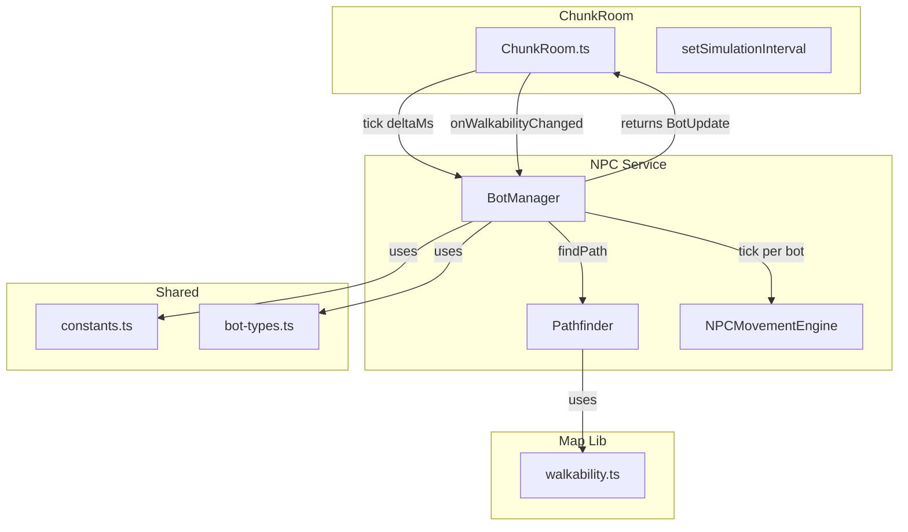
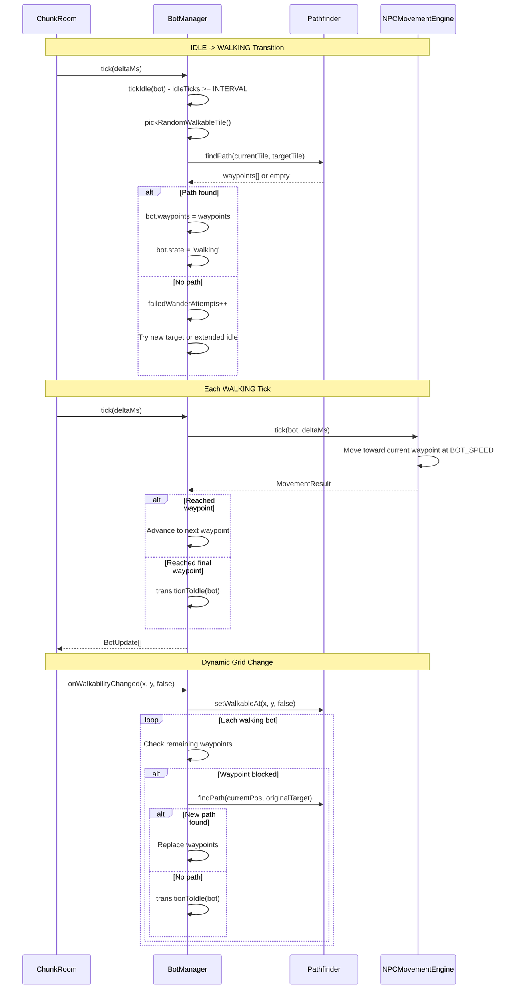
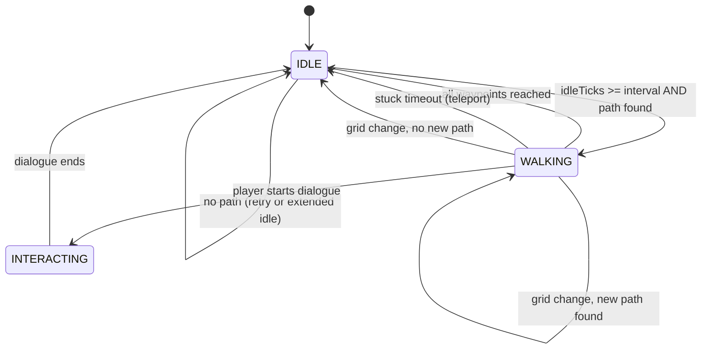

# NPC A* Pathfinding Navigation Design Document

## Overview

Replace straight-line NPC movement with A* pathfinding so that bots navigate around obstacles naturally. NPCs will compute waypoint paths on the existing `boolean[][]` walkability grid using the `pathfinding` npm library, follow waypoints one by one, and recalculate when the grid changes dynamically (e.g., player places/removes objects).

## Design Summary (Meta)

```yaml
design_type: "extension"
risk_level: "low"
complexity_level: "medium"
complexity_rationale: >
  (1) Requirements involve waypoint-based state management (path queue per bot,
  dynamic recalculation on grid changes, stuck-teleport fallback, failure retry
  with backoff) which adds 3+ states to the movement subsystem.
  (2) The primary constraint is zero regression on the existing BotManager public
  API (tick/init/getBotPositions) so that ChunkRoom integration remains unchanged.
main_constraints:
  - "BotManager public API must remain unchanged (tick returns BotUpdate[])"
  - "4-directional movement only (no diagonals)"
  - "NPC-NPC collision avoidance is deferred"
  - "Performance: A* on 64x64 grid must complete in <1ms per path"
biggest_risks:
  - "pathfinding library grid mutation requires cloning per findPath call"
  - "Dynamic grid updates mid-path could cause momentary visual stutters"
unknowns:
  - "Exact performance of pathfinding library grid clone on 64x64 under load"
  - "Visual quality of 4-directional grid-aligned movement vs current smooth diagonal"
```

## Background and Context

### Prerequisite ADRs

- [ADR-0013: NPC Bot Entity Architecture](../adr/ADR-0013-npc-bot-entity-architecture.md): Decision #5 (Wandering Algorithm) explicitly chose straight-line movement for MVP with the note: "When transitioning to M0.3, can replace with A* without changing BotManager interface." This design implements that planned upgrade.
- [ADR-0006: Chunk-Based Room Architecture](../adr/ADR-0006-chunk-based-room-architecture.md): Defines ChunkRoom as the integration point for bot simulation ticks.

### Agreement Checklist

#### Scope

- [x] Replace BotManager's straight-line movement with A* waypoint following
- [x] Add `Pathfinder` wrapper module around `pathfinding` npm library
- [x] Add `NPCMovementEngine` for waypoint-by-waypoint movement per bot
- [x] Add dynamic walkability change handler (`onWalkabilityChanged`)
- [x] Add new pathfinding constants to `packages/shared/src/constants.ts`
- [x] Add `pathfinding` npm dependency to `apps/server/package.json`
- [x] Extend `ServerBot` interface with waypoint fields
- [x] Stuck bot teleport to nearest walkable tile
- [x] Path failure retry with backoff (3 failures -> extended idle)

#### Non-Scope (Explicitly not changing)

- [x] NPC-NPC collision avoidance (deferred to future iteration)
- [x] Diagonal movement (4-directional only)
- [x] ChunkRoom tick API (BotManager.tick() signature unchanged)
- [x] Colyseus schema (ChunkBot fields unchanged)
- [x] Client rendering code (no client changes)
- [x] Dialogue interaction system (unaffected)
- [x] Database schema (no DB changes)

#### Constraints

- [x] Parallel operation: Not required (direct replacement of movement logic)
- [x] Backward compatibility: BotManager public API must remain identical
- [x] Performance measurement: Required (tick <1ms avg, <2ms p99 for 5 bots on 64x64)

#### Confirmation

- [x] All scope items reflected in Implementation Plan section
- [x] No design contradicts agreements
- [x] Non-scope items explicitly excluded from all sections

### Problem to Solve

NPCs currently move in straight lines toward randomly selected walkable tiles. When an obstacle exists between the NPC and target, the bot walks into the obstacle, detects a non-walkable tile, and picks a new random target. This produces unnatural movement patterns where bots appear to "bump into walls" repeatedly. The Bresenham line-of-sight check partially mitigates this by filtering unreachable targets, but bots still cannot navigate around L-shaped obstacles, buildings, or fenced areas.

### Current Challenges

1. **Unnatural movement**: Bots walk straight into walls, then pick new targets -- they never "go around" obstacles
2. **Wasted movement cycles**: Bot selects target, walks toward it, hits wall, transitions to idle, waits, picks new target -- significant time spent stuck
3. **Bresenham LOS limitation**: Line-of-sight only works for straight lines; complex obstacle shapes (L-shaped buildings, fenced pens) are not handled
4. **Kill criteria from ADR-0013**: "If >30% of testers note bots look stupid due to getting stuck" -- the A* upgrade was the planned mitigation

### Requirements

#### Functional Requirements

- FR-1: NPC computes A* path on `boolean[][]` walkability grid to target tile
- FR-2: NPC follows computed waypoints one by one (4-directional: up/down/left/right)
- FR-3: When NPC reaches final waypoint, transitions to IDLE
- FR-4: When no path exists to target, NPC picks another target; after 3 consecutive failures, enters extended idle (10 seconds)
- FR-5: When walkability grid changes (tile becomes non-walkable), affected walking bots recalculate their remaining path
- FR-6: When NPC is stuck (no movement for 5 seconds), teleports to nearest walkable tile
- FR-7: NPC bypasses players on path without stopping (players are not obstacles in the walkability grid)

#### Non-Functional Requirements

- **Performance**: A* path computation on 64x64 grid <1ms; full tick for 5 bots <1ms avg, <2ms p99
- **Reliability**: No infinite loops in pathfinding; safety cutoff at 100 waypoints per path
- **Maintainability**: Pathfinder module is isolated; can swap underlying library without changing BotManager

## Acceptance Criteria (AC) - EARS Format

### FR-1: A* Path Computation

- [x] **When** a bot transitions from IDLE to WALKING, the system shall compute an A* path from the bot's current tile to the target tile using 4-directional movement
- [x] **If** the walkability grid has obstacles between start and target, **then** the computed path shall navigate around them without crossing non-walkable tiles
- [x] The system shall use the `pathfinding` npm library with `DiagonalMovement.Never` configuration

### FR-2: Waypoint Following

- [x] **When** a bot has a computed path, the system shall move the bot toward each waypoint sequentially at BOT_SPEED (60 px/sec)
- [x] **When** the bot reaches within BOT_WAYPOINT_THRESHOLD (2px) of a waypoint, the system shall advance to the next waypoint
- [x] **While** following waypoints, the bot's direction field shall reflect the movement direction (up/down/left/right)

### FR-3: Path Completion

- [x] **When** the bot reaches the final waypoint, the system shall transition the bot to IDLE state and clear all waypoint data

### FR-4: Path Failure Handling

- [x] **If** no path exists to the selected target, **then** the system shall increment `failedWanderAttempts` and select a new random target
- [x] **If** `failedWanderAttempts` reaches BOT_MAX_PATHFIND_FAILURES (3), **then** the system shall enter extended idle for BOT_EXTENDED_IDLE_TICKS (100 ticks = 10 seconds)
- [x] **When** the extended idle period expires, the system shall reset `failedWanderAttempts` to 0 and resume normal wander behavior

### FR-5: Dynamic Grid Update

- [x] **When** a tile's walkability changes, the system shall update the Pathfinder's internal grid via `setWalkableAt(x, y, walkable)`
- [x] **When** a tile becomes non-walkable, the system shall check each walking bot's remaining waypoints; **if** any remaining waypoint is now blocked, the system shall recompute the path from the bot's current position to the original target
- [x] **If** recomputation yields no path, **then** the system shall transition the bot to IDLE

### FR-6: Stuck Detection and Teleport

- [x] **When** a walking bot has not moved more than 1 tile in BOT_STUCK_TIMEOUT_MS (5000ms), the system shall teleport the bot to the nearest walkable tile and transition to IDLE

### FR-7: Player Bypass

- [x] **While** a bot is following a path, **if** a player occupies a tile on the path, **then** the bot shall continue moving without stopping (players are not obstacles in the walkability grid)

## Applicable Standards

### Classification Table

| Standard | Type | Source | Impact on Design |
|----------|------|--------|-----------------|
| Prettier: single quotes, 2-space indent | Explicit | `.prettierrc` | All new code follows single-quote, 2-space formatting |
| ESLint flat config with `@nx/eslint-plugin` | Explicit | `eslint.config.mjs` | Must pass lint with `@typescript-eslint/no-unused-vars: warn` |
| TypeScript strict mode, ES2022 target, ESM | Explicit | `tsconfig.json` | New modules use ESM exports, `.js` extension in imports |
| Jest with ts-jest ESM transform | Explicit | `jest.config.ts` | Tests use `@jest/globals`, `.spec.ts` naming |
| esbuild bundler for server | Explicit | `package.json` nx targets | New modules must be importable by esbuild ESM bundle |
| Factory function pattern for entity creation | Implicit | `bot-types.ts:createServerBot()` | Follow factory pattern, not class constructors |
| Service decoupled from Colyseus | Implicit | `BotManager.ts` docstring | New movement modules must have no Colyseus dependency |
| `BotUpdate[]` return from tick | Implicit | `BotManager.tick()` | Must maintain this interface contract |
| Constants exported from `@nookstead/shared` | Implicit | `constants.ts` pattern | New constants go in shared constants, exported via index |
| Fire-and-forget for non-critical ops, fail-fast for critical | Implicit | `ChunkRoom.ts` patterns | Path recomputation is best-effort; pathfinding init is critical |

## Existing Codebase Analysis

### Implementation Path Mapping

| Type | Path | Description |
|------|------|-------------|
| Existing | `apps/server/src/npc-service/lifecycle/BotManager.ts` | Bot state machine -- refactor movement logic |
| Existing | `apps/server/src/npc-service/lifecycle/BotManager.spec.ts` | Unit tests -- update for waypoint behavior |
| Existing | `apps/server/src/npc-service/types/bot-types.ts` | ServerBot interface -- extend with waypoint fields |
| Existing | `apps/server/src/rooms/ChunkRoom.ts` | Integration point -- add `onWalkabilityChanged` hook |
| Existing | `packages/shared/src/constants.ts` | Shared constants -- add pathfinding constants |
| Existing | `packages/shared/src/index.ts` | Barrel exports -- export new constants |
| Existing | `apps/server/package.json` | Dependencies -- add `pathfinding` |
| New | `apps/server/src/npc-service/movement/Pathfinder.ts` | A* wrapper module |
| New | `apps/server/src/npc-service/movement/Pathfinder.spec.ts` | Pathfinder unit tests |
| New | `apps/server/src/npc-service/movement/NPCMovementEngine.ts` | Per-bot waypoint following |
| New | `apps/server/src/npc-service/movement/NPCMovementEngine.spec.ts` | Movement engine unit tests |
| New | `apps/server/src/npc-service/movement/index.ts` | Barrel exports for movement module |

### Integration Points

- **BotManager -> Pathfinder**: BotManager creates a Pathfinder instance in `init()` with the walkability grid. Calls `findPath()` when transitioning IDLE -> WALKING.
- **BotManager -> NPCMovementEngine**: Each walking bot uses NPCMovementEngine to advance along waypoints each tick.
- **ChunkRoom -> BotManager**: ChunkRoom calls `botManager.onWalkabilityChanged(x, y, walkable)` when the grid changes. No other API changes.
- **ChunkRoom tick loop**: Unchanged -- `botManager.tick(deltaMs)` returns `BotUpdate[]` as before.

### Similar Functionality Search

- **Pathfinding**: No existing pathfinding code found in the codebase (confirmed via Grep search for `pathfind`, `a_star`, `A*`, `waypoint`, `findPath`).
- **Walkability grid**: `packages/map-lib/src/core/walkability.ts` provides `recomputeWalkability()` and `applyObjectCollisionZones()` which produce the `boolean[][]` grid that this design consumes. No duplication -- this design uses the existing grid as input.
- **Line-of-sight**: `BotManager.hasLineOfSight()` uses Bresenham's algorithm. This will be **removed** as A* replaces the need for LOS checks.
- **Decision**: New implementation. No existing pathfinding to reuse or improve.

### Code Inspection Evidence

#### What Was Examined

| File Inspected | Key Finding | Design Impact |
|---------------|-------------|---------------|
| `apps/server/src/npc-service/lifecycle/BotManager.ts` (573 lines) | `tickWalking()` at line 369 moves bot in straight line; `startWander()` at line 432 picks random tile with LOS check; `hasLineOfSight()` at line 515 is Bresenham algorithm | Replace `tickWalking()` with waypoint-following logic; remove `hasLineOfSight()` entirely; modify `startWander()` to use Pathfinder |
| `apps/server/src/npc-service/types/bot-types.ts` (126 lines) | `ServerBot` interface has `targetX/targetY` (single target), no waypoint array; `BotManagerConfig` passes `mapWalkable: boolean[][]` | Extend `ServerBot` with waypoint array and index; config already has walkability grid |
| `apps/server/src/rooms/ChunkRoom.ts` (1221 lines) | `setSimulationInterval` at line 163 calls `botManager.tick(deltaTime)`; walkability grid stored as `this.mapWalkable` at line 99; no existing handler for dynamic walkability changes | Add `onWalkabilityChanged()` method to BotManager; ChunkRoom calls it when grid changes (future: object placement) |
| `packages/shared/src/constants.ts` (143 lines) | Bot constants at lines 81-143: `BOT_SPEED=60`, `BOT_WANDER_RADIUS=8`, `BOT_STUCK_TIMEOUT_MS=5000` | Add new pathfinding constants following same naming pattern |
| `packages/map-lib/src/core/walkability.ts` (116 lines) | `recomputeWalkability()` and `applyObjectCollisionZones()` produce/mutate `boolean[][]` | Pathfinder consumes this grid; `setWalkableAt()` mirrors `applyObjectCollisionZones()` pattern |
| `apps/server/src/npc-service/lifecycle/BotManager.spec.ts` (763 lines) | Tests cover: init, tick idle/walking/stuck, LOS validation, generateBots, interactions | Update stuck detection tests; replace LOS tests with pathfinding tests; add waypoint following tests |
| `apps/server/src/npc-service/lifecycle/BotManager.bench.ts` (97 lines) | Benchmark: 5 bots, 64x64 grid, 1000 ticks. Target: avg <1ms, p99 <2ms | Same targets apply to A* version; benchmark must still pass |

#### Key Findings

- `BotManager` is deliberately decoupled from Colyseus (docstring line 38) -- new modules must follow this
- `tickBot()` dispatches on `bot.state` with if/else (line 352) -- will add waypoint logic to the `walking` branch
- `transitionToIdle()` is a clean reset helper (line 461) -- will extend to clear waypoint data
- `BotUpdate` interface (line 54 of bot-types.ts) already contains all needed fields; no schema changes
- Current stuck detection (line 376) compares distance traveled over time -- this approach is retained for waypoint movement
- `createServerBot()` factory (line 98 of bot-types.ts) initializes all fields from DB record -- will add waypoint field defaults

#### How Findings Influence Design

- **Pattern adoption**: New `Pathfinder` and `NPCMovementEngine` are pure-logic modules with no Colyseus imports, matching BotManager's decoupled pattern
- **Interface preservation**: `BotManager.tick()` continues returning `BotUpdate[]`; ChunkRoom code unchanged except for optional `onWalkabilityChanged` hook
- **Test pattern**: Follow existing `BotManager.spec.ts` patterns (helper functions `makeWalkableGrid`, `makeSelectiveGrid`, `makeConfig`, `makeBotRecord`)
- **Constant naming**: New constants follow `BOT_*` prefix convention established in `constants.ts`

## Design

### Change Impact Map

```yaml
Change Target: BotManager.tickWalking() + startWander()
Direct Impact:
  - apps/server/src/npc-service/lifecycle/BotManager.ts (replace movement logic)
  - apps/server/src/npc-service/lifecycle/BotManager.spec.ts (update tests)
  - apps/server/src/npc-service/types/bot-types.ts (extend ServerBot)
  - packages/shared/src/constants.ts (add new constants)
  - packages/shared/src/index.ts (export new constants)
  - apps/server/package.json (add pathfinding dependency)
Indirect Impact:
  - apps/server/src/rooms/ChunkRoom.ts (add onWalkabilityChanged hook for future use)
  - apps/server/src/npc-service/index.ts (export new movement modules)
No Ripple Effect:
  - Client rendering (no changes to ChunkBot schema or BotUpdate interface)
  - Dialogue system (interacting state unaffected)
  - Database schema (no migrations)
  - Map editor / walkability computation (consumed as-is)
  - Player movement (World.movePlayer unaffected)
```

### Architecture Overview



### Data Flow



### Integration Points List

| Integration Point | Location | Old Implementation | New Implementation | Switching Method |
|-------------------|----------|-------------------|-------------------|------------------|
| Bot movement per tick | `BotManager.tickWalking()` | Straight-line toward `targetX/Y` with walkability check per step | Waypoint-following via `NPCMovementEngine.tick()` | Direct replacement in method body |
| Target selection | `BotManager.startWander()` | `pickRandomWalkableTile()` with Bresenham LOS filter | `pickRandomWalkableTile()` without LOS + `pathfinder.findPath()` validation | Modify `startWander()` to call pathfinder |
| Grid initialization | `BotManager.init()` | Receives `BotManagerConfig.mapWalkable` for `isTileWalkable()` | Also creates `Pathfinder` instance from same grid | Add `Pathfinder` construction in `init()` |
| Grid updates | Not implemented | N/A | `BotManager.onWalkabilityChanged()` updates Pathfinder and recalculates affected paths | New method, called by ChunkRoom |
| Stuck detection | `BotManager.tickWalking()` | Distance-based check over 5s -> go idle | Same distance check -> **teleport** to nearest walkable tile | Modify stuck handler |

### Integration Point Map

```yaml
## Integration Point Map
Integration Point 1:
  Existing Component: BotManager.tickWalking()
  Integration Method: Direct method replacement
  Impact Level: High (Process Flow Change)
  Required Test Coverage: All existing walking tests must pass with waypoint behavior

Integration Point 2:
  Existing Component: BotManager.startWander()
  Integration Method: Call addition (pathfinder.findPath after target selection)
  Impact Level: High (Process Flow Change)
  Required Test Coverage: Verify paths computed correctly around obstacles

Integration Point 3:
  Existing Component: BotManager.init()
  Integration Method: Object construction addition (new Pathfinder instance)
  Impact Level: Medium (Data Usage)
  Required Test Coverage: Verify Pathfinder initialized with correct grid

Integration Point 4:
  Existing Component: ChunkRoom (future)
  Integration Method: New method call (onWalkabilityChanged)
  Impact Level: Low (Read-Only until object placement is implemented)
  Required Test Coverage: Verify walking bot paths recalculated when grid changes
```

### Main Components

#### Component 1: Pathfinder

- **Responsibility**: Wraps `pathfinding` npm library. Provides A* path computation on a `boolean[][]` grid with 4-directional movement. Manages grid state and supports incremental updates.
- **Interface**:
  ```typescript
  interface Point {
    x: number;
    y: number;
  }

  class Pathfinder {
    constructor(walkable: boolean[][]);
    findPath(startX: number, startY: number, endX: number, endY: number): Point[];
    updateGrid(walkable: boolean[][]): void;
    setWalkableAt(x: number, y: number, walkable: boolean): void;
  }
  ```
- **Dependencies**: `pathfinding` npm library (external), no Colyseus/server dependencies

#### Component 2: NPCMovementEngine

- **Responsibility**: Handles waypoint-by-waypoint movement for a single bot. Computes per-tick position updates along a waypoint path at a given speed. Pure calculation -- no state machine logic.
- **Interface**:
  ```typescript
  interface MovementResult {
    moved: boolean;
    reachedWaypoint: boolean;
    reachedDestination: boolean;
    newWorldX: number;
    newWorldY: number;
    direction: string;
  }

  class NPCMovementEngine {
    setPath(waypoints: Point[]): void;
    tick(currentWorldX: number, currentWorldY: number, deltaMs: number, speed: number, tileSize: number): MovementResult;
    hasPath(): boolean;
    isComplete(): boolean;
    clearPath(): void;
    getRemainingWaypoints(): Point[];
    isWaypointBlocked(blockedX: number, blockedY: number): boolean;
  }
  ```
- **Dependencies**: None (pure logic)

#### Component 3: BotManager (Modified)

- **Responsibility**: Unchanged -- manages all NPC bot companions for a single homestead. Now uses `Pathfinder` for path computation and stores waypoint data per bot.
- **Interface**: Unchanged public API. New method `onWalkabilityChanged(x, y, walkable)`.
- **Dependencies**: `Pathfinder`, `NPCMovementEngine`, existing `ServerBot` types

### Contract Definitions

```typescript
// apps/server/src/npc-service/movement/Pathfinder.ts

export interface Point {
  x: number;
  y: number;
}

export class Pathfinder {
  /**
   * Create a Pathfinder from a walkability grid.
   * walkable[y][x] = true means the tile is passable.
   */
  constructor(walkable: boolean[][]);

  /**
   * Compute A* path from (startX, startY) to (endX, endY).
   * Returns array of tile coordinates (excluding start, including end).
   * Returns empty array if no path exists.
   * Path uses 4-directional movement only.
   */
  findPath(startX: number, startY: number, endX: number, endY: number): Point[];

  /**
   * Replace the entire walkability grid.
   */
  updateGrid(walkable: boolean[][]): void;

  /**
   * Update walkability of a single tile.
   */
  setWalkableAt(x: number, y: number, walkable: boolean): void;
}
```

```typescript
// apps/server/src/npc-service/movement/NPCMovementEngine.ts

export interface MovementResult {
  /** Whether the bot moved this tick. */
  moved: boolean;
  /** Whether the bot reached the current intermediate waypoint. */
  reachedWaypoint: boolean;
  /** Whether the bot reached the final destination. */
  reachedDestination: boolean;
  /** New world X position in pixels. */
  newWorldX: number;
  /** New world Y position in pixels. */
  newWorldY: number;
  /** Movement direction: 'up' | 'down' | 'left' | 'right'. */
  direction: string;
}
```

### Data Contract

#### Pathfinder

```yaml
Input:
  Type: boolean[][] (walkability grid, indexed as grid[y][x])
  Preconditions: Grid must be non-empty, rectangular
  Validation: Constructor checks grid dimensions > 0

Output:
  Type: Point[] (tile coordinates along path)
  Guarantees:
    - Each consecutive pair of points differs by exactly 1 in either x or y (4-directional)
    - All points are on walkable tiles
    - Path length <= BOT_MAX_PATH_LENGTH (100)
    - Empty array if no path exists or start/end is non-walkable
  On Error: Returns empty array (never throws)

Invariants:
  - Internal PF.Grid is always in sync with the walkable boolean[][]
  - findPath() never mutates the internal grid (clones before each search)
```

#### NPCMovementEngine

```yaml
Input:
  Type: (currentWorldX, currentWorldY, deltaMs, speed, tileSize)
  Preconditions: Path must be set via setPath() before tick()
  Validation: Returns { moved: false } if no path set

Output:
  Type: MovementResult
  Guarantees:
    - newWorldX/newWorldY are always valid pixel positions
    - direction is always one of 'up', 'down', 'left', 'right'
    - reachedDestination is true only when all waypoints are exhausted
  On Error: Returns { moved: false } (never throws)

Invariants:
  - Waypoint index never exceeds path length
  - clearPath() resets all internal state
```

### State Transitions and Invariants

```yaml
State Definition:
  - IDLE: Bot is stationary, counting idleTicks toward next wander
  - WALKING: Bot has waypoints and is following them
  - INTERACTING: Bot is in dialogue with a player (unchanged)

State Transitions:
  IDLE -> (idleTicks >= WANDER_INTERVAL) -> [compute A* path]
    -> path found -> WALKING
    -> no path (failures < MAX) -> IDLE (pick new target next tick)
    -> no path (failures >= MAX) -> IDLE (extended idle: EXTENDED_IDLE_TICKS)

  WALKING -> (all waypoints reached) -> IDLE
  WALKING -> (stuck timeout) -> [teleport to nearest walkable] -> IDLE
  WALKING -> (grid change blocks path) -> [recompute path]
    -> new path found -> WALKING (updated waypoints)
    -> no new path -> IDLE
  WALKING -> (player initiates interaction) -> INTERACTING

  INTERACTING -> (dialogue ends) -> IDLE

System Invariants:
  - A bot in WALKING state always has a non-empty waypoints array
  - A bot in IDLE state always has empty waypoints and null targetX/targetY
  - failedWanderAttempts resets to 0 when a path is successfully computed
  - walkStartTime/lastKnownX/lastKnownY are set when entering WALKING
```



### Data Representation Decisions

| Data Structure | Decision | Rationale |
|---|---|---|
| `Point` (x, y) | **New** dedicated type | No existing point type in server code. Simple 2-field interface for tile coordinates. Used internally by movement module only. |
| `MovementResult` | **New** dedicated type | No existing movement result type. Represents per-tick movement output specific to waypoint following. |
| `ServerBot` waypoint fields | **Extend** existing interface | Adding `waypoints`, `currentWaypointIndex`, `failedWanderAttempts` to existing `ServerBot`. Existing type covers 90%+ of fields; extension is cleaner than a new type. |
| `BotManagerConfig` | **Reuse** unchanged | Existing config already provides `mapWalkable`, `mapWidth`, `mapHeight` -- exactly what Pathfinder needs. No new config type needed. |

### ServerBot Interface Extensions

```typescript
// Additions to ServerBot in apps/server/src/npc-service/types/bot-types.ts

export interface ServerBot {
  // ... existing fields unchanged ...

  /** Computed A* waypoints (tile coordinates). Empty when IDLE. */
  waypoints: Array<{ x: number; y: number }>;
  /** Index of the current waypoint being pursued. */
  currentWaypointIndex: number;
  /** Timestamp when current route was computed (for cache TTL). */
  routeComputedAt: number;
  /** Count of consecutive failed pathfinding attempts. */
  failedWanderAttempts: number;
}
```

### New Constants

```typescript
// Additions to packages/shared/src/constants.ts

/** Maximum time a computed route is considered fresh. After TTL, route is recomputed. */
export const BOT_ROUTE_CACHE_TTL_MS = 30_000;

/** Safety cutoff: maximum waypoints per computed path. */
export const BOT_MAX_PATH_LENGTH = 100;

/** Pixel distance threshold to consider a waypoint "reached". */
export const BOT_WAYPOINT_THRESHOLD = 2;

/** Number of consecutive pathfinding failures before entering extended idle. */
export const BOT_MAX_PATHFIND_FAILURES = 3;

/** Ticks to wait in extended idle after max pathfinding failures (100 ticks = 10s). */
export const BOT_EXTENDED_IDLE_TICKS = 100;
```

### Field Propagation Map

```yaml
fields:
  - name: "waypoints"
    origin: "Pathfinder.findPath() computation"
    transformations:
      - layer: "Pathfinder"
        type: "number[][] (pathfinding lib internal)"
        transformation: "Converted to Point[] (x, y objects)"
      - layer: "BotManager"
        type: "Array<{ x: number; y: number }>"
        transformation: "Stored on ServerBot.waypoints"
      - layer: "NPCMovementEngine"
        type: "Point[] (read-only reference)"
        transformation: "Consumed for direction/distance calculation"
    destination: "Bot's worldX/worldY position updates (BotUpdate)"
    loss_risk: "none"

  - name: "currentWaypointIndex"
    origin: "BotManager.startWander() (set to 0)"
    transformations:
      - layer: "BotManager"
        type: "number"
        transformation: "Incremented as waypoints are reached"
    destination: "Determines which waypoint NPCMovementEngine targets"
    loss_risk: "none"

  - name: "failedWanderAttempts"
    origin: "BotManager (set to 0 on init/success, incremented on failure)"
    transformations:
      - layer: "BotManager"
        type: "number"
        transformation: "Compared against BOT_MAX_PATHFIND_FAILURES"
    destination: "Controls extended idle behavior"
    loss_risk: "none"
```

### Interface Change Impact Analysis

| Existing Operation | New Operation | Conversion Required | Adapter Required | Compatibility Method |
|-------------------|---------------|-------------------|------------------|---------------------|
| `BotManager.init(config, records)` | `BotManager.init(config, records)` | None | Not Required | Internal: adds Pathfinder construction |
| `BotManager.tick(deltaMs)` | `BotManager.tick(deltaMs)` | None | Not Required | Internal: uses waypoint logic |
| `BotManager.startWander(bot)` | `BotManager.startWander(bot)` | None | Not Required | Internal: adds pathfinder.findPath() |
| `BotManager.tickWalking(bot, deltaMs, now)` | Replaced by `tickWalkingWaypoint(bot, deltaMs, now)` | Internal only | Not Required | Private method replacement |
| `BotManager.hasLineOfSight()` | Removed | N/A | Not Required | A* replaces LOS need |
| N/A (new) | `BotManager.onWalkabilityChanged(x, y, walkable)` | N/A | Not Required | New public method |
| `pickRandomWalkableTile()` | `pickRandomWalkableTile()` | None | Not Required | Internal: removes LOS filter |

### Integration Boundary Contracts

```yaml
Boundary Name: BotManager -> Pathfinder
  Input: Start tile (x, y) and end tile (x, y) as integers
  Output: Point[] of waypoint tiles (sync, immediate return)
  On Error: Returns empty array. BotManager treats as "no path found".

Boundary Name: BotManager -> NPCMovementEngine
  Input: Current world position (px), deltaMs, speed, tileSize
  Output: MovementResult with new position and movement flags (sync)
  On Error: Returns { moved: false }. BotManager retains current position.

Boundary Name: ChunkRoom -> BotManager.onWalkabilityChanged
  Input: Tile coordinates (x, y) and new walkable boolean
  Output: void (sync, immediate)
  On Error: Logs warning, does not propagate. Non-critical operation.
```

### Error Handling

| Error Scenario | Handling | Severity |
|---------------|----------|----------|
| `pathfinding` library throws during findPath | Catch, log error, return empty path (treat as "no path") | Medium |
| Grid clone fails (memory) | Catch, log, return empty path | Medium |
| All waypoints unreachable after grid change | Transition bot to IDLE, retry on next wander cycle | Low |
| Bot teleported to invalid tile | `findAnyWalkableTile()` fallback scans entire grid | Low |
| `pathfinding` library not installed | Build failure (caught at build time, not runtime) | High |
| Infinite path (>100 waypoints) | Truncate to `BOT_MAX_PATH_LENGTH` | Low |

### Logging and Monitoring

```
[BotManager] A* path computed: botId={id}, from=({x},{y}), to=({x},{y}), waypoints={count}, time={ms}ms
[BotManager] No path found: botId={id}, target=({x},{y}), attempt={n}/{max}
[BotManager] Bot stuck, teleporting: botId={id}, from=({x},{y}), to=({x},{y})
[BotManager] Extended idle: botId={id}, failures={n}, cooldown={ticks} ticks
[BotManager] Path recalculated (grid change): botId={id}, newWaypoints={count}
[BotManager] Path invalidated (grid change, no new path): botId={id}
```

## Implementation Plan

### Implementation Approach

**Selected Approach**: Vertical Slice (Feature-driven)

**Selection Reason**: The feature is self-contained within the server NPC movement system. Each phase delivers testable functionality: Phase 1 delivers the pathfinding primitive, Phase 2 delivers waypoint movement, Phase 3 integrates into BotManager. No horizontal foundation work is needed across unrelated layers. The existing test infrastructure (Jest, test helpers) is already in place.

### Technical Dependencies and Implementation Order

#### Required Implementation Order

1. **Pathfinder module** (`Pathfinder.ts` + tests)
   - Technical Reason: Foundation module that provides path computation. No dependencies on existing NPC code.
   - Dependent Elements: BotManager refactor, NPCMovementEngine (uses Point type)

2. **NPCMovementEngine module** (`NPCMovementEngine.ts` + tests)
   - Technical Reason: Requires `Point` type from Pathfinder. Provides per-tick movement logic.
   - Prerequisites: Pathfinder module (for shared types)

3. **Shared constants** (`constants.ts` additions)
   - Technical Reason: BotManager refactor imports these constants
   - Prerequisites: None (can be done in parallel with 1/2)

4. **ServerBot interface extension** (`bot-types.ts` modifications)
   - Technical Reason: BotManager refactor uses new fields
   - Prerequisites: None (can be done in parallel with 1/2)

5. **BotManager refactor** (modify `BotManager.ts`)
   - Technical Reason: Integrates Pathfinder + NPCMovementEngine into existing state machine
   - Prerequisites: Phases 1, 2, 3, 4 complete

6. **BotManager test updates** (modify `BotManager.spec.ts`)
   - Technical Reason: Tests must reflect new waypoint behavior
   - Prerequisites: BotManager refactor

7. **ChunkRoom integration** (modify `ChunkRoom.ts`)
   - Technical Reason: Wire `onWalkabilityChanged` hook
   - Prerequisites: BotManager refactor

### Integration Points (E2E Verification)

**Integration Point 1: Pathfinder -> pathfinding library**
- Components: `Pathfinder.ts` -> `pathfinding` npm
- Verification: Unit tests with known grids verify correct paths around obstacles

**Integration Point 2: BotManager -> Pathfinder**
- Components: `BotManager.startWander()` -> `Pathfinder.findPath()`
- Verification: BotManager tests with obstacle grids verify bots navigate around walls

**Integration Point 3: BotManager -> NPCMovementEngine**
- Components: `BotManager.tickWalkingWaypoint()` -> `NPCMovementEngine.tick()`
- Verification: BotManager tests verify bots follow waypoints and reach destinations

**Integration Point 4: ChunkRoom -> BotManager.onWalkabilityChanged**
- Components: `ChunkRoom` -> `BotManager.onWalkabilityChanged()`
- Verification: Integration test: change grid tile, verify walking bot recalculates path

### Migration Strategy

This is a direct replacement with no parallel operation period:

1. Add `pathfinding` dependency to `apps/server/package.json`
2. Create new movement modules (no existing code affected yet)
3. Extend `ServerBot` interface (backward compatible -- new fields with defaults)
4. Refactor `BotManager` internals (public API unchanged)
5. Update tests
6. Add `onWalkabilityChanged` to BotManager and wire from ChunkRoom

**Rollback**: Since BotManager's public API is unchanged, reverting the internal implementation is a single-file revert of `BotManager.ts`.

## Test Strategy

### Basic Test Design Policy

Each acceptance criterion maps to at least one test case. Tests use the existing helper pattern from `BotManager.spec.ts` (`makeWalkableGrid`, `makeSelectiveGrid`, `makeConfig`, `makeBotRecord`).

### Unit Tests

#### Pathfinder.spec.ts

| Test Case | AC | Description |
|-----------|-----|-------------|
| finds path on open grid | AC FR-1 | 4x4 all-walkable grid, path from (0,0) to (3,3) |
| navigates around wall | AC FR-1 | Grid with vertical wall, verify path goes around |
| returns empty for unreachable target | AC FR-4 | Grid with isolated sections, no path possible |
| returns empty for non-walkable start | AC FR-1 | Start tile is blocked |
| returns empty for non-walkable end | AC FR-1 | End tile is blocked |
| 4-directional only (no diagonals) | AC FR-2 | Verify consecutive waypoints differ by 1 in x or y only |
| respects BOT_MAX_PATH_LENGTH | AC FR-1 | Long path truncated to 100 waypoints |
| setWalkableAt updates grid | AC FR-5 | Make tile non-walkable, verify path avoids it |
| updateGrid replaces entire grid | AC FR-5 | Replace grid, verify new paths reflect changes |

#### NPCMovementEngine.spec.ts

| Test Case | AC | Description |
|-----------|-----|-------------|
| moves toward first waypoint | AC FR-2 | Set path, tick, verify position moves toward waypoint |
| advances to next waypoint | AC FR-2 | Reach within threshold, verify index increments |
| signals destination reached | AC FR-3 | All waypoints reached, `reachedDestination: true` |
| computes correct direction | AC FR-2 | Moving right -> direction 'right', etc. |
| returns moved:false with no path | AC FR-2 | No setPath called, tick returns `moved: false` |
| clearPath resets state | AC FR-3 | After clearPath, `hasPath()` returns false |
| isWaypointBlocked detects blocked tile | AC FR-5 | Set path, check if specific tile is in remaining path |

#### BotManager.spec.ts (Updated)

| Test Case | AC | Description |
|-----------|-----|-------------|
| bot navigates around obstacle | AC FR-1 | Grid with wall, verify bot path goes around it |
| bot reaches target via waypoints | AC FR-2, FR-3 | Bot follows waypoints to completion, transitions to IDLE |
| no-path increments failedWanderAttempts | AC FR-4 | Isolated grid, verify attempt counter increases |
| extended idle after max failures | AC FR-4 | After 3 failures, bot waits extended idle ticks |
| stuck bot teleports to walkable tile | AC FR-6 | Bot stuck in enclosed area, verify teleport |
| grid change triggers path recalculation | AC FR-5 | Block a waypoint tile, verify bot gets new path |
| grid change with no new path -> idle | AC FR-5 | Block all routes, verify bot transitions to idle |
| interacting bot skips movement (unchanged) | -- | Existing test, ensure no regression |
| dialogue system unaffected | -- | Existing interaction tests pass unchanged |

### Integration Tests

- Existing `bot-integration.spec.ts` tests (INT-1 through INT-4) should pass unchanged since ChunkRoom -> BotManager API is preserved
- Add: INT-5 test for `onWalkabilityChanged` flow through ChunkRoom

### Performance Tests

- Update existing `BotManager.bench.ts` to verify performance targets still met with A* (avg <1ms, p99 <2ms for 5 bots on 64x64 grid)
- Add pathfinding-specific benchmark: measure `findPath()` latency on 64x64 grid with varying obstacle density (0%, 25%, 50%)

## Collision Behavior Summary

| Situation | Behavior |
|---|---|
| NPC stuck (no movement for 5 seconds) | Teleport to nearest free tile, transition to IDLE |
| Path to target does not exist | Increment failedWanderAttempts, pick new target. After 3 failures, extended idle (10s). |
| Player places object on NPC path | `onWalkabilityChanged` -> recalculate route |
| NPC meets player on path | Bypass without stopping (players not in walkability grid) |
| NPC-NPC collision | **Deferred** -- not handled this iteration |

## Balance Parameters

| Parameter | Constant Name | Value | Range |
|---|---|---|---|
| NPC Speed | `BOT_SPEED` | 60 px/sec | 40-80 |
| Wander Radius | `BOT_WANDER_RADIUS` | 8 tiles | 4-16 |
| Pause Between Walks | `BOT_WANDER_INTERVAL_TICKS` | 30 ticks (3s) | 10-100 |
| Stuck Timeout | `BOT_STUCK_TIMEOUT_MS` | 5000 ms | 3000-10000 |
| Route Cache TTL | `BOT_ROUTE_CACHE_TTL_MS` | 30000 ms | 10000-60000 |
| Max Path Length | `BOT_MAX_PATH_LENGTH` | 100 waypoints | 50-200 |
| Waypoint Threshold | `BOT_WAYPOINT_THRESHOLD` | 2 px | 1-4 |
| Max Pathfind Failures | `BOT_MAX_PATHFIND_FAILURES` | 3 | 1-5 |
| Extended Idle Duration | `BOT_EXTENDED_IDLE_TICKS` | 100 ticks (10s) | 50-200 |

## Security Considerations

No security implications. Pathfinding runs entirely server-side. Clients cannot influence path computation. The `pathfinding` npm library operates on in-memory data structures only.

## Future Extensibility

1. **NPC-NPC collision avoidance** (deferred): When implemented, NPCMovementEngine can be extended with a "blocked by NPC" check that triggers wait-then-reroute behavior.
2. **Weighted tiles**: `pathfinding` library supports weighted grids. Can add terrain-based movement cost (e.g., sand is slower) by switching from `boolean[][]` to `number[][]`.
3. **Dynamic NPC speed**: `NPCMovementEngine.tick()` accepts speed as parameter, so per-NPC speed variations are already supported.
4. **Path smoothing**: Post-process waypoints to remove unnecessary intermediate points for more natural-looking movement.
5. **NPC following**: `Pathfinder.findPath()` can target a moving entity; recalculate periodically.

## Alternative Solutions

### Alternative 1: Custom A* Implementation

- **Overview**: Implement A* algorithm from scratch without external library
- **Advantages**: No external dependency, full control over algorithm, can optimize for specific use case
- **Disadvantages**: More code to write and maintain, higher bug risk, no community testing
- **Reason for Rejection**: The `pathfinding` npm library is mature (10+ years), well-tested, and provides exactly the features needed. Writing custom A* would be reinventing the wheel.

### Alternative 2: EasyStar.js (Asynchronous Pathfinding)

- **Overview**: Use `easystarjs` which provides async A* pathfinding with built-in acceptability callbacks
- **Advantages**: Built-in async support for non-blocking computation, simpler API
- **Disadvantages**: Async pathfinding adds complexity to the synchronous tick loop, requires callback management, less flexible grid API
- **Reason for Rejection**: Synchronous pathfinding is sufficient for 64x64 grids (<1ms). Async adds unnecessary complexity when the computation is fast enough to run inline.

### Alternative 3: Navigation Mesh (NavMesh)

- **Overview**: Pre-compute a navigation mesh from the walkability grid for more natural movement
- **Advantages**: Smoother paths, more natural-looking movement, supports non-grid-aligned movement
- **Disadvantages**: Significantly more complex, requires mesh generation step, overkill for tile-based game, larger external dependency
- **Reason for Rejection**: Tile-based 2D game with 16px tiles does not benefit from NavMesh precision. A* on the tile grid is the standard approach for this genre and provides sufficient path quality.

## Risks and Mitigation

| Risk | Impact | Probability | Mitigation |
|------|--------|-------------|------------|
| `pathfinding` lib grid clone is slow on large maps | Medium | Low | Benchmark on 64x64 (target <0.3ms). Library uses optimized internal structures. |
| A* paths look "robotic" (grid-aligned, right-angle turns) | Low | Medium | Acceptable for pixel art 2D game. Future: add path smoothing. |
| Route cache TTL causes stale paths | Low | Low | 30s TTL + dynamic grid change handler covers most cases. |
| Many simultaneous path recalculations on grid change | Medium | Low | Max 5 bots per homestead (MAX_BOTS_PER_HOMESTEAD=5); each findPath <1ms. Worst case: 5ms spike. |
| `pathfinding` library is unmaintained (last publish 10 years ago) | Low | Medium | Library is stable and feature-complete. API is frozen. Can fork if critical bug found. |

## References

- [PathFinding.js GitHub](https://github.com/qiao/PathFinding.js) - The `pathfinding` npm library used in this design
- [PathFinding.js npm](https://www.npmjs.com/package/pathfinding) - npm package page (v0.4.18)
- [PathFinding.js Visual Demo](https://qiao.github.io/PathFinding.js/visual/) - Interactive visual demo of the library's algorithms
- [ADR-0013: NPC Bot Entity Architecture](../adr/ADR-0013-npc-bot-entity-architecture.md) - Prerequisite ADR, Decision #5 planned A* upgrade

## Update History

| Date | Version | Changes | Author |
|------|---------|---------|--------|
| 2026-03-14 | 1.0 | Initial version | Technical Designer |
