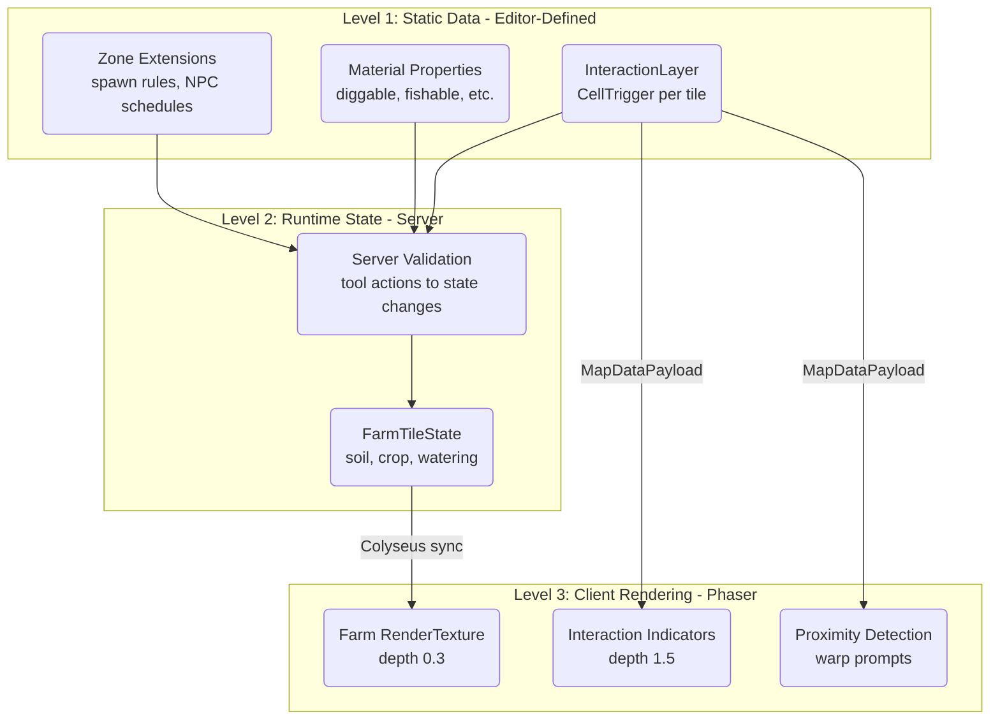
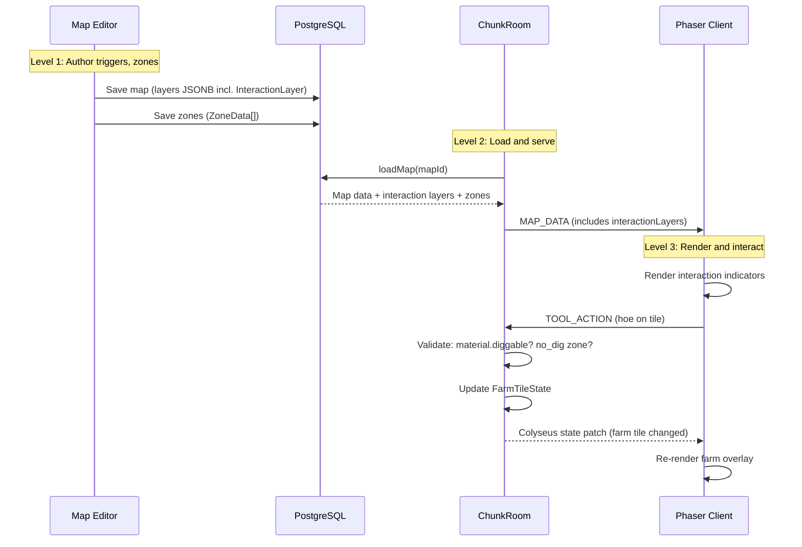

# Interactive Map System Design Document

## Overview

This design defines the Interactive Map System -- a 3-level architecture that adds tile-level interactions (warps, shops, triggers), material-level tile properties (diggable, fishable), zone-level behavior configuration (spawn rules, NPC schedules), and server-authoritative farm state (soil, crops, watering) to Nookstead maps. The system spans the editor (map-lib), database (packages/db), game server (Colyseus), and client renderer (Phaser).

## Design Summary (Meta)

```yaml
design_type: "new_feature"
risk_level: "medium"
complexity_level: "high"
complexity_rationale: >
  (1) ACs span 4 packages (shared, map-lib, db, server) with new types, DB migration,
  editor tools, server state management, and client rendering. The InteractionLayer
  alone requires a new layer type, 6 trigger subtypes, editor UI (sidebar + config panel),
  serialization, and undo/redo support.
  (2) Farm state introduces server-authoritative Colyseus schema with growth-point
  arithmetic and cross-system data flow (editor zones -> server farm init -> client render).
  Risk of data loss at layer boundaries and schema migration on production DB.
main_constraints:
  - "Backward compatible -- existing maps must load without modification"
  - "All new fields optional with sensible defaults"
  - "Farm state is server-only -- client renders but never modifies"
  - "TypeScript strict mode compliance"
biggest_risks:
  - "InteractionLayer serialization/deserialization roundtrip data loss"
  - "Materials DB migration on production data"
  - "Colyseus schema size for farm state on large homestead maps"
unknowns:
  - "Optimal Colyseus schema granularity for FarmTileState"
  - "Whether single InteractionLayer per map suffices or multiple needed"
  - "surfaceType enum vs free-text trade-off"
```

## Background and Context

### Prerequisite ADRs

- [ADR-0017: Interactive Map Architecture](../adr/ADR-0017-interactive-map-architecture.md): All 5 decisions (InteractionLayer, material properties, zone extension, CellAction deprecation, FarmTileState)
- [ADR-0010: Fence System Architecture](../adr/ADR-0010-fence-system-architecture.md): Layer union pattern, editor tool pattern
- [ADR-0012: Multi-Layer Painting Pipeline](../adr/ADR-0012-multi-layer-painting-pipeline.md): Layer-aware paint pipeline, undo/redo command pattern

### Agreement Checklist

#### Scope
- [x] Add `InteractionLayer` type to `EditorLayerUnion` with sparse trigger storage
- [x] Add `CellTrigger` discriminated union with 5 trigger types (warp, interact, event, sound, damage)
- [x] Extend `materials` table with `diggable`, `fishable`, `water_source`, `buildable`, `surface_type` columns
- [x] Add 6 new zone types (`warp_zone`, `no_dig`, `no_build`, `no_fish`, `no_spawn`, `farmland`)
- [x] Define `FarmTileState` interface for server-side farm state
- [x] Add editor tools: `interaction-place`, `interaction-eraser`
- [x] Add editor sidebar tab: `interactions`
- [x] Add editor actions: `PLACE_TRIGGER`, `REMOVE_TRIGGER`, `UPDATE_TRIGGER`, `ADD_INTERACTION_LAYER`
- [x] Define `SerializedInteractionLayer` for network/persistence
- [x] Extend `MapDataPayload` with optional `interactionLayers` field
- [x] Deprecate `Cell.action` with `@deprecated` JSDoc

#### Non-Scope (Explicitly not changing)
- [x] Existing `TileLayer`, `ObjectLayer`, `FenceLayer` types unchanged
- [x] Existing `Cell.terrain`, `Cell.elevation`, `Cell.meta` unchanged
- [x] No Colyseus `FarmTileState` implementation in this design (schema definition only; server-side farm logic deferred to farming feature)
- [x] No client rendering implementation for farm state overlay (deferred)
- [x] No warp transition animations (deferred to client rendering feature)
- [x] Map generation pipeline unchanged

#### Constraints
- [x] Parallel operation: Not applicable (editor is single-user)
- [x] Backward compatibility: Required -- existing maps must load via `LOAD_MAP` without modification
- [x] Performance measurement: Not required for editor; recommended for Colyseus farm state sync

#### Agreement Reflection
- Scope items are implemented in Sections 5 (Type Definitions), 6 (DB Migration), 7 (Editor), 8 (Serialization), 9 (Server State)
- Non-scope items are explicitly excluded from implementation plan
- Backward compatibility is ensured via optional fields with defaults in all new types

### Architectural Constraint: Zero-Conversion Data Sharing

**The map editor (genmap) and the game client (apps/game) MUST use the same data types and serialization formats without any conversion layer between them.**

This means:
- Types defined in `@nookstead/shared` are the **single source of truth** for both editor and game
- `SerializedInteractionLayer` is the format stored in DB, sent over network, AND consumed by the game client — no intermediate transform
- `CellTrigger` discriminated union is used identically in editor (for authoring) and in game (for runtime processing)
- `MaterialInfo` with tile properties (diggable, fishable, etc.) is the same type in editor (for overlay visualization) and in game (for tool validation)
- `ZoneData` with property schemas is the same type everywhere
- The game client deserializes `SerializedInteractionLayer` into the same `Map<string, CellTrigger[]>` structure that the editor uses — same key format `"x,y"`, same trigger types

**Why this matters:** The current terrain/fence systems already follow this principle — `SerializedFenceLayer` is used identically in editor save, server load, and client render. The interactive map system MUST NOT introduce a separate "game format" that requires conversion from the "editor format".

**Implication for types placement (follows SerializedFenceLayer/FenceLayer pattern):**

| Type | Package | Reason |
|------|---------|--------|
| `CellTrigger` (discriminated union) | `@nookstead/shared` | Referenced by MapDataPayload, used by server + game + editor |
| `SerializedInteractionLayer` | `@nookstead/shared` | Part of MapDataPayload network contract (same as SerializedFenceLayer) |
| `FarmTileState`, `CropState` | `@nookstead/shared` | Used by server (Colyseus schema) + game client (rendering) |
| `InteractionLayer` (extends BaseLayer) | `packages/map-lib` | Editor layer type (same as FenceLayer in editor-types.ts) |
| Zone property schemas | `packages/map-lib` | Extension of ZoneData already in map-lib |
| MaterialInfo extension | `packages/map-lib` | Already defined in map-lib/types/material-types.ts |
| Editor actions, tools, sidebar tabs | `packages/map-lib` | Already defined in map-lib/types/editor-types.ts |

**Why not all in map-lib?** `MapDataPayload` lives in `@nookstead/shared`. It needs to reference `SerializedInteractionLayer`. If that type were in `map-lib`, it would create a circular dependency (shared → map-lib → shared). So serialization types stay in shared, editor types stay in map-lib — exactly the pattern used by fence system.

**Future consolidation (separate PR):** All map types (Cell, Grid, MapDataPayload, SerializedFenceLayer, etc.) should eventually be moved from `@nookstead/shared` to `packages/map-lib` in a dedicated refactoring PR. All consumers (server, game, genmap) already depend on map-lib, so this is safe. This will require updating ~50 import statements but produces a cleaner single-owner architecture for map types.

### Problem to Solve

1. **No interaction system**: Maps cannot define what happens when a player steps on, clicks, or approaches a tile. Warps, shops, crafting stations, and damage zones have no data model.
2. **No tile properties on materials**: Tools cannot determine if terrain is diggable/fishable without hardcoded material key checks. Material properties should be DB-driven.
3. **No zone-level behavior**: Zones are spatial regions with a type label but no structured behavior configuration (spawn rules, NPC schedules, operating hours).
4. **No farm state model**: There is no data structure for soil state, crop growth, watering, or debris -- blocking the core farming gameplay loop.
5. **CellAction is a dead type**: `Cell.action` is defined but unused, creating confusion about where interaction data should live.

### Current Challenges

- The `CellAction` type supports only one action per cell with no activation mode distinction
- Material properties (walkable, speedModifier, damaging) exist but lack farming-specific flags
- `ZoneData.properties` is `Record<string, unknown>` with no structured schemas
- No server-side per-tile state management pattern exists
- The editor has no tools for placing non-terrain, non-object, non-fence data on tiles

### Requirements

#### Functional Requirements

- FR1: Editor supports placing, editing, and removing interaction triggers on any tile
- FR2: Multiple triggers can exist on a single tile with different activation modes
- FR3: Material properties (diggable, fishable, etc.) are configurable in the database
- FR4: Zones can define spawn rules, NPC schedules, warp configurations, and operating hours
- FR5: Farm tile state is defined as a server-authoritative data structure
- FR6: Interaction layers are serialized/deserialized for persistence and network transfer
- FR7: Existing maps load without modification (backward compatibility)

#### Non-Functional Requirements

- **Performance**: InteractionLayer sparse storage must have O(1) lookup by coordinate
- **Scalability**: Farm state schema must support up to 4096 tiles (64x64 homestead) without exceeding Colyseus patch budget
- **Reliability**: Serialization roundtrip must be lossless (serialize -> deserialize -> serialize produces identical output)
- **Maintainability**: New trigger types must be addable without modifying existing code (open/closed principle via discriminated union)

## Acceptance Criteria (AC) - EARS Format

### FR1: Interaction Trigger Placement

- [ ] **When** the user selects the `interaction-place` tool and clicks a tile, the system shall add a trigger of the selected type to the InteractionLayer at that tile position
- [ ] **When** the user selects the `interaction-eraser` tool and clicks a tile with triggers, the system shall remove all triggers from that tile position
- [ ] **While** the InteractionLayer is visible, the system shall render trigger type icons as overlays on tiles that contain triggers
- [ ] **If** no InteractionLayer exists when placing a trigger, **then** the system shall automatically create one

### FR2: Multiple Triggers Per Tile

- [ ] **When** the user places a trigger on a tile that already has triggers, the system shall append the new trigger (not replace)
- [ ] **If** the user places a trigger of the same type that already exists on the tile, **then** the system shall replace the existing trigger of that type

### FR3: Material Properties

- [ ] The `materials` table shall include `diggable`, `fishable`, `water_source`, `buildable` boolean columns defaulting to `false`
- [ ] The `materials` table shall include a `surface_type` varchar column defaulting to `null`
- [ ] **When** a material is loaded, the system shall expose all tile property fields in `MaterialInfo`

### FR4: Zone Behavior Configuration

- [ ] The `ZoneType` union shall include `warp_zone`, `no_dig`, `no_build`, `no_fish`, `no_spawn`, `farmland` types
- [ ] **When** a zone of type `farmland` is created, the system shall accept spawn rules and operating hours in `properties`
- [ ] **When** a zone of type `warp_zone` is created, the system shall accept target map, coordinates, and transition type in `properties`

### FR5: Farm Tile State Definition

- [ ] The `FarmTileState` interface shall define `soilState`, `watered`, `fertilizer`, `crop`, and `debris` fields
- [ ] The `CropState` interface shall use growth points (not timers) for progression
- [ ] The `CropStage` type shall define stages: `seed`, `sprout`, `growing`, `mature`, `harvestable`, `dead`

### FR6: Serialization

- [ ] **When** an InteractionLayer is serialized, the system shall produce a sparse array of positioned trigger entries (not a dense 2D grid)
- [ ] **When** a serialized InteractionLayer is deserialized, the system shall reconstruct the sparse Map with identical trigger data
- [ ] Serialization roundtrip shall be lossless for all trigger types

### FR7: Backward Compatibility

- [ ] **When** loading a map without `interactionLayers` in the payload, the system shall treat it as having zero interaction layers
- [ ] **When** loading a map without new material property columns, the system shall use default values (`false` for booleans, `null` for surfaceType)
- [ ] Existing `Cell.action` field shall remain on the `Cell` interface with `@deprecated` annotation

## Applicable Standards

### Classification Table

| Standard | Type | Source | Impact on Design |
|----------|------|--------|-----------------|
| TypeScript strict mode | Explicit | `tsconfig.base.json` (`"strict": true`) | All new types must have explicit types, no implicit any |
| Prettier single quotes | Explicit | `.prettierrc` (`"singleQuote": true`) | All code samples use single quotes |
| ESLint Nx module boundaries | Explicit | `eslint.config.mjs` | New types must be in correct package (shared vs map-lib) |
| Drizzle ORM schema pattern | Explicit | `packages/db/src/schema/*.ts` | DB migration follows `pgTable` + typed exports pattern |
| CI runs lint+test+typecheck on affected | Explicit | `.github/workflows/ci.yml` | All new code must pass existing CI checks |
| Jest test framework | Explicit | `jest.config.cts` per package | Unit tests use Jest |
| Discriminated union layer pattern | Implicit | `editor-types.ts` (TileLayer/ObjectLayer/FenceLayer) | InteractionLayer must follow `type` discriminant pattern |
| Sparse serialization for layer data | Implicit | `fence-layer.ts` (SerializedGateData) | InteractionLayer serialization uses sparse positioned entries |
| EditorCommand undo/redo pattern | Implicit | `editor-types.ts` (EditorCommand interface) | Interaction placement must support undo/redo via commands |
| MapEditorAction reducer pattern | Implicit | `editor-types.ts` (MapEditorAction union) | New actions added to the discriminated union |
| BaseLayer interface extension | Implicit | `editor-types.ts` (all layers extend BaseLayer) | InteractionLayer extends BaseLayer with id, name, visible, opacity |

## Existing Codebase Analysis

### Implementation Path Mapping

| Type | Path | Description |
|------|------|-------------|
| Existing | `packages/shared/src/types/map.ts` | Cell, CellAction, MapDataPayload, SerializedLayer |
| Existing | `packages/shared/src/types/fence-layer.ts` | FenceLayer serialization pattern reference |
| Existing | `packages/map-lib/src/types/editor-types.ts` | EditorLayerUnion, MapEditorState, MapEditorAction |
| Existing | `packages/map-lib/src/types/map-types.ts` | ZoneType, ZoneData, MapType |
| Existing | `packages/db/src/schema/materials.ts` | Materials table schema |
| Existing | `packages/db/src/schema/editor-maps.ts` | Editor maps table (layers stored as JSONB) |
| Existing | `packages/db/src/schema/maps.ts` | Production maps table |
| Existing | `apps/server/src/rooms/ChunkRoomState.ts` | Colyseus schema pattern |
| Existing | `apps/server/src/rooms/ChunkRoom.ts` | MAP_DATA sending, message handlers |
| Existing | `apps/genmap/src/hooks/use-map-editor.ts` | Editor save/load, reducer dispatch |
| New | `packages/shared/src/types/interaction-layer.ts` | CellTrigger types, SerializedInteractionLayer |
| New | `packages/shared/src/types/farm-state.ts` | FarmTileState, CropState, CropStage |
| New | `packages/map-lib/src/types/interaction-types.ts` | Editor-side interaction type utilities |
| New | `packages/db/src/migrations/0016_*.sql` | Materials table migration |

### Integration Points

- **Integration Target**: `EditorLayerUnion` in `editor-types.ts`
  - **Invocation Method**: Add `InteractionLayer` to the union type
- **Integration Target**: `MapEditorAction` in `editor-types.ts`
  - **Invocation Method**: Add new action variants to the union
- **Integration Target**: `MapDataPayload` in `map.ts`
  - **Invocation Method**: Add optional `interactionLayers` field
- **Integration Target**: `materials` table in `materials.ts`
  - **Invocation Method**: Add new columns via Drizzle schema + migration
- **Integration Target**: `ZoneType` union in `map-types.ts`
  - **Invocation Method**: Add new zone type string literals
- **Integration Target**: `ChunkRoom.onJoin` in `ChunkRoom.ts`
  - **Invocation Method**: Include interaction layers in MAP_DATA payload

### Code Inspection Evidence

#### What Was Examined

| File Inspected | Key Finding | Design Impact |
|---------------|-------------|---------------|
| `packages/shared/src/types/map.ts` (lines 1-209) | `CellAction` is defined but never used in any implementation; `MapDataPayload` has optional `fenceLayers` field pattern | Deprecate CellAction; follow fenceLayers pattern for interactionLayers |
| `packages/map-lib/src/types/editor-types.ts` (lines 1-276) | `EditorLayerUnion = TileLayer \| ObjectLayer \| FenceLayer`; `BaseLayer` has id/name/visible/opacity; `MapEditorAction` uses discriminated union for all actions | InteractionLayer extends BaseLayer; new actions follow existing union pattern |
| `packages/map-lib/src/types/map-types.ts` (lines 1-111) | `ZoneType` is a string literal union; `ZoneData.properties` is `Record<string, unknown>`; `ZONE_COLORS` maps types to hex colors | Add new zone types to union; add colors; use properties bag for structured data |
| `packages/shared/src/types/fence-layer.ts` (lines 1-37) | `SerializedFenceLayer` uses sparse `gates: SerializedGateData[]` for per-cell data alongside dense `frames: number[][]` | Follow sparse serialization pattern for interaction triggers |
| `packages/db/src/schema/materials.ts` (lines 1-31) | Materials uses `pgTable` with typed columns; exports `Material` and `NewMaterial` inferred types | Add new columns following same pattern; generate migration |
| `packages/db/src/schema/editor-maps.ts` (lines 1-32) | `layers` stored as JSONB; no separate column for fence or interaction layers | Interaction layers serialize into the `layers` JSONB array alongside other layer types |
| `apps/server/src/rooms/ChunkRoomState.ts` (lines 1-38) | Colyseus `@type` decorators on Schema classes; `MapSchema` for collections | FarmTileState follows same `@type` pattern |
| `apps/server/src/rooms/ChunkRoom.ts` (lines 358-381) | MAP_DATA payload constructed from DB map record; `mapPayload.walkable` set separately | Add interactionLayers to mapPayload from loaded map data |
| `apps/genmap/src/hooks/use-map-editor.ts` (lines 1088-1127) | Save sends `state.layers` as JSON; load dispatches `LOAD_MAP` | InteractionLayer included in layers array; LOAD_MAP normalizes on load |

#### Key Findings

- **Proven pattern**: FenceLayer provides a complete reference for adding new layer types (type definition, editor actions, serialization, sparse data)
- **Layers stored as JSONB**: Both `editor_maps.layers` and `maps.layers` store layer arrays as JSONB, so InteractionLayer serialization must be JSON-compatible
- **Cell.action is dead code**: No grep results for CellAction usage beyond type definition and re-export
- **MapDataPayload extensibility**: The `fenceLayers?: SerializedFenceLayer[]` optional field pattern works for backward-compatible payload extension

#### How Findings Influence Design

- InteractionLayer follows FenceLayer's implementation path: same BaseLayer extension, same discriminated union membership, same serialization approach
- Sparse trigger storage mirrors `SerializedGateData[]` pattern from fence-layer.ts
- LOAD_MAP handler normalization pattern (handling missing/legacy layer data) is reused for interaction layers
- Material property extension follows existing column-addition pattern in materials.ts

### Similar Functionality Search

**CellAction**: Defined in `map.ts` but unused -- confirmed via grep. No call sites, no runtime consumers. Decision: Deprecate, do not extend.

**Zone properties**: `ZoneData.properties` exists as `Record<string, unknown>` but no structured schemas are defined for any zone type. Decision: Define TypeScript interfaces for zone property schemas as documentation/validation aids.

**Tile interaction in ChunkRoom**: `handleNpcInteract` exists but operates on proximity to bot entities, not tile triggers. Decision: New system, no conflict.

## Design

### Change Impact Map

```yaml
Change Target: InteractionLayer type system
Direct Impact:
  - packages/shared/src/types/interaction-layer.ts (NEW - trigger types, serialization)
  - packages/shared/src/types/farm-state.ts (NEW - farm state types)
  - packages/shared/src/types/map.ts (Cell.action @deprecated, MapDataPayload extension)
  - packages/shared/src/index.ts (re-export new types)
  - packages/map-lib/src/types/editor-types.ts (EditorLayerUnion, MapEditorAction, MapEditorState)
  - packages/map-lib/src/types/map-types.ts (ZoneType extension)
  - packages/map-lib/src/index.ts (re-export new types)
Indirect Impact:
  - packages/db/src/schema/materials.ts (new columns)
  - packages/db/src/migrations/0016_*.sql (migration)
  - apps/server/src/rooms/ChunkRoom.ts (MAP_DATA payload)
  - apps/genmap/src/hooks/use-map-editor.ts (reducer handling, save/load)
  - apps/genmap/src/components/map-editor/* (editor UI - future)
No Ripple Effect:
  - packages/map-lib/src/core/retile-engine.ts (terrain paint unaffected)
  - packages/map-lib/src/core/autotile*.ts (autotile routing unaffected)
  - packages/map-lib/src/core/fence-*.ts (fence system unaffected)
  - apps/game/src/game/scenes/* (game client rendering - deferred)
  - apps/server/src/npc-service/* (NPC AI unaffected)
  - apps/server/src/world/* (World/ChunkManager unaffected)
```

### Architecture Overview



### Data Flow



### Integration Points List

| Integration Point | Location | Old Implementation | New Implementation | Switching Method |
|-------------------|----------|-------------------|-------------------|------------------|
| Layer union type | `editor-types.ts:EditorLayerUnion` | `TileLayer \| ObjectLayer \| FenceLayer` | `TileLayer \| ObjectLayer \| FenceLayer \| InteractionLayer` | Direct union extension |
| MAP_DATA payload | `map.ts:MapDataPayload` | No interaction data | `interactionLayers?: SerializedInteractionLayer[]` | Optional field addition |
| Materials schema | `materials.ts` | 10 columns | 15 columns (5 new) | DB migration |
| Zone types | `map-types.ts:ZoneType` | 11 types | 17 types (6 new) | Union extension |
| Editor actions | `editor-types.ts:MapEditorAction` | No interaction actions | 4 new action variants | Union extension |
| Editor tools | `editor-types.ts:EditorTool` | 9 tools | 11 tools (2 new) | Union extension |
| Sidebar tabs | `editor-types.ts:SidebarTab` | 7 tabs | 8 tabs (1 new) | Union extension |
| Cell.action | `map.ts:Cell` | `action?: CellAction` | `@deprecated action?: CellAction` | JSDoc annotation |

### Main Components

#### Component 1: CellTrigger Type System

- **Responsibility**: Define the discriminated union of all trigger types with their configuration data
- **Interface**: `CellTrigger = WarpTrigger | InteractTrigger | EventTrigger | SoundTrigger | DamageTrigger`
- **Dependencies**: None (pure type definitions in `@nookstead/shared`)

#### Component 2: InteractionLayer

- **Responsibility**: Store sparse trigger data per tile, integrate with editor layer system
- **Interface**: Extends `BaseLayer` with `type: 'interaction'` and `triggers: Map<string, CellTrigger[]>`
- **Dependencies**: `BaseLayer` (editor-types.ts), `CellTrigger` (interaction-layer.ts)

#### Component 3: SerializedInteractionLayer

- **Responsibility**: Network/persistence format for interaction layer data
- **Interface**: `{ type: 'interaction'; name: string; triggers: SerializedTriggerEntry[] }`
- **Dependencies**: `CellTrigger` types

#### Component 4: Material Properties Extension

- **Responsibility**: Add farming-relevant boolean flags and surface type to materials
- **Interface**: Extended `materials` table columns + `MaterialInfo` type update
- **Dependencies**: Drizzle ORM schema, DB migration

#### Component 5: Zone Type Extension

- **Responsibility**: Add new zone types and define property schemas for zone behaviors
- **Interface**: Extended `ZoneType` union + typed property interfaces
- **Dependencies**: `ZoneData` (map-types.ts)

#### Component 6: FarmTileState

- **Responsibility**: Define server-authoritative per-tile farm state
- **Interface**: `FarmTileState` with soil, crop, watering, debris state
- **Dependencies**: None (pure type definition; Colyseus schema implementation deferred)

### Contract Definitions

#### CellTrigger Discriminated Union

```typescript
// packages/shared/src/types/interaction-layer.ts

/** Direction a player can face. */
type Direction = 'up' | 'down' | 'left' | 'right';

/** How a trigger is activated. */
type TriggerActivation = 'touch' | 'click' | 'proximity';

/** Warp transition visual style. */
type WarpTransition = 'fade' | 'door' | 'walk' | 'transport';

/** Condition that must be met for a warp to activate. */
interface WarpCondition {
  type: 'has_item' | 'quest_complete' | 'time_range' | 'custom';
  value: string;
}

/** Teleports the player to another map location. */
interface WarpTrigger {
  type: 'warp';
  activation: TriggerActivation;
  targetMap: string;
  targetX: number;
  targetY: number;
  targetDirection?: Direction;
  radius?: number;
  transition?: WarpTransition;
  conditions?: WarpCondition[];
  promptText?: string;
}

/** Interaction types for click-activated triggers. */
type InteractionType =
  | 'shop'
  | 'crafting_station'
  | 'mailbox'
  | 'shipping_bin'
  | 'notice_board'
  | 'fishing_spot'
  | 'bed'
  | 'door'
  | 'npc_schedule_point'
  | 'custom';

/** Opens an interaction UI or triggers a game mechanic. */
interface InteractTrigger {
  type: 'interact';
  activation: 'click';
  interactionType: InteractionType;
  data?: Record<string, unknown>;
}

/** Fires a named game event. */
interface EventTrigger {
  type: 'event';
  activation: TriggerActivation;
  eventName: string;
  data?: Record<string, unknown>;
  oneShot?: boolean;
}

/** Plays a sound effect. */
interface SoundTrigger {
  type: 'sound';
  activation: TriggerActivation;
  soundKey: string;
  volume?: number;
  loop?: boolean;
}

/** Applies damage to the player. */
interface DamageTrigger {
  type: 'damage';
  activation: 'touch';
  amount: number;
  interval: number;
  damageType?: 'fire' | 'poison' | 'cold' | 'generic';
}

/** Discriminated union of all trigger types. */
type CellTrigger =
  | WarpTrigger
  | InteractTrigger
  | EventTrigger
  | SoundTrigger
  | DamageTrigger;
```

#### InteractionLayer (Editor)

```typescript
// packages/map-lib/src/types/editor-types.ts (addition)

/** A layer storing sparse interaction triggers per tile. */
interface InteractionLayer extends BaseLayer {
  type: 'interaction';
  /**
   * Sparse trigger storage. Key = "x,y" string.
   * Most tiles are empty -- only tiles with triggers appear in the map.
   */
  triggers: Map<string, CellTrigger[]>;
}

// Updated union:
type EditorLayerUnion = TileLayer | ObjectLayer | FenceLayer | InteractionLayer;
```

#### SerializedInteractionLayer (Network/Persistence)

```typescript
// packages/shared/src/types/interaction-layer.ts

/** A single trigger entry with its position for sparse serialization. */
interface SerializedTriggerEntry {
  x: number;
  y: number;
  triggers: CellTrigger[];
}

/** Serialized interaction layer for MapDataPayload transmission and JSONB persistence. */
interface SerializedInteractionLayer {
  /** Discriminant for deserialization from mixed layers JSONB array. */
  type: 'interaction';
  /** Display name (e.g., "Interactions") */
  name: string;
  /** Sparse list of positioned trigger entries */
  triggers: SerializedTriggerEntry[];
}
```

#### FarmTileState

```typescript
// packages/shared/src/types/farm-state.ts

/** Crop growth stages, ordered by progression. */
type CropStage = 'seed' | 'sprout' | 'growing' | 'mature' | 'harvestable' | 'dead';

/** Fertilizer types affecting growth. */
type FertilizerType = 'basic' | 'quality' | 'speed';

/** Debris types that can spawn on natural tiles. */
type DebrisType = 'weed' | 'stick' | 'stone';

/** Active crop state on a tilled tile. */
interface CropState {
  cropId: string;
  growthPoints: number;
  stage: CropStage;
  wateredToday: boolean;
  totalWateredDays: number;
}

/** Debris state on a natural tile. */
interface DebrisState {
  type: DebrisType;
  spawnedAt: number;
}

/**
 * Per-tile farm state. Server-authoritative.
 * Growth points: +1/game-hour if watered, +0.5 speed fertilizer bonus.
 * Growth pauses if not watered (no points accumulated).
 * NOTE: Rain bonus (+0.25/game-hour) is deferred until weather system is implemented.
 * Initial implementation supports only watering + fertilizer growth modifiers.
 */
interface FarmTileState {
  soilState: 'natural' | 'tilled';
  watered: boolean;
  fertilizer?: FertilizerType;
  crop?: CropState;
  debris?: DebrisState;
}
```

#### MaterialInfo Extension

```typescript
// packages/map-lib/src/types/material-types.ts (additions)

interface MaterialInfo {
  // ... existing fields ...
  key: string;
  color: string;
  walkable: boolean;
  renderPriority: number;
  baseTilesetKey: string | null;
  // NEW: tile property fields from materials table
  diggable: boolean;
  fishable: boolean;
  waterSource: boolean;
  buildable: boolean;
  surfaceType: string | null;
}
```

#### Zone Property Schemas

```typescript
// packages/map-lib/src/types/map-types.ts (additions)

/** Warp zone configuration in ZoneData.properties. */
interface WarpZoneProperties {
  targetMap: string;
  targetX: number;
  targetY: number;
  targetDirection?: Direction;
  transition?: WarpTransition;
  conditions?: WarpCondition[];
  promptText?: string;
}

/** Spawn rules for farmland/crop zones in ZoneData.properties. */
interface SpawnRuleConfig {
  allowedTypes: DebrisType[];
  /** Daily spawn probability per empty tile (0-1). */
  probability: number;
  /** Max percentage of tiles with spawns (0-1). */
  maxDensity: number;
  /** Only spawn after N days without player activity. */
  neglectDays?: number;
}

/** NPC schedule binding in ZoneData.properties. */
interface NpcScheduleConfig {
  /** Named location (e.g., "bakery", "park_bench"). */
  locationName: string;
  /** Which NPCs use this location. */
  npcIds?: string[];
  /** Max NPCs at once. */
  capacity?: number;
}

/** Operating hours for shop/market zones in ZoneData.properties. */
interface OperatingHoursConfig {
  /** Opening hour (24h format, e.g., 8 for 8:00). */
  openHour: number;
  /** Closing hour (24h format, e.g., 18 for 18:00). */
  closeHour: number;
  /** Message shown when closed. */
  closedMessage?: string;
}

// Type guard helpers for zone properties:
function isWarpZone(zone: ZoneData): zone is ZoneData & { properties: WarpZoneProperties } {
  return zone.zoneType === 'warp_zone';
}
```

#### SIDEBAR_TABS Constant Update

```typescript
// packages/map-lib/src/types/editor-types.ts (update)

export const SIDEBAR_TABS: SidebarTab[] = [
  'terrain', 'layers', 'properties', 'zones', 'frames',
  'game-objects', 'fence-types', 'interactions',
];
```

#### MapDataPayload Extension

```typescript
// packages/shared/src/types/map.ts (addition to existing interface)

interface MapDataPayload {
  // ... existing fields ...
  /** Interaction layers for the map. Omitted or empty array if no interactions. */
  interactionLayers?: SerializedInteractionLayer[];
}
```

#### Material Properties Extension

```typescript
// packages/db/src/schema/materials.ts (additions)

export const materials = pgTable('materials', {
  // ... existing columns ...
  diggable: boolean('diggable').notNull().default(false),
  fishable: boolean('fishable').notNull().default(false),
  waterSource: boolean('water_source').notNull().default(false),
  buildable: boolean('buildable').notNull().default(false),
  surfaceType: varchar('surface_type', { length: 50 }),
});
```

#### Zone Type Extension

```typescript
// packages/map-lib/src/types/map-types.ts (additions)

type ZoneType =
  // ... existing types ...
  | 'warp_zone'
  | 'no_dig'
  | 'no_build'
  | 'no_fish'
  | 'no_spawn'
  | 'farmland';

// ZONE_COLORS additions:
// warp_zone: '#AB47BC'  (purple — portal/teleport)
// no_dig: '#D32F2F'     (red — restriction)
// no_build: '#C62828'   (dark red — restriction)
// no_fish: '#E53935'    (red — restriction)
// no_spawn: '#B71C1C'   (deep red — restriction)
// farmland: '#66BB6A'   (green — farming)

// ZONE_OVERLAP_ALLOWED additions:
// Farmland overlaps with existing zones:
// ['farmland', 'crop_field']
// ['farmland', 'lighting']
// ['farmland', 'decoration']
// Restriction zones can overlay gameplay zones:
// ['no_dig', 'farmland']
// ['no_dig', 'crop_field']
// ['no_dig', 'building_footprint']
// ['no_build', 'farmland']
// ['no_build', 'crop_field']
// ['no_fish', 'water_feature']
// ['no_spawn', 'farmland']
// ['no_spawn', 'crop_field']
// ['no_spawn', 'spawn_point']
// Warp zones overlap with transition:
// ['warp_zone', 'transition']
// ['warp_zone', 'lighting']
// Restriction zones can stack:
// ['no_dig', 'no_build']
// ['no_dig', 'no_spawn']
// ['no_build', 'no_spawn']
```

#### Editor Action Extensions

```typescript
// packages/map-lib/src/types/editor-types.ts (additions to MapEditorAction)

type MapEditorAction =
  // ... existing actions ...

  // Interaction layer actions
  | { type: 'ADD_INTERACTION_LAYER'; name: string }
  | {
      type: 'PLACE_TRIGGER';
      layerIndex: number;
      x: number;
      y: number;
      trigger: CellTrigger;
    }
  | {
      type: 'REMOVE_TRIGGER';
      layerIndex: number;
      x: number;
      y: number;
      triggerIndex?: number; // if omitted, remove all triggers at position
    }
  | {
      type: 'UPDATE_TRIGGER';
      layerIndex: number;
      x: number;
      y: number;
      triggerIndex: number;
      trigger: CellTrigger;
    };
```

#### Editor Tool and Sidebar Extensions

```typescript
// packages/map-lib/src/types/editor-types.ts (additions)

type EditorTool =
  // ... existing tools ...
  | 'interaction-place'
  | 'interaction-eraser';

type SidebarTab =
  // ... existing tabs ...
  | 'interactions';
```

### Data Contract

#### InteractionLayer Serialization

```yaml
Input:
  Type: InteractionLayer (editor runtime)
  Preconditions: triggers Map contains only valid CellTrigger[] entries
  Validation: All trigger entries conform to CellTrigger discriminated union

Output:
  Type: SerializedInteractionLayer (JSON-compatible)
  Guarantees:
    - Only non-empty trigger positions are serialized (sparse)
    - Trigger type discriminant preserved
    - All fields of each trigger subtype preserved
  On Error: Throw on invalid trigger type (fail-fast)

Invariants:
  - serialize(deserialize(data)) === data (roundtrip lossless)
  - Trigger ordering within a position is preserved
```

#### Material Properties Lookup

```yaml
Input:
  Type: Material record from DB
  Preconditions: Material row exists with all columns (migration applied)
  Validation: Boolean columns are not null (enforced by DB default)

Output:
  Type: MaterialInfo (runtime type)
  Guarantees:
    - diggable, fishable, waterSource, buildable are boolean
    - surfaceType is string | null
  On Error: DB query error propagated

Invariants:
  - Default values (false, null) make existing materials backward-compatible
```

### Data Representation Decisions

| Data Structure | Decision | Rationale |
|---|---|---|
| `CellTrigger` | **New** discriminated union | No existing type matches multi-trigger-per-tile with activation modes; `CellAction` is too limited (single trigger, no activation type) |
| `InteractionLayer` | **New** layer type extending `BaseLayer` | Follows existing `FenceLayer` pattern; no existing layer type stores per-tile metadata |
| `SerializedInteractionLayer` | **New** serialization type | Follows `SerializedFenceLayer` pattern; no existing serialization type handles sparse trigger data |
| `FarmTileState` | **New** dedicated type | No existing type represents per-tile mutable game state; conceptually distinct from static map data |
| `CropState` | **New** nested type within FarmTileState | No existing crop/plant type exists; growth-points model is novel |
| Material properties | **Extend** existing `materials` table | 80%+ of the material concept is covered; adding 5 columns is cleaner than a new table |
| Zone types | **Extend** existing `ZoneType` union | Zone concept already covers spatial regions with typed labels; adding literals is non-breaking |
| `MapDataPayload` | **Extend** existing interface | Adding optional field follows established `fenceLayers?` pattern |

### Field Propagation Map

```yaml
fields:
  - name: "CellTrigger[]"
    origin: "Editor UI (interaction-place tool)"
    transformations:
      - layer: "Editor State"
        type: "InteractionLayer.triggers Map<string, CellTrigger[]>"
        validation: "trigger conforms to discriminated union"
      - layer: "Persistence (JSONB)"
        type: "SerializedInteractionLayer.triggers: SerializedTriggerEntry[]"
        transformation: "Map -> sparse array with x,y coordinates"
      - layer: "Network (MAP_DATA)"
        type: "MapDataPayload.interactionLayers: SerializedInteractionLayer[]"
        transformation: "passed through from DB JSONB"
      - layer: "Client Runtime"
        type: "Parsed interaction lookup map"
        transformation: "sparse array -> Map<string, CellTrigger[]>"
    destination: "Client interaction handler / proximity detection"
    loss_risk: "low"
    loss_risk_reason: "Serialization is a direct 1:1 mapping; no field dropping or transformation beyond Map<->Array conversion"

  - name: "diggable (material property)"
    origin: "Database materials table"
    transformations:
      - layer: "DB Schema"
        type: "boolean NOT NULL DEFAULT false"
        validation: "DB constraint"
      - layer: "API Response"
        type: "MaterialInfo.diggable: boolean"
        transformation: "direct column mapping"
      - layer: "Editor Runtime"
        type: "MaterialInfo in ReadonlyMap<string, MaterialInfo>"
        transformation: "none"
      - layer: "Server Runtime"
        type: "Material record lookup"
        transformation: "none"
    destination: "Server tool action validation (is this tile diggable?)"
    loss_risk: "none"

  - name: "FarmTileState"
    origin: "Server game logic (tool actions)"
    transformations:
      - layer: "Server State"
        type: "FarmTileState (per-tile object)"
        validation: "server validates tool preconditions before mutation"
      - layer: "Colyseus Schema"
        type: "Colyseus @type annotated schema"
        transformation: "TypeScript object -> Colyseus binary delta"
      - layer: "Client State"
        type: "Decoded Colyseus schema"
        transformation: "binary delta -> TypeScript object"
    destination: "Client farm overlay renderer (depth 0.3)"
    loss_risk: "low"
    loss_risk_reason: "Colyseus schema encoding is lossless for primitive types; risk only if schema exceeds 64-field limit per class"
```

### State Transitions and Invariants

```yaml
State Definition:
  - Initial State: FarmTileState = { soilState: 'natural', watered: false }
  - Possible States:
    - natural (no soil modification)
    - tilled (soil prepared, can plant/water)
    - tilled + watered
    - tilled + crop (seed -> sprout -> growing -> mature -> harvestable)
    - tilled + crop + dead (neglected crop)
    - natural + debris (weed/stick/stone)

State Transitions:
  natural + hoe_tool → tilled
  tilled + seed_item → tilled + crop(seed, growthPoints=0)
  tilled + watering_can → tilled + watered=true
  tilled + crop(seed) + time(watered) → tilled + crop(sprout)
  crop(harvestable) + harvest_action → tilled (crop removed, item given)
  crop(any) + neglect(7+ days) → crop(dead)
  crop(dead) + scythe_tool → tilled (dead crop removed)
  tilled + pickaxe_tool → natural (soil reverted)
  natural + debris_spawn → natural + debris
  natural + debris + clear_tool → natural

Rejected Transitions (server validation):
  tilled + crop + plant_action → REJECT (crop already exists)
  natural + debris + hoe_tool → REJECT (must clear debris first)
  tilled + crop + pickaxe_tool → REJECT (must harvest/scythe crop first)

Edge Case Transitions:
  crop(harvestable) + harvest_action → tilled + watered=false (reset after harvest)
  natural + debris + clear_tool(axe/pickaxe) → natural (debris cleared)
  tilled(empty) + daily_decay_check → natural (DirtDecayChance per day, e.g., 10%)

System Invariants:
  - soilState is always 'natural' or 'tilled' (no other values)
  - crop can only exist when soilState === 'tilled'
  - watered resets to false at start of each game day
  - growthPoints only increase when watered === true
  - debris can only exist when soilState === 'natural'
  - Server is sole authority for all farm state mutations
  - watered resets to false after harvest action
```

### Integration Point Map

```yaml
Integration Point 1:
  Existing Component: EditorLayerUnion (editor-types.ts)
  Integration Method: Add InteractionLayer to discriminated union
  Impact Level: Medium (type system change, all layer-handling code must handle new case)
  Required Test Coverage: Existing layer-handling code handles unknown type gracefully

Integration Point 2:
  Existing Component: MapDataPayload (map.ts)
  Integration Method: Add optional interactionLayers field
  Impact Level: Low (optional field, no existing code breaks)
  Required Test Coverage: Serialization roundtrip with and without interaction layers

Integration Point 3:
  Existing Component: materials table (materials.ts)
  Integration Method: DB migration adding 5 columns with defaults
  Impact Level: Medium (schema change, migration required)
  Required Test Coverage: Migration up/down, existing material queries return new fields with defaults

Integration Point 4:
  Existing Component: ZoneType union (map-types.ts)
  Integration Method: Add 6 new string literals
  Impact Level: Low (additive union extension)
  Required Test Coverage: ZONE_COLORS has entries for new types, zone validation accepts new types

Integration Point 5:
  Existing Component: MapEditorAction union (editor-types.ts)
  Integration Method: Add 4 new action variants
  Impact Level: Medium (reducer must handle new cases)
  Required Test Coverage: Reducer handles all new action types, undo/redo for trigger operations

Integration Point 6:
  Existing Component: ChunkRoom.onJoin (ChunkRoom.ts)
  Integration Method: Include interaction layers in MAP_DATA payload
  Impact Level: Low (additive data in existing message)
  Required Test Coverage: MAP_DATA payload includes interaction layers when present, omits when absent
```

### Integration Boundary Contracts

```yaml
Boundary Name: Editor -> Persistence (JSONB)
  Input: EditorLayerUnion[] (includes InteractionLayer)
  Output: JSON string (sync, via fetch PATCH)
  On Error: Toast error message, state remains dirty

Boundary Name: Persistence -> Server
  Input: JSONB column from maps/editor_maps table
  Output: Parsed layer objects (sync, via Drizzle query)
  On Error: Log error, send ERROR message to client

Boundary Name: Server -> Client (MAP_DATA)
  Input: SerializedInteractionLayer[]
  Output: WebSocket message (async, Colyseus send)
  On Error: Client receives MAP_DATA without interactionLayers (backward compatible)

Boundary Name: Server -> Client (Farm State)
  Input: FarmTileState mutations
  Output: Colyseus schema delta patches (async, automatic)
  On Error: Client shows stale farm state until next patch

Boundary Name: Client -> Server (Tool Action)
  Input: { action: 'hoe' | 'water' | 'plant' | ..., x: number, y: number }
  Output: Colyseus message (async)
  On Error: Server sends error message, client shows feedback
```

### Interface Change Impact Analysis

| Existing Operation | New Operation | Conversion Required | Adapter Required | Compatibility Method |
|-------------------|---------------|-------------------|------------------|---------------------|
| `EditorLayerUnion` (3 members) | `EditorLayerUnion` (4 members) | None | Not Required | Union extension |
| `MapDataPayload` (no interactions) | `MapDataPayload.interactionLayers?` | None | Not Required | Optional field |
| `materials` table (10 cols) | `materials` table (15 cols) | Yes | Not Required | DB migration with defaults |
| `ZoneType` (11 types) | `ZoneType` (17 types) | None | Not Required | Union extension |
| `MapEditorAction` (no interaction) | `MapEditorAction` (4 new variants) | None | Not Required | Union extension |
| `EditorTool` (9 tools) | `EditorTool` (11 tools) | None | Not Required | Union extension |
| `SidebarTab` (7 tabs) | `SidebarTab` (8 tabs) | None | Not Required | Union extension |
| `Cell.action?` | `Cell.action?` (deprecated) | None | Not Required | JSDoc annotation |
| `SIDEBAR_TABS` array (7) | `SIDEBAR_TABS` array (8) | Yes | Not Required | Array extension |
| `ZONE_COLORS` record (11) | `ZONE_COLORS` record (17) | Yes | Not Required | Record extension |

### Error Handling

| Error Scenario | Handling Strategy | User Impact |
|---|---|---|
| Invalid trigger type in serialized data | Warn and skip invalid entry during deserialization | Trigger silently dropped; map loads |
| Migration failure on materials table | Migration rolls back; error logged | No schema change; retry needed |
| InteractionLayer missing during LOAD_MAP | Treat as empty; no interaction layer created | Editor shows no interactions; user can add |
| Duplicate trigger type placement | Replace existing trigger of same type | Expected behavior per AC |
| Colyseus farm state exceeds patch budget | Monitor; fall back to batched updates | Brief visual delay on farm state changes |

### Logging and Monitoring

- **Editor**: Console warnings for invalid trigger data during deserialization
- **Server**: Log when interaction layers are included in MAP_DATA (count of triggers)
- **Server**: Log farm state mutations (tile coordinates, action type) at debug level
- **Migration**: Log migration start/complete/rollback via Drizzle migrator

## Implementation Plan

### Implementation Approach

**Selected Approach**: Vertical Slice (Feature-driven)
**Selection Reason**: Each component (types, DB, editor, server) can be delivered as an independently verifiable slice. The type definitions enable all downstream work. DB migration is independently deployable. Editor tools provide immediate value for map authors. Server farm state can be developed in parallel once types exist.

### Technical Dependencies and Implementation Order

#### Required Implementation Order

1. **Type Definitions (packages/shared + packages/map-lib)**
   - Technical Reason: All other components depend on these types
   - Dependent Elements: DB migration, editor, server, client
   - Verification: L3 (builds, typecheck passes)

2. **DB Migration (packages/db)**
   - Technical Reason: Material properties must exist in DB before server can query them
   - Prerequisites: Type definitions (MaterialInfo updated)
   - Verification: L2 (migration up/down test)

3. **Editor Type Integration (packages/map-lib)**
   - Technical Reason: EditorLayerUnion, MapEditorAction, reducer must handle new types before UI can use them
   - Prerequisites: Type definitions
   - Verification: L2 (reducer unit tests for new actions)

4. **Serialization (packages/shared)**
   - Technical Reason: Persistence and network transfer depend on serialization
   - Prerequisites: Type definitions
   - Verification: L2 (roundtrip unit tests)

5. **Editor UI (apps/genmap) -- future phase**
   - Technical Reason: Requires reducer and type integration
   - Prerequisites: Editor type integration, serialization
   - Verification: L1 (user can place/remove triggers in editor)

6. **Server Integration (apps/server) -- future phase**
   - Technical Reason: Requires DB migration and serialization
   - Prerequisites: DB migration, serialization, type definitions
   - Verification: L1 (MAP_DATA includes interaction layers)

### Integration Points

**Integration Point 1: Type Definition Compile**
- Components: shared types -> map-lib types -> db schema
- Verification: `pnpm nx run-many -t typecheck` passes for shared, map-lib, db

**Integration Point 2: Serialization Roundtrip**
- Components: InteractionLayer (editor) <-> SerializedInteractionLayer (persistence)
- Verification: Unit test: `serialize(deserialize(fixture)) deepEqual fixture`

**Integration Point 3: DB Migration**
- Components: Drizzle schema -> PostgreSQL materials table
- Verification: Migration runs without error; rollback restores original schema

**Integration Point 4: LOAD_MAP Normalization**
- Components: DB JSONB -> editor LOAD_MAP handler -> InteractionLayer
- Verification: Loading a map with interaction layers restores triggers correctly

### Migration Strategy

1. **Materials table**: Drizzle migration adds columns with `DEFAULT` values. No data transformation needed -- existing rows get `false`/`null` defaults.
2. **Map data**: No migration needed. Existing maps have no `InteractionLayer` in their JSONB layers array. The LOAD_MAP handler treats missing interaction layers as empty.
3. **Cell.action deprecation**: JSDoc `@deprecated` annotation only. No runtime behavior change. Future migration can strip `action` fields from map JSONB if needed.

## Test Strategy

### Basic Test Design Policy

Each acceptance criterion maps to at least one test case. Tests focus on observable behavior (type safety, serialization correctness, reducer state changes) rather than implementation details.

### Unit Tests

- **CellTrigger type guards**: Verify discriminated union narrowing for each trigger type
- **InteractionLayer serialization**: Roundtrip test for all 5 trigger types, empty layer, multi-trigger tile
- **Reducer actions**: Test `PLACE_TRIGGER`, `REMOVE_TRIGGER`, `UPDATE_TRIGGER`, `ADD_INTERACTION_LAYER` produce correct state
- **Zone type validation**: New zone types accepted by existing validation functions
- **FarmTileState transitions**: Growth point arithmetic, stage computation, day reset logic

### Integration Tests

- **LOAD_MAP with interaction layers**: Verify the editor reducer correctly normalizes interaction layer data from JSONB
- **LOAD_MAP backward compatibility**: Verify maps without interaction layers load without errors
- **Material query**: Verify new columns are returned with defaults for existing materials

### E2E Tests

Deferred to editor UI implementation phase. Will cover:
- Place trigger via editor tool
- Save and reload map with triggers
- Verify trigger icons render on canvas

### Performance Tests

- **Serialization**: Benchmark serialize/deserialize for a 64x64 map with 100 triggers (target: <5ms)
- **Colyseus farm state**: Measure patch size for 50-tile farm state update (target: <1KB)

## Security Considerations

- **Farm state authority**: All farm state mutations happen server-side. Client sends action intents only. Server validates preconditions (material diggable, no_dig zone check, player proximity, tool ownership).
- **Warp conditions**: Warp triggers with conditions are evaluated server-side. Client renders prompts but cannot bypass conditions.
- **Input validation**: All trigger data from editor save is validated against the CellTrigger discriminated union before persistence.

## Future Extensibility

- **New trigger types**: Add a new interface to the CellTrigger union. No existing code modification needed (open/closed principle).
- **Multiple interaction layers**: The system supports multiple InteractionLayer instances (one per map is the initial target, but the layer array allows more).
- **Conditional triggers**: WarpCondition type is designed for extension (new condition types via the `type` discriminant).
- **Visual trigger effects**: Trigger data includes enough information for future particle effects, animations, or shader-based visuals.
- **Per-season material overrides**: Can be implemented via a `material_season_overrides` table without changing the base material schema.

## Alternative Solutions

### Alternative 1: Tiled-Style Property Bags on Tiles

- **Overview**: Store arbitrary key-value properties on each tile (like Tiled editor's custom properties)
- **Advantages**: Maximum flexibility, familiar to Tiled users, no new layer type needed
- **Disadvantages**: Untyped (no compile-time safety), difficult to build structured editor UI for, serialization bloat (every tile carries a property bag even if empty), no activation mode distinction
- **Reason for Rejection**: Type safety and structured editor UI are priorities for a team that will maintain this long-term. The discriminated union approach provides compile-time exhaustiveness checks.

### Alternative 2: Event Bus System (Runtime-Only)

- **Overview**: Define interactions as runtime event subscriptions rather than static map data
- **Advantages**: Maximum flexibility, easy to add/remove behaviors dynamically
- **Disadvantages**: Not editable in the map editor, not persistent, difficult to visualize, requires code changes to add interactions
- **Reason for Rejection**: Map authors need to place interactions visually in the editor without writing code. Static data with runtime evaluation is the better fit.

## Risks and Mitigation

| Risk | Impact | Probability | Mitigation |
|------|--------|-------------|------------|
| InteractionLayer serialization roundtrip data loss | High | Low | Comprehensive roundtrip unit tests for all trigger types |
| Materials DB migration fails on production | High | Low | Test migration on staging first; migration has rollback |
| Colyseus schema exceeds 64-field limit for FarmTileState | Medium | Low | FarmTileState has 5 top-level fields; use nested schemas for crop/debris |
| Editor UI complexity overwhelms users | Medium | Medium | Progressive disclosure (simple triggers first, advanced config in modal) |
| Zone type proliferation (17 types) | Low | Medium | Group zone types in editor UI by category (spatial, restriction, gameplay) |

## References

- [Stardew Valley Modding: Maps](https://stardewvalleywiki.com/Modding:Maps) -- Tile properties (Diggable, Water), TouchAction/Action system, warp mechanics
- [Stardew Valley Modding: Trigger Actions](https://stardewvalleywiki.com/Modding:Trigger_actions) -- Trigger action system reference
- [Colyseus Schema Documentation](https://docs.colyseus.io/state/schema) -- MapSchema, state synchronization, delta encoding
- [Colyseus State Synchronization](https://docs.colyseus.io/state) -- Patch rate, schema limits
- [MDN: Tiles and Tilemaps Overview](https://developer.mozilla.org/en-US/docs/Games/Techniques/Tilemaps) -- General tilemap architecture and rendering patterns
- [Phaser 3: Tile API](https://docs.phaser.io/api-documentation/class/tilemaps-tile) -- Tile click/touch detection
- [Phaser 3: Events](https://docs.phaser.io/phaser/concepts/events) -- Event emitter pattern for interaction handling
- [Sparse 2D Arrays for Game Worlds](https://gamedev.net/forums/topic/503607-sparse-2d-array-for-excessively-huge-worlds/) -- Sparse grid storage patterns
- [Data Structures for Tile Based Games](https://www.jonathanyu.xyz/2017/01/14/data-structures-for-tile-based-games/) -- Tilemap storage comparison

## Update History

| Date | Version | Changes | Author |
|------|---------|---------|--------|
| 2026-03-15 | 1.0 | Initial version | Technical Designer |
