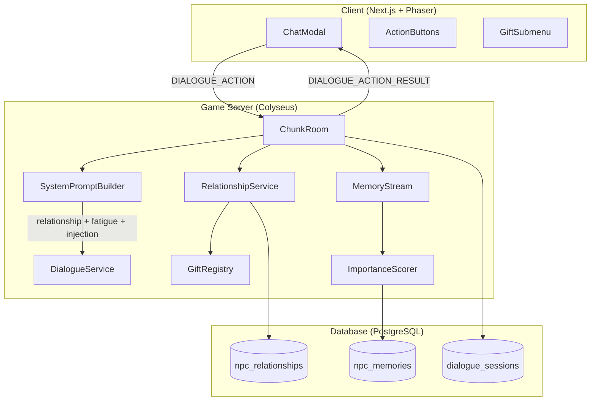
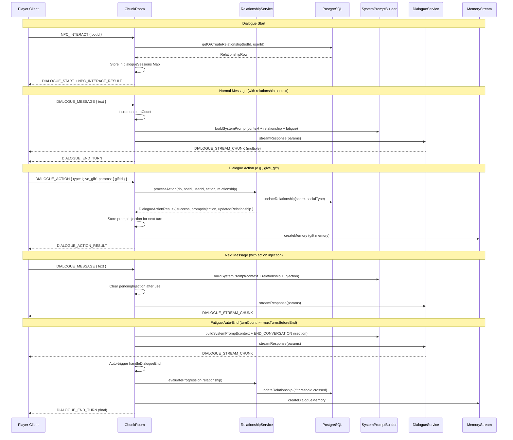
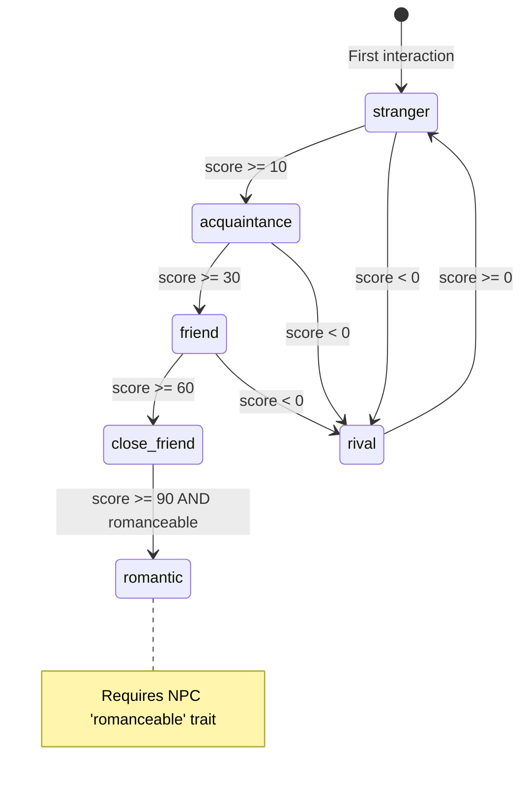

# NPC Relationships & Dialogue Actions Design Document

## Overview

This feature introduces a composable relationship system between players and NPCs, dialogue actions (give_gift, hire, dismiss, ask_about), an NPC busy/tired fatigue system, and diverse symbolic gifts. The relationship model uses a `socialType` enum combined with an `isWorker` boolean, allowing an NPC to be both a friend and a worker. Actions produce both immediate prompt injection (current NPC turn) and persistent memories. Romantic progression is included in Phase 0.

## Design Summary (Meta)

```yaml
design_type: "new_feature"
risk_level: "medium"
complexity_level: "medium"
complexity_rationale: >
  (1) ACs require: 6 social type transitions with threshold logic, 15 gift types with
  variable scoring, 4 dialogue actions with precondition validation, fatigue state machine
  with 3 states and turn-based transitions.
  (2) Constraints: must integrate into existing ChunkRoom dialogue flow without breaking
  streaming; prompt injection must be single-turn and not pollute memory; DB schema must
  support UNIQUE(botId, userId) for upsert patterns.
main_constraints:
  - "Must follow existing Drizzle schema + DB service + Colyseus message patterns exactly"
  - "Prompt injection must not persist beyond one NPC turn"
  - "Gift system must be symbolic (predefined types) with migration path to inventory"
  - "NPC busy/tired prevents infinite dialogues without breaking UX"
biggest_risks:
  - "Prompt injection timing: action result must arrive before next LLM call"
  - "Relationship DB writes during active dialogue add latency to action flow"
  - "Fatigue auto-end must not lose in-flight streaming response"
unknowns:
  - "Optimal fatigue turn thresholds need playtesting"
  - "LLM quality of action-reaction responses with injected context"
```

## Background and Context

### Prerequisite ADRs

- **ADR-0013**: NPC Bot Entity Architecture -- separate `bots` MapSchema, BotManager pattern
- **ADR-0014**: AI Dialogue OpenAI SDK -- DialogueService, streaming, token budget
- **ADR-0015**: NPC Prompt Architecture -- Character-Card / Scene-Contract, SystemPromptBuilder sections

No new common ADRs are required. The relationship system is a domain-specific extension of the existing NPC dialogue pipeline established by these three ADRs.

### Agreement Checklist

#### Scope
- [x] New `npc_relationships` DB table (Drizzle schema + service)
- [x] New shared types: relationship, gift, dialogue action
- [x] RelationshipService: action processing, progression, validation
- [x] SystemPromptBuilder: enhanced relationship section, fatigue section, action injection
- [x] ChunkRoom: load relationship, track turnCount, handle DIALOGUE_ACTION, auto-end on fatigue
- [x] Message protocol: DIALOGUE_ACTION / DIALOGUE_ACTION_RESULT
- [x] Client ChatModal: action buttons, gift submenu, action feedback
- [x] Genmap admin: Relationships tab on NPC edit page
- [x] ImportanceScorer: gift-aware scoring enhancement

#### Non-Scope (Explicitly not changing)
- [x] Inventory system (gifts are symbolic, no inventory integration)
- [x] NPC-to-NPC relationships (only player-NPC)
- [x] Daily planning / reflection system (GDD Phase 2+)
- [x] NPC autonomous movement patterns based on relationship
- [x] Quest system integration

#### Constraints
- [x] Parallel operation: No -- clean addition, no migration of existing data
- [x] Backward compatibility: Required -- existing dialogues work without relationship record (defaults to stranger)
- [x] Performance measurement: Not required for Phase 0 (action latency observable in logs)

### Problem to Solve

Currently, NPCs treat every player interaction identically. There is no concept of relationship progression, no actions beyond text chat, and no mechanism to prevent players from engaging NPCs in endless conversations. The meeting count in the prompt provides minimal relationship context.

### Current Challenges

1. **No relationship state**: NPCs cannot distinguish a first-time visitor from a long-time friend
2. **No player agency**: Players can only send text messages; no gift-giving, hiring, or other actions
3. **No dialogue limits**: Players can keep NPCs talking indefinitely, consuming LLM tokens
4. **Flat prompt context**: The relationship section only shows meeting count, not social depth

### Requirements

#### Functional Requirements

- FR-1: Track player-NPC relationship with social type, score, and worker status
- FR-2: Auto-transition social types at score thresholds after dialogue ends
- FR-3: Support 4 dialogue actions: give_gift, hire, dismiss, ask_about
- FR-4: 15 diverse symbolic gift types across 7 categories
- FR-5: NPC fatigue system: tired after N turns, auto-end after max turns
- FR-6: Actions produce both prompt injection and persistent memory
- FR-7: Available actions depend on current relationship type
- FR-8: Admin panel shows player-NPC relationships

#### Non-Functional Requirements

- **Performance**: Action processing < 50ms (DB read + write + response); no blocking of streaming
- **Scalability**: One relationship row per player-NPC pair (bounded by player count x NPC count)
- **Reliability**: Relationship DB writes must not crash dialogue; use fire-and-forget with error logging where appropriate
- **Maintainability**: Gift definitions in a single const array; thresholds configurable

## Applicable Standards

### Classification Table

| Standard | Type | Source | Impact on Design |
|----------|------|--------|-----------------|
| Prettier: single quotes, 2-space indent | Explicit | `.prettierrc` | All code samples use single quotes |
| ESLint: @nx/enforce-module-boundaries | Explicit | `eslint.config.mjs` | Shared types in `packages/shared`, DB in `packages/db` |
| TypeScript: strict mode, ES2022, bundler resolution | Explicit | `tsconfig.json` files | All types must be strict-safe, no `any` |
| Jest testing framework | Explicit | `jest.config.ts` / `jest.config.cts` | Unit tests use Jest + AAA pattern |
| Nx inferred targets (no project.json) | Explicit | `nx.json` | No new project.json files |
| Drizzle pgTable schema pattern | Implicit | `packages/db/src/schema/*.ts` | uuid PK, timestamps, `$inferSelect`/`$inferInsert` types |
| DB service pattern: `fn(db: DrizzleClient, ...)` | Implicit | `packages/db/src/services/*.ts` | All DB functions take `db` as first param, errors propagate |
| Colyseus message const objects | Implicit | `packages/shared/src/types/messages.ts` | Add to existing `ClientMessage`/`ServerMessage` objects |
| SystemPromptBuilder section functions | Implicit | `apps/server/src/npc-service/ai/SystemPromptBuilder.ts` | New sections as pure functions, composed in `buildSystemPrompt` |
| ChunkRoom dialogueSessions Map pattern | Implicit | `apps/server/src/rooms/ChunkRoom.ts` | Extend session data structure, follow existing handler patterns |

## Acceptance Criteria (AC) - EARS Format

### AC-1: Relationship Persistence

- [ ] **When** a player interacts with an NPC for the first time, the system shall create an `npc_relationships` row with socialType='stranger', score=0, isWorker=false
- [ ] **When** an existing relationship is loaded, the system shall return the current socialType, score, isWorker, and hiredAt values
- [ ] The system shall enforce a UNIQUE constraint on (botId, userId) preventing duplicate relationships

### AC-2: Relationship Progression

- [ ] **When** a dialogue session ends with normalDialogue, the system shall increment the relationship score by +2
- [ ] **When** a give_gift action succeeds, the system shall increment the score by the gift's scoreBonus value
- [ ] **When** a hire action succeeds, the system shall set isWorker=true, hiredAt=now(), and increment score by +3
- [ ] **When** a dismiss action succeeds, the system shall set isWorker=false, hiredAt=null, and decrement score by -5
- [ ] **When** score crosses a threshold boundary at dialogue end, the system shall auto-transition socialType (e.g., score reaches 10 -> acquaintance)
- [ ] **If** score is negative and crosses -1, **then** the system shall set socialType to 'rival'
- [ ] **If** socialType would become 'romantic' but NPC lacks 'romanceable' trait, **then** the system shall cap at 'close_friend'

### AC-3: Dialogue Actions

- [ ] **When** player sends DIALOGUE_ACTION with type='give_gift' and giftId, the system shall validate acquaintance+ relationship, process the gift, update score, inject reaction into next NPC turn, and create a memory
- [ ] **When** player sends DIALOGUE_ACTION with type='hire', the system shall validate friend+ relationship and NPC is not already a worker, then set isWorker=true
- [ ] **When** player sends DIALOGUE_ACTION with type='dismiss', the system shall validate isWorker=true, then set isWorker=false
- [ ] **When** player sends DIALOGUE_ACTION with type='ask_about' and topic, the system shall validate close_friend+ relationship and inject topic context into next NPC turn
- [ ] **If** action preconditions are not met, **then** the system shall return success=false with a descriptive error message
- [ ] **While** NPC is streaming a response, the system shall reject any DIALOGUE_ACTION with error 'NPC is speaking'

### AC-4: NPC Fatigue System

- [ ] **While** dialogue turnCount is below maxTurnsBeforeTired (default 8), the system shall not inject fatigue prompts
- [ ] **When** dialogue turnCount reaches maxTurnsBeforeTired, the system shall inject a fatigue hint into the system prompt
- [ ] **When** dialogue turnCount reaches maxTurnsBeforeEnd (default 12), the system shall inject end-conversation prompt and auto-send DIALOGUE_END after NPC response completes
- [ ] **When** a new dialogue session starts, the system shall reset turnCount to 0
- [ ] **If** NPC availability is 'busy', **then** handleNpcInteract shall return success=false with 'NPC is busy' error

### AC-5: Prompt Integration

- [ ] **When** relationship data is available, the system shall include socialType, score tier description, and isWorker status in the relationship prompt section
- [ ] **When** a dialogue action has a promptInjection result, the system shall include it as a one-turn context section in the next streamResponse call
- [ ] The system shall clear promptInjection after one NPC turn (it must not persist)
- [ ] **When** meetingCount is also available, the system shall include both meetingCount and socialType in the relationship section

### AC-6: Gift System

- [ ] The system shall define 15 gift types across 7 categories with fixed scoreBonus and importance values
- [ ] **When** a romantic gift (love_letter) is given to a non-romanceable NPC, the system shall still process the gift but cap romantic progression
- [ ] **When** a gift is given, the system shall create a memory with the gift's memoryTemplate and importance value

### AC-7: Client UI

- [ ] **When** a dialogue is active, the system shall display available actions based on current relationship type
- [ ] **When** player selects give_gift, the system shall show a gift selection submenu
- [ ] **While** NPC is streaming, the system shall disable all action buttons
- [ ] **When** an action result is received, the system shall display success/failure feedback inline or via toast

### AC-8: Admin Panel

- [ ] **When** admin navigates to the Relationships tab on NPC edit page, the system shall display all player-NPC relationships for that NPC with socialType, score, isWorker, and hiredAt
- [ ] The system shall provide GET /api/npcs/[id]/relationships endpoint returning paginated relationship data

## Existing Codebase Analysis

### Implementation Path Mapping

| Type | Path | Description |
|------|------|-------------|
| Existing | `packages/db/src/schema/npc-bots.ts` | NPC bot schema (FK target for relationships) |
| Existing | `packages/db/src/schema/npc-memories.ts` | Memory schema pattern to follow |
| Existing | `packages/db/src/services/npc-bot.ts` | DB service pattern reference |
| Existing | `packages/db/src/services/npc-memory.ts` | DB service pattern reference |
| Existing | `packages/db/src/services/dialogue.ts` | Session/message services, getSessionCountForPair |
| Existing | `packages/shared/src/types/messages.ts` | ClientMessage/ServerMessage consts |
| Existing | `packages/shared/src/types/dialogue.ts` | Dialogue payload types |
| Existing | `packages/shared/src/types/npc.ts` | NPC interaction types |
| Existing | `packages/shared/src/types/memory.ts` | Memory types pattern |
| Existing | `apps/server/src/npc-service/ai/SystemPromptBuilder.ts` | Prompt section builder functions |
| Existing | `apps/server/src/npc-service/ai/DialogueService.ts` | StreamResponseParams, SeedPersona |
| Existing | `apps/server/src/npc-service/memory/MemoryStream.ts` | Memory creation from dialogue |
| Existing | `apps/server/src/npc-service/memory/ImportanceScorer.ts` | Rule-based importance scoring |
| Existing | `apps/server/src/rooms/ChunkRoom.ts` | Dialogue session management, message handlers |
| Existing | `apps/game/src/components/hud/ChatModal.tsx` | Client chat UI |
| Existing | `apps/genmap/src/app/(app)/npcs/[id]/page.tsx` | Admin NPC edit page with tabs |
| **New** | `packages/db/src/schema/npc-relationships.ts` | Relationship table schema |
| **New** | `packages/db/src/services/npc-relationship.ts` | Relationship DB CRUD services |
| **New** | `packages/shared/src/types/relationship.ts` | Shared relationship/gift/action types |
| **New** | `apps/server/src/npc-service/relationships/RelationshipService.ts` | Action processing, progression logic |
| **New** | `apps/server/src/npc-service/relationships/gift-registry.ts` | Gift definitions constant |
| **New** | `apps/server/src/npc-service/relationships/index.ts` | Barrel export |
| **New** | `apps/genmap/src/app/(app)/npcs/[id]/relationships-tab.tsx` | Admin relationships tab |
| **New** | `apps/genmap/src/app/api/npcs/[id]/relationships/route.ts` | Admin API route |

### Similar Functionality Search Results

**Search keywords**: relationship, gift, socialType, isWorker, hire, score, progression

**Result**: No existing relationship, gift, or action system found in the codebase. The closest related functionality is:
- `getSessionCountForPair()` in dialogue.ts -- counts meetings, conceptually related to relationship but stores no state
- `meetingText()` in SystemPromptBuilder.ts -- uses meetingCount for prompt text, will be extended
- `ImportanceScorer` -- has `giftReceived` importance config but no gift processing logic yet

**Decision**: Create new implementation. No existing code to reuse for relationship/gift/action domain. Follow established patterns from memory system (schema, service, shared types).

### Code Inspection Evidence

| File Inspected | Key Finding | Design Impact |
|---------------|-------------|---------------|
| `packages/db/src/schema/npc-memories.ts` | Uses index builder callback syntax `(table) => [index(...)]` | npc_relationships schema must use same index syntax |
| `packages/db/src/schema/npc-bots.ts` | FK pattern: `.references(() => npcBots.id, { onDelete: 'cascade' })` | Relationship FK to npc_bots and users uses same cascade pattern |
| `packages/db/src/services/npc-memory.ts` | All functions: `async function fn(db: DrizzleClient, ...)` | RelationshipService DB functions follow same signature |
| `packages/db/src/services/dialogue.ts:299-315` | `getSessionCountForPair` pattern for bot-user queries | Relationship queries use same `and(eq(...botId), eq(...userId))` pattern |
| `apps/server/src/rooms/ChunkRoom.ts:106-115` | `dialogueSessions` Map stores session data per client | Extend with `turnCount`, `relationship`, `pendingInjection` fields |
| `apps/server/src/rooms/ChunkRoom.ts:752-876` | `handleDialogueMessage` flow: validate -> history -> stream -> save | DIALOGUE_ACTION handler follows parallel pattern but with action processing |
| `apps/server/src/rooms/ChunkRoom.ts:878-941` | `handleDialogueEnd` captures locals before cleanup (I003 pattern) | Relationship progression evaluation must happen before session cleanup |
| `apps/server/src/npc-service/ai/SystemPromptBuilder.ts:111-119` | `buildRelationshipSection` takes playerName + meetingCount | Extend signature to accept RelationshipData; keep meetingCount |
| `apps/server/src/npc-service/ai/SystemPromptBuilder.ts:157-173` | `buildSystemPrompt` composes sections into array | Add fatigue and action injection sections to this array |
| `apps/server/src/npc-service/ai/DialogueService.ts:26-35` | `StreamResponseParams` interface | No changes needed -- prompt is built before streamResponse call |
| `apps/server/src/npc-service/memory/ImportanceScorer.ts:18-23` | Only checks `isFirstMeeting` flag currently | Extend ImportanceContext with `hasGift`, `giftImportance` fields |
| `packages/shared/src/types/messages.ts:1-22` | ClientMessage/ServerMessage as const objects | Add DIALOGUE_ACTION and DIALOGUE_ACTION_RESULT entries |
| `apps/game/src/components/hud/ChatModal.tsx:41-45` | Uses `useChat` from `@ai-sdk/react` with Colyseus transport | Action messages sent via transport.room.send(), not useChat |
| `apps/genmap/src/app/(app)/npcs/[id]/page.tsx:313-318` | Tabs: Details, Dialogues, Memories | Add fourth tab: Relationships |
| `packages/db/src/index.ts` | Barrel exports all schema and services | Must add relationship exports |
| `packages/shared/src/index.ts` | Barrel exports all shared types | Must add relationship type exports |

## Design

### Change Impact Map

```yaml
Change Target: NPC Relationship + Dialogue Action System
Direct Impact:
  - packages/db/src/schema/npc-relationships.ts (NEW - relationship table)
  - packages/db/src/services/npc-relationship.ts (NEW - CRUD services)
  - packages/db/src/schema/index.ts (add relationship export)
  - packages/db/src/index.ts (add relationship service exports)
  - packages/shared/src/types/relationship.ts (NEW - shared types)
  - packages/shared/src/types/messages.ts (add DIALOGUE_ACTION messages)
  - packages/shared/src/types/dialogue.ts (add action payload types)
  - packages/shared/src/index.ts (add relationship type exports)
  - apps/server/src/npc-service/relationships/ (NEW - RelationshipService, gift-registry)
  - apps/server/src/npc-service/ai/SystemPromptBuilder.ts (extend relationship + add fatigue + action injection sections)
  - apps/server/src/npc-service/memory/ImportanceScorer.ts (add gift-aware scoring)
  - apps/server/src/rooms/ChunkRoom.ts (load relationship, track turns, handle actions, auto-end)
  - apps/game/src/components/hud/ChatModal.tsx (action buttons, gift submenu)
  - apps/genmap/src/app/(app)/npcs/[id]/page.tsx (add Relationships tab)
  - apps/genmap/src/app/(app)/npcs/[id]/relationships-tab.tsx (NEW - admin tab)
  - apps/genmap/src/app/api/npcs/[id]/relationships/route.ts (NEW - admin API)
Indirect Impact:
  - apps/server/src/npc-service/memory/MemoryStream.ts (receives gift-related importance context)
  - packages/shared/src/types/npc.ts (NpcInteractResult may include relationship data)
No Ripple Effect:
  - Map system (editor, templates, zones)
  - Sprite/atlas system
  - Player movement / position system
  - Colyseus room creation / auth
  - BotManager movement AI
  - Game object system
```

### Architecture Overview



### Data Flow



### Integration Points List

| Integration Point | Location | Old Implementation | New Implementation | Switching Method |
|-------------------|----------|-------------------|-------------------|------------------|
| Relationship load on interact | ChunkRoom.handleNpcInteract | No relationship loaded | Load/create relationship from DB, store in session | Direct extension |
| Relationship in prompt | SystemPromptBuilder.buildRelationshipSection | meetingCount only | socialType + score tier + isWorker + meetingCount | Extended function signature |
| Action message handler | ChunkRoom.onCreate | No DIALOGUE_ACTION handler | New onMessage handler for DIALOGUE_ACTION | New handler registration |
| Turn counting | ChunkRoom.handleDialogueMessage | No turn tracking | Increment turnCount, inject fatigue if threshold | Extended session data |
| Auto-end on fatigue | ChunkRoom.handleDialogueMessage | No auto-end | Auto-trigger handleDialogueEnd when maxTurnsBeforeEnd reached | Conditional after stream |
| Progression at end | ChunkRoom.handleDialogueEnd | Only creates memory | Evaluate progression + update relationship + create memory | Extended function body |
| Gift importance | ImportanceScorer.scoreImportance | Only isFirstMeeting check | Add hasGift + giftImportance to context | Extended ImportanceContext |
| Action buttons in UI | ChatModal | Text input only | Action panel below input, gift submenu | New React components |
| Admin relationships | NPC edit page | 3 tabs | 4 tabs with Relationships tab | New TabsTrigger + TabsContent |

### Integration Point Map

```yaml
Integration Point 1:
  Existing Component: ChunkRoom.handleNpcInteract
  Integration Method: Extend to load relationship from DB after dialogue session creation
  Impact Level: Medium (Data Usage)
  Required Test Coverage: Verify relationship loads for new and returning players

Integration Point 2:
  Existing Component: SystemPromptBuilder.buildRelationshipSection
  Integration Method: Extend function signature to accept optional RelationshipData
  Impact Level: Medium (Data Usage -- prompt content changes)
  Required Test Coverage: Unit test prompt output with/without relationship data

Integration Point 3:
  Existing Component: ChunkRoom.handleDialogueMessage
  Integration Method: Add turnCount increment + fatigue injection + auto-end logic
  Impact Level: High (Process Flow Change)
  Required Test Coverage: Verify fatigue thresholds trigger correct behavior

Integration Point 4:
  Existing Component: ChunkRoom.handleDialogueEnd
  Integration Method: Add relationship progression evaluation before memory creation
  Impact Level: High (Process Flow Change)
  Required Test Coverage: Verify score updates and type transitions at dialogue end

Integration Point 5:
  Existing Component: ImportanceScorer.scoreImportance
  Integration Method: Extend ImportanceContext with gift fields
  Impact Level: Low (Read-Only extension)
  Required Test Coverage: Unit test importance scoring with gift context
```

### Main Components

#### Component 1: npc_relationships Schema + Service

- **Responsibility**: Persist player-NPC relationship state; CRUD operations
- **Interface**: `getOrCreateRelationship(db, botId, userId)`, `updateRelationship(db, id, data)`, `listRelationshipsForBot(db, botId, params)`
- **Dependencies**: DrizzleClient, npcBots schema, users schema

#### Component 2: Shared Types (relationship.ts)

- **Responsibility**: Define type contracts shared between server and client
- **Interface**: RelationshipSocialType, RelationshipData, GiftId, GiftDefinition, DialogueActionType, DialogueAction, DialogueActionResult
- **Dependencies**: None (pure types)

#### Component 3: RelationshipService

- **Responsibility**: Business logic for action processing, validation, progression
- **Interface**: `processAction(db, botId, userId, action, relationship)`, `evaluateProgression(relationship)`, `getAvailableActions(relationship)`, `validateAction(action, relationship)`
- **Dependencies**: DrizzleClient, npc-relationship service, gift-registry, shared types

#### Component 4: GiftRegistry

- **Responsibility**: Centralized gift definitions and lookup
- **Interface**: `GIFT_DEFINITIONS: readonly GiftDefinition[]`, `getGift(id: GiftId): GiftDefinition`, `getGiftsByCategory(category): GiftDefinition[]`
- **Dependencies**: Shared types (GiftId, GiftDefinition)

#### Component 5: Enhanced SystemPromptBuilder

- **Responsibility**: Build relationship-aware, fatigue-aware prompt sections
- **Interface**: Extended `buildRelationshipSection(playerName, meetingCount, relationship?)`, new `buildFatigueSection(turnCount, config)`, new `buildActionInjectionSection(injection)`
- **Dependencies**: Shared types (RelationshipData)

#### Component 6: Extended ChunkRoom Dialogue Flow

- **Responsibility**: Orchestrate relationship loading, action handling, fatigue enforcement
- **Interface**: Extended dialogueSessions Map, new handleDialogueAction handler
- **Dependencies**: RelationshipService, all existing ChunkRoom dependencies

### Contract Definitions

```typescript
// packages/shared/src/types/relationship.ts

export type RelationshipSocialType =
  | 'stranger'
  | 'acquaintance'
  | 'friend'
  | 'close_friend'
  | 'romantic'
  | 'rival';

export interface RelationshipData {
  socialType: RelationshipSocialType;
  isWorker: boolean;
  score: number;
  hiredAt: string | null;
}

export type GiftId =
  | 'flowers'
  | 'herbs'
  | 'homemade_pie'
  | 'fresh_vegetables'
  | 'jam'
  | 'honey'
  | 'handmade_scarf'
  | 'wooden_carving'
  | 'fishing_rod'
  | 'garden_tools'
  | 'seashell'
  | 'music_box'
  | 'ancient_coin'
  | 'crystal'
  | 'love_letter';

export type GiftCategory =
  | 'flora'
  | 'food'
  | 'crafts'
  | 'tools'
  | 'trinkets'
  | 'rare'
  | 'romantic';

export interface GiftDefinition {
  id: GiftId;
  label: string;
  category: GiftCategory;
  scoreBonus: number;
  importance: number;
  memoryTemplate: string;
}

export type DialogueActionType =
  | 'give_gift'
  | 'hire'
  | 'dismiss'
  | 'ask_about';

export interface DialogueAction {
  type: DialogueActionType;
  params?: {
    giftId?: GiftId;
    topic?: string;
  };
}

export interface DialogueActionResult {
  success: boolean;
  actionType: DialogueActionType;
  message?: string;
  updatedRelationship?: RelationshipData;
  availableActions?: DialogueActionType[];
  promptInjection?: string;
}

/** Payload for DIALOGUE_ACTION client message */
export interface DialogueActionPayload {
  action: DialogueAction;
}

/** Payload for DIALOGUE_ACTION_RESULT server message */
export type DialogueActionResultPayload = DialogueActionResult;

/** Extended dialogue start payload with relationship info */
export interface DialogueStartWithRelationshipPayload {
  botId: string;
  botName: string;
  relationship: RelationshipData;
  availableActions: DialogueActionType[];
}
```

```typescript
// packages/db/src/schema/npc-relationships.ts

import {
  boolean,
  index,
  integer,
  pgTable,
  timestamp,
  unique,
  uuid,
  varchar,
} from 'drizzle-orm/pg-core';
import { npcBots } from './npc-bots';
import { users } from './users';

export const npcRelationships = pgTable(
  'npc_relationships',
  {
    id: uuid('id').defaultRandom().primaryKey(),
    botId: uuid('bot_id')
      .notNull()
      .references(() => npcBots.id, { onDelete: 'cascade' }),
    userId: uuid('user_id')
      .notNull()
      .references(() => users.id, { onDelete: 'cascade' }),
    socialType: varchar('social_type', { length: 32 })
      .notNull()
      .default('stranger'),
    isWorker: boolean('is_worker').notNull().default(false),
    score: integer('score').notNull().default(0),
    hiredAt: timestamp('hired_at', { withTimezone: true }),
    createdAt: timestamp('created_at', { withTimezone: true })
      .defaultNow()
      .notNull(),
    updatedAt: timestamp('updated_at', { withTimezone: true })
      .defaultNow()
      .notNull(),
  },
  (table) => [
    unique('uq_nr_bot_user').on(table.botId, table.userId),
    index('idx_nr_bot_user').on(table.botId, table.userId),
    index('idx_nr_bot_social').on(table.botId, table.socialType),
  ]
);

export type NpcRelationshipRow = typeof npcRelationships.$inferSelect;
export type NewNpcRelationship = typeof npcRelationships.$inferInsert;
```

### Data Contract

#### RelationshipService.processAction

```yaml
Input:
  Type: "{ db: DrizzleClient, botId: string, userId: string, action: DialogueAction, relationship: NpcRelationshipRow }"
  Preconditions:
    - botId and userId must reference existing records
    - relationship must be the current DB state for this pair
    - action.type must be a valid DialogueActionType
  Validation: validateAction checks relationship preconditions per action type

Output:
  Type: "DialogueActionResult"
  Guarantees:
    - success: boolean is always present
    - On success: updatedRelationship reflects new DB state
    - On success: promptInjection contains Russian-language NPC reaction context
    - On failure: message describes the validation failure reason
  On Error: Returns { success: false, message: '...' } -- does NOT throw

Invariants:
  - Relationship score is always updated atomically (single DB write)
  - Gift memory is created only on successful gift action
  - promptInjection is always in Russian language matching the NPC's persona
```

#### SystemPromptBuilder Enhanced Context

```yaml
Input:
  Type: "PromptContext (extended with optional relationship and fatigue fields)"
  Preconditions:
    - persona is a valid SeedPersona
    - If relationship is provided, it must be a valid RelationshipData
    - If turnCount is provided, it must be >= 0
  Validation: Missing fields result in section omission (graceful degradation)

Output:
  Type: "string (system prompt text)"
  Guarantees:
    - Always valid Russian-language prompt
    - Relationship section included only when relationship data present
    - Fatigue section included only when turnCount exceeds threshold
    - Action injection included only when pendingInjection is non-empty
    - All sections follow existing format conventions
  On Error: Falls back to legacy prompt (existing behavior)

Invariants:
  - Prompt structure order is preserved: Identity -> World -> Relationship -> Memory -> [ActionInjection] -> [Fatigue] -> Guardrails -> Format
```

### Data Representation Decisions

| Data Structure | Decision | Rationale |
|---|---|---|
| NpcRelationshipRow | **New** dedicated table + type | No existing type represents player-NPC social state. The `dialogue_sessions` table counts meetings but stores no relationship quality. A new table is justified. |
| RelationshipData (shared) | **New** shared interface | Client needs socialType, score, isWorker, hiredAt for UI rendering. No existing shared type covers this. Lightweight (4 fields). |
| GiftDefinition | **New** const array (not DB table) | Gifts are predefined symbolic types. A DB table would add unnecessary complexity. The const array in `gift-registry.ts` is sufficient. Migration path: when inventory system arrives, GiftId becomes a lookup key into inventory items. |
| DialogueAction / DialogueActionResult | **New** shared interfaces | No existing action/result types. These define the action protocol contract between client and server. |
| Extended PromptContext | **Extend** existing PromptContext | Adding optional `relationship`, `turnCount`, `pendingInjection` fields to existing interface. 80%+ of fields remain unchanged. Extension via optional fields is clean. |
| Extended ImportanceContext | **Extend** existing ImportanceContext | Adding optional `hasGift` and `giftImportance` fields. Backward-compatible extension. |

### State Transitions and Invariants

```yaml
State Definition:
  - Relationship Social Types: stranger -> acquaintance -> friend -> close_friend -> romantic
  - Negative path: any -> rival (when score < 0)
  - Worker flag: orthogonal boolean, toggled by hire/dismiss

State Transitions:
  stranger (score 0-9) -> acquaintance (score reaches 10)
  acquaintance (score 10-29) -> friend (score reaches 30)
  friend (score 30-59) -> close_friend (score reaches 60)
  close_friend (score 60-89) -> romantic (score reaches 90, requires 'romanceable' trait)
  any (score < 0) -> rival
  rival (score >= 0) -> stranger (recovery path)

Fatigue State Machine:
  available (turnCount < maxTurnsBeforeTired) -> tired (turnCount >= maxTurnsBeforeTired)
  tired (turnCount < maxTurnsBeforeEnd) -> end (turnCount >= maxTurnsBeforeEnd)
  end -> dialogue auto-closes

System Invariants:
  - Exactly one relationship row per (botId, userId) pair (UNIQUE constraint)
  - socialType always matches score range (enforced at dialogue end)
  - isWorker can only be true when socialType is 'friend', 'close_friend', or 'romantic'
  - When socialType transitions to 'rival' or below 'friend', isWorker is auto-set to false (auto-dismiss with memory)
  - Score is clamped to [-50, 100] — enforced in updateRelationshipScore
  - When score drops below current socialType min threshold, socialType demotes to matching range
  - Rival range: score < 0 (floor: -50). Rival→acquaintance recovery: score >= 10
  - 'romanceable' trait: checked via NPC traits[] JSONB array (admin adds 'romanceable' string in genmap editor)
  - turnCount is per-session, resets on new dialogue start
  - pendingInjection is consumed after one NPC turn
```



### Field Propagation Map

```yaml
fields:
  - name: "socialType"
    origin: "Database npc_relationships.social_type"
    transformations:
      - layer: "DB Service"
        type: "NpcRelationshipRow"
        validation: "varchar(32), default 'stranger'"
      - layer: "RelationshipService"
        type: "RelationshipSocialType"
        transformation: "type-narrowed from string"
      - layer: "SystemPromptBuilder"
        type: "string"
        transformation: "mapped to Russian description via socialTypePromptMap"
      - layer: "Shared Types"
        type: "RelationshipData.socialType"
        transformation: "passed to client as-is"
      - layer: "Client ChatModal"
        type: "RelationshipData.socialType"
        transformation: "used to filter availableActions"
    destination: "System prompt + Client UI"
    loss_risk: "none"

  - name: "score"
    origin: "Database npc_relationships.score"
    transformations:
      - layer: "DB Service"
        type: "NpcRelationshipRow"
        validation: "integer, default 0"
      - layer: "RelationshipService"
        type: "number"
        transformation: "incremented/decremented by action scoreBonus"
      - layer: "SystemPromptBuilder"
        type: "number"
        transformation: "mapped to tier description (low/medium/high/very high)"
    destination: "System prompt (tier only, not raw number) + Client UI (raw number)"
    loss_risk: "none"

  - name: "giftId"
    origin: "Client DIALOGUE_ACTION payload"
    transformations:
      - layer: "Colyseus Message"
        type: "DialogueActionPayload"
        validation: "action.params.giftId must be valid GiftId"
      - layer: "ChunkRoom"
        type: "DialogueAction"
        transformation: "extracted from payload, validated"
      - layer: "RelationshipService"
        type: "GiftId"
        transformation: "looked up in GiftRegistry for scoreBonus + importance"
      - layer: "MemoryStream"
        type: "string"
        transformation: "gift.memoryTemplate used as memory content prefix"
    destination: "Database npc_memories.content + npc_relationships.score"
    loss_risk: "low"
    loss_risk_reason: "giftId validated against GiftRegistry; unknown giftId rejected before processing"

  - name: "turnCount"
    origin: "ChunkRoom session state (in-memory)"
    transformations:
      - layer: "ChunkRoom"
        type: "number"
        transformation: "incremented on each handleDialogueMessage call"
      - layer: "SystemPromptBuilder"
        type: "number"
        transformation: "compared against thresholds; generates fatigue prompt text"
    destination: "System prompt fatigue section (transient, not persisted)"
    loss_risk: "none"

  - name: "promptInjection"
    origin: "RelationshipService.processAction result"
    transformations:
      - layer: "RelationshipService"
        type: "string"
        transformation: "generated from gift/action template in Russian"
      - layer: "ChunkRoom session"
        type: "string | null"
        transformation: "stored as pendingInjection, cleared after one use"
      - layer: "SystemPromptBuilder"
        type: "string"
        transformation: "included as one-turn context section"
    destination: "System prompt (consumed once, then null)"
    loss_risk: "low"
    loss_risk_reason: "injection cleared after use; if message not sent before clear, injection is lost -- acceptable behavior"
```

### Integration Boundary Contracts

```yaml
Boundary Name: Client -> ChunkRoom (DIALOGUE_ACTION)
  Input: "DialogueActionPayload { action: { type, params? } }"
  Output: "DialogueActionResultPayload (sync, sent via ServerMessage)"
  On Error: "Return { success: false, message: 'validation error description' }"

Boundary Name: ChunkRoom -> RelationshipService
  Input: "{ db, botId, userId, action, relationship }"
  Output: "DialogueActionResult (sync Promise)"
  On Error: "Returns { success: false } -- never throws; ChunkRoom logs and sends error to client"

Boundary Name: ChunkRoom -> SystemPromptBuilder
  Input: "Extended PromptContext with relationship, turnCount, pendingInjection"
  Output: "string (system prompt, sync)"
  On Error: "Falls back to legacy prompt if persona is null"

Boundary Name: RelationshipService -> DB Service
  Input: "{ db, botId, userId } or { db, id, updateData }"
  Output: "NpcRelationshipRow (sync Promise)"
  On Error: "DB errors propagate (fail-fast); caller decides handling"

Boundary Name: ChunkRoom -> MemoryStream (gift memory)
  Input: "CreateDialogueMemoryParams extended with gift context"
  Output: "void (async, fire-and-forget)"
  On Error: "Logged but not propagated -- gift memory loss is acceptable"
```

### Interface Change Impact Analysis

| Existing Operation | New Operation | Conversion Required | Adapter Required | Compatibility Method |
|-------------------|---------------|-------------------|------------------|---------------------|
| `buildRelationshipSection(playerName, meetingCount)` | `buildRelationshipSection(playerName, meetingCount, relationship?)` | No -- optional param | Not Required | Optional parameter, backward compatible |
| `PromptContext` interface | `PromptContext` with optional relationship/turnCount/pendingInjection | No -- optional fields | Not Required | Optional fields, backward compatible |
| `ImportanceContext { isFirstMeeting }` | `ImportanceContext { isFirstMeeting, hasGift?, giftImportance? }` | No -- optional fields | Not Required | Optional fields, backward compatible |
| `scoreImportance(config, context)` | Same signature, enhanced logic | No | Not Required | Checks new fields only when present |
| `dialogueSessions Map` value type | Extended with turnCount, relationship, pendingInjection | No | Not Required | New fields initialized at session creation |
| `ClientMessage` const | Add DIALOGUE_ACTION entry | No | Not Required | Additive -- existing messages unchanged |
| `ServerMessage` const | Add DIALOGUE_ACTION_RESULT entry | No | Not Required | Additive -- existing messages unchanged |
| `DialogueStartPayload` | Extended with relationship + availableActions | Yes -- client must handle new fields | Not Required | Client checks for field presence |

### Error Handling

| Error Scenario | Handling Strategy | User Impact |
|---|---|---|
| Relationship DB load fails on interact | Log error, default to stranger relationship | Dialogue works but without relationship context |
| DIALOGUE_ACTION with invalid giftId | Return `{ success: false, message: 'Unknown gift type' }` | Client shows error toast |
| DIALOGUE_ACTION during streaming | Return `{ success: false, message: 'NPC is speaking' }` | Client disables buttons during stream |
| Action precondition not met | Return `{ success: false, message: 'Requires friend+ relationship' }` | Client shows error toast |
| Relationship update fails at dialogue end | Log error, do not crash dialogue end flow | Score change lost for this session |
| Gift memory creation fails | Fire-and-forget with error log | No user impact (memory is supplementary) |
| Fatigue auto-end during stream | Wait for current stream to complete, then auto-end | Clean dialogue termination |

### Logging and Monitoring

```
[RelationshipService] Action processed: botId={}, userId={}, action={}, success={}, newScore={}
[RelationshipService] Progression: botId={}, userId={}, oldType={}, newType={}, score={}
[ChunkRoom] Dialogue action: sessionId={}, action={}, success={}
[ChunkRoom] Fatigue warning: sessionId={}, turnCount={}, threshold={}
[ChunkRoom] Fatigue auto-end: sessionId={}, turnCount={}
[ChunkRoom] Relationship loaded: sessionId={}, botId={}, socialType={}, score={}
```

## Implementation Plan

### Implementation Approach

**Selected Approach**: Vertical Slice (Feature-driven)

**Selection Reason**: The relationship system is a self-contained feature with clear boundaries. Each vertical slice delivers testable value: (1) DB schema enables relationship persistence, (2) shared types + service enable action processing, (3) ChunkRoom integration makes it live, (4) client UI exposes it to players. Low inter-feature dependencies. The foundation (DB schema) is small and quick, so vertical slice overhead is minimal.

### Technical Dependencies and Implementation Order

#### Required Implementation Order

1. **DB Schema + Migration** (`npc-relationships.ts`)
   - Technical Reason: All other components depend on the relationship table existing
   - Dependent Elements: DB service, RelationshipService, ChunkRoom

2. **Shared Types** (`relationship.ts` + message extensions)
   - Technical Reason: Type contracts must exist before service or client code
   - Dependent Elements: RelationshipService, ChunkRoom, ChatModal

3. **DB Service** (`npc-relationship.ts`)
   - Technical Reason: CRUD operations needed by RelationshipService
   - Prerequisites: DB schema

4. **GiftRegistry + RelationshipService**
   - Technical Reason: Business logic needed by ChunkRoom action handler
   - Prerequisites: Shared types, DB service

5. **SystemPromptBuilder Extensions**
   - Technical Reason: Prompt changes needed before ChunkRoom integration
   - Prerequisites: Shared types (RelationshipData)

6. **ImportanceScorer Extension**
   - Technical Reason: Gift-aware scoring needed for memory creation
   - Prerequisites: Shared types

7. **ChunkRoom Integration**
   - Technical Reason: Orchestrates all components; final server-side integration
   - Prerequisites: All server components (1-6)

8. **Client ChatModal + Action UI**
   - Technical Reason: User-facing; depends on server protocol being complete
   - Prerequisites: Shared types, ChunkRoom handlers

9. **Genmap Admin (Relationships tab + API)**
   - Technical Reason: Admin tooling; independent of game client
   - Prerequisites: DB service

### Integration Points

**Integration Point 1: Relationship Load at Dialogue Start**
- Components: ChunkRoom.handleNpcInteract -> npc-relationship service -> DB
- Verification: Start dialogue, verify relationship row created/loaded, visible in session data

**Integration Point 2: Action Processing in Dialogue**
- Components: ChunkRoom.handleDialogueAction -> RelationshipService -> DB + MemoryStream
- Verification: Send give_gift action, verify score update in DB, memory created, result sent to client

**Integration Point 3: Prompt Enhancement**
- Components: ChunkRoom.handleDialogueMessage -> SystemPromptBuilder (enhanced) -> DialogueService
- Verification: Verify NPC response reflects relationship context (e.g., uses player name familiarly for friends)

**Integration Point 4: Fatigue Auto-End**
- Components: ChunkRoom.handleDialogueMessage -> turnCount check -> auto handleDialogueEnd
- Verification: Send 12+ messages, verify dialogue auto-closes with NPC farewell

**Integration Point 5: Client Action Flow**
- Components: ChatModal -> DIALOGUE_ACTION message -> ChunkRoom -> DIALOGUE_ACTION_RESULT -> ChatModal
- Verification: Click gift button, select gift, verify action result displayed, score visible

### Migration Strategy

No data migration required. The `npc_relationships` table is entirely new. Existing dialogues will work without relationship records -- the system defaults to stranger when no row exists. The `getOrCreateRelationship` function handles this transparently.

**Drizzle migration**: Generate via `pnpm drizzle-kit generate` after adding the schema file. The migration creates the `npc_relationships` table with indexes and unique constraint.

## Test Strategy

### Basic Test Design Policy

Each acceptance criterion maps to at least one test case. Tests follow AAA pattern (Arrange-Act-Assert).

### Unit Tests

**RelationshipService** (`RelationshipService.spec.ts`):
- AC-2: Test score increment for each action type
- AC-2: Test threshold transitions (stranger->acquaintance at 10, etc.)
- AC-2: Test rival transition at negative score
- AC-2: Test romantic cap when NPC lacks romanceable trait
- AC-3: Test validateAction rejects actions with insufficient relationship
- AC-3: Test processAction returns correct promptInjection per action type
- AC-6: Test all 15 gift types produce correct scoreBonus

**GiftRegistry** (`gift-registry.spec.ts`):
- AC-6: Test getGift returns correct definition for each GiftId
- AC-6: Test getGift throws for invalid id

**SystemPromptBuilder** (`SystemPromptBuilder.spec.ts` -- extend existing):
- AC-5: Test buildRelationshipSection with relationship data produces socialType-specific text
- AC-5: Test buildRelationshipSection without relationship data falls back to meetingCount only
- AC-4: Test buildFatigueSection at each threshold
- AC-5: Test buildActionInjectionSection includes injection text exactly once

**ImportanceScorer** (`ImportanceScorer.spec.ts` -- extend existing):
- AC-6: Test scoring with hasGift=true returns giftImportance value
- AC-6: Test scoring without hasGift falls back to existing behavior

**npc-relationship DB service** (`npc-relationship.spec.ts`):
- AC-1: Test getOrCreateRelationship creates row on first call
- AC-1: Test getOrCreateRelationship returns existing row on subsequent calls
- AC-1: Test UNIQUE constraint prevents duplicates

### Integration Tests

**ChunkRoom dialogue flow** (extend `ChunkRoom.spec.ts`):
- AC-3: Test DIALOGUE_ACTION message triggers correct response
- AC-4: Test fatigue auto-end after maxTurnsBeforeEnd messages
- AC-3: Test action rejected while streaming (success=false)
- AC-2: Test relationship progression at dialogue end

### E2E Tests

- AC-7: Full flow: interact with NPC -> send messages -> give gift -> verify score changes in admin panel
- AC-4: Full flow: interact with NPC -> send 12+ messages -> verify auto-end

### Performance Tests

Not required for Phase 0. Action processing latency will be monitored via console.log timestamps in production.

## Security Considerations

- **Input validation**: All DIALOGUE_ACTION payloads validated for type and params structure before processing
- **GiftId validation**: Only predefined GiftId values accepted; unknown values rejected
- **Rate limiting**: Actions are blocked during NPC streaming; fatigue system prevents excessive dialogue
- **Score manipulation**: Score changes are server-authoritative; client cannot set score directly
- **Prompt injection via topic**: ask_about topic is sanitized (length-limited, no special characters) before injection into prompt

## Future Extensibility

1. **Inventory integration**: When inventory system is added, `GiftId` becomes a key to look up actual inventory items. The `gift-registry.ts` const array can be replaced with DB-backed item definitions while keeping the same `GiftId` type.
2. **NPC gifting preferences**: Each NPC could have preferred/disliked gift categories, multiplying scoreBonus.
3. **Relationship decay**: Score could decay over time if player does not interact, with configurable half-life.
4. **NPC-to-NPC relationships**: The same schema pattern (socialType + score) can model NPC-NPC bonds.
5. **Quest unlock**: Relationship thresholds can gate quest availability (close_friend unlocks personal quests).
6. **Seasonal events**: Gift scoring could have seasonal multipliers (flowers worth more in spring).

## Alternative Solutions

### Alternative 1: Score-only model (no socialType enum)

- **Overview**: Track only a numeric score; derive relationship label dynamically from score ranges
- **Advantages**: Simpler schema (no socialType column), no enum maintenance
- **Disadvantages**: Cannot customize behavior per type (e.g., rival has different action availability than stranger at same absolute score); harder to query "all friends" efficiently
- **Reason for Rejection**: The composable model (enum + score) provides better query ergonomics and explicit state for prompt generation

### Alternative 2: Separate worker table instead of isWorker flag

- **Overview**: Create a `npc_workers` table with separate lifecycle tracking
- **Advantages**: Cleaner separation of concerns; worker data (assigned tasks, productivity) could have its own schema
- **Disadvantages**: Requires JOIN for every relationship check; over-engineering for Phase 0 where worker status is a simple boolean
- **Reason for Rejection**: YAGNI -- isWorker boolean is sufficient for MVP. If worker system grows complex, a separate table can be introduced later with migration

### Alternative 3: Action processing via separate REST API instead of Colyseus messages

- **Overview**: Actions sent via HTTP POST to game server instead of Colyseus message
- **Advantages**: Easier to test independently; could support actions outside dialogue context
- **Disadvantages**: Breaks the Colyseus message pattern established for all dialogue communication; adds HTTP latency; requires separate auth flow
- **Reason for Rejection**: Consistency with existing dialogue protocol (all dialogue communication via Colyseus messages)

## Risks and Mitigation

| Risk | Impact | Probability | Mitigation |
|------|--------|-------------|------------|
| Action prompt injection degrades LLM response quality | Medium | Medium | Keep injection to 1-2 sentences; test with various persona types; remove injection if quality drops |
| Fatigue auto-end loses in-flight streaming data | High | Low | Wait for stream completion before triggering auto-end; use AbortController only on explicit close |
| Relationship DB writes add noticeable latency to actions | Medium | Low | Use single UPDATE query; index on (botId, userId); benchmark in dev |
| Score manipulation via rapid gift-giving | Low | Medium | Client-side cooldown on gift actions; server tracks last gift timestamp per session |
| Romantic progression causes inappropriate NPC behavior | Medium | Low | romanceable trait gating; guardrails in prompt explicitly limit romantic expression to G-rated |

## References

- ADR-0013: NPC Bot Entity Architecture (`docs/adr/ADR-0013-npc-bot-entity-architecture.md`)
- ADR-0014: AI Dialogue OpenAI SDK (`docs/adr/ADR-0014-ai-dialogue-openai-sdk.md`)
- ADR-0015: NPC Prompt Architecture (`docs/adr/ADR-0015-npc-prompt-architecture.md`)
- Design-020: NPC Dialogue System (`docs/design/design-020-npc-dialogue-system.md`)
- Design-023: Memory Stream (`docs/design/design-023-memory-stream.md`)
- Nookstead GDD: Section 3.2 "NPC Agent Components" -- Seed Persona, Memory Stream, Reflection

## Appendix A: Gift Registry Constant

```typescript
// apps/server/src/npc-service/relationships/gift-registry.ts
import type { GiftDefinition, GiftId } from '@nookstead/shared';

export const GIFT_DEFINITIONS: readonly GiftDefinition[] = [
  { id: 'flowers', label: 'Цветы', category: 'flora', scoreBonus: 5, importance: 7, memoryTemplate: '{player} подарил(а) мне букет цветов.' },
  { id: 'herbs', label: 'Травы', category: 'flora', scoreBonus: 3, importance: 5, memoryTemplate: '{player} принёс(ла) мне свежие травы.' },
  { id: 'homemade_pie', label: 'Домашний пирог', category: 'food', scoreBonus: 7, importance: 7, memoryTemplate: '{player} испёк(ла) для меня домашний пирог.' },
  { id: 'fresh_vegetables', label: 'Свежие овощи', category: 'food', scoreBonus: 4, importance: 5, memoryTemplate: '{player} принёс(ла) мне свежие овощи с огорода.' },
  { id: 'jam', label: 'Варенье', category: 'food', scoreBonus: 6, importance: 6, memoryTemplate: '{player} подарил(а) мне банку домашнего варенья.' },
  { id: 'honey', label: 'Мёд', category: 'food', scoreBonus: 5, importance: 6, memoryTemplate: '{player} принёс(ла) мне свежий мёд.' },
  { id: 'handmade_scarf', label: 'Вязаный шарф', category: 'crafts', scoreBonus: 8, importance: 8, memoryTemplate: '{player} подарил(а) мне вязаный шарф ручной работы.' },
  { id: 'wooden_carving', label: 'Деревянная фигурка', category: 'crafts', scoreBonus: 6, importance: 7, memoryTemplate: '{player} вырезал(а) для меня деревянную фигурку.' },
  { id: 'fishing_rod', label: 'Удочка', category: 'tools', scoreBonus: 4, importance: 6, memoryTemplate: '{player} подарил(а) мне удочку.' },
  { id: 'garden_tools', label: 'Садовые инструменты', category: 'tools', scoreBonus: 4, importance: 5, memoryTemplate: '{player} принёс(ла) мне набор садовых инструментов.' },
  { id: 'seashell', label: 'Ракушка', category: 'trinkets', scoreBonus: 3, importance: 5, memoryTemplate: '{player} подарил(а) мне красивую ракушку.' },
  { id: 'music_box', label: 'Музыкальная шкатулка', category: 'trinkets', scoreBonus: 7, importance: 8, memoryTemplate: '{player} подарил(а) мне музыкальную шкатулку.' },
  { id: 'ancient_coin', label: 'Старинная монета', category: 'rare', scoreBonus: 10, importance: 9, memoryTemplate: '{player} подарил(а) мне старинную монету — настоящую редкость!' },
  { id: 'crystal', label: 'Кристалл', category: 'rare', scoreBonus: 9, importance: 9, memoryTemplate: '{player} принёс(ла) мне удивительный кристалл.' },
  { id: 'love_letter', label: 'Любовное письмо', category: 'romantic', scoreBonus: 8, importance: 9, memoryTemplate: '{player} написал(а) мне любовное письмо.' },
] as const;

export function getGift(id: GiftId): GiftDefinition {
  const gift = GIFT_DEFINITIONS.find((g) => g.id === id);
  if (!gift) {
    throw new Error(`[gift-registry] Unknown gift id: ${id}`);
  }
  return gift;
}

export function getGiftsByCategory(category: GiftDefinition['category']): GiftDefinition[] {
  return GIFT_DEFINITIONS.filter((g) => g.category === category);
}
```

## Appendix B: Progression Thresholds Constant

```typescript
// apps/server/src/npc-service/relationships/RelationshipService.ts (excerpt)

export const RELATIONSHIP_THRESHOLDS: Record<string, { min: number; max: number }> = {
  stranger:     { min: 0,  max: 9 },
  acquaintance: { min: 10, max: 29 },
  friend:       { min: 30, max: 59 },
  close_friend: { min: 60, max: 89 },
  romantic:     { min: 90, max: 100 },
};

export const SCORE_DELTAS: Record<string, number> = {
  normalDialogue: 2,
  hire: 3,
  dismiss: -5,
};

export const FATIGUE_DEFAULTS = {
  maxTurnsBeforeTired: 8,
  maxTurnsBeforeEnd: 12,
};
```

## Appendix C: Prompt Section Examples

**Relationship Section (friend, isWorker=true)**:
```
К тебе подходит Алекс.
Ты встречал(а) Алекс 12 раз(а).
Алекс — твой друг. Вы хорошо ладите и делитесь историями из жизни.
Алекс также нанял(а) тебя на работу. Ты помогаешь ему(ей) по хозяйству.
```

**Fatigue Section (tired, turnCount=9)**:
```
Ты начинаешь уставать от долгого разговора. Отвечай короче, можешь упомянуть что тебе пора заняться делами.
```

**Fatigue Section (end, turnCount=12)**:
```
Тебе пора идти. Заверши разговор вежливо — скажи что тебе нужно вернуться к делам.
```

**Action Injection (gift: flowers)**:
```
ТОЛЬКО ЧТО ПРОИЗОШЛО: Алекс подарил(а) тебе букет цветов. Отреагируй на подарок в своём стиле — поблагодари, удивись, или прокомментируй. Это разовое событие, не упоминай его снова после этой реплики.
```

## Update History

| Date | Version | Changes | Author |
|------|---------|---------|--------|
| 2026-03-14 | 1.0 | Initial version | Claude (Technical Designer) |
