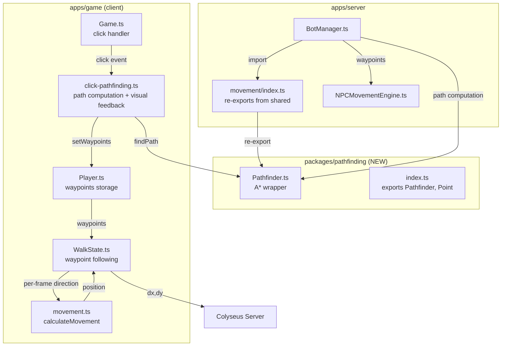
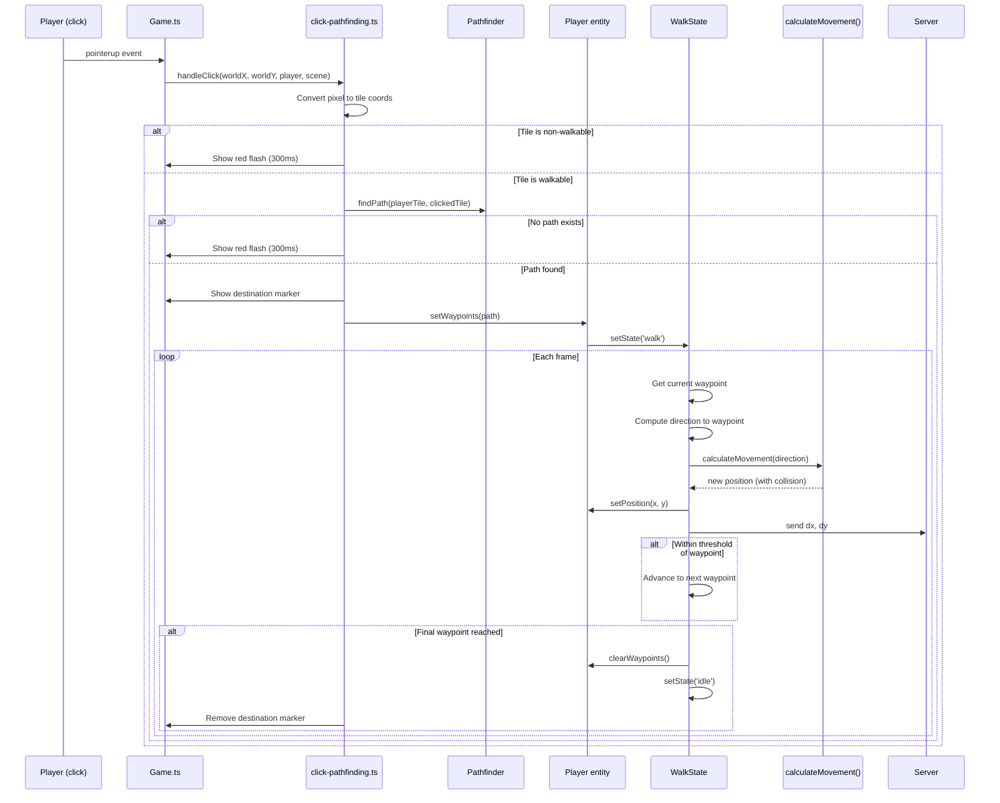

# Player Click-to-Move A* Pathfinding Design Document

## Overview

Add A* pathfinding to the player's click-to-move system so that clicking a tile computes a waypoint path around obstacles instead of walking in a straight line. Extract the existing server-side `Pathfinder` class to a shared `@nookstead/pathfinding` package so both server (NPC navigation) and client (player click-to-move) reuse the same implementation.

## Design Summary (Meta)

```yaml
design_type: "extension"
risk_level: "low"
complexity_level: "medium"
complexity_rationale: >
  (1) Requirements involve waypoint-based movement state management on the client
  (path queue, per-frame waypoint advancement, path cancellation on keyboard input,
  visual feedback for click targets) plus package extraction across the monorepo.
  (2) Primary constraints: zero changes to the multiplayer movement protocol
  (server still receives per-frame dx/dy), backward compatibility for all existing
  server-side NPC pathfinding imports, and preservation of existing keyboard
  movement and collision detection behavior.
main_constraints:
  - "No changes to multiplayer movement protocol (server receives dx/dy per frame)"
  - "Keyboard input cancels click-to-move path (existing behavior preserved)"
  - "4-directional A* only (DiagonalMovement.Never)"
  - "Existing server NPC imports must continue to work after package extraction"
  - "Server movement validation unchanged"
biggest_risks:
  - "Package extraction breaking existing server imports (mitigated by re-export)"
  - "Waypoint-following interaction with existing collision detection in calculateMovement()"
unknowns:
  - "Exact feel of grid-aligned waypoint following vs current smooth straight-line movement"
  - "Whether PLAYER_WAYPOINT_THRESHOLD needs tuning for smooth visual transitions"
```

## Background and Context

### Prerequisite ADRs

- [ADR-0017: Player Client-Side Pathfinding and Shared Pathfinder Package](../adr/ADR-0017-player-client-side-pathfinding.md): Decides to run pathfinding client-side and extract to shared package
- [ADR-0016: NPC A* Pathfinding Navigation System](../adr/ADR-0016-npc-astar-pathfinding.md): Original decision to use the `pathfinding` npm library; establishes Pathfinder API patterns
- [ADR-0013: NPC Bot Entity Architecture](../adr/ADR-0013-npc-bot-entity-architecture.md): Defines the NPC state machine that the Pathfinder was built for

### Applicable Standards

| Standard | Type | Source | Impact on Design |
|----------|------|--------|-----------------|
| Prettier: singleQuote | Explicit | `.prettierrc` | All new code uses single quotes |
| EditorConfig: 2-space indent, UTF-8 | Explicit | `.editorconfig` | All new files use 2-space indentation |
| ESLint: `@nx/enforce-module-boundaries` | Explicit | `eslint.config.mjs` | Shared package must have proper Nx tags for import enforcement |
| TypeScript strict mode, ES2022 | Explicit | `tsconfig.base.json` | All new code must pass strict checking |
| Nx plugin-based target inference | Explicit | `nx.json` | Shared package needs `tsconfig.lib.json` for automatic build target |
| Pure function systems in `game/systems/` | Implicit | `systems/movement.ts`, `systems/displacement.ts` | `click-pathfinding.ts` follows pure function pattern (Phaser-decoupled where possible) |
| Shared package pattern: `workspace:*`, barrel exports | Implicit | `packages/shared/package.json` | New package follows identical structure |
| JSDoc on all public interfaces/classes | Implicit | All source files | New public APIs get JSDoc comments |
| Constants centralized in `@nookstead/shared` | Implicit | `packages/shared/src/constants.ts` | New player pathfinding constants go in shared constants |
| State machine pattern for player behavior | Implicit | `Player.ts`, `WalkState.ts` | Waypoint following integrates with existing FSM, not a new state |

### Agreement Checklist

#### Scope

- [x] Extract `Pathfinder.ts` and `Point` type to `packages/pathfinding/`
- [x] Create `@nookstead/pathfinding` shared package with proper Nx configuration
- [x] Add `click-pathfinding.ts` system module for client-side path computation and visual feedback
- [x] Modify `Player.ts` to store waypoints array
- [x] Modify `WalkState.ts` to follow waypoints instead of straight line
- [x] Modify `PlayerContext` interface to include waypoints
- [x] Add destination marker visual feedback on walkable tile click
- [x] Add red flash visual feedback on non-walkable tile click
- [x] Add `PLAYER_MAX_PATH_LENGTH` and `PLAYER_WAYPOINT_THRESHOLD` constants to `@nookstead/shared`
- [x] Update server imports to re-export from shared package
- [x] Move `pathfinding` npm dependency from server to shared package

#### Non-Scope (Explicitly not changing)

- [x] Multiplayer movement protocol (server still receives `{dx, dy}` per frame)
- [x] Server-side movement validation in `ChunkRoom`
- [x] NPC pathfinding behavior (`NPCMovementEngine.ts` unchanged)
- [x] Keyboard movement behavior (WASD/arrows unchanged)
- [x] Player state machine structure (no new states added)
- [x] Database schema
- [x] Colyseus schema
- [x] Camera, zoom, or rendering pipeline
- [x] Server reconciliation / interpolation logic in `Player.reconcile()`

#### Constraints

- [x] Parallel operation: Not required (direct enhancement of existing click-to-move)
- [x] Backward compatibility: Server NPC imports must continue working via re-export
- [x] Performance measurement: Not required (A* on 64x64 is <1ms, already proven by NPC implementation)

#### Confirmation

- [x] All scope items reflected in Implementation Plan section
- [x] No design contradicts agreements
- [x] Non-scope items explicitly excluded from all sections

### Problem to Solve

When a player clicks a tile that is reachable but not in a straight line from their current position (e.g., around a corner, behind a building, through a fenced area), the player walks into the obstacle and stops. The player must then click multiple intermediate tiles to navigate around the obstacle manually. This is a poor UX compared to the standard click-to-move behavior in similar games (Stardew Valley, Graveyard Keeper) where clicking computes a path automatically.

### Current Challenges

1. **Straight-line movement into walls**: `WalkState.moveTowardTarget()` computes a normalized direction vector from current position to target and walks that direction. When a wall is in the way, `calculateMovement()` blocks the axis, and the player slides along the wall or stops.
2. **No visual feedback for invalid clicks**: Clicking a non-walkable tile (water, wall) has no visual indication that the click was rejected -- the player simply does not move.
3. **No destination indicator**: The player has no visual confirmation of where they are walking to after clicking.
4. **Code duplication potential**: The Pathfinder class exists on the server and would need to be duplicated on the client without extraction.

### Requirements

#### Functional Requirements

- FR-1: Compute A* path from player's current tile to clicked tile on the client-side walkability grid
- FR-2: Player follows computed waypoints one by one, moving toward each waypoint center
- FR-3: When player reaches final waypoint, transition to IdleState
- FR-4: Keyboard input (WASD/arrows) cancels active pathfinding waypoints (existing behavior preserved)
- FR-5: Clicking a non-walkable tile shows a brief red flash on that tile (rejection feedback)
- FR-6: Clicking a walkable tile shows a destination marker that persists until arrival or cancellation
- FR-7: If no path exists to the target (unreachable), show red flash (same as non-walkable)
- FR-8: Extract Pathfinder to `@nookstead/pathfinding` shared package
- FR-9: Server NPC code continues to work via re-exported imports

#### Non-Functional Requirements

- **Performance**: A* path computation on 64x64 grid <1ms (already proven by server implementation)
- **Bundle size**: `pathfinding` library adds ~3KB gzipped to client bundle (negligible vs Phaser ~1MB)
- **Maintainability**: Single Pathfinder implementation shared between server and client
- **Latency**: Zero network latency for path computation (client-side)

## Acceptance Criteria (AC) - EARS Format

### FR-1: A* Path Computation

- [ ] **AC-1.1**: **When** the player clicks a walkable tile, the system shall compute an A* path from the player's current tile to the clicked tile using the `@nookstead/pathfinding` Pathfinder
- [ ] **AC-1.2**: The computed path shall use 4-directional movement only (no diagonal steps)
- [ ] **AC-1.3**: The computed path shall not exceed `PLAYER_MAX_PATH_LENGTH` (200) waypoints
- [ ] **AC-1.4**: **When** the player clicks a tile more than 200 waypoints away, the system shall follow the truncated path (first 200 waypoints)

### FR-2: Waypoint Following

- [ ] **AC-2.1**: **When** a path is computed, the player shall move toward each waypoint in sequence using the existing `calculateMovement()` system for per-frame collision detection
- [ ] **AC-2.2**: **When** the player is within `PLAYER_WAYPOINT_THRESHOLD` (2px) of a waypoint, the system shall advance to the next waypoint
- [ ] **AC-2.3**: The player's facing direction shall update to match the direction toward the current waypoint
- [ ] **AC-2.4**: The player's walk animation shall play during waypoint following

### FR-3: Path Completion

- [ ] **AC-3.1**: **When** the player reaches the final waypoint (within `PLAYER_WAYPOINT_THRESHOLD`), the system shall clear all waypoints and transition to IdleState
- [ ] **AC-3.2**: **When** the player arrives at the destination, the destination marker shall be removed

### FR-4: Keyboard Cancellation

- [ ] **AC-4.1**: **When** keyboard input is detected while waypoints are active, the system shall clear all waypoints and follow keyboard input instead
- [ ] **AC-4.2**: **When** keyboard input cancels a path, the destination marker shall be removed

### FR-5: Non-Walkable Click Feedback

- [ ] **AC-5.1**: **When** the player clicks a non-walkable tile, the system shall display a red-tinted overlay on that tile for 300ms
- [ ] **AC-5.2**: **When** the player clicks a non-walkable tile, no path shall be computed and no movement shall occur

### FR-6: Destination Marker

- [ ] **AC-6.1**: **When** the player clicks a walkable tile and a valid path exists, the system shall display a destination marker at the center of the clicked tile
- [ ] **AC-6.2**: **While** the player is following waypoints, the destination marker shall remain visible at the target tile
- [ ] **AC-6.3**: **If** the player clicks a new walkable tile while following a path, **then** the old destination marker shall be removed and a new one placed at the new target

### FR-7: Unreachable Target Feedback

- [ ] **AC-7.1**: **When** the player clicks a walkable tile but no A* path exists (tile is surrounded by obstacles), the system shall display the same red flash as non-walkable clicks
- [ ] **AC-7.2**: **When** no path exists, no waypoints shall be set and no movement shall occur

### FR-8: Shared Package Extraction

- [ ] **AC-8.1**: The `@nookstead/pathfinding` package shall export `Pathfinder` class and `Point` type
- [ ] **AC-8.2**: The package shall use the `pathfinding` npm library as its dependency
- [ ] **AC-8.3**: The package shall follow the existing shared package pattern (`workspace:*`, barrel exports, `tsconfig.lib.json`)
- [ ] **AC-8.4**: `apps/game` and `apps/server` shall both depend on `@nookstead/pathfinding`

### FR-9: Server Backward Compatibility

- [ ] **AC-9.1**: `apps/server/src/npc-service/movement/index.ts` shall re-export `Pathfinder` and `Point` from `@nookstead/pathfinding`
- [ ] **AC-9.2**: All existing server code importing from `../movement/index.js` shall continue to work without changes
- [ ] **AC-9.3**: Existing Pathfinder tests shall pass after extraction (moved to shared package or imports updated)

## Existing Codebase Analysis

### Implementation Path Mapping

| Type | Path | Description |
|------|------|-------------|
| Existing | `apps/server/src/npc-service/movement/Pathfinder.ts` | A* wrapper to be extracted (109 lines) |
| Existing | `apps/server/src/npc-service/movement/Pathfinder.spec.ts` | Pathfinder tests to move with class |
| Existing | `apps/server/src/npc-service/movement/index.ts` | Barrel exports to update |
| Existing | `apps/server/src/npc-service/movement/NPCMovementEngine.ts` | NPC waypoint engine (unchanged) |
| Existing | `apps/server/src/npc-service/lifecycle/BotManager.ts` | Imports from movement/index.js |
| Existing | `apps/game/src/game/scenes/Game.ts` | Click handler to enhance (lines 189-210) |
| Existing | `apps/game/src/game/entities/Player.ts` | Stores moveTarget, to add waypoints |
| Existing | `apps/game/src/game/entities/states/WalkState.ts` | Straight-line movement to replace with waypoint following |
| Existing | `apps/game/src/game/entities/states/types.ts` | PlayerContext interface to extend |
| Existing | `packages/shared/src/constants.ts` | Constants file to add player pathfinding constants |
| Existing | `packages/shared/src/index.ts` | Barrel exports to add new constants |
| New | `packages/pathfinding/package.json` | Shared package manifest |
| New | `packages/pathfinding/src/Pathfinder.ts` | Extracted Pathfinder class |
| New | `packages/pathfinding/src/index.ts` | Barrel exports |
| New | `packages/pathfinding/tsconfig.json` | TypeScript project config |
| New | `packages/pathfinding/tsconfig.lib.json` | TypeScript build config |
| New | `apps/game/src/game/systems/click-pathfinding.ts` | Client-side path computation + visual feedback |

### Integration Points

- **Click handler in Game.ts** (line 193-210): Currently calls `this.player.setMoveTarget(targetX, targetY)`. Will be replaced with call to `computeClickPath()` from `click-pathfinding.ts`, which computes path and calls `player.setWaypoints()`.
- **WalkState.moveTowardTarget()** (line 104-129): Currently moves toward single target point. Will be replaced with waypoint-following logic that advances through the waypoints array.
- **Player.setMoveTarget()** (line 245-250): Currently stores a single `{x, y}` target. Will be augmented with `setWaypoints()` that stores a `Point[]` array.
- **Server movement/index.ts** (line 1-2): Currently exports from local `./Pathfinder.js`. Will re-export from `@nookstead/pathfinding`.
- **BotManager constructor** (line 62): Creates `new Pathfinder(config.mapWalkable)`. Import path unchanged because `movement/index.ts` re-exports.

### Similar Functionality Search

- **Existing pathfinding**: `Pathfinder.ts` in `apps/server/src/npc-service/movement/` -- this is the code being extracted, not duplicated
- **Existing waypoint following**: `NPCMovementEngine.ts` -- server-side, NPC-specific (uses pixel coordinates, not tile centers). Player waypoint following will use a different approach (per-frame `calculateMovement()` with collision detection) because the player uses the client's movement system, not the server's tick-based engine
- **Click-to-move**: Only exists in `Game.ts` lines 189-210 and `WalkState.moveTowardTarget()`. No other click-to-move implementations found.
- **Decision**: Extract existing Pathfinder (no new implementation); create new waypoint-following logic in WalkState adapted to the client's per-frame movement model

### Code Inspection Evidence

#### What Was Examined

| File Inspected | Key Finding | Design Impact |
|---------------|-------------|---------------|
| `apps/server/src/npc-service/movement/Pathfinder.ts` (109 lines) | Zero server dependencies; imports only `PF` and `BOT_MAX_PATH_LENGTH` from shared | Can be extracted as-is; only needs max-path-length to become configurable |
| `apps/server/src/npc-service/movement/NPCMovementEngine.ts` (176 lines) | Imports `Point` from `./Pathfinder.js`; uses `BOT_WAYPOINT_THRESHOLD` | After extraction, import changes to `@nookstead/pathfinding` |
| `apps/server/src/npc-service/movement/index.ts` (4 lines) | Barrel exports Pathfinder, Point, NPCMovementEngine, MovementResult | Update to re-export Pathfinder/Point from shared package |
| `apps/server/src/npc-service/lifecycle/BotManager.ts` (640 lines) | Imports `{ Pathfinder, NPCMovementEngine }` from `../movement/index.js` | No change needed (re-export maintains compatibility) |
| `apps/game/src/game/scenes/Game.ts` (263 lines) | Click handler at lines 189-210; checks movement lock, click threshold, bounds; calls `player.setMoveTarget(targetX, targetY)` | Replace with call to `computeClickPath()` |
| `apps/game/src/game/entities/Player.ts` (274 lines) | `moveTarget: { x, y } | null`; `setMoveTarget()` transitions to walk if idle; `clearMoveTarget()` nulls target | Add `waypoints: Point[]` and `setWaypoints()` method |
| `apps/game/src/game/entities/states/WalkState.ts` (178 lines) | `moveTowardTarget()` computes normalized direction to single target, calls `applyMovement()` | Replace with `moveAlongWaypoints()` that targets current waypoint |
| `apps/game/src/game/entities/states/types.ts` (54 lines) | `PlayerContext` interface includes `moveTarget`, `clearMoveTarget()` | Add `waypoints`, `currentWaypointIndex`, `setWaypoints()`, `clearWaypoints()` |
| `apps/game/src/game/systems/movement.ts` (205 lines) | `calculateMovement()` pure function with axis-independent collision detection | Reused as-is for per-frame waypoint movement (collision detection preserved) |
| `apps/game/src/game/systems/displacement.ts` (48 lines) | `findNearestWalkable()` spiral search | Not affected by this change |
| `packages/shared/src/constants.ts` (177 lines) | Contains all shared constants including `BOT_MAX_PATH_LENGTH=100`, `BOT_WAYPOINT_THRESHOLD=2` | Add `PLAYER_MAX_PATH_LENGTH=200`, `PLAYER_WAYPOINT_THRESHOLD=2` |
| `apps/server/src/npc-service/movement/Pathfinder.spec.ts` (166 lines) | 8 test cases covering findPath, setWalkableAt, updateGrid | Move to shared package or update imports |

#### Key Findings

- `Pathfinder.ts` has exactly one server-specific dependency: `BOT_MAX_PATH_LENGTH` from `@nookstead/shared`. This must become a constructor parameter or use a generic constant to support both NPC (100) and player (200) path lengths.
- `WalkState.moveTowardTarget()` uses `ARRIVAL_THRESHOLD = 8` (pixels) for the single-target approach. Waypoint following needs a tighter threshold (`PLAYER_WAYPOINT_THRESHOLD = 2px`, matching NPC behavior) to avoid cutting corners, but uses the same `ARRIVAL_THRESHOLD` for the final waypoint.
- The `calculateMovement()` function in `systems/movement.ts` handles collision detection per-frame and is already used by both keyboard and click-to-move. Waypoint following will continue to use it, ensuring collision behavior is preserved.
- `Game.ts` hover highlight (lines 148-168) uses `Phaser.GameObjects.Graphics` for tile overlay -- the same approach works for destination marker and rejection flash.

#### How Findings Influence Design

- **Pathfinder max length parameterization**: Make `maxPathLength` an optional constructor parameter (defaults to `BOT_MAX_PATH_LENGTH` for backward compatibility, overridden to `PLAYER_MAX_PATH_LENGTH` on client).
- **Waypoint threshold**: Use `PLAYER_WAYPOINT_THRESHOLD` (2px) for intermediate waypoints and `ARRIVAL_THRESHOLD` (8px) for the final waypoint to match existing "arrived" behavior.
- **Visual feedback**: Follow the `Phaser.GameObjects.Graphics` pattern already used for hover highlight rather than introducing sprites or new render techniques.
- **Re-export pattern**: Server `movement/index.ts` re-exports maintain all existing import paths.

## Design

### Change Impact Map

```yaml
Change Target: Player click-to-move system + Pathfinder extraction
Direct Impact:
  - packages/pathfinding/ (NEW package -- Pathfinder extracted here)
  - apps/server/src/npc-service/movement/Pathfinder.ts (DELETED -- moved to shared)
  - apps/server/src/npc-service/movement/Pathfinder.spec.ts (MOVED or imports updated)
  - apps/server/src/npc-service/movement/index.ts (re-export change)
  - apps/server/package.json (add @nookstead/pathfinding, remove pathfinding npm)
  - apps/game/package.json (add @nookstead/pathfinding)
  - apps/game/src/game/systems/click-pathfinding.ts (NEW module)
  - apps/game/src/game/scenes/Game.ts (click handler updated)
  - apps/game/src/game/entities/Player.ts (waypoints storage added)
  - apps/game/src/game/entities/states/WalkState.ts (waypoint following replaces straight-line)
  - apps/game/src/game/entities/states/types.ts (PlayerContext extended)
  - packages/shared/src/constants.ts (new player pathfinding constants)
  - packages/shared/src/index.ts (export new constants)
Indirect Impact:
  - apps/server/src/npc-service/lifecycle/BotManager.ts (import path unchanged due to re-export)
  - pnpm-lock.yaml (dependency changes)
No Ripple Effect:
  - NPCMovementEngine.ts (server NPC movement engine unchanged)
  - calculateMovement() in systems/movement.ts (used as-is)
  - Player.reconcile() (server reconciliation unchanged)
  - Multiplayer protocol (dx/dy messages unchanged)
  - Camera, zoom, rendering pipeline
  - Database schema, Colyseus schema
  - Dialogue system, NPC interaction
  - Keyboard movement in WalkState.moveWithKeyboard() (unchanged)
```

### Architecture Overview



### Data Flow



### Integration Point Map

```yaml
Integration Point 1:
  Existing Component: Game.ts pointerup handler (lines 193-210)
  Integration Method: Replace body of click handler with call to click-pathfinding module
  Impact Level: High (Process Flow Change)
  Required Test Coverage: Click on walkable tile computes path; click on non-walkable shows flash

Integration Point 2:
  Existing Component: Player.setMoveTarget() (line 245-250)
  Integration Method: Add setWaypoints() method alongside existing setMoveTarget()
  Impact Level: Medium (Data Usage -- adds parallel waypoints field)
  Required Test Coverage: setWaypoints stores array, transitions to walk; clearWaypoints resets

Integration Point 3:
  Existing Component: WalkState.moveTowardTarget() (lines 104-129)
  Integration Method: Replace straight-line logic with waypoint-following logic
  Impact Level: High (Process Flow Change)
  Required Test Coverage: Waypoints are followed in sequence; keyboard cancels; arrival transitions to idle

Integration Point 4:
  Existing Component: npc-service/movement/index.ts (lines 1-2)
  Integration Method: Change export source from local to @nookstead/pathfinding
  Impact Level: Low (Read-Only -- transparent re-export)
  Required Test Coverage: BotManager still creates Pathfinder; existing tests pass

Integration Point 5:
  Existing Component: Pathfinder constructor (takes boolean[][])
  Integration Method: Add optional maxPathLength parameter (defaults to BOT_MAX_PATH_LENGTH)
  Impact Level: Medium (API Extension)
  Required Test Coverage: Default behavior unchanged; custom max length works
```

### Integration Points List

| Integration Point | Location | Old Implementation | New Implementation | Switching Method |
|-------------------|----------|-------------------|-------------------|------------------|
| Click handler | `Game.ts:193-210` | Direct `player.setMoveTarget(x, y)` | `computeClickPath(x, y, player, pathfinder, scene)` | Direct replacement |
| Move target storage | `Player.ts:50` | `moveTarget: {x,y} \| null` | `waypoints: Point[]` + `currentWaypointIndex: number` | Additive (both exist) |
| Click-to-move movement | `WalkState.ts:104-129` | `moveTowardTarget()` straight line | `moveAlongWaypoints()` waypoint sequence | Direct replacement |
| Pathfinder location | `server/movement/Pathfinder.ts` | Local to server | `@nookstead/pathfinding` | Extract + re-export |
| Max path length | `Pathfinder.ts:67` | Hardcoded `BOT_MAX_PATH_LENGTH` | Constructor param `maxPathLength` | Backward-compatible default |

### Main Components

#### Component 1: `@nookstead/pathfinding` Package

- **Responsibility**: Provide a reusable A* pathfinding wrapper around the `pathfinding` npm library. Operates on `boolean[][]` grids with configurable max path length.
- **Interface**:
  ```typescript
  export interface Point { x: number; y: number; }

  export class Pathfinder {
    constructor(walkable: boolean[][], maxPathLength?: number);
    findPath(startX: number, startY: number, endX: number, endY: number): Point[];
    updateGrid(walkable: boolean[][]): void;
    setWalkableAt(x: number, y: number, walkable: boolean): void;
  }
  ```
- **Dependencies**: `pathfinding` npm package, `@nookstead/shared` (for `BOT_MAX_PATH_LENGTH` default)

#### Component 2: `click-pathfinding.ts` System Module

- **Responsibility**: Handle player click events by computing A* paths and managing visual feedback (destination marker, rejection flash). Pure logic module with minimal Phaser coupling (receives scene reference for graphics).
- **Interface**:
  ```typescript
  export interface ClickPathfindingSystem {
    handleClick(
      worldX: number,
      worldY: number,
      player: PlayerContext & { walkable: boolean[][] },
      pathfinder: Pathfinder,
      scene: Phaser.Scene,
    ): void;
    clearMarker(): void;
    destroy(): void;
  }

  export function createClickPathfindingSystem(
    scene: Phaser.Scene,
    mapWidth: number,
    mapHeight: number,
    tileSize: number,
  ): ClickPathfindingSystem;
  ```
- **Dependencies**: `@nookstead/pathfinding`, Phaser (for graphics objects)

#### Component 3: `Player.ts` Waypoint Storage

- **Responsibility**: Store the computed waypoint path and provide methods to set/clear/advance waypoints. Waypoints coexist with the existing `moveTarget` field (moveTarget is used for the final destination pixel position).
- **Interface** (additions to Player class):
  ```typescript
  // New fields
  public waypoints: Point[] = [];
  public currentWaypointIndex: number = 0;

  // New methods
  setWaypoints(waypoints: Point[]): void;
  clearWaypoints(): void;
  ```
- **Dependencies**: `Point` from `@nookstead/pathfinding`

#### Component 4: `WalkState.ts` Waypoint Following

- **Responsibility**: Each frame, determine the current waypoint, compute direction toward it, and call `applyMovement()`. Advance to next waypoint when close enough. Transition to idle when all waypoints are exhausted. Keyboard input clears waypoints (existing behavior preserved).
- **Interface**: No new public API; internal `moveTowardTarget()` is replaced with `moveAlongWaypoints()`.
- **Dependencies**: `PlayerContext` (extended with waypoints), `calculateMovement()`

### Contract Definitions

```typescript
// --- @nookstead/pathfinding ---

/**
 * A tile coordinate in the walkability grid.
 */
export interface Point {
  x: number;
  y: number;
}

/**
 * A* pathfinder wrapping the `pathfinding` npm library.
 */
export class Pathfinder {
  /**
   * @param walkable - Grid where walkable[y][x] = true means passable
   * @param maxPathLength - Maximum waypoints (default: BOT_MAX_PATH_LENGTH)
   */
  constructor(walkable: boolean[][], maxPathLength?: number);

  /**
   * Compute A* path from start to end.
   * Returns Point[] excluding start, including end.
   * Returns [] if no path, start/end non-walkable, or error.
   */
  findPath(startX: number, startY: number, endX: number, endY: number): Point[];

  /** Replace entire internal grid. */
  updateGrid(walkable: boolean[][]): void;

  /** Update walkability of a single tile. */
  setWalkableAt(x: number, y: number, walkable: boolean): void;
}

// --- PlayerContext extension (types.ts) ---

export interface PlayerContext {
  // ... existing fields ...
  /** Computed A* waypoints (tile coordinates). Empty when no path active. */
  waypoints: Point[];
  /** Index of the current waypoint being targeted. */
  currentWaypointIndex: number;
  /** Set waypoints and transition to walk state. */
  setWaypoints(waypoints: Point[]): void;
  /** Clear all waypoints and reset index. */
  clearWaypoints(): void;
}
```

### Data Contract

#### Pathfinder.findPath

```yaml
Input:
  Type: (startX: number, startY: number, endX: number, endY: number)
  Preconditions: All values are integer tile coordinates within grid bounds
  Validation: Returns [] if start or end is non-walkable or out-of-bounds

Output:
  Type: Point[]
  Guarantees:
    - Excludes start tile, includes end tile
    - All waypoints are 4-directionally connected (Manhattan distance 1 between consecutive points)
    - Length <= maxPathLength (constructor parameter)
    - All waypoints are on walkable tiles
  On Error: Returns [] (never throws)

Invariants:
  - Internal PF.Grid is cloned before each findPath call (library mutates during search)
  - Grid state is only modified by updateGrid() or setWalkableAt()
```

#### click-pathfinding.handleClick

```yaml
Input:
  Type: (worldX: number, worldY: number, player: PlayerContext, pathfinder: Pathfinder, scene: Phaser.Scene)
  Preconditions: worldX/worldY are valid world pixel coordinates
  Validation: Checks tile bounds, walkability, and path existence

Output:
  Type: void (side effects: sets waypoints on player, creates/removes graphics objects)
  Guarantees:
    - If tile is walkable and path exists: player.setWaypoints() is called, destination marker shown
    - If tile is non-walkable or unreachable: red flash shown, no waypoints set
  On Error: No-op (fail safe)

Invariants:
  - At most one destination marker exists at any time
  - At most one rejection flash animation exists at any time
```

### Data Representation Decisions

| Data Structure | Decision | Rationale |
|---|---|---|
| `Point` (x, y tile coordinate) | **Reuse** existing `Point` from `Pathfinder.ts` | Identical structure already used by Pathfinder and NPCMovementEngine; extraction to shared package makes it available to client |
| Player waypoints array | **New** field on `PlayerContext` interface (`waypoints: Point[]`) | Player entity needs its own waypoint storage separate from NPC `ServerBot.waypoints`; same `Point` type reused |
| `ClickPathfindingSystem` | **New** dedicated type | No existing type matches this responsibility; follows the module pattern in `game/systems/` |

### Field Propagation Map

```yaml
fields:
  - name: "waypoints"
    origin: "Pathfinder.findPath() return value (tile coordinates)"
    transformations:
      - layer: "click-pathfinding.ts"
        type: "Point[]"
        validation: "non-empty array, within map bounds"
        transformation: "none (pass through)"
      - layer: "Player.ts"
        type: "Point[] stored on entity"
        transformation: "stored as-is; currentWaypointIndex set to 0"
      - layer: "WalkState.ts"
        type: "Point read per frame"
        transformation: "tile coords -> pixel coords (waypoint.x * tileSize + tileSize/2, (waypoint.y + 1) * tileSize)"
      - layer: "calculateMovement()"
        type: "direction vector {x, y}"
        transformation: "normalized direction from player position to waypoint pixel position"
      - layer: "Server (dx, dy)"
        type: "MovePayload { dx: number, dy: number }"
        transformation: "delta between old and new position"
    destination: "Server applies dx/dy to authoritative position"
    loss_risk: "none"
    loss_risk_reason: "Each transformation is a straightforward coordinate conversion"

  - name: "clickedTile"
    origin: "Phaser pointer worldX/worldY"
    transformations:
      - layer: "Game.ts click handler"
        type: "pixel coordinates (worldX, worldY)"
        validation: "within map bounds"
        transformation: "Math.floor(worldX / TILE_SIZE) -> tileX"
      - layer: "click-pathfinding.ts"
        type: "tile coordinates (tileX, tileY)"
        validation: "walkable[tileY][tileX] === true"
        transformation: "passed to Pathfinder.findPath() as endX, endY"
    destination: "Pathfinder findPath endX/endY parameters"
    loss_risk: "none"
```

### Interface Change Impact Analysis

| Existing Operation | New Operation | Conversion Required | Adapter Required | Compatibility Method |
|-------------------|---------------|-------------------|------------------|---------------------|
| `Player.setMoveTarget(x, y)` | `Player.setWaypoints(points)` | No (additive) | Not Required | Both methods coexist; setMoveTarget still works for non-pathfinding use |
| `Player.clearMoveTarget()` | `Player.clearWaypoints()` | No (additive) | Not Required | Both methods coexist |
| `WalkState.moveTowardTarget()` | `WalkState.moveAlongWaypoints()` | Yes | Not Required | Direct replacement in `update()` -- checks waypoints first, falls back to moveTarget |
| Server `import { Pathfinder } from '../movement/index.js'` | Same import path | No | Not Required | Re-export maintains path |
| `new Pathfinder(walkable)` | `new Pathfinder(walkable, maxPathLength?)` | No | Not Required | Optional parameter with default |

### State Transitions and Invariants

```yaml
State Definition:
  - Player movement states: idle, walk (existing FSM)
  - Waypoint states (within walk): no-waypoints, following-waypoints

State Transitions:
  idle + click walkable tile with path -> walk (following-waypoints)
  idle + click non-walkable tile -> idle (no transition, flash shown)
  walk (following-waypoints) + reach final waypoint -> idle
  walk (following-waypoints) + keyboard input -> walk (no-waypoints, keyboard)
  walk (following-waypoints) + click new tile with path -> walk (new waypoints, marker moved)
  walk (following-waypoints) + click non-walkable -> walk (waypoints unchanged, flash shown)
  walk (keyboard) + release keys -> idle
  walk (following-waypoints) + movement locked (dialogue) -> idle (waypoints cleared)

System Invariants:
  - When waypoints.length > 0 and currentWaypointIndex < waypoints.length, player is following a path
  - When waypoints are cleared, currentWaypointIndex is reset to 0
  - Keyboard input always takes priority over waypoint following
  - At most one destination marker and one rejection flash exist simultaneously
  - Server never receives waypoint data -- only per-frame dx/dy
```

### Error Handling

| Error Scenario | Handling | User Impact |
|---|---|---|
| Click out of map bounds | Silently ignored (existing bounds check in Game.ts) | No visual feedback |
| Click on non-walkable tile | Red flash for 300ms | Brief visual feedback, no movement |
| No A* path to walkable tile | Red flash for 300ms (same as non-walkable) | Brief visual feedback, no movement |
| Pathfinder throws (should never happen) | `findPath()` catches internally, returns `[]` | Treated as unreachable |
| Waypoint on tile that became non-walkable mid-path | `calculateMovement()` blocks the axis; player slides or stops | Player may stop short of destination; clicking again recomputes path |
| Player displaced during path following | Displacement handler in `Player.preUpdate()` already handles | Waypoints may become stale; player clicks again after displacement |

### Logging and Monitoring

No new logging is required for this feature. The click-pathfinding system operates entirely client-side with visual feedback. Debug logging can be added conditionally during development:

```typescript
// Development only -- behind a flag or removed before merge
console.debug(`[click-path] path: ${waypoints.length} waypoints to (${tileX}, ${tileY})`);
```

### Integration Boundary Contracts

```yaml
Boundary: Game.ts -> click-pathfinding.ts
  Input: worldX (number), worldY (number), player (PlayerContext), pathfinder (Pathfinder), scene (Phaser.Scene)
  Output: void (side effects on player and scene graphics)
  On Error: No-op (silently ignore)

Boundary: click-pathfinding.ts -> @nookstead/pathfinding
  Input: startX, startY, endX, endY (integer tile coordinates)
  Output: Point[] (sync return)
  On Error: Returns [] (never throws)

Boundary: WalkState -> Player (waypoints)
  Input: reads player.waypoints[], player.currentWaypointIndex
  Output: calls player.setPosition(), player.clearWaypoints()
  On Error: N/A (in-process, same entity)

Boundary: @nookstead/pathfinding -> apps/server (re-export)
  Input: import { Pathfinder, Point } from '../movement/index.js'
  Output: Re-exports from @nookstead/pathfinding
  On Error: Compile-time error if re-export breaks
```

## Implementation Plan

### Implementation Approach

**Selected Approach**: Vertical Slice (Feature-driven)

**Selection Reason**: This feature has a clear vertical boundary -- package extraction is a prerequisite, followed by client integration. Each phase delivers a testable, verifiable outcome. The feature has low inter-dependency with other ongoing work and can be completed independently. The vertical approach allows the shared package to be validated with existing server tests before client integration begins.

### Technical Dependencies and Implementation Order

#### Phase 1: Foundation -- Shared Package Extraction

**Technical Reason**: All subsequent phases depend on `@nookstead/pathfinding` existing as a package.

1. **Create `packages/pathfinding/` package structure**
   - `package.json` (name: `@nookstead/pathfinding`, dependencies: `pathfinding`, `@types/pathfinding`)
   - `tsconfig.json`, `tsconfig.lib.json` (following `packages/shared/` pattern)
   - `src/index.ts` (barrel exports)
   - `src/Pathfinder.ts` (moved from server, with `maxPathLength` parameter added)

2. **Add player pathfinding constants to `@nookstead/shared`**
   - `PLAYER_MAX_PATH_LENGTH = 200`
   - `PLAYER_WAYPOINT_THRESHOLD = 2`
   - Export from `packages/shared/src/index.ts`

3. **Update server imports**
   - `apps/server/src/npc-service/movement/index.ts`: re-export `Pathfinder`, `Point` from `@nookstead/pathfinding`
   - `apps/server/package.json`: add `@nookstead/pathfinding: workspace:*`, remove `pathfinding` npm dep
   - `apps/server/src/npc-service/movement/Pathfinder.ts`: DELETE
   - `apps/server/src/npc-service/movement/Pathfinder.spec.ts`: update imports or move to shared package

4. **Update client dependency**
   - `apps/game/package.json`: add `@nookstead/pathfinding: workspace:*`
   - `apps/game/tsconfig.json`: add reference to `packages/pathfinding`

**Verification (L2)**: All existing Pathfinder tests pass with new import paths. `pnpm nx test server` passes. `pnpm nx typecheck server` passes.

#### Phase 2: Core -- Client Pathfinding Integration

**Technical Reason**: Requires the shared package from Phase 1.

1. **Extend `PlayerContext` interface** (`types.ts`)
   - Add `waypoints: Point[]`, `currentWaypointIndex: number`
   - Add `setWaypoints(waypoints: Point[]): void`
   - Add `clearWaypoints(): void`

2. **Add waypoint storage to `Player.ts`**
   - Add `waypoints` and `currentWaypointIndex` fields
   - Implement `setWaypoints()`: stores waypoints, sets index to 0, transitions to walk
   - Implement `clearWaypoints()`: empties array, resets index

3. **Replace straight-line movement in `WalkState.ts`**
   - In `update()`: check `this.context.waypoints.length > 0` before `this.context.moveTarget`
   - New method `moveAlongWaypoints()`: compute direction to current waypoint pixel center, call `applyMovement()`, advance when within threshold
   - Keyboard input still clears waypoints (calls `clearWaypoints()` in addition to `clearMoveTarget()`)

4. **Create `click-pathfinding.ts` system module**
   - `createClickPathfindingSystem()` factory function
   - `handleClick()`: converts pixel to tile, checks walkability, computes path, calls `player.setWaypoints()`
   - Destination marker: `Phaser.GameObjects.Graphics` rectangle with subtle highlight
   - Rejection flash: `Phaser.GameObjects.Graphics` red tint with 300ms tween fade

5. **Update `Game.ts` click handler**
   - Create Pathfinder instance in `create()` (using `this.mapData.walkable`)
   - Create click-pathfinding system in `create()`
   - Replace `this.player.setMoveTarget(targetX, targetY)` with system's `handleClick()`
   - Clean up system in `shutdown()`

**Verification (L1)**: Player clicks a tile behind a wall -> player navigates around the wall. Clicking a non-walkable tile shows red flash. Clicking while walking starts new path. Keyboard cancels path.

#### Phase 3: Polish -- Visual Feedback

**Technical Reason**: Can be done in parallel with Phase 2 step 4, but listed separately for clarity.

1. **Destination marker** implementation details:
   - Small crosshair or pulsing dot at tile center
   - Created via `Phaser.GameObjects.Graphics`
   - Depth set above tiles but below player
   - Destroyed on arrival, keyboard cancel, or new click

2. **Rejection flash** implementation details:
   - Red-tinted rectangle overlay on the clicked tile
   - 300ms duration, fade out via alpha tween
   - Self-destructs after animation completes

**Verification (L1)**: Visual feedback is visible and disappears appropriately.

### Integration Points (E2E Verification)

**Integration Point 1: Package extraction**
- Components: `packages/pathfinding` -> `apps/server`
- Verification: `pnpm nx test server` passes; `pnpm nx build server` succeeds

**Integration Point 2: Client pathfinding**
- Components: `apps/game` -> `@nookstead/pathfinding`
- Verification: `pnpm nx typecheck game` passes; `pnpm nx build game` succeeds

**Integration Point 3: Click-to-move with pathfinding**
- Components: `Game.ts` -> `click-pathfinding.ts` -> `Player.ts` -> `WalkState.ts`
- Verification: Manual test -- click tile behind obstacle, player navigates around it

**Integration Point 4: Keyboard cancellation**
- Components: `WalkState.ts` keyboard check -> `Player.clearWaypoints()`
- Verification: Manual test -- click distant tile, press WASD mid-path, path cancels

### Migration Strategy

The migration is non-breaking:

1. **Server-side**: Re-exports in `movement/index.ts` ensure all existing `import { Pathfinder } from '../movement/index.js'` statements continue to work. No code outside `npc-service/movement/` needs changes.

2. **Client-side**: `moveTarget` field is preserved. The `WalkState.update()` method checks waypoints first, then falls back to `moveTarget`, then to idle -- so any code that calls `setMoveTarget()` directly continues to work (straight-line movement as fallback).

## Test Strategy

### Basic Test Design Policy

Test cases are derived directly from acceptance criteria. Each AC maps to at least one test case.

### Unit Tests

**Pathfinder (shared package)** -- existing tests moved from server:
- AC-8.1: Pathfinder exports from `@nookstead/pathfinding`
- AC-1.2: 4-directional only (existing test)
- AC-1.3: Path truncation at max length (existing test, parameterized for PLAYER_MAX_PATH_LENGTH)
- New: Constructor with custom `maxPathLength`
- New: Default `maxPathLength` equals `BOT_MAX_PATH_LENGTH`

**click-pathfinding.ts**:
- AC-1.1: Computes path for walkable target
- AC-5.2: Returns no path for non-walkable target
- AC-7.1: Returns no path for unreachable target
- AC-1.4: Truncated path for distant targets

**WalkState waypoint following** (mock PlayerContext):
- AC-2.1: Moves toward current waypoint using calculateMovement
- AC-2.2: Advances waypoint when within threshold
- AC-3.1: Transitions to idle when all waypoints exhausted
- AC-4.1: Keyboard input clears waypoints
- AC-2.3: Facing direction updates per waypoint

**Player waypoint methods**:
- AC-2.1: `setWaypoints()` stores array and transitions to walk
- AC-3.1: `clearWaypoints()` empties array and resets index

### Integration Tests

- AC-8.4: Both `apps/game` and `apps/server` can import from `@nookstead/pathfinding`
- AC-9.1: Server `movement/index.ts` re-exports work correctly
- AC-9.2: Existing BotManager code compiles with new import chain

### E2E Tests

- AC-1.1 + AC-2.1 + AC-3.1: Click tile behind wall -> player navigates around wall -> arrives -> idles
- AC-4.1 + AC-4.2: Click distant tile -> press WASD mid-path -> path cancels, marker removed
- AC-5.1: Click water tile -> red flash appears for ~300ms
- AC-6.1 + AC-6.3: Click tile A -> marker at A -> click tile B -> marker moves to B

### Performance Tests

Not required. A* performance on 64x64 grid is already validated by server-side NPC pathfinding (ADR-0016: <1ms per path computation).

## Security Considerations

No security impact. Pathfinding is a client-side computation that does not affect server authority. The server continues to validate all movement via per-frame `{dx, dy}` delta checks. A malicious client could compute any path it wants, but the server will reject movement to non-walkable tiles regardless.

## Future Extensibility

1. **Diagonal movement**: If the pixel art style ever supports 8-directional movement, the Pathfinder can be reconfigured by changing `DiagonalMovement.Never` to `DiagonalMovement.OnlyWhenNoObstacles`.

2. **Weighted pathfinding**: The `pathfinding` library supports weighted grids. Terrain speed modifiers could be incorporated into path computation (prefer roads over sand) by converting speed modifiers to edge weights.

3. **Path smoothing**: The library provides `PF.Util.smoothenPath()` for producing more natural-looking paths. This can be added as a post-processing step without changing the Pathfinder API.

4. **Dynamic re-pathing**: When the walkability grid changes (player places an object), the client's Pathfinder can be updated via `setWalkableAt()` and active paths recomputed -- similar to how `BotManager.onWalkabilityChanged()` works on the server.

5. **Town NPCs**: When town NPCs are added (with client-side rendering of NPC paths), they can reuse the same `@nookstead/pathfinding` package.

## Alternative Solutions

### Alternative 1: Navmesh-Based Pathfinding

- **Overview**: Use a navigation mesh instead of grid-based A* for smoother paths.
- **Advantages**: Produces more natural curved paths; fewer waypoints for long routes; supports non-grid-aligned obstacles.
- **Disadvantages**: Significant complexity increase; requires navmesh generation from tile data; overkill for a 16px tile-based game; no existing npm library matches our needs as well as `pathfinding`.
- **Reason for Rejection**: The game uses a 16px tile grid. Grid-based A* is the natural fit and already proven by the NPC implementation.

### Alternative 2: Keep Straight-Line, Add Wall-Sliding Enhancement

- **Overview**: Instead of A* pathfinding, enhance the existing straight-line movement with better wall-sliding behavior so the player "flows" around obstacles.
- **Advantages**: No new dependencies; simpler implementation; preserves smooth diagonal movement feel.
- **Disadvantages**: Cannot navigate around L-shaped obstacles, enclosed areas, or buildings with entrances on the far side; player still gets stuck in many scenarios; does not solve the core problem.
- **Reason for Rejection**: Wall-sliding is a band-aid that does not solve the fundamental problem of reaching tiles that are not in a straight line.

## Risks and Mitigation

| Risk | Impact | Probability | Mitigation |
|------|--------|-------------|------------|
| Package extraction breaks server NPC tests | Medium | Low | Re-export from movement/index.ts preserves all import paths; run server tests immediately after extraction |
| Waypoint following feels "robotic" (grid-aligned turns) | Low | Medium | Use sub-pixel movement toward tile centers via calculateMovement(); can add path smoothing later if needed |
| Mid-path walkability changes leave player on stale path | Low | Low | calculateMovement() blocks movement into non-walkable tiles per-frame; player can click again to recompute |
| Bundle size increase on client | Low | Low | pathfinding library is ~3KB gzipped; negligible vs Phaser (~1MB) |

## References

- [ADR-0017: Player Client-Side Pathfinding](../adr/ADR-0017-player-client-side-pathfinding.md) -- Architecture decision for this feature
- [ADR-0016: NPC A* Pathfinding](../adr/ADR-0016-npc-astar-pathfinding.md) -- Original pathfinding decision
- [PathFinding.js by qiao (GitHub)](https://github.com/qiao/PathFinding.js) -- The underlying pathfinding library
- [Nx Workspace Libraries](https://nx.dev/concepts/more-concepts/applications-and-libraries) -- Pattern for shared packages in Nx monorepos

## Update History

| Date | Version | Changes | Author |
|------|---------|---------|--------|
| 2026-03-14 | 1.0 | Initial version | AI Technical Designer |
