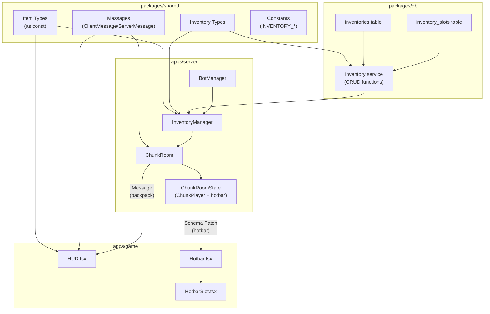
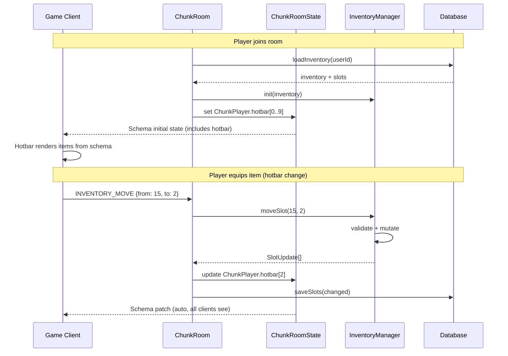
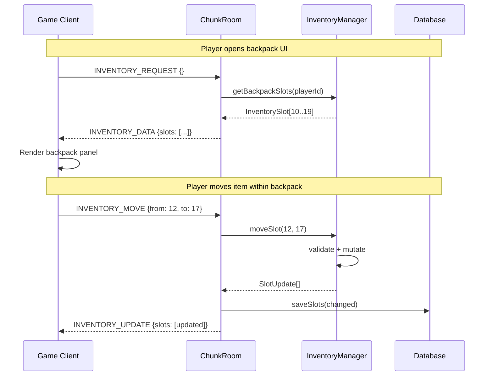

# Item & Inventory System Design Document

## Overview

This document defines the technical design for the Item and Inventory system in Nookstead. The system provides a universal inventory model serving both players and NPCs, with a hybrid synchronization strategy: hotbar slots (1-10) are synchronized via Colyseus Schema for real-time visibility, while backpack slots (11-20+) use explicit request/response messages. Item definitions are static TypeScript constants in the shared package, and each inventory slot tracks item ownership independently.

## Design Summary (Meta)

```yaml
design_type: "new_feature"
risk_level: "medium"
complexity_level: "medium"
complexity_rationale: >
  (1) Hybrid sync strategy requires two data paths (schema + messages) with consistent
  behavior guarantees. Stacking, slot swapping, and ownership transfer involve 3+ state
  transitions per operation. (2) Integration spans 4 packages (shared, db, server, game)
  and must wire into existing ChunkRoomState, BotManager, and HUD components without
  breaking current functionality.
main_constraints:
  - "Colyseus Schema 64-field limit per class"
  - "Hotbar must be visible to all room clients (public state)"
  - "Backpack is private to the owning client (unicast only)"
  - "NPC inventory items can have different ownership than the NPC"
biggest_risks:
  - "Schema field count approaching 64-limit if hotbar slot representation is too rich"
  - "Race conditions on concurrent slot mutations (two clients acting on same NPC inventory)"
unknowns:
  - "Optimal max stack sizes per item type (needs gameplay tuning)"
  - "NPC inventory size per role (needs game design iteration)"
```

## Background and Context

### Prerequisite ADRs

- [ADR-0018: Inventory System Architecture](../adr/ADR-0018-inventory-system-architecture.md) -- Hybrid sync, universal model, static definitions, slot-level ownership
- [ADR-0011: Game Object Type System](../adr/ADR-0011-game-object-type-system.md) -- `as const` pattern for type definitions in shared package
- [ADR-0013: NPC Bot Entity Architecture](../adr/ADR-0013-npc-bot-entity-architecture.md) -- BotManager decoupling pattern

### Agreement Checklist

#### Scope
- [x] Define item type/subtype system in `packages/shared`
- [x] Create DB tables: `inventories`, `inventory_slots`
- [x] Server-side `InventoryManager` with CRUD operations
- [x] Extend `ChunkPlayer` schema with hotbar `ArraySchema`
- [x] New `ClientMessage`/`ServerMessage` types for backpack operations
- [x] Wire `Hotbar.tsx` to real server data
- [x] NPC inventory initialization via `BotManager`
- [x] Slot-level ownership property

#### Non-Scope (Explicitly not changing)
- [x] Tool usage mechanics (hoe interacting with tiles) -- future feature
- [x] Currency/economy system -- future feature
- [x] Trading between entities -- future feature
- [x] Crafting system -- future feature
- [x] Full item catalog population (only data model + a few seed items)
- [x] Existing player movement, dialogue, or bot wandering logic

#### Constraints
- [x] Parallel operation: Yes -- existing systems must continue working during rollout
- [x] Backward compatibility: Not required -- no existing inventory data to migrate
- [x] Performance measurement: Not required at this stage -- monitor schema size

### Problem to Solve

The game client has a Hotbar UI with 10 empty slots (`Array(10).fill(null)`). Players and NPCs have no concept of items, tools, or carried objects. The system needs a data model and sync pipeline to make inventories functional across the multiplayer architecture.

### Current Challenges

1. `HUD.tsx` creates placeholder `hotbarItems` with `Array(10).fill(null)` and never updates them
2. No item type system exists -- items cannot be defined, categorized, or referenced
3. No server-side inventory state -- the server cannot track what a player or NPC is carrying
4. No DB tables for inventories or inventory slots
5. NPCs have no concept of carrying items despite having roles (farmer, baker) that imply tool/material usage

### Requirements

#### Functional Requirements

- FR-1: Define item categories, types, and subtypes with type-safe constants
- FR-2: Create and persist inventories for players and NPCs
- FR-3: Synchronize hotbar slots in real-time via Colyseus Schema
- FR-4: Synchronize backpack slots via request/response messages
- FR-5: Support item stacking with configurable max stack sizes
- FR-6: Support slot operations: add, remove, move, swap, split stacks
- FR-7: Track per-slot item ownership (owner may differ from inventory holder)
- FR-8: Initialize NPC inventories with role-appropriate items on spawn
- FR-9: Wire existing Hotbar component to real server-synced data

#### Non-Functional Requirements

- **Performance**: Hotbar sync must not add measurable latency beyond existing schema patching (~100ms tick rate)
- **Scalability**: Inventory operations must remain O(1) per slot; no full-inventory scans for basic operations
- **Reliability**: Server is authoritative for all mutations; client never directly mutates inventory state
- **Maintainability**: Single inventory codebase for players and NPCs; item definitions are compile-time constants

## Acceptance Criteria (AC) - EARS Format

### FR-1: Item Type System

- [ ] The system shall define item categories (tool, seed, crop, material, consumable, gift, special) as TypeScript constants in `packages/shared`
- [ ] **When** a new item type constant is added to the shared package, the system shall provide compile-time type checking on both client and server
- [ ] The system shall export type guard functions for validating item category and type strings

### FR-2: Inventory Persistence

- [ ] **When** a player joins a room for the first time, the system shall create an inventory with 20 slots (10 hotbar + 10 backpack)
- [ ] **When** an NPC bot is created, the system shall create an inventory with a configurable number of slots based on role
- [ ] **While** a player is in a room, the system shall persist inventory changes to the database

### FR-3: Hotbar Real-Time Sync

- [ ] **When** a player's hotbar slot changes, the system shall broadcast the change to all clients in the room via Colyseus Schema patching
- [ ] **When** a new player joins a room, the system shall receive existing players' hotbar data via the initial state snapshot
- [ ] **If** a player reconnects, **then** the system shall restore their hotbar from persisted DB state

### FR-4: Backpack Message Sync

- [ ] **When** a client sends `INVENTORY_REQUEST`, the system shall respond with the full backpack contents via `INVENTORY_DATA`
- [ ] **When** a client sends `INVENTORY_MOVE`, the system shall validate and execute the slot operation, then respond with `INVENTORY_UPDATE`
- [ ] **If** a backpack operation fails validation, **then** the system shall respond with an error message and not modify state

### FR-5: Item Stacking

- [ ] **When** an item is added to a slot containing the same item type, the system shall increase the quantity up to the max stack size
- [ ] **If** adding an item would exceed the max stack size, **then** the system shall place overflow in the next available empty slot
- [ ] **If** no empty slots are available for overflow, **then** the system shall reject the add operation and report inventory full

### FR-6: Slot Operations

- [ ] **When** a client sends `INVENTORY_MOVE` with source and destination slot indices, the system shall swap the slot contents
- [ ] **When** a client sends `INVENTORY_MOVE` targeting an empty destination, the system shall move the item without swapping
- [ ] **If** source and destination contain the same stackable item type, **then** the system shall merge stacks up to the max stack size

### FR-7: Ownership Tracking

- [ ] Each inventory slot shall have an `ownedByType` and `ownedById` field indicating who the item belongs to
- [ ] **When** an item is added to an NPC's inventory with explicit ownership parameters, the system shall set the slot's ownedByType and ownedById to the specified values rather than defaulting to the NPC
- [ ] The system shall default slot ownership to the inventory holder when no explicit owner is specified

### FR-8: NPC Inventory Initialization

- [ ] **When** a new NPC bot is created with a role, the system shall populate its inventory with role-appropriate starting items
- [ ] **While** an NPC has an inventory, the system shall persist it across room lifecycle (load on spawn, save on despawn)

### FR-9: Hotbar Wiring

- [ ] **When** the game client connects to a room, the Hotbar component shall display items from the Colyseus state schema, not placeholder data
- [ ] **When** a hotbar slot is updated on the server, the Hotbar component shall re-render within the next Colyseus patch cycle (~100ms)

## Existing Codebase Analysis

### Implementation Path Mapping

| Type | Path | Description |
|------|------|-------------|
| Existing | `packages/shared/src/types/game-object.ts` | `as const` type pattern to follow for item types |
| Existing | `packages/shared/src/types/messages.ts` | ClientMessage/ServerMessage pattern to extend |
| Existing | `packages/shared/src/constants.ts` | Shared constants pattern |
| Existing | `apps/server/src/rooms/ChunkRoomState.ts` | Colyseus Schema classes to extend |
| Existing | `apps/server/src/rooms/ChunkRoom.ts` | Room lifecycle and message handlers |
| Existing | `apps/server/src/npc-service/lifecycle/BotManager.ts` | Bot lifecycle management |
| Existing | `apps/server/src/npc-service/types/bot-types.ts` | ServerBot interface to extend |
| Existing | `apps/game/src/components/hud/HUD.tsx` | HUD component to wire |
| Existing | `apps/game/src/components/hud/Hotbar.tsx` | Hotbar component (already has correct interface) |
| Existing | `apps/game/src/components/hud/HotbarSlot.tsx` | Slot component (already has HotbarItem type) |
| Existing | `apps/game/src/components/hud/types.ts` | HotbarItem, HUDState types |
| Existing | `packages/db/src/schema/npc-bots.ts` | DB schema pattern (Drizzle ORM) |
| Existing | `packages/db/src/services/npc-bot.ts` | Service function pattern (fail-fast) |
| **New** | `packages/shared/src/types/item.ts` | Item category/type/subtype definitions |
| **New** | `packages/shared/src/types/inventory.ts` | Inventory and slot type definitions |
| **New** | `packages/db/src/schema/inventories.ts` | Inventories table schema |
| **New** | `packages/db/src/schema/inventory-slots.ts` | Inventory slots table schema |
| **New** | `packages/db/src/services/inventory.ts` | Inventory DB service functions |
| **New** | `apps/server/src/inventory/InventoryManager.ts` | Server-side inventory logic |
| **New** | `apps/server/src/rooms/InventorySlotSchema.ts` | Colyseus schema for hotbar slots |

### Integration Points (Include even for new implementations)

- **ChunkRoomState**: Add `ArraySchema<InventorySlotSchema>` to `ChunkPlayer`
- **ChunkRoom.onCreate**: Register new inventory message handlers
- **ChunkRoom.onJoin**: Load/create player inventory, populate hotbar schema
- **ChunkRoom.onLeave**: Save inventory state to DB
- **BotManager.init**: Create NPC inventories on first spawn
- **HUD.tsx**: Replace `Array(10).fill(null)` with Colyseus state listener
- **messages.ts**: Add new ClientMessage and ServerMessage entries

### Code Inspection Evidence

#### What Was Examined

| File Inspected | Key Finding | Design Impact |
|---------------|-------------|---------------|
| `packages/shared/src/types/game-object.ts` | Uses `as const` objects with `satisfies Record<>` for type safety; has type guards (`isGameObjectCategory`) | Adopt identical pattern for item types |
| `packages/shared/src/types/messages.ts` | `ClientMessage` and `ServerMessage` are `as const` objects, not enums | New inventory messages follow same `as const` pattern |
| `packages/shared/src/constants.ts` | Game constants are exported individually, not grouped | Inventory constants follow same pattern |
| `apps/server/src/rooms/ChunkRoomState.ts` | `ChunkPlayer` has 6 fields (id, worldX, worldY, direction, skin, name); `ChunkBot` has 8 fields | Adding 10 hotbar slots (~3 fields each = 30) keeps ChunkPlayer at ~36 fields, well under 64 |
| `apps/server/src/rooms/ChunkRoom.ts:144-171` | Message handlers registered in `onCreate` with `this.onMessage(ClientMessage.X, handler)` | New inventory handlers follow same registration pattern |
| `apps/server/src/rooms/ChunkRoom.ts:564-655` | Bot initialization in `onJoin` loads from DB, creates on first visit | NPC inventory initialization follows same load-or-create pattern |
| `apps/server/src/npc-service/lifecycle/BotManager.ts` | Decoupled from Colyseus; ChunkRoom applies `BotUpdate[]` to schema | InventoryManager follows same decoupling; ChunkRoom applies inventory updates to schema |
| `apps/server/src/npc-service/types/bot-types.ts` | `ServerBot` interface has persona fields, factory function `createServerBot` | ServerBot to be extended with `inventoryId` field |
| `apps/game/src/components/hud/HUD.tsx:19-22` | `DEFAULT_HUD_STATE.hotbarItems = Array(10).fill(null)` | This is the exact line to replace with Colyseus state binding |
| `apps/game/src/components/hud/types.ts:24-28` | `HotbarItem { id, spriteRect, quantity }` | Schema hotbar slots must produce data compatible with this interface |
| `packages/db/src/schema/npc-bots.ts` | UUID PK, `createdAt`/`updatedAt` timestamps, foreign key to `maps` | New tables follow identical column patterns |
| `packages/db/src/services/npc-bot.ts` | Functions take `DrizzleClient` as first arg, return typed results, errors propagate | New service functions follow identical signature pattern |

#### Key Findings

- `ChunkPlayer` currently uses 6 schema fields, leaving ample room for hotbar slots within the 64-field limit
- The `HotbarItem` type already defines the client-side data shape (`id`, `spriteRect`, `quantity`); the schema must produce compatible data
- `BotManager` is fully decoupled from Colyseus -- `InventoryManager` should follow the same pattern
- All DB services use `DrizzleClient` as first parameter with fail-fast error propagation
- The `as const` type definition pattern is well-established and should be reused for item types

#### How Findings Influence Design

- ChunkPlayer schema extension is safe: 6 existing + 30 new (10 slots x 3 fields) = 36, well under 64
- `HotbarItem` type compatibility drives the schema field design (must include `itemId`, `spriteX/Y/W/H`, `quantity`)
- BotManager decoupling pattern is directly reusable for InventoryManager
- DB service patterns (function signatures, error handling) are directly reusable

## Applicable Standards

### Classification Table

| Standard | Type | Source | Impact on Design |
|----------|------|--------|-----------------|
| Prettier: single quotes, 2-space indent | Explicit | `.prettierrc`, `.editorconfig` | All new code files |
| ESLint flat config with Nx module boundaries | Explicit | `eslint.config.mjs` | Cross-package imports must respect boundaries |
| TypeScript strict mode (ES2022 target) | Explicit | `tsconfig.base.json` | All types must be strict-mode compliant |
| Drizzle ORM with UUID PKs and timestamps | Explicit | `packages/db/src/schema/*.ts` | New tables follow existing schema conventions |
| Jest for unit tests | Explicit | `jest.config.cts` files | New services need test files |
| `as const` with `satisfies` for type catalogs | Implicit | `packages/shared/src/types/game-object.ts` | Item type definitions follow this pattern |
| Service functions: `(db: DrizzleClient, ...) => Promise<T>` | Implicit | `packages/db/src/services/npc-bot.ts` | New inventory service follows this signature |
| Manager decoupled from Colyseus (returns update arrays) | Implicit | `BotManager.ts` | InventoryManager returns updates for ChunkRoom to apply |
| Message handlers registered in `onCreate` | Implicit | `ChunkRoom.ts:144` | New handlers follow same registration pattern |
| `ClientMessage`/`ServerMessage` as `as const` objects | Implicit | `packages/shared/src/types/messages.ts` | New messages extend existing const objects |

## Design

### Change Impact Map

```yaml
Change Target: Inventory System (new feature spanning 4 packages)
Direct Impact:
  - packages/shared/src/types/item.ts (new file)
  - packages/shared/src/types/inventory.ts (new file)
  - packages/shared/src/types/messages.ts (add inventory message types)
  - packages/shared/src/constants.ts (add inventory constants)
  - packages/shared/src/index.ts (add exports)
  - packages/db/src/schema/inventories.ts (new file)
  - packages/db/src/schema/inventory-slots.ts (new file)
  - packages/db/src/schema/index.ts (add exports)
  - packages/db/src/services/inventory.ts (new file)
  - apps/server/src/inventory/InventoryManager.ts (new file)
  - apps/server/src/rooms/ChunkRoomState.ts (extend ChunkPlayer)
  - apps/server/src/rooms/InventorySlotSchema.ts (new file)
  - apps/server/src/rooms/ChunkRoom.ts (add message handlers, inventory init)
  - apps/server/src/npc-service/types/bot-types.ts (add inventoryId to ServerBot)
  - apps/server/src/npc-service/lifecycle/BotManager.ts (inventory init on spawn)
  - apps/game/src/components/hud/HUD.tsx (wire to Colyseus state)
  - apps/game/src/components/hud/types.ts (extend HotbarItem if needed)
Indirect Impact:
  - apps/game/src/components/hud/Hotbar.tsx (no changes needed, props are compatible)
  - apps/game/src/components/hud/HotbarSlot.tsx (no changes needed)
No Ripple Effect:
  - Player movement system (ChunkRoom.handleMove)
  - Dialogue system (DialogueService, ChatModal)
  - Map loading / generation
  - Bot pathfinding / wandering
  - Game clock system
  - Authentication system
```

### Architecture Overview



### Data Flow

#### Hotbar Sync (Colyseus Schema)



#### Backpack Sync (Messages)



### Integration Points List

| Integration Point | Location | Old Implementation | New Implementation | Switching Method |
|-------------------|----------|-------------------|-------------------|------------------|
| Player hotbar data | `ChunkRoomState.ChunkPlayer` | 6 fields (position, skin, name) | 6 fields + `ArraySchema<InventorySlotSchema>` hotbar | Schema extension (additive) |
| Player join inventory load | `ChunkRoom.onJoin()` | No inventory logic | Load/create inventory, populate hotbar schema | Appended after existing join logic |
| Player leave inventory save | `ChunkRoom.onLeave()` | Saves position only | Also saves inventory state | Appended after existing leave logic |
| Inventory message handlers | `ChunkRoom.onCreate()` | No inventory handlers | Register INVENTORY_REQUEST, INVENTORY_MOVE, INVENTORY_ADD, INVENTORY_DROP | Added alongside existing handlers |
| Bot inventory init | `BotManager.addBot()` | Creates ServerBot only | Also creates inventory via InventoryManager | Extended call |
| HUD hotbar data | `HUD.tsx` | `Array(10).fill(null)` placeholder | Read from Colyseus room state `player.hotbar` | Direct replacement |
| Message types | `messages.ts` | 6 client + 10 server messages | Add 4 client + 3 server inventory messages | Additive (extend const objects) |

### Integration Point Map

```yaml
## Integration Point Map
Integration Point 1:
  Existing Component: ChunkRoomState.ChunkPlayer class
  Integration Method: Add ArraySchema<InventorySlotSchema> field
  Impact Level: Medium (Schema Extension)
  Required Test Coverage: Verify existing player fields still sync correctly after schema extension

Integration Point 2:
  Existing Component: ChunkRoom.onCreate() message handler registration
  Integration Method: Add new onMessage() handlers for inventory operations
  Impact Level: Low (Additive)
  Required Test Coverage: Verify existing message handlers still function

Integration Point 3:
  Existing Component: ChunkRoom.onJoin() player initialization flow
  Integration Method: Append inventory load/create after existing player setup
  Impact Level: Medium (Data Usage)
  Required Test Coverage: Verify player join still completes successfully with inventory load

Integration Point 4:
  Existing Component: ChunkRoom.onLeave() cleanup flow
  Integration Method: Append inventory save after existing position save
  Impact Level: Medium (Data Usage)
  Required Test Coverage: Verify position save still works; inventory save errors don't block leave

Integration Point 5:
  Existing Component: BotManager.addBot() and BotManager.init()
  Integration Method: Create NPC inventory after bot creation
  Impact Level: Medium (Process Flow Extension)
  Required Test Coverage: Verify bot spawn still works; inventory creation errors don't block bot spawn

Integration Point 6:
  Existing Component: HUD.tsx hotbarItems state
  Integration Method: Replace placeholder with Colyseus state listener
  Impact Level: High (Process Flow Change)
  Required Test Coverage: Hotbar renders items from schema; keyboard slot selection still works
```

### Main Components

#### Component 1: Item Type System (`packages/shared/src/types/item.ts`)

- **Responsibility**: Define all item categories, types, subtypes, and their properties (stackability, max stack size, sprite coordinates)
- **Interface**: Exported `as const` objects and type guards
- **Dependencies**: None (leaf module)

```typescript
/**
 * Item categories: top-level classification of all items.
 */
export const ITEM_CATEGORIES = [
  'tool',
  'seed',
  'crop',
  'material',
  'consumable',
  'gift',
  'special',
] as const;

export type ItemCategory = (typeof ITEM_CATEGORIES)[number];

/**
 * Item types within each category.
 * Pattern mirrors GAME_OBJECT_TYPES in game-object.ts.
 */
export const ITEM_TYPES = {
  tool: ['hoe', 'watering_can', 'sickle'] as const,
  seed: ['seed_radish', 'seed_potato', 'seed_strawberry', 'seed_tomato', 'seed_pumpkin'] as const,
  crop: ['radish', 'potato', 'strawberry', 'tomato', 'pumpkin'] as const,
  material: ['wood', 'stone', 'fertilizer', 'wild_herb'] as const,
  consumable: ['bread_rosemary', 'chocolate_eclair'] as const,
  gift: ['bouquet_mixed', 'fishing_bait', 'rare_book'] as const,
  special: ['town_key', 'notebook_page'] as const,
} as const satisfies Record<ItemCategory, readonly string[]>;

export type ItemType<C extends ItemCategory = ItemCategory> =
  (typeof ITEM_TYPES)[C][number];

/**
 * Static item definitions: properties that never change at runtime.
 * Keyed by the unique item type string.
 */
export interface ItemDefinition {
  /** Unique identifier matching an ItemType value. */
  itemType: string;
  /** Display name for UI. */
  displayName: string;
  /** Category this item belongs to. */
  category: ItemCategory;
  /** Whether this item can be stacked in a single slot. */
  stackable: boolean;
  /** Maximum quantity per slot (1 for non-stackable). */
  maxStack: number;
  /** Sprite sheet coordinates [x, y, w, h] for item icon. */
  spriteRect: [number, number, number, number];
}

/**
 * Item definition registry: all known items.
 * Source of truth for item properties at compile time.
 */
export const ITEM_DEFINITIONS: Record<string, ItemDefinition> = {
  hoe: {
    itemType: 'hoe',
    displayName: 'Hoe',
    category: 'tool',
    stackable: false,
    maxStack: 1,
    spriteRect: [0, 0, 16, 16], // placeholder coords
  },
  watering_can: {
    itemType: 'watering_can',
    displayName: 'Watering Can',
    category: 'tool',
    stackable: false,
    maxStack: 1,
    spriteRect: [16, 0, 16, 16],
  },
  carrot_seed: {
    itemType: 'carrot_seed',
    displayName: 'Carrot Seeds',
    category: 'seed',
    stackable: true,
    maxStack: 99,
    spriteRect: [32, 0, 16, 16],
  },
  carrot: {
    itemType: 'carrot',
    displayName: 'Carrot',
    category: 'crop',
    stackable: true,
    maxStack: 99,
    spriteRect: [48, 0, 16, 16],
  },
  wood: {
    itemType: 'wood',
    displayName: 'Wood',
    category: 'material',
    stackable: true,
    maxStack: 99,
    spriteRect: [64, 0, 16, 16],
  },
  // Additional items will be added as gameplay requires
};

/**
 * Type guard: check if a string is a known ItemCategory.
 */
export function isItemCategory(value: string): value is ItemCategory {
  return (ITEM_CATEGORIES as readonly string[]).includes(value);
}

/**
 * Type guard: check if a string is a known ItemType for a given category.
 */
export function isItemType(
  category: ItemCategory,
  value: string
): value is ItemType<typeof category> {
  return (ITEM_TYPES[category] as readonly string[]).includes(value);
}

/**
 * Look up an item definition by type string.
 * Returns undefined if the item type is not registered.
 */
export function getItemDefinition(
  itemType: string
): ItemDefinition | undefined {
  return ITEM_DEFINITIONS[itemType];
}
```

#### Component 2: Inventory Types (`packages/shared/src/types/inventory.ts`)

- **Responsibility**: Define inventory container and slot types shared between client and server
- **Interface**: Exported types and constants
- **Dependencies**: `item.ts`

```typescript
/**
 * Owner type discriminator for inventories and slots.
 */
export type OwnerType = 'player' | 'npc';

/**
 * Serialized inventory slot (used in messages and state).
 */
export interface InventorySlotData {
  /** Slot index (0-based). Slots 0-9 = hotbar, 10+ = backpack. */
  slotIndex: number;
  /** Item type identifier (key into ITEM_DEFINITIONS). Null if empty. */
  itemType: string | null;
  /** Quantity of items in this slot. 0 if empty. */
  quantity: number;
  /** Who owns this item (may differ from inventory holder). */
  ownedByType: OwnerType | null;
  /** UUID of the owner entity. Null if empty or default ownership. */
  ownedById: string | null;
}

/**
 * Client-side inventory data received via INVENTORY_DATA message.
 */
export interface InventoryData {
  /** Inventory UUID. */
  inventoryId: string;
  /** Maximum number of slots. */
  maxSlots: number;
  /** Slot contents. */
  slots: InventorySlotData[];
}

/**
 * Payload for INVENTORY_MOVE message.
 */
export interface InventoryMovePayload {
  /** Source slot index. */
  fromSlot: number;
  /** Destination slot index. */
  toSlot: number;
  /** Quantity to move (null = move all). */
  quantity?: number;
}

/**
 * Payload for INVENTORY_ADD message (debug/admin use).
 */
export interface InventoryAddPayload {
  /** Item type to add. */
  itemType: string;
  /** Quantity to add (default 1). */
  quantity?: number;
  /** Target slot index (null = first available). */
  slotIndex?: number;
}

/**
 * Payload for INVENTORY_DROP message.
 */
export interface InventoryDropPayload {
  /** Slot index to drop from. */
  slotIndex: number;
  /** Quantity to drop (null = drop all). */
  quantity?: number;
}

/**
 * Server response for inventory operations.
 */
export interface InventoryUpdatePayload {
  /** Whether the operation succeeded. */
  success: boolean;
  /** Error message if failed. */
  error?: string;
  /** Updated slot data (only changed slots). */
  updatedSlots?: InventorySlotData[];
}
```

#### Component 3: Inventory Constants (`packages/shared/src/constants.ts` additions)

- **Responsibility**: Shared inventory configuration constants
- **Interface**: Exported constants
- **Dependencies**: None

```typescript
// ─── Inventory Configuration ────────────────────────────────────────────────

/** Default number of inventory slots for players (10 hotbar + 10 backpack). */
export const DEFAULT_PLAYER_INVENTORY_SIZE = 20;

/** Number of hotbar slots (always the first N slots of an inventory). */
export const HOTBAR_SLOT_COUNT = 10;

/** Default number of inventory slots for NPCs. */
export const DEFAULT_NPC_INVENTORY_SIZE = 10;

/** Maximum allowed inventory size (hard cap). */
export const MAX_INVENTORY_SIZE = 40;
```

#### Component 4: DB Schema (`packages/db/src/schema/`)

- **Responsibility**: Persistent storage for inventories and slot contents
- **Interface**: Drizzle table definitions and inferred types
- **Dependencies**: `users` table (for player inventories), `npcBots` table (for NPC inventories)

**`inventories.ts`**:

```typescript
import { integer, pgEnum, pgTable, timestamp, uuid, varchar } from 'drizzle-orm/pg-core';

export const ownerTypeEnum = pgEnum('owner_type', ['player', 'npc']);

/**
 * Inventory container. Each player or NPC has exactly one inventory.
 * The owner_type + owner_id pair uniquely identifies the entity.
 */
export const inventories = pgTable('inventories', {
  id: uuid('id').defaultRandom().primaryKey(),
  ownerType: ownerTypeEnum('owner_type').notNull(),
  ownerId: uuid('owner_id').notNull(),
  maxSlots: integer('max_slots').notNull().default(20),
  createdAt: timestamp('created_at', { withTimezone: true }).defaultNow().notNull(),
  updatedAt: timestamp('updated_at', { withTimezone: true }).defaultNow().notNull(),
}, (table) => ({
  ownerUnique: uniqueIndex('inventories_owner_unique').on(table.ownerType, table.ownerId),
}));

export type Inventory = typeof inventories.$inferSelect;
export type NewInventory = typeof inventories.$inferInsert;
```

**`inventory-slots.ts`**:

```typescript
import { integer, pgTable, smallint, timestamp, uuid, varchar } from 'drizzle-orm/pg-core';
import { inventories, ownerTypeEnum } from './inventories';

/**
 * Individual slot within an inventory.
 * Empty slots have itemType = null and quantity = 0.
 * Ownership fields track who the item belongs to (may differ from inventory holder).
 */
export const inventorySlots = pgTable('inventory_slots', {
  id: uuid('id').defaultRandom().primaryKey(),
  inventoryId: uuid('inventory_id')
    .notNull()
    .references(() => inventories.id, { onDelete: 'cascade' }),
  slotIndex: smallint('slot_index').notNull(),
  itemType: varchar('item_type', { length: 64 }),
  quantity: integer('quantity').notNull().default(0),
  ownedByType: ownerTypeEnum('owned_by_type'),
  ownedById: uuid('owned_by_id'),
  createdAt: timestamp('created_at', { withTimezone: true }).defaultNow().notNull(),
  updatedAt: timestamp('updated_at', { withTimezone: true }).defaultNow().notNull(),
}, (table) => ({
  slotUnique: uniqueIndex('inventory_slots_slot_unique').on(table.inventoryId, table.slotIndex),
}));

export type InventorySlot = typeof inventorySlots.$inferSelect;
export type NewInventorySlot = typeof inventorySlots.$inferInsert;
```

#### Component 5: Inventory Service (`packages/db/src/services/inventory.ts`)

- **Responsibility**: Database CRUD operations for inventories and slots
- **Interface**: Async functions following the `(db: DrizzleClient, ...) => Promise<T>` pattern
- **Dependencies**: `inventories` and `inventorySlots` schemas, `DrizzleClient`

Key functions:

```typescript
/** Create a new inventory with empty slots. */
export async function createInventory(
  db: DrizzleClient,
  data: { ownerType: 'player' | 'npc'; ownerId: string; maxSlots?: number }
): Promise<Inventory>

/** Load an inventory by owner. */
export async function loadInventory(
  db: DrizzleClient,
  ownerType: 'player' | 'npc',
  ownerId: string
): Promise<{ inventory: Inventory; slots: InventorySlot[] } | null>

/** Update slot contents (batch). */
export async function saveSlots(
  db: DrizzleClient,
  updates: Array<{ id: string; itemType: string | null; quantity: number;
                    ownedByType: string | null; ownedById: string | null }>
): Promise<void>

/** Find first empty slot in an inventory. */
export async function findEmptySlot(
  db: DrizzleClient,
  inventoryId: string,
  startIndex?: number
): Promise<InventorySlot | null>
```

#### Component 6: InventoryManager (`apps/server/src/inventory/InventoryManager.ts`)

- **Responsibility**: Server-side inventory business logic; validates operations, manages in-memory state, produces updates for ChunkRoom to apply
- **Interface**: Methods for slot operations, returns update arrays
- **Dependencies**: Inventory service, item definitions

```typescript
/**
 * Manages inventory state for a single room.
 * Decoupled from Colyseus -- ChunkRoom applies updates to schema.
 * Pattern follows BotManager.
 */
export class InventoryManager {
  private inventories = new Map<string, RuntimeInventory>();

  /** Load or create an inventory for an entity. */
  async initInventory(
    db: DrizzleClient,
    ownerType: OwnerType,
    ownerId: string,
    maxSlots?: number
  ): Promise<string /* inventoryId */>

  /** Get hotbar slot data (slots 0-9) for schema population. */
  getHotbarSlots(inventoryId: string): InventorySlotData[]

  /** Get backpack slot data (slots 10+) for message response. */
  getBackpackSlots(inventoryId: string): InventorySlotData[]

  /** Move/swap items between slots. Server-authoritative validation. */
  moveSlot(
    inventoryId: string,
    fromSlot: number,
    toSlot: number,
    quantity?: number
  ): InventoryOperationResult

  /** Add an item to the inventory (first available slot or specified). */
  addItem(
    inventoryId: string,
    itemType: string,
    quantity: number,
    ownership?: { type: OwnerType; id: string },
    targetSlot?: number
  ): InventoryOperationResult

  /** Remove/drop an item from a slot. */
  dropItem(
    inventoryId: string,
    slotIndex: number,
    quantity?: number
  ): InventoryOperationResult

  /** Persist dirty slots to DB. Called on player leave and periodically. */
  async saveInventory(db: DrizzleClient, inventoryId: string): Promise<void>

  /** Remove an inventory from memory. */
  unloadInventory(inventoryId: string): void
}

interface InventoryOperationResult {
  success: boolean;
  error?: string;
  /** Slots that changed (for schema updates and DB persistence). */
  changedSlots: InventorySlotData[];
  /** Whether any hotbar slots (0-9) changed (triggers schema update). */
  hotbarChanged: boolean;
}
```

#### Component 7: Colyseus Schema Extension (`apps/server/src/rooms/InventorySlotSchema.ts`)

- **Responsibility**: Colyseus-serializable representation of a hotbar slot
- **Interface**: Schema class with `@type` decorators
- **Dependencies**: `@colyseus/schema`

```typescript
import { Schema, type } from '@colyseus/schema';

/**
 * Single hotbar slot in the Colyseus state.
 * Minimal fields to keep within 64-field budget.
 * Client maps these fields to HotbarItem type.
 */
export class InventorySlotSchema extends Schema {
  @type('string') itemType: string = '';   // empty string = empty slot
  @type('int16') quantity: number = 0;
  @type('int16') spriteX: number = 0;
  @type('int16') spriteY: number = 0;
  @type('int8') spriteW: number = 16;
  @type('int8') spriteH: number = 16;
}
```

This adds 6 fields per slot. With 10 hotbar slots as an `ArraySchema`, the ChunkPlayer schema uses: 6 existing + 1 (ArraySchema reference) = 7 top-level fields, plus 10 nested schemas. Colyseus counts nested schema fields separately from the parent, so this is well within limits.

#### Component 8: Message Protocol Extensions (`packages/shared/src/types/messages.ts` additions)

```typescript
// Add to ClientMessage:
INVENTORY_REQUEST: 'inventory_request',
INVENTORY_MOVE: 'inventory_move',
INVENTORY_ADD: 'inventory_add',       // debug/admin
INVENTORY_DROP: 'inventory_drop',

// Add to ServerMessage:
INVENTORY_DATA: 'inventory_data',
INVENTORY_UPDATE: 'inventory_update',
INVENTORY_ERROR: 'inventory_error',
```

### Contract Definitions

#### Inventory Service Contract

```yaml
Input:
  Type: CreateInventoryData { ownerType, ownerId, maxSlots? }
  Preconditions: ownerType is 'player' or 'npc'; ownerId is valid UUID
  Validation: DB constraint checks (not-null, valid enum)

Output:
  Type: Inventory { id, ownerType, ownerId, maxSlots, createdAt, updatedAt }
  Guarantees: Inventory has maxSlots empty slot rows; id is unique UUID
  On Error: Error propagated to caller (fail-fast)

Invariants:
  - Each (ownerType, ownerId) pair has at most one inventory
  - Slot indices are 0-based and contiguous: [0, maxSlots)
  - Empty slots have itemType = null and quantity = 0
```

#### InventoryManager Contract

```yaml
Input:
  Type: moveSlot(inventoryId, fromSlot, toSlot, quantity?)
  Preconditions: inventoryId exists in memory; fromSlot is not empty
  Validation: Slot indices in range; quantity <= source quantity

Output:
  Type: InventoryOperationResult { success, error?, changedSlots, hotbarChanged }
  Guarantees: Total item count is preserved (no items created or destroyed)
  On Error: Returns { success: false, error: string }

Invariants:
  - Item quantities are always >= 0
  - Item quantities never exceed maxStack for the item type
  - Slot index is always in [0, maxSlots)
  - Hotbar slots (0-9) changes are flagged for schema sync
```

### Data Contract

#### ChunkPlayer Hotbar Schema

```yaml
Input:
  Type: InventorySlotData[] from InventoryManager.getHotbarSlots()
  Preconditions: Array length is exactly HOTBAR_SLOT_COUNT (10)
  Validation: Each slot has valid spriteRect values

Output:
  Type: ArraySchema<InventorySlotSchema> on ChunkPlayer
  Guarantees: Schema patches broadcast to all room clients on change
  On Error: Schema update is atomic per field

Invariants:
  - ArraySchema always has exactly 10 elements
  - Empty slots have itemType = '' and quantity = 0
```

### Data Representation Decisions

| Data Structure | Decision | Rationale |
|---|---|---|
| `InventorySlotData` | **New** dedicated type | No existing type represents item-in-slot with ownership. `HotbarItem` is client-only UI type with `spriteRect` tuple; server needs `itemType` string + ownership fields |
| `ItemDefinition` | **New** dedicated type | No existing type defines item properties. `GameObjectDefinition` is for placed world objects with collision zones, not carried items |
| `InventorySlotSchema` | **New** Colyseus schema class | No existing schema represents inventory slots. `ChunkPlayer` is for player position; extending it with an ArraySchema of a new class is the cleanest approach |
| `HotbarItem` (client) | **Reuse** existing type | Already defines `{ id, spriteRect, quantity }` which is exactly what the Hotbar component needs. Client maps `InventorySlotSchema` to `HotbarItem` |
| `OwnerType` | **New** enum type | No existing discriminator for player-vs-NPC ownership. The `owner_type` concept is unique to the inventory system |

### Field Propagation Map

```yaml
fields:
  - name: "itemType"
    origin: "Static ITEM_DEFINITIONS registry (packages/shared)"
    transformations:
      - layer: "DB Layer"
        type: "varchar(64) in inventory_slots.item_type"
        validation: "nullable; when not null, must be a key in ITEM_DEFINITIONS"
      - layer: "Server InventoryManager"
        type: "string | null in RuntimeSlot"
        transformation: "validated against ITEM_DEFINITIONS on mutation"
      - layer: "Colyseus Schema"
        type: "string in InventorySlotSchema.itemType"
        transformation: "null mapped to empty string '' (schema doesn't support null strings)"
      - layer: "Client HUD"
        type: "string in HotbarItem.id"
        transformation: "empty string mapped to null (empty slot); spriteRect looked up from ITEM_DEFINITIONS"
    destination: "HotbarSlot.tsx renders item icon"
    loss_risk: "low"
    loss_risk_reason: "null-to-empty-string mapping at schema boundary requires careful handling"

  - name: "quantity"
    origin: "Server-side mutation (addItem, moveSlot)"
    transformations:
      - layer: "DB Layer"
        type: "integer in inventory_slots.quantity"
        validation: "not null, default 0, must be >= 0"
      - layer: "Server InventoryManager"
        type: "number in RuntimeSlot"
        transformation: "clamped to [0, maxStack]"
      - layer: "Colyseus Schema"
        type: "int16 in InventorySlotSchema.quantity"
        transformation: "none (direct numeric copy)"
      - layer: "Client HUD"
        type: "number in HotbarItem.quantity"
        transformation: "none"
    destination: "HotbarSlot.tsx renders quantity badge"
    loss_risk: "none"

  - name: "ownedByType + ownedById"
    origin: "Server-side mutation (addItem with ownership param)"
    transformations:
      - layer: "DB Layer"
        type: "owner_type enum + uuid in inventory_slots"
        validation: "both nullable; if one is set, both must be set"
      - layer: "Server InventoryManager"
        type: "OwnerType | null + string | null in RuntimeSlot"
        transformation: "defaults to inventory owner when not specified"
      - layer: "Message Response"
        type: "InventorySlotData.ownedByType/ownedById"
        transformation: "included in INVENTORY_DATA response for backpack"
    destination: "Client inventory panel (future) / NPC AI decision-making"
    loss_risk: "none"
    loss_risk_reason: "Ownership is not synced via hotbar schema (not needed for visual display)"

  - name: "spriteRect"
    origin: "Static ITEM_DEFINITIONS[itemType].spriteRect"
    transformations:
      - layer: "Server InventoryManager"
        type: "looked up from ITEM_DEFINITIONS when populating schema"
        transformation: "4-tuple split into spriteX, spriteY, spriteW, spriteH"
      - layer: "Colyseus Schema"
        type: "int16 spriteX/Y, int8 spriteW/H on InventorySlotSchema"
        transformation: "individual fields (schema cannot serialize tuples)"
      - layer: "Client HUD"
        type: "SpriteRect [x, y, w, h] tuple"
        transformation: "reassembled from schema fields: [spriteX, spriteY, spriteW, spriteH]"
    destination: "HotbarSlot.tsx renders item icon via spriteCSSStyle()"
    loss_risk: "low"
    loss_risk_reason: "Tuple-to-fields-to-tuple conversion must preserve order"
```

### Interface Change Impact Analysis

| Existing Operation | New Operation | Conversion Required | Adapter Required | Compatibility Method |
|-------------------|---------------|-------------------|------------------|---------------------|
| `ChunkPlayer` (6 fields) | `ChunkPlayer` (6 fields + hotbar ArraySchema) | None | Not Required | Additive extension |
| `ClientMessage` (6 entries) | `ClientMessage` (10 entries) | None | Not Required | Additive extension |
| `ServerMessage` (10 entries) | `ServerMessage` (13 entries) | None | Not Required | Additive extension |
| `HUD.tsx` hotbarItems state | `HUD.tsx` Colyseus state listener | Yes | Not Required | Direct replacement of data source |
| `ServerBot` interface | `ServerBot` + `inventoryId` field | None | Not Required | Optional field addition |
| `BotManager.addBot()` | `BotManager.addBot()` + inventory init | None | Not Required | Extended with optional inventory param |

### Integration Boundary Contracts

```yaml
Boundary: ChunkRoom <-> InventoryManager
  Input: moveSlot(inventoryId, fromSlot, toSlot, quantity?)
  Output: InventoryOperationResult (sync)
  On Error: Returns { success: false, error: string } -- never throws

Boundary: InventoryManager <-> DB Service
  Input: saveSlots(db, updates[])
  Output: Promise<void> (async)
  On Error: Promise rejection -- caller decides to retry or log

Boundary: ChunkRoom <-> Client (Hotbar)
  Input: Schema patches (automatic, Colyseus internal)
  Output: Updated InventorySlotSchema fields
  On Error: Colyseus handles reconnection and full state resync

Boundary: ChunkRoom <-> Client (Backpack)
  Input: INVENTORY_REQUEST message
  Output: INVENTORY_DATA message (async response)
  On Error: INVENTORY_ERROR message with error description

Boundary: Client <-> Hotbar Component
  Input: Colyseus room.state.players[sessionId].hotbar onChange
  Output: HotbarItem[] mapped from InventorySlotSchema[]
  On Error: Empty slots rendered (graceful degradation)
```

### Stacking Logic

```yaml
Rules:
  - An item is stackable if ITEM_DEFINITIONS[itemType].stackable === true
  - Maximum stack size is ITEM_DEFINITIONS[itemType].maxStack
  - Non-stackable items always have quantity = 1

Add Item Algorithm:
  1. Find existing slot with same itemType where quantity < maxStack
  2. If found: add min(quantity, maxStack - existingQuantity) to that slot
  3. If remainder > 0: find next empty slot, place remainder (recurse if needed)
  4. If no empty slot: return { success: false, error: 'Inventory full' }

Move Slot Algorithm:
  - Both slots empty: no-op
  - Source empty: no-op
  - Destination empty: move source to destination
  - Same itemType + stackable: merge up to maxStack, remainder stays in source
  - Different itemType or non-stackable: swap contents

Split Stack:
  - Move with quantity < source.quantity: split into destination (must be empty or same stackable type)
```

### Error Handling

| Error Scenario | Handling | User-Facing Behavior |
|---------------|----------|---------------------|
| Inventory DB load fails | Log error, create new inventory | Player gets fresh empty inventory |
| Slot mutation fails validation | Return error result | Client receives INVENTORY_ERROR with description |
| DB save fails on player leave | Log error, do not block leave | Items may be lost (acceptable for MVP; add periodic auto-save later) |
| Invalid itemType in add operation | Reject with error | Client receives INVENTORY_ERROR |
| Slot index out of range | Reject with error | Client receives INVENTORY_ERROR |
| Concurrent mutation (two clients on same NPC) | Server-side mutex per inventory | Second request queued or rejected |

### State Transitions and Invariants

```yaml
State Definition:
  - Slot States: EMPTY | OCCUPIED
  - EMPTY: itemType = null, quantity = 0, ownedByType = null, ownedById = null
  - OCCUPIED: itemType != null, quantity > 0

State Transitions:
  EMPTY → addItem → OCCUPIED
  OCCUPIED → dropItem (all) → EMPTY
  OCCUPIED → dropItem (partial) → OCCUPIED (reduced quantity)
  OCCUPIED → moveSlot (to empty) → EMPTY (source becomes empty, dest becomes occupied)
  OCCUPIED → moveSlot (swap) → OCCUPIED (both slots change contents)
  OCCUPIED → moveSlot (merge) → OCCUPIED (quantities change, source may become empty)

System Invariants:
  - Total item count across all slots is conserved during move/swap operations
  - quantity is always in [0, maxStack] for the item type
  - Empty slots always have all fields nulled/zeroed
  - Hotbar schema ArraySchema always has exactly HOTBAR_SLOT_COUNT elements
  - An inventory never has more slots than maxSlots
```

### Logging and Monitoring

```yaml
Log Events:
  - "[Inventory] Created: ownerType={type}, ownerId={id}, maxSlots={n}"
  - "[Inventory] Loaded: inventoryId={id}, occupiedSlots={n}/{total}"
  - "[Inventory] Move: inventoryId={id}, from={src} to={dst}, success={bool}"
  - "[Inventory] Add: inventoryId={id}, itemType={type}, qty={n}, slot={idx}"
  - "[Inventory] Drop: inventoryId={id}, slot={idx}, qty={n}"
  - "[Inventory] Save: inventoryId={id}, dirtySlots={n}"
  - "[Inventory] Error: operation={op}, error={msg}"

Monitoring:
  - Track inventory operation latency (DB round-trips)
  - Track schema field count per ChunkPlayer (ensure < 64)
  - Track inventory-full rejections (indicates need for larger inventory)
```

## Implementation Plan

### Implementation Approach

**Selected Approach**: Vertical Slice (Feature-driven)
**Selection Reason**: Each phase delivers a testable, user-observable increment. The feature has clear vertical boundaries (types -> DB -> server -> client) and minimal inter-phase dependencies. This matches the project's existing pattern where each PR delivers a complete feature slice (e.g., NPC bot companion was types -> DB -> BotManager -> client rendering in a single vertical delivery).

### Technical Dependencies and Implementation Order

#### Required Implementation Order

1. **Shared Types and Constants (packages/shared)**
   - Technical Reason: All other packages depend on shared types; this is the leaf dependency
   - Dependent Elements: DB schema, server InventoryManager, client HUD

2. **DB Schema and Service (packages/db)**
   - Technical Reason: Server needs persistence layer before it can manage inventories
   - Prerequisites: Shared types must exist for OwnerType and ItemType references

3. **Server InventoryManager + Schema Extension (apps/server)**
   - Technical Reason: Client cannot display real data until server produces it
   - Prerequisites: DB service for persistence; shared types for item definitions

4. **Client Wiring (apps/game)**
   - Technical Reason: Final consumer; needs server to be producing real data
   - Prerequisites: Server schema must include hotbar ArraySchema; message types must exist

### Integration Points

**Integration Point 1: Shared Types -> DB Schema**
- Components: `packages/shared/src/types/item.ts` -> `packages/db/src/schema/inventory-slots.ts`
- Verification: DB migration creates tables successfully; slot itemType column accepts valid item type strings

**Integration Point 2: DB Service -> InventoryManager**
- Components: `packages/db/src/services/inventory.ts` -> `apps/server/src/inventory/InventoryManager.ts`
- Verification: InventoryManager can create, load, and save inventories via DB service

**Integration Point 3: InventoryManager -> ChunkRoom (Schema)**
- Components: `InventoryManager.getHotbarSlots()` -> `ChunkRoom` -> `ChunkPlayer.hotbar` ArraySchema
- Verification: Hotbar slot changes in InventoryManager propagate to Colyseus state and reach connected clients

**Integration Point 4: ChunkRoom -> Client HUD (Hotbar)**
- Components: `ChunkPlayer.hotbar` schema -> `HUD.tsx` -> `Hotbar.tsx`
- Verification: Client renders item icons and quantities from Colyseus state; keyboard slot selection still works

**Integration Point 5: ChunkRoom -> Client (Backpack Messages)**
- Components: `ChunkRoom` message handlers -> `HUD.tsx` / future InventoryPanel
- Verification: INVENTORY_REQUEST returns correct backpack data; INVENTORY_MOVE executes and responds

### Migration Strategy

No data migration required -- this is a greenfield feature. New DB tables (`inventories`, `inventory_slots`) are created via Drizzle migration. Existing tables are not modified. The `ServerBot` interface gains an optional `inventoryId` field (non-breaking).

## Test Strategy

### Basic Test Design Policy

Each acceptance criterion maps to at least one test case. Server-side logic (InventoryManager) receives the most thorough unit test coverage as it is the authoritative mutation layer.

### Unit Tests

- **InventoryManager**: stacking, overflow, slot swap, move, split, merge, full-inventory rejection, ownership tracking, invalid-input rejection
- **Item type guards**: `isItemCategory()`, `isItemType()`, `getItemDefinition()`
- **DB service functions**: `createInventory`, `loadInventory`, `saveSlots`, `findEmptySlot` (using test DB)

### Integration Tests

- **ChunkRoom + InventoryManager**: Player join creates inventory and populates hotbar schema; player leave saves inventory; message handlers dispatch correctly
- **BotManager + InventoryManager**: Bot creation initializes NPC inventory with role items

### E2E Tests

- **Hotbar rendering**: Connect client to room, verify hotbar displays items from schema state
- **Backpack flow**: Send INVENTORY_REQUEST, receive INVENTORY_DATA, send INVENTORY_MOVE, verify INVENTORY_UPDATE

### Performance Tests

- Not required for MVP. Monitor schema field count and patch size during development.

## Security Considerations

- **Server-authoritative**: All inventory mutations occur on the server. Client sends requests; server validates and executes.
- **Input validation**: All message payloads are validated (slot indices in range, item types exist, quantities positive).
- **Ownership isolation**: Queries always filter by `ownerType` + `ownerId` to prevent cross-entity access.
- **No client-side cheating**: Client cannot directly set schema values; only the server updates inventory state.

## Future Extensibility

- **Item catalog expansion**: Add entries to `ITEM_DEFINITIONS` and `ITEM_TYPES` as gameplay requires
- **Admin panel item creation**: Layer a DB-backed item definition table on top of static definitions (ADR-0018 Option C path)
- **Trading system**: Ownership transfer between inventories; both inventories use the same model
- **Container inventories**: Add `owner_type = 'container'` for chests, barrels, etc.
- **Equipment slots**: Designated slots (weapon, armor) as a subset of inventory with validation rules
- **Crafting**: Consume items from inventory, produce new items -- all via `InventoryManager.addItem/dropItem`

## Alternative Solutions

### Alternative 1: Full Schema Sync for All Slots

- **Overview**: Sync all 20 inventory slots via Colyseus Schema on ChunkPlayer
- **Advantages**: Single sync mechanism; simpler client code
- **Disadvantages**: 20 slots x 6 fields = 120 additional schema fields -- exceeds 64-field limit; backpack data broadcast to all clients unnecessarily
- **Reason for Rejection**: Exceeds Colyseus Schema field limit; wastes bandwidth on private data

### Alternative 2: ECS Component System

- **Overview**: Implement inventory as a generic component attachable to any entity via an ECS framework
- **Advantages**: Maximum flexibility; future-proof for all entity types
- **Disadvantages**: No ECS framework in codebase; over-engineered for current 2-entity-type scope; significant architectural departure
- **Reason for Rejection**: Violates YAGNI; inconsistent with existing class-based patterns

## Risks and Mitigation

| Risk | Impact | Probability | Mitigation |
|------|--------|-------------|------------|
| Schema field count exceeds 64 | High | Low | InventorySlotSchema has 6 fields; 10 nested schemas use separate field budgets. Monitor during implementation. |
| Race conditions on NPC inventory | Medium | Low | Server-side per-inventory operation queue prevents concurrent mutations |
| DB save failure loses items | Medium | Low | Add periodic auto-save (like existing position auto-save at 30s intervals) |
| Hotbar sync latency spikes | Low | Low | Already operating at 100ms patch rate; hotbar adds minimal per-patch data |
| Item sprite coordinates incorrect | Low | Medium | Sprite rects are placeholders; will be updated when item sprite sheet is created |

## References

- [ADR-0018: Inventory System Architecture](../adr/ADR-0018-inventory-system-architecture.md) -- Architectural decisions for this system
- [ADR-0011: Game Object Type System](../adr/ADR-0011-game-object-type-system.md) -- `as const` pattern precedent
- [ADR-0013: NPC Bot Entity Architecture](../adr/ADR-0013-npc-bot-entity-architecture.md) -- BotManager decoupling pattern
- [Colyseus Schema Best Practices](https://docs.colyseus.io/state/best-practices) -- Schema field limits, ArraySchema usage
- [Colyseus Schema Definition](https://docs.colyseus.io/state/schema) -- @type decorators, nested schemas
- [MMO Architecture: Source of Truth and Dataflows](https://prdeving.wordpress.com/2023/09/29/mmo-architecture-source-of-truth-dataflows-i-o-bottlenecks-and-how-to-solve-them/) -- Server-authoritative patterns, inventory persistence strategies
- [Colyseus Best Practices (0.14.x)](https://0-14-x.docs.colyseus.io/colyseus/best-practices/overview/) -- Keep schema classes thin
- [MMORPG Data Storage](https://plantbasedgames.io/blog/posts/01-mmorpg-data-storage-part-one/) -- Item library + inventory slot separation pattern

## Update History

| Date | Version | Changes | Author |
|------|---------|---------|--------|
| 2026-03-15 | 1.0 | Initial version | AI Technical Designer |
