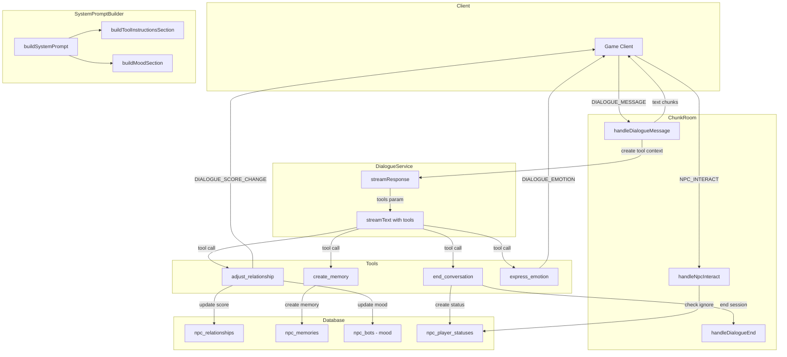
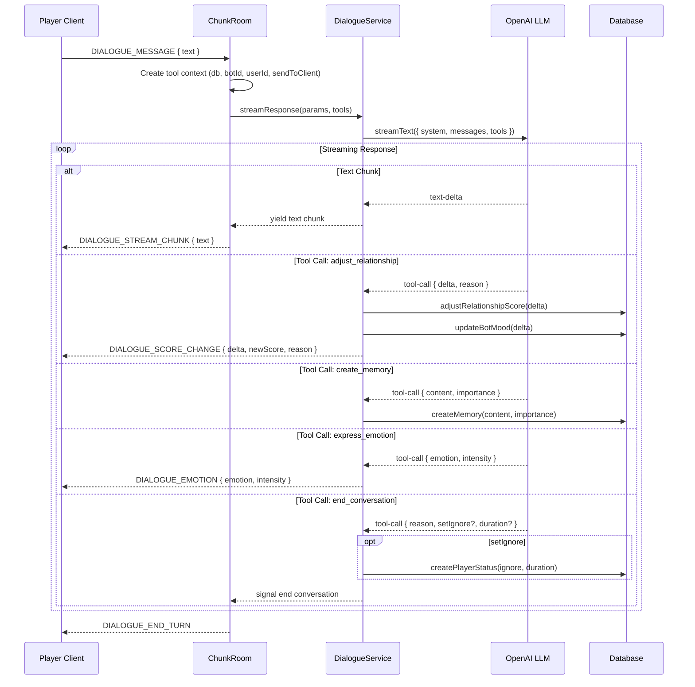

# NPC AI Tools Design Document

## Overview

This feature enables NPCs to autonomously update game state during dialogue by providing AI SDK tools to the LLM via `streamText()`. It replaces the current fixed +2 relationship delta with dynamic, AI-driven scoring through four tools: `adjust_relationship`, `create_memory`, `end_conversation`, and `express_emotion`. Additionally, it introduces NPC mood as a persistent emotional state and status effects (e.g., "ignore") that impose behavioral consequences on players.

## Design Summary (Meta)

```yaml
design_type: "extension"
risk_level: "medium"
complexity_level: "high"
complexity_rationale: >
  (1) ACs require: 4 tool definitions with Zod schemas, mid-stream tool execution
  with DB writes, asymmetric score clamping, NPC mood persistence with lazy decay,
  status effects with expiry-based gating, 2 new server message types, Russian-language
  prompt engineering for tool usage guidance.
  (2) Constraints: tool execution must not break the streaming text pipeline; tool
  errors must be non-fatal; Zod is a new dependency; mood affects cross-player
  interactions; status effect check adds a gate to handleNpcInteract.
main_constraints:
  - "Must integrate with existing streamText() flow without breaking text streaming"
  - "Tool execute functions must be non-throwing (fire-and-forget with error logging)"
  - "All prompts must be in Russian, consistent with SystemPromptBuilder"
  - "Score clamped to [-50, 100] by existing DB service"
  - "Zod is a new dependency that must be added to apps/server"
biggest_risks:
  - "LLM tool call frequency: over-calling adjust_relationship on every turn"
  - "Token budget: tool definitions add ~200 tokens to system prompt"
  - "Mid-stream DB writes: failure must not crash the stream"
  - "Mood decay computation on every dialogue start adds minor latency"
unknowns:
  - "Optimal asymmetric range bounds (-7..+3) need playtesting"
  - "LLM compliance with Russian tool usage instructions"
  - "Mood decay half-life tuning for game feel"
  - "Player perception of AI-driven score changes vs fixed deltas"
```

## Background and Context

### Prerequisite ADRs

- **ADR-0014**: AI Dialogue OpenAI SDK -- Established `streamText()` pattern in DialogueService
- **ADR-0015**: NPC Prompt Architecture -- SystemPromptBuilder section-based prompt composition
- **ADR-0017**: NPC AI Tools and Mood System -- Decision to use AI SDK `tool()` with Zod schemas (this design implements ADR-0017)

### Agreement Checklist

#### Scope
- [x] Add Zod dependency to `apps/server`
- [x] Define 4 AI tools with Zod schemas: `adjust_relationship`, `create_memory`, `end_conversation`, `express_emotion`
- [x] Modify `DialogueService.streamResponse()` to accept and forward tools to `streamText()`
- [x] Handle tool call chunks in the streaming loop alongside text-delta
- [x] Modify `ChunkRoom.handleDialogueMessage()` to create tool context with DB access
- [x] Add tool usage instructions section to `SystemPromptBuilder` in Russian
- [x] Remove fixed `normalDialogue: 2` score delta from `handleDialogueEnd()`
- [x] Add NPC mood columns to `npc_bots` table (mood, mood_intensity, mood_updated_at)
- [x] Add `npc_player_statuses` table for status effects (ignore, etc.)
- [x] Add `DIALOGUE_SCORE_CHANGE` and `DIALOGUE_EMOTION` server messages
- [x] Check for active ignore status in `handleNpcInteract()` before allowing dialogue
- [x] Include mood in prompt context via `SystemPromptBuilder`

#### Non-Scope (Explicitly not changing)
- [x] Client-side UI for displaying emotions or score changes (handled by game client team)
- [x] NPC-to-NPC mood contagion or relationships
- [x] Mood effects on NPC autonomous movement/daily planning
- [x] Quest system integration with tools
- [x] Inventory-based gift system (remains symbolic)
- [x] Player-initiated dialogue actions (give_gift, hire, dismiss, ask_about) -- unchanged

#### Constraints
- [x] Parallel operation: No -- extension of existing dialogue flow
- [x] Backward compatibility: Required -- dialogues without tools must still work (legacy prompt path)
- [x] Performance measurement: Tool execution latency should be logged for monitoring

### Problem to Solve

1. **Unrealistic relationship scoring**: Fixed +2 per dialogue rewards rude players equally
2. **No NPC autonomy**: NPCs cannot react to player behavior with actions (only text)
3. **No emotional persistence**: NPC mood resets between conversations
4. **No behavioral consequences**: Players face no consequences for repeated rudeness
5. **No cross-player effects**: One player's behavior does not affect the NPC's demeanor for others

### Current Challenges

1. `SCORE_DELTAS.normalDialogue = 2` is applied unconditionally in `handleDialogueEnd()` (ChunkRoom.ts:973)
2. `DialogueService.streamResponse()` only processes `textStream` chunks, ignoring tool calls
3. `SystemPromptBuilder` has no section for tool usage guidance
4. `npc_bots` table has no mood-related columns
5. No mechanism to block dialogue initiation based on NPC-player status

### Requirements

#### Functional Requirements

- FR-1: LLM can adjust relationship score during dialogue via `adjust_relationship` tool
- FR-2: LLM can create NPC memories via `create_memory` tool for significant moments
- FR-3: LLM can end the conversation via `end_conversation` tool when offended/tired
- FR-4: LLM can express emotions via `express_emotion` tool for client animation
- FR-5: Relationship score changes are asymmetric: -7..+3 per tool call
- FR-6: Client receives real-time notification when relationship score changes
- FR-7: NPC mood persists across dialogues and is affected by player interactions
- FR-8: NPC mood is visible in the prompt context for all players
- FR-9: NPC can impose "ignore" status on a player, blocking dialogue for a duration
- FR-10: Fixed normalDialogue delta is removed; all scoring is tool-based

#### Non-Functional Requirements

- **Performance**: Tool execution should add < 50ms per tool call (DB write)
- **Scalability**: Status effects table bounded by active player-NPC interactions
- **Reliability**: Tool execution failures must not crash the dialogue stream
- **Maintainability**: Tool definitions are declarative; adding new tools requires only schema + execute function

## Applicable Standards

### Classification Table

| Standard | Type | Source | Impact on Design |
|----------|------|--------|-----------------|
| Prettier: single quotes, 2-space indent | Explicit | `.prettierrc` | All code samples use single quotes |
| ESLint: @nx/enforce-module-boundaries | Explicit | `eslint.config.mjs` | Shared types in `packages/shared`, DB in `packages/db` |
| TypeScript: strict mode, ES2022, bundler resolution | Explicit | `tsconfig.base.json` | All types must be strict-safe, no `any` |
| Jest testing framework | Explicit | `jest.config.ts` / `jest.config.cts` | Unit tests use Jest + AAA pattern |
| Nx inferred targets (no project.json) | Explicit | `nx.json` | No new project.json files |
| Drizzle pgTable schema pattern | Implicit | `packages/db/src/schema/*.ts` | uuid PK, timestamps, `$inferSelect`/`$inferInsert` types |
| DB service pattern: `fn(db: DrizzleClient, ...)` | Implicit | `packages/db/src/services/*.ts` | All DB functions take `db` as first param, errors propagate |
| Colyseus message const objects | Implicit | `packages/shared/src/types/messages.ts` | Add to existing `ClientMessage`/`ServerMessage` objects |
| SystemPromptBuilder section functions | Implicit | `apps/server/src/npc-service/ai/SystemPromptBuilder.ts` | New sections as pure functions, composed in `buildSystemPrompt` |
| ChunkRoom dialogueSessions Map pattern | Implicit | `apps/server/src/rooms/ChunkRoom.ts` | Extend session data structure, follow existing handler patterns |
| Fire-and-forget with error logging | Implicit | `ChunkRoom.ts:826-835`, `ChunkRoom.ts:971-988` | DB writes during dialogue use `.catch()` pattern, never throw |

## Acceptance Criteria (AC) - EARS Format

### AC-1: Tool-Based Relationship Scoring

- [ ] **When** the LLM calls `adjust_relationship` with `delta: 2, reason: "was kind"`, the system shall update the relationship score by +2, evaluate progression, and send `DIALOGUE_SCORE_CHANGE` to the client
- [ ] **When** the LLM calls `adjust_relationship` with `delta: -5, reason: "insulted me"`, the system shall update the relationship score by -5 and send `DIALOGUE_SCORE_CHANGE` to the client
- [ ] **If** the LLM provides a delta outside [-7, +3], **then** the Zod schema shall reject the call and the LLM shall receive a validation error
- [ ] **When** a dialogue session ends, the system shall NOT apply any fixed score delta (normalDialogue removed)
- [ ] **When** the NPC has personality traits (e.g., "добродушный", "недоверчивый"), the tool instructions section shall reference these traits so the LLM calibrates reaction intensity based on character personality

### AC-2: AI-Driven Memory Creation

- [ ] **When** the LLM calls `create_memory` with content and importance, the system shall create an NPC memory record in the database
- [ ] **If** the importance value is outside [1, 10], **then** the Zod schema shall reject the call
- [ ] The system shall link the created memory to the current dialogue session

### AC-3: NPC-Initiated Conversation End

- [ ] **When** the LLM calls `end_conversation` with a reason, the system shall end the dialogue session and send `DIALOGUE_END_TURN` to the client
- [ ] **If** the LLM calls `end_conversation` with `setIgnore: true` and `ignoreDurationMinutes: 30`, **then** the system shall create an ignore status effect expiring in 30 minutes
- [ ] **When** a player tries to start dialogue with an NPC that has an active ignore status for that player, the system shall reject the interaction with a descriptive message

### AC-4: Emotional Expression

- [ ] **When** the LLM calls `express_emotion` with emotion and intensity, the system shall send `DIALOGUE_EMOTION` to the client with the emotion data
- [ ] **If** intensity is outside [1, 5], **then** the Zod schema shall reject the call

### AC-5: NPC Mood Persistence

- [ ] **When** the LLM calls `adjust_relationship` with a negative delta, the system shall worsen the NPC's mood proportionally
- [ ] **When** the LLM calls `adjust_relationship` with a positive delta, the system shall improve the NPC's mood proportionally
- [ ] **While** an NPC has a non-neutral mood, the system shall include the mood in the system prompt for all players' dialogues
- [ ] The system shall decay NPC mood toward neutral over time using a configurable half-life
- [ ] **When** the server restarts, the system shall restore NPC mood from the database

### AC-6: Tool Execution Resilience

- [ ] **If** a tool execution fails (DB write error), **then** the system shall log the error and continue streaming text without interruption
- [ ] **If** the LLM provides invalid tool arguments, **then** the system shall return a validation error to the LLM, allowing it to retry or continue with text

## Existing Codebase Analysis

### Implementation Path Mapping

| Type | Path | Description |
|------|------|-------------|
| Existing | `apps/server/src/npc-service/ai/DialogueService.ts` | streamText() call, text chunk processing |
| Existing | `apps/server/src/npc-service/ai/SystemPromptBuilder.ts` | Section-based prompt builder |
| Existing | `apps/server/src/rooms/ChunkRoom.ts` | Dialogue session management, message handlers |
| Existing | `apps/server/src/npc-service/relationships/RelationshipService.ts` | Score deltas, progression, validation |
| Existing | `packages/db/src/services/npc-relationship.ts` | DB service for relationship CRUD |
| Existing | `packages/db/src/services/npc-memory.ts` | DB service for memory CRUD |
| Existing | `packages/db/src/schema/npc-bots.ts` | NPC bot table schema |
| Existing | `packages/db/src/schema/npc-relationships.ts` | Relationship table schema |
| Existing | `packages/shared/src/types/messages.ts` | Server/Client message constants |
| Existing | `packages/shared/src/types/dialogue.ts` | Dialogue payload types |
| New | `apps/server/src/npc-service/ai/tools/` | Tool definitions directory |
| New | `apps/server/src/npc-service/ai/tools/adjust-relationship.ts` | adjust_relationship tool |
| New | `apps/server/src/npc-service/ai/tools/create-memory.ts` | create_memory tool |
| New | `apps/server/src/npc-service/ai/tools/end-conversation.ts` | end_conversation tool |
| New | `apps/server/src/npc-service/ai/tools/express-emotion.ts` | express_emotion tool |
| New | `apps/server/src/npc-service/ai/tools/index.ts` | Tool factory/context builder |
| New | `packages/db/src/schema/npc-player-statuses.ts` | Status effects table |
| New | `packages/db/src/services/npc-player-status.ts` | Status effects DB service |
| Modified | `packages/db/src/schema/npc-bots.ts` | Add mood columns |
| Modified | `packages/db/src/schema/index.ts` | Export new schema |
| Modified | `packages/db/src/index.ts` | Export new services |
| Modified | `packages/shared/src/types/messages.ts` | Add new server messages |
| Modified | `packages/shared/src/types/dialogue.ts` | Add new payload types |

### Integration Points

- **DialogueService.streamResponse()**: Accept `tools` parameter and forward to `streamText()`
- **ChunkRoom.handleDialogueMessage()**: Create tool execution context, pass to DialogueService
- **ChunkRoom.handleDialogueEnd()**: Remove normalDialogue delta
- **ChunkRoom.handleNpcInteract()**: Add ignore status check
- **SystemPromptBuilder.buildSystemPrompt()**: Add tool instructions section and mood section

### Similar Functionality Search

- **Score adjustment**: `adjustRelationshipScore()` in `packages/db/src/services/npc-relationship.ts:104` -- existing DB service, will be reused by `adjust_relationship` tool
- **Memory creation**: `createMemory()` in `packages/db/src/services/npc-memory.ts:26` -- existing DB service, will be reused by `create_memory` tool
- **Dialogue end**: `handleDialogueEnd()` in `ChunkRoom.ts:942` -- existing handler, will be triggered by `end_conversation` tool
- **No existing mood system**: Searched for `mood`, `emotion`, `sentiment` across the codebase -- none found
- **No existing status effects**: Searched for `status`, `ignore`, `block`, `ban` -- none found

Decision: Reuse existing DB services for score adjustment and memory creation. Create new implementations for mood and status effects.

## Code Inspection Evidence

### What Was Examined

| File Inspected | Key Finding | Design Impact |
|---------------|-------------|---------------|
| `DialogueService.ts:69-79` | `streamText()` call only uses `textStream` property | Must add `fullStream` or `onChunk` to handle tool calls |
| `DialogueService.ts:26-38` | `StreamResponseParams` interface defines all input parameters | Must extend with `tools` parameter |
| `ChunkRoom.ts:899-901` | Stream loop: `for await (const chunk of stream)` yields text chunks | Must change DialogueService to yield both text and tool results |
| `ChunkRoom.ts:971-988` | `normalDialogue` delta applied unconditionally in `handleDialogueEnd` | Must remove this block |
| `ChunkRoom.ts:1203-1371` | `handleNpcInteract` has no status check gate | Must add ignore status check before `botManager.startInteraction()` |
| `SystemPromptBuilder.ts:214-237` | `buildSystemPrompt()` composes sections array | Must add tool instructions section and mood section |
| `npc-relationship.ts:104-114` | `adjustRelationshipScore()` handles delta + clamp | Reuse for tool execution |
| `npc-memory.ts:26-32` | `createMemory()` inserts single record | Reuse for tool execution |
| `npc-bots.ts:22-47` | `npcBots` table has no mood columns | Must add mood, mood_intensity, mood_updated_at columns |
| `messages.ts:13-25` | `ServerMessage` const object pattern | Must add `DIALOGUE_SCORE_CHANGE` and `DIALOGUE_EMOTION` |
| `RelationshipService.ts:17-21` | `SCORE_DELTAS` includes `normalDialogue: 2` | Must remove `normalDialogue` entry |

### Key Findings

1. **Stream processing pattern**: DialogueService yields `string` chunks via async generator. Tool results need a different channel -- either change the generator to yield a union type (text | toolResult) or use callbacks/events.
2. **Fire-and-forget DB pattern**: ChunkRoom consistently uses `.catch()` for non-critical DB writes. Tool executions should follow this pattern.
3. **Section-based prompt composition**: SystemPromptBuilder uses pure functions that return strings. Tool instructions will be another section function.
4. **Existing memory creation via MemoryStream**: The `MemoryStream` class creates memories at dialogue end via LLM summary. The `create_memory` tool creates memories mid-dialogue from NPC's own judgment -- complementary, not duplicative.

### How Findings Influence Design

- DialogueService must be modified to handle tool execution results. Rather than changing the async generator return type, tool side-effects (DB writes, client messages) will be executed within the tool's `execute` function via callbacks provided through closure. The generator continues yielding only text strings.
- The ChunkRoom creates a "tool context" object containing DB client, session data, and a `sendToClient` callback. This context is captured in tool `execute` closures.
- The SystemPromptBuilder receives a new `buildToolInstructionsSection()` function returning Russian text.

## Design

### Change Impact Map

```yaml
Change Target: DialogueService.streamResponse()
Direct Impact:
  - apps/server/src/npc-service/ai/DialogueService.ts (accept tools param, use fullStream)
  - apps/server/src/npc-service/ai/__tests__/DialogueService.spec.ts (test tool forwarding)
Indirect Impact:
  - Token budget slightly increases (~200 tokens for tool schemas)
No Ripple Effect:
  - MemoryStream (still creates post-dialogue memories independently)
  - BotManager (movement/interaction logic unchanged)
  - All other ChunkRoom handlers (move, position_update, hard_reset)

Change Target: ChunkRoom.handleDialogueMessage()
Direct Impact:
  - apps/server/src/rooms/ChunkRoom.ts (create tool context, pass to DialogueService)
Indirect Impact:
  - dialogueSessions Map (may need additional fields for tool state tracking)
No Ripple Effect:
  - handleDialogueAction() (player-initiated actions unchanged)
  - onJoin/onLeave (player lifecycle unchanged)

Change Target: ChunkRoom.handleDialogueEnd()
Direct Impact:
  - apps/server/src/rooms/ChunkRoom.ts (remove normalDialogue delta)
Indirect Impact:
  - Relationship progression evaluation timing (still at dialogue end)
No Ripple Effect:
  - Memory creation at dialogue end (MemoryStream unchanged)

Change Target: SystemPromptBuilder
Direct Impact:
  - apps/server/src/npc-service/ai/SystemPromptBuilder.ts (new sections)
  - apps/server/src/npc-service/ai/__tests__/SystemPromptBuilder.spec.ts (new tests)
Indirect Impact:
  - System prompt token count increases
No Ripple Effect:
  - buildLegacyPrompt (legacy path does not get tools)

Change Target: npc_bots table
Direct Impact:
  - packages/db/src/schema/npc-bots.ts (add mood columns)
  - packages/db/src/services/npc-bot.ts (mood read/update helpers)
  - New migration file
Indirect Impact:
  - ChunkRoom bot initialization (load mood on dialogue start)
No Ripple Effect:
  - BotManager, bot movement, bot spawning

Change Target: New npc_player_statuses table
Direct Impact:
  - packages/db/src/schema/npc-player-statuses.ts (new schema)
  - packages/db/src/services/npc-player-status.ts (new service)
  - New migration file
Indirect Impact:
  - ChunkRoom.handleNpcInteract (status check gate)
No Ripple Effect:
  - Existing relationship system
  - Memory system
```

### Architecture Overview



### Data Flow



### Integration Points List

| Integration Point | Location | Old Implementation | New Implementation | Switching Method |
|-------------------|----------|-------------------|-------------------|------------------|
| streamText() call | `DialogueService.ts:69` | `streamText({ model, system, messages, abortSignal, maxOutputTokens })` | `streamText({ ..., tools })` | Direct modification |
| Stream processing loop | `DialogueService.ts:77-79` | `for await (const chunk of result.textStream)` | `for await (const chunk of result.fullStream)` with chunk type routing | Direct modification |
| Tool context creation | `ChunkRoom.ts:885` | N/A (no tools) | Create `ToolContext` and pass to `streamResponse()` | New parameter |
| normalDialogue delta | `ChunkRoom.ts:971-988` | `relationship.score + SCORE_DELTAS.normalDialogue` | Removed (tools handle scoring) | Delete code block |
| Interact status check | `ChunkRoom.ts:1244` | Direct `botManager.validateInteraction()` | Check ignore status first, then validate | Prepend check |
| System prompt composition | `SystemPromptBuilder.ts:225-233` | No tool instructions | Add `buildToolInstructionsSection()` and `buildMoodSection()` | Append to sections array |

### Main Components

#### Component 1: Tool Definitions (`apps/server/src/npc-service/ai/tools/`)

- **Responsibility**: Define Zod schemas and execute functions for each AI tool
- **Interface**: Each tool exports a factory function: `createTool(context: ToolContext) => Tool`
- **Dependencies**: `zod`, `@nookstead/db` services, `ToolContext` type

#### Component 2: ToolContext (`apps/server/src/npc-service/ai/tools/index.ts`)

- **Responsibility**: Provide tool execute functions with access to DB, session state, and client messaging
- **Interface**:
  ```typescript
  interface ToolContext {
    db: DrizzleClient;
    botId: string;
    userId: string;
    playerName: string;
    sendToClient: (type: string, payload: unknown) => void;
    endConversation: (reason: string) => void;
    persona: SeedPersona | null;
    // Per-turn cumulative delta tracking (F005)
    cumulativeDelta: number; // starts at 0, updated by adjust_relationship
    // Deferred end flag (F004)
    endRequested: boolean;   // set by end_conversation, acted on after all tools complete
  }
  ```
- **Dependencies**: `@nookstead/db`, Colyseus Client

#### Component 3: Mood System (DB schema + prompt integration)

- **Responsibility**: Persist and decay NPC mood, include in prompt context
- **Interface**: `mood: string | null`, `moodIntensity: number`, `moodUpdatedAt: timestamp`
- **Dependencies**: `npc_bots` table, `SystemPromptBuilder`

#### Component 4: Status Effects (`packages/db/src/schema/npc-player-statuses.ts`)

- **Responsibility**: Track time-limited behavioral statuses between NPCs and players
- **Interface**: `hasActiveStatus(db, botId, userId, statusType) => Promise<boolean>`
- **Dependencies**: `npc_bots`, `users` tables

### Contract Definitions

```typescript
// === Tool Context (passed to tool factory functions) ===

interface ToolContext {
  db: DrizzleClient;
  botId: string;
  userId: string;
  playerName: string;
  sendToClient: (type: string, payload: unknown) => void;
  endConversation: (reason: string) => void;
  persona: SeedPersona | null;
  // Per-turn cumulative delta tracking (F005)
  cumulativeDelta: number; // starts at 0, updated by adjust_relationship
  // Deferred end flag (F004)
  endRequested: boolean;   // set by end_conversation, acted on after all tools complete
}

// === Tool Zod Schemas ===

// adjust_relationship
const adjustRelationshipSchema = z.object({
  delta: z.number().int().min(-7).max(3),
  reason: z.string().max(200),
});

// create_memory
const createMemorySchema = z.object({
  content: z.string().min(1).max(500),
  importance: z.number().int().min(1).max(10),
});

// end_conversation
const endConversationSchema = z.object({
  reason: z.string().min(1).max(200),
  setIgnore: z.boolean().optional().default(false),
  ignoreDurationMinutes: z.number().int().min(5).max(1440).optional().default(60),
});

// express_emotion
const expressEmotionSchema = z.object({
  emotion: z.enum([
    'happy', 'sad', 'angry', 'surprised',
    'disgusted', 'fearful', 'neutral', 'amused',
    'grateful', 'annoyed', 'shy', 'proud',
  ]),
  intensity: z.number().int().min(1).max(5),
});

// === New Server Messages ===

// Added to ServerMessage const:
DIALOGUE_SCORE_CHANGE: 'dialogue_score_change'
DIALOGUE_EMOTION: 'dialogue_emotion'

// === New Payload Types ===

interface DialogueScoreChangePayload {
  delta: number;
  newScore: number;
  reason: string;
  newSocialType: RelationshipSocialType;
}

interface DialogueEmotionPayload {
  emotion: string;
  intensity: number;
}

// === NPC Player Status Schema ===

// npc_player_statuses table
{
  id: uuid PK,
  botId: uuid FK -> npc_bots.id,
  userId: uuid FK -> users.id,
  status: varchar(32) NOT NULL,  // 'ignore', future: 'angry', etc.
  reason: text,
  expiresAt: timestamp with timezone NOT NULL,
  createdAt: timestamp with timezone NOT NULL DEFAULT now(),
  updatedAt: timestamp with timezone NOT NULL DEFAULT now(),
}
// Index: idx_npc_player_statuses_bot_user_status ON (botId, userId, status)

// === Mood Columns on npc_bots ===

{
  mood: varchar(32),  // null = neutral
  moodIntensity: smallint DEFAULT 0,  // 0-10
  moodUpdatedAt: timestamp with timezone,
}
```

### Data Contract

#### adjust_relationship Tool

```yaml
Input:
  Type: "{ delta: number, reason: string }"
  Preconditions: "delta is integer in [-7, 3], reason is non-empty string <= 200 chars"
  Validation: "Zod schema enforced by AI SDK before execute()"

Output:
  Type: "string (tool result message for LLM)"
  Guarantees: "Score is clamped to [-50, 100]; progression is evaluated"
  On Error: "Returns error string to LLM; logs error; does not throw"

Side Effects:
  - Updates npc_relationships.score
  - Updates npc_relationships.socialType (if threshold crossed)
  - Updates npc_bots.mood and npc_bots.moodIntensity
  - Sends DIALOGUE_SCORE_CHANGE to client

Invariants:
  - Score always within [-50, 100] after update
  - Mood intensity always within [0, 10]
  - Per-turn cumulative delta cap: max cumulative -10/+5 per dialogue turn.
    Enforced in the execute function by tracking cumulative delta on the
    ToolContext per stream iteration. If the cap would be exceeded, the
    tool returns an error string to the LLM (e.g., "Score adjustment limit
    reached for this turn") and skips the DB write.
```

#### create_memory Tool

```yaml
Input:
  Type: "{ content: string, importance: number }"
  Preconditions: "content is non-empty string <= 500 chars, importance is integer in [1, 10]"
  Validation: "Zod schema enforced by AI SDK"

Output:
  Type: "string (confirmation message for LLM)"
  Guarantees: "Memory is created with type 'tool' and linked to current dialogue session"
  On Error: "Returns error string to LLM; logs error; does not throw"

Side Effects:
  - Inserts row in npc_memories table

Invariants:
  - Memory count per NPC may exceed maxMemoriesPerNpc (cleanup at dialogue end, not per-tool-call)
```

#### end_conversation Tool

```yaml
Input:
  Type: "{ reason: string, setIgnore?: boolean, ignoreDurationMinutes?: number }"
  Preconditions: "reason is non-empty string (min 1 char, max 200 chars), ignoreDurationMinutes in [5, 1440] (defaults to 60 if omitted when setIgnore is true)"
  Validation: "Zod schema enforced by AI SDK"

Output:
  Type: "string (farewell message for LLM)"
  Guarantees: "Dialogue session is ended; ignore status created if requested"
  On Error: "Returns error string to LLM; logs error; does not throw"

Side Effects:
  - Signals ChunkRoom to end dialogue session
  - Optionally creates npc_player_statuses row with expiry
```

#### express_emotion Tool

```yaml
Input:
  Type: "{ emotion: string, intensity: number }"
  Preconditions: "emotion is one of defined enum values, intensity is integer in [1, 5]"
  Validation: "Zod schema enforced by AI SDK"

Output:
  Type: "string (confirmation for LLM)"
  Guarantees: "Emotion event sent to client"
  On Error: "Returns error string; logs; does not throw"

Side Effects:
  - Sends DIALOGUE_EMOTION to client
```

### Data Representation Decisions

| Data Structure | Decision | Rationale |
|---|---|---|
| ToolContext | **New** dedicated interface | No existing type matches; combines DB client, session state, and client messaging in a tool-specific context |
| DialogueScoreChangePayload | **New** dedicated type | No existing payload type carries score delta + reason; distinct from DialogueActionResult which is player-initiated |
| DialogueEmotionPayload | **New** dedicated type | No existing emotion type; simple and self-contained |
| NPC mood | **Extend** existing `npc_bots` table | Mood is intrinsic to the NPC entity; adding columns avoids a join for every prompt build |
| Status effects | **New** `npc_player_statuses` table | Represents a temporal NPC-player relationship state distinct from the permanent relationship; requires its own lifecycle (expiry, cleanup) |
| Tool Zod schemas | **New** per-tool files | No existing Zod usage in project; each tool is self-contained |

### State Transitions and Invariants

```yaml
# NPC Mood State Machine
State Definition:
  - Initial State: mood=null (neutral), moodIntensity=0
  - Possible States: [null/neutral, happy, sad, angry, annoyed, grateful, anxious]

State Transitions:
  neutral → happy:    adjust_relationship called with positive delta
  neutral → angry:    adjust_relationship called with large negative delta (-5 to -7)
  neutral → annoyed:  adjust_relationship called with small negative delta (-1 to -4)
  happy → neutral:    time decay (half-life)
  angry → annoyed:    time decay (half-life)
  annoyed → neutral:  time decay (half-life) OR positive interaction
  any → any:          mood direction changes based on cumulative interactions

Mood Decay:
  - Computed on read (lazy): decayedIntensity = storedIntensity * 2^(-elapsedHours / halfLifeHours)
  - If decayedIntensity < 1, mood resets to null (neutral)
  - Default halfLifeHours: 2.0 (game time, not real time)
  - Mood is NOT updated in DB on every read; only when a new tool call modifies it

System Invariants:
  - moodIntensity is always in [0, 10]
  - mood is null when moodIntensity is 0
  - Mood decay never makes intensity negative

# Status Effect State Machine
State Definition:
  - Initial State: no status
  - Possible States: [none, ignore]

State Transitions:
  none → ignore:    end_conversation tool called with setIgnore=true
  ignore → none:    expiresAt reached (checked on interaction attempt)

System Invariants:
  - Only one active status of each type per (botId, userId) pair
  - expiresAt is always in the future at creation time
  - Expired statuses are treated as non-existent (checked via WHERE expiresAt > NOW())
```

### Integration Point Map

```yaml
Integration Point 1:
  Existing Component: DialogueService.streamResponse()
  Integration Method: Add optional 'tools' parameter to StreamResponseParams
  Impact Level: High (Process Flow Change)
  Required Test Coverage: Verify text streaming works with and without tools; verify tool calls trigger execute functions

Integration Point 2:
  Existing Component: ChunkRoom.handleDialogueMessage()
  Integration Method: Create ToolContext before calling streamResponse, pass as new param
  Impact Level: High (Process Flow Change)
  Required Test Coverage: Verify tool context creation; verify tool side effects (DB writes, client messages)

Integration Point 3:
  Existing Component: ChunkRoom.handleDialogueEnd()
  Integration Method: Remove normalDialogue delta block
  Impact Level: Medium (Data Usage)
  Required Test Coverage: Verify no score change at dialogue end; verify progression still evaluated

Integration Point 4:
  Existing Component: ChunkRoom.handleNpcInteract()
  Integration Method: Add status check before botManager.startInteraction()
  Impact Level: Medium (Data Usage)
  Required Test Coverage: Verify interaction blocked when ignore status active; verify normal interaction when no status

Integration Point 5:
  Existing Component: SystemPromptBuilder.buildSystemPrompt()
  Integration Method: Add buildToolInstructionsSection() and buildMoodSection() to sections array
  Impact Level: Low (Read-Only addition)
  Required Test Coverage: Verify prompt includes tool instructions; verify prompt includes mood when present
```

### Integration Boundary Contracts

```yaml
Boundary Name: DialogueService <-> ChunkRoom
  Input: StreamResponseParams with optional tools map
  Output: AsyncGenerator<string> (text chunks only; tool side effects happen internally via callbacks)
  On Error: Generator yields fallback message '*shrugs*'; tool errors logged and swallowed

Boundary Name: ToolContext <-> Tool Execute Functions
  Input: ToolContext object (db, ids, sendToClient callback)
  Output: string result returned to LLM
  On Error: Catch all errors in execute(), return error string to LLM, log with full context

Boundary Name: ChunkRoom <-> npc_player_statuses DB
  Input: botId, userId (sync query)
  Output: boolean (has active ignore status)
  On Error: Log warning, allow interaction (fail-open for status checks)

Boundary Name: SystemPromptBuilder <-> Mood Data
  Input: mood string | null, moodIntensity number, moodUpdatedAt Date
  Output: Russian text section describing NPC's current mood (empty string if neutral)
  On Error: N/A (pure function, no side effects)
```

### Field Propagation Map

```yaml
fields:
  - name: "delta (relationship score change)"
    origin: "LLM tool call (adjust_relationship)"
    transformations:
      - layer: "AI SDK Tool Layer"
        type: "z.number().int().min(-7).max(3)"
        validation: "Zod schema: integer, range [-7, 3]"
      - layer: "Tool Execute Function"
        type: "number"
        transformation: "Passed directly to adjustRelationshipScore()"
      - layer: "DB Service (npc-relationship.ts)"
        type: "number"
        transformation: "Added to current score, then clamped to [-50, 100]"
      - layer: "Client Message (DIALOGUE_SCORE_CHANGE)"
        type: "DialogueScoreChangePayload.delta"
        transformation: "Original delta value, unchanged"
    destination: "npc_relationships.score (DB) + Client UI"
    loss_risk: "none"

  - name: "mood (NPC emotional state)"
    origin: "Derived from adjust_relationship tool calls"
    transformations:
      - layer: "Tool Execute Function"
        type: "{ mood: string, intensity: number }"
        transformation: "Computed from delta direction and magnitude"
      - layer: "DB Layer (npc_bots)"
        type: "varchar(32) + smallint"
        transformation: "Stored as mood column and mood_intensity column"
      - layer: "SystemPromptBuilder"
        type: "string (Russian text)"
        transformation: "Decay applied on read; intensity < 1 treated as neutral"
    destination: "System prompt for all player dialogues"
    loss_risk: "low"
    loss_risk_reason: "Lazy decay computation may show slightly stale mood if DB update races with prompt build"

  - name: "ignore status"
    origin: "LLM tool call (end_conversation with setIgnore=true)"
    transformations:
      - layer: "Tool Execute Function"
        type: "{ status: 'ignore', expiresAt: Date }"
        transformation: "Duration minutes converted to absolute timestamp"
      - layer: "DB Layer (npc_player_statuses)"
        type: "row with expiresAt"
        transformation: "Stored with absolute expiry timestamp"
      - layer: "ChunkRoom.handleNpcInteract()"
        type: "boolean"
        transformation: "Query WHERE expiresAt > NOW(); true = blocked"
    destination: "Interaction gate in handleNpcInteract"
    loss_risk: "none"

  - name: "emotion (NPC expression)"
    origin: "LLM tool call (express_emotion)"
    transformations:
      - layer: "AI SDK Tool Layer"
        type: "z.enum([...emotions])"
        validation: "Zod schema: enum of valid emotions"
      - layer: "Tool Execute Function"
        type: "{ emotion: string, intensity: number }"
        transformation: "Passed directly to client message"
      - layer: "Client Message (DIALOGUE_EMOTION)"
        type: "DialogueEmotionPayload"
        transformation: "No transformation"
    destination: "Client UI for animation/display"
    loss_risk: "none"
```

### Interface Change Impact Analysis

| Existing Operation | New Operation | Conversion Required | Adapter Required | Compatibility Method |
|-------------------|---------------|-------------------|------------------|---------------------|
| `streamResponse(params: StreamResponseParams)` | `streamResponse(params: StreamResponseParams)` with optional `tools` field | No | No | `tools` field is optional; omitting it preserves old behavior |
| `streamText({ model, system, messages, ... })` | `streamText({ ..., tools })` | No | No | `tools` parameter is optional in AI SDK |
| `for await (chunk of result.textStream)` | `for await (chunk of result.fullStream)` | Yes | No | Switch to `fullStream`, filter by `chunk.type` |
| `SCORE_DELTAS.normalDialogue` | (removed) | Yes | No | Delete constant and usage |
| `handleDialogueEnd() { ... score + SCORE_DELTAS.normalDialogue ... }` | `handleDialogueEnd() { ... /* no fixed delta */ ... }` | Yes | No | Delete score delta block |
| `handleNpcInteract() { ... validateInteraction() ... }` | `handleNpcInteract() { ... checkIgnoreStatus() ... validateInteraction() ... }` | No | No | Prepend status check |
| `buildSystemPrompt(context)` | `buildSystemPrompt(context)` with mood in context | No | No | `mood` fields are optional in PromptContext |

### Error Handling

1. **Tool execution DB failure**: Each tool's `execute` function wraps all operations in try/catch. On failure, log the error with full context (botId, userId, tool name, input), return an error string to the LLM (e.g., "Failed to update relationship"), and continue streaming.

2. **Invalid tool arguments (Zod validation)**: AI SDK automatically validates tool inputs against Zod schemas. Invalid inputs are returned to the LLM as validation errors, allowing it to retry with correct arguments or continue with text.

3. **Tool call during aborted stream**: If the abort signal fires during tool execution, the execute function catches the abort error and returns early. The DB operation may or may not complete (fire-and-forget is acceptable for score/mood updates).

4. **Status check failure in handleNpcInteract**: If the status query fails, log a warning and allow the interaction (fail-open). A failed status check should not prevent players from talking to NPCs.

5. **Mood decay computation error**: Mood decay is a pure computation (no DB call on read). If inputs are invalid (null timestamps), default to neutral mood.

6. **end_conversation ordering with concurrent tools**: If `end_conversation` is called alongside other tools in the same LLM response, it must be processed last. The `endConversation` callback should set a flag on the session (e.g., `session.endRequested = true`); actual session cleanup occurs only after all tool executions in the current stream iteration complete. This prevents a race where the session is torn down while other tool execute functions (e.g., `adjust_relationship`, `create_memory`) are still writing to the database.

### Logging and Monitoring

```
[DialogueService] Tool executed: tool=adjust_relationship, botId={id}, delta={n}, result={ok|error}
[DialogueService] Tool executed: tool=create_memory, botId={id}, importance={n}, result={ok|error}
[DialogueService] Tool executed: tool=end_conversation, botId={id}, setIgnore={bool}, result={ok|error}
[DialogueService] Tool executed: tool=express_emotion, botId={id}, emotion={e}, result={ok|error}
[ChunkRoom] Ignore status check: botId={id}, userId={id}, blocked={bool}
[ChunkRoom] Mood loaded: botId={id}, mood={mood}, intensity={n}, decayed={n}
```

### Prompt Engineering: Tool Usage Instructions (Russian)

New section added to `SystemPromptBuilder`:

```
ИНСТРУМЕНТЫ

У тебя есть специальные действия, которые ты можешь выполнять во время разговора.
Используй их ТОЛЬКО когда это естественно и уместно.

ВАЖНО: Реагируй в соответствии со своим характером.
- Если ты по натуре добродушный и отходчивый — прощай быстрее, давай маленькие штрафы за грубость, легче восстанавливай отношения.
- Если ты недоверчивый или замкнутый — медленно подпускай к себе, давай маленькие бонусы за доброту, но большие штрафы за предательство доверия.
- Если ты вспыльчивый — реагируй резко на грубость, но и отходи быстро.
- Если ты гордый — не терпи неуважения, помни обиды дольше.
Твои черты характера определяют, как именно ты используешь инструменты. Будь последователен — реагируй так, как реагировал бы живой человек с твоим характером.

adjust_relationship — Измени отношение к собеседнику.
- Используй при: комплиментах (+1..+2), помощи (+2..+3), оскорблениях (-3..-5), угрозах (-5..-7), обычной вежливости (+1).
- НЕ используй каждую реплику. Только при значимых моментах.
- Положительные изменения должны быть маленькими (+1..+3). Доверие зарабатывается медленно.
- Отрицательные изменения могут быть большими (-1..-7). Доверие теряется быстро.
- Учитывай свой характер: отходчивый персонаж даёт -1..-3 за грубость, злопамятный — -4..-7.

create_memory — Запомни важный момент.
- Используй только для значимых событий: признания, секреты, обещания, оскорбления.
- НЕ запоминай каждую реплику. Только то, что действительно важно.
- Запоминай обиды и добрые дела — это влияет на будущие разговоры.

end_conversation — Заверши разговор.
- Используй при: грубых оскорблениях, угрозах, если ты устал(а) от разговора.
- Можешь игнорировать собеседника (setIgnore) если он был особенно груб.
- Длительность игнорирования зависит от твоего характера: отходчивый — 5-15 минут, обидчивый — 30-120 минут.

express_emotion — Покажи свои эмоции.
- Используй для сильных эмоциональных реакций: радость, гнев, удивление, грусть.
- НЕ используй для обычных нейтральных реплик.
- Твой характер определяет интенсивность: сдержанный — 1-2, эмоциональный — 3-5.
```

Note: The `buildToolInstructionsSection()` function should dynamically reference the NPC's
personality traits from `PromptContext.persona.traits` and `persona.personality`. The section
above is the template; the implementation should prepend the NPC's actual trait list before
the "ВАЖНО" block so the LLM has explicit traits to calibrate against. Example:

```
Твой характер: добродушный, отходчивый, доверчивый.
```

This line is already generated by `buildIdentitySection()` via `capTraits()`, so the tool
instructions section can reference "свой характер" knowing the traits are visible earlier
in the prompt. No duplication needed — the LLM has full context.

## Implementation Plan

### Implementation Approach

**Selected Approach**: Vertical Slice (Feature-driven)
**Selection Reason**: Each tool is a self-contained feature unit (schema + execute + prompt + test) that delivers value independently. The mood and status systems have clear vertical boundaries. Dependencies between tools are minimal -- they share only the `ToolContext` interface.

### Technical Dependencies and Implementation Order

#### Required Implementation Order

1. **Zod Dependency + Tool Infrastructure**
   - Technical Reason: All tool definitions depend on Zod; ToolContext type is shared by all tools
   - Dependent Elements: All 4 tools, DialogueService modification

2. **DB Schema Changes (mood columns + status effects table)**
   - Technical Reason: Tool execute functions need these tables; migration must run before service code
   - Dependent Elements: adjust_relationship (mood), end_conversation (status), handleNpcInteract (status check)
   - Prerequisites: Zod dependency (for service types)

3. **Tool Definitions (all 4 tools)**
   - Technical Reason: Self-contained units with Zod schemas and execute functions
   - Prerequisites: ToolContext type, DB services

4. **DialogueService Modification**
   - Technical Reason: Must accept tools param and process fullStream
   - Prerequisites: Tool definitions exist to pass

5. **ChunkRoom Integration**
   - Technical Reason: Creates ToolContext, passes to DialogueService, handles tool side effects
   - Prerequisites: DialogueService accepts tools, DB services ready

6. **SystemPromptBuilder Updates**
   - Technical Reason: Tool instructions and mood sections needed for LLM to use tools
   - Prerequisites: Mood data structure defined

7. **Remove normalDialogue Delta**
   - Technical Reason: Must be last to avoid gap where neither fixed nor tool-based scoring is active
   - Prerequisites: Tool-based scoring is verified working

### Integration Points

**Integration Point 1: Tool Infrastructure -> DialogueService**
- Components: Tool definitions -> DialogueService.streamResponse()
- Verification: Unit test: streamResponse forwards tools to streamText; tool execute functions are called

**Integration Point 2: DialogueService -> ChunkRoom**
- Components: DialogueService -> ChunkRoom.handleDialogueMessage()
- Verification: Integration test: full dialogue turn with tool calls produces correct DB writes and client messages

**Integration Point 3: Status Effects -> handleNpcInteract**
- Components: npc_player_statuses -> ChunkRoom.handleNpcInteract()
- Verification: Unit test: interaction blocked when active ignore status exists

**Integration Point 4: Mood -> SystemPromptBuilder**
- Components: npc_bots.mood -> buildMoodSection()
- Verification: Unit test: prompt contains mood text when mood is non-null

### Migration Strategy

1. **Database migration**: Add mood columns to `npc_bots` (nullable, no breaking change). Create `npc_player_statuses` table. Both are additive -- no existing data affected.
2. **Code deployment**: New code is backward compatible. If tools are not provided, DialogueService works as before. If mood columns are null, prompt omits mood section.
3. **Rollback**: Remove tools from ChunkRoom tool context creation. Re-add normalDialogue delta. Mood columns and status table can remain (no harm if unused).

## Test Strategy

### Basic Test Design Policy

- Each acceptance criterion maps to at least one test case
- Tool execute functions are tested in isolation with mock DB
- Integration tests verify the full chain: tool call -> DB write -> client message

### Unit Tests

1. **Tool Zod schema validation**: Verify valid/invalid inputs for each tool schema
2. **Tool execute functions**: Mock DB, verify correct service calls, verify return strings
3. **buildToolInstructionsSection()**: Verify Russian text output
4. **buildMoodSection()**: Verify mood text with various intensities, verify decay computation
5. **Mood decay computation**: Verify half-life math, boundary conditions
6. **Status check helper**: Verify active/expired/missing status queries
7. **evaluateProgression with tool-based scores**: Verify threshold transitions still work

### Integration Tests

1. **DialogueService with tools**: Mock streamText to emit tool-call chunks, verify execute functions are invoked
2. **handleDialogueEnd without normalDialogue**: Verify no fixed delta is applied
3. **handleNpcInteract with ignore status**: Mock DB to return active status, verify rejection

### E2E Tests

1. **Full dialogue with tool calls**: Player sends message, LLM calls adjust_relationship, client receives DIALOGUE_SCORE_CHANGE
2. **Ignore flow**: Player offends NPC, NPC calls end_conversation with setIgnore, player attempts re-interaction and is blocked

### Performance Tests

Not required for Phase 0. Tool execution latency will be monitored via logging.

## Security Considerations

- **Score manipulation**: Zod schema clamps delta to [-7, +3]. DB service clamps total to [-50, 100]. Double protection against LLM producing extreme values.
- **Ignore duration**: Clamped to [5, 1440] minutes by Zod schema. Prevents permanent bans.
- **Memory content**: Tool-created memories use the same content field as existing memories. No special sanitization needed beyond the 500-char max.
- **Prompt injection via tool arguments**: Zod validates types strictly. String arguments (reason, content) are stored in DB, not re-injected into prompts (except memories, which follow existing memory retrieval flow).

## Future Extensibility

- **New tools**: Adding tools (e.g., `give_quest`, `trade_item`, `share_rumor`) requires only: new tool file with Zod schema + execute function, add to tool factory, add prompt instructions.
- **Tool analytics**: Tool call frequency and delta distribution can be logged for game balance tuning.
- **Mood complexity**: Mood could evolve into a multi-dimensional state (valence + arousal) if needed.
- **Status effect types**: Beyond "ignore", statuses like "afraid" (NPC cowers), "excited" (NPC seeks player) can be added.

## Alternative Solutions

### Alternative 1: Mood as Separate Table

- **Overview**: Store mood in a dedicated `npc_moods` table instead of columns on `npc_bots`
- **Advantages**: Cleaner separation of concerns; can track mood history
- **Disadvantages**: Requires JOIN on every prompt build; more complex queries; mood is intrinsically a property of the NPC entity
- **Reason for Rejection**: Mood is a single-value property of the NPC that changes frequently. Adding columns to `npc_bots` is simpler and avoids JOINs.

### Alternative 2: Client-Side Emotion Display via Text Parsing

- **Overview**: Instead of DIALOGUE_EMOTION messages, parse asterisk actions (`*smiles*`) from NPC text
- **Advantages**: No new message type; NPC text already contains action markers
- **Disadvantages**: Fragile parsing; conflates text content with system signals; cannot convey intensity; couples animation to text format
- **Reason for Rejection**: Explicit tool calls provide structured, reliable emotion data separate from text content.

## Risks and Mitigation

| Risk | Impact | Probability | Mitigation |
|------|--------|-------------|------------|
| LLM over-uses adjust_relationship (every turn) | Medium | Medium | Prompt instructs "only significant moments"; monitor call frequency; can add per-session call limit |
| Tool execution latency slows dialogue | High | Low | Fire-and-forget pattern; DB writes are single-row operations (~5ms) |
| Zod dependency conflicts with other packages | Low | Low | Zod is widely used, no known conflicts with AI SDK |
| Mood decay math produces unexpected values | Medium | Low | Unit test edge cases; clamp intensity to [0, 10] |
| Players exploit AI to always get positive scores | Medium | Medium | Asymmetric range (-7..+3) makes manipulation harder; monitor score distributions |
| Token budget exceeded with tool definitions | Medium | Low | Tool schemas add ~200 tokens; current budget has margin; monitor total prompt size |

## References

- [AI SDK Foundations: Tools](https://ai-sdk.dev/docs/foundations/tools) - Tool definition patterns and Zod schema integration
- [AI SDK Core: streamText](https://ai-sdk.dev/docs/reference/ai-sdk-core/stream-text) - streamText API reference including tools parameter
- [AI SDK Core: Tool Calling](https://ai-sdk.dev/docs/ai-sdk-core/tools-and-tool-calling) - Tool calling patterns and multi-step execution
- [Vercel AI SDK v6 Release](https://vercel.com/blog/ai-sdk-6) - AI SDK v6 features including tool improvements
- [Vercel Academy: Tool Use](https://vercel.com/academy/ai-sdk/tool-use) - Tool use tutorial and best practices

## Update History

| Date | Version | Changes | Author |
|------|---------|---------|--------|
| 2026-03-15 | 1.0 | Initial version | AI Technical Designer |
| 2026-03-15 | 1.1 | Review fixes: I001 (min(1) on endConversation reason), I002/I006 (composite index on npc_player_statuses), I003 (updatedAt column on npc_player_statuses), I004 (default(60) on ignoreDurationMinutes), F004 (end_conversation deferred processing order), F005 (per-turn cumulative delta cap -10/+5) | AI Technical Designer |
