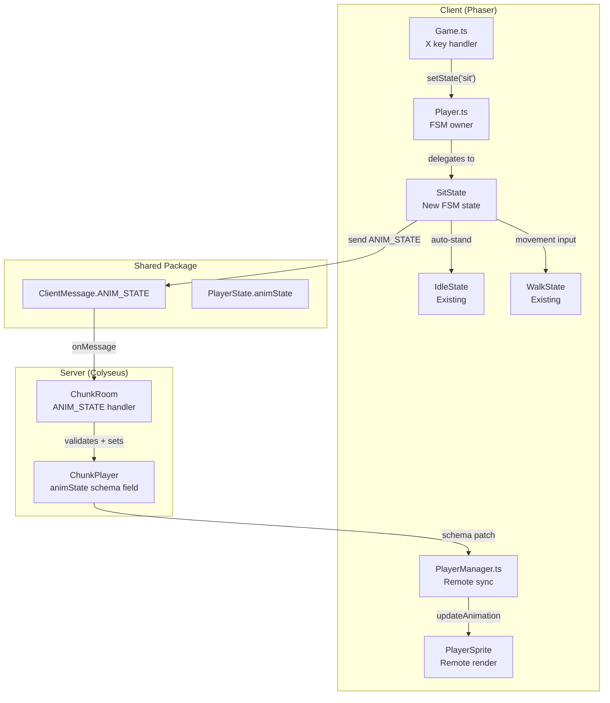
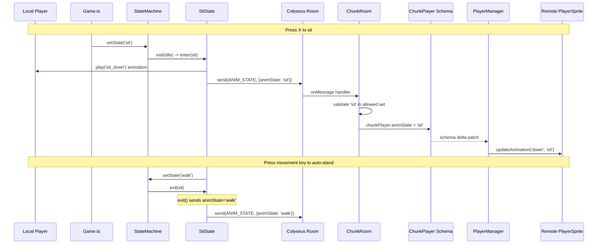
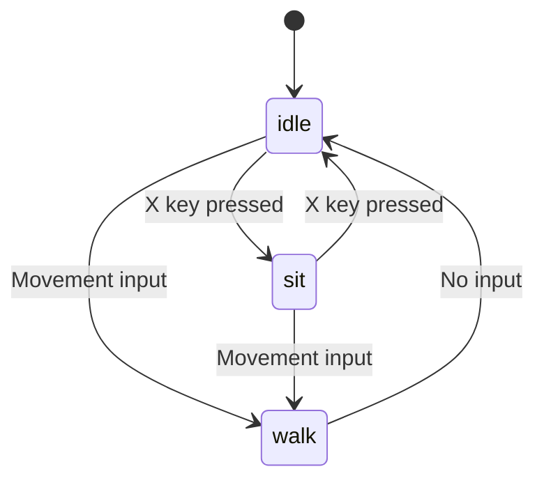
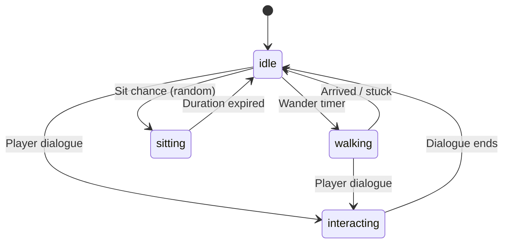

# Player Sit Action Design Document

## Overview

Add a sit action for the player character triggered by the X key. Sitting is a toggle with auto-stand: press X while idle to sit, press X again or any movement input to stand. The sit animation is visible to all players in multiplayer via a new `animState` field on the `ChunkPlayer` Colyseus schema, as decided in ADR-0019.

Additionally, NPC bots can sit autonomously during idle periods. After being idle for a random duration, a bot may transition to a sitting state, sit for a random period, then stand back up. Bot sit animations are visible to all clients via the existing `ChunkBot.state` schema field.

## Design Summary (Meta)

```yaml
design_type: "new_feature"
risk_level: "low"
complexity_level: "medium"
complexity_rationale: >
  (1) AC-1 through AC-7 require a new FSM state with bidirectional transitions
  (idle <-> sit) and auto-stand on movement input from three sources (keyboard,
  click-to-move, waypoints). AC-8/AC-9/AC-12 require schema-level multiplayer
  sync across client and server. (2) The sit state must block movement while
  seated and correctly gate X key input against text focus and movement lock,
  introducing cross-concern coordination between InputController, dialogue-lock,
  and the new state. (3) AC-13 through AC-17 extend the bot state machine with
  a sitting state, random sit chance during idle, and duration tracking.
main_constraints:
  - "Must follow existing FSM State pattern (PlayerContext, enter/update/exit)"
  - "Must use schema-based sync per ADR-0019 (not message-based)"
  - "X key must respect text input focus (isTextInputFocused)"
  - "Sit animation is play-once (repeat: 0), final frame must be held"
  - "Bot sit must follow existing BotManager state machine pattern (tickBot/tickIdle)"
  - "Bot sit animation must use existing ChunkBot.state schema sync (no new message types)"
biggest_risks:
  - "Remote player animation may flicker if animState and direction schema patches arrive in different ticks"
  - "Sit animation final frame retention depends on Phaser not auto-reverting to frame 0 after play-once completes"
  - "Bot sit randomness may cluster (multiple bots sitting simultaneously) -- mitigated by independent per-bot timers"
unknowns: []
  # Resolved: Dedicated ANIM_STATE message selected over extending POSITION_UPDATE
  # (see Alternative Solutions section and Contract Definitions)
```

## Background and Context

### Prerequisite ADRs

- **ADR-0019: Player Animation State Synchronization** (Accepted) -- Decided to add `@type('string') animState` to `ChunkPlayer` schema for multiplayer animation state sync. Schema-based sync matches the existing `ChunkBot.state` pattern.
- **ADR-0006: Chunk-Based Room Architecture** -- Established the ChunkRoom/ChunkPlayer schema structure.
- **ADR-0013: NPC Bot Entity Architecture** -- Established `ChunkBot.state` schema pattern that this design mirrors for players.

### Agreement Checklist

#### Scope
- [x] New `SitState` FSM state class with enter/update/exit lifecycle
- [x] X key registration in Game.ts scene, sit toggle trigger in update loop
- [x] `animState` field added to `ChunkPlayer` Colyseus schema
- [x] `ANIM_STATE` message added to `ClientMessage` enum in shared package
- [x] Server-side `ANIM_STATE` message handler with validation
- [x] `PlayerManager.ts` reads `player.animState` from schema instead of deriving from position deltas
- [x] `animState` field added to `PlayerState` interface in shared package
- [x] `BotAnimState` extended with `'sitting'` value in shared package
- [x] `BotManager.ts` sit logic: random sit chance during idle, sit duration tracking, `sitting -> idle` transition
- [x] `ServerBot` interface extended with `sitTicks` field for sit duration tracking
- [x] `PlayerManager.ts` bot animation mapping updated: `'sitting'` -> `'sit'` animation key

#### Non-Scope (Explicitly not changing)
- [x] No furniture interaction -- sit anywhere (emote-style)
- [x] No changes to existing `IdleState` or `WalkState` logic beyond adding sit-related transitions
- [x] No changes to `frame-map.ts` -- sit animation is already defined (row 4, 3 frames, repeat: 0)
- [x] No changes to `InputController.ts` -- X key handling is separate from WASD/arrow input
- [x] No chat command alternative (X key only)
- [x] No bot sit during interaction/dialogue (sitting blocked while bot is in interacting state)

#### Constraints
- [x] Parallel operation: No (clean addition, no migration needed)
- [x] Backward compatibility: Not required (schema addition is additive, old clients without animState reading will simply ignore it)
- [x] Performance measurement: Not required (animation state changes are infrequent, at most a few per second)

#### Design Reflection
- All scope items are reflected in the technical design sections below.
- No design contradicts the agreements above.

### Problem to Solve

Players currently have no way to perform non-movement actions visible to other players. The multiplayer system derives remote player animation purely from position deltas, which fundamentally cannot represent stationary animations like sitting. ADR-0019 established the mechanism (schema-based `animState` sync); this design doc defines the first consumer of that mechanism: the sit action.

### Current Challenges

1. The `sit` state in the FSM is a placeholder created via `createPlaceholderState('sit')` -- it plays the sit animation on enter but has no update logic, no exit logic, and no input handling.
2. Remote players cannot see any non-movement animation because `PlayerManager.ts` derives animation state from position deltas only.
3. There is no X key registered in the game scene -- only E (interact) is currently registered.
4. The `ChunkPlayer` schema has no `animState` field.
5. `ClientMessage` has no `ANIM_STATE` entry.

### Requirements

#### Functional Requirements

- FR-1: Player can toggle sit on/off with the X key
- FR-2: Movement input (WASD/arrows/click-to-move) auto-stands the player
- FR-3: Sit blocks all position changes while active
- FR-4: Remote players see the sit animation via schema sync
- FR-5: X key is suppressed during text input focus and movement lock (dialogue)
- FR-6: Server validates `animState` values, rejecting unknown strings
- FR-7: Bots can autonomously transition to sitting during idle state
- FR-8: Bots auto-stand after a random sitting duration
- FR-9: Bots do not sit during interaction/dialogue state
- FR-10: Bot sit animation is visible to all clients via schema sync

#### Non-Functional Requirements

- **Performance**: Animation state changes are at most a few per second per player; schema patch overhead is negligible.
- **Scalability**: One string field per player per room; well within Colyseus schema limits (8 of 64 fields used after addition).
- **Reliability**: Late-joining players see correct animation state automatically via full state sync.
- **Maintainability**: Follows established FSM `State` interface pattern; new state is a single file with focused responsibility.

## Applicable Standards

### Classification Table

| Standard | Type | Source | Impact on Design |
|----------|------|--------|-----------------|
| Prettier: single quotes | Explicit | `.prettierrc` | All new code uses single quotes |
| ESLint: flat config with Nx plugin | Explicit | `eslint.config.mjs` | New files must pass ESLint |
| TypeScript: strict mode | Explicit | `tsconfig.base.json` | All new code must type-check under strict mode |
| Jest test framework | Explicit | `jest.config.cts` (game app) | Unit tests use Jest with `jest.mock` pattern |
| CI: lint + test + build + typecheck | Explicit | `.github/workflows/ci.yml` | All changes must pass CI pipeline |
| FSM State pattern: `implements State`, `PlayerContext` constructor param | Implicit | `IdleState.ts`, `WalkState.ts` | `SitState` must follow identical class structure |
| Key registration in Game.ts: `addKey` in `create()`, `JustDown` in `update()` | Implicit | `Game.ts:377,745` | X key follows same pattern as E key |
| Colyseus message handler pattern: `onMessage(ClientMessage.X, handler)` | Implicit | `ChunkRoom.ts:183-192` | `ANIM_STATE` handler follows same validation pattern |
| Remote animation via `PlayerSprite.updateAnimation(direction, animState)` | Implicit | `PlayerManager.ts:141-153` | Replace derivation logic with schema read |
| Schema field initialization in `onJoin` | Implicit | `ChunkRoom.ts:605-612` | `animState` must be set to `'idle'` during player join |

## Acceptance Criteria (AC) -- EARS Format

### Sit Toggle (FR-1)

- [ ] **AC-1**: **When** the player presses X while in idle state, the system shall transition to sit state and play the sit animation for the current facing direction, holding the final frame
- [ ] **AC-2**: **When** the player presses X while in sit state, the system shall transition back to idle state

### Auto-Stand on Movement (FR-2)

- [ ] **AC-3**: **When** the player presses any movement key (W/A/S/D/arrows) while in sit state, the system shall transition to walk state
- [ ] **AC-4**: **When** the player clicks to move (click-to-move or waypoint path) while in sit state, the system shall transition to walk state

### Input Gating (FR-5)

- [ ] **AC-5**: **While** a text input element is focused (chat, form fields), the X key press shall be ignored
- [ ] **AC-6**: **While** the player is in walk state (moving), the X key press shall be ignored -- player must be idle to sit
- [ ] **AC-6a**: **While** movement is locked (e.g., during dialogue), the X key press shall be ignored
- [ ] **AC-7**: **While** the player is in sit state, no position changes shall occur (movement is blocked)

### Multiplayer Sync (FR-4, FR-6)

- [ ] **AC-8**: **When** a player sits or stands, remote players shall see the corresponding animation via Colyseus schema sync
- [ ] **AC-9**: **When** a player sits, remote players shall see the sit animation in the correct facing direction
- [ ] **AC-10**: **When** the server receives an `animState` value not in the allowed set (`idle`, `walk`, `sit`), the server shall reject it with a warning log
- [ ] **AC-11**: **When** a player joins the room, the system shall set their `animState` to `'idle'` by default
- [ ] **AC-12**: **When** a player joins a room where another player is already sitting, the joining player shall see the seated player's sit animation immediately via full state sync

### Bot Sit (FR-7, FR-8, FR-9, FR-10)

- [ ] **AC-13**: **When** a bot has been idle for a random number of ticks (between `BOT_SIT_MIN_IDLE_TICKS` and `BOT_SIT_MAX_IDLE_TICKS`), the system shall transition the bot to sitting state with a configurable probability (`BOT_SIT_CHANCE`)
- [ ] **AC-14**: **When** a bot enters sitting state, the bot's `ChunkBot.state` schema field shall be set to `'sitting'`, and all connected clients shall see the sit animation in the bot's current facing direction
- [ ] **AC-15**: **When** a bot has been sitting for a random number of ticks (between `BOT_SIT_MIN_DURATION_TICKS` and `BOT_SIT_MAX_DURATION_TICKS`), the system shall transition the bot back to idle state
- [ ] **AC-16**: **While** a bot is in `'interacting'` state (dialogue in progress), the bot shall not transition to sitting state
- [ ] **AC-17**: **When** a bot sits, the sit animation shall use the bot's current `direction` field (the direction the bot was facing when it transitioned from idle to sitting)

## Existing Codebase Analysis

### Implementation Path Mapping

| Type | Path | Description |
|------|------|-------------|
| Existing | `apps/game/src/game/entities/states/IdleState.ts` | Idle state -- needs awareness of X key trigger (via Game.ts, not direct modification) |
| Existing | `apps/game/src/game/entities/states/WalkState.ts` | Walk state -- no changes needed |
| Existing | `apps/game/src/game/entities/states/types.ts` | `PlayerContext` interface -- no changes needed (sit state uses existing interface) |
| Existing | `apps/game/src/game/entities/states/index.ts` | Barrel export -- add `SitState` export |
| Existing | `apps/game/src/game/entities/Player.ts` | Player entity -- replace placeholder sit state with `SitState`, add `sendAnimState()` method |
| Existing | `apps/game/src/game/scenes/Game.ts` | Game scene -- register X key, trigger sit in update loop |
| Existing | `apps/game/src/game/multiplayer/PlayerManager.ts` | Remote player sync -- read `animState` from schema |
| Existing | `apps/game/src/game/entities/PlayerSprite.ts` | Remote sprite -- already supports `updateAnimation(dir, state)`, no changes needed |
| Existing | `apps/server/src/rooms/ChunkRoomState.ts` | Server schema -- add `animState` field to `ChunkPlayer` |
| Existing | `apps/server/src/rooms/ChunkRoom.ts` | Server room -- add `ANIM_STATE` handler, set default on join |
| Existing | `packages/shared/src/types/messages.ts` | Shared messages -- add `ANIM_STATE` to `ClientMessage` |
| Existing | `packages/shared/src/types/room.ts` | Shared types -- add `animState` to `PlayerState` |
| Existing | `packages/shared/src/types/npc.ts` | `BotAnimState` type -- add `'sitting'` to union |
| Existing | `packages/shared/src/constants.ts` | Shared constants -- add bot sit timing constants |
| Existing | `apps/server/src/npc-service/lifecycle/BotManager.ts` | Bot state machine -- add sitting state logic in `tickBot`/`tickIdle` |
| Existing | `apps/server/src/npc-service/types/bot-types.ts` | `ServerBot` interface -- add `sitTicks` field |
| **New** | `apps/game/src/game/entities/states/SitState.ts` | Sit state FSM class |
| **New** | `apps/game/src/game/entities/states/SitState.spec.ts` | Unit tests for SitState |

### Similar Functionality Search

- **Searched for**: "sit", "emote", "action state", "animState" across the codebase
- **Found**: Placeholder `sit` state via `createPlaceholderState('sit')` in `Player.ts:110` -- animation-only, no logic
- **Found**: `ChunkBot.state` schema field and `BotManager` tick update pattern -- serves as the reference implementation for player `animState`
- **Decision**: Replace the placeholder with a full `SitState` implementation. The `ChunkBot.state` sync pattern is reused for `ChunkPlayer.animState`.
- **Found** (bot sit): `BotManager.tickIdle()` increments `idleTicks` and triggers `startWander()` at `BOT_WANDER_INTERVAL_TICKS` (30 ticks). The sitting state inserts a random sit check before or instead of the wander trigger.
- **Found** (bot sit): `BotManager.transitionToIdle()` resets all walk-related fields. Bot sit-to-idle transition reuses this method.
- **Decision** (bot sit): Extend `BotManager.tickIdle()` with a sit chance check. No new class or file needed -- sitting is a simple timed state within the existing bot state machine, not a full FSM state class like the player's `SitState`.

### Code Inspection Evidence

#### What Was Examined

| File Inspected | Key Finding | Design Impact |
|---------------|-------------|---------------|
| `apps/game/src/game/entities/Player.ts` (300 lines, full) | Placeholder sit state at line 110; `createPlaceholderState` is a private method | Replace placeholder inline; no need to modify `createPlaceholderState` |
| `apps/game/src/game/entities/states/IdleState.ts` (47 lines, full) | Checks `isMovementLocked()` and `inputController.isMoving()` or `moveTarget` for walk transition | SitState follows same pattern; IdleState itself needs no modification |
| `apps/game/src/game/entities/states/WalkState.ts` (253 lines, full) | Transitions to idle on no input; uses `getRoom().send()` for server comms | SitState auto-stand transition to walk reuses same pattern |
| `apps/game/src/game/entities/states/types.ts` (67 lines, full) | `PlayerContext` has `sheetKey`, `facingDirection`, `inputController`, `stateMachine`, `play()`, `clearMoveTarget()`, `clearWaypoints()` | SitState can use existing `PlayerContext` without extension |
| `apps/game/src/game/entities/StateMachine.ts` (110 lines, full) | `setState()` calls `exit()` on old, `enter()` on new; `currentState` getter returns name | SitState uses standard `setState('idle')` and `setState('walk')` |
| `apps/game/src/game/scenes/Game.ts` (lines 1-100, 370-380, 720-766) | E key registered via `addKey('E')` in `create()`; checked via `JustDown()` in `update()` | X key follows identical pattern |
| `apps/game/src/game/input/InputController.ts` (134 lines, full) | `isTextInputFocused()` is exported; `getDirection()` returns `{0,0}` when text focused | SitState uses `isTextInputFocused()` directly for X key gating |
| `apps/game/src/game/multiplayer/PlayerManager.ts` (367 lines, full) | Lines 141-153: derives `isMoving` from position delta for remote animation | Replace with `player.animState` schema read |
| `apps/game/src/game/entities/PlayerSprite.ts` (179 lines, full) | `updateAnimation(direction, animState)` already accepts arbitrary `animState` string | No changes needed; `'sit'` is a valid animation state |
| `apps/game/src/game/characters/frame-map.ts` (252 lines, full) | Sit animation: row 4, 3 frames, directions DOWN/RIGHT/UP/LEFT, repeat: 0 | Animation keys already registered; `animKey(sheetKey, 'sit', dir)` works |
| `apps/server/src/rooms/ChunkRoomState.ts` (43 lines, full) | `ChunkPlayer` has 7 schema fields + hotbar array; `ChunkBot` has `state` field | Add `animState` field to `ChunkPlayer` matching `ChunkBot.state` pattern |
| `apps/server/src/rooms/ChunkRoom.ts` (lines 183-192, 290-612, 1282-1353) | Message handlers follow `onMessage(ClientMessage.X, handler)` pattern; `onJoin` sets schema fields | Add `ANIM_STATE` handler; set `animState = 'idle'` in `onJoin` |
| `packages/shared/src/types/messages.ts` (65 lines, full) | `ClientMessage` object const; `PositionUpdatePayload.animState` already exists but unused | Add `ANIM_STATE` entry; keep `PositionUpdatePayload.animState` for future use |
| `packages/shared/src/types/room.ts` (45 lines, full) | `PlayerState` interface lacks `animState` | Add `animState: string` field |
| `apps/game/src/game/systems/dialogue-lock.ts` (58 lines, full) | `isMovementLocked()` gates movement in IdleState and WalkState | SitState must also check `isMovementLocked()` |
| `packages/shared/src/types/npc.ts` (46 lines, full) | `BotAnimState = 'idle' \| 'walking' \| 'interacting'` union type | Add `'sitting'` to the union |
| `apps/server/src/npc-service/types/bot-types.ts` (143 lines, full) | `ServerBot` has `idleTicks`, `state`, `interactingPlayerId` fields | Add `sitTicks: number` field for sitting duration tracking |
| `apps/server/src/npc-service/lifecycle/BotManager.ts:554-568` | `tickBot()` dispatches to `tickIdle()` or `tickWalkingWaypoint()`, skips `interacting` | Add `'sitting'` branch in `tickBot()`, add `tickSitting()` method |
| `apps/server/src/npc-service/lifecycle/BotManager.ts:563-568` | `tickIdle()` increments `idleTicks`, starts wander at 30 ticks | Insert sit chance check before wander trigger |
| `apps/server/src/npc-service/lifecycle/BotManager.ts:704-713` | `transitionToIdle()` resets walk state, clears path | Reuse for sitting -> idle transition (also reset `sitTicks`) |
| `apps/game/src/game/multiplayer/PlayerManager.ts:224-231` | Bot animation: `'walking' -> 'walk'`, everything else -> `'idle'` | Add `'sitting' -> 'sit'` mapping |
| `packages/shared/src/constants.ts` (195+ lines) | Bot timing constants (`BOT_WANDER_INTERVAL_TICKS = 30`, etc.) | Add `BOT_SIT_*` constants |

#### Key Findings

- The sit animation is already fully defined in `frame-map.ts` (row 4, 3 frames per direction, play-once). No animation registration changes are needed.
- `PlayerSprite.updateAnimation()` already accepts arbitrary `animState` strings and plays the corresponding `animKey()`. Passing `'sit'` will work out of the box.
- The `PlayerContext` interface provides everything `SitState` needs -- no extension required.
- `PositionUpdatePayload` already has an `animState` field but it is unused. A dedicated `ANIM_STATE` message is cleaner because animation state changes happen independently of position updates.

#### How Findings Influence Design

- **SitState follows IdleState structure**: Same constructor signature (`PlayerContext`), same `implements State`, same `isMovementLocked()` check.
- **X key follows E key pattern**: Register in `create()`, check `JustDown()` in `update()`.
- **Schema addition mirrors ChunkBot.state**: Same `@type('string')` field, same consumer code shape in `PlayerManager.ts`.
- **No PlayerContext extension needed**: `SitState` uses `inputController.isMoving()`, `moveTarget`, `play()`, `stateMachine.setState()` -- all already on the interface.
- **Bot sit follows tickIdle pattern**: `tickIdle()` already counts idle ticks; adding a sit chance check before wander trigger is a minimal, natural extension. No new BotManager method patterns needed beyond `tickSitting()` and `transitionToSitting()`.
- **Bot animation mapping follows existing pattern**: `PlayerManager.ts` line 229 already maps `'walking' -> 'walk'`; adding `'sitting' -> 'sit'` is a one-line conditional addition.
- **`createServerBot()` factory sets defaults**: Adding `sitTicks: 0` follows the same initialization pattern as `idleTicks: 0`.

### Integration Points

- **Player.ts <-> SitState**: Player creates `SitState` instance passing `this` as `PlayerContext`; replaces placeholder
- **Game.ts <-> Player**: Game scene registers X key, calls `player.stateMachine.setState('sit')` on trigger
- **Player <-> Colyseus Server**: Client sends `ANIM_STATE` message when state changes; server updates `ChunkPlayer.animState`
- **Server <-> Remote Clients**: Colyseus auto-patches `animState` to all room clients via schema delta
- **PlayerManager.ts <-> PlayerSprite**: Reads `player.animState` from schema, calls `sprite.updateAnimation()`
- **BotManager.tickIdle <-> BotManager.transitionToSitting**: When idle timer reaches sit threshold and random chance succeeds, bot transitions to sitting
- **BotManager.tickSitting <-> BotManager.transitionToIdle**: When sit duration expires, bot returns to idle
- **ChunkBot.state <-> PlayerManager bot onChange**: Schema patches `'sitting'` state to all clients, PlayerManager maps to `'sit'` animation key

## Design

### Change Impact Map

```yaml
Change Target: Player sit action (new FSM state + multiplayer sync)
Direct Impact:
  - apps/game/src/game/entities/Player.ts (replace placeholder sit state, add sendAnimState method)
  - apps/game/src/game/entities/states/SitState.ts (new file)
  - apps/game/src/game/entities/states/index.ts (add export)
  - apps/game/src/game/scenes/Game.ts (register X key, trigger sit)
  - apps/game/src/game/multiplayer/PlayerManager.ts (read animState from schema)
  - apps/server/src/rooms/ChunkRoomState.ts (add animState field)
  - apps/server/src/rooms/ChunkRoom.ts (add message handler, set default on join)
  - packages/shared/src/types/messages.ts (add ANIM_STATE)
  - packages/shared/src/types/room.ts (add animState to PlayerState)
  - packages/shared/src/types/npc.ts (add 'sitting' to BotAnimState)
  - packages/shared/src/constants.ts (add BOT_SIT_* timing constants)
  - apps/server/src/npc-service/lifecycle/BotManager.ts (add sitting state logic)
  - apps/server/src/npc-service/types/bot-types.ts (add sitTicks to ServerBot)
Indirect Impact:
  - Remote player animation rendering (now reads from schema instead of deriving)
  - Colyseus schema serialization size (one additional string field per player)
  - Bot animation rendering (PlayerManager maps 'sitting' -> 'sit' animation key)
No Ripple Effect:
  - IdleState.ts (no changes)
  - WalkState.ts (no changes)
  - InputController.ts (no changes)
  - frame-map.ts (no changes -- sit animations already defined)
  - PlayerSprite.ts (no changes -- updateAnimation already generic)
  - dialogue-lock.ts (no changes -- SitState reads isMovementLocked, does not modify it)
  - ChunkBot schema (no changes -- existing 'state' field already supports any BotAnimState string)
  - ChunkRoom bot tick loop (no changes -- already calls BotManager.tick() and applies BotUpdate[])
```

### Architecture Overview

The sit action spans four layers:



### Data Flow



### Integration Points List

| Integration Point | Location | Old Implementation | New Implementation | Switching Method |
|-------------------|----------|-------------------|-------------------|------------------|
| Sit state in FSM | `Player.ts:110` | `createPlaceholderState('sit')` | `new SitState(this)` | Direct replacement |
| X key input | `Game.ts create()/update()` | Not registered | `addKey('X')` + `JustDown` check | Addition (follows E key pattern) |
| Remote player animation | `PlayerManager.ts:141-153` | Position-delta derivation | Read `player.animState` from schema | Direct replacement |
| Player schema | `ChunkRoomState.ts:9-19` | No `animState` field | `@type('string') animState` | Schema addition |
| Player join defaults | `ChunkRoom.ts:605-612` | No `animState` init | `chunkPlayer.animState = 'idle'` | Addition |
| Animation state message | `messages.ts` | No `ANIM_STATE` entry | `ANIM_STATE: 'anim_state'` | Addition |

### Integration Point Map

```yaml
Integration Point 1:
  Existing Component: Player.ts constructor, line 110 (placeholder sit state)
  Integration Method: Replace placeholder with SitState instance
  Impact Level: Medium (FSM state registration change)
  Required Test Coverage: Verify SitState enter/update/exit lifecycle

Integration Point 2:
  Existing Component: Game.ts create() and update() methods
  Integration Method: Register X key (addKey), add JustDown check in update loop
  Impact Level: Low (Addition only, no existing code modified)
  Required Test Coverage: Manual E2E verification

Integration Point 3:
  Existing Component: PlayerManager.ts setupCallbacks() onChange handler, lines 141-153
  Integration Method: Replace position-delta derivation with schema animState read
  Impact Level: High (Changes remote player animation source of truth)
  Required Test Coverage: Verify remote players display correct animation for idle/walk/sit

Integration Point 4:
  Existing Component: ChunkRoomState.ts ChunkPlayer class
  Integration Method: Add @type('string') animState field
  Impact Level: Medium (Schema change, additive)
  Required Test Coverage: Verify schema serialization includes animState

Integration Point 5:
  Existing Component: ChunkRoom.ts onCreate() message handlers
  Integration Method: Add onMessage(ClientMessage.ANIM_STATE, handler)
  Impact Level: Low (Addition only)
  Required Test Coverage: Verify server validates and sets animState
```

### Main Components

#### SitState (New)

- **Responsibility**: Manage the sit animation lifecycle -- play sit animation on enter, hold final frame, check for stand triggers (X key, movement input) each frame, send `animState` to server on enter/exit.
- **Interface**: Implements `State` interface (`name`, `enter()`, `update(delta)`, `exit()`)
- **Dependencies**: `PlayerContext` (via constructor), `isTextInputFocused` (from InputController), `isMovementLocked` (from dialogue-lock), `getRoom` (from Colyseus service), `ClientMessage` (from shared)

#### Player.ts (Modified)

- **Responsibility**: Replace placeholder sit state with `SitState` instance; add `sendAnimState(state)` helper method that sends `ANIM_STATE` message to server.
- **Interface**: `sendAnimState(state: string): void` -- new public method
- **Dependencies**: Existing dependencies plus `SitState` import

#### Game.ts (Modified)

- **Responsibility**: Register X key in `create()`, check for sit toggle trigger in `update()` before calling `player.stateMachine.setState('sit')`.
- **Interface**: No new public interface; adds private `sitKey` field.
- **Dependencies**: Existing dependencies, `isTextInputFocused`, `isMovementLocked`

### Contract Definitions

```typescript
// packages/shared/src/types/messages.ts -- Addition to ClientMessage
export const ClientMessage = {
  // ... existing entries ...
  ANIM_STATE: 'anim_state',
} as const;

// packages/shared/src/types/messages.ts -- New payload type
export interface AnimStatePayload {
  animState: string;
}

// packages/shared/src/types/room.ts -- Addition to PlayerState
export interface PlayerState {
  // ... existing fields ...
  animState: string;
}

// apps/server/src/rooms/ChunkRoomState.ts -- Addition to ChunkPlayer
export class ChunkPlayer extends Schema {
  // ... existing fields ...
  @type('string') animState!: string;
}

// Valid animation state values (server-side validation)
const VALID_ANIM_STATES = new Set(['idle', 'walk', 'sit']);
```

### Data Contract

#### SitState

```yaml
Input:
  Type: PlayerContext (via constructor)
  Preconditions:
    - Player must be in 'idle' state before transitioning to 'sit'
    - Animation definitions for 'sit' must be registered in Phaser
  Validation: State machine enforces valid transitions

Output:
  Type: void (side effects via PlayerContext and Colyseus room)
  Guarantees:
    - On enter: sit animation plays for current facing direction
    - On exit: animState message sent to server with next state
  On Error: If room is null, animState message is silently dropped (fire-and-forget)

Invariants:
  - Player position does not change while in sit state
  - facingDirection is preserved through sit -> idle/walk transitions
```

#### ANIM_STATE Server Handler

```yaml
Input:
  Type: AnimStatePayload { animState: string }
  Preconditions: Client is authenticated and has a ChunkPlayer in room state
  Validation: animState must be in VALID_ANIM_STATES set

Output:
  Type: void (side effect: ChunkPlayer.animState updated)
  Guarantees:
    - Valid animState values are applied to schema immediately
    - Invalid values are rejected with console.warn (fail-fast)
  On Error: Invalid payload shape or unknown animState -> silently ignore with warning log

Invariants:
  - ChunkPlayer.animState always contains a valid animation state string
```

### Data Representation Decisions

| Data Structure | Decision | Rationale |
|---|---|---|
| `AnimStatePayload` | **New** dedicated interface | No existing payload type matches (single `animState` string field). `PositionUpdatePayload` has `animState` but also `x`, `y`, `direction` -- using it would require sending unused fields. |
| `VALID_ANIM_STATES` | **New** Set constant | No existing animation state validation exists on the server. Defined as a Set for O(1) lookup. |
| `PlayerState.animState` | **Extend** existing interface | Adding one field to the existing `PlayerState` interface in shared package. Reuse is appropriate since `animState` is a core player state property. |
| `ChunkPlayer.animState` | **Extend** existing schema class | Adding one field to the existing Colyseus schema. Mirrors the `ChunkBot.state` field pattern. |

### Field Propagation Map

```yaml
fields:
  - name: "animState"
    origin: "Client FSM state transition (SitState.enter / SitState.exit)"
    transformations:
      - layer: "Client FSM (SitState)"
        type: "string literal"
        validation: "hardcoded values only ('sit' on enter, 'idle'/'walk' on exit)"
        transformation: "none -- raw string value"
      - layer: "Colyseus Client Message"
        type: "AnimStatePayload"
        validation: "none (trust client FSM)"
        transformation: "wrapped in { animState: string }"
      - layer: "Server Handler (ChunkRoom)"
        type: "string"
        validation: "VALID_ANIM_STATES.has(animState) -- rejects unknown values"
        transformation: "none -- pass-through after validation"
      - layer: "Colyseus Schema (ChunkPlayer)"
        type: "@type('string') animState"
        validation: "schema type enforcement"
        transformation: "none -- stored as-is"
      - layer: "Client PlayerManager"
        type: "string (from schema)"
        validation: "none (trusted server data)"
        transformation: "passed directly to PlayerSprite.updateAnimation()"
      - layer: "PlayerSprite"
        type: "string"
        validation: "none"
        transformation: "animKey(skinKey, animState, direction) -> Phaser animation key"
    destination: "Phaser sprite animation on remote client"
    loss_risk: "none"
    loss_risk_reason: "All layers pass the string through without transformation; server validates against known set"
```

### State Transitions and Invariants

```yaml
State Definition:
  - Initial State: idle (default on spawn/join)
  - Possible States: [idle, walk, sit]

State Transitions:
  idle -> sit:    X key pressed (when not text-focused, not movement-locked)
  sit  -> idle:   X key pressed (toggle off)
  sit  -> walk:   Movement input (WASD/arrows/click-to-move/waypoints)
  walk -> idle:   No movement input (existing behavior)
  idle -> walk:   Movement input (existing behavior)
  walk -> sit:    NOT ALLOWED (must be idle to sit)

System Invariants:
  - Exactly one state is active at any time
  - Player position does not change during sit state
  - animState on server always reflects the client FSM state (eventual consistency within one patch cycle)
  - facingDirection is preserved through all sit transitions
```



### Bot State Transitions

```yaml
State Definition:
  - Initial State: idle (default on spawn)
  - Possible States: [idle, walking, sitting, interacting]

State Transitions:
  idle -> walking:      After BOT_WANDER_INTERVAL_TICKS, random destination chosen
  idle -> sitting:      After random idle ticks (BOT_SIT_MIN/MAX_IDLE_TICKS), with BOT_SIT_CHANCE probability
  sitting -> idle:      After random duration (BOT_SIT_MIN/MAX_DURATION_TICKS)
  walking -> idle:      Reached destination or stuck detection
  any -> interacting:   Player initiates dialogue (startInteraction)
  interacting -> idle:  Dialogue ends (endInteraction)
  sitting -> interacting: NOT ALLOWED (bot must stand first)
  walking -> sitting:   NOT ALLOWED (must be idle to sit)

Dispatch in tickBot():
  - 'idle': tickIdle() — includes sit chance check
  - 'walking': tickWalkingWaypoint() — existing behavior
  - 'sitting': tickSitting() — NEW, checks sit duration
  - 'interacting': return early (existing behavior)

System Invariants:
  - Bot position does not change during sitting state
  - Bot direction is preserved through sit transitions
  - sitTicks counter resets to 0 on transition out of sitting
  - Sitting bots do not respond to wander triggers
```



### Integration Boundary Contracts

```yaml
Boundary 1: SitState <-> Colyseus Server
  Input: AnimStatePayload { animState: 'sit' | 'idle' | 'walk' }
  Output: void (fire-and-forget, async via WebSocket)
  On Error: If room is null, message is silently dropped

Boundary 2: Server ANIM_STATE Handler <-> ChunkPlayer Schema
  Input: AnimStatePayload from client
  Output: Synchronous schema field update (triggers delta patch)
  On Error: Unknown animState -> warn log + ignore (no schema update)

Boundary 3: Colyseus Schema Patch <-> PlayerManager onChange
  Input: Schema delta containing animState string
  Output: PlayerSprite.updateAnimation(direction, animState) call
  On Error: N/A (Colyseus handles serialization; if animation key is invalid, Phaser logs warning)
```

### Interface Change Impact Analysis

| Existing Operation | New Operation | Conversion Required | Adapter Required | Compatibility Method |
|-------------------|---------------|-------------------|------------------|---------------------|
| `PlayerManager` derives `isMoving` from position delta | `PlayerManager` reads `player.animState` from schema | Yes | Not Required | Direct replacement in onChange callback |
| `Player.createPlaceholderState('sit')` | `new SitState(this)` | Yes | Not Required | Direct replacement in constructor |
| No X key in Game.ts | `addKey('X')` + `JustDown` check | No (addition) | Not Required | - |
| `ChunkPlayer` without `animState` | `ChunkPlayer` with `@type('string') animState` | No (additive) | Not Required | - |
| `ClientMessage` without `ANIM_STATE` | `ClientMessage` with `ANIM_STATE` entry | No (additive) | Not Required | - |

### Error Handling

| Error Scenario | Handling |
|---|---|
| X key pressed while text input focused | `isTextInputFocused()` returns true; press is ignored (existing pattern) |
| X key pressed while movement locked (dialogue) | `isMovementLocked()` returns true; press is ignored |
| X key pressed while walking | Guard in Game.ts: only trigger sit if `currentState === 'idle'` |
| Room is null when sending ANIM_STATE | `getRoom()` returns null; message silently dropped (fire-and-forget, existing pattern) |
| Server receives unknown animState value | `VALID_ANIM_STATES.has()` fails; `console.warn()` and return without updating schema |
| Server receives invalid payload shape | Type check fails; return without processing (existing validation pattern) |
| Phaser animation key not found | Phaser logs a warning; sprite shows last valid frame (existing behavior) |

### Logging and Monitoring

- **Server**: `console.warn('[ChunkRoom] Invalid animState from sessionId=...: ...')` when rejecting unknown values
- **Client**: No additional logging needed; existing Phaser animation warnings cover invalid keys
- **Debug**: `console.log('[SitState] Enter/Exit')` during development (removed before merge)

## Implementation Plan

### Implementation Approach

**Selected Approach**: Vertical Slice (Feature-driven)
**Selection Reason**: The sit action is a self-contained feature that touches all layers (client FSM, client scene, shared types, server schema, server handler, multiplayer sync). Implementing vertically -- one complete feature path at a time -- allows early E2E verification and avoids having partially working layers. The feature has low inter-dependency with other features; it only adds to existing systems without modifying their behavior.

### Technical Dependencies and Implementation Order

#### Required Implementation Order

1. **Shared Types (packages/shared)**
   - Technical Reason: Both client and server depend on shared message types and interfaces. Must be updated first so downstream code compiles.
   - Dependent Elements: Server handler, client send calls, PlayerState interface consumers
   - Files: `messages.ts`, `room.ts`
   - Verification: L3 (build success)

2. **Server Schema + Handler (apps/server)**
   - Technical Reason: Server must be ready to receive and validate `ANIM_STATE` messages before the client starts sending them. Schema must have `animState` field before client reads it.
   - Prerequisites: Shared types updated
   - Dependent Elements: Client multiplayer sync, remote player rendering
   - Files: `ChunkRoomState.ts`, `ChunkRoom.ts`
   - Verification: L3 (build success)

3. **SitState FSM Class (apps/game)**
   - Technical Reason: Core feature logic. Must be implemented before Game.ts can trigger sit transitions.
   - Prerequisites: Shared types (for `ClientMessage.ANIM_STATE`)
   - Dependent Elements: Player.ts, Game.ts
   - Files: `SitState.ts`, `SitState.spec.ts`, `index.ts`
   - Verification: L2 (unit tests pass)

4. **Player.ts Integration**
   - Technical Reason: Player must use `SitState` instead of placeholder and expose `sendAnimState()` for server communication.
   - Prerequisites: SitState class exists
   - Dependent Elements: Game.ts sit trigger
   - Files: `Player.ts`
   - Verification: L3 (build success)

5. **Game.ts X Key + PlayerManager Schema Read**
   - Technical Reason: Final integration -- X key trigger in scene, remote animation from schema instead of position delta.
   - Prerequisites: Player.ts has SitState, Server has ANIM_STATE handler
   - Files: `Game.ts`, `PlayerManager.ts`
   - Verification: L1 (functional -- sit is visible locally and to remote players)

### Integration Points

**Integration Point 1: Shared Types -> Server**
- Components: `packages/shared` -> `apps/server`
- Verification: Server builds with new `ClientMessage.ANIM_STATE` and `AnimStatePayload` imports

**Integration Point 2: Server Schema -> Client PlayerManager**
- Components: `ChunkPlayer.animState` -> `PlayerManager.ts` onChange callback
- Verification: Remote player sprites display correct animation state from schema

**Integration Point 3: SitState -> Player -> Game.ts**
- Components: `SitState` -> `Player.ts` constructor -> `Game.ts` update loop
- Verification: Press X -> player sits; press X again -> player stands; press WASD -> player walks

**Integration Point 4: Client -> Server -> All Clients (E2E)**
- Components: `SitState.enter()` -> `room.send(ANIM_STATE)` -> `ChunkRoom` handler -> `ChunkPlayer.animState` schema patch -> `PlayerManager` onChange -> `PlayerSprite.updateAnimation()`
- Verification: Two browser tabs -- sit in one, see sit animation in the other

### Migration Strategy

No migration needed. All changes are additive:
- `ChunkPlayer.animState` is a new field; existing clients that do not read it are unaffected.
- `ClientMessage.ANIM_STATE` is a new message type; servers that do not handle it will ignore it.
- `PlayerManager.ts` changes replace the position-delta derivation with schema reads; this is an improvement with no backward-compatibility concern since both client and server are deployed together.

## Test Strategy

### Basic Test Design Policy

Each acceptance criterion maps to at least one test case. Tests are derived from the AC list and organized by unit/integration scope.

### Unit Tests (SitState.spec.ts)

Following the existing `WalkState.spec.ts` pattern (mock `PlayerContext`, `jest.mock` for external modules):

| AC | Test Case | Type |
|---|---|---|
| AC-1 | `enter()` plays sit animation with correct direction key | Unit |
| AC-1 | `enter()` holds final frame (animation repeat = 0) | Unit |
| AC-2 | `update()` transitions to idle when X key just-pressed while sitting | Unit |
| AC-3 | `update()` transitions to walk when `inputController.isMoving()` returns true | Unit |
| AC-4 | `update()` transitions to walk when `moveTarget` is set | Unit |
| AC-4 | `update()` transitions to walk when `waypoints` array is non-empty | Unit |
| AC-5 | `update()` ignores X key when `isTextInputFocused()` returns true | Unit |
| AC-6 | Sit cannot be entered from walk state (guard in Game.ts) | Unit (Game.ts level) |
| AC-7 | `update()` does not modify player position (no `setPosition` or `applyMovement` calls) | Unit |
| AC-10 | Server handler rejects unknown animState values | Unit (server) |
| AC-11 | Player defaults to 'idle' animState on join | Unit (server) |
| AC-13 | `tickIdle()` triggers sit transition after random idle ticks with `BOT_SIT_CHANCE` probability | Unit (BotManager) |
| AC-14 | `transitionToSitting()` sets bot state to `'sitting'` and returns BotUpdate | Unit (BotManager) |
| AC-15 | `tickSitting()` transitions bot to idle after random duration expires | Unit (BotManager) |
| AC-16 | `tickIdle()` does not trigger sit when bot is in `'interacting'` state | Unit (BotManager) |
| AC-17 | Sitting bot preserves direction field from idle state | Unit (BotManager) |

### Integration Tests

| AC | Test Case | Scope |
|---|---|---|
| AC-8, AC-9 | animState schema field updates propagate to all room clients | Colyseus room test |
| AC-12 | Late-joining client receives current animState via full state sync | Colyseus room test |

### E2E Tests

| AC | Test Case | Method |
|---|---|---|
| AC-1 through AC-9 | Full sit/stand/auto-stand flow with two browser tabs | Manual or Playwright E2E |

### Performance Tests

Not required per design summary. Animation state changes are infrequent (at most a few per second) and add a single string field to the schema.

## Security Considerations

- **Input Validation**: Server validates `animState` against `VALID_ANIM_STATES` set. Arbitrary strings are rejected, preventing injection of invalid animation state names that could cause client-side errors or confusion.
- **Rate Limiting**: Not needed for initial implementation. Animation state changes are naturally infrequent (a few per second at most). If abuse is detected, a simple cooldown can be added to the server handler.
- **No Privilege Escalation**: `animState` is purely cosmetic. Setting `animState` to `'sit'` does not grant any gameplay advantage.

## Future Extensibility

- **Additional emotes**: New animation states (wave, dance, fish, craft) can be added by: (1) adding the state string to `VALID_ANIM_STATES`, (2) creating a new FSM state class, (3) registering a key binding. The schema, message, and sync infrastructure are reusable.
- **Furniture sit interaction**: A future enhancement could detect nearby furniture and use a different sit animation or position the player on the furniture. The `SitState` would need an optional target position parameter.
- **Emote wheel UI**: The X key could open an emote selection UI instead of directly toggling sit, with sit as one option among many.

## Alternative Solutions

### Alternative 1: Inline sit logic in IdleState

- **Overview**: Add sit/stand handling directly into `IdleState.update()` with a `isSitting` boolean flag, instead of creating a separate `SitState` class.
- **Advantages**: Fewer files; no new state class needed.
- **Disadvantages**: Violates single responsibility principle. `IdleState` becomes responsible for both idle behavior and sit behavior. The `isSitting` flag creates implicit sub-states within a single FSM state, making the state machine model inaccurate. Hard to extend for future non-movement states.
- **Reason for Rejection**: The FSM already has a registered `sit` state slot. A dedicated class follows the established pattern and is cleaner for future maintenance.

### Alternative 2: Use POSITION_UPDATE for animState sync

- **Overview**: Send `animState` as part of the existing `PositionUpdatePayload` (which already has the field defined but unused) instead of a dedicated `ANIM_STATE` message.
- **Advantages**: No new message type; reuses existing payload and handler.
- **Disadvantages**: `POSITION_UPDATE` is sent during displacement corrections -- coupling animation state to position updates means the client must always include `animState` in position messages, even when only position changed. The server's `handlePositionUpdate` currently does not read or validate `animState`. Conflating two concerns (position correction and animation state) in one handler increases complexity.
- **Reason for Rejection**: Dedicated message is cleaner; animation state changes independently of position. The ADR-0019 implementation guidance also suggests a dedicated message as an alternative.

## Risks and Mitigation

| Risk | Impact | Probability | Mitigation |
|------|--------|-------------|------------|
| Sit animation does not hold final frame (Phaser auto-resets) | Medium | Low | Use `play()` without ignoreIfPlaying; Phaser play-once animations naturally hold the last frame. Verify in unit test. |
| Remote animation flickers between sit/idle during rapid toggle | Low | Low | Schema patches are atomic per field; one patch cycle resolves. Natural human input speed is well below patch rate. |
| Schema addition breaks existing Colyseus serialization | High | Very Low | Schema additions are backward-compatible in Colyseus. New fields default to zero/empty for existing state. |
| X key conflicts with future key bindings | Low | Medium | Document X as "sit/emote" key in key binding registry. Future features check for conflicts. |

## References

- [ADR-0019: Player Animation State Synchronization](../adr/ADR-0019-player-animation-state-sync.md) -- Prerequisite decision for schema-based animState sync
- [Colyseus Schema Documentation](https://docs.colyseus.io/state/schema) -- Schema field types and delta encoding
- [Phaser 3 Animation Documentation](https://newdocs.phaser.io/docs/3.80.0/Phaser.Animations.AnimationManager) -- Play-once behavior and frame retention

## Update History

| Date | Version | Changes | Author |
|------|---------|---------|--------|
| 2026-03-26 | 1.0 | Initial version | AI Technical Designer |
