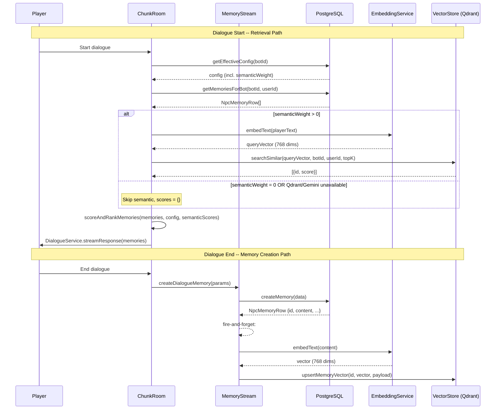

# Semantic Memory Retrieval (P0.2) Design Document

## Overview

This document specifies the P0.2 implementation of semantic memory retrieval for Nookstead's NPC memory system. P0.2 adds the third dimension -- semantic similarity via vector embeddings -- to the existing recency + importance retrieval formula, enabling NPCs to recall contextually relevant memories regardless of age or importance score.

## Design Summary (Meta)

```yaml
design_type: "extension"
risk_level: "medium"
complexity_level: "medium"
complexity_rationale: >
  (1) ACs require coordinating async embedding generation (Gemini API),
  dual-store writes (PostgreSQL + Qdrant), merged three-dimensional scoring,
  and graceful degradation across two external dependencies (Gemini, Qdrant).
  (2) Risk of dialogue-start latency regression from Qdrant queries; risk of
  silent quality degradation if fallback mode triggers frequently without alerting.
main_constraints:
  - "Zero latency impact on dialogue-end path (fire-and-forget embedding)"
  - "Graceful degradation: NPC dialogue must never fail due to vector infrastructure"
  - "PostgreSQL remains source of truth; Qdrant is secondary index"
  - "Must not change LLM provider for dialogue (OpenAI gpt-5-mini stays as-is)"
  - "Embedding provider: Gemini gemini-embedding-001 via AI SDK @ai-sdk/google"
  - "768 truncated dimensions (from 3072 default)"
biggest_risks:
  - "Gemini API latency or rate limits during batch backfill"
  - "Qdrant query adding >100ms to dialogue-start path"
  - "Embedding quality for Russian-language NPC memory summaries"
unknowns:
  - "Optimal gamma (semantic weight) relative to alpha and beta"
  - "Gemini free-tier rate limits for batch embedding operations"
  - "Qdrant cold-start latency after container restart"
```

## Background and Context

### Prerequisite ADRs

- **ADR-0020**: Vector Search Architecture for NPC Semantic Memory -- defines all 6 architecture decisions (embedding pipeline, storage strategy, retrieval algorithm, infrastructure, embedding provider, fallback strategy)
- **ADR-0014**: AI Dialogue via OpenAI + Vercel AI SDK -- established AI SDK pattern and provider-agnostic architecture
- **ADR-0015**: NPC Prompt Architecture -- defines SystemPromptBuilder sections and memory section slots

No common ADRs exist in `docs/adr/ADR-COMMON-*`; none are required for this feature.

### Agreement Checklist

#### Scope
- [x] New `EmbeddingService` module for Gemini embedding generation via AI SDK
- [x] New `VectorStore` module for Qdrant client operations
- [x] Modify `MemoryStream` to fire-and-forget embed after memory creation
- [x] Modify `MemoryRetrieval` to add semantic scoring dimension
- [x] Extend `RetrievalConfig` and `ScoredMemory` interfaces
- [x] Add `semantic_weight` column to `memory_stream_config` table
- [x] Add `semantic_weight` column to `npc_memory_overrides` table
- [x] Extend `MemoryConfigValues` interface and `getEffectiveConfig` merge logic
- [x] Add `QDRANT_URL` and `GOOGLE_GENERATIVE_AI_API_KEY` to server config
- [x] Add Qdrant service to `docker-compose.yml`
- [x] Backfill mechanism for existing memories without embeddings
- [x] Update `.env.example` files with new env vars

#### Non-Scope (Explicitly not changing)
- [x] No changes to DialogueService or LLM provider (OpenAI gpt-5-mini stays)
- [x] No changes to SystemPromptBuilder memory formatting
- [x] No changes to Colyseus protocol
- [x] No changes to client-side code
- [x] No observation/reflection/gossip memories (future phases)
- [x] No admin UI for semantic weight config (can be added later via existing genmap patterns)
- [x] No Daily Reflection (P0.3 -- separate effort)

#### Constraints
- [x] Parallel operation: Yes -- gamma=0 default ensures existing behavior unchanged
- [x] Backward compatibility: Required -- setting semanticWeight=0 reproduces Phase 0 exactly
- [x] Performance measurement: Qdrant query < 50ms; total retrieval < 200ms; embedding generation fire-and-forget

### Problem to Solve

The Phase 0 memory system retrieves memories using only recency and importance. When a player mentions "the harvest festival" and there is a 3-week-old memory about the baker worrying about the harvest festival (importance=4), that memory scores low on both dimensions and is not retrieved. The NPC appears to have forgotten the conversation entirely, breaking the core value proposition of contextually aware NPCs.

### Current Challenges

1. **No semantic awareness**: Retrieval formula uses only time-decay and importance -- topical relevance is ignored
2. **Topic recall failure**: Old-but-relevant memories are buried by newer trivial memories
3. **Formula incomplete**: F-002 spec defines three-dimensional scoring (recency + importance + semantic similarity); gamma=0 was an explicit Phase 0 deferral

### Requirements

#### Functional Requirements

- FR1: Generate vector embeddings for NPC memory content asynchronously after creation
- FR2: Store embeddings in Qdrant with memory UUID as point ID, filtered by botId + userId
- FR3: Score memories using three-dimensional formula: `alpha * recency + beta * importance + gamma * semantic`
- FR4: Fall back to two-dimensional scoring when Qdrant or Gemini is unavailable
- FR5: Backfill existing memories that lack embeddings
- FR6: Provide Qdrant as a Docker service alongside existing infrastructure

#### Non-Functional Requirements

- **Performance**: Qdrant query < 50ms (HNSW on <1000 points); total retrieval path < 200ms; embedding generation must not block dialogue-end path
- **Scalability**: Designed for <200 memories per bot-user pair, <50 NPCs, <10,000 total vectors
- **Reliability**: NPC dialogue must never fail due to vector infrastructure; graceful degradation to Phase 0 formula
- **Maintainability**: AI SDK abstraction allows embedding provider switch by changing one model reference

## Acceptance Criteria (AC) -- EARS Format

### FR1: Embedding Generation

- [ ] **AC1**: **When** a new memory is created in PostgreSQL (dialogue or action), the system shall asynchronously generate a vector embedding via Gemini and store it in Qdrant within 2 seconds under normal conditions
- [ ] **AC2**: **If** the Gemini API call fails during embedding generation, **then** the system shall log the error with memory ID context and continue without blocking the memory creation flow

### FR2: Vector Storage

- [ ] **AC3**: The system shall store each embedding in Qdrant with the PostgreSQL memory UUID as the point ID and `botId`, `userId`, `importance`, `createdAt` as payload fields
- [ ] **AC4**: **When** the Qdrant collection does not exist on first use, the system shall auto-create it with 768-dimension cosine distance configuration

### FR3: Semantic Retrieval

- [ ] **AC5**: **When** a player starts a dialogue and `semanticWeight > 0` in the effective config, the system shall embed the conversation context, search Qdrant for the top 20 similar memories (module constant `SEMANTIC_TOP_K = 20`) filtered by botId+userId, merge with PostgreSQL memories, and score using the three-dimensional formula
- [ ] **AC6**: **While** `semanticWeight` is set to `0` (default), the system shall produce retrieval results identical to Phase 0 (recency + importance only)

### FR4: Graceful Degradation

- [ ] **AC7**: **If** Qdrant is unavailable or query times out (>= 500ms), **then** the system shall fall back to Phase 0 two-dimensional scoring and log a warning
- [ ] **AC8**: **If** Gemini embedding fails during retrieval, **then** the system shall fall back to Phase 0 scoring without semantic similarity

### FR5: Backfill

- [ ] **AC9**: **When** the backfill function is invoked, the system shall identify PostgreSQL memories without Qdrant vectors, batch-embed them via `embedMany()`, and upsert to Qdrant
- [ ] **AC10**: The backfill function shall process memories in batches with rate limiting to respect Gemini API limits

### FR6: Infrastructure

- [ ] **AC11**: **When** `docker-compose up` is executed, the system shall start Qdrant alongside Redis and other services with a health check and persistent volume

## Applicable Standards

### Classification Table

| Standard | Type | Source | Impact on Design |
|----------|------|--------|-----------------|
| Prettier: single quotes, 2-space indent | Explicit | `.prettierrc`, `.editorconfig` | All new code must use single quotes and 2-space indentation |
| ESLint flat config with `@nx/eslint-plugin` | Explicit | `apps/server/eslint.config.mjs` | Unused vars prefixed with `_`; all TS files linted |
| TypeScript strict mode, ES2022 target | Explicit | `tsconfig.base.json` | All types must be explicit; no implicit any |
| Drizzle ORM schema + migration pattern | Explicit | `packages/db/drizzle.config.ts` | Schema changes via Drizzle schema files + `drizzle-kit generate` |
| Jest test framework | Explicit | `jest.config.cts` | Tests use `describe`/`it`/`expect` from `@jest/globals` |
| Fire-and-forget async pattern | Implicit | `ChunkRoom.ts:1174-1194` | Memory creation uses `.then().catch()` without awaiting; embedding must follow same pattern |
| Service module pattern: pure functions + class | Implicit | `MemoryRetrieval.ts`, `MemoryStream.ts` | Pure scoring functions exported standalone; stateful services as classes with constructor injection |
| Config via `loadConfig()` with env vars | Implicit | `apps/server/src/config.ts` | New env vars added to `ServerConfig` interface and `loadConfig()` function |
| DB service layer: functions accepting `DrizzleClient` | Implicit | `packages/db/src/services/npc-memory.ts` | Data access via exported functions with `db: DrizzleClient` first parameter |
| Effective config merge pattern: global + per-NPC override | Implicit | `packages/db/src/services/memory-config.ts` | New config fields added to both `memoryStreamConfig` and `npcMemoryOverrides` tables with nullish coalescing merge |

## Existing Codebase Analysis

### Implementation Path Mapping

| Type | Path | Description |
|------|------|-------------|
| Existing | `apps/server/src/npc-service/memory/MemoryRetrieval.ts` | Current 2D scoring (recency + importance) |
| Existing | `apps/server/src/npc-service/memory/MemoryStream.ts` | Memory creation (dialogue summary + PG write) |
| Existing | `apps/server/src/npc-service/memory/ImportanceScorer.ts` | Rule-based importance scoring |
| Existing | `apps/server/src/npc-service/memory/index.ts` | Module barrel exports |
| Existing | `apps/server/src/rooms/ChunkRoom.ts` | Dialogue flow: retrieval on start (L1494-1501), creation on end (L1174-1194) |
| Existing | `apps/server/src/npc-service/ai/DialogueService.ts` | Consumes `ScoredMemory[]` for prompt building |
| Existing | `apps/server/src/npc-service/ai/SystemPromptBuilder.ts` | `buildMemorySection()` formats memories |
| Existing | `apps/server/src/config.ts` | `ServerConfig` interface + `loadConfig()` |
| Existing | `packages/db/src/schema/memory-stream-config.ts` | `memoryStreamConfig` + `npcMemoryOverrides` tables |
| Existing | `packages/db/src/services/memory-config.ts` | `MemoryConfigValues`, `getEffectiveConfig()` |
| Existing | `packages/db/src/services/npc-memory.ts` | `createMemory()`, `getMemoriesForBot()` |
| Existing | `docker-compose.yml` | Redis, server, game, genmap services |
| New | `apps/server/src/npc-service/memory/EmbeddingService.ts` | Gemini embedding via AI SDK |
| New | `apps/server/src/npc-service/memory/VectorStore.ts` | Qdrant client wrapper |
| New | `apps/server/src/npc-service/memory/backfill.ts` | Batch backfill function |
| New | `apps/server/src/npc-service/memory/__tests__/EmbeddingService.spec.ts` | EmbeddingService unit tests |
| New | `apps/server/src/npc-service/memory/__tests__/VectorStore.spec.ts` | VectorStore unit tests |
| New | `apps/server/src/npc-service/memory/__tests__/MemoryRetrieval.semantic.spec.ts` | 3D scoring tests |

### Similar Functionality Search

- **Embedding generation**: No existing embedding or vector code found in the codebase. The AI SDK is used for `streamText()` and `generateText()` in DialogueService and MemoryStream, but `embed()` / `embedMany()` are not used anywhere. New implementation required.
- **Vector search**: No vector database client or similarity search exists. New implementation required.
- **Async fire-and-forget**: Pattern already established in ChunkRoom L1174-1194 for memory creation. Embedding generation will follow this exact pattern.

**Decision**: New implementation for EmbeddingService and VectorStore; extend existing MemoryRetrieval and MemoryStream.

### Code Inspection Evidence

#### What Was Examined

| File Inspected | Key Finding | Design Impact |
|---------------|-------------|---------------|
| `MemoryRetrieval.ts` (102 lines, full file) | Pure function `scoreAndRankMemories()` with `RetrievalConfig` + `ScoredMemory` interfaces; uses `trimToTokenBudget()` | Extend interfaces; add semantic dimension to scoring formula; keep pure function signature |
| `MemoryStream.ts` (184 lines, full file) | Class with constructor injection (`apiKey`, `model`); `createDialogueMemory()` returns `Promise<void>`; uses `createMemory()` from DB service which returns `NpcMemoryRow` (has `.id`) | After `createMemory()` call at L98, fire-and-forget embed + upsert using returned memory row |
| `ChunkRoom.ts:1174-1194` | Fire-and-forget pattern: `.then().catch()` chain, no await | Embedding must follow identical pattern to avoid blocking |
| `ChunkRoom.ts:1488-1501` | Retrieval: calls `getEffectiveConfig()` then `getMemoriesForBot()` then `scoreAndRankMemories()` with config fields | Must pass `semanticWeight` from effective config to scoring function; Qdrant `limit` uses module-level constant `SEMANTIC_TOP_K` |
| `memory-stream-config.ts` (57 lines, full file) | Two tables: `memoryStreamConfig` (global, single row), `npcMemoryOverrides` (per-NPC, nullable fields) | Add `semanticWeight` to both tables following existing column patterns |
| `memory-config.ts:132-151` | `getEffectiveConfig()` merges global + override with `??` (nullish coalescing) | Add `semanticWeight` to merge logic |
| `config.ts` (72 lines, full file) | `ServerConfig` interface + `loadConfig()` reads env vars; required vars throw on missing | Add `qdrantUrl` (optional, default `http://localhost:6333`) and `googleApiKey` (optional, for graceful degradation) |
| `npc-memory.ts:26-31` | `createMemory()` returns `NpcMemoryRow` via `.returning()` | Use returned row's `.id` as Qdrant point ID |
| `docker-compose.yml` (49 lines, full file) | Redis pattern: image, ports, volumes, healthcheck | Follow identical pattern for Qdrant service |
| `MemoryRetrieval.spec.ts` (151 lines, full file) | Test pattern: `makeMemory()` helper, `baseConfig` fixture, `@jest/globals` imports | Follow same pattern for semantic scoring tests |
| `packages/db/src/index.ts` | Barrel exports for all services and types | Re-export updated `MemoryConfigValues` with `semanticWeight` |

#### How Findings Influence Design

- `scoreAndRankMemories()` is a **pure function** -- the semantic extension must preserve this property by accepting pre-fetched semantic scores as a parameter rather than calling Qdrant internally
- `MemoryStream` constructor injection pattern means `EmbeddingService` and `VectorStore` should be injected as constructor parameters
- `ChunkRoom` fire-and-forget pattern dictates that embedding generation must be a `.then().catch()` chain appended after memory creation
- `createMemory()` returns `NpcMemoryRow` with `.id` -- this UUID becomes the Qdrant point ID, requiring no mapping table
- Config merge pattern (`??` nullish coalescing) means `semanticWeight: null` in overrides correctly falls back to global default

## Design

### Change Impact Map

```yaml
Change Target: NPC Memory Retrieval System
Direct Impact:
  - apps/server/src/npc-service/memory/MemoryRetrieval.ts (add semanticScore to formula)
  - apps/server/src/npc-service/memory/MemoryStream.ts (add fire-and-forget embedding after createMemory)
  - apps/server/src/npc-service/memory/index.ts (export new modules)
  - apps/server/src/config.ts (add qdrantUrl, googleApiKey)
  - apps/server/src/rooms/ChunkRoom.ts (pass semanticWeight to retrieval, initialize services)
  - packages/db/src/schema/memory-stream-config.ts (add semantic_weight columns)
  - packages/db/src/services/memory-config.ts (add semanticWeight to MemoryConfigValues and merge)
  - packages/db/src/index.ts (re-export updated types)
  - docker-compose.yml (add qdrant service)
  - .env.example, apps/server/.env.example (add new env vars)
Indirect Impact:
  - apps/server/src/npc-service/ai/DialogueService.ts (ScoredMemory type gains semanticScore field -- no code changes needed, field is additive)
  - apps/server/src/npc-service/ai/SystemPromptBuilder.ts (no changes -- consumes memory.content only)
  - packages/db/src/services/npc-memory.ts (no changes -- createMemory return type unchanged)
No Ripple Effect:
  - Client-side code (no protocol changes)
  - Colyseus schema/protocol (no changes)
  - ImportanceScorer (no changes)
  - DialogueService streaming logic (no changes)
  - Admin UI / genmap (no changes in this phase)
```

### Architecture Overview

```mermaid
graph TB
    subgraph "Dialogue End Path (Fire-and-Forget)"
        A[ChunkRoom: dialogue ends] --> B[MemoryStream.createDialogueMemory]
        B --> C[generateSummary via gpt-5-mini]
        C --> D[createMemory in PostgreSQL]
        D --> E[Return NpcMemoryRow with .id]
        E --> F["Fire-and-forget: EmbeddingService.embedText(content)"]
        F --> G["VectorStore.upsertMemoryVector(id, vector, payload)"]
        F -.->|Failure| H[Log error, memory still in PG]
        G -.->|Failure| H
    end

    subgraph "Dialogue Start Path (Retrieval)"
        I[ChunkRoom: dialogue starts] --> J[getEffectiveConfig from DB]
        J --> K{semanticWeight > 0?}
        K -->|Yes| L["EmbeddingService.embedText(playerText)"]
        K -->|No| M[Skip Qdrant, semanticScores = empty]
        L --> N["VectorStore.searchSimilar(queryVector, botId, userId)"]
        L -.->|Failure| M
        N -.->|Failure/Timeout| M
        N --> O[Semantic score map: memoryId -> score]
        I --> P[getMemoriesForBot from PostgreSQL]
        O --> Q[scoreAndRankMemories with 3D formula]
        M --> Q
        P --> Q
        Q --> R[Top-K memories trimmed to token budget]
        R --> S[DialogueService.streamResponse]
    end

    subgraph "Backfill Path"
        T[CLI / admin call] --> U[Query PG memories]
        U --> V[Check Qdrant for existing vectors]
        V --> W[Filter to unembedded memories]
        W --> X["EmbeddingService.embedTexts(batch)"]
        X --> Y[VectorStore batch upsert]
    end
```



### Data Flow



### Integration Point Map

```yaml
## Integration Point Map

Integration Point 1:
  Existing Component: MemoryStream.createDialogueMemory (L98-105)
  Integration Method: Append fire-and-forget embed + upsert after createMemory() call
  Impact Level: Medium (adds async side-effect to existing write path)
  Required Test Coverage: Verify memory creation still succeeds when embedding fails

Integration Point 2:
  Existing Component: ChunkRoom dialogue start (L1488-1501)
  Integration Method: Add semantic scoring branch before scoreAndRankMemories call
  Impact Level: High (modifies retrieval path, adds Qdrant query)
  Required Test Coverage: Verify retrieval works with and without Qdrant; verify fallback

Integration Point 3:
  Existing Component: scoreAndRankMemories function
  Integration Method: Extend function signature to accept semantic scores map
  Impact Level: High (changes scoring formula)
  Required Test Coverage: Verify gamma=0 reproduces Phase 0; verify 3D scoring correctness

Integration Point 4:
  Existing Component: getEffectiveConfig (memory-config.ts L132-151)
  Integration Method: Add semanticWeight to merge logic
  Impact Level: Low (additive field, nullish coalescing)
  Required Test Coverage: Verify default 0.0 propagates; verify override works

Integration Point 5:
  Existing Component: docker-compose.yml
  Integration Method: Add qdrant service following redis pattern
  Impact Level: Low (additive service)
  Required Test Coverage: Verify docker-compose up starts Qdrant with health check
```

### Integration Points List

| Integration Point | Location | Old Implementation | New Implementation | Switching Method |
|-------------------|----------|-------------------|-------------------|------------------|
| Memory creation embedding | `MemoryStream.createDialogueMemory` L98 | `createMemory()` only | `createMemory()` + fire-and-forget embed+upsert | Conditional: only if EmbeddingService + VectorStore injected |
| Memory retrieval scoring | `ChunkRoom.ts` L1495-1501 | `scoreAndRankMemories(raw, config)` | Embed query + Qdrant search + `scoreAndRankMemories(raw, config, semanticScores)` | Conditional: semanticWeight > 0 in config |
| Scoring formula | `MemoryRetrieval.scoreAndRankMemories` | `alpha*recency + beta*importance` | `alpha*recency + beta*importance + gamma*semantic` | Parameter: semanticScores map (empty = Phase 0) |
| Config fields | `memoryStreamConfig` table | No semantic_weight column | `semantic_weight` column (default 0.0) | Migration + schema update |
| Docker services | `docker-compose.yml` | Redis only | Redis + Qdrant | Additive service definition |

### Main Components

#### EmbeddingService

- **Responsibility**: Generate vector embeddings from text using Gemini via AI SDK
- **Interface**:
  ```typescript
  export class EmbeddingService {
    constructor(options: { googleApiKey: string });
    embedText(text: string): Promise<number[] | null>;
    embedTexts(texts: string[]): Promise<(number[] | null)[]>;
  }
  ```
- **Dependencies**: `@ai-sdk/google` provider, `ai` SDK (`embed`, `embedMany`)
- **Instantiation**: EmbeddingService is only created when `GOOGLE_GENERATIVE_AI_API_KEY` is present in config. When missing, `MemoryStreamOptions.embeddingService` is set to `null` and all embedding is skipped. This matches the optional dependency injection pattern.
- **Error handling**: Wrap all API calls in try/catch; return `null` on failure; log with structured context

#### VectorStore

- **Responsibility**: Manage Qdrant collection and point operations for NPC memory vectors
- **Interface**:
  ```typescript
  export interface VectorPayload {
    botId: string;
    userId: string;
    importance: number;
    createdAt: string; // ISO 8601
  }

  export class VectorStore {
    constructor(options: { qdrantUrl: string });
    ensureCollection(): Promise<void>;
    upsertMemoryVector(memoryId: string, vector: number[], payload: VectorPayload): Promise<void>;
    searchSimilar(queryVector: number[], botId: string, userId: string, limit: number): Promise<{ id: string; score: number }[]>;
    deleteMemoryVector(memoryId: string): Promise<void>;
    healthCheck(): Promise<boolean>;
  }
  ```
- **Dependencies**: `@qdrant/js-client-rest` SDK
- **Collection config**: Name `npc_memories`, distance `Cosine`, dimension `768`
- **Auto-creation**: `ensureCollection()` checks if collection exists; creates if not

#### Extended MemoryRetrieval

- **Responsibility**: Score memories using three-dimensional formula with optional semantic scores
- **Interface change**:
  ```typescript
  export interface RetrievalConfig {
    topK: number;
    halfLifeHours: number;
    recencyWeight: number;
    importanceWeight: number;
    semanticWeight: number;     // NEW -- default 0.0
    tokenBudget: number;
  }

  export interface ScoredMemory {
    memory: NpcMemoryRow;
    recencyScore: number;
    importanceScore: number;
    semanticScore: number;       // NEW -- 0.0 when not available
    totalScore: number;
  }

  // Signature change: add optional semanticScores parameter
  export function scoreAndRankMemories(
    memories: NpcMemoryRow[],
    config: RetrievalConfig,
    now?: Date,
    semanticScores?: Map<string, number>  // NEW -- memoryId -> cosine similarity [0,1]
  ): ScoredMemory[];
  ```
- **Formula**: `totalScore = recencyWeight * recency + importanceWeight * importance + semanticWeight * semanticScore`
- **Backward compatibility**: When `semanticScores` is undefined/empty or `semanticWeight` is 0, formula reduces to Phase 0

#### Extended MemoryStream

- **Responsibility**: Memory creation with async embedding side-effect
- **Interface change**:
  ```typescript
  export interface MemoryStreamOptions {
    apiKey: string;
    model?: string;
    embeddingService?: EmbeddingService | null;  // NEW -- optional
    vectorStore?: VectorStore | null;            // NEW -- optional
  }
  ```
- **Behavior**: After `createMemory()` returns a `NpcMemoryRow`, if `embeddingService` and `vectorStore` are available, fire-and-forget: `embedText(content)` then `upsertMemoryVector(id, vector, payload)`. Failures logged, never propagated.

### Contract Definitions

```typescript
// === EmbeddingService ===

// Input: plain text string (memory content or player query)
// Output: 768-dimension float array, or null on failure
// Invariant: output always has exactly 768 elements when non-null

// === VectorStore ===

// upsertMemoryVector:
//   Input: memoryId (UUID string), vector (768 floats), payload (VectorPayload)
//   Output: void (fire-and-forget)
//   On Error: throws (caller wraps in try/catch)

// searchSimilar:
//   Input: queryVector (768 floats), botId, userId, limit
//   Output: Array<{id: string, score: number}> -- score in [0,1] for cosine
//   On Error: throws (caller catches and falls back)
//   Timeout: 500ms (enforced by caller)

// === scoreAndRankMemories ===

// Input: memories (NpcMemoryRow[]), config (RetrievalConfig), now (Date), semanticScores (Map)
// Output: ScoredMemory[] sorted by totalScore descending, trimmed to token budget
// Invariant: when semanticWeight=0 OR semanticScores is empty,
//            output is identical to Phase 0
// Invariant: output.length <= config.topK
```

### Data Contract

#### EmbeddingService

```yaml
Input:
  Type: string (memory content or player query text)
  Preconditions: Non-empty string
  Validation: Check text.length > 0 before calling API

Output:
  Type: number[] | null
  Guarantees: When non-null, array has exactly 768 elements; values are normalized floats
  On Error: Returns null, logs error with context

Invariants:
  - Dimension count is always 768 (configured via outputDimensionality)
  - Provider is always gemini-embedding-001 via @ai-sdk/google
```

#### VectorStore.searchSimilar

```yaml
Input:
  Type: queryVector (number[]), botId (string), userId (string), limit (number)
  Preconditions: queryVector has 768 elements; botId and userId are valid UUIDs; limit > 0
  Validation: None (caller responsibility)

Output:
  Type: Array<{id: string, score: number}>
  Guarantees: id is a valid memory UUID; score is cosine similarity in [0,1]; results sorted by score descending; length <= limit
  On Error: Throws (caller catches and falls back to Phase 0)

Invariants:
  - Results are pre-filtered by botId AND userId via Qdrant must clause
  - Score is raw cosine similarity from Qdrant (not re-normalized)
```

#### scoreAndRankMemories (extended)

```yaml
Input:
  Type: NpcMemoryRow[], RetrievalConfig, Date?, Map<string, number>?
  Preconditions: memories is a valid array (may be empty); config has all required fields
  Validation: None (caller responsibility)

Output:
  Type: ScoredMemory[] (sorted by totalScore descending, trimmed to token budget)
  Guarantees: length <= config.topK; total estimated tokens <= config.tokenBudget
  On Error: N/A (pure function, no external calls)

Invariants:
  - When semanticWeight=0 OR semanticScores is undefined/empty: totalScore = recencyWeight*recency + importanceWeight*importance (identical to Phase 0)
  - semanticScore defaults to 0.0 for memories not found in semanticScores map
  - All individual scores (recency, importance, semantic) are in [0, 1] range
```

### Data Representation Decisions

| Data Structure | Decision | Rationale |
|---|---|---|
| `RetrievalConfig` | **Extend** existing interface | Existing interface covers 80%+ of fields; adding `semanticWeight` is a single additive field with backward-compatible default (0.0) |
| `ScoredMemory` | **Extend** existing interface | Adding `semanticScore: number` field; all existing consumers are unaffected (additive field) |
| `MemoryConfigValues` | **Extend** existing interface | Adding `semanticWeight` following exact same pattern as existing `recencyWeight` and `importanceWeight` |
| `VectorPayload` | **New** dedicated interface | No existing type represents Qdrant point payload; this is Qdrant-specific metadata not stored in PG |
| `MemoryStreamOptions` | **Extend** existing interface | Adding optional `embeddingService` and `vectorStore` deps; null = disabled |

### Field Propagation Map

```yaml
fields:
  - name: "semanticWeight"
    origin: "Database (memory_stream_config table)"
    transformations:
      - layer: "DB Schema"
        type: "real column (memory_stream_config.semantic_weight)"
        validation: "NOT NULL, default 0.0"
      - layer: "DB Service"
        type: "MemoryConfigValues.semanticWeight"
        transformation: "Direct mapping via rowToConfig()"
      - layer: "Effective Config"
        type: "MemoryConfigValues.semanticWeight"
        transformation: "Merged via getEffectiveConfig() with ?? nullish coalescing"
      - layer: "ChunkRoom"
        type: "RetrievalConfig.semanticWeight"
        transformation: "Passed to scoreAndRankMemories"
      - layer: "MemoryRetrieval"
        type: "config.semanticWeight"
        transformation: "Multiplied with semanticScore in formula"
    destination: "totalScore computation in scoreAndRankMemories"
    loss_risk: "none"

  - name: "semanticScore"
    origin: "Qdrant search result"
    transformations:
      - layer: "VectorStore"
        type: "{ id: string, score: number }"
        validation: "score is cosine similarity [0,1]"
      - layer: "ChunkRoom"
        type: "Map<string, number>"
        transformation: "Array of results converted to Map keyed by memory ID"
      - layer: "MemoryRetrieval"
        type: "ScoredMemory.semanticScore"
        transformation: "Looked up from Map by memory.id; defaults to 0.0 if not found"
    destination: "totalScore = alpha*recency + beta*importance + gamma*semantic"
    loss_risk: "low"
    loss_risk_reason: "Memories without Qdrant vectors get semanticScore=0.0 -- they are not penalized but do not benefit from semantic boost"

  - name: "embedding vector"
    origin: "EmbeddingService (Gemini API response)"
    transformations:
      - layer: "EmbeddingService"
        type: "number[] (768 elements)"
        validation: "Non-null check; length verified implicitly by Qdrant dimension config"
      - layer: "VectorStore"
        type: "Qdrant point vector"
        transformation: "Stored as-is in Qdrant collection (768-dim cosine)"
    destination: "Qdrant npc_memories collection"
    loss_risk: "low"
    loss_risk_reason: "Transient Gemini failures cause null return; backfill recovers eventually"
```

### Interface Change Impact Analysis

| Existing Operation | New Operation | Conversion Required | Adapter Required | Compatibility Method |
|-------------------|---------------|-------------------|------------------|---------------------|
| `scoreAndRankMemories(memories, config, now?)` | `scoreAndRankMemories(memories, config, now?, semanticScores?)` | No | No | Optional parameter with default (undefined = Phase 0) |
| `RetrievalConfig` (4 fields) | `RetrievalConfig` (5 fields: + semanticWeight) | No | No | New field has default 0.0 in DB; existing callers pass config from getEffectiveConfig which includes it |
| `ScoredMemory` (4 fields) | `ScoredMemory` (5 fields: + semanticScore) | No | No | Additive field; consumers (SystemPromptBuilder) only use `.memory.content` |
| `MemoryStreamOptions` (2 fields) | `MemoryStreamOptions` (4 fields: + embeddingService?, vectorStore?) | No | No | Optional fields; null/undefined = embedding disabled |
| `MemoryConfigValues` (11 fields) | `MemoryConfigValues` (12 fields: + semanticWeight) | No | No | New field has default 0.0 in DB schema |
| `new MemoryStream({apiKey, model?})` | `new MemoryStream({apiKey, model?, embeddingService?, vectorStore?})` | No | No | Optional constructor params |

### Integration Boundary Contracts

```yaml
Boundary: ChunkRoom -> EmbeddingService (retrieval path)
  Input: playerText (string, max 500 chars -- truncated by DialogueService)
  Output: number[] (768-dim) -- sync Promise, nullable on failure
  On Error: Return null; ChunkRoom skips Qdrant search, falls back to Phase 0

Boundary: ChunkRoom -> VectorStore (retrieval path)
  Input: queryVector (768-dim), botId (UUID), userId (UUID), limit (number)
  Output: Array<{id: UUID, score: float}> -- sync Promise with 500ms timeout
  On Error: Throw; ChunkRoom catches, falls back to Phase 0

Boundary: MemoryStream -> EmbeddingService (creation path)
  Input: memory.content (string, max 500 chars)
  Output: number[] (768-dim) -- async, fire-and-forget
  On Error: Return null; embedding skipped, memory exists in PG only

Boundary: MemoryStream -> VectorStore (creation path)
  Input: memoryId (UUID), vector (768-dim), payload (VectorPayload)
  Output: void -- async, fire-and-forget
  On Error: Throw; caught by fire-and-forget .catch(), logged

Boundary: VectorStore -> Qdrant REST API
  Input: HTTP requests (upsert, search, collection management)
  Output: JSON responses
  On Error: @qdrant/js-client-rest throws; VectorStore propagates to caller
```

### Error Handling

| Error Scenario | Component | Handling | Impact |
|---------------|-----------|----------|--------|
| Gemini API unreachable (embed) | EmbeddingService | try/catch, return null, log error | Memory created in PG without embedding; backfill recovers later |
| Gemini API rate limit | EmbeddingService | try/catch, return null, log error | Same as above; backfill has explicit rate limiting |
| Qdrant unreachable (upsert) | VectorStore | throws; MemoryStream.catch() logs | Memory in PG only; backfill recovers |
| Qdrant unreachable (search) | VectorStore | throws; ChunkRoom catches, falls back to Phase 0 | Retrieval degrades to recency+importance only |
| Qdrant query timeout (>= 500ms) | ChunkRoom | AbortController timeout; catch, fall back | Same as unreachable |
| Qdrant collection missing | VectorStore.ensureCollection | Auto-creates on first use | Transparent; logged on creation |
| Embedding dimension mismatch | VectorStore.upsert | Qdrant rejects with error | Logged; requires collection recreation + backfill |
| Invalid memory ID in Qdrant search | ChunkRoom merge | Memory not found in PG map; ignored | No impact (orphan Qdrant point) |
| Memory deleted from PG (deleteOldestMemories) | MemoryStream | No cascade to Qdrant | Orphan vectors in Qdrant are tolerable: filtered out during merge (PG record absent). Cleaned up on collection recreation during embedding model changes. Periodic cleanup can be added later if storage becomes a concern. |

### Logging and Monitoring

```
[EmbeddingService] Embedded text: memoryId={id}, dimensions=768, latencyMs={ms}
[EmbeddingService] Embedding failed: memoryId={id}, error={message}
[VectorStore] Upserted vector: memoryId={id}, collection=npc_memories
[VectorStore] Upsert failed: memoryId={id}, error={message}
[VectorStore] Search completed: botId={id}, userId={id}, results={count}, latencyMs={ms}
[VectorStore] Search failed (falling back to Phase 0): error={message}
[VectorStore] Collection created: name=npc_memories, dimension=768, distance=Cosine
[VectorStore] Health check: status={ok|failed}
[ChunkRoom] Semantic retrieval: botId={id}, semanticWeight={w}, semanticResults={count}, totalLatencyMs={ms}
[ChunkRoom] Semantic retrieval skipped: reason={weight_zero|qdrant_unavailable|embed_failed}
[Backfill] Started: totalMemories={n}, alreadyEmbedded={m}, toProcess={n-m}
[Backfill] Batch completed: batch={i}/{total}, embedded={count}, failedCount={count}
[Backfill] Completed: total={n}, succeeded={s}, failed={f}, durationMs={ms}
```

## Implementation Plan

### Implementation Approach

**Selected Approach**: Vertical Slice (Feature-driven)

**Selection Reason**: Each slice delivers an independently testable capability. The first slice (EmbeddingService + VectorStore) provides the foundation services. The second slice (MemoryStream integration) enables embedding on memory creation. The third slice (MemoryRetrieval integration) completes the retrieval loop. This order ensures that each integration point is verifiable at L2 (test) before the next depends on it. The infrastructure (Docker + config) is the prerequisite foundation and is implemented first.

### Technical Dependencies and Implementation Order

#### 1. Infrastructure Foundation
- **What**: Qdrant Docker service, env vars in config.ts, `.env.example` updates, DB migration (semantic_weight columns)
- **Technical Reason**: All subsequent components depend on Qdrant being available and config being loadable
- **Dependent Elements**: EmbeddingService, VectorStore, ChunkRoom initialization
- **Verification**: L3 (docker-compose up starts Qdrant; config loads without error)

#### 2. EmbeddingService + VectorStore (New Modules)
- **What**: New service classes with unit tests (mocked external deps)
- **Technical Reason**: These are leaf dependencies with no coupling to existing modules; can be developed and tested in isolation
- **Prerequisites**: Infrastructure foundation (Qdrant URL, Google API key in config)
- **Verification**: L2 (unit tests with mocked AI SDK and Qdrant client)

#### 3. MemoryStream Integration (Embedding on Creation)
- **What**: Inject EmbeddingService + VectorStore into MemoryStream; add fire-and-forget embedding after `createMemory()`
- **Technical Reason**: Depends on EmbeddingService and VectorStore being implemented
- **Prerequisites**: EmbeddingService, VectorStore
- **Verification**: L2 (unit test: verify embedText + upsert called after createMemory; verify failure does not propagate)

#### 4. MemoryRetrieval Integration (3D Scoring)
- **What**: Extend RetrievalConfig, ScoredMemory, scoreAndRankMemories; integrate into ChunkRoom retrieval path
- **Technical Reason**: Depends on VectorStore (for Qdrant search) and EmbeddingService (for query embedding)
- **Prerequisites**: EmbeddingService, VectorStore, DB migration (semanticWeight in config)
- **Verification**: L2 (unit tests for 3D formula; verify gamma=0 backward compatibility)

#### 5. ChunkRoom Orchestration
- **What**: Wire EmbeddingService + VectorStore in ChunkRoom initialization; add semantic retrieval branch in dialogue start handler
- **Technical Reason**: Depends on all previous components
- **Prerequisites**: All above
- **Verification**: L1 (functional: start dialogue with semanticWeight>0, verify NPC recalls relevant topic)

#### 6. Backfill Mechanism
- **What**: CLI-callable function to batch-embed existing memories
- **Technical Reason**: Depends on EmbeddingService and VectorStore
- **Prerequisites**: EmbeddingService, VectorStore
- **Verification**: L2 (unit test with mocked deps); L1 (run against dev DB)

### Integration Points (E2E Verification)

**Integration Point 1: Memory Creation -> Embedding**
- Components: MemoryStream -> EmbeddingService -> VectorStore
- Verification: Create a memory via MemoryStream; verify Qdrant contains a point with matching UUID and 768-dim vector

**Integration Point 2: Retrieval with Semantic Scoring**
- Components: ChunkRoom -> EmbeddingService -> VectorStore -> MemoryRetrieval
- Verification: Create memories with distinct topics; start dialogue mentioning one topic; verify the topically relevant memory ranks higher than it would with Phase 0 scoring

**Integration Point 3: Graceful Degradation**
- Components: ChunkRoom -> VectorStore (unavailable)
- Verification: Stop Qdrant container; start dialogue; verify memories are still retrieved (Phase 0 scoring) and warning is logged

**Integration Point 4: Backfill**
- Components: backfill function -> EmbeddingService -> VectorStore
- Verification: Create memories in PG without embeddings; run backfill; verify Qdrant contains vectors for all memories

### Migration Strategy

1. **Database migration**: Add `semantic_weight` column to `memory_stream_config` (default `0.0`) and `npc_memory_overrides` (nullable). This is a non-breaking additive change.
2. **Default disabled**: `semanticWeight=0.0` means Phase 0 behavior is unchanged after deployment. Semantic retrieval is enabled by updating the config value.
3. **Backward compatibility**: The `scoreAndRankMemories` function signature is backward compatible (new parameter is optional with undefined default).
4. **Rollback path**: Set `semanticWeight=0.0` to disable semantic retrieval without code changes. Qdrant can be stopped without affecting core functionality.

## Test Strategy

### Basic Test Design Policy

Each acceptance criterion maps to at least one test case. Tests use the existing Jest framework with `@jest/globals` imports and the `makeMemory()` helper pattern established in `MemoryRetrieval.spec.ts`.

### Unit Tests

**EmbeddingService.spec.ts** (AC1, AC2)
- `embedText` returns 768-dim array on success (mock AI SDK `embed()`)
- `embedText` returns null and logs error on API failure
- `embedTexts` returns array of embeddings on success (mock AI SDK `embedMany()`)
- `embedTexts` returns null entries for individual failures

**VectorStore.spec.ts** (AC3, AC4)
- `ensureCollection` creates collection with correct config when not exists
- `ensureCollection` is no-op when collection already exists
- `upsertMemoryVector` calls Qdrant upsert with correct point structure (UUID id, 768-dim vector, payload)
- `searchSimilar` returns filtered results with botId+userId must clause
- `searchSimilar` returns empty array when no matches
- `deleteMemoryVector` calls Qdrant delete with correct point ID
- `healthCheck` returns true when Qdrant responds, false on failure

**MemoryRetrieval.semantic.spec.ts** (AC5, AC6, AC7, AC8)
- 3D scoring: memory with high semantic score ranks above memory with only high recency
- Backward compatibility: `semanticWeight=0` produces identical output to Phase 0 (compare against existing test expectations)
- Backward compatibility: `semanticScores=undefined` produces identical output to Phase 0
- Memories not in `semanticScores` map get `semanticScore=0.0`
- Weights are configurable: verify `semanticWeight` multiplier

**MemoryStream.embedding.spec.ts** (AC1, AC2)
- After `createDialogueMemory`, `embedText` and `upsertMemoryVector` are called with correct arguments
- When `embedText` returns null, `upsertMemoryVector` is not called
- When `upsertMemoryVector` throws, error is logged but `createDialogueMemory` does not throw
- When `embeddingService` is null, no embedding is attempted
- When `vectorStore` is null, no upsert is attempted

**backfill.spec.ts** (AC9, AC10)
- Identifies memories without Qdrant vectors
- Processes in batches of configurable size
- Handles partial failures (some embeddings fail, others succeed)
- Respects rate limiting configuration

### Integration Tests

- Docker Compose health: Qdrant starts and responds to health check (AC11)
- End-to-end embedding: Create memory in PG -> verify embedding appears in Qdrant (AC1, AC3)
- End-to-end retrieval: Create memories with embeddings -> search by query -> verify semantic ranking (AC5)
- Fallback: Stop Qdrant -> verify retrieval still works with Phase 0 scoring (AC7)

### E2E Tests

- Full dialogue loop: Player starts dialogue mentioning a topic -> NPC recalls semantically relevant old memory that would not rank high on recency/importance alone (AC5)
- Config toggle: Set semanticWeight=0 -> verify Phase 0 behavior (AC6)
- Degraded mode: Qdrant down -> dialogue still functions normally (AC7)

### Performance Tests

- Qdrant search latency: Measure with 200 vectors (typical max per bot-user pair), target < 50ms
- Full retrieval path: Measure total time from dialogue start to memories available, target < 200ms
- Embedding generation: Measure Gemini API latency, expected 200-400ms (fire-and-forget, not on critical path)

## Security Considerations

- **API Key Protection**: `GOOGLE_GENERATIVE_AI_API_KEY` stored as environment variable only; never logged or exposed via API
- **Qdrant Access**: Qdrant runs on internal Docker network; no API key required for local development; production should use network isolation
- **Data in Qdrant**: Payload contains botId, userId (UUIDs), importance, createdAt -- no PII or memory content stored in Qdrant (only the embedding vector)
- **Memory content**: The actual memory text stays in PostgreSQL only; Qdrant stores the mathematical representation (embedding) which cannot be reversed to original text

## Future Extensibility

- **Embedding provider switch**: Change `google.embedding('gemini-embedding-001')` to `openai.embedding('text-embedding-3-small')` in one line (AI SDK abstraction)
- **Admin UI**: Add `semanticWeight` slider to genmap memory config page (follows existing pattern)
- **Observation memories (P1)**: Embedding pipeline supports any memory type -- just needs content text
- **Reflection memories (P1)**: Reflections can be embedded and retrieved semantically
- **Full-text hybrid search**: Qdrant supports payload filtering + vector search; can add keyword matching in future
- **Collection recreation**: When embedding model changes, run backfill command to re-embed all memories (documented in ADR-0020)

## Alternative Solutions

### Alternative 1: pgvector instead of Qdrant

- **Overview**: Add `vector(768)` column to `npc_memories` table; use PostgreSQL's pgvector extension
- **Advantages**: Single store; no dual-write consistency concern; ACID guarantees
- **Disadvantages**: Drizzle ORM has limited pgvector support (raw SQL needed); extension availability varies in managed PostgreSQL; vector data bloats main table
- **Reason for Rejection**: ADR-0020 Decision 2 selected Qdrant for separation of concerns and purpose-built ANN search

### Alternative 2: Sequential pipeline (Qdrant-first retrieval)

- **Overview**: Query Qdrant for top-K semantically similar, then re-rank by recency+importance
- **Advantages**: Simpler data flow; single scoring pass
- **Disadvantages**: Hard cutoff at Qdrant top-K may discard important/recent memories that are not semantically similar
- **Reason for Rejection**: ADR-0020 Decision 3 selected merged scoring to avoid hard cutoffs on any single dimension

## Risks and Mitigation

| Risk | Impact | Probability | Mitigation |
|------|--------|-------------|------------|
| Gemini API latency >2s consistently | Medium | Low | Kill criteria in ADR-0020; switch to OpenAI embeddings (one-line change) |
| Gemini free-tier rate limits too restrictive for backfill | Medium | Medium | Batch with configurable rate limiting; process overnight if needed |
| Qdrant adds >100ms to dialogue-start path | High | Low | 500ms timeout with fallback; Qdrant HNSW is <10ms for <1000 points |
| Embedding quality poor for Russian text | Medium | Low | Gemini supports Russian; test with real dialogues; can switch provider |
| Qdrant data loss on container restart | Low | Low | Persistent Docker volume; full recovery via backfill from PostgreSQL |
| Dual-store consistency drift | Low | Medium | Backfill command as manual recovery; embeddings are best-effort enhancement |

## References

- [ADR-0020: Vector Search Architecture](../adr/ADR-0020-vector-search-architecture.md) -- All architecture decisions for this feature
- [Design-023: Memory Stream](design-023-memory-stream.md) -- Phase 0 memory system
- [ADR-0014: AI Dialogue via OpenAI + Vercel AI SDK](../adr/ADR-0014-ai-dialogue-openai-sdk.md) -- AI SDK pattern
- [Vercel AI SDK: Embeddings](https://ai-sdk.dev/docs/ai-sdk-core/embeddings) -- `embed()` and `embedMany()` API reference
- [AI SDK Google Provider: Embedding](https://ai-sdk.dev/providers/ai-sdk-providers/google-generative-ai) -- `google.embedding()` with `outputDimensionality`
- [Qdrant JS Client Documentation](https://github.com/qdrant/qdrant-js) -- TypeScript REST client API
- [Qdrant Documentation](https://qdrant.tech/documentation/) -- Collection management, search, filtering
- [Google gemini-embedding-001](https://ai.google.dev/gemini-api/docs/embeddings) -- Embedding model documentation, MRL truncation

## Update History

| Date | Version | Changes | Author |
|------|---------|---------|--------|
| 2026-03-28 | 1.0 | Initial version | AI Technical Designer |
