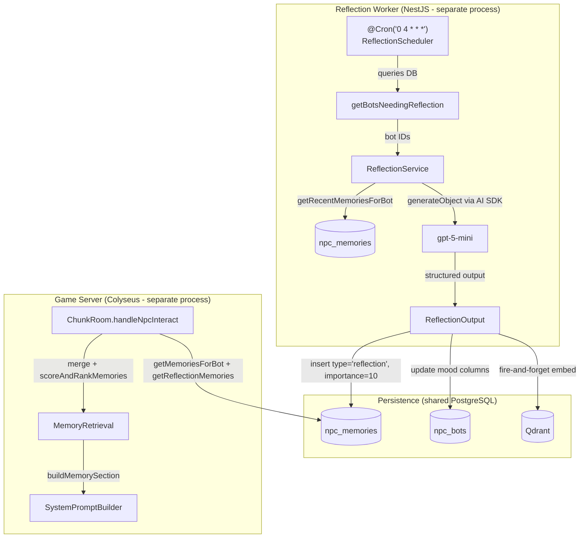

# NPC Daily Reflection (P0.3) Design Document

## Overview

This document specifies the P0.3 implementation of a daily reflection system for Nookstead's homestead NPC bots. Once per real-world day, a dedicated NestJS microservice (`apps/steward/`) generates a reflection for each NPC -- summarizing recent interactions, updating mood with rationale, and forming a next-day plan. Reflections are stored as high-importance records in the existing `npc_memories` table (with `type: 'reflection'`), so they automatically surface in memory retrieval and semantic search without special handling.

## Design Summary (Meta)

```yaml
design_type: "extension"
risk_level: "low"
complexity_level: "medium"
complexity_rationale: >
  (1) ACs require a single LLM call with structured output (summary + mood + plan),
  a separate NestJS microservice with cron scheduling, a DB migration to make
  npc_memories.userId nullable, and verification that high-importance reflections
  naturally surface in existing MemoryRetrieval scoring.
  (2) Risk of NestJS being a new dependency in the monorepo; risk of userId
  nullability migration affecting existing memory queries; risk of LLM structured
  output parsing failure.
main_constraints:
  - "One reflection per NPC per real-world day (not per game-day)"
  - "Must not change LLM provider (OpenAI gpt-5-mini via AI SDK stays)"
  - "Homestead NPCs only (city NPCs do not exist yet)"
  - "LLM failure must never break normal NPC dialogue"
  - "Reflections stored in existing npc_memories table, not a new table"
  - "Reflection worker is a separate NestJS process from the game server"
biggest_risks:
  - "Structured output parsing failure from gpt-5-mini (mitigated by Zod schema + null fallback)"
  - "userId nullability migration affecting existing memory queries (mitigated by: existing queries already filter by userId, null-userId rows are invisible to them)"
  - "NestJS is a new framework dependency in the monorepo (mitigated by: isolated app, minimal NestJS surface area -- only DI + @nestjs/schedule)"
unknowns:
  - "Optimal reflection trigger time (configurable cron, default 04:00 UTC)"
  - "Quality of single-call structured output for three outputs vs separate calls"
```

## Background and Context

### Prerequisite ADRs

- **ADR-0014**: AI Dialogue via OpenAI + Vercel AI SDK -- established AI SDK pattern (`generateText`, `@ai-sdk/openai`)
- **ADR-0015**: NPC Prompt Architecture -- defines SystemPromptBuilder sections and dynamic section injection
- **ADR-0020**: Vector Search Architecture -- established EmbeddingService and VectorStore for semantic memory

No new ADR is required for this feature: the NestJS worker introduces a new framework but is isolated as a standalone app with minimal surface area (DI container + cron scheduler). It does not change the game server architecture, contracts, or data flows. No common ADRs exist in `docs/adr/ADR-COMMON-*`.

### Agreement Checklist

#### Scope
- [x] New NestJS app `apps/steward/` with `@nestjs/schedule` for cron-based scheduling
- [x] `ReflectionService` module -- generates reflection via LLM (AI SDK `generateObject`)
- [x] `ReflectionScheduler` -- cron job triggered once per day (configurable)
- [x] Store reflections in existing `npc_memories` table with `type: 'reflection'` and high importance (9-10)
- [x] DB migration: make `npc_memories.userId` nullable (reflections have no user)
- [x] New DB service function `getReflectionMemories(db, botId)` for fetching reflection records
- [x] New DB service function `getBotsNeedingReflection(db, since)` for scheduling
- [x] Update `npc_bots.mood`, `npc_bots.moodIntensity`, `npc_bots.moodUpdatedAt` via raw Drizzle update
- [x] Embed reflection summaries into Qdrant via existing EmbeddingService/VectorStore
- [x] Evaluate whether SystemPromptBuilder needs changes (reflections may surface naturally via memory retrieval)

#### Non-Scope (Explicitly not changing)
- [x] No changes to DialogueService LLM logic or provider (OpenAI gpt-5-mini stays)
- [x] No changes to MemoryStream or memory creation flow (existing interaction/gift/tool types unchanged)
- [x] No changes to MemoryRetrieval scoring algorithm (it already ranks by importance -- high-importance reflections naturally surface)
- [x] No changes to Colyseus protocol or client-side code
- [x] No changes to game clock system (reflections are real-world-day, not game-day)
- [x] No new `npc_reflections` table (reflections go into `npc_memories`)
- [x] No city NPC support (future scope)
- [x] No admin UI for reflection config (future scope)
- [x] No reflection history viewer in client (future scope)

#### Constraints
- [x] Parallel operation: Yes -- NPCs without reflections function identically to current behavior
- [x] Backward compatibility: Required -- existing memory queries filter by userId, so null-userId reflection rows are invisible to them
- [x] Performance measurement: Not required -- reflection is a background job in a separate process

### Problem to Solve

Currently, NPCs have no sense of continuity between play sessions. When a player returns the next day, the NPC has no summary of previous interactions, no evolved mood rationale, and no personal agenda. This makes NPCs feel stateless and reactive rather than living characters with inner lives.

### Current Challenges

1. **No inter-session continuity**: NPCs only know about individual memories (via MemoryStream) but have no high-level narrative about their day
2. **Mood is purely reactive**: Mood is set by `express_emotion` and `adjust_relationship` tools during dialogue, then decays exponentially -- there is no reflective mood update based on the overall quality of a day
3. **No NPC agency**: NPCs have no plans or intentions that carry between sessions, making them feel purely reactive

### Requirements

#### Functional Requirements

- FR1: Generate a text summary of NPC's daily interactions
- FR2: Update NPC mood based on reflective analysis of the day
- FR3: Generate a next-day plan/intention for the NPC
- FR4: Persist reflection outputs as memory records in `npc_memories`
- FR5: Inject reflections into dialogue context via existing memory retrieval (high importance ensures surfacing)
- FR6: Embed reflection text for semantic search
- FR7: Trigger reflections once per real-world day per NPC via separate worker process
- FR8: Gracefully handle empty days (no interactions)
- FR9: Gracefully handle LLM failures without breaking dialogue

#### Non-Functional Requirements

- **Performance**: Reflection LLM calls run in a separate process; zero latency impact on game server dialogue
- **Reliability**: LLM failure during reflection must not affect NPC dialogue functionality
- **Maintainability**: ReflectionService follows existing MemoryStream/DialogueService patterns (AI SDK, fire-and-forget embedding)
- **Cost**: Single LLM call per NPC per day (not three separate calls)
- **Operational complexity**: Low -- solo developer; worker is a single-process cron job sharing the same DB

## Acceptance Criteria (AC) - EARS Format

### FR1: Day Summary Generation

- [ ] **AC1**: **When** a reflection is triggered for an NPC that had interactions today, the system shall generate a 1-3 sentence summary capturing key events, emotions, and notable moments, stored as an `npc_memories` record with `type = 'reflection'`
- [ ] **AC2**: **When** a reflection is triggered for an NPC with zero interactions today, the system shall generate a brief idle summary (e.g., "Quiet day, tended to my own affairs")

### FR2: Mood Update

- [ ] **AC3**: **When** a reflection completes successfully, the system shall update the NPC's `mood`, `moodIntensity`, and `moodUpdatedAt` columns in `npc_bots` based on the reflection's mood analysis
- [ ] **AC4**: The mood value shall be one of the existing emotion vocabulary (happy, sad, angry, etc.)
- [ ] **AC5**: The mood intensity shall be an integer from 1 to 10

### FR3: Next-Day Plan

- [ ] **AC6**: **When** a reflection completes, the generated memory content shall include a next-day plan/intention

### FR4: Persistence

- [ ] **AC7**: Reflection outputs shall be persisted to the `npc_memories` table with `type = 'reflection'` and `importance >= 9`
- [ ] **AC8**: Saved reflections can be retrieved after system restart
- [ ] **AC9**: At most one reflection per NPC per real-world day (24-hour period)

### FR5: Dialogue Context Integration

- [ ] **AC10**: **When** a player starts dialogue with an NPC, reflection memories shall be included in memory retrieval results due to their high importance score (no special handling needed beyond existing MemoryRetrieval)
- [ ] **AC11**: **When** an NPC has no reflection memories, dialogue shall function normally (no error, no placeholder)

### FR6: Semantic Embedding

- [ ] **AC12**: **When** a reflection is persisted, the system shall embed the memory content and upsert the vector to Qdrant (fire-and-forget pattern)

### FR7: Worker Process

- [ ] **AC13**: The reflection worker shall run as a separate NestJS process from the game server
- [ ] **AC14**: **If** the worker restarts, **then** NPCs that already reflected today shall not re-reflect (DB-based deduplication)

### FR8-9: Graceful Degradation

- [ ] **AC15**: **If** the LLM call fails during reflection, **then** the system shall log the error and skip the reflection for that NPC (no retry, no crash)
- [ ] **AC16**: **If** a reflection fails, **then** existing NPC dialogue shall continue to function normally using whatever prior reflection exists (or none)

## Applicable Standards

### Classification Table

| Standard | Type | Source | Impact on Design |
|----------|------|--------|-----------------|
| Prettier: single quotes, 2-space indent | Explicit | `.prettierrc`, `.editorconfig` | All new code must follow formatting |
| ESLint flat config with Nx module boundaries | Explicit | `eslint.config.mjs` | New modules must respect package boundaries |
| TypeScript strict mode, ES2022, bundler resolution | Explicit | `tsconfig.json` | All new types must pass strict checks |
| Jest test framework | Explicit | `jest.config.ts` (server) | Tests use Jest with `ts-jest` |
| Drizzle ORM for DB schema/queries | Explicit | `packages/db/` | Schema changes use Drizzle, migrations via `drizzle-kit` |
| pnpm workspace monorepo | Explicit | `pnpm-workspace.yaml` | New app at `apps/steward/` auto-detected |
| AI SDK pattern (`generateText`/`generateObject` from `ai`) | Implicit | `DialogueService.ts`, `MemoryStream.ts` | LLM calls use AI SDK, not raw HTTP |
| Fire-and-forget for non-critical async (embedding, memory) | Implicit | `MemoryStream._fireAndForgetEmbed()` | Reflection embedding uses same detached pattern |
| Fail-fast for critical paths, best-effort for ancillary | Implicit | `ChunkRoom` dialogue handlers | Reflection failure must not block dialogue |
| Service class with constructor injection | Implicit | `DialogueService`, `MemoryStream`, `EmbeddingService` | New services follow `{ apiKey, ...options }` constructor pattern |
| DB service functions as standalone exports (not classes) | Implicit | `packages/db/src/services/*.ts` | New DB functions follow existing export pattern |

## Existing Codebase Analysis

### Implementation Path Mapping

| Type | Path | Description |
|------|------|-------------|
| Existing | `apps/server/src/npc-service/ai/DialogueService.ts` | LLM call pattern (AI SDK) |
| Existing | `apps/server/src/npc-service/ai/SystemPromptBuilder.ts` | System prompt assembly with sections |
| Existing | `apps/server/src/npc-service/memory/MemoryStream.ts` | LLM summarization + fire-and-forget embedding |
| Existing | `apps/server/src/npc-service/memory/MemoryRetrieval.ts` | Memory scoring: recency + importance + semantic |
| Existing | `apps/server/src/npc-service/memory/EmbeddingService.ts` | Gemini embedding via AI SDK |
| Existing | `apps/server/src/npc-service/memory/VectorStore.ts` | Qdrant upsert/search |
| Existing | `apps/server/src/rooms/ChunkRoom.ts` | NPC lifecycle, dialogue start/end |
| Existing | `apps/server/src/main.ts` | Server entrypoint (unchanged) |
| Existing | `packages/db/src/schema/npc-bots.ts` | NPC bot table (has mood columns) |
| Existing | `packages/db/src/schema/npc-memories.ts` | Memory table (userId is NOT NULL -- needs migration) |
| Existing | `packages/db/src/services/npc-memory.ts` | DB service functions pattern |
| Existing | `packages/db/src/services/npc-bot.ts` | `updateBot()` does not include mood fields; raw Drizzle `db.update()` needed |
| Existing | `apps/server/src/config.ts` | Server config with `openaiApiKey`, `databaseUrl`, `googleApiKey`, `qdrantUrl` |
| New | `apps/steward/` | New NestJS app for reflection cron job |
| New | `apps/steward/src/main.ts` | NestJS bootstrap entrypoint |
| New | `apps/steward/src/app.module.ts` | Root module with ScheduleModule |
| New | `apps/steward/src/reflection/reflection.module.ts` | Feature module |
| New | `apps/steward/src/reflection/reflection.service.ts` | LLM reflection generation |
| New | `apps/steward/src/reflection/reflection.scheduler.ts` | Cron-triggered orchestration |
| New | `apps/steward/src/reflection/reflection.schema.ts` | Zod schema for LLM structured output |
| New | `apps/steward/src/config/config.module.ts` | Config module (env vars) |
| Modify | `packages/db/src/schema/npc-memories.ts` | Make `userId` nullable |
| New | `packages/db/src/services/npc-reflection.ts` | DB functions for reflection queries |
| Modify | `packages/db/src/index.ts` | Re-export new service functions |
| New | DB migration file | `ALTER COLUMN user_id DROP NOT NULL` on `npc_memories` |

### Similar Functionality Search

- **MemoryStream.generateSummary()**: Generates LLM summaries of dialogue sessions -- closest existing pattern. ReflectionService will follow the same AI SDK approach but use `generateObject` (structured output with Zod) instead of free-form `generateText`.
- **MemoryStream._fireAndForgetEmbed()**: Exact pattern for fire-and-forget embedding. ReflectionService reuses the same EmbeddingService + VectorStore classes.
- **MemoryRetrieval.scoreAndRankMemories()**: Scores memories by `recency * weight + importance * weight + semantic * weight`. With importance=9-10, reflections get `importanceScore = 0.9-1.0` (normalized to 0-1), naturally surfacing them near the top of retrieval results.
- **No existing reflection, scheduler, or daily job system**: This is a new capability.
- **No existing NestJS apps in the monorepo**: This is the first NestJS app.

Decision: **New implementation** following existing patterns for LLM and embedding, with NestJS as a new framework for the worker process. No technical debt to address first.

### Code Inspection Evidence

| File Inspected | Key Finding | Design Impact |
|---------------|-------------|---------------|
| `npc-memories.ts:21-23` | `userId` is `NOT NULL` with FK to `users.id` (`onDelete: cascade`) | Must migrate to nullable; reflections have no user |
| `npc-memories.ts:24` | `type` column exists as `varchar(32)` with default `'interaction'` | Can add `'reflection'` as new type -- no schema change needed for type field |
| `npc-memories.ts:26` | `importance` column is `smallint NOT NULL` | Reflections use importance=9-10 to naturally predominate in retrieval |
| `npc-memory.ts:39-50` | `getMemoriesForBot(db, botId, userId)` filters by BOTH botId AND userId | Null-userId reflections are invisible to this query -- existing behavior preserved |
| `MemoryRetrieval.ts:44-46` | `normalizeImportance(importance)` divides by 10 | importance=10 gives score=1.0 (maximum), ensuring reflections rank highest |
| `MemoryRetrieval.ts:58-91` | `scoreAndRankMemories()` accepts any `NpcMemoryRow[]` array | Reflections can be merged into scored set; function is type-agnostic |
| `MemoryStream.ts:171-197` | `_fireAndForgetEmbed()` detaches embedding from main flow | Reflection embedding uses identical fire-and-forget pattern |
| `MemoryStream.ts:199-230` | `generateSummary()` uses `generateText()` with abort timeout pattern | ReflectionService follows same timeout + try/catch pattern |
| `SystemPromptBuilder.ts:193-203` | `buildMemorySection()` formats memories as `- {content}` bullet list | Reflection memories included automatically if they appear in scored results |
| `SystemPromptBuilder.ts:324-360` | `buildSystemPrompt()` assembles sections; no reflection-specific section | No change needed if reflections surface via memory retrieval |
| `ChunkRoom.ts:1510-1531` | Dialogue start loads memories via `getMemoriesForBot(db, botId, userId)` | Needs to ALSO fetch reflection memories and merge them into scored set |
| `npc-bots.ts:41-43` | `mood`, `moodIntensity`, `moodUpdatedAt` columns exist | Reflection updates these via raw `db.update(npcBots).set(...)` |
| `npc-bot.ts:131-144` | `UpdateBotData` does not include mood fields | Must use raw Drizzle update for mood (same pattern as `adjust-relationship.ts`) |
| `config.ts:11-77` | `ServerConfig` has `openaiApiKey`, `databaseUrl`, `googleApiKey`, `qdrantUrl` | Worker needs its own config (same env vars, own `loadConfig()`) |
| `VectorStore.ts:7-13` | `VectorPayload` has `userId` as required field | Reflections pass `userId: 'system'` or omit; VectorPayload has `[key: string]: unknown` escape hatch |
| `EmbeddingService.ts:12-14` | Constructor takes `{ googleApiKey }` | Worker instantiates its own EmbeddingService from env var |
| `server/package.json:84-98` | Server uses esbuild, AI SDK, Drizzle, Qdrant | Worker shares same DB/AI dependencies |

## Design

### Change Impact Map

```yaml
Change Target: NPC Daily Reflection System (Separate Worker)
Direct Impact:
  - apps/steward/ (new NestJS app -- all new files)
  - packages/db/src/schema/npc-memories.ts (make userId nullable)
  - packages/db/src/services/npc-reflection.ts (new service file)
  - packages/db/src/index.ts (re-export new service functions)
  - DB migration file (ALTER COLUMN user_id DROP NOT NULL)
Indirect Impact:
  - apps/server/src/rooms/ChunkRoom.ts (merge reflection memories into scored set at dialogue start)
  - packages/db/src/services/npc-memory.ts (CreateMemoryData.userId becomes optional)
No Ripple Effect:
  - MemoryStream (unchanged -- always passes userId for interaction/gift/tool memories)
  - MemoryRetrieval (unchanged -- already handles any NpcMemoryRow[])
  - DialogueService (unchanged)
  - SystemPromptBuilder (unchanged -- reflections surface as regular memories)
  - BotManager (unchanged)
  - Colyseus protocol (unchanged)
  - Client-side code (unchanged)
  - Game clock system (unchanged)
  - Relationship system (unchanged)
  - Inventory system (unchanged)
  - apps/server/src/main.ts (unchanged -- no scheduler in game server)
```

### Architecture Overview



### Data Flow

```
Reflection Worker cron tick (daily at 04:00 UTC)
  |
  v
Query: SELECT DISTINCT botId from npc_bots
  WHERE botId NOT IN (
    SELECT botId FROM npc_memories
    WHERE type='reflection' AND created_at >= start_of_today_utc
  )
  |
  v
For each bot needing reflection:
  |
  +-> Load recent memories (last 24h, all types, all users) from npc_memories
  |
  +-> Load bot persona from npc_bots (name, role, personality, traits, mood)
  |
  +-> Call LLM (generateObject with Zod schema):
  |     Input: persona + memories + current mood
  |     Output: { summary, mood, moodIntensity, moodRationale, plan }
  |
  +-> Compose reflection content: "{summary}\n\nMood: {mood} ({moodRationale})\n\nPlan for tomorrow: {plan}"
  |
  +-> Insert into npc_memories: type='reflection', importance=10, userId=null
  |
  +-> Update npc_bots: mood, moodIntensity, moodUpdatedAt
  |
  +-> Fire-and-forget: embed content -> Qdrant
```

### Integration Point Map

```yaml
Integration Point 1:
  Existing Component: packages/db npc_memories schema
  Integration Method: Migration to make userId nullable
  Impact Level: Medium (schema change, but existing queries unaffected due to AND userId filter)
  Required Test Coverage: Verify existing getMemoriesForBot still returns only user-specific memories; verify null-userId inserts succeed

Integration Point 2:
  Existing Component: ChunkRoom.handleNpcInteract() (line ~1510)
  Integration Method: Add getReflectionMemories() query, merge results into rawMemories before scoring
  Impact Level: Medium (adds async query to dialogue start path)
  Required Test Coverage: Dialogue start with/without reflection memories

Integration Point 3:
  Existing Component: packages/db schema and service exports
  Integration Method: New service file + re-exports in index.ts
  Impact Level: Low (additive, no existing code change)
  Required Test Coverage: DB CRUD operations for reflection records

Integration Point 4:
  Existing Component: None (new NestJS app)
  Integration Method: New app in apps/steward/, shares packages/db
  Impact Level: Low (isolated process, no game server changes)
  Required Test Coverage: Cron scheduling, LLM call, DB persistence
```

### Main Components

#### Component 1: ReflectionService (apps/steward)

- **Responsibility**: Generate reflection outputs (summary, mood, plan) for a single NPC using LLM
- **Interface**:
  ```typescript
  interface ReflectionInput {
    botId: string;
    botName: string;
    persona: {
      personality: string | null;
      role: string | null;
      bio: string | null;
      traits: string[] | null;
      goals: string[] | null;
      interests: string[] | null;
    };
    currentMood: string | null;
    currentMoodIntensity: number | null;
    memories: NpcMemoryRow[];
  }

  interface ReflectionOutput {
    summary: string;        // 1-3 sentence day summary
    mood: string;           // emotion word (happy, sad, etc.)
    moodIntensity: number;  // 1-10
    moodRationale: string;  // why this mood
    plan: string;           // 1-2 sentence next-day plan
  }

  @Injectable()
  class ReflectionService {
    constructor(configService: ConfigService);
    generateReflection(input: ReflectionInput): Promise<ReflectionOutput | null>;
  }
  ```
- **Dependencies**: `@ai-sdk/openai`, `ai` (generateObject), `zod` (output schema), `@nestjs/common`

#### Component 2: ReflectionScheduler (apps/steward)

- **Responsibility**: Cron-triggered orchestration of the daily reflection cycle
- **Interface**:
  ```typescript
  @Injectable()
  class ReflectionScheduler {
    constructor(
      reflectionService: ReflectionService,
      configService: ConfigService,
    );

    @Cron('0 4 * * *')  // configurable
    handleCron(): Promise<void>;

    // For testing / manual trigger
    runOnce(): Promise<void>;
  }
  ```
- **Dependencies**: `ReflectionService`, `@nestjs/schedule`, `@nookstead/db`, `EmbeddingService`, `VectorStore`

#### Component 3: DB Service Functions (packages/db)

- **Responsibility**: Query and persist reflection-related data
- **Interface**:
  ```typescript
  // New functions in packages/db/src/services/npc-reflection.ts

  /** Fetch recent memories for a bot (all users, all types) within a time window. */
  function getRecentMemoriesForBot(
    db: DrizzleClient,
    botId: string,
    since: Date
  ): Promise<NpcMemoryRow[]>;

  /** Fetch reflection-type memories for a bot (for dialogue context merging). */
  function getReflectionMemories(
    db: DrizzleClient,
    botId: string,
    limit?: number  // default: 3 (last 3 days)
  ): Promise<NpcMemoryRow[]>;

  /** Get bot IDs that need reflection (no reflection today). */
  function getBotsNeedingReflection(
    db: DrizzleClient,
    since: Date
  ): Promise<Array<{ id: string; name: string }>>;

  /** Create a reflection memory record. */
  function createReflectionMemory(
    db: DrizzleClient,
    data: {
      botId: string;
      content: string;
      importance: number;
    }
  ): Promise<NpcMemoryRow>;
  ```
- **Dependencies**: `drizzle-orm`, `npc-memories` schema, `npc-bots` schema

#### Component 4: ChunkRoom Integration (apps/server)

- **Responsibility**: Merge reflection memories into scored memory set at dialogue start
- **Interface**:
  ```typescript
  // In ChunkRoom.handleNpcInteract(), after getMemoriesForBot():
  const reflectionMemories = await getReflectionMemories(db, botId, 3);
  const allMemories = [...rawMemories, ...reflectionMemories];
  // Then pass allMemories to scoreAndRankMemories() instead of rawMemories
  ```
- **Dependencies**: `getReflectionMemories` from `@nookstead/db`

### Contract Definitions

```typescript
// --- Zod schema for LLM structured output ---
import { z } from 'zod';

export const reflectionOutputSchema = z.object({
  summary: z.string().min(1).max(500).describe(
    'A 1-3 sentence summary of the day from the NPC perspective'
  ),
  mood: z.enum([
    'happy', 'sad', 'angry', 'surprised', 'disgusted', 'fearful',
    'neutral', 'amused', 'grateful', 'annoyed', 'shy', 'proud',
  ]).describe('The NPC current emotional state after reflecting on the day'),
  moodIntensity: z.number().int().min(1).max(10).describe(
    'How strongly the NPC feels this mood, 1=barely, 10=overwhelmingly'
  ),
  moodRationale: z.string().min(1).max(300).describe(
    'Brief explanation of why the NPC feels this way'
  ),
  plan: z.string().min(1).max(300).describe(
    'What the NPC intends to do tomorrow, 1-2 sentences'
  ),
});

export type ReflectionOutput = z.infer<typeof reflectionOutputSchema>;

// --- npc_memories schema change ---
// userId becomes nullable:
userId: uuid('user_id')
  .references(() => users.id, { onDelete: 'cascade' }),
  // Note: .notNull() removed

// --- Reflection memory content format ---
// Stored as single text field in npc_memories.content:
// "[Day reflection] {summary}\n\nMood: {mood} (intensity {moodIntensity}/10) - {moodRationale}\n\nPlan for tomorrow: {plan}"
```

### Data Contract

#### ReflectionService.generateReflection()

```yaml
Input:
  Type: ReflectionInput
  Preconditions:
    - botId is a valid UUID
    - persona has at least botName set
    - memories may be empty array (empty day scenario)
  Validation: None (trusted internal call from scheduler)

Output:
  Type: ReflectionOutput | null
  Guarantees:
    - When non-null, all fields are populated and within schema constraints
    - summary <= 500 chars, moodRationale <= 300 chars, plan <= 300 chars
    - mood is one of the defined emotion vocabulary
    - moodIntensity is 1-10
  On Error: Returns null (logged, never throws)

Invariants:
  - LLM call uses abort timeout (15 seconds)
  - No side effects (caller handles persistence)
```

#### ReflectionScheduler.runOnce()

```yaml
Input:
  Type: void (reads DB state)
  Preconditions: Database is accessible

Output:
  Type: void
  Guarantees:
    - Each bot is reflected at most once per day
    - Failed reflections are logged and skipped (no retry)
    - Mood is updated only on successful reflection
  On Error: Catches all errors, logs, continues to next bot

Invariants:
  - Idempotent: running twice in same day produces no duplicate reflections
  - Bots with a type='reflection' memory created_at >= start of today (UTC) are skipped
```

### Data Representation Decisions

| Data Structure | Decision | Rationale |
|---|---|---|
| ReflectionOutput | **New** Zod schema | No existing type covers summary+mood+plan; this is a new domain concept for LLM structured output validation |
| Reflection storage | **Reuse** existing `npc_memories` table | User requirement: no new table. The `type` field already supports multiple values (`interaction`, `gift`, `tool`). Adding `reflection` is natural. High importance (9-10) ensures reflections predominate in retrieval. |
| Mood vocabulary | **Reuse** existing `EMOTIONS` from `express-emotion.ts` | Same emotion words used in dialogue tools; consistency matters for prompt coherence |
| Worker config | **New** NestJS ConfigModule | Isolated process needs its own config loading; uses same env vars as game server but separate entrypoint |
| Reflection content format | **Reuse** `npc_memories.content` text field | Single text field containing formatted summary + mood + plan. No need for separate columns since content is consumed as a single memory string by MemoryRetrieval/SystemPromptBuilder. |

### Field Propagation Map

```yaml
fields:
  - name: "reflection content (composed from summary + mood + plan)"
    origin: "LLM generateObject output"
    transformations:
      - layer: "ReflectionService"
        type: "ReflectionOutput (Zod validated)"
        validation: "summary: min 1/max 500; mood: enum; moodIntensity: int 1-10; plan: min 1/max 300"
      - layer: "ReflectionScheduler"
        type: "Composed string"
        transformation: "Format into '[Day reflection] {summary}\\nMood: {mood}...\\nPlan: {plan}'"
      - layer: "DB Service (npc_memories)"
        type: "npc_memories.content (text NOT NULL)"
        transformation: "direct insert as content field"
      - layer: "MemoryRetrieval"
        type: "ScoredMemory.memory.content"
        transformation: "scored by recency+importance+semantic, trimmed to token budget"
      - layer: "SystemPromptBuilder"
        type: "string in memory section"
        transformation: "formatted as '- {content}' bullet in memory list"
    destination: "SystemPromptBuilder output -> DialogueService system prompt"
    loss_risk: "none"
    loss_risk_reason: "Content passes through as opaque string; no field-level decomposition after composition"

  - name: "mood"
    origin: "LLM generateObject output"
    transformations:
      - layer: "ReflectionService"
        type: "ReflectionOutput.mood (Zod enum validated)"
        validation: "must be one of EMOTIONS enum values"
      - layer: "ReflectionScheduler"
        type: "string"
        transformation: "extracted from ReflectionOutput for DB update"
      - layer: "DB update (npc_bots)"
        type: "npc_bots.mood (varchar 32)"
        transformation: "db.update(npcBots).set({ mood, moodIntensity, moodUpdatedAt })"
    destination: "npc_bots.mood -> buildMoodSection() in SystemPromptBuilder"
    loss_risk: "none"

  - name: "moodIntensity"
    origin: "LLM generateObject output"
    transformations:
      - layer: "ReflectionService"
        type: "ReflectionOutput.moodIntensity (Zod int 1-10)"
        validation: "integer, min 1, max 10"
      - layer: "DB update (npc_bots)"
        type: "npc_bots.moodIntensity (smallint)"
        transformation: "db.update(npcBots).set({ moodIntensity })"
    destination: "npc_bots.moodIntensity -> buildMoodSection() decay calculation"
    loss_risk: "none"
```

### Integration Boundary Contracts

```yaml
Boundary: ReflectionScheduler -> DB (query bots needing reflection)
  Input: Current timestamp (UTC start of today)
  Output: Array of { id, name } for bots needing reflection (sync, awaited)
  On Error: Log error, skip this scheduler tick entirely

Boundary: ReflectionScheduler -> ReflectionService (generate reflection)
  Input: ReflectionInput (botId, botName, persona, currentMood, memories)
  Output: ReflectionOutput | null (sync, awaited)
  On Error: null return, scheduler logs and continues to next bot

Boundary: ReflectionScheduler -> DB (persist reflection memory)
  Input: { botId, content (composed string), importance: 10 }
  Output: NpcMemoryRow (sync, awaited)
  On Error: Log error, skip mood update + embedding for this bot

Boundary: ReflectionScheduler -> DB (update mood on npc_bots)
  Input: { botId, mood, moodIntensity, moodUpdatedAt }
  Output: void (sync, awaited)
  On Error: Log error, continue (reflection memory already saved)

Boundary: ReflectionScheduler -> EmbeddingService + VectorStore
  Input: Reflection content text, memory row ID
  Output: void (async, fire-and-forget)
  On Error: Logged silently, no impact on reflection or dialogue

Boundary: ChunkRoom -> DB (reflection memory load)
  Input: botId
  Output: NpcMemoryRow[] (sync, awaited, may be empty)
  On Error: Log warning, continue without reflection memories (best-effort)
```

### Interface Change Impact Analysis

| Existing Operation | New Operation | Conversion Required | Adapter Required | Compatibility Method |
|-------------------|---------------|-------------------|------------------|---------------------|
| `npc_memories.userId NOT NULL` | `npc_memories.userId NULLABLE` | Yes -- DB migration | Not Required | Migration: `ALTER COLUMN DROP NOT NULL`; existing inserts still pass userId |
| `CreateMemoryData.userId: string` | `CreateMemoryData.userId?: string` | Yes -- type change | Not Required | Optional field; existing callers always provide it |
| `getMemoriesForBot(db, botId, userId)` | `getMemoriesForBot(db, botId, userId)` (unchanged) | None | Not Required | Unchanged; filters by userId, so null-userId rows invisible |
| `ChunkRoom.handleNpcInteract()` | `ChunkRoom.handleNpcInteract()` (extended) | Yes -- merges reflection memories | Not Required | Additive: `[...rawMemories, ...reflectionMemories]` before scoring |
| `VectorPayload.userId: string` | `VectorPayload.userId: string` | None | Not Required | Reflections pass `userId: 'system'` for Qdrant payload |
| `main.ts` server startup | `main.ts` (unchanged) | None | Not Required | Worker is a separate process |

### Error Handling

| Error Scenario | Handling Strategy | User Impact |
|---|---|---|
| LLM call timeout (>15s) | AbortController cancels, returns null | None -- reflection skipped silently |
| LLM structured output parse failure | Zod validation catches, returns null | None -- reflection skipped silently |
| DB insert failure (createReflectionMemory) | Catch, log, skip mood update | None -- NPC keeps prior mood |
| DB query failure (getBotsNeedingReflection) | Catch, log, skip entire tick | None -- retry next cron trigger |
| DB query failure (getReflectionMemories in ChunkRoom) | Catch, log, omit reflections from memory set | None -- dialogue works without reflections |
| Embedding failure | Fire-and-forget catch, logged | None -- reflection exists in DB, just not in Qdrant |
| Worker process crash | Systemd/PM2 restarts; DB-based dedup prevents re-reflection | None -- missed reflection caught on next run |
| DB connection failure in worker | NestJS startup fails, process exits | None -- game server unaffected |

### Logging and Monitoring

```
[ReflectionScheduler] cron triggered: checking for bots needing reflection
[ReflectionScheduler] found N bots needing reflection
[ReflectionScheduler] reflecting: botId=<id>, botName=<name>
[ReflectionService] reflection generated: botId=<id>, mood=<mood>, intensity=<n>
[ReflectionService] reflection failed: botId=<id>, error=<err>
[ReflectionScheduler] mood updated: botId=<id>, mood=<mood>, intensity=<n>
[ReflectionScheduler] embedding queued: botId=<id>
[ReflectionScheduler] cron complete: reflected=N, skipped=M, failed=K
[ReflectionScheduler] worker started
[ReflectionScheduler] worker stopped
```

## Implementation Plan

### Implementation Approach

**Selected Approach**: Vertical Slice (DB Foundation -> Worker Service -> Game Server Integration)

**Selection Reason**: The feature has a clear bottom-up dependency chain: DB schema migration must happen first (userId nullable), then DB service functions, then the worker process that uses them, and finally the game server integration that reads reflection memories. Each layer can be independently tested. The worker is an isolated process, so its development does not block game server work. A horizontal approach would be harder to verify incrementally since the worker and game server are separate codebases.

### Technical Dependencies and Implementation Order

#### Required Implementation Order

1. **DB Schema Migration + Service Functions (packages/db)**
   - Technical Reason: All other components depend on nullable userId and reflection query functions
   - Dependent Elements: ReflectionScheduler (writes reflections), ChunkRoom (reads reflections)

2. **NestJS Worker Scaffold (apps/steward)**
   - Technical Reason: ReflectionService and ReflectionScheduler live here; must be buildable before adding logic
   - Prerequisites: DB schema migration, `@nestjs/core`, `@nestjs/schedule` dependencies

3. **ReflectionService (apps/steward)**
   - Technical Reason: Scheduler orchestrates ReflectionService; must exist and be testable first
   - Prerequisites: Worker scaffold, Zod schema

4. **ReflectionScheduler (apps/steward)**
   - Technical Reason: Orchestrates the daily cycle; depends on ReflectionService + DB services
   - Prerequisites: ReflectionService, DB service functions

5. **ChunkRoom Integration (apps/server)**
   - Technical Reason: Final wiring; depends on DB service functions being available
   - Prerequisites: `getReflectionMemories()` in packages/db

### Integration Points

**Integration Point 1: DB Layer**
- Components: `npc-memories` schema migration -> `npc-reflection` service -> `packages/db/src/index.ts` exports
- Verification: Unit tests for CRUD operations (createReflectionMemory, getReflectionMemories, getBotsNeedingReflection); verify existing getMemoriesForBot still works correctly

**Integration Point 2: ReflectionService -> LLM**
- Components: ReflectionService -> AI SDK `generateObject` -> gpt-5-mini
- Verification: Unit test with mocked LLM; manual test with real API

**Integration Point 3: Scheduler -> ReflectionService -> DB**
- Components: ReflectionScheduler.runOnce() -> ReflectionService -> DB writes
- Verification: Integration test with mocked LLM + DB assertions

**Integration Point 4: ChunkRoom -> MemoryRetrieval**
- Components: ChunkRoom.handleNpcInteract -> getReflectionMemories -> merge -> scoreAndRankMemories
- Verification: Unit test that scored memories include reflection entries when they exist

### Migration Strategy

- **npc_memories.userId**: Migration to `ALTER COLUMN user_id DROP NOT NULL`. Existing rows are unaffected (they all have non-null userId). New reflection rows have `userId = null`.
- **No data migration needed**: Table has existing data with userId populated; only the constraint is relaxed.
- **Backward compatibility**: `getMemoriesForBot(db, botId, userId)` filters by `AND userId = ?`, so null-userId rows are naturally excluded from existing queries.
- **Drizzle migration**: `pnpm drizzle-kit generate` followed by `pnpm drizzle-kit push`
- **New NestJS app**: No migration -- fresh scaffold. Added to `apps/` directory, auto-detected by pnpm workspace.

## Test Strategy

### Basic Test Design Policy

Each acceptance criterion maps to at least one test case. Tests follow existing project patterns (Jest, `ts-jest`).

### Unit Tests

**ReflectionService** (`apps/steward/src/reflection/__tests__/reflection.service.spec.ts`):
- AC1: Generates structured reflection from memories (mock LLM returns valid ReflectionOutput)
- AC2: Generates idle reflection when memories array is empty (mock LLM)
- AC4: Mood value is valid emotion vocabulary (Zod enum validation)
- AC5: Mood intensity is 1-10 (Zod int validation)
- AC6: Plan is present and non-empty in output
- AC15: Returns null on LLM failure (mock LLM throws)
- AC15: Returns null on LLM timeout (mock AbortController)

**ReflectionScheduler** (`apps/steward/src/reflection/__tests__/reflection.scheduler.spec.ts`):
- AC9: Does not re-reflect bots that reflected today (mock DB returns empty needs-reflection list)
- AC14: Idempotent across worker restarts (mock DB returns already-reflected)
- AC15: Continues to next bot when one fails
- AC7: Creates memory with type='reflection' and importance >= 9
- AC3: Updates mood on npc_bots after successful reflection

### Integration Tests

**DB Service** (`packages/db/src/services/__tests__/npc-reflection.spec.ts`):
- AC7: `createReflectionMemory()` persists with type='reflection', importance=10, userId=null
- AC8: `getReflectionMemories()` returns most recent reflection memories for a bot
- AC9: `getBotsNeedingReflection()` excludes bots with today's reflection
- AC9: `getBotsNeedingReflection()` includes bots with yesterday's reflection
- Verify `getMemoriesForBot(db, botId, userId)` does NOT return null-userId reflections (backward compatibility)

### E2E Verification

- AC10+AC16: Inject reflection memory into DB, start dialogue -> verify memory appears in scored results
- AC16: Start dialogue with NPC that has NO reflection memories -> verify dialogue works normally
- Full scheduler cycle: `runOnce()` with test DB and mocked LLM -> verify DB state (memory created, mood updated)

### Performance Tests

Not required per constraints. Reflection is a background job in a separate process with no latency impact on user-facing paths.

## Security Considerations

- No new external APIs or endpoints exposed (worker is an internal background process)
- Worker uses same env vars as game server (`OPENAI_API_KEY`, `DATABASE_URL`, `GOOGLE_GENERATIVE_AI_API_KEY`, `QDRANT_URL`)
- Reflection content is LLM-generated from existing memories (no new user input surface)
- DB queries use parameterized Drizzle ORM queries (no SQL injection risk)
- Worker has no HTTP listener (no network attack surface)

## Future Extensibility

1. **Reflection history viewer**: Client-side UI to browse past reflections (query `npc_memories WHERE type='reflection'`)
2. **Multi-day reflection**: Weekly/monthly higher-level reflections synthesizing daily ones (new type `'weekly_reflection'`)
3. **Configurable reflection schedule**: Admin UI to set per-bot reflection times
4. **City NPC reflections**: When city NPCs are implemented, extend scheduler to cover them
5. **Reflection-influenced behavior**: NPCs act on their plans (e.g., move to garden area if plan says "tend garden")
6. **Player-triggered reflection**: Let player ask NPC "how was your day?" to trigger on-demand reflection

## Alternative Solutions

### Alternative 1: Build Reflection into Colyseus Game Server

- **Overview**: Add ReflectionScheduler as a `setInterval` timer inside the existing Colyseus server process
- **Advantages**: No new framework dependency; simpler deployment (single process)
- **Disadvantages**: LLM calls in game server process could cause event loop delays during peak load; couples background job lifecycle to game server restart cycle; harder to scale independently
- **Reason for Rejection**: User explicitly requested a separate NestJS microservice for clean separation of concerns

### Alternative 2: New `npc_reflections` Table

- **Overview**: Create a dedicated table for reflection outputs with columns for summary, mood, moodRationale, plan, reflectedAt
- **Advantages**: Clean separation of reflection data from interaction memories; dedicated schema
- **Disadvantages**: Reflections would NOT automatically appear in memory retrieval -- would need special handling in MemoryRetrieval, SystemPromptBuilder, and ChunkRoom; more integration points; more code to maintain
- **Reason for Rejection**: User explicitly requested storing in existing `npc_memories` table. Using high importance naturally surfaces reflections in retrieval with zero changes to MemoryRetrieval or SystemPromptBuilder.

### Alternative 3: Three Separate LLM Calls

- **Overview**: Separate calls for summary, mood update, and plan generation
- **Advantages**: Each call can have a focused prompt; easier to debug individually
- **Disadvantages**: 3x LLM cost per NPC per day; 3x latency; more complex orchestration
- **Reason for Rejection**: Single structured output call is cheaper, faster, and simpler for a solo developer

## Risks and Mitigation

| Risk | Impact | Probability | Mitigation |
|------|--------|-------------|------------|
| NestJS is a new framework dependency | Medium -- learning curve, maintenance burden | Medium | Minimal NestJS surface: only DI + @nestjs/schedule. Worker is ~5 files. Can be replaced with plain cron + Node.js if NestJS proves too heavy. |
| LLM structured output fails consistently | Medium -- NPCs get no reflections | Low | Zod schema with `.describe()` fields; fallback to null; monitoring log line |
| userId nullability migration breaks existing queries | High -- memory retrieval returns wrong data | Low | Existing `getMemoriesForBot(botId, userId)` uses `AND userId = ?` which excludes null rows. Migration is backward-compatible by design. |
| Worker process crash/restart loop | Low -- missed reflections | Medium | DB-based dedup prevents duplicates; systemd/PM2 restart policy; daily cron catches up next day |
| Reflection prompt quality is poor | Low -- NPC says weird things | Medium | Iterative prompt tuning; reflections visible in DB for manual review |
| High NPC count causes LLM rate limiting | Medium -- some NPCs miss reflection | Low | Sequential processing; homestead has max 3 bots per map |
| DB migration conflict with in-flight deploys | Low -- migration fails | Low | Purely relaxing a constraint (DROP NOT NULL); no data changes; can be applied without downtime |

## References

- [Vercel AI SDK `generateObject` documentation](https://sdk.vercel.ai/docs/ai-sdk-core/generating-structured-data) -- structured output with Zod schemas
- [NestJS Task Scheduling documentation](https://docs.nestjs.com/techniques/task-scheduling) -- `@nestjs/schedule` with `@Cron()` decorator
- [Generative Agents: Interactive Simulacra of Human Behavior (Park et al., 2023)](https://arxiv.org/abs/2304.03442) -- foundational paper on NPC reflection/planning architecture
- Internal: `docs/design/design-027-semantic-memory-retrieval.md` -- P0.2 design establishing EmbeddingService/VectorStore patterns
- Internal: `docs/adr/ADR-0014-ai-dialogue-openai-sdk.md` -- AI SDK integration decision
- Internal: `docs/adr/ADR-0015-npc-prompt-architecture.md` -- SystemPromptBuilder section design
- Internal: `docs/adr/ADR-0020-vector-search-architecture.md` -- Vector search architecture

## Update History

| Date | Version | Changes | Author |
|------|---------|---------|--------|
| 2026-03-28 | 1.0 | Initial version (Colyseus-embedded scheduler, npc_reflections table) | AI Technical Designer |
| 2026-03-28 | 2.0 | Complete rewrite: NestJS microservice, reflections in npc_memories table | AI Technical Designer |
