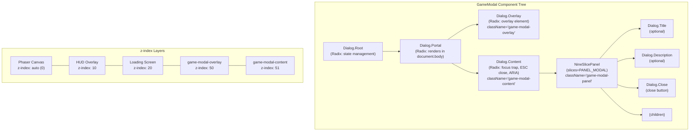
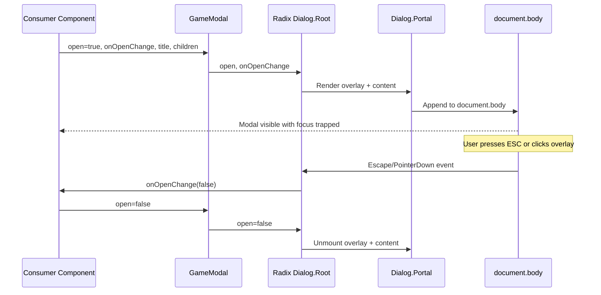

# GameModal Component Design Document

## Overview

A generic, reusable modal component for the Nookstead game client. GameModal wraps Radix UI Dialog primitives with the project's NineSlicePanel pixel-art border system to provide accessible, game-themed modal windows for NPC dialogues, inventory screens, settings panels, and any future in-game UI that requires an overlay.

## Design Summary (Meta)

```yaml
design_type: "new_feature"
risk_level: "low"
complexity_level: "low"
complexity_rationale: "N/A -- low complexity; single component with well-defined props wrapping two established libraries (Radix Dialog, NineSlicePanel)"
main_constraints:
  - "Must use Radix UI Dialog primitives for accessibility (focus trap, ESC close, ARIA)"
  - "Must render pixel-art border via existing NineSlicePanel component"
  - "Must layer above Phaser canvas (z-index 0) and HUD overlay (z-index 10)"
  - "Global CSS with BEM-lite convention, no CSS Modules or Tailwind"
biggest_risks:
  - "New dependency (radix-ui) must be compatible with React 19 and Next.js 16"
  - "Radix Dialog Portal creates a new stacking context; z-index must be coordinated with existing layers"
unknowns:
  - "Whether radix-ui unified package tree-shakes correctly with Next.js 16 bundler"
```

## Background and Context

### Prerequisite ADRs

- No prerequisite ADRs. This is a new UI component that introduces one new dependency (Radix UI) but does not change architecture, data flow, or existing contracts. If additional Radix primitives are adopted later (Tooltip, DropdownMenu, etc.), a common ADR for "Radix UI as the unstyled primitives layer" should be created.

### Agreement Checklist

#### Scope
- [x] New `GameModal` component (`GameModal.tsx`) in `apps/game/src/components/hud/`
- [x] New `PANEL_MODAL` sprite definition in `apps/game/src/components/hud/sprites.ts`
- [x] New modal CSS styles appended to `apps/game/src/app/global.css`
- [x] New test file `apps/game/src/components/hud/GameModal.spec.tsx`
- [x] New dependency: `radix-ui` package

#### Non-Scope (Explicitly not changing)
- [x] NineSlicePanel component logic (consumed as-is via its existing API)
- [x] Existing HUD components (ClockPanel, CurrencyDisplay, EnergyBar, Hotbar, MenuButton)
- [x] Phaser game engine code
- [x] Loading screen
- [x] Existing sprite definitions (SLOT_NORMAL, SLOT_SELECTED, PANEL_DEFAULT)
- [x] No animations for MVP -- simple show/hide

#### Constraints
- [x] Parallel operation: Not applicable (new feature, no migration)
- [x] Backward compatibility: No breaking changes (additive only)
- [x] Performance measurement: Not required (static overlay, no hot path)
- [x] Accessibility: Must meet WAI-ARIA dialog pattern (provided by Radix)

### Problem to Solve

The game needs a generic modal component for displaying overlay content (NPC dialogue, inventory, settings, etc.) that integrates with the existing pixel-art HUD system. Currently there is no modal/dialog component in the codebase.

### Current Challenges

1. **No modal infrastructure**: No component exists for presenting overlay content above the game canvas
2. **Accessibility requirements**: Game modals need focus trapping, keyboard navigation (ESC to close), and proper ARIA attributes -- implementing these from scratch is error-prone
3. **Visual consistency**: Modal borders must use the same 9-slice pixel-art system as existing HUD panels

### Requirements

#### Functional Requirements

- **FR-1**: Provide a `GameModal` React component with controlled open/close state
- **FR-2**: Use Radix UI Dialog primitives for accessibility (focus trap, ESC close, overlay click close, ARIA roles)
- **FR-3**: Wrap modal content in NineSlicePanel with a dedicated `PANEL_MODAL` sprite set
- **FR-4**: Render a semi-transparent dark overlay (`#0a0a1a`) behind the modal
- **FR-5**: Portal-render above the game canvas and HUD layer
- **FR-6**: Support optional title, description, close button, and arbitrary children

#### Non-Functional Requirements

- **Maintainability**: Single-file component with clear prop interface; follows existing BEM-lite CSS convention
- **Accessibility**: Full WAI-ARIA dialog pattern compliance via Radix primitives
- **Bundle size**: Radix Dialog is lightweight (~4KB gzipped); tree-shakable from the unified `radix-ui` package

## Acceptance Criteria (AC) - EARS Format

### FR-1: Controlled Open/Close

- [ ] **When** `open` prop is `true`, the system shall render the modal overlay and content
- [ ] **When** `open` prop is `false`, the system shall not render the modal overlay or content
- [ ] **When** the modal opens, the system shall call no side effects beyond rendering

### FR-2: Accessibility (Radix Dialog)

- [ ] **When** the modal is open, the system shall trap focus within the modal content
- [ ] **When** the user presses the Escape key while the modal is open, the system shall call `onOpenChange(false)`
- [ ] **When** the user clicks the overlay outside the modal content, the system shall call `onOpenChange(false)`
- [ ] The modal content element shall have `role="dialog"` and `aria-modal="true"` attributes
- [ ] **If** a `title` prop is provided, **then** the system shall render it as an accessible dialog title (`aria-labelledby`)
- [ ] **If** a `description` prop is provided, **then** the system shall render it as an accessible dialog description (`aria-describedby`)

### FR-3: NineSlicePanel Integration

- [ ] The modal content shall be wrapped in a NineSlicePanel component
- [ ] The NineSlicePanel shall use `PANEL_MODAL` slices by default
- [ ] **If** a custom `slices` prop is provided, **then** the NineSlicePanel shall use the provided slices instead of `PANEL_MODAL`

### FR-4: Overlay Styling

- [ ] The overlay shall cover the full viewport with `position: fixed` and `inset: 0`
- [ ] The overlay background color shall be `rgba(10, 10, 26, 0.75)` (derived from `#0a0a1a`)
- [ ] The overlay `z-index` shall be greater than the HUD layer (`z-index: 10`)

### FR-5: Portal and Stacking

- [ ] The modal shall render in a Radix Portal (outside the React component tree)
- [ ] The modal content `z-index` shall be greater than the overlay `z-index`
- [ ] The modal shall appear above both the Phaser canvas and the HUD overlay

### FR-6: Content Composition

- [ ] **When** `children` are provided, the system shall render them inside the NineSlicePanel content area
- [ ] **If** a `className` prop is provided, **then** the system shall apply it to the modal content wrapper
- [ ] The close button shall be visually present and keyboard-accessible

## Existing Codebase Analysis

### Implementation Path Mapping

| Type | Path | Description |
|------|------|-------------|
| Existing | `apps/game/src/components/hud/NineSlicePanel.tsx` | 9-slice panel component (consumed, not modified) |
| Existing | `apps/game/src/components/hud/sprites.ts` | Sprite set definitions (modified: add PANEL_MODAL) |
| Existing | `apps/game/src/components/hud/types.ts` | NineSliceSet type definition (consumed, not modified) |
| Existing | `apps/game/src/components/hud/sprite.ts` | Sprite style utilities (consumed, not modified) |
| Existing | `apps/game/src/app/global.css` | Global stylesheet (modified: add modal section) |
| New | `apps/game/src/components/hud/GameModal.tsx` | GameModal component |
| New | `apps/game/src/components/hud/GameModal.spec.tsx` | GameModal unit tests |

### Integration Points

- **NineSlicePanel**: GameModal imports and renders NineSlicePanel with a `slices` prop. No changes to NineSlicePanel are needed.
- **sprites.ts**: New `PANEL_MODAL` constant exported alongside existing sprite sets.
- **global.css**: New CSS section appended at the end, following existing section numbering convention.
- **HUD.tsx / GameApp.tsx**: Not modified in this feature. GameModal is a standalone component that consumers (future features) will import directly.

### Similar Functionality Search

**Domain**: modal, dialog, overlay, popup

**Search results**:
- Grep for `modal|dialog|overlay` in component files: No matches in any `.tsx` files under `apps/game/src/components/`
- The `LoadingScreen` component uses `position: absolute; inset: 0; z-index: 20` as a full-screen overlay, but it is not a dialog and lacks accessibility features
- **Decision**: New implementation required. No existing modal/dialog component exists.

### Code Inspection Evidence

#### What Was Examined

| File Inspected | Key Finding | Design Impact |
|---------------|-------------|---------------|
| `apps/game/src/components/hud/NineSlicePanel.tsx` (73 lines, full) | Accepts `slices` prop (defaults to `PANEL_DEFAULT`), `className` prop, and `children`. Uses `spriteNativeStyle` for corners and `spriteStretchStyle` for edges. | GameModal passes `PANEL_MODAL` as `slices` and `"game-modal-panel"` as `className`. No changes to NineSlicePanel needed. |
| `apps/game/src/components/hud/sprites.ts` (55 lines, full) | Exports `SLOT_NORMAL`, `SLOT_SELECTED`, `PANEL_DEFAULT`, and `SPRITES`. All NineSliceSets follow identical structure with 9 SpriteRect tuples. | Add `PANEL_MODAL` following the same pattern. |
| `apps/game/src/components/hud/types.ts` (42 lines, full) | Defines `NineSliceSet` interface with 9 named SpriteRect fields. Defines `SpriteRect` as `[x, y, w, h]` tuple. | PANEL_MODAL must conform to NineSliceSet interface. |
| `apps/game/src/components/hud/sprite.ts` (96 lines, full) | Provides `spriteNativeStyle` and `spriteStretchStyle` used by NineSlicePanel. Sheet path: `/assets/ui/hud_32.png`. | No changes needed; NineSlicePanel handles all sprite rendering. |
| `apps/game/src/app/global.css` (751 lines, full) | Organized in numbered sections. z-index values: loading-screen=20, hud=10, nine-slice__content=1. BEM-lite naming. PostCSS nesting. | Add new section (Section 7). Modal z-index: overlay=50, content=51. |
| `apps/game/src/components/hud/HUD.tsx` (93 lines, full) | HUD container with `z-index: 10`, `pointer-events: none`, interactive children get `pointer-events: auto`. | Modal portal renders outside HUD tree, so pointer-events model is unaffected. |
| `apps/game/src/components/game/GameApp.tsx` (33 lines, full) | Renders `<div className="game-app">` containing LoadingScreen, PhaserGame, and HUD. | GameModal will be consumed by future feature components, not added to GameApp directly. |
| `apps/game/specs/index.spec.tsx` (37 lines, full) | Uses Jest + React Testing Library + jsdom. Mocks next-auth and next/navigation. | GameModal tests follow the same pattern. |
| `apps/game/jest.config.cts` (18 lines, full) | Uses `next/jest`, jsdom environment, `@nx/react/plugins/jest` transform. | Test file can use standard RTL patterns. |
| `package.json` (73 lines, full) | No `radix-ui` or `@radix-ui/*` packages installed. React 19, Next.js 16. | Must install `radix-ui` package. |
| `apps/game/postcss.config.js` (13 lines, full) | postcss-preset-env, stage 2, nesting-rules enabled. | CSS nesting syntax is supported. |
| `.prettierrc` (3 lines, full) | `{ "singleQuote": true }` | All new code uses single quotes. |
| `apps/game/eslint.config.mjs` (12 lines, full) | Flat config with @nx/eslint-plugin, @next/eslint-plugin-next. | New files must pass lint. |

#### Key Findings

1. **NineSlicePanel API is stable**: Accepts `slices`, `className`, `children` -- exactly what GameModal needs to pass through
2. **z-index layering is simple**: Only three values in use (1, 10, 20). Modal at 50/51 provides ample headroom
3. **No portal infrastructure exists**: Radix Dialog.Portal handles this automatically by appending to `document.body`
4. **BEM-lite naming is consistent**: All HUD components use `component-name__element` pattern
5. **No Radix dependency exists**: Fresh installation of `radix-ui` unified package required
6. **Test infrastructure exists**: Jest + React Testing Library + jsdom environment, though only one spec file exists currently

#### How Findings Influence Design

- NineSlicePanel's existing `slices` prop makes integration trivial -- no wrapper or adapter needed
- z-index gap between HUD (10) and loading screen (20) is small; modal at 50 provides clear separation and future-proofs for additional overlay layers
- Following the `sprites.ts` pattern exactly for PANEL_MODAL ensures consistency
- Radix Dialog Portal renders outside the `.game-app` div, so no stacking context issues with the game container

## Standards Identification

### Explicit Standards (from configuration files)

| Standard | Type | Source | Impact on Design |
|----------|------|--------|------------------|
| TypeScript strict mode | Explicit | `tsconfig.json` | All new code must satisfy strict type checking |
| ESLint flat config with @nx/eslint-plugin | Explicit | `eslint.config.mjs` | New files must pass lint (unused imports, a11y rules) |
| Prettier with single quotes | Explicit | `.prettierrc` | All string literals use single quotes |
| PostCSS with postcss-preset-env stage 2 | Explicit | `postcss.config.js` | CSS nesting syntax is available and required for consistency |
| Jest + jsdom test environment | Explicit | `jest.config.cts` | Tests run in simulated DOM, no real browser |

### Implicit Standards (from code patterns)

| Standard | Type | Source | Impact on Design |
|----------|------|--------|------------------|
| `'use client'` directive on interactive components | Implicit | All HUD component files | GameModal.tsx must have `'use client'` directive |
| BEM-lite CSS naming with component prefix | Implicit | `global.css` | Classes: `.game-modal-overlay`, `.game-modal-content`, etc. |
| NineSliceSet as static const export | Implicit | `sprites.ts` | PANEL_MODAL follows same `export const` pattern |
| `image-rendering: pixelated` on HUD elements | Implicit | `.hud` CSS rule | NineSlicePanel already inherits this from `.hud`; modal outside HUD tree needs explicit setting if pixel rendering matters (border tiles) |
| Section-numbered comments in global.css | Implicit | `global.css` section headers | New section follows numbering convention |

## Design

### Change Impact Map

```yaml
Change Target: New GameModal component
Direct Impact:
  - apps/game/src/components/hud/GameModal.tsx (new file)
  - apps/game/src/components/hud/GameModal.spec.tsx (new test file)
  - apps/game/src/components/hud/sprites.ts (add PANEL_MODAL export)
  - apps/game/src/app/global.css (add modal CSS section)
  - package.json (add radix-ui dependency)
Indirect Impact:
  - None (additive feature, no existing code modified beyond sprites.ts and global.css)
No Ripple Effect:
  - apps/game/src/components/hud/NineSlicePanel.tsx (consumed unchanged)
  - apps/game/src/components/hud/HUD.tsx (not modified)
  - apps/game/src/components/game/GameApp.tsx (not modified)
  - apps/game/src/components/game/LoadingScreen.tsx (not modified)
  - apps/game/src/components/hud/types.ts (not modified)
  - apps/game/src/components/hud/sprite.ts (not modified)
  - Phaser game engine code (no interaction)
```

### Architecture Overview



### Data Flow



### Integration Point Map

```yaml
Integration Point 1:
  Existing Component: NineSlicePanel (apps/game/src/components/hud/NineSlicePanel.tsx)
  Integration Method: Import and render as child of Dialog.Content
  Impact Level: Low (Read-only consumption of existing component)
  Required Test Coverage: Verify NineSlicePanel renders inside modal with correct slices prop

Integration Point 2:
  Existing Component: sprites.ts (apps/game/src/components/hud/sprites.ts)
  Integration Method: Add new PANEL_MODAL export; GameModal imports it as default slices
  Impact Level: Low (Additive export, no existing exports modified)
  Required Test Coverage: Verify PANEL_MODAL conforms to NineSliceSet interface

Integration Point 3:
  Existing Component: global.css (apps/game/src/app/global.css)
  Integration Method: Append new CSS section with modal styles
  Impact Level: Low (Additive styles, no existing selectors modified)
  Required Test Coverage: Verify modal overlay and content have correct z-index values

Integration Point 4:
  Existing Component: Radix UI Dialog (new dependency)
  Integration Method: Import Dialog from 'radix-ui' unified package
  Impact Level: Medium (New npm dependency added to project)
  Required Test Coverage: Verify Dialog renders correctly in jsdom environment
```

### Main Components

#### GameModal Component

- **Responsibility**: Provide accessible modal overlay with pixel-art border for game UI content
- **Interface**: See Component API section below
- **Dependencies**: `radix-ui` (Dialog primitive), `NineSlicePanel`, `PANEL_MODAL` from sprites.ts

#### PANEL_MODAL Sprite Set

- **Responsibility**: Define the 9-slice tile coordinates for the modal border
- **Interface**: `NineSliceSet` (9 SpriteRect tuples)
- **Dependencies**: `hud_32.png` sprite sheet

### Component API (Contract Definition)

```typescript
import type { ReactNode } from 'react';
import type { NineSliceSet } from './types';

interface GameModalProps {
  /** Controlled open state */
  open: boolean;
  /** Called when open state should change (ESC, overlay click, close button) */
  onOpenChange: (open: boolean) => void;
  /** Accessible dialog title (renders visually and as aria-labelledby) */
  title?: string;
  /** Accessible dialog description (renders visually and as aria-describedby) */
  description?: string;
  /** Modal body content */
  children: ReactNode;
  /** Additional CSS class on the content wrapper */
  className?: string;
  /** Override the default PANEL_MODAL nine-slice set */
  slices?: NineSliceSet;
}
```

### Component Composition

The following maps each Radix Dialog part to the rendered output:

```
GameModal (props: GameModalProps)
|
+-- Dialog.Root (open={open}, onOpenChange={onOpenChange})
    |
    +-- Dialog.Portal
        |
        +-- Dialog.Overlay
        |     className="game-modal-overlay"
        |
        +-- Dialog.Content
              className={`game-modal-content ${className ?? ''}`}
              |
              +-- NineSlicePanel (slices={slices ?? PANEL_MODAL}, className="game-modal-panel")
                    |
                    +-- Dialog.Close (className="game-modal-close", aria-label="Close")
                    |     |
                    |     +-- "X" text (pixel font close indicator)
                    |
                    +-- Dialog.Title (className="game-modal-title")
                    |     rendered only if title prop is provided
                    |
                    +-- Dialog.Description (className="game-modal-description")
                    |     rendered only if description prop is provided
                    |
                    +-- {children}
```

### PANEL_MODAL Sprite Definition

New constant added to `apps/game/src/components/hud/sprites.ts`:

```typescript
// 9-slice: modal panel (tiles 0-122) -- top-left panel frame in hud_32.png
export const PANEL_MODAL: NineSliceSet = {
  cornerTL: [0, 0, 32, 32],
  edgeT: [32, 0, 32, 32],
  cornerTR: [64, 0, 32, 32],
  edgeL: [0, 32, 32, 32],
  center: [32, 32, 32, 32],
  edgeR: [64, 32, 32, 32],
  cornerBL: [0, 64, 32, 32],
  edgeB: [32, 64, 32, 32],
  cornerBR: [64, 64, 32, 32],
};
```

### CSS Structure

New section appended to `apps/game/src/app/global.css`:

```css
/* ==========================================================================
   Section 7: Game Modal
   Full-screen modal overlay using Radix Dialog + NineSlicePanel.
   z-index sits above HUD (10) and loading screen (20).
   ========================================================================== */

.game-modal-overlay {
  position: fixed;
  inset: 0;
  background-color: rgba(10, 10, 26, 0.75);
  z-index: 50;
}

.game-modal-content {
  position: fixed;
  top: 50%;
  left: 50%;
  transform: translate(-50%, -50%);
  z-index: 51;
  max-width: 90vw;
  max-height: 90vh;
  outline: none;
}

.game-modal-panel {
  image-rendering: pixelated;
}

.game-modal-close {
  position: absolute;
  top: 4px;
  right: 4px;
  z-index: 2;
  display: flex;
  align-items: center;
  justify-content: center;
  width: 24px;
  height: 24px;
  font-family: var(--font-pixel, 'Press Start 2P', monospace);
  font-size: 10px;
  color: #3b2819;
  background: none;
  border: none;
  cursor: pointer;
  padding: 0;
  line-height: 1;

  &:hover {
    color: #c0392b;
  }

  &:focus-visible {
    outline: 2px solid #ffdd57;
    outline-offset: 1px;
  }
}

.game-modal-title {
  font-family: var(--font-pixel, 'Press Start 2P', monospace);
  font-size: 12px;
  color: #3b2819;
  margin: 0 0 8px;
  padding-right: 28px;
}

.game-modal-description {
  font-family: var(--font-pixel, 'Press Start 2P', monospace);
  font-size: 8px;
  color: #6b4226;
  margin: 0 0 12px;
  line-height: 1.6;
}
```

**z-index Strategy**:

| Layer | z-index | Component |
|-------|---------|-----------|
| Phaser canvas | auto (0) | `<canvas>` inside `.game-app` |
| HUD overlay | 10 | `.hud` |
| Loading screen | 20 | `.loading-screen` |
| **Modal overlay** | **50** | `.game-modal-overlay` |
| **Modal content** | **51** | `.game-modal-content` |

The gap between 20 and 50 allows future intermediate layers (e.g., toast notifications at 30, tooltips at 40) without requiring changes to the modal z-index.

### Portal and Stacking Context

Radix `Dialog.Portal` appends its children directly to `document.body`, which means:

1. The modal overlay and content are **outside** the `.game-app` container
2. They are **outside** the `.hud` container
3. No parent `position: relative` or `transform` creates an interfering stacking context
4. `position: fixed` + `z-index: 50/51` ensures the modal appears above everything

This approach is correct because:
- The Phaser canvas renders inside `.game-app` at the base stacking level
- The HUD renders at `z-index: 10` inside `.game-app`
- The loading screen renders at `z-index: 20` inside `.game-app`
- The modal renders at `z-index: 50/51` on `document.body`, which is a sibling stacking context to `.game-app` and inherently above it in the DOM order

### Implementation Sample

```tsx
'use client';

import { Dialog } from 'radix-ui';
import type { ReactNode } from 'react';
import { NineSlicePanel } from './NineSlicePanel';
import { PANEL_MODAL } from './sprites';
import type { NineSliceSet } from './types';

interface GameModalProps {
  open: boolean;
  onOpenChange: (open: boolean) => void;
  title?: string;
  description?: string;
  children: ReactNode;
  className?: string;
  slices?: NineSliceSet;
}

export function GameModal({
  open,
  onOpenChange,
  title,
  description,
  children,
  className,
  slices = PANEL_MODAL,
}: GameModalProps) {
  return (
    <Dialog.Root open={open} onOpenChange={onOpenChange}>
      <Dialog.Portal>
        <Dialog.Overlay className="game-modal-overlay" />
        <Dialog.Content
          className={`game-modal-content ${className ?? ''}`}
        >
          <NineSlicePanel
            slices={slices}
            className="game-modal-panel"
          >
            <Dialog.Close
              className="game-modal-close"
              aria-label="Close"
            >
              X
            </Dialog.Close>
            {title && (
              <Dialog.Title className="game-modal-title">
                {title}
              </Dialog.Title>
            )}
            {description && (
              <Dialog.Description className="game-modal-description">
                {description}
              </Dialog.Description>
            )}
            {children}
          </NineSlicePanel>
        </Dialog.Content>
      </Dialog.Portal>
    </Dialog.Root>
  );
}
```

### Data Contract

#### GameModal Component

```yaml
Input:
  Type: GameModalProps
  Preconditions:
    - open: boolean (required)
    - onOpenChange: function (required)
    - children: ReactNode (required)
    - title: string (optional)
    - description: string (optional)
    - className: string (optional)
    - slices: NineSliceSet (optional, defaults to PANEL_MODAL)
  Validation: TypeScript compile-time (strict mode)

Output:
  Type: ReactElement (Radix Dialog tree with NineSlicePanel)
  Guarantees:
    - When open=true, overlay and content are mounted in document.body
    - When open=false, nothing is rendered
    - Focus is trapped within content when open
    - ESC key and overlay click trigger onOpenChange(false)
  On Error: React error boundary catches render errors (no custom error handling needed)

Invariants:
  - ARIA attributes are always present on Dialog.Content (role="dialog", aria-modal="true")
  - NineSlicePanel always receives a valid NineSliceSet
```

### Data Representation Decisions

| Data Structure | Decision | Rationale |
|---|---|---|
| `GameModalProps` | **New** dedicated interface | No existing props interface covers modal behavior (open/close state + dialog content). Clearly distinct domain concept. |
| `PANEL_MODAL` | **New** NineSliceSet constant, **reuses** existing `NineSliceSet` type | Same type as SLOT_NORMAL/SLOT_SELECTED but different sprite coordinates. Type reuse is natural; the constant is new because it represents a distinct visual region. |

### Integration Boundary Contracts

```yaml
Boundary Name: GameModal <-> Consumer Component
  Input: GameModalProps (open, onOpenChange, title, description, children, className, slices)
  Output: Rendered modal UI (sync, declarative React rendering)
  On Error: If children throw during render, React error boundary handles it. GameModal itself has no failure modes.

Boundary Name: GameModal <-> Radix Dialog
  Input: open (boolean), onOpenChange (callback)
  Output: Portal-rendered overlay + content with focus management (sync)
  On Error: Radix Dialog does not throw; invalid props result in no render or console warnings.

Boundary Name: GameModal <-> NineSlicePanel
  Input: slices (NineSliceSet), className (string), children (ReactNode)
  Output: Rendered 9-slice grid with pixel-art border (sync)
  On Error: Invalid sprite coordinates render broken background-image positioning (visual bug, no crash).

Boundary Name: GameModal CSS <-> global.css
  Input: CSS class names applied via className attributes
  Output: Visual styling via browser cascade (sync)
  On Error: Missing class name results in unstyled element (visual bug, no crash).
```

### Interface Change Matrix

| Existing Operation | New Operation | Conversion Required | Adapter Required | Compatibility Method |
|-------------------|---------------|-------------------|------------------|---------------------|
| N/A (no existing modal) | `<GameModal>` component | No | No | New component, no migration |
| `sprites.ts` exports | `sprites.ts` exports + `PANEL_MODAL` | No | No | Additive export, no breaking change |
| `global.css` styles | `global.css` styles + Section 7 | No | No | Additive section, no existing styles modified |

### Error Handling

**Build-time errors**:
- Missing `radix-ui` package: Build fails with "Cannot find module 'radix-ui'". Fix: `pnpm add radix-ui`
- TypeScript type mismatch on `slices` prop: Compile error if non-NineSliceSet value passed. Fix: correct the prop type.

**Runtime errors**:
- Radix Dialog with `open=true` but no portal target: Radix defaults to `document.body`, which always exists in a browser environment. No error.
- NineSlicePanel with invalid sprite coordinates: Visual bug (broken background), no crash. Mitigated by static PANEL_MODAL constant with verified coordinates.

**Testing errors**:
- jsdom does not support `Dialog.Portal` appending to `document.body` perfectly. Mitigation: use `{ container: document.body }` or check for portal content with `screen.getByRole('dialog')`.

### Logging and Monitoring

Not applicable for this MVP component. No logging is needed for a purely presentational UI component. Future enhancement: emit an EventBus event on modal open/close if Phaser needs to pause/resume during modals.

## Implementation Plan

### Implementation Approach

**Selected Approach**: Vertical Slice (Feature-driven)

**Selection Reason**: GameModal is a single, self-contained feature with minimal external dependencies. All changes (dependency, sprite definition, CSS, component, tests) deliver one user-facing capability. No foundation layers need to be built first. The component can be fully implemented and tested in isolation before any consumer integrates it.

### Technical Dependencies and Implementation Order

#### Required Implementation Order

1. **Install `radix-ui` package**
   - Technical Reason: Must be available before GameModal.tsx can import Dialog
   - Dependent Elements: GameModal component, test file
   - Command: `pnpm add radix-ui`

2. **Add PANEL_MODAL to sprites.ts**
   - Technical Reason: GameModal imports PANEL_MODAL as the default slice set
   - Prerequisites: None (pure data definition)
   - Dependent Elements: GameModal component

3. **Add modal CSS to global.css**
   - Technical Reason: GameModal applies CSS class names that must resolve to styles
   - Prerequisites: None (pure CSS)
   - Dependent Elements: GameModal component visual rendering

4. **Create GameModal.tsx**
   - Technical Reason: Core component implementation
   - Prerequisites: radix-ui installed, PANEL_MODAL defined, CSS added
   - Dependent Elements: Test file

5. **Create GameModal.spec.tsx**
   - Technical Reason: Verify component behavior matches acceptance criteria
   - Prerequisites: GameModal.tsx exists, radix-ui installed

### Integration Points

**Integration Point 1: Radix Dialog package**
- Components: `radix-ui` (npm) -> `GameModal.tsx`
- Verification: `pnpm nx build game` succeeds; `pnpm nx typecheck game` passes

**Integration Point 2: NineSlicePanel rendering**
- Components: `GameModal.tsx` -> `NineSlicePanel.tsx`
- Verification: GameModal renders NineSlicePanel with PANEL_MODAL slices in test

**Integration Point 3: CSS styling**
- Components: `global.css` -> GameModal DOM elements
- Verification: Visual inspection via dev server; z-index values verified in test or browser DevTools

### Migration Strategy

Not applicable. This is a new feature with no existing implementation to migrate from.

## Test Strategy

### Basic Test Design Policy

Test cases are derived from acceptance criteria. GameModal is a presentational component with behavior provided by Radix Dialog, so tests focus on:
1. Rendering behavior (open/close)
2. Accessibility attributes (ARIA)
3. User interaction (ESC key, overlay click, close button)
4. Component composition (NineSlicePanel, title, description, children)

### Unit Tests

**File**: `apps/game/src/components/hud/GameModal.spec.tsx`

**Test cases derived from acceptance criteria**:

| AC | Test Case | Assertion |
|----|-----------|-----------|
| FR-1 open | renders content when open=true | `screen.getByRole('dialog')` exists |
| FR-1 closed | renders nothing when open=false | `screen.queryByRole('dialog')` is null |
| FR-2 ESC | calls onOpenChange(false) on Escape | mock `onOpenChange` called with `false` |
| FR-2 overlay click | calls onOpenChange(false) on overlay click | mock `onOpenChange` called with `false` |
| FR-2 ARIA | dialog has correct ARIA attributes | element has `role="dialog"` |
| FR-2 title ARIA | title creates aria-labelledby | Dialog.Content has `aria-labelledby` pointing to title element |
| FR-3 NineSlicePanel | NineSlicePanel renders with modal slices | `.game-modal-panel` class present |
| FR-3 custom slices | custom slices override default | NineSlicePanel receives custom slices |
| FR-5 portal | content renders in portal | dialog element is child of document.body |
| FR-6 children | renders arbitrary children | children text visible inside dialog |
| FR-6 className | applies custom className | content element has the custom class |
| FR-6 close button | close button is accessible | button with `aria-label="Close"` exists |

**Coverage target**: 80%+ line coverage for GameModal.tsx

### Integration Tests

Not required for this component. GameModal's integration with NineSlicePanel is tested implicitly in unit tests (NineSlicePanel is rendered as a real component, not mocked).

### E2E Tests

Not required for MVP. GameModal is not yet consumed by any feature. E2E tests should be added when the first consumer (e.g., NPC dialogue, inventory screen) integrates GameModal.

### Build Verification

```bash
pnpm nx build game       # Verify build with radix-ui dependency
pnpm nx typecheck game   # Verify TypeScript types
pnpm nx lint game        # Verify ESLint passes
pnpm nx test game        # Verify unit tests pass
```

## Security Considerations

Not applicable. GameModal is a purely presentational component that does not handle user input (beyond open/close interaction), authentication, or data transmission. Content rendered inside the modal inherits security considerations from the consumer component.

## Future Extensibility

1. **Animations**: CSS transitions or React animation libraries can be added to Dialog.Content and Dialog.Overlay using Radix's `forceMount` prop + CSS `[data-state="open"]` / `[data-state="closed"]` attributes
2. **Multiple modal sizes**: Add size variants via additional CSS classes (`.game-modal-content--sm`, `.game-modal-content--lg`)
3. **Custom close button sprites**: Replace the "X" text with a sprite from `hud_32.png` using the existing `spriteStyle` utility
4. **Nested modals**: Radix Dialog supports nested dialogs natively if needed for confirmation prompts within modals
5. **Alert Dialog variant**: Radix provides `AlertDialog` for non-dismissible confirmations, sharing the same visual wrapper
6. **EventBus integration**: Emit `hud:modal-open` / `hud:modal-close` events so Phaser can pause game updates while a modal is active

## Alternative Solutions

### Alternative 1: Custom Dialog Implementation (no Radix)

- **Overview**: Build focus trapping, ESC handling, overlay click, and ARIA attributes manually
- **Advantages**: No new dependency; full control over implementation
- **Disadvantages**: Significant accessibility implementation effort; error-prone (focus trap edge cases, screen reader announcements, nested dialog support); reinvents well-tested primitives
- **Reason for Rejection**: Radix Dialog provides battle-tested accessibility at ~4KB gzipped. Manual implementation would be slower to build, harder to maintain, and more likely to have accessibility bugs.

### Alternative 2: HTML `<dialog>` Element

- **Overview**: Use the native HTML `<dialog>` element with `showModal()` API
- **Advantages**: Zero dependencies; built-in backdrop, focus trap, and ESC handling
- **Disadvantages**: Styling the `::backdrop` pseudo-element is limited (no NineSlicePanel integration); imperative API (`showModal()` / `close()`) conflicts with React's declarative model; inconsistent behavior across browsers for nested dialogs; limited control over focus restoration
- **Reason for Rejection**: The imperative API requires refs and effects to synchronize with React state, adding complexity. The `::backdrop` cannot contain custom DOM elements like NineSlicePanel. Radix Dialog's declarative API is a better fit for the React component model.

### Alternative 3: Headless UI (by Tailwind Labs)

- **Overview**: Use `@headlessui/react` Dialog component
- **Advantages**: Similar headless approach to Radix; good accessibility
- **Disadvantages**: Primarily designed for Tailwind CSS integration; larger bundle than Radix Dialog; less ecosystem alignment (project does not use Tailwind); fewer primitives available if additional components are needed later
- **Reason for Rejection**: Radix has broader primitive coverage (Dialog, Tooltip, DropdownMenu, etc.) for future game UI needs. Headless UI is optimized for Tailwind workflows that this project intentionally avoids.

## Risks and Mitigations

| Risk | Impact | Probability | Mitigation |
|------|--------|-------------|------------|
| `radix-ui` package incompatible with React 19 / Next.js 16 | High (build failure) | Low | radix-ui unified package (v1.4.x) has React 19 support; verify with `pnpm nx build game` immediately after installation |
| PANEL_MODAL sprite coordinates incorrect | Medium (visual bug) | Medium | Coordinates must be verified in image editor at 1:1 zoom against `hud_32.png` before production use |
| z-index conflict with future overlay components | Low (layering bug) | Low | z-index gap of 30 between HUD (10) and modal (50) provides headroom; document the z-index strategy |
| Radix Dialog Portal breaks server-side rendering | Medium (hydration error) | Low | Radix Portal only renders on the client; GameModal has `'use client'` directive |
| jsdom limitations in tests (portal rendering) | Low (test failure) | Medium | Use `screen.getByRole('dialog')` which searches the entire document, including portals |

## File Changes Summary

### New Files (2)

| File | Description |
|------|-------------|
| `apps/game/src/components/hud/GameModal.tsx` | GameModal component |
| `apps/game/src/components/hud/GameModal.spec.tsx` | GameModal unit tests |

### Modified Files (2)

| File | Change Description |
|------|-------------------|
| `apps/game/src/components/hud/sprites.ts` | Add `PANEL_MODAL` NineSliceSet export |
| `apps/game/src/app/global.css` | Add Section 7: Game Modal styles |

### Package Changes (1)

| Package | Change | Location |
|---------|--------|----------|
| `radix-ui` | Add to dependencies | Root `package.json` |

## References

- [Radix UI Dialog - Official Documentation](https://www.radix-ui.com/primitives/docs/components/dialog) -- Dialog component API, accessibility features, and composition patterns
- [Radix UI Primitives - Releases](https://www.radix-ui.com/primitives/docs/overview/releases) -- Version history and React 19 compatibility notes
- [radix-ui on npm](https://www.npmjs.com/package/radix-ui) -- Unified package (v1.4.x) with tree-shakable exports
- [@radix-ui/react-dialog on npm](https://www.npmjs.com/package/@radix-ui/react-dialog) -- Individual Dialog package (v1.1.15)
- [shadcn/ui Changelog - February 2026: Unified Radix UI Package](https://ui.shadcn.com/docs/changelog/2026-02-radix-ui) -- Migration from individual `@radix-ui/react-*` packages to unified `radix-ui` package
- [WAI-ARIA Dialog Pattern](https://www.w3.org/WAI/ARIA/apg/patterns/dialog-modal/) -- Accessibility requirements for modal dialogs

## Update History

| Date | Version | Changes | Author |
|------|---------|---------|--------|
| 2026-02-15 | 1.0 | Initial version | Claude Code |
