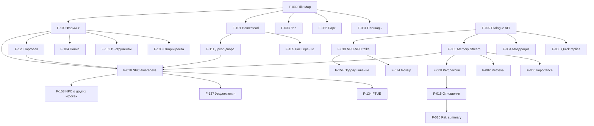

# Nookstead: Детальная дорожная карта фичей v4.0

**Версия:** 4.0
**Дата:** 14 марта 2026
**Статус:** Рабочий документ
**Основание:** product-focus-pmf.md v2.0, revised-roadmap.md v1.1, core-mechanics-analysis.md v1.0, responsive-world-design.md v2.0, farming-game-research.md v1.0, player-behavior-analytics.md v1.0, llm-cost-optimization.md v1.0, GDD v3.0
**Позиционирование:** "Уютная life sim, где мир по-настоящему замечает, что ты делаешь"

---

## Содержание

1. [Резюме и философия продукта](#1-резюме-и-философия-продукта)
2. [Полный реестр фичей](#2-полный-реестр-фичей)
3. [Phase 0: Прототип (текущая)](#3-phase-0-прототип)
4. [Phase 0.5: Валидация экономики LLM](#4-phase-05-валидация-экономики-llm)
5. [Phase 1: Фокусный MVP](#5-phase-1-фокусный-mvp)
6. [Phase 1.5: Закрытая альфа](#6-phase-15-закрытая-альфа)
7. [Phase 2: Софт-лонч](#7-phase-2-софт-лонч)
8. [Phase 3-4: Рост и запуск](#8-phase-3-4-рост-и-запуск)
9. [Граф зависимостей](#9-граф-зависимостей)
10. [Анализ критического пути](#10-анализ-критического-пути)
11. [Реестр рисков](#11-реестр-рисков)

---

## 1. Резюме и философия продукта

### 1.1 Core Job To Be Done

> "Зайти в свой уютный мир, заняться простыми приятными делами (ферма, дом, торговля) и видеть, что люди вокруг замечают и ценят то, что я делаю."

### 1.2 Три неразделимых компонента ценности

| Компонент | Что даёт | Без него |
|---|---|---|
| **Продуктивные активности** (ферма, дом, торговля) | Ритуал, результат усилий, контекст для NPC | NPC разговаривают в пустоте |
| **Отзывчивые NPC** (замечают, комментируют, помнят) | Значимость действий, эмоциональный отклик | Грядка -- просто механика без смысла |
| **Ощущение прогресса** (отношения, хозяйство, город) | Мотивация возвращаться | Каждый день одинаков |

### 1.3 Таймлайн

```
Phase 0:   Прототип          [14 Feb - 10 Apr]   8 нед.   ТЕКУЩАЯ (M0.3 в работе)
Phase 0.5: Экономика LLM     [11 Apr - 8 May]    4 нед.   Валидация стоимости
Phase 1:   Фокусный MVP      [9 May - 17 Jul]    10 нед.  Играбельный продукт
Phase 1.5: Закрытая альфа    [18 Jul - 14 Aug]   4 нед.   50-100 тестеров
Phase 2:   Софт-лонч         [15 Aug - 25 Sep]   6 нед.   Open Beta, 500-1000 игроков
Phase 3:   Рост              [26 Sep - 20 Nov]   8 нед.   5K игроков, маркетинг
Phase 4:   Полный запуск     [21 Nov - 18 Dec]   4 нед.   10K+ MAU
```

### 1.4 Монетизация

- **Базовая покупка:** $8-10 (одноразово) -- полный доступ к игре, неограниченные диалоги
- **Nookstead Plus:** $5-8/мес -- расширенный контент (зоны, NPC, сезонные события)
- **Cosmetic Pass:** $4/сезон -- визуальные предметы (Phase 3+)
- **Trial:** 15 мин бесплатно (достаточно для Magic Moment)

### 1.5 Ключевые метрики успеха

| Метрика | Phase 1.5 | Phase 2 | Phase 4 |
|---------|-----------|---------|---------|
| D1 retention | >= 40% | -- | >= 50% |
| D7 retention | >= 15% | >= 20% | >= 25% |
| MAU | 50-100 | 500-1000 | 10,000+ |
| NPS | >= 30 | -- | >= 40 |
| LLM/выручка | -- | < 40% | < 25% |

---

## 2. Полный реестр фичей

### 2.1 Легенда

**Приоритет:** P0 = Must Have (MVP), P1 = Phase 2, P2 = Phase 3, P3 = Post-launch, CUT = Вырезано
**Риск:** L = Low, M = Medium, H = High
**Job:** A = Активности, R = Отзывчивость NPC, P = Прогрессия, T = Техническое, E = Экономика

### 2.2 AI и NPC система

| ID | Фича | Фаза | Приоритет | Зависимости | Усилия (дни) | Риск | Job |
|----|-------|------|-----------|-------------|-------------|------|-----|
| F-001 | Seed Persona NPC (JSON-конфигурация) | 0 | P0 | -- | 2 | L | R |
| F-002 | Диалог с Claude API (prompt builder) | 0 | P0 | F-001 | 5 | M | R |
| F-003 | Quick replies + свободный текст | 0 | P0 | F-002 | 3 | L | R |
| F-004 | Модерация ввода/вывода | 0 | P0 | F-002 | 2 | M | R |
| F-005 | Memory stream (хранение) | 0 | P0 | F-002 | 4 | M | R |
| F-006 | Importance scoring (Haiku) | 0 | P0 | F-005 | 3 | M | R |
| F-007 | Memory retrieval (recency+importance+relevance) | 0 | P0 | F-005, F-006 | 5 | H | R |
| F-008 | Ежедневная рефлексия (Sonnet) | 0 | P0 | F-005 | 3 | M | R |
| F-009 | Ежедневный план NPC (Haiku) | 1 | P0 | F-001 | 3 | L | R |
| F-010 | A*-навигация NPC | 0 | P0 | -- | 4 | L | R |
| F-011 | NPC State Machine (SLEEPING/WALKING/WORKING/TALKING) | 0 | P0 | F-010 | 3 | L | R |
| F-012 | NPC Tier System (FULL/NEARBY/BACKGROUND) | 0 | P0 | F-002 | 3 | M | E |
| F-013 | NPC-to-NPC спонтанные разговоры | 1 | P0 | F-002, F-010 | 5 | M | R |
| F-014 | Gossip Propagation (распространение информации между NPC) | 1 | P0 | F-013, F-005 | 5 | H | R |
| F-015 | Система отношений (5 уровней, AI-driven) | 1 | P0 | F-008 | 5 | M | P |
| F-016 | Relationship summary в промпте | 1 | P0 | F-015 | 2 | L | R |
| F-017 | Эмоциональные пузыри над NPC | 1 | P0 | F-011 | 2 | L | R |
| F-018 | NPC Event-Driven Awareness | 1 | P0 | F-005, F-002 | 8 | H | R |
| F-019 | Органические квесты из рефлексий | 2 | P1 | F-008, F-018, F-015 | 6 | H | R,P |
| F-020 | NPC Character Arcs (Signature Moments) | 2 | P1 | F-015 | 8 | M | R,P |
| F-021 | NPC-NPC динамические отношения | 3 | P2 | F-013, F-008 | 6 | M | R |
| F-022 | AI Storyteller (модуляция темпа событий) | 3 | P2 | F-018, F-021 | 10 | H | R |
| F-023 | 5-8 NPC с полным стеком (MVP) | 1 | P0 | F-001-F-018 | 10 | M | R |
| F-024 | +3 NPC (итого 8-11) | 2 | P1 | F-023 | 6 | L | R |
| F-025 | +7-9 NPC (итого 15-20) | 3 | P2 | F-024 | 12 | M | R |

### 2.3 Мир и навигация

| ID | Фича | Фаза | Приоритет | Зависимости | Усилия (дни) | Риск | Job |
|----|-------|------|-----------|-------------|-------------|------|-----|
| F-030 | Tile Map (Tiled, JSON, Phaser) | 0 | P0 | -- | 5 | L | T |
| F-031 | Центральная площадь + Рыночная улица | 1 | P0 | F-030 | 4 | L | A |
| F-032 | Парк | 1 | P0 | F-030 | 3 | L | A |
| F-033 | Лес (зона сбора) | 1 | P0 | F-030 | 3 | L | A |
| F-034 | Переход homestead <-> город | 1 | P0 | F-030 | 2 | L | T |
| F-035 | День/ночь cycle (GameClock) | 0 | P0 | -- | 3 | L | A |
| F-036 | Бар "Тихий уголок" | 2 | P2 | F-030, F-015 | 3 | L | A |
| F-037 | Жилой квартал | 2 | P2 | F-030 | 3 | L | A |
| F-038 | Библиотека | 2 | P2 | F-030 | 3 | L | A |
| F-039 | Пристань и пляж | 2 | P2 | F-030 | 3 | L | A |
| F-040 | Погода (визуальная) | 2 | P2 | F-035 | 4 | L | A |
| F-041 | Погода (влияние на геймплей: дождь = автополив) | 2 | P2 | F-040, F-100 | 3 | M | A |
| F-042 | Расширение города (все районы) | 3 | P2 | F-036-F-039 | 8 | L | A |

### 2.4 Фермерство и участок

| ID | Фича | Фаза | Приоритет | Зависимости | Усилия (дни) | Риск | Job |
|----|-------|------|-----------|-------------|-------------|------|-----|
| F-100 | Базовое фермерство (5 культур) | 1 | P0 | F-030 | 8 | M | A |
| F-101 | Участок игрока (homestead): дом + двор + огород 3x3 | 1 | P0 | F-030 | 5 | M | A |
| F-102 | Инструменты (мотыга, лейка, серп) -- 3 уровня | 1 | P0 | F-100 | 4 | L | A |
| F-103 | Визуальные стадии роста (5 стадий на культуру) | 1 | P0 | F-100 | 4 | L | A |
| F-104 | Система полива (без наказания: пропуск = пауза роста) | 1 | P0 | F-100 | 2 | L | A |
| F-105 | Расширение участка (3x3 -> 4x4 -> 5x5 -> 6x6) | 1 | P0 | F-101, F-110 | 3 | L | A,P |
| F-106 | Расширенный фарминг (+5 культур, итого 10) | 2 | P1 | F-100 | 4 | L | A |
| F-107 | Сезонность культур | 2 | P1 | F-106, F-035 | 4 | M | A |
| F-108 | Куры (кормление -> яйца, NPC замечают) | 2 | P1 | F-100, F-018 | 6 | M | A |
| F-109 | +5 культур (итого 15) + фруктовые деревья | 3 | P2 | F-106 | 6 | L | A |
| F-110 | Экономическая система (монеты) | 1 | P0 | -- | 2 | L | E |
| F-111 | Декорация двора (клумбы, скамейки) | 1 | P0 | F-101 | 3 | L | A |
| F-112 | Декорация дома (базовая мебель) | 2 | P1 | F-101 | 5 | L | A |
| F-113 | Спринклеры/автоматизация полива | 3 | P3 | F-104 | 4 | L | A |
| F-114 | Домашние питомцы (собака/кот) | 3 | P2 | F-101 | 5 | L | A |

### 2.5 Экономика и торговля

| ID | Фича | Фаза | Приоритет | Зависимости | Усилия (дни) | Риск | Job |
|----|-------|------|-----------|-------------|-------------|------|-----|
| F-120 | Рыночная торговля (продажа урожая NPC-торговцу) | 1 | P0 | F-100, F-110 | 4 | L | A,E |
| F-121 | NPC-специфическое ценообразование (Марко +20% ягоды) | 1 | P0 | F-120, F-023 | 3 | L | A,E |
| F-122 | Покупка семян и инструментов на рынке | 1 | P0 | F-120 | 2 | L | E |
| F-123 | Дикий сбор (ягоды, грибы, цветы, ракушки) | 1 | P0 | F-033 | 3 | L | A |
| F-124 | Инвентарь (сетка, стакинг, persistence) | 1 | P0 | -- | 5 | M | T |
| F-125 | Подарки NPC (отдать предмет -> NPC реагирует) | 1 | P0 | F-124, F-002 | 3 | L | R |
| F-126 | Player-to-player торговля | 3 | P2 | F-124, F-150 | 5 | M | A |
| F-127 | Почтовый ящик (письма от NPC) | 1 | P0 | F-008 | 3 | L | R,P |

### 2.6 UI и онбординг

| ID | Фича | Фаза | Приоритет | Зависимости | Усилия (дни) | Риск | Job |
|----|-------|------|-----------|-------------|-------------|------|-----|
| F-130 | HUD (время, монеты, мини-карта) | 1 | P0 | F-035, F-110 | 4 | L | T |
| F-131 | Окно диалога (DialogueWindow) | 0 | P0 | F-002 | 4 | L | R |
| F-132 | Интерфейс инвентаря | 1 | P0 | F-124 | 3 | L | T |
| F-133 | Интерфейс магазина (buy/sell) | 1 | P0 | F-120 | 3 | L | E |
| F-134 | FTUE: прибытие + встреча с мэром + экскурсия | 1 | P0 | F-023, F-100 | 5 | M | P |
| F-135 | FTUE: первая посадка + первый NPC-ответ на действие | 1 | P0 | F-018, F-134 | 3 | H | R |
| F-136 | Доска объявлений (3 ежедневных задания) | 1 | P0 | F-110 | 3 | L | A,P |
| F-137 | Уведомления "мир жил без тебя" при входе | 1 | P0 | F-018, F-008 | 3 | M | R |
| F-138 | Настройки (звук, графика) | 2 | P1 | -- | 2 | L | T |

### 2.7 Мультиплеер

| ID | Фича | Фаза | Приоритет | Зависимости | Усилия (дни) | Риск | Job |
|----|-------|------|-----------|-------------|-------------|------|-----|
| F-150 | Базовый мультиплеер (2-10 игроков на сервере) | 0 | P0 | -- | 5 | M | T |
| F-151 | Видимость других игроков на карте | 0 | P0 | F-150 | 3 | L | T |
| F-152 | Эмоции/жесты (wave, nod, dance, show item) | 1 | P0 | F-150 | 3 | L | A |
| F-153 | NPC упоминают других игроков в диалогах | 1 | P0 | F-018, F-150 | 3 | M | R |
| F-154 | Подслушивание NPC-NPC разговоров | 1 | P0 | F-013 | 2 | L | R |
| F-155 | Масштабирование до 20 игроков/сервер | 2 | P1 | F-150 | 4 | M | T |
| F-156 | Посещение участков друзей | 2 | P1 | F-101, F-155 | 4 | M | A |
| F-157 | Чат (локальный, общий) | 2 | P1 | F-150 | 3 | L | T |
| F-158 | Масштабирование до 100 игроков/сервер | 3 | P2 | F-155 | 8 | H | T |

### 2.8 Аналитика и инфраструктура

| ID | Фича | Фаза | Приоритет | Зависимости | Усилия (дни) | Риск | Job |
|----|-------|------|-----------|-------------|-------------|------|-----|
| F-170 | Телеметрия (сессии, диалоги, farming events) | 1 | P0 | -- | 4 | L | T |
| F-171 | LLM Cost Tracker (стоимость/диалог, /игрок, /час) | 0.5 | P0 | F-002 | 3 | L | E |
| F-172 | Дашборд retention/costs | 1 | P0 | F-170, F-171 | 4 | M | T |
| F-173 | A/B тестирование (промпты, конфигурации) | 0.5 | P0 | F-170 | 4 | M | T |
| F-174 | Prompt Caching (Anthropic API) | 0.5 | P0 | F-002 | 3 | L | E |
| F-175 | NPC Quality Metrics (in-character rate, relevance) | 0.5 | P0 | F-170 | 3 | M | T |
| F-176 | Прототип монетизации (premium/подписка) | 2 | P1 | F-170 | 5 | M | E |

### 2.9 Прогрессия

| ID | Фича | Фаза | Приоритет | Зависимости | Усилия (дни) | Риск | Job |
|----|-------|------|-----------|-------------|-------------|------|-----|
| F-190 | Репутация в городе (5 уровней) | 1 | P0 | F-015, F-136 | 3 | L | P |
| F-191 | Сезонная система (4 сезона x 7 дней) | 2 | P1 | F-035 | 5 | M | A,P |
| F-192 | Коллекционирование (альбом культур, рецепты, истории NPC) | 2 | P1 | F-015, F-100 | 4 | L | P |
| F-193 | Достижения (значки в профиле) | 3 | P2 | F-190 | 3 | L | P |
| F-194 | Эмерджентные события (праздник, собрание, конфликт) | 3 | P2 | F-021, F-022 | 8 | H | R,P |
| F-195 | Косметический магазин | 3 | P2 | F-176 | 4 | L | E |

### 2.10 Звук и полировка

| ID | Фича | Фаза | Приоритет | Зависимости | Усилия (дни) | Риск | Job |
|----|-------|------|-----------|-------------|-------------|------|-----|
| F-200 | Музыка (lo-fi/ambient по зонам и времени суток) | 3 | P2 | F-035 | 5 | L | A |
| F-201 | Звуковые эффекты (шаги, инструменты, монеты, урожай) | 3 | P2 | F-100 | 4 | L | A |
| F-202 | NPC "голоса" (звуковые фразы при диалоге) | 3 | P2 | F-002 | 3 | L | R |
| F-203 | Анимации UI (переходы, всплывающие элементы) | 2 | P1 | F-130 | 3 | L | T |
| F-204 | Анимация сбора урожая ("pop" эффект) | 1 | P0 | F-100 | 2 | L | A |

---

## 3. Phase 0: Прототип (14 февраля -- 10 апреля 2026)

**Статус:** В работе. M0.1 (DONE), M0.2 (DONE), M0.3 (IN PROGRESS), M0.4 (PLANNED).

**Цель:** Доказать ключевой USP -- игрок ходит по общему городу и разговаривает с AI NPC, который помнит прошлые разговоры.

### 3.1 M0.3 NPC Talks (14-27 марта) -- IN PROGRESS

Подробные спецификации -- см. `docs/strategy/revised-roadmap.md`, раздел 4.1.

**Ключевые фичи:** F-001, F-002, F-003, F-004, F-131
**Результат:** Игрок разговаривает с Marko, ответ < 3 секунд, NPC в образе, стоимость < $0.005/реплику.

### 3.2 M0.4 NPC Remembers (28 марта -- 10 апреля) -- PLANNED

Подробные спецификации -- см. `docs/strategy/revised-roadmap.md`, раздел 4.2.

**Ключевые фичи:** F-005, F-006, F-007, F-008
**Результат:** NPC ссылается на прошлые разговоры, рефлексии генерируют осмысленные выводы, стоимость < $0.01/игрок/час.

### 3.3 Критерии Go/No-Go (Phase 0 -> 0.5)

| Критерий | Порог GO | Порог NO-GO |
|----------|----------|-------------|
| Ощущение "живого персонажа" (тестеры) | >= 7/10 | < 5/10 |
| Стоимость LLM/игрок/час | < $0.02 | > $0.05 |
| p95 латентность ответа | < 5 сек | > 10 сек |
| NPC in-character rate | >= 90% | < 70% |
| Релевантность памяти | >= 80% | < 60% |

---

## 4. Phase 0.5: Валидация экономики LLM (11 апреля -- 8 мая 2026)

**Цель:** Подтвердить, что стоимость LLM-вызовов совместима с жизнеспособной бизнес-моделью. Ключевой вопрос: можно ли снизить стоимость ниже 30% от целевого ARPPU?

### 4.1 F-050: LLM Cost Measurement Dashboard

**ID:** F-050
**Приоритет:** P0 | **Усилия:** 3 дня | **Риск:** Low | **Job:** E (Экономика)
**Зависимости:** F-002 (Dialogue API), F-171 (Cost Tracker)

**Что:** Реал-тайм дашборд, показывающий точную стоимость каждой LLM-операции.

**Механика:**
- Хук в каждый LLM-вызов (dialogue, importance scoring, reflection, planning, NPC-NPC talk)
- Запись в таблицу `llm_cost_log`: `{timestamp, operation_type, model, input_tokens, output_tokens, cached_tokens, cost_usd, npc_id, player_id}`
- Агрегация в PostgreSQL: стоимость/диалог, стоимость/NPC/день, стоимость/игрок/час, стоимость/операция
- Admin-панель (Next.js page): графики по времени, breakdown по типам операций, top-expensive NPC/игроки

**Acceptance Criteria:**
- [ ] Каждый LLM-вызов логируется с точностью до токена
- [ ] Дашборд показывает стоимость в реальном времени (задержка < 5 мин)
- [ ] Можно увидеть точный $ spent на конкретного NPC, конкретного игрока, за конкретный час
- [ ] Breakdown по типам операций: dialogue vs reflection vs planning vs importance vs NPC-NPC

### 4.2 F-051: Prompt Caching Implementation

**ID:** F-051 (= F-174)
**Приоритет:** P0 | **Усилия:** 3 дня | **Риск:** Low | **Job:** E
**Зависимости:** F-002

**Что:** Реализовать Anthropic prompt caching для статических частей промптов.

**Механика:**
- Статические части (seed persona, правила поведения, формат ответа) -- кешируемые (`cache_control: {"type": "ephemeral"}`)
- Динамические части (воспоминания, история разговора, текущий контекст) -- не кешируемые
- Цель: cached_token_ratio > 60% от общего input

**Структура промпта после оптимизации:**
```
[CACHED] System prompt: persona (800 tok) + rules (300 tok) + format (200 tok) = ~1300 tok @ $0.30/1M
[DYNAMIC] Memories (400 tok) + History (600 tok) + Context (200 tok) = ~1200 tok @ $3.00/1M
[OUTPUT] Response (100 tok) @ $15.00/1M
```

**Ожидаемая экономия:**
- До: input = 2500 tok @ $3.00/1M = $0.0075
- После: cached 1300 tok @ $0.30/1M = $0.00039 + uncached 1200 tok @ $3.00/1M = $0.0036
- Экономия на input: ~53%. Общая экономия на диалог: ~30-35%

**Acceptance Criteria:**
- [ ] Cached token ratio > 60% в production-диалогах
- [ ] Стоимость одного dialogue turn снижена >= 30% vs baseline
- [ ] Качество ответов не деградировало (A/B тест, N=50)

### 4.3 F-052: Haiku A/B Test для диалогов

**ID:** F-052
**Приоритет:** P0 | **Усилия:** 5 дней | **Риск:** Medium | **Job:** E, R
**Зависимости:** F-002, F-173 (A/B framework)

**Что:** Слепое сравнение качества диалогов Haiku 3.5 vs Sonnet.

**Механика:**
- 50/50 split: половина диалогов на Haiku, половина на Sonnet
- 10 тестеров оценивают 20 диалогов каждый (40 overall) по шкале 1-10
- Метрики: "ощущение живого персонажа", "уместность ответа", "эмоциональная глубина", "in-character consistency"
- Тестеры не знают, какая модель использовалась

**Три конфигурации для тестирования:**
1. **Full Sonnet:** Все реплики через Sonnet ($0.007/turn)
2. **Full Haiku:** Все реплики через Haiku 3.5 ($0.002/turn)
3. **Hybrid:** Первая реплика + прощание через Sonnet, остальные через Haiku ($0.003/turn avg)

**Acceptance Criteria:**
- [ ] Завершено >= 200 оценённых диалогов (100 Sonnet, 100 Haiku)
- [ ] Статистически значимая разница (или отсутствие) между моделями
- [ ] Если Haiku >= 6/10 при Sonnet >= 7/10 -- Hybrid принимается (экономия 57%)
- [ ] Рекомендация: какую модель использовать для каких операций

### 4.4 F-053: Time Speed A/B Test

**ID:** F-053
**Приоритет:** P0 | **Усилия:** 4 дня | **Риск:** Medium | **Job:** T
**Зависимости:** F-035 (GameClock)

**Что:** Тестирование оптимальной скорости игрового времени.

**Механика:**
- 3 сервера с разной скоростью:
  - Сервер A: 1x (реальное время, 1 игровой день = 24 реальных часа)
  - Сервер B: 4x (1 игровой день = 6 реальных часов)
  - Сервер C: 12x (1 игровой день = 2 реальных часа)
- Замеры: стоимость планов/рефлексий (при 12x = 12 рефлексий/сутки!), ощущение темпа (опрос), частота взаимодействий с NPC

**Влияние на LLM-расходы:**
| Скорость | Рефлексий/реал.день | Планов/реал.день | Стоимость планов+рефлексий/NPC/день |
|----------|--------------------|-----------------|------------------------------------|
| 1x | 1 | 1 | ~$0.01 |
| 4x | 4 | 4 | ~$0.04 |
| 12x | 12 | 12 | ~$0.12 |

**Acceptance Criteria:**
- [ ] Определена оптимальная скорость (качество опыта + стоимость)
- [ ] При выбранной скорости стоимость планов+рефлексий < 20% от общего LLM-бюджета
- [ ] Тестеры оценивают темп >= 7/10

### 4.5 F-054: Unit Economics Model

**ID:** F-054
**Приоритет:** P0 | **Усилия:** 3 дня | **Риск:** Low | **Job:** E
**Зависимости:** F-050, F-051, F-052, F-053

**Что:** Финансовая модель для трёх сценариев масштабирования.

**Структура модели:**
```
Входные параметры:
- DAU, MAU
- Диалогов/игрок/день (из данных Phase 0)
- Стоимость/диалог (после оптимизации)
- Конверсия trial -> paid
- Конверсия paid -> subscription
- Churn rate

Выходные метрики:
- LLM cost/player/month
- Revenue/player/month (ARPPU)
- LTV vs CAC
- Breakeven DAU
- Monthly burn rate
```

**Три сценария:**
| Параметр | Пессимистичный | Базовый | Оптимистичный |
|----------|---------------|---------|---------------|
| DAU | 1K | 5K | 15K |
| Диалогов/день/игрок | 3 | 5 | 7 |
| LLM cost/игрок/мес | $3.00 | $2.50 | $2.00 |
| Trial->Paid conversion | 50% | 70% | 80% |
| Paid->Sub conversion | 20% | 30% | 40% |
| ARPPU (год) | $56 | $84 | $110 |

**Acceptance Criteria:**
- [ ] Модель рассчитана для всех трёх сценариев
- [ ] Breakeven точка определена (ожидание: 25-30K MAU)
- [ ] LTV > CAC * 3 хотя бы для базового сценария
- [ ] Чёткая рекомендация по модели монетизации

### 4.6 Критерии Go/No-Go (Phase 0.5 -> 1)

| Критерий | GO | NO-GO |
|----------|-----|-------|
| LLM cost/платящий игрок | < 30% от ARPPU | > 50% от любого ARPPU |
| Качество диалогов при оптимизации | >= 6/10 | < 4/10 |
| Финансовая модель | LTV > CAC * 3 | Ни одна модель не breakeven при 10K DAU |
| Оптимальная скорость времени | Определена | Все варианты имеют критические проблемы |

---

## 5. Phase 1: Фокусный MVP (9 мая -- 17 июля 2026, 10 недель)

**Цель:** Выпустить минимальный играбельный продукт, доказывающий, что "уютная life sim с живым миром" -- уникальный и удерживающий игровой опыт.

**Ключевой инсайт:** Без продуктивных активностей (фарминг, торговля) NPC не на что реагировать. Ядро ценности -- не AI-разговоры сами по себе, а **мир, который замечает, что ты делаешь**.

### 5.1 F-100: Базовая система фермерства

**ID:** F-100
**Приоритет:** P0 | **Усилия:** 8 дней | **Риск:** Medium | **Job:** A (Активности)
**Зависимости:** F-030 (Tile Map), F-110 (Экономика)
**Владелец:** Mechanics Developer

#### Детальная механика

**Цикл фермерства:**
```
[Вскопать грядку (мотыга)] -> [Посадить семя] -> [Полить (лейка)] ->
-> [Ждать рост: стадии seed->sprout->growing->mature->harvestable] ->
-> [Собрать урожай (руки/серп)] -> [Продать/подарить/использовать]
```

**5 культур MVP:**

| Культура | Сезон | Время роста | Полив | Стоимость семени | Цена продажи | Прибыль | Связь с NPC |
|----------|-------|-------------|-------|-----------------|-------------|---------|-------------|
| **Редис** | Весна/Лето | 12 часов | 1x/день | 5 монет | 15 монет | 200% | Степан: "Хорошее начало!" |
| **Картофель** | Весна | 2 дня | 1x/день | 8 монет | 25 монет | 212% | Ира: "Из картошки суп сварю!" |
| **Клубника** | Весна/Лето | 3 дня | 2x/день | 15 монет | 40 монет | 167% | Марко: "Для пирога -- идеально!" |
| **Помидоры** | Лето | 4 дня | 2x/день | 12 монет | 30 монет | 150% | Торговец: "Опять помидоры?!" |
| **Тыква** | Осень | 6 дней | 2x/день | 20 монет | 60 монет | 200% | Лена: "Какая красивая тыква!" |

**Почему именно эти 5:**
1. **Редис** -- instant gratification (12 часов). Игрок видит результат в первую же сессию.
2. **Картофель** -- первый "настоящий" цикл ожидания (2 дня). Стабильный доход.
3. **Клубника** -- дизайнерский крючок: запускает самый яркий NPC-responsive moment (Марко и пирог). Требует 2x полива -- первый "challenge".
4. **Помидоры** -- массовая культура, триггер для торговца ("рынок завален!"). Учит разнообразию.
5. **Тыква** -- для терпеливых. Максимальная награда, впечатляющие NPC-реакции.

**5 визуальных стадий роста (спрайты Modern Farm):**

| Стадия | Длительность | Визуал | Взаимодействие |
|--------|-------------|--------|---------------|
| Семя | 0-15% | Пустая грядка с меткой | Полив |
| Росток | 15-35% | Маленький зелёный росток | Полив |
| Рост | 35-65% | Растение средней высоты | Полив |
| Зрелость | 65-90% | Полноразмерное с плодами | Полив |
| Урожай | 90-100% | Плоды подсвечены, "мерцают" | СБОР (клик) |

**Увядание:** +48 часов после достижения стадии "Урожай" без сбора. Растение темнеет, урожай потерян. Но это НЕ наказание за пропуск полива -- только за долгое игнорирование готового урожая.

**Полив -- ритуал, не наказание:**
- Пропущенный полив НЕ убивает растения -- рост замирает (пауза)
- NPC замечает: "Твои грядки подсохли -- всё хорошо?"
- Дождь (Phase 2) = автополив + 25% бонус роста

**Colyseus Schema:**
```typescript
interface CropState {
  cropId: string;           // "radish" | "potato" | "strawberry" | "tomato" | "pumpkin"
  plotX: number;            // координата грядки
  plotY: number;
  plantedAt: number;        // unix timestamp
  lastWatered: number;      // unix timestamp
  growthStage: number;      // 0-4 (seed, sprout, growing, mature, harvestable)
  totalGrowthTime: number;  // в миллисекундах (зависит от культуры)
  accumulatedGrowth: number;// рост только считается, если watered в этот день
  ownerId: string;          // player ID
}

interface HomesteadState {
  plots: CropState[];       // массив грядок
  plotLevel: number;        // 1-4 (3x3 -> 6x6)
  decorations: Decoration[];
}
```

**Формула роста:**
```
effectiveGrowthTime = Sum(dailyWateredHours)
// Рост считается только за дни, когда игрок полил грядку
// Если не полил -- рост на паузе, но растение живо

growthProgress = effectiveGrowthTime / totalGrowthTime
stage = floor(growthProgress * 5)  // 0-4
```

**Анимация сбора:**
- Клик на готовый урожай -> "pop" эффект (частицы) + звук "дзынь"
- Числа урожая всплывают: "+3 клубники"
- Приятная тактильная обратная связь (аналог Animal Crossing при встряхивании дерева)

#### Acceptance Criteria
- [ ] 5 культур реализованы с корректным временем роста
- [ ] 5 визуальных стадий для каждой культуры
- [ ] Полив работает: 1x/день для редиса/картошки, 2x/день для клубники/помидоров/тыквы
- [ ] Пропуск полива = пауза роста (не смерть)
- [ ] Сбор урожая с анимацией и звуком
- [ ] Persistence через Colyseus + PostgreSQL
- [ ] FPS >= 60 при 36 грядках на экране

---

### 5.2 F-101: Участок игрока (Homestead)

**ID:** F-101
**Приоритет:** P0 | **Усилия:** 5 дней | **Риск:** Medium | **Job:** A
**Зависимости:** F-030 (Tile Map)

#### Детальная механика

**Начальный layout (3x3 грядок = 9 грядок):**
```
+---------------------------+
|  [Дом]      [Почтовый    |
|              ящик]        |
|  [G][G][G]               |
|  [G][G][G]   [Декор      |
|  [G][G][G]    зона]      |
|                           |
|          [Забор/выход]    |
+---------------------------+
G = грядка (кликабельная)
```

**Расширение участка:**

| Уровень | Размер | Грядки | Стоимость | Время разблокировки | NPC-реакция |
|---------|--------|--------|-----------|--------------------|-|
| 1 | 3x3 | 9 | Бесплатно | Старт | -- |
| 2 | 4x4 | 16 | 500 монет | ~1 неделя | Мэр: "Участок растёт!" |
| 3 | 5x5 | 25 | 1500 монет | ~3 недели | Степан: "Серьёзный фермер!" |
| 4 | 6x6 | 36 | 4000 монет | ~6 недель | Лена: "Лучший огород в городе!" |

**Декоративная зона:**
- Рядом с грядками -- зона для декора: клумбы, скамейка, фонарь
- Каждый объект декора -- событие в Event Stream (NPC могут заметить)
- Начальный набор: 5-8 декоративных объектов

**Дом:**
- Визуально присутствует, но интерьер -- Phase 2
- Функция MVP: точка возрождения, визуальный якорь "это мой дом"

**Техническая реализация:**
- Отдельная Colyseus room ИЛИ зона внутри мировой комнаты (решение в Design Doc)
- Tile map для участка: 32x32 тайлов минимум
- Persistence: состояние участка в PostgreSQL, загрузка при входе

#### Acceptance Criteria
- [ ] Участок 3x3 грядок доступен с начала игры
- [ ] 4 уровня расширения работают корректно
- [ ] Переход homestead <-> город (мгновенная телепортация)
- [ ] Декоративная зона с 5+ объектами
- [ ] Состояние персистится между сессиями
- [ ] Другие игроки НЕ видят чужой участок (Phase 2: посещение)

---

### 5.3 F-120: Рыночная торговля + F-121: NPC-ценообразование

**ID:** F-120, F-121
**Приоритет:** P0 | **Усилия:** 7 дней | **Риск:** Low | **Job:** A, E
**Зависимости:** F-100, F-110, F-023

#### Механика торговли

**Sell flow:**
1. Игрок подходит к NPC-торговцу на Рыночной улице
2. Открывается интерфейс торговли (drag-n-drop из инвентаря)
3. Каждый предмет показывает цену (зависит от NPC, у которого продаёшь)
4. Подтверждение продажи -> монеты зачисляются, анимация
5. NPC-торговец КОММЕНТИРУЕТ продажу (через AI или шаблон)

**NPC-специфическое ценообразование:**

| NPC | Покупает дороже | Покупает дешевле | Комментарий |
|-----|----------------|-----------------|-------------|
| **Торговец на рынке** | Всё по базовой цене | -- | "Стандартный курс. Без обмана!" |
| **Марко (пекарь)** | Клубника +20%, пшеница +30% | Всё остальное -20% | "Клубника! Для пирога идеально!" |
| **Лена (садовник)** | Цветы +50%, травы +40% | Овощи -30% | "Ой, какие астры!" |
| **Ира (кафе)** | Картофель +20%, помидоры +15% | Сырьё -10% | "Для супа подойдёт!" |

**Дизайнерская цель:** Игрок ДУМАЕТ, кому продать урожай. Не min-maxing, а осмысленный выбор: "Отнесу клубнику Марко -- он заплатит больше И это усилит отношения."

**Buy flow:**
- Семена покупаются у торговца на рынке
- Инструменты -- у Степана (NPC-агроном)
- Подарки (цветы, выпечка, книги) -- у соответствующих NPC

**Таблица цен (MVP):**

| Предмет | Покупка | Продажа (базовая) |
|---------|---------|-------------------|
| Семена редиса | 5 | -- |
| Семена картофеля | 8 | -- |
| Семена клубники | 15 | -- |
| Семена помидоров | 12 | -- |
| Семена тыквы | 20 | -- |
| Редис | -- | 15 |
| Картофель | -- | 25 |
| Клубника | -- | 40 |
| Помидоры | -- | 30 |
| Тыква | -- | 60 |
| Ягоды (дикие) | -- | 8 |
| Грибы | -- | 10 |
| Цветы (дикие) | -- | 12 |
| Ракушки | -- | 5 |
| Улучшение инструмента Lv.2 | 300 | -- |
| Улучшение инструмента Lv.3 | 1200 | -- |
| Подарок: букет | 30 | -- |
| Подарок: выпечка | 25 | -- |

**NPC-комментарии при торговле:**
- Торговец использует Haiku для генерации реплики на основе: что продаёт игрок, как часто, паттерн продаж
- Пример: "Третий день подряд помидоры! Послушай, попробуй тыквы -- сейчас сезон, хорошая цена."
- Стоимость: ~$0.001/комментарий (Haiku, короткий prompt)

#### Acceptance Criteria
- [ ] Sell/Buy интерфейс работает (drag-n-drop или кнопки)
- [ ] Цены зависят от NPC (Марко платит больше за ягоды)
- [ ] NPC комментирует продажу (AI-реплика или шаблон)
- [ ] Анимация получения монет
- [ ] Все 5 культур + дикоросы продаются
- [ ] Все семена и инструменты покупаются

---

### 5.4 F-018: NPC Event-Driven Awareness (КЛЮЧЕВАЯ ФИЧА)

**ID:** F-018
**Приоритет:** P0 | **Усилия:** 8 дней | **Риск:** High | **Job:** R (Отзывчивость)
**Зависимости:** F-005 (Memory Stream), F-002 (Dialogue API)
**Владелец:** Mechanics Developer + Sr Game Designer

#### Архитектура

```
[Действия игрока] -> [Event Stream] -> [NPC Awareness Filter] -> [Memory Stream NPC] -> [Диалог]
```

#### Типы событий MVP

| Событие | Trigger | Данные | Пример описания для памяти NPC |
|---------|---------|--------|-------------------------------|
| `crop_planted` | Игрок посадил культуру | crop, location, quantity | "{player} посадил 5 грядок клубники на своём участке" |
| `crop_harvested` | Игрок собрал урожай | crop, quantity | "{player} собрал 12 помидоров" |
| `item_sold` | Игрок продал на рынке | item, quantity, npc, price | "{player} продал 8 картофелин на рынке за 200 монет" |
| `item_sold_to_npc` | Продажа конкретному NPC | item, npc, quantity | "{player} принёс 3 клубники Марко" |
| `gift_given` | Подарок NPC | item, npc, reaction | "{player} подарил букет Лене. Лена была рада" |
| `npc_visited` | Посетил NPC | npc, duration, location | "{player} зашёл к Марко в пекарню на 5 минут" |
| `homestead_changed` | Изменил декор двора | item, action | "{player} поставил скамейку у дома" |
| `player_absent` | Не заходил N дней | days_absent | "{player} не появлялся 3 дня" |
| `plot_expanded` | Расширил участок | new_level | "{player} расширил огород до 4x4" |
| `tool_upgraded` | Улучшил инструмент | tool, level | "{player} купил лейку 2-го уровня" |
| `daily_board_completed` | Выполнил задание с доски | task_description | "{player} выполнил задание: собрать 10 ягод" |

#### NPC Awareness Filter (кто что "видит")

Не все NPC знают обо всех событиях. Информация фильтруется по зоне интересов:

| NPC | "Видит" события | Логика |
|-----|----------------|--------|
| **Марко (пекарь)** | crop_planted (ягоды, пшеница), item_sold_to_npc (ему), gift_given (ему), npc_visited (пекарня) | Замечает еду и ингредиенты |
| **Лена (садовник)** | crop_planted (ВСЕ), homestead_changed, crop_harvested, gift_given (ей) | Замечает ВСЁ на участке -- она "наблюдатель #1" |
| **Торговец** | item_sold, crop_harvested (массовые), item_sold_to_npc | Замечает экономическую активность |
| **Ира (кафе)** | ВСЕ (через gossip) -- бар = центр сплетен | Узнаёт от других NPC |
| **Мэр Виктор** | plot_expanded, daily_board_completed, player_absent (длительное) | Замечает "вклад в город" |
| **Олег (рыбак)** | player_absent, npc_visited (пристань), тихие действия | Замечает терпение и постоянство |

#### Gossip Propagation (распространение информации)

```
Действие игрока
     |
     v
NPC-свидетель (видел лично, 100% точность)
     |
     v (при NPC-NPC разговоре, 60% вероятность)
NPC первого круга (услышал, 90% точность)
     |
     v (30% вероятность, 70% точность)
NPC второго круга (слышал "через одного")
```

**Пример цепочки:**
1. Игрок посадил клубнику -> Лена видит (она на участке)
2. Лена рассказывает Марко при встрече: "{player} посадил клубнику! Для тебя это хорошая новость"
3. Марко в следующем диалоге с игроком: "Лена говорила, что ты клубнику выращиваешь! Когда урожай -- неси ко мне!"

#### Промпт-инъекция событий

Релевантные события включаются в промпт NPC в секции "Recent observations":

```
## Recent observations about {player}
- 2 days ago: {player} planted 5 strawberry plots on their homestead
- Yesterday: {player} sold 8 potatoes at the market
- Today: {player} upgraded their watering can

Use these observations naturally in conversation. Do NOT mention every observation.
Only bring up what feels relevant and organic to the current context.
```

**Критическое правило:** NPC должен ссылаться на действия **органично**, не при каждом диалоге. Частота: 30-50% диалогов содержат ссылку на действие. Это создаёт баланс между "мир замечает" и "не навязчиво".

#### Стоимость системы

| Операция | Модель | Стоимость | Частота |
|----------|--------|-----------|---------|
| Генерация описания события | Template (не LLM) | $0 | Каждое действие |
| Importance scoring события | Haiku | ~$0.0002 | Каждое событие |
| Gossip между NPC | Haiku | ~$0.002 | 2-3/игровой день |
| Включение в промпт диалога | Нет доп. стоимости | $0 | Каждый диалог |

**Итого:** ~$0.001-0.005/день на одного игрока для awareness системы.

#### Acceptance Criteria
- [ ] Все 11 типов событий генерируются корректно
- [ ] NPC Awareness Filter работает (Лена видит участок, Марко -- еду)
- [ ] Gossip propagation: информация распространяется через NPC-NPC разговоры
- [ ] 30-50% диалогов содержат органичную ссылку на действие игрока
- [ ] Тестовый сценарий: посадил клубнику -> через 1-2 игровых дня Марко упоминает
- [ ] Стоимость < $0.005/игрок/день

---

### 5.5 F-023: 5-8 NPC с полным AI-стеком

**ID:** F-023
**Приоритет:** P0 | **Усилия:** 10 дней | **Риск:** Medium | **Job:** R
**Зависимости:** F-001-F-018 (вся AI-инфраструктура)

#### NPC-состав MVP (5 основных + 2-3 опциональных)

**Обязательные (5):**

| NPC | Роль | Линза восприятия | Стиль речи | Ключевая механика |
|-----|------|-----------------|-----------|-------------------|
| **Марко Томич** (38) | Пекарь | Еда, щедрость, тепло | Громко, эмоционально, с восклицаниями | Покупает ягоды дороже, предлагает рецепты |
| **Лена Цветкова** (44) | Садовница | Красота, рост, забота | Мягко, поэтично, с образами природы | Наблюдатель #1 участка, дарит семена |
| **Мэр Виктор** (55) | Мэр | Общество, порядок, ответственность | Уверенно, по-отечески, "мы" | FTUE-проводник, разблокировки |
| **Ира** (35) | Хозяйка кафе | Всё (центр сплетен) | Дружелюбно, разговорчиво | Покупает овощи, знает всё обо всех |
| **Олег Речной** (62) | Рыбак | Терпение, время, глубины | Мало, весомо, притчами | Замечает постоянство, даёт лор |

**Опциональные (2-3 для 8 NPC):**

| NPC | Роль | Добавляет |
|-----|------|-----------|
| **Сара Ковалёва** (32) | Кондитер | Конкуренция с Марко, перфекционизм |
| **Анна Ларина** (29) | Библиотекарь | Интроверсия, знания, метафоры |
| **Зоя** (34?) | Загадочная | Тайна, фрагменты памяти, лор |

#### Ежедневные расписания (пример для Марко)

| Время | Действие | Локация |
|-------|---------|---------|
| 06:00 | Просыпается | Дом (над пекарней) |
| 07:00-12:00 | Выпечка | Пекарня |
| 12:00-12:30 | Обед | Кафе Иры |
| 13:00-18:00 | Продажа | Пекарня |
| 18:30-21:00 | Отдых | Бар "Тихий уголок" |
| 22:00 | Сон | Дом |

Каждый NPC имеет аналогичное расписание -- см. `docs/strategy/responsive-world-design.md`, раздел 1.

#### Арки отношений (5 уровней для каждого NPC)

Пример для Марко:

| Уровень | Поведение | Ключевой момент |
|---------|----------|-----------------|
| Stranger | Громкий, дарит булочку | "О, новенький! Бери булочку!" |
| Acquaintance | Помнит имя, спрашивает о ферме | "Ты тот, что клубнику выращивает?" |
| Casual Friend | Жалуется на Сару, делится рецептами | "Между нами -- Сара хвастается..." |
| Friend | Рассказывает о прошлом, скидка 10% | "Раньше я работал в ресторане..." |
| Close Friend | Признаётся в страхах, просит помощь | "Я боюсь. Каждый день боюсь..." |

#### Signature Moments (уникальные события)

Каждый NPC имеет 3 "фирменных момента" -- особые события, которые запускаются при определённых условиях. Это кульминации отношений.

**Марко:**
1. "Клубничный пирог" -- игрок приносит клубнику на уровне Acquaintance+ -> Марко делает пирог, отправляет в почтовый ящик
2. "Конкурс выпечки" -- уровень Friend + определённый сезон -> игрок помогает Марко на конкурсе с Сарой
3. "Ночная выпечка" -- уровень Close Friend, после 22:00 мимо пекарни -> интимный момент, раскрытие личности

**Лена:**
1. "Первые цветы" -- игрок посадил цветы на участке -> Лена приходит, дарит семена лаванды
2. "Тайный сад" -- уровень Friend, весна -> Лена показывает скрытую локацию с редкими растениями
3. "Посадить дерево" -- уровень Close Friend, осень -> Лена сажает дерево на участке игрока

#### Acceptance Criteria
- [ ] 5-8 NPC с полными seed persona (JSON)
- [ ] Каждый NPC имеет ежедневное расписание с A*-навигацией
- [ ] 5 уровней отношений для каждого NPC
- [ ] NPC-to-NPC спонтанные разговоры (2-3/игровой день)
- [ ] Иконки текущего действия над NPC
- [ ] NPC остаётся в образе >= 90% диалогов
- [ ] 3 Signature Moments для каждого основного NPC (минимум для Марко и Лены)

---

### 5.6 F-015: Система отношений (AI-driven)

**ID:** F-015
**Приоритет:** P0 | **Усилия:** 5 дней | **Риск:** Medium | **Job:** P (Прогрессия)
**Зависимости:** F-008 (Рефлексия)

#### Механизм: рефлексии, а не числа

В Stardew Valley отношения = числа. В Nookstead отношения = AI-рефлексии.

**Как это работает:**
1. Каждый день NPC генерирует рефлексию (F-008)
2. В рефлексии может появиться мысль о конкретном игроке
3. Сервер парсит рефлексии на ключевые фразы (regex/keyword)
4. На основе фраз присваивается уровень отношений

**Ключевые фразы -> уровень:**

| Фразы в рефлексии | Уровень |
|----------------------------|---------|
| "новый", "незнакомец", "впервые" | Stranger |
| "знакомый", "приятный", "заходит" | Acquaintance |
| "хороший знакомый", "нравится" | Casual Friend |
| "друг", "доверяю", "помог", "важный" | Friend |
| "близкий друг", "дорог мне" | Close Friend |

**NO visible meters.** Игрок не видит чисел. Он чувствует уровень через:
- Как NPC здоровается (формально -> по имени -> "Эй, дружище!")
- Что NPC рассказывает (ничего -> сплетни -> личные истории -> тайны)
- Дарит ли NPC подарки
- Приглашает ли в гости

**Деградация отношений (мягкая):**
- Не заходил 2 недели -> уровень -1
- Грубость -> NPC обижается 2-3 дня, потом прощает
- Обещал и не сделал (квест) -> NPC разочарован, упоминает это

**Ключевой принцип:** Деградация медленная, восстановление быстрое. Cozy game, не Dark Souls.

#### Acceptance Criteria
- [ ] 5 уровней работают для каждого NPC
- [ ] Уровень определяется на основе AI-рефлексий (не числовой счётчик)
- [ ] NPC поведение меняется на каждом уровне (проверено вручную)
- [ ] Деградация работает при длительном отсутствии
- [ ] Нет видимых числовых индикаторов (только текстовое описание уровня в UI)

---

### 5.7 F-134 + F-135: First-Time User Experience (FTUE)

**ID:** F-134, F-135
**Приоритет:** P0 | **Усилия:** 8 дней | **Риск:** High | **Job:** P, R
**Зависимости:** F-023, F-100, F-018

#### Поминутный сценарий первых 30 минут

**Минуты 0-2: Прибытие**
```
- Загрузка мира. Игрок появляется на центральной площади
- Мэр Виктор подходит автоматически
- Виктор: "Добро пожаловать в Quiet Haven! Я мэр этого городка.
  Давай покажу, что тут и как."
- [Quick reply: "Спасибо!" / "Красивое место!" / "Рад быть здесь!"]
```

**Минуты 2-5: Экскурсия**
```
- Виктор ведёт к пекарне: "Это Марко -- лучший пекарь."
- Марко: "О, новенький! *широко улыбается* Бери булочку! Бесплатно!"
- Игрок получает булочку (tutorial: предметы)
- Виктор ведёт к парку: "А это парк. Лена ухаживает за ним."
- Лена (издалека, машет рукой): "Привет! Заходите, когда будет время!"
```

**Минуты 5-8: Участок**
```
- Виктор ведёт к участку: "Вот твой дом. Небольшой, но уютный.
  И грядки -- можешь выращивать что хочешь!"
- Tutorial: получить 3 пакетика семян редиса (бесплатно)
- Tutorial: вскопать грядку (мотыга), посадить, полить
- Виктор: "Отлично! Через несколько часов будет первый урожай.
  А пока -- походи по городу, познакомься с людьми."
```

**Минуты 8-15: Свободное исследование**
```
- Игрок свободно ходит по городу
- Находит ещё 1-2 NPC (Ира в кафе, торговец на рынке)
- Подбирает дикоросы в лесу (tutorial: сбор)
- Может продать дикоросы торговцу (tutorial: торговля)
- Доска объявлений с 3 заданиями (tutorial: задания)
```

**Минуты 15-25: Первые диалоги (вторая сессия или продолжение)**
```
- Редис вырос! (если прошло 12 часов) -- "pop" эффект, звук, числа
- Продажа на рынке: торговец комментирует
- MAGIC MOMENT #1: Разговор с Марко
  Марко: "Слышал, у тебя первый урожай! Молодец!"
  (NPC ЗНАЕТ о действии игрока, хотя игрок не рассказывал)
```

**Минуты 25-30: Закрепление**
```
- Покупка семян клубники (Марко будет рад!)
- Посадка нового
- Проверка почтового ящика: письмо от Виктора
  "Добро пожаловать ещё раз! Если что -- я на площади."
- MAGIC MOMENT #2 (день 2-3): Лена приходит к участку:
  "Видела, ты посадил [культуру]! Красиво."
  (NPC ПРИШЛА ПОСМОТРЕТЬ на участок -- без запроса игрока)
```

#### Acceptance Criteria
- [ ] >= 80% новых игроков завершают онбординг (до первого диалога)
- [ ] >= 70% игроков сажают хотя бы 1 культуру в первую сессию
- [ ] Magic Moment #1 (NPC знает о действии) происходит в первую или вторую сессию
- [ ] Magic Moment #2 (NPC приходит на участок) -- в первые 2-3 дня
- [ ] Средняя оценка FTUE >= 7/10 (тестеры)

---

### 5.8 F-107: Мультиплеер + NPC-awareness других игроков

**Фичи:** F-150, F-151, F-152, F-153, F-154
**Усилия суммарно:** 11 дней

#### Механика мультиплеера MVP

**Базовое:**
- 2-10 игроков на одном сервере (одна Colyseus room = город)
- Видимость: игроки видят друг друга на карте (sprites + имена)
- 4 эмоции: wave, nod, dance, show item
- Нет прямого чата (Phase 2)
- Нет PvP, нет возможности навредить другому

**NPC + мультиплеер:**
- NPC ПОМНЯТ каждого игрока отдельно (отдельные memory streams)
- NPC УПОМИНАЮТ других игроков: "Вчера CoolFarmer принёс мне клубнику!"
- Подслушивание NPC-NPC разговоров: если два NPC рядом обсуждают игрока, другие игроки видят пузыри
- NPC КАК СОЦИАЛЬНЫЙ КЛЕЙ: связывают игроков друг с другом через упоминания

**Пример:**
```
Игрок A подарил клубнику Марко
    -> Марко запомнил
    -> Марко в разговоре с Игроком B:
       "Кстати, Игрок A вчера принёс мне клубнику. Хороший человек!"
    -> Игрок B думает: "Кто такой Игрок A? Надо познакомиться!"
```

#### Acceptance Criteria
- [ ] 10 одновременных игроков работают стабильно
- [ ] Игроки видят друг друга, анимации перемещения синхронизированы
- [ ] 4 эмоции работают и видны другим
- [ ] NPC корректно различают разных игроков
- [ ] NPC упоминают других игроков в диалогах

---

### 5.9 F-130 + F-131 + F-132 + F-133: UI система

**Усилия суммарно:** 14 дней

#### HUD (F-130)
- Время суток (иконка + текст: "Утро", "День", "Вечер", "Ночь")
- Счётчик монет (анимация при получении)
- Мини-карта (переключаемая)
- Кнопка инвентаря

#### Окно диалога (F-131)
- Портрет NPC + имя
- Текст реплики (streaming для long responses)
- 3-4 quick replies + поле свободного ввода
- Индикатор "NPC печатает..."
- Кнопка закрытия

#### Инвентарь (F-132)
- Сетка 4x5 = 20 слотов
- Стакинг одинаковых предметов (max 99)
- Drag-n-drop между слотами
- Tooltip с описанием предмета
- Категории: семена, урожай, инструменты, подарки, прочее

#### Магазин (F-133)
- Два таба: Купить / Продать
- Список товаров NPC с ценами
- Drag из инвентаря для продажи
- Итоговая сумма + кнопка подтверждения

---

### 5.10 Понедельный план Phase 1

| Неделя | Даты | Фокус | Ключевые фичи |
|--------|------|-------|---------------|
| 1 | May 9-15 | Мир и навигация | F-031, F-032, F-033, F-034, F-130 |
| 2 | May 16-22 | NPC-население и расписания | F-009, F-023 (personas, schedules, A*) |
| 3 | May 23-29 | Система отношений | F-015, F-016, F-017 |
| 4 | May 30 - Jun 5 | Фарминг и участок | F-100, F-101, F-102, F-103, F-104, F-105 |
| 5 | Jun 6-12 | Экономика, торговля и сбор | F-120, F-121, F-122, F-123, F-124, F-125, F-127 |
| 6 | Jun 13-19 | NPC Awareness (КЛЮЧЕВАЯ) | F-018, F-014, F-013, F-154 |
| 7 | Jun 20-26 | Мультиплеер и социал | F-150-F-153, F-111 |
| 8 | Jun 27 - Jul 3 | Онбординг и FTUE | F-134, F-135, F-136, F-137 |
| 9 | Jul 4-10 | Телеметрия и мониторинг | F-170, F-172, F-204 |
| 10 | Jul 11-17 | Хардинг и подготовка к альфе | Баг-фиксы, performance, регрессия |

---

### 5.11 Экономический баланс Phase 1

**Цель:** За 7 реальных дней регулярной игры (30 мин/день) игрок зарабатывает на первое расширение (500 монет).

| День | Действие | Доход | Расход | Баланс |
|------|---------|-------|--------|--------|
| 0 | Стартовый капитал | -- | -- | 100 |
| 1 | Посадил 3 редиса (бесплатные семена), собрал ягоды | 15 | 0 | 115 |
| 1 (вечер) | Урожай редиса, продажа | 45 | -15 (семена) | 145 |
| 2 | Задание с доски + полив | 50 | -40 (5 семян картошки) | 155 |
| 3 | Задание + ягоды | 65 | 0 | 220 |
| 4 | Урожай картофеля (5 шт)! Задание | 175 | -60 (новые семена) | 335 |
| 5 | Задание + редис | 95 | -15 | 415 |
| 6 | Задание + ягоды | 65 | 0 | 480 |
| 7 | Клубника (3 шт)! Задание | 170 | -50 | 600 |

**День 7: 600 монет.** Расширение (500) + остаток на семена. Прогресс ощущается хорошо.

### 5.12 Критерии успеха Phase 1

| Метрика | Цель |
|---------|------|
| Завершение онбординга | >= 80% новых игроков |
| Повторный диалог с NPC | >= 60% |
| "Мир ощущается живым и отзывчивым" | >= 7/10 |
| NPC ссылается на действие (farming/trading) | >= 70% тестовых сессий |
| Игроки сажают хотя бы 1 культуру | >= 70% |
| Crash rate | < 2% |
| NPC in-character rate | >= 90% |
| Стоимость LLM | В рамках модели Phase 0.5 |

---

## 6. Phase 1.5: Закрытая альфа + итерация (18 июля -- 14 августа 2026, 4 недели)

**Цель:** Протестировать MVP с реальными пользователями (50-100 тестеров), измерить retention, собрать обратную связь.

### 6.1 F-150A: Analytics Dashboard (Retention)

**Что:** Дашборд для отслеживания ключевых метрик.

**Метрики:**
- Retention: D1, D3, D7, D14 (когортный анализ)
- Сессии: средняя длительность, количество/день, время суток
- NPC: диалогов/игрок/день, с какими NPC чаще, средний # turns
- Farming: культуры/игрок, урожай/день, монеты/день
- NPC Quality: in-character rate, relevance score, "вау-момент" rate
- LLM: стоимость/игрок/день, стоимость/операция

**Acceptance Criteria:**
- [ ] Все метрики обновляются ежедневно
- [ ] Когортный анализ retention работает
- [ ] Можно фильтровать по серверу и периоду

### 6.2 F-150B: Feedback Collection System

**Что:**
- Кнопка "Обратная связь" в игре (opens Google Forms/Typeform)
- Post-session опрос (необязательный, после 3+ сессий)
- NPC quality rating: после каждого 5-го диалога -- thumbs up/down
- Вопрос после выхода: "Мир ощущался живым?" (1-10)

### 6.3 F-150C: Balance Iteration

**Что:**
- Тюнинг времени роста культур (слишком быстро/медленно?)
- Тюнинг цен (слишком легко/сложно заработать?)
- Тюнинг частоты NPC-awareness ссылок (слишком часто/редко?)
- Тюнинг промптов для качества диалогов
- Тюнинг memory retrieval (релевантность извлечённых воспоминаний)

### 6.4 Понедельный план

| Неделя | Фокус |
|--------|-------|
| 1 (Jul 18-24) | Запуск альфы, 50-100 тестеров, мониторинг |
| 2 (Jul 25-31) | D1/D3 анализ, первые hot-fixes, интервью с тестерами |
| 3 (Aug 1-7) | D7 анализ, тюнинг NPC, улучшение awareness, performance |
| 4 (Aug 8-14) | D14 анализ, NPS, финальный отчёт, Go/No-Go |

### 6.5 Критерии Go/No-Go (Phase 1.5 -> 2)

| Критерий | GO | NO-GO |
|----------|-----|-------|
| D1 retention | >= 40% | < 25% |
| D7 retention | >= 15% | < 10% |
| D14 retention | >= 8% | < 5% |
| NPS | >= 30 | < 0 |
| "Мир ощущается живым" | >= 7/10 | < 5/10 |
| NPC awareness замечен тестерами | >= 70% | < 50% |
| Стоимость LLM | В рамках модели | Превышает без пути исправления |

---

## 7. Phase 2: Софт-лонч (15 августа -- 25 сентября 2026, 6 недели)

**Цель:** Расширить продукт до Open Beta. 500-1000 игроков.

### 7.1 Фичи Phase 2

#### F-106: Расширенный фарминг (+5 культур)

**Новые культуры:**

| Культура | Сезон | Время роста | Цена продажи | NPC-связь |
|----------|-------|-------------|-------------|-----------|
| Редис (перенесён из Spring) | Весна | 12ч | 15 | Быстрый урожай |
| Морковь | Весна | 2.5 дня | 28 | Ира: "Для салата!" |
| Капуста | Весна/Осень | 5 дней | 50 | Зимние запасы |
| Подсолнух | Лето | 4 дня | 35 | Лена: "Солнечный цветок!" |
| Арбуз | Лето | 7 дней | 80 | Летний фестиваль |

**Зависимости:** F-100, F-107 (сезонность)
**Усилия:** 4 дня | **Риск:** Low

#### F-108: Куры

**Механика:**
- Покупка на рынке: 200 монет за курицу
- Кормление: 1x/день зерном (10 монет)
- Яйца: 1/день (если покормлена)
- Яйцо: продажа 20 монет, подарок NPC (Марко +30%!)
- NPC замечают: "Слышала, у тебя появились куры!"
- Максимум кур: 3 (MVP)

**Зависимости:** F-100, F-018
**Усилия:** 6 дней | **Риск:** Medium

#### F-112: Базовая кастомизация дома

**Механика:**
- 10-15 предметов мебели (Modern Interiors sprites)
- Place/Remove через drag в интерьере дома
- NPC замечают: "Видела, ты дом обновляешь!"
- Категории: кровать, стол, стулья, ковёр, лампа, полка, картина

**Зависимости:** F-101
**Усилия:** 5 дней | **Риск:** Low

#### F-019: Органические квесты из рефлексий NPC

**Механика:**
- NPC reflection -> определяет потребность -> создаёт запрос
- 5 шаблонов квестов:
  1. **Bring Item:** "Марко: Мне бы клубники для нового рецепта -- вырастишь?"
  2. **Help With Task:** "Лена: Старое дерево болеет. Поможешь?"
  3. **Deliver Message:** "Ира: Передай Олегу, что его ужин готов"
  4. **Investigate:** "Виктор: Странные звуки из леса. Посмотришь?"
  5. **Visit Tomorrow:** "Марко: Приходи завтра, покажу рецепт пирога"
- Частота: 1-2 квеста/реальный день/NPC
- Награда: 50-200 монет + relationship progress + уникальные предметы
- **NO quest log UI** -- квесты помнят NPC, спроси их

**Зависимости:** F-008, F-018, F-015
**Усилия:** 6 дней | **Риск:** High

#### F-176: Монетизация

**Модель (финализируется после Phase 0.5):**
- Premium: $8-10 одноразово, полный доступ, неограниченные диалоги
- Trial: 15 мин бесплатно
- Подписка Nookstead Plus ($5-8/мес): доп. зоны, NPC, сезонный контент
- Платёжный шлюз: Stripe

**Усилия:** 5 дней | **Риск:** Medium

#### Другие фичи Phase 2

| ID | Фича | Усилия | Риск |
|----|-------|--------|------|
| F-024 | +3 NPC (Сара, Анна, Зоя) | 6 дней | L |
| F-155 | Масштабирование до 20 игроков/сервер | 4 дня | M |
| F-156 | Посещение участков друзей | 4 дня | M |
| F-157 | Чат (локальный, общий) | 3 дня | L |
| F-191 | Сезонная система (4 сезона x 7 дней) | 5 дней | M |
| F-203 | UI-анимации и переходы | 3 дня | L |
| F-138 | Настройки | 2 дня | L |

### 7.2 Критерии успеха Phase 2

| Метрика | Цель |
|---------|------|
| Активных игроков | 500-1000 |
| D7 retention | >= 20% |
| Conversion (если premium) | >= 5% |
| Выручка/месяц | >= $2K |
| LLM/выручка | < 40% |
| Crash rate | < 1% |

---

## 8. Phase 3-4: Рост и запуск

### 8.1 Phase 3: Рост (26 сентября -- 20 ноября 2026, 8 недель)

**Цель:** 5K активных игроков. Расширение контента. Маркетинг.

| ID | Фича | Усилия | Описание |
|----|-------|--------|----------|
| F-025 | +7-9 NPC (итого 15-20) | 12 дней | Новые уникальные персонажи |
| F-042 | Расширение города (все районы) | 8 дней | Бар, библиотека, пристань, жилой квартал |
| F-021 | NPC-NPC динамические отношения | 6 дней | Дружба, конфликты, романы между NPC |
| F-022 | AI Storyteller | 10 дней | Модуляция темпа и интенсивности событий |
| F-194 | Эмерджентные события | 8 дней | Праздник, собрание, конфликт |
| F-109 | +5 культур (итого 15) + деревья | 6 дней | Яблони, вишня + новые овощи |
| F-114 | Питомцы (собака/кот) | 5 дней | Настроение + NPC замечают |
| F-200 | Музыка (lo-fi/ambient) | 5 дней | Разная по зонам и времени суток |
| F-201 | Звуковые эффекты | 4 дня | Шаги, инструменты, монеты, урожай |
| F-202 | NPC "голоса" | 3 дня | Звуковые фразы при начале диалога |
| F-126 | Player-to-player торговля | 5 дней | Обмен предметами |
| F-193 | Достижения | 3 дня | Значки в профиле |
| F-195 | Косметический магазин | 4 дней | Одежда, мебель (Phase 3+) |
| -- | Маркетинг | -- | TikTok клипы, Reddit, стримеры, пресс-кит |

**Критерии успеха Phase 3:**

| Метрика | Цель |
|---------|------|
| MAU | >= 5,000 |
| D30 retention | >= 10% |
| Выручка/месяц | >= $10K |
| LLM/выручка | < 30% |
| NPS | >= 40 |
| Органический рост | >= 30% новых регистраций |

### 8.2 Phase 4: Полный запуск (21 ноября -- 18 декабря 2026, 4 недели)

**Цель:** Финальная полировка, PR-кампания, официальный запуск. 10K+ MAU.

| Неделя | Фокус |
|--------|-------|
| 1 | Устранение P0/P1 багов, баланс экономики, loading < 3с |
| 2 | Трейлер (1 мин), лендинг nookstead.land, пресс-кит 30 изданиям |
| 3 | Тизерная кампания, эмбарго снято, stress test 500+ |
| 4 | LAUNCH. Мониторинг 24/7. Hot-fixes. |

**Критерии успеха:**

| Метрика | Цель |
|---------|------|
| MAU (месяц 1) | >= 10,000 |
| D1 retention | >= 50% |
| D7 retention | >= 25% |
| Conversion | >= 3% |
| Выручка (месяц 1) | >= $15K |
| LLM/выручка | < 25% |
| Press coverage | >= 5 публикаций |

---

## 9. Граф зависимостей

### 9.1 Межфазовые зависимости

```
Phase 0 (M0.1-M0.4)
  |-- M0.3 NPC Talks -> M0.4 NPC Remembers
  |
  v
Phase 0.5 (требует данные стоимости из M0.4)
  |-- F-050 Cost Dashboard -> F-054 Unit Economics
  |-- F-051 Prompt Caching (параллельно)
  |-- F-052 Haiku A/B Test -> F-054
  |-- F-053 Time Speed Test -> F-054
  |
  v
Phase 1 (требует модель монетизации из Phase 0.5)
  |-- Недели 1-3: Мир + NPC + Отношения (параллельно с фармингом)
  |-- Неделя 4: Фарминг (F-100, F-101)
  |-- Неделя 5: Экономика (F-120, зависит от F-100)
  |-- Неделя 6: NPC Awareness (F-018, зависит от F-100 + F-005)  <-- КЛЮЧЕВАЯ
  |-- Недели 7-8: Мультиплеер + FTUE (зависит от F-018)
  |
  v
Phase 1.5 (требует стабильный MVP)
  |
  v
Phase 2 (требует подтверждённый retention)
  |-- F-019 Квесты (зависит от F-018 + F-015)
  |-- F-108 Куры (зависит от F-100)
  |-- F-176 Монетизация (независимо)
  |
  v
Phase 3 (требует работающую монетизацию)
  |-- F-022 AI Storyteller (зависит от F-018 + F-021)
  |-- F-194 Эмерджентные события (зависит от F-022)
  |
  v
Phase 4 (требует масштаб и стабильность)
```

### 9.2 Внутрифазовые зависимости Phase 1



### 9.3 Параллельные треки Phase 1

| Трек | Недели | Фичи |
|------|--------|-------|
| **NPC/AI** | 1-6 | F-009, F-023, F-015, F-016, F-013, F-014, F-018 |
| **Мир/Клиент** | 1, 4-5, 7 | F-031-F-034, F-100-F-105, F-111, F-130-F-133 |
| **Сервер/Инфра** | 1, 7, 9-10 | F-150-F-153, F-170, F-172 |
| **Дизайн/Контент** | 2-3, 6, 8 | Personas, schedules, FTUE, balance |

---

## 10. Анализ критического пути

### 10.1 Критический путь

```
M0.3 NPC Talks (14 Mar)
  -> M0.4 NPC Remembers (28 Mar)
    -> Phase 0.5 LLM Economics (11 Apr)
      -> Phase 1 Week 2-3: NPC population + relationships (16 May)
        -> Phase 1 Week 4: Farming (30 May)
          -> Phase 1 Week 6: NPC Awareness (13 Jun)  <-- КЛЮЧЕВАЯ ТОЧКА
            -> Phase 1 Week 8: FTUE с magic moments (27 Jun)
              -> Phase 1.5: Retention validation (18 Jul)
                -> Phase 2 Week 6: Open Beta launch (19 Sep)
                  -> Phase 4 Week 4: Official launch (18 Dec)
```

### 10.2 Что на критическом пути

| Элемент | Почему критический | Буфер |
|---------|-------------------|-------|
| M0.3 NPC Talks | Базовая AI-инфраструктура | 0 (текущий) |
| M0.4 NPC Remembers | Без памяти нет awareness | 0 |
| Phase 0.5 Economics | Go/No-Go для всего проекта | 0 |
| F-018 NPC Awareness | ЯДРО продукта: мир замечает действия | 0 |
| F-134/F-135 FTUE | Без хорошего FTUE нет retention | 1 неделя |
| Phase 1.5 Retention | Валидация product-market fit | 0 |

### 10.3 Что можно параллелить

| Фича | Может идти параллельно с |
|------|--------------------------|
| F-100 Фарминг | F-023 NPC personas (разные люди) |
| F-124 Инвентарь | F-015 Отношения |
| F-130 HUD | Любая серверная работа |
| F-170 Телеметрия | Всё (независимая система) |
| F-111 Декор двора | F-120 Торговля |
| F-150 Мультиплеер | F-100 Фарминг |

### 10.4 Узкие места

1. **NPC Awareness (F-018)** -- зависит от Memory Stream (F-005) И Farming (F-100) И Торговли (F-120). Не может начаться раньше недели 6.
2. **FTUE (F-134/F-135)** -- требует работающее NPC Awareness + Farming. Не может начаться раньше недели 8.
3. **Phase 0.5 Go/No-Go** -- блокирует всю Phase 1. Если NO-GO, весь таймлайн сдвигается.

---

## 11. Реестр рисков

### 11.1 Технические риски

| # | Риск | Вероятность | Импакт | Фичи | Митигация |
|---|------|-----------|--------|------|-----------|
| R-001 | LLM-расходы не сходятся с бизнес-моделью | Высокая | Критический | F-050-F-054 | Phase 0.5 целиком посвящена этому. Fallback: hybrid модель (скрипты + AI), B2B pivot |
| R-002 | NPC выходит из образа (breaks character) | Средняя | Высокий | F-001, F-002, F-023 | Итерация промптов, post-processing фильтры, мониторинг in-character rate |
| R-003 | NPC Awareness генерирует нерелевантные/навязчивые комментарии | Средняя | Высокий | F-018 | Тюнинг частоты (30-50% диалогов), awareness filter по зонам интересов, A/B тест |
| R-004 | Memory retrieval возвращает нерелевантные результаты | Средняя | Средний | F-007 | Тюнинг весов alpha/beta/gamma, мониторинг relevance score |
| R-005 | p95 латентность > 5 секунд | Низкая | Средний | F-002 | Fallback на Haiku, streaming responses, предварительная загрузка |
| R-006 | Performance при 10 игроках + 8 NPC + farming events | Средняя | Средний | F-150, F-018 | Нагрузочное тестирование с недели 7, оптимизация event throttling |
| R-007 | Модерационный инцидент (NPC сказал неуместное) | Низкая | Критический | F-004 | Строгие system prompts, input/output фильтрация, кнопка репорта, мониторинг |

### 11.2 Продуктовые риски

| # | Риск | Вероятность | Импакт | Митигация |
|---|------|-----------|--------|-----------|
| R-010 | Retention < 10% D7 после Phase 1.5 | Средняя | Критический | Усилить awareness (больше типов событий), расширить farming loop, пересмотреть core loop. Phase 1.5b (+4 нед) |
| R-011 | Тестеры не замечают, что NPC реагируют на действия | Средняя | Высокий | Визуальный эффект при awareness-ссылке, звуковой cue, UI-подсветка |
| R-012 | Фарминг "перетягивает" фокус с NPC | Средняя | Средний | Фарминг намеренно простой (5 культур); NPC awareness -- надстройка |
| R-013 | NPC-реакции становятся предсказуемыми через 2-4 недели | Высокая | Высокий | Diversity scoring, инъекция событий, новые NPC, character arcs |
| R-014 | Magic Moment не происходит в первые 2 дня | Средняя | Критический | Гарантировать: первая посадка -> Лена приходит на следующий день (scripted trigger) |
| R-015 | Монетизация (premium) отпугивает пользователей | Средняя | Высокий | 15-мин trial достаточен для magic moment, A/B тест ценовых точек |

### 11.3 Бизнес-риски

| # | Риск | Вероятность | Импакт | Митигация |
|---|------|-----------|--------|-----------|
| R-020 | Конкурент с AI NPC запустился первым | Средняя | Высокий | Ускорить запуск, дифференцироваться на персонажности и "отзывчивом мире" |
| R-021 | Цены на LLM не снижаются (или растут) | Низкая | Высокий | Self-hosted open-source LLM (fallback), aggressive caching |
| R-022 | Маркетинг не даёт результата | Средняя | Средний | Pivot на UGC-контент, другие каналы, partnership с cozy-game community |
| R-023 | Серверы не выдерживают нагрузку при росте | Средняя | Средний | Auto-scaling, очереди подключений, горизонтальное масштабирование |

### 11.4 Матрица приоритетов рисков

```
              Импакт
              Критический  Высокий    Средний    Низкий
Высокая  |   R-001        R-013      --         --
Средняя  |   R-010,R-014  R-002,R-003 R-006,R-012 --
              R-015        R-011,R-020 R-004,R-022
Низкая   |   R-007        R-021      R-005      --

Вероятность
```

**Топ-3 риска по приоритету:**
1. **R-001:** LLM-расходы не сходятся -- Phase 0.5 = full mitigation
2. **R-013:** NPC-реакции предсказуемы -- diversity scoring + event injection
3. **R-010/R-014:** Retention / Magic Moment -- scripted triggers + Phase 1.5 итерация

---

## Приложение A: Glossary

| Термин | Определение |
|--------|------------|
| Awareness | Способность NPC "замечать" действия игрока через Event Stream |
| Core Loop | Посадил -> вырастил -> продал -> NPC заметил -> причина вернуться |
| FTUE | First-Time User Experience -- первые 30 минут игры |
| Gossip Propagation | Механизм распространения информации между NPC |
| Magic Moment | Момент, когда NPC впервые ссылается на действие игрока |
| Memory Stream | Хронологический список воспоминаний NPC |
| NPC Tier | Уровень AI-обслуживания NPC: FULL (Sonnet), NEARBY (Haiku), BACKGROUND (шаблоны) |
| Organic Quest | Квест, порождённый рефлексией NPC, а не скриптом |
| Reflection | Ежедневная рефлексия NPC: высокоуровневые выводы из воспоминаний |
| Responsive World | Концепция: мир замечает и реагирует на действия игрока |
| Seed Persona | JSON-конфигурация персонажа NPC (имя, черты, стиль, расписание) |
| Signature Moment | Уникальное скриптованное событие для конкретного NPC на определённом уровне отношений |

## Приложение B: Связь фичей и AJTBD

| Job (Работа) | Фичи, обслуживающие эту работу |
|---|---|
| **Продуктивные активности** (ферма, торговля, сбор) | F-100, F-101, F-102, F-104, F-120, F-121, F-123, F-136 |
| **Отзывчивость мира** (NPC замечают, помнят, реагируют) | F-018, F-005, F-007, F-008, F-013, F-014, F-015, F-023, F-125, F-127, F-137 |
| **Ощущение прогресса** (отношения, хозяйство, город) | F-015, F-105, F-190, F-191, F-192, F-019 |
| **Утренний ритуал** (расслабляющая рутина) | F-100, F-104, F-035, F-130 |
| **Принадлежность к сообществу** (мир живой, не один) | F-150, F-153, F-013, F-154, F-023 |

## Приложение C: Суммарная оценка усилий по фазам

| Фаза | Фичей | Суммарные усилия (дни) | Параллельных треков |
|------|-------|----------------------|---------------------|
| Phase 0 | ~12 | ~40 | 2 |
| Phase 0.5 | 5 | ~18 | 3 |
| Phase 1 | ~35 | ~110 | 4 |
| Phase 1.5 | 3 | ~15 | 2 |
| Phase 2 | ~12 | ~48 | 3 |
| Phase 3 | ~14 | ~71 | 4 |
| Phase 4 | -- | ~20 (polish) | 3 |

