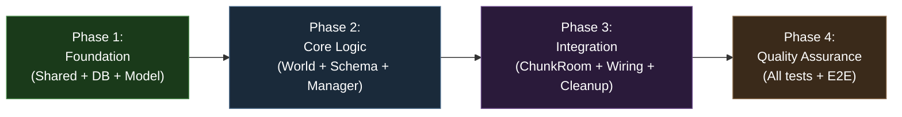
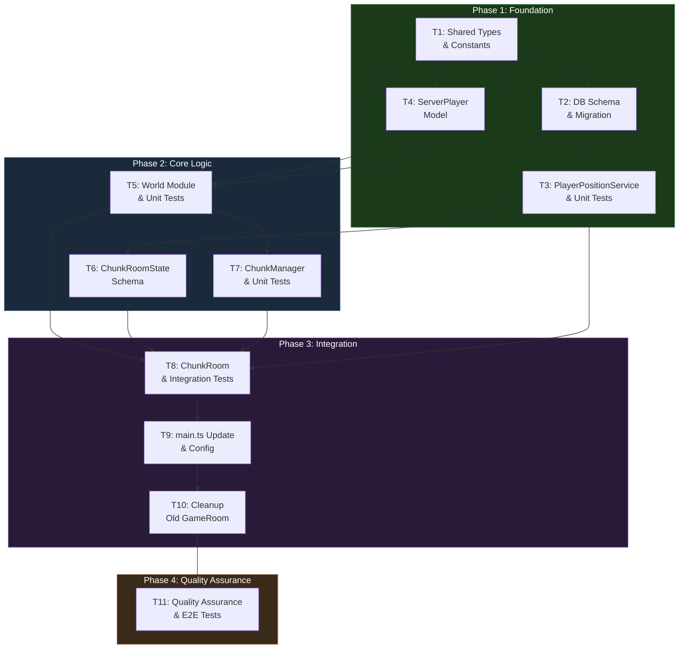

# Work Plan: Chunk-Based Room Architecture Implementation

Created Date: 2026-02-17
Type: feature
Estimated Duration: 5-6 days
Estimated Impact: 17 files (7 new, 6 modified, 4 removed)
Related Issue/PR: PRD-005 / Design-005

## Related Documents

- PRD: [docs/prd/prd-005-chunk-based-room-architecture.md](../prd/prd-005-chunk-based-room-architecture.md)
- ADR: [docs/adr/ADR-0006-chunk-based-room-architecture.md](../adr/ADR-0006-chunk-based-room-architecture.md)
- Design Doc: [docs/design/design-005-chunk-based-room-architecture.md](../design/design-005-chunk-based-room-architecture.md)

## Objective

Replace the single GameRoom architecture with a chunk-based room system where one Colyseus room maps to one world chunk. This establishes the spatial foundation for server-authoritative movement, chunk transitions, position persistence, and all future gameplay systems (NPCs, farming, combat).

## Background

The current single-room GameRoom broadcasts all player state to all connected clients regardless of spatial location, uses client-authoritative movement (no cheat protection, no chunk transition detection), has no position persistence, and has no concept of distinct world locations. This must be replaced with a spatially partitioned system where rooms map to world chunks, the server owns all player state, and positions are persisted across sessions.

## Phase Structure Diagram

## Task Dependency Diagram

## Risks and Countermeasures

### Technical Risks

- **Risk**: Chunk transition race conditions (player briefly in no room or two rooms)
  - **Impact**: Medium -- player invisibility or duplicate state
  - **Detection**: Integration tests for chunk transition flow; World invariant checks
  - **Countermeasure**: World updates chunkId atomically before room transition. Sequential leave-then-join process ensures player is always in exactly one room.

- **Risk**: Colyseus `filterBy` with colon-delimited chunkIds may not work as expected
  - **Impact**: Low -- room routing fails
  - **Detection**: Integration test with actual Colyseus matchmaker
  - **Countermeasure**: Test early in Phase 3. If problematic, encode chunkIds with underscores or use room metadata.

- **Risk**: Move-ack latency via patchRate (100ms) feels unresponsive
  - **Impact**: Medium -- degraded player experience
  - **Detection**: Manual testing during Phase 3
  - **Countermeasure**: Acceptable for walking-speed 2D game. Future mitigation: client-side prediction or reduce patchRate to 50ms.

- **Risk**: Chunk boundary oscillation causing repeated room transitions
  - **Impact**: Medium -- server load spikes and poor UX
  - **Detection**: ChunkManager unit tests with rapid transition attempts
  - **Countermeasure**: ChunkManager implements 500ms cooldown per player. Transitions within cooldown are skipped.

### Schedule Risks

- **Risk**: DB migration complexity delays Phase 1
  - **Impact**: Low -- blocks Phase 3 (ChunkRoom needs PlayerPositionService)
  - **Countermeasure**: Schema is additive only (new table). Follow existing pgTable patterns exactly. Migration is straightforward.

- **Risk**: Colyseus schema decorator issues with TypeScript strict mode
  - **Impact**: Medium -- blocks Phase 2 (ChunkRoomState)
  - **Countermeasure**: Server tsconfig already has `experimentalDecorators: true` and `useDefineForClassFields: false`. Follow existing GameRoomState pattern.

## Reviewer Conditions

These conditions were identified during design review and MUST be addressed during implementation:

1. **filterBy API**: Use chainable `.filterBy(['chunkId'])` on the define call, NOT an options object. Example: `gameServer.define(CHUNK_ROOM_NAME, ChunkRoom).filterBy(['chunkId'])`
2. **PlayerPositionService.savePosition**: Use an object parameter instead of 6 positional parameters. Change the Design Doc signature from `savePosition(db, userId, worldX, worldY, chunkId, direction)` to `savePosition(db, { userId, worldX, worldY, chunkId, direction })`.

## Test Case Resolution Tracking

| Phase | Unit Tests | Integration Tests | E2E Tests | Total |
|-------|-----------|-------------------|-----------|-------|
| Phase 1 | 4/4 (PlayerPositionService) | -- | -- | 4 |
| Phase 2 | 17/17 (World: 11, ChunkManager: 6) | -- | -- | 17 |
| Phase 3 | -- | 5/5 (ChunkRoom.spec.ts) | -- | 5 |
| Phase 4 | -- | -- | 2/2 (chunk-rooms.spec.ts) | 2 |
| **Total** | **21** | **5** | **2** | **28** |

## Implementation Phases

### Phase 1: Foundation -- Shared Types, Database Schema, and Player Model (Estimated commits: 3-4)

**Purpose**: Establish the shared type contracts, database persistence layer, and server-side player model that all subsequent components depend on. This phase has no runtime dependencies on existing server code.

#### Tasks

- [x] **T1: Update shared types and constants** (`packages/shared/src/`)
  - Update `constants.ts`: Add `CHUNK_SIZE = 64`, `CHUNK_ROOM_NAME = 'chunk_room'`, `MAX_SPEED = 5`, `DEFAULT_SPAWN = { worldX: 32, worldY: 32, chunkId: 'city:capital' }`, `WORLD_BOUNDS = { minX: 0, minY: 0, maxX: 1024, maxY: 1024 }`, `CHUNK_TRANSITION_COOLDOWN_MS = 500`, `LocationType` enum
  - Update `types/messages.ts`: Change `MovePayload` from `{ x, y }` to `{ dx: number, dy: number }`, add `ServerMessage.CHUNK_TRANSITION`, add `ChunkTransitionPayload` interface
  - Update `types/room.ts`: Update `PlayerState` fields to `worldX/worldY/chunkId`, add `Location` interface, `MoveResult` (per Design Doc contracts)
  - Update `index.ts`: Export all new types, constants, and enums
  - AC traceability: FR-1, FR-2

- [x] **T2: Create player_positions database schema and migration** (`packages/db/`)
  - Create `packages/db/src/schema/player-positions.ts` with `playerPositions` pgTable (userId FK to users.id, worldX real, worldY real, chunkId varchar, direction varchar, updatedAt timestamp)
  - Update `packages/db/src/schema/index.ts` to export `playerPositions`
  - Generate Drizzle migration via `pnpm drizzle-kit generate`
  - AC traceability: FR-9

- [x] **T3: Create PlayerPositionService with unit tests** (`packages/db/`)
  - Create `packages/db/src/services/player.ts` with `savePosition(db, params)` (upsert using `onConflictDoUpdate`) and `loadPosition(db, userId)` (select by userId)
  - **Reviewer condition**: Use object parameter for `savePosition`: `savePosition(db, { userId, worldX, worldY, chunkId, direction })`
  - Follow existing `findOrCreateUser` pattern from `packages/db/src/services/auth.ts`
  - Write unit tests (4 cases):
    - savePosition: creates new record for new user
    - savePosition: updates existing record (upsert)
    - loadPosition: returns saved position
    - loadPosition: returns null for unknown user
  - AC traceability: FR-9 (AC9.1, AC9.2)
  - Test case resolution: 4/4

- [x] **T4: Create ServerPlayer model** (`apps/server/src/models/Player.ts`)
  - Define `ServerPlayer` interface: `id`, `userId`, `worldX`, `worldY`, `chunkId`, `direction`, `skin`, `name`, `sessionId`
  - Create factory function `createServerPlayer(params): ServerPlayer`
  - AC traceability: FR-4

- [ ] Quality check: `pnpm nx typecheck shared && pnpm nx typecheck db`
- [ ] Quality check: `pnpm nx lint shared && pnpm nx lint db`

#### Phase Completion Criteria

- [ ] All shared constants and types compile without errors
- [x] `player_positions` table schema defined and migration generated
- [ ] PlayerPositionService unit tests pass (4/4)
- [ ] ServerPlayer interface defined with factory function
- [ ] `pnpm nx build shared` succeeds
- [ ] `pnpm nx build db` succeeds

#### Operational Verification Procedures

1. Run `pnpm nx typecheck shared` -- verify zero type errors
2. Run `pnpm nx typecheck db` -- verify zero type errors
3. Run `pnpm nx test db` -- verify PlayerPositionService tests pass
4. Verify `CHUNK_SIZE`, `MAX_SPEED`, `DEFAULT_SPAWN`, `WORLD_BOUNDS` are importable from `@nookstead/shared`
5. Verify `MovePayload` has `dx/dy` fields (not `x/y`)

---

### Phase 2: Core Logic -- World Module, ChunkRoomState, and ChunkManager (Estimated commits: 3)

**Purpose**: Implement the authoritative state management (World singleton), Colyseus schema definition (ChunkRoomState), and room lifecycle manager (ChunkManager). These are the core logic components that ChunkRoom will delegate to.

#### Tasks

- [x] **T5: Create World module with unit tests** (`apps/server/src/world/World.ts`)
  - Implement singleton class with `Map<string, ServerPlayer>` internal storage
  - Methods: `addPlayer(player)`, `removePlayer(playerId)`, `movePlayer(playerId, dx, dy): MoveResult`, `getPlayersInChunk(chunkId)`, `getPlayer(playerId)`
  - Helper: `computeChunkId(worldX, worldY): string`
  - `movePlayer` logic: validate speed (clamp magnitude to `MAX_SPEED`), compute new position, clamp to `WORLD_BOUNDS`, detect chunk change, update direction from dx/dy
  - Write unit tests (`World.spec.ts`, 11 cases):
    1. addPlayer registers player, getPlayer returns it
    2. addPlayer registers player, getPlayersInChunk returns it
    3. removePlayer removes player, getPlayer returns undefined
    4. movePlayer basic movement (dx=3, dy=0 -> worldX increases by 3)
    5. movePlayer speed clamping (dx=100 -> clamped to MAX_SPEED magnitude)
    6. movePlayer bounds clamping (position at edge + delta -> clamped to bound)
    7. movePlayer chunk detection (position crosses CHUNK_SIZE boundary -> chunkChanged=true)
    8. movePlayer no chunk change (position stays in same chunk -> chunkChanged=false)
    9. movePlayer direction derivation (dx>0 -> 'right', dy<0 -> 'up')
    10. movePlayer unknown player returns no-op result
    11. getPlayersInChunk returns empty array for empty chunk
  - AC traceability: FR-1 (AC1.1-1.4), FR-4, FR-6 (AC6.1-6.3), FR-7, FR-10 (AC10.1-10.2)
  - Test case resolution: 11/11

- [x] **T6: Create ChunkRoomState schema** (`apps/server/src/rooms/ChunkRoomState.ts`)
  - `ChunkPlayer extends Schema` with `@type()` decorators for: `id` (string), `worldX` (number), `worldY` (number), `direction` (string), `skin` (string), `name` (string)
  - `ChunkRoomState extends Schema` with `@type({ map: ChunkPlayer }) players = new MapSchema<ChunkPlayer>()`
  - Follow existing `GameRoomState.ts` pattern for decorator usage
  - AC traceability: FR-3, FR-4, FR-8

- [x] **T7: Create ChunkManager with unit tests** (`apps/server/src/world/ChunkManager.ts`)
  - Track active rooms: `Map<chunkId, ChunkRoom>`
  - Methods: `registerRoom(chunkId, room)`, `unregisterRoom(chunkId)`, `getRoom(chunkId)`, `getActiveRoomCount()`
  - Boundary oscillation: `canTransition(playerId): boolean` (500ms cooldown check), `recordTransition(playerId): void`
  - Write unit tests (`ChunkManager.spec.ts`, 6 cases):
    1. registerRoom/unregisterRoom tracks active rooms
    2. getRoom returns registered room
    3. getActiveRoomCount returns accurate count
    4. canTransition returns true when no recent transition
    5. canTransition returns false within cooldown period (500ms)
    6. recordTransition updates last transition time
  - AC traceability: FR-3 (room lifecycle), FR-7 (AC7.3 oscillation)
  - Test case resolution: 6/6

- [ ] Quality check: `pnpm nx typecheck server`
- [ ] Quality check: `pnpm nx lint server`
- [ ] Unit tests: `pnpm nx test server` -- World.spec.ts and ChunkManager.spec.ts pass

#### Phase Completion Criteria

- [ ] World module implements all 5 API methods with correct movement validation
- [ ] `computeChunkId` correctly computes chunk from world coordinates
- [ ] ChunkRoomState compiles with Colyseus schema decorators
- [ ] ChunkManager tracks rooms and implements oscillation cooldown
- [ ] All unit tests pass (17/17: World 11 + ChunkManager 6)
- [ ] `pnpm nx typecheck server` passes

#### Operational Verification Procedures

1. Run `pnpm nx test server` -- verify World.spec.ts passes all 11 test cases
2. Run `pnpm nx test server` -- verify ChunkManager.spec.ts passes all 6 test cases
3. Verify `World.movePlayer` clamps speed: input `dx=100, dy=0` produces movement <= `MAX_SPEED`
4. Verify `World.movePlayer` detects chunk boundary: player at `worldX=63, worldY=0` + `dx=2` returns `chunkChanged: true`
5. Verify `ChunkManager.canTransition` returns `false` within 500ms of last transition

---

### Phase 3: Integration -- ChunkRoom, Server Wiring, and Cleanup (Estimated commits: 3-4)

**Purpose**: Implement the ChunkRoom (the central integration point), wire everything together in main.ts, remove the old GameRoom, and complete the integration test skeleton.

#### Tasks

- [x] **T8: Create ChunkRoom with integration tests** (`apps/server/src/rooms/ChunkRoom.ts`)
  - Implement Colyseus Room lifecycle:
    - `onCreate`: `setState(new ChunkRoomState())`, `setPatchRate(PATCH_RATE_MS)`, register `onMessage('move', handleMove)`, register with ChunkManager
    - `onAuth`: Reuse `verifyNextAuthToken` from `apps/server/src/auth/verifyToken.ts` (identical to GameRoom.onAuth)
    - `onJoin`: Load position from `PlayerPositionService.loadPosition` (or use `DEFAULT_SPAWN`), compute `chunkId`, call `World.addPlayer`, create `ChunkPlayer` in schema state
    - `onLeave`: Call `PlayerPositionService.savePosition` (try/catch, log error on failure), call `World.removePlayer`, remove from schema
    - `handleMove`: Validate payload (dx/dy are numbers), call `World.movePlayer(sessionId, dx, dy)`, update schema `ChunkPlayer`, if `chunkChanged` send `ServerMessage.CHUNK_TRANSITION` to client
    - `onDispose`: Call `ChunkManager.unregisterRoom`
  - Complete integration test skeleton (`ChunkRoom.spec.ts`, 5 cases):
    - INT-1: AC5.1 -- new player placed at default spawn, added to World (AC support: FR-3, FR-5)
    - INT-1: AC5.2 -- returning player placed at saved DB position (AC support: FR-5, FR-9)
    - INT-2: AC6.4 -- move delegates to World, schema updated (AC support: FR-6, FR-8)
    - INT-2: AC7.1 -- chunk boundary crossing triggers transition message (AC support: FR-7)
    - INT-3: AC9.1 -- disconnect saves position, removes from World (AC support: FR-9)
    - INT-3: AC9.3 -- save failure logs error, disconnect completes (AC support: FR-9)
  - AC traceability: FR-3 (AC3.1-3.3), FR-5 (AC5.1-5.3), FR-6 (AC6.4), FR-7 (AC7.1-7.2), FR-8 (AC8.1-8.2), FR-9 (AC9.1-9.3)
  - Test case resolution: 5/5 (integration)

- [x] **T9: Update main.ts and config.ts** (`apps/server/src/`)
  - Update `config.ts`: Add optional config fields if needed (default spawn override, world bounds override)
  - Update `main.ts`:
    - Initialize World singleton after DB init
    - Initialize ChunkManager
    - Replace `gameServer.define(ROOM_NAME, GameRoom)` with `gameServer.define(CHUNK_ROOM_NAME, ChunkRoom).filterBy(['chunkId'])`
    - **Reviewer condition**: Use chainable `.filterBy(['chunkId'])`, NOT options object
    - Retain graceful shutdown pattern (close DB on SIGINT/SIGTERM)
  - AC traceability: FR-3 (room registration)

- [ ] **T10: Remove old GameRoom files and update imports**
  - Delete `apps/server/src/rooms/GameRoom.ts`
  - Delete `apps/server/src/rooms/GameRoomState.ts`
  - Delete `apps/server/src/rooms/GameRoom.spec.ts`
  - Verify no remaining imports reference deleted files
  - Optionally retain `ROOM_NAME` in shared constants for backward compatibility or remove if unused
  - AC traceability: FR-3 ("ChunkRoom replaces the existing GameRoom entirely")

- [ ] Quality check: `pnpm nx typecheck server && pnpm nx typecheck shared && pnpm nx typecheck db`
- [ ] Quality check: `pnpm nx lint server`
- [ ] Quality check: `pnpm nx build server`
- [ ] Integration tests: `pnpm nx test server` -- all tests pass including ChunkRoom.spec.ts

#### Phase Completion Criteria

- [ ] ChunkRoom implements all lifecycle methods (onCreate, onAuth, onJoin, onLeave, onMessage, onDispose)
- [ ] ChunkRoom delegates all state mutations to World API (no direct state manipulation)
- [ ] main.ts registers ChunkRoom with `filterBy(['chunkId'])`
- [ ] Old GameRoom files removed with no dangling imports
- [ ] All integration tests pass (5/5)
- [ ] All unit tests still pass (21/21)
- [ ] `pnpm nx build server` succeeds
- [ ] Server starts without errors

#### Operational Verification Procedures

1. Run `pnpm nx test server` -- verify all tests pass (unit + integration)
2. Run `pnpm nx build server` -- verify server builds successfully
3. Verify ChunkRoom.onAuth rejects invalid tokens (integration test AC5.1 prerequisite)
4. Verify ChunkRoom.onJoin loads position from DB for returning players (integration test AC5.2)
5. Verify ChunkRoom.handleMove updates schema after World.movePlayer (integration test AC6.4)
6. Verify ChunkRoom.handleMove sends CHUNK_TRANSITION on boundary crossing (integration test AC7.1)
7. Verify ChunkRoom.onLeave saves position and removes player even on DB failure (integration test AC9.3)
8. Verify no import errors after GameRoom removal: `pnpm nx typecheck server`

---

### Phase 4: Quality Assurance (Required) (Estimated commits: 1)

**Purpose**: Comprehensive quality verification, E2E test execution, and Design Doc acceptance criteria validation.

#### Tasks

- [ ] **T11: Full quality verification and E2E test execution**
  - Run all quality checks across all affected packages:
    - `pnpm nx test server` -- all unit and integration tests pass
    - `pnpm nx typecheck server && pnpm nx typecheck shared && pnpm nx typecheck db`
    - `pnpm nx lint server && pnpm nx lint shared && pnpm nx lint db`
    - `pnpm nx build shared && pnpm nx build db && pnpm nx build server`
  - Execute E2E tests (execute only, implementation was in previous phases):
    - `apps/game-e2e/src/chunk-rooms.spec.ts`
    - E2E-1: Two-client movement visibility and chunk transition
    - E2E-2: Disconnect and reconnect position persistence
  - Verify all Design Doc acceptance criteria:
    - [ ] AC FR-1: World coordinate system computes correct chunkIds
    - [ ] AC FR-3: ChunkRooms created on demand, disposed when empty
    - [ ] AC FR-5: Join flow loads saved position or assigns default spawn
    - [ ] AC FR-6: Server-authoritative movement with speed/bounds clamping
    - [ ] AC FR-7: Chunk transitions detect boundary crossing
    - [ ] AC FR-8: Event-driven broadcasting (zero traffic when idle)
    - [ ] AC FR-9: Position persistence on disconnect/reconnect
    - [ ] AC FR-10: World API returns correct results
  - Test case resolution: 2/2 (E2E)

- [ ] Verify all Design Doc acceptance criteria achieved
- [ ] All quality checks pass (types, lint, format)
- [ ] All tests pass (unit + integration + E2E)
- [ ] Zero test failures, zero skipped tests

#### Operational Verification Procedures

1. Run `pnpm nx run-many -t lint test build typecheck` -- all targets pass across all projects
2. Start game server: verify ChunkRoom is registered and server logs `[ChunkRoom] Room created` on first connection
3. E2E test: Two clients connect, both see each other in the same chunk
4. E2E test: Client A sends move, Client B sees updated position within 200ms
5. E2E test: Player moves across chunk boundary, transitions to new room
6. E2E test: Player disconnects, reconnects at saved position
7. Verify CI compatibility: all existing CI targets (`lint`, `test`, `build`, `typecheck`, `e2e`) pass

---

## Quality Assurance Summary

- [ ] All staged quality checks completed (zero errors)
- [ ] All unit tests pass (21 cases)
- [ ] All integration tests pass (5 cases)
- [ ] All E2E tests pass (2 cases)
- [ ] Static analysis pass (typecheck, lint)
- [ ] Build success (shared, db, server)
- [ ] Design Doc acceptance criteria satisfied (FR-1 through FR-10)

## Completion Criteria

- [ ] All phases completed (Phase 1 through Phase 4)
- [ ] Each phase's operational verification procedures executed
- [ ] Design Doc acceptance criteria satisfied (all ACs checked)
- [ ] Staged quality checks completed (zero errors)
- [ ] All tests pass (28/28 total: 21 unit + 5 integration + 2 E2E)
- [ ] CI targets pass: `pnpm nx run-many -t lint test build typecheck e2e`
- [ ] Reviewer conditions addressed (filterBy chainable API, savePosition object param)
- [ ] User review approval obtained

## AC-to-Test Traceability Matrix

| Acceptance Criteria | Test Location | Test ID |
|---|---|---|
| FR-1: Coordinate system computes correct chunkIds | World.spec.ts | Unit 4, 7, 8 |
| FR-3: ChunkRoom lifecycle (create/dispose) | ChunkRoom.spec.ts | INT-1 |
| FR-3: Two players in same chunk, one moves, other sees update | ChunkRoom.spec.ts | INT-2 (AC6.4) |
| FR-5: New player at default spawn | ChunkRoom.spec.ts | INT-1 (AC5.1) |
| FR-5: Returning player at saved position | ChunkRoom.spec.ts | INT-1 (AC5.2) |
| FR-6: Basic movement computation | World.spec.ts | Unit 4 |
| FR-6: Speed clamping | World.spec.ts | Unit 5 |
| FR-6: Bounds clamping | World.spec.ts | Unit 6 |
| FR-6: Schema updated with authoritative position | ChunkRoom.spec.ts | INT-2 (AC6.4) |
| FR-7: Chunk boundary detection | World.spec.ts | Unit 7, 8 |
| FR-7: Transition message sent to client | ChunkRoom.spec.ts | INT-2 (AC7.1) |
| FR-7: Oscillation cooldown | ChunkManager.spec.ts | Unit 5, 6 |
| FR-8: Zero broadcast when idle | (implicit via schema patching) | -- |
| FR-9: Position saved on disconnect | ChunkRoom.spec.ts | INT-3 (AC9.1) |
| FR-9: Save failure handled gracefully | ChunkRoom.spec.ts | INT-3 (AC9.3) |
| FR-9: Position restored on reconnect | ChunkRoom.spec.ts | INT-1 (AC5.2) |
| FR-10: getPlayersInChunk returns correct players | World.spec.ts | Unit 1, 2, 11 |
| FR-10: movePlayer returns chunkChanged | World.spec.ts | Unit 7, 8 |
| Full E2E: Two-client movement | chunk-rooms.spec.ts | E2E-1 |
| Full E2E: Disconnect/reconnect persistence | chunk-rooms.spec.ts | E2E-2 |

## Progress Tracking

### Phase 1: Foundation
- Start: YYYY-MM-DD HH:MM
- Complete: YYYY-MM-DD HH:MM
- Notes:

### Phase 2: Core Logic
- Start: YYYY-MM-DD HH:MM
- Complete: YYYY-MM-DD HH:MM
- Notes:

### Phase 3: Integration
- Start: YYYY-MM-DD HH:MM
- Complete: YYYY-MM-DD HH:MM
- Notes:

### Phase 4: Quality Assurance
- Start: YYYY-MM-DD HH:MM
- Complete: YYYY-MM-DD HH:MM
- Notes:

## Notes

- **Implementation strategy**: Horizontal Slice (Foundation-driven) per Design Doc. Bottom-up implementation order dictated by technical dependencies.
- **Commit strategy**: Manual (user decides when to commit). Each task is designed as a logical 1-commit unit.
- **Integration tests**: Created simultaneously with ChunkRoom implementation (Phase 3), NOT as a separate phase.
- **E2E tests**: Executed in Phase 4 after all implementations are complete. Test skeleton already generated at `apps/game-e2e/src/chunk-rooms.spec.ts`.
- **Client-side changes**: Out of scope for this work plan. The game client (`apps/game/`) must be updated separately to send `dx/dy` movement inputs and handle chunk transitions. This is noted in the Design Doc as a separate task.
- **Breaking change**: This is a clean replacement of GameRoom with ChunkRoom. Old and new systems cannot coexist. Client and server changes must be deployed together.
- **Design Doc deviation**: `savePosition` uses object parameter per reviewer condition, differing from Design Doc's 6-positional signature. This is an improvement (clearer API, follows Function Design principles for 3+ parameters).
